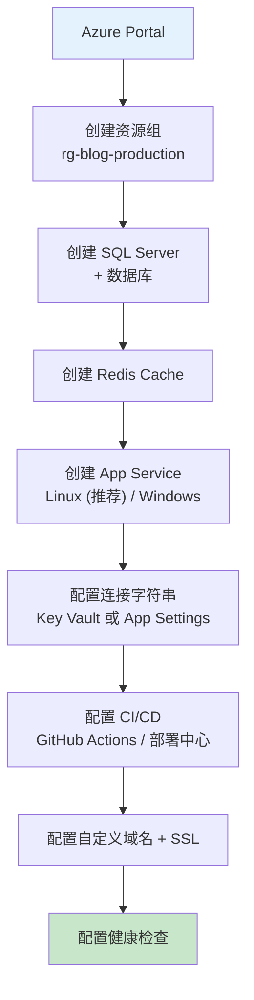

# 博客系统实战 - 部署上线 (IIS / Docker / Azure)

> **项目阶段**：Phase 8 - 生产部署
>
> **核心目标**：将博客系统部署到生产环境，覆盖 IIS 传统部署、Docker 容器化部署和 Azure 云服务三种方案，包含完整的部署检查清单、监控配置和运维最佳实践
>
> **前置知识**：完成前 7 个阶段的所有功能开发
>
> **预计时间**：60分钟

---

## 1. 部署前准备

### 1.1 生产环境配置文件

```json
// appsettings.Production.json（绝不能提交到代码仓库！）
{
  "ConnectionStrings": {
    "DefaultConnection": "Server=tcp:your-sql-server.database.windows.net,1433;Initial Catalog=BlogDb;Persist Security Info=False;User ID=blogadmin;Password=YOUR_STRONG_PASSWORD;MultipleActiveResultSets=False;Encrypt=True;TrustServerCertificate=False;Connection Timeout=30;"
  },
  "Redis": {
    "ConnectionString": "your-redis.redis.cache.windows.net:6380,password=YOUR_REDIS_KEY,ssl=True"
  },
  "JwtSettings": {
    "SecretKey": "YOUR_PRODUCTION_SECRET_KEY_AT_LEAST_32_CHARS_LONG!!!",
    "Issuer": "https://blog.yourdomain.com",
    "Audience": "https://blog.yourdomain.com",
    "AccessTokenExpirationMinutes": 15,
    "RefreshTokenExpirationDays": 7
  },
  "UploadSettings": {
    "MaxFileSizeMB": 5,
    "AllowedExtensions": [".jpg", ".jpeg", ".png", ".gif", ".webp"],
    "UploadPath": "wwwroot/uploads"
  },
  "AllowedOrigins": [
    "https://www.yourdomain.com",
    "https://yourdomain.com",
    "https://admin.yourdomain.com"
  ],
  "Logging": {
    "LogLevel": {
      "Default": "Warning",
      "Microsoft.AspNetCore": "Warning",
      "BlogApi": "Information"
    }
  },
  "Serilog": {
    "WriteTo": [
      { "Name": "Console" },
      {
        "Name": "File",
        "Args": {
          "path": "/var/log/blog-api/log-.txt",
          "rollingInterval": "Day",
          "retainedFileCountLimit": 30
        }
      }
    ]
  }
}
```

### 1.2 数据库迁移脚本生成

```bash
# 生成 SQL 迁移脚本（用于生产环境 DBA 执行）
dotnet ef migrations script \
    --context ApplicationDbContext \
    --output ./Scripts/migration.sql \
    --idempotent

# 验证脚本内容
# 检查生成的 SQL 是否包含：
# - 所有表结构 CREATE TABLE
# - 索引定义 CREATE INDEX
# - 外键约束 ALTER TABLE ... ADD FOREIGN KEY
# - 初始数据 INSERT（如果有种子数据）
```

### 1.3 前端生产构建

```bash
# 如果使用 Vue.js 前端
cd frontend
npm run build   # 输出到 dist/ 目录

# 将构建产物复制到后端 wwwroot 目录
# 或配置为独立的前端静态站点
```

---

## 2. 方案一：IIS 部署

### 2.1 安装 ASP.NET Core Hosting Bundle

```powershell
# 以管理员身份运行 PowerShell

# 下载并安装 Hosting Bundle（包含 .NET Runtime 和 IIS 模块）
# 从 https://dotnet.microsoft.com/download/dotnet 获取最新版本
# 选择 ASP.NET Core Runtime + Hosting Bundle

# 安装完成后重启 IIS
iisreset /restart

# 验证安装成功
& "$env:windir\system32\inetsrv\appcmd.exe" list modules | Select-String AspNetCore
```

### 2.2 发布应用

```bash
# 进入项目根目录
cd src/BlogApi

# 发布为 Release 模式（自包含部署）
dotnet publish -c Release -o ../publish --self-contained false \
    -r win-x64 /p:PublishTrimmed=true

# 发布选项说明：
# --self-contained false = 框架依赖部署（需要服务器安装.NET运行时）
# --self-contained true  = 自包含部署（不需要服务器安装运行时，但体积大）
# PublishTrimmed       = 裁剪未使用的代码以减小体积（需充分测试！）
```

发布后的目录结构：
```
publish/
├── BlogApi.dll              # 主程序集
├── BlogApi.deps.json        # 依赖清单
├── BlogApi.runtimeconfig.json # 运行时配置
├── BlogApi.pdb              # 调试符号（生产可删除）
├── appsettings.json         # 配置文件（需要修改连接字符串）
├── appsettings.Production.json
├── web.config               # IIS 配置文件
├── wwwroot/
│   ├── uploads/             # 上传文件目录
│   └── ...
└── *.dll                    # 依赖的程序集
```

### 2.3 IIS 站点配置

```powershell
# ====== 方法一：PowerShell 自动化配置 ======

$siteName = "BlogApi"
$sitePath = "C:\inetpub\wwwroot\BlogApi\publish"
$port = 8080
$appPoolName = "BlogApiPool"

# 1. 创建应用程序池
New-WebAppPool -Name $appPoolName
Set-ItemProperty -Path "IIS:\AppPools\$appPoolName" `
    -Name "managedRuntimeVersion" -Value ""
Set-ItemProperty -Path "IIS:\AppPools\$appPoolName" `
    -Name "managedPipelineMode" -Value "Integrated"
Set-ItemItemProperty -Path "IIS:\AppPools\$appPoolName" `
    -Name "processModel.identityType" -Value "SpecificUser"
Set-ItemProperty -Path "IIS:\AppPools\$appPoolName" `
    -Name "processModel.userName" -Value "IIS_BlogApiUser"
Set-ItemProperty -Path "IIS:\AppPools\$appPoolName" `
    -Name "processModel.password" -Value "YourSecurePassword!"

# 2. 创建网站
New-Website -Name $siteName -Port $port `
    -PhysicalPath $sitePath -ApplicationPool $appPoolName

# 3. 设置权限
icacls $sitePath /grant "IIS AppPool\$($appPoolName):(OI)(CI)F" /T

Write-Host "IIS 站点创建完成: http://localhost:$port"

# ====== 方法二：手动在 IIS Manager 中操作 ======
# 打开 inetmgr.exe → 网站 → 添加网站 → 配置路径和端口
```

### 2.4 web.config 配置

```xml
<?xml version="1.0" encoding="utf-8"?>
<configuration>
  <location path="." inheritInChildApplications="false">
    <system.webServer>
      <handlers>
        <add name="aspNetCore" path="*" verb="*"
             modules="AspNetCoreModuleV2"
             resourceType="Unspecified" />
      </handlers>

      <!-- ASP.NET Core 模块配置 -->
      <aspNetCore processPath="dotnet"
                  arguments=".\BlogApi.dll"
                  stdoutLogEnabled="false"
                  stdoutLogFile=".\logs\stdout"
                  hostingModel="inprocess"
                  startupTimeLimit="120">
        <environmentVariables>
          <environmentVariable name="ASPNETCORE_ENVIRONMENT" value="Production" />
          <environmentVariable name="DOTNET_PRINT_TELEMETRY_MESSAGE" value="false" />
        </environmentVariables>
      </aspNetCore>

      <!-- 安全头 -->
      <httpProtocol>
        <customHeaders>
          <add name="X-Content-Type-Options" value="nosniff" />
          <add name="X-Frame-Options" value="SAMEORIGIN" />
          <add name="X-XSS-Protection" value="1; mode=block" />
          <add name="Strict-Transport-Security" value="max-age=31536000; includeSubDomains" />
          <add name="Referrer-Policy" value="strict-origin-when-cross-origin" />
        </customHeaders>
      </httpProtocol>

      <!-- 静态文件缓存 -->
      <staticContent>
        <!-- 启用 MIME 类型映射 -->
        <mimeMap fileExtension=".webp" mimeType="image/webp" />
        <clientCache cacheControlMode="UseMaxAge" cacheControlMaxAge="365.00:00:00" />
      </staticContent>

      <!-- URL 重写（将所有请求转发给 API） -->
      <rewrite>
        <rules>
          <rule name="StaticFiles" stopProcessing="true">
            <match url="^(.*\.(css|js|png|jpg|jpeg|gif|ico|svg|woff|woff2|ttf|eot|map|webp))$" />
            </rule>
        </rules>
      </rewrite>
    </system.webServer>
  </location>
</configuration>
```

### 2.5 SSL 证书配置

```powershell
# 使用 Let's Encrypt 免费证书（推荐）
# 安装 win-acme 工具：https://www.win-acme.com/

# 或者使用 IIS 自签名证书（仅测试用）
# IIS Manager → 服务器证书 → 创建自签名证书 → 绑定到网站

# HTTPS 绑定
New-WebBinding -Name "BlogApi" -Port 443 -Protocol https `
    -HostHeader "api.blog.yourdomain.com" -SslFlags 1
```

### 2.6 常见 IIS 问题排查

| 错误码 | 可能原因 | 解决方案 |
|--------|---------|---------|
| **500.19** | web.config 格式错误或模块未安装 | 检查 XML 语法；重装 Hosting Bundle |
| **502.5** | 进程启动失败 | 查看 stdout 日志；检查数据库连接字符串 |
| **404** | 路由问题或文件不存在 | 检查物理路径是否正确；确认端口未被占用 |
| **503** | 应用池停止 | 启动应用池；检查账户密码是否过期 |

```powershell
# 排查命令
# 查看事件日志
Get-WinEvent -FilterHashtable @{LogName='Application'; ProviderName='IIS AspNetCore Module'} -MaxEvents 20

# 查看应用池状态
Get-ChildItem 'IIS:\AppPools' | Format-Table Name, State

# 测试端点
Invoke-RestMethod -Uri http://localhost:8080/api/health -Method Get
```

---

## 3. 方案二：Docker 容器化部署

### 3.1 Dockerfile（多阶段构建）

```dockerfile
# ============================================
# Stage 1: 构建阶段
# ============================================
FROM mcr.microsoft.com/dotnet/sdk:8.0 AS build
WORKDIR /src

# 复制项目文件并还原依赖（利用 Docker 缓存层）
COPY ["BlogApi.csproj", "./"]
RUN dotnet restore

# 复制源代码并发布
COPY . .
RUN dotnet publish "BlogApi.csproj" -c Release \
    -o /app/publish /p:UseAppHost=false

# ============================================
# Stage 2: 运行阶段（精简镜像）
# ============================================
FROM mcr.microsoft.com/dotnet/aspnet:8.0 AS runtime

# 创建非 root 用户（安全最佳实践）
RUN adduser --disabled-password --gecos '' appuser

WORKDIR /app

# 从构建阶段复制发布产物
COPY --from=build /app/publish .

# 设置上传目录权限
RUN mkdir -p /app/wwwroot/uploads && chown -R appuser:appuser /app

# 切换用户
USER appuser

# 暴露端口
EXPOSE 80
EXPOSE 443

# 健康检查
HEALTHCHECK --interval=30s --timeout=10s --start-period=5s --retries=3 \
    CMD curl -f http://localhost/api/health || exit 1

ENTRYPOINT ["dotnet", "BlogApi.dll"]
```

### 3.2 docker-compose.yml

```yaml
version: '3.8'

services:
  # ==================== Blog API ====================
  blog-api:
    build:
      context: .
      dockerfile: Dockerfile
    container_name: blog-api
    restart: unless-stopped
    ports:
      - "5000:80"
      - "5001:443"
    environment:
      - ASPNETCORE_ENVIRONMENT=Production
      - ConnectionStrings__DefaultConnection=Server=db;Database=BlogDb;User Id=sa;Password=YourStrong@Passw0rd!;TrustServerCertificate=True;
      - Redis__ConnectionString=redis:6379
      - JwtSettings__SecretKey=${JWT_SECRET_KEY}
      - JwtSettings__Issuer=https://api.blog.com
      - JwtSettings__Audience=https://blog.com
    volumes:
      - uploads_data:/app/wwwroot/uploads     # 图片持久化
      - logs_data:/var/log/blog-api           # 日志持久化
    depends_on:
      db:
        condition: service_healthy
      redis:
        condition: service_healthy
    networks:
      - blog-network
    healthcheck:
      test: ["CMD", "curl", "-f", "http://localhost/api/health"]
      interval: 30s
      timeout: 10s
      retries: 3
      start_period: 10s

  # ==================== SQL Server ====================
  db:
    image: mcr.microsoft.com/mssql/server:2022-latest
    container_name: blog-db
    restart: unless-stopped
    environment:
      - ACCEPT_EULA=Y
      - MSSQL_SA_PASSWORD=YourStrong@Passw0rd!
    ports:
      - "1433:1433"
    volumes:
      - sqlserver_data:/var/opt/mssql
    networks:
      - blog-network
    healthcheck:
      test: ["CMD-SHELL", "/opt/mssql-tools18/bin/sqlcmd -S localhost -U sa -P '$$MSSQL_SA_PASSWORD' -Q 'SELECT 1'"]
      interval: 15s
      timeout: 5s
      retries: 5

  # ==================== Redis ====================
  redis:
    image: redis:7-alpine
    container_name: blog-redis
    restart: unless-stopped
    command: redis-server --appendonly yes --requirepass ${REDIS_PASSWORD:-redispass123}
    ports:
      - "6379:6379"
    volumes:
      - redis_data:/data
    networks:
      - blog-network
    healthcheck:
      test: ["CMD", "redis-cli", "ping"]
      interval: 10s
      timeout: 3s
      retries: 3

# ==================== Volumes ====================
volumes:
  sqlserver_data:
    driver: local
  redis_data:
    driver: local
  uploads_data:
    driver: local
  logs_data:
    driver: local

networks:
  blog-network:
    driver: bridge
```

### 3.3 Docker 部署命令

```bash
# ====== 构建与启动 ======

# 一键启动所有服务
docker compose up -d --build

# 查看服务状态
docker compose ps
docker compose logs -f blog-api   # 实时查看日志

# 执行数据库迁移（首次启动）
docker compose exec blog-api dotnet ef database update

# ====== 日常运维 ======

# 重启服务
docker compose restart blog-api

# 更新到新版本
docker compose pull && docker compose up -d --build

# 查看资源使用情况
docker stats blog-api blog-db blog-redis

# 备份数据库
docker compose exec db /opt/mssql-tools18/bin/sqlcmd `
    -S localhost -U sa -P 'YourStrong@Passw0rd!' `
    -Q "BACKUP DATABASE [BlogDb] TO DISK='/var/opt/mssql/backup/blog.bak'"

# 清理无用镜像
docker image prune -f

# ====== 故障排查 ======

# 进入容器内部调试
docker compose exec blog-api sh

# 查看容器内环境变量
docker compose exec blog-api env | grep -E "(ASPNETCORE|Connection)"

# 查看网络连通性
docker compose exec blog-api ping db
docker compose exec blog-api ping redis
```

---

## 4. 方案三：Azure App Service 部署

### 4.1 Portal 手动部署



### 4.2 GitHub Actions CI/CD 流水线

```yaml
# .github/workflows/deploy.yml
name: Deploy to Azure

on:
  push:
    branches: [main]

env:
  AZURE_WEBAPP_NAME: blog-api-prod
  AZURE_RESOURCE_GROUP: rg-blog-production

jobs:
  build-and-deploy:
    runs-on: ubuntu-latest

    steps:
      - uses: actions/checkout@v4

      - name: Setup .NET SDK
        uses: actions/setup-dotnet@v4
        with:
          dotnet-version: '8.x'

      - name: Build
        run: dotnet build src/BlogApi/BlogApi.csproj -c Release --no-restore

      - name: Run Tests
        run: dotnet test tests/BlogApi.UnitTests/BlogApi.UnitTests.csproj \
            --no-build --verbosity normal \
            --collect:"XPlat Code Coverage"

      - name: Publish
        run: dotnet publish src/BlogApi/BlogApi.csproj \
            -c Release -o ./publish --self-contained false

      - name: Deploy to Azure Web App
        uses: azure/webapps-deploy@v2
        with:
          app-name: ${{ env.AZURE_WEBAPP_NAME }}
          slot-name: production
          publish-profile: ${{ secrets.AZURE_WEBAPP_PUBLISH_PROFILE }}
          package: ./publish
```

### 4.3 连接字符串配置

```bash
# 方式一：通过 Azure Portal → App Service → Configuration → Connection Strings
# 添加：
# Name: DefaultConnection
# Value: Server=tcp:xxx.database.windows.net;...
# Type: SQL Server

# 方式二：通过 Key Vault（更安全）
# 1. 在 Key Vault 中存储连接字符串作为 Secret
# 2. 在 App Service 的 Identity 中启用 System Assigned Identity
# 3. 添加 Key Vault 引用：
# @Microsoft.KeyVault(VaultName=my-kv;SecretName=connection-string)

# 方式三：通过 CLI
az webapp config connection-string set \
    -g rg-blog-production -n blog-api-prod \
    --settings DefaultConnection="$SQL_CONN_STR" \
    --sql-connection-string-type SQLServer
```

### 4.4 健康检查配置

```json
// 在 Azure Portal → App Service → Health Check 中配置
// Path: /api/health
// Expected status code: 200
// Check interval: 60 seconds
// Unhealthy threshold: 3 consecutive failures
```

---

## 5. 部署检查清单

### 5.1 20项验收标准

```markdown
## 部署验收清单

### 安全性 (5项)
- [ ] **SEC-01**: JWT SecretKey 已更换为强密钥（>=32字符），且不从代码库中泄露
- [ ] **SEC-02**: 数据库密码已更新为生产级强密码
- [ ] **SEC-03**: 已启用 HTTPS（SSL/TLS 证书有效）
- [ ] **SEC-04**: CORS 白名单已限制为生产域名（禁止 * 通配符）
- [ ] **SEC-05**: 详细错误信息已在生产环境关闭（ASPNETCORE_ENVIRONMENT=Production）

### 功能验证 (8项)
- [ ] **FUNC-01**: 用户注册/登录流程正常工作
- [ ] **FUNC-02**: JWT Token 签发和刷新正常
- [ ] **FUNC-03**: 文章 CRUD 操作正常（含图片上传）
- [ ] **FUNC-04**: 评论系统正常（嵌套显示正确）
- [ ] **FUNC-05**: 搜索功能返回正确结果
- [ ] **FUNC-06**: 分页参数边界值处理正确
- [ ] **FUNC-07**: 未认证访问受保护接口返回 401
- [ ] **FUNC-08**: Swagger UI 在开发环境可用、在生产环境禁用

### 性能 (4项)
- [ ] **PERF-01**: 首页加载时间 < 2秒
- [ ] **PERF-02**: API 平均响应时间 < 200ms（不含首屏）
- [ ] **PERF-03**: 数据库查询无 N+1 问题（检查日志中的查询数量）
- [ ] **PERF-04**: 静态资源（JS/CSS/图片）设置了合理的缓存策略

### 可靠性 (3项)
- [ ] **RELI-01**: 健康检查端点 /api/health 正常响应
- [ ] **RELI-02**: 应用崩溃后能自动重启（Docker restart policy / IIS 回收设置）
- [ ] **RELI-03**: 日志系统正常运行且可检索错误信息
```

---

## 6. 监控和日志

### 6.1 Serilog 结构化日志

```csharp
// Program.cs - 生产环境日志配置
Log.Logger = new LoggerConfiguration()
    .ReadFrom.Configuration(builder.Configuration)
    .Enrich.FromLogContext()
    .Enrich.WithMachineName()
    .EnrichWithClientIp()
    .Enrich.WithEnvironmentName()
    .WriteTo.Console(
        outputTemplate: "[{Timestamp:HH:mm:ss} {Level:u3}] [{SourceContext}] {Message:lj}{NewLine}{Exception}")
    // 文件日志（按天滚动）
    .WriteTo.File(
        new CompactJsonFormatter(),
        Path.Combine(logDir, "log-.txt"),
        rollingInterval: RollingInterval.Day,
        retainedFileCountLimit: 30,
        fileSizeLimitBytes: 100 * 1024 * 1024)  // 单文件最大100MB
    // 可选：发送到 Seq（本地日志UI）
    //.WriteTo.Seq("http://localhost:5341")
    // 可选：发送到 Application Insights
    .CreateLogger();
```

### 6.2 Application Insights（Azure）

```csharp
// Program.cs
builder.Services.AddApplicationInsightsTelemetry();
builder.Services.AddApplicationInsightsKubernetesEnricher();

// 自定义遥测
app.Use(async (context, next) =>
{
    var sw = Stopwatch.StartNew();
    await next();
    sw.Stop();

    var telemetry = context.RequestServices.GetRequiredService<TelemetryClient>();
    telemetry.TrackDependency("HTTP Request",
        context.Request.Method,
        context.Request.Path.ToString(),
        DateTime.UtcNow,
        sw.Elapsed,
        context.Response.StatusCode >= 400 ? "Failed" : "Success",
        context.Response.StatusCode.ToString());
});
```

---

## 7. 域名和 DNS 配置

### 7.1 DNS 记录示例

```
# Cloudflare / DNS 提供商配置

类型    名称                      值                                      TTL
A       api                       203.0.113.50                           300
CNAME   www                      api.yourdomain.com                     3600
TXT     _dmarc                    v=DMARC1;p=none;rua=mailto:dmarc@...   3600
```

### 7.2 Let's Encrypt 免费 SSL（Docker 环境）

```bash
# 使用 certbot 或 acme.sh 获取证书
# 这里以 Traefik 为例（自动 HTTPS）

# docker-compose.yml 中添加 Traefik
traefik:
  image: traefik:v2.10
  command:
    - "--providers.docker=true"
    - "--entrypoints.web.address=:80"
    - "--entrypoints.websecure.address=:443"
    - "--certificatesresolvers.myresolver.acme.email=admin@yourdomain.com"
    - "--certificatesresolvers.myresolver.acme.storage=/letsencrypt/acme.json"
    - "--certificatesresolvers.myresolver.acme.httpchallenge.entrypoint=web"
  ports:
    - "80:80"
    - "443:443"
  volumes:
    - letsencrypt:/letsencrypt
    - /var/run/docker.sock:/var/run/docker.sock:ro
```

---

## 8. 项目交付物清单

### 8.1 完整的项目文件清单

```
BlogApi/                          # 最终交付物
├── 📄 README.md                   # 项目说明文档
├── 📄 LICENSE                    # 开源许可证
├── 📄 .gitignore                 # Git 忽略规则
├── 📄 .env.example               # 环境变量模板
├── 📄 docker-compose.yml          # Docker 编排文件
├── 📄 Dockerfile                  # 容器构建文件
├── 📄 .github/workflows/
│   └── deploy.yml                # CI/CD 流水线
│
├── src/BlogApi/                  # 主项目源码 (~5000行)
│   ├── Controllers/              # 8个控制器
│   ├── Services/                 # 8个服务实现
│   ├── Models/                   # 实体 + DTO + 枚举
│   ├── Data/                     # DbContext + Repository
│   ├── Helpers/                  # 工具类
│   ├── Middleware/               # 自定义中间件
│   ├── Program.cs                # 入口点
│   └── appsettings*.json         # 配置文件
│
├── tests/                        # 测试套件
│   ├── BlogApi.UnitTests/        # ~30 个单元测试
│   └── BlogApi.IntegrationTests/ # ~15 个集成测试
│
├── scripts/                      # 运维脚本
│   ├── migration.sql            # 数据库迁移脚本
│   ├── backup-database.ps1       # 数据库备份脚本
│   └── deploy-iis.ps1           # IIS 部署脚本
│
└── docs/                         # 项目文档
    ├── api-reference.md          # API 接口文档
    └── deployment-guide.md       # 部署指南
```

### 8.2 技术指标总结

| 指标 | 数值 |
|------|------|
| 总代码量 | ~5000 行 C# |
| API 端点数 | ~30 个 RESTful 端点 |
| 数据库表 | 7 张核心表 |
| 支持的部署方式 | IIS / Docker / Azure |
| 测试覆盖率目标 | >70% |
| 支持 Docker Compose 一键启动 | 是 |

---

## 总结

至此，整个博客系统的 8 个阶段全部完成：

| 阶段 | 内容 | 关键技术 |
|------|------|---------|
| Phase 1 | 系统设计与技术选型 | ER图、API规划、架构设计 |
| Phase 2 | 用户模块 | JWT、PBKDF2、Token轮换、限流 |
| Phase 3 | 文章模块 | CRUD、Markdown渲染、Base64处理 |
| Phase 4 | 评论模块 | 邻接表、递归树构建、审核机制 |
| Phase 5 | 标签与分类 | 多对多关系、合并拆分、标签云 |
| Phase 6 | 图片上传 | 三重验证、ImageSharp、安全防护 |
| Phase 7 | 搜索功能 | 全文搜索、关键词高亮、结果缓存 |
| Phase 8 | **部署上线** | **IIS/Docker/Azure 三种方案** |

**恭喜你完成了从零开始构建一个完整的企业级博客系统！**

---

**参考资源**：
- [IIS 部署官方文档](https://docs.microsoft.com/en-us/aspnet/core/host-and-deploy/iis/)
- [Docker 官方文档](https://docs.docker.com/)
- [Azure App Service 部署指南](https://docs.microsoft.com/en-us/azure/app-service/)
- [Let's Encrypt](https://letsencrypt.org/) - 免费 SSL 证书
