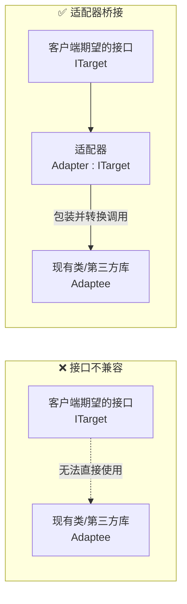
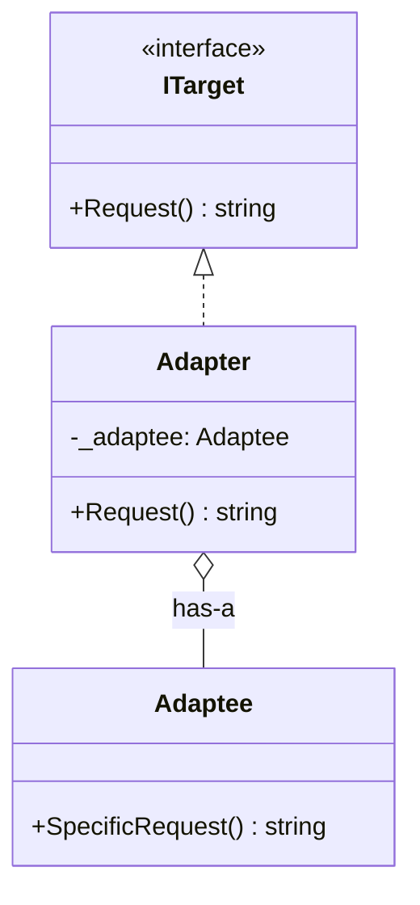
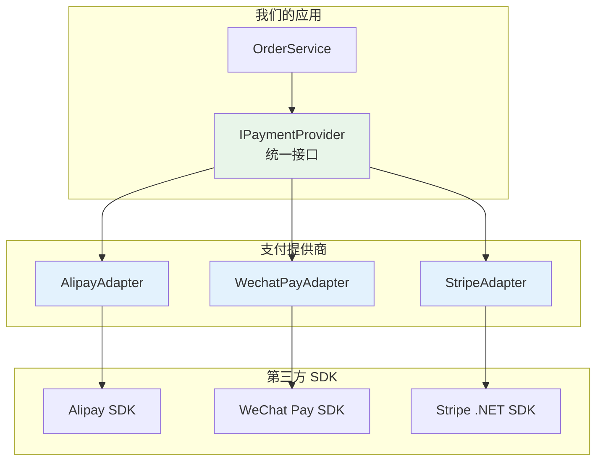
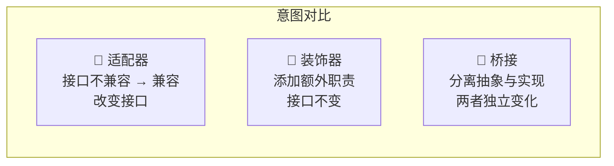

# Adapter Pattern（适配器模式）

## 学习目标

学完本节，你将能够：

- 理解适配器模式的定义和核心思想（接口转换）
- 掌握三种适配器实现方式（类适配器、对象适配器、接口适配器）
- 在 ASP.NET Core 中应用适配器解决实际问题
- 区分适配器、装饰器和桥接模式的差异
- 实现第三方 API 的适配封装

## 前置知识

在开始之前，你需要了解：

- C# 接口定义和实现
- 对象组合（has-a）vs 继承（is-a）
- 第三方 SDK / API 的基本使用方式

---

## 核心内容

### 1. 适配器模式定义

**适配器模式（Adapter Pattern）** 是一种结构型设计模式，它**将一个类的接口转换成客户期望的另一个接口**。就像现实中的电源适配器 -- 让不同标准的插头和插座可以配合工作。



**核心价值**：让原本因接口不兼容而无法协同工作的类可以一起工作。

### 2. 三种适配器实现方式

#### 2.1 对象适配器（最常用）

通过**组合**（持有被适配对象的引用）来实现：



```csharp
/// <summary>
/// 目标接口 -- 客户端期望的接口
/// </summary>
public interface IWeatherService
{
    Task<WeatherInfo> GetWeatherAsync(string city);
    Task<ForecastResult> GetForecastAsync(string city, int days);
}

/// <summary>
/// 被适配者 -- 第三方天气 API SDK（接口不兼容）
/// </summary>
/// <remarks>
/// 假设这是一个第三方库的类，我们无法修改它的源码。
/// 它的接口命名和返回格式与我们系统不一致。
/// </remarks>
public class ThirdPartyWeatherApi
{
    public async Task<ThirdPartyResponse> FetchWeatherData(string locationCode)
    {
        // 第三方 API 的实际调用逻辑...
        var httpClient = new HttpClient();
        var response = await httpClient.GetAsync(
            $"https://api.thirdparty.com/weather?loc={locationCode}");
        var content = await response.Content.ReadAsStringAsync();
        return JsonSerializer.Deserialize<ThirdPartyResponse>(content)!;
    }

    public async Task<ThirdPartyForecastResponse> GetExtendedForecast(
        string locationCode, int dayCount)
    {
        // ...
        return new ThirdPartyForecastResponse();
    }
}

// 第三方 API 的数据模型（我们无法修改）
public record ThirdPartyResponse(
    string loc,
    tmp_info tmp,
    List<daily> daily_forecasts);

public record tmp_info(double cur_temp, double feels_like, string unit);
public record daily(string date, double max_temp, double min_temp, string text);
public record ThirdPartyForecastResponse(List<forecast_item> items);
public record forecast_item(string date, string high, string low, string desc);

/// <summary>
/// 对象适配器 -- 将第三方 API 适配为我们系统的标准接口
/// </summary>
public class ThirdPartyWeatherAdapter : IWeatherService
{
    private readonly ThirdPartyWeatherApi _api;
    private readonly ILogger<ThirdPartyWeatherAdapter> _logger;
    private readonly IDictionary<string, string> _cityCodeMap;

    public ThirdPartyWeatherAdapter(
        ThirdPartyWeatherApi api,
        ILogger<ThirdPartyWeatherAdapter> logger,
        IConfiguration config)
    {
        _api = api;
        _logger = logger;

        // 城市名到城市编码的映射
        _cityCodeMap = config.GetSection("WeatherApi:CityCodes")
            .GetChildren()
            .ToDictionary(x => x.Key, x => x.Value!);
    }

    public async Task<WeatherInfo> GetWeatherAsync(string city)
    {
        // 1. 参数转换：城市名 -> 城市编码
        var locationCode = ResolveCityCode(city);

        _logger.LogDebug("Fetching weather for {City} (code: {Code})", city, locationCode);

        // 2. 调用被适配者
        var rawData = await _api.FetchWeatherData(locationCode);

        // 3. 结果转换：第三方格式 -> 我们的格式
        return MapToWeatherInfo(rawData, city);
    }

    public async Task<ForecastResult> GetForecastAsync(string city, int days)
    {
        var locationCode = ResolveCityCode(city);
        var rawData = await _api.GetExtendedForecast(locationCode, days);

        return MapToForecastResult(rawData, city);
    }

    /// <summary>
    /// 城市名到编码的映射
    /// </summary>
    private string ResolveCityCode(string city)
    {
        if (_cityCodeMap.TryGetValue(city.ToLowerInvariant(), out var code))
            return code;

        throw new NotSupportedException($"City '{city}' is not supported");
    }

    /// <summary>
    /// 数据模型映射：第三方响应 -> 我们的标准模型
    /// </summary>
    private WeatherInfo MapToWeatherInfo(ThirdPartyResponse raw, string city)
    {
        return new WeatherInfo
        {
            City = city,
            Temperature = raw.tmp.cur_temp,
            FeelsLike = raw.tmp.feels_like,
            Unit = raw.tmp.unit == "C" ? TemperatureUnit.Celsius : TemperatureUnit.Fahrenheit,
            Description = raw.daily_forecasts.FirstOrDefault()?.text ?? "N/A",
            UpdatedAt = DateTime.UtcNow,
            Source = "ThirdParty Weather API"
        };
    }

    private ForecastResult MapToForecastResult(ThirdPartyForecastResponse raw, string city)
    {
        return new ForecastResult
        {
            City = city,
            Forecasts = raw.items.Select(item => new DailyForecast
            {
                Date = DateOnly.ParseExact(item.date, "yyyy-MM-dd"),
                HighTemperature = double.Parse(item.high),
                LowTemperature = double.Parse(item.low),
                Description = item.desc
            }).ToList(),
            Source = "Third Party Weather API"
        };
    }
}
```

#### 2.2 类适配器（多重继承，C# 中有限支持）

通过**继承**被适配类同时实现目标接口。由于 C# 不支持多继承，这种形式在 C# 中较少见：

```csharp
// 理论上的类适配器（C# 中需要被适配者是接口或抽象类才可行）
// 如果 Adaptee 是一个接口：
public class ClassAdapter : ThirdPartyWeatherApi, IWeatherService
{
    // 继承了 ThirdPartyWeatherApi 的所有方法
    // 同时实现 IWeatherService 接口
    public async Task<WeatherInfo> GetWeatherAsync(string city)
    {
        var raw = await base.FetchWeatherData(city); // 调用父类方法
        return MapToWeatherInfo(raw, city);
    }
    // ...
}
```

> **注意**：C# 只支持单继承，所以类适配器只有在被适配者是**接口**时才能用。大多数情况下推荐使用对象适配器。

#### 2.3 接口适配器（默认适配器）

当目标接口方法很多，但只需要实现其中几个时，提供一个**抽象的默认实现**：

```csharp
/// <summary>
/// 大型目标接口 -- 有很多方法
/// </summary>
public interface IPaymentGateway
{
    Task<PaymentResult> ChargeAsync(PaymentRequest request);
    Task<RefundResult> RefundAsync(RefundRequest request);
    Task<PaymentStatus> CheckStatusAsync(string transactionId);
    Task<VoidResult> CancelAsync(string transactionId);
    Task<List<Transaction>> GetTransactionHistoryAsync(DateTime from, DateTime to);
    Task<CustomerMethod> AddCustomerMethodAsync(CustomerMethodRequest request);
    Task<VoidResult> RemoveCustomerMethodAsync(string methodId);
    // ... 更多方法
}

/// <summary>
/// 默认适配器 -- 提供方法的空实现或抛出 NotImplementedException
/// </summary>
public abstract class PaymentGatewayAdapter : IPaymentGateway
{
    public virtual Task<PaymentResult> ChargeAsync(PaymentRequest request)
        => throw new NotImplementedException();

    public virtual Task<RefundResult> RefundAsync(RefundRequest request)
        => throw new NotImplementedException();

    public virtual Task<PaymentStatus> CheckStatusAsync(string transactionId)
        => throw new NotImplementedException();

    public virtual Task<VoidResult> CancelAsync(string transactionId)
        => throw new NotImplementedException();

    public virtual Task<List<Transaction>> GetTransactionHistoryAsync(
        DateTime from, DateTime to)
        => throw new NotImplementedException();

    public virtual Task<CustomerMethod> AddCustomerMethodAsync(
        CustomerMethodRequest request)
        => throw new NotImplementedException();

    public virtual Task<VoidResult> RemoveCustomerMethodAsync(string methodId)
        => throw new NotImplementedException();
}

/// <summary>
/// 具体适配器 -- 只重写需要的方法
/// </summary>
public class SimplePaymentAdapter : PaymentGatewayAdapter
{
    private readonly HttpClient _httpClient;

    public SimplePaymentAdapter(HttpClient httpClient)
    {
        _httpClient = httpClient;
    }

    // 只实现我们需要的方法
    public override async Task<PaymentResult> ChargeAsync(PaymentRequest request)
    {
        var response = await _httpClient.PostAsJsonAsync(
            "https://payment.simple.com/charge", request);
        return await response.Content.ReadFromJsonAsync<PaymentResult>();
    }

    public override async Task<RefundResult> RefundAsync(RefundRequest request)
    {
        var response = await _httpClient.PostAsJsonAsync(
            "https://payment.simple.com/refund", request);
        return await response.Content.ReadFromJsonAsync<RefundResult>();
    }
    // 其他方法保持抛出 NotImplementedException 或提供合理的默认行为
}
```

### 3. ASP.NET Core 中的应用场景

#### 场景一：适配第三方 API

这是最常见的使用场景 -- 将不同供应商的 SDK 包装成统一的内部接口：



```csharp
/// <summary>
/// 统一的支付接口
/// </summary>
public interface IPaymentProvider
{
    string ProviderName { get; }
    Task<PaymentResult> ChargeAsync(PaymentRequest request);
    Task<RefundResult> RefundAsync(RefundRequest request);
    Task<bool> VerifyCallbackAsync(IDictionary<string, string> data);
}

/// <summary>
/// 支付宝适配器
/// </summary>
public class AlipayAdapter : IPaymentProvider
{
    public string ProviderName => "Alipay";
    private readonly AlipayClient _client; // 第三方 SDK 的客户端

    public AlipayAdapter(AlipayConfig config)
    {
        _client = new AlipayClient(config.AppId, config.PrivateKey);
    }

    public async Task<PaymentResult> ChargeAsync(PaymentRequest request)
    {
        // 将统一的 PaymentRequest 转换为支付宝特定的请求格式
        var alipayReq = new AlipayTradePagePayRequest
        {
            OutTradeNo = request.OrderId.ToString(),
            TotalAmount = request.Amount.ToString("F2"),
            Subject = request.Description,
            NotifyUrl = config.NotifyUrl,
            ReturnUrl = config.ReturnUrl
        };

        // 调用第三方 SDK
        var alipayResp = await _client.PageExecuteAsync(alipayReq);

        // 将支付宝响应转换为统一的 PaymentResult
        return new PaymentResult
        {
            Success = alipayResp.IsSuccess,
            TransactionId = alipayResp.TradeNo,
            PaymentUrl = alipayResp.Body,
            Provider = ProviderName,
            RawResponse = alipayResp.ToJson()
        };
    }

    public async Task<RefundResult> RefundAsync(RefundRequest request)
    {
        // 类似的适配逻辑...
        return new RefundResult { Success = true };
    }

    public async Task<bool> VerifyCallbackAsync(IDictionary<string, string> data)
    {
        // 使用支付宝 SDK 的签名验证方法
        return await _client.RSACheckV1(data);
    }
}
```

#### 场景二：旧系统适配（遗留代码包装）

将旧的、不符合新架构规范的代码包装成新的标准接口：

```csharp
// ====== 旧代码（遗留系统，不能修改）======
// 这是一个 10 年前写的用户验证服务，使用过时的接口
public class LegacyAuthService
{
    public bool ValidateUser(string username, string plainPassword)
    {
        // 旧式 MD5 密码验证（不安全但正在迁移中）
        var hash = ComputeMd5(plainPassword);
        return CheckAgainstDatabase(username, hash);
    }

    private string ComputeMd5(string input) { /* ... */ }
    private bool CheckAgainstDatabase(string user, string hash) { /* ... */ }
}

// ====== 新系统的标准接口 ======
public interface IAuthenticationService
{
    Task<AuthResult> AuthenticateAsync(LoginRequest request);
    Task<TokenResult> RefreshTokenAsync(string refreshToken);
    Task RevokeTokenAsync(string token);
}

// ====== 适配器：将旧服务包装为新接口 ======
public class LegacyAuthAdapter : IAuthenticationService
{
    private readonly LegacyAuthService _legacyService;
    private readonly IJwtTokenService _jwtService;
    private readonly ILogger<LegacyAuthAdapter> _logger;

    public LegacyAuthAdapter(
        LegacyAuthService legacyService,
        IJwtTokenService jwtService,
        ILogger<LegacyAuthAdapter> logger)
    {
        _legacyService = legacyService;
        _jwtService = jwtService;
        _logger = logger;
    }

    public async Task<AuthResult> AuthenticateAsync(LoginRequest request)
    {
        _logger.LogInformation(
            "Authenticating via legacy system for user: {Username}", request.Username);

        // 调用旧系统的验证方法
        bool isValid = _legacyService.ValidateUser(request.Username, request.Password);

        if (!isValid)
        {
            _logger.LogWarning("Legacy auth failed for user: {Username}", request.Username);
            return AuthResult.Failed("Invalid credentials");
        }

        // 用新的 JWT 服务生成令牌
        var token = await _jwtService.GenerateTokenAsync(request.Username);

        _logger.LogInformation("Legacy auth succeeded for user: {Username}", request.Username);

        return AuthResult.Success(token);
    }

    public Task<TokenResult> RefreshTokenAsync(string refreshToken)
    {
        // 旧系统不支持 token 刷新，委托给 JWT 服务
        return _jwtService.RefreshTokenAsync(refreshToken);
    }

    public Task RevokeTokenAsync(string token)
    {
        return _jwtService.RevokeTokenAsync(token);
    }
}
```

#### 场景三：多数据源适配

```csharp
/// <summary>
/// 统一的数据访问接口
/// </summary>
public interface IDataRepository<T> where T : class
{
    Task<T?> GetByIdAsync(object id);
    Task<IList<T>> GetAllAsync();
    Task<T> AddAsync(T entity);
    Task UpdateAsync(T entity);
    Task DeleteAsync(T entity);
}

/// <summary>
/// SQL Server 数据适配器
/// </summary>
public class SqlServerRepository<T> : IDataRepository<T> where T : class
{
    private readonly DbSet<T> _dbSet;
    private readonly ApplicationDbContext _context;

    public SqlServerRepository(ApplicationDbContext context)
    {
        _context = context;
        _dbSet = context.Set<T>();
    }

    public async Task<T?> GetByIdAsync(object id) =>
        await _dbSet.FindAsync(id);

    public async Task<IList<T>> GetAllAsync() =>
        await _dbSet.ToListAsync();

    public async Task<T> AddAsync(T entity)
    {
        await _dbSet.AddAsync(entity);
        await _context.SaveChangesAsync();
        return entity;
    }

    public async Task UpdateAsync(T entity)
    {
        _dbSet.Update(entity);
        await _context.SaveChangesAsync();
    }

    public async Task DeleteAsync(T entity)
    {
        _dbSet.Remove(entity);
        await _context.SaveChangesAsync();
    }
}

/// <summary>
/// MongoDB 数据适配器 -- 同样的接口，不同的底层存储
/// </summary>
public class MongoDbRepository<T> : IDataRepository<T> where T : class
{
    private readonly IMongoCollection<T> _collection;
    private readonly ILogger<MongoDbRepository<T>> _logger;

    public MongoDbRepository(IMongoDatabase database, string collectionName,
        ILogger<MongoDbRepository<T>> logger)
    {
        _collection = database.GetCollection<T>(collectionName);
        _logger = logger;
    }

    public async Task<T?> GetByIdAsync(object id)
    {
        var filter = Builders<T>.Filter.Eq("_id", id);
        return await _collection.Find(filter).FirstOrDefaultAsync();
    }

    public async Task<IList<T>> GetAllAsync() =>
        await _collection.Find(new BsonDocument()).ToListAsync();

    public async Task<T> AddAsync(T entity)
    {
        await _collection.InsertOneAsync(entity);
        return entity;
    }

    public async Task UpdateAsync(T entity)
    {
        var idProp = typeof(T).GetProperty("Id")!;
        var idValue = idProp.GetValue(entity);
        var filter = Builders<T>.Filter.Eq("_id", idValue);
        await _collection.ReplaceOneAsync(filter, entity);
    }

    public async Task DeleteAsync(T entity)
    {
        var idProp = typeof(T).GetProperty("Id")!;
        var idValue = idProp.GetValue(entity);
        var filter = Builders<T>.Filter.Eq("_id", idValue);
        await _collection.DeleteOneAsync(filter);
    }
}
```

### 4. 双向适配器

双向适配器可以让两个不兼容的接口互相适配：

```csharp
/// <summary>
/// 双向适配器示例：让两种不同格式的数据可以互转
/// </summary>

// 格式A -- 内部系统使用的格式
public interface IFormatA
{
    string SerializeA(DataObject data);
    DataObject DeserializeA(string text);
}

// 格式B -- 外部合作伙伴使用的格式
public interface IFormatB
{
    string SerializeB(ExternalData data);
    ExternalData DeserializeB(string text);
}

// 数据对象
public record DataObject(int Id, string Name, decimal Value, DateTime CreatedAt);
public record ExternalData(string Code, string Label, string Amount, string Timestamp);

/// <summary>
/// 双向适配器 -- 同时实现了两个接口
/// </summary>
public class BidirectionalDataAdapter : IFormatA, IFormatB
{
    // 实现 FormatA 接口
    public string SerializeA(DataObject data)
    {
        // 内部格式 -> 外部格式字符串
        var external = MapToExternal(data);
        return JsonSerializer.Serialize(external);
    }

    public DataObject DeserializeA(string text)
    {
        // 外部格式字符串 -> 内部格式
        var external = JsonSerializer.Deserialize<ExternalData>(text)!;
        return MapFromExternal(external);
    }

    // 实现 FormatB 接口
    public string SerializeB(ExternalData data)
    {
        // 外部格式 -> 内部格式字符串
        var internalObj = MapFromExternal(data);
        return JsonSerializer.Serialize(internalObj);
    }

    public ExternalData DeserializeB(string text)
    {
        // 内部格式字符串 -> 外部格式
        var internalObj = JsonSerializer.Deserialize<DataObject>(text)!;
        return MapToExternal(internalObj);
    }

    // 映射方法
    private static ExternalData MapToExternal(DataObject d) => new(
        d.Id.ToString(), d.Name, d.Value.ToString("F2"),
        d.CreatedAt.ToString("yyyy-MM-ddTHH:mm:ssZ"));

    private static DataObject MapFromExternal(ExternalData e) => new(
        int.Parse(e.Code), e.Label, decimal.Parse(e.Amount),
        DateTime.Parse(e.Timestamp, null, DateTimeStyles.RoundtripKind));
}
```

### 5. 适配器 vs 装饰器 vs 桥接模式

这三个结构型模式容易混淆，关键区别在于**意图**：



| 维度 | 适配器 | 装饰器 | 桥接 |
|------|--------|--------|------|
| **目的** | 接口转换，让不兼容的类协作 | 动态添加职责 | 分离抽象和实现 |
| **是否改变接口** | **是**，转换为另一个接口 | **否**，保持原接口 | **是**，但双方都可变 |
| **包装关系** | 已有类 -> 新接口 | 同接口增强 | 抽象 <-> 实现双向解耦 |
| **何时知道** | 编译时已知不兼容 | 运行时动态决定 | 设计时就计划好分离 |
| **典型场景** | 第三方 SDK 封装 | 日志/缓存/重试 | 多平台 UI / 多数据库驱动 |
| **被包装对象的知情权** | 不知情（被动） | 不知情（被动） | 知情（主动协作） |

**一句话总结**：
- **适配器**：改头换面（换接口）
- **装饰器**：穿衣服（加功能，不改接口）
- **桥接**：搭桥梁（两边都能走，各自独立变化）

---

## 深入理解

> **适配器模式和 Facade（外观模式）有什么区别？**

| 适配器 | Facade |
|--------|--------|
| 1对1：一个适配器适配一个类 | 1对多：一个外观简化多个类的交互 |
| 接口转换：改变接口形状 | 接口简化：提供更简单的高级接口 |
| 客户端看到的是新接口 | 客户端看到的是简化的操作流程 |

> **什么时候不需要适配器？**

如果可以直接修改源码使其符合目标接口，那就不需要适配器。适配器的存在前提是**你无法或不应该修改被适配者的代码**（第三方库、遗留系统、跨团队边界）。

---

## 常见陷阱

### DO / DON'T 清单

| DO (推荐做法) | DON'T (避免做法) |
|---------------|------------------|
| 适配器保持轻量（只做接口转换和数据映射） | 在适配器中加入业务逻辑 |
| 处理适配过程中的异常并提供清晰的错误信息 | 吞掉异常或返回 null |
| 记录适配前后的数据转换日志 | 无声无息地丢失数据精度 |
| 为适配器编写单元测试（Mock 被适配者） | 假设被适配者的行为永远不变 |
| 当第三方 API 升级时更新适配器而非业务代码 | 让适配器的变更影响上层业务逻辑 |
| 使用对象适配器（组合）优先于类适配器（继承） | 强行在 C# 中模拟多继承做类适配器 |

### 错误示例

```csharp
// ❌ 反模式：适配器包含业务逻辑
public class PaymentAdapter : IPaymentProvider
{
    public async Task<PaymentResult> ChargeAsync(PaymentRequest request)
    {
        // ❌ 业务规则校验不应该在适配器里！
        if (request.Amount <= 0)
            throw new Exception("Amount must be positive");

        if (request.Amount > 50000)
            throw new Exception("Amount exceeds limit");

        // ❌ 用户权限检查也不应该在适配器里！
        var user = await _userService.GetUserAsync(request.UserId);
        if (!user.CanMakePayment)
            throw new Exception("User not authorized");

        // 这才是适配器该做的事
        var sdkRequest = MapToSdkFormat(request);
        var sdkResponse = await _sdk.Charge(sdkRequest);
        return MapFromSdkFormat(sdkResponse);
    }
}

// ❌ 反模式：适配器隐藏了重要的错误信息
public class WeatherAdapter : IWeatherService
{
    public async Task<WeatherInfo> GetWeatherAsync(string city)
    {
        try
        {
            var result = await _api.GetData(city);
            return Convert(result);
        }
        catch (Exception)
        {
            // ❌ 返回默认值掩盖了第三方 API 故障
            return new WeatherInfo { City = city, Temperature = 0 };
        }
    }
}
```

### 正确示例

```csharp
// ✅ 正确：适配器只做转换，业务逻辑在外层
public class PaymentAdapter : IPaymentProvider
{
    public async Task<PaymentResult> ChargeAsync(PaymentRequest request)
    {
        // 适配器只负责：
        // 1. 参数转换
        var sdkRequest = MapToSdkFormat(request);

        // 2. 调用被适配者
        var sdkResponse = await _sdk.Charge(sdkRequest);

        // 3. 结果转换
        return MapFromSdkFormat(sdkResponse);
        // 就这么简单！
    }
}

// ✅ 正确：适配器正确处理和传播异常
public class WeatherAdapter : IWeatherService
{
    public async Task<WeatherInfo> GetWeatherAsync(string city)
    {
        try
        {
            var result = await _api.GetData(city);
            return Convert(result);
        }
        catch (HttpRequestException ex)
        {
            // 包装为语义明确的异常向上传播
            throw new WeatherServiceUnavailableException(
                $"Third party weather API unavailable: {ex.Message}", ex);
        }
        catch (JsonException ex)
        {
            throw new WeatherDataParseException(
                $"Failed to parse weather data for city '{city}': {ex.Message}", ex);
        }
    }
}
```

---

## 动手练习

### 练习 1：完成天气 API 适配器

**要求**：
基于前面给出的框架，完善 `ThirdPartyWeatherAdapter` 的以下部分：

1. 添加配置文件 `appsettings.json` 中的城市编码映射
2. 实现完整的 `WeatherInfo` 和 `DailyForecast` 数据模型
3. 在 `Program.cs` 中注册适配器
4. 编写一个 Controller 使用适配后的接口

<details>
<summary>查看答案</summary>

```csharp
// appsettings.json
{
  "WeatherApi": {
    "CityCodes": {
      "beijing": "101010100",
      "shanghai": "101020100",
      "guangzhou": "101280101",
      "shenzhen": "101280601"
    },
    "DefaultCity": "beijing"
  }
}

// 数据模型
public class WeatherInfo
{
    public string City { get; set; } = string.Empty;
    public double Temperature { get; set; }
    public double FeelsLike { get; set; }
    public TemperatureUnit Unit { get; set; }
    public string Description { get; set; } = string.Empty;
    public DateTime UpdatedAt { get; set; }
    public string Source { get; set; } = string.Empty;
}

public enum TemperatureUnit { Celsius, Fahrenheit }

public class ForecastResult
{
    public string City { get; set; } = string.Empty;
    public List<DailyForecast> Forecasts { get; set; } = new();
    public string Source { get; set; } = string.Empty;
}

public class DailyForecast
{
    public DateOnly Date { get; set; }
    public double HighTemperature { get; set; }
    public double LowTemperature { get; set; }
    public string Description { get; set; } = string.Empty;
}

// Program.cs 注册
builder.Services.AddSingleton<ThirdPartyWeatherApi>();
builder.Services.AddSingleton<IWeatherService, ThirdPartyWeatherAdapter>();

// Controller
[ApiController]
[Route("api/[controller]")]
public class WeatherController : ControllerBase
{
    private readonly IWeatherService _weatherService;

    public WeatherController(IWeatherService weatherService)
    {
        _weatherService = weatherService;
    }

    [HttpGet("{city}")]
    public async Task<ActionResult<WeatherInfo>> GetWeather(string city)
    {
        try
        {
            var weather = await _weatherService.GetWeatherAsync(city);
            return Ok(weather);
        }
        catch (NotSupportedException ex)
        {
            return NotFound(ex.Message);
        }
    }

    [HttpGet("{city}/forecast")]
    public async Task<ActionResult<ForecastResult>> GetForecast(
        string city, [FromQuery] int days = 7)
    {
        var forecast = await _weatherService.GetForecastAsync(city, days);
        return Ok(forecast);
    }
}
```

</details>

---

### 练习 2：设计短信服务商适配器

**要求**：
你的系统需要对接多个短信服务商（阿里云短信、腾讯云短信、Twilio），请设计：

1. 统一的 `ISmsProvider` 接口
2. 至少两个适配器实现（如 AliyunSmsAdapter 和 TwilioSmsAdapter）
3. 一个简单的策略选择器来根据配置决定使用哪个服务商

要求考虑：
- 各服务商的参数格式差异（手机号格式、签名方式、模板ID等）
- 发送结果的状态码映射
- 错误处理的统一化

<details>
<summary>查看答案</summary>

```csharp
// 统一接口
public interface ISmsProvider
{
    string ProviderName { get; }
    Task<SmsResult> SendAsync(SmsMessage message);
    Task<SmsDeliveryStatus> QueryStatusAsync(string messageId);
    decimal CalculateCost(SmsMessage message);
}

// 统一消息模型
public class SmsMessage
{
    public string PhoneNumber { get; set; } = string.Empty;
    public string Content { get; set; } = string.Empty;
    public string? TemplateCode { get; set; }
    public Dictionary<string, string>? TemplateParams { get; set; }
}

public class SmsResult
{
    public bool Success { get; set; }
    public string MessageId { get; set; } = string.Empty;
    public string ErrorMessage { get; set; } = string.Empty;
    public decimal Cost { get; set; }
    public string Provider { get; set; } = string.Empty;
}

public enum SmsDeliveryStatus { Pending, Sent, Delivered, Failed, Unknown }

// 阿里云适配器
public class AliyunSmsAdapter : ISmsProvider
{
    public string ProviderName => "AliyunSMS";
    private readonly IAliyunSmsClient _client;

    public AliyunSmsAdapter(IAliyunSmsClient client) => _client = client;

    public async Task<SmsResult> SendAsync(SmsMessage message)
    {
        try
        {
            // 手机号格式转换：+86xxx -> 国际格式
            var formattedPhone = FormatPhoneNumber(message.PhoneNumber);

            // 调用阿里云 SDK
            var response = await _client.SendSmsAsync(new SendSmsRequest
            {
                PhoneNumbers = formattedPhone,
                SignName = _config.SignName,
                TemplateCode = message.TemplateCode ?? _config.DefaultTemplate,
                TemplateParam = message.TemplateParams != null
                    ? JsonSerializer.Serialize(message.TemplateParams)
                    : "{}"
            });

            // 映射结果
            return new SmsResult
            {
                Success = response.Code == "OK",
                MessageId = response.RequestId,
                ErrorMessage = response.Code == "OK" ? "" : response.Message,
                Cost = CalculateCost(message),
                Provider = ProviderName
            };
        }
        catch (Exception ex)
        {
            return new SmsResult
            {
                Success = false,
                ErrorMessage = $"Aliyun SMS error: {ex.Message}",
                Provider = ProviderName
            };
        }
    }

    private string FormatPhoneNumber(string phone) =>
        phone.StartsWith("+86") ? phone : $"+86{phone}";

    public async Task<SmsDeliveryStatus> QueryStatusAsync(string messageId)
    {
        var detail = await _client.QuerySendDetailsAsync(messageId);
        return detail.SendStatus switch
        {
            1 => SmsDeliveryStatus.Sent,
            3 => SmsDeliveryStatus.Delivered,
            2 => SmsDeliveryStatus.Failed,
            _ => SmsDeliveryStatus.Unknown
        };
    }

    public decimal CalculateCost(SmsMessage message) =>
        message.Content.Length <= 70 ? 0.045m : 0.045m * Math.Ceiling(message.Content.Length / 67.0m);
}

// Twilio 适配器（类似结构...）
public class TwilioSmsAdapter : ISmsProvider
{
    public string ProviderName => "Twilio";
    private readonly TwilioRestClient _client;

    public TwilioSmsAdapter(TwilioRestClient client) => _client = client;

    public async Task<SmsResult> SendAsync(SmsMessage message)
    {
        var messageResource = await MessageResource.CreateAsync(
            to: new PhoneNumber(message.PhoneNumber),
            from: new PhoneNumber(_config.FromNumber),
            body: message.Content);

        return new SmsResult
        {
            Success = messageResource.Status != MessageStatus.Failed,
            MessageId = messageResource.Sid,
            ErrorMessage = messageResource.ErrorMessage ?? "",
            Cost = messageResource.Price?.Amount ?? 0,
            Provider = ProviderName
        };
    }

    // ... 其他方法实现
}
```

</details>

---

### 练习 3：分析场景

你的团队接手了一个遗留项目，它使用了 5 个不同的内部库，每个库都有自己的日志接口：

- `LegacyLibA.Logger.Log(msg)` -- void 返回
- `LegacyLibB.Logging.Write(level, msg)` -- 带级别参数
- `LegacyLibC.Trace.Info(msg)` / `.Warn(msg)` / `.Error(msg)` -- 分级方法
- `LegacyLibD.Diagnostics.Emit(eventId, payload)` -- 结构化事件
- `LegacyLibE.Output.Print(msg)` -- 最简单的方式

现在团队想统一使用 Serilog 作为日志框架。请问：

1. 是否适合用适配器模式？
2. 你会如何设计适配方案？
3. 有没有更好的替代方案？

<details>
<summary>查看分析</summary>

**1. 是否适合？是的，非常适合。**

这正是适配器模式的经典应用场景 -- 多个不兼容的接口需要统一为一个标准接口。

**2. 设计方案：**

```csharp
// 目标接口：Serilog 的 ILogger
// 但我们可以先定义一个中间接口
public interface IUnifiedLogger
{
    void LogDebug(string message, params object[] args);
    void LogInformation(string message, params object[] args);
    void LogWarning(string message, params object[] args);
    void LogError(string message, params object[] args);
    void LogError(Exception exception, string message, params object[] args);
}

// 为每个库写一个适配器
public class LegacyLibALoggerAdapter : IUnifiedLogger
{
    private readonly LegacyLibA.Logger _logger;
    public void LogInformation(string message, params object[] args)
        => _logger.Log(string.Format(message, args));
    // 其他方法类似...
}

// 然后用一个代理 logger 将所有调用转发到 Serilog
public class SerilogProxyLogger : IUnifiedLogger
{
    private readonly ILogger _serilogLogger;
    // 实现所有方法，转发到 _serilogLogger
}
```

**3. 更好的替代方案：**

| 方案 | 适用性 |
|------|--------|
| **Serilog Sink** | 如果这些库支持配置日志输出目标，直接写一个 Sink 最好 |
| **Serilog Context / LogContext** | 使用 Serilog 的上下文传递能力 |
| **全局日志重定向** | `Log.SetLogFactory()` 如果库支持的话 |
| **适配器（上述方案）** | 库不支持自定义日志时的最佳选择 |

**最终建议**：先用适配器快速统一，然后逐步将各库升级到支持 Serilog 的版本，最后移除适配器。

</details>

---

## 本节小结

适配器模式是解决**接口不兼容问题**的标准方案。其核心要点包括：

1. **对象适配器是首选**：通过组合（has-a）持有被适配者，比继承更灵活
2. **适配器应保持轻量**：只做接口转换和数据映射，不应包含业务逻辑
3. **常见场景丰富**：第三方 API 封装、遗留系统改造、多数据源切换
4. **双向适配器**可以实现两个方向的接口转换
5. **与装饰器的本质区别**：适配器改变接口，装饰器增强但不改变接口
6. **不要过度使用**：如果能直接修改源码满足需求，就不需要适配器

---

## 延伸阅读

- [[Decorator Pattern(装饰器模式)]] -- 增强行为 vs 改变接口
- [[Strategy Pattern(策略模式)]] -- 适配器常用于包装策略的实现
- [Refactoring Guru: Adapter Pattern](https://refactoring.guru/design-patterns/adapter)
- [Martin Fowler: Adapter Pattern](https://martinfowler.com/eaaCatalog/adapter.html)

## 思考题

1. 适配器模式和 Facade（外观模式）的核心区别是什么？能否举出一个同时使用两者的场景？
2. 当第三方 API 发布了破坏性更新（接口变了），你的适配器应该如何应对？有没有办法减少这种维护成本？
3. 在微服务架构中，API Gateway 中的路由配置是否可以看作一种适配模式？为什么？

---
**[[Decorator Pattern(装饰器模式)]]** | **[[CQRS模式简介]]** | **🏠 [[HOME]]**
