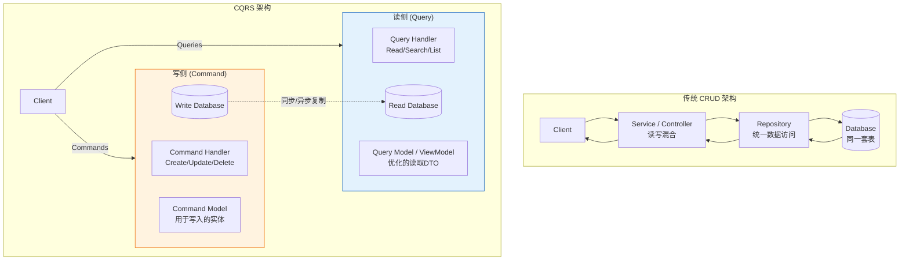
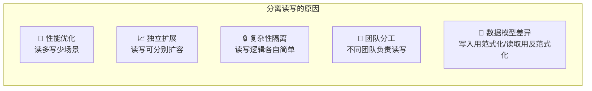
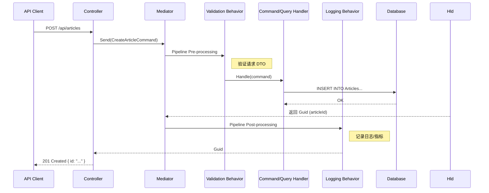
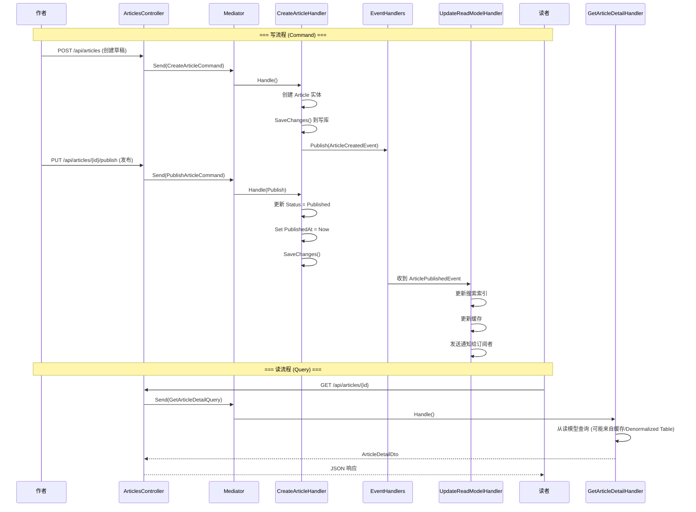
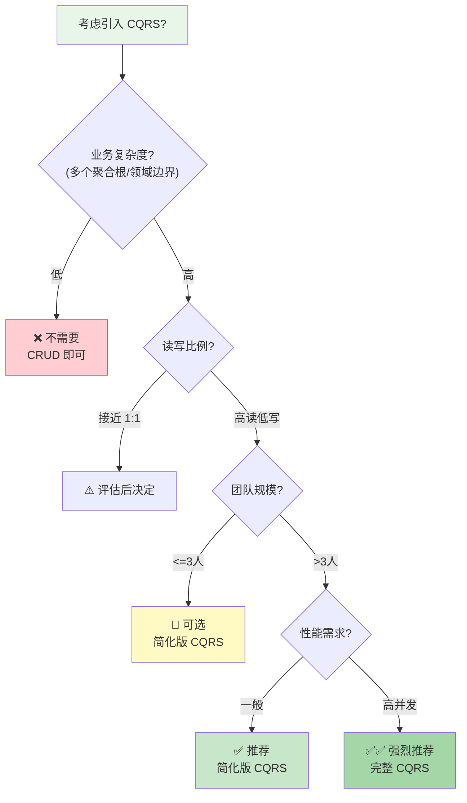
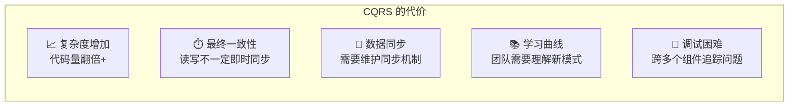

# CQRS 模式简介

## 学习目标

学完本节，你将能够：

- 理解 CQRS 的核心概念：命令查询职责分离
- 掌握 Command（写操作）和 Query（读操作）的设计原则
- 理解为什么分离读写能带来性能优化和架构优势
- 实现简化版 CQRS（同一数据库，不同模型）
- 使用 MediatR 库实现 CQRS 架构
- 判断项目是否值得引入 CQRS，了解其代价

## 前置知识

在开始之前，你需要了解：

- Repository 模式和数据访问层设计
- DTO/ViewModel 与 Entity 的区别
- ASP.NET Core 服务层的基本组织方式

---

## 核心内容

### 1. 什么是 CQRS？

**CQRS = Command Query Responsibility Segregation（命令查询职责分离）**

这是一种架构模式，它将系统的**读操作（Query）和写操作（Command）**彻底分离为两个独立的部分。这不是一个新的模式 -- 它源自 Bertrand Meyer 在 1988 年提出的 **CQS（Command Query Separation）原则**，由 Greg Young 和 Martin Fowler 将其扩展到系统架构层面。



### 2. 核心概念：Command vs Query

#### Command（命令）：写操作

```csharp
/// <summary>
/// Command -- 表示一个写操作的意图
/// 特点：
/// - 不返回数据（或只返回操作结果标识，如 Id）
/// - 改变系统状态
/// - 应该是幂等的（重复执行不产生副作用）
/// </summary>

// ====== 创建文章命令 ======
public record CreateArticleCommand(
    string Title,
    string Content,
    string AuthorId,
    List<string> TagIds,
    ArticleCategory Category
) : IRequest<Guid>; // 返回新创建的文章 ID

// ====== 更新文章命令 ======
public record UpdateArticleCommand(
    Guid ArticleId,
    string? Title,
    string? Content,
    List<string>? TagIds
) : IRequest<Result>;

// ====== 删除文章命令 ======
public record DeleteArticleCommand(
    Guid ArticleId,
    string DeleterId,
    string Reason
) : IRequest<Result>;
```

#### Query（查询）：读操作

```csharp
/// <summary>
/// Query -- 表示一个读操作的请求
/// 特点：
/// - 返回数据但不改变状态
/// - 可以返回任意复杂的数据结构（DTO/ViewModel）
/// - 不应有副作用
/// </summary>

// ====== 获取单篇文章查询 ======
public record GetArticleQuery(Guid ArticleId) : IRequest<ArticleDto?>;

// ====== 获取文章列表查询 ======
public record GetArticlesQuery(
    int Page = 1,
    int PageSize = 20,
    string? Category = null,
    string? SearchKeyword = null,
    string? SortBy = "CreatedAt",
    bool SortDescending = true
) : IRequest<PagedResult<ArticleDto>>;

// ====== 获取文章详情（含作者信息和评论）查询 ======
public record GetArticleDetailQuery(Guid ArticleId) : IRequest<ArticleDetailDto?>;

// ====== 返回的 DTO（读取模型）=====
public record ArticleDto(
    Guid Id,
    string Title,
    string Summary,
    string AuthorName,
    string AuthorAvatarUrl,
    DateTime PublishedAt,
    int ViewCount,
    int CommentCount,
    List<string> Tags,
    ArticleCategory Category
);

public record ArticleDetailDto(
    Guid Id,
    string Title,
    string Content,      // 详情页才包含完整内容
    string Summary,
    AuthorInfo Author,
    DateTime PublishedAt,
    DateTime? LastModifiedAt,
    int ViewCount,
    int LikeCount,
    List<TagInfo> Tags,
    List<CommentDto> Comments // 关联数据一次性加载
);
```

### 3. 为什么分离读写？



#### 详细对比分析

| 维度 | 传统 CRUD | CQRS |
|------|----------|------|
| **数据模型** | 同一套实体用于读写 | 写入用 Entity，读取用 DTO/ViewModel |
| **查询性能** | 可能需要大量 JOIN 或 ORM 开销 | 预先优化的扁平化读取模型 |
| **写入性能** | 受到读取索引等影响 | 可以针对写入优化（更少的约束/索引） |
| **扩展性** | 读写耦合，难以单独扩展 | 读库可以水平扩展（多副本），写库保持单一 |
| **复杂性** | 初期简单，后期随业务增长变复杂 | 初期有一定复杂度，但增长可控 |
| **团队协作** | 所有改动可能冲突 | 读写团队可以并行工作 |
| **适用规模** | 小型~中型应用 | 中型~大型应用 |

### 4. 简化版 CQRS 实现（同一数据库）

对于大多数 ASP.NET Core 应用来说，不需要上完整的分布式 CQRS（事件溯源 + 最终一致性）。**简化版 CQRS** 在同一个数据库中实现读写模型的分离：

```mermaid
graph TB
    subgraph App["应用层"]
        API[API Controllers]
    end

    subgraph Commands["Command 侧 (写)"]
        CH[Command Handlers]
        CM[Command Models<br/>Entity Framework Entities]
    end

    subgraph Queries["Query 侧 (读)"]
        QH[Query Handlers]
        QM[Query Models<br/>Dapper / Raw SQL / Optimized Views]
    end

    subgraph DB[(SQL Server 同一数据库)]

        subgraph WriteTables["写表 (规范化)"]
            WT1[Articles 表]
            WT2[ArticleTags 表]
            WT3[Comments 表]
            WT4[Users 表]
        end

        subgraph ReadOptimization["读优化 (视图/物化视图)"]
            RO1[v_Articles_List 视图]
            RO2[v_Article_Detail 视图]
        end
    end

    API -->|POST/PUT/DELETE| Commands
    API -->|GET| Queries
    CH --> CM --> WriteTables
    QH --> QM --> ReadOptimization
    WriteTables -->|触发器/应用层同步| ReadOptimization

    style Commands fill:#fff3e0
    style Queries fill:#e3f2fd
```

#### 写侧：Command Handler 实现

```csharp
/// <summary>
/// 创建文章的 Command Handler
/// 职责：验证 -> 创建实体 -> 持久化 -> 发布领域事件
/// </summary>
public class CreateArticleCommandHandler : IRequestHandler<CreateArticleCommand, Guid>
{
    private readonly ApplicationDbContext _context;
    private readonly ICurrentUserAccessor _userAccessor;
    private readonly IMediator _mediator;
    private readonly ILogger<CreateArticleCommandHandler> _logger;
    private readonly IEventBus _eventBus;

    public CreateArticleCommandHandler(
        ApplicationDbContext context,
        ICurrentUserAccessor userAccessor,
        IMediator mediator,
        ILogger<CreateArticleCommandHandler> logger,
        IEventBus eventBus)
    {
        _context = context;
        _userAccessor = userAccessor;
        _mediator = mediator;
        _logger = logger;
        _eventBus = eventBus;
    }

    public async Task<Guid> Handle(CreateArticleCommand request, CancellationToken cancellationToken)
    {
        // 1. 业务规则验证
        if (string.IsNullOrWhiteSpace(request.Title))
            throw new ValidationException("Title is required");

        if (request.Title.Length > 200)
            throw new ValidationException("Title must be 200 characters or less");

        // 2. 创建领域实体（写模型）
        var article = new Article
        {
            Id = Guid.NewGuid(),
            Title = request.Title.Trim(),
            Content = request.Content,
            AuthorId = _userAccessor.UserId,
            Status = ArticleStatus.Draft,
            Category = request.Category,
            CreatedAt = DateTime.UtcNow,
            Version = 1
        };

        // 3. 处理标签关联
        foreach (var tagId in request.TagIds)
        {
            article.Tags.Add(new ArticleTag { ArticleId = article.Id, TagId = Guid.Parse(tagId) });
        }

        // 4. 持久化到数据库（写库）
        await _context.Articles.AddAsync(article, cancellationToken);

        // 5. 发布领域事件（通知其他组件）
        await _eventBus.PublishAsync(new ArticleCreatedEvent
        {
            ArticleId = article.Id,
            AuthorId = article.AuthorId,
            Title = article.Title,
            Category = article.Category.ToString()
        });

        await _context.SaveChangesAsync(cancellationToken);

        _logger.LogInformation("Article created: {ArticleId} by {AuthorId}",
            article.Id, article.AuthorId);

        return article.Id; // 返回新创建实体的 ID
    }
}
```

#### 读侧：Query Handler 实现

```csharp
/// <summary>
/// 获取文章列表的 Query Handler
/// 职责：高效查询 -> 映射为 DTO -> 返回
/// 注意：不做任何状态变更！
/// </summary>
public class GetArticlesQueryHandler : IRequestHandler<GetArticlesQuery, PagedResult<ArticleDto>>
{
    private readonly ApplicationDbContext _context;
    private readonly IMapper _mapper; // AutoMapper
    private readonly ILogger<GetArticlesQueryHandler> _logger;

    public GetArticlesQueryHandler(
        ApplicationDbContext context,
        IMapper mapper,
        ILogger<GetArticlesQueryHandler> logger)
    {
        _context = context;
        _mapper = mapper;
        _logger = logger;
    }

    public async Task<PagedResult<ArticleDto>> Handle(
        GetArticlesQuery query, CancellationToken cancellationToken)
    {
        // 构建基础查询 -- 使用优化的读取视图或直接查表
        var dbQuery = _context.Articles
            .AsNoTracking() // 只读查询，不需要变更追踪
            .Include(a => a.Author)
            .Include(a => a.Tags).ThenInclude(t => t.Tag)
            .Where(a => a.Status == ArticleStatus.Published);

        // 应用筛选条件
        if (!string.IsNullOrWhiteSpace(query.Category))
        {
            var category = Enum.Parse<ArticleCategory>(query.Category, true);
            dbQuery = dbQuery.Where(a => a.Category == category);
        }

        if (!string.IsNullOrWhiteSpace(query.SearchKeyword))
        {
            var keyword = query.SearchKeyword.Trim();
            dbQuery = dbQuery.Where(a =>
                a.Title.Contains(keyword) || a.Content!.Contains(keyword));
        }

        // 应用排序
        dbQuery = query.SortBy.ToLowerInvariant() switch
        {
            "viewcount" => query.SortDescending
                ? dbQuery.OrderByDescending(a => a.ViewCount)
                : dbQuery.OrderBy(a => a.ViewCount),
            "title" => query.SortDescending
                ? dbQuery.OrderByDescending(a => a.Title)
                : dbQuery.OrderBy(a => a.Title),
            _ => query.SortDescending // 默认按创建时间
                ? dbQuery.OrderByDescending(a => a.PublishedAt ?? a.CreatedAt)
                : dbQuery.OrderBy(a => a.PublishedAt ?? a.CreatedAt)
        };

        // 总数统计（分页需要）
        var totalCount = await dbQuery.CountAsync(cancellationToken);

        // 分页
        var items = await dbQuery
            .Skip((query.Page - 1) * query.PageSize)
            .Take(query.PageSize)
            .Select(a => new ArticleDto( // 投影为扁平化的 DTO
                a.Id,
                a.Title,
                a.Summary ?? a.Content![..Math.Min(200, a.Content.Length)],
                a.Author!.UserName,
                a.Author.AvatarUrl ?? "/default-avatar.png",
                a.PublishedAt ?? a.CreatedAt,
                a.ViewCount,
                a.Comments.Count,
                a.Tags.Select(t => t.Tag.Name).ToList(),
                a.Category
            ))
            .ToListAsync(cancellationToken);

        _logger.LogDebug(
            "Query articles: Page={Page}, PageSize={Size}, Total={Total}",
            query.Page, query.PageSize, totalCount);

        return new PagedResult<ArticleDto>(items, totalCount, query.Page, query.PageSize);
    }
}
```

### 5. MediatR 实现 CQRS

MediatR 是 .NET 生态中最流行的进程内消息传递库，它与 CQRS 是天然搭档：



```csharp
// Program.cs 注册 MediatR
builder.Services.AddMediatR(typeof(Program).Assembly);

// 注册 Pipeline Behaviors
builder.Services.AddTransient<
    IPipelineBehavior<IRequest<TResponse>, TResponse>,
    ValidationBehavior<TResponse>>();

builder.Services.AddTransient<
    IPipelineBehavior<IRequest<TResponse>, TResponse>,
    LoggingBehavior<TResponse>>();

// ====== Controller 变得极简 ======
[ApiController]
[Route("api/[controller]")]
public class ArticlesController : ControllerBase
{
    private readonly IMediator _mediator;

    public ArticlesController(IMediator mediator)
    {
        _mediator = mediator;
    }

    /// <summary>
    /// 创建文章 (Command)
    /// </summary>
    [HttpPost]
    public async Task<ActionResult<Guid>> CreateArticle(
        [FromBody] CreateArticleRequest request)
    {
        var command = new CreateArticleCommand(
            request.Title,
            request.Content,
            /* authorId from JWT */,
            request.TagIds,
            request.Category
        );

        var articleId = await _mediator.Send(command);
        return CreatedAtAction(nameof(GetArticle), new { id = articleId }, new { id = articleId });
    }

    /// <summary>
    /// 获取文章列表 (Query)
    /// </summary>
    [HttpGet]
    public async Task<ActionResult<PagedResult<ArticleDto>>> GetArticles(
        [FromQuery] GetArticlesRequest request)
    {
        var query = new GetArticlesQuery(
            request.Page,
            request.PageSize,
            request.Category,
            request.SearchKeyword,
            request.SortBy,
            request.SortDescending
        );

        var result = await _mediator.Send(query);
        return Ok(result);
    }

    /// <summary>
    /// 获取文章详情 (Query)
    /// </summary>
    [HttpGet("{id:guid}")]
    public async Task<ActionResult<ArticleDetailDto>> GetArticle(Guid id)
    {
        var query = new GetArticleDetailQuery(id);
        var result = await _mediator.Send(query);

        if (result == null)
            return NotFound();

        return Ok(result);
    }
}
```

### 6. 完整的博客文章发布 CQRS 示例

以下是一个从发布到展示的完整流程：



### 7. 什么时候值得用 CQRS？



**适合 CQRS 的场景**：
- 领域复杂，有明确的聚合根和领域边界
- 读写比例悬殊（如 95% 读 / 5% 写）
- 读操作的性能要求远高于写操作
- 多个团队需要并行开发
- 需要对读模型进行复杂的查询优化
- 微服务架构中服务间的数据同步

**不适合 CQRS 的场景**：
- 简单的 CRUD 应用（用户管理、配置管理等）
- 团队规模小且对 DDD/CQRS 不熟悉
- 数据一致性的实时性要求极高（不能接受任何延迟）
- 项目处于 MVP 阶段，需要快速迭代

### 8. CQRS 的代价



| 代价 | 说明 | 缓解策略 |
|------|------|---------|
| **复杂度增加** | 需要维护两套模型、两套处理逻辑 | 从简化版开始，逐步演进 |
| **最终一致性挑战** | 写入后读取可能看不到最新数据 | 对关键操作使用同步更新；非关键操作允许短暂延迟 |
| **数据同步开销** | 写模型变化需要同步到读模型 | 使用数据库触发器、消息队列或应用层同步 |
| **调试复杂度** | 一个业务操作跨越多个组件 | 完善的日志、分布式追踪、CorrelationId |
| **过度工程风险** | 简单场景强行套用得不偿失 | 严格评估后再引入 |

---

## 深入理解

> **CQRS 和 Event Sourcing（事件溯源）的关系？**

CQRS 和 ES 经常一起被提及，但它们是**独立的模式**：
- **CQRS** 关注的是读写分离
- **ES** 关注的是将所有状态变更存储为事件序列

你可以：
- 用 CQRS 但不用 ES（最常见，本文介绍的方案）
- 用 ES 但不用 CQRS（较少见）
- 同时使用两者（最复杂也最强大）

> **简化版 CQRS vs 完整 CQRS？**

| 维度 | 简化版 | 完整版 |
|------|--------|--------|
| **数据库** | 同一个数据库，不同的表/视图 | 写库和读库分开（甚至不同类型） |
| **同步方式** | 同步（同一事务内）或准实时异步 | 通过消息队列最终一致 |
| **读模型** | SQL 视图、物化视图、Dapper 直接查询 | 独立的 NoSQL 文档库（MongoDB/Elasticsearch）、预计算的缓存 |
| **复杂度** | 中等 | 高 |
| **适用范围** | 大多数 Web 应用 | 高并发、大规模分布式系统 |

---

## 常见陷阱

### DO / DON'T 清清单

| DO (推荐做法) | DON'T (避免做法) |
|---------------|------------------|
| Command 不返回业务数据（只返回 Id/成功失败） | Command Handler 里做复杂的查询再返回 |
| Query 绝不修改状态（纯函数式思维） | 在 Query Handler 里调用 SaveChanges() |
| 保持 Command 和 Query 的 DTO 独立 | 共享同一个 DTO 用于读写 |
| 从简化版开始，逐步演进 | 一上来就上完整的分布式 CQRS |
| 明确标注哪些操作是 Command 哪些是 Query | 混淆读写操作导致数据不一致 |
| 为读模型建立专门的优化（视图/反范式化） | 让读操作去 JOIN 大量表 |
| 处理好最终一致性的用户体验 | 假设写入后立即能读到 |

### 错误示例

```csharp
// ❌ 反模式：在 Command 中返回大量数据
public record GetOrCreateUserCommand(string Email, string Name) : IRequest<UserDto>;
// 这应该是 Query！如果不存在则创建是业务逻辑，应该拆分为两个操作

// ❌ 反模式：在 Query 中修改状态
public class GetArticleViewCountHandler : IRequestHandler<GetArticleQuery, ArticleDto>
{
    public async Task<ArticleDto> Handle(GetArticleQuery query, ...)
    {
        var article = await _context.Articles.FindAsync(query.Id);

        // ❌ 在 Query Handler 中修改了状态！
        article.ViewCount += 1;
        await _context.SaveChangesAsync(); // 严重违反 CQRS 原则！

        return MapToDto(article);
    }
}

// ✅ 正确做法：浏览计数通过事件/单独的 IncrementViewCountCommand 处理
public class IncrementViewCountCommandHandler : IRequestHandler<IncrementViewCountCommand>
{
    public async Task Handle(IncrementViewCountCommand cmd, ...)
    {
        var article = await _context.Articles.FindAsync(cmd.ArticleId);
        article.ViewCount += 1;
        await _context.SaveChangesAsync();
    }
}

// ❌ 反模式：Command 和 Query 共享同一个大 DTO
public record ArticleData(
    Guid Id, string Title, string Content, // ...
); // 既用于创建又用于显示

// ✅ 正确：分离为 Command DTO 和 Query DTO
public record CreateArticleCommand(...); // 只包含创建需要的字段
public record ArticleDto(...);          // 只包含展示需要的字段
```

---

## 动手练习

### 练习 1：为评论模块实现 CQRS

**要求**：
基于以下需求，实现评论模块的 CQRS 架构：

**Command 操作**：
- `CreateCommentCommand` -- 发表评论（需要验证文章是否存在、检查是否重复评论）
- `DeleteCommentCommand` -- 删除评论（只能删除自己的或管理员删除）

**Query 操作**：
- `GetCommentsQuery` -- 获取某篇文章的评论列表（分页，按时间正序/倒序）
- `GetCommentCountQuery` -- 获取某篇文章的评论总数（用于文章列表展示）

要求：
1. 定义所有 Command 和 Query 类
2. 实现 Command Handler 和 Query Handler
3. 在 Controller 中使用 MediatR 调用

<details>
<summary>查看答案</summary>

```csharp
// ====== Commands ======
public record CreateCommentCommand(
    Guid ArticleId,
    string Content,
    Guid? ParentCommentId  // 支持嵌套回复
) : IRequest<Guid>;

public record DeleteCommentCommand(
    Guid CommentId,
    Guid UserId,
    UserRole Role
) : IRequest<Result>;

// ====== Queries ======
public record GetCommentsQuery(
    Guid ArticleId,
    int Page = 1,
    int PageSize = 20,
    SortOrder Order = SortOrder.Ascending
) : IRequest<PagedResult<CommentDto>>;

public record GetCommentCountQuery(Guid ArticleId) : IRequest<int>;

// ====== DTOs ======
public record CommentDto(
    Guid Id,
    string Content,
    string AuthorName,
    string AuthorAvatarUrl,
    DateTime CreatedAt,
    int LikeCount,
    List<CommentDto>? Replies  // 嵌套回复
);

public enum SortOrder { Ascending, Descending }

// ====== CreateCommentCommandHandler ======
public class CreateCommentCommandHandler
    : IRequestHandler<CreateCommentCommand, Guid>
{
    private readonly ApplicationDbContext _context;
    private readonly ICurrentUserAccessor _userAccessor;

    public async Task<Guid> Handle(CreateArticleCommand cmd, CancellationToken ct)
    {
        // 1. 验证文章存在
        var article = await _context.Articles.FindAsync(new object[] { cmd.ArticleId }, ct)
            ?? throw new NotFoundException("Article not found");

        // 2. 如果是回复，验证父评论存在
        if (cmd.ParentCommentId.HasValue)
        {
            var parentExists = await _context.Comments.AnyAsync(
                c => c.Id == cmd.ParentCommentId.Value && c.ArticleId == cmd.ArticleId, ct);
            if (!parentExists) throw new NotFoundException("Parent comment not found");
        }

        // 3. 创建评论实体
        var comment = new Comment
        {
            Id = Guid.NewGuid(),
            ArticleId = cmd.ArticleId,
            Content = cmd.Content.Trim(),
            AuthorId = _userAccessor.UserId,
            ParentCommentId = cmd.ParentCommentId,
            CreatedAt = DateTime.UtcNow
        };

        await _context.Comments.AddAsync(comment, ct);
        await _context.SaveChangesAsync(ct);

        return comment.Id;
    }
}

// ====== GetCommentsQueryHandler ======
public class GetCommentsQueryHandler
    : IRequestHandler<GetCommentsQuery, PagedResult<CommentDto>>
{
    private readonly ApplicationDbContext _context;

    public async Task<PagedResult<CommentDto>> Handle(
        GetCommentsQuery q, CancellationToken ct)
    {
        var query = _context.Comments
            .AsNoTracking()
            .Include(c => c.Author)
            .Where(c => c.ArticleId == q.ArticleId && c.ParentCommentId == null)
            .OrderBy(c => q.Order == SortOrder.Ascending
                ? c.CreatedAt
                : c.CreatedAt descending);

        var total = await query.CountAsync(ct);
        var items = await query
            .Skip((q.Page - 1) * q.PageSize)
            .Take(q.PageSize)
            .Select(c => new CommentDto(
                c.Id, c.Content, c.Author.UserName,
                c.Author.AvatarUrl ?? "", c.CreatedAt,
                c.LikeCount, null
            ))
            .ToListAsync(ct);

        return new PagedResult<CommentDto>(items, total, q.Page, q.PageSize);
    }
}
```

</details>

---

### 练习 2：分析何时该引入 CQRS

请分析以下三个项目是否应该引入 CQRS，并说明理由：

1. **内部员工管理系统**（1000 用户，增删改查员工信息、部门管理、考勤记录）
2. **电商平台**（百万级商品，高并发浏览，下单/支付/退款流程复杂）
3. **个人博客系统**（个人使用，每天几篇文章，少量评论）

<details>
<summary>查看分析</summary>

**1. 内部员工管理系统：不需要 CQRS**

理由：
- 典型的 CRUD 系统，业务逻辑简单
- 用户量小，性能不是瓶颈
- 读写比例接近 1:1
- 引入 CQRS 会增加不必要的复杂度
- 传统三层架构 + Repository 就足够了

**2. 电商平台：强烈推荐 CQRS**

理由：
- 读写比例极端（浏览 vs 下单可能是 100:1 甚至更高）
- 商品展示需要高度优化的读模型（搜索、推荐、分类筛选）
- 下单流程涉及库存、支付、物流等多个写操作
- 不同子系统可以独立扩展（搜索集群、订单服务等）
- 团队通常较大，读写分离有利于并行开发
- 推荐简化版 CQRS 起步，必要时升级到完整版

**3. 个人博客系统：可选，但大多数情况下不需要**

理由：
- 数据量极小，任何架构都能轻松应对
- 个人开发，没有团队协作需求
- 如果纯粹为了学习 CQRS，可以作为练手项目
- 如果追求快速上线，传统 CRUD 更高效
- 建议：如果想学 CQRS，可以用博客作为实验项目；如果只是想建站，不要自找麻烦

</details>

---

## 本节小结

CQRS 是一种强大的架构模式，其核心价值在于**将读和写的关注点完全分离**，使两边都可以独立优化。关键要点：

1. **Command = 写**：改变状态，不返回数据（或仅返回标识符）
2. **Query = 读**：返回数据，绝不改变状态
3. **模型分离**：写模型用规范化的 Entity，读模型用优化的 DTO/ViewModel
4. **从简化版开始**：同一数据库、同步/准实时同步即可满足大多数需求
5. **MediatR 是最佳搭档**：天然支持 Request/Response/Handler/Pipeline 模式
6. **不要过度工程**：评估实际需求后再决定是否引入

---

## 延伸阅读

- [[MediatR库实践]] -- CQRS 的标准实现工具
- [[Repository Pattern(仓储模式)]] -- 写侧的数据访问基础
- [[Unit of Work(工作单元)]] -- Command 事务管理
- [Microsoft Docs: CQRS Pattern](https://docs.microsoft.com/en-us/azure/architecture/patterns/cqrs)
- [Greg Young: CQRS Documents](https://cqrs.files.wordpress.com/2010/11/cqrs_documents.pdf)
- [Martin Fowler: CQRS](https://martinfowler.com/bliki/CQRS.html)

## 思考题

1. 在简化版 CQRS 中，如何保证写操作完成后读操作能立即看到最新数据？有哪些同步策略？
2. CQRS 中的"读模型"能否直接使用 EF Core 的 Projection（`.Select()` 投影）？还是应该用 Dapper/Raw SQL？各有什么优劣？
3. 如果你的团队决定引入 CQRS，你会如何制定迁移策略？（直接重写还是渐进式迁移？）

---
**[[Adapter Pattern(适配器模式)]]** | **[[MediatR库实践]]** | **🏠 [[HOME]]**
