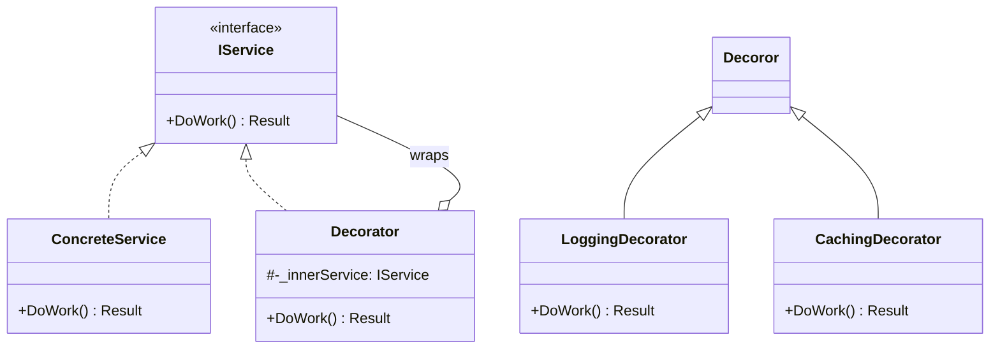
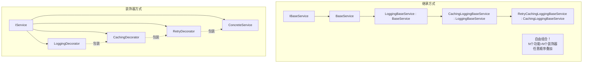
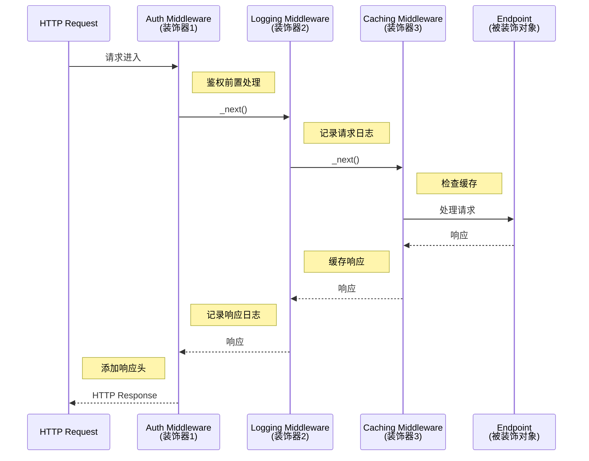
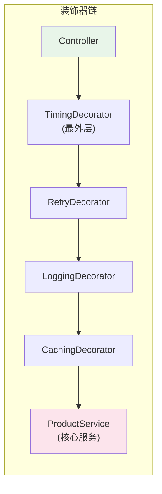
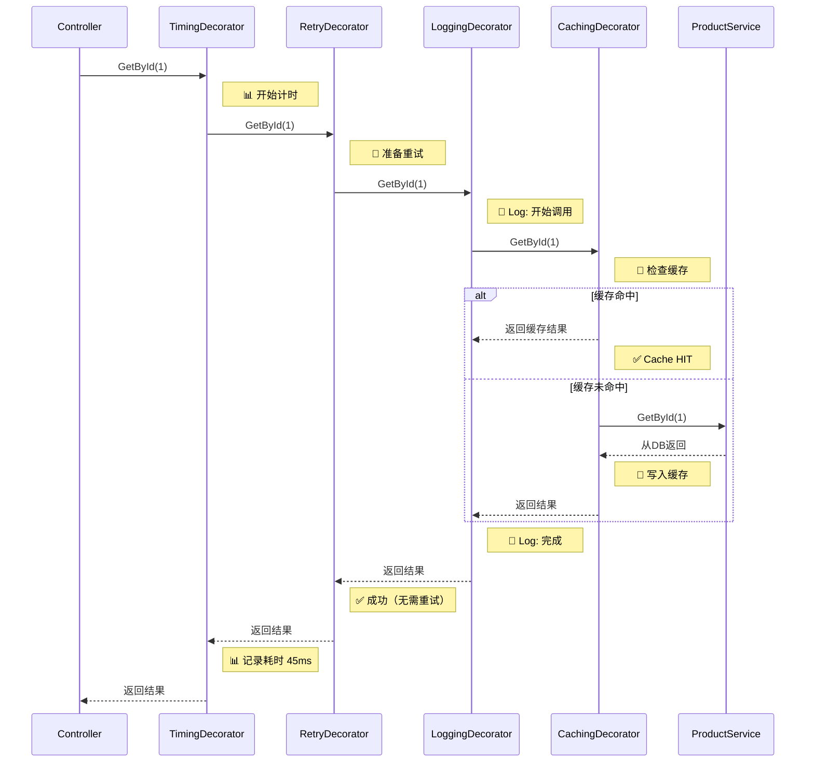

# Decorator Pattern（装饰器模式）

## 学习目标

学完本节，你将能够：

- 理解装饰器模式的定义和核心设计思想（动态添加职责）
- 掌握装饰器与继承的本质区别（组合优于继承）
- 认识到 ASP.NET Core 中间件管道就是装饰器模式的体现
- 实现实用的自定义装饰器（日志、缓存、重试、计时）
- 理解装饰器链的叠加效果
- 了解 DynamicProxy 库的基本用法

## 前置知识

在开始之前，你需要了解：

- C# 接口定义和实现
- 依赖注入和构造函数注入
- ASP.NET Core 中间件管道的基本概念

---

## 核心内容

### 1. 装饰器模式定义

**装饰器模式（Decorator Pattern）** 是一种结构型设计模式，它允许你**在不改变对象自身结构的情况下，动态地给对象添加额外的职责**。就像给礼物包装彩纸 -- 礼物本身不变，但包装后有了新的外观。



**核心思想**：
- 装饰器和被装饰对象实现**同一个接口**
- 装饰器内部持有被装饰对象的引用
- 装饰器在调用被装饰对象的前后**添加额外行为**

### 2. 与继承的区别

这是理解装饰器模式的关键对比：



| 对比维度 | 继承 | 装饰器 |
|---------|------|--------|
| **绑定时机** | 编译时静态绑定 | 运行时动态组合 |
| **灵活性** | 固定，需要预知所有组合 | 高度灵活，可任意组合 |
| **类爆炸问题** | N 个功能 = 2^N - 1 个子类 | N 个功能 = N 个装饰器 |
| **功能粒度** | 每个子类包含所有父类行为 | 每个装饰器只关注一个职责 |
| **适用场景** | "is-a" 关系 | "has-a" + 增强关系 |

### 3. 中间件管道就是装饰器模式！

如果你用过 ASP.NET Core 的中间件，那你已经在使用装饰器模式了：



每个中间件都做了同样的事情：
1. 在调用 `_next()` 之前做**前置处理**
2. 调用 `_next()` 将请求传给下一个中间件
3. 在 `_next()` 返回之后做**后置处理**

这就是装饰器模式的精髓！

### 4. 自定义装饰器实战

#### 基础设施代码

```csharp
/// <summary>
/// 被装饰的服务接口
/// </summary>
public interface IProductService
{
    Task<Product?> GetByIdAsync(Guid id);
    Task<List<Product>> GetAllAsync();
    Task<Product> CreateAsync(CreateProductRequest request);
    Task UpdateAsync(Guid id, UpdateProductRequest request);
    Task DeleteAsync(Guid id);
}

/// <summary>
/// 具体服务实现（核心业务逻辑）
/// </summary>
public class ProductService : IProductService
{
    private readonly IProductRepository _repo;
    private readonly IUnitOfWork _unitOfWork;
    private readonly ILogger<ProductService> _logger;

    public ProductService(
        IProductRepository repo,
        IUnitOfWork unitOfWork,
        ILogger<ProductService> logger)
    {
        _repo = repo;
        _unitOfWork = unitOfWork;
        _logger = logger;
    }

    public async Task<Product?> GetByIdAsync(Guid id)
    {
        return await _repo.GetByIdAsync(id);
    }

    public async Task<List<Product>> GetAllAsync()
    {
        return await _repo.GetAll().ToListAsync();
    }

    public async Task<Product> CreateAsync(CreateProductRequest request)
    {
        var product = new Product
        {
            Id = Guid.NewGuid(),
            Name = request.Name,
            Price = request.Price,
            Category = request.Category,
            CreatedAt = DateTime.UtcNow
        };

        await _repo.AddAsync(product);
        await _unitOfWork.CommitAsync();

        _logger.LogInformation("Product created: {ProductId}", product.Id);
        return product;
    }

    public async Task UpdateAsync(Guid id, UpdateProductRequest request)
    {
        var product = await _repo.GetByIdAsync(id)
            ?? throw new NotFoundException(nameof(Product), id);

        product.Name = request.Name ?? product.Name;
        if (request.Price.HasValue) product.Price = request.Price.Value;

        _repo.Update(product);
        await _unitOfWork.CommitAsync();
        return product;
    }

    public async Task DeleteAsync(Guid id)
    {
        await _repo.DeleteAsync(id);
        await _unitOfWork.CommitAsync();
    }
}
```

#### 4.1 日志装饰器

```csharp
/// <summary>
/// 日志装饰器 -- 为任何服务自动记录方法调用的入参和出参
/// </summary>
public class LoggingDecorator<T> : T where T : class
{
    private readonly T _inner;
    private readonly ILogger<LoggingDecorator<T>> _logger;

    public LoggingDecorator(T inner, ILogger<LoggingDecorator<T>> logger)
    {
        _inner = inner;
        _logger = logger;
    }

    // 注意：这里需要为每个方法编写委托方法
    // 后面会介绍 DynamicProxy 可以自动化这个过程
}
```

对于具体接口的手动装饰器实现：

```csharp
/// <summary>
/// 手动实现的日志装饰器
/// </summary>
public class ProductServiceLoggingDecorator : IProductService
{
    private readonly IProductService _inner;
    private readonly ILogger _logger;

    public ProductServiceLoggingDecorator(
        IProductService inner, ILogger logger)
    {
        _inner = inner;
        _logger = logger;
    }

    public async Task<Product?> GetByIdAsync(Guid id)
    {
        _logger.LogDebug("GetByIdAsync called with id={Id}", id);

        try
        {
            var stopwatch = Stopwatch.StartNew();
            var result = await _inner.GetByIdAsync(id);
            stopwatch.Stop();

            _logger.LogInformation(
                "GetByIdAsync completed in {ElapsedMs}ms. Result={HasValue}",
                stopwatch.ElapsedMilliseconds, result != null);

            return result;
        }
        catch (Exception ex)
        {
            _logger.LogError(ex, "GetByIdAsync failed for id={Id}", id);
            throw; // 重新抛出，保持异常传播
        }
    }

    public async Task<List<Product>> GetAllAsync()
    {
        _logger.LogDebug("GetAllAsync called");

        var stopwatch = Stopwatch.StartNew();
        var result = await _inner.GetAllAsync();
        stopwatch.Stop();

        _logger.LogInformation(
            "GetAllAsync returned {Count} items in {ElapsedMs}ms",
            result.Count, stopwatch.ElapsedMilliseconds);

        return result;
    }

    public async Task<Product> CreateAsync(CreateProductRequest request)
    {
        _logger.LogInformation("CreateAsync called: {@Request}", request);

        var result = await _inner.CreateAsync(request);

        _logger.LogInformation("CreateAsync completed: ProductId={Id}", result.Id);
        return result;
    }

    public async Task UpdateAsync(Guid id, UpdateProductRequest request)
    {
        _logger.LogDebug("UpdateAsync called for id={Id}, {@Request}", id, request);

        var result = await _inner.UpdateAsync(id, request);

        _logger.LogDebug("UpdateAsync completed for id={Id}", id);
        return result;
    }

    public async Task DeleteAsync(Guid id)
    {
        _logger.LogWarning("DeleteAsync called for id={Id}", id);

        await _inner.DeleteAsync(id);

        _logger.LogWarning("DeleteAsync completed for id={Id}", id);
    }
}
```

#### 4.2 缓存装饰器

```csharp
/// <summary>
/// 缓存装饰器 -- 为查询方法添加缓存能力
/// </summary>
public class ProductServiceCachingDecorator : IProductService
{
    private readonly IProductService _inner;
    private readonly IMemoryCache _cache;
    private readonly CacheOptions _options;
    private readonly ILogger _logger;

    public ProductServiceCachingDecorator(
        IProductService inner,
        IMemoryCache cache,
        IOptions<CacheOptions> options,
        ILogger logger)
    {
        _inner = inner;
        _cache = cache;
        _options = options.Value;
        _logger = logger;
    }

    public async Task<Product?> GetByIdAsync(Guid id)
    {
        var cacheKey = $"product:{id}";

        // 尝试从缓存获取
        if (_cache.TryGetValue(cacheKey, out Product? cached))
        {
            _logger.LogDebug("Cache HIT for key={CacheKey}", cacheKey);
            return cached;
        }

        // 缓存未命中，调用内部服务
        _logger.LogDebug("Cache MISS for key={CacheKey}", cacheKey);
        var product = await _inner.GetByIdAsync(id);

        if (product != null)
        {
            // 写入缓存
            var options = new MemoryCacheEntryOptions
            {
                AbsoluteExpirationRelativeToNow =
                    TimeSpan.FromMinutes(_options.ProductCacheMinutes),
                SlidingExpiration = TimeSpan.FromMinutes(_options.ProductSlidingMinutes),
                Priority = CacheItemPriority.Normal
            };

            // 缓存过期时移除回调
            options.RegisterPostEvictionCallback((key, value, reason, state) =>
            {
                _logger.LogDebug(
                    "Cache entry {Key} evicted. Reason: {Reason}", key, reason);
            });

            _cache.Set(cacheKey, product, options);
        }

        return product;
    }

    public async Task<List<Product>> GetAllAsync()
    {
        const string cacheKey = "products:all";

        if (_cache.TryGetValue(cacheKey, out List<Product>? cached))
        {
            _logger.LogDebug("Cache HIT for all products");
            return cached!;
        }

        var products = await _inner.GetAllAsync();

        _cache.Set(cacheKey, products, TimeSpan.FromMinutes(_options.ListCacheMinutes));
        return products;
    }

    // 写操作直接透传，同时清除相关缓存
    public async Task<Product> CreateAsync(CreateProductRequest request)
    {
        var result = await _inner.CreateAsync(request);

        // 清除列表缓存（因为新增了商品）
        _cache.Remove("products:all");
        _logger.LogDebug("Cleared list cache after create");

        return result;
    }

    public async Task UpdateAsync(Guid id, UpdateProductRequest request)
    {
        var result = await _inner.UpdateAsync(id, request);

        // 清除该商品的缓存和列表缓存
        _cache.Remove($"product:{id}");
        _cache.Remove("products:all");
        _logger.LogDebug("Cleared caches after update for id={Id}", id);

        return result;
    }

    public async Task DeleteAsync(Guid id)
    {
        await _inner.DeleteAsync(id);

        // 清除所有相关缓存
        _cache.Remove($"product:{id}");
        _cache.Remove("products:all");
        _logger.LogDebug("Cleared caches after delete for id={Id}", id);
    }
}

public class CacheOptions
{
    public int ProductCacheMinutes { get; set; } = 30;
    public int ProductSlidingMinutes { get; set; } = 10;
    public int ListCacheMinutes { get; set; } = 5;
}
```

#### 4.3 重试装饰器

```csharp
/// <summary>
/// 重试装饰器 -- 为可能失败的操作添加自动重试机制
/// </summary>
public class ProductServiceRetryDecorator : IProductService
{
    private readonly IProductService _inner;
    private readonly RetryOptions _options;
    private readonly ILogger _logger;

    public ProductServiceRetryDecorator(
        IProductService inner,
        IOptions<RetryOptions> options,
        ILogger logger)
    {
        _inner = inner;
        _options = options.Value;
        _logger = logger;
    }

    public async Task<Product?> GetByIdAsync(Guid id)
    {
        return await ExecuteWithRetryAsync(() => _inner.GetByIdAsync(id),
            $"GetByIdAsync({id})");
    }

    public async Task<List<Product>> GetAllAsync()
    {
        return await ExecuteWithRetryAsync(() => _inner.GetAllAsync(),
            "GetAllAsync()");
    }

    public async Task<Product> CreateAsync(CreateProductRequest request)
    {
        return await ExecuteWithRetryAsync(() => _inner.CreateAsync(request),
            $"CreateAsync({request.Name})");
    }

    public async Task UpdateAsync(Guid id, UpdateProductRequest request)
    {
        return await ExecuteWithRetryAsync(() => _inner.UpdateAsync(id, request),
            $"UpdateAsync({id})");
    }

    public async Task DeleteAsync(Guid id)
    {
        await ExecuteWithRetryAsync(() => _inner.DeleteAsync(id),
            $"DeleteAsync({id})");
    }

    /// <summary>
    /// 核心重试逻辑
    /// </summary>
    private async Task<T> ExecuteWithRetryAsync<T>(
        Func<Task<T>> operation, string operationName)
    {
        int retryCount = 0;
        TimeSpan delay = _options.InitialDelay;

        while (true)
        {
            try
            {
                return await operation();
            }
            catch (Exception ex) when (
                _options.RetryableExceptions.Any(t => t.IsInstanceOfType(ex)) &&
                retryCount < _options.MaxRetries)
            {
                retryCount++;
                _logger.LogWarning(ex,
                    "Operation {Operation} failed (attempt {Attempt}/{MaxAttempts}). " +
                    "Retrying in {DelayMs}ms...",
                    operationName, retryCount, _options.MaxRetries,
                    delay.TotalMilliseconds);

                await Task.Delay(delay);
                delay = TimeSpan.FromMilliseconds(
                    delay.TotalMilliseconds * _options.BackoffMultiplier);
            }
        }
    }

    private async Task ExecuteWithRetryAsync(
        Func<Task> operation, string operationName)
    {
        int retryCount = 0;
        TimeSpan delay = _options.InitialDelay;

        while (true)
        {
            try
            {
                await operation();
                return;
            }
            catch (Exception ex) when (
                _options.RetryableExceptions.Any(t => t.IsInstanceOfType(ex)) &&
                retryCount < _options.MaxRetries)
            {
                retryCount++;
                _logger.LogWarning(ex,
                    "Operation {Operation} failed (attempt {Attempt}/{MaxAttempts}).",
                    operationName, retryCount, _options.MaxRetries);

                await Task.Delay(delay);
                delay = TimeSpan.FromMilliseconds(
                    delay.TotalMilliseconds * _options.BackoffMultiplier);
            }
        }
    }
}

public class RetryOptions
{
    public int MaxRetries { get; set; } = 3;
    public TimeSpan InitialDelay { get; set; } = TimeSpan.FromSeconds(1);
    public double BackoffMultiplier { get; set; } = 2.0; // 指数退避
    public List<Type> RetryableExceptions { get; set; } = new()
    {
        typeof(HttpRequestException),
        typeof(TimeoutException),
        typeof(SqlException),
        typeof(OperationCanceledException)
    };
}
```

#### 4.4 计时装饰器

```csharp
/// <summary>
/// 计时装饰器 -- 测量每个方法的执行时间并上报指标
/// </summary>
public class ProductServiceTimingDecorator : IProductService
{
    private readonly IProductService _inner;
    private readonly IMetricsCollector _metrics;
    private readonly ILogger _logger;

    public ProductServiceTimingDecorator(
        IProductService inner,
        IMetricsCollector metrics,
        ILogger logger)
    {
        _inner = inner;
        _metrics = metrics;
        _logger = logger;
    }

    public async Task<Product?> GetByIdAsync(Guid id)
    {
        using var timer = StartTimer("product_service.get_by_id");
        return await _inner.GetByIdAsync(id);
    }

    public async Task<List<Product>> GetAllAsync()
    {
        using var timer = StartTimer("product_service.get_all");
        return await _inner.GetAllAsync();
    }

    public async Task<Product> CreateAsync(CreateProductRequest request)
    {
        using var timer = StartTimer("product_service.create");
        return await _inner.CreateAsync(request);
    }

    public async Task UpdateAsync(Guid id, UpdateProductRequest request)
    {
        using var timer = StartTimer("product_service.update");
        return await _inner.UpdateAsync(id, request);
    }

    public async Task DeleteAsync(Guid id)
    {
        using var timer = StartTimer("product_service.delete");
        await _inner.DeleteAsync(id);
    }

    private IDisposable StartTimer(string operationName)
    {
        var stopwatch = Stopwatch.StartNew();
        return new TimerDisposable(stopwatch, operationName, _metrics, _logger);
    }

    /// <summary>
    /// 用于 using 语句的计时器，Dispose 时记录耗时
    /// </summary>
    private class TimerDisposable : IDisposable
    {
        private readonly Stopwatch _stopwatch;
        private readonly string _operationName;
        private readonly IMetricsCollector _metrics;
        private readonly ILogger _logger;
        private bool _disposed = false;

        public TimerDisposable(
            Stopwatch stopwatch, string operationName,
            IMetricsCollector metrics, ILogger logger)
        {
            _stopwatch = stopwatch;
            _operationName = operationName;
            _metrics = metrics;
            _logger = logger;
        }

        public void Dispose()
        {
            if (_disposed) return;
            _disposed = true;

            _stopwatch.Stop();
            var elapsedMs = _stopwatch.Elapsed.TotalMilliseconds;

            // 上报到监控系统
            _metrics.RecordHistogram(
                "method_duration_ms",
                elapsedMs,
                new Dictionary<string, string> { ["operation"] = _operationName });

            // 同时记录到日志（慢查询告警）
            if (elapsedMs > 1000)
            {
                _logger.LogWarning(
                    "Slow operation detected: {Operation} took {ElapsedMs}ms",
                    _operationName, elapsedMs);
            }
            else
            {
                _logger.LogDebug(
                    "Operation {Operation} completed in {ElapsedMs}ms",
                    _operationName, elapsedMs);
            }
        }
    }
}
```

### 5. 装饰器链（多个装饰器叠加）

装饰器的真正威力在于可以**自由组合多个装饰器**。通过 DI 注册的顺序控制装饰器的嵌套关系：



```csharp
// Program.cs -- 注册装饰器链
// ⚠️ 注册顺序很重要！最后注册的最先执行（最外层）

// 1. 注册核心服务
builder.Services.AddScoped<IProductService, ProductService>();

// 2. 注册装饰器（从内到外的顺序）
builder.Services.Decorate<IProductService, ProductServiceCachingDecorator>();
builder.Services.Decorate<IProductService, ProductServiceLoggingDecorator>();
builder.Services.Decorate<IProductService, ProductServiceRetryDecorator>();
builder.Services.Decorate<IProductService, ProductServiceTimingDecorator>();

// 需要使用 Scrutor 库来支持 .Decorate() 方法
// dotnet add package Scrutor
```

**执行流程图解**（以 `GetById` 为例）：



### 6. DynamicProxy 简介

手动编写装饰器最大的问题是：**每个方法都要写一遍委托代码**。当接口方法很多时，这非常繁琐。DynamicProxy 库可以通过运行时代理自动生成装饰器。

#### Castle DynamicProxy

```bash
dotnet add package Castle.Core
```

```csharp
using Castle.DynamicProxy;

/// <summary>
/// 通用的日志拦截器 -- 自动应用于所有接口方法
/// </summary>
public class LoggingInterceptor : IInterceptor
{
    private readonly ILogger _logger;

    public LoggingInterceptor(ILogger logger)
    {
        _logger = logger;
    }

    public void Intercept(IInvocation invocation)
    {
        var methodName = invocation.MethodInvocationTarget?.Name
                       ?? invocation.Method.Name;

        try
        {
            _logger.LogDebug(
                "Calling {Method} with args: {@Args}",
                methodName, invocation.Arguments);

            var stopwatch = Stopwatch.StartNew();

            // 执行原方法
            invocation.Proceed();

            stopwatch.Stop();

            _logger.LogInformation(
                "{Method} completed in {ElapsedMs}ms. Return type: {ReturnType}",
                methodName, stopwatch.ElapsedMilliseconds,
                invocation.ReturnValue?.GetType()?.Name ?? "void");
        }
        catch (Exception ex)
        {
            _logger.LogError(ex,
                "{Method} threw exception: {Message}",
                methodName, ex.Message);
            throw; // 保持原始异常传播
        }
    }
}

/// <summary>
/// 使用 ProxyGenerator 创建代理实例
/// </summary>
public static class ProxyFactory
{
    private static readonly ProxyGenerator _generator = new();

    public static TInterface CreateProxy<TInterface>(
        TInterface target,
        params IInterceptor[] interceptors) where TInterface : class
    {
        return _generator.CreateInterfaceProxyWithTarget(target, interceptors);
    }
}

// 使用示例
var productService = new ProductService(repo, unitOfWork, logger);

var loggingInterceptor = new LoggingInterceptor(logger);
var cachingInterceptor = new CachingInterceptor(cache, cacheOptions, logger);

// 自动生成代理，无需手写每个方法的委托
IProductService decorated = ProxyFactory.CreateProxy(
    productService,
    loggingInterceptor,
    cachingInterceptor);

// 调用时自动经过拦截器
var product = await decorated.GetByIdAsync(guid); // 自动经过日志+缓存拦截器
```

#### System.DispatchProxy（.NET 内置，无需第三方库）

```csharp
using System.Reflection;

/// <summary>
/// 基于 DispatchProxy 的通用装饰器工厂
/// </summary>
public class DispatchProxyDecorator<T> : DispatchProxy where T : class
{
    private T? _inner;
    private Action<string, object?[], object?, Exception?>? _interceptor;

    public static T Create(
        T inner,
        Action<string, object?[], object?, Exception?>? interceptor = null)
    {
        var proxy = Create<T, DispatchProxyDecorator<T>>();
        proxy._inner = inner;
        proxy._interceptor = interceptor;
        return (T)(object)proxy;
    }

    protected override object? Invoke(MethodInfo? targetMethod, object?[]? args)
    {
        var methodName = targetMethod?.Name ?? "unknown";
        object? result = null;
        Exception? exception = null;

        try
        {
            // 调用拦截器（前置通知）
            _interceptor?.Invoke(methodName, args, null, null);

            // 调用实际方法
            result = targetMethod?.Invoke(_inner, args);

            // 如果是异步方法，需要特殊处理
            if (result is Task task)
            {
                return AwaitTask(task, methodName);
            }

            // 调用拦截器（后置通知）
            _interceptor?.Invoke(methodName, args, result, null);

            return result;
        }
        catch (Exception ex)
        {
            exception = ex.InnerException ?? ex;
            _interceptor?.Invoke(methodName, args, null, exception);
            throw;
        }
    }

    private async Task AwaitTask(Task task, string methodName)
    {
        await task.ConfigureAwait(false);

        var taskType = task.GetType();
        if (taskType.IsGenericType && taskType.GetGenericTypeDefinition() == typeof(Task<>))
        {
            var resultProperty = taskType.GetProperty("Result");
            var result = resultProperty?.GetValue(task);
            _interceptor?.Invoke(methodName, null!, result, null);
        }
        else
        {
            _interceptor?.Invoke(methodName, null!, null, null);
        }
    }
}

// 使用
IProductService service = DispatchProxyDecorator<IProductService>.Create(
    new ProductService(...),
    (methodName, args, result, ex) =>
    {
        if (ex != null)
            Console.WriteLine($"{methodName} FAILED: {ex.Message}");
        else
            Console.WriteLine($"{methodName} OK");
    });
```

---

## 深入理解

> **装饰器 vs 中间件有什么区别？**

本质上它们是同一个模式的不同表现形式：

| 维度 | 中间件 | 装饰器 |
|------|--------|--------|
| **作用范围** | 整个 HTTP 请求管道 | 单个服务的方法级别 |
| **粒度** | 粗粒度（请求级） | 细粒度（方法级） |
| **操作对象** | HttpContext | 服务接口方法 |
| **组合方式** | `app.UseXxx()` 有序链式注册 | DI `.Decorate()` 或手动嵌套 |
| **典型用途** | 认证、授权、CORS、异常处理 | 缓存、日志、重试、计时 |

> **什么时候该用手动装饰器 vs DynamicProxy？**

| 场景 | 推荐 |
|------|------|
| 接口方法少（<=5个），且各方法逻辑差异大 | 手动装饰器 |
| 接口方法多（>10个），且装饰逻辑统一 | DynamicProxy |
| 需要精确控制某些方法的行为 | 手动装饰器 |
| 需要 AOP 式的横切关注点（日志/权限/事务） | DynamicProxy |
| 团队不熟悉 DynamicProxy / 不想引入新依赖 | 手动装饰器 + Scrutor |

---

## 常见陷阱

### DO / DON'T 清单

| DO (推荐做法) | DON'T (避免做法) |
|---------------|------------------|
| 装饰器与被装饰对象实现同一接口 | 改变接口签名或添加新方法 |
| 每个装饰器只做一件事（单一职责） | 一个装饰器混合日志+缓存+重试 |
| 正确传播异常（不要吞掉异常） | 在装饰器中 catch 但不 rethrow |
| 使用 Scrutor 的 `.Decorate()` 管理注册顺序 | 手动在构造函数中 new 装饰器（绕过 DI） |
| 注意装饰器顺序对行为的影响 | 忽略装饰器执行顺序 |
| 写操作穿透缓存装饰器（清除缓存而非读取） | 缓存装饰器缓存写操作的返回值 |
| 使用 DynamicProxy 减少样板代码 | 为简单场景引入 DynamicProxy（过度工程） |

### 错误示例

```csharp
// ❌ 反模式：装饰器中吞掉异常
public async Task<Product?> GetByIdAsync(Guid id)
{
    try
    {
        return await _inner.GetByIdAsync(id);
    }
    catch (Exception ex)
    {
        _logger.LogError(ex, "Error"); // 记录了但没抛出！
        return null; // ❌ 调用方不知道发生了错误
    }
}

// ❌ 反模式：绕过 DI 创建装饰器
public class OrderController : ControllerBase
{
    [HttpGet("{id}")]
    public async Task<ActionResult<Order>> GetOrder(Guid id)
    {
        // ❌ 手动 new 装饰器，无法利用 DI 的管理能力
        var service = new OrderService(repo, uow, logger);
        var logged = new OrderServiceLoggingDecorator(service, logger);
        var cached = new OrderServiceCachingDecorator(logged, cache, options, logger);

        return Ok(await cached.GetByIdAsync(id));
    }
}

// ❌ 反模式：缓存装饰器缓存了不应该缓存的内容
public async Task<Product> CreateAsync(CreateProductRequest request)
{
    var cacheKey = $"create:{request.Name}";
    if (_cache.TryGetValue(cacheKey, out Product? cached)) // ❌ 创建操作不该走缓存!
        return cached!;

    var result = await _inner.CreateAsync(request);
    _cache.Set(cacheKey, result); // ❌ 同一个请求参数每次应该创建不同的实体!
    return result;
}
```

### 正确示例

```csharp
// ✅ 正确：异常正确传播
public async Task<Product?> GetByIdAsync(Guid id)
{
    try
    {
        var stopwatch = Stopwatch.StartNew();
        var result = await _inner.GetByIdAsync(id);
        stopwatch.Stop();

        _logger.LogDebug("GetById({Id}) took {Ms}ms", id, stopwatch.ElapsedMilliseconds);
        return result;
    }
    catch (Exception ex)
    {
        _logger.LogError(ex, "GetById({Id}) failed", id);
        throw; // ✅ 重新抛出，让上层或外层装饰器处理
    }
}

// ✅ 正确：通过 DI 注册装饰器链
// Program.cs
builder.Services.AddScoped<IProductService, ProductService>();
builder.Services.Decorate<IProductService, ProductServiceCachingDecorator>();
builder.Services.Decorate<IProductService, ProductServiceLoggingDecorator>();
builder.Services.Decorate<IProductService, ProductServiceTimingDecorator>();

// Controller 只需注入接口
[ApiController]
[Route("api/[controller]")]
public class ProductsController : ControllerBase
{
    private readonly IProductService _productService;

    // DI 容器自动注入完整的装饰器链！
    public ProductsController(IProductService productService)
    {
        _productService = productService;
    }
}

// ✅ 正确：写操作穿透缓存
public async Task<Product> CreateAsync(CreateProductRequest request)
{
    // 写操作直接透传，不走缓存读路径
    var result = await _inner.CreateAsync(request);

    // 清除相关的只读缓存
    _cache.Remove("products:all");
    return result;
}
```

---

## 动手练习

### 练习 1：为 IUserService 实现完整装饰器链

**要求**：
为 `IUserService` 接口实现以下装饰器链（由外到内）：
1. **验证装饰器** -- 在写入操作前校验输入数据合法性
2. **日志装饰器** -- 记录所有方法调用的参数和结果
3. **缓存装饰器** -- 为 `GetByIdAsync` 和 `GetByEmailAsync` 添加缓存

要求包含完整的 DI 注册配置。

<details>
<summary>查看答案</summary>

```csharp
// IUserService 接口
public interface IUserService
{
    Task<User?> GetByIdAsync(Guid id);
    Task<User?> GetByEmailAsync(string email);
    Task<User> CreateUserAsync(CreateUserDto dto);
    Task UpdateUserAsync(Guid id, UpdateUserDto dto);
    Task DeleteUserAsync(Guid id);
}

// ====== 验证装饰器 ======
public class UserServiceValidationDecorator : IUserService
{
    private readonly IUserService _inner;
    private readonly IValidator<CreateUserDto> _createValidator;
    private readonly IValidator<UpdateUserDto> _updateValidator;
    private readonly ILogger _logger;

    public UserServiceValidationDecorator(
        IUserService inner,
        IValidator<CreateUserDto> createValidator,
        IValidator<UpdateUserDto> updateValidator,
        ILogger logger)
    {
        _inner = inner;
        _createValidator = createValidator;
        _updateValidator = updateValidator;
        _logger = logger;
    }

    public Task<User?> GetByIdAsync(Guid id) => _inner.GetByIdAsync(id);
    public Task<User?> GetByEmailAsync(string email) => _inner.GetByEmailAsync(email);

    public async Task<User> CreateUserAsync(CreateUserDto dto)
    {
        var result = await _createValidator.ValidateAsync(dto);
        if (!result.IsValid)
        {
            _logger.LogWarning("Validation failed: {Errors}",
                string.Join("; ", result.Errors.Select(e => e.ErrorMessage)));
            throw new ValidationException(result.Errors);
        }

        return await _inner.CreateUserAsync(dto);
    }

    public async Task<User> UpdateUserAsync(Guid id, UpdateUserDto dto)
    {
        var result = await _updateValidator.ValidateAsync(dto);
        if (!result.IsValid)
            throw new ValidationException(result.Errors);

        return await _inner.UpdateUserAsync(id, dto);
    }

    public Task DeleteUserAsync(Guid id) => _inner.DeleteUserAsync(id);
}

// ====== DI 注册 ======
builder.Services.AddScoped<IUserService, UserService>();
builder.Services.Decorate<IUserService, UserServiceCachingDecorator>();
builder.Services.Decorate<IUserService, UserServiceLoggingDecorator>();
builder.Services.Decorate<IUserService, UserServiceValidationDecorator>();
```

</details>

---

### 练习 2：实现一个通用性能监控装饰器

**要求**：
使用 DispatchProxy 实现一个通用的性能监控装饰器 `MonitoringDecorator<T>`，能够：
- 自动测量每个方法的执行时间
- 将慢操作（超过阈值）记录为 Warning 级别日志
- 将所有方法调用记录到 Metrics 系统（模拟）
- 支持通过构造函数配置慢操作阈值（默认 1000ms）

<details>
<summary>查看答案</summary>

```csharp
/// <summary>
/// 通用性能监控装饰器
/// </summary>
public static class MonitoringDecorator
{
    private static readonly ConcurrentDictionary<string, Histogram> _histograms = new();

    public static TInterface Create<TInterface>(
        TInterface inner,
        ILogger logger,
        double slowThresholdMs = 1000) where TInterface : class
    {
        return DispatchProxyDecorator<TInterface>.Create(inner,
            (methodName, args, result, ex) =>
            {
                // 这里的时间统计需要在更底层完成
                // 简化版：仅作为示例展示结构
            });
    }

    // 更完整的实现需要结合 Stopwatch 在 Invoke 方法内部计时
    // 参考 TimingDecorator 中的 IDisposable 模式
}
```

由于 DispatchProxy 的限制，更推荐使用 Castle DynamicProxy 来实现通用的性能监控：

```csharp
public class PerformanceMonitoringInterceptor : IInterceptor
{
    private readonly ILogger _logger;
    private readonly double _slowThresholdMs;
    private readonly IMetricsCollector _metrics;

    public PerformanceMonitoringInterceptor(
        ILogger logger,
        double slowThresholdMs = 1000,
        IMetricsCollector? metrics = null)
    {
        _logger = logger;
        _slowThresholdMs = slowThresholdMs;
        _metrics = metrics ?? NullMetricsCollector.Instance;
    }

    public void Intercept(IInvocation invocation)
    {
        var methodName = invocation.Method.Name;
        var stopwatch = Stopwatch.StartNew();

        try
        {
            invocation.Proceed();
            stopwatch.Stop();

            RecordMetrics(methodName, stopwatch.Elapsed.TotalMilliseconds);

            if (stopwatch.Elapsed.TotalMilliseconds > _slowThresholdMs)
            {
                _logger.LogWarning(
                    "SLOW OPERATION: {Method} took {ElapsedMs}ms (threshold: {ThresholdMs}ms)",
                    methodName, stopwatch.Elapsed.TotalMilliseconds, _slowThresholdMs);
            }
            else
            {
                _logger.LogDebug(
                    "{Method} completed in {ElapsedMs}ms",
                    methodName, stopwatch.ElapsedTotalMilliseconds);
            }
        }
        catch
        {
            stopwatch.Stop();
            RecordMetrics(methodName, stopwatch.Elapsed.TotalMilliseconds, isError: true);
            throw;
        }
    }

    private void RecordMetrics(string method, double ms, bool isError = false)
    {
        _metrics.RecordHistogram("method_duration_ms", ms,
            new Dictionary<string, string>
            {
                ["method"] = method,
                ["is_error"] = isError.ToString().ToLowerInvariant()
            });
    }
}
```

</details>

---

### 练习 3：思考题

你的团队正在为一个已有的大型项目添加缓存层。项目中有 20+ 个 Service 接口，每个接口平均有 8-10 个方法。

请分析：
1. 手动为每个 Service 写缓存装饰器的工作量是多少？
2. 使用 DynamicProxy 能减少多少工作量？
3. 还有没有其他方案可以考虑？

<details>
<summary>查看分析</summary>

**1. 手动工作量估算**：
- 20 个 Service x 平均 9 个方法 = 180 个方法需要编写委托代码
- 每个方法约 15-20 行代码（缓存检查/调用/缓存写入）
- 总计约 2700-3600 行重复性极高的代码
- 且后续新增方法时容易遗漏

**2. DynamicProxy 工作量**：
- 编写 1 个通用的缓存拦截器（约 150 行）
- 通过特性标注哪些方法需要缓存、缓存 Key 格式、过期时间等
- 总计约 200-300 行代码 + 特性标注
- **减少约 90% 的代码量**

**3. 其他方案**：

| 方案 | 适用场景 | 优缺点 |
|------|---------|--------|
| **DynamicProxy + 自定义缓存特性** | 大规模统一缓存 | 代码最少，但灵活性受限 |
| **Scrutor + 手动装饰器模板** | 需要精细控制的缓存 | 较灵活，但有重复代码 |
| **ASP.NET Core Output Caching Middleware** | HTTP API 层面缓存 | 最简单，但只能缓存 HTTP 响应 |
| **EF Core 二级缓存库（如 EFCoreSecondLevelCache）** | 数据访问层缓存 | 对 ORM 层透明，不需要改 Service |
| **AOP 框架（如 AspectCore）** | 全面 AOP 需求 | 功能强大，学习成本较高 |

**推荐方案**：对于这个规模的系统，建议采用 **EFCoreSecondLevelCache + 关键接口手动装饰器** 的混合策略 -- 大部分查询自动缓存，少数关键接口手动精细化控制。

</details>

---

## 本节小结

装饰器模式是一种强大的**运行时增强**技术，其核心要点包括：

1. **同一接口原则**：装饰器和被装饰对象必须实现相同接口，保证对外透明
2. **组合优于继承**：通过持有内部引用的方式动态组合行为，避免类爆炸
3. **ASP.NET Core 中间件是装饰器模式在框架层面的最佳实践** -- 理解这一点有助于写出更好的中间件
4. **装饰器链可以自由叠加**：日志 -> 缓存 -> 重试 -> 计时，按需组合
5. **手动装饰器适合少量接口/精细控制**，**DynamicProxy 适合大量接口/统一横切关注点**
6. **Scrutor 库的 `.Decorate()` 方法** 让 DI 容器中的装饰器注册变得简洁优雅

---

## 延伸阅读

- [[Factory Pattern(工厂模式)]] -- 工厂可用于创建装饰好的对象
- [[Adapter Pattern(适配器模式)]] -- 改变接口 vs 增强行为
- [Scrutor GitHub](https://github.com/khellang/Scrutor) -- DI 装饰器注册扩展
- [Castle DynamicProxy Documentation](https://www.castleproject.org/projects/dynamicproxy/)
- [Microsoft Docs: Middleware in ASP.NET Core](https://docs.microsoft.com/en-us/aspnet/core/fundamentals/middleware)

## 思考题

1. 装饰器模式和代理模式（Proxy Pattern）有什么异同？你能举出一个既是装饰器又是代理的场景吗？
2. 如果装饰器链中的某个装饰器抛出了异常，如何确保其他装饰器的资源（如 Stopwatch）能被正确释放？
3. 在微服务架构中，装饰器模式是否仍然适用？与服务网格（Service Mesh）中的 Sidecar 模式有什么关系？

---
**[[Factory Pattern(工厂模式)]]** | **[[Adapter Pattern(适配器模式)]]** | **🏠 [[HOME]]**
