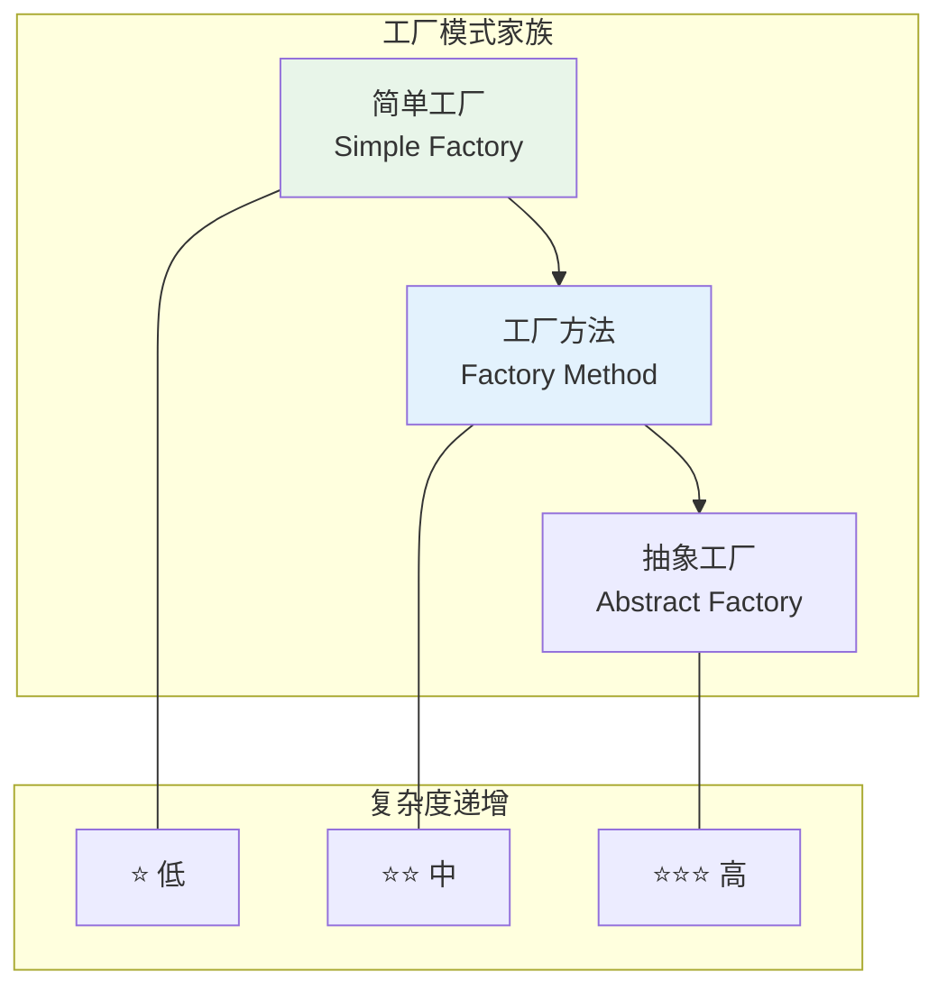
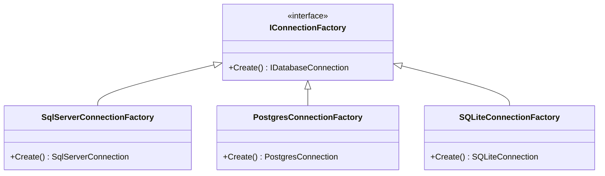
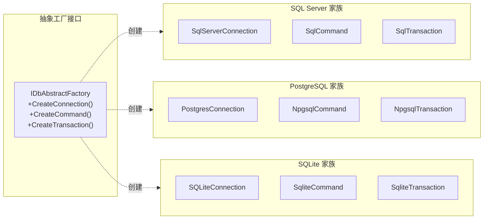
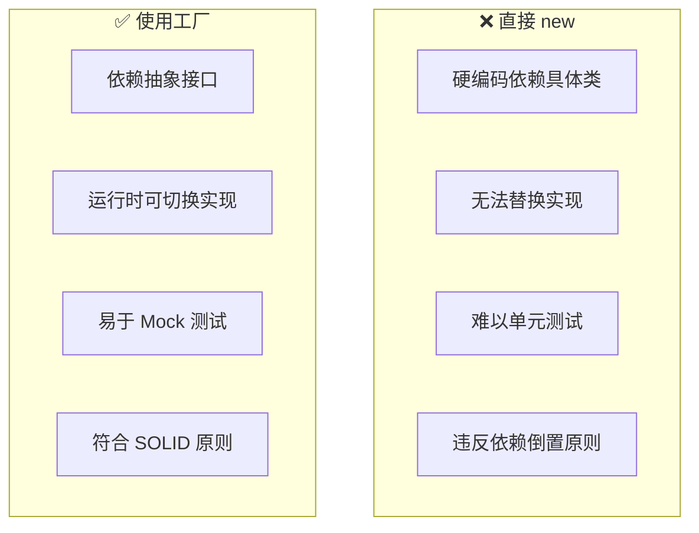
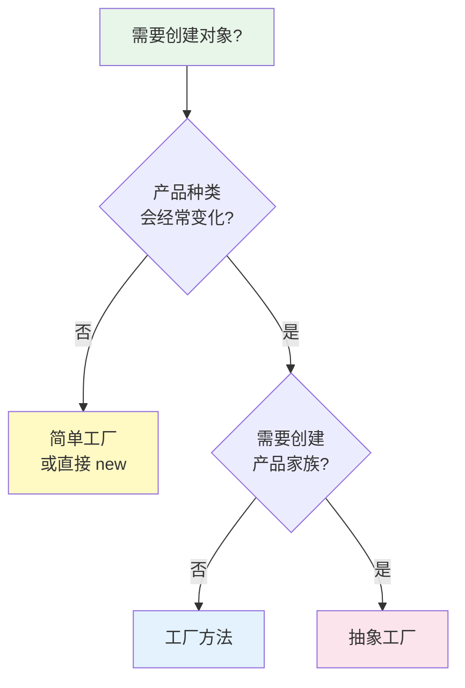

# Factory Pattern（工厂模式）

## 学习目标

学完本节，你将能够：

- 理解三种工厂模式的区别和适用场景（简单工厂、工厂方法、抽象工厂）
- 掌握简单工厂的实现方式及其在 ASP.NET Core 中的应用
- 理解工厂方法如何让子类决定实例化过程
- 掌握抽象工厂用于创建产品家族的用法
- 了解 ASP.NET Core 内置的工厂机制（IHttpClientFactory、DbContextFactory 等）
- 能够根据场景选择合适的工厂模式

## 前置知识

在开始之前，你需要了解：

- 类的继承和多态
- 接口定义与实现
- 基本的依赖注入概念

---

## 核心内容

### 1. 工厂模式概览

**工厂模式** 是一种创建型设计模式，它提供了一种**将对象的创建与使用分离**的方式。与其在代码中直接使用 `new` 关键字实例化对象，而是通过一个专门的"工厂"来负责创建过程。



| 模式 | 核心思想 | 创建者数量 | 产品数量 | 典型场景 |
|------|---------|-----------|---------|---------|
| **简单工厂** | 一个工厂类根据参数决定创建哪个产品 | 1 个 | 多个 | 产品种类有限且固定 |
| **工厂方法** | 定义创建接口，让子类决定实例化哪个类 | 多个（每个产品一个） | 多个 | 需要扩展产品类型时 |
| **抽象工厂** | 创建相关产品家族的接口 | 多个 | 多个系列 x 多个品种 | 需要跨平台/跨数据库兼容 |

### 2. 简单工厂（Simple Factory）

最直观的工厂形式：**一个工厂类，根据输入参数返回不同的产品实例**。

#### 基础实现

```csharp
/// <summary>
/// 产品接口
/// </summary>
public interface IDatabaseConnection
{
    void Open();
    void Close();
    Task<T> QueryAsync<T>(string sql, params object[] parameters);
    int Execute(string sql, params object[] parameters);
}

/// <summary>
/// SQL Server 连接实现
/// </summary>
public class SqlServerConnection : IDatabaseConnection
{
    private readonly string _connectionString;
    private SqlConnection? _connection;

    public SqlServerConnection(string connectionString)
    {
        _connectionString = connectionString;
    }

    public void Open()
    {
        _connection = new SqlConnection(_connectionString);
        _connection.Open();
        Console.WriteLine("SQL Server connection opened.");
    }

    public void Close() { _connection?.Close(); }
    public async Task<T> QueryAsync<T>(string sql, params object[] parameters) { /* ... */ }
    public int Execute(string sql, params object[] parameters) { /* ... */ }
}

/// <summary>
/// PostgreSQL 连接实现
/// </summary>
public class PostgresConnection : IDatabaseConnection
{
    private readonly string _connectionString;
    private NpgsqlConnection? _connection;

    public PostgresConnection(string connectionString)
    {
        _connectionString = connectionString;
    }

    public void Open()
    {
        _connection = new NpgsqlConnection(_connectionString);
        _connection.Open();
        Console.WriteLine("PostgreSQL connection opened.");
    }

    public void Close() { _connection?.Close(); }
    public async Task<T> QueryAsync<T>(string sql, params object[] parameters) { /* ... */ }
    public int Execute(string sql, params object[] parameters) { /* ... */ }
}

/// <summary>
/// SQLite 连接实现
/// </summary>
public class SQLiteConnection : IDatabaseConnection
{
    private readonly string _connectionString;
    private Microsoft.Data.Sqlite.SqliteConnection? _connection;

    public SQLiteConnection(string connectionString)
    {
        _connectionString = connectionString;
    }

    public void Open()
    {
        _connection = new Microsoft.Data.Sqlite.SqliteConnection(_connectionString);
        _connection.Open();
        Console.WriteLine("SQLite connection opened.");
    }

    public void Close() { _connection?.Close(); }
    public async Task<T> QueryAsync<T>(string sql, params object[] parameters) { /* ... */ }
    public int Execute(string sql, params object[] parameters) { /* ... */ }
}
```

#### 简单工厂类

```csharp
/// <summary>
/// 数据库连接简单工厂
/// </summary>
public static class DatabaseConnectionFactory
{
    /// <summary>
    /// 根据数据库类型创建对应的连接对象
    /// </summary>
    public static IDatabaseConnection Create(DatabaseType dbType, string connectionString)
    {
        return dbType switch
        {
            DatabaseType.SqlServer => new SqlServerConnection(connectionString),
            DatabaseType.PostgreSQL => new PostgresConnection(connectionString),
            DatabaseType.SQLite => new SQLiteConnection(connectionString),
            _ => throw new ArgumentException($"Unsupported database type: {dbType}")
        };
    }
}

public enum DatabaseType
{
    SqlServer,
    PostgreSQL,
    SQLite
}
```

#### 使用方式

```csharp
// 在应用中使用
public class DataExportService
{
    public async Task ExportDataAsync(DatabaseType sourceDb, string connStr)
    {
        // 通过工厂获取连接，不关心具体是哪种数据库
        var connection = DatabaseConnectionFactory.Create(sourceDb, connStr);

        try
        {
            connection.Open();
            var data = await connection.QueryAsync<DataRecord>("SELECT * FROM Products");
            // 处理数据...
        }
        finally
        {
            connection.Close();
        }
    }
}
```

### 3. 工厂方法（Factory Method）

当需要更灵活地扩展产品类型时，**让子类决定实例化哪个具体类**。工厂方法定义了一个创建对象的接口，但由子类决定实例化哪一个类。



```csharp
/// <summary>
/// 工厂方法接口
/// </summary>
public interface IConnectionFactory
{
    IDatabaseConnection Create();
}

/// <summary>
/// SQL Server 工厂
/// </summary>
public class SqlServerConnectionFactory : IConnectionFactory
{
    private readonly string _connectionString;

    public SqlServerConnectionFactory(string connectionString)
    {
        _connectionString = connectionString;
    }

    public IDatabaseConnection Create()
    {
        return new SqlServerConnection(_connectionString);
    }
}

/// <summary>
/// PostgreSQL 工厂
/// </summary>
public class PostgresConnectionFactory : IConnectionFactory
{
    private readonly string _connectionString;

    public PostgresConnectionFactory(string connectionString)
    {
        _connectionString = connectionString;
    }

    public IDatabaseConnection Create()
    {
        return new PostgresConnection(_connectionString);
    }
}

// 使用 -- 通过 DI 注入具体的工厂
public class ReportService
{
    private readonly IConnectionFactory _factory;

    // DI 容器注入具体的工厂实现
    public ReportService(IConnectionFactory factory)
    {
        _factory = factory;
    }

    public async Task GenerateReportAsync()
    {
        using var connection = _factory.Create(); // 不关心具体是什么连接
        connection.Open();
        // ...
    }
}
```

**简单工厂 vs 工厂方法对比**：

| 维度 | 简单工厂 | 工厂方法 |
|------|---------|---------|
| **扩展性** | 需修改工厂类的 switch（违反 OCP） | 新增工厂子类即可（符合 OCP） |
| **复杂度** | 低，一个类搞定 | 中等，每类产品一个工厂类 |
| **适用场景** | 产品种类固定不变 | 产品种类可能持续增加 |
| **DI 友好度** | 一般（通常用静态方法） | 好（通过接口注入） |

### 4. 抽象工厂（Abstract Factory）

当需要创建**一系列相关的对象**（产品家族）时，抽象工厂就派上用场了。它提供一个接口用于创建**相关或依赖的对象家族**，而不需要指定它们的具体类。



```csharp
/// <summary>
/// 抽象工厂接口 -- 定义创建产品家族的方法
/// </summary>
public interface IDbAbstractFactory
{
    IDatabaseConnection CreateConnection();
    IDbCommand CreateCommand();
    IDbTransaction CreateTransaction();
}

// ====== SQL Server 抽象工厂实现 ======
public class SqlServerAbstractFactory : IDbAbstractFactory
{
    private readonly string _connectionString;

    public SqlServerAbstractFactory(string connectionString)
    {
        _connectionString = connectionString;
    }

    public IDatabaseConnection CreateConnection()
        => new SqlServerConnection(_connectionString);

    public IDbCommand CreateCommand()
        => new SqlCommandObject();

    public IDbTransaction CreateTransaction()
        => new SqlTransactionObject();
}

// ====== PostgreSQL 抽象工厂实现 ======
public class PostgresAbstractFactory : IDbAbstractFactory
{
    private readonly string _connectionString;

    public PostgresAbstractFactory(string connectionString)
    {
        _connectionString = connectionString;
    }

    public IDatabaseConnection CreateConnection()
        => new PostgresConnection(_connectionString);

    public IDbCommand CreateCommand()
        => new NpgsqlCommandObject();

    public IDbTransaction CreateTransaction()
        => new NpgsqlTransactionObject();
}

// 使用示例
public class DataAccessService
{
    private readonly IDbAbstractFactory _dbFactory;

    public DataAccessService(IDbAbstractFactory dbFactory)
    {
        _dbFactory = dbFactory;
    }

    public async Task ExecuteInTransactionAsync(Func<IDbTransaction, Task> action)
    {
        var connection = _dbFactory.CreateConnection();
        var command = _dbFactory.CreateCommand();
        var transaction = _dbFactory.CreateTransaction();

        try
        {
            connection.Open();
            transaction.Begin(connection);

            await action(transaction);

            transaction.Commit();
        }
        catch
        {
            transaction.Rollback();
            throw;
        }
        finally
        {
            connection.Close();
        }
    }
}
```

### 5. ASP.NET Core 中的内置工厂

ASP.NET Core 框架本身大量使用了工厂模式。理解这些内置工厂有助于写出更符合框架风格的代码。

#### 5.1 IServiceProvider 就是最大的工厂

整个 DI 容器本质上就是一个**超级工厂**：

```csharp
// DI 容器 = 工厂
var service = serviceProvider.GetRequiredService<IUserService>();
// 等价于：工厂根据接口类型创建对应的服务实例
```

#### 5.2 IHttpClientFactory -- HTTP 客户端工厂

```csharp
// ====== 方式一：命名客户端 (Named Client) ======
// 注册
builder.Services.AddHttpClient("github", client =>
{
    client.BaseAddress = new Uri("https://api.github.com/");
    client.DefaultRequestHeaders.Add("User-Agent", "MyApp");
    client.Timeout = TimeSpan.FromSeconds(30);
});

// 使用
public class GithubService
{
    private readonly IHttpClientFactory _httpClientFactory;

    public GithubService(IHttpClientFactory httpClientFactory)
    {
        _httpClientFactory = httpClientFactory;
    }

    public async Task<UserInfo> GetUserAsync(string username)
    {
        var client = _httpClientFactory.CreateClient("github"); // 按名称获取
        var response = await client.GetAsync($"/users/{username}");
        return await response.Content.ReadFromJsonAsync<UserInfo>();
    }
}

// ====== 方式二：类型化客户端 (Typed Client) ======
// 注册
builder.Services.AddHttpClient<IGithubClient, GithubClient>(client =>
{
    client.BaseAddress = new Uri("https://api.github.com/");
});

// 类型化客户端定义
public interface IGithubClient
{
    Task<UserInfo> GetUserAsync(string username);
    Task<List<Repo>> GetReposAsync(string username);
}

public class GithubClient : IGithubClient
{
    private readonly HttpClient _httpClient;

    // HttpClient 由 IHttpClientFactory 自动管理
    public GithubClient(HttpClient httpClient)
    {
        _httpClient = httpClient;
    }

    public async Task<UserInfo> GetUserAsync(string username)
    {
        return await _httpClient.GetFromJsonAsync<UserInfo>($"/users/{username}");
    }

    public async Task<List<Repo>> GetReposAsync(string username)
    {
        return await _httpClient.GetFromJsonAsync<List<Repo>>($"/users/{username}/repos");
    }
}
```

`IHttpClientFactory` 的核心价值：
- **连接池管理**：自动管理 `HttpClientHandler` 的生命周期，避免 socket 耗尽
- **配置集中化**：BaseAddress、Timeout、Header 等在一处配置
- **命名隔离**：不同用途的 HTTP 客户端互不干扰
- **Polly 集成**：方便添加重试、熔断等弹性策略

#### 5.3 DbContextFactory / IDbContextFactory\<T\>

当需要在 Scoped 之外（如后台服务、控制台应用）使用 DbContext 时：

```csharp
// 注册 DbContext Factory
builder.Services.AddDbContextFactory<ApplicationDbContext>(options =>
    options.UseSqlServer(builder.Configuration.GetConnectionString("Default")));

// 在 Singleton 服务中使用
public class DataSyncHostedService : BackgroundService
{
    private readonly IDbContextFactory<ApplicationDbContext> _contextFactory;

    public DataSyncHostedService(IDbContextFactory<ApplicationDbContext> contextFactory)
    {
        _contextFactory = contextFactory;
    }

    protected override async Task ExecuteAsync(CancellationToken stoppingToken)
    {
        while (!stoppingToken.IsCancellationRequested)
        {
            // 每次操作创建新的 DbContext（短生命周期）
            using var context = _contextFactory.CreateDbContext();

            var pendingItems = await context.SyncItems
                .Where(s => s.Status == SyncStatus.Pending)
                .ToListAsync(stoppingToken);

            foreach (var item in pendingItems)
            {
                await ProcessItemAsync(item, context);
            }

            await context.SaveChangesAsync(stoppingToken);

            await Task.Delay(TimeSpan.FromMinutes(5), stoppingToken);
        }
    }
}
```

### 6. 工厂 vs 直接 new 的区别



| 对比维度 | 直接 `new` | 工厂模式 |
|---------|-----------|---------|
| **耦合度** | 高（直接依赖具体类） | 低（依赖接口/工厂） |
| **灵活性** | 固定死 | 可配置、可运行时切换 |
| **可测试性** | 困难（需 Mock 构造函数或使用框架） | 容易（Mock 工厂或接口） |
| **单一职责** | 创建逻辑散落各处 | 创建逻辑集中在工厂中 |
| **代码量** | 少 | 较多（需要额外定义工厂类） |

**什么时候不需要工厂？**
- 对象创建非常简单（无参构造函数、无需配置）
- 类型确定不会改变
- 不需要测试替身
- 仅在同一个方法内部使用且不对外暴露

### 7. 何时使用哪种工厂



| 场景 | 推荐模式 | 示例 |
|------|---------|------|
| 根据配置选择一种数据库驱动 | **简单工厂** | `DatabaseConnectionFactory.Create(dbType)` |
| 支持插件式扩展的导出功能 | **工厂方法** | 每个 ExportFormat 一个 Factory |
| 跨平台 UI 组件库（WinForms/WPF/MAUI 各一套控件） | **抽象工厂** | `IUiFactory` 创建 Button/TextBox/Window 系列 |
| DI 容器中的服务解析 | **内置工厂** | `IServiceProvider` / `IHttpClientFactory` |
| 需要带参数创建对象 | **工厂委托** | `services.AddScoped(sp => new Foo(sp.GetRequiredService<IBar>(), "param"))` |

---

## 深入理解

> **为什么说 IServiceProvider 本质上就是一个工厂？**

`IServiceProvider.GetService(Type)` 方法就是经典的工厂方法 -- 它接收一个"产品类型"（Type），返回对应的"产品实例"（object）。ASP.NET Core 的 DI 容器是一个高度通用的、支持生命周期的、可配置的工厂系统。理解这一点有助于你更好地利用 DI 容器，而不是绕过它去手写工厂类。

> **工厂模式和策略模式有什么关系？**

两者常常配合使用：
- **工厂** 负责"创建"策略对象
- **策略** 定义"执行"算法的行为

```
客户端 -> 工厂(选择/创建) -> 策略(执行算法) -> 结果
```

---

## 常见陷阱

### DO / DON'T 清单

| DO (推荐做法) | DON'T (避免做法) |
|---------------|------------------|
| 通过 DI 容器注册工厂 | 手动维护全局静态工厂字典 |
| 工厂方法返回接口类型 | 返回具体类型（暴露了实现细节） |
| 简单场景用简单工厂 | 为 2 个类写一个抽象工厂（过度工程） |
| 工厂类保持单一职责 | 工厂里包含业务逻辑 |
| 使用 IHttpClientFactory 而非手动 new HttpClient() | 每次 new HttpClient() 导致端口耗尽 |
| 工厂创建后验证必要状态 | 工厂返回 null 或无效对象 |

### 错误示例

```csharp
// ❌ 反模式：每次都 new HttpClient
public class ApiService
{
    public async Task GetDataAsync()
    {
        // 每次请求创建新 HttpClient -- 会导致 socket 耗尽！
        using var client = new HttpClient();
        return await client.GetAsync("https://api.example.com/data");
    }
}

// ❌ 反模式：工厂内部包含业务规则
public static class UserFactory
{
    public static IUser Create(string userType, RegisterDto dto)
    {
        // 业务校验不应该在工厂里！
        if (string.IsNullOrEmpty(dto.Email))
            throw new Exception("Email required");

        if (!IsValidEmail(dto.Email))
            throw new Exception("Invalid email");

        // 密码加密也不应该在工厂里！
        dto.Password = HashPassword(dto.Password);

        return userType switch
        {
            "admin" => new AdminUser(dto),
            "regular" => new RegularUser(dto),
            _ => throw new Exception("Unknown type")
        };
    }
}
```

### 正确示例

```csharp
// ✅ 正确：使用 IHttpClientFactory
public class ApiService
{
    private readonly HttpClient _httpClient;

    // HttpClient 由工厂管理，自动复用连接池
    public ApiService(IHttpClientFactory httpClientFactory)
    {
        _httpClient = httpClientFactory.CreateClient("api");
    }

    public async Task GetDataAsync()
    {
        return await _httpClient.GetAsync("https://api.example.com/data");
    }
}

// ✅ 正确：工厂只负责创建，业务逻辑在 Service 层
public static class UserFactory
{
    public static IUser Create(string userType, UserData data)
    {
        // 纯粹的创建逻辑，不做任何业务判断
        return userType.ToLowerInvariant() switch
        {
            "admin" => new AdminUser(data.Id, data.Name, data.Email),
            "regular" => new RegularUser(data.Id, data.Name, data.Email),
            _ => throw new ArgumentException($"Unknown user type: {userType}")
        };
    }
}

// 业务逻辑在 Service 层处理
public class RegistrationService
{
    public async Task<Result<IUser>> RegisterAsync(RegisterDto dto)
    {
        // 业务校验
        if (!ValidationHelper.IsValidEmail(dto.Email))
            return Result.Failure<IUser>("Invalid email format");

        // 密码处理
        var hashedPassword = _passwordHasher.Hash(dto.Password);

        // 创建用户（工厂只做创建）
        var user = UserFactory.Create(dto.UserType, new UserData
        {
            Id = Guid.NewGuid(),
            Name = dto.Name,
            Email = dto.Email,
            PasswordHash = hashedPassword
        });

        await _userRepo.AddAsync(user);
        await _unitOfWork.CommitAsync();

        return Result.Success(user);
    }
}
```

---

## 动手练习

### 练习 1：实现完整的数据库连接工厂

**要求**：
基于前面介绍的简单工厂模式，完善一个支持 SQL Server / PostgreSQL / MySQL / SQLite 四种数据库的连接工厂。要求：

1. 实现 `IDatabaseConnection` 接口的四种数据库适配
2. 实现 `DatabaseConnectionFactory` 简单工厂
3. 编写一个 `DataService` 类，通过工厂获取连接并执行查询
4. 支持从 `appsettings.json` 配置默认数据库类型

<details>
<summary>查看答案</summary>

```csharp
// appsettings.json
{
  "Database": {
    "Type": "SqlServer",
    "ConnectionString": "Server=(localdb)\\mssqllocaldb;Database=MyDb;Trusted_Connection=True;"
  }
}

// 配置模型
public class DatabaseOptions
{
    public const string SectionName = "Database";
    public string Type { get; set; } = "SqlServer";
    public string ConnectionString { get; set; } = string.Empty;
}

// 扩展枚举
public enum DatabaseType
{
    SqlServer,
    PostgreSQL,
    MySQL,
    SQLite
}

// MySQL 连接实现
public class MySqlConnectionWrapper : IDatabaseConnection
{
    private readonly string _connectionString;
    private MySqlConnector.MySqlConnection? _connection;

    public MySqlConnectionWrapper(string connectionString)
    {
        _connectionString = connectionString;
    }

    public void Open()
    {
        _connection = new MySqlConnector.MySqlConnection(_connectionString);
        _connection.Open();
        Console.WriteLine("MySQL connection opened.");
    }

    public void Close() { _connection?.Close(); }
    public async Task<T> QueryAsync<T>(string sql, params object[] parameters) { /* ... */ }
    public int Execute(string sql, params object[] parameters) { /* ... */ }
}

// 完善后的工厂
public static class DatabaseConnectionFactory
{
    public static IDatabaseConnection Create(DatabaseType dbType, string connectionString)
    {
        return dbType switch
        {
            DatabaseType.SqlServer => new SqlServerConnection(connectionString),
            DatabaseType.PostgreSQL => new PostgresConnection(connectionString),
            DatabaseType.MySQL => new MySqlConnectionWrapper(connectionString),
            DatabaseType.SQLite => new SQLiteConnection(connectionString),
            _ => throw new ArgumentException($"Unsupported database type: {dbType}")
        };
    }

    // 从配置创建的便捷方法
    public static IDatabaseConnection CreateFromConfig(IConfiguration config)
    {
        var options = config.GetSection(DatabaseOptions.SectionName)
            .Get<DatabaseOptions>()
            ?? throw new InvalidOperationException("Database configuration missing");

        var dbType = Enum.Parse<DatabaseType>(options.Type);
        return Create(dbType, options.ConnectionString);
    }
}

// DataService
public class DataService
{
    private readonly IConfiguration _config;

    public DataService(IConfiguration config)
    {
        _config = config;
    }

    public async Task<List<Product>> GetAllProductsAsync()
    {
        var connection = DatabaseConnectionFactory.CreateFromConfig(_config);

        try
        {
            connection.Open();
            return await connection.QueryAsync<Product>("SELECT * FROM Products");
        }
        finally
        {
            connection.Close();
        }
    }
}
```

</details>

---

### 练习 2：为日志系统设计抽象工厂

**要求**：
设计一个日志系统的抽象工厂，能够创建以下产品家族：
- **日志写入器** (`ILogWriter`)：文件写入器 / 数据库写入器 / 网络写入器
- **日志格式化器** (`ILogFormatter`)：JSON 格式 / 文本格式 / 结构化格式
- **日志过滤器** (`ILogFilter`)：级别过滤 / 关键词过滤 / 来源过滤

要求：
1. 定义 `ILoggerFactory` 抽象工厂接口
2. 实现至少两个具体工厂（如 `FileLoggerFactory` 和 `DatabaseLoggerFactory`）
3. 每个工厂创建的产品家族必须匹配（如 File 工厂创建 FileWriter + TextFormatter）

<details>
<summary>查看答案</summary>

```csharp
// 产品接口
public interface ILogWriter
{
    Task WriteAsync(LogEntry entry);
}

public interface ILogFormatter
{
    string Format(LogEntry entry);
}

public interface ILogFilter
{
    bool ShouldLog(LogEntry entry);
}

// 抽象工厂
public interface ILoggerFactory
{
    ILogWriter CreateWriter();
    ILogFormatter CreateFormatter();
    ILogFilter CreateFilter();
}

// ====== 文件日志工厂 ======
public class FileLoggerFactory : ILoggerFactory
{
    private readonly string _logPath;
    private readonly LogLevel _minLevel;

    public FileLoggerFactory(string logPath, LogLevel minLevel)
    {
        _logPath = logPath;
        _minLevel = minLevel;
    }

    public ILogWriter CreateWriter() => new FileWriter(_logPath);
    public ILogFormatter CreateFormatter() => new TextFormatter();
    public ILogFilter CreateFilter() => new LevelFilter(_minLevel);
}

// ====== 数据库日志工厂 ======
public class DatabaseLoggerFactory : ILoggerFactory
{
    private readonly ApplicationDbContext _context;
    private readonly LogLevel _minLevel;

    public DatabaseLoggerFactory(ApplicationDbContext context, LogLevel minLevel)
    {
        _context = context;
        _minLevel = minLevel;
    }

    public ILogWriter CreateWriter() => new DatabaseWriter(_context);
    public ILogFormatter CreateFormatter() => new JsonFormatter();
    public ILogFilter CreateFilter() => new LevelFilter(_minLevel);
}

// 使用
public class ApplicationService
{
    private readonly ILoggerFactory _loggerFactory;

    public ApplicationService(ILoggerFactory loggerFactory)
    {
        _loggerFactory = loggerFactory;
    }

    public async Task DoWorkAsync()
    {
        // 从同一工厂创建的所有产品天然匹配
        var writer = _loggerFactory.CreateWriter();
        var formatter = _loggerFactory.CreateFormatter();
        var filter = _loggerFactory.CreateFilter();

        var entry = new LogEntry(LogLevel.Information, "App", "Doing work...");
        if (filter.ShouldLog(entry))
        {
            var formatted = formatter.Format(entry);
            await writer.WriteAsync(entry); // writer 内部可以使用 formatter
        }
    }
}
```

</details>

---

### 练习 3：分析以下场景应该用什么工厂

请分析以下三个场景各适合什么类型的工厂模式，并说明理由：

1. 一个图片处理工具，支持 PNG/JPEG/WebP/GIF 格式的解码和编码
2. 一个支付网关集成层，需要对接支付宝/微信/Stripe/PayPal
3. 一个跨平台的 UI 框架，每个平台（Windows/macOS/Linux）有自己的一套 Button、Window、Dialog 控件

<details>
<summary>查看分析</summary>

**场景 1：图片编解码 -- 简单工厂**

理由：
- 格式种类相对固定（主流格式就那么几种）
- 每种格式的解码器和编码器可以独立工作，不存在"产品家族"的概念
- 简单工厂的 switch/case 就能清晰表达逻辑
- 如果未来新增格式，修改工厂的成本可控

**场景 2：支付网关集成 -- 工厂方法 + 策略模式组合**

理由：
- 支付渠道可能频繁增加（新的支付方式不断出现）
- 每种支付方式的实现差异很大（API、签名方式、回调处理完全不同）
- 使用工厂方法可以让每种支付方式独立为一个工厂类
- 结合策略模式可以在运行时动态选择支付渠道
- 新增支付渠道只需添加新的工厂类和策略类，符合开闭原则

**场景 3：跨平台 UI -- 抽象工厂**

理由：
- 这是抽象工厂的经典应用场景！
- 每个平台需要一整套 UI 控件（Button + Window + Dialog + TextBox...），这就是"产品家族"
- 必须保证同一平台上创建的所有控件风格一致
- Windows 工厂只能创建 Windows 风格的控件，macOS 工厂只能创建 macOS 风格的控件
- 如果混用（如 Windows 工厂创建 Window 但 macOS 工厂创建 Button），会导致界面不一致

</details>

---

## 本节小结

工厂模式是创建型设计模式中最实用的一族模式。核心要点总结：

1. **简单工厂**：一个类根据参数决定创建什么 -- 适用于产品种类固定的场景
2. **工厂方法**：定义接口让子类决定实例化 -- 适用于需要频繁扩展产品类型的场景
3. **抽象工厂**：创建产品家族 -- 适用于需要保证系列产品一致性的场景
4. **ASP.NET Core 内置了强大的工厂能力**：IServiceProvider、IHttpClientFactory、IDbContextFactory 都是优秀的工厂实践
5. **不要过度设计**：如果只是两三个类需要创建，简单的 if-else 或 DI 直接注册往往比引入工厂模式更合适
6. **工厂的职责边界**：工厂只负责创建对象，不应包含业务逻辑、数据校验等职责

---

## 延伸阅读

- [[Strategy Pattern(策略模式)]] -- 工厂常用于创建策略对象
- [[Adapter Pattern(适配器模式)]] -- 工厂可用于创建适配器
- [Microsoft Docs: IHttpClientFactory](https://docs.microsoft.com/en-us/aspnet/core/fundamentals/http-requests)
- [Refactoring Guru: Factory Method](https://refactoring.guru/design-patterns/factory-method)
- [Refactoring Guru: Abstract Factory](https://refactoring.guru/design-patterns/abstract-factory)

## 思考题

1. `services.AddScoped<IFoo, Foo>()` 和 `services.AddScoped(sp => new Foo(sp.GetRequiredService<IBar>()))` 这两种注册方式有什么本质区别？后者算不算工厂模式？
2. 当工厂创建对象失败时（如配置错误、依赖缺失），应该抛出异常还是返回 null？各自的利弊是什么？
3. 能否结合泛型来实现一个通用的简单工厂 `GenericFactory<T>`？有什么限制？

---
**[[Strategy Pattern(策略模式)]]** | **[[Decorator Pattern(装饰器模式)]]** | **🏠 [[HOME]]**
