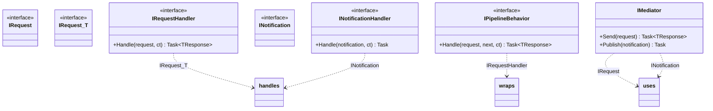
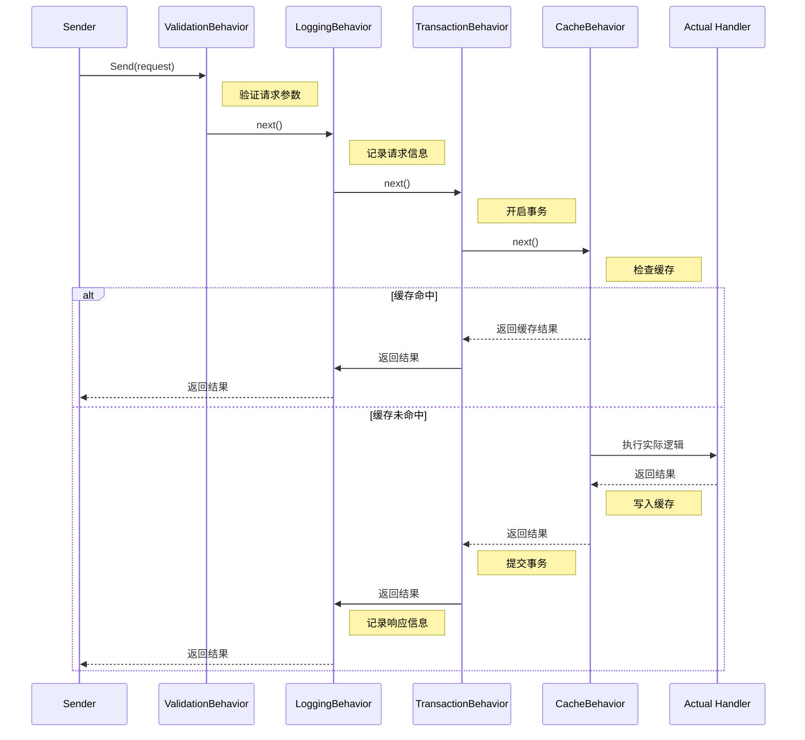
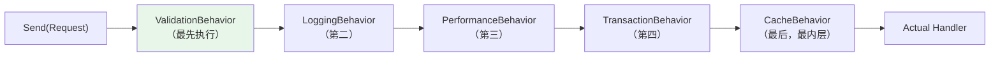
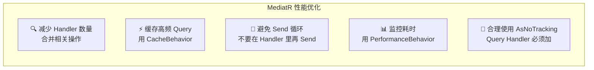

# MediatR 库实践

## 学习目标

学完本节，你将能够：

- 理解 MediatR 的定位和核心概念（Request/Response/Handler/Notification/Pipeline Behavior）
- 掌握 MediatR 的安装、配置和基本用法
- 熟练使用 `IMediator.Send()` 和 `IMediator.Publish()`
- 编写自定义 Pipeline Behavior（验证/日志/事务/性能/缓存）
- 实现 Notification 发布订阅机制（领域事件）
- 将 MediatR 与 CQRS 架构结合使用
- 了解性能考量和最佳实践

## 前置知识

在开始之前，你需要了解：

- CQRS（命令查询职责分离）的基本概念
- ASP.NET Core 依赖注入系统
- 中间件管道的设计思想
- 领域事件（Domain Event）的基本概念

---

## 核心内容

### 1. MediatR 是什么？

**MediatR** 是一个轻量级的进程内（In-Process）消息传递库，它为 .NET 应用程序提供了**中介者模式（Mediator Pattern）**的实现。它不负责跨进程通信（那是 MassTransit/RabbitMQ 的事），而是专注于**应用内部的消息分发**。

```mermaid
graph TB
    subgraph WithoutMediator["没有 MediatR -- 耦合严重"]
        direction TB
        W1[Controller] --> W2[UserService]
        W1 --> W3[OrderService]
        W1 --> W4[EmailService]
        W2 --> W5[UserRepository]
        W3 --> W6[OrderRepository]
        W4 --> W7[SmtpClient]

        style W1 fill:#ffcdd2
    end

    subgraph WithMediator["有 MediatR -- 解耦清晰"]
        direction TB
        M1[Controller] --> M2["IMediator.Send(Request)"]
        M2 --> M3[Mediator (消息总线)]
        M3 -->|路由到| M4["IRequestHandler&lt;T&gt;"]
        M3 -->|发布到| M5["INotificationHandler&lt;T&gt; x N"]

        style M1 fill:#c8e6c9
        style M3 fill:#e3f2fd
    end
```

**核心价值**：
- **解耦发送者和处理者** -- Controller 不知道谁在处理请求
- **支持 CQRS 天然友好** -- Command/Query/Notification 一应俱全
- **Pipeline Behavior 横切关注点** -- 类似中间件，但作用于方法级别
- **极简配置** -- 几行代码即可完成注册

### 2. 核心概念一览



| 概念 | 说明 | 类比 |
|------|------|------|
| **IRequest / IRequest\<T\>** | 消息/请求的定义（Command 或 Query） | HTTP Request |
| **IRequestHandler\<TRequest, TResponse\>** | 消息处理器 | Controller Action |
| **INotification** | 通知/事件定义（广播给多个 Handler） | Event |
| **INotificationHandler\<T\>** | 通知处理器（可以有多个） | Event Handler |
| **IPipelineBehavior** | 管道行为（拦截器） | Middleware |
| **IMediator** | 中介者接口（入口） | HttpContext |

### 3. 安装和配置

```bash
# MediatR 核心包
dotnet add package MediatR

# 如果需要依赖注入扩展（推荐）
dotnet add package MediatR.Microsoft.DependencyInjection
```

#### 基本配置

```csharp
// Program.cs
using MediatR;
using MediatR.Extensions.Microsoft.DependencyInjection;

var builder = WebApplication.CreateBuilder(args);

// 方式一：扫描指定程序集中的所有 Handler（推荐）
builder.Services.AddMediatR(typeof(Program).Assembly);

// 方式二：从 Services 注册（适用于需要额外配置 Handler 的场景）
// builder.Services.AddMediatR(cfg => cfg.RegisterServicesFromAssembly(typeof(Program).Assembly));

// 注册 Pipeline Behaviors（顺序很重要！先注册的先执行）
builder.Services.AddTransient<
    IPipelineBehavior<IRequest<TResponse>, TResponse>,
    ValidationBehavior<TResponse>>(); // 最外层：验证

builder.Services.AddTransient<
    IPipelineBehavior<IRequest<TResponse>, TResponse>,
    LoggingBehavior<TResponse>>();   // 第二层：日志

builder.Services.AddTransient<
    IPipelineBehavior<IRequest<TResponse>, TResponse>,
    TransactionBehavior<TResponse>>(); // 第三层：事务

// 其他服务...
builder.Services.AddDbContext<ApplicationDbContext>(...);
builder.Services.AddAutoMapper(typeof(Program).Assembly);

var app = builder.Build();
app.Run();
```

### 4. 基本用法

#### 4.1 发送请求：IMediator.Send()

```csharp
// ====== 定义 Request ======

/// <summary>
/// Query: 不改变状态，返回数据
/// </summary>
public record GetUserQuery(Guid UserId) : IRequest<UserDto?>;

/// <summary>
/// Command: 改变状态，返回操作结果标识
/// </summary>
public record CreateUserCommand(
    string Email,
    string UserName,
    string Password
) : IRequest<Result<Guid>>;

// ====== 定义 Response DTOs ======
public record UserDto(
    Guid Id,
    string Email,
    string UserName,
    string AvatarUrl,
    DateTime CreatedAt
);

public record Result(bool IsSuccess, string? ErrorMessage = null)
{
    public static Result Success() => new(true);
    public static Result Failure(string message) => new(false, message);
}

// ====== 定义 Handler ======

/// <summary>
/// Query Handler -- 只读查询
/// </summary>
public class GetUserQueryHandler : IRequestHandler<GetUserQuery, UserDto?>
{
    private readonly ApplicationDbContext _context;
    private readonly IMapper _mapper;

    public GetUserQueryHandler(ApplicationDbContext context, IMapper mapper)
    {
        _context = context;
        _mapper = mapper;
    }

    public async Task<UserDto?> Handle(GetUserQuery request, CancellationToken cancellationToken)
    {
        var user = await _context.Users
            .AsNoTracking()
            .FirstOrDefaultAsync(u => u.Id == request.UserId, cancellationToken);

        return user == null ? null : _mapper.Map<UserDto>(user);
    }
}

/// <summary>
/// Command Handler -- 写操作
/// </summary>
public class CreateUserCommandHandler : IRequestHandler<CreateUserCommand, Result<Guid>>
{
    private readonly ApplicationDbContext _context;
    private readonly IPasswordHasher _hasher;
    private readonly IMediator _mediator;

    public CreateUserCommandHandler(
        ApplicationDbContext context,
        IPasswordHasher hasher,
        IMediator mediator)
    {
        _context = context;
        _hasher = hasher;
        _mediator = mediator;
    }

    public async Task<Result<Guid>> Handle(
        CreateUserCommand request, CancellationToken cancellationToken)
    {
        // 1. 业务规则检查
        if (await _context.Users.AnyAsync(u => u.Email == request.Email, cancellationToken))
            return Result.Failure("Email already registered");

        // 2. 创建实体
        var user = new User
        {
            Id = Guid.NewGuid(),
            Email = request.Email.ToLowerInvariant().Trim(),
            UserName = request.UserName.Trim(),
            PasswordHash = _hasher.Hash(request.Password),
            CreatedAt = DateTime.UtcNow
        };

        // 3. 持久化
        await _context.Users.AddAsync(user, cancellationToken);
        await _context.SaveChangesAsync(cancellationToken);

        // 4. 发布领域事件（通知其他 Handler）
        await _mediator.Publish(new UserCreatedEvent(user.Id, user.Email));

        return Result.Success(user.Id);
    }
}
```

#### 4.2 在 Controller 中使用

```csharp
[ApiController]
[Route("api/[controller]")]
public class UsersController : ControllerBase
{
    private readonly IMediator _mediator;

    public UsersController(IMediator mediator)
    {
        _mediator = mediator;
    }

    /// <summary>
    /// GET /api/users/{id} -> Query
    /// </summary>
    [HttpGet("{id:guid}")]
    public async Task<ActionResult<UserDto>> GetUser(Guid id)
    {
        var query = new GetUserQuery(id);
        var user = await _mediator.Send(query);

        if (user == null) return NotFound();
        return Ok(user);
    }

    /// <summary>
    /// POST /api/users -> Command
    /// </summary>
    [HttpPost]
    public async Task<ActionResult<Guid>> CreateUser([FromBody] CreateUserRequest dto)
    {
        var command = new CreateUserCommand(dto.Email, dto.UserName, dto.Password);
        var result = await _mediator.Send(command);

        if (!result.IsSuccess)
            return BadRequest(result.ErrorMessage);

        return CreatedAtAction(nameof(GetUser), new { id = result.Data }, new { id = result.Data });
    }
}
```

#### 4.3 发送通知：IMediator.Publish()

Notification 是一对多的消息机制 -- 一个 Notification 可以被多个 Handler 处理：

```csharp
// ====== 定义 Notification ======

/// <summary>
/// 用户创建成功后发布的领域事件
/// </summary>
public record UserCreatedEvent(
    Guid UserId,
    string Email
) : INotification;

/// <summary>
/// 订单状态变更事件
/// </summary>
public record OrderStatusChangedEvent(
    Guid OrderId,
    OrderStatus OldStatus,
    OrderStatus NewStatus,
    DateTime ChangedAt
) : INotification;

// ====== 多个 Handler 处理同一个 Notification ======

/// <summary>
/// Handler 1: 发送欢迎邮件
/// </summary>
public class SendWelcomeEmailHandler : INotificationHandler<UserCreatedEvent>
{
    private readonly IEmailService _emailService;
    private readonly ILogger<SendWelcomeEmailHandler> _logger;

    public SendWelcomeEmailHandler(IEmailService emailService, ILogger logger)
    {
        _emailService = emailService;
        _logger = logger;
    }

    public async Task Handle(UserCreatedEvent notification, CancellationToken cancellationToken)
    {
        _logger.LogInformation("Sending welcome email to {Email}", notification.Email);

        try
        {
            await _emailService.SendWelcomeEmailAsync(notification.Email);
            _logger.LogInformation("Welcome email sent to {Email}", notification.Email);
        }
        catch (Exception ex)
        {
            _logger.LogError(ex, "Failed to send welcome email to {Email}", notification.Email);
            // 注意：Notification 不抛异常！其他 Handler 还要执行
        }
    }
}

/// <summary>
/// Handler 2: 初始化用户偏好设置
/// </summary>
public class InitializeUserPreferencesHandler : INotificationHandler<UserCreatedEvent>
{
    private readonly ApplicationDbContext _context;

    public InitializeUserPreferencesHandler(ApplicationDbContext context)
    {
        _context = context;
    }

    public async Task Handle(UserCreatedEvent notification, CancellationToken cancellationToken)
    {
        var preferences = new UserPreferences
        {
            UserId = notification.UserId,
            Theme = "light",
            Language = "zh-CN",
            NewsletterSubscribed = true
        };

        await _context.UserPreferences.AddAsync(preferences, cancellationToken);
        await _context.SaveChangesAsync(cancellationToken);
    }
}

/// <summary>
/// Handler 3: 记录用户注册日志（审计）
/// </summary>
public class AuditLogHandler : INotificationHandler<UserCreatedEvent>
{
    private readonly IAuditLogService _auditService;

    public AuditLogHandler(IAuditLogService auditService)
    {
        _auditService = auditService;
    }

    public async Task Handle(UserCreatedEvent notification, CancellationToken cancellationToken)
    {
        await _auditService.LogAsync(new AuditEntry
        {
            Action = "USER_CREATED",
            TargetId = notification.UserId,
            Details = $"Email={notification.Email}",
            Timestamp = DateTime.UtcNow
        });
    }
}
```

**关键特性**：
- 一个 `Publish()` 调用会触发**所有**匹配的 Handler
- Handler 按**注册顺序**依次执行
- 每个 Handler 的异常不会影响其他 Handler（除非配置了特殊策略）

### 5. Pipeline Behavior（管道行为）

Pipeline Behavior 是 MediatR 最强大的特性之一。它类似于 ASP.NET Core 的中间件，但作用域是**每个 MediatR 请求**。



#### 5.1 验证 Behavior

```csharp
/// <summary>
/// 自动验证请求 DTO 的 Pipeline Behavior
/// 使用 FluentValidation 进行声明式验证
/// </summary>
public class ValidationBehavior<TRequest, TResponse> : IPipelineBehavior<TRequest, TResponse>
    where TRequest : notnull
{
    private readonly IEnumerable<IValidator<TRequest>> _validators;
    private readonly ILogger<ValidationBehavior<TRequest, TResponse>> _logger;

    public ValidationBehavior(
        IEnumerable<IValidator<TRequest>> validators,
        ILogger<ValidationBehavior<TRequest, TResponse>> logger)
    {
        _validators = validators;
        _logger = logger;
    }

    public async Task<TResponse> Handle(
        TRequest request,
        RequestHandlerDelegate<TResponse> next,
        CancellationToken cancellationToken)
    {
        // 如果没有注册 Validator，直接跳过
        if (!_validators.Any())
        {
            return await next();
        }

        var typeName = typeof(TRequest).Name;

        _logger.LogDebug("Validating request {TypeName}", typeName);

        // 创建验证上下文
        var context = new ValidationContext<TRequest>(request);

        // 并行运行所有验证器
        var validationResults = await Task.WhenAll(
            _validators.Select(v => v.ValidateAsync(context, cancellationToken)));

        // 收集所有错误
        var failures = validationResults
            .SelectMany(r => r.Errors)
            .Where(f => f != null)
            .ToList();

        if (failures.Count > 0)
        {
            _logger.LogWarning(
                "Validation failed for {TypeName}: {@Errors}",
                typeName, failures);

            // 抛出验证异常或返回错误响应
            throw new ValidationException(failures);
        }

        _logger.LogDebug("Validation passed for {TypeName}", typeName);

        // 验证通过，继续执行下一个 Behavior 或 Handler
        return await next();
    }
}
```

配合 FluentValidation 使用：

```csharp
// 为 CreateUserCommand 定义验证规则
public class CreateUserCommandValidator : AbstractValidator<CreateUserCommand>
{
    public CreateUserCommandValidator()
    {
        RuleFor(x => x.Email)
            .NotEmpty().WithMessage("Email is required")
            .EmailAddress().WithMessage("Invalid email format")
            .MaximumLength(256).WithMessage("Email too long");

        RuleFor(x => x.UserName)
            .NotEmpty().WithMessage("Username is required")
            .Length(2, 50).WithMessage("Username must be 2-50 characters")
            .Matches(@"^[a-zA-Z0-9_-]+$").WithMessage(
                "Username can only contain letters, numbers, hyphens and underscores");

        RuleFor(x => x.Password)
            .NotEmpty().WithMessage("Password is required")
            .MinimumLength(8).WithMessage("Password must be at least 8 characters")
            .Matches(@"[A-Z]").WithMessage("Password must contain an uppercase letter")
            .Matches(@"[a-z]").WithMessage("Password must contain a lowercase letter")
            .Matches(@"[0-9]").WithMessage("Password must contain a number");
    }
}
```

#### 5.2 日志 Behavior

```csharp
/// <summary>
/// 记录所有 MediatR 请求和响应的日志
/// </summary>
public class LoggingBehavior<TRequest, TResponse> : IPipelineBehavior<TRequest, TResponse>
    where TRequest : notnull
{
    private readonly ILogger<LoggingBehavior<TRequest, TResponse>> _logger;

    public LoggingBehavior(ILogger<LoggingBehavior<TRequest, TResponse>> logger)
    {
        _logger = logger;
    }

    public async Task<TResponse> Handle(
        TRequest request,
        RequestHandlerDelegate<TResponse> next,
        CancellationToken cancellationToken)
    {
        var requestName = typeof(TRequest).Name;

        // 记录请求（注意不要记录敏感信息！）
        _logger.LogInformation(
            "[MediatR] Handling {RequestName} {@Request}",
            requestName, Sanitize(request));

        var stopwatch = Stopwatch.StartNew();

        try
        {
            var response = await next();

            stopwatch.Stop();

            _logger.LogInformation(
                "[MediatR] {RequestName} completed in {ElapsedMs}ms",
                requestName, stopwatch.ElapsedMilliseconds);

            return response;
        }
        catch (Exception ex)
        {
            stopwatch.Stop();

            _logger.LogError(ex,
                "[MediatR] {RequestName} FAILED after {ElapsedMs}ms",
                requestName, stopwatch.ElapsedMilliseconds);

            throw; // 重新抛出，让上层处理
        }
    }

    /// <summary>
    /// 脱敏处理 -- 移除密码等敏感字段
    /// </summary>
    private object Sanitize(TRequest request)
    {
        if (request is CreateUserCommand cmd)
        {
            return new { cmd.Email, cmd.UserName, Password = "***" };
        }
        return request;
    }
}
```

#### 5.3 事务 Behavior

```csharp
/// <summary>
/// 自动将写操作包裹在数据库事务中
/// 只对 Command 类型生效（Query 不应该开启事务）
/// </summary>
public class TransactionBehavior<TRequest, TResponse> : IPipelineBehavior<TRequest, TResponse>
    where TRequest : notnull
{
    private readonly ApplicationDbContext _context;
    private readonly ILogger<TransactionBehavior<TRequest, TResponse>> _logger;

    public TransactionBehavior(
        ApplicationDbContext context,
        ILogger<TransactionBehavior<TRequest, TResponse>> logger)
    {
        _context = context;
        _logger = logger;
    }

    public async Task<TResponse> Handle(
        TRequest request,
        RequestHandlerDelegate<TResponse> next,
        CancellationToken cancellationToken)
    {
        // 判断是否是 Command（以 Command 结尾的类名通常表示写操作）
        var isCommand = typeof(TRequest).Name.EndsWith("Command", StringComparison.OrdinalIgnoreCase);

        if (!isCommand || _context.Database.CurrentTransaction != null)
        {
            // 不是 Command 或者已经有活动事务，跳过
            return await next();
        }

        var strategy = _context.Database.CreateExecutionStrategy();

        return await strategy.ExecuteAsync(async () =>
        {
            await using var transaction = await _context.Database.BeginTransactionAsync(
                IsolationLevel.ReadCommitted, cancellationToken);

            _logger.LogDebug("Transaction started for {RequestName}", typeof(TRequest).Name);

            try
            {
                var response = await next();

                await _context.SaveChangesAsync(cancellationToken);
                await transaction.CommitAsync(cancellationToken);

                _logger.LogDebug("Transaction committed for {RequestName}", typeof(TRequest).Name);

                return response;
            }
            catch
            {
                await transaction.RollbackAsync(cancellationToken);
                _logger.LogWarning("Transaction rolled back for {RequestName}", typeof(TRequest).Name);
                throw;
            }
        });
    }
}
```

#### 5.4 性能计时 Behavior

```csharp
/// <summary>
/// 测量每个请求的执行时间并上报指标
/// </summary>
public class PerformanceBehavior<TRequest, TResponse> : IPipelineBehavior<TRequest, TResponse>
    where TRequest : notnull
{
    private readonly IMetricsCollector _metrics;
    private readonly ILogger<PerformanceBehavior<TRequest, TResponse>> _logger;

    public PerformanceBehavior(
        IMetricsCollector metrics,
        ILogger<PerformanceBehavior<TRequest, TResponse>> logger)
    {
        _metrics = metrics;
        _logger = logger;
    }

    public async Task<TResponse> Handle(
        TRequest request,
        RequestHandlerDelegate<TResponse> next,
        CancellationToken cancellationToken)
    {
        var operationName = typeof(TRequest).Name;
        var stopwatch = Stopwatch.StartNew();

        try
        {
            var response = await next();

            stopwatch.Stop();

            // 上报指标
            _metrics.RecordHistogram(
                "mediatr_request_duration_ms",
                stopwatch.Elapsed.TotalMilliseconds,
                new Dictionary<string, string>
                {
                    ["operation"] = operationName,
                    ["success"] = "true"
                });

            // 慢操作告警
            if (stopwatch.ElapsedMilliseconds > 1000)
            {
                _logger.LogWarning(
                    "SLOW MediatR operation: {Operation} took {ElapsedMs}ms",
                    operationName, stopwatch.ElapsedMilliseconds);
            }

            return response;
        }
        catch
        {
            stopwatch.Stop();

            _metrics.RecordHistogram(
                "mediatr_request_duration_ms",
                stopwatch.Elapsed.TotalMilliseconds,
                new Dictionary<string, string>
                {
                    ["operation"] = operationName,
                    ["success"] = "false"
                });

            throw;
        }
    }
}
```

#### 5.5 缓存 Behavior

```csharp
/// <summary>
/// 对 Query 操作自动添加缓存
/// 通过 [Cacheable] 特性标记哪些 Query 需要缓存
/// </summary>
public class CacheBehavior<TRequest, TResponse> : IPipelineBehavior<TRequest, TResponse>
    where TRequest : IRequest<TResponse>, ICachableRequest
{
    private readonly IMemoryCache _cache;
    private readonly ILogger<CacheBehavior<TRequest, TResponse>> _logger;

    public CacheBehavior(
        IMemoryCache cache,
        ILogger<CacheBehavior<TRequest, TResponse>> logger)
    {
        _cache = cache;
        _logger = logger;
    }

    public async Task<TResponse> Handle(
        TRequest request,
        RequestHandlerDelegate<TResponse> next,
        CancellationToken cancellationToken)
    {
        var cacheKey = GenerateCacheKey(request);

        // 尝试获取缓存
        if (_cache.TryGetValue(cacheKey, out TResponse? cached))
        {
            _logger.LogDebug("Cache HIT: {Key}", cacheKey);
            return cached!;
        }

        _logger.LogDebug("Cache MISS: {Key}", cacheKey);

        // 缓存未命中，执行实际操作
        var response = await next();

        // 设置缓存
        var options = new MemoryCacheEntryOptions
        {
            AbsoluteExpirationRelativeToNow = TimeSpan.FromMinutes(request.CacheDurationMinutes),
            SlidingExpiration = TimeSpan.FromMinutes(request.SlidingMinutes),
            Priority = CacheItemPriority.Normal
        };

        _cache.Set(cacheKey, response, options);

        return response;
    }

    private static string GenerateCacheKey(TRequest request)
    {
        // 基于请求类型名 + 所有属性值生成唯一 Key
        var properties = typeof(TRequest).GetProperties()
            .Where(p => p.CustomAttributes.All(a =>
                a.AttributeType != typeof(JsonIgnoreAttribute)));

        var keyParts = new List<string> { typeof(TRequest).Name };
        foreach (var prop in properties)
        {
            var value = prop.GetValue(request)?.ToString() ?? "null";
            keyParts.Add($"{prop.Name}:{value}");
        }

        return string.Join("|", keyParts);
    }
}

/// <summary>
/// 标记接口 -- 需要缓存的 Query 实现此接口
/// </summary>
public interface ICachableRequest
{
    int CacheDurationMinutes { get; }
    int SlidingMinutes { get; }
}

// 使用示例
public record GetArticleQuery(Guid ArticleId) : IRequest<ArticleDto?>, ICachableRequest
{
    public int CacheDurationMinutes => 30;
    public int SlidingMinutes => 10;
};
```

#### 5.6 多个 Behavior 的执行顺序



**注册顺序决定执行顺序**：
```csharp
// 先注册的最外层（类似洋葱模型）
services.AddTransient<
    IPipelineBehavior<IRequest<TResponse>, TResponse>,
    ValidationBehavior<TResponse>>();     // 第1层（最外层）

services.AddTransient<
    IPipelineBehavior<IRequest<TResponse>, TResponse>,
    LoggingBehavior<TResponse>>();         // 第2层

services.AddTransient<
    IPipelineBehavior<IRequest<TResponse>, TResponse>,
    PerformanceBehavior<TResponse>>();     // 第3层

services.AddTransient<
    IPipelineBehavior<IRequest<TResponse>, TResponse>,
    TransactionBehavior<TResponse>>();     // 第4层

services.AddTransient<
    IPipelineBehavior<IRequest<TResponse>, TResponse>,
    CacheBehavior<TResponse>>();           // 第5层（最内层）
```

### 6. Notification 深入

#### 6.1 多个 Handler 的执行顺序

默认情况下，Notification Handler 按**注册顺序**顺序执行：

```csharp
// Handler A 先注册，先执行
services.AddTransient<INotificationHandler<UserCreatedEvent>, SendWelcomeEmailHandler>();
// Handler B 后注册，后执行
services.AddTransient<INotificationHandler<UserCreatedEvent>, InitializeUserPreferencesHandler>();
// Handler C 最后注册，最后执行
services.AddTransient<INotificationHandler<UserCreatedEvent>, AuditLogHandler>();
```

#### 6.2 异步 Notification

如果希望 Notification Handler **并行执行**而非串行：

```csharp
await _mediator.Publish(new UserCreatedEvent(userId, email),
    publishStrategy: PublishTask.ParallelNoWait); // 发出即走，不等完成

// 可选策略：
// - ParallelNoWait: 并行执行，不等待任何 Handler 完成
// - ParallelWaitAll: 并行执行，等待所有 Handler 完成
// - Async: 默认行为，串行异步执行
```

#### 6.3 Notification 异常处理

默认情况下，一个 Handler 抛出异常**不会影响其他 Handler**：

```csharp
// Handler A 抛异常 -> Handler B 和 C 仍然正常执行
// 但 Publish 本身可能收集所有异常后统一抛出 AggregateException
```

### 7. MediatR vs 直接调用 Service 层

```mermaid
graph TB
    subgraph Direct["❌ 直接调用 Service"]
        D1[Controller] --> D2[UserService.CreateUser()]
        D1 --> D3[OrderService.CreateOrder()]
        D1 --> D4[EmailService.SendEmail()]

        note1["Controller 直接依赖<br/>3个具体 Service<br/>耦合度高"]
    end

    subgraph MediatR["✅ MediatR 中介"]
        M1[Controller] --> M2[IMediator.Send/CreateUserCmd]
        M1 --> M3[IMediator.Send/CreateOrderCmd]
        M1 --> M4[IMediator.Publish/UserCreatedEvt]

        M2 --> H1[CreateUserHandler]
        M3 --> H2[CreateOrderHandler]
        M4 --> H3[EmailHandler]
        M4 --> H4[AuditHandler]

        note2["Controller 只依赖 IMediator<br/>完全解耦<br/>可测试性强"]
    end
```

| 维度 | 直接调用 Service | MediatR |
|------|-----------------|---------|
| **耦合度** | Controller 知道所有 Service | Controller 只知道 IMediator |
| **横切关注点** | 每个方法手动添加 | Pipeline Behavior 统一处理 |
| **可测试性** | 需要 Mock 所有依赖 | Mock IMediator 即可 |
| **代码量** | 较少 | 稍多（需要定义 Request/Handler） |
| **灵活性** | 固定的调用链 | 动态分发，易于扩展 |
| **调试体验** | 直观的调用栈 | 需要熟悉 MediatR 流程 |
| **性能** | 直接调用，零开销 | 有少量反射/分发的开销 |

### 8. 性能考虑和最佳实践

#### 性能优化建议



| 建议 | 详情 |
|------|------|
| **避免嵌套 Send** | 不要在 Handler 内部 `Send` 另一个 Command，这会导致深层调用栈难以追踪 |
| **Query 必须加 AsNoTracking** | 所有 Query Handler 的 EF Core 查询必须添加 `.AsNoTracking()` |
| **限制 Notification 数量** | 过多的 Handler 会拖慢 Publish 速度 |
| **使用编译时源码生成** | MediatR 12+ 支持源码生成来减少反射开销 |
| **不要过度使用** | 简单 CRUD 无需 MediatR，直接调用 Service 更高效 |

---

## 深入理解

> **MediatR 和 EventBus 有什么区别？**

两者都是发布订阅模式的实现，但范围不同：
- **MediatR** 是**同步的、进程内的**消息总线 -- 适合应用内部的 CQRS/事件驱动
- **EventBus/MassTransit** 通常支持**异步的、跨进程的**消息传递 -- 适合微服务间的通信

> **MediatR 能替代 Controller 吗？**

技术上可以（让 MediatR Handler 直接返回 IActionResult），但**不建议**。Controller 负责 HTTP 层面的关注点（路由、Model Binding、HTTP Status Code、Content Negotiation），MediatR Handler 负责业务逻辑。各司其职才是好架构。

---

## 常见陷阱

### DO / DON'T 清单

| DO (推荐做法) | DON'T (避免做法) |
|---------------|------------------|
| Command 命名以 Command 结尾，Query 以 Query 结尾 | 用模糊的命名如 `Request` / `Message` |
| Pipeline Behavior 保持通用和可复用 | 在 Behavior 中硬编码特定类型的逻辑 |
| Notification Handler 做幂等处理 | Notification Handler 假设只执行一次 |
| 使用 FluentValidation 配合 ValidationBehavior | 在 Handler 内部手写验证逻辑 |
| 为高频 Query 添加缓存 Behavior | 为 Command 添加缓存（Command 不应被缓存） |
| 测试 Handler 时直接实例化而不通过 MediatR | 测试时必须启动整个 DI 容器 |
| 合理控制 Behavior 数量（3-5个为宜） | 注册十几个 Behavior 导致调用链过长 |

### 错误示例

```csharp
// ❌ 反模式：在 Handler 中嵌套 Send（导致调用栈过深）
public class CreateOrderCommandHandler : IRequestHandler<CreateOrderCommand, Guid>
{
    public async Task<Guid> Handle(CreateOrderCommand cmd, ...)
    {
        // ❌ 在 Handler 内部又 Send 了另一个 Command
        var userId = await _mediator.Send(new GetOrCreateUserCommand(cmd.Email));
        // 这违反了单一职责原则，且难以追踪调用链
    }
}

// ✅ 正确做法：将用户创建作为前置步骤，或者通过 Notification 解耦
public class CreateOrderCommandHandler : IRequestHandler<CreateOrderCommand, Guid>
{
    public async Task<Guid> Handle(CreateOrderCommand cmd, ...)
    {
        // 直接使用注入的 Repository 获取用户
        var user = await _userRepo.GetByEmailAsync(cmd.Email);
        // ...
    }
}

// ❌ 反模式：Notification Handler 中做耗时操作阻塞主流程
public class HeavyComputationHandler : INotificationHandler<OrderCreatedEvent>
{
    public async Task Handle(OrderCreatedEvent evt, ...)
    {
        // ❌ 耗时的数据分析操作，阻塞了订单创建流程
        await AnalyzeSalesDataAsync(evt.OrderId); // 可能需要30秒！

        // ❌ 外部 API 同步调用
        await _crmSyncService.SyncCustomerAsync(evt.CustomerId);
    }
}

// ✅ 正确做法：使用后台任务或消息队列
public class LightWeightHandler : INotificationHandler<OrderCreatedEvent>
{
    public async Task Handle(OrderCreatedEvent evt, ...)
    {
        // 快速写入待处理队列
        await _backgroundQueue.EnqueueAsync(new AnalysisJob(evt.OrderId));
        await _messageBus.PublishAsync(new SyncCustomerMessage(evt.CustomerId));
        // 立即返回，不阻塞
    }
}
```

---

## 动手练习

### 练习 1：构建完整的 MediatR + CQRS 项目骨架

**要求**：
为一个博客系统搭建基于 MediatR 的 CQRS 架构骨架，包含：

1. 至少 3 个 Command（创建文章、更新文章、删除文章）
2. 至少 3 个 Query（获取文章列表、获取文章详情、搜索文章）
3. 至少 2 个 Notification（文章发布事件、文章删除事件）
4. 3 个 Pipeline Behavior（验证、日志、事务）
5. 一个完整的 Controller 展示调用方式

<details>
<summary>查看答案</summary>

由于篇幅限制，这里给出项目结构建议和核心代码框架：

```
src/
├── Application/                  # 应用层
│   ├── Common/
│   │   ├── Behaviors/           # Pipeline Behaviors
│   │   │   ├── ValidationBehavior.cs
│   │   │   ├── LoggingBehavior.cs
│   │   │   └── TransactionBehavior.cs
│   │   ├── Interfaces/
│   │   │   └── IRequest.cs      # 自定义基础接口
│   │   └── Models/
│   │       └── Result.cs        # 统一响应类型
│   ├── Articles/
│   │   ├── Commands/
│   │   │   ├── CreateArticle/
│   │   │   │   ├── CreateArticleCommand.cs
│   │   │   │   ├── CreateArticleCommandValidator.cs
│   │   │   │   └── CreateArticleCommandHandler.cs
│   │   │   ├── UpdateArticle/
│   │   │   ├── DeleteArticle/
│   │   │   └── PublishArticle/
│   │   ├── Queries/
│   │   │   ├── GetArticles/
│   │   │   ├── GetArticleDetail/
│   │   │   └── SearchArticles/
│   │   └── Events/
│   │       ├── ArticlePublishedEvent.cs
│   │       ├── ArticleDeletedEvent.cs
│   │       └── Handlers/
│   │           ├── UpdateSearchIndexHandler.cs
│   │           ├── InvalidateCacheHandler.cs
│   │           └── NotifySubscribersHandler.cs
│   └── Users/
├── Domain/                       # 领域层
│   ├── Entities/
│   └── ValueObjects/
├── Infrastructure/               # 基础设施层
│   ├── Persistence/
│   └── ExternalServices/
└── WebAPI/                       # 表示层
    ├── Controllers/
    │   └── ArticlesController.cs
    ├── Program.cs
    └── appsettings.json
```

Program.cs 核心：
```csharp
builder.Services.AddMediatR(cfg =>
{
    cfg.RegisterServicesFromAssemblyContaining<CreateArticleCommand>();
});

// Pipeline Behaviors
builder.Services.AddTransient(typeof(IPipelineBehavior<,>), typeof(ValidationBehavior<,>));
builder.Services.AddTransient(typeof(IPipelineBehavior<,>), typeof(LoggingBehavior<,>));
builder.Services.AddTransient(typeof(IPipelineBehavior<,>), typeof(TransactionBehavior<,>));
```

</details>

---

### 练习 2：实现一个限流 Behavior

**要求**：
实现一个 `RateLimitBehavior`，能够：
- 基于 IP 地址或用户 ID 对特定操作进行频率限制
- 超过限制时抛出 `RateLimitExceededException`
- 使用内存存储计数器（滑动窗口算法）
- 支持通过 `[RateLimit]` 特性配置限制规则

<details>
<summary>查看答案</summary>

```csharp
/// <summary>
/// 限流特性 -- 标记需要限流的请求
/// </summary>
[AttributeUsage(AttributeTargets.Class)]
public class RateLimitAttribute : Attribute
{
    public int MaxRequests { get; }
    public TimeSpan Window { get; }

    public RateLimitAttribute(int maxRequests, int windowSeconds)
    {
        MaxRequests = maxRequests;
        Window = TimeSpan.FromSeconds(windowSeconds);
    }
}

/// <summary>
/// 限流 Behavior
/// </summary>
public class RateLimitBehavior<TRequest, TResponse> : IPipelineBehavior<TRequest, TResponse>
    where TRequest : notnull
{
    private readonly IMemoryCache _cache;
    private readonly IHttpContextAccessor _httpContextAccessor;
    private readonly ILogger<RateLimitBehavior<TRequest, TResponse>> _logger;

    public RateLimitBehavior(
        IMemoryCache cache,
        IHttpContextAccessor httpContextAccessor,
        ILogger<RateLimitBehavior<TRequest, TResponse>> logger)
    {
        _cache = cache;
        _httpContextAccessor = httpContextAccessor;
        _logger = logger;
    }

    public async Task<TResponse> Handle(
        TRequest request,
        RequestHandlerDelegate<TResponse> next,
        CancellationToken cancellationToken)
    {
        var attr = Attribute.GetCustomAttribute(typeof(TRequest), typeof(RateLimitAttribute))
            as RateLimitAttribute;

        if (attr == null)
        {
            return await next(); // 没有限流标记，直接放行
        }

        var clientId = GetClientId();
        var operationName = typeof(TRequest).Name;
        var cacheKey = $"ratelimit:{clientId}:{operationName}";

        // 滑动窗口计数
        var currentCount = _cache.Get<int>(cacheKey);
        currentCount++;

        if (currentCount > attr.MaxRequests)
        {
            _logger.LogWarning(
                "Rate limit exceeded for {Client} on {Operation}. Count={Count}, Limit={Limit}",
                clientId, operationName, currentCount, attr.MaxRequests);

            throw new RateLimitExceededException(
                $"Too many requests. Limit: {attr.MaxRequests} per {attr.Window.TotalSeconds}s",
                attr.Window);
        }

        // 设置/更新计数器
        var options = new MemoryCacheEntryOptions
        {
            AbsoluteExpirationRelativeToNow = attr.Window,
            Priority = CacheItemPriority.Normal
        };

        _cache.Set(cacheKey, currentCount, options);

        return await next();
    }

    private string GetClientId()
    {
        var context = _httpContextAccessor.HttpContext;
        // 优先使用用户ID，否则使用IP地址
        var userId = context?.User?.FindFirstValue(ClaimTypes.NameIdentifier);
        return userId ?? context?.Connection?.RemoteIpAddress?.ToString() ?? "unknown";
    }
}

// 使用示例
[RateLimit(10, 60)] // 每分钟最多10次
public record SendEmailCommand(string To, string Subject, string Body) : IRequest<Result>;
```

</details>

---

### 练习 3：分析 MediatR 适用性

以下场景是否适合使用 MediatR？请说明理由。

1. 一个简单的 To-Do List 应用（CRUD + 用户认证）
2. 一个金融交易系统（账户转账、交易流水、风控审核）
3. 一个实时聊天应用的 WebSocket 消息处理

<details>
<summary>查看分析</summary>

**1. To-Do List：不需要 MediatR**
- 简单 CRUD，Service 层直接调用更直观
- 引入 MediatR 会增加不必要的抽象层
- 除非团队想学习/练习 MediatR，否则属于过度工程

**2. 金融交易系统：强烈推荐 MediatR**
- 复杂的业务流程需要清晰的 CQRS 分离
- Pipeline Behavior 可以统一处理事务、验证、审计日志
- Notification 可以实现事件驱动的松耦合（转账成功后触发通知/记账/风控）
- 金融系统对可追溯性和可测试性要求高，MediatR 正好满足

**3. 实时聊天：部分适合**
- WebSocket 消息处理可以用 MediatR 管理
- 但实时通信本身更适合 SignalR/Hubs 的模式
- 可以结合使用：SignalR 接收消息 -> MediatR 处理业务逻辑 -> SignalR 广播结果
- MediatR 用于消息的业务处理层，不用于传输层

</details>

---

## 本节小结

MediatR 是 .NET 生态中最优雅的进程内消息传递方案之一。其核心要点包括：

1. **Send vs Publish**：Send 是一对一（请求/响应），Publish 是一对多（通知/事件）
2. **Pipeline Behavior 是灵魂**：验证、日志、事务、缓存、性能监控都可以作为 Behavior 统一处理
3. **天然适配 CQRS**：Command/Query/Notification 三种消息类型完美对应 CQRS 的三种操作
4. **解耦但不复杂**：相比完整的 EventBus/ES 系统，MediatR 轻量且易上手
5. **不要滥用**：简单场景不需要 MediatR，直接调用 Service 更高效
6. **注意性能**：反射开销虽小但在超高频场景下仍需关注；考虑使用源码生成版本

---

## 延伸阅读

- [[CQRS模式简介]] -- MediatR 的最佳搭档
- [[依赖注入进阶]] -- MediatR 的 DI 注册原理
- [MediatR GitHub](https://github.com/jbogard/MediatR)
- [Jimmy Bogard: MediatR Documentation](https://mediatr.github.io/)
- [Steve Smith: MediatR Recipes](https://docs.microsoft.com/samples/dotnet/architecture/mediatr/)

## 思考题

1. MediatR 的 Pipeline Behavior 和 ASP.NET Core 中间件有什么异同？能否用中间件代替 Pipeline Behavior？
2. 当一个 Notification 有 20 个 Handler 时，如何保证整体执行效率？有没有办法只执行其中的某几个？
3. 如何对 MediatR 的 Handler 编写单元测试？Mock IMediator 和直接实例化 Handler 各有什么优劣？

---
**[[CQRS模式简介]]** | **[[单体 vs 微服务对比]]** | **🏠 [[HOME]]**
