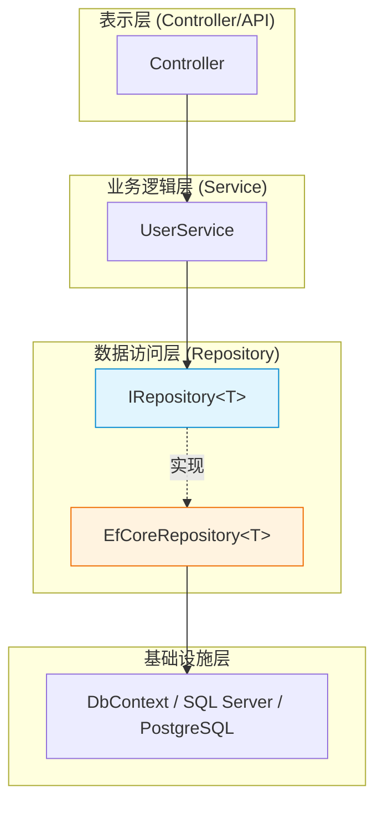
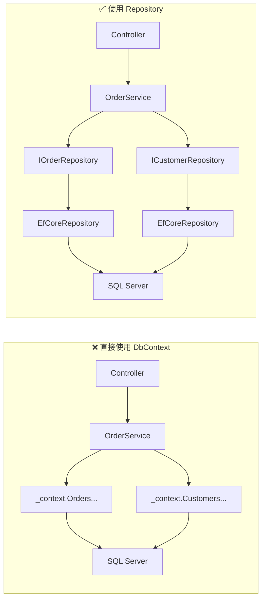
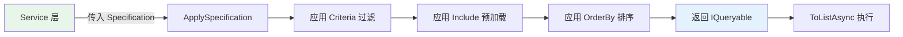
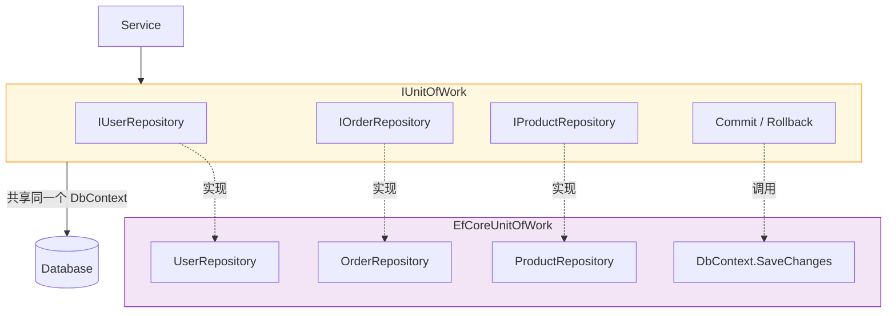

# Repository Pattern（仓储模式）

## 学习目标

学完本节，你将能够：

- 理解 Repository 模式的核心概念和设计动机
- 掌握 `IRepository<T>` 泛型接口的定义与实现
- 编写完整的 CRUD 操作封装
- 了解 Specification Pattern（查询规格模式）的基本用法
- 理解 Unit of Work 与 Repository 的协作关系
- 判断何时应该使用、何时不该使用 Repository 模式

## 前置知识

在开始之前，你需要了解：

- Entity Framework Core 的 DbContext 和 DbSet 用法
- C# 泛型接口和泛型类
- ASP.NET Core 依赖注入的基本概念
- LINQ 查询表达式

---

## 核心内容

### 1. 什么是 Repository？为什么需要它？

**Repository（仓储模式）** 是一种数据访问设计模式，它在业务逻辑层和数据访问层之间引入一个抽象层。Repository 充当内存中的对象集合，让调用方像操作集合一样操作持久化数据，而无需关心底层的数据库细节。

#### 核心理念



Repository 模式解决的核心问题是：**将数据访问逻辑从业务逻辑中分离出来，使代码更易测试、更易维护、更容易替换数据源。**

### 2. Repository vs 直接使用 DbContext 对比

直接在 Service 中使用 DbContext 是很多项目的常见做法，但它存在明显的问题：



| 维度 | 直接使用 DbContext | 使用 Repository |
|------|-------------------|-----------------|
| **可测试性** | 困难，需要 Mock DbContext | 容易，Mock 接口即可 |
| **关注点分离** | 业务逻辑与数据访问耦合 | 清晰分层 |
| **查询复用** | 相同查询散落各处 | 统一封装，一处定义多处使用 |
| **数据源替换** | 改动大，涉及所有 Service | 只需换 Repository 实现 |
| **代码量** | 较少 | 较多（有额外抽象层） |
| **学习曲线** | 低 | 中等 |

> **关键洞察**：Repository 的价值不在于"写得更少"，而在于"改得更容易"。当项目规模增长、团队扩大时，这个优势会越来越明显。

### 3. IRepository\<T\> 泛型接口定义

一个设计良好的泛型 Repository 接口是整个模式的基础：

```csharp
/// <summary>
/// 泛型仓储接口 - 定义所有实体共有的数据访问操作
/// </summary>
/// <typeparam name="TEntity">实体类型</typeparam>
public interface IRepository<TEntity> where TEntity : class, IEntity
{
    // ========== 查询操作 ==========

    /// <summary>
    /// 获取所有实体（注意：大数据集慎用）
    /// </summary>
    IQueryable<TEntity> GetAll();

    /// <summary>
    /// 根据主键获取单个实体
    /// </summary>
    Task<TEntity?> GetByIdAsync(Guid id);

    /// <summary>
    /// 根据条件查找（返回 IQueryable 支持后续链式查询）
    /// </summary>
    IQueryable<TEntity> Find(Expression<Func<TEntity, bool>> predicate);

    /// <summary>
    /// 根据条件查找（异步返回结果列表）
    /// </summary>
    Task<List<TEntity>> FindAsync(Expression<Func<TEntity, bool>> predicate);

    /// <summary>
    /// 获取符合条件的第一个实体
    /// </summary>
    Task<TEntity?> FirstOrDefaultAsync(Expression<Func<TEntity, bool>> predicate);

    /// <summary>
    /// 获取符合条件的唯一实体
    /// </summary>
    Task<TEntity?> SingleOrDefaultAsync(Expression<Func<TEntity, bool>> predicate);

    // ========== 写入操作 ==========

    /// <summary>
    /// 添加新实体
    /// </summary>
    Task AddAsync(TEntity entity);

    /// <summary>
    /// 批量添加
    /// </summary>
    Task AddRangeAsync(IEnumerable<TEntity> entities);

    /// <summary>
    /// 更新实体（EF Core 追踪后自动检测变更）
    /// </summary>
    void Update(TEntity entity);

    /// <summary>
    /// 删除实体
    /// </summary>
    void Delete(TEntity entity);

    /// <summary>
    /// 根据主键删除
    /// </summary>
    Task DeleteAsync(Guid id);

    // ========== 聚合操作 ==========

    /// <summary>
    /// 统计数量
    /// </summary>
    Task<int> CountAsync(Expression<Func<TEntity, bool>>? predicate = null);

    /// <summary>
    /// 判断是否存在
    /// </summary>
    Task<bool> AnyAsync(Expression<Func<TEntity, bool>> predicate);
}
```

对应的实体基接口：

```csharp
/// <summary>
/// 实体基接口 - 所有实体必须实现此接口
/// </summary>
public interface IEntity
{
    Guid Id { get; set; }
    DateTime CreatedAt { get; set; }
    DateTime? UpdatedAt { get; set; }
}
```

### 4. 具体 Repository 实现（EfCoreRepository\<T\>）

基于 EF Core 的泛型 Repository 实现：

```csharp
/// <summary>
/// EF Core 泛型仓储实现
/// </summary>
public class EfCoreRepository<TEntity> : IRepository<TEntity>
    where TEntity : class, IEntity
{
    protected readonly ApplicationDbContext _context;
    protected readonly DbSet<TEntity> _dbSet;

    public EfCoreRepository(ApplicationDbContext context)
    {
        _context = context;
        _dbSet = context.Set<TEntity>();
    }

    public IQueryable<TEntity> GetAll()
    {
        return _dbSet.AsNoTracking(); // 默认不追踪，提升只读查询性能
    }

    public async Task<TEntity?> GetByIdAsync(Guid id)
    {
        return await _dbSet.FindAsync(id);
    }

    public IQueryable<TEntity> Find(Expression<Func<TEntity, bool>> predicate)
    {
        return _dbSet.Where(predicate).AsNoTracking();
    }

    public async Task<List<TEntity>> FindAsync(Expression<Func<TEntity, bool>> predicate)
    {
        return await _dbSet.Where(predicate).ToListAsync();
    }

    public async Task<TEntity?> FirstOrDefaultAsync(
        Expression<Func<TEntity, bool>> predicate)
    {
        return await _dbSet.FirstOrDefaultAsync(predicate);
    }

    public async Task<TEntity?> SingleOrDefaultAsync(
        Expression<Func<TEntity, bool>> predicate)
    {
        return await _dbSet.SingleOrDefaultAsync(predicate);
    }

    public async Task AddAsync(TEntity entity)
    {
        entity.CreatedAt = DateTime.UtcNow;
        await _dbSet.AddAsync(entity);
    }

    public async Task AddRangeAsync(IEnumerable<TEntity> entities)
    {
        var now = DateTime.UtcNow;
        foreach (var entity in entities)
        {
            entity.CreatedAt = now;
        }
        await _dbSet.AddRangeAsync(entities);
    }

    public void Update(TEntity entity)
    {
        entity.UpdatedAt = DateTime.UtcNow;
        _dbSet.Update(entity);
    }

    public void Delete(TEntity entity)
    {
        _dbSet.Remove(entity);
    }

    public async Task DeleteAsync(Guid id)
    {
        var entity = await GetByIdAsync(id);
        if (entity != null)
        {
            _dbSet.Remove(entity);
        }
    }

    public async Task<int> CountAsync(
        Expression<Func<TEntity, bool>>? predicate = null)
    {
        return predicate == null
            ? await _dbSet.CountAsync()
            : await _dbSet.CountAsync(predicate);
    }

    public async Task<bool> AnyAsync(Expression<Func<TEntity, bool>> predicate)
    {
        return await _dbSet.AnyAsync(predicate);
    }
}
```

### 5. CRUD 操作完整示例

以用户管理为例，展示 Repository 在实际业务中的用法：

```csharp
// ====== 实体定义 ======
public class User : IEntity
{
    public Guid Id { get; set; }
    public string UserName { get; set; } = string.Empty;
    public string Email { get; set; } = string.Empty;
    public string? PhoneNumber { get; set; }
    public UserStatus Status { get; set; } = UserStatus.Active;
    public DateTime CreatedAt { get; set; }
    public DateTime? UpdatedAt { get; set; }
}

public enum UserStatus
{
    Active,
    Inactive,
    Banned
}

// ====== 专用仓储接口（继承泛型接口 + 领域特定方法）=====
public interface IUserRepository : IRepository<User>
{
    /// <summary>
    /// 根据邮箱查找用户
    /// </summary>
    Task<User?> GetByEmailAsync(string email);

    /// <summary>
    /// 获取活跃用户列表（分页）
    /// </summary>
    Task<PagedResult<User>> GetActiveUsersAsync(int page, int pageSize);

    /// <summary>
    /// 搜索用户（按用户名或手机号模糊匹配）
    /// </summary>
    Task<List<User>> SearchAsync(string keyword);
}

// ====== 专用仓储实现 ======
public class UserRepository : EfCoreRepository<User>, IUserRepository
{
    public UserRepository(ApplicationDbContext context) : base(context) { }

    public async Task<User?> GetByEmailAsync(string email)
    {
        return await _dbSet
            .FirstOrDefaultAsync(u => u.Email == email);
    }

    public async Task<PagedResult<User>> GetActiveUsersAsync(
        int page, int pageSize)
    {
        var query = _dbSet
            .Where(u => u.Status == UserStatus.Active)
            .OrderByDescending(u => u.CreatedAt);

        var totalCount = await query.CountAsync();
        var items = await query
            .Skip((page - 1) * pageSize)
            .Take(pageSize)
            .ToListAsync();

        return new PagedResult<User>(items, totalCount, page, pageSize);
    }

    public async Task<List<User>> SearchAsync(string keyword)
    {
        return await _dbSet
            .Where(u => u.UserName.Contains(keyword) ||
                        (u.PhoneNumber != null && u.PhoneNumber.Contains(keyword)))
            .Take(50) // 限制最大返回数
            .ToListAsync();
    }
}

// ====== 分页结果 DTO ======
public class PagedResult<T>
{
    public List<T> Items { get; }
    public int TotalCount { get; }
    public int Page { get; }
    public int PageSize { get; }
    public int TotalPages => (int)Math.Ceiling((double)TotalCount / PageSize);
    public bool HasPrevious => Page > 1;
    public bool HasNext => Page < TotalPages;

    public PagedResult(List<T> items, int totalCount, int page, int pageSize)
    {
        Items = items;
        TotalCount = totalCount;
        Page = page;
        PageSize = pageSize;
    }
}
```

### 6. 查询规格模式（Specification Pattern）简介

当查询条件变得复杂多变时，直接在 Repository 方法中硬编码 WHERE 条件会导致方法爆炸。**Specification Pattern** 将查询条件封装为可组合的规格对象：

```csharp
/// <summary>
/// 规格接口 - 定义可组合的查询条件
/// </summary>
public interface ISpecification<T>
{
    Expression<Func<T, bool>> Criteria { get; }
    List<Expression<Func<T, object>>> Includes { get; }
    List<string> IncludeStrings { get; }
    Expression<Func<T, object>>? OrderBy { get; }
    Expression<Func<T, object>>? OrderByDescending { get; }
}

/// <summary>
/// 规格基类
/// </summary>
public abstract class Specification<T> : ISpecification<T>
{
    public abstract Expression<Func<T, bool>> Criteria { get; }
    public List<Expression<Func<T, object>>> Includes { get; } = new();
    public List<string> IncludeStrings { get; } = new();
    public Expression<Func<T, object>>? OrderBy { get; protected set; }
    public Expression<Func<T, object>>? OrderByDescending { get; protected set; }

    protected void AddInclude(Expression<Func<T, object>> includeExpression)
    {
        Includes.Add(includeExpression);
    }
}

// ====== 用户规格示例 ======

/// <summary>
/// 活跃用户规格
/// </summary>
public class ActiveUserSpecification : Specification<User>
{
    public override Expression<Func<User, bool>> Criteria =>
        u => u.Status == UserStatus.Active;
}

/// <summary>
/// 按关键词搜索的用户规格
/// </summary>
public class UserSearchSpecification : Specification<User>
{
    private readonly string _keyword;

    public UserSearchSpecification(string keyword)
    {
        _keyword = keyword;
    }

    public override Expression<Func<User, bool>> Criteria =>
        u => u.UserName.Contains(_keyword) ||
             u.Email.Contains(_keyword);
}

/// <summary>
/// 复合规格：活跃且注册时间在指定日期之后的用户
/// </summary>
public class ActiveRecentUserSpecification : Specification<User>
{
    private readonly DateTime _since;

    public ActiveRecentUserSpecification(DateTime since)
    {
        _since = since;
        OrderByDescending = u => u.CreatedAt; // 按创建时间降序
    }

    public override Expression<Func<User, bool>> Criteria =>
        u => u.Status == UserStatus.Active && u.CreatedAt >= _since;
}
```

支持 Specification 的 Repository 扩展方法：

```csharp
public static class RepositorySpecificationExtensions
{
    /// <summary>
    /// 根据规格查询
    /// </summary>
    public static IQueryable<T> ApplySpecification<T>(
        this IRepository<T> repository,
        ISpecification<T> specification) where T : class, IEntity
    {
        var query = repository.GetAll();

        // 应用查询条件
        query = query.Where(specification.Criteria);

        // 应用预加载（Include）
        foreach (var include in specification.Includes)
        {
            query = query.Include(include);
        }

        // 应用排序
        if (specification.OrderBy != null)
        {
            query = query.OrderBy(specification.OrderBy);
        }
        else if (specification.OrderByDescending != null)
        {
            query = query.OrderByDescending(specification.OrderByDescending);
        }

        return query;
    }
}
```

使用方式：

```csharp
// 在 Service 层中组合使用
public async Task<List<User>> GetActiveRecentUsersAsync()
{
    var spec = new ActiveRecentUserSpecification(DateTime.UtcNow.AddDays(-30));
    var users = await _userRepository.ApplySpecification(spec).ToListAsync();
    return users;
}
```



### 7. Unit of Work 与 Repository 的关系

Repository 负责**单表/单实体的 CRUD 操作**，而 Unit of Work（工作单元）负责**跨多个 Repository 的事务协调**。它们的关系如下：



关键点：
- **同一个 Unit of Work 中的所有 Repository 共享同一个 DbContext 实例**
- 通过 Unit of Work 的 `Commit()` 方法统一调用 `SaveChanges()`
- 保证多个 Repository 操作在同一事务中完成或全部回滚

### 8. DI 注册配置

在 `Program.cs` 中注册 Repository 和 Unit of Work：

```csharp
// 方式一：每个实体单独注册
builder.Services.AddScoped<IUserRepository, UserRepository>();
builder.Services.AddScoped<IOrderRepository, OrderRepository>();
builder.Services.AddScoped<IProductRepository, ProductRepository>();

// 方式二：使用工厂批量注册（推荐用于大型项目）
builder.Services.AddScoped(typeof(IRepository<>), typeof(EfCoreRepository<>));

// 注册 Unit of Work
builder.Services.AddScoped<IUnitOfWork, EfCoreUnitOfWork>();
```

---

## 深入理解

> **为什么 Repository 要返回 IQueryable 而不是 IList？**

返回 `IQueryable<T>` 允许调用方在执行前继续构建查询（追加 Where/OrderBy/Take 等），查询只在真正枚举（ToList/FirstOrDefault 等）时才发送到数据库。这提供了最大的灵活性。

但也要注意风险：如果 Service 层直接暴露 `IQueryable` 给 Controller，可能导致 Controller 构造出低效查询。最佳实践是：**Repository 对内返回 IQueryable（供其他 Repository 或 Service 组合），对外（Controller 层）通过 Service 封装为具体的返回类型。**

> **为什么默认使用 AsNoTracking？**

对于只读查询（GetAll/Find），`AsNoTracking()` 告诉 EF Core 不对实体进行变更追踪。这意味着：
- 减少内存占用（不需要维护快照）
- 提升查询性能（无需生成变更检测快照）
- 当你确实需要修改实体时，应使用 GetById（不带 AsNoTracking）

---

## 常见陷阱

### DO / DON'T 清单

| DO (推荐做法) | DON'T (避免做法) |
|---------------|------------------|
| 为复杂查询创建专用 Repository 接口 | 把所有查询都塞进泛型 IRepository |
| 使用 Specification 组合复杂查询条件 | 在 Controller 里拼接 LINQ 表达式 |
| 泛型 Repository + 专用 Repository 结合使用 | 只用泛型 Repository 导致领域语义丢失 |
| AsNoTracking 用于只读查询 | 忘记 AsNoTracking 导致不必要的追踪开销 |
| 保持 Repository 方法粒度适中 | 一个方法做太多事情 |
| 通过 Unit of Work 管理事务边界 | 每个 Repository 各自 SaveChanges |

### 错误示例

```csharp
// ❌ 反模式：在 Controller 中直接操作 DbContext
[HttpGet("users")]
public async Task<IActionResult> GetUsers()
{
    // 违反分层原则，Controller 不应知道数据访问细节
    var users = await _dbContext.Users
        .Where(u => u.Status == UserStatus.Active)
        .OrderByDescending(u => u.CreatedAt)
        .Select(u => new { u.Id, u.UserName, u.Email })
        .ToListAsync();
    return Ok(users);
}

// ❌ 反模式：Repository 返回 DTO 而非实体
public async Task<UserDto> GetUserDtoAsync(Guid id)
{
    // Repository 应该返回实体，DTO 映射是 Service 层的职责
    var user = await _dbSet.FindAsync(id);
    return _mapper.Map<UserDto>(user);
}

// ❌ 反模式：Repository 内部包含业务逻辑
public async Task<bool> RegisterUserAsync(RegisterUserRequest request)
{
    // 注册逻辑（验证、加密密码、发邮件等）属于 Service 层
    if (await _dbSet.AnyAsync(u => u.Email == request.Email))
        throw new Exception("Email already exists");

    var user = new User { Email = request.Email, ... };
    await _dbSet.AddAsync(user);
    return true;
}
```

### 正确示例

```csharp
// ✅ 正确：清晰的职责划分
// Repository 层 - 纯粹的数据访问
public interface IUserRepository : IRepository<User>
{
    Task<User?> GetByEmailAsync(string email);
    Task<bool> ExistsByEmailAsync(string email);
}

// Service 层 - 业务逻辑
public class UserService
{
    private readonly IUserRepository _userRepository;
    private readonly IUnitOfWork _unitOfWork;

    public UserService(IUserRepository userRepository, IUnitOfWork unitOfWork)
    {
        _userRepository = userRepository;
        _unitOfWork = unitOfWork;
    }

    public async Task<Result<Guid>> RegisterUserAsync(RegisterUserRequest request)
    {
        // 业务验证
        if (!IsValidEmail(request.Email))
            return Result.Failure<Guid>("Invalid email format");

        // 业务规则检查
        if (await _userRepository.ExistsByEmailAsync(request.Email))
            return Result.Failure<Guid>("Email already registered");

        // 创建实体
        var user = new User
        {
            Id = Guid.NewGuid(),
            Email = request.Email,
            UserName = request.UserName,
            PasswordHash = _passwordHasher.Hash(request.Password),
            CreatedAt = DateTime.UtcNow
        };

        await _userRepository.AddAsync(user);
        await _unitOfWork.CommitAsync();

        return Result.Success(user.Id);
    }
}
```

---

## 动手练习

### 练习 1：实现 ProductRepository

**要求**：
基于以下 `Product` 实体，实现 `IProductRepository` 接口和 `EfCoreProductRepository` 类，包含：
- 基础 CRUD（继承 `IRepository<Product>`）
- 专有方法：`GetByCategoryAsync(string category)` -- 按分类获取商品
- 专有方法：`SearchProductsAsync(string keyword, decimal? minPrice, decimal? maxPrice)` -- 多条件搜索

**提示**：
- 参考 `UserRepository` 的实现方式
- 注意价格范围查询使用 `>=` 和 `<=` 组合条件

<details>
<summary>查看答案</summary>

```csharp
// 实体
public class Product : IEntity
{
    public Guid Id { get; set; }
    public string Name { get; set; } = string.Empty;
    public string Description { get; set; } = string.Empty;
    public decimal Price { get; set; }
    public string Category { get; set; } = string.Empty;
    public int Stock { get; set; }
    public bool IsAvailable { get; set; } = true;
    public DateTime CreatedAt { get; set; }
    public DateTime? UpdatedAt { get; set; }
}

// 专用接口
public interface IProductRepository : IRepository<Product>
{
    Task<List<Product>> GetByCategoryAsync(string category);
    Task<PagedResult<Product>> SearchProductsAsync(
        string keyword, decimal? minPrice, decimal? maxPrice,
        int page = 1, int pageSize = 20);
}

// 实现
public class ProductRepository : EfCoreRepository<Product>, IProductRepository
{
    public ProductRepository(ApplicationDbContext context) : base(context) { }

    public async Task<List<Product>> GetByCategoryAsync(string category)
    {
        return await _dbSet
            .Where(p => p.Category == category && p.IsAvailable)
            .OrderBy(p => p.Name)
            .ToListAsync();
    }

    public async Task<PagedResult<Product>> SearchProductsAsync(
        string keyword, decimal? minPrice, decimal? maxPrice,
        int page = 1, int pageSize = 20)
    {
        var query = _dbSet.AsNoTracking().Where(p => p.IsAvailable);

        if (!string.IsNullOrWhiteSpace(keyword))
        {
            query = query.Where(p =>
                p.Name.Contains(keyword) || p.Description.Contains(keyword));
        }

        if (minPrice.HasValue)
            query = query.Where(p => p.Price >= minPrice.Value);

        if (maxPrice.HasValue)
            query = query.Where(p => p.Price <= maxPrice.Value);

        var totalCount = await query.CountAsync();
        var items = await query
            .OrderBy(p => p.Name)
            .Skip((page - 1) * pageSize)
            .Take(pageSize)
            .ToListAsync();

        return new PagedResult<Product>(items, totalCount, page, pageSize);
    }
}
```

</details>

---

### 练习 2：编写用户搜索 Specification

**要求**：
创建一个 `AdvancedUserSearchSpecification`，支持组合以下条件：
- 关键词搜索（匹配用户名或邮箱）
- 状态过滤（可选）
- 注册日期范围（可选）
- 结果按注册时间降序排列

<details>
<summary>查看答案</summary>

```csharp
public class AdvancedUserSearchSpecification : Specification<User>
{
    private readonly string? _keyword;
    private readonly UserStatus? _status;
    private readonly DateTime? _startDate;
    private readonly DateTime? _endDate;

    public AdvancedUserSearchSpecification(
        string? keyword = null,
        UserStatus? status = null,
        DateTime? startDate = null,
        DateTime? endDate = null)
    {
        _keyword = keyword;
        _status = status;
        _startDate = startDate;
        _endDate = endDate;
        OrderByDescending = u => u.CreatedAt;
    }

    public override Expression<Func<User, bool>> Criteria
    {
        get
        {
            Expression<Func<User, bool>> expression = u => true; // 始终为真

            if (!string.IsNullOrWhiteSpace(_keyword))
            {
                var keyword = _keyword;
                Expression<Func<User, bool>> keywordExpr =
                    u => u.UserName.Contains(keyword) || u.Email.Contains(keyword);
                expression = expression.And(keywordExpr);
            }

            if (_status.HasValue)
            {
                var status = _status.Value;
                Expression<Func<User, bool>> statusExpr = u => u.Status == status;
                expression = expression.And(statusExpr);
            }

            if (_startDate.HasValue)
            {
                var start = _startDate.Value;
                Expression<Func<User, bool>> dateExpr = u => u.CreatedAt >= start;
                expression = expression.And(dateExpr);
            }

            if (_endDate.HasValue)
            {
                var end = _endDate.Value;
                Expression<Func<User, bool>> dateExpr = u => u.CreatedAt <= end;
                expression = expression.And(dateExpr);
            }

            return expression;
        }
    }
}

// 表达式组合辅助方法（使用 LinqKit 库或自定义 PredicateBuilder）
public static class ExpressionCombiner
{
    public static Expression<Func<T, bool>> And<T>(
        this Expression<Func<T, bool>> left,
        Expression<Func<T, bool>> right)
    {
        var invokedExpr = Expression.Invoke(right, left.Parameters);
        return Expression.Lambda<Func<T, bool>>(
            Expression.AndAlso(left.Body, invokedExpr), left.Parameters);
    }
}
```

</details>

---

### 练习 3：分析场景并选择方案

**场景**：你的团队正在开发一个电商系统，目前有以下情况：
- 数据库使用 SQL Server
- 项目处于 MVP 阶段，团队 3 人
- 预计未来可能切换到 PostgreSQL
- 查询相对简单，主要是 CRUD + 少量条件筛选

**问题**：是否应该引入 Repository 模式？请说明理由。

<details>
<summary>查看参考答案</summary>

**建议：引入轻量级 Repository 模式，理由如下：**

1. **MVP 阶段适合简化版**：不需要完整的 Specification Pattern，泛型 `IRepository<T>` + 少量专用 Repository 即可满足需求
2. **数据库迁移需求**：既然预期可能切换数据库，Repository 提供了数据访问抽象层，届时只需更换实现而不影响上层代码
3. **团队规模小**：不需要过度工程化，避免引入过多抽象增加认知负担
4. **查询简单**：不需要复杂的 Specification 组合，基本的 `Find(predicate)` 就够用了

**推荐的精简方案**：
```
IRepository<T> (泛型接口，含基本CRUD)
  └── EfCoreRepository<T> (EF Core 实现)
IUserRepository : IRepository<User> (仅添加 2-3 个专有方法)
  └── UserRepository : EfCoreRepository<User>
```

**暂不需要的**：
- 完整的 Specification Pattern（查询简单，暂时用不上）
- 读写分离的 Repository（MVP 阶段读写同库）
- 缓存装饰器（等有性能瓶颈再加）

</details>

---

## 本节小结

Repository 模式的核心价值在于**将数据访问逻辑抽象为可测试、可替换的接口层**。在实际项目中，推荐采用 **泛型 Repository（处理通用 CRUD）+ 专用 Repository（处理领域特有查询）** 的混合策略，既保证代码复用性又不丢失领域语义。配合 Specification Pattern 可以优雅地应对复杂多变的查询需求，而 Unit of Work 则确保跨 Repository 操作的事务一致性。

---

## 延伸阅读

- [[Unit of Work(工作单元)]] -- Repository 的天然搭档
- [[CQRS模式简介]] -- 读写分离架构中的 Repository 变体
- [Microsoft Docs: Repository Pattern](https://docs.microsoft.com/en-us/dotnet/architecture/microservices/microservice-domain-model/repository-pattern)
- [EF Core 文档: Repository 与 Unit of Work](https://docs.microsoft.com/en-us/ef/core/miscellaneous/)
- [Martin Fowler: Patterns of Enterprise Application Architecture - Repository](https://martinfowler.com/eaaCatalog/repository.html)

## 思考题

1. 如果一个项目中所有实体的查询都非常简单（只有基础的增删改查），是否有必要引入 Repository 模式？为什么？
2. Repository 返回 `IQueryable<T>` vs `Task<List<T>>` 各有什么优劣？在什么情况下选择哪种？
3. 如何在单元测试中 Mock 一个实现了 `IRepository<User>` 的依赖？请写出测试代码框架。

---
**上一节** | **[[依赖注入进阶]]** | **[[Unit of Work(工作单元)]]** | **🏠 [[HOME]]**
