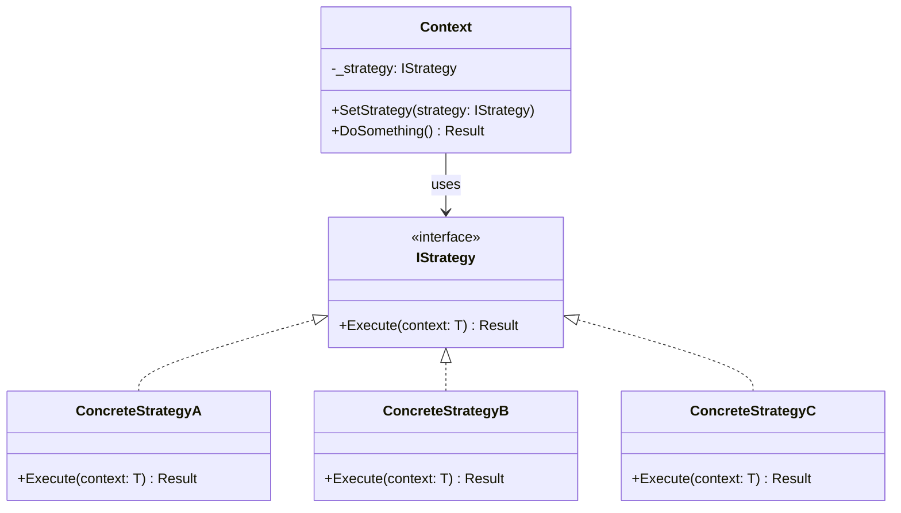
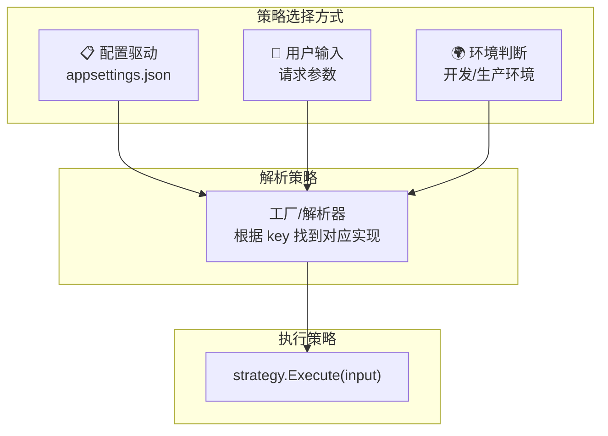
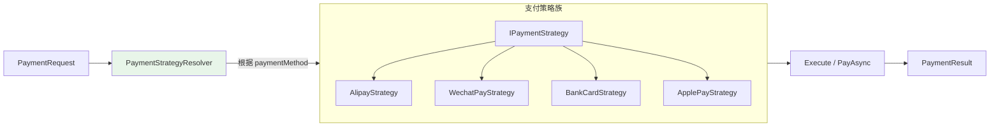
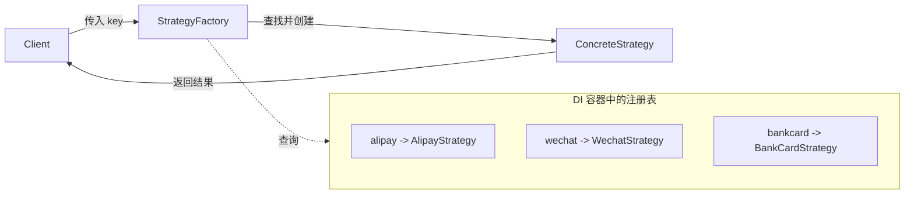

# Strategy Pattern（策略模式）

## 学习目标

学完本节，你将能够：

- 理解策略模式的定义和核心设计思想
- 掌握 IStrategy 接口 + 多个具体策略实现的标准写法
- 实现运行时动态选择策略的机制
- 在 ASP.NET Core 中应用策略模式解决实际问题（支付、排序、日志等）
- 理解策略模式如何体现开闭原则（OCP）
- 区分策略模式与简单 if-else 的本质差异

## 前置知识

在开始之前，你需要了解：

- C# 接口定义和实现
- 依赖注入的基本用法
- 多态和面向对象编程基础

---

## 核心内容

### 1. 策略模式的定义

**策略模式（Strategy Pattern）** 是一种行为型设计模式，它**定义一族算法，将每个算法封装到具有共同接口的独立类中，使它们可以互相替换**。策略模式让算法的变化独立于使用它的客户端。



**核心思想**：
- **封装变化**：将可能变化的算法/行为抽象为接口
- **委托而非继承**：通过组合（has-a）而非继承（is-a）来获得行为灵活性
- **运行时切换**：可以在不修改客户端代码的情况下更换算法实现

### 2. 标准结构实现

#### 基础框架代码

```csharp
/// <summary>
/// 策略接口 -- 定义所有策略的共同契约
/// </summary>
/// <typeparam name="TInput">输入类型</typeparam>
/// <typeparam name="TOutput">输出类型</typeparam>
public interface IStrategy<in TInput, out TOutput>
{
    /// <summary>
    /// 执行策略算法
    /// </summary>
    TOutput Execute(TInput input);

    /// <summary>
    /// 策略名称（用于日志、配置等）
    /// </summary>
    string Name { get; }
}

/// <summary>
/// 上下文类 -- 持有策略引用并委托执行
/// </summary>
public class StrategyContext<TInput, TOutput>
{
    private IStrategy<TInput, TOutput> _strategy;

    public StrategyContext(IStrategy<TInput, TOutput> strategy)
    {
        _strategy = strategy ?? throw new ArgumentNullException(nameof(strategy));
    }

    /// <summary>
    /// 运行时切换策略
    /// </summary>
    public void SetStrategy(IStrategy<TInput, TOutput> strategy)
    {
        _strategy = strategy ?? throw new ArgumentNullException(nameof(strategy));
    }

    /// <summary>
    /// 委托给当前策略执行
    /// </summary>
    public TOutput Execute(TInput input)
    {
        Console.WriteLine($"Using strategy: {_strategy.Name}");
        return _strategy.Execute(input);
    }
}
```

### 3. 运行时策略选择

策略模式的核心价值在于**运行时动态选择**，而不是编译时确定。以下是三种常见的策略选择机制：



#### 3.1 配置文件驱动的策略选择

```csharp
// ====== 场景：折扣计算策略 ======

// 折扣请求
public class DiscountRequest
{
    public decimal OriginalPrice { get; set; }
    public string CustomerLevel { get; set; } = "Regular"; // Regular/VIP/SVIP
    public DateTime OrderDate { get; set; }
}

// 折扣结果
public class DiscountResult
{
    public decimal OriginalPrice { get; set; }
    public decimal DiscountAmount { get; set; }
    public decimal FinalPrice { get; set; }
    public string AppliedStrategy { get; set; } = string.Empty;
    public string Description { get; set; } = string.Empty;
}

// 策略接口
public interface IDiscountStrategy : IStrategy<DiscountRequest, DiscountResult> { }

// ====== 具体策略实现 ======

/// <summary>
/// 无折扣策略 - 普通用户默认
/// </summary>
public class NoDiscountStrategy : IDiscountStrategy
{
    public string Name => "NoDiscount";

    public DiscountResult Execute(DiscountRequest input)
    {
        return new DiscountResult
        {
            OriginalPrice = input.OriginalPrice,
            DiscountAmount = 0,
            FinalPrice = input.OriginalPrice,
            AppliedStrategy = Name,
            Description = "无折扣"
        };
    }
}

/// <summary>
/// VIP 用户折扣 - 9折
/// </summary>
public class VipDiscountStrategy : IDiscountStrategy
{
    public string Name => "VipDiscount";

    public DiscountResult Execute(DiscountRequest input)
    {
        var discountRate = 0.1m; // 10% off
        var discountAmount = input.OriginalPrice * discountRate;

        return new DiscountResult
        {
            OriginalPrice = input.OriginalPrice,
            DiscountAmount = discountAmount,
            FinalPrice = input.OriginalPrice - discountAmount,
            AppliedStrategy = Name,
            Description = $"VIP用户享受{discountRate * 100}%折扣"
        };
    }
}

/// <summary>
/// SVIP 用户折扣 - 8折
/// </summary>
public class SvipDiscountStrategy : IDiscountStrategy
{
    public string Name => "SvipDiscount";

    public DiscountResult Execute(DiscountRequest input)
    {
        var discountRate = 0.2m; // 20% off
        var discountAmount = input.OriginalPrice * discountRate;

        return new DiscountResult
        {
            OriginalPrice = input.OriginalPrice,
            DiscountAmount = discountAmount,
            FinalPrice = input.OriginalPrice - discountAmount,
            AppliedStrategy = Name,
            Description = $"SVIP用户享受{discountRate * 100}%折扣"
        };
    }
}

/// <summary>
/// 节日特惠策略 - 特定日期额外5%折扣
/// </summary>
public class HolidayDiscountStrategy : IDiscountStrategy
{
    private readonly HashSet<DateTime> _holidayDates;

    public HolidayDiscountStrategy()
    {
        _holidayDates = new HashSet<DateTime>
        {
            new(DateTime.Now.Year, 11, 11), // 双11
            new(DateTime.Now.Year, 12, 12), // 双12
            new(DateTime.Now.Year, 6, 18),  // 618
        };
    }

    public string Name => "HolidayDiscount";

    public DiscountResult Execute(DiscountRequest input)
    {
        var baseDiscount = 0m;

        // 检查是否是节日
        if (_holidayDates.Contains(input.OrderDate.Date))
        {
            baseDiscount = 0.05m; // 节日额外5% off
        }

        var discountAmount = input.OriginalPrice * baseDiscount;

        return new DiscountResult
        {
            OriginalPrice = input.OriginalPrice,
            DiscountAmount = discountAmount,
            FinalPrice = input.OriginalPrice - discountAmount,
            AppliedStrategy = Name,
            Description = baseDiscount > 0
                ? $"节日特惠！额外{baseDiscount * 100}%折扣"
                : "今天不是节日，无节日折扣"
        };
    }
}
```

#### 3.2 策略解析器（结合 DI 容器）

```csharp
/// <summary>
/// 折扣策略解析器 - 根据条件选择合适的策略
/// </summary>
public interface IDiscountStrategyResolver
{
    IDiscountStrategy Resolve(DiscountRequest request);
}

public class DiscountStrategyResolver : IDiscountStrategyResolver
{
    private readonly IEnumerable<IDiscountStrategy> _strategies;
    private readonly ILogger<DiscountStrategyResolver> _logger;

    // 注入所有已注册的 IDiscountStrategy 实现
    public DiscountStrategyResolver(
        IEnumerable<IDiscountStrategy> strategies,
        ILogger<DiscountStrategyResolver> logger)
    {
        _strategies = strategies;
        _logger = logger;
    }

    public IDiscountStrategy Resolve(DiscountRequest request)
    {
        return request.CustomerLevel.ToUpperInvariant() switch
        {
            "SVIP" => GetStrategy<SvipDiscountStrategy>(),
            "VIP" => GetStrategy<VipDiscountStrategy>(),
            _ => GetStrategy<NoDiscountStrategy>()
        };

        // 辅助方法：按类型获取策略
        T GetStrategy<T>() where T : IDiscountStrategy
        {
            var strategy = _strategies.OfType<T>().FirstOrDefault();
            if (strategy == null)
            {
                _logger.LogWarning("Strategy {Type} not found, falling back to NoDiscount",
                    typeof(T).Name);
                return _strategies.OfType<NoDiscountStrategy>().First();
            }
            return strategy as IDiscountStrategy ?? _strategies.First();
        }
    }
}
```

#### 3.3 DI 注册和使用

```csharp
// Program.cs 注册所有策略
builder.Services.AddTransient<IDiscountStrategy, NoDiscountStrategy>();
builder.Services.AddTransient<IDiscountStrategy, VipDiscountStrategy>();
builder.Services.AddTransient<IDiscountStrategy, SvipDiscountStrategy>();
builder.Services.AddTransient<IDiscountStrategy, HolidayDiscountStrategy>();
builder.Services.AddScoped<IDiscountStrategyResolver, DiscountStrategyResolver>();

// Controller 中使用
[ApiController]
[Route("api/[controller]")]
public class OrderController : ControllerBase
{
    private readonly IDiscountStrategyResolver _resolver;

    public OrderController(IDiscountStrategyResolver resolver)
    {
        _resolver = resolver;
    }

    [HttpPost("calculate-discount")]
    public async Task<ActionResult<DiscountResult>> CalculateDiscount(
        [FromBody] DiscountRequest request)
    {
        // 1. 解析策略
        var strategy = _resolver.Resolve(request);

        // 2. 执行策略
        var result = strategy.Execute(request);

        return Ok(result);
    }
}
```

### 4. ASP.NET Core 中的实际应用场景

#### 场景一：多渠道支付策略



```csharp
// 支付策略接口
public interface IPaymentStrategy
{
    string ProviderName { get; }
    Task<PaymentResult> PayAsync(PaymentRequest request);
    Task<RefundResult> RefundAsync(RefundRequest request);
    bool Supports(string paymentMethod);
}

// 支付宝策略
public class AlipayStrategy : IPaymentStrategy
{
    public string ProviderName => "Alipay";
    private readonly AlipayClient _client;
    private readonly ILogger<AlipayStrategy> _logger;

    public AlipayStrategy(AlipayClient client, ILogger<AlipayStrategy> logger)
    {
        _client = client;
        _logger = logger;
    }

    public bool Supports(string paymentMethod) =>
        paymentMethod.Equals("alipay", StringComparison.OrdinalIgnoreCase);

    public async Task<PaymentResult> PayAsync(PaymentRequest request)
    {
        _logger.LogInformation("Processing Alipay payment for order {OrderId}",
            request.OrderId);

        try
        {
            var alipayRequest = new AlipayTradePagePayRequest
            {
                OutTradeNo = request.OrderId.ToString(),
                TotalAmount = request.Amount.ToString("F2"),
                Subject = request.Description,
                ProductCode = "FAST_INSTANT_TRADE_PAY"
            };

            var response = await _client.PageExecuteAsync(alipayRequest);

            return new PaymentResult
            {
                Success = true,
                TransactionId = response.TradeNo,
                PaymentUrl = response.Body,
                Provider = ProviderName
            };
        }
        catch (Exception ex)
        {
            _logger.LogError(ex, "Alipay payment failed");
            throw new PaymentException("支付宝支付失败", ex);
        }
    }

    public async Task<RefundResult> RefundAsync(RefundRequest request)
    {
        // 支付宝退款实现...
        return new RefundResult { Success = true };
    }
}
```

#### 场景二：排序策略

```csharp
/// <summary>
/// 排序策略接口
/// </summary>
public interface ISortStrategy<T>
{
    string Name { get; }
    IQueryable<T> Apply(IQueryable<T> query);
    string SortKey { get; }
}

/// <summary>
/// 按价格升序排列
/// </summary>
public class PriceAscSortStrategy : ISortStrategy<Product>
{
    public string Name => "PriceAscending";
    public string SortKey => "price_asc";
    public IQueryable<Product> Apply(IQueryable<Product> query) =>
        query.OrderBy(p => p.Price);
}

/// <summary>
/// 按时间降序排列
/// </summary>
public class TimeDescSortStrategy : ISortStrategy<Product>
{
    public string Name => "TimeDescending";
    public string SortKey => "time_desc";
    public IQueryable<Product> Apply(IQueryable<Product> query) =>
        query.OrderByDescending(p => p.CreatedAt);
}

/// <summary>
/// 按评分降序排列
/// </summary>
public class RatingDescSortStrategy : ISortStrategy<Product>
{
    public string Name => "RatingDescending";
    public string SortKey => "rating_desc";
    public IQueryable<Product> Apply(IQueryable<Product> query) =>
        query.OrderByDescending(p => p.Rating.AverageScore);
}

// 使用
[HttpGet("products")]
public async Task<ActionResult<PagedResult<Product>>> GetProducts(
    [FromQuery] string sortBy = "time_desc")
{
    var sortStrategy = _sortStrategies.FirstOrDefault(s =>
        s.SortKey == sortBy) ?? _defaultSortStrategy;

    var query = _productRepo.GetAll();
    query = sortStrategy.Apply(query); // 应用排序策略

    var products = await query.Skip((page - 1) * pageSize).Take(pageSize).ToListAsync();

    return Ok(new PagedResult<Product>(products, ...));
}
```

#### 场景三：日志策略

```csharp
/// <summary>
/// 日志策略接口 - 统一日志输出格式
/// </summary>
public interface ILogStrategy
{
    string Name { get; }
    Task WriteLogAsync(LogEntry entry);
}

/// <summary>
/// 文件日志策略
/// </summary>
public class FileLogStrategy : ILogStrategy
{
    public string Name => "FileLogger";
    private readonly string _logPath;

    public FileLogStrategy(IConfiguration config)
    {
        _logPath = config["Logging:FilePath"] ?? "logs/app.log";
    }

    public async Task WriteLogAsync(LogEntry entry)
    {
        var logLine = $"[{entry.Timestamp:yyyy-MM-dd HH:mm:ss}] " +
                      $"[{entry.Level}] [{entry.Category}] {entry.Message}{Environment.NewLine}";

        await File.AppendAllTextAsync(_logPath, logLine);
    }
}

/// <summary>
/// 数据库日志策略
/// </summary>
public class DatabaseLogStrategy : ILogStrategy
{
    public string Name => "DatabaseLogger";
    private readonly ApplicationDbContext _context;

    public DatabaseLogStrategy(ApplicationDbContext context)
    {
        _context = context;
    }

    public async Task WriteLogAsync(LogEntry entry)
    {
        await _context.LogEntries.AddAsync(new LogEntity
        {
            Timestamp = entry.Timestamp,
            Level = entry.Level.ToString(),
            Category = entry.Category,
            Message = entry.Message,
            Properties = JsonConvert.SerializeObject(entry.Properties)
        });
        await _context.SaveChangesAsync();
    }
}
```

### 5. 策略 vs 简单 if-else

这是初学者最容易困惑的问题：**既然最终都是选一个分支执行，为什么不直接用 if-else？**

```mermaid
graph TB
    subgraph IfElse["❌ if-else 方式"]
        IE1[if (type == "alipay") PayWithAlipay]
        IE2[else if (type == "wechat") PayWithWechat]
        IE3[else if (type == "bankcard") PayWithBankCard]
        IE4[else throw UnknownType]
        IE1 --> IE2 --> IE3 --> IE4
    end

    subgraph Strategy["✅ 策略模式"]
        S1[IPayStrategy 接口]
        S2[AlipayStrategy]
        S3[WechatStrategy]
        S4[BankCardStrategy]
        S5[Resolver.Resolve(type)]
        S6[strategy.Pay()]

        S1 --> S2
        S1 --> S3
        S1 --> S4
        S5 --> S6
    end
```

| 对比维度 | if-else | 策略模式 |
|---------|---------|---------|
| **新增支付方式** | 修改原有方法（违反 OCP） | 新增一个类（符合 OCP） |
| **测试** | 需要测试整个大方法 | 每个策略独立测试 |
| **复用性** | 逻辑绑定在调用方 | 策略可被多处复用 |
| **代码量（简单场景）** | 少 | 稍多 |
| **代码量（复杂场景）** | 方法膨胀难以维护 | 各自独立，清晰可控 |
| **运行时切换** | 困难 | 天然支持 |

**判断标准**：
- 分支逻辑**简单且稳定**（2-3个分支且不太会变） -> if-else 够用
- 分支逻辑**复杂或频繁变化** -> 策略模式
- 需要**运行时动态切换** -> 策略模式
- 不同分支需要**不同的依赖注入** -> 策略模式

### 6. 与工厂模式结合使用

策略模式和工厂模式是天然的搭档：**工厂负责创建/选择策略，策略负责执行算法**。



```csharp
/// <summary>
/// 泛型策略工厂
/// </summary>
public interface IStrategyFactory<TKey, TStrategy> where TStrategy : class
{
    TStrategy Create(TKey key);
}

/// <summary>
/// 基于 DI 容器的策略工厂实现
/// </summary>
public class DiStrategyFactory<TKey, TStrategy> : IStrategyFactory<TKey, TStrategy>
    where TStrategy : class
{
    private readonly IServiceProvider _serviceProvider;
    private readonly IDictionary<TKey, Type> _registry;
    private readonly ILogger _logger;

    public DiStrategyFactory(
        IServiceProvider serviceProvider,
        IDictionary<TKey, Type> registry,
        ILogger logger)
    {
        _serviceProvider = serviceProvider;
        _registry = registry;
        _logger = logger;
    }

    public TStrategy Create(TKey key)
    {
        if (!_registry.TryGetValue(key, out var strategyType))
        {
            _logger.LogWarning("Unknown strategy key: {Key}, using default", key);
            // 返回默认策略或抛出异常
        }

        return (TStrategy)_serviceProvider.GetRequiredService(strategyType);
    }
}

// 注册策略映射关系
var paymentRegistry = new Dictionary<string, Type>
{
    { "alipay", typeof(AlipayStrategy) },
    { "wechat", typeof(WechatStrategy) },
    { "bankcard", typeof(BankCardStrategy) }
};

builder.Services.AddSingleton(
    typeof(IStrategyFactory<string, IPaymentStrategy>),
    provider => new DiStrategyFactory<string, IPaymentStrategy>(
        provider, paymentRegistry,
        provider.GetRequiredService<ILogger<DiStrategyFactory<string, IPaymentStrategy>>>()));
```

---

## 深入理解

> **策略模式如何体现开闭原则（OCP）？**

开闭原则要求**对扩展开放，对修改关闭**。策略模式完美体现了这一点：

```csharp
// ✅ 对扩展开放：新增支付方式只需新增一个类
public class CryptoPaymentStrategy : IPaymentStrategy
{
    public string ProviderName => "Crypto";
    public Task<PaymentResult> PayAsync(PaymentRequest request) { /* ... */ }
    public Task<RefundResult> RefundAsync(RefundRequest request) { /* ... */ }
    public bool Supports(string method) => method == "crypto";
}
// 只需在 DI 中加一行注册即可，无需修改任何现有代码！

// ❌ 如果用 if-else，必须修改原有的方法来添加新分支
// 这就违反了 OCP
```

> **策略模式 vs 状态模式？**

两者结构相似但意图不同：
- **策略模式**：各策略之间是**平等替代**关系，通常由客户端主动选择
- **状态模式**：各状态之间有**转换关系**，状态转换通常是自动的（对象内部行为随状态改变而改变）

---

## 常见陷阱

### DO / DON'T 清单

| DO (推荐做法) | DON'T (避免做法) |
|---------------|------------------|
| 为每个策略定义清晰的接口契约 | 策略内部包含大量重复代码（提取基类或辅助方法） |
| 使用 DI 容器管理策略生命周期 | 手动 `new` 策略实例（无法利用 DI 的优势） |
| 策略保持无状态或有明确的状态管理 | 策略持有不该持有的跨请求状态 |
| 策略粒度适中（一个策略做一件事） | 一个策略类承担过多职责 |
| 提供合理的默认策略 | 忘记处理未知策略 key 导致异常 |
| 策略命名体现其意图 | 用 Strategy1/Strategy2 这种无意义命名 |

### 错误示例

```csharp
// ❌ 反模式：策略中包含大量 if-else（策略本身就没意义了）
public class UniversalPaymentStrategy : IPaymentStrategy
{
    public async Task<PaymentResult> PayAsync(PaymentRequest request)
    {
        // 策略内部又变成了 if-else，完全失去了策略模式的意义
        if (request.Method == "alipay")
        {
            // 支付宝逻辑...
        }
        else if (request.Method == "wechat")
        {
            // 微信逻辑...
        }
        // ...
    }
}

// ❌ 反模式：策略间有大量重复代码
public class AlipayStrategy : IPaymentStrategy
{
    public async Task<PaymentResult> PayAsync(PaymentRequest request)
    {
        ValidateRequest(request);      // 重复1
        CheckRiskControl(request);     // 重复2
        LogPaymentStart(request);      // 重复3
        // ... 具体支付逻辑
        LogPaymentEnd(result);         // 重复4
    }
}
public class WechatStrategy : IPaymentStrategy
{
    public async Task<PaymentResult> PayAsync(PaymentRequest request)
    {
        ValidateRequest(request);      // 同样的重复...
        CheckRiskControl(request);     // 同样的重复...
        LogPaymentStart(request);      // 同样的重复...
        // ... 具体支付逻辑
        LogPaymentEnd(result);         // 同样的重复...
    }
}
```

### 正确示例

```csharp
// ✅ 正确：提取公共逻辑到抽象基类
public abstract class BasePaymentStrategy : IPaymentStrategy
{
    protected readonly ILogger Logger;

    protected BasePaymentStrategy(ILogger logger)
    {
        Logger = logger;
    }

    public virtual async Task<PaymentResult> PayAsync(PaymentRequest request)
    {
        // 公共的前置处理
        ValidateRequest(request);
        await CheckRiskControlAsync(request);
        LogPaymentStart(request);

        // 调用子类的具体实现
        var result = await DoPayAsync(request);

        // 公共的后置处理
        LogPaymentEnd(result);
        return result;
    }

    protected abstract Task<PaymentResult> DoPayAsync(PaymentRequest request);

    private void ValidateRequest(PaymentRequest request) { /* ... */ }
    private async Task CheckRiskControlAsync(PaymentRequest request) { /* ... */ }
    private void LogPaymentStart(PaymentRequest request) { /* ... */ }
    private void LogPaymentEnd(PaymentResult result) { /* ... */ }
}

// 具体策略只需要实现核心差异部分
public class AlipayStrategy : BasePaymentStrategy
{
    public AlipayStrategy(ILogger<AlipayStrategy> logger) : base(logger) { }
    public string ProviderName => "Alipay";

    protected override async Task<PaymentResult> DoPayAsync(PaymentRequest request)
    {
        // 只关注支付宝特有的支付逻辑
        var client = new AlipayClient(/* ... */);
        return await client.PayAsync(request);
    }
}
```

---

## 动手练习

### 练习 1：实现导出策略

**要求**：
为一个数据报表系统实现多种导出格式策略：
- `CsvExportStrategy` -- 导出为 CSV 格式
- `ExcelExportStrategy` -- 导出为 Excel 格式 (.xlsx)
- `JsonExportStrategy` -- 导出为 JSON 格式
- `PdfExportStrategy` -- 导出为 PDF 格式

要求包含：
- `IExportStrategy<T>` 接口
- 至少 3 个具体策略实现
- 一个策略解析器（根据 URL 参数 `?format=csv/excel/json/pdf` 选择）
- API 端点返回对应的文件流

<details>
<summary>查看答案</summary>

```csharp
// 接口
public interface IExportStrategy
{
    string Format { get; }
    string ContentType { get; }
    string FileExtension { get; }
    Task<byte[]> ExportAsync<T>(IEnumerable<T> data);
}

// CSV 策略
public class CsvExportStrategy : IExportStrategy
{
    public string Format => "csv";
    public ContentType => "text/csv";
    public string FileExtension => ".csv";

    public async Task<byte[]> ExportAsync<T>(IEnumerable<T> data)
    {
        using var memoryStream = new MemoryStream();
        using var writer = new StreamWriter(memoryStream, leaveOpen: true);
        using var csv = new CsvHelper.CsvWriter(writer, CultureInfo.InvariantCulture);

        // 写入表头
        var properties = typeof(T).GetProperties();
        foreach (var prop in properties)
            csv.WriteField(prop.Name);
        csv.NextRecord();

        // 写入数据
        foreach (var item in data)
        {
            foreach (var prop in properties)
                csv.WriteField(prop.GetValue(item)?.ToString());
            csv.NextRecord();
        }

        await writer.FlushAsync();
        return memoryStream.ToArray();
    }
}

// JSON 策略
public class JsonExportStrategy : IExportStrategy
{
    public string Format => "json";
    public ContentType => "application/json";
    public string FileExtension => ".json";

    public Task<byte[]> ExportAsync<T>(IEnumerable<T> data)
    {
        var json = JsonSerializer.Serialize(data, new JsonSerializerOptions
        {
            WriteIndented = true,
            PropertyNamingPolicy = JsonNamingPolicy.CamelCase
        });
        return Task.FromResult(Encoding.UTF8.GetBytes(json));
    }
}

// Controller
[HttpGet("export")]
public async Task<IActionResult> ExportData([FromQuery] string format = "csv")
{
    var strategy = _exportStrategies.FirstOrDefault(s =>
        s.Format == format.ToLowerInvariant()) ?? _defaultStrategy;

    var data = await _reportService.GetDataAsync();
    var bytes = await strategy.ExportAsync(data);

    return File(bytes, strategy.ContentType,
        $"report_{DateTime.Now:yyyyMMdd_HHmmss}{strategy.FileExtension}");
}
```

</details>

---

### 练习 2：策略链 -- 组合多个折扣策略

**要求**：
设计一个系统允许叠加多个折扣策略。例如：
- VIP 用户先享受 9 折
- 再叠加节日特惠 5%
- 最终价格 = 原价 x 0.9 x 0.95

提示：考虑使用责任链模式或装饰器模式与策略模式组合。

<details>
<summary>查看答案</summary>

```csharp
/// <summary>
/// 可组合的折扣策略
/// </summary>
public interface IComposableDiscountStrategy
{
    string Name { get; }
    decimal Calculate(decimal currentPrice, DiscountContext context);
}

/// <summary>
/// 折扣上下文 -- 包含计算过程中需要的所有信息
/// </summary>
public class DiscountContext
{
    public string CustomerLevel { get; set; }
    public DateTime OrderDate { get; set; }
    public decimal OrderTotal { get; set; }
    public Dictionary<string, object> Metadata { get; set; } = new();
}

/// <summary>
/// VIP 折扣策略
/// </summary>
public class VipLevelDiscountStrategy : IComposableDiscountStrategy
{
    public string Name => "VipLevel";

    public decimal Calculate(decimal currentPrice, DiscountContext context)
    {
        return context.CustomerLevel.ToUpperInvariant() switch
        {
            "SVIP" => currentPrice * 0.80m,  // 8折
            "VIP" => currentPrice * 0.90m,   // 9折
            _ => currentPrice                 // 不打折
        };
    }
}

/// <summary>
/// 节日折扣策略
/// </summary>
public class HolidayDiscountStrategy : IComposableDiscountStrategy
{
    private static readonly HashSet<int> HolidayMonths = new() { 6, 11, 12 };

    public string Name => "Holiday";

    public decimal Calculate(decimal currentPrice, DiscountContext context)
    {
        if (HolidayMonths.Contains(context.OrderDate.Month))
            return currentPrice * 0.95m; // 节日月95折

        return currentPrice;
    }
}

/// <summary>
/// 满减策略
/// </summary>
public class ThresholdDiscountStrategy : IComposableDiscountStrategy
{
    public string Name => "Threshold";

    public decimal Calculate(decimal currentPrice, DiscountContext context)
    {
        // 满100减10，满200减30，满500减80
        return currentPrice switch
        {
            >= 500m => currentPrice - 80m,
            >= 200m => currentPrice - 30m,
            >= 100m => currentPrice - 10m,
            _ => currentPrice
        };
    }
}

/// <summary>
/// 折扣引擎 -- 按顺序执行多个策略
/// </summary>
public class DiscountEngine
{
    private readonly List<IComposableDiscountStrategy> _strategies;

    public DiscountEngine(IEnumerable<IComposableDiscountStrategy> strategies)
    {
        _strategies = strategies.OrderBy(s => s.Name).ToList(); // 按固定顺序
    }

    public DiscountResult Calculate(DiscountContext context)
    {
        var price = context.OrderTotal;
        var appliedStrategies = new List<string>();

        foreach (var strategy in _strategies)
        {
            var newPrice = strategy.Calculate(price, context);
            if (newPrice < price) // 只有实际产生折扣时才记录
            {
                appliedStrategies.Add($"{strategy.Name}: {price:C} -> {newPrice:C}");
                price = newPrice;
            }
        }

        return new DiscountResult
        {
            OriginalPrice = context.OrderTotal,
            FinalPrice = Math.Max(price, 0), // 价格不能为负
            DiscountAmount = context.OrderTotal - Math.Max(price, 0),
            AppliedStrategies = appliedStrategies
        };
    }
}
```

</details>

---

### 练习 3：思考题

你的团队正在开发一个通知系统，需要支持以下通知渠道：
- 邮件通知（SMTP）
- 短信通知（阿里云短信服务）
- 微信公众号模板消息
- App 内推送（WebSocket）
- 企业微信 Webhook

请分析：
1. 是否适合使用策略模式？为什么？
2. 策略接口应该怎么设计？
3. 如何处理某些渠道发送失败时的降级策略？

<details>
<summary>查看分析</summary>

**1. 是否适合？非常适合！**
- 每种通知渠道有不同的实现细节（API、协议、格式）
- 渠道可能会增加（比如未来加入飞书通知）
- 发送方不需要关心底层实现
- 可以在运行时根据用户偏好选择渠道

**2. 策略接口设计建议**：
```csharp
public interface INotificationStrategy
{
    string ChannelName { get; }
    ChannelType ChannelType { get; }
    Task<NotificationResult> SendAsync(NotificationMessage message);
    bool Supports(ChannelType type);
    bool IsAvailable(); // 渠道是否可用（健康检查）
}

public enum ChannelType { Email, Sms, Wechat, AppPush, WeCom }
```

**3. 降级策略方案**：
```csharp
public class NotificationService
{
    private readonly INotificationStrategy[] _primaryChannels;
    private readonly INotificationStrategy[] _fallbackChannels;

    public async Task<NotificationResult> SendWithFallbackAsync(
        NotificationMessage message, ChannelType preferredChannel)
    {
        // 优先使用指定渠道
        var primary = _primaryChannels.FirstOrDefault(c =>
            c.ChannelType == preferredChannel && c.IsAvailable());

        if (primary != null)
        {
            var result = await primary.SendAsync(message);
            if (result.Success) return result;
        }

        // 主渠道失败，尝试备用渠道
        foreach (var fallback in _fallbackChannels.Where(c => c.IsAvailable()))
        {
            var result = await fallback.SendAsync(message);
            if (result.Success) return result;
        }

        // 所有渠道都失败
        return NotificationResult.Failure("All notification channels failed");
    }
}
```

</details>

---

## 本节小结

策略模式是一种优雅地**将算法封装为可互换组件**的设计模式。其核心要点包括：

1. **接口即契约**：定义清晰的策略接口，所有策略遵循统一契约
2. **运行时灵活选择**：通过配置、用户输入或环境因素动态决定使用哪个策略
3. **完美契合开闭原则**：新增策略只需添加新类，无需修改现有代码
4. **与 DI 容器天然配合**：将所有策略注册到容器，通过 `IEnumerable<T>` 注入全部策略
5. **与工厂模式互补**：工厂负责"选哪个"，策略负责"怎么做"
6. **避免过度设计**：简单的 2-3 个分支且不会变化的场景，if-else 可能更直接

---

## 延伸阅读

- [[Factory Pattern(工厂模式)]] -- 策略模式的天然搭档
- [[Decorator Pattern(装饰器模式)]] -- 可用于包装策略以增强功能
- [Refactoring Guru: Strategy Pattern](https://refactoring.guru/design-patterns/strategy)
- [Microsoft Docs: Strategy Pattern in .NET](https://docs.microsoft.com/en-us/dotnet/architecture/microservices/microservice-domain-model/)

## 思考题

1. 策略模式中的策略应该是无状态的还是有状态的？两种方式各有什么优劣？
2. 当一个策略需要访问另一个策略的结果时（如先计算折扣，再根据折扣金额决定是否赠送优惠券），应该如何设计？
3. 如何对策略模式进行单元测试？是否需要 Mock DI 容器？

---
**[[依赖注入进阶]]** | **[[Factory Pattern(工厂模式)]]** | **🏠 [[HOME]]**
