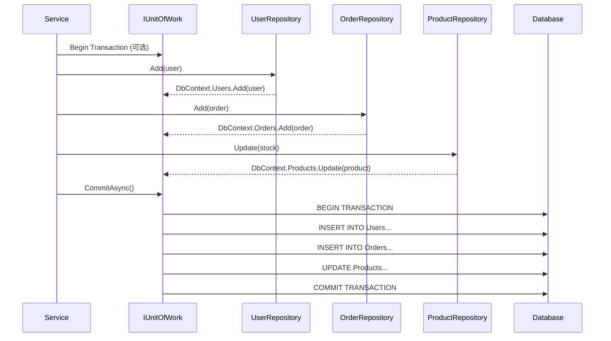
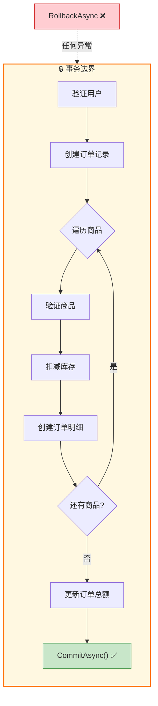
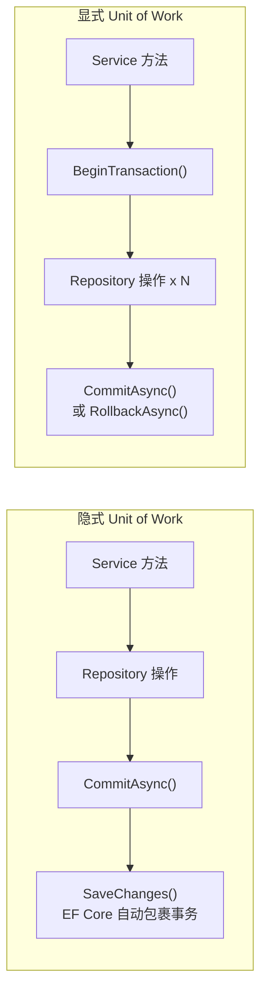
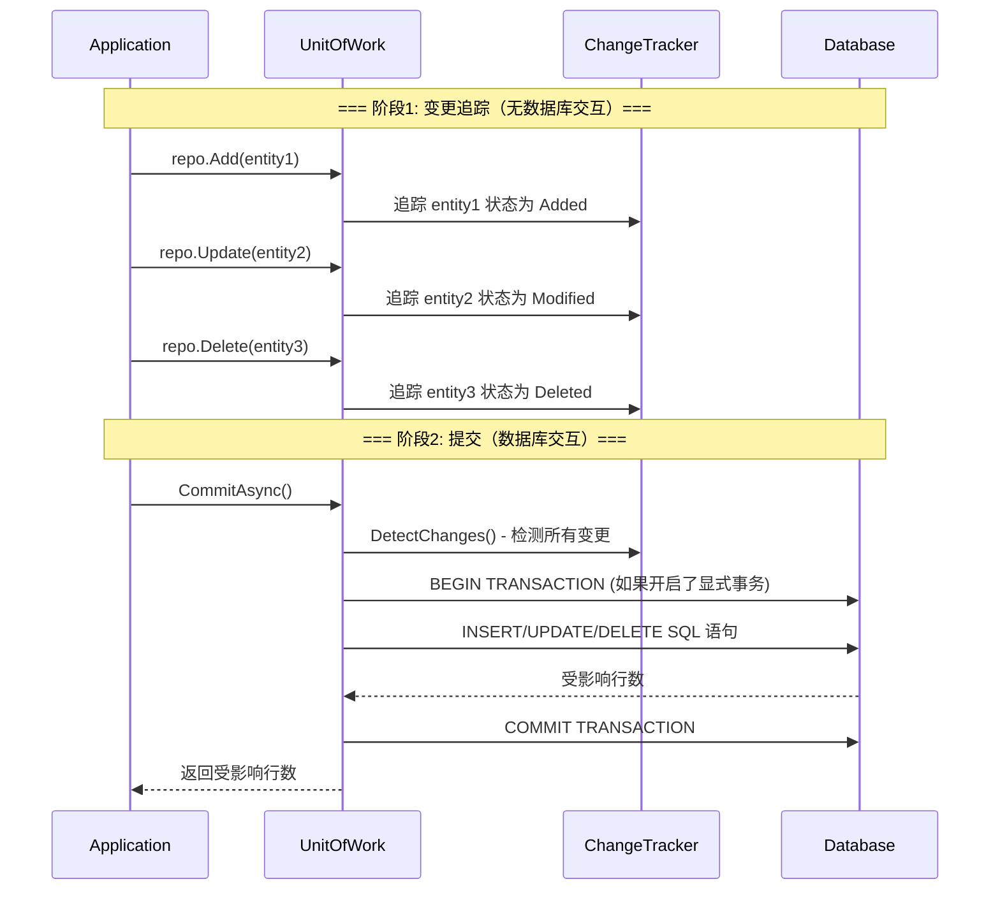

# Unit of Work（工作单元）

## 学习目标

学完本节，你将能够：

- 理解 Unit of Work 模式的核心概念和设计动机
- 掌握 `IUnitOfWork` 接口的设计与实现
- 实现 `EfCoreUnitOfWork` 管理 DbContext 的生命周期
- 正确处理 Commit / Rollback 操作
- 理解显式 vs 隐式 Unit of Work 的区别和选择
- 在复杂业务流程中正确使用事务边界

## 前置知识

在开始之前，你需要了解：

- Repository Pattern（仓储模式）的基本用法
- EF Core 中 `DbContext.SaveChanges()` 和事务的关系
- 数据库事务的 ACID 特性（原子性、一致性、隔离性、持久性）
- ASP.NET Core 依赖注入的生命周期（Scoped/Transient）

---

## 核心内容

### 1. Unit of Work 模式概念

**Unit of Work（工作单元）** 是一种用于协调多个数据源写入操作的设计模式。它的核心思想是：**将一组对数据库的操作视为一个原子性的工作单元，要么全部成功提交，要么全部回滚。**

在 EF Core 中，`DbContext` 本身就是一个隐式的 Unit of Work -- 它内部维护变更追踪（Change Tracker），调用 `SaveChanges()` 时将所有变更一次性写入数据库。但当我们引入了 Repository 模式后，需要一种机制来确保多个 Repository 共享同一个 DbContext 实例，并在合适的时机统一提交。



### 2. IUnitOfWork 接口设计

一个完善的 IUnitOfWork 接口应该包含以下能力：

```csharp
/// <summary>
/// 工作单元接口 - 协调多个 Repository 的事务操作
/// </summary>
public interface IUnitOfWork : IDisposable, IAsyncDisposable
{
    // ========== Repository 访问器 ==========

    /// <summary>
    /// 获取指定类型的 Repository（延迟创建）
    /// </summary>
    IRepository<TEntity> GetRepository<TEntity>() where TEntity : class, IEntity;

    // ========== 事务控制 ==========

    /// <summary>
    /// 显式开启数据库事务
    /// </summary>
    Task BeginTransactionAsync(
        IsolationLevel isolationLevel = IsolationLevel.ReadCommitted);

    /// <summary>
    /// 提交所有变更（调用 SaveChanges + 提交事务）
    /// </summary>
    Task<int> CommitAsync();

    /// <summary>
    /// 回滚当前事务中的所有变更
    /// </summary>
    Task RollbackAsync();

    // ========== 状态查询 ==========

    /// <summary>
    /// 是否存在活跃事务
    /// </summary>
    bool HasActiveTransaction { get; }

    /// <summary>
    /// 当前事务（如果有的话）
    /// </summary>
    IDbContextTransaction? CurrentTransaction { get; }
}
```

### 3. EfCoreUnitOfWork 实现

基于 EF Core 的完整实现：

```csharp
/// <summary>
/// EF Core 工作单元实现
/// 核心职责：
/// 1. 管理单一 DbContext 实例的生命周期
/// 2. 为所有 Repository 提供共享的 DbContext
/// 3. 统一管理事务边界
/// </summary>
public class EfCoreUnitOfWork : IUnitOfWork
{
    private readonly ApplicationDbContext _context;
    private readonly IDictionary<Type, object> _repositories;
    private IDbContextTransaction? _transaction;
    private bool _disposed = false;

    public EfCoreUnitOfWork(ApplicationDbContext context)
    {
        _context = context;
        _repositories = new Dictionary<Type, object>();
    }

    public bool HasActiveTransaction => _transaction != null;
    public IDbContextTransaction? CurrentTransaction => _transaction;

    // ========== Repository 访问器 ==========

    public IRepository<TEntity> GetRepository<TEntity>() where TEntity : class, IEntity
    {
        var type = typeof(TEntity);

        if (!_repositories.TryGetValue(type, out var repository))
        {
            // 延迟创建 Repository 实例
            // 所有 Repository 共享同一个 _context
            repository = new EfCoreRepository<TEntity>(_context);
            _repositories.Add(type, repository);
        }

        return (IRepository<TEntity>)repository;
    }

    // ========== 事务控制 ==========

    public async Task BeginTransactionAsync(
        IsolationLevel isolationLevel = IsolationLevel.ReadCommitted)
    {
        if (_transaction != null)
        {
            throw new InvalidOperationException(
                "A transaction is already in progress. " +
                "Commit or rollback the current transaction first.");
        }

        _transaction = await _context.Database.BeginTransactionAsync(isolationLevel);
    }

    public async Task<int> CommitAsync()
    {
        try
        {
            int result = await _context.SaveChangesAsync();

            if (_transaction != null)
            {
                await _transaction.CommitAsync();
                await _transaction.DisposeAsync();
                _transaction = null;
            }

            return result;
        }
        catch
        {
            await RollbackAsync();
            throw; // 重新抛出异常，让上层处理
        }
    }

    public async Task RollbackAsync()
    {
        try
        {
            if (_transaction != null)
            {
                await _transaction.RollbackAsync();
                await _transaction.DisposeAsync();
                _transaction = null;
            }
        }
        catch (Exception ex)
        {
            // Rollback 失败时记录日志，不掩盖原始异常
            Console.WriteLine($"Rollback failed: {ex.Message}");
        }

        // 清除所有未保存的变更追踪
        foreach (var entry in _context.ChangeTracker.Entries())
        {
            entry.State = EntityState.Detached;
        }
    }

    // ========== 资源释放 ==========

    public void Dispose()
    {
        Dispose(true);
        GC.SuppressFinalize(this);
    }

    public ValueTask DisposeAsync()
    {
        DisposeAsyncCore().AsTask().GetAwaiter().GetResult();
        GC.SuppressFinalize(this);
        return ValueTask.CompletedTask;
    }

    protected virtual void Dispose(bool disposing)
    {
        if (_disposed) return;

        if (disposing)
        {
            _transaction?.Dispose();
            _context.Dispose();
        }

        _disposed = true;
    }

    private async ValueTask DisposeAsyncCore()
    {
        if (_disposed) return;

        if (_transaction != null)
        {
            await _transaction.DisposeAsync();
        }

        await _context.DisposeAsync();
        _disposed = true;
    }
}
```

### 4. 与 Repository 的组合使用方式

```csharp
// ====== DI 注册 ======
public static class DependencyInjection
{
    public static IServiceCollection AddInfrastructure(
        this IServiceCollection services)
    {
        services.AddDbContext<ApplicationDbContext>(options =>
            options.UseSqlServer(
                Configuration.GetConnectionString("Default")));

        // Unit of Work 注册为 Scoped（与 HTTP 请求生命周期一致）
        services.AddScoped<IUnitOfWork, EfCoreUnitOfWork>();

        // 如果需要直接注入专用 Repository，也注册为 Scoped
        services.AddScoped<IUserRepository, UserRepository>();
        services.AddScoped<IOrderRepository, OrderRepository>();
        services.AddScoped<IProductRepository, ProductRepository>();

        return services;
    }
}
```

### 5. 事务边界管理

#### 场景一：简单 CRUD（隐式事务）

对于简单的单表操作，不需要显式开启事务：

```csharp
public class UserService
{
    private readonly IUserRepository _userRepository;
    private readonly IUnitOfWork _unitOfWork;

    public UserService(IUserRepository userRepository, IUnitOfWork unitOfWork)
    {
        _userRepository = userRepository;
        _unitOfWork = unitOfWork;
    }

    public async Task<Result<Guid>> CreateUserAsync(CreateUserRequest request)
    {
        var user = new User
        {
            Id = Guid.NewGuid(),
            UserName = request.UserName,
            Email = request.Email,
            CreatedAt = DateTime.UtcNow
        };

        await _userRepository.AddAsync(user);

        // SaveChanges 隐式在一个事务中执行
        // （EF Core 默认行为：单次 SaveChanges 自动包装在事务中）
        await _unitOfWork.CommitAsync();

        return Result.Success(user.Id);
    }
}
```

#### 场景二：跨多表操作（显式事务）

订单处理是典型的多表事务场景：

```csharp
/// <summary>
/// 订单服务 - 演示跨多表的 Unit of Work 用法
/// </summary>
public class OrderService
{
    private readonly IUnitOfWork _unitOfWork;
    private readonly IUserRepository _userRepository;
    private readonly IOrderRepository _orderRepository;
    private readonly IProductRepository _productRepository;
    private readonly IInventoryRepository _inventoryRepository;
    private readonly ILogger<OrderService> _logger;

    public OrderService(
        IUnitOfWork unitOfWork,
        IUserRepository userRepository,
        IOrderRepository orderRepository,
        IProductRepository productRepository,
        IInventoryRepository inventoryRepository,
        ILogger<OrderService> logger)
    {
        _unitOfWork = unitOfWork;
        _userRepository = userRepository;
        _orderRepository = orderRepository;
        _productRepository = productRepository;
        _inventoryRepository = inventoryRepository;
        _logger = logger;
    }

    /// <summary>
    /// 创建订单 - 涉及4张表的写入操作
    /// </summary>
    public async Task<Result<Guid>> CreateOrderAsync(CreateOrderRequest request)
    {
        // 1. 验证用户存在
        var user = await _userRepository.GetByIdAsync(request.UserId);
        if (user == null)
            return Result.Failure<Guid>("User not found");

        // 2. 显式开启事务
        await _unitOfWork.BeginTransactionAsync(IsolationLevel.ReadCommitted);

        try
        {
            // 3. 创建订单主记录
            var order = new Order
            {
                Id = Guid.NewGuid(),
                UserId = request.UserId,
                Status = OrderStatus.Pending,
                TotalAmount = 0,
                CreatedAt = DateTime.UtcNow
            };
            await _orderRepository.AddAsync(order);

            // 4. 创建订单明细 + 扣减库存（循环处理每个商品项）
            decimal totalAmount = 0;

            foreach (var item in request.Items)
            {
                // 4a. 获取商品信息并验证
                var product = await _productRepository.GetByIdAsync(item.ProductId);
                if (product == null)
                    throw new DomainException($"Product {item.ProductId} not found");

                if (!product.IsAvailable)
                    throw new DomainException($"Product {item.ProductId} is not available");

                // 4b. 扣减库存
                var inventory = await _inventoryRepository
                    .GetByProductIdAsync(item.ProductId);

                if (inventory == null || inventory.Quantity < item.Quantity)
                    throw new InsufficientStockException(
                        $"Insufficient stock for product {item.ProductId}");

                inventory.Quantity -= item.Quantity;
                inventory.UpdatedAt = DateTime.UtcNow;
                _inventoryRepository.Update(inventory); // 注意：Update 不需要 await

                // 4c. 创建订单明细
                var orderItem = new OrderItem
                {
                    Id = Guid.NewGuid(),
                    OrderId = order.Id,
                    ProductId = item.ProductId,
                    ProductName = product.Name,
                    UnitPrice = product.Price,
                    Quantity = item.Quantity,
                    Subtotal = product.Price * item.Quantity
                };

                // 通过 UnitOfWork 获取 OrderItemRepository
                var orderItemRepo = _unitOfWork.GetRepository<OrderItem>();
                await orderItemRepo.AddAsync(orderItem);

                totalAmount += orderItem.Subtotal;
            }

            // 5. 更新订单总金额
            order.TotalAmount = totalAmount;
            _orderRepository.Update(order);

            // 6. 统一提交所有变更
            var affectedRows = await _unitOfWork.CommitAsync();

            _logger.LogInformation(
                "Order created successfully: {OrderId}, Items: {Count}, Amount: {Amount}",
                order.Id, request.Items.Count, totalAmount);

            return Result.Success(order.Id);
        }
        catch (InsufficientStockException ex)
        {
            // 业务异常：自动回滚
            _logger.LogWarning(ex, "Insufficient stock during order creation");
            await _unitOfWork.RollbackAsync();
            return Result.Failure<Guid>(ex.Message);
        }
        catch (DomainException ex)
        {
            // 领域异常：自动回滚
            _logger.LogWarning(ex, "Domain rule violation");
            await _unitOfWork.RollbackAsync();
            return Result.Failure<Guid>(ex.Message);
        }
        catch (Exception ex)
        {
            // 未预期异常：自动回滚
            _logger.LogError(ex, "Unexpected error creating order");
            await _unitOfWork.RollbackAsync();
            throw; // 让全局异常处理器处理
        }
    }
}
```



### 6. 显式 vs 隐式 Unit of Work



| 对比维度 | 隐式 Unit of Work | 显式 Unit of Work |
|---------|-------------------|-------------------|
| **适用场景** | 单表/简单操作 | 多表/复杂业务流程 |
| **事务控制** | EF Core 自动管理 | 开发者完全控制 |
| **代码量** | 少 | 稍多 |
| **灵活性** | 低 | 高 |
| **隔离级别** | 使用数据库默认值 | 可自定义（ReadCommitted/Serializable 等） |
| **错误恢复** | 依赖 EF Core 行为 | 可精确控制回滚逻辑 |

**选择建议**：
- 单个实体的增删改 -> 隐式即可
- 涉及 2 张以上表的写操作 -> 显式事务
- 对数据一致性要求极高的金融场景 -> 显式事务 + Serializable 隔离级别

### 7. 与 DbContext.SaveChanges 的关系

理解 Unit of Work 与 `SaveChanges()` 的关系至关重要：



关键点说明：

1. **`Add/Update/Delete` 不立即访问数据库** -- 它们只是改变实体在 Change Tracker 中的状态
2. **`CommitAsync()` 内部调用 `SaveChanges()`** -- 此时才生成并发送 SQL 到数据库
3. **一次 `SaveChanges()` = 一个隐式事务** -- EF Core 保证所有变更原子性提交
4. **显式事务扩展了这个范围** -- 可以跨越多次 `SaveChanges()` 调用保持同一事务

---

## 深入理解

> **为什么 Unit of Work 要注册为 Scoped？**

ASP.NET Core 中 Scoped 生命周期意味着**每个 HTTP 请求创建一个实例，请求结束后销毁**。这与 Unit of Work 的语义完美契合：
- 一个请求 = 一个业务操作 = 一个工作单元
- 请求结束时自动释放 DbContext 连接
- 避免了 Singleton 导致的并发问题（DbContext 非线程安全）
- 避免了 Transient 导致的多个 DbContext 无法共享事务的问题

> **Repository 中的 DbContext 从哪来？**

在上述设计中，Repository 通过构造函数接收 `ApplicationDbContext`，而 `EfCoreUnitOfWork` 也持有同一个 `DbContext` 实例。当 DI 容器解析 `IUnitOfWork` 时：
1. 创建 `ApplicationDbContext`（Scoped）
2. 将同一个 `ApplicationDbContext` 注入 `EfCoreUnitOfWork`
3. 当 `GetRepository<T>()` 时，将这个 `DbContext` 传给新创建的 `EfCoreRepository<T>`
4. 所有 Repository 共享同一个 DbContext -> 同一个事务上下文

---

## 常见陷阱

### DO / DON'T 清单

| DO (推荐做法) | DON'T (避免做法) |
|---------------|------------------|
| 每个 HTTP 请求对应一个 Unit of Work | 跨请求共享 Unit of Work |
| 在 Service 层管理事务边界 | 在 Controller 层操作 Repository |
| Commit 后检查返回值确认成功 | 忽略 Commit 的返回值 |
| 异常时显式 Rollback | 依赖 GC 或 Finalizer 清理事务 |
| 使用 using 或依赖 DI 管理生命周期 | 手动 new UnitOfWrok 导致连接泄漏 |
| 事务尽量短小精悍 | 事务中包含耗时操作（如HTTP调用） |
| 选择合适的隔离级别 | 无脑用 Serializable（性能杀手） |

### 错误示例

```csharp
// ❌ 反模式：每个 Repository 各自 SaveChanges
public async Task TransferMoneyAsync(Guid fromId, Guid toId, decimal amount)
{
    // 扣款
    var fromAccount = await _accountRepo.GetByIdAsync(fromId);
    fromAccount.Balance -= amount;
    _accountRepo.Update(fromAccount);
    await _accountRepo.SaveOwnChanges(); // 第一次 SaveChanges

    // 加款
    var toAccount = await _accountRepo.GetByIdAsync(toId);
    toAccount.Balance += amount;
    _accountRepo.Update(toAccount);
    await _accountRepo.SaveOwnChanges(); // 第二次 SaveChanges

    // 问题：如果第二次失败，第一次已经提交！数据不一致！
}

// ❌ 反模式：事务中包含外部调用
public async Task CreateOrderAndNotifyAsync(OrderRequest request)
{
    await _unitOfWork.BeginTransactionAsync();

    try
    {
        // 数据库操作（快）
        var order = await CreateOrderInternal(request);
        await _unitOfWork.CommitAsync();

        // 外部 API 调用（慢，可能超时）-- 不应该在事务内！
        await _notificationService.SendEmailAsync(order.UserEmail, ...);
    }
    catch
    {
        await _unitOfWork.RollbackAsync();
    }
}

// ❌ 反模式：忘记 Rollback
public async Task DoSomethingAsync()
{
    await _unitOfWork.BeginTransactionAsync();

    // 如果这里抛出异常且没有 catch+rollback，
    // 事务会一直持有锁，阻塞其他操作！
    _repo.Add(new Entity());
    await _unitOfWork.CommitAsync(); // 可能永远不会执行到
}
```

### 正确示例

```csharp
// ✅ 正确：完整的异常处理 + Rollback
public async Task<Result> ProcessPaymentAsync(PaymentRequest request)
{
    await _unitOfWork.BeginTransactionAsync(IsolationLevel.ReadCommitted);

    try
    {
        // 1. 快速验证（纯内存操作）
        var validation = ValidatePayment(request);
        if (!validation.IsValid)
            return Result.Failure(validation.Errors);

        // 2. 数据库操作（快）
        var payment = await ProcessPaymentInternal(request);
        await _unitOfWork.CommitAsync();

        // 3. 后续通知（事务外，异步执行）
        _ = Task.Run(() => SendNotifications(payment));

        return Result.Success();
    }
    catch (DbUpdateConcurrencyException ex)
    {
        await _unitOfWork.RollbackAsync();
        _logger.LogWarning(ex, "Concurrency conflict in payment processing");
        return Result.Failure("Please retry - data was modified by another process");
    }
    catch (Exception ex)
    {
        await _unitOfWork.RollbackAsync();
        _logger.LogError(ex, "Payment processing failed");
        throw;
    }
}
```

---

## 动手练习

### 练习 1：实现银行转账功能

**要求**：
使用 Unit of Work + Repository 模式实现银行转账功能，要求：
- 涉及两个账户（转出账户和转入账户）
- 扣款和加款必须在同一事务中完成
- 余额不足时回滚整个操作
- 记录交易流水到 TransactionHistory 表

**提示**：
- 需要 `IAccountRepository` 和 `ITransactionHistoryRepository`
- 使用显式事务
- 注意金额精度（使用 decimal）

<details>
<summary>查看答案</summary>

```csharp
// 实体
public class Account : IEntity
{
    public Guid Id { get; set; }
    public string AccountNumber { get; set; } = string.Empty;
    public string OwnerName { get; set; } = string.Empty;
    public decimal Balance { get; set; }
    public DateTime CreatedAt { get; set; }
    public DateTime? UpdatedAt { get; set; }
}

public class TransactionHistory : IEntity
{
    public Guid Id { get; set; }
    public Guid FromAccountId { get; set; }
    public Guid ToAccountId { get; set; }
    public decimal Amount { get; set; }
    public string Reference { get; set; } = string.Empty;
    public DateTime CreatedAt { get; set; }
}

// 服务实现
public class BankingService
{
    private readonly IUnitOfWork _unitOfWork;
    private readonly ILogger<BankingService> _logger;

    public BankingService(IUnitOfWork unitOfWork, ILogger<BankingService> logger)
    {
        _unitOfWork = unitOfWork;
        _logger = logger;
    }

    public async Task<Result> TransferAsync(
        Guid fromAccountId, Guid toAccountId,
        decimal amount, string reference)
    {
        if (amount <= 0)
            return Result.Failure("Amount must be positive");

        await _unitOfWork.BeginTransactionAsync(IsolationLevel.ReadCommitted);

        try
        {
            var accountRepo = _unitOfWork.GetRepository<Account>();
            var historyRepo = _unitOfWork.GetRepository<TransactionHistory>();

            // 1. 获取转出账户（带悲观锁，防止并发修改）
            var fromAccount = await accountRepo.FirstOrDefaultAsync(
                a => a.Id == fromAccountId);

            if (fromAccount == null)
                throw new DomainException("Source account not found");

            // 2. 余额校验
            if (fromAccount.Balance < amount)
                throw new DomainException("Insufficient funds");

            // 3. 获取转入账户
            var toAccount = await accountRepo.FirstOrDefaultAsync(
                a => a.Id == toAccountId);

            if (toAccount == null)
                throw new DomainException("Destination account not found");

            // 4. 执行转账
            fromAccount.Balance -= amount;
            fromAccount.UpdatedAt = DateTime.UtcNow;
            accountRepo.Update(fromAccount);

            toAccount.Balance += amount;
            toAccount.UpdatedAt = DateTime.UtcNow;
            accountRepo.Update(toAccount);

            // 5. 记录流水
            var history = new TransactionHistory
            {
                Id = Guid.NewGuid(),
                FromAccountId = fromAccountId,
                ToAccountId = toAccountId,
                Amount = amount,
                Reference = reference,
                CreatedAt = DateTime.UtcNow
            };
            await historyRepo.AddAsync(history);

            // 6. 提交事务
            await _unitOfWork.CommitAsync();

            _logger.LogInformation(
                "Transfer completed: {From} -> {To}, Amount: {Amount}",
                fromAccountId, toAccountId, amount);

            return Result.Success();
        }
        catch (DomainException ex)
        {
            await _unitOfWork.RollbackAsync();
            _logger.LogWarning(ex, "Transfer failed: {Message}", ex.Message);
            return Result.Failure(ex.Message);
        }
        catch (Exception ex)
        {
            await _unitOfWork.RollbackAsync();
            _logger.LogError(ex, "Unexpected error during transfer");
            throw;
        }
    }
}
```

</details>

---

### 练习 2：设计支持嵌套事务的 Unit of Work

**思考题**：
在某些场景下，外层 Service 调用了内层 Service，两者都需要事务保护。如何设计一个支持**事务嵌套**（或事务传播）的 Unit of Work？

例如：
```
OrderService.CreateOrder()  -- 开启事务
  └── InventoryService.ReserveStock()  -- 也想开启事务？
  └── PointsService.AddPoints()  -- 也想开启事务？
```

<details>
<summary>查看思路</summary>

**方案一：事务检测模式（推荐）**
```csharp
public async Task BeginTransactionAsync(IsolationLevel level = ReadCommitted)
{
    // 如果已有事务，则跳过（加入现有事务）
    if (_transaction != null)
    {
        _logger.LogDebug("Joining existing transaction");
        return;
    }
    _transaction = await _context.Database.BeginTransactionAsync(level);
}
```
这种方式下，只有最外层真正开启事务，内层 Service 的 `BeginTransaction` 调用会被忽略。

**方案二：Savepoint（事务保存点）**
```csharp
public async Task CreateSavepointAsync(string name)
{
    await _context.Database.CreateSavepointAsync(name);
}

public async Task RollbackToSavepointAsync(string name)
{
    await _context.Database.RollbackToSavepointAsync(name);
}
```
EF Core 支持事务保存点，可以实现部分回滚。

**方案三：完全委托给外层**
内层 Service 不管理事务，文档约定"调用方负责事务"。这是最简单也最常见的做法。

</details>

---

### 练习 3：分析以下代码的事务问题

```csharp
public async Task RegisterAndSubscribeAsync(UserRegistrationDto dto)
{
    // 步骤1：注册用户
    var user = new User { Email = dto.Email, Name = dto.Name };
    await _userRepo.AddAsync(user);
    await _unitOfWork.CommitAsync(); // 第一次提交

    // 步骤2：订阅邮件列表（调用外部API）
    await _emailService.SubscribeAsync(dto.Email);

    // 步骤3：发送欢迎邮件
    await _emailService.SendWelcomeEmail(dto.Email);

    // 步骤4：记录注册日志
    var log = new RegistrationLog { UserId = user.Id, ... };
    await _logRepo.AddAsync(log);
    await _unitOfWork.CommitAsync(); // 第二次提交
}
```

请分析这段代码可能存在的问题，并提出改进方案。

<details>
<summary>查看分析与改进</summary>

**存在的问题**：

1. **两次 Commit 导致非原子性**：步骤1已经提交，如果步骤2-4中任意一步失败，用户已注册但后续操作未完成，数据处于不一致状态
2. **外部API调用不应在事务内**：邮件订阅API可能很慢甚至超时，长时间持有数据库事务会导致锁竞争
3. **最终一致性考虑**：用户注册是核心操作，邮件订阅和欢迎邮件是非核心操作，它们可以异步处理

**改进方案**：

```csharp
public async Task<Result<Guid>> RegisterAndSubscribeAsync(UserRegistrationDto dto)
{
    // ====== 核心事务：只包含必须原子化的操作 ======
    await _unitOfWork.BeginTransactionAsync();

    try
    {
        // 1. 注册用户
        var user = new User { Email = dto.Email, Name = dto.Name };
        await _userRepo.AddAsync(user);

        // 2. 记录注册日志（与用户注册同事务）
        var log = new RegistrationLog { UserId = user.Id, ... };
        await _logRepo.AddAsync(log);

        await _unitOfWork.CommitAsync();
    }
    catch
    {
        await _unitOfWork.RollbackAsync();
        throw;
    }

    // ====== 非核心操作：事务外异步执行（最终一致性）=====
    try
    {
        // 并行执行非关键操作，不阻塞响应
        var tasks = new[]
        {
            _emailService.SubscribeAsync(dto.Email),
            _emailService.SendWelcomeEmail(dto.Email)
        };
        await Task.WhenAll(tasks);
    }
    catch (Exception ex)
    {
        // 非核心操作失败不影响主流程，仅记录日志
        _logger.LogWarning(ex, "Post-registration tasks failed for user {UserId}", user.Id);
    }

    return Result.Success(user.Id);
}
```

**原则总结**：事务只应包裹**必须保持原子性的核心数据操作**，外部通信、通知等非核心操作应在事务外执行。

</details>

---

## 本节小结

Unit of Work 模式是 Repository 模式的天然搭档，它解决了"多个 Repository 如何共享事务"的核心问题。其设计要点包括：

1. **单一 DbContext 实例**：通过 Scoped 生命周期确保同一请求内的所有 Repository 共享同一个 DbContext
2. **统一的提交/回滚入口**：`CommitAsync()` / `RollbackAsync()` 作为唯一的事务控制点
3. **灵活的事务策略**：简单操作可用隐式事务，复杂业务流程使用显式事务
4. **健壮的异常处理**：务必在 catch 块中调用 `RollbackAsync()`，防止事务泄漏

---

## 延伸阅读

- [[Repository Pattern(仓储模式)]] -- Unit of Work 的前置知识
- [[CQRS模式简介]] -- 更复杂的读写分离架构
- [Microsoft Docs: Implementing Repository and Unit of Work](https://docs.microsoft.com/en-us/dotnet/architecture/microservices/microservice-domain-model/implement-repository-unit-of-work)
- [Martin Fowler: Unit of Work](https://martinfowler.com/eaaCatalog/unitOfWork.html)
- [EF Core 文档: Transactions](https://docs.microsoft.com/en-us/ef/core/saving/transactions)

## 思考题

1. 为什么不应该把 Unit of Work 注册为 Singleton？如果这样做会发生什么问题？
2. 在微服务架构中，Unit of Work 模式是否仍然适用？跨服务的分布式事务如何处理？
3. `SaveChanges(false)` + `AcceptAllChanges()` 这种两阶段提交模式有什么用途？什么场景下需要用到？

---
**[[Repository Pattern(仓储模式)]]** | **[[依赖注入进阶]]** | **🏠 [[HOME]]**
