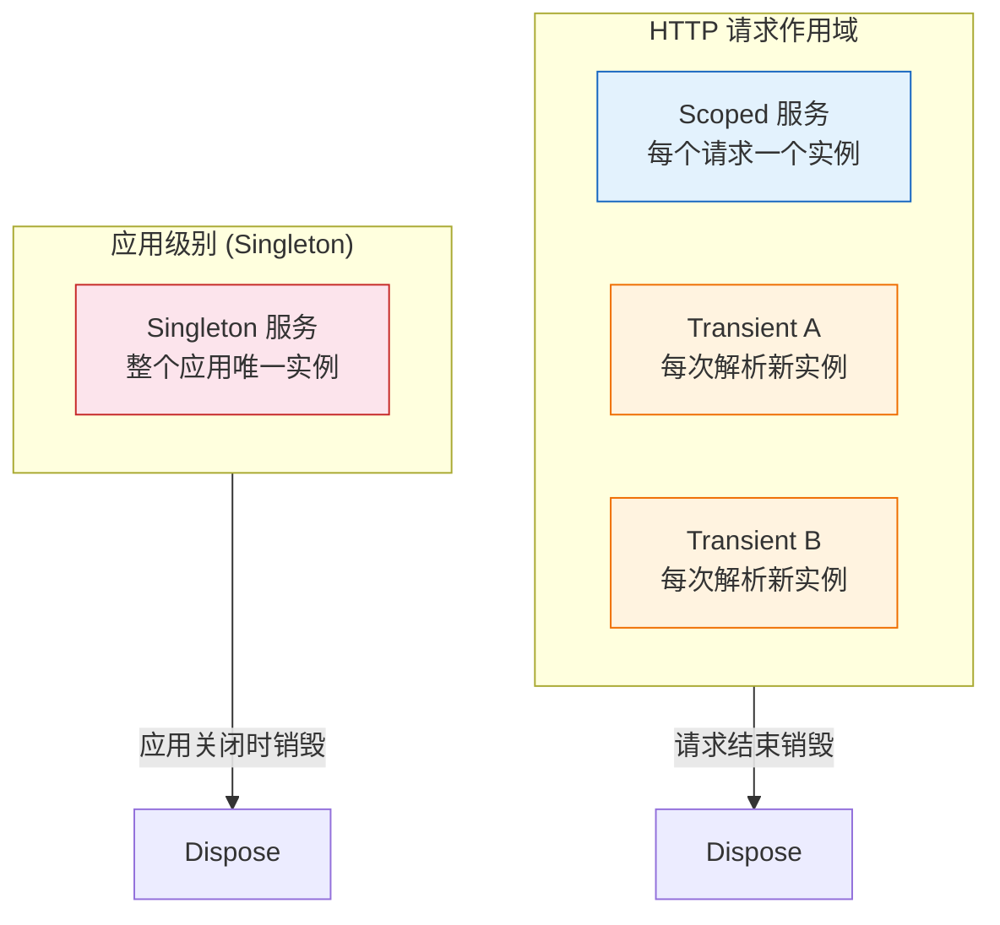
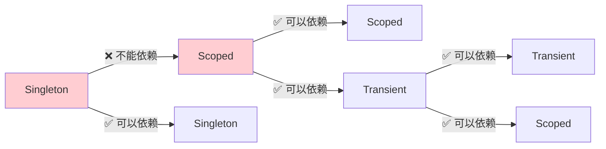
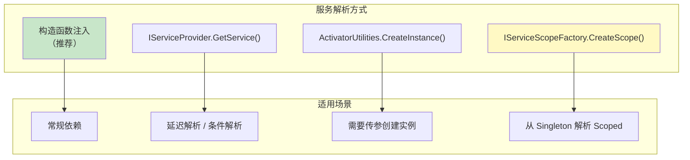
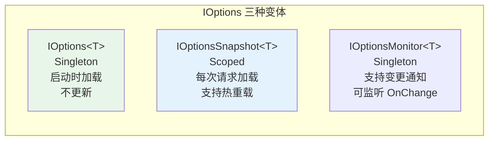
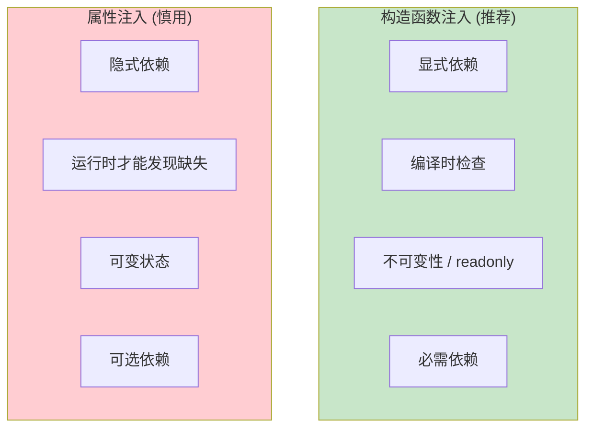

# 依赖注入进阶

## 学习目标

学完本节，你将能够：

- 深入理解三种服务生命周期（Transient/Scoped/Singleton）的内部机制
- 掌握工厂模式注册的多种方式（工厂委托、抽象工厂）
- 熟练运用多种服务解析方式（构造函数注入、IServiceProvider、ActivatorUtilities）
- 正确使用 IServiceScopeFactory 解决跨生命周期问题
- 理解 IOptionsSnapshot 的热重载机制
- 了解第三方容器集成（以 Autofac 为例）
- 识别并避免常见的 DI 反模式

## 前置知识

在开始之前，你需要了解：

- ASP.NET Core 内置依赖注入容器的基本用法
- `services.AddSingleton()` / `AddScoped()` / `AddTransient()` 的基本区别
- 构造函数注入的基本模式
- 接口与实现分离的设计原则

---

## 核心内容

### 1. 回顾 DI 基础：三种服务生命周期



#### 三种生命周期的详细对比

| 特性 | Transient | Scoped | Singleton |
|------|-----------|--------|-----------|
| **实例创建** | 每次注入/解析时新建 | 每个 HTTP 请求创建一次 | 首次创建后复用 |
| **适用场景** | 无状态、轻量级服务 | 每个请求需要独立状态的服务 | 全局配置、缓存 |
| **线程安全** | 天然安全（各实例独立） | 同一请求内安全，跨请求需注意 | 必须保证线程安全 |
| **内存占用** | 可能较高（大量实例） | 中等 | 最低（只有一个） |
| **典型例子** | `IRepository<T>`、`IMapper` | `DbContext`、`IUnitOfWork` | `IMemoryCache`、配置对象 |

#### 生命周期陷阱：捕获错误的依赖关系



**关键规则**：
- **Singleton 不能依赖 Scoped 或 Transient** -- 这会导致 Scoped/Transient 实例被 Singleton 长期持有，无法释放
- **Scoped 不能依赖 Singleton** -- 实际上这是允许的，但要注意 Singleton 的线程安全性
- **解决跨生命周期问题的方案**：使用 `IServiceScopeFactory`（后面详述）

### 2. 工厂模式注册

当服务的创建逻辑比较复杂时（需要根据条件选择实现、需要运行时参数等），工厂模式注册就派上用场了。

#### 2.1 工厂委托注册

```csharp
// ====== 基本用法 ======
// 根据配置动态选择实现
builder.Services.AddScoped<IPaymentService>(provider =>
{
    var config = provider.GetRequiredService<IConfiguration>();
    var paymentProvider = config["Payment:Provider"];

    return paymentProvider switch
    {
        "alipay" => new AlipayService(config),
        "wechat" => new WechatPayService(config),
        "stripe" => new StripeService(config),
        _ => throw new InvalidOperationException(
            $"Unsupported payment provider: {paymentProvider}")
    };
});

// ====== 复杂工厂：带运行时参数 ======
// 有时候需要在解析时传入额外参数
public interface IDataExporter
{
    Task ExportAsync(string filePath, ExportFormat format);
}

public enum ExportFormat { Csv, Excel, Json }

// 注册工厂委托
builder.Services.AddTransient<IDataExporter>((provider, args) =>
{
    var format = (ExportFormat)args[0]; // 从参数获取
    var logger = provider.GetRequiredService<ILoggerFactory>();

    return format switch
    {
        ExportFormat.Csv => new CsvDataExporter(logger.CreateLogger("Csv")),
        ExportFormat.Excel => new ExcelDataExporter(logger.CreateLogger("Excel")),
        ExportFormat.Json => new JsonDataExporter(logger.CreateLogger("Json")),
        _ => throw new ArgumentException($"Unsupported format: {format}")
    };
});

// 使用时通过 ActivatorUtilities 传入参数
var exporter = ActivatorUtilities.CreateInstance<IDataExporter>(
    provider, ExportFormat.Excel);
await exporter.ExportAsync("data.xlsx", ExportFormat.Excel);
```

#### 2.2 抽象工厂模式

当需要创建一组相关对象（产品家族）时，使用抽象工厂：

```csharp
/// <summary>
/// 数据库连接抽象工厂
/// </summary>
public interface IDatabaseConnectionFactory
{
    IDbConnection CreateConnection();
}

/// <summary>
/// SQL Server 连接工厂
/// </summary>
public class SqlServerConnectionFactory : IDatabaseConnectionFactory
{
    private readonly string _connectionString;

    public SqlServerConnectionFactory(string connectionString)
    {
        _connectionString = connectionString;
    }

    public IDbConnection CreateConnection()
    {
        return new SqlConnection(_connectionString);
    }
}

/// <summary>
/// PostgreSQL 连接工厂
/// </summary>
public class PostgresConnectionFactory : IDatabaseConnectionFactory
{
    private readonly string _connectionString;

    public PostgresConnectionFactory(string connectionString)
    {
        _connectionString = connectionString;
    }

    public IDbConnection CreateConnection()
    {
        return new NpgsqlConnection(_connectionString);
    }
}

// 注册
builder.Services.AddScoped<IDatabaseConnectionFactory>(provider =>
{
    var config = provider.GetRequiredService<IConfiguration>();
    var dbType = config["Database:Type"];
    var connStr = config.GetConnectionString("Default");

    return dbType?.ToLowerInvariant() switch
    {
        "postgresql" => new PostgresConnectionFactory(connStr),
        "sqlserver" or _ => new SqlServerConnectionFactory(connStr)
    };
});
```

### 3. 解析服务的多种方式



#### 3.1 构造函数注入（首选方式）

```csharp
// ✅ 推荐：构造函数注入 -- 显式声明依赖，编译时检查
public class OrderService
{
    private readonly IOrderRepository _orderRepo;
    private readonly IUserRepository _userRepo;
    private readonly IUnitOfWork _unitOfWork;
    private readonly ILogger<OrderService> _logger;

    // 所有依赖通过构造函数声明
    public OrderService(
        IOrderRepository orderRepo,
        IUserRepository userRepo,
        IUnitOfWork unitOfWork,
        ILogger<OrderService> logger)
    {
        _orderRepo = orderRepo;
        _userRepo = userRepo;
        _unitOfWork = unitOfWork;
        _logger = logger;
    }
}
```

**优势**：
- 依赖关系一目了然（看构造函数就知道需要什么）
- 编译时验证（缺少注册会启动报错）
- 便于单元测试（直接 Mock 接口传入）
- 支持不可变设计（依赖设为 readonly）

#### 3.2 IServiceProvider 手动解析（谨慎使用）

```csharp
// ⚠️ 谨慎使用：手动解析隐藏了依赖关系
public class ReportGenerator
{
    private readonly IServiceProvider _serviceProvider;

    public ReportGenerator(IServiceProvider serviceProvider)
    {
        _serviceProvider = serviceProvider; // Service Locator 反模式倾向
    }

    public async Task<byte[]> GenerateReportAsync(ReportType type)
    {
        // 根据运行时条件选择不同的导出器
        IReportFormatter formatter = type switch
        {
            ReportType.Pdf => _serviceProvider.GetRequiredService<PdfFormatter>(),
            ReportType.Excel => _serviceProvider.GetRequiredService<ExcelFormatter>(),
            ReportType.Csv => _serviceProvider.GetRequiredService<CsvFormatter>(),
            _ => throw new ArgumentOutOfRangeException(nameof(type))
        };

        return await formatter.FormatAsync(/* ... */);
    }
}
```

**何时可以接受手动解析**：
- 需要根据**运行时值**选择不同实现（如上例）
- 需要延迟初始化（某些重资源只在特定条件下才需要）
- 在基础设施代码或框架层面（不在业务逻辑中）

#### 3.3 ActivatorUtilities 创建带参数实例

```csharp
// 当需要向构造函数传递运行时参数时
public class EmailSender
{
    private readonly ISmtpClient _smtpClient;
    private readonly string _senderAddress;

    // senderAddress 是运行时参数，不能从 DI 容器获取
    public EmailSender(ISmtpClient smtpClient, string senderAddress)
    {
        _smtpClient = smtpClient;
        _senderAddress = senderAddress;
    }
}

// 使用 ActivatorUtilities -- 自动解析 ISmtpClient，手动传入 senderAddress
public class NotificationService
{
    private readonly IServiceProvider _provider;

    public NotificationService(IServiceProvider provider)
    {
        _provider = provider;
    }

    public async Task SendEmailAsync(string to, string subject, string body)
    {
        // 从 DI 容器解析 ISmtpClient，手动传入发件人地址
        var sender = ActivatorUtilities.CreateInstance<EmailSender>(
            _provider, "noreply@example.com");

        await sender.SendAsync(to, subject, body);
    }
}
```

### 4. IServiceScopeFactory 使用场景

这是**最常被问到的 DI 进阶问题之一**：如何从 Singleton 服务中使用 Scoped 服务？

```mermaid
sequenceDiagram
    participant App as Application
    participant Single as Singleton Service
    participant ScopeF as IServiceScopeFactory
    participant Scope as Scoped Scope
    participant Scoped as Scoped Service

    App->>Single: 启动时创建
    Note over Single: 整个应用生命周期存在
    Single->>Single: 需要使用 DbContext (Scoped)
    Single->>ScopeF: CreateScope()
    ScopeF-->>Scope: 新的作用域
    Single->>Scope: GetRequiredService&lt;DbContext&gt;
    Scope-->>Single: DbContext 实例
    Single->>Scoped: 执行数据库操作
    Single->>Scope: Dispose() (释放 DbContext)

    Note over Single: 作用域结束后，Scoped 服务被正确释放
```

**典型场景：后台任务（HostedService）中访问数据库**

```csharp
// HostedService 是 Singleton 注册的，但需要使用 Scoped 的 DbContext
public class OrderProcessingBackgroundService : BackgroundService
{
    private readonly IServiceScopeFactory _scopeFactory;
    private readonly ILogger<OrderProcessingBackgroundService> _logger;

    public OrderProcessingBackgroundService(
        IServiceScopeFactory scopeFactory,
        ILogger<OrderProcessingBackgroundService> logger)
    {
        _scopeFactory = scopeFactory;
        _logger = logger;
    }

    protected override async Task ExecuteAsync(CancellationToken stoppingToken)
    {
        while (!stoppingToken.IsCancellationRequested)
        {
            try
            {
                // ✅ 正确做法：在每次循环迭代中创建新的 Scope
                using var scope = _scopeFactory.CreateScope();

                // 从 scope 中解析 Scoped 服务
                var orderRepo = scope.ServiceProvider
                    .GetRequiredService<IOrderRepository>();
                var unitOfWork = scope.ServiceProvider
                    .GetRequiredService<IUnitOfWork>();

                // 执行业务逻辑
                var pendingOrders = await orderRepo.FindAsync(
                    o => o.Status == OrderStatus.Pending);

                foreach (var order in pendingOrders)
                {
                    await ProcessOrderAsync(order, orderRepo, unitOfWork);
                }

                await unitOfWork.CommitAsync();
            }
            catch (Exception ex)
            {
                _logger.LogError(ex, "Error processing orders");
            }

            // 等待下一次执行
            await Task.Delay(TimeSpan.FromSeconds(30), stoppingToken);
        }
    }

    private async Task ProcessOrderAsync(
        Order order,
        IOrderRepository repo,
        IUnitOfWork uow)
    {
        // 业务处理逻辑...
        order.Status = OrderStatus.Processing;
        repo.Update(order);

        _logger.LogInformation("Processing order {OrderId}", order.Id);
    }
}
```

**关键注意事项**：

| 要点 | 说明 |
|------|------|
| **及时 Dispose Scope** | 使用 `using` 语句确保 Scope 及其内的 Scoped 服务被释放 |
| **不要缓存 Scoped 实例** | 每次 CreateScope 后重新 GetService，不要将 Scoped 实例存到字段中 |
| **Scope 生命周期短** | 只在需要的代码块内保持 Scope 存活 |
| **异常处理** | Scope 内的异常不会影响其他 Scope |

### 5. IOptions\<T\> 和 IOptionsSnapshot\<T\> 的热重载

ASP.NET Core 提供了强类型的选项系统，其中 `IOptionsSnapshot` 支持配置热重载：

```csharp
// ====== 配置模型 ======
public class SmtpSettings
{
    public const string SectionName = "Smtp";
    public string Host { get; set; } = "localhost";
    public int Port { get; set; } = 587;
    public string Username { get; set; } = string.Empty;
    public string Password { get; set; } = string.Empty;
    public bool UseSsl { get; set; } = true;
    public string FromAddress { get; set; } = "noreply@example.com";
}

// ====== appsettings.json ======
{
  "Smtp": {
    "Host": "smtp.example.com",
    "Port": 587,
    "Username": "myapp",
    "Password": "secret",
    "UseSsl": true,
    "FromAddress": "noreply@example.com"
  }
}

// ====== Program.cs 注册 ======
builder.Services.Configure<SmtpSettings>(
    builder.Configuration.GetSection(SmtpSettings.SectionName));

// 启用文件变更监听，支持热重载
builder.Configuration.AddJsonFile("appsettings.json",
    optional: false, reloadOnChange: true);

// ====== 使用方式对比 ======

// 方式一：IOptions<T> -- Singleton，配置不变更
public class EmailServiceV1
{
    private readonly SmtpSettings _settings;

    public EmailServiceV1(IOptions<SmtpSettings> options)
    {
        _settings = options.Value; // 应用启动时读取，之后不再变化
    }
}

// 方式二：IOptionsSnapshot<T> -- Scoped，每次请求读取最新配置
public class EmailServiceV2
{
    private readonly SmtpSettings _settings;

    public EmailServiceV2(IOptionsSnapshot<SmtpSettings> options)
    {
        _settings = options.Value; // 每次 HTTP 请求都读取最新的配置值
        // 如果 appsettings.json 被修改，下次请求会自动获取新值！
    }
}

// 方式三：IOptionsMonitor<T> -- Singleton，支持变更通知
public class EmailServiceV3
{
    private readonly SmtpSettings _settings;

    public EmailServiceV3(IOptionsMonitor<SmtpSettings> monitor)
    {
        _settings = monitor.CurrentValue;

        // 监听配置变更
        monitor.OnChange(settings =>
        {
            _logger.LogInformation("SMTP settings changed: Host={Host}", settings.Host);
        });
    }
}
```



### 6. 第三方容器集成：Autofac

虽然 ASP.NET Core 内置 DI 容器足以应对大多数场景，但在需要高级功能时，Autofac 是 .NET 生态中最成熟的第三方 DI 容器。

#### 安装和基本配置

```bash
dotnet add package Autofac.Extensions.DependencyInjection
```

```csharp
// Program.cs
using Autofac;
using Autofac.Extensions.DependencyInjection;

var builder = WebApplication.CreateBuilder(args);

// 将 Autofac 作为 DI 容器
builder.Host.UseAutofac();

// 注册 ASP.NET Core 服务（正常注册）
builder.Services.AddControllers();
builder.Services.AddDbContext<ApplicationDbContext>(...);

// 配置 Autofac 容器
builder.Host.ConfigureContainer<ContainerBuilder>(containerBuilder =>
{
    // Autofac 模块化注册
    containerBuilder.RegisterModule(new RepositoryModule());
    containerBuilder.RegisterModule(new ServiceModule());
    containerBuilder.RegisterModule(new InfrastructureModule());
});

var app = builder.Build();
app.Run();
```

#### Autofac 模块化配置

```csharp
/// <summary>
/// Repository 层模块
/// </summary>
public class RepositoryModule : Module
{
    protected override void Load(ContainerBuilder builder)
    {
        // 泛型 Repository 注册
        builder.RegisterGeneric(typeof(EfCoreRepository<>))
            .As(typeof(IRepository<>))
            .InstancePerLifetimeScope(); // 对应 Scoped

        // 具体类型注册
        builder.RegisterType<UserRepository>()
            .As<IUserRepository>()
            .InstancePerLifetimeScope();

        builder.RegisterType<OrderRepository>()
            .As<IOrderRepository>()
            .InstancePerLifetimeScope();
    }
}

/// <summary>
/// Service 层模块
/// </summary>
public class ServiceModule : Module
{
    protected override void Load(ContainerBuilder builder)
    {
        // Assembly 扫描批量注册
        builder.RegisterAssemblyTypes(typeof(ServiceModule).Assembly)
            .Where(t => t.Name.EndsWith("Service"))
            .AsImplementedInterfaces()
            .InstancePerLifetimeScope();

        // 条件注册
        builder.Register(c =>
        {
            var config = c.Resolve<IConfiguration>();
            var cacheType = config["Cache:Type"];
            return cacheType?.ToLowerInvariant() switch
            {
                "redis" => new RedisCacheService(c.Resolve<IConfiguration>()),
                "inmemory" => new InMemoryCacheService(),
                _ => new InMemoryCacheService()
            };
        }).As<ICacheService>().SingleInstance(); // Singleton
    }
}

/// <summary>
/// 基础设施模块
/// </summary>
public class InfrastructureModule : Module
{
    protected override void Load(ContainerBuilder builder)
    {
        // 属性注入（Autofac 特有功能）
        builder.RegisterType<OrderProcessor>()
            .PropertiesAutowired(); // 自动注入标记 [Dependency] 的属性

        // AOP 拦截器（动态代理）
        builder.RegisterAssemblyTypes(typeof(InfrastructureModule).Assembly)
            .Where(t => t.Name.EndsWith("Service"))
            .AsImplementedInterfaces()
            .EnableInterfaceInterceptors()
            .InterceptedBy(typeof(LoggingInterceptor));
    }
}
```

#### Autofac 独有特性

| 特性 | 说明 | 适用场景 |
|------|------|---------|
| **属性注入** | 通过 `[Dependency]` 特性标注属性自动注入 | 第三方库集成、遗留代码适配 |
| **AOP 拦截器** | 基于动态代理的方法拦截 | 日志、缓存、事务、权限校验 |
| **程序集扫描** | 按命名约定或特性批量注册 | 大型项目减少注册代码量 |
| **条件注册** | 运行时根据条件决定注册哪个实现 | 多环境切换、功能开关 |
| **子容器/命名注册** | 同一接口多个命名实现 | 策略模式、多租户 |

### 7. 属性注入 vs 构造函数注入



**构造函数注入是首选**的原因：
- **强制显式声明依赖** -- 看构造函数就知道类需要什么
- **编译时安全** -- 缺少注册会在启动时报错
- **支持不可变设计** -- 依赖可以是 `readonly` 字段
- **易于测试** -- 单元测试时直接传入 Mock 对象

**属性注入的有限适用场景**：
- 集成第三方框架（其类不由你控制）
- 处理大量可选依赖（构造函数参数过多）
- 与使用属性注入的遗留代码兼容

---

## 深入理解

> **为什么说 Service Locator 是反模式？**

Service Locator 指的是在一个类中注入 `IServiceProvider`，然后在方法内部手动调用 `GetService<T>()` 来获取依赖。这看起来很灵活，但它隐藏了类的真实依赖关系：

```csharp
// ❌ Service Locator 反模式
public class OrderService
{
    private readonly IServiceProvider _provider;

    public OrderService(IServiceProvider provider) // 只声明了一个依赖
    {
        _provider = provider;
    }

    public async Task CreateOrder(OrderDto dto)
    {
        // 但实际使用了5个服务！这些依赖被隐藏了
        var repo = _provider.GetRequiredService<IOrderRepository>();
        var userSvc = _provider.GetRequiredService<IUserService>();
        var cache = _provider.GetRequiredService<ICacheService>();
        var logger = _provider.GetRequiredService<ILogger<OrderService>>();
        var validator = _provider.GetRequiredService<IValidator<OrderDto>>();

        // ...
    }
}
```

问题：
1. **依赖不可见** -- 无法从签名看出这个类到底需要什么
2. **编译时不检查** -- 只有运行到那行代码才知道缺少注册
3. **难以测试** -- 需要模拟整个 IServiceProvider 或准备大量注册
4. **违反依赖倒置原则** -- 类主动去寻找依赖，而不是被动接收

> **Constrained Construction（受限构建）是什么？**

当一个类除了默认构造函数外还需要特殊参数来初始化时，DI 容器可能不知道如何创建它。这就是 Constrained Construction 问题。

解决方案：
1. 使用工厂委托注册（前面已介绍）
2. 使用 `ActivatorUtilities.CreateInstance()` 手动传入额外参数
3. 使用 `IFactory<T>` 抽象工厂模式

---

## 常见陷阱

### DO / DON'T 清单

| DO (推荐做法) | DON'T (避免做法) |
|---------------|------------------|
| 优先使用构造函数注入 | 用 IServiceProvider 做 Service Locator |
| 接口和实现分开注册 | 直接注册具体类型（除非确实不需要接口） |
| Scoped 生命周期用于 DbContext | Singleton 注册 DbContext |
| 使用 IServiceScopeFactory 从 Singleton 访问 Scoped | 直接在 Singleton 中注入 Scoped 服务 |
| 保持构造函数参数简洁（<=5个） | 构造函数参数爆炸（考虑拆分职责） |
| 使用 IOptionsSnapshot 需要热重载的配置 | 在 Singleton 中注入 IOptionsSnapshot（会变成 Singleton 行为） |
| 合理使用 Autofac 的模块化组织大型项目 | 为了用 Autofac 而 Autofac（内置容器足够时不需要替换） |

### 错误示例

```csharp
// ❌ 反模式：Singleton 中直接注入 Scoped 服务
public class CacheWarmupService : IHostedService
{
    // DbContext 是 Scoped 的！作为 HostedService（Singleton）的依赖会出问题
    private readonly ApplicationDbContext _context;

    public CacheWarmupService(ApplicationDbContext context)
    {
        _context = context; // ❌ 这个 DbContext 永远不会被释放！
    }
}

// ❌ 反模式：循环依赖
public class ServiceA
{
    public ServiceA(ServiceB b) { /* ... */ }
}
public class ServiceB
{
    public ServiceB(ServiceA a) { /* ... */ } // 循环！
}

// ❌ 反模式：在 Singleton 中使用 IOptionsSnapshot
public class GlobalCacheService
{
    // IOptionsSnapshot 是 Scoped 的，在 Singleton 中只会取到第一次的值
    public GlobalCacheService(IOptionsSnapshot<CacheSettings> options) { }
}
```

### 正确示例

```csharp
// ✅ 正确：使用 IServiceScopeFactory 解决跨生命周期问题
public class CacheWarmupService : IHostedService
{
    private readonly IServiceScopeFactory _scopeFactory;

    public CacheWarmupService(IServiceScopeFactory scopeFactory)
    {
        _scopeFactory = scopeFactory;
    }

    public async Task StartAsync(CancellationToken cancellationToken)
    {
        using var scope = _scopeFactory.CreateScope();
        var context = scope.ServiceProvider
            .GetRequiredService<ApplicationDbContext>();

        // 安全地使用 Scoped 的 DbContext
        var products = await context.Products.ToListAsync();
        // 预热缓存...
    }
}

// ✅ 正确：解决循环依赖 -- 引入中间接口 / 事件 / 延迟加载
public class ServiceA
{
    // 方案1：使用 Lazy<T> 延迟解析
    private readonly Lazy<ServiceB> _serviceB;
    public ServiceA(Lazy<ServiceB> serviceB) => _serviceB = serviceB;

    // 方案2：使用 IObjectProvider（Autofac 提供）
    // 方案3：重构设计，提取公共依赖到第三个服务
}

// ✅ 正确：Singleton 中使用 IOptionsMonitor（支持更新 + Singleton 友好）
public class GlobalCacheService
{
    public GlobalCacheService(IOptionsMonitor<CacheSettings> monitor)
    {
        monitor.OnChange(settings => ReloadCache(settings));
    }
}
```

---

## 动手练习

### 练习 1：实现多租户数据库切换

**要求**：
使用工厂委托注册 `IDbContextFactory<T>`，使得系统能够根据当前请求的租户 ID（从 HTTP Header 或 JWT Token 中获取），自动切换到对应的租户数据库。

**提示**：
- 使用 `IHttpContextAccessor` 获取当前请求上下文
- 工厂委托中根据 TenantId 选择不同的连接字符串
- DbContext 需要 Scoped 生命周期

<details>
<summary>查看答案</summary>

```csharp
// 租户上下文
public interface ITenantContext
{
    Guid TenantId { get; }
    string ConnectionString { get; }
}

public class HttpTenantContext : ITenantContext
{
    private readonly IHttpContextAccessor _accessor;
    private readonly IConfiguration _config;

    public HttpTenantContext(
        IHttpContextAccessor accessor,
        IConfiguration config)
    {
        _accessor = accessor;
        _config = config;
    }

    public Guid TenantId
    {
        get
        {
            var tenantIdStr = _accessor.HttpContext?
                .Request.Headers["X-Tenant-Id"].FirstOrDefault();

            if (Guid.TryParse(tenantIdStr, out var id))
                return id;

            throw new UnauthorizedException("Tenant ID not found");
        }
    }

    public string ConnectionString
    {
        get
        {
            return _config.GetConnectionString($"Tenant_{TenantId}")
                ?? _config.GetConnectionString("Default");
        }
    }
}

// 注册多租户 DbContext 工厂
builder.Services.AddScoped<ITenantContext, HttpTenantContext>();

builder.Services.AddScoped<ApplicationDbContext>(provider =>
{
    var tenantContext = provider.GetRequiredService<ITenantContext>();
    var optionsBuilder = new DbContextOptionsBuilder<ApplicationDbContext>();
    optionsBuilder.UseSqlServer(tenantContext.ConnectionString);

    return new ApplicationDbContext(optionsBuilder.Options);
});
```

</details>

---

### 练习 2：设计一个支持插件化的策略解析器

**要求**：
设计一个系统，允许通过配置文件决定使用哪种支付策略（支付宝/微信/银行卡）。要求：
- 使用工厂委托注册 `IPaymentStrategy`
- 策略可以在运行时通过修改配置并重启来切换
- 新增支付方式只需添加新的实现类 + 更新配置

<details>
<summary>查看答案</summary>

```csharp
// 策略接口
public interface IPaymentStrategy
{
    Task<PaymentResult> PayAsync(PaymentRequest request);
    string ProviderName { get; }
}

// 具体策略
public class AlipayStrategy : IPaymentStrategy
{
    public string ProviderName => "Alipay";
    public Task<PaymentResult> PayAsync(PaymentRequest request) { /* ... */ }
}

public class WechatPayStrategy : IPaymentStrategy
{
    public string ProviderName => "WechatPay";
    public Task<PaymentResult> PayAsync(PaymentRequest request) { /* ... */ }
}

public class BankCardStrategy : IPaymentStrategy
{
    public string ProviderName => "BankCard";
    public Task<PaymentResult> PayAsync(PaymentRequest request) { /* ... */ }
}

// 策略解析器
public interface IPaymentStrategyResolver
{
    IPaymentStrategy Resolve();
}

public class ConfigBasedPaymentResolver : IPaymentStrategyResolver
{
    private readonly IServiceProvider _provider;
    private readonly IConfiguration _config;

    public ConfigBasedPaymentResolver(
        IServiceProvider provider,
        IConfiguration config)
    {
        _provider = provider;
        _config = config;
    }

    public IPaymentStrategy Resolve()
    {
        var providerName = _config["Payment:DefaultProvider"] ?? "Alipay";

        return providerName.ToLowerInvariant() switch
        {
            "alipay" => _provider.GetRequiredService<AlipayStrategy>(),
            "wechatpay" => _provider.GetRequiredService<WechatPayStrategy>(),
            "bankcard" => _provider.GetRequiredService<BankCardStrategy>(),
            _ => throw new InvalidOperationException(
                $"Unknown payment provider: {providerName}")
        };
    }
}

// Program.cs 注册
builder.Services.AddTransient<AlipayStrategy>();
builder.Services.AddTransient<WechatPayStrategy>();
builder.Services.AddTransient<BankCardStrategy>();
builder.Services.AddScoped<IPaymentStrategyResolver, ConfigBasedPaymentResolver>();

// appsettings.json
{
  "Payment": {
    "DefaultProvider": "Alipay"
  }
}
```

</details>

---

### 练习 3：分析以下 DI 配置的问题

```csharp
// Program.cs
builder.Services.AddSingleton<ICacheService, RedisCacheService>();
builder.Services.AddScoped<IUserService, UserService>(); // UserService 依赖 ICachingService
builder.Services.AddSingleton<IReportGenerator, ReportGenerator>(); // ReportGenerator 依赖 IUserService
```

请分析以上 DI 注册有什么潜在问题？

<details>
<summary>查看分析</summary>

**问题分析**：

1. **`IReportGenerator` 注册为 Singleton，但依赖了 Scoped 的 `IUserService`**
   - 这是一个** captive dependency（捕获依赖）**问题
   - `UserService`（Scoped）会被 `ReportGenerator`（Singleton）持有
   - `UserService` 内部的 Scoped 依赖（如 DbContext）永远不会被释放
   - **后果**：内存泄漏、连接池耗尽

2. **解决方案**：

   **方案A**：改变 `ReportGenerator` 的生命周期为 Scoped
   ```csharp
   builder.Services.AddScoped<IReportGenerator, ReportGenerator>();
   ```

   **方案B**：如果 `ReportGenerator` 必须是 Singleton，使用 `IServiceScopeFactory`
   ```csharp
   public class ReportGenerator : IReportGenerator
   {
       private readonly IServiceScopeFactory _scopeFactory;
       public ReportGenerator(IServiceScopeFactory scopeFactory) { _scopeFactory = scopeFactory; }

       public async Task GenerateAsync()
       {
           using var scope = _scopeFactory.CreateScope();
           var userService = scope.ServiceProvider.GetRequiredService<IUserService>();
           // 使用 userService...
       }
   }
   ```

   **方案C**：重新审视设计 -- `ReportGenerator` 是否真的需要完整的 `IUserService`？
   也许只需要提取出一个 `IUserQueryService`（只读查询接口）注册为 Singleton。

</details>

---

## 本节小结

依赖注入不仅是一个技术工具，更是一种**架构设计哲学**。掌握 DI 进阶知识的关键在于：

1. **深刻理解生命周期**及其相互作用规则，特别是 Singleton-Scoped 的冲突问题
2. **优先使用构造函数注入**，仅在必要时（运行时参数选择、跨生命周期）使用手动解析
3. **IServiceScopeFactory 是桥梁** -- 它让 Singleton 服务能安全地使用 Scoped 服务
4. **内置容器已经很强** -- 不要为了用 Autofac 而用 Autofac，只有在确实需要其独有特性时才引入
5. **警惕反模式** -- Service Locator、循环依赖、Captive Dependency 都是常见的隐患

---

## 延伸阅读

- [[Repository Pattern(仓储模式)]] -- DI 在数据访问层中的应用
- [[MediatR库实践]] -- DI 在消息中介中的深度应用
- [Microsoft Docs: Dependency Injection in ASP.NET Core](https://docs.microsoft.com/en-us/aspnet/core/fundamentals/dependency-injection)
- [Autofac Documentation](https://autofac.readthedocs.io/)
- [Mark Seemann: Dependency Injection Principles, Practices, and Patterns](https://www.manning.com/books/dependency-injection-principles-practices-and-patterns)

## 思考题

1. 如果一个 Scoped 服务同时依赖了两个 Singleton 服务 A 和 B，而 A 和 B 之间存在循环依赖，应该如何解决？
2. 在单元测试中，你如何为一个依赖了 5 个接口的 Service 构建 Mock 对象？有没有办法简化这个过程？
3. `AddScoped<IMyService, MyService>()` 和 `AddScoped(typeof(IMyService), typeof(MyService))` 有什么区别？什么场景下需要用后者？

---
**[[Unit of Work(工作单元)]]** | **[[Strategy Pattern(策略模式)]]** | **🏠 [[HOME]]**
