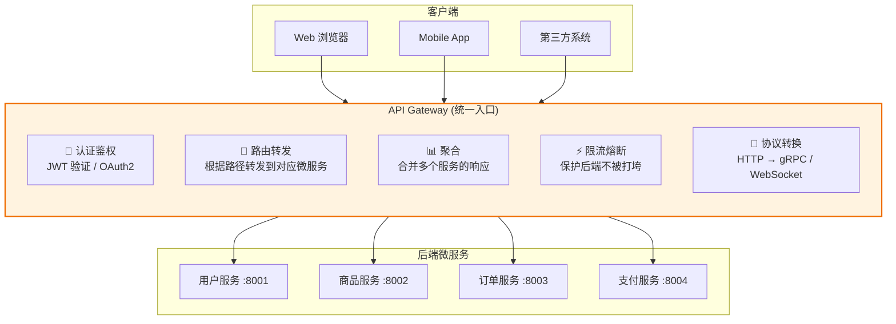
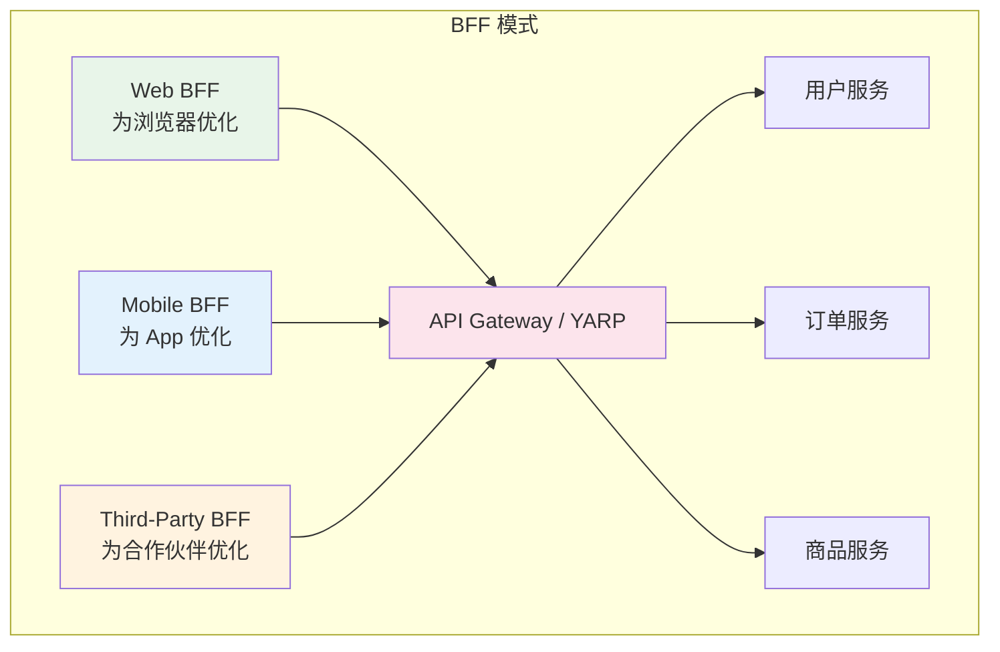
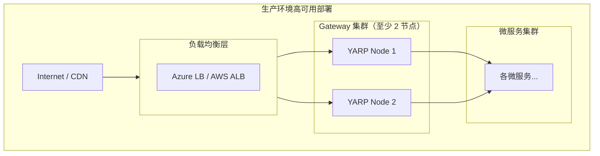

# API Gateway（Ocelot / YARP）

## 学习目标

学完本节，你将能够：

- 理解 API Gateway 的核心职责和架构价值
- 掌握 YARP（微软官方反向代理）的完整配置和使用
- 了解 Ocelot 社区网关的核心功能和配置方式
- 实现 BFF（Backend for Frontend）模式
- 配置负载均衡、健康检查和路由规则
- 在生产环境中部署高可用的 API Gateway

## 前置知识

在开始之前，你需要了解：

- 微服务架构的基本概念和服务拆分原则
- HTTP 协议（Header、Method、Status Code、请求/响应）
- ASP.NET Core 中间件管道的工作原理
- 反向代理的基本概念

---

## 核心内容

### 1. API Gateway 是什么？

**API Gateway** 是微服务架构的统一入口，它位于客户端和后端微服务之间，负责**请求路由、协议转换、聚合、认证授权、限流熔断**等横切关注点。



**为什么需要 Gateway？**

| 没有 Gateway | 有 Gateway |
|-------------|-----------|
| 前端需要知道所有微服务的地址 | 前端只知道 Gateway 一个地址 |
| 每个服务都要处理认证 | 认证集中在 Gateway 处理 |
| 无法统一限流和监控 | 统一的流量控制和日志 |
| 跨域问题分散在各处 | Gateway 统一处理 CORS |
| 版本管理混乱 | Gateway 统一管理版本路由 |

### 2. YARP（Yet Another Reverse Proxy）

YARP 是微软官方开源的反向代理库，专为 .NET 设计，通过 ASP.NET Core 中间件管道实现。

#### 安装与基本配置

```bash
dotnet add package Yarp.ReverseProxy
```

```csharp
// Program.cs
var builder = WebApplication.CreateBuilder(args);

// 加载 YARP 配置
builder.Services.AddReverseProxy()
    .LoadFromConfig(builder.Configuration);

var app = builder.Build();

// 注册 YARP 中间件
app.MapReverseProxy();

app.Run();
```

#### appsettings.json 完整配置

```json
{
  "Logging": {
    "LogLevel": {
      "Default": "Information",
      "Microsoft.AspNetCore": "Warning",
      "Yarp.ReverseProxy": "Information"
    }
  },

  "ReverseProxy": {
    "Routes": {
      // ====== 用户服务路由 ======
      "user-service-route": {
        "ClusterId": "user-cluster",
        "Match": {
          "Path": "/api/users/{**catch-all}"
        },
        "Transforms": [
          { "PathRemovePrefix": "/api/users" }
        ]
      },

      // ====== 商品服务路由 ======
      "product-service-route": {
        "ClusterId": "product-cluster",
        "Match": {
          "Path": "/api/products/{**catch-all}"
        },
        "Transforms": [
          { "PathRemovePrefix": "/api/products" }
        ]
      },

      // ====== 订单服务路由 ======
      "order-service-route": {
        "ClusterId": "order-cluster",
        "Match": {
          "Path": "/api/orders/{**catch-all}",
          "Method": ["GET", "POST", "PUT", "DELETE"]
        },
        "Transforms": [
          { "PathRemovePrefix": "/api/orders" },
          { "RequestHeader": "X-Forwarded-For", "Value": "{RemoteAddr}" },
          { "ResponseHeader": "X-Gateway-Version", "Value": "1.0" }
        ]
      },

      // ====== 支付服务路由（带 Header 匹配）=====
      "payment-route": {
        "ClusterId": "payment-cluster",
        "Match": {
          "Path": "/api/payments/{**catch-all}"
        },
        "AuthorizationPolicy": "authenticated"
      },

      // ====== 健康检查端点直通 ======
      "health-check-route": {
        "ClusterId": "health-cluster",
        "Match": {
          "Path": "/healthz"
        }
      }
    },

    "Clusters": {
      // ====== 用户服务集群 ======
      "user-cluster": {
        "Destinations": {
          "destination1": {
            "Address": "http://user-service:8001/"
          }
        },
        "HealthCheck": {
          "Enabled": true,
          "Interval": TimeSpan.FromSeconds(10),
          "Path": "/health",
          "ExpectedStatusCodes": [ "200" ]
        },
        "LoadBalancing": {
          "Mode": "RoundRobin"
        }
      },

      // ====== 商品服务集群（多实例 + 负载均衡）=====
      "product-cluster": {
        "Destinations": {
          "product1": { "Address": "http://product-service-1:8002/" },
          "product2": { "Address": "http://product-service-2:8002/" },
          "product3": { "Address": "http://product-service-3:8002/" }
        },
        "LoadBalancing": {
          "Mode": "LeastConnections"  // 最少连接数策略
        },
        "SessionAffinity": {
          "Enabled": true,
          "Policy": "Cookie",
          "Cookie": {
            "Name": "AFFINITY",
            "Path": "/",
            "SameSite": "Lax"
          }
        },
        "HealthCheck": {
          "Enabled": true,
          "Interval": TimeSpan.FromSeconds(5)
        }
      },

      // ====== 订单服务集群 ======
      "order-cluster": {
        "Destinations": {
          "order1": { "Address": "http://order-service:8003/" },
          "order2": { "Address": "http://order-service-b:8003/" }
        },
        "LoadBalancing": {
          "Mode": "Random"  // 随机策略
        }
      },

      // ====== 支付服务集群 ======
      "payment-cluster": {
        "Destinations": {
          "payment1": { "Address": "http://payment-service:8004/" }
        },
        "CircuitBreaker": {
          "Enabled": true,
          "MaxConcurrentConnections": 100,
          "MaxConcurrentRetries": 10,
          "BreakDuration": "00:00:30"
        }
      },

      // ====== 健康检查 ======
      "health-cluster": {
        "Destinations": {
          "self": { "Address": "http://localhost:5000/" }
        }
      }
    }
  }
}
```

#### 自定义中间件扩展

```csharp
/// <summary>
/// 自定义 YARP 中间件 -- 请求日志记录
/// </summary>
public class RequestLoggingMiddleware
{
    private readonly RequestDelegate _next;
    private readonly ILogger<RequestLoggingMiddleware> _logger;

    public RequestLoggingMiddleware(RequestDelegate next, ILogger<RequestLoggingMiddleware> logger)
    {
        _next = next;
        _logger = logger;
    }

    public async Task InvokeAsync(HttpContext context)
    {
        var stopwatch = Stopwatch.StartNew();
        var request = context.Request;

        _logger.LogInformation(
            "[Gateway] {Method} {Path} from {RemoteIp}",
            request.Method,
            request.Path,
            context.Connection.RemoteIpAddress);

        try
        {
            await _next(context);
        }
        finally
        {
            stopwatch.Stop();
            _logger.LogInformation(
                "[Gateway] {Method} {Path} -> {StatusCode} in {ElapsedMs}ms",
                request.Method,
                request.Path,
                context.Response.StatusCode,
                stopwatch.ElapsedMilliseconds);
        }
    }
}

// 注册自定义中间件（在 MapReverseProxy 之前）
var app = builder.Build();
app.UseMiddleware<RequestLoggingMiddleware>();
app.MapReverseProxy();
```

### 3. Ocelot 简介

Ocelot 是 .NET 社区中最流行的 API Gateway，功能丰富且配置简单。

```json
// ocelot.json
{
  "Routes": [
    {
      "DownstreamPathTemplate": "/api/users/{everything}",
      "DownstreamScheme": "http",
      "DownstreamHostAndPorts": [
        { "Host": "user-service", "Port": 8001 }
      ],
      "UpstreamPathTemplate": "/gateway/users/{everything}",
      "UpstreamHttpMethod": [ "Get", "Post", "Put", "Delete" ],
      "AuthenticationOptions": {
        "AuthenticationProviderKey": "JwtAuth"
      },
      "RateLimitOptions": {
        "ClientWhitelist": [ "admin-client" ],
        "EnableRateLimiting": true,
        "Period": "1m",
        "Limit": 100
      },
      "FileCacheOptions": {
        "TtlSeconds": 60,
        "Region": "users"
      }
    },
    {
      "DownstreamPathTemplate": "/api/products/{everything}",
      "DownstreamScheme": "http",
      "DownstreamHostAndPorts": [
        { "Host": "product-service", "Port": 8002 }
      ],
      "UpstreamPathTemplate": "/gateway/products/{everything}",
      "LoadBalancerOptions": {
        "Type": "LeastConnection"
      },
      "QoSOptions": {
        "ExceptionsAllowedBeforeBreaking": 3,
        "DurationOfBreak": 30000,
        "TimeoutValue": 5000
      }
    }
  ],

  "GlobalConfiguration": {
    "BaseUrl": "https://api.myapp.com",
    "RequestIdKey": "X-RequestId",
    "UseServiceDiscovery": true,
    "ServiceDiscoveryProvider": {
      "Host": "consul",
      "Port": 8500,
      "Type": "Consul"
    }
  },

  "Aggregates": [
    {
      "RouteKeys": [ "user-route", "orders-route" ],
      "UpstreamPathTemplate": "/gateway/user-profile/{userId}"
    }
  ]
}
```

### 4. Gateway 模式进阶

#### BFF Pattern（Backend for Frontend）



每个 BFF 为特定的前端客户端量身定制 API：
- **Web BFF**：返回 HTML 友好的数据格式，支持 SSR
- **Mobile BFF**：精简字段减少流量，支持离线缓存
- **Third-Party BFF**：严格的版本控制、限流、审计日志

### 5. 生产环境部署建议



**生产 CheckList**：
- [ ] Gateway 至少部署 2 个实例（避免单点故障）
- [ ] 使用外部负载均衡器（ALB/Nginx）
- [ ] 启用 HTTPS/TLS 终止
- [ ] 配置合理的超时时间
- [ ] 开启访问日志和安全日志
- [ ] 集成 Prometheus 指标暴露
- [ ] 定期更新依赖包安全补丁

---

## 动手练习

### 练习 1：配置完整的 YARP Gateway

**要求**：
为一个包含 5 个微服务的电商系统配置 YARP Gateway：
- User Service (:8001)、Product Service (:8002)、Order Service (:8003)
- Payment Service (:8004)、Notification Service (:8005)

要求包含：
- 路径匹配规则
- 多实例负载均衡
- 健康检查
- 请求头转发
- 断路器配置

<details>
<summary>查看答案</summary>

参考本文档中的 `appsettings.json` 配置部分，核心要点：
1. Routes 中按 `/api/{service-name}/**` 匹配路径
2. Clusters 中配置多实例 Destinations 和 LoadBalancing 策略
3. 每个 Cluster 启用 HealthCheck
4. 对关键服务（如 Payment）启用 CircuitBreaker
5. Transform 中添加 X-Forwarded-* 标准头
</details>

---

## 本节小结

API Gateway 是微服务架构的"门面"，关键要点：

1. **统一入口价值巨大** -- 解决了跨域、认证、限流等公共问题
2. **YARP 是微软推荐方案** -- 性能好、集成度高、基于中间件管道
3. **Ocelot 功能更丰富** -- 适合需要限流/缓存/聚合等高级功能的场景
4. **BFF 模式值得考虑** -- 不同前端使用不同的后端适配层
5. **生产环境必须高可用** -- 至少 2 个 Gateway 实例 + 外部负载均衡

---

## 延伸阅读

- [[服务间通信(HTTP/gRPC)]] -- Gateway 转发到的下游服务
- [[服务发现(Consul)]] -- Gateway 动态发现服务地址
- [YARP GitHub](https://github.com/microsoft/reverse-proxy)
- [Ocelot Documentation](https://ocelot.readthedocs.io/)

## 思考题

1. 如果你的 Gateway 本身成为了性能瓶颈，有哪些解决方案？
2. YARP 的 `MapReverseProxy()` 中间件和普通的 `MapGet()` 中间件可以共存吗？如何安排它们的顺序？
3. Gateway 应该做认证还是只做验证 token？两种方式的优劣是什么？

---
**[[服务间通信(HTTP-gRPC)]]** | **[[服务发现(Consul)]]** | **🏠 [[HOME]]**
