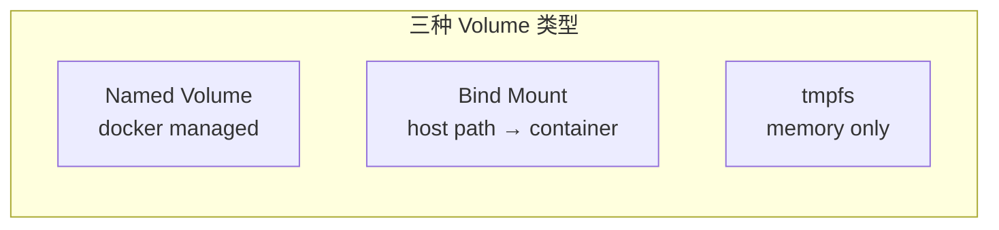

# Docker Compose 编排

## 学习目标

学完本节，你将能够：

- 深入理解 docker-compose.yml 的完整文件结构和所有配置项
- 掌握 Volumes（数据卷）的三种类型及其适用场景
- 配置 Networks（网络）：bridge/host/none/custom
- 管理 Environment 变量：.env 文件和环境变量替换
- 熟练使用常用 Compose 命令
- 区分开发环境与生产环境的配置差异
- 编排一个包含 5+ 服务的复杂多容器应用

## 核心内容

### 1. docker-compose.yml 完整文件结构

```yaml
# docker-compose.yml 结构总览
version: '3.8'          # Compose 文件格式版本

services:                # 定义的服务列表（核心）
  service-a:
    image / build       # 镜像来源
    ports               # 端口映射
    environment         # 环境变量
    volumes             # 数据卷挂载
    networks            # 网络配置
    depends_on          # 依赖关系
    healthcheck         # 健康检查
    deploy              # 部署配置（Swarm）
    restart             # 重启策略
    logging             # 日志配置
    labels              # 元数据标签

volumes:                # 命名卷定义
  vol-name:

networks:              # 网络定义
  net-name:

configs:                # 配置（Docker Swarm）
secrets:                # 密钥（Docker Swarm）
```

### 2. Services 详细配置

```yaml
services:
  # ====== Web 应用服务 ======
  webapp:
    build:
      context: ./src/WebApp
      dockerfile: Dockerfile.prod
      args:
        BUILD_CONFIGURATION: Release
        VERSION: ${APP_VERSION:-1.0.0}
    image: myregistry.com/webapp:${APP_VERSION:-latest}
    container_name: myapp-web
    hostname: webapp-host
    ports:
      - "8080:80"           # 映射端口
      - "8443:443"
      - "127.0.0.1:5000:5000"  # 绑定到 localhost
    environment:
      - ASPNETCORE_ENVIRONMENT=Production
      - ConnectionStrings__DefaultConnection=${DB_CONNECTION_STRING}
      - Redis__ConnectionString=redis:6379
      - JWT__SecretKey=${JWT_SECRET}
      - TZ=Asia/Shanghai
    env_file:
      - .env.webapp          # 从文件加载环境变量
    volumes:
      - app-logs:/var/log/webapp
      - ./uploads:/app/uploads     # bind mount（开发时热重载）
      - type: volume
        source: shared-configs
        target: /app/configs
        read_only: true
    networks:
      - frontend
      - backend
    depends_on:
      db:
        condition: service_healthy
      redis:
        condition: service_started
    healthcheck:
      test: ["CMD", "curl", "-f", "http://localhost/health"]
      interval: 30s
      timeout: 10s
      retries: 3
      start_period: 40s
    restart: unless-stopped
    logging:
      driver: json-file
      options:
        max-size: "10m"
        max-file: "3"
    labels:
      com.example.description: "Main web application"
      com.example.department: "platform"
    deploy:
      resources:
        limits:
          cpus: '2.0'
          memory: 2G
        reservations:
          cpus: '0.5'
          memory: 512M
      replicas: 3
      restart_policy:
        condition: on-failure
        delay: 5s
        max_attempts: 5
        window: 120s
```

### 3. Volumes 数据卷详解



| 类型 | 语法 | 数据位置 | 持久性 | 适用场景 |
|------|------|---------|--------|---------|
| **Named Volume** | `vol-name:/path` | Docker 管理目录 (`/var/lib/docker/volumes/`) | 容器删除后保留 | 数据库数据、需要备份的数据 |
| **Bind Mount** | `./host/path:/path` 或 `/abs/path:/path` | 主机指定路径 | 取决于主机路径 | 开发时代码热重载、配置文件 |
| **tmpfs** | `type: tmpfs` | 内存中 | 容器停止即丢失 | 敏感数据（密钥）、临时缓存 |

#### 使用示例

```yaml
services:
  db:
    image: postgres:16-alpine
    volumes:
      # Named Volume -- 数据持久化
      - pgdata:/var/lib/postgresql/data

      # Bind Mount -- 初始化脚本（开发用）
      - ./init-scripts:/docker-entrypoint-initdb.d:ro

  webapp:
    volumes:
      # Bind Mount -- 开发时代码同步
      - ./:/app                    # 当前目录映射到容器内
      - /app/bin /app/obj          # 排除编译产物（使用 .dockerignore 更好）

      # tmpfs -- 敏感临时数据
      - type: tmpfs
        target: /tmp/secrets
        tmpfs-size: 1m

volumes:
  pgdata:                         # 声明命名卷
    driver: local
    name: myapp-postgres-data      # 自定义卷名
```

### 4. Networks 网络

```yaml
networks:
  # 默认 bridge 网络
  default:
    driver: bridge

  # 自定义 bridge 网络（同一网络中的服务可通过服务名互相访问）
  app-network:
    driver: bridge
    ipam:
      config:
        - subnet: 172.28.0.0/16

  # host 网络模式（直接使用宿主机网络，性能最好但隔离性差）
  host-network:
    external: true
    name: host

  # 无网络模式（完全隔离）
  none-network:
    external: true
    name: none

services:
  web:
    networks:
      - app-network          # 加入自定义网络
      - default               # 同时加入默认网络

  monitoring:
    network_mode: host        # 直接使用宿主机网络（如 Prometheus 需要访问真实端口）

  isolated-service:
    networks:
      none-network: {}       # 不加入任何外部网络
```

### 5. Environment 变量管理

```bash
# ====== .env 文件（不要提交到 Git！）=====
# .env
APP_VERSION=2.1.0
DB_CONNECTION_STRING=Server=db;Database=mydb;User Id=sa;Password=StrongPass123!
JWT_SECRET=your-super-secret-jwt-key-min-32-chars
REDIS_PASSWORD=redis-pass-2024
```

```yaml
# compose 中引用环境变量
services:
  webapp:
    environment:
      - APP_VERSION=${APP_VERSION:-1.0.0}   # 带默认值
      - DB_CONNECTION_STRING=${DB_CONNECTION_STRING}

  redis:
    command: redis-server --requirepass ${REDIS_PASSWORD}
```

**变量替换规则**：
- `${VAR}` -- 直接替换，未定义则为空字符串
- `${VAR:-default}` -- 未定义则使用默认值
- `${VAR:?error}` -- 未定义则报错并显示错误信息

### 6. 开发 vs 生产配置差异

| 维度 | 开发环境 | 生产环境 |
|------|---------|---------|
| **镜像构建** | 每次 `up --build` | 预构建好镜像，只 pull |
| **Volume** | 大量 bind mount（代码同步） | 仅 named volume（数据持久化） |
| **日志级别** | Debug / Verbose | Warning / Error |
| **资源限制** | 不限制或宽松 | 严格的 CPU/Memory limits |
| **重启策略** | 不设置（手动管理） | `unless-stopped` |
| **健康检查** | 可选 | 必须 |
| **网络** | 简单 bridge | 可能涉及 overlay (Swarm) |
| **Secrets** | 明文在 .env 中 | Docker Secrets 或外部 Vault |

### 7. Profile 功能

```yaml
services:
  webapp:
    build: .
    profiles: ["frontend"]    # 只在 frontend profile 时启动

  db-dev:
    image: postgres:16-alpine
    profiles: ["development"]  # 仅开发环境

  db-prod:
    image: mcr.microsoft.com/mssql/server:2022-latest
    profiles: ["production"]   # 仅生产环境

  elasticsearch:
    image: elasticsearch:8.12.0
    profiles: ["full-stack"]    # 完整功能栈才启动

  kibana:
    image: kibana:8.12.0
    profiles: ["full-stack"]

  rabbitmq:
    image: rabbitmq:3-management-alpine
    profiles: ["with-mq"]
```

```bash
# 启动特定 profile 的服务
docker-compose --profile development up -d
docker-compose --profile production up -d
docker-compose --profile full-stack --profile with-mq up -d
```

### 8. 完整多服务 Compose 示例

```yaml
# 电商系统完整 docker-compose.yml
version: '3.8'

x-app-defaults: &app-defaults
  restart: unless-stopped
  logging:
    driver: json-file
    options:
      max-size: "10m"
      max-file: "3"

services:
  # ====== API Gateway (YARP) ======
  gateway:
    build:
      context: ./src/Gateway
      dockerfile: Dockerfile
    ports:
      - "5000:80"
      - "5001:443"
    environment:
      - ASPNETCORE_ENVIRONMENT=Production
    depends_on:
      user-service:
        condition: service_healthy
      product-service:
        condition: service_healthy
    networks:
      - internal
      - public
    <<: *app-defaults
    healthcheck:
      test: ["CMD", "curl", "-f", "http://localhost/healthz"]
      interval: 15s

  # ====== User Service ======
  user-service:
    build: ./src/UserService
    environment:
      - ConnectionStrings__DefaultConnection="Server=user-db;Database=UserDb;User Id=sa;Password=Pass@word123;"
    expose:
      - "8001"
    networks:
      - internal
    <<: *app-defaults

  # ====== Product Service ======
  product-service:
    build: ./src/ProductService
    environment:
      - Elasticsearch__Url=http://elasticsearch:9200
    expose:
      - "8002"
    depends_on:
      elasticsearch:
        condition: service_healthy
    networks:
      - internal
    <<: *app-defaults

  # ====== Order Service ======
  order-service:
    build: ./src/OrderService
    environment:
      - RabbitMQ__Host=rabbitmq
      - RabbitMQ__Port=5672
    expose:
      - "8003"
    depends_on:
      rabbitmq:
        condition: service_healthy
    networks:
      - internal
    <<: *app-defaults

  # ====== SQL Server (用户数据库) ======
  user-db:
    image: mcr.microsoft.com/mssql/server:2022-latest
    environment:
      ACCEPT_EULA: Y
      MSSQL_SA_PASSWORD: Pass@word123
    volumes:
      - user-db-data:/var/opt/mssql/data
    ports:
      - "1433:1433"            # 仅开发环境暴露端口
    networks:
      - internal
    healthcheck:
      test: ["CMD-SHELL", "/opt/mssql-tools18/bin/sqlcmd -S localhost -U sa -P 'Pass@word123' -Q 'SELECT 1' || exit 1"]
      interval: 15s

  # ====== PostgreSQL (订单数据库) ======
  order-db:
    image: postgres:16-alpine
    environment:
      POSTGRES_DB: orderdb
      POSTGRES_USER: orderuser
      POSTGRES_PASSWORD: orderpass123
    volumes:
      - order-db-data:/var/lib/postgresql/data
    networks:
      - internal
    healthcheck:
      test: ["CMD-SHELL", "pg_isready -U orderuser -d orderdb"]
      interval: 10s

  # ====== Redis ======
  redis:
    image: redis:7-alpine
    command: redis-server --appendonly yes --maxmemory 512mb --maxmemory-policy allkeys-lru
    volumes:
      - redis-data:/data
    networks:
      - internal
    healthcheck:
      test: ["CMD", "redis-cli", "ping"]
      interval: 10s

  # ====== RabbitMQ ======
  rabbitmq:
    image: rabbitmq:3-management-alpine
    environment:
      RABBITMQ_DEFAULT_USER: admin
      RABBITMQ_DEFAULT_PASS: adminpass
    ports:
      - "5672:5672"
      - "15672:15672"           # Management UI
    volumes:
      - rabbitmq-data:/var/lib/rabbitmq
    networks:
      - internal
    healthcheck:
      test: ["CMD", "rabbitmq-diagnostics", "running"]
      interval: 15s

  # ====== Elasticsearch ======
  elasticsearch:
    image: docker.elastic.co/elasticsearch/elasticsearch:8.12.0
    environment:
      - discovery.type=single-node
      - xpack.security.enabled=false
      - ES_JAVA_OPTS=-Xms512m -Xmx512m
    volumes:
      - es-data:/usr/share/elasticsearch/data
    ports:
      - "9200:9200"
    networks:
      - internal
    healthcheck:
      test: ["CMD-SHELL", "curl -f http://localhost:9200/_cluster/health || exit 1"]
      interval: 20s

volumes:
  user-db-data:
  order-db-data:
  redis-data:
  rabbitmq-data:
  es-data:

networks:
  internal:
    driver: bridge
    internal: true          # 不暴露给外部
  public:
    driver: bridge
```

---

## 本节小结

Docker Compose 是多容器应用管理的利器：

1. **Services 是核心** -- 每个 service 对应一个容器实例的完整定义
2. **Volume 三种类型各有所长** -- Named(持久化)、Bind(开发)、tmpfs(敏感)
3. **Network 隔离是关键** -- internal/public 分离保证安全
4. **.env 管理敏感信息** -- 永远不要把密钥写进 yml 文件
5. **Profile 按需启动** -- 开发/测试/生产不同组合
6. **Compose 适合开发和中小型部署** -- 生产大规模应考虑 Kubernetes

---

## 思考题

1. 当你执行 `docker-compose down` 后再 `docker-compose up -d`，之前的数据还在吗？为什么？
2. 如何让两个不同的 docker-compose 项目中的服务互相通信？
3. Compose 的 `deploy` 配置项只在什么模式下生效？普通的 `docker-compose up` 会忽略它吗？

---
**[[容器化Docker基础]]** | **[[Kubernetes基础概念]]** | **🏠 [[HOME]]**
