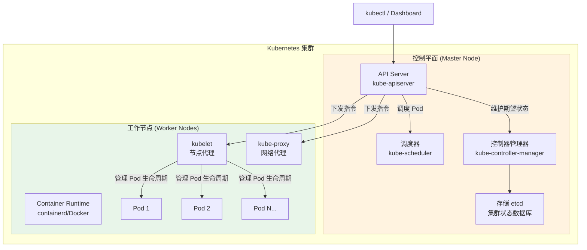
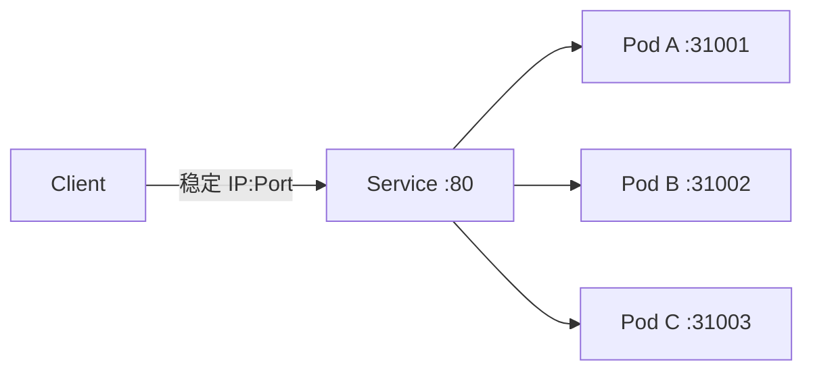

# Kubernetes 基础概念

## 学习目标

学完本节，你将能够：

- 理解 Kubernetes 的定位和核心架构（Master + Worker 节点）
- 掌握 9 大核心概念的详细含义（Pod、Service、Deployment、ConfigMap、Secret、Ingress、Namespace、PVC/HPA）
- 熟练使用 kubectl 的 30+ 常用命令
- 编写 Deployment / Service / ConfigMap / Ingress 的 YAML 清单文件
- 理解 K8s 与 Docker Compose 的区别和升级路径

## 核心内容

### 1. Kubernetes 是什么？

**Kubernetes（简称 K8s）** 是 Google 开源的容器编排平台，用于自动化部署、扩展和管理容器化应用。它是云原生时代的"操作系统"。



### 2. 九大核心概念详解

#### 2.1 Pod -- 最小调度单位

Pod 是 K8s 中**最小的可部署单元**，一个或多个容器的组合。同一 Pod 内的容器共享网络命名空间和存储卷。

```yaml
apiVersion: v1
kind: Pod
metadata:
  name: webapp-pod
  labels:
    app: webapp
    version: v1
spec:
  containers:
  - name: webapp
    image: myregistry.com/webapp:v2.1.0
    ports:
    - containerPort: 80
      protocol: TCP
    resources:
      requests:
        memory: "256Mi"
        cpu: "250m"
      limits:
        memory: "512Mi"
        cpu: "500m"
    env:
    - name: ASPNETCORE_ENVIRONMENT
      value: "Production"
    livenessProbe:
      httpGet:
        path: /health/live
        port: 80
      initialDelaySeconds: 15
      periodSeconds: 10
    readinessProbe:
      httpGet:
        path: /health/ready
        port: 80
      initialDelaySeconds: 5
      periodSeconds: 5
    volumeMounts:
    - name: app-logs
      mountPath: /var/log/webapp
  volumes:
  - name: app-logs
    emptyDir: {}
```

> **重要：不要直接管理 Pod！** 应该通过 Deployment 来管理 Pod。

#### 2.2 Service -- 稳定访问入口

Pod 的 IP 是动态变化的（重启后 IP 会变）。**Service** 提供了稳定的访问入口，通过标签选择器（Label Selector）路由到后端 Pod。



| Service 类型 | 说明 | 使用场景 |
|-------------|------|---------|
| **ClusterIP** | 仅集群内部可访问 | 默认类型，服务间通信 |
| **NodePort** | 每个节点开放一个端口 | 开发测试 |
| **LoadBalancer** | 云厂商提供外部 LB | 生产环境对外暴露 |
| **ExternalName** | DNS CNAME 映射 | 访问外部服务 |

#### 2.3 Deployment -- 声明式更新

Deployment 管理 ReplicaSet，ReplicaSet 管理 Pod。提供滚动升级、回滚、扩缩容能力。

```yaml
apiVersion: apps/v1
kind: Deployment
metadata:
  name: webapp-deployment
  namespace: default
spec:
  replicas: 3                          # 运行 3 个 Pod 副本
  selector:
    matchLabels:
      app: webapp
  template:                           # Pod 模板
    metadata:
      labels:
        app: webapp
    spec:
      containers:
      - name: webapp
        image: myregistry.com/webapp:v2.1.0
        ports:
        - containerPort: 80
        resources:
          requests:
            memory: "256Mi"
            cpu: "100m"
          limits:
            memory: "512Mi"
            cpu: "500m"
        envFrom:
        - configMapRef:
            name: webapp-config
        volumeMounts:
        - name: app-data
          mountPath: /app/data
      volumes:
      - name: app-data
        persistentVolumeClaim:
          claimName: webapp-pvc
      affinity:                         # 节点亲和性（可选）
        nodeAffinity:
          requiredDuringSchedulingIgnoredDuringExecution:
            nodeSelectorTerms:
            - matchExpressions:
              - key: disktype
                operator: In
                values:
                - ssd
      strategy:                        # 更新策略
        type: RollingUpdate
        rollingUpdate:
          maxSurge: 1                   # 滚动更新时最多多出 1 个 Pod
          maxUnavailable: 0             # 滚动更新时最多不可用 0 个 Pod
---
apiVersion: v1
kind: Service
metadata:
  name: webapp-service
spec:
  selector:
    app: webapp
  ports:
  - port: 80
    targetPort: 80
  type: ClusterIP                    # 集群内部访问
```

#### 2.4 ConfigMap 和 Secret

```yaml
# ====== ConfigMap ======
apiVersion: v1
kind: ConfigMap
metadata:
  name: webapp-config
data:
  AppSettings__Environment: "Production"
  AppSettings__LogLevel: "Warning"
  ConnectionStrings__Cache: "redis:6379"
  AllowedOrigins: "https://myapp.com,https://admin.myapp.com"

# ====== Secret (Base64 编码的敏感数据) ======
apiVersion: v1
kind: Secret
metadata:
  name: webapp-secrets
type: Opaque
stringData:
  DbPassword: "YourStrongDBPassword123!"
  JwtSecretKey: "your-super-secret-jwt-minimum-32-characters-key"
  SmtpPassword: "smtp-email-password-here"
```

#### 2.5 Ingress -- HTTP(S) 路由规则

Ingress 是集群的外部 HTTP(S) 路由入口：

```yaml
apiVersion: networking.k8s.io/v1
kind: Ingress
metadata:
  name: webapp-ingress
  annotations:
    nginx.ingress.kubernetes.io/ssl-redirect: "true"
    nginx.ingress.kubernetes.io/proxy-body-size: "50m"
    cert-manager.io/cluster-issuer: "letsencrypt-prod"
spec:
  ingressClassName: nginx           # 使用 Ingress Controller
  tls:
  - hosts:
    - api.myapp.com
    secretName: api-tls-secret     # TLS 证书
  rules:
  - host: api.myapp.com
    http:
      paths:
      - path: /api/users
        pathType: Prefix
        backend:
          service:
            name: user-service
            port:
              number: 80
      - path: /api/products
        pathType: Prefix
        backend:
          service:
            name: product-service
            port:
              number: 80
      - path: /
        pathType: Prefix
        backend:
          service:
            name: gateway-service
            port:
              number: 80
```

#### 2.6 Namespace -- 资源隔离

```bash
# 创建命名空间
kubectl create namespace production
kubectl create namespace staging
kubectl create namespace development

# 在指定命名空间中操作
kubectl get pods -n production
kubectl deploy -f deployment.yaml -n staging
```

#### 2.7 PersistentVolume (PV) / PVC

```yaml
# ====== PersistentVolumeClaim ======
apiVersion: v1
kind: PersistentVolumeClaim
metadata:
  name: webapp-data-pvc
  namespace: production
spec:
  accessModes:
    - ReadWriteOnce              # 单节点读写
  storageClassName: standard       # 或 premium-ssd / azure-disk
  resources:
    requests:
      storage: 20Gi                 # 申请 20GB 存储
```

#### 2.8 HorizontalPodAutoscaler (HPA)

```yaml
apiVersion: autoscaling/v2
kind: HorizontalPodAutoscaler
metadata:
  name: webapp-hpa
spec:
  scaleTargetRef:
    apiVersion: apps/v1
    kind: Deployment
    name: webapp-deployment
  minReplicas: 3                  # 最少 3 个副本
  maxReplicas: 10                 # 最多 10 个副本
  metrics:
  - type: Resource
    resource:
      name: cpu
      target:
        type: Utilization
        averageUtilization: 70   # CPU 利用率超过 70% 时扩容
  - type: Resource
    resource:
      name: memory
      target:
        type: Utilization
        averageUtilization: 80   # 内存利用率超过 80% 时扩容
```

### 3. kubectl 常用命令速查

```bash
# ====== 集群信息 ======
kubectl cluster-info                           # 集群信息
kubectl get nodes                                # 查看节点
kubectl describe node <node-name>               # 节点详情

# ====== Pod 操作 ======
kubectl get pods -o wide                         # 所有 Pod（含 IP 和所在节点）
kubectl get pods -n <namespace>                  # 指定命名空间
kubectl describe pod <pod-name>                  # Pod 详情（含事件日志）
kubectl logs <pod-name>                           # Pod 日志
kubectl logs -f <pod-name>                       # 实时跟踪日志
kubectl exec -it <pod-name> -- bash              # 进入 Pod 容器
kubectl delete pod <pod-name>                    # 删除 Pod（Deployment 会自动重建）

# ====== Deployment 操作 ======
kubectl get deployments                          # 所有 Deployment
kubectl rollout status deployment/<name>        # 查看滚动更新状态
kubectl rollout history deployment/<name>       # 更新历史
kubectl rollout undo deployment/<name>           # 回滚到上一版本
kubectl rollout undo deployment/<name> --to-revision=2  # 回滚到指定版本
kubectl scale deployment/<name> --replicas=5     # 手动扩缩容
kubectl autoscale deployment/<name> --min=3 --max=10 --cpu-percent=70  # 自动扩缩容

# ====== Service 操作 ======
kubectl get services                              # 所有 Service
kubectl describe svc <service-name>              # Service 详情
kubectl get endpoints <service-name>             # Service 后端 Pod 列表

# ====== 配置和密钥 ======
kubectl get configmaps                            # 所有 ConfigMap
kubectl describe cm <configmap-name>              # ConfigMap 详情
kubectl get secrets                                # 所有 Secret
kubectl create secret generic my-secret --from-literal=password=mypassword

# ====== 存储操作 ======
kubectl get pvc                                    # 所有 PVC
kubectl get pv                                     # 所有 PV
kubectl describe pvc <pvc-name>                   # PVC 详情

# ====== Ingress ======
kubectl get ingress                               # 所有 Ingress
kubectl describe ingress <ingress-name>          # Ingress 详情

# ====== 通用操作 ======
kubectl apply -f <file.yaml>                      # 创建/更新资源
kubectl delete -f <file.yaml>                     # 删除资源
kubectl get all -n <namespace>                     # 查看所有资源
kubectl top pods                                   # 查看 Pod 资源使用率（需要 metrics-server）
kubectl api-resources                             # 查看 K8s 支持的所有资源类型
kubectl explain pod                                 # 查看资源的字段说明文档
```

### 4. K8s vs Docker Compose 对比

| 维度 | Docker Compose | Kubernetes |
|------|---------------|-------------|
| **适用规模** | 单机/开发环境 | 多节点/生产环境 |
| **自愈能力** | 弱（需手动 restart） | 强（自动重建、漂移） |
| **负载均衡** | 基础（round-robin） | 完善（多种策略+HPA） |
| **服务发现** | DNS（有限） | 内置 CoreDNS |
| **配置管理** | .env 文件 | ConfigMap + Secret |
| **存储** | Volume | PV/PVC/StorageClass |
| **网络** | Bridge/Host | CNI 插件（复杂网络拓扑） |
| **滚动更新** | 无原生支持 | 原生支持（RollingUpdate） |
| **学习曲线** | 低 | 高 |
| **何时升级？** | 多机器部署需求 | 生产级高可用要求 |

---

## 动手练习

### 练习 1：编写完整的 K8s 部署清单

**要求**：
为 ASP.NET Core Web API 编写完整的 K8s 部署清单，包含：
1. Deployment（3 副本，资源限制，健康检查）
2. Service（ClusterIP 类型）
3. ConfigMap（应用配置）
4. Secret（数据库连接字符串）
5. HPA（CPU 触发自动扩缩容 3-10 副本）

<details>
<summary>查看参考框架</summary>

参考本文档中的 Deployment、Service、ConfigMap、Secret 和 HPA 示例代码。关键点：
- Deployment 中 `resources.requests` 和 `resources.limits` 必须设置
- `livenessProbe` 和 `readinessProbe` 区分清楚
- Secret 中的值建议用 `kubectl create secret generic` 命令创建而非明文写在 yaml 中
- HPA 需要 metrics-server 组件支持
</details>

---

## 本节小结

Kubernetes 是容器编排的事实标准：

1. **Pod 是最小单元**，但通过 Deployment 管理；Service 提供稳定入口
2. **声明式配置是核心理念**：声明期望状态，K8s 自主达到
3. **ConfigMap/Secret 分离配置和密钥**
4. **Ingress 处理外部 HTTP 流量**，需要安装 Ingress Controller
5. **HPA 实现弹性伸缩**，根据 CPU/内存指标自动调整副本数
6. **学习路径建议**：Docker → Compose → Minikube(本地K8s) → 生产 K8s

---

## 延伸阅读

- [[Kubernetes实战部署]] -- 从零到生产环境的完整流程
- [[微服务监控与日志]] -- K8s 环境下的可观测性
- [Kubernetes Official Docs](https://kubernetes.io/docs/)
- [Kubernetes in Action](https://www.manning.com/books/kubernetes-in-action)

## 思考题

1. 如果一个 Pod 中的主容器崩溃了但 init 容器还在运行，K8s 会怎么处理？
2. Deployment 的 `strategy.type: Recreate` 和 `RollingUpdate` 有什么区别？什么场景下应该用 Recreate？
3. 当你执行 `kubectl delete pod` 时，为什么 Pod 可能会立刻重新出现？

---
**[[Docker Compose编排]]** | **[[Kubernetes实战部署]]** | **🏠 [[HOME]]**
