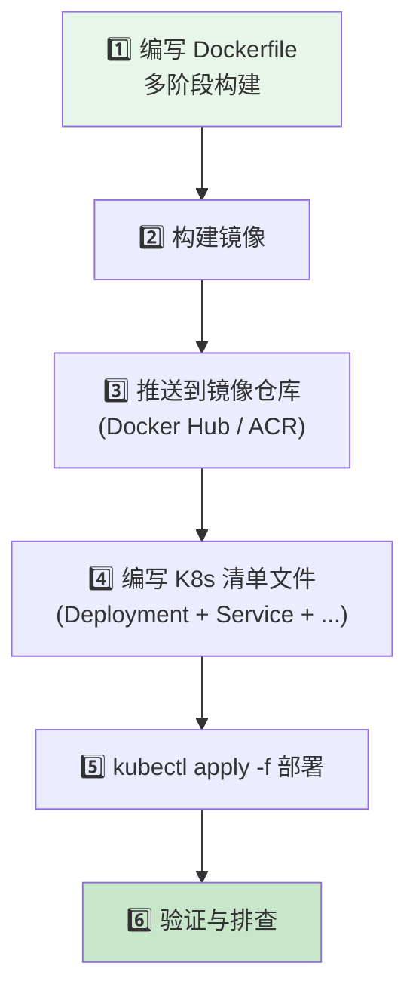

# Kubernetes 实战部署

## 学习目标

学完本节，你将能够：

- 完成从零将 ASP.NET Core 应用部署到 K8s 的全流程
- 编写生产级的 Deployment 清单（含资源限制、探针、亲和性、容忍度）
- 配置 Service（ClusterIP/NodePort/LoadBalancer）和 Ingress 路由规则
- 管理 ConfigMap 和 Secret（环境变量注入、配置文件挂载）
- 配置 PersistentVolumeClaim 实现数据持久化
- 设置 HorizontalPodAutoscaler 实现自动扩缩容
- 掌握滚动更新策略和故障排查方法

## 核心内容

### 1. 从零部署全流程



### 2. 生产级 Deployment 清单

```yaml
# ====== webapp-deployment.yaml ======
apiVersion: apps/v1
kind: Deployment
metadata:
  name: webapp-api
  namespace: production
  labels:
    app: webapp-api
    version: v2.1.0
    team: platform
    environment: production
spec:
  # ====== 副本数 ======
  replicas: 3

  # ====== Pod 选择器 ======
  selector:
    matchLabels:
      app: webapp-api

  # ====== Pod 模板 ======
  template:
    metadata:
      labels:
        app: webapp-api
      annotations:
        prometheus.io/scrape: "true"
        prometheus.io/port: "80"
        prometheus.io/path: "/metrics"

    spec:
      # ====== 服务账号 ======
      serviceAccountName: webapp-sa

      # ====== 安全上下文 ======
      securityContext:
        runAsNonRoot: true
        runAsUser: 1000
        runAsGroup: 1000
        fsGroup: 1000
        seccompProfile:
          type: RuntimeDefault
        allowPrivilegeEscalation: false

      # ====== 容器定义 ======
      containers:
      - name: api
        image: myacr.azurecr.io/webapp-api:v2.1.0
        imagePullPolicy: IfNotPresent

        # ====== 端口 ======
        ports:
        - name: http
          containerPort: 80
          protocol: TCP

        # ====== 环境变量 ======
        envFrom:
        - configMapRef:
            name: webapp-config
        - secretRef:
            name: webapp-secrets
        env:
        - name: POD_NAME
          valueFrom:
            fieldRef:
              fieldPath: metadata.name
        - name: POD_NAMESPACE
          valueFrom:
            fieldRef:
              fieldPath: metadata.namespace
        - name: POD_IP
          valueFrom:
            fieldRef:
              fieldPath: status.podIP

        # ====== 资源限制 ======
        resources:
          requests:
            memory: "256Mi"
            cpu: "100m"           # 0.1 CPU = 100m
          limits:
            memory: "512Mi"
            cpu: "500m"

        # ====== 存活探针 (Liveness) ======
        livenessProbe:
          httpGet:
            path: /health/live
            port: http
            httpHeaders:
            - name: X-Health-Check
              value: "liveness"
          initialDelaySeconds: 30     # 启动后等待 30s 再开始检查
          periodSeconds: 10         # 每 10s 检查一次
          timeoutSeconds: 5          # 单次超时 5s
          failureThreshold: 3       # 连续 3 次失败则重启 Pod
          successThreshold: 1

        # ====== 就绪探针 (Readiness) ======
        readinessProbe:
          httpGet:
            path: /health/ready
            port: http
          initialDelaySeconds: 5
          periodSeconds: 5
          timeoutSeconds: 3
          failureThreshold: 3
          successThreshold: 1

        # ====== 启动探针 (Startup) -- K8s 1.29+ ======
        startupProbe:
          httpGet:
            path: /health/startup
            port: http
          initialDelaySeconds: 0
          periodSeconds: 5
          timeoutSeconds: 5
          failureThreshold: 12         # 60s 内未就绪则认为启动失败

        # ====== 优雅终止 ======
        lifecycle:
          preStop:
            exec:
              command: ["/bin/sh", "-c", "sleep 10 && curl -X POST http://localhost:80/api/shutdown"]

        # ====== 卷挂载 ======
        volumeMounts:
        - name: app-logs
          mountPath: /var/log/webapp
        - name: app-config
          mountPath: /app/config
          readOnly: true

      # ====== 初始化容器 (Init Container) ======
      initContainers:
      - name: db-migration
        image: myacr.azurecr.io/db-migrator:v1.0.0
        command: ["dotnet", "Migrator.dll", "--connection-string-from-secret"]
        envFrom:
        - secretRef:
            name: webapp-secrets

      # ====== 节点选择 (可选) ======
      nodeSelector:
        kubernetes.io/os: linux
        nodepool: general-purpose

      # ====== 节点亲和性 (软性偏好) ======
      affinity:
        nodeAffinity:
          preferredDuringSchedulingIgnoredDuringExecution:
          - weight: 100
            preference:
              matchExpressions:
              - key: disktype
                operator: In
                values:
                - ssd
        podAntiAffinity:
          preferredDuringSchedulingIgnoredDuringExecution:
          - weight: 70
            preference:
              labelSelector:
                matchLabels:
                  app: webapp-api
              topologyKey: kubernetes.io/hostname

      # ====== 容忍度 (Tolerations) ======
      tolerations:
      - key: "dedicated"
        operator: "Equal"
        value: "platform-team"
        effect: "NoSchedule"

  # ====== 更新策略 ======
  strategy:
    type: RollingUpdate
    rollingUpdate:
      maxSurge: 1                  # 滚动更新时最多多出 1 个 Pod
      maxUnavailable: 0             # 滚动更新时不可用 Pod 数为 0

  # ====== 历史版本保留 ======
  revisionHistoryLimit: 10
```

### 3. Service 和 Ingress 配置

```yaml
# ====== ClusterIP Service (服务间通信) ======
apiVersion: v1
kind: Service
metadata:
  name: webapp-api-service
  namespace: production
spec:
  type: ClusterIP
  selector:
    app: webapp-api
  ports:
  - name: http
    port: 80
    targetPort: 80
    protocol: TCP
---
# ====== Ingress (外部 HTTP 访问) ======
apiVersion: networking.k8s.io/v1
kind: Ingress
metadata:
  name: webapp-ingress
  namespace: production
  annotations:
    nginx.ingress.kubernetes.io/ssl-redirect: "true"
    nginx.ingress.kubernetes.io/proxy-body-size: "50m"
    nginx.ingress.kubernetes.io/proxy-connect-timeout: "15"
    nginx.ingress.kubernetes.io/proxy-read-timeout: "30"
    nginx.ingress.kubernetes.io/rate-limit: "100"
    cert-manager.io/cluster-issuer: "letsencrypt-prod"
spec:
  ingressClassName: nginx
  tls:
  - hosts:
    - api.mycompany.com
    secretName: tls-wildcard-cert   # 通配符证书
  rules:
  - host: api.mycompany.com
    http:
      paths:
      - path: /api/
        pathType: Prefix
        backend:
          service:
            name: webapp-api-service
            port:
              number: 80
      - path: /
        pathType: Prefix
        backend:
          service:
            name: gateway-service
            port:
              number: 80
```

### 4. ConfigMap 和 Secret

```yaml
# ====== ConfigMap ======
apiVersion: v1
kind: ConfigMap
metadata:
  name: webapp-config
  namespace: production
data:
  ASPNETCORE_ENVIRONMENT: "Production"
  Logging__LogLevel__Default: "Warning"
  Logging__LogLevel__Microsoft: "Information"
  ConnectionStrings__Redis: "redis-headless.production.svc.cluster.local:6379"
  AllowedOrigins: "https://www.mycompany.com,https://admin.mycompany.com"
  RateLimiting__Enabled: "true"
  RateLimiting__PerMinute: "120"
---
# ====== Secret (创建命令: kubectl create secret generic webapp-secrets --from-literal=db-pass='xxx') ======
apiVersion: v1
kind: Secret
metadata:
  name: webapp-secrets
  namespace: production
type: Opaque
stringData:
  ConnectionStrings__DefaultConnection: "Server=sql-server.production.svc.cluster.local,1433;Database=WebAppDb;User Id=webapp;Password=<DB_PASSWORD>;"
  Jwt__SecretKey: "<JWT_SECRET_MIN_32_CHARS>"
  Smtp__Password: "<SMTP_PASSWORD>"
```

### 5. PVC 数据持久化

```yaml
# ====== PVC ======
apiVersion: v1
kind: PersistentVolumeClaim
metadata:
  name: webapp-logs-pvc
  namespace: production
spec:
  accessModes:
    - ReadWriteOnce
  storageClassName: premium-ssd          # Azure Premium SSD 或 gp3
  resources:
    requests:
      storage: 20Gi
---
# ====== 在 Deployment 中使用 ======
# (在 Pod spec.volumes 中添加)
volumes:
- name: app-logs
  persistentVolumeClaim:
    claimName: webapp-logs-pvc
```

### 6. HPA 自动扩缩容

```yaml
apiVersion: autoscaling/v2
kind: HorizontalPodAutoscaler
metadata:
  name: webapp-hpa
  namespace: production
spec:
  scaleTargetRef:
    apiVersion: apps/v1
    kind: Deployment
    name: webapp-api
  minReplicas: 3
  maxReplicas: 15
  behavior:
    scaleDown:
      stabilizationWindowSeconds: 300    # 冷却 5 分钟后再缩容
      policies:
      - type: Percent
        value: 10                     # 每次最多缩减 10%
        periodSeconds: 60
    scaleUp:
      stabilizationWindowSeconds: 0
      policies:
      - type: Percent
        value: 100                    # 每次最多翻倍
        periodSeconds: 15
  metrics:
  - type: Resource
    resource:
      name: cpu
      target:
        type: Utilization
        averageUtilization: 70
  - type: Resource
    resource:
      name: memory
      target:
        type: Utilization
        averageUtilization: 80
```

### 7. 全流程 kubectl 操作演示

```bash
# ====== 第一步：创建命名空间 ======
kubectl create namespace production

# ====== 第二步：应用所有清单 ======
kubectl apply -f configmap.yaml \
  -f secret.yaml \
  -f deployment.yaml \
  -f service.yaml \
  -f ingress.yaml \
  -f pvc.yaml \
  -f hpa.yaml \
  -n production

# ====== 第三步：查看状态 ======
kubectl get all -n production
kubectl get pods -n production -o wide
kubectl describe deployment webapp-api -n production

# ====== 第四步：验证访问 ======
kubectl get ingress -n production
kubectl logs -f deployment/webapp-api -n production --tail=50

# ====== 第五步：滚动更新 ======
# 修改 deployment.yaml 中的镜像版本为 v2.2.0
kubectl apply -f deployment.yaml -n production
kubectl rollout status deployment/webapp-api -n production

# ====== 第六步：回滚（如果出问题）=====
kubectl rollout undo deployment/webapp-api -n production

# ====== 第七步：故障排查 ======
kubectl describe pod <pod-name> -n production    # 查看 Pod 事件
kubectl logs <pod-name> -n production --previous  # 查看上一个容器的日志
kubectl exec -it <pod-name> -n production -- sh    # 进入 Pod 排查
```

### 8. 故障排查速查表

| 问题 | 可能原因 | 排查命令 |
|------|---------|---------|
| **CrashLoopBackOff** | 启动失败/健康检查失败 | `kubectl describe pod <name>` → Events |
| **ImagePullBackOff** | 镜像不存在/认证失败 | `kubectl describe pod <name>` → Events |
| **Pending** | 资源不足/PVC 未绑定/节点不满足条件 | `kubectl describe pod <name>` → Events |
| **Running 但无法访问** | Service 选择器错误/网络策略阻止 | `kubectl get endpoints <svc>` |
| **频繁重启** | OOMKilled(内存超限)/探针失败 | `kubectl describe pod <name>` → Last State |

---

## 本节小结

生产级 K8s 部署的关键要点：

1. **三探针缺一不可**：StartupProbe（启动）→ Readiness（就绪）→ Liveness（存活）
2. **资源限制必须设置**：requests（调度依据）+ limits（防 OOM）
3. **优雅终止很重要**：preStop sleep 让现有请求完成处理
4. **Secret 绝不明文存储**：用 `kubectl create secret` 创建或外部 Vault
5. **HPA 是标配**：生产环境必须有自动伸缩能力
6. **滚动更新要配好**：maxSurge/maxUnavailable 影响升级平滑度

---

## 思考题

1. 当 Deployment 的 replicas 设为 3，但当前只有 2 个健康的 Node 时，第 3 个 Pod 会处于什么状态？
2. 如果你的应用需要 60 秒来完成初始化（加载缓存、预热模型），你应该如何配置探针？
3. ConfigMap 更新后，已经运行的 Pod 会自动获取新配置吗？如何实现热更新？

---
**[[Kubernetes基础概念]]** | **[[微服务监控与日志]]** | **🏠 [[HOME]]**
