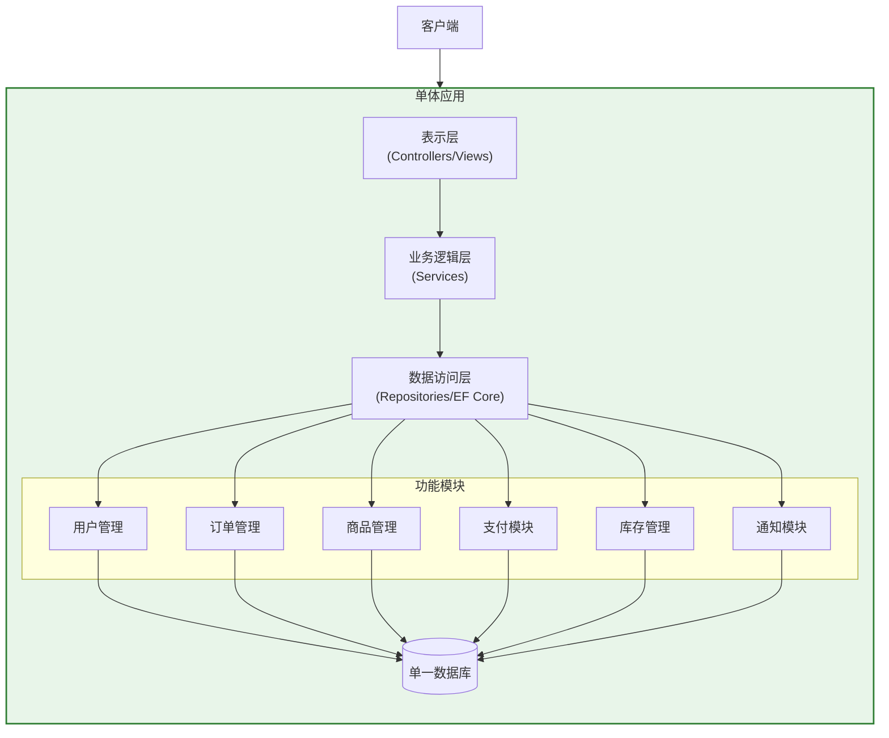
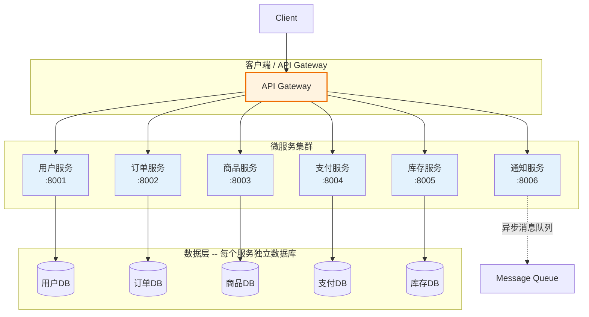
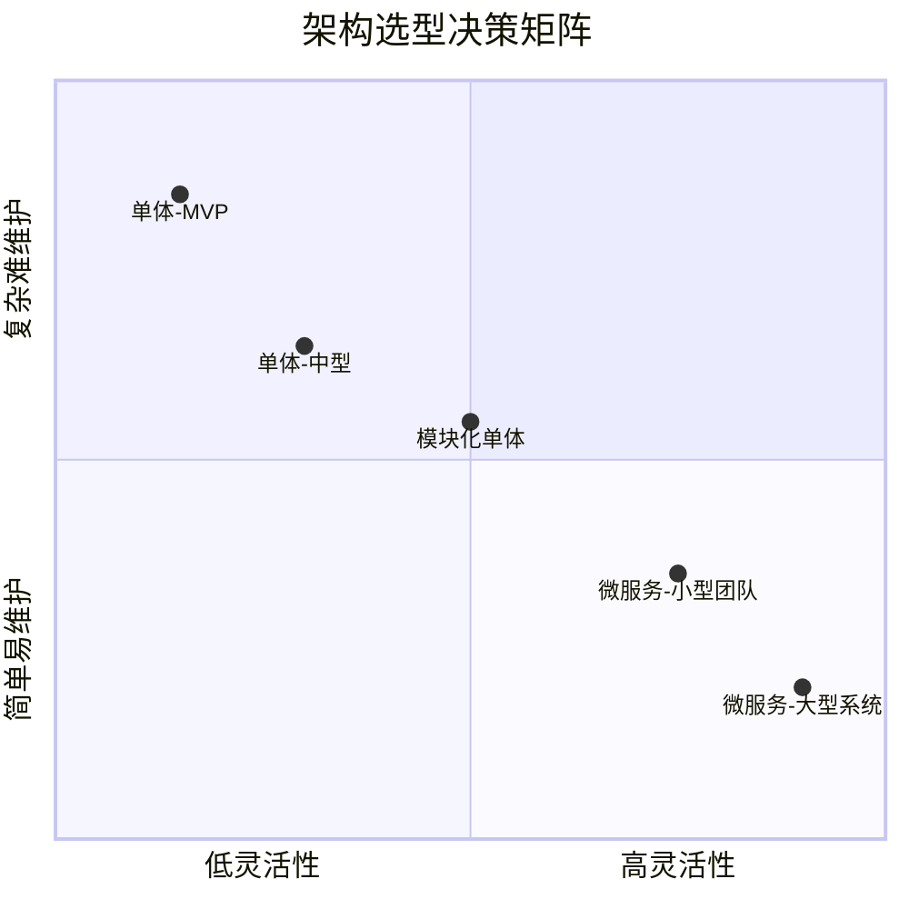
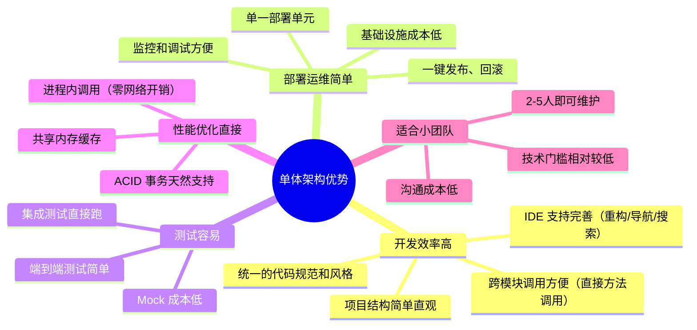
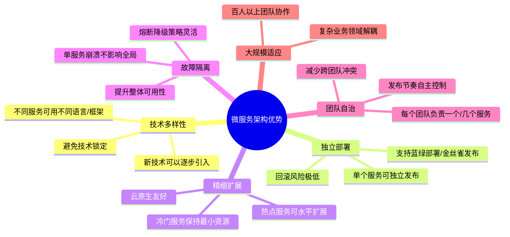
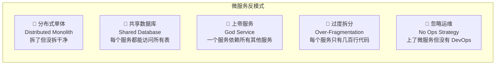
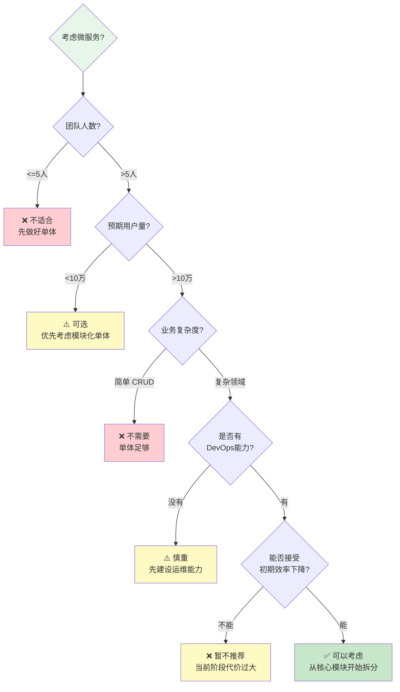
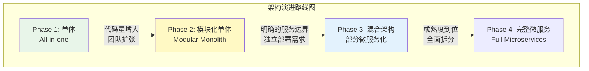

# 单体 vs 微服务对比

## 学习目标

学完本节，你将能够：

- 清晰定义单体架构和微服务架构的核心概念
- 从 10+ 个维度深入对比两种架构的优劣
- 理解单体架构的优势和适用场景
- 掌握微服务的优势和适用场景
- 了解分布式系统的 12 个核心挑战
- 认识微服务的陷阱和反模式
- 学会判断项目是否适合微服务化
- 理解渐进式架构演进的路径

## 前置知识

在开始之前，你需要了解：

- Web 应用程序的基本架构（MVC/MVC + Service + Repository）
- 数据库基本概念（关系型数据库、ORM）
- HTTP 协议和 RESTful API 基础
- 容器化和 Docker 的基本概念

---

## 核心内容

### 1. 架构定义

#### 单体架构 (Monolithic Architecture)

**单体架构** 是将应用程序的所有功能模块**打包在一个单一的部署单元中运行**。所有代码共享同一个进程、同一个数据库、同一套配置。



#### 微服务架构 (Microservices Architecture)

**微服务架构** 将应用程序拆分为一组**小型、独立、松耦合的服务**。每个服务运行在自己的进程中，通过轻量级 API（通常是 HTTP/REST 或 gRPC）进行通信。



### 2. 多维度详细对比



#### 十大维度对比表

| 维度 | 单体架构 | 微服务架构 |
|------|---------|-----------|
| **开发速度（初期）** | 快速 -- 所有代码在同一项目中 | 较慢 -- 需要设计服务边界和通信机制 |
| **开发速度（后期）** | 变慢 -- 代码库庞大，构建时间长 | 保持稳定 -- 各服务可独立开发和部署 |
| **部署复杂度** | 低 -- 一个包，一键部署 | 高 -- 多个服务需要编排和协调 |
| **技术栈灵活性** | 受限 -- 全局统一技术栈 | 高 -- 每个服务可选择最适合的技术 |
| **故障隔离** | 差 -- 一个 Bug 可能导致整个应用崩溃 | 好 -- 单个服务故障不影响其他服务 |
| **可扩展性** | 整体扩展 -- 无法针对特定模块扩容 | 精细扩展 -- 可对热点服务单独扩容 |
| **运维成本** | 低 -- 监控一套应用即可 | 高 -- 需要监控几十甚至上百个服务 |
| **团队组织** | 小团队即可 | 需要较大规模团队或高度自治的小团队 |
| **数据一致性** | 强一致性（ACID 事务简单） | 最终一致性（分布式事务复杂） |
| **监控难度** | 简单 -- 日志、指标集中在一处 | 困难 -- 需要分布式追踪系统 |
| **学习曲线** | 平缓 -- 传统开发模式 | 陡峭 -- 需要掌握大量新技术栈 |
| **启动速度** | 快 -- 单个进程启动 | 慢 -- 本地开发可能需要启动多个服务 |

### 3. 单体架构：优势与适用场景

#### 核心优势



#### 适用场景

| 场景 | 说明 |
|------|------|
| **初创公司 / MVP** | 需要快速验证产品想法，时间就是生命 |
| **小型应用** | 用户量 < 10 万，功能相对简单 |
| **团队规模小** | < 5 个开发者，沟通成本可控 |
| **业务领域紧密耦合** | 如 ERP 系统，各模块之间有大量共享状态 |
| **资源有限** | 没有专门的 DevOps/运维团队 |

### 4. 微服务架构：优势与适用场景

#### 核心优势



#### 适用场景

| 场景 | 说明 |
|------|------|
| **大型系统** | 功能复杂，模块间边界清晰 |
| **多团队协作** | > 20 人，需要并行开发 |
| **高可用需求** | 要求 99.99% 以上的可用性 |
| **差异化扩展** | 不同模块负载差异巨大（如读多写少） |
| **技术演进** | 需要逐步迁移到新框架/语言 |
| **云原生应用** | 充分利用 Kubernetes 等云平台能力 |

### 5. 分布式系统的 12 个核心挑战

选择微服务意味着你将面对以下挑战。每个挑战都需要专门的解决方案：

```mermaid
graph TB
    subgraph Challenges["分布式系统 12 大挑战"]
        direction TB
        C1["1️⃣ 网络延迟<br/>本地调用 ~1ms → 远程调用 ~10-100ms"]
        C2["2️⃣ 部分失败<br/>对方服务可能宕机/超时"]
        C3["3️⃣ 数据一致性<br/>跨服务事务难以保证原子性"]
        C4["4️⃣ 服务发现<br/>服务地址动态变化，如何找到对方？"]
        C5["5️⃣ 负载均衡<br/>请求如何均匀分发到多个实例？"]
        C6["6️⃣ 日志追踪<br/>一个请求跨越多个服务，如何串联日志？"]
        C7["7️⃣ 分布式事务<br/>涉及多个服务的操作如何保证一致？"]
        C8["8️⃣ 版本兼容<br/>服务升级时新旧版本如何共存？"]
        C9["9️⃣ 调试困难<br/>问题跨越多个进程，难以复现"]
        C10["🔟 文化差异<br/>不同团队使用不同技术栈/规范"]
        C11["1️⃣1️⃣ 技能要求<br/>需要掌握容器/K8s/DevOps等大量技能"]
        C12["1️⃣2️⃣ 安全边界<br/>每个服务都需要独立的认证授权"]
    end

    style Challenges fill:#fce4ec,stroke:#c62828
```



#### 关键挑战详解

**挑战 1：网络延迟**

```
单体架构：
  Controller -> Service -> Repository -> DB
  总耗时: ~5ms (全部是进程内调用)

微服务架构：
  Controller -> HTTP(gateway) -> HTTP(user-svc) -> HTTP(order-svc) -> DB
  总耗时: ~50-200ms (每次 HTTP 调用增加 10-50ms)
```

**应对方案**：
- 减少 RPC 调用次数（合并接口、批量查询）
- 使用 gRPC 替代 REST（性能提升 5-10 倍）
- 引入缓存层减少远程调用
- 异步处理非关键路径

**挑战 3：数据一致性**

```
场景：下单流程
  1. 订单服务创建订单
  2. 库存服务扣减库存
  3. 支付服务处理付款

如果步骤 2 成功但步骤 3 失败？
→ 订单已创建，库存已扣减，但未付款！
→ 数据不一致！
```

**应对方案**：
- Saga 模式（补偿事务）
- 最终一致性 + 重试机制
- 本地消息表模式
- TCC（Try-Confirm-Cancel）模式

**挑战 6：日志追踪**

```
问题：用户报告"下单失败"，你看到的是：
  [OrderService] 14:01:01 创建订单...
  [InventoryService] 14:01:02 扣减库存失败！

但这两条日志怎么关联？哪个请求触发的？
```

**应对方案**：
- 分布式追踪 ID（CorrelationId / TraceId）
- OpenTelemetry + Jaeger/Zipkin
- 每个请求自动注入 TraceId 并在所有服务间传播

### 6. 不是银弹！微服务的陷阱和反模式



#### 反模式详解

**分布式单体（最常见也最危险的陷阱）**
```
❌ 错误做法：
  把一个单体按 Controller 拆分成 5 个"微服务"
  但它们共享同一个数据库
  服务之间通过同步 HTTP 调用紧密耦合
  一个服务挂了，所有服务都受影响

✅ 正确做法：
  每个服务有自己的数据库
  通过事件驱动实现松耦合
  服务之间可以独立部署和扩展
```

**共享数据库**
```
❌ 错误做法：
  所有服务连接同一个 SQL Server 数据库
  OrderService 直接查 Users 表获取用户信息
  InventoryService 直接改 Orders 表状态

后果：
  - 数据库成为瓶颈和单点故障
  - 表结构变更影响所有服务
  - 无法独立部署（Schema 变更需要协调）

✅ 正确做法：
  每个服务拥有自己的数据库（Database per Service pattern）
  跨服务数据通过 API 或事件同步
```

### 7. 如何判断你的项目是否适合微服务？

#### 决策流程图



#### 自检清单

回答以下问题，如果大部分答案是"Yes"，说明你可能需要微服务：

- [ ] 应用代码库已经超过 10 万行？
- [ ] 单次构建/部署时间超过 10 分钟？
- [ ] 不同模块需要不同的扩展策略？
- [ ] 不同团队经常因为代码冲突而阻塞发布？
- [ ] 某个模块的 Bug 经常导致整个系统不可用？
- [ ] 你希望某些模块使用不同的技术栈？
- [ ] 有专门的 DevOps/平台工程团队支持？

### 8. 渐进式架构演进路径

不要试图一步到位！大多数成功的微服务转型都是**渐进式**的：



#### Phase 1: 单体（起步阶段）

```
特点：
- 单一解决方案 (.sln)
- 单一项目或少量分层项目
- 单一数据库
- 2-5 人团队
- 快速迭代

目标：验证产品价值，快速推向市场
```

#### Phase 2: 模块化单体（过渡阶段）

```
特点：
- 仍是一个部署单元
- 内部按领域划分为清晰的模块
- 模块间通过定义良好的接口通信
- 模块可以独立编译（但不独立部署）
- 为未来的拆分做好准备

关键实践：
- 使用 .NET 的 Assembly 划分模块边界
- 严格禁止跨模块的直接引用
- 每个模块有自己的内部类和公共接口
- 共享基础设施（Logging/DI Config）放在独立层
```

#### Phase 3: 混合架构（试点阶段）

```
特点：
- 核心仍是单体
- 将 1-2 个独立性最强的模块拆分为微服务
- 通常先拆离：通知服务、文件上传服务、报表服务等
- 通过绞杀者模式（Strangler Fig Pattern）逐步替换

示例：
  主单体 (Users, Orders, Products)
    ├── 通知服务（独立部署，通过消息队列通信）
    └── 文件存储服务（独立部署，对象存储）

目标：积累微服务经验，验证可行性
```

#### Phase 4: 完整微服务（成熟阶段）

```
特点：
- 所有核心模块都已微服务化
- 完善的服务发现、监控、日志体系
- CI/CD 流水线自动化
- 团队完全自治

前提条件：
- 团队对微服务有充分的理解和实践经验
- 运维平台成熟（Kubernetes + Prometheus + Grafana + Jaeger）
- 开发工具链完善（服务模板、脚手架、测试框架）
```

---

## 深入理解

> **为什么说"微服务不是免费的午餐"？**

每引入一个微服务，你就增加了：
- 1 个需要独立编译、测试、部署、监控的单元
- 1 个需要独立配置数据库、缓存、消息队列的服务
- N 个新的网络调用点（潜在的性能瓶颈和故障点）
- 至少 1 个新的 CI/CD 流水线配置

对于一个小团队来说，这些额外成本可能远超收益。

> **康威定律（Conway's Law）告诉我们什么？**

> "软件系统的结构会复制组织的沟通结构"

这意味着：如果你的团队是按职能划分的（前端组、后端组、DBA 组），那么你的系统很可能是单体；如果你希望做成微服务，首先需要调整团队组织为按产品/业务线划分的小型全功能团队。

---

## 常见陷阱

### DO / DON'T 清单

| DO (推荐做法) | DON'T (避免做法) |
|---------------|------------------|
| 从单体开始，按需演进 | 项目第一天就上微服务 |
| 先做模块化单体再考虑拆分 | 直接把 Controller 层拆开就叫微服务 |
| 每个服务有自己的数据库 | 所有服务共享一个数据库 |
| 使用 API Gateway 统一入口 | 让前端直接调用十几个微服务 |
| 建立完善的监控和日志体系 | 上了微服务却不知道怎么看日志 |
| 用事件驱动实现服务间松耦合 | 服务间大量同步 HTTP 调用 |
| 投资于 DevOps 和自动化 | 手动部署和管理几十个服务 |
| 明确服务边界并保持稳定 | 频繁重新划分服务边界 |

### 错误示例

```csharp
// ❌ 反模式：伪微服务 -- 只是拆成了多个项目但还共享数据库
// UserMicroservice
[HttpGet("api/users/{id}")]
public async Task<UserDto> GetUser(Guid id)
{
    // ✅ 这部分没问题
    return await _userService.GetByIdAsync(id);
}

// OrderMicroservice
[HttpPost("api/orders")]
public async Task CreateOrder(OrderDto dto)
{
    // ❌ 直接查用户表！这违反了 Database per Service 原则
    var user = await _sharedDbContext.Users.FindAsync(dto.UserId);
    // ❌ 直接改商品表！
    var product = await _sharedDbContext.Products.FindAsync(dto.ProductId);
    // ...
}
```

### 正确示例

```csharp
// ✅ 正确：真正的微服务 -- 各自独立
// OrderService 只知道自己的数据库
[HttpPost("api/orders")]
public async Task CreateOrder(OrderDto dto)
{
    // 1. 通过用户服务 API 验证用户存在
    var userExists = await _httpClient.GetAsync($"http://user-service/api/users/{dto.UserId}");
    if (!userExists.IsSuccessStatusCode)
        throw new NotFoundException("User not found");

    // 2. 在自己的数据库中创建订单
    var order = new Order { UserId = dto.UserId, /* ... */ };
    await _orderRepo.AddAsync(order);

    // 3. 发布事件通知其他服务（而非直接调它们的数据库）
    await _messageBus.PublishAsync(new OrderCreatedEvent(order.Id));

    return CreatedAtAction(nameof(GetOrder), new { id = order.Id }, order);
}
```

---

## 动手练习

### 练习 1：架构评估

**场景**：你的团队正在开发一个在线教育平台，目前情况如下：
- 团队 8 人（2 前端 + 4 后端 + 1 DBA + 1 测试）
- 已上线 1 年，日活约 5000 用户
- 功能包括：课程管理、视频播放、作业系统、讨论区、用户认证、支付
- 当前为单体 .NET 应用，代码约 8 万行
- 最近遇到的问题：部署越来越慢（15分钟），偶尔某个模块的 Bug 导致全站不可用

请分析：
1. 当前应该继续做单体还是考虑微服务？为什么？
2. 如果要演进，建议走什么路径？
3. 哪些模块最适合第一批拆分出来？

<details>
<summary>查看参考答案</summary>

**1. 建议：暂不全面微服务化，走向模块化单体**

理由：
- 8 人团队偏小，全面微服务的运维成本过高
- 5000 DAU 属于中小规模，单体完全可以支撑
- 主要痛点（部署慢、故障隔离差）可以通过模块化改进解决

**2. 演进路径建议**

```
当前 (单体) → Phase 2 (模块化单体) → Phase 3 (混合架构)

具体步骤：
第一步：内部模块化
  - 划分清晰的模块边界：Core/Users/Courses/Videos/Assignments/Payments
  - 严格禁止跨模块直接引用
  - 通过接口和 DI 实现模块间通信

第二步：CI/CD 优化
  - 优化构建速度（增量编译、并行构建）
  - 缩短部署时间（蓝绿部署、滚动更新）
  - 加强自动化测试覆盖率

第三步（6个月后评估）：选择性微服务化
  - 视频服务（IO 密集型，可独立扩展）
  - 通知服务（天然独立，可通过消息队列解耦）
  - 支付服务（安全性要求高，需隔离）
```

**3. 最适合首批拆分的模块**

| 模块 | 理由 | 优先级 |
|------|------|--------|
| **通知服务** | 天然独立，通过消息队列通信即可，故障不影响主流程 | 最高 |
| **视频服务** | IO 密集，可独立扩展带宽和存储，与主业务逻辑耦合低 | 高 |
| **支付服务** | 安全敏感，需要独立的安全策略和合规处理 | 高 |
| **作业/讨论区** | 与课程核心逻辑有一定耦合，暂缓 | 中低 |

</details>

---

### 练习 2：设计电商系统的服务拆分

**场景**：假设你要为一个大型电商平台设计微服务架构。请列出你认为合理的服务列表，并画出它们之间的依赖关系图。

<details>
<summary>查看参考答案</summary>

**推荐的微服务列表（12 个核心服务）：**

```mermaid
graph TB
    GW[API Gateway]

    subgraph CoreServices["核心业务服务"]
        US[用户服务<br/>User Service]
        PS[商品服务<br/>Product Service]
        OS[订单服务<br/>Order Service]
        PY[支付服务<br/>Payment Service]
        IS[库存服务<br/>Inventory Service]
    end

    subgraph SupportServices["支撑服务"]
        CS[购物车服务<br/>Cart Service]
        SR[搜索服务<br/>Search Service]
        RC[推荐服务<br/>Recommendation Service]
        NT[通知服务<br/>Notification Service]
        FL[文件服务<br/>File Service]
    end

    Data[(Data)<br/>MQ/Redis/Elasticsearch]

    GW --> US & PS & CS & OS & SR
    CS --> US & PS
    OS --> US & PS & PY & IS
    PY --> OS
    IS --> PS
    SR --> PS
    RC --> US & PS & OS
    NT -.->|MQ| Data
    FL -.->|Object Storage| Data

    style GW fill:#fff3e0
    style US fill:#e3f2fd
    style PS fill:#e3f2fd
    style OS fill:#e3f2fd
```

**服务职责说明**：

| 服务 | 职责 | 独立数据库 | 对外暴露 |
|------|------|-----------|---------|
| 用户服务 | 注册/登录/Profile/权限 | Users DB | REST API + JWT |
| 商品服务 | 商品CRUD/分类/属性/SKU | Products DB | REST API + gRPC |
| 订单服务 | 下单/取消/退款/状态机 | Orders DB | REST API + Events |
| 支付服务 | 支付/退款/对账 | Payments DB | REST API + Callbacks |
| 库存服务 | 库存查询/预占/释放 | Inventory DB | gRPC (内部) |
| 购物车服务 | 加购/修改/清空 | Carts DB | REST API |
| 搜索服务 | 全文搜索/筛选/排序 | Elasticsearch | REST API |
| 推荐服务 | 个性化推荐/协同过滤 | Redis + ML DB | REST API |
| 通知服务 | 短信/邮件/站内信/Push | Messages DB (可选) | Event Consumer |
| 文件服务 | 图片上传/CDN/OSS | Object Storage | REST API |

</details>

---

### 练习 3：思考题

有人说："Netflix 和 Amazon 都用了微服务，所以我们也应该用。" 请评价这种观点。

<details>
<summary>查看分析</summary>

**这是一种典型的"幸存者偏差"思维。**

反驳理由：

1. **规模差异巨大**：Netflix 有数千名工程师，日活过亿。他们的微服务数量超过 2000 个。这与一个 10 人团队的"微服务"完全是两个概念。

2. **他们也是演进而来的**：Netflix 从 DVD 租赁起家时也是单体。他们是随着规模增长**被迫**走向微服务的，而不是一开始就选择微服务。

3. **他们投入了巨大的基础设施成本**：Netflix 开源了 Eureka、Hystrix、Zuul、Prana 等一系列组件来支撑微服务。你有这样的投入吗？

4. **微服务对他们来说也有痛苦**：Netflix 工程师多次公开承认微服务带来的复杂性挑战。他们花了数年来建立完善的 DevOps 文化。

**正确的态度应该是**：
- 学习 Netflix 的**原则和方法论**（如服务自治、故障隔离），而不是照搬其架构
- 根据自己团队的**实际规模和能力**做决策
- 从简单的开始，**渐进式演进**，而不是一步到位

</details>

---

## 本节小结

单体 vs 微服务的选择不是一个技术问题，而是一个**商业和组织问题**。核心要点：

1. **单体不是"落后"** -- 对于大多数项目来说，单体仍然是最佳选择
2. **微服务不是"银弹"** -- 它带来灵活性的同时，也带来了巨大的复杂性
3. **关键是匹配** -- 让架构匹配团队规模、业务复杂度和组织能力
4. **渐进式演进优于革命性重构** -- 模块化单体 → 混合架构 → 完整微服务
5. **康威定律提醒我们** -- 先调整组织结构，再调整软件架构
6. **分布式系统的挑战必须正视** -- 不要低估网络延迟、数据一致性、运维复杂度的代价

---

## 延伸阅读

- [[服务拆分原则与方法]] -- 如何正确地拆分微服务
- [[API Gateway(Ocelot/YARP)]] -- 微服务的统一入口
- [[Kubernetes基础概念]] -- 微服务的编排平台
- [Sam Newman: Building Microservices](https://www.amazon.com/Building-Microservices-Sam-Newman/dp/1491950357)
- [Martin Fowler: Microservices](https://martinfowler.com/articles/microservices.html)
- [AWS: Microservices Best Practices](https://docs.aws.amazon.com/whitepapers/latest/microservices-on-aws/microservices-on-aws.pdf)

## 思考题

1. 你的公司正在开发一个 HR 管理系统（员工信息、考勤、薪资、招聘），请问这个系统适合微服务吗？为什么？
2. 如果一个单体应用的数据库已经成为性能瓶颈，除了拆分为微服务之外，还有什么办法可以缓解这个问题？
3. 微服务架构中，如何处理需要跨服务查询的场景（如订单详情页需要显示用户名、商品名、优惠信息等来自不同服务的数据）？

---
**[[MediatR库实践]]** | **[[服务拆分原则与方法]]** | **🏠 [[HOME]]**
