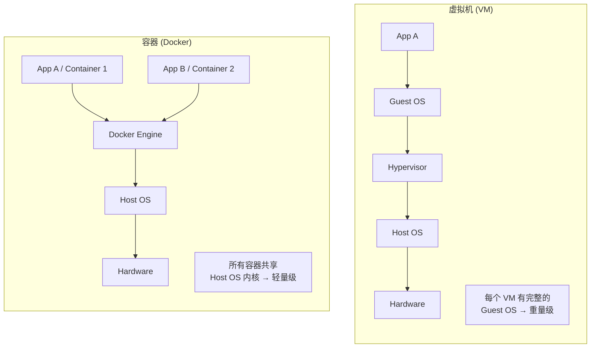

# 容器化 Docker 基础

## 学习目标

学完本节，你将能够：

- 理解 Docker 的核心概念（Image、Container、Dockerfile、Registry、Volume、Network）
- 掌握 Container 与 VM 的本质区别和各自优势
- 熟练使用 20+ 个常用 Docker 命令
- 编写生产级的多阶段构建 Dockerfile
- 使用 docker-compose 编排多容器应用
- 了解安全最佳实践和生产环境注意事项

## 前置知识

在开始之前，你需要了解：

- Linux 基本命令（cd、ls、cat、chmod 等）
- 应用部署的基本流程（编译 → 打包 → 部署）
- 网络基础（端口、IP 地址）

---

## 核心内容

### 1. Docker 是什么？

**Docker** 是一个开源的容器化平台，它让开发者能够将应用程序及其依赖打包到一个**可移植的容器**中。容器共享主机操作系统内核，但彼此隔离。



| 对比维度 | 虚拟机 (VM) | 容器 (Container) |
|---------|-------------|----------------|
| **隔离级别** | 硬件级（完整 Guest OS） | 进程级（共享内核） |
| **启动时间** | 分钟级 | 秒级（通常 < 1s） |
| **内存占用** | GB 级（每个 VM 需要 OS） | MB 级 |
| **磁盘占用** | GB 级（含完整 OS） | MB/GB 级（仅 App + 依赖） |
| **性能损耗** | 5-15%（Hypervisor 开销） | 近原生（< 2%） |
| **密度** | 单机几个 VM | 单机数百个容器 |
| **可移植性** | 受限于 Hypervisor | 任何支持 Docker 的环境 |

### 2. Docker 核心概念

```mermaid
graph LR
    DF[Dockerfile] -->|docker build| IMG[Image<br/>镜像]
    IMG -->|docker push| REG[Registry<br/>仓库<br/>(Docker Hub)]
    REG -->|docker pull| IMG2[本地镜像]
    IMG2 -->|docker run| CTN[Container<br/>容器]

    VOL[Volume] -.->|挂载| CTN
    NET[Network] -.->|连接| CTN

    style DF fill:#e8f5e9
    style IMG fill:#e3f2fd
    style CTN fill:#fff3e0
```

| 概念 | 类比 | 说明 |
|------|------|------|
| **Image（镜像）** | "类" / "ISO 文件" | 只读模板，包含运行应用所需的一切 |
| **Container（容器）** | "对象" / "运行的 VM" | 镜像的运行实例，可启动/停止/删除 |
| **Dockerfile** | "构建脚本" | 定义如何从基础镜像构建自定义镜像 |
| **Registry（仓库）** | "GitHub for Images" | 存储和分发镜像的地方 |
| **Volume（卷）** | "U 盘映射" | 持久化数据，容器重启不丢失 |
| **Network（网络）** | "虚拟交换机" | 容器间通信的网络配置 |

### 3. 常用 Docker 命令速查

#### 镜像操作

```bash
# 搜索镜像
docker search aspnet          # 在 Docker Hub 搜索
docker pull mcr.microsoft.com/dotnet/aspnet:8.0  # 拉取镜像

# 本地镜像管理
docker images                  # 列出所有本地镜像
docker image inspect <image>   # 查看镜像详细信息
docker rmi <image>             # 删除镜像
docker image prune             # 清理未使用的镜像
docker build -t myapp:v1 .     # 从 Dockerfile 构建镜像
```

#### 容器操作

```bash
# 运行容器
docker run -d --name webapp -p 8080:80 myapp:v1
# -d: 后台运行  --name: 命名  -p: 端口映射(宿主机:容器)

# 查看容器
docker ps                      # 运行中的容器
docker ps -a                   # 所有容器（含已停止的）
docker logs <container>        # 查看日志
docker logs -f <container>     # 实时跟踪日志
docker inspect <container>     # 查看容器详情

# 进入容器
docker exec -it <container> bash    # 交互式进入容器
docker exec <container> ls /app     # 在容器内执行命令

# 容器生命周期
docker start <container>       # 启动已停止的容器
docker stop <container>        # 优雅停止
docker kill <container>        # 强制停止
docker restart <container>     # 重启
docker rm <container>          # 删除已停止的容器
docker rm -f <container>       # 强制删除（运行中的也可删）
```

#### 清理与调试

```bash
# 一键清理
docker system prune -a         # 清理未使用的镜像、容器、网络、缓存
docker volume prune            # 清理未使用的卷
docker network prune           # 清理未使用的网络

# 复制文件
docker cp ./localfile container:/app/config.json  # 本地→容器
docker cp container:/app/logs/. ./logs/          # 容器→本地

# 导入导出
docker save -o image.tar myapp:v1   # 导出镜像为 tar 文件
docker load -i image.tar            # 从 tar 导入镜像
```

### 4. 编写生产级 Dockerfile

#### 多阶段构建（减小镜像体积 50%+）

```dockerfile
# ============================================================
# Stage 1: Build（构建阶段 - 包含 SDK，体积大）
# ============================================================
FROM mcr.microsoft.com/dotnet/sdk:8.0 AS build

WORKDIR /src

# 先复制 csproj 和 sln，利用 Docker 缓存层加速依赖还原
COPY ["MyProject.csproj", "./"]
RUN dotnet restore

# 复制源代码并发布
COPY . .
RUN dotnet publish "MyProject.csproj" \
    -c Release \
    -o /app/publish \
    /p:UseRazorBuild=false \
    self-contained=false \
    -r linux-x64

# ============================================================
# Stage 2: Runtime（运行阶段 - 只有运行时，体积小）
# ============================================================
FROM mcr.microsoft.com/dotnet/aspnet:8.0 AS runtime

WORKDIR /app

# 从构建阶段复制产物
COPY --from=build /app/publish .

# 创建非 root 用户（安全最佳实践）
RUN groupadd --gid 1000 appgroup && \
    useradd --uid 1000 --gid appgroup --create-home appuser
USER appuser

# 暴露端口
EXPOSE 80
EXPOSE 443

# 健康检查
HEALTHCHECK --interval=30s --timeout=10s --start-period=5s --retries=3 \
    CMD curl -f http://localhost/health || exit 1

# 设置环境变量
ENV ASPNETCORE_ENVIRONMENT=Production
ENV DOTNET_SYSTEM_GLOBALIZATION_INVARIANT=false
ENV TZ=Asia/Shanghai

ENTRYPOINT ["dotnet", "MyProject.dll"]
```

#### .dockerignore 文件

```
# .dockerignore -- 排除不需要复制到镜像中的文件
**/.vs/
**/bin/
**/obj/
**/.DS_Store
**/*.md
.git/
.github/
node_modules/
tests/
*.csproj.user
Dockerfile*
docker-compose*
.env
.env.*
!.env.example
```

### 5. docker-compose.yml 编排多容器

```yaml
# docker-compose.yml -- 定义多容器应用
version: '3.8'

services:
  # ====== Web 应用 ======
  web:
    build:
      context: .
      dockerfile: Dockerfile
    image: myapp-web:latest
    container_name: myapp-web
    ports:
      - "8000:80"
      - "8001:443"
    environment:
      - ASPNETCORE_ENVIRONMENT=Production
      - ConnectionStrings__DefaultConnection=Server=db;Database=mydb;User Id=sa;Password=YourStrong!Password123;
      - Redis__ConnectionString=redis:6379
    depends_on:
      db:
        condition: service_healthy
      redis:
        condition: service_healthy
    networks:
      - app-network
    restart: unless-stopped
    healthcheck:
      test: ["CMD", "curl", "-f", "http://localhost/health"]
      interval: 30s
      timeout: 10s
      retries: 3
      start_period: 40s

  # ====== SQL Server 数据库 ======
  db:
    image: mcr.microsoft.com/mssql/server:2022-latest
    container_name: myapp-sqlserver
    ports:
      - "1433:1433"
    environment:
      - ACCEPT_EULA=Y
      - MSSQL_SA_PASSWORD=YourStrong!Password123
    volumes:
      - sql-data:/var/opt/mssql/data
    networks:
      - app-network
    restart: unless-stopped
    healthcheck:
      test: ["CMD-SHELL", "/opt/mssql-tools18/bin/sqlcmd -S localhost -U sa -P 'YourStrong!Password123' -Q 'SELECT 1'"]
      interval: 15s
      timeout: 5s
      retries: 5

  # ====== Redis 缓存 ======
  redis:
    image: redis:7-alpine
    container_name: myapp-redis
    ports:
      - "6379:6379"
    command: redis-server --appendonly yes --maxmemory 256mb --maxmemory-policy allkeys-lru
    volumes:
      - redis-data:/data
    networks:
      - app-network
    restart: unless-stopped
    healthcheck:
      test: ["CMD", "redis-cli", "ping"]
      interval: 10s
      timeout: 5s
      retries: 3

# ====== 数据卷定义 ======
volumes:
  sql-data:
    driver: local
  redis-data:
    driver: local

# ====== 网络定义 ======
networks:
  app-network:
    driver: bridge
```

#### 常用 Compose 命令

```bash
# 启动所有服务（后台运行）
docker-compose up -d

# 查看服务状态
docker-compose ps

# 查看日志
docker-compose logs -f web          # 跟踪 web 服务日志
docker-compose logs --tail=50       # 最近 50 行

# 重启某个服务
docker-compose restart web

# 重新构建并启动（代码变更后）
docker-compose up -d --build

# 停止并移除所有容器
docker-compose down

# 停止并移除容器 + 删除卷（完全清理）
docker-compose down -v

# 扩展实例数量（仅 Swarm 模式有效）
docker-compose up -d --scale web=3
```

### 6. 安全最佳实践

| 最佳实践 | 说明 |
|---------|------|
| **非 root 用户运行** | `USER` 指令指定非特权用户 |
| **最小化基础镜像** | 优先用 Alpine (`:alpine`) 或 Distroless 镜像 |
| **不要在镜像中存密钥** | 通过环境变量或 Secrets 注入 |
| **只安装必要的包** | 减少攻击面 |
| **定期扫描漏洞** | `docker scan <image>` 或 Trivy |
| **使用固定版本标签** | 不要用 `latest` 标签 |
| **设置只读文件系统** | `--read-only` + 临时目录 |

---

## 动手练习

### 练习 1：为 ASP.NET Core 项目编写完整的 Docker 化方案

**要求**：
为一个包含以下技术栈的 ASP.NET Core 项目编写：
1. 多阶段构建 Dockerfile（SDK 构建 → Runtime 运行）
2. docker-compose.yml（Web App + SQL Server + Redis）
3. .dockerignore 文件
4. 启动脚本说明文档

<details>
<summary>查看答案</summary>

参考本文档中的 Dockerfile 和 docker-compose.yml 部分。关键点总结：
- **构建阶段**: 用 `mcr.microsoft.com/dotnet/sdk:8.0`
- **运行阶段**: 用 `mcr.microsoft.com/dotnet/aspnet:8.0`
- **非 root 用户**: `groupadd` + `useradd` + `USER`
- **健康检查**: `HEALTHCHECK` 指令
- **Compose 中**: `depends_on` + `healthcheck condition`
- **数据持久化**: `volumes` 映射数据库和 Redis 数据目录
</details>

---

## 本节小结

Docker 是现代微服务和云原生应用的基石：

1. **Container vs VM**：容器轻量快速，共享内核；VM 重量但完全隔离
2. **核心六概念**：Image、Container、Dockerfile、Registry、Volume、Network
3. **多阶段构建是标配**：构建阶段用 SDK（大），运行阶段用 Runtime（小），减少 50%+ 体积
4. **docker-compose 编排多容器**：开发环境一键启动整套基础设施
5. **安全第一**：非 root 用户、最小镜像、定期漏洞扫描

---

## 延伸阅读

- [[Docker Compose编排]] -- 更深入的 Compose 配置和生产部署
- [[Kubernetes基础概念]] -- 容器编排的下一步
- [Docker Official Documentation](https://docs.docker.com/)
- [Microsoft Docs: Containerize a .NET app](https://docs.microsoft.com/en-us/dotnet/core/docker/)

## 思考题

1. 为什么推荐使用 Alpine 基础镜像？它有什么潜在的风险？
2. 当容器内的进程崩溃时，Docker 会自动重启容器吗？如何配置？
3. 如何在 Docker 容器中进行调试？有哪些工具和方法？

---
**[[服务发现(Consul)]]** | **[[Docker Compose编排]]** | **🏠 [[HOME]]**
