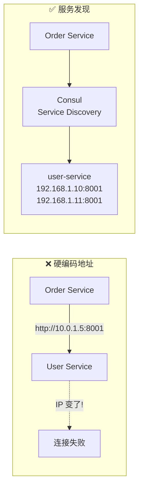
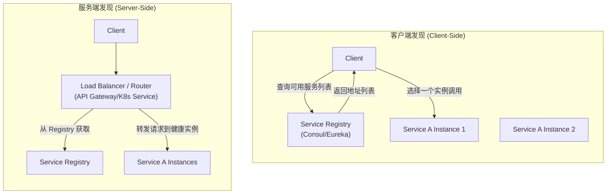
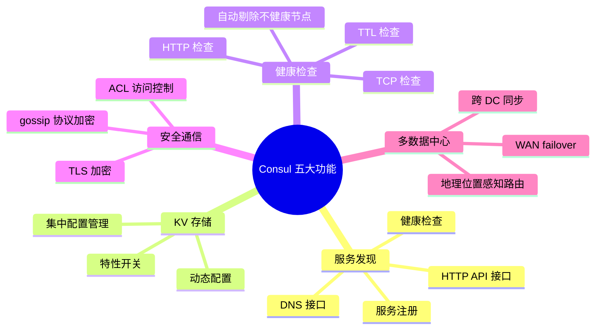

# 服务发现（Consul）

## 学习目标

学完本节，你将能够：

- 理解服务发现问题的本质（为什么不能硬编码 IP）
- 掌握服务发现的两种模式（客户端 vs 服务端发现）
- 了解 Consul 的核心功能和服务注册/发现机制
- 在 ASP.NET Core 中集成 Consul 实现服务注册与发现
- 配置健康检查和 Key/Value 存储
- 了解替代方案（Kubernetes Service、Eureka、Zookeeper）

## 前置知识

在开始之前，你需要了解：

- 微服务架构中服务间通信的基本方式
- Docker 容器的基本概念和网络模型
- HTTP API 调用的基本模式

---

## 核心内容

### 1. 服务发现问题

在微服务架构中，服务的地址是**动态变化的**：
- 容器重启后 IP 可能改变
- 自动扩缩容导致实例数量变化
- 多环境部署（dev/staging/prod）地址不同
- 云环境中 IP 不固定



### 2. 两种发现模式



| 维度 | 客户端发现 | 服务端发现 |
|------|-----------|-----------|
| **实现复杂度** | 客户端需要集成 SDK | 客户端无感知 |
| **网络跳数** | 少一跳（直接连目标服务） | 多一跳（经过 LB） |
| **灵活性** | 高（可实现自定义负载均衡策略） | 低（受限于 LB 能力） |
| **典型代表** | Consul + 客户端 SDK | Kubernetes Service + kube-proxy |
| **适用场景** | 需要精细控制路由逻辑 | 追求简单透明 |

### 3. Consul 核心功能

Consul 是 HashiCorp 出品的服务网格解决方案，提供五大核心功能：



### 4. ASP.NET Core 集成 Consul

#### 安装依赖

```bash
dotnet add package Consul.AspNetCore
```

#### 服务注册

```csharp
// Program.cs -- 注册 Consul
using Consul.AspNetCore;

var builder = WebApplication.CreateBuilder(args);

builder.Services.AddConsul(config =>
{
    config.Address = new Uri("http://consul:8500");
    // 如果 Consul 开启了 Token 认证
    config.Token = "your-consul-acl-token";
})
.AddConsulServiceRegistration(options =>
{
    options.ID = $"order-service-{Dns.GetHostName()}";
    options.Name = "order-service";
    options.Address = new Uri("http://host.docker.internal:8003"); // Docker 环境
    // 或者使用动态检测:
    // options.Address = new Uri($"http://{Dns.GetHostName()}:8003");

    options.HealthCheck = new AgentServiceCheck()
    {
        HTTP = new Uri("http://host.docker.internal:8003/health").ToString(),
        Interval = TimeSpan.FromSeconds(10),
        Timeout = TimeSpan.FromSeconds(5),
        DeregisterCriticalServiceAfter = TimeSpan.FromMinutes(1)
    };

    options.Tags = new[] { "v1", "core", "production" };
    options.Meta = new Dictionary<string, string>
    {
        { "version", "1.0.0" },
        { "environment", "production" }
    };
});

// 注册健康检查端点
builder.Services.AddHealthChecks()
    .AddCheck("self", () => HealthCheckResult.Healthy())
    .AddDbContextCheck<ApplicationDbContext>();

var app = builder.Build();

// 启用 Consul 中间件
app.UseConsulRegister();

// 健康检查端点
app.MapHealthChecks("/health");

app.Run();
```

#### 服务发现客户端

```csharp
/// <summary>
/// 基于 Consul 的服务发现客户端
/// </summary>
public class ConsulServiceDiscovery : IServiceDiscovery
{
    private readonly IConsulClient _consulClient;
    private readonly ILogger<ConsulServiceDiscovery> _logger;

    public ConsulServiceDiscovery(IConsulClient consulClient, ILogger<ConsulServiceDiscovery> logger)
    {
        _consulClient = consulClient;
        _logger = logger;
    }

    public async Task<Uri?> GetServiceAddressAsync(string serviceName, string? preferredTag = null)
    {
        var queryResult = await _consulClient.Health.Service(
            serviceName,
            preferredTag,     // 可选：只返回特定 tag 的实例
            passingOnly: true, // 只返回健康的实例
            queryOptions: new QueryOptions { WaitIndex = 0 });

        if (!queryResult.Response.Any())
        {
            _logger.LogWarning("No healthy instances found for service: {Service}", serviceName);
            return null;
        }

        // 简单的随机选择策略
        var services = queryResult.Response;
        var selected = services[new Random().Next(services.Count)];

        var address = selected.Service.Address;
        if (string.IsNullOrEmpty(address))
            address = "127.0.0.1";

        var uri = new Uri($"http://{address}:{selected.Service.Port}");

        _logger.LogDebug("Resolved {Service} -> {Uri}", serviceName, uri);
        return uri;
    }

    public async Task<List<Uri>> GetAllServiceAddressesAsync(string serviceName)
    {
        var queryResult = await _consulClient.Health.Service(serviceName, null, true);
        return queryResult.Response.Select(s =>
        {
            var addr = string.IsNullOrEmpty(s.Service.Address) ? "127.0.0.1" : s.Service.Address;
            return new Uri($"http://{addr}:{s.Service.Port}");
        }).ToList();
    }
}
```

#### 使用发现的 HttpClient

```csharp
// 结合 IHttpClientFactory 和 Consul 实现动态地址解析
public static class ConsulHttpClientExtensions
{
    public static IHttpClientBuilder AddConsulServiceClient<TInterface, TImplementation>(
        this IServiceCollection services,
        string serviceName,
        string consulUrl)
        where TInterface : class
        where TImplementation : class, TInterface
    {
        services.AddSingleton<IConsulClient>(sp => new ConsulClient(new ConsulClientConfiguration
        {
            Address = new Uri(consulUrl)
        }));

        services.AddHttpClient<TInterface, TImplementation>()
            .AddHttpMessageHandler(sp =>
            {
                var consul = sp.GetRequiredService<IConsulClient>();
                return new ConsulDiscoveryHandler(consul, serviceName);
            });

        return services;
    }
}

/// <summary>
/// 自定义 DelegatingHandler -- 从 Consul 解析实际地址
/// </summary>
public class ConsulDiscoveryHandler : DelegatingHandler
{
    private readonly IConsulClient _consulClient;
    private readonly string _serviceName;

    public ConsulDiscoveryHandler(IConsulClient consulClient, string serviceName)
    {
        _consulClient = consulClient;
        _serviceName = serviceName;
    }

    protected override async Task<HttpResponseMessage> SendAsync(HttpRequestMessage request, CancellationToken cancellationToken)
    {
        // 从 Consul 获取服务地址
        var services = await _consulClient.Health.Service(_serviceName, "", true);

        if (!services.Response.Any())
            throw new InvalidOperationException($"No healthy instances of {_serviceName} found");

        var instance = services.Response.First();
        var baseAddress = instance.Service.Address ?? "127.0.0.1";
        request.RequestUri = new Uri(
            $"http://{baseAddress}:{instance.Service.Port}{request.RequestUri.PathAndQuery}");

        return await base.SendAsync(request, cancellationToken);
    }
}
```

### 5. 替代方案对比

| 方案 | 类型 | 优势 | 劣势 | 适用场景 |
|------|------|------|------|---------|
| **Consul** | 客户端发现 | 功能全面、KV存储、多DC | 需要额外部署和维护 | 自建微服务 / 非 K8s 环境 |
| **Kubernetes Service** | 服务端发现 | 原生集成、无需额外组件 | 仅限 K8s 环境 | Kubernetes 集群内 |
| **Eureka** | 客户端发现 | Netflix 生态成熟 | 社区活跃度下降 | Spring Cloud 体系 |
| **Zookeeper** | 客户端发现 | 成熟稳定、强一致性 | 复杂、重量级 | Hadoop/HBase 生态 |

---

## 本节小结

服务发现是微服务架构的基础设施之一。关键要点：

1. **不要硬编码服务地址** -- 地址是动态变化的
2. **Consul 是 .NET 生态的优秀选择** -- 功能全面、有官方 .NET SDK
3. **健康检查至关重要** -- 自动剔除不健康实例保证系统可靠性
4. **K8s 环境优先用原生 Service** -- 无需额外引入 Consul
5. **KV 存储可用于集中配置管理** -- 替代部分配置中心的功能

---

## 延伸阅读

- [[API Gateway(Ocelot/YARP)]] -- Gateway 可以集成 Consul 做动态路由
- [[容器化Docker基础]] -- Consul 通常在容器化环境中使用
- [Consul Official Documentation](https://developer.hashicorp.com/consul/docs)

## 思考题

1. Consul 的 gossip 协议是什么？它如何保证服务注册信息在多个 Consul 节点之间同步？
2. 当 Consul Server 全部宕机时，已注册的服务还能互相发现吗？为什么？
3. 如何在开发环境中模拟 Consul 不可用的场景，确保你的应用能够优雅降级？

---
**[[API Gateway(Ocelot-YARP)]]** | **[[容器化Docker基础]]** | **🏠 [[HOME]]**
