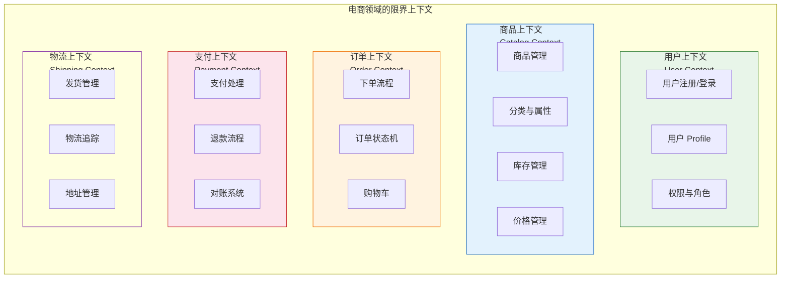
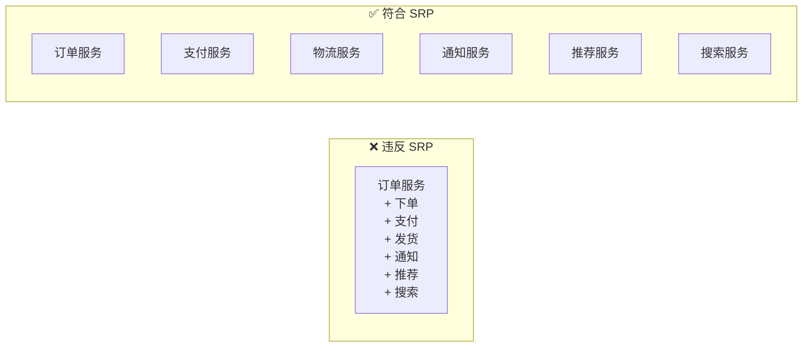
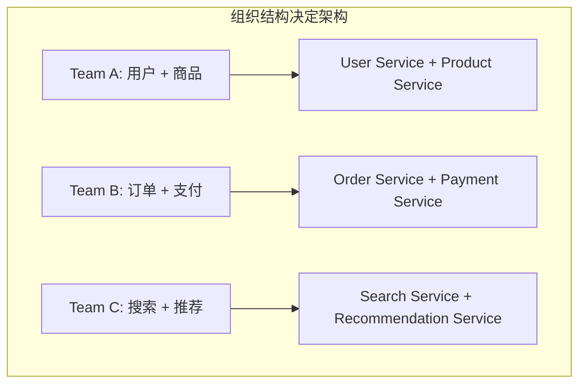
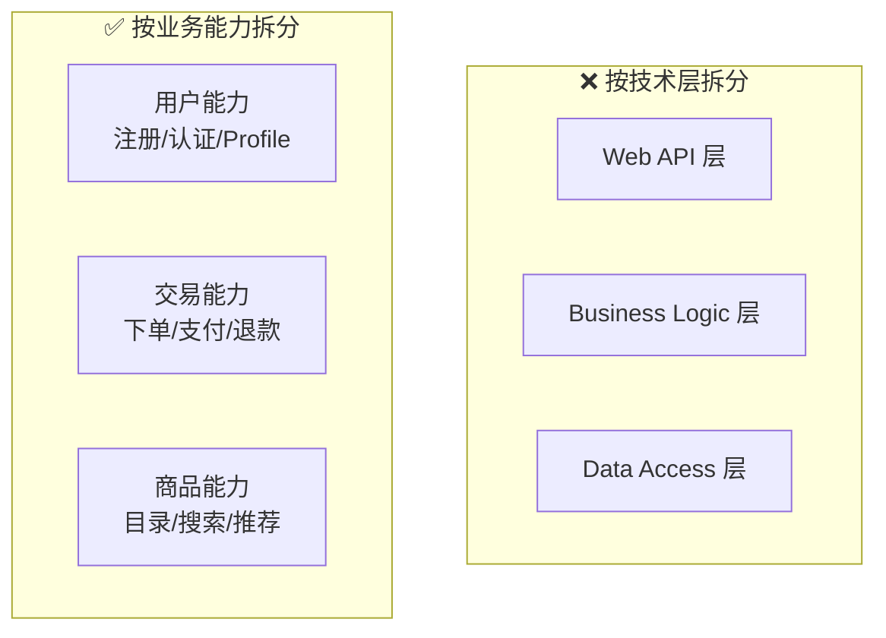
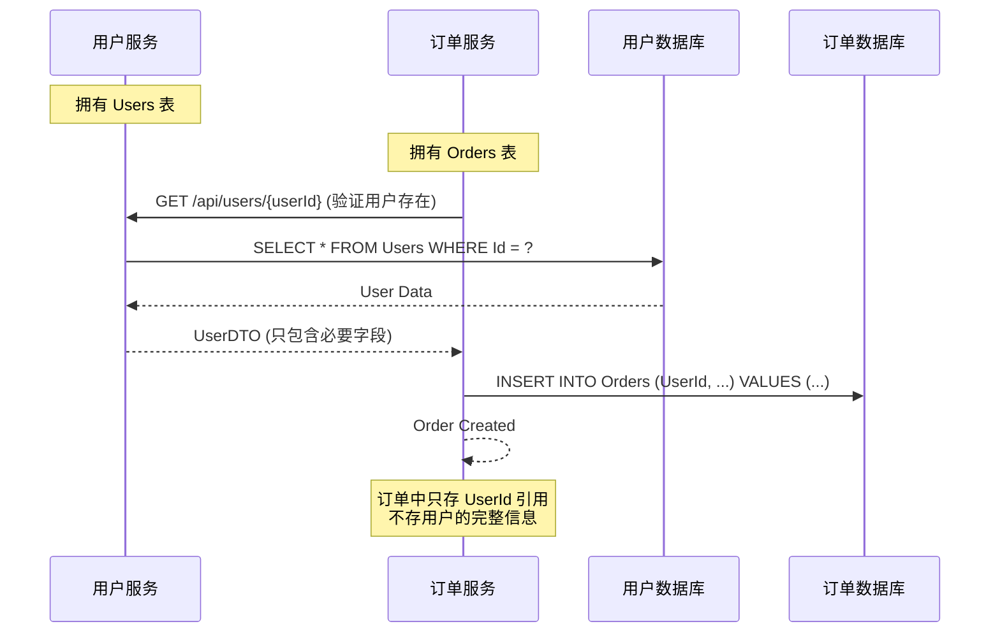
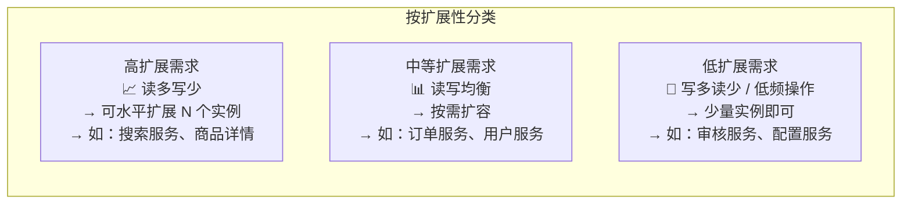
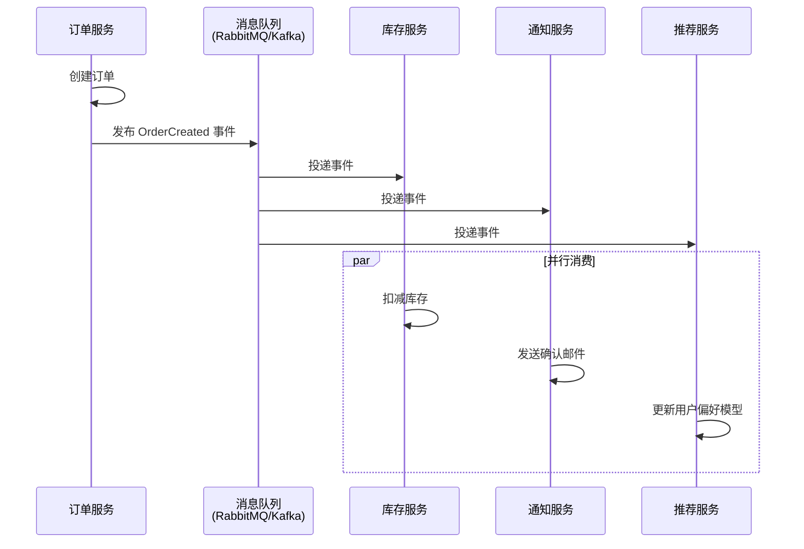
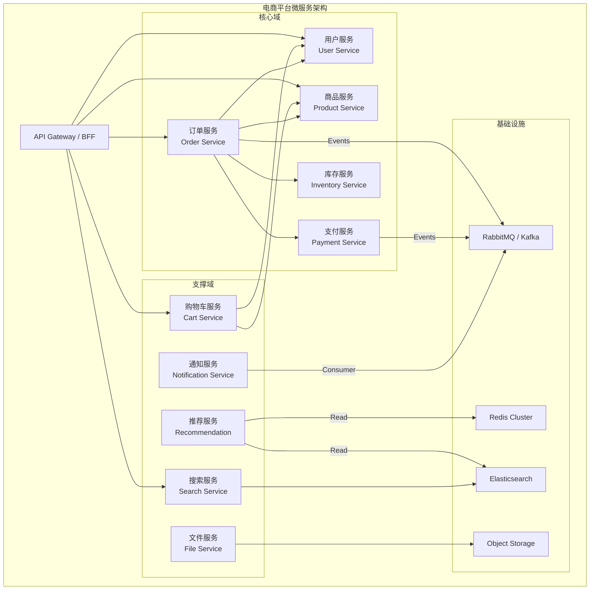
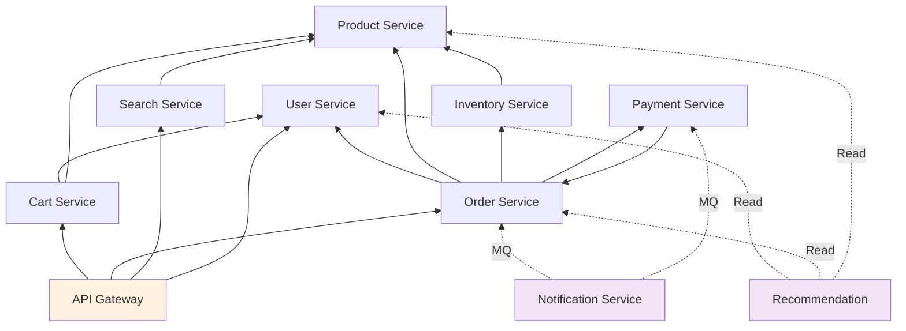
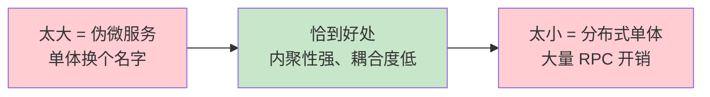

# 服务拆分原则与方法

## 学习目标

学完本节，你将能够：

- 理解 DDD 中 Bounded Context（限界上下文）的概念及其在服务拆分中的核心作用
- 掌握服务拆分的四大核心原则（单一职责、团队自治、数据独立性、业务能力对齐）
- 掌握四种主流拆分方法论（按领域/数据所有权/团队/可扩展性）
- 识别并避免常见的拆分反模式（分布式单体、共享数据库等）
- 了解事件驱动架构（EDA）在微服务间通信中的作用
- 能够为实际业务系统设计合理的服务拆分方案

## 前置知识

在开始之前，你需要了解：

- 微服务架构的基本概念和优劣
- 领域驱动设计（DDD）的基础术语（实体、值对象、聚合根、限界上下文）
- RESTful API 和数据库设计的基本知识

---

## 核心内容

### 1. DDD 的 Bounded Context（限界上下文）

**Bounded Context** 是 DDD 的核心战略设计工具，也是微服务拆分最重要的理论依据。每个 Bounded Context 就是未来一个微服务的候选者。



**关键理解**：
- 每个 Bounded Context 有自己的**统一语言（Ubiquitous Language）**
- 同一个词在不同上下文中含义不同（如"商品"在 Catalog 中是完整信息，在 Order 中只是引用）
- Bounded Context 之间的边界就是**未来服务的边界**

### 2. 服务拆分的核心原则

#### 原则一：单一职责原则（SRP）

一个微服务应该只做一件事，并且把它做好。



**判断标准**：
- 如果修改一个功能的原因只有一个 -> 职责清晰
- 如果需要同时修改多个不相关的部分 -> 可能违反了 SRP
- 如果可以用一句话描述这个服务的职责 -> 合理

#### 原则二：团队自治原则（Conway's Law）

> "设计系统的组织，其产生的设计等同于组织间的沟通结构。" -- Melvin Conway



**实践建议**：
- **两个披萨规则**：一个服务由一个不超过 10 人（两个披萨能喂饱的团队）负责
- 团队应该是**全功能的**：包含开发、测试、运维能力
- 减少跨团队的依赖和协调成本

#### 原则三：数据独立性原则（Database per Service）

每个服务拥有自己的数据库，其他服务不能直接访问。

```mermaid
graph TB
    subgraph Independent["✅ 数据独立"]
        OS[(Order DB)] <-- OSvc[Order Service]
        US[(User DB)] <-- USvc[User Service]
        PS[(Product DB)] <-- PSvc[Product Service]

        OSvc -->|"API Call"| USvc
        OSvc -->|"API Call"| PSvc
        OSsvc -.->|Event| USvc
    end

    subgraph Shared["❌ 共享数据库（反模式）"]
        SharedDB[(Shared Database)]
        S1[Service A] --> SharedDB
        S2[Service B] --> SharedDB
        S3[Service C] --> SharedDB
    end
```

**为什么必须独立？**
- Schema 变更不需要协调多个团队
- 可以选择最适合该服务数据的存储技术
- 避免锁竞争和性能耦合
- 服务可以独立备份和恢复

#### 原则四：业务能力对齐

服务应该对应真实的业务能力，而非技术层次。



### 3. 拆分方法论

#### 方法一：按业务领域拆分（最常用）

基于 DDD 的领域建模，识别核心域、支撑域和通用域：

```
步骤：
1. 事件风暴（Event Storming）：召集领域专家和开发者
2. 识别领域事件："用户已注册"、"订单已创建"、"库存已扣减"...
3. 将相关事件聚合成聚合（Aggregate）
4. 将相关聚合归入限界上下文（Bounded Context）
5. 每个限界上下文 → 一个微服务
```

#### 方法二：按数据所有权拆分（Who Writes Owns It）

**谁写入的数据，谁就拥有它。** 这是防止共享数据库的最实用原则。



#### 方法三：按团队结构拆分（康威定律）

根据现有或规划中的团队结构来划分服务边界：

| 团队 | 负责的服务 |
|------|-----------|
| 用户增长组 | 用户服务、通知服务 |
| 交易组 | 订单服务、支付服务、购物车服务 |
| 商品组 | 商品服务、库存服务、搜索服务 |
| 数据组 | 推荐服务、报表服务 |

#### 方法四：按可扩展性需求拆分

将具有不同扩展需求的功能分离：



### 4. 反模式识别

#### 反模式一：分布式单体（Distributed Monolith）

```
症状：
  ✗ 服务之间通过同步 HTTP 紧密调用（A → B → C → D 链式调用）
  ✗ 一个服务变更需要同时部署 3-4 个其他服务
  ✗ 所有服务共享同一个数据库
  ✗ 服务粒度太细（每个 Controller 一个服务）

后果：
  → 丧失了微服务的所有优势（独立部署、故障隔离、技术自由）
  → 却承担了微服务的所有代价（网络延迟、分布式复杂性、运维开销）
```

#### 反模式二：共享数据库微服务

```
症状：
  ✗ 多个服务连接同一个 SQL Server 实例
  ✗ 服务 A 直接 UPDATE 服务 B 的表
  ✗ 表结构变更需要协调所有相关服务

正确做法：
  ✓ 每个服务独占自己的数据库 Schema
  ✓ 通过 API 或事件获取其他服务的数据
  ✓ 数据冗余优于跨库查询（如订单表中冗余存一份商品快照）
```

#### 反模式三：上帝服务（God Service / God Endpoint）

```
症状：
  ✗ API Gateway 把所有请求转发到一个"编排服务"
  ✗ 这个编排服务调用所有其他服务来组装响应
  ✗ 它变成了新的单体 -- 所有逻辑又集中在这里

正确做法：
  ✓ 使用 BFF（Backend for Frontend）模式
  ✓ 让前端直接聚合来自不同服务的数据
  ✓ 或者使用 GraphQL 进行灵活的数据聚合
```

### 5. 事件驱动架构简介

当服务拆分后，如何保持服务间的数据同步？**事件驱动架构（EDA）** 是答案。



**EDA 的核心优势**：
- **松耦合**：发布者不知道有哪些消费者
- **异步**：非阻塞，提升吞吐量
- **可扩展**：新增消费者无需修改发布者
- **可靠性**：消息持久化，确保不丢失

### 6. 实战案例：电商系统服务拆分

以一个中型电商平台为例，展示完整的拆分过程：



#### 各服务详细说明

| 服务 | 边界 | 核心实体 | 数据存储 | 对外接口 |
|------|------|---------|---------|---------|
| **用户服务** | 身份与访问管理 | User, Role, Permission | PostgreSQL | REST + JWT |
| **商品服务** | 商品目录管理 | Product, Category, SKU, Attribute | PostgreSQL | REST + gRPC |
| **订单服务** | 交易流程管理 | Order, OrderItem, OrderStatus | PostgreSQL | REST + Events |
| **支付服务** | 支付处理 | Payment, Refund, Transaction | PostgreSQL | REST + Callbacks |
| **库存服务** | 库存管理 | Inventory, StockReservation | PostgreSQL + Redis | gRPC (内部) |
| **购物车服务** | 购物车 | Cart, CartItem | Redis | REST |
| **搜索服务** | 商品搜索 | (索引数据) | Elasticsearch | REST |
| **推荐服务** | 个性化推荐 | UserProfile, BehaviorLog | ClickHouse + Redis | REST |
| **通知服务** | 消息推送 | Notification, Template | MongoDB (可选) | Event Consumer |
| **文件服务** | 文件存储 | FileMetadata | PostgreSQL + OSS | REST |

#### 服务间依赖关系图



### 7. 服务粒度的选择

服务粒度是拆分中最难把握的问题之一：



**判断服务粒度的标准**：

| 标准 | 太大 | 太小 | 合适 |
|------|------|------|------|
| **代码量** | > 5 万行 | < 1000 行 | 3000-20000 行 |
| **团队人数** | > 15 人维护 | < 1 人全职 | 2-8 人 |
| **部署频率** | 数周一次 | 一天多次 | 一周到两周一次 |
| **通信量** | 内部几乎无远程调用 | 大量内部 RPC 调用 | 适度的外部通信 |
| **业务变化频率** | 任何变更都影响多人 | 极少变更 | 独立迭代周期 |

---

## 深入理解

> **为什么说"先拆后合"比"一开始就精确拆分"更好？**

很多团队陷入"分析瘫痪"，试图一次性画出完美的服务边界。但现实是：**没有人能在开始时就完全正确地划分服务边界**。更好的策略是：

1. 先按大致的业务领域做一个粗粒度的拆分（5-8 个服务）
2. 在运行过程中观察哪些服务经常一起变更
3. 合并过于碎片化的服务
4. 拆分发现仍然过大的服务

这就是**演进式架构**的精髓。

> **数据一致性 vs 服务独立性，如何权衡？**

这是微服务拆分中最痛苦的权衡。严格的服务独立性意味着放弃强一致性（ACID），转而接受最终一致性。但如果业务上无法容忍最终一致性（如金融转账），则需要：
- 使用 Saga 模式实现补偿事务
- 或在某些场景下保留局部的事务性操作

---

## 常见陷阱

### DO / DON'T 清单

| DO (推荐做法) | DON'T (避免做法) |
|---------------|------------------|
| 以业务领域为核心进行拆分 | 按技术层（Controller/Service/DAO）拆分 |
| 从粗到细，逐步演进 | 试图一步到位画出完美边界 |
| 每个服务有自己的数据库 | 共享数据库（除非在过渡期） |
| 通过事件实现最终一致性 | 跨服务做分布式事务（2PC/3PC） |
| 明确服务间契约（API 版本化） | 随意破坏接口兼容性 |
| 保持服务粒度适中 | 过度拆分导致分布式单体 |
| 用 DDD Event Storming 识别边界 | 在会议室里凭空想象服务边界 |
| 建立服务所有权文化 | 所有人都能改所有服务的代码 |

---

## 动手练习

### 练习 1：为在线教育平台设计服务拆分

**场景**：在线教育平台包含以下功能模块：
- 用户管理（学生/教师/管理员）
- 课程管理（创建课程、章节、视频上传）
- 视频播放（流媒体传输、进度记录、弹幕）
- 作业系统（布置作业、提交、批改）
- 讨论区（发帖、回复、点赞）
- 直播课堂（实时音视频互动）
- 支付（购买课程/会员订阅）
- 证书（完成课程后颁发）
- 数据统计（学习时长、完成率、活跃度）

请设计合理的服务拆分方案，包括：
1. 服务列表及职责
2. 服务间依赖关系
3. 每个服务的数据库选型建议

<details>
<summary>查看参考答案</summary>

**推荐的服务拆分方案（10 个服务）：**

| 服务 | 职责 | 数据库 | 说明 |
|------|------|--------|------|
| **用户服务** | 注册/登录/Profile/权限 | PostgreSQL | 包含学生/教师/管理员角色 |
| **课程服务** | 课程CRUD/章节管理/目录结构 | PostgreSQL | 课程元数据和结构 |
| **视频服务** | 上传/转码/分发/CDN | PostgreSQL + OSS | IO 密集型，可独立扩展 |
| **学习服务** | 进度记录/播放历史/学习统计 | MongoDB / ClickHouse | 写入量大，文档型合适 |
| **作业服务** | 作业CRUD/提交/批改 | PostgreSQL | 与课程有一定关联但可独立 |
| **社区服务** | 讨论/Q&A/点赞/关注 | PostgreSQL | 社交属性强 |
| **直播服务** | 房间管理/推拉流/互动 | Redis + 流媒体服务器 | 实时性要求极高 |
| **支付服务** | 购买/订阅/退款/发票 | PostgreSQL | 安全敏感，需隔离 |
| **证书服务** | 生成/验证/管理证书 | PostgreSQL + OSS | 相对独立的闭环 |
| **通知服务** | 站内信/邮件/SMS/Push | MongoDB / RabbitMQ | 天然的事件消费者 |

**依赖关系要点**：
- 学习服务依赖用户服务和课程服务（记录谁学了什么课）
- 作业服务依赖课程服务和用户服务
- 支付服务触发通知服务（购买成功通知）
- 证书服务监听学习服务的事件（课程完成后自动颁发）

</details>

---

### 练习 2：识别反模式

以下是一个"微服务"项目的描述，请找出其中的反模式并给出改进建议：

> "我们的电商项目已经拆成了 15 个微服务！包括：用户控制器服务、订单控制器服务、商品控制器服务、支付控制器服务...每个服务都有自己的项目文件夹。它们都连接同一个 SQL Server 数据库，因为我们需要 JOIN 查询。服务之间通过 HttpClient 直接调用，有时候一次请求会串起 7-8 个服务。"

<details>
<summary>查看分析与改进</summary>

**识别出的反模式：**

1. **伪微服务（按 Controller 拆分）**
   - 问题：把 Web 层的 Controller 拆开不叫微服务
   - 改进：按业务领域重新划分（用户域、商品域、交易域...）

2. **共享数据库**
   - 问题：所有服务连同一个 DB，丧失了独立性
   - 改进：Database per Service；跨服务数据通过 API 或事件获取

3. **链式 RPC 调用（级联失败风险）**
   - 问题：一次请求串联 7-8 个服务，延迟叠加且任何一个挂了全链路失败
   - 改进：
     - 使用 API Gateway/BFF 聚合数据
     - 引入缓存减少远程调用
     - 使用事件驱动替代同步调用
     - 加入熔断机制

4. **服务数量过多（15 个对于小团队）**
   - 问题：运维复杂度爆炸
   - 改进：合并高度相关的服务，目标 5-8 个核心服务

**改进后的架构建议**：
```
从 15 个"伪微服务" → 6 个真正的微服务：
  1. 用户服务（认证 + Profile + 权限）
  2. 商品服务（目录 + 分类 + 搜索索引维护）
  3. 订单服务（下单 + 购物车 + 订单状态机）
  4. 交易服务（支付 + 退款 + 对账）
  5. 通知服务（短信 + 邮件 + 站内信）
  6. 文件服务（图片上传 + CDN 管理）

加上：API Gateway + 消息队列(RabbitMQ) + Redis(缓存) + Elasticsearch(搜索)
```

</details>

---

### 练习 3：思考题

在服务拆分过程中，如果发现两个服务之间需要频繁地双向调用，这说明什么问题？应该如何处理？

<details>
<summary>查看思路</summary>

**这通常说明：**

1. **服务边界划错了** -- 这两个服务可能本应属于同一个上下文
   - 解决：考虑合并这两个服务，或者重新审视边界

2. **缺少共享内核（Shared Kernel）** -- 有些通用的东西被错误地分散了
   - 解决：提取公共的库/包（但要控制范围，不要变成新的耦合点）

3. **缺少事件驱动** -- 本应通过异步事件解耦的地方用了同步调用
   - 解决：将同步 HTTP 调用改为事件发布/订阅模式

4. **数据模型设计不当** -- 缺少必要的冗余数据
   - 解决：在本地数据库中冗余存储一些常用数据（如订单表存商品名称快照）

**处理决策树**：
```
频繁双向调用？
├→ 能否合并为一个服务？ → 是 → 合并
├→ 能否改为事件驱动？ → 是 → 引入消息队列
├→ 能否增加数据冗余？ → 是 → 本地存储副本
└→ 以上都不行 → 接受一定的耦合，但加入熔断和降级保护
```

</details>

---

## 本节小结

服务拆分是微服务架构中最关键也最具挑战性的环节。核心要点：

1. **Bounded Context 是理论基础** -- DDD 的限界上下文直接映射为服务边界
2. **四大原则指导实践** -- 单一职责、团队自治、数据独立、业务对齐
3. **多种方法综合运用** -- 按领域为主，辅以数据所有权、团队结构和扩展性考量
4. **反模式要警惕** -- 分布式单体、共享数据库、上帝服务是最常见的陷阱
5. **粒度适中是关键** -- 太大=伪微服务，太小=分布式单体
6. **演进优于一步到位** -- 先粗后细，在实践中不断调整

---

## 延伸阅读

- [[单体 vs 微服务对比]] -- 拆分前的决策依据
- [[服务间通信(HTTP/gRPC)]] -- 拆分后的服务通信方式
- [[API Gateway(Ocelot/YARP)]] -- 微服务的统一入口
- [Domain-Driven Design: Tackling Complexity in the Heart of Software](https://www.amazon.com/Domain-Driven-Design-Tackling-Complexity/dp/0321125215)
- [Sam Newman: Monolith to Microservices](https://www.amazon.com/Monolith-Microservices-Evolutionary-Patterns-Transformation/dp/1492047749)
- [Martin Fowler: Bounded Context](https://martinfowler.com/bliki/BoundedContext.html)

## 思考题

1. 如果你的公司规定"所有新项目必须使用微服务架构"，你会如何回应？请给出你的理由。
2. 在一个遗留的单体系统中，你想把它逐步改造为微服务。请问第一步应该拆哪个模块？为什么？
3. "数据库 per Service" 原则在什么情况下可以有例外？请举例说明。

---
**[[单体 vs 微服务对比]]** | **[[服务间通信(HTTP/gRPC)]]** | **🏠 [[HOME]]**
