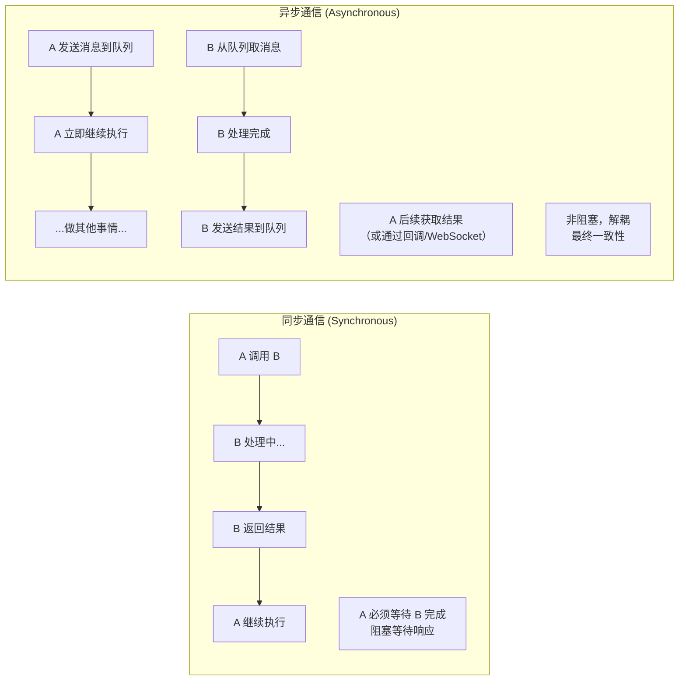
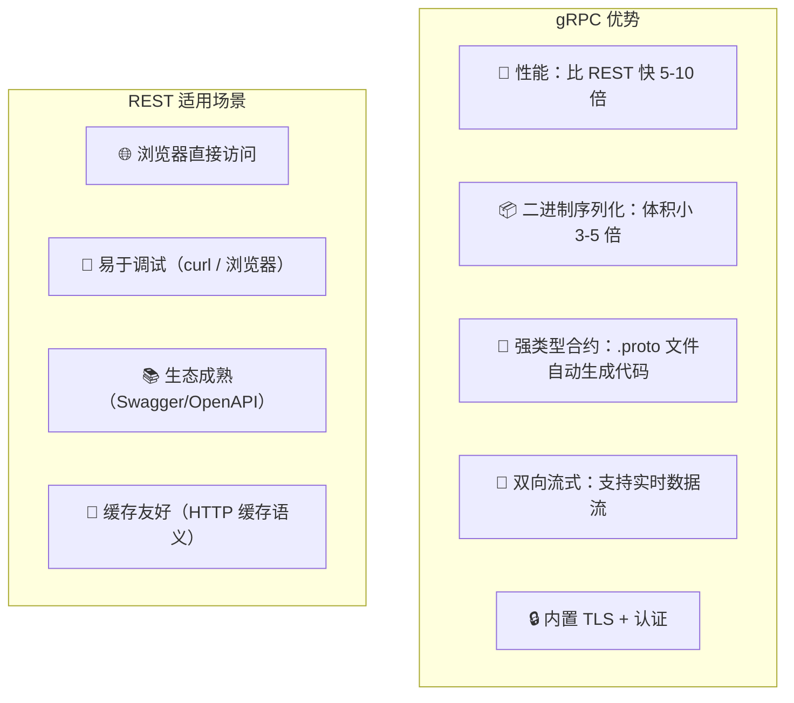
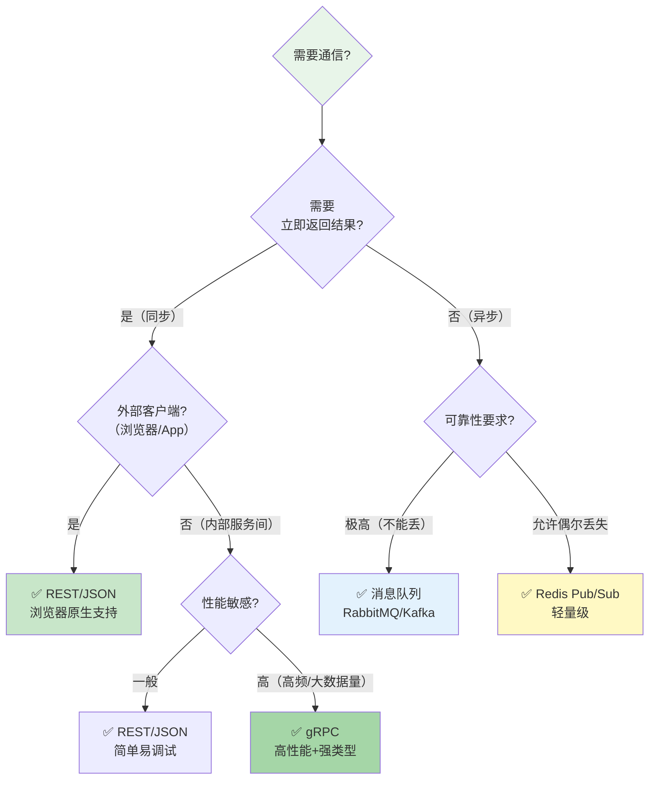

# 服务间通信（HTTP / gRPC）

## 学习目标

学完本节，你将能够：

- 理解同步通信与异步通信的区别和适用场景
- 掌握 REST/HTTP 调用的完整实现（IHttpClientFactory、命名客户端、类型化客户端）
- 掌握 gRPC 的核心概念和 .NET 实现（Protocol Buffers、.proto 文件、双向流式 RPC）
- 深入对比 HTTP/REST 与 gRPC 的优劣
- 学会根据场景选择合适的通信模式
- 理解超时设置、重试策略、断路器和降级策略
- 编写完整的 gRPC 服务定义和 C# 实现示例

## 前置知识

在开始之前，你需要了解：

- HTTP 协议基础（请求/响应模型、状态码、Header）
- JSON 序列化和 RESTful API 设计原则
- TCP 和网络编程基本概念
- 异步编程（async/await）基础

---

## 核心内容

### 1. 同步通信 vs 异步通信



| 维度 | 同步（HTTP/gRPC） | 异步（消息队列） |
|------|-------------------|------------------|
| **耦合度** | 较高（调用方需要知道对方接口） | 低（只依赖消息格式） |
| **实时性** | 实时（等待返回结果） | 非实时（延迟处理） |
| **可靠性** | 对方宕机则调用失败 | 消息持久化，不丢失 |
| **适用场景** | 需要立即返回结果的查询/命令 | 不需要即时响应的后台处理 |
| **典型技术** | REST / gRPC | RabbitMQ / Kafka / Azure Service Bus |

### 2. HTTP/REST 调用

#### IHttpClientFactory 最佳实践

```csharp
// Program.cs -- 注册 HttpClient
builder.Services.AddHttpClient("user-service", client =>
{
    client.BaseAddress = new Uri("http://user-service:8001/");
    client.Timeout = TimeSpan.FromSeconds(10);
    client.DefaultRequestHeaders.Add("Accept", "application/json");
})
.ConfigurePrimaryHttpMessageHandler(() => new HttpClientHandler
{
    // 生产环境应验证服务器证书
    ServerCertificateCustomValidationCallback = (_, _, _) => true // 仅开发环境！
});

// 注册类型化客户端
builder.Services.AddHttpClient<IUserApiClient, UserApiClient>(client =>
{
    client.BaseAddress = new Uri("http://user-service:8001/");
});
```

#### 类型化客户端实现

```csharp
/// <summary>
/// 用户服务的类型化 HTTP 客户端
/// </summary>
public interface IUserApiClient
{
    Task<UserDto?> GetUserAsync(Guid userId);
    Task<bool> UserExistsAsync(Guid userId);
    Task<UserDto?> GetUserByEmailAsync(string email);
}

public class UserApiClient : IUserApiClient
{
    private readonly HttpClient _httpClient;
    private readonly ILogger<UserApiClient> _logger;

    public UserApiClient(HttpClient httpClient, ILogger<UserApiClient> logger)
    {
        _httpClient = httpClient;
        _logger = logger;
    }

    public async Task<UserDto?> GetUserAsync(Guid userId)
    {
        try
        {
            var response = await _httpClient.GetAsync($"api/users/{userId}");

            if (response.StatusCode == HttpStatusCode.NotFound)
                return null;

            response.EnsureSuccessStatusCode();

            return await response.Content.ReadFromJsonAsync<UserDto>();
        }
        catch (HttpRequestException ex)
        {
            _logger.LogError(ex, "Failed to get user {UserId} from user service", userId);
            throw new ServiceUnavailableException("User service is unavailable", ex);
        }
    }

    public async Task<bool> UserExistsAsync(Guid userId)
    {
        var response = await _httpClient.HeadAsync($"api/users/{userId}");
        return response.IsSuccessStatusCode;
    }

    public async Task<UserDto?> GetUserByEmailAsync(string email)
    {
        var response = await _httpClient.GetAsync(
            $"api/users/by-email?email={Uri.EscapeDataString(email)}");

        if (!response.IsSuccessStatusCode)
            return null;

        return await response.Content.ReadFromJsonAsync<UserDto>();
    }
}
```

#### 在微服务中使用

```csharp
/// <summary>
/// 订单服务 -- 通过 HTTP 调用用户服务和商品服务
/// </summary>
public class OrderService
{
    private readonly IUserApiClient _userClient;
    private readonly IProductApiClient _productClient;
    private readonly IOrderRepository _orderRepo;
    private readonly ILogger<OrderService> _logger;

    public OrderService(
        IUserApiClient userClient,
        IProductApiClient productClient,
        IOrderRepository orderRepo,
        ILogger<OrderService> logger)
    {
        _userClient = userClient;
        _productClient = productClient;
        _orderRepo = orderRepo;
        _logger = logger;
    }

    public async Task<OrderDto> CreateOrderAsync(CreateOrderRequest request)
    {
        // 并行调用多个服务（减少总延迟）
        var userTask = _userClient.GetUserAsync(request.UserId);
        var productTasks = request.Items.Select(item =>
            _productClient.GetProductAsync(item.ProductId)).ToArray();

        await Task.WhenAll(userTask);
        await Task.WhenAll(productTasks);

        var user = userTask.Result;
        if (user == null)
            throw new NotFoundException("User not found");

        // 校验所有商品
        foreach (var (task, item) in productTasks.Zip(request.Items))
        {
            var product = task.Result;
            if (product == null || !product.IsAvailable)
                throw new NotFoundException($"Product {item.ProductId} not available");
        }

        // 创建订单...
        var order = new Order { /* ... */ };
        await _orderRepo.AddAsync(order);

        return MapToDto(order);
    }
}
```

### 3. gRPC 调用

gRPC 是 Google 开发的高性能 RPC 框架，基于 HTTP/2 和 Protocol Buffers。

#### 为什么选择 gRPC？



| 特性 | REST/JSON | gRPC/Protobuf |
|------|-----------|---------------|
| **协议** | HTTP/1.1 | HTTP/2 |
| **序列化** | JSON（文本） | Protocol Buffers（二进制） |
| **消息大小** | 大（JSON 冗余多） | 小（二进制紧凑） |
| **速度** | 基准线 | 快 5-10x |
| **代码生成** | 手写或 Swagger 生成 | .proto 自动生成 |
| **浏览器支持** | 原生支持 | 不支持（需要网关转换） |
| **流式支持** | 仅 SSE（有限） | 单向/双向流 |
| **调试体验** | 好（可读的 JSON） | 差（需要工具解码） |

#### .proto 文件定义

```protobuf
// ====== 定义 Proto 文件 ======
syntax = "proto3";

package ecom.product;

option csharp_namespace = "Ecommerce.ProductService.Protos";

// 导入公共定义
import "google/protobuf/timestamp.proto";
import "google/protobuf/empty.proto";

// ====== 商品服务定义 ======
service ProductService {
  // 一元 RPC（类似普通方法调用）
  rpc GetProduct(GetProductRequest) returns (ProductResponse);

  // 服务端流式 RPC（服务端持续推送数据）
  rpc ListProducts(ListProductsRequest) returns (stream ProductResponse);

  // 客户端流式 RPC（客户端持续发送数据）
  rpc BulkCreateProducts(stream CreateProductRequest) returns (BulkCreateResponse);

  // 双向流式 RPC（双方都可以持续收发）
  rpc ProductChat(stream ProductChatMessage) returns (stream ProductChatMessage);
}

// ====== 请求/响应消息 ======
message GetProductRequest {
  string product_id = 1;
}

message ProductResponse {
  string id = 1;
  string name = 2;
  string description = 3;
  double price = 4;
  string category = 5;
  bool is_available = 6;
  int32 stock_quantity = 7;
  google.protobuf.Timestamp created_at = 8;
  repeated string tags = 9;
}

message ListProductsRequest {
  string category = 1;
  int32 page_number = 2;
  int32 page_size = 3;
  string search_keyword = 4;
}

message CreateProductRequest {
  string name = 1;
  string description = 2;
  double price = 3;
  string category = 4;
  repeated string tags = 5;
}

message BulkCreateResponse {
  int32 success_count = 1;
  int32 failure_count = 2;
  repeated string failed_ids = 3;
}

message ProductChatMessage {
  string message_id = 1;
  string content = 2;
  google.protobuf.Timestamp timestamp = 3;
  oneof sender_type {
    string user_id = 4;
    string system_id = 5;
  }
}
```

#### C# 服务端实现

```csharp
// 安装必要的 NuGet 包：
// dotnet add package Grpc.AspNetCore
// dotnet add package Google.Protobuf
// dotnet add package Grpc.Tools

/// <summary>
/// gRPC 商品服务实现
/// </summary>
public class GrpcProductService : ProductService.ProductServiceBase
{
    private readonly IProductRepository _productRepo;
    private readonly ILogger<GrpcProductService> _logger;

    public GrpcProductService(
        IProductRepository productRepo,
        ILogger<GrpcProductService> logger)
    {
        _productRepo = productRepo;
        _logger = logger;
    }

    /// <summary>
    /// 一元 RPC：获取单个商品
    /// </summary>
    public override async Task<ProductResponse> GetProduct(
        GetProductRequest request, ServerCallContext context)
    {
        _logger.LogDebug("gRPC GetProduct called: {ProductId}", request.ProductId);

        if (!Guid.TryParse(request.ProductId, out var productId))
        {
            throw new RpcException(new Status(StatusCode.InvalidArgument, "Invalid product ID format"));
        }

        var product = await _productRepo.GetByIdAsync(productId);
        if (product == null)
        {
            throw new RpcException(new Status(StatusCode.NotFound, "Product not found"));
        }

        return MapToProto(product);
    }

    /// <summary>
    /// 服务端流式：分批推送商品列表
    /// </summary>
    public override async Task ListProducts(
        ListProductsRequest request,
        IServerStreamWriter<ProductResponse> responseStream,
        ServerCallContext context)
    {
        var query = _productRepo.GetAll();
        if (!string.IsNullOrEmpty(request.Category))
            query = query.Where(p => p.Category == request.Category);

        var products = await query
            .Skip((request.PageNumber - 1) * request.PageSize)
            .Take(request.PageSize)
            .ToListAsync();

        foreach (var product in products)
        {
            // 检查客户端是否已断开连接
            if (context.CancellationToken.IsCancellationRequested)
                break;

            await responseStream.WriteAsync(MapToProto(product));
        }

        _logger.LogInformation("Streamed {Count} products", products.Count);
    }

    /// <summary>
    /// 客户端流式：批量创建商品
    /// </summary>
    public override async Task<BulkCreateResponse> BulkCreateProducts(
        IAsyncStreamReader<CreateProductRequest> requestStream,
        ServerCallContext context)
    {
        int successCount = 0;
        int failureCount = 0;
        var failedIds = new List<string>();

        await foreach (var request in requestStream.ReadAllAsync(context.CancellationToken))
        {
            try
            {
                var product = new Product
                {
                    Id = Guid.NewGuid(),
                    Name = request.Name,
                    Description = request.Description,
                    Price = (decimal)request.Price,
                    Category = request.Category,
                    Tags = request.Tags.ToList(),
                    CreatedAt = DateTime.UtcNow
                };

                await _productRepo.AddAsync(product);
                successCount++;
            }
            catch (Exception ex)
            {
                failureCount++;
                failedIds.Add(request.Name);
                _logger.LogWarning(ex, "Failed to create product: {Name}", request.Name);
            }
        }

        return new BulkCreateResponse
        {
            SuccessCount = successCount,
            FailureCount = failureCount,
            FailedIds = { failedIds }
        };
    }

    /// <summary>
    /// 双向流式：商品咨询聊天
    /// </summary>
    public override async Task ProductChat(
        IAsyncStreamReader<ProductChatMessage> requestStream,
        IServerStreamWriter<ProductChatMessage> responseStream,
        ServerCallContext context)
    {
        // 读取客户端消息并回复
        await foreach (var message in requestStream.ReadAllAsync())
        {
            _logger.LogDebug("Received chat message: {Content}", message.Content);

            // 模拟 AI 回复
            var reply = new ProductChatMessage
            {
                MessageId = Guid.NewGuid().ToString(),
                Content = GenerateReply(message.Content),
                Timestamp = Timestamp.FromDateTime(DateTime.UtcNow),
                SystemId = "product-assistant"
            };

            await responseStream.WriteAsync(reply);
        }
    }

    private static ProductResponse MapToProto(Product p) => new()
    {
        Id = p.Id.ToString(),
        Name = p.Name,
        Description = p.Description ?? "",
        Price = (double)p.Price,
        Category = p.Category,
        IsAvailable = p.IsAvailable,
        StockQuantity = p.StockQuantity,
        CreatedAt = Timestamp.FromDateTime(p.CreatedAt.ToUniversalTime()),
        Tags = { p.Tags }
    };

    private static string GenerateReply(string question) =>
        question.Contains("价格") ? "当前价格请查看商品详情页。" :
        question.Contains("库存") ? "库存充足，可以放心购买！" :
        "感谢您的咨询，如有其他问题请随时联系。";
}
```

#### gRPC 客户端调用

```csharp
/// <summary>
/// gRPC 客户端 -- 在订单服务中调用商品服务
/// </summary>
public class OrderServiceWithGrpc
{
    private readonly ProductService.ProductServiceClient _grpcClient;
    private readonly ILogger<OrderServiceWithGrpc> _logger;

    public OrderServiceWithGrpc(
        ProductService.ProductServiceClient grpcClient,
        ILogger<OrderServiceWithGrpc> logger)
    {
        _grpcClient = grpcClient;
        _logger = logger;
    }

    public async Task ValidateProductForOrderAsync(Guid productId)
    {
        try
        {
            // 设置超时（gRPC 默认无超时）
            var callOptions = new CallOptions(deadline: DateTime.UtcNow.AddSeconds(5));

            var response = await _grpcClient.GetProductAsync(
                new GetProductRequest { ProductId = productId.ToString() },
                callOptions);

            if (!response.IsAvailable)
                throw new BusinessRuleException($"Product {productId} is not available");

            if (response.StockQuantity <= 0)
                throw new InsufficientStockException($"Product {productId} is out of stock");

            _logger.LogDebug("Product validated via gRPC: {Name}", response.Name);
        }
        catch (RpcException ex) when (ex.StatusCode == StatusCode.DeadlineExceeded)
        {
            _logger.LogError(ex, "gRPC call timeout for product {ProductId}", productId);
            throw new ServiceTimeoutException("Product service timeout");
        }
        catch (RpcException ex) when (ex.StatusCode == StatusCode.Unavailable)
        {
            _logger.LogError(ex, "Product service unavailable");
            throw new ServiceUnavailableException("Product service is down");
        }
    }
}
```

### 4. 通信模式选择决策树



### 5. 超时与重试策略

```csharp
// 使用 Polly 库实现弹性策略
// dotnet add package Polly
// dotnet add package Polly.Extensions.Http

builder.Services.AddHttpClient<IUserApiClient, UserApiClient>(client =>
{
    client.BaseAddress = new Uri("http://user-service:8001/");
})
.AddTransientHttpErrorPolicy(p => p
    // 重试：遇到网络错误时最多重试 3 次
    .WaitAndRetryAsync(3, retryAttempt =>
        TimeSpan.FromSeconds(Math.Pow(2, retryAttempt)), // 指数退避
        onRetry: (outcome, timespan, retryCount, context) =>
        {
            Console.WriteLine($"Retry {retryCount} after {timespan.TotalSeconds}s due to {outcome.Exception?.Message}");
        })
)
// 断路器：连续 5 次失败后断路 30 秒
.CircuitBreakerAsync(5, TimeSpan.FromSeconds(30))
// 超时：单次请求不超过 10 秒
.AddPolicyHandler(Policy.TimeoutAsync<HttpResponseMessage>(10));
```

### 6. 断路器模式

```mermaid
stateDiagram-v2
    [*] --> Closed: 初始状态
    Closed --> Open: 连续 N 次失败
    Open --> HalfOpen: 冷却时间结束
    HalfOpen --> Closed: 探测成功
    HalfOpen --> Open: 探测失败
    Open --> HalfOpen: 冷却时间结束

    state Closed {
        [*] --> Pass: 请求通过
        Pass --> Fail: 请求失败
        Fail --> CountFail: 计数失败次数
        CountFail --> Pass: 重置计数
        CountFail --> Open: 达到阈值
    }

    note right of Closed
        正常状态：请求正常放行
        记录失败次数

    note right of Open
        断路状态：直接拒绝请求
        不调用下游服务
        避免级联故障

    note right of HalfOpen
        半开状态：放行少量探测请求
        成功 → 恢复
        失败 → 再次断路
```

---

## 动手练习

### 练习 1：实现带完整弹性策略的服务间调用

**要求**：
为订单服务实现对用户服务和支付服务的 HTTP 调用，包含：
- IHttpClientFactory 类型化客户端
- Polly 弹性策略（重试 + 断路器 + 超时 + Fallback）
- 适当的日志记录和异常处理

<details>
<summary>查看答案</summary>

参考本文档中的 `IUserApiClient` 实现以及 Polly 配置部分。关键点：
1. 使用 `AddTransientHttpErrorPolicy` 处理瞬态错误
2. 配置指数退避重试（2s, 4s, 8s）
3. 断路器阈值设为 5 次，冷却时间 30s
4. 超时时间 10s
5. 所有策略外层包裹日志记录
</details>

---

### 练习 2：编写一个完整的 gRPC 服务

**要求**：
为"评论服务"定义 .proto 文件并实现 C# 服务端，包含：
- `GetComments` -- 一元 RPC，获取某商品的评论列表
- `PostComment` -- 一元 RPC，发表评论
- `CommentStream` -- 服务端流式，实时推送新评论给在线用户

<details>
<summary>查看参考框架</summary>

```protobuf
syntax = "proto3";

package ecom.comment;

service CommentService {
  rpc GetComments(GetCommentsRequest) returns (CommentListResponse);
  rpc PostComment(PostCommentRequest) returns (CommentResponse);
  rpc CommentStream(StreamCommentsRequest) returns (stream CommentResponse);
}

message GetCommentsRequest {
  string target_id = 1;       // 商品ID或文章ID
  int32 page = 2;
  int32 page_size = 3;
}

message CommentListResponse {
  repeated CommentResponse comments = 1;
  int32 total_count = 2;
}

message PostCommentRequest {
  string target_id = 1;
  string user_id = 2;
  string content = 3;
}

message CommentResponse {
  string id = 1;
  string user_id = 2;
  string user_name = 3;
  string content = 4;
  google.protobuf.Timestamp created_at = 5;
  int32 like_count = 6;
}

message StreamCommentsRequest {
  string target_id = 1;
}
```
</details>

---

## 本节小结

服务间通信是微服务架构的核心基础设施。关键要点：

1. **同步 vs 异步按需选择** -- 需要实时结果的用 HTTP/gRPC，后台处理用消息队列
2. **REST 适合外部-facing API** -- 浏览器兼容性好、调试方便、生态成熟
3. **gRPC 适合内部高性能通信** -- 速度快、体积小、强类型、支持流式
4. **弹性策略必不可少** -- 重试、断路器、超时、降级缺一不可
5. **Polly 是 .NET 生态的标准解决方案** -- 与 IHttpClientFactory 无缝集成
6. **服务发现是通信的前提** -- 不要硬编码服务地址

---

## 延伸阅读

- [[API Gateway(Ocelot/YARP)]] -- 统一入口和路由转发
- [[服务发现(Consul)]] -- 动态定位服务地址
- [Microsoft Docs: gRPC in ASP.NET Core](https://docs.microsoft.com/en-us/aspnet/core/grpc/)
- [gRPC Official Documentation](https://grpc.io/docs/)
- [Polly Documentation](https://github.com/App-vNext/Polly)

## 思考题

1. 你的系统中有两个服务之间每秒需要交换 10000 条小消息，应该选择 HTTP 还是 gRPC？为什么？
2. 如果一个 gRPC 服务需要同时被浏览器和内部其他微服务调用，你如何解决浏览器的 gRPC 兼容性问题？
3. 在使用 HTTP 调用另一个服务时，如果对方返回了 500 错误，你应该重试吗？什么情况下该重试？

---
**[[服务拆分原则与方法]]** | **[[API Gateway(Ocelot/YARP)]]** | **🏠 [[HOME]]**
