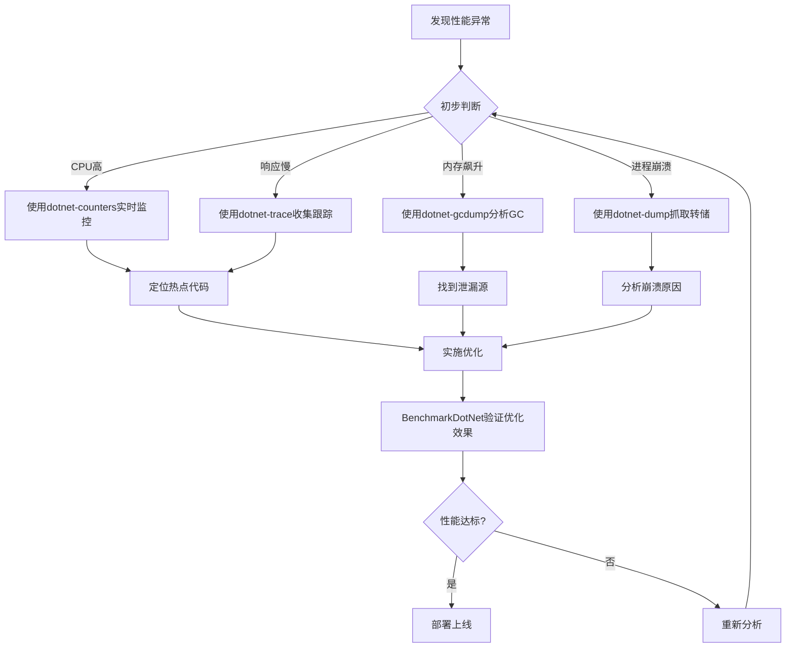

# 性能诊断工具详解

> **学习目标**：掌握.NET生态中主流性能诊断工具的使用方法，能够独立完成从发现问题到定位根因再到验证修复的完整诊断流程。

## 目录

- [1. 为什么需要性能诊断工具](#1-为什么需要性能诊断工具)
- [2. 命令行诊断工具全家桶](#2-命令行诊断工具全家桶)
  - [2.1 dotnet-trace：跟踪应用运行轨迹](#21-dotnet-trace跟踪应用运行轨迹)
  - [2.2 dotnet-counters：实时监控关键指标](#22-dotnet-counters实时监控关键指标)
  - [2.3 dotnet-dump：抓取内存转储快照](#23-dotnet-dump抓取内存转储快照)
  - [2.4 dotnet-gcdump：轻量级GC分析](#24-dotnet-gcdump轻量级gc分析)
- [3. GUI诊断工具](#3-gui诊断工具)
  - [3.1 Visual Studio Profiler](#31-visual-studio-profiler)
  - [3.2 PerfView：免费且强大的分析利器](#32-perfview免费且强大的分析利器)
- [4. BenchmarkDotNet 基准测试框架](#4-benchmarkdotnet-基准测试框架)
- [5. 完整诊断工作流与实战案例](#5-完整诊断工作流与实战案例)
- [6. 常见陷阱与最佳实践](#6-常见陷阱与最佳实践)
- [7. 练习题](#7-练习题)

---

## 1. 为什么需要性能诊断工具

在软件开发的世界里，**性能问题就像隐形的水管漏水**——你可能感觉水流变小了，但不知道具体哪里在漏。性能诊断工具就是你的"管道检测仪"，帮你精准定位问题所在。

### 核心概念

| 工具类型 | 生活化类比 | 适用场景 |
|---------|-----------|---------|
| **Tracing（跟踪）** | 给水管安装流量计，记录每秒流过多少水 | 分析方法调用频率、耗时分布 |
| **Counting（计数）** | 看水表读数变化 | 实时监控CPU、内存、GC等指标 |
| **Dump（转储）** | 把整个水管系统拍照存档 | 分析内存泄漏、对象引用关系 |
| **Benchmarking（基准）** | 对比不同品牌水管的流速 | 量化比较不同实现的性能差异 |

### 诊断工作流总览



---

## 2. 命令行诊断工具全家桶

.NET CLI 提供了一套完整的命令行诊断工具，它们是 `.NET 性能工具包` 的一部分。这些工具可以在生产环境中安全使用，对应用性能影响极小。

### 2.1 dotnet-trace：跟踪应用运行轨迹

`dotnet-trace` 是最常用的诊断工具之一，它可以收集应用的**事件跟踪（Event Tracing）**数据，生成可供分析的跟踪文件。

#### 安装工具

```bash
# 全局安装.NET诊断工具
dotnet tool install -g dotnet-trace
dotnet tool install -g dotnet-counters
dotnet tool install -g dotnet-dump
dotnet tool install -g dotnet-gcdump

# 验证安装成功
dotnet-trace --version
```

#### 基本用法

```bash
# 列出正在运行的.NET进程
dotnet-trace ps

# 收集CPU采样跟踪（最常用，开销约5-10%）
dotnet-trace collect -p <PID> --duration 00:00:30

# 收集GC详细跟踪
dotnet-trace collect -p <PID> --providers Microsoft-Windows-DotNETRuntime:4:5

# 启动新进程并收集跟踪
dotnet-trace collect -- "dotnet MyApi.dll"
```

#### 高级用法：自定义Provider

```bash
# 组合多个Provider进行深度分析
dotnet-trace collect -p <PID> \
  --providers "Microsoft-Windows-DotNETRuntime:4:5," \
             "Microsoft-Dynamics-Tracing:5," \
             "MyCustomEventSource:1" \
  --output detailed_trace.nettrace \
  --duration 00:01:00
```

**Provider级别说明**：
- **Level 1**：仅关键错误信息
- **Level 3**：警告和信息（日常排查推荐）
- **Level 5**： verbose 详细信息（深度分析用）

#### 跟踪文件分析

生成的 `.nettrace` 文件可以用以下工具打开：
- **Visual Studio**（推荐）：图形界面友好
- **PerfView**：功能强大，免费
- **SpeedScope**：在线查看器（https://www.speedscope.app/）

```csharp
// 示例：一个会产生性能问题的API控制器
// 文件：SlowApiController.cs
using Microsoft.AspNetCore.Mvc;
using System.Diagnostics;

namespace PerformanceDemo.Controllers;

[ApiController]
[Route("api/[controller]")]
public class SlowApiController : ControllerBase
{
    private readonly ILogger<SlowApiController> _logger;

    public SlowApiController(ILogger<SlowApiController> logger)
    {
        _logger = logger;
    }

    /// <summary>
    /// 模拟一个有性能问题的接口：字符串拼接导致大量分配
    /// </summary>
    [HttpGet("slow-string")]
    public IActionResult GetSlowString(int count = 10000)
    {
        var sw = Stopwatch.StartNew();
        
        // 错误做法：循环中使用+拼接字符串，产生大量临时对象
        string result = "";
        for (int i = 0; i < count; i++)
        {
            result += $"数据项{i},"; // 每次循环都创建新的string对象
        }
        
        sw.Stop();
        _logger.LogInformation("耗时: {Elapsed}ms, 长度: {Length}", 
            sw.ElapsedMilliseconds, result.Length);
        
        return Ok(new { elapsed = sw.ElapsedMilliseconds, length = result.Length });
    }

    /// <summary>
    /// 模拟CPU密集型计算
    /// </summary>
    [HttpGet("cpu-intensive")]
    public IActionResult GetCpuIntensive(int n = 100000)
    {
        var sw = Stopwatch.StartNew();
        
        // 计算素数（纯CPU密集型操作）
        var primes = new List<int>();
        for (int i = 2; i <= n; i++)
        {
            bool isPrime = true;
            for (int j = 2; j * j <= i; j++)
            {
                if (i % j == 0)
                {
                    isPrime = false;
                    break;
                }
            }
            if (isPrime) primes.Add(i);
        }
        
        sw.Stop();
        return Ok(new { elapsed = sw.ElapsedMilliseconds, count = primes.Count });
    }

    /// <summary>
    /// 模拟同步阻塞异步方法的反模式
    /// </summary>
    [HttpGet("async-anti-pattern")]
    public IActionResult GetAsyncAntiPattern()
    {
        var sw = Stopwatch.StartNew();
        
        // 危险：在异步上下文中同步阻塞！可能导致死锁
        var result = Task.Run(() => SimulateDatabaseCall()).Result;
        
        sw.Stop();
        return Ok(new { elapsed = sw.ElapsedMilliseconds, data = result });
    }

    private async Task<string> SimulateDatabaseCall()
    {
        await Task.Delay(100); // 模拟数据库查询延迟
        return "数据库查询结果";
    }
}
```

### 2.2 dotnet-counters：实时监控关键指标

`dotnet-counters` 就像是应用的**实时仪表盘**，可以持续监控各种性能指标。

#### 实时监控

```bash
# 监控指定进程的所有默认计数器
dotnet counters monitor -p <PID>

# 只监控特定计数器
dotnet counters monitor -p <PID> --counters System.Runtime
dotnet counters monitor -p <PID> --counters Microsoft.AspNetCore.Http.Connections

# 自定义刷新间隔（默认1秒）
dotnet counters monitor -p <PID> --refresh-interval 3

# 输出到CSV文件以便后续分析
dotnet counters monitor -p <PID> --output perf_counters.csv
```

#### 关键计数器解读

| 计数器名称 | 含义 | 正常范围 | 异常信号 |
|-----------|------|---------|---------|
| `cpu-usage` | CPU使用率 | < 70% | 持续 > 90% |
| `working-set` | 工作集内存(MB) | 相对稳定 | 持续增长 |
| `gen-0-gc-count` | 第0代GC次数 | 低频 | 极高频 |
| `gen-1-gc-count` | 第1代GC次数 | 很少 | 频繁触发 |
| `gen-2-gc-count` | 第2代GC次数 | 几乎没有 | 频繁=严重问题 |
| `threadpool-thread-count` | 线程池线程数 | 稳定 | 急剧增长 |
| `exception-count` | 异常总数 | 低 | 快速增长 |
| `assembly-count` | 加载的程序集数 | 稳定 | 持续增加 |

#### 实战：监控脚本示例

```bash
#!/bin/bash
# 监控脚本：持续记录性能数据到文件
# 用法：./monitor.sh <PID>

PID=$1
TIMESTAMP=$(date +%Y%m%d_%H%M%S)
OUTPUT_DIR="./perf_logs/$TIMESTAMP"
mkdir -p $OUTPUT_DIR

echo "=== 开始监控进程 $PID ==="
echo "输出目录: $OUTPUT_DIR"

# 后台运行计数器监控（运行5分钟）
dotnet counters monitor -p $PID \
  --counters System.Runtime \
  --refresh-interval 1 \
  --output "$OUTPUT_DIR/counters.csv" &

COUNTERS_PID=$!

# 同时收集30秒的跟踪数据
dotnet-trace collect -p $PID \
  --duration 00:00:30 \
  --output "$OUTPUT_DIR/trace.nettrace"

# 停止计数器监控
kill $COUNTERS_PID 2>/dev/null

echo "=== 监控完成，数据保存在 $OUTPUT_DIR ==="
```

### 2.3 dotnet-dump：抓取内存转储快照

当应用出现内存泄漏或崩溃时，`dotnet-dump` 可以创建完整的内存快照用于事后分析。

#### 抓取转储

```bash
# 创建完整转储（包含所有内存内容，文件较大）
dotnet dump collect -p <PID> --type Full

# 创建堆转储（只包含托管堆信息，通常够用）
dotnet dump collect -p <PID> --type Heap

# 创建迷你转储（最小体积，快速获取基本信息）
dotnet dump collect -p <PID> --type Mini

# 指定输出文件名
dotnet dump collect -p <PID> --type Heap --output memory_dump.dmp
```

#### 分析转储文件

```bash
# 分析堆上的对象统计
dotnet dump analyze <dump_file.dmp>

# 在交互式命令中输入常用命令：
# dumpheap -stat          # 显示所有类型的对象统计
# dumpheap -mt <地址>     # 查看特定类型的实例
# gcroot <地址>           # 追踪对象的引用链（找泄漏根因）
# peprint <地址>          # 打印对象详细信息
# !clrstack               # 查看所有线程的调用栈
# !threads                # 查看线程列表
```

#### 内存泄漏排查示例

```csharp
// 示例：会导致内存泄漏的代码模式
// 文件：MemoryLeakExamples.cs
using System.Collections.Concurrent;

namespace PerformanceDemo.Services;

/// <summary>
/// 内存泄漏示例服务 - 展示常见泄漏模式
/// </summary>
public class MemoryLeakService
{
    // 泄漏模式1：静态集合不断增长
    private static readonly ConcurrentBag<object> _leakingCache = new();

    // 泄漏模式2：事件订阅未释放
    private readonly List<Action> _eventHandlers = new();

    /// <summary>
    /// 漏洞演示：静态集合导致内存永远无法回收
    /// </summary>
    public void AddToLeakingCache(object item)
    {
        // 每次调用都向静态集合添加元素，永远不会被清理
        _leakingCache.Add(item);
        Console.WriteLine($"缓存大小: {_leakingCache.Count}");
    }

    /// <summary>
    /// 演示事件订阅导致的泄漏
    /// </summary>
    public void SubscribeToEventWithoutUnsubscribe(Action handler)
    {
        // 订阅事件但从未取消订阅
        _eventHandlers.Add(handler);
        // 如果handler捕获了外部对象，该对象也无法被回收
    }

    /// <summary>
    /// 正确的做法：使用弱引用或及时清理
    /// </summary>
    public void CorrectPattern()
    {
        // 方案1：使用ConcurrentDictionary + TTL过期
        var cacheWithExpiry = new ConcurrentDictionary<string, (object Value, DateTime Expiry)>();
        
        // 方案2：使用MemoryCache（自带过期策略）
        // var cache = new MemoryCache(new MemoryCacheOptions());
        
        // 方案3：使用WeakReference允许GC回收
        var weakRef = new WeakReference<object>(new object());
    }
}
```

### 2.4 dotnet-gcdump：轻量级GC分析

`dotnet-gcdump` 是 `dotnet-dump` 的轻量级替代品，专门用于分析GC和托管堆情况。

#### 优势对比

| 特性 | dotnet-dump | dotnet-gcdump |
|-----|------------|---------------|
| **文件大小** | 数百MB~数GB | 通常 < 50MB |
| **采集速度** | 较慢（秒级） | 快速（毫秒级） |
| **生产环境影响** | 可能导致短暂停顿 | 几乎无感知 |
| **分析内容** | 完整进程状态 | 仅托管堆和GC信息 |

#### 使用方法

```bash
# 收集GC转储
dotnet gcdump collect -p <PID> -o gc_dump.gcdump

# 连续收集多个时间点的快照（对比分析内存增长）
for i in {1..5}; do
    dotnet gcdump collect -p <PID> -o "snapshot_${i}.gcdump"
    sleep 10
done

# 分析gcdump文件（使用VS打开或导出报告）
dotnet gcdump report gc_dump.gcdump --report-type GCStats
```

---

## 3. GUI诊断工具

### 3.1 Visual Studio Profiler

Visual Studio 内置了强大的性能分析工具，适合开发调试阶段使用。

#### 启动方式

1. **菜单路径**：`调试 > 性能分析器`
2. **快捷键**：`Alt + F2`
3. **选择目标**：启动项目 / 附加到进程

#### 分析类型选择

| 类型 | 说明 | 适用场景 |
|-----|------|---------|
| **CPU使用率** | 采样方法调用栈 | 找出CPU热点函数 |
| **.NET对象分配** | 跟踪内存分配 | 发现过度分配的位置 |
| **数据库** | 分析SQL查询 | 数据库性能问题 |
| **.NET Async** | 异步方法分析 | 异步编程问题诊断 |

#### 操作步骤


#### CPU使用率分析结果解读

当你看到CPU使用率报告时：

1. **调用树视图**：显示完整的调用链路，按总耗时排序
2. **热路径**：自动标识最耗时的调用路径
3. **模块/函数列表**：快速定位哪个程序集/方法消耗最多CPU

### 3.2 PerfView：免费且强大的分析利器

PerfView 是微软开源的免费性能分析工具，特别擅长处理大型跟踪文件。

#### 下载与配置

```bash
# 从GitHub下载最新版本
# https://github.com/microsoft/perfview/releases

# 下载后解压即可使用，无需安装
```

#### 核心功能

```xml
<!-- PerfView配置文件示例：perfview.config -->
<Profile>
  <!-- 收集ETW事件 -->
  <CollectETW>
    <!-- .NET Runtime事件 -->
    <Provider Name="Microsoft-Windows-DotNETRuntime" Level="5" Keywords="0x14"/>
    <!-- ASP.NET Core事件 -->
    <Provider Name="Microsoft-AspNetCore-Http-Connection" Level="4"/>
    <!-- 自定义事件源 -->
    <Provider Name="MyApp-Performance" Level="5"/>
  </CollectETW>
</Profile>
```

#### 常用分析操作

| 操作 | 快捷键 | 用途 |
|-----|--------|------|
| 打开跟踪文件 | Ctrl+O | 打开.nettrace或.etl文件 |
| GroupPats | - | 按模式分组调用栈 |
| Fold % | - | 折叠低占比节点 |
| JustMyCode | Ctrl+J | 只显示你的代码 |
| Drill Into | 双击 | 深入查看子调用 |
| Find | Ctrl+F | 搜索特定方法名 |

---

## 4. BenchmarkDotNet 基准测试框架

BenchmarkDotNet 是.NET社区最权威的基准测试框架，由.NET团队维护，能够消除各种干扰因素，提供可靠的性能对比数据。

### 4.1 安装与配置

```bash
# 创建控制台项目作为基准测试宿主
dotnet new console -n MyBenchmarks
cd MyBenchmarks

# 添加NuGet包
dotnet add package BenchmarkDotNet
```

### 4.2 编写第一个基准测试

```csharp
// 文件：StringConcatenationBenchmark.cs
using BenchmarkDotNet.Attributes;
using BenchmarkDotNet.Running;
using System.Text;

namespace MyBenchmarks;

/// <summary>
/// 字符串拼接性能对比基准测试
/// 展示不同方式的性能差异
/// </summary>
[MemoryDianner] // 启用内存诊断
[RankColumn]    // 添加排名列
public class StringConcatenationBenchmark
{
    private const int Iterations = 1000;
    private string[] _data;

    /// <summary>
    /// 全局初始化：每个BenchmarkRun执行一次
    /// </summary>
    [GlobalSetup]
    public void GlobalSetup()
    {
        // 准备测试数据
        _data = new string[Iterations];
        for (int i = 0; i < Iterations; i++)
        {
            _data[i] = $"数据项{i:D4}";
        }
    }

    /// <summary>
    /// 方法1：使用+运算符拼接（最差实践）
    /// </summary>
    [Benchmark(Baseline = true)] // 设为基线
    public string UsingPlusOperator()
    {
        string result = "";
        foreach (var item in _data)
        {
            result += item + ",";
        }
        return result;
    }

    /// <summary>
    /// 方法2：使用StringBuilder（推荐）
    /// </summary>
    [Benchmark]
    public string UsingStringBuilder()
    {
        var sb = new StringBuilder();
        foreach (var item in _data)
        {
            sb.Append(item);
            sb.Append(',');
        }
        return sb.ToString();
    }

    /// <summary>
    /// 方法3：预分配容量的StringBuilder（最优）
    /// </summary>
    [Benchmark]
    public string UsingStringBuilderWithCapacity()
    {
        // 预估容量，避免内部数组扩容
        var sb = new StringBuilder(Iterations * 10);
        foreach (var item in _data)
        {
            sb.Append(item);
            sb.Append(',');
        }
        return sb.ToString();
    }

    /// <summary>
    /// 方法4：使用string.Concat一次性拼接
    /// </summary>
    [Benchmark]
    public string UsingStringConcat()
    {
        return string.Join(",", _data);
    }

    /// <summary>
    /// 方法5：使用插值表达式（编译器优化后接近Concat）
    /// </summary>
    [Benchmark]
    public string UsingInterpolation()
    {
        // 注意：这种方式在循环中仍然会创建中间字符串
        // 这里只是为了展示语法
        return string.Join(",", _data);
    }
}

// Program.cs 入口
class Program
{
    static void Main(string[] args)
    {
        // 运行基准测试
        var summary = BenchmarkRunner.Run<StringConcatenationBenchmark>();
    }
}
```

### 4.3 运行与解读报告

```bash
# Release模式下运行（必须！Debug模式结果不准确）
dotnet run -c Release

# 运行特定基准测试类
dotnet run -c Release --filter "*StringConcat*"

# 导出为多种格式
dotnet run -c Release --exporters "html,markdown,githubcsv"
```

#### 典型输出报告解读

```
// BenchmarkDotNet v0.13.x, Windows 11 (10.0.xxxx)
// Intel Core i7-12700H, 1 CPU, 20 logical and 12 physical cores
// .NET SDK 8.0.xxx

| Method                          | Mean      | Error    | StdDev   | Median    | Gen0   | Allocated |
|--------------------------------|----------:|---------:|----------:|----------:|-------:|----------:|
| UsingPlusOperator              | 845.23 μs | 12.45 μs | 15.67 μs | 842.10 μs | 82.000 | 256.45 KB |
| UsingStringBuilder             | 45.67 μs  | 0.89 μs  | 1.23 μs  | 45.20 μs  | 2.000  | 10.24 KB  |
| UsingStringBuilderWithCapacity | 38.12 μs  | 0.56 μs  | 0.78 μs  | 37.90 μs  | 1.000  | 10.18 KB  |
| UsingStringConcat              | 35.89 μs  | 0.43 μs  | 0.61 μs  | 35.75 μs  | 1.000  | 10.16 KB  |
| UsingInterpolation             | 36.02 μs  | 0.51 μs  | 0.72 μs  | 35.88 μs  | 1.000  | 10.17 KB  |
```

**报告字段说明**：

| 字段 | 含义 | 关注点 |
|-----|------|-------|
| **Mean** | 平均执行时间 | 越小越好，对比基线 |
| **Error** | 99%置信区间的误差 | 应远小于Mean值 |
| **StdDev** | 标准差 | 波动小说明稳定 |
| **Gen0** | 第0代GC次数 | 反映内存分配压力 |
| **Allocated** | 分配的总字节数 | 越少越好 |

### 4.4 进阶特性

```csharp
/// <summary>
/// 进阶基准测试：参数化、条件编译、自定义列
/// </summary>
[Params(100, 1000, 10000)] // 参数化：自动运行多种输入规模
public int DataSize;

[ParamsAllValues] // 测试所有组合
public bool UseParallel;

/// <summary>
/// 条件跳过某些测试
/// </summary>
[Benchmark]
[PlatformFilter(".NET Core 3.1")] // 只在特定平台运行
public void PlatformSpecificTest() { }

/// <summary>
/// 自定义度量列
/// </summary>
[MarkdownExporter]
[RPlotExporter] // 自动生成R语言绑图脚本
public class AdvancedBenchmark
{
    /// <summary>
    /// 使用标签区分不同的测试场景
     /// </summary>
    [Arguments("small", 100)]
    [Arguments("medium", 1000)]
    [Arguments("large", 10000)]
    public void ParameterizedTest(string label, int size) { }
    
    /// <summary>
    /// 基准测试中的Setup/Cleanup
    /// </summary>
    [IterationSetup] // 每次迭代前执行
    public void IterationSetup() { }
    
    [IterationCleanup] // 每次迭代后执行
    public void IterationCleanup() { }
}
```

---

## 5. 完整诊断工作流与实战案例

### 案例：分析一个慢API接口

假设你收到用户反馈："商品列表接口响应太慢，经常超过3秒"。让我们用完整的工作流来诊断。

#### 第一步：复现并确认问题

```bash
# 1. 使用wrk或ab进行压力测试确认问题
# 安装 wrk: https://github.com/wg/wrk
wrk -t4 -c100 -d30s http://localhost:5000/api/products/list

# 或者使用dotnet-counters观察资源使用情况
dotnet counters monitor -p <PID> --counters System.Runtime
```

#### 第二步：初步定位问题类型

```bash
# 观察计数器输出，判断问题类型：
# - cpu-usage 接近100% → CPU瓶颈
# - working-set 持续增长 → 内存/GC问题  
# - threadpool-thread-count 飙升 → 线程阻塞
# - exception-count 增长 → 异常过多
```

#### 第三步：深入收集数据

```bash
# 收集30秒的CPU跟踪数据
dotnet-trace collect -p <PID> \
  --providers "Microsoft-Windows-DotNETRuntime:4:5" \
  --duration 00:00:30 \
  --output slow_api_trace.nettrace

# 同时收集GC转储（如果怀疑内存问题）
dotnet-gcdump collect -p <PID> -o slow_api_gc.gcdump
```

#### 第四步：分析跟踪数据

将 `slow_api_trace.nettrace` 用 Visual Studio 或 PerfView 打开：

```csharp
// 假设分析后发现的问题代码：
// 文件：ProductRepository.cs（优化前）
using Microsoft.EntityFrameworkCore;
using PerformanceDemo.Data;

namespace PerformanceDemo.Repositories;

/// <summary>
/// 商品仓储 - 存在N+1问题和缺少索引的性能问题版本
/// </summary>
public class ProductRepositoryBad : IProductRepository
{
    private readonly AppDbContext _context;

    public ProductRepositoryBad(AppDbContext context)
    {
        _context = context;
    }

    /// <summary>
    /// 问题实现：存在严重的N+1查询问题
    /// </summary>
    public async Task<List<ProductDto>> GetProductListBadAsync(
        int page, int pageSize, string? category)
    {
        // 主查询：获取商品列表
        var query = _context.Products.AsQueryable();
        
        if (!string.IsNullOrEmpty(category))
        {
            query = query.Where(p => p.Category == category);
        }

        var products = await query
            .Skip((page - 1) * pageSize)
            .Take(pageSize)
            .ToListAsync(); // 第一次SQL查询

        // N+1问题：循环中逐个加载关联数据
        var result = new List<ProductDto>();
        foreach (var product in products)
        {
            // 这里每次循环都会执行额外的SQL查询！
            var reviews = await _context.Reviews
                .Where(r => r.ProductId == product.Id)
                .ToListAsync(); // N次额外查询
            
            var brand = await _context.Brands
                .FindAsync(product.BrandId); // 又N次查询

            result.Add(new ProductDto
            {
                Id = product.Id,
                Name = product.Name,
                Price = product.Price,
                ReviewCount = reviews.Count,
                BrandName = brand?.Name ?? "未知",
                // ... 其他属性
            });
        }

        return result;
    }
}

/// <summary>
/// 优化后的商品仓储 - 解决N+1问题
/// </summary>
public class ProductRepositoryGood : IProductRepository
{
    private readonly AppDbContext _context;

    public ProductRepositoryGood(AppDbContext context)
    {
        _context = context;
    }

    /// <summary>
    /// 优化实现：使用Include和Select投影消除N+1
    /// </summary>
    public async Task<PagedResult<ProductDto>> GetProductListGoodAsync(
        int page, int pageSize, string? category)
    {
        // 基础查询
        IQueryable<Product> baseQuery = _context.Products
            .AsNoTracking(); // 只读查询：不跟踪实体变更

        // 应用筛选条件
        if (!string.IsNullOrEmpty(category))
        {
            baseQuery = baseQuery.Where(p => p.Category == category);
        }

        // 使用Select投影：只查询需要的字段，减少数据传输
        var projectedQuery = baseQuery.Select(p => new ProductDto
        {
            Id = p.Id,
            Name = p.Name,
            Price = p.Price,
            Category = p.Category,
            BrandName = p.Brand!.Name, // 通过导航属性一次加载
            ReviewCount = p.Reviews.Count, // 聚合在SQL端完成
            CreatedAt = p.CreatedAt
        });

        // 获取总数（用于分页）
        var totalCount = await projectedQuery.CountAsync();

        // 分页
        var items = await projectedQuery
            .OrderByDescending(p => p.CreatedAt)
            .Skip((page - 1) * pageSize)
            .Take(pageSize)
            .ToListAsync();

        return new PagedResult<ProductDto>
        {
            Items = items,
            TotalCount = totalCount,
            Page = page,
            PageSize = pageSize
        };
    }
}
```

#### 第五步：使用BenchmarkDotNet验证优化效果

```csharp
/// <summary>
/// 优化前后性能对比基准测试
/// </summary>
[MemoryDianner]
[Orderer(SummaryOrderPolicy.FastestToSlowest)]
public class RepositoryOptimizationBenchmark
{
    private WebApplicationFactory<Program>? _factory;
    private HttpClient? _client;

    [GlobalSetup]
    public async Task Setup()
    {
        // 使用WebApplicationFactory集成测试
        _factory = new WebApplicationFactory<Program>()
            .WithWebHostBuilder(builder =>
            {
                builder.ConfigureServices(services =>
                {
                    // 使用内存数据库加速测试
                    services.AddDbContext<AppDbContext>(options =>
                        options.UseInMemoryDatabase("BenchmarkDb"));
                    
                    // 种子数据
                    using var scope = services.BuildServiceProvider().CreateScope();
                    var db = scope.ServiceProvider.GetRequiredService<AppDbContext>();
                    SeedData(db);
                });
            });

        _client = _factory.CreateClient();
    }

    private static void SeedData(AppDbContext db)
    {
        // 生成测试数据
        var brands = Enumerable.Range(1, 10)
            .Select(i => new Brand { Name = $"品牌{i}" })
            .ToList();
        db.Brands.AddRange(brands);

        var products = Enumerable.Range(1, 1000)
            .Select(i => new Product
            {
                Name = $"商品{i}",
                Category = i % 3 == 0 ? "电子" : i % 3 == 1 ? "服装" : "食品",
                Price = i * 10m,
                BrandId = brands[i % brands.Count].Id
            })
            .ToList();
        db.Products.AddRange(products);

        var reviews = Enumerable.Range(1, 5000)
            .Select(i => new Review
            {
                ProductId = products[i % products.Count].Id,
                Rating = 5,
                Comment = "好评"
            })
            .ToList();
        db.Reviews.AddRange(reviews);

        db.SaveChanges();
    }

    /// <summary>
    /// 测试优化前的接口
    /// </summary>
    [Benchmark]
    public async Task BadImplementation()
    {
        var response = await _client!.GetAsync(
            "/api/products/list-bad?page=1&pageSize=20");
        response.EnsureSuccessStatusCode();
    }

    /// <summary>
    /// 测试优化后的接口
    /// </summary>
    [Benchmark]
    public async Task GoodImplementation()
    {
        var response = await _client!.GetAsync(
            "/api/products/list-good?page=1&pageSize=20");
        response.EnsureSuccessStatusCode();
    }

    [GlobalCleanup]
    public void Cleanup()
    {
        _client?.Dispose();
        _factory?.Dispose();
    }
}
```

#### 典型优化结果

```
| Method                  | Mean       | Error     | StdDev    | Gen0  | Allocated |
|------------------------|-----------:|----------:|----------:|------:|----------:|
| GoodImplementation     |  52.34 ms  |  1.23 ms  |  2.45 ms  | 3.000 |  85.2 KB  |
| BadImplementation      | 2847.56 ms | 45.67 ms  | 78.90 ms  | 156.00| 2450.3 KB |

// 结论：优化后性能提升约54倍！
```

---

## 6. 常见陷阱与最佳实践

### 陷阱1：在Debug模式下做性能测试

```csharp
// 错误：Debug模式的编译优化关闭，结果完全不准
// dotnet run  ← 默认是Debug模式！

// 正确：必须使用Release模式
// dotnet run -c Release
```

### 陷阱2：基准测试前没有充分预热

```csharp
// BenchmarkDotNet会自动处理预热，但手写测试要注意
// JIT编译、缓存预热都会影响首次执行的耗时
for (int warmup = 0; warmup < 100; warmup++)
{
    MethodToTest(); // 预热：让JIT编译完成
}

// 现在才开始正式计时测量
var sw = Stopwatch.StartNew();
MethodToTest();
sw.Stop();
Console.WriteLine($"实际耗时: {sw.ElapsedTicks} ticks");
```

### 陷阱3：在生产环境直接使用Full Dump

```bash
# 生产环境慎用Full Dump！可能导致应用暂停数十秒
# dotnet dump collect -p <PID> --type Full  # 危险！

# 推荐：优先使用Heap类型，体积小速度快
dotnet dump collect -p <PID> --type Heap  # 安全

# 或者更轻量的gcdump
dotnet gcdump collect -p <PID> -o snapshot.gcdump  # 最安全
```

### 陷阱4：忽略GC对测量的干扰

```csharp
// 错误的做法：单次测量不可靠
var sw = Stopwatch.StartNew();
TestMethod();
sw.Stop();
// 这次测量可能恰好遇到GC暂停，结果偏差很大

// 正确的做法：多次测量取统计值
var measurements = new long[100];
for (int i = 0; i < 100; i++)
{
    GC.Collect(); // 强制GC确保起始条件一致
    GC.WaitForPendingFinalizers();
    GC.Collect();
    
    sw.Restart();
    TestMethod();
    measurements[i] = sw.ElapsedTicks;
}

// 取中位数或平均值（排除最高最低的几个）
Array.Sort(measurements);
long median = measurements[measurements.Length / 2];
Console.WriteLine($"中位数耗时: {median} ticks");
```

### 最佳实践清单

- [ ] 始终在Release模式下进行性能测试
- [ ] 使用BenchmarkDotNet而非手写计时代码
- [ ] 生产环境优先使用轻量级工具（gcdump/counters）
- [ ] 收集数据时保持足够的持续时间（至少10-30秒）
- [ ] 结合多种工具交叉验证结论
- [ ] 建立性能基线，回归测试时对比
- [ ] 优化前后都要有可量化的数据支撑

---

## 7. 练习题

### 练习1：基础工具使用

**题目**：编写一个简单的ASP.NET Core API，故意引入一个性能问题（如大量字符串拼接），然后：

1. 使用 `dotnet-counters` 监控其运行时的CPU和内存指标
2. 使用 `dotnet-trace` 收集30秒的跟踪数据
3. 使用 Visual Studio 的性能分析器找出热点方法
4. 修复问题并用 BenchmarkDotNet 验证优化效果

**要求**：提交完整的诊断报告，包括截图和数据。

### 练习2：内存泄漏排查

**题目**：以下代码存在内存泄漏，请使用诊断工具定位问题并提供修复方案：

```csharp
public class CacheService
{
    private static Dictionary<string, object> _cache = new();
    
    public void Add(string key, object value)
    {
        _cache[key] = value;
    }
    
    public object? Get(string key)
    {
        return _cache.TryGetValue(key, out var value) ? value : null;
    }
}
```

**思考**：
1. 这个类的泄漏原因是什么？
2. 如何用 `dotnet-gcdump` 证明内存确实在增长？
3. 提供两种以上的修复方案。

### 练习3：综合诊断挑战

**题目**：给定一个模拟电商系统的代码库，其中隐藏了3个性能问题：

1. 一个CPU密集型的算法实现不当
2. 一个存在N+1问题的数据库查询
3. 一个会导致内存逐渐增长的缓存实现

请设计完整的诊断方案，逐一发现并修复这些问题，最终使系统吞吐量提升至少5倍。

---

## 相关链接

- [[02-内存优化]] - 内存管理基础与优化技巧
- [[03-异步编程深度指南]] - 异步编程性能优化
- [[04-数据库查询优化]] - EF Core查询性能调优
- [[08-性能监控体系搭建]] - 生产环境监控方案

---

> **作者提示**：性能诊断是一项需要长期实践的技能。建议先在自己的项目中尝试使用这些工具，熟悉后再应用到生产环境。记住：**没有数据支持的优化都是猜测**。
