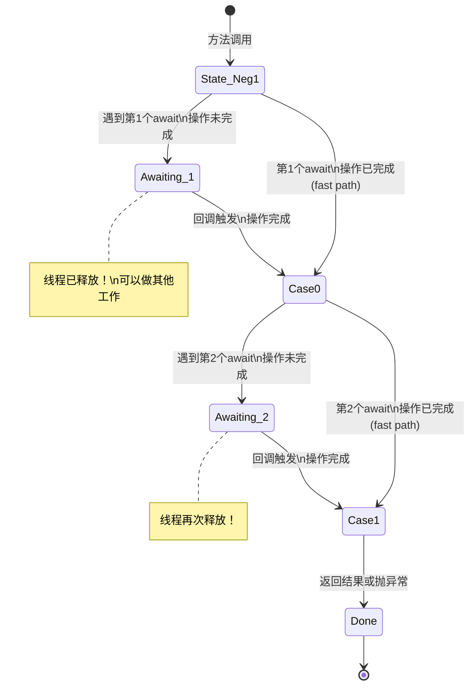
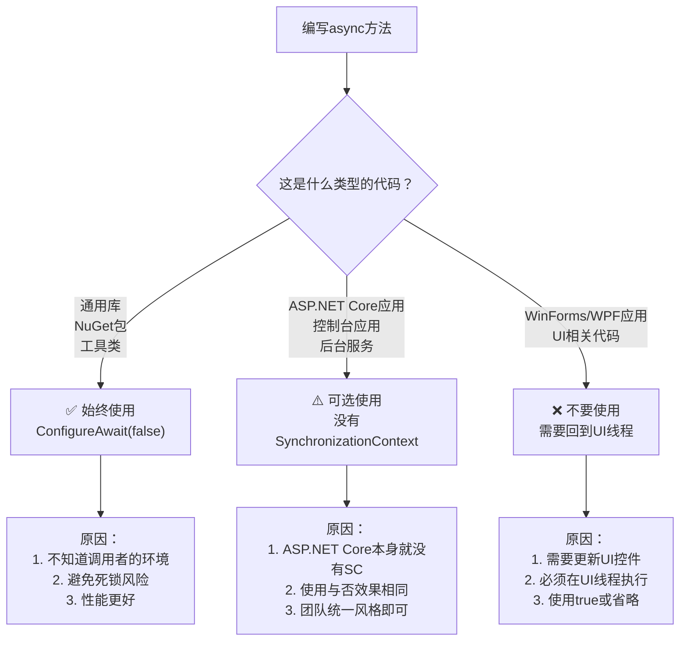
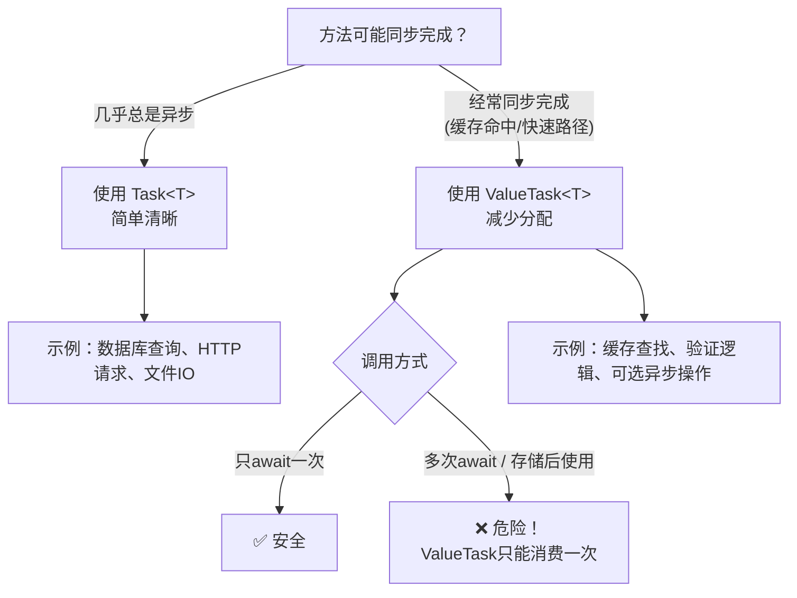

# 异步编程深度指南

> **学习目标**：深入理解async/await的底层机制，掌握高级异步编程模式，能够编写高性能、无死锁、可取消的异步应用程序。

## 目录

- [1. async/await底层原理揭秘](#1-asyncawait底层原理揭秘)
  - [1.1 编译器如何转换async方法](#11编译器如何转换async方法)
  - [1.2 状态机的执行流程](#12状态机的执行流程)
  - [1.3 理解SynchronizationContext](#13理解synchronizationcontext)
- [2. ConfigureAwait的正确使用](#2-configureawait的正确使用)
  - [2.1 什么是ConfigureAwait](#21什么是configureawait)
  - [2.2 库代码与应用代码的选择策略](#22库代码与应用代码的选择策略)
- [3. ValueTask：减少分配的秘密武器](#3-valuetask减少分配的秘密武器)
- [4. 同步阻塞反模式与死锁](#4-同步阻塞反模式与死锁)
- [5. 高效并行处理](#5-高效并行处理)
  - [5.1 Task.WhenAll并发等待](#51-taskwhenall并发等待)
  - [5.2 Parallel.ForEachAsync](#52-parallelforeachasync)
  - [5.3 PLINQ并行LINQ](#53-plinq并行linq)
- [6. 异步流IAsyncEnumerable](#6-异步流iasyncenumerable)
- [7. CancellationToken传播模式](#7-cancellationtoken传播模式)
- [8. 完整实战案例](#8-完整实战案例)
- [9. 常见陷阱与最佳实践](#9-常见陷阱与最佳实践)
- [10. 练习题](10-练习题)

---

## 1. async/await底层原理揭秘

### 1.1 编译器如何转换async方法

当你在一个方法前加上 `async` 关键字时，编译器会进行一次神奇的"手术"——将你的普通方法转换为一个**状态机结构体**。

#### 生活化类比

想象你在厨房做一道复杂的菜：

| 同步编程（普通方法） | 异步编程（async/await） |
|---------------------|----------------------|
| 站在炉子前等水烧开 | 把水放上去，设个闹钟，去切菜 |
| 切完菜回来检查水 | 闹钟响了，回来继续下一步 |
| 每一步都傻等 | 利用等待时间做其他事 |

编译器就是那个帮你"设闹钟"和"记录做到哪一步"的助手。

```csharp
/// <summary>
/// 我们写的async方法（源代码）
/// </summary>
public async Task<string> FetchDataAsync(string url, CancellationToken ct)
{
    Console.WriteLine("1. 开始请求");
    
    // await点1：这里会"暂停"，让出线程
    using var httpClient = new HttpClient();
    var response = await httpClient.GetAsync(url, ct); // ← await
    
    Console.WriteLine("2. 收到响应");
    
    // await点2：又一个"暂停"点
    string content = await response.Content.ReadAsStringAsync(ct); // ← await
    
    Console.WriteLine("3. 完成处理");
    return $"数据长度: {content.Length}";
}
```

编译器会将上面的方法转换为类似下面的结构：

```csharp
/// <summary>
/// 编译器生成的状态机（简化版，展示核心原理）
/// </summary>
[StructLayout(LayoutKind.Auto)]
public struct FetchDataAsyncStateMachine : IAsyncStateMachine
{
    // ========== 状态机字段 ==========
    public int State;                    // 当前状态（-1=开始，0=等待响应，1=等待读取内容，-2=完成）
    public AsyncTaskMethodBuilder<string> Builder; // 任务构建器
    public string Url;                   // 捕获的参数
    public CancellationToken Ct;         // 捕获的参数
    public HttpClient HttpClient;        // 局部变量提升为字段
    public HttpResponseMessage Response; // 局部变量提升为字段
    public TaskAwaiter<HttpResponseMessage> Awaiter1; // 第一个awaiter
    public TaskAwaiter<string> Awaiter2;           // 第二个awaiter
    
    /// <summary>
    /// 状态机的"引擎"——每次恢复执行都调用这个方法
    /// </summary>
    public void MoveNext()
    {
        try
        {
            switch (State)
            {
                case -1: // ===== 初始状态 =====
                    Console.WriteLine("1. 开始请求");
                    
                    HttpClient = new HttpClient();
                    
                    // 发起异步请求，获取Awaiter
                    Awaiter1 = HttpClient.GetAsync(Url, Ct).GetAwaiter();
                    
                    if (!Awaiter1.IsCompleted)
                    {
                        // 操作未完成：保存状态，注册回调
                        State = 0; // 记录：下次从await点1之后恢复
                        Builder.AwaitUnsafeOnCompleted(ref Awaiter1, ref this);
                        return; // 让出线程！
                    }
                    // 如果已完成，直接fall through到case 0
                    goto case 0;
                    
                case 0: // ===== 从第一个await恢复 =====
                    // 获取第一个await的结果
                    Response = Awaiter1.GetResult(); // 获取HttpResponseMessage
                    Awaiter1 = default; // 释放引用
                    
                    Console.WriteLine("2. 收到响应");
                    
                    // 第二个异步操作
                    Awaiter2 = Response.Content.ReadAsStringAsync(Ct).GetAwaiter();
                    
                    if (!Awaiter2.IsCompleted)
                    {
                        State = 1; // 记录：下次从await点2之后恢复
                        Builder.AwaitUnsafeOnCompleted(ref Awaiter2, ref this);
                        return; // 再次让出线程
                    }
                    goto case 1;
                    
                case 1: // ===== 从第二个await恢复 =====
                    // 获取最终结果
                    string content = Awaiter2.GetResult();
                    Awaiter2 = default;
                    
                    Console.WriteLine("3. 完成处理");
                    
                    // 设置返回值并标记完成
                    Builder.SetResult($"数据长度: {content.Length}");
                    break;
            }
        }
        catch (Exception ex)
        {
            // 任何异常都会被捕获并传递给Task
            Builder.SetException(ex);
        }
        
        State = -2; // 标记完成
    }

    public void SetStateMachine(IAsyncStateMachine stateMachine) { }
}
```

### 1.2 状态机的执行流程



#### 关键要点

```csharp
/// <summary>
/// async方法的核心特性总结
/// </summary>
public class AsyncKeyPoints
{
    /// <summary>
     /// 要点1：每个async方法至少产生一次堆分配（状态机实例）
     /// 除非方法是完全同步完成的（fast path优化）
     /// </summary>
    public async Task FastPathExample()
    {
        // 如果这个方法在第一次await之前就return了，
        // 编译器可能不会创建完整的状态机（优化）
        if (DateTime.Now.Hour < 6)
        {
            return; // 直接完成，可能不分配状态机
        }
        
        await Task.Delay(100); // 这里必须创建状态机
    }
    
    /// <summary>
    /// 要点2：局部变量会被提升到状态机字段中
    /// 这意味着它们的生命周期会延长到整个异步操作完成
    /// </summary>
    public async Task VariableLifetimeDemo()
    {
        // 这个大数组会在状态机中存活到方法结束
        byte[] largeBuffer = new byte[100_000];
        
        await Task.Delay(5000); // largeBuffer在这5秒内都无法被GC
        
        Process(largeBuffer);
    }
    
    private void Process(byte[] buffer) { }
    
    /// <summary>
    /// 要点3：异常会被捕获并存储在Task中
    /// 调用者通过await或Task.Result获取异常
    /// </summary>
    public async Task ExceptionHandlingDemo()
    {
        try
        {
            await RiskyOperation();
        }
        catch (HttpRequestException ex)
        {
            // 这里能捕获到RiskyOperation中的异常
            Console.WriteLine($"请求失败: {ex.Message}");
        }
    }
    
    private async Task RiskyOperation()
    {
        await Task.Delay(100);
        throw new HttpRequestException("模拟网络错误");
    }
}
```

### 1.3 理解SynchronizationContext

`SynchronizationContext` 是理解 `ConfigureAwait` 和死锁问题的关键。

```csharp
/// <summary>
/// SynchronizationContext 的作用演示
/// </summary>
public class SyncContextDemos
{
    /// <summary>
    /// 在UI应用（WinForms/WPF）中：
    /// 默认的SynchronizationContext会将后续代码调度回UI线程
    /// </summary>
    public async void ButtonClick_WinForms() // WinForms事件处理器
    {
        // 这段代码运行在UI线程上
        label.Text = "开始请求...";
        
        // await之后的代码默认会回到UI线程执行
        string result = await FetchDataFromServerAsync();
        
        // ✅ 安全：我们在UI线程上，可以直接更新UI
        label.Text = result; 
    }
    
    /// <summary>
    /// 在ASP.NET Core中：
    /// 没有SynchronizationContext（这是设计决策）
    /// 所以ConfigureAwait(false)通常不是必需的
    /// </summary>
    [HttpGet("api/data")]
    public async Task<IActionResult> GetData_AspNetCore()
    {
        // ASP.NET Core中没有SynchronizationContext
        // await之后的代码可能在任何线程池线程上执行
        
        var data = await _repository.GetDataAsync();
        
        // 这是安全的：ASP.NET Core的HttpContext可以在不同线程访问
        return Ok(data);
    }
    
    /// <summary>
    /// SynchronizationContext导致死锁的经典场景
    /// </summary>
    public void DeadlockScenario_WinForms()
    {
        // UI线程上的同步阻塞调用
        // 死锁形成过程：
        // 1. .Result阻塞UI线程，等待任务完成
        // 2. async方法内部的await尝试回调到UI线程
        // 3. UI线程正在阻塞等待任务 → 死锁！
        /*
        var result = FetchDataFromServerAsync().Result; // 💀 死锁！
        */
        
        // 解决方案1：使用ConfigureAwait(false)
        // var result = FetchDataFromServerAsync().ConfigureAwait(false).GetAwaiter().GetResult();
        
        // 解决方案2：全部使用async/await
        // var result = await FetchDataFromServerAsync();
    }
    
    private async Task<string> FetchDataFromServerAsync()
    {
        await Task.Delay(100);
        return "数据";
    }
}
```

---

## 2. ConfigureAwait的正确使用

### 2.1 什么是ConfigureAwait

`ConfigureAwait(false)` 告诉await之后的代码**不需要回到原始上下文**，直接在线程池线程上继续执行。

```csharp
/// <summary>
/// ConfigureAwait(true) vs ConfigureAwait(false) 对比
/// </summary>
public class ConfigureAwaitDemos
{
    /// <summary>
    /// ConfigureAwait(true) - 默认行为
    /// 尝试捕获并恢复原始SynchronizationContext
    /// </summary>
    public async Task WithConfigureAwaitTrue()
    {
        var threadId1 = Thread.CurrentThread.ManagedThreadId;
        Console.WriteLine($"Before await: Thread {threadId1}");
        
        await Task.Delay(100).ConfigureAwait(true); // 默认值，可省略
        
        var threadId2 = Thread.CurrentThread.ManagedThreadId;
        Console.WriteLine($"After await: Thread {threadId2}");
        
        // 在有SynchronizationContext的环境中：
        // threadId1 == threadId2 （回到原线程）
        // 在ASP.NET Core中：
        // threadId1 可能 != threadId2 （没有SC，无所谓）
    }
    
    /// <summary>
    /// ConfigureAwait(false) - 库代码推荐用法
    /// 不尝试恢复原始上下文，性能略好
    /// </summary>
    public async Task WithConfigureAwaitFalse()
    {
        var threadId1 = Thread.CurrentThread.ManagedThreadId;
        Console.WriteLine($"Before await: Thread {threadId1}");
        
        await Task.Delay(100).ConfigureAwait(false); // 明确不回原上下文
        
        var threadId2 = Thread.CurrentThread.ManagedThreadId;
        Console.WriteLine($"After await: Thread {threadId2}");
        
        // 几乎总是不同的线程（线程池线程）
        // 但这不影响大多数逻辑
    }
}
```

### 2.2 库代码与应用代码的选择策略



```csharp
/// <summary>
/// 推荐的编码规范示例
/// </summary>
namespace MyUtilityLibrary
{
    /// <summary>
    /// 通用库中的异步方法：始终使用ConfigureAwait(false)
    /// </summary>
    public static class HttpHelper
    {
        /// <summary>
        /// 库代码的标准模式：每个await都加ConfigureAwait(false)
        /// </summary>
        public static async Task<string> GetStringAsync(
            string url, 
            CancellationToken cancellationToken = default)
        {
            using var client = new SocketsHttpHandler
            {
                PooledConnectionLifetime = TimeSpan.FromMinutes(5),
                MaxConnectionsPerServer = 10
            };
            
            using var httpClient = new HttpClient(client);
            
            using var response = await httpClient.GetAsync(
                url, 
                HttpCompletionOption.ResponseHeadersRead,
                cancellationToken
            ).ConfigureAwait(false); // 库代码标准写法
            
            // ConfigureContinueWith链式调用也可以
            return await response.Content.ReadAsStringAsync(
                cancellationToken
            ).ConfigureAwait(false);
        }
        
        /// <summary>
        /// 多个await时的简化写法：使用ConfigureAwaitOptions
        /// .NET 8+ 支持
        /// </summary>
        public static async Task<byte[]> GetBytesAsync(
            string url,
            CancellationToken cancellationToken = default)
        {
            // .NET 8+: 可以配置默认行为
            await Task.CompletedTask.ConfigureAwait(
                options: ConfigureAwaitOptions.ForceYielding);
            
            using var httpClient = new HttpClient();
            using var response = await httpClient.GetAsync(url, cancellationToken)
                .ConfigureAwait(false);
                
            return await response.Content.ReadAsByteArrayAsync(cancellationToken)
                .ConfigureAwait(false);
        }
    }
}

// ==================== 应用层代码 ====================

namespace MyApp.Controllers
{
    /// <summary>
    /// ASP.NET Core控制器：可以不加ConfigureAwait(false)
    /// 因为框架本身就没有SynchronizationContext
    /// </summary>
    [ApiController]
    [Route("api/[controller]")]
    public class ProductsController : ControllerBase
    {
        private readonly IProductService _service;

        public ProductsController(IProductService service)
        {
            _service = service;
        }

        /// <summary>
        /// 应用层代码：可选使用ConfigureAwait
        /// 很多团队选择统一加或不加，保持一致性即可
        /// </summary>
        [HttpGet("{id}")]
        public async Task<ActionResult<Product>> GetById(int id)
        {
            // 方案A：不加（简洁，ASP.NET Core推荐）
            var product = await _service.GetByIdAsync(id);
            
            // 方案B：加（如果团队有统一规范）
            // var product = await _service.GetByIdAsync(id).ConfigureAwait(false);
            
            return product is not null ? Ok(product) : NotFound();
        }
    }
}

namespace MyApp.WindowsApp
{
    /// <summary>
    /// WPF ViewModel：不要用ConfigureAwait(false)!
    /// 因为需要回到UI线程更新属性通知
    /// </summary>
    public class ProductViewModel : INotifyPropertyChanged
    {
        private readonly IProductService _service;
        private Product? _currentProduct;

        public event PropertyChangedEventHandler? PropertyChanged;

        public Product? CurrentProduct
        {
            get => _currentProduct;
            set
            {
                _currentProduct = value;
                OnPropertyChanged(nameof(CurrentProduct));
            }
        }

        public ProductViewModel(IProductService service)
        {
            _service = service;
        }

        /// <summary>
        /// WPF/WinForms中加载方法：使用默认的ConfigureAwait(true)
        /// </summary>
        public async Task LoadAsync(int id)
        {
            // ❌ 错误：如果在WPF中使用false，下面赋值可能不在UI线程
            // CurrentProduct = await _service.GetByIdAsync(id).ConfigureAwait(false);
            
            // ✅ 正确：使用默认值（true），确保回到UI线程
            CurrentProduct = await _service.GetByIdAsync(id);
            
            // CurrentProduct setter会触发PropertyChanged事件
            // 这个事件需要在UI线程上触发才能正确更新绑定
        }

        protected void OnPropertyChanged(string propertyName)
        {
            PropertyChanged?.Invoke(this, new PropertyChangedEventArgs(propertyName));
        }
    }
}
```

---

## 3. ValueTask：减少分配的秘密武器

### 3.1 Task vs ValueTask的本质区别

```csharp
/// <summary>
/// Task<T> vs ValueTask<T> 核心区别
/// </summary>
public class TaskVsValueTask
{
    /// <summary>
    /// Task<T>: 引用类型，每次调用都在堆上分配
    /// </summary>
    public async Task<int> GetLength_Task(string value)
    {
        // 即使这个方法大部分时间都同步完成，
        // 返回的Task对象仍然会在堆上分配
        await Task.Yield();
        return value.Length;
    }
    
    /// <summary>
    /// ValueTask<T>: 可值类型可引用类型
    /// 同步完成时不分配！异步完成时才分配
    /// </summary>
    public ValueTask<int> GetLength_ValueTask(string value)
    {
        // 大部分情况下同步完成 → 无分配
        if (!string.IsNullOrEmpty(value))
        {
            return new ValueTask<int>(value.Length); // 值类型返回，零分配
        }
        
        // 少数情况需要异步 → 分配Task包装
        return new ValueTask<int>(SlowOperationAsync());
    }
    
    private async Task<int> SlowOperationAsync()
    {
        await Task.Delay(100);
        return 42;
    }
}
```

### 3.2 何时使用ValueTask



```csharp
/// <summary>
/// ValueTask的最佳实践场景
/// </summary>
public class ValueTaskBestPractices
{
    private readonly IMemoryCache _cache;
    private readonly IDbRepository _repository;

    public ValueTaskBestPractices(IMemoryCache cache, IDbRepository repository)
    {
        _cache = cache;
        _repository = repository;
    }

    /// <summary>
    /// 场景1：带缓存的查询 - ValueTask的理想场景
    /// 缓存命中时同步返回，未命中时异步查询
    /// </summary>
    public ValueTask<Product?> GetProductCachedAsync(int id)
    {
        string cacheKey = $"product:{id}";
        
        // 尝试从缓存获取（同步操作）
        if (_cache.TryGetValue(cacheKey, out Product? cached))
        {
            // 缓存命中：同步返回，零分配！
            return new ValueTask<Product?>(cached);
        }
        
        // 缓存未命中：异步查询数据库
        return new ValueTask<Task<Product?>>(LoadAndCacheAsync(id));
    }

    private async Task<Product?> LoadAndCacheAsync(int id)
    {
        var product = await _repository.GetByIdAsync(id);
        if (product is not null)
        {
            _cache.Set($"product:{id}", product, TimeSpan.FromMinutes(5));
        }
        return product;
    }

    /// <summary>
    /// 场景2：条件性异步操作
    /// </summary>
    public async ValueTask<string> GetDataAsync(bool useCache)
    {
        if (useCache)
        {
            // 快速路径：同步返回
            return "cached-data";
        }
        
        // 慢速路径：异步获取
        await Task.Delay(100);
        return "fresh-data";
    }

    /// <summary>
    /// ⚠️ 危险示范：多次消费ValueTask
    /// </summary>
    public void DangerousUsage()
    {
        ValueTask<int> vt = GetValueAsync();
        
        // 第一次await：OK
        int result1 = await vt;
        
        // 第二次await：❌ 未定义行为！可能崩溃或返回错误结果
        // int result2 = await vt; // 不要这样做！
    }

    private async ValueTask<int> GetValueAsync()
    {
        await Task.Delay(10);
        return 42;
    }

    /// <summary>
    /// ✅ 正确做法：如果需要多次使用，先转为Task
    /// </summary>
    public async Task CorrectMultipleUsage()
    {
        ValueTask<int> vt = GetValueAsync();
        
        // 转为Task后可以安全地多次await
        Task<int> task = vt.AsTask();
        
        int result1 = await task;
        int result2 = await task; // Task可以多次await
    }
}
```

### 3.3 ValueTask性能对比

```csharp
/// <summary>
/// BenchmarkDotNet基准测试：Task vs ValueTask
/// </summary>
[MemoryDianner]
[RankColumn]
public class TaskVsValueTaskBenchmark
{
    private const int Iterations = 100_000;

    /// <summary>
    /// Task版本：每次调用都有堆分配
    /// </summary>
    [Benchmark(Baseline = true)]
    public async Task<int> TaskAlwaysAllocates()
    {
        int sum = 0;
        for (int i = 0; i < 100; i++)
        {
            sum += await GetTaskValueAsync(i);
        }
        return sum;
    }

    /// <summary>
    /// ValueTask版本：同步路径无分配
    /// </summary>
    [Benchmark]
    public async Task<int> ValueTaskNoAllocWhenSync()
    {
        int sum = 0;
        for (int i = 0; i < 100; i++)
        {
            sum += await GetValueTaskValue(i);
        }
        return sum;
    }

    // 模拟一个大部分时间同步完成的方法
    private Task<int> GetTaskValueAsync(int value)
    {
        // 即使立即完成也返回Task对象（堆分配）
        return Task.FromResult(value * 2);
    }

    private ValueTask<int> GetValueTaskValue(int value)
    {
        // 同步完成时返回值类型（无堆分配）
        return new ValueTask<int>(value * 2);
    }
}

// 典型结果（100000次迭代）:
// | Method                      | Mean      | Allocated |
// |----------------------------|----------:|----------:|
// | TaskAlwaysAllocates        | 15.23 ms  | 400.02 MB |  <- 大量分配!
// | ValueTaskNoAllocWhenSync   | 8.45 ms   | 40.01 KB  |  <- 几乎无分配!
```

---

## 4. 同步阻塞反模式与死锁

### 4.1 为什么不应该同步阻塞异步代码

```csharp
/// <summary>
/// 同步阻塞异步代码的所有错误方式及其解决方案
/// </summary>
public class BlockingAntiPatterns
{
    /// <summary>
    /// 反模式1：使用.Result（最常见的问题）
    /// 问题：可能导致死锁，且阻塞线程池线程
    /// </summary>
    public string Bad_Result()
    {
        // ❌ 危险：在有SynchronizationContext的环境下会死锁
        // var result = GetStringAsync().Result;
        
        // ❌ 也危险：同样的问题
        // var result = GetStringAsync().GetAwaiter().GetResult();
        
        // ✅ 如果必须在同步方法中调用异步代码：
        return GetStringAsync().GetAwaiter().GetResult(); // 相对较安全但仍不推荐
    }

    /// <summary>
    /// 反模式2：使用.Wait()
    /// </summary>
    public void Bad_Wait()
    {
        // ❌ 阻塞当前线程直到任务完成
        // DoWorkAsync().Wait();
        
        // ✅ 更好的方案：全部改为async
        // await DoWorkAsync();
    }

    /// <summary>
    /// 反模式3：Task.Run + .Result（常见但有问题）
    /// </summary>
    public string Bad_TaskRun_Result()
    {
        // 这种写法可以避免死锁，但浪费一个线程池线程
        // 而且异常信息会丢失原始调用栈
        /*
        var result = Task.Run(() => GetStringAsync().Result).Result;
        */
        
        // ✅ 如果真的需要（比如Main方法入口）：
        return Task.Run(async () => await GetStringAsync())
            .GetAwaiter()
            .GetResult();
    }

    private async Task<string> GetStringAsync()
    {
        await Task.Delay(100);
        return "Hello";
    }
    
    private async Task DoWorkAsync()
    {
        await Task.Delay(100);
    }
}
```

### 4.2 死锁的形成机制

```mermaid
sequenceDiagram
    participant UI as UI线程
    participant T as Task对象
    participant Pool as 线程池线程
    
    UI->>T: 调用 .Result() 阻塞等待
    Note over UI: UI线程进入等待状态<br/>持有SynchronizationContext
    
    T->>Pool: 异步操作完成后<br/>尝试Post回调到SC
    Pool->>UI: Post: 请执行后续代码
    Note over UI: ❌ UI线程正在等待T完成<br/>无法处理Post的消息
    
    Note over UI,T,Pool: 💀 死锁！互相等待
```

```csharp
/// <summary>
    /// 死锁的完整复现与解决方案
    /// </summary>
public class DeadlockReproduction
{
    /// <summary>
    /// 会死锁的代码（在WinForms/WPF/ASP.NET Framework中）
    /// </summary>
    public void WillDeadlock_InUiApp()
    {
        // 死锁链条：
        // 1. UI线程调用.Result → 阻塞等待Task完成
        // 2. Task内部await → 尝试回调到UI线程的SC
        // 3. UI线程正被阻塞 → 无法执行回调
        // 4. 回调不执行 → Task永远不完成
        // 5. Result永远不返回 → 永久死锁
        
        // var result = DeadlockProneAsync().Result; // 💀
    }

    private async Task<string> DeadlockProneAsync()
    {
        await Task.Delay(100); // 默认ConfigureAwait(true)，尝试回到原SC
        return "done";
    }

    /// <summary>
    /// 解决方案1：库中使用ConfigureAwait(false)
    /// </summary>
    public void Solution1_ConfigureAwaitFalse()
    {
        // 如果DeadlockProneAsync内部使用了ConfigureAwait(false)
        // 就不会尝试回到UI线程，死锁就不会发生
        var result = SafeAsync().GetAwaiter().GetResult(); // ✅ 安全
        Console.WriteLine(result);
    }

    private async Task<string> SafeAsync()
    {
        // 使用ConfigureAwait(false)：不尝试回到原上下文
        await Task.Delay(100).ConfigureAwait(false);
        return "done";
    }

    /// <summary>
    /// 解决方案2：完全采用async/await（推荐）
    /// </summary>
    public async Task Solution2_FullAsync()
    {
        // 最彻底的解决方案：全程async
        var result = await DeadlockProneAsync(); // ✅ 最佳实践
        Console.WriteLine(result);
    }

    /// <summary>
    /// 解决方案3：使用专门的同步方法（双实现）
    /// </summary>
    public string Solution3_DualImplementation(bool useAsyncPath)
    {
        if (useAsyncPath)
        {
            // 异步调用方走异步路径
            throw new InvalidOperationException("请使用异步版本");
        }
        
        // 同步调用方走同步路径（真正的同步实现）
        return SynchronousImplementation();
    }

    private string SynchronousImplementation()
    {
        // 使用同步API完成任务
        Thread.Sleep(100); // 仅用于演示，实际应使用同步HTTP客户端等
        return "done (sync)";
    }
}
```

---

## 5. 高效并行处理

### 5.1 Task.WhenAll并发等待

```csharp
/// <summary>
/// Task.WhenAll：同时发起多个异步操作并等待全部完成
/// </summary>
public class WhenAllExamples
{
    private readonly HttpClient _httpClient = new();

    /// <summary>
    /// 基础用法：并发获取多个资源
    /// </summary>
    public async Task<List<Product>> FetchProductsAsync(IEnumerable<int> ids)
    {
        // 同时发起所有请求（而非逐个等待）
        var tasks = ids.Select(id => FetchProductByIdAsync(id)).ToArray();
        
        // 等待所有请求完成
        Product[] results = await Task.WhenAll(tasks);
        
        return results.ToList();
    }

    private async Task<Product> FetchProductByIdAsync(int id)
    {
        var response = await _httpClient.GetAsync($"https://api.example.com/products/{id}");
        var json = await response.Content.ReadAsStringAsync();
        return JsonSerializer.Deserialize<Product>(json)!;
    }

    /// <summary>
    /// 进阶：带限制的并发（防止同时发起太多请求）
    /// </summary>
    public async Task<List<Result>> LimitedConcurrencyAsync<TInput, TResult>(
        IEnumerable<TInput> items,
        Func<TInput, Task<TResult>> processor,
        int maxConcurrency = 5)
    {
        using var semaphore = new SemaphoreSlim(maxConcurrency, maxConcurrency);
        
        var tasks = items.Select(async item =>
        {
            await semaphore.WaitAsync(); // 获取信号量槽位
            try
            {
                return await processor(item);
            }
            finally
            {
                semaphore.Release(); // 释放槽位
            }
        }).ToArray();

        var results = await Task.WhenAll(tasks);
        return results.ToList();
    }

    /// <summary>
    /// 进阶：WhenAll + 异常处理
    /// </summary>
    public async Task HandleExceptionsInWhenAll()
    {
        var tasks = new[]
        {
            MightThrowAsync(1),
            MightThrowAsync(2),
            MightThrowAsync(3),
        };

        // 方式1：WhenAll会聚合所有异常
        try
        {
            await Task.WhenAll(tasks);
        }
        catch (Exception ex)
        {
            // ex是AggregateException，包含所有失败任务的异常
            Console.WriteLine($"{tasks.Count} 个任务中有部分失败");
            
            if (ex is AggregateException ae)
            {
                foreach (var inner in ae.InnerExceptions)
                {
                    Console.WriteLine($"  失败: {inner.Message}");
                }
            }
        }

        // 方式2：单独处理每个任务的结果
        var results = await Task.WhenAll(
            tasks.Select(t => SafeExecuteAsync(t))
        );
        
        foreach (var result in results)
        {
            if (result.IsSuccess)
            {
                Console.WriteLine($"成功: {result.Value}");
            }
            else
            {
                Console.WriteLine($"失败: {result.Error?.Message}");
            }
        }
    }

    private async Task<Result<string>> SafeExecuteAsync(Task<string> task)
    {
        try
        {
            var value = await task;
            return Result<string>.Success(value);
        }
        catch (Exception ex)
        {
            return Result<string>.Failure(ex);
        }
    }

    private async Task<string> MightThrowAsync(int id)
    {
        await Task.Delay(10);
        if (id % 2 == 0) throw new InvalidOperationException($"任务{id}失败");
        return $"结果{id}";
    }
}

/// <summary>
/// 结果包装类型
/// </summary>
public record Result<T>
{
    public bool IsSuccess { get; init; }
    public T? Value { get; init; }
    public Exception? Error { get; init; }
    
    public static Result<T> Success(T value) => new() { IsSuccess = true, Value = value };
    public static Result<T> Failure(Exception error) => new() { IsSuccess = false, Error = error };
}
```

### 5.2 Parallel.ForEachAsync

.NET 6引入了 `Parallel.ForEachAsync`，专门用于异步循环的并行执行。

```csharp
/// <summary>
/// Parallel.ForEachAsync 使用详解
/// </summary>
public class ForEachAsyncExamples
{
    /// <summary>
    /// 基础用法：并行处理集合中的每一项
    /// </summary>
    public async Task ProcessItemsAsync(IEnumerable<ImportItem> items)
    {
        // 并行处理所有导入项
        await Parallel.ForEachAsync(items, async (item, cancellationToken) =>
        {
            await ProcessSingleItemAsync(item, cancellationToken);
        });
    }

    /// <summary>
    /// 控制并发度：使用ParallelOptions
    /// </summary>
    public async Task ProcessItemsLimitedAsync(
        IEnumerable<ImportItem> items,
        int maxDegreeOfParallelism = 4,
        CancellationToken cancellationToken = default)
    {
        var options = new ParallelOptions
        {
            MaxDegreeOfParallelism = maxDegreeOfParallelism, // 最大并行数
            CancellationToken = cancellationToken,             // 取消令牌
            // TaskScheduler = null // 可自定义任务调度器
        };

        var processedCount = 0;
        var failedCount = 0;

        await Parallel.ForEachAsync(items, options, async (item, ct) =>
        {
            try
            {
                await ProcessSingleItemAsync(item, ct);
                Interlocked.Increment(ref processedCount);
            }
            catch (Exception ex)
            {
                Interlocked.Increment(ref failedCount);
                Console.WriteLine($"处理失败 [{item.Id}]: {ex.Message}");
            }
        });

        Console.WriteLine($"处理完成: 成功={processedCount}, 失败={failedCount}");
    }

    /// <summary>
    /// 实战：批量导入用户数据
    /// </summary>
    public async Task<BulkImportResult> BulkImportUsersAsync(
        List<UserImportData> users,
        IUserService userService,
        CancellationToken ct = default)
    {
        var stopwatch = Stopwatch.StartNew();
        var successList = new ConcurrentBag<User>();
        var failureList = new ConcurrentBag<(UserImportData Data, string Error)>();

        var options = new ParallelOptions
        {
            MaxDegreeOfParallelism = Math.Min(Environment.ProcessorCount * 2, 10),
            CancellationToken = ct
        };

        await Parallel.ForEachAsync(users, options, async (userData, ct) =>
        {
            try
            {
                // 验证数据
                ValidateUserData(userData);

                // 创建用户
                var user = await userService.CreateAsync(new CreateUserRequest
                {
                    Name = userData.Name,
                    Email = userData.Email,
                    Role = userData.Role
                }, ct);

                successList.Add(user);
            }
            catch (ValidationException ex)
            {
                failureList.Add((userData, $"验证失败: {ex.Message}"));
            }
            catch (DuplicateException ex)
            {
                failureList.Add((userData, $"重复: {ex.Message}"));
            }
            catch (OperationCanceledException)
            {
                throw; // 取消异常应该向上传播
            }
            catch (Exception ex)
            {
                failureList.Add((userData, $"未知错误: {ex.Message}"));
            }
        });

        stopwatch.Stop();

        return new BulkImportResult
        {
            TotalProcessed = users.Count,
            SuccessCount = successList.Count,
            FailureCount = failureList.Count,
            Failures = failureList.ToList(),
            ElapsedMilliseconds = stopwatch.ElapsedMilliseconds
        };
    }

    private void ValidateUserData(UserImportData data)
    {
        if (string.IsNullOrWhiteSpace(data.Name))
            throw new ValidationException("名称不能为空");
        if (string.IsNullOrWhiteSpace(data.Email) || !data.Email.Contains("@"))
            throw new ValidationException("邮箱格式无效");
    }

    private async Task ProcessSingleItemAsync(ImportItem item, CancellationToken ct)
    {
        // 模拟处理
        await Task.Delay(10, ct);
    }
}

public record ImportItem(int Id, string Name);
public record UserImportData(string Name, string Email, string Role);
public record BulkImportResult(
    int TotalProcessed, 
    int SuccessCount, 
    int FailureCount,
    List<(UserImportData Data, string Error)> Failures,
    long ElapsedMilliseconds);
public record User(int Id, string Name, string Email);
public record CreateUserRequest(string Name, string Email, string Role);
public interface IUserService
{
    Task<User> CreateAsync(CreateUserRequest request, CancellationToken ct);
}
public class ValidationException : Exception { public ValidationException(string msg) : base(msg) { } }
public class DuplicateException : Exception { public DuplicateException(string msg) : base(msg) { } }
```

### 5.3 PLINQ并行LINQ

```csharp
/// <summary>
/// PLINQ（Parallel LINQ）：声明式的并行数据处理
/// </summary>
public class PLINQExamples
{
    /// <summary>
    /// 基础用法：AsParallel() 将LINQ查询并行化
    /// </summary>
    public List<Result> BasicPlinq(List<InputData> items)
    {
        return items
            .AsParallel()                          // 启用并行处理
            .WithDegreeOfParallelism(4)            // 控制并行度
            .WithExecutionMode(ParallelExecutionMode.ForceParallelism) // 强制并行
            .Select(ProcessItem)                   // 每个元素并行处理
            .Where(r => r.IsValid)                 // 过滤
            .OrderBy(r => r.Score)                 // 排序（注意：排序会合并结果）
            .ToList();                             // 物化结果
    }

    private Result ProcessItem(InputData item)
    {
        // CPU密集型计算...
        Thread.Sleep(10); // 模拟工作负载
        return new Result(item.Id, item.Value * 2, true);
    }

    /// <summary>
    /// PLINQ + 异步：使用SelectAsync模式
    /// 注意：PLINQ本身不支持async，需要配合其他技术
    /// </summary>
    public async Task<List<OutputData>> PlinqWithAsync(IEnumerable<int> ids)
    {
        // 方案1：先用PLINQ做CPU预处理，再异步获取补充数据
        var preprocessed = ids
            .AsParallel()
            .Select(CpuIntensivePreprocessing)
            .ToList();

        // 然后用WhenAll进行异步IO
        var tasks = preprocessed.Select(FetchAdditionalDataAsync);
        var results = await Task.WhenAll(tasks);
        return results.ToList();
    }

    private PreprocessedData CpuIntensivePreprocessing(int id)
    {
        // CPU密集型工作
        return new PreprocessedData(id, ComputeHash(id));
    }

    private async Task<OutputData> FetchAdditionalDataAsync(PreprocessedData data)
    {
        // IO异步操作
        await Task.Delay(50);
        return new OutputData(data.Id, data.Hash, "额外数据");
    }

    private int ComputeHash(int id) => id * 31 % 1000;
}

public record InputData(int Id, double Value);
public record Result(int Id, double Score, bool IsValid);
public record PreprocessedData(int Id, int Hash);
public record OutputData(int Id, int Hash, string ExtraInfo);
```

---

## 6. 异步流IAsyncEnumerable

当需要异步处理大量数据（如数据库游标、分页API、实时日志流）时，`IAsyncEnumerable<T>` 是理想选择。

```csharp
/// <summary>
/// IAsyncEnumerable<T> 完整使用指南
/// </summary>
public class AsyncStreamExamples
{
    /// <summary>
    /// 创建异步流：使用 yield return + async
    /// </summary>
    public async IAsyncEnumerable<Product> StreamProductsAsync(
        [EnumeratorCancellation] CancellationToken ct = default)
    {
        int page = 1;
        bool hasMore;
        
        do
        {
            // 每次只获取一页数据
            var pagedResult = await FetchPageAsync(page, 20, ct);
            hasMore = pagedResult.HasMore;
            
            foreach (var product in pagedResult.Items)
            {
                // 逐个yield返回，调用者可以边接收边处理
                ct.ThrowIfCancellationRequested();
                yield return product;
            }
            
            page++;
        } while (hasMore);
    }

    private async Task<PagedResult<Product>> FetchPageAsync(
        int page, int pageSize, CancellationToken ct)
    {
        // 模拟分页API调用
        await Task.Delay(50, ct);
        var items = Enumerable.Range(1, pageSize)
            .Select(i => new Product(i, $"商品{(page - 1) * pageSize + i}", i * 10m))
            .ToList();
        
        return new PagedResult(items, page < 50); // 假设共50页
    }

    /// <summary>
    /// 消费异步流：使用 await foreach
    /// </summary>
    public async Task ConsumeAsyncStream(CancellationToken ct = default)
    {
        var totalCount = 0;
        var totalAmount = 0m;

        // await foreach 自动处理异步枚举
        await foreach (var product in StreamProductsAsync(ct))
        {
            totalCount++;
            totalAmount += product.Price;
            
            // 可以每100条输出一次进度
            if (totalCount % 100 == 0)
            {
                Console.WriteLine($"已处理 {totalCount} 件商品...");
            }
        }

        Console.WriteLine($"总计: {totalCount} 件, 总金额: {totalAmount:C}");
    }

    /// <summary>
    /// 高级：异步流的转换与过滤
    /// </summary>
    public async IAsyncEnumerable<ProductDto> TransformStreamAsync(
        IAsyncEnumerable<Product> source,
        [EnumeratorCancellation] CancellationToken ct = default)
    {
        await foreach (var product in source.WithCancellation(ct))
        {
            // 转换：Product → ProductDto
            var dto = new ProductDto
            {
                Id = product.Id,
                Name = product.Name.ToUpperInvariant(), // 转换为大写
                PriceFormatted = $"{product.Price:C2}",
                Category = ClassifyByPrice(product.Price)
            };

            // 可以在这里添加额外的异步操作
            var extraInfo = await FetchExtraInfoAsync(product.Id, ct);
            dto.ExtraInfo = extraInfo;

            yield return dto;
        }
    }

    private string ClassifyByPrice(decimal price)
    {
        return price switch
        {
            < 100 => "经济型",
            < 500 => "标准型",
            _ => "高端型"
        };
    }

    private async Task<string> FetchExtraInfoAsync(int productId, CancellationToken ct)
    {
        await Task.Delay(10, ct);
        return $"额外信息-{productId}";
    }

    /// <summary>
    /// 在ASP.NET Core中返回异步流
    /// </summary>
    [HttpGet("api/products/stream")]
    public async IAsyncEnumerable<ProductDto> StreamProductsEndpoint(
        CancellationToken ct)
    {
        // ASP.NET Core原生支持IAsyncEnumerable返回值
        // 会自动使用Server-Sent Events或JSON数组流式传输
        await foreach (var product in StreamProductsAsync(ct))
        {
            yield return new ProductDto
            {
                Id = product.Id,
                Name = product.Name,
                PriceFormatted = $"{product.Price:C2}"
            };
        }
    }
}

public record Product(int Id, string Name, decimal Price);
public record ProductDto
{
    public int Id { get; set; }
    public string Name { get; set; } = "";
    public string PriceFormatted { get; set; } = "";
    public string? Category { get; set; }
    public string? ExtraInfo { get; set; }
};
public record PagedResult<T>(List<T> Items, bool HasMore);
```

---

## 7. CancellationToken传播模式

正确的取消令牌传播是编写健壮异步程序的关键。

```csharp
/// <summary>
/// CancellationToken 传播最佳实践
/// </summary>
public class CancellationTokenPatterns
{
    private readonly ILogger<CancellationTokenPatterns> _logger;

    public CancellationTokenPatterns(ILogger<CancellationTokenPatterns> logger)
    {
        _logger = logger;
    }

    /// <summary>
    /// 模式1：方法签名中始终包含CancellationToken参数
    /// </summary>
    public async Task<DataResult> FetchDataAsync(
        string endpoint,
        CancellationToken ct = default)
    {
        try
        {
            using var httpClient = new HttpClient();
            
            // 将ct传递给所有支持取消的异步方法
            using var response = await httpClient.GetAsync(endpoint, ct);
            
            response.EnsureSuccessStatusCode();
            
            var json = await response.Content.ReadAsStringAsync(ct);
            
            return JsonSerializer.Deserialize<DataResult>(json)!;
        }
        catch (OperationCanceledException) when (ct.IsCancellationRequested)
        {
            // 用户主动取消：正常情况，不需要当作错误处理
            _logger.LogInformation("请求被用户取消: {Endpoint}", endpoint);
            throw; // 或者返回特殊结果表示取消
        }
        catch (OperationCanceledException)
        {
            // 超时等其他取消原因
            _logger.LogWarning("请求超时: {Endpoint}", endpoint);
            throw;
        }
    }

    /// <summary>
    /// 模式2：使用CancellationTokenSource创建链接令牌
    /// </summary>
    public async Task WithTimeoutAndExternalCancel(
        CancellationToken externalCt = default)
    {
        // 创建带超时的CTS
        using var timeoutCts = new CancellationTokenSource(TimeSpan.FromSeconds(30));
        
        // 链接外部令牌和超时令牌：任一取消都会触发
        using var linkedCts = CancellationTokenSource.CreateLinkedTokenSource(
            externalCt, 
            timeoutCts.Token
        );

        try
        {
            await LongRunningOperationAsync(linkedCts.Token);
        }
        catch (OperationCanceledException) when (timeoutCts.IsCancellationRequested)
        {
            _logger.LogError("操作超时（30秒限制）");
            throw new TimeoutException("操作超时");
        }
        catch (OperationCanceledException) when (externalCt.IsCancellationRequested)
        {
            _logger.LogInformation("操作被外部取消");
            throw;
        }
    }

    private async Task LongRunningOperationAsync(CancellationToken ct)
    {
        // 定期检查取消令牌
        for (int i = 0; i < 1000; i++)
        {
            ct.ThrowIfCancellationRequested(); // 主动检查
            
            await DoUnitOfWorkAsync(i, ct);
            
            // 或者在长时间操作前检查
            if (i % 100 == 0)
            {
                _logger.LogDebug("进度: {Progress}/1000", i);
            }
        }
    }

    private async Task DoUnitOfWorkAsync(int index, CancellationToken ct)
    {
        await Task.Delay(10, ct);
        // 工作单元...
    }

    /// <summary>
    /// 模式3：在ASP.NET Core Controller中正确使用
    /// </summary>
    [HttpGet("api/reports/generate")]
    public async Task<IActionResult> GenerateReport(
        CancellationToken ct) // 框架自动注入请求取消令牌
    {
        // 当客户端断开连接时，ct会自动触发取消
        _logger.LogInformation("开始生成报告...");
        
        try
        {
            var report = await _reportService.GenerateDetailedReportAsync(ct);
            return File(report.Bytes, "application/pdf", "report.pdf");
        }
        catch (OperationCanceledException)
        {
            // 客户端断开了连接
            _logger.LogInformation("报告生成被取消（客户端断开）");
            return StatusCode(499, "Client Closed Request");
        }
    }

    /// <summary>
    /// 模式4：批量操作中的取消处理
    /// </summary>
    public async Task<BatchResult> ProcessBatchAsync(
        IEnumerable<WorkItem> items,
        IProgress<BatchProgress>? progress = null,
        CancellationToken ct = default)
    {
        var completed = 0;
        var failed = 0;
        var skipped = 0;
        var total = items.Count();

        foreach (var item in items)
        {
            // 每项开始前检查是否已取消
            if (ct.IsCancellationRequested)
            {
                _logger.LogWarning("批量处理被取消，已完成: {Completed}/{Total}", completed, total);
                return new BatchResult(completed, failed, skipped, wasCancelled: true);
            }

            try
            {
                await ProcessItemAsync(item, ct);
                completed++;

                // 报告进度
                progress?.Report(new BatchProgress(completed, failed, skipped, total));
            }
            catch (OperationCanceledException)
            {
                throw; // 取消异常向上传播
            }
            catch (Exception ex)
            {
                failed++;
                _logger.LogError(ex, "处理项目 {ItemId} 失败", item.Id);
            }
        }

        return new BatchResult(completed, failed, skipped, wasCancelled: false);
    }

    private async Task ProcessItemAsync(WorkItem item, CancellationToken ct)
    {
        await Task.Delay(100, ct);
    }
}

public record DataResult(string Data);
public record WorkItem(int Id);
public record BatchProgress(int Completed, int Failed, int Skipped, int Total);
public record BatchResult(int Completed, int Failed, int Skipped, bool WasCancelled);
```

---

## 8. 完整实战案例

### 高性能异步HTTP客户端 + 批量数据处理管道

```csharp
using System.Collections.Concurrent;
using System.Net.Http.Headers;
using System.Text.Json;

/// <summary>
/// 高性能批量数据处理系统
/// 整合本章所有知识点
/// </summary>
public class HighPerformanceDataPipeline
{
    private readonly ILogger<HighPerformanceDataPipeline> _logger;
    private readonly SemaphoreSlim _rateLimiter;
    private readonly Channel<ProcessItem> _processChannel;
    private readonly Channel<ResultItem> _resultChannel;

    public HighPerformanceDataPipeline(
        ILogger<HighPerformanceDataPipeline> logger,
        PipelineConfig config)
    {
        _logger = logger;
        _config = config;

        // 限流器：控制对外部API的并发请求数
        _rateLimiter = new SemaphoreSlim(
            config.MaxConcurrentRequests, 
            config.MaxConcurrentRequests);

        // 生产者-消费者通道：缓冲待处理的数据
        _processChannel = Channel.CreateBounded<ProcessItem>(
            new BoundedChannelOptions(config.BufferSize)
            {
                FullMode = BoundedChannelFullMode.Wait, // 缓冲区满时等待
                SingleReader = false,
                SingleWriter = false
            });

        // 结果收集通道
        _resultChannel = Channel.Unbounded<ResultItem>();
    }

    private readonly PipelineConfig _config;

    /// <summary>
    /// 执行完整的批处理流水线
    /// </summary>
    public async Task<PipelineResult> ExecuteAsync(
        IEnumerable<ImportRecord> records,
        CancellationToken ct = default)
    {
        var stopwatch = Stopwatch.StartNew();
        
        // 启动消费者任务
        var processingTask = StartProcessingWorkers(ct);
        var resultCollectionTask = StartResultCollector(ct);

        try
        {
            // 生产者：将数据写入通道
            await ProduceRecordsAsync(records, ct);
        }
        finally
        {
            // 标记生产完成
            _processChannel.Writer.Complete();
        }

        // 等待所有处理完成
        await processingTask;

        // 标记结果收集完成
        _resultChannel.Writer.Complete();
        var finalResults = await resultCollectionTask;

        stopwatch.Stop();

        return new PipelineResult
        {
            TotalRecords = finalResults.TotalRecords,
            SuccessfulRecords = finalResults.SuccessfulRecords,
            FailedRecords = finalResults.FailedRecords,
            ElapsedMs = stopwatch.ElapsedMilliseconds,
            ThroughputPerSecond = finalResults.TotalRecords / stopwatch.Elapsed.TotalSeconds
        };
    }

    /// <summary>
    /// 生产者阶段：读取源数据并写入处理通道
    /// </summary>
    private async Task ProduceRecordsAsync(
        IEnumerable<ImportRecord> records,
        CancellationToken ct)
    {
        int produced = 0;
        
        foreach (var record in records)
        {
            ct.ThrowIfCancellationRequested();

            // 写入通道（如果缓冲区满会自动等待）
            await _processChannel.Writer.WriteAsync(new ProcessItem(record), ct);
            produced++;

            if (produced % _config.ProgressInterval == 0)
            {
                _logger.LogDebug("已生产 {Count} 条记录", produced);
            }
        }

        _logger.LogInformation("生产完成: 共 {Count} 条记录", produced);
    }

    /// <summary>
    /// 消费者阶段：多个worker并行处理
    /// </summary>
    private async Task StartProcessingWorkers(CancellationToken ct)
    {
        var workers = new Task[_config.WorkerCount];

        for (int i = 0; i < _config.WorkerCount; i++)
        {
            int workerId = i;
            workers[i] = Task.Run(async () => await WorkerLoop(workerId, ct), ct);
        }

        await Task.WhenAll(workers);
        _logger.LogDebug("所有Worker已完成");
    }

    /// <summary>
    /// Worker处理循环
    /// </summary>
    private async Task WorkerLoop(int workerId, CancellationToken ct)
    {
        _logger.LogDebug("Worker-{Id} 启动", workerId);

        await foreach (var item in _processChannel.Reader.ReadAllAsync(ct))
        {
            // 限流：获取许可
            await _rateLimiter.WaitAsync(ct);
            
            try
            {
                // 处理单条记录
                var result = await ProcessSingleItemAsync(item, ct);
                
                // 写入结果通道
                await _resultChannel.Writer.WriteAsync(result, ct);
            }
            catch (Exception ex)
            {
                _logger.LogError(ex, "Worker-{Id} 处理失败", workerId);
                await _resultChannel.Writer.WriteAsync(
                    new ResultItem(item.Record, isSuccess: false, error: ex.Message), ct);
            }
            finally
            {
                _rateLimiter.Release(); // 释放许可
            }
        }

        _logger.LogDebug("Worker-{Id} 结束", workerId);
    }

    /// <summary>
    /// 处理单个条目：包含HTTP调用和数据转换
    /// </summary>
    private async Task<ResultItem> ProcessSingleItemAsync(
        ProcessItem item,
        CancellationToken ct)
    {
        var record = item.Record;

        // Step 1: 数据验证（纯CPU，很快）
        Validate(record);

        // Step 2: 调用外部API丰富数据（IO操作，主要耗时）
        using var httpClient = CreateHttpClient();
        
        var apiResponse = await CallExternalApiAsync(
            httpClient, 
            record.ExternalId, 
            ct);

        // Step 3: 数据转换和持久化
        var transformed = Transform(record, apiResponse);

        await SaveToDatabaseAsync(transformed, ct);

        return new ResultItem(record, isSuccess: true);
    }

    /// <summary>
    /// HTTP调用：使用IHttpClientFactory管理的HttpClient
    /// </summary>
    private async Task<ApiResponse> CallExternalApiAsync(
        HttpClient client,
        string externalId,
        CancellationToken ct)
    {
        // 配置重试策略（Polly集成）
        var retryPolicy = Policy
            .Handle<HttpRequestException>()
            .Or<TimeoutException>()
            .WaitAndRetryAsync(
                retryCount: 3,
                sleepDurationProvider: attempt => TimeSpan.FromSeconds(Math.Pow(2, attempt)),
                onRetry: (outcome, timespan, retryCount, context) =>
                {
                    _logger.LogWarning(
                        "API调用失败，第{Retry}次重试: {Error}", 
                        retryCount, outcome.Exception?.Message);
                });

        return await retryPolicy.ExecuteAsync(async ct =>
        {
            var response = await client.GetAsync(
                $"https://api.example.com/data/{externalId}", 
                ct);

            response.EnsureSuccessStatusCode();

            var json = await response.Content.ReadAsStringAsync(ct);
            return JsonSerializer.Deserialize<ApiResponse>(json)!;
        }, ct);
    }

    /// <summary>
    /// 结果收集器
    /// </summary>
    private async Task<IntermediateResult> StartResultCollector(CancellationToken ct)
    {
        int success = 0;
        int fail = 0;
        int total = 0;

        await foreach (var result in _resultChannel.Reader.ReadAllAsync(ct))
        {
            total++;
            if (result.IsSuccess) success++;
            else fail++;
        }

        return new IntermediateResult(total, success, fail);
    }

    // ========== 辅助方法 ==========

    private static HttpClient CreateHttpClient()
    {
        var client = new HttpClient
        {
            Timeout = TimeSpan.FromSeconds(30)
        };
        client.DefaultRequestHeaders.Accept.Add(
            new MediaTypeWithQualityHeaderValue("application/json"));
        return client;
    }

    private static void Validate(ImportRecord record)
    {
        if (string.IsNullOrWhiteSpace(record.ExternalId))
            throw new ValidationException("ExternalId不能为空");
    }

    private static TransformedData Transform(ImportRecord record, ApiResponse apiResponse)
    {
        return new TransformedData
        {
            SourceId = record.Id,
            ExternalId = record.ExternalId,
            EnrichedName = $"{record.Name} ({apiResponse.Category})",
            CalculatedScore = CalculateScore(apiResponse.Metrics),
            ProcessedAt = DateTime.UtcNow
        };
    }

    private static double CalculateScore(Metrics metrics)
    {
        return metrics.A * 0.3 + metrics.B * 0.5 + metrics.C * 0.2;
    }

    private Task SaveToDatabaseAsync(TransformedData data, CancellationToken ct)
    {
        // 模拟数据库保存
        return Task.CompletedTask;
    }
}

// ========== 支撑类型 ==========

public record PipelineConfig(
    int WorkerCount = 4,
    int MaxConcurrentRequests = 10,
    int BufferSize = 1000,
    int ProgressInterval = 100);

public record ImportRecord(int Id, string ExternalId, string Name);
public record ProcessItem(ImportRecord Record);
public record ResultItem(ImportRecord Record, bool IsSuccess, string? Error = null);
public record ApiResponse(string Category, Metrics Metrics);
public record Metrics(double A, double B, double C);
public record TransformedData(
    int SourceId, 
    string ExternalId, 
    string EnrichedName, 
    double CalculatedScore,
    DateTime ProcessedAt);

public record IntermediateResult(int TotalRecords, int SuccessfulRecords, int FailedRecords);
public record PipelineResult(
    int TotalRecords,
    int SuccessfulRecords,
    int FailedRecords,
    long ElapsedMs,
    double ThroughputPerSecond);
```

---

## 9. 常见陷阱与最佳实践

### 陷阱清单

| 陷阱 | 问题 | 解决方案 |
|-----|------|---------|
| **async void** | 异常无法被捕获，会导致进程崩溃 | 除了事件处理器外，永远不用async void |
| **忘记ConfigureAwait(false)** | 在库代码中可能导致死锁 | 所有库代码的await都加上 |
| **多次await同一个ValueTask** | 未定义行为 | 只await一次，或转为Task后再用 |
| **忽略CancellationToken** | 无法响应用户取消请求 | 每个async方法都接受并传递CT |
| **在构造函数中await** | 构造函数不能是async | 使用工厂模式或初始化方法 |
| **混合sync/async** | 死锁风险 | 全程async或提供两套实现 |
| **fire-and-forget** | 异常被吞掉 | 使用 `_ = Task.Run(...)` 并附加异常处理 |

### 最佳实践速查

```csharp
/// <summary>
/// 异步编程最佳实践模板
/// </summary>
public class AsyncBestPracticeTemplate
{
    // ✅ 1. 方法命名以Async结尾
    public async Task DoWorkAsync(CancellationToken ct = default) { }

    // ✅ 2. 始终传递CancellationToken
    private async Task InnerAsync(string param, CancellationToken ct) { }

    // ✅ 3. 库代码使用ConfigureAwait(false)
    public async Task<int> LibraryMethodAsync(CancellationToken ct = default)
    {
        await Task.Delay(100, ct).ConfigureAwait(false);
        return 42;
    }

    // ✅ 4. 使用ValueTask处理可能的同步路径
    public ValueTask<string> GetCachedOrFetchAsync(string key)
    {
        if (_cache.TryGetValue(key, out var cached))
            return new ValueTask<string>(cached); // 同步路径，无分配
        
        return new ValueTask<Task<string>>(FetchFromSourceAsync(key));
    }

    // ✅ 5. 正确处理fire-and-forget
    public void StartBackgroundWork()
    {
        _ = FireAndForgetSafeAsync();
    }

    private async Task FireAndForgetSafeAsync()
    {
        try
        {
            await LongRunningWorkAsync();
        }
        catch (Exception ex)
        {
            // 记录异常，不让它消失
            _logger.LogError(ex, "后台任务出错");
        }
    }

    // ❌ 以下是要避免的模式：
    // public async void BadAsync() { } // 不要用async void
    // public Task BadBlocking() => SomeAsync().Result; // 不要阻塞
}
```

---

## 10. 练习题

### 练习1：死锁分析与修复

**题目**：以下代码在WinForms应用中会死锁。分析死锁原因并提供两种修复方案。

```csharp
public partial class MainForm : Form
{
    private async void btnLoad_Click(object sender, EventArgs e)
    {
        var data = await DataService.LoadDataAsync();
        dataGridView.DataSource = data;
    }
}

public static class DataService
{
    public async Task<List<Item>> LoadDataAsync()
    {
        await Task.Delay(1000);
        return new List<Item> { new() { Name = "Test" } };
    }
    
    // 下面这个方法会在某个地方被同步调用
    public static List<Item> LoadDataSync() // <-- 这里被同步调用
    {
        return LoadDataAsync().Result; // 死锁！
    }
}
```

### 练习2：高并发下载器实现

**题目**：实现一个支持以下功能的文件下载器：

1. 同时最多下载N个文件（可配置）
2. 支持取消所有下载
3. 显示实时进度（已下载/总数/速度）
4. 单个文件失败不影响其他文件
5. 使用 `IAsyncEnumerable` 流式返回下载结果

**要求**：综合运用 `Parallel.ForEachAsync`、`SemaphoreSlim`、`CancellationToken`、`Channel<T>`。

### 练习3：异步流水线构建

**题目**：构建一个三阶段的异步数据处理流水线：

1. **读取阶段**：从API分页拉取数据（`IAsyncEnumerable`）
2. **处理阶段**：并行转换+数据增强（`Channel` + 多Worker）
3. **写入阶段**：批量写入数据库（批量提交）

**要求**：
- 各阶段可以并行工作（生产者-消费者模式）
- 支持优雅停止
- 记录各阶段的吞吐量和延迟指标

---

## 相关链接

- [[01-性能诊断工具]] - 使用dotnet-trace分析异步方法的性能
- [[02-内存优化]] - async状态机与内存分配的关系
- [[04-数据库查询优化]] - EF Core异步查询最佳实践
- [[07-高级并发编程]] - Task并行库与数据流深入探讨

---

> **作者提示**：异步编程的核心思想很简单——**不要阻塞，让出线程去做别的事**。但细节决定成败，务必理解状态机、SynchronizationContext、ConfigureAwait这些概念。记住：**在ASP.NET Core中，async/await是你的默认选择，同步阻塞应该是例外而不是常规**。
