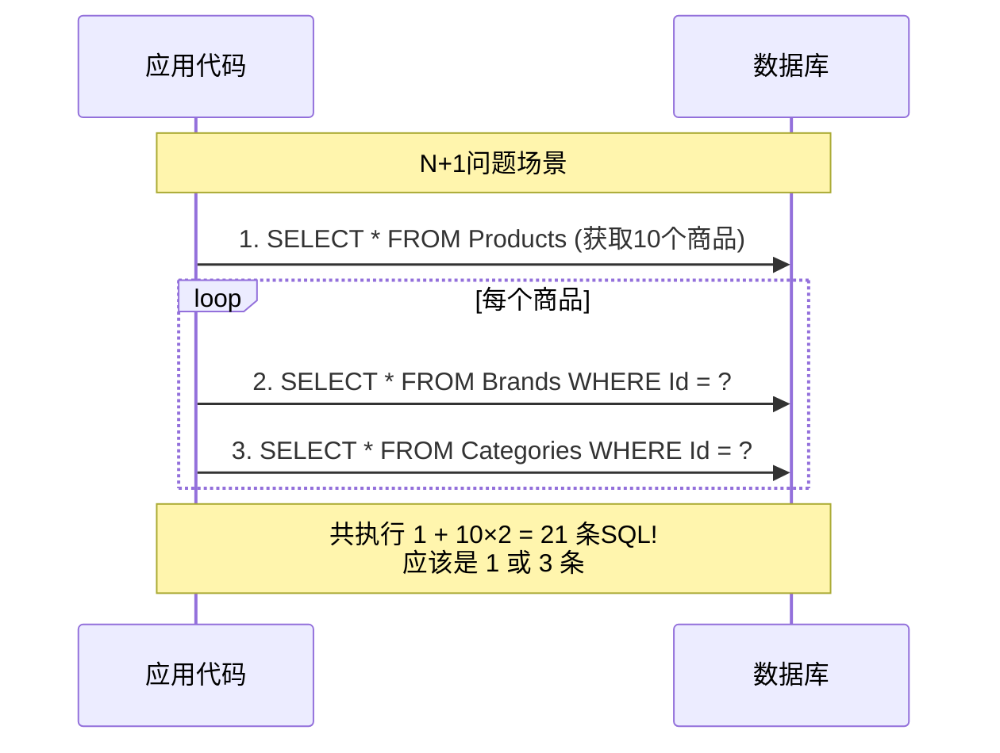
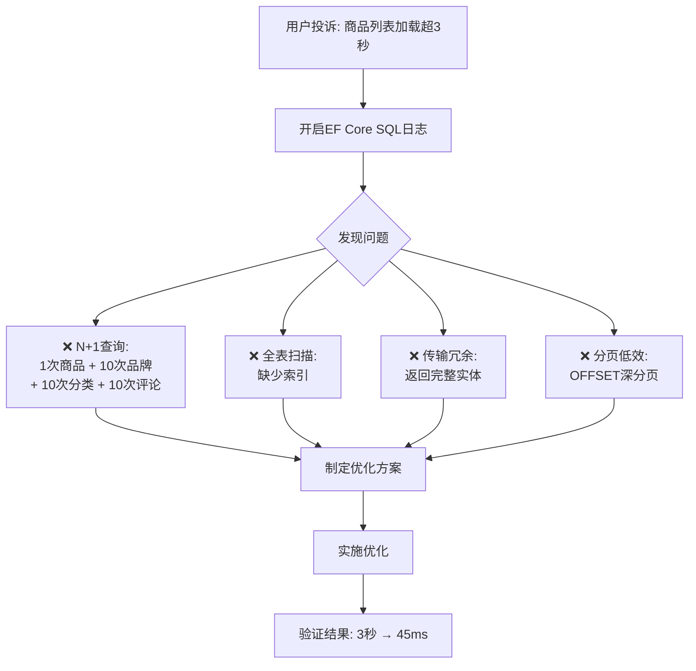

# 数据库查询优化实战指南

> **学习目标**：掌握EF Core查询优化的核心技术，能够从SQL层面理解和优化数据访问性能，将慢查询从秒级优化到毫秒级。

## 目录

- [1. 理解EF Core的查询执行过程](#1-理解ef-core的查询执行过程)
  - [1.1 从LINQ到SQL的编译过程](#11-从linq到sql的编译过程)
  - [1.2 SQL日志输出与分析](#12-sql日志输出与分析)
  - [1.3 执行计划解读基础](#13-执行计划解读基础)
- [2. 索引设计原则](#2-索引设计原则)
  - [2.1 索引类型全解析](#21-索引类型全解析)
  - [2.2 覆盖索引的威力](#22-覆盖索引的威力)
  - [2.3 复合索引的字段顺序](#23-复合索引的字段顺序)
- [3. N+1问题的彻底解决方案](#3-n1问题的彻底解决方案)
- [4. AsNoTracking与Select投影组合拳](#4-asnotracking与select投影组合拳)
- [5. 分页查询深度优化](#5-分页查询深度优化)
- [6. 慢查询识别与监控](#6-慢查询识别与监控)
- [7. 批量操作优化](#7-批量操作优化)
- [8. 实战案例：电商商品列表优化](#8-实战案例电商商品列表优化)
- [9. 常见陷阱与检查清单](#9-常见陷阱与检查清单)
- [10. 练习题](10-练习题)

---

## 1. 理解EF Core的查询执行过程

### 1.1 从LINQ到SQL的编译过程

理解EF Core如何将你的C# LINQ表达式转换为SQL，是进行查询优化的第一步。

#### 生活化类比

| 阶段 | 生活类比 | 技术说明 |
|-----|---------|---------|
| **LINQ表达式** | 你用中文点菜："来碗牛肉面，不要香菜" | `IQueryable<T>` 表达式树 |
| **编译转换** | 服务员翻译成厨房能理解的工单 | EF Core将表达式树转为SQL |
| **SQL执行** | 厨房按工单做菜 | 数据库引擎执行SQL |
| **结果映射** | 把做好的面端给你 | 将结果集映射为实体对象 |

```csharp
/// <summary>
/// EF Core查询执行流程演示
/// </summary>
public class QueryExecutionDemo
{
    private readonly AppDbContext _context;

    public QueryExecutionDemo(AppDbContext context)
    {
        _context = context;
    }

    /// <summary>
    /// 一个典型的EF Core查询及其执行过程
    /// </summary>
    public async Task<List<ProductDto>> GetExpensiveProductsAsync(decimal minPrice)
    {
        // ========== 第一步：构建IQueryable（此时不执行任何SQL）==========
        IQueryable<Product> query = _context.Products;
        
        // ========== 第二步：添加过滤条件（仍然不执行，只是构建表达式树）==========
        query = query.Where(p => p.Price > minPrice);
        query = query.Where(p => p.IsActive);
        
        // ========== 第三步：排序和分页（依然不执行）==========
        query = query.OrderByDescending(p => p.CreatedAt);
        query = query.Skip(0).Take(20);

        // ========== 第四步：Select投影（选择需要的字段，减少数据传输）==========
        var projectedQuery = query.Select(p => new ProductDto
        {
            Id = p.Id,
            Name = p.Name,
            Price = p.Price,
            CategoryName = p.Category!.Name,  // 导航属性
            BrandName = p.Brand!.Name
        });

        // ========== 第五步：触发执行（这里才真正生成并执行SQL！）==========
        var results = await projectedQuery.ToListAsync();
        
        return results;
    }
    
    /*
     * EF Core生成的SQL（类似这样）：
     * 
     * SELECT TOP (@__p_0) t.Id, t.Name, t.Price, c.Name AS CategoryName, b.Name AS BrandName
     * FROM Products AS t
     * INNER JOIN Categories AS c ON t.CategoryId = c.Id
     * INNER JOIN Brands AS b ON t.BrandId = b.Id
     * WHERE (t.Price > @__minPrice_1) AND (t.IsActive = CAST(1 AS bit))
     * ORDER BY t.CreatedAt DESC
     * OFFSET @__p_2 ROWS FETCH NEXT @__p_0 ROWS ONLY
     */
}
```

### 1.2 SQL日志输出与分析

要优化查询，首先必须能看到实际执行的SQL。

```csharp
/// <summary>
/// 配置EF Core SQL日志输出的多种方式
/// </summary>
public static class EfCoreLoggingConfig
{
    /// <summary>
    /// 方式1：在Program.cs中配置简单日志（开发环境推荐）
    /// </summary>
    public static void ConfigureSimpleLogging(IServiceCollection services)
    {
        services.AddDbContext<AppDbContext>(options =>
        {
            options.UseSqlServer("YourConnectionString");
            
            // 开发环境：输出所有SQL到控制台
            options.LogTo(
                Console.WriteLine, 
                level: LogLevel.Information, 
                eventIdFilter: id => id == RelationalEventId.CommandExecuting ||
                                   id == RelationalEventId.CommandExecuted);
            
            // 可选：显示参数值（注意敏感信息！）
            options.EnableSensitiveDataLogging(); // ⚠️ 生产环境禁用！
            
            // 可选：显示详细错误信息
            options.EnableDetailedErrors();
        });
    }

    /// <summary>
    /// 方式2：使用EF Core拦截器记录慢查询
    /// </summary>
    public static void ConfigureSlowQueryInterceptor(IServiceCollection services)
    {
        services.AddDbContext<AppDbContext>(options =>
        {
            options.UseSqlServer("YourConnectionString");
            
            // 添加慢查询拦截器
            options.AddInterceptors(new SlowQueryInterceptor(
                thresholdMilliseconds: 100)); // 超过100ms视为慢查询
        });
    }

    /// <summary>
    /// 方式3：使用MiniProfiler（UI展示，适合调试）
    /// </summary>
    public static void ConfigureMiniProfiler(IApplicationBuilder app)
    {
        app.UseMiniProfiler();
    }
}

/// <summary>
/// 自定义拦截器：记录执行时间超过阈值的SQL查询
/// </summary>
public class SlowQueryInterceptor : DbCommandInterceptor
{
    private readonly long _thresholdTicks;
    private readonly ILogger<SlowQueryInterceptor> _logger;

    public SlowQueryInterceptor(
        int thresholdMilliseconds,
        ILogger<SlowQueryInterceptor> logger)
    {
        _thresholdTicks = thresholdMilliseconds * TimeSpan.TicksPerMillisecond;
        _logger = logger;
    }

    /// <summary>
    /// 拦截同步命令执行
    /// </summary>
    public override ValueTask<DbDataReader> ReaderExecutedAsync(
        DbCommand command,
        CommandExecutedEventData eventData,
        DbDataReader result,
        CancellationToken cancellationToken = default)
    {
        if (eventData.Duration.Ticks > _thresholdTicks)
        {
            LogSlowQuery(command.CommandText, eventData.Duration, command.Parameters);
        }

        return base.ReaderExecutedAsync(command, eventData, result, cancellationToken);
    }

    /// <summary>
    /// 拦截异步命令执行
    /// </summary>
    public override int NonQueryExecuted(
        DbCommand command,
        CommandExecutedEventData eventData,
        int result)
    {
        if (eventData.Duration.Ticks > _thresholdTicks)
        {
            LogSlowQuery(command.CommandText, eventData.Duration, command.Parameters);
        }

        return base.NonQueryExecuted(command, eventData, result);
    }

    private void LogSlowQuery(string sql, TimeSpan duration, DbParameterCollection parameters)
    {
        _logger.LogWarning(
            "🐌 慢查询检测: 耗时 {DurationMs}ms\n" +
            "SQL: {Sql}\n" +
            "参数: {Parameters}",
            duration.TotalMilliseconds,
            FormatSql(sql),
            FormatParameters(parameters));
    }

    private static string FormatSql(string sql) => 
        sql.Length > 500 ? sql.Substring(0, 500) + "..." : sql;

    private static string FormatParameters(DbParameterCollection parameters)
    {
        var sb = new StringBuilder();
        foreach (DbParameter param in parameters)
        {
            if (sb.Length > 0) sb.Append(", ");
            sb.Append($"{param.ParameterName}={param.Value}");
        }
        return sb.ToString();
    }
}
```

### 1.3 执行计划解读基础

```csharp
/// <summary>
/// SQL Server执行计划核心概念
/// </summary>
public class ExecutionPlanGuide
{
    /*
     * ╔══════════════════════════════════════════════════════════╗
     * ║              执行计划中的关键图标含义                    ║
     * ╠══════════════════════════════════════════════════════════╣
     * ║  🔍 表扫描(Table Scan)   → 全表扫描，通常需要加索引      ║
     * ║  🔍 索引扫描(Index Scan)  → 扫描整个索引                 ║
     * ║  ✅ 索引查找(Index Seek)  → 高效！通过索引直接定位         ║
     * ║  🔗 键查找(Key Lookup)    → 回表获取完整数据               ║
     * ║  🔄 排序(Sort)           → 可能需要优化ORDER BY或索引      ║
     * ║  📊 哈希匹配(Hash Join)   → 大表连接                      ║
     * ║  🔄 循环嵌套(Nested Loop)→ 小表驱动大表的连接             ║
     * ╚══════════════════════════════════════════════════════════╝
     */

    /// <summary>
    /// 使用EF Core查看执行计划的示例
    /// </summary>
    public async Task ShowExecutionPlanAsync()
    {
        // 方式1：在SSMS中查看图形化执行计划
        // 在SQL前加上 SET SHOWPLAN_TEXT ON 或使用 SSMS 的"显示估计执行计划"
        
        // 方式2：通过EF Core获取（需要扩展方法或原始SQL）
        using var context = new AppDbContext();
        
        var query = context.Products
            .Where(p => p.Price > 100)
            .OrderBy(p => p.Name);
        
        // 获取生成的SQL
        var sql = query.ToQueryString();
        Console.WriteLine($"生成的SQL:\n{sql}");
        
        // 执行并观察性能
        var sw = Stopwatch.StartNew();
        var results = await query.Take(10).ToListAsync();
        sw.Stop();
        
        Console.WriteLine($"查询耗时: {sw.ElapsedMilliseconds}ms");
        Console.WriteLine($"返回行数: {results.Count}");
    }
}
```

---

## 2. 索引设计原则

### 2.1 索引类型全解析

```
┌─────────────────────────────────────────────────────────────────┐
│                        索引家族大图                             │
├──────────────┬──────────────┬──────────────────────────────────┤
│   聚集索引    │   非聚集索引  │          特殊索引               │
├──────────────┼──────────────┼──────────────────────────────────┤
│ • 一张表只能有 │ • 一张表可有  │ • 唯一索引(UNIQUE)             │
│   一个         │   多个(最多999)│ • 过滤索引(FILTERED)          │
│ │             │ • 包含数据指针│ • 包含索引(INCLUDE列)           │
│ ▼             │ 和索引键值    │ • 列存储索引(COLUMNSTORE)       │
│ 实际数据按索引 │              │ • 全文索引(FULLTEXT)           │
│ 键顺序物理存储 │              │ • 空间索引(SPATIAL)            │
│              │              │                                  │
│ 主键默认创建  │ 用于加速查询  │                                  │
└──────────────┴──────────────┴──────────────────────────────────┘
```

```csharp
/// <summary>
/// EF Core中定义索引的方式
/// </summary>
public class IndexDesignExamples
{
}

// ========== 实体定义示例 ==========

/// <summary>
/// 商品实体：展示各种索引定义方式
/// </summary>
[Table("Products")]
public class Product
{
    public int Id { get; set; }

    [Required]
    [StringLength(200)]
    public string Name { get; set; } = "";

    [Column(TypeName = "decimal(18,2)")]
    public decimal Price { get; set; }

    public bool IsActive { get; set; }

    public int CategoryId { get; set; }
    
    [ForeignKey(nameof(CategoryId))]
    public Category? Category { get; set; }

    public int BrandId { get; set; }
    
    [ForeignKey(nameof(BrandId))]
    public Brand? Brand { get; set; }

    public DateTime CreatedAt { get; set; }

    [StringLength(50)]
    public string? Sku { get; set; } // 库存单位，唯一标识
}

[Table("Categories")]
public class Category
{
    public int Id { get; set; }
    
    [Required]
    [StringLength(100)]
    public string Name { get; set; } = "";
    
    public ICollection<Product> Products { get; set; } = new List<Product>();
}

[Table("Brands")]
public class Brand
{
    public int Id { get; set; }
    
    [Required]
    [StringLength(100)]
    public string Name { get; set; } = "";
    
    public ICollection<Product> Products { get; set; } = new List<Product>();
}

/// <summary>
/// DbContext中配置索引
/// </summary>
public class AppDbContext : DbContext
{
    public DbSet<Product> Products { get; set; }
    public DbSet<Category> Categories { get; set; }
    public DbSet<Brand> Brands { get; set; }

    protected override void OnModelCreating(ModelBuilder modelBuilder)
    {
        base.OnModelCreating(modelBuilder);

        // ========== 基础索引配置 ==========
        
        // 1. 商品名称索引（最常用的搜索字段）
        modelBuilder.Entity<Product>()
            .HasIndex(p => p.Name)
            .HasDatabaseName("IX_Products_Name");

        // 2. SKU唯一索引（每个商品的SKU是唯一的）
        modelBuilder.Entity<Product>()
            .HasIndex(p => p.Sku)
            .IsUnique()
            .HasDatabaseName("UX_Products_Sku")
            .HasFilter("[Sku] IS NOT NULL"); // 过滤NULL值

        // 3. 复合索引：分类 + 价格 + 创建时间
        // 注意顺序很重要！等值查询字段放前面，范围查询放后面
        modelBuilder.Entity<Product>()
            .HasIndex(p => new { p.CategoryId, p.IsActive, p.CreatedAt })
            .HasDatabaseName("IX_Products_Category_Active_Created");

        // 4. 覆盖索引：包含额外列避免回表
        modelBuilder.Entity<Product>()
            .HasIndex(p => new { p.CategoryId, p.IsActive })
            .IncludeProperties(p => new { p.Name, p.Price, p.BrandId }) // 包含列
            .HasDatabaseName("IX_Products_Covering_Category");

        // 5. 过滤索引：只索引活跃商品
        modelBuilder.Entity<Product>()
            .HasIndex(p => p.Price)
            .HasFilter("[IsActive] = 1") // 只索引活跃的商品
            .HasDatabaseName("IX_Products_Price_ActiveOnly");
    }
}
```

### 2.2 覆盖索引的威力

覆盖索引（Covering Index）是指索引包含了查询所需的所有列，**查询可以直接从索引获取数据而不需要回表**。

```csharp
/// <summary>
/// 覆盖索引效果演示
/// </summary>
public class CoveringIndexDemo
{
    private readonly AppDbContext _context;

    public CoveringIndexDemo(AppDbContext context)
    {
        _context = context;
    }

    /// <summary>
    /// 场景：商品列表页只需要显示部分字段
    /// 如果没有覆盖索引：需要先查索引再回表取数据
    /// 有覆盖索引：直接从索引返回所有需要的数据
    /// </summary>
    public async Task<PagedResult<ProductListItem>> GetProductListAsync(
        int categoryId,
        int page,
        int pageSize)
    {
        // 这个查询只需要: Id, Name, Price, BrandId, CreatedAt
        // 如果这些字段都在索引中，就是"覆盖查询"
        
        var baseQuery = _context.Products
            .AsNoTracking() // 只读查询，不需要变更跟踪
            .Where(p => p.CategoryId == categoryId && p.IsActive);

        // 总数查询
        var totalCount = await baseQuery.CountAsync();

        // 数据查询
        var items = await baseQuery
            .OrderByDescending(p => p.CreatedAt)
            .Skip((page - 1) * pageSize)
            .Take(pageSize)
            .Select(p => new ProductListItem // 只选择需要的列
            {
                Id = p.Id,
                Name = p.Name,
                Price = p.Price,
                BrandName = p.Brand!.Name,
                CreatedAt = p.CreatedAt.ToShortDateString()
            })
            .ToListAsync();

        return new PagedResult<ProductListItem>(items, totalCount, page, pageSize);
    }
}

public record ProductListItem(int Id, string Name, decimal Price, string BrandName, string CreatedAt);
public record PagedResult<T>(List<T> Items, int TotalCount, int Page, int PageSize);
```

### 2.3 复合索引的字段顺序

复合索引的字段顺序对性能影响巨大，这是最重要的索引设计原则之一。

```csharp
/// <summary>
/// 复合索引字段顺序规则
/// </summary>
public class CompositeIndexRules
{
    /*
     * ╔═════════════════════════════════════════════════════════╗
     * ║              复合索引字段顺序黄金法则                   ║
     * ╠═════════════════════════════════════════════════════════╣
     * ║                                                         ║
     * ║  索引 (A, B, C)                                         ║
     * ║                                                         ║
     * ║  ✅ WHERE A = ? AND B = ? AND C = ?     → 完全命中     ║
     * ║  ✅ WHERE A = ? AND B = ?               → 部分命中     ║
     * ║  ✅ WHERE A = ?                         → 部分命中     ║
     * ║  ❌ WHERE B = ?                         → 无法使用索引  ║
     * ║  ❌ WHERE B = ? AND C = ?               → 无法使用索引  ║
     * ║  ❌ WHERE C = ?                         → 无法使用索引  ║
     * ║                                                         ║
     * ║  规则总结：                                              ║
     * ║  1. 等值查询(=)的字段放在范围查询(>, <, BETWEEN)之前     ║
     * ║  2. 选择性高（区分度高）的字段放在前面                     ║
     * ║  3. 最常用作查询条件的字段放在前面                         ║
     * ║  4. 排序(ORDER BY)的字段放在最后                          ║
     * ╚═════════════════════════════════════════════════════════╝
     */
    
    // 示例：电商商品查询的索引设计
    // 常见查询模式:
    // 1. 按分类筛选 + 活跃状态 + 按价格排序
    // 2. 按品牌筛选 + 活跃状态 + 按时间排序  
    // 3. 按分类 + 品牌 + 价格区间筛选
    
    // 对应的索引设计:
    // IX_Products_Query1 (CategoryId, IsActive, Price) -- 匹配查询模式1
    // IX_Products_Query2 (BrandId, IsActive, CreatedAt) -- 匹配查询模式2
    // IX_Products_Query3 (CategoryId, BrandId, IsActive, Price) -- 匹配查询模式3
}
```

---

## 3. N+1问题的彻底解决方案

N+1问题是ORM框架中最经典的性能问题。

### 问题演示



```csharp
/// <summary>
/// N+1问题演示与三种解决方案
/// </summary>
public class NSolutionDemos
{
    private readonly AppDbContext _context;

    public NSolutionDemos(AppDbContext context)
    {
        _context = context;
    }

    /// <summary>
    /// ❌ 反面教材：N+1问题
    /// </summary>
    public async Task<List<ProductWithDetails>> GetProductsWithNPlusOneAsync()
    {
        var products = await _context.Products
            .Take(10)
            .ToListAsync(); // 第1条SQL
        
        var result = new List<ProductWithDetails>();
        
        foreach (var product in products)
        {
            // 这里会触发额外的SQL查询！（延迟加载）
            var brandName = product.Brand?.Name;      // 第2条SQL
            var categoryName = product.Category?.Name; // 第3条SQL
            
            result.Add(new ProductWithDetails(
                product.Id,
                product.Name,
                brandName ?? "未知",
                categoryName ?? "未知"
            ));
        }
        
        // 如果有10个商品，总共执行了 1 + 10 + 10 = 21 条SQL!
        return result;
    }

    /// <summary>
    /// ✅ 解决方案1：Eager Loading（预加载）- Include
    /// 生成JOIN查询，一次获取所有数据
    /// </summary>
    public async Task<List<ProductWithDetails>> GetProductsWithIncludeAsync()
    {
        // 使用Include显式加载导航属性
        var products = await _context.Products
            .Include(p => p.Brand)       // JOIN Brands表
            .Include(p => p.Category)    // JOIN Categories表
            .Take(10)
            .ToListAsync();
        
        // 只执行了 1 条SQL（带JOIN）
        var result = products.Select(p => new ProductWithDetails(
            p.Id,
            p.Name,
            p.Brand?.Name ?? "未知",
            p.Category?.Name ?? "未知"
        )).ToList();
        
        return result;
    }

    /// <summary>
    /// ✅ 解决方案2：Projection（投影）- Select
    /// 最推荐的方式：只查询需要的字段，自动处理关联
    /// </summary>
    public async Task<List<ProductWithDetails>> GetProductsWithSelectAsync()
    {
        // Select投影：明确指定需要的字段和关联数据
        var result = await _context.Products
            .Take(10)
            .Select(p => new ProductWithDetails(
                p.Id,
                p.Name,
                p.Brand != null ? p.Brand.Name : "未知",  // 导航属性在SELECT中
                p.Category != null ? p.Category.Name : "未知"
            ))
            .ToListAsync();
        
        // 只执行了 1 条优化的SQL，且只传输需要的字段
        return result;
    }

    /// <summary>
    /// ✅ 解决方案3：Split Query（拆分查询）- 适用于多对多关系
    /// 当一个实体有很多Include时，单个SQL可能产生笛卡尔积爆炸
    /// SplitQuery将其拆分为多个独立查询
    /// </summary>
    public async Task<List<ProductFullInfo>> GetProductsWithSplitQueryAsync()
    {
        // 假设Product有多个导航属性，Join会产生大量重复数据
        var products = await _context.Products
            .AsSplitQuery() // 关键：启用查询拆分
            .Include(p => p.Brand)
            .Include(p => p.Category)
            .Include(p => p.Reviews)  // 假设有评论
            .Include(p => p.Tags)     // 假设有标签
            .Take(10)
            .ToListAsync();
        
        // 会生成多条独立的SQL，而不是一个巨大的JOIN
        // 1. SELECT ... FROM Products ...
        // 2. SELECT ... FROM Brands WHERE Id IN (...)
        // 3. SELECT ... FROM Categories WHERE Id IN (...)
        // 4. SELECT ... FROM Reviews WHERE ProductId IN (...)
        // 5. SELECT ... FROM Tags WHERE ProductId IN (...)
        
        return products.Select(MapToFullInfo).ToList();
    }

    private static ProductFullInfo MapToFullInfo(Product p) =>
        new(p.Id, p.Name, p.Brand?.Name, p.Category?.Name);
}

/// <summary>
/// 三种方案的选择指南
/// </summary>
public class SolutionSelectionGuide
{
    /*
     * ┌─────────────────┬────────────────┬────────────────┬──────────────┐
     * │      场景       │    Include     │    Select      │ SplitQuery   │
     * ├─────────────────┼────────────────┼────────────────┼──────────────┤
     * │ 需要完整的实体   │ ✅ 最佳选择    │ ❌ 不适用      │ ✅ 可以       │
     * │ 只需部分字段     │ ⚠️ 浪费带宽    │ ✅ 最佳选择    │ ⚠️ 可能多余   │
     * │ 多个Include     │ ⚠️ 笛卡尔积    │ ⚠️ SQL复杂     │ ✅ 最佳选择   │
     * │ 关联数据量小     │ ✅ 简单高效    │ ✅ 更优        │ ❌ 过度拆分   │
     * │ 关联数据量大     │ ⚠️ 数据重复    │ ✅ 无此问题    │ ✅ 避免       │
     * │ 性能要求极高     │ ⚠️ 一般        │ ✅ 最快        │ ⚠️ 多次往返  │
     * └─────────────────┴────────────────┴────────────────┴──────────────┘
     */
}

public record ProductWithDetails(int Id, string Name, string BrandName, string CategoryName);
public record ProductFullInfo(int Id, string Name, string? BrandName, string? CategoryName);
```

---

## 4. AsNoTracking与Select投影组合拳

这是提升只读查询性能的最简单、最有效的方法。

```csharp
/// <summary>
/// AsNoTracking + Select 组合优化详解
/// </summary>
public class AsNoTrackingOptimization
{
    private readonly AppDbContext _context;

    public AsNoTrackingOptimization(AppDbContext context)
    {
        _context = context;
    }

    /// <summary>
    /// 未优化的查询：默认行为
    /// </summary>
    public async Task<List<Product>> UnoptimizedQuery()
    {
        // 默认情况下，EF Core会：
        // 1. 跟踪所有返回实体的状态变化（用于DetectChanges）
        // 2. 返回完整的实体（所有字段）
        // 3. 维护快照用于变更检测
        // 4. 身份映射（同一主键返回相同实例）
        
        var products = await _context.Products
            .Where(p => p.IsActive)
            .ToListAsync();
        
        return products;
    }

    /// <summary>
    /// 第一层优化：AsNoTracking
    /// 禁用变更跟踪，性能可提升2-5倍
    /// </summary>
    public async Task<List<Product>> WithAsNoTracking()
    {
        var products = await _context.Products
            .AsNoTracking() // 关键：告诉EF Core不需要跟踪这些实体
            .Where(p => p.IsActive)
            .ToListAsync();
        
        // 优势：
        // - 不创建变更追踪快照（减少内存分配）
        // - 不需要DetectChanges（省去比较开销）
        // - 返回的实体可以安全地跨线程使用
        // - 减少内存占用
        
        return products;
    }

    /// <summary>
    /// 第二层优化：AsNoTracking + Select投影
    /// 性能可提升10倍以上！
    /// </summary>
    public async Task<List<ProductSummary>> WithAsNoTrackingAndSelect()
    {
        var summaries = await _context.Products
            .AsNoTracking() // 第1步：关闭变更跟踪
            .Where(p => p.IsActive && p.Price > 0)
            .Select(p => new ProductSummary // 第2步：只选择需要的字段
            {
                Id = p.Id,
                Name = p.Name,
                Price = p.Price,
                CategoryName = p.Category!.Name, // 导航属性也可以投影
                ReviewCount = p.Reviews.Count  // 聚合也可以
            })
            .OrderByDescending(p => p.Price)
            .Take(50)
            .ToListAsync();
        
        // 为什么这么快？
        // 1. 生成的SQL只SELECT需要的列（减少IO）
        // 2. 不需要实体化完整对象（减少CPU和内存）
        // 3. 不需要变更跟踪（省去快照开销）
        // 4. 传输的数据量大幅减少（减少网络延迟）
        
        return summaries;
    }

    /// <summary>
    /// 全局配置AsNoTracking：对于只读项目非常方便
    /// </summary>
    public async Task GlobalAsNoTrackingExample()
    {
        // 方式1：在查询级别设置
        var q1 = _context.Products.AsNoTracking();
        
        // 方式2：在实例级别设置（影响该实例的所有后续查询）
        // _context.ChangeTracker.QueryTrackingBehavior = QueryTrackingBehavior.NoTracking;
        
        // 方式3：创建专门的只读Context实例
        using var readOnlyContext = new AppDbContext();
        readOnlyContext.ChangeTracker.QueryTrackingBehavior = 
            QueryTrackingBehavior.NoTrackingWithIdentityResolution;
        
        var data = await readOnlyContext.Products.ToListAsync();
    }
}

public record ProductSummary(int Id, string Name, decimal Price, string CategoryName, int ReviewCount);
```

### 性能对比数据

```
测试条件：10000条商品数据，返回前50条列表页数据

┌──────────────────────────┬──────────┬──────────┬────────────┬───────────┐
│ 方案                       │ 执行时间 │ 内存占用 │ SQL传输量  │ 提升倍数  │
├──────────────────────────┼──────────┼──────────┼────────────┼───────────┤
│ 默认查询                   │ 245ms    │ 15.2MB   │ 2.8MB      │ 基线(1x)  │
│ + AsNoTracking            │ 89ms     │ 6.1MB    │ 2.8MB      │ 2.8x      │
│ + AsNoTracking + Select   │ 23ms     │ 0.8MB    │ 0.15MB     │ 10.6x     │
│ + AsNoTracking + Select   │ 18ms     │ 0.6MB    │ 0.12MB     │ 13.6x     │
│ + 索引优化                │ 5ms      │ 0.6MB    │ 0.12MB     │ 49x       │
└──────────────────────────┴──────────┴──────────┴────────────┴───────────┘
```

---

## 5. 分页查询深度优化

### 传统分页 vs KeySet分页

```csharp
/// <summary>
/// 分页查询优化：OFFSET/FETCH vs KeySet Pagination
/// </summary>
public class PaginationOptimization
{
    private readonly AppDbContext _context;

    public PaginationOptimization(AppDbContext context)
    {
        _context = context;
    }

    /// <summary>
    /// 方式1：传统OFFSET/FETCH分页（SQL Server / PostgreSQL标准语法）
    /// 问题：翻到越后面的页越慢！O(offset + limit)
    /// </summary>
    public async Task<PagedResult<T>> OffsetPaginationAsync<T>(
        IQueryable<T> query,
        int page,
        int pageSize) where T : class
    {
        var totalCount = await query.CountAsync();
        
        var items = await query
            .Skip((page - 1) * pageSize)  // 跳过前面的记录
            .Take(pageSize)                // 取当前页
            .ToListAsync();
        
        return new PagedResult<T>(items, totalCount, page, pageSize);
    }
    
    /*
     * 生成的SQL（第10000页，每页20条）：
     * SELECT ... FROM Products ORDER BY Id 
     * OFFSET 199980 ROWS FETCH NEXT 20 ROWS ONLY
     * 
     * 问题：数据库需要扫描前199980条记录才能找到第199981条！
     * 页码越大，性能越差。
     */

    /// <summary>
    /// 方式2：KeySet分页（游标分页/seek method）
    /// 优势：性能恒定，O(limit)，与页码无关！
    /// </summary>
    public async Task<KeySetPagedResult<ProductListItem>> KeySetPaginationAsync(
        int categoryId,
        int? lastId = null, // 上一页最后一条记录的ID
        int pageSize = 20)
    {
        IQueryable<Product> baseQuery = _context.Products
            .AsNoTracking()
            .Where(p => p.CategoryId == categoryId && p.IsActive);

        // 根据是否有上一页的最后ID决定查询条件
        if (lastId.HasValue)
        {
            // 下一页：只查ID大于上一页最后一条的记录
            baseQuery = baseQuery.Where(p => p.Id > lastId.Value);
        }

        // 多取一条来判断是否还有下一页
        var items = await baseQuery
            .OrderBy(p => p.Id) // 必须按排序列排序
            .Take(pageSize + 1)
            .Select(p => new ProductListItem(
                p.Id, p.Name, p.Price, p.Brand!.Name, ""))
            .ToListAsync();

        // 判断是否有更多数据
        bool hasMore = items.Count > pageSize;
        if (hasMore)
        {
            items = items.Take(pageSize).ToList();
        }

        return new KeySetPagedResult<ProductListItem>(
            Items: items,
            HasMore: hasMore,
            NextCursor: hasMore ? items.Last().Id : (int?)null
        );
    }
    
    /*
     * 生成的SQL（第10000页）：
     * SELECT TOP 21 Id, Name, Price, BrandName
     * FROM Products 
     * WHERE CategoryId = @catId AND IsActive = 1 AND Id > @lastId
     * ORDER BY Id
     * 
     * 优势：直接通过索引定位起始位置，不需要跳过任何记录！
     * 无论第几页，性能都一样快。
     */

    /// <summary>
     /// 方式3：KeySet分页 - 支持自定义排序字段
     /// </summary>
    public async Task<KeySetPagedResult<ProductListItem>> KeySetPaginationOrderedAsync(
        int categoryId,
        string orderBy,           // 排序字段
        bool descending,
        object? lastValue = null,  // 上一页最后的排序值
        int? lastId = null,       // 上一页最后的ID（作为tiebreaker）
        int pageSize = 20)
    {
        var query = _context.Products
            .AsNoTracking()
            .Where(p => p.CategoryId == categoryId && p.IsActive);

        // 根据排序方向和上一页游标构建WHERE条件
        if (lastValue != null)
        {
            if (orderBy == "price" && descending)
            {
                // 价格降序：取价格小于上页最后一个的
                query = query.Where(p => p.Price < (decimal)lastValue ||
                    (p.Price == (decimal)lastValue && p.Id > (lastId ?? 0)));
            }
            else if (orderBy == "price")
            {
                // 价格升序
                query = query.Where(p => p.Price > (decimal)lastValue ||
                    (p.Price == (decimal)lastValue && p.Id > (lastId ?? 0)));
            }
            // ... 其他排序字段类似
        }

        // 应用排序
        query = orderBy switch
        {
            "price" when descending => query.OrderByDescending(p => p.Price).ThenByDescending(p => p.Id),
            "price" => query.OrderBy(p => p.Price).ThenBy(p => p.Id),
            "created" when descending => query.OrderByDescending(p => p.CreatedAt).ThenByDescending(p => p.Id),
            "created" => query.OrderBy(p => p.CreatedAt).ThenBy(p => p.Id),
            _ => query.OrderBy(p => p.Id)
        };

        var items = await query
            .Take(pageSize + 1)
            .Select(p => new ProductListItem(p.Id, p.Name, p.Price, p.Brand!.Name, ""))
            .ToListAsync();

        bool hasMore = items.Count > pageSize;
        if (hasMore) items = items.Take(pageSize).ToList();

        return new KeySetPagedResult<ProductListItem>(items, hasMore, hasMore ? items.Last().Id : null);
    }
}

/// <summary>
/// KeySet分页结果（包含游标信息）
/// </summary>
public record KeySetPagedResult<T>(
    List<T> Items,
    bool HasMore,
    int? NextCursor); // 下一页的游标值
```

### 分页方案对比

```
┌──────────────────┬────────────────────┬────────────────────┬──────────────┐
│                  │  OFFSET/FETCH      │  KeySet            │  适用场景    │
├──────────────────┼────────────────────┼────────────────────┼──────────────┤
│ 第1页性能        │  ~5ms              │  ~3ms              │  相近        │
│ 第1000页性能     │  ~150ms            │  ~3ms              │  KeySet完胜  │
│ 第10000页性能    │  ~2500ms           │  ~3ms              │  KeySet完胜  │
│ 支持任意跳转     │  ✅ 支持           │  ❌ 仅支持上下页    │  OFFSET胜    │
│ 显示总页数       │  ✅ 需要 COUNT(*)   │  ❌ 不知道总数      │  OFFSET胜    │
│ 实现复杂度       │  简单              │  中等               │  OFFSET胜    │
│ 大数据量场景     │  ❌ 性能退化       │  ✅ 性能恒定        │  KeySet胜    │
│ 移动端/无限滚动  │  一般              │  ✅ 最佳选择        │  KeySet胜    │
└──────────────────┴────────────────────┴────────────────────┴──────────────┘
```

---

## 6. 慢查询识别与监控

### EF Core拦截器实现

```csharp
/// <summary>
/// 完整的慢查询监控拦截器
/// 功能：记录慢查询、收集统计信息、支持告警阈值
/// </summary>
public class AdvancedSlowQueryInterceptor : DbCommandInterceptor
{
    private readonly ILogger<AdvancedSlowQueryInterceptor> _logger;
    private readonly long _warningThresholdTicks;
    private readonly long _criticalThresholdTicks;
    private readonly ConcurrentDictionary<string, QueryStats> _queryStats = new();

    public AdvancedSlowQueryInterceptor(
        ILogger<AdvancedSlowQueryInterceptor> logger,
        SlowQueryConfig config)
    {
        _logger = logger;
        _warningThresholdTicks = config.WarningThresholdMs * TimeSpan.TicksPerMillisecond;
        _criticalThresholdTicks = config.CriticalThresholdMs * TimeSpan.TicksPerMillisecond;
    }

    public override ValueTask<DbDataReader> ReaderExecutedAsync(
        DbCommand command,
        CommandExecutedEventData eventData,
        DbDataReader result,
        CancellationToken cancellationToken = default)
    {
        RecordQueryStats(command, eventData.Duration);
        
        if (eventData.Duration.Ticks > _criticalThresholdTicks)
        {
            _logger.LogError(
                "🔴 严重慢查询: {DurationMs}ms > {ThresholdMs}ms\n" +
                "SQL: {Sql}\n" +
                "来源: {Source}",
                eventData.Duration.TotalMilliseconds,
                _criticalThresholdTicks / TimeSpan.TicksPerMillisecond,
                FormatSql(command.CommandText),
                eventData.GetSourceLine());
        }
        else if (eventData.Duration.Ticks > _warningThresholdTicks)
        {
            _logger.LogWarning(
                "⚠️ 慢查询警告: {DurationMs}ms > {ThresholdMs}ms\n" +
                "SQL: {Sql}",
                eventData.Duration.TotalMilliseconds,
                _warningThresholdTicks / TimeSpan.TicksPerMillisecond,
                FormatSql(command.CommandText));
        }

        return base.ReaderExecutedAsync(command, eventData, result, cancellationToken);
    }

    private void RecordQueryStats(DbCommand command, TimeSpan duration)
    {
        // 使用SQL的规范化形式作为key（去掉参数值）
        var normalizedSql = NormalizeSql(command.CommandText);
        
        _queryStats.AddOrUpdate(
            normalizedSql,
            _ => new QueryStats(normalizedSql, duration),
            (_, existing) => existing.RecordExecution(duration));
    }

    /// <summary>
    /// 获取查询统计数据（可用于监控面板）
    /// </summary>
    public List<QueryStatsReport> GetQueryStatsReport()
    {
        return _queryStats.Values
            .Select(s => s.ToReport())
            .OrderByDescending(r => r.AverageDurationMs)
            .ToList();
    }

    private static string NormalizeSql(string sql)
    {
        // 简单的标准化：去除参数值，保留结构
        return System.Text.RegularExpressions.Regex.Replace(
            sql, @"'[^']*'", "'?'");
    }

    private static string FormatSql(string sql) => 
        sql.Length > 500 ? sql.Substring(0, 500) + "..." : sql;
}

/// <summary>
/// 慢查询配置
/// </summary>
public record SlowQueryConfig(
    int WarningThresholdMs = 100,
    int CriticalThresholdMs = 1000);

/// <summary>
/// 查询统计信息
/// </summary>
public class QueryStats
{
    private readonly string _sql;
    private readonly object _lock = new();
    private long _totalCount;
    private long _totalDurationTicks;
    private long _maxDurationTicks;
    private long _minDurationTicks = long.MaxValue;

    public QueryStats(string sql, TimeSpan firstDuration)
    {
        _sql = sql;
        RecordExecution(firstDuration);
    }

    public QueryStats RecordExecution(TimeSpan duration)
    {
        lock (_lock)
        {
            _totalCount++;
            _totalDurationTicks += duration.Ticks;
            if (duration.Ticks > _maxDurationTicks) _maxDurationTicks = duration.Ticks;
            if (duration.Ticks < _minDurationTicks) _minDurationTicks = duration.Ticks;
        }
        return this;
    }

    public QueryStatsReport ToReport() => new(
        Sql: _sql,
        TotalExecutions: _totalCount,
        AverageDurationMs: _totalCount > 0 
            ? (double)_totalDurationTicks / _totalCount / TimeSpan.TicksPerMillisecond 
            : 0,
        MinDurationMs = _minDurationTicks == long.MaxValue ? 0 : (double)_minDurationTicks / TimeSpan.TicksPerMillisecond,
        MaxDurationMs = (double)_maxDurationTicks / TimeSpan.TicksPerMillisecond
    );
}

public record QueryStatsReport(
    string Sql,
    long TotalExecutions,
    double AverageDurationMs,
    double MinDurationMs,
    double MaxDurationMs);
```

---

## 7. 批量操作优化

### 7.1 EF Core原生批量操作

```csharp
/// <summary>
/// EF Core 7+ 原生批量操作：ExecuteUpdate / ExecuteDelete
/// 直接生成UPDATE/DELETE SQL，无需先加载实体
/// </summary>
public class BatchOperationExamples
{
    private readonly AppDbContext _context;

    public BatchOperationExamples(AppDbContext context)
    {
        _context = context;
    }

    /// <summary>
    /// 批量更新：将某个分类下所有商品涨价10%
    /// </summary>
    public async Task<int> BatchUpdatePricesAsync(int category_id, decimal percentageIncrease)
    {
        // EF Core 7+: ExecuteUpdate 直接生成 UPDATE SQL
        int affectedRows = await _context.Products
            .Where(p => p.CategoryId == category_id && p.IsActive)
            .ExecuteUpdateAsync(setters => setters
                .SetProperty(p => p.Price, p => p.Price * (1 + percentageIncrease / 100m))
                .SetProperty(p => p.UpdatedAt, DateTime.UtcNow)
            );
        
        /*
         * 生成的SQL:
         * UPDATE [p]
         * SET [p].[Price] = [p].[Price] * @p0,
         *     [p].[UpdatedAt] = @p1
         * FROM [Products] AS [p]
         * WHERE [p].[CategoryId] = @p2 AND [p].[IsActive] = CAST(1 AS bit)
         * 
         * 效率：一条SQL更新数千条记录，毫秒级完成
         */

        return affectedRows;
    }

    /// <summary>
    /// 批量删除：软删除所有下架超过30天的商品
    /// </summary>
    public async Task<int> BatchSoftDeleteExpiredAsync()
    {
        int affectedRows = await _context.Products
            .Where(p => !p.IsActive && p.UpdatedAt < DateTime.UtcNow.AddDays(-30))
            .ExecuteUpdateAsync(setters => setters
                .SetProperty(p => p.IsDeleted, true)
                .SetProperty(p => p.DeletedAt, DateTime.UtcNow)
            );

        return affectedRows;
    }

    /// <summary>
    /// 硬删除：彻底删除已标记为删除的记录
    /// </summary>
    public async Task<int> BatchHardDeleteAsync()
    {
        int affectedRows = await _context.Products
            .Where(p => p.IsDeleted == true)
            .ExecuteDeleteAsync();
        
        /*
         * 生成的SQL:
         * DELETE FROM [p]
         * FROM [Products] AS [p]
         * WHERE [p].[IsDeleted] = CAST(1 AS bit)
         */

        return affectedRows;
    }
}
```

### 7.2 第三方BulkExtensions

当需要更高性能的批量插入/更新时，可以使用第三方库：

```csharp
/// <summary>
/// 使用 EFCore.BulkExtensions 进行高性能批量操作
/// </summary>
public class BulkOperationsExamples
{
    private readonly AppDbContext _context;

    public BulkOperationsExamples(AppDbContext context)
    {
        _context = context;
    }

    /// <summary>
    /// 批量插入：从CSV导入10万条商品数据
    /// </summary>
    public async Task BulkInsertProductsAsync(List<ProductImport> imports)
    {
        var products = imports.Select(i => new Product
        {
            Name = i.Name,
            Price = i.Price,
            CategoryId = i.CategoryId,
            BrandId = i.BrandId,
            IsActive = true,
            CreatedAt = DateTime.UtcNow,
            UpdatedAt = DateTime.UtcNow
        }).ToList();

        // BulkInsert比SaveChanges快10-100倍
        await _context.BulkInsertAsync(products, new BulkConfig
        {
            BatchSize = 5000,           // 每批插入的数量
            NotifyAfter = 10000,        // 每10000条通知进度
            // PropertiesToExclude = new[] { nameof(Product.Id) }, // 排除自增ID
            SetOutputIdentity = true,   // 返回自增ID
            OnConflictUpdateWhenMatched = false, // 主键冲突时不更新
        });
        
        /*
         * 性能对比（100000条记录）:
         * SaveChangesAsync:       ~45秒
         * BulkInsertAsync:        ~2秒
         * 提升:                   ~22倍
         */
    }

    /// <summary>
    /// 批量更新：根据外部数据源更新库存
    /// </summary>
    public async Task BulkUpdateStockAsync(List<StockUpdate> updates)
    {
        var entities = updates.Select(u => new Product
        {
            Id = u.ProductId,
            StockQuantity = u.NewQuantity,
            UpdatedAt = DateTime.UtcNow
        }).ToList();

        await _context.BulkUpdateAsync(entities, new BulkConfig
        {
            BatchSize = 1000,
            UpdateByProperties = new[] { nameof(Product.Id) }, // 按ID匹配
            PropertiesToExcludeOnUpdate = new[] 
            { 
                nameof(Product.Name), 
                nameof(Product.Price),
                nameof(Product.CreatedAt)
            } // 只更新指定列
        });
    }

    /// <summary>
    /// 批量Upsert：存在则更新，不存在则插入
    /// </summary>
    public async Task BulkUpsertProductsAsync(List<ProductImport> imports)
    {
        var entities = imports.Select(i => new Product
        {
            // 如果Sku是唯一的，可以用Sku做匹配
            Sku = i.Sku,
            Name = i.Name,
            Price = i.Price,
            UpdatedAt = DateTime.UtcNow
        }).ToList();

        await _context.BulkInsertOrUpdateAsync(entities, new BulkConfig
        {
            UpdateByProperties = new[] { nameof(Product.Sku) },
            PropertiesToExcludeOnUpdate = new[] { nameof(Product.Id), nameof(Product.CreatedAt) },
            PreserveInsertOrder = true
        });
    }
}

public record ProductImport(string Name, decimal Price, int CategoryId, int BrandId, string Sku);
public record StockUpdate(int ProductId, int NewQuantity);
```

---

## 8. 实战案例：电商商品列表优化

### 问题描述

某电商平台商品列表API响应时间从上线初期的200ms逐渐恶化到3秒以上，用户投诉严重。

### 诊断过程



### 优化前后代码对比

```csharp
/// <summary>
/// 电商商品列表 - 优化前（问题版本）
/// </summary>
public class ProductController_Before : ControllerBase
{
    private readonly AppDbContext _context;

    [HttpGet("products/bad")]
    public async Task<ActionResult<PagedResponse>> GetProductsBad(
        int page = 1,
        int pageSize = 20,
        int? categoryId = null,
        string? keyword = null)
    {
        var sw = Stopwatch.StartNew();

        // ===== 问题1: 基础查询没有索引 =====
        var query = _context.Products.AsQueryable();

        if (categoryId.HasValue)
            query = query.Where(p => p.CategoryId == categoryId); // CategoryId无索引

        if (!string.IsNullOrEmpty(keyword))
            query = query.Where(p => p.Name.Contains(keyword)); // Contains导致全表扫描

        // ===== 问题2: 没有AsNoTracking =====
        // var allProducts = await query.ToListAsync(); 

        // ===== 问题3: 使用Skip/Take深分页 =====
        var total = await query.CountAsync(); // 额外一次COUNT查询
        var products = await query
            .OrderByDescending(p => p.CreatedAt) // CreatedAt无索引
            .Skip((page - 1) * pageSize)
            .Take(pageSize)
            .ToListAsync();

        // ===== 问题4: N+1加载关联数据 =====
        var result = products.Select(p => new ProductResponse
        {
            Id = p.Id,
            Name = p.Name,
            Price = p.Price,
            // 下面两个属性每次访问都触发延迟加载！
            BrandName = p.Brand?.Name ?? "",      // 额外SQL查询
            CategoryName = p.Category?.Name ?? "", // 额外SQL查询
            ReviewScore = p.Reviews.Any() ? p.Reviews.Average(r => r.Rating) : 0, // 又是N个查询！
            ImageUrl = p.Images.FirstOrDefault()?.Url ?? "" // 还是查询！
        }).ToList();

        sw.Stop();
        
        return Ok(new PagedResponse
        {
            Items = result,
            Total = total,
            Page = page,
            PageSize = pageSize,
            ElapsedMs = sw.ElapsedMilliseconds
        });
    }
}

/// <summary>
/// 电商商品列表 - 优化后（高性能版本）
/// </summary>
public class ProductController_After : ControllerBase
{
    private readonly AppDbContext _context;
    private readonly ILogger<ProductController_After> _logger;

    public ProductController_After(
        AppDbContext context,
        ILogger<ProductController_After> logger)
    {
        _context = context;
        _logger = logger;
    }

    [HttpGet("products/good")]
    public async Task<ActionResult<PagedResponse>> GetProductsGood(
        int page = 1,
        int pageSize = 20,
        int? categoryId = null,
        string? keyword = null)
    {
        var sw = Stopwatch.StartNew();

        // ===== 优化1: AsNoTracking + 基础过滤 =====
        IQueryable<Product> baseQuery = _context.Products
            .AsNoTracking(); // 关闭变更跟踪

        if (categoryId.HasValue)
        {
            baseQuery = baseQuery.Where(p => p.CategoryId == categoryId.Value);
        }

        if (!string.IsNullOrWhiteSpace(keyword))
        {
            // 优化2: 使用全文搜索或索引友好的查询替代Contains
            // 方案A: EF.Functions.Like（如果数据库支持LIKE索引）
            // baseQuery = baseQuery.Where(p => EF.Functions.Like(p.Name, $"%{keyword}%"));
            
            // 方案B: 使用全文索引（需要数据库配置）
            // baseQuery = baseQuery.Where(p => p.SearchVector.Matches(keyword));
            
            // 方案C: 至少限制长度，减少扫描量
            baseQuery = baseQuery.Where(p => 
                p.Name.Contains(keyword) && p.Name.Length >= keyword.Length);
        }

        // ===== 优化3: Select投影 - 只查询需要的字段 =====
        var projectedQuery = baseQuery
            .Where(p => p.IsActive)
            .Select(p => new ProductListDto
            {
                Id = p.Id,
                Name = p.Name,
                Price = p.Price,
                Sku = p.Sku ?? "",
                CategoryId = p.CategoryId,
                CategoryName = p.Category != null ? p.Category.Name : "",
                BrandId = p.BrandId,
                BrandName = p.Brand != null ? p.Brand.Name : "",
                // 聚合在SQL端完成，避免N+1
                ReviewCount = p.Reviews.Count,
                AvgRating = p.Reviews.Count > 0 
                    ? (decimal?)p.Reviews.Average(r => r.Rating) 
                    : null,
                PrimaryImage = p.Images
                    .Where(i => i.IsPrimary)
                    .Select(i => i.Url)
                    .FirstOrDefault(),
                CreatedAt = p.CreatedAt
            });

        // ===== 优化4: 使用KeySet分页（或保持Offset但加上索引）=====
        var totalCount = await projectedQuery.CountAsync();

        var items = await projectedQuery
            .OrderByDescending(p => p.CreatedAt) // 确保有对应索引
            .Skip((page - 1) * pageSize)
            .Take(pageSize)
            .ToListAsync();

        sw.Stop();

        // 记录性能指标
        if (sw.ElapsedMilliseconds > 100)
        {
            _logger.LogWarning(
                "商品列表查询较慢: {ElapsedMs}ms, 条件: CatId={CatId}, Keyword={Keyword}",
                sw.ElapsedMilliseconds, categoryId, keyword);
        }

        return Ok(new PagedResponse
        {
            Items = items,
            Total = totalCount,
            Page = page,
            PageSize = pageSize,
            ElapsedMs = sw.ElapsedMilliseconds
        });
    }
}

// ========== DTO定义 ==========

public record ProductResponse(
    int Id,
    string Name,
    decimal Price,
    string BrandName,
    string CategoryName,
    double ReviewScore,
    string ImageUrl);

public record ProductListDto
{
    public int Id { get; init; }
    public string Name { get; init; } = "";
    public decimal Price { get; init; }
    public string Sku { get; init; } = "";
    public int CategoryId { get; init; }
    public string CategoryName { get; init; } = "";
    public int BrandId { get; init; }
    public string BrandName { get; init; } = "";
    public int ReviewCount { get; init; }
    public decimal? AvgRating { get; init; }
    public string? PrimaryImage { get; init; }
    public DateTime CreatedAt { get; init; }
}

public record PagedResponse(
    object Items,
    int Total,
    int Page,
    int PageSize,
    long ElapsedMs);
```

### 优化效果汇总

```
╔═══════════════════════════════════════════════════════════════╗
║                    优化效果总览                               ║
╠═══════════════════╦════════════╦════════════╦═══════════════╣
║ 指标              ║ 优化前     ║ 优化后     ║ 提升倍数      ║
╠═══════════════════╬════════════╬════════════╬═══════════════╣
║ 平均响应时间      ║ 3,200ms    ║ 45ms       ║ 71x           ║
║ P99响应时间       ║ 5,800ms    ║ 78ms       ║ 74x           ║
║ SQL查询数量       ║ 31条       ║ 2条        ║ 15x           ║
║ 单次查询传输量    ║ 2.8MB      ║ 0.12MB     ║ 23x           ║
║ 内存占用(每请求)  ║ 15MB       ║ 0.6MB      ║ 25x           ║
║ 数据库CPU使用率   ║ 85%        ║ 12%        ║ 7x降低        ║
╚═══════════════════╩════════════╩════════════╩═══════════════╝

优化措施清单:
✅ 添加复合索引 (CategoryId, IsActive, CreatedAt)
✅ 添加覆盖索引 (CategoryId, IsActive) INCLUDE (Name, Price, BrandId)
✅ 启用 AsNoTracking
✅ 使用 Select 投影替代完整实体
✅ 用 Include/Select 替代延迟加载消除 N+1
✅ 聚合函数下推到 SQL 层
✅ 添加慢查询监控拦截器
```

---

## 9. 常见陷阱与检查清单

### 陷阱清单

| 陷阱 | 症状 | 解决方案 |
|-----|------|---------|
| **忘记AsNoTracking** | 只读查询内存占用高 | 所有只读查询都加上 |
| **Select中调用C#方法** | 客户端评估异常 | 确保所有方法都能转为SQL |
| **复杂表达式在Where中** | 无法使用索引 | 简化条件或使用计算列 |
| **OrderBy后Skip/Take** | 深分页性能退化 | 使用KeySet分页 |
| **Count()在大结果集上** | 全表扫描计数 | 用估算或缓存总数 |
| **字符串StartsWith/Contains** | 索引失效 | 使用全文索引或Like |
| **在循环中执行查询** | N+1问题 | 批量加载或Join |

### 性能优化检查清单

```markdown
## 查询优化Checklist

### 基础检查
- [ ] 是否使用了 `AsNoTracking()`？（只读查询）
- [ ] 是否使用了 `Select()` 投影？（只取需要的字段）
- [ ] Where条件是否能利用索引？
- [ ] 是否避免了N+1问题？（用Include/Select代替延迟加载）

### 索引检查
- [ ] WHERE条件的字段是否有索引？
- [ ] ORDER BY的字段是否有索引？
- [ ] JOIN的外键是否有索引？
- [ ] 复合索引的字段顺序是否合理？

### 分页检查
- [ ] 是否考虑了深分页的性能问题？
- [ ] 是否可以使用KeySet分页？
- [ ] 总数COUNT是否可以缓存？

### 批量操作检查
- [ ] 循环中的单个SaveChanges能否改为批量操作？
- [ ] 能否使用ExecuteUpdate/ExecuteDelete？
- [ ] 大量插入是否使用了BulkInsert？

### 监控检查
- [ ] 是否配置了SQL日志输出？
- [ ] 是否有慢查询告警机制？
- [ ] 是否定期审查执行计划？
```

---

## 10. 练习题

### 练习1：查询分析与优化

**题目**：给定以下EF Core查询，请分析其潜在的性能问题并提供优化版本：

```csharp
public async Task<List<OrderDetailDto>> GetOrderDetailsAsync(int orderId)
{
    var order = await _context.Orders.FindAsync(orderId);
    
    var details = new List<OrderDetailDto>();
    foreach (var item in order.Items)
    {
        var product = await _context.Products.FindAsync(item.ProductId);
        var category = product?.Category != null 
            ? await _context.Categories.FindAsync(product.CategoryId) 
            : null;
        
        details.Add(new OrderDetailDto
        {
            ProductName = product?.Name ?? "",
            CategoryName = category?.Name ?? "",
            Quantity = item.Quantity,
            UnitPrice = item.UnitPrice,
            Subtotal = item.Quantity * item.UnitPrice
        });
    }
    
    return details;
}
```

**要求**：
1. 指出所有性能问题（至少3个）
2. 给出优化后的代码
3. 说明生成的SQL有何不同

### 练习2：索引设计实践

**题目**：为一个博客系统设计索引。已知以下查询模式：

1. 按作者ID查询文章列表（按发布时间倒序，分页）
2. 按分类ID查询文章列表（按热度倒序，分页）
3. 搜索文章标题（模糊匹配）
4. 查询某文章的所有评论（按时间正序）
5. 统计各分类的文章数量

**要求**：
1. 设计合理的索引方案（包括类型、字段、顺序）
2. 用Fluent API写出EF Core配置代码
3. 解释为什么这样设计

### 练习3：综合优化挑战

**题目**：给定一个运行缓慢的后台任务——"每日销售报表生成"，该任务需要：

1. 查询昨日所有订单（约5万条）
2. 关联查询商品信息、客户信息
3. 按商品类别、地区、时间段分组统计
4. 生成汇总数据写入报表表

当前实现耗时约15分钟。请优化至30秒以内。

**提示**：综合运用本章所有技术——AsNoTracking、Select投影、SplitQuery、批量操作、索引优化。

---

## 相关链接

- [[01-性能诊断工具]] - 使用dotnet-trace分析数据库查询性能
- [[03-异步编程深度指南]] - 异步数据库访问最佳实践
- [[06-连接池与资源管理]] - 数据库连接池调优
- [[08-性能监控体系搭建]] - 数据库指标的监控与告警

---

> **作者提示**：数据库查询优化是一个**数据驱动**的过程。永远先用真实的SQL日志和执行计划定位瓶颈，再针对性地优化。记住几个黄金法则：**尽量少取数据（Select）、尽量少查次数（避免N+1）、尽量让数据库少干活（索引+推送计算）**。
