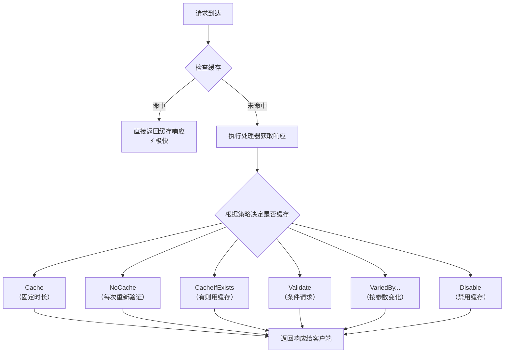

# 响应压缩与缓存策略

> **学习目标**：掌握ASP.NET Core中从传输层到应用层的完整性能优化方案，通过压缩和缓存技术将应用响应速度提升数倍。

## 目录

- [1. 响应压缩中间件](#1-响应压缩中间件)
  - [1.1 为什么需要响应压缩](#11为什么需要响应压缩)
  - [1.2 Brotli vs Gzip对比](#12-brotli-vs-gzip对比)
  - [1.3 完整配置示例](#13-完整配置示例)
  - [1.4 自定义压缩提供程序](#14-自定义压缩提供程序)
- [2. 输出缓存Output Caching](#2-输出缓存output-caching)
  - [2.1 六种缓存策略详解](#21六种缓存策略详解)
  - [2.2 缓存变体与标签](#22-缓存变体与标签)
  - [2.3 缓存失效机制](#23-缓存失效机制)
- [3. 客户端缓存策略](#3-客户端缓存策略)
  - [3.1 Cache-Control指令详解](#31-cache-control指令详解)
  - [3.2 ETag与Last-Modified协商缓存](#32-etag与last-modified协商缓存)
- [4. 服务端缓存架构](#4-服务端缓存架构)
  - [4.1 内存缓存IMemoryCache](#41-内存缓存imemorycache)
  - [4.2 分布式缓存Redis](#42-分布式缓存redis)
  - [4.3 多级缓存设计](#43-多级缓存设计)
- [5. 缓存失效模式](#5-缓存失效模式)
  - [5.1 TTL过期策略](#51-ttl过期策略)
  - [5.2 LRU淘汰策略](#52-lru淘汰策略)
  - [5.3 Cache Stampede防护](#53-cache-stampede防护)
- [6. 静态资源优化](#6-静态资源优化)
- [7. 生产环境完整配置](#7-生产环境完整配置)
- [8. 常见陷阱与最佳实践](#8-常见陷阱与最佳实践)
- [9. 练习题](9-练习题)

---

## 1. 响应压缩中间件

### 1.1 为什么需要响应压缩

```
未压缩 vs 压缩对比：

┌─────────────────────────────────────────────────────────────┐
│ 资源类型        │ 未压缩大小   │ Gzip大小    │ Brotli大小   │ 压缩率 │
├────────────────┼────────────┼────────────┼──────────────┼───────┤
│ HTML页面       │ 50 KB      │ 15 KB      │ 12 KB        │ 76%   │
│ JSON API响应   │ 120 KB     │ 35 KB      │ 28 KB        │ 77%   │
│ JavaScript文件  │ 300 KB     │ 90 KB      │ 70 KB        │ 77%   │
│ CSS样式表      │ 80 KB      │ 20 KB      │ 16 KB        │ 80%   │
│ SVG图片        │ 25 KB      │ 8 KB       │ 6 KB         │ 76%   │
│ 文本API响应    │ 10 KB      │ 3 KB       │ 2.5 KB       │ 75%   │
└────────────────┴────────────┴────────────┴──────────────┴───────┘

结论：文本类资源的压缩率通常在70-80%，意味着：
- 传输时间减少约75%
- 带宽成本降低约75%
- 用户感知的加载速度显著提升
```

### 1.2 Brotli vs Gzip对比

| 特性 | Gzip | Brotli |
|-----|------|--------|
| **压缩率** | 基准 | 比Gzip高15-25% |
| **压缩速度** | 快 | 稍慢（静态预压缩可忽略） |
| **解压速度** | 很快 | 与Gzip相当 |
| **浏览器支持** | 所有浏览器 | Chrome/Firefox/Edge/Safari 11+ |
| **CPU开销** | 低 | 中等（建议静态预压缩） |
| **推荐场景** | 兼容性优先 | 性能优先 |

### 1.3 完整配置示例

```csharp
/// <summary>
/// Program.cs - 响应压缩中间件完整配置
/// </summary>
public class ResponseCompressionConfig
{
    /// <summary>
    /// 配置响应压缩中间件
    /// </summary>
    public static void ConfigureCompression(WebApplicationBuilder builder)
    {
        // ========== 第一步：添加并配置压缩服务 ==========
        builder.Services.AddResponseCompression(options =>
        {
            // 启用HTTPS压缩（现代浏览器都支持）
            options.EnableForHttps = true;

            // 只压缩超过指定大小的响应（小文件压缩收益不大，反而浪费CPU）
            options.MinimumCompressionSize = 1024; // 1KB以上才压缩

            // 可选：只对特定MIME类型启用压缩
            options.MimeTypes = ResponseCompressionDefaults.MimeTypes.Concat(new[]
            {
                "application/json",
                "application/javascript",
                "image/svg+xml",
                "text/plain",
                "text/event-stream"
            });
            
            // 配置压缩提供程序的优先级
            options.Providers.Add<BrotliCompressionProvider>();
            options.Providers.Add<GzipCompressionProvider>();
        });

        // ========== 第二步：详细配置各压缩算法参数 ==========
        builder.Services.Configure<BrotliCompressionProviderOptions>(options =>
        {
            // 压缩级别：0-11，越高压缩率越好但越慢
            // Level 0: 无压缩（用于测试）
            // Level 1-3: 速度快，压缩率一般（适合动态内容）
            // Level 4-6: 平衡（推荐用于实时压缩）
            // Level 7-9: 高压缩率，较慢
            // Level 10-11: 最高压缩率，很慢（仅适合离线/预压缩）
            options.Level = CompressionLevel.Optimal; // 推荐值
            
            // 生产环境建议：
            // 动态内容(HTML/API): Fastest 或 Level 1-3
            // 静态内容(已预压缩): 不需要运行时压缩
        });

        builder.Services.Configure<GzipCompressionProviderOptions>(options =>
        {
            // Gzip压缩级别：1-9
            options.Level = CompressionLevel.Fastest; // Gzip作为回退，追求速度
        });
        
        // 注册自定义压缩提供程序（如果需要）
        // options.Providers.Add<CustomCompressionProvider>();
    }

    /// <summary>
    /// 在管道中启用压缩（必须在UseRouting之前！）
    /// </summary>
    public static void UseCompression(IApplicationBuilder app)
    {
        // 关键顺序：压缩中间件必须放在靠前的位置
        app.UseResponseCompression();
        
        // 后续中间件的响应都会被自动压缩
        // app.UseRouting();
        // app.UseAuthorization();
        // app.MapControllers();
    }
}
```

```csharp
/// <summary>
/// 实际使用示例：带压缩的API控制器
/// </summary>
[ApiController]
[Route("api/[controller]")]
public class DataController : ControllerBase
{
    /// <summary>
    /// 大数据量API端点 - 自动被压缩
    /// </summary>
    [HttpGet("large-data")]
    public IActionResult GetLargeData()
    {
        var data = GenerateLargeDataset(); // 假设返回100KB的JSON
        
        return Ok(data);
        /*
         * 当客户端请求头包含：
         * Accept-Encoding: br, gzip, deflate
         * 
         * 响应会自动包含：
         * Content-Encoding: br (或 gzip)
         * Vary: Accept-Encoding
         * 
         * 响应体会被Brotli/Gzip压缩后传输
         */
    }
    
    /// <summary>
    /// 手动控制某些端点不使用压缩
    /// </summary>
    [HttpGet("stream")]
    [Produces("text/event-stream")]
    public async IAsyncEnumerable<string> GetStreamData()
    {
        // SSE流通常不需要压缩（已经是增量传输）
        for (int i = 0; i < 100; i++)
        {
            yield return $"data: {{\"index\":{i},\"time\":\"{DateTime.UtcNow:O}\"}}\n\n";
            await Task.Delay(100);
        }
    }
    
    private object GenerateLargeDataset()
    {
        // 生成测试数据...
        return new { items = Enumerable.Range(1, 1000).Select(i => new { id = i, name = $"Item{i}" }) };
    }
}
```

### 1.4 自定义压缩提供程序

```csharp
/// <summary>
/// 自定义压缩提供程序示例（基于Zstd或其他算法）
/// </summary>
public class ZstdCompressionProvider : ICompressionProvider
{
    /// <summary>
    /// 编码名称，出现在Accept-Encoding和Content-Encoding头中
    /// </summary>
    public string EncodingName => "zstd";

    /// <summary>
    /// 是否支持同步刷新（用于流式场景）
    /// </summary>
    public bool SupportsFlush => true;

    /// <summary>
    /// 创建压缩流
    /// </summary>
    public Stream CreateStream(Stream outputStream)
    {
        // 使用Zstd库创建压缩流
        // 这里以伪代码展示结构
        return new ZstdCompressionStream(outputStream, CompressionLevel.Optimal);
    }
}

// 使用方式：
// builder.Services.AddResponseCompression(options =>
// {
//     options.Providers.Add<ZstdCompressionProvider>();
// });
```

---

## 2. 输出缓存Output Caching

.NET 7引入了全新的`Output Caching`中间件，比旧版的`Response Caching`更强大、更灵活。

### 2.1 六种缓存策略详解



```csharp
/// <summary>
/// Output Caching 六种策略完整演示
/// </summary>
public static class OutputCachingStrategiesDemo
{
    /// <summary>
    /// 配置Output Caching服务
    /// </summary>
    public static void AddOutputCachingServices(IServiceCollection services)
    {
        services.AddOutputCaching(options =>
        {
            // 全局默认缓存时间
            options.DefaultExpirationTimeSpan = TimeSpan.FromMinutes(5);
            
            // 最大缓存条目数量（防止内存耗尽）
            options.MaximumBodySize = 64 * 1024 * 1024; // 64MB单条上限
            options.SizeLimit = 100 * 1024 * 1024;      // 总缓存100MB上限
            
            // 使用案例敏感的路由
            options.UseCaseSensitivePaths = false;
        });

        // 自定义缓存策略（命名策略，可在Action上引用）
        services.AddOutputCache(options =>
        {
            options.AddPolicy("ProductList", policy =>
            {
                // 策略1：Cache - 固定时长缓存
                policy.Expire(TimeSpan.FromMinutes(10));
                
                // 按查询参数变化缓存（不同分类不同缓存）
                policy.VaryByQuery("category", "page", "pageSize");
                
                // 按Header变化（如Accept-Language）
                policy.VaryByHeader("Accept-Language");
                
                // 按Host变化（多租户场景）
                policy.VaryByHost();
                
                // 缓存标签（用于批量失效）
                policy.Tag("products", "product-list");
            });

            options.AddPolicy("UserProfile", policy =>
            {
                // 策略2：NoCache - 不缓存但允许304
                policy.NoCache();
                
                // 但仍然按用户变化
                policy.VaryByValue("userId", context =>
                {
                    // 从认证信息获取用户ID
                    var userId = context.HttpContext.User.FindFirst("sub")?.Value;
                    return userId ?? "anonymous";
                });
            });

            options.AddPolicy("ApiData", policy =>
            {
                // 策略3：CacheIfExists - 仅在已有缓存时使用
                policy.CacheIfExists(expiration: TimeSpan.FromMinutes(30));
                
                // 按自定义键变化
                policy.VaryByValue("version", context =>
                {
                    // 根据API版本变化
                    var version = context.HttpContext.Request.Headers["X-API-Version"];
                    return version.FirstOrDefault() ?? "v1";
                });
            });

            options.AddPolicy("StaticResource", policy =>
            {
                // 策略4：长时间缓存静态资源
                policy.Expire(TimeSpan.FromDays(30));
                
                // 文件哈希变化（文件修改自动失效）
                policy.VaryByValue("fileHash", context =>
                {
                    var path = context.HttpContext.Request.Path.Value;
                    return GetFileHash(path); // 返回文件内容的哈希值
                });
            });

            options.AddPolicy("RealTimeData", policy =>
            {
                // 策略5：短时缓存 + 条件验证
                policy.Expire(TimeSpan.FromSeconds(10));
                policy.SetVaryByPriority(CacheVaryByPriority.VaryByAll);
            });

            options.AddPolicy("DisabledForAuth", policy =>
            {
                // 策略6：完全禁用缓存
                policy.NoCache();
                policy.SetLocking(false); // 不锁定防止缓存穿透
            });
        });
    }

    private static string GetFileHash(string? path) => 
        path?.GetHashCode().ToString("x8") ?? "unknown";
}

// ==================== 控制器中使用 ====================

/// <summary>
/// 展示各种缓存策略的API控制器
/// </summary>
[ApiController]
[Route("api/[controller]")]
[OutputCache] // 控制器级别：所有Action默认启用缓存
public class ProductsController : ControllerBase
{
    private readonly IProductService _productService;
    private readonly IOutputCacheStore _cacheStore;
    private readonly ILogger<ProductsController> _logger;

    public ProductsController(
        IProductService productService,
        IOutputCacheStore cacheStore,
        ILogger<ProductsController> logger)
    {
        _productService = productService;
        _cacheStore = cacheStore;
        _logger = logger;
    }

    /// <summary>
    /// 商品列表：使用预定义的"ProductList"策略
    /// </summary>
    [HttpGet]
    [OutputCache(PolicyName = "ProductList")] // 引用命名策略
    public async Task<ActionResult<PagedResult<ProductDto>>> GetProducts(
        [FromQuery] string? category,
        [FromQuery] int page = 1,
        [FromQuery] int pageSize = 20)
    {
        _logger.LogInformation("执行商品列表查询: Category={Category}, Page={Page}", category, page);
        
        var result = await _productService.GetPagedProductsAsync(category, page, pageSize);
        return Ok(result);
    }

    /// <summary>
    /// 商品详情：内联缓存配置
    /// </summary>
    [HttpGet("{id:int}")]
    [OutputCache(
        Duration = 300,           // 缓存5分钟
        VaryByRouteValues = new[] { "id" },  // 每个商品ID独立缓存
        VaryByQueryKeys = new[] { "fields" }, // 可选字段也影响缓存
        NoStore = false)]
    public async Task<ActionResult<ProductDetailDto>> GetById(int id, string? fields = null)
    {
        var product = await _productService.GetByIdAsync(id);
        if (product == null) return NotFound();

        // 根据fields参数选择返回字段
        var dto = ApplyFieldSelection(product, fields);
        return Ok(dto);
    }

    /// <summary>
    /// 用户资料：不缓存但允许304
    /// </summary>
    [HttpGet("profile")]
    [OutputCache(PolicyName = "UserProfile")]
    public async Task<ActionResult<UserProfileDto>> GetUserProfile()
    {
        var userId = GetCurrentUserId();
        var profile = await _userService.GetProfileAsync(userId);
        return Ok(profile);
    }

    /// <summary>
    /// 创建商品：使相关缓存失效
    /// </summary>
    [HttpPost]
    public async Task<ActionResult<ProductDto>> Create([FromBody] CreateProductRequest request)
    {
        var product = await _productService.CreateAsync(request);
        
        // 关键：创建成功后使商品列表缓存失效
        await _cacheStore.EvictByTagAsync("products", default);
        await _cacheStore.EvictByTagAsync("product-list", default);
        
        return CreatedAtAction(nameof(GetById), new { id = product.Id }, product);
    }

    /// <summary>
    /// 更新商品：精确失效特定商品的缓存
    /// </summary>
    [HttpPut("{id}")]
    public async Task<IActionResult> Update(int id, [FromBody] UpdateProductRequest request)
    {
        await _productService.UpdateAsync(id, request);
        
        // 使该商品详情缓存失效
        var cacheKey = $"/api/products/{id}";
        await _cacheStore.EvictAsync(cacheKey, default);
        
        // 同时使列表缓存失效（因为可能影响排序等）
        await _cacheStore.EvictByTagAsync("products", default);

        return NoContent();
    }

    private string GetCurrentUserId() => 
        User.FindFirst("sub")?.Value ?? "anonymous";
    
    private ProductDetailDto ApplyFieldSelection(Product product, string? fields)
    {
        // 字段选择逻辑...
        return new ProductDetailDto(product.Id, product.Name, product.Price);
    }
}
```

### 2.2 缓存变体与标签

```csharp
/// <summary>
/// 高级缓存变体配置
/// </summary>
public class AdvancedCacheVariants
{
    /// <summary>
    /// VaryByValue：基于任意逻辑生成缓存键
    /// 适用于复杂的变化因素
    /// </summary>
    public void ConfigureComplexVariants(OutputCacheOptions options)
    {
        options.AddPolicy("TenantAware", policy =>
        {
            policy.Expire(TimeSpan.FromHours(1));
            
            // 租户隔离：每个租户的数据独立缓存
            policy.VaryByValue("tenantId", context =>
            {
                // 从请求头、JWT claims或子域名获取租户ID
                var tenantId = context.HttpContext.Request.Headers["X-Tenant-ID"]
                    .FirstOrDefault() 
                    ?? context.HttpContext.User.FindFirst("tenant_id")?.Value
                    ?? "default";
                return tenantId;
            });
            
            // 设备类型：移动端和桌面端可能有不同的布局
            policy.VaryByValue("deviceType", context =>
            {
                var userAgent = context.HttpContext.Request.Headers["User-Agent"]
                    .FirstOrDefault() ?? "";
                
                if (userAgent.Contains("Mobile") || userAgent.Contains("iPhone"))
                    return "mobile";
                if (userAgent.Contains("Tablet"))
                    return "tablet";
                return "desktop";
            });
            
            // A/B测试变体
            policy.VaryByValue("abTestGroup", context =>
            {
                var cookie = context.HttpContext.Request.Cookies["ab_group"];
                return cookie ?? "control";
            });
        });
    }

    /// <summary>
    /// 缓存标签系统：用于批量失效管理
    /// </summary>
    public async Task DemonstrateTags(IOutputCacheStore cacheStore)
    {
        // 场景：电商网站的商品缓存标签体系
        
        // 商品详情页面的缓存带有多个标签
        // Tag: "product:{id}" - 单个商品
        // Tag: "category:{catId}" - 分类下所有商品
        // Tag: "brand:{brandId}" - 品牌下所有商品
        // Tag: "all-products" - 所有商品相关缓存
        
        // 当某个商品更新时：
        await cacheStore.EvictByTagAsync("product:12345", CancellationToken.None);
        
        // 当整个分类需要刷新时：
        await cacheStore.EvictByTagAsync("category:electronics", CancellationToken.None);
        
        // 当品牌信息变更时：
        await cacheStore.EvictByTagAsync("brand:apple", CancellationToken.None);
        
        // 全站商品缓存刷新（慎用）：
        // await cacheStore.EvictByTagAsync("all-products", CancellationToken.None);
    }
}
```

### 2.3 缓存失效机制

```csharp
/// <summary>
/// 缓存失效策略与实现
/// </summary>
public class CacheEvictionStrategies
{
    private readonly IOutputCacheStore _cacheStore;
    private readonly IMemoryCache _memoryCache;
    private readonly IDistributedCache _distributedCache;
    private readonly ILogger<CacheEvictionStrategies> _logger;

    public CacheEvictionStrategies(
        IOutputCacheStore cacheStore,
        IMemoryCache memoryCache,
        IDistributedCache distributedCache,
        ILogger<CacheEvictionStrategies> logger)
    {
        _cacheStore = cacheStore;
        _memoryCache = memoryCache;
        _distributedCache = distributedCache;
        _logger = logger;
    }

    /// <summary>
    /// 策略1：主动失效 - 数据变更时立即清除
    /// </summary>
    public async Task OnProductUpdated(int productId, string[] affectedCategories)
    {
        // 失效Output Cache
        await _cacheStore.EvictAsync($"/api/products/{productId}", CancellationToken.None);
        
        // 失效Memory Cache中的相关数据
        _memoryCache.Remove($"product_detail_{productId}");
        
        foreach (var catId in affectedCategories)
        {
            await _cacheStore.EvictByTagAsync($"category:{catId}", CancellationToken.None);
            _memoryCache.Remove($"category_products_{catId}");
        }
        
        // 发布缓存失效事件（微服务架构中通知其他服务）
        await PublishCacheInvalidationEvent(new CacheInvalidationMessage
        {
            EntityType = "Product",
            EntityId = productId,
            AffectedTags = affectedCategories.Select(c => $"category:{c}").ToArray()
        });
        
        _logger.LogInformation("产品{ProductId}更新，已清理相关缓存", productId);
    }

    /// <summary>
    /// 策略2：定时刷新 - 定期重建缓存
    /// </summary>
    public async Task SetupScheduledRefresh()
    {
        // 使用BackgroundService定期刷新热点数据
        // 示例：每5分钟刷新首页推荐商品
    }

    /// <summary>
    /// 策略3：版本号失效 - 通过URL参数控制
    /// </summary>
    public string BuildVersionedUrl(string baseUrl, int version)
    {
        // URL: /api/data?v=3
        // 当数据变更时递增版本号，自然使旧缓存失效
        return $"{baseUrl}?v={version}";
    }

    private Task PublishCacheInvalidationEvent(CacheInvalidationMessage message)
    {
        // 实现事件发布...
        return Task.CompletedTask;
    }
}

public record CacheInvalidationMessage(
    string EntityType, 
    int EntityId, 
    string[] AffectedTags);
```

---

## 3. 客户端缓存策略

### 3.1 Cache-Control指令详解

```csharp
/// <summary>
/// Cache-Control 响应头完整指南
/// </summary>
public class CacheControlGuide
{
    /*
     * ╔═══════════════════════════════════════════════════════════════╗
     * ║              Cache-Control 指令速查表                       ║
     * ╠═════════════════╦═══════════════════════════════════════════╣
     * ║ 指令             ║ 含义                                      ║
     * ╠═════════════════╬═══════════════════════════════════════════╣
     * ║ public          ║ 响应可被任何缓存存储（浏览器/CDN/代理）    ║
     * ║ private         ║ 响应只能被浏览器缓存，不能被共享缓存       ║
     * ║ no-cache        ║ 每次使用前必须向服务器验证新鲜度           ║
     * ║ no-store        ║ 完全禁止缓存                               ║
     * ║ max-age=3600    ║ 缓存有效期3600秒（相对时间）               ║
     * ║ s-maxage=3600   ║ 共享缓存（CDN）的有效期                   ║
     * ║ must-revalidate ║ 过期后必须验证，不能用过期数据             ║
     * ║ immutable       ║ 内容永远不会改变（如带hash的资源名）       ║
     * ║ no-transform    ║ 中间节点不得转换内容（如压缩/转码）        ║
     * ╚═════════════════╩═══════════════════════════════════════════╝
     */

    /// <summary>
    /// 不同资源类型的Cache-Control推荐配置
    /// </summary>
    public static Dictionary<string, string> RecommendedCacheHeaders => new()
    {
        // HTML文档：短期缓存，始终验证
        ["*.html"] = "public, max-age=0, must-revalidate",
        
        // API响应（JSON）：根据数据特性设置
        ["/api/public/*"] = "public, max-age=60, s-maxage=300",     // 公开数据
        ["/api/user/*"] = "private, no-cache, must-revalidate",     // 用户私有
        ["/api/auth/*"] = "private, no-store, must-revalidate",     // 敏感数据
        
        // 静态资源：长期缓存 + 内容hash
        ["/static/*.js"] = "public, max-age=31536000, immutable",
        ["/static/*.css"] = "public, max-age=31536000, immutable",
        ["/static/images/*"] = "public, max-age=31536000, immutable",
        ["/static/fonts/*"] = "public, max-age=31536000, immutable",
        
        // 媒体文件：中等缓存
        ["/media/*"] = "public, max-age=604800, s-maxage=2592000",
        
        // favicon和manifest：长期缓存
        ["/favicon.ico"] = "public, max-age=31536000, immutable",
        ["/manifest.json"] = "public, max-age=604800",
        
        // robots.txt和sitemap：短时间缓存
        ["/robots.txt"] = "public, max-age=86400",
        ["/sitemap.xml"] = "public, max-age=3600"
    };
}
```

### 3.2 ETag与Last-Modified协商缓存

```csharp
/// <summary>
/// 协商缓存（Conditional Request）完整实现
/// </summary>
public class ConditionalCacheMiddleware
{
    /// <summary>
    /// ETag工作原理：
    /// 1. 首次请求：服务器返回资源和ETag（如 "abc123"）
    /// 2. 再次请求：浏览器发送 If-None-Match: "abc123"
    /// 3. 服务器比较ETag：
    ///    - 相同 → 返回 304 Not Modified（无body，极快）
    ///    - 不同 → 返回 200 + 新资源 + 新ETag
    /// </summary>
    public static IActionResult HandleWithEtag<T>(T data, string etag)
    {
        // 方式1：手动处理
        /*
        if (Request.Headers.ContainsKey("If-None-Match"))
        {
            var clientEtag = Request.Headers["If-None-Match"].FirstOrDefault();
            if (clientEtag == $"\"{etag}\"")
            {
                return StatusCode(StatusCodes.Status304NotModified);
            }
        }
        
        return Ok(data).WithETag(etag);
        */

        // 方式2：使用ASP.NET Core内置支持（推荐）
        // OutputCache中间件会自动处理ETag和304
        return null!;
    }
}

/// <summary>
/// 在控制器中使用协商缓存
/// </summary>
[ApiController]
[Route("api/[controller]")]
public class ArticlesController : ControllerBase
{
    private readonly IArticleRepository _articleRepo;
    private readonly IOutputCacheStore _cacheStore;

    public ArticlesController(IArticleRepository articleRepo, IOutputCacheStore cacheStore)
    {
        _articleRepo = articleRepo;
        _cacheStore = cacheStore;
    }

    /// <summary>
    /// 文章详情：使用ETag进行协商缓存
    /// </summary>
    [HttpGet("{id}")]
    [ResponseCache(Duration = 0, Location = ResponseCacheLocation.Any, VaryByHeader = "If-None-Match")]
    [OutputCache(PolicyName = "ArticleDetail")]
    public async Task<ActionResult<ArticleDto>> GetArticle(int id)
    {
        var article = await _articleRepo.GetByIdAsync(id);
        if (article == null) return NotFound();

        // 生成ETag：基于文章的最后修改时间和关键内容
        var etag = ComputeEtag(article);
        
        // 检查If-None-Match头
        var requestEtag = Request.Headers.IfNoneMatch.FirstOrDefault();
        if (requestEtag != null && CompareEtags(requestEtag.Tag, etag))
        {
            // 客户端的缓存还是新鲜的
            return StatusCode(StatusCodes.Status304NotModified);
        }

        // 设置ETag响应头
        Response.Headers.ETag = $"\"{etag}\"";

        return Ok(MapToDto(article));
    }

    /// <summary>
    /// 更新文章：同时更新ETag
    /// </summary>
    [HttpPut("{id}")]
    public async Task<IActionResult> UpdateArticle(int id, UpdateArticleRequest request)
    {
        var article = await _articleRepo.UpdateAsync(id, request);
        
        // 使缓存失效
        await _cacheStore.EvictAsync($"/api/articles/{id}", default);
        
        // 新的ETag会在下次请求时计算
        return NoContent();
    }

    private static string ComputeEtag(Article article)
    {
        // 使用文章的关键属性生成哈希作为ETag
        var input = $"{article.Id}:{article.UpdatedAt:O}:{article.Version}";
        return Convert.ToBase64String(System.Security.Cryptography.SHA256.HashData(
            System.Text.Encoding.UTF8.GetBytes(input)))[..16];
    }

    private static bool CompareEtags(EntityTagHeaderValue? requestEtag, string serverEtag)
    {
        return requestEtag != null && 
               requestEtag.Tag == $"\"{serverEtag}\"";
    }

    private ArticleDto MapToDto(Article a) => new(a.Id, a.Title, a.ContentPreview);
}

public record ArticleDto(int Id, string Title, string ContentPreview);
```

---

## 4. 服务端缓存架构

### 4.1 内存缓存IMemoryCache

```csharp
/// <summary>
/// IMemoryCache 完整使用指南
/// </summary>
public class MemoryCacheExamples
{
    private readonly IMemoryCache _cache;
    private readonly ILogger<MemoryCacheExamples> _logger;

    public MemoryCacheExamples(IMemoryCache cache, ILogger<MemoryCacheExamples> logger)
    {
        _cache = cache;
        _logger = logger;
    }

    /// <summary>
    /// 基础用法：GetOrCreate模式（最常用）
    /// </summary>
    public async Task<T> GetOrCreateAsync<T>(
        string key, 
        Func<Task<T>> factory,
        TimeSpan? absoluteExpiration = null,
        TimeSpan? slidingExpiration = null,
        int? size = null)
    {
        // 尝试从缓存获取
        if (_cache.TryGetValue(key, T cached))
        {
            _logger.LogDebug("缓存命中: {Key}", key);
            return cached;
        }

        // 缓存未命中，调用工厂方法获取数据
        _logger.LogDebug("缓存未命中: {Key}, 正在获取数据...", key);
        var value = await factory();

        // 设置缓存选项
        var options = new MemoryCacheEntryOptions
        {
            // 绝对过期：不管访问频率，到点就过期
            AbsoluteExpirationRelativeToNow = absoluteExpiration ?? TimeSpan.FromMinutes(30),
            
            // 滑动过期：每次访问重置计时器
            SlidingExpiration = slidingExpiration ?? TimeSpan.FromMinutes(5),
            
            // 缓存条目优先级（内存压力大时优先淘汰低优先级的）
            Priority = CacheItemPriority.Normal,
            
            // 缓存条目大小（用于限制总缓存大小）
            Size = size ?? 1
        };

        // 注册过期回调
        options.RegisterPostEvictionCallback((evictedKey, value, reason, state) =>
        {
            _logger.LogDebug(
                "缓存条目被移除: Key={Key}, Reason={Reason}", 
                evictedKey, reason);
        });

        // 写入缓存
        _cache.Set(key, value, options);

        return value;
    }

    /// <summary>
    /// 实际案例：缓存热门商品数据
    /// </summary>
    public async Task<List<ProductDto>> GetHotProductsAsync()
    {
        return await GetOrCreateAsync(
            key: "hot_products:v2",
            factory: async () =>
            {
                // 从数据库/服务获取数据
                return await FetchHotProductsFromDbAsync();
            },
            absoluteExpiration: TimeSpan.FromMinutes(10),  // 最长缓存10分钟
            slidingExpiration: TimeSpan.FromMinutes(2));    // 2分钟内有访问就续命
    }

    /// <summary>
    /// 带锁的缓存访问：防止缓存击穿
    /// </summary>
    private readonly ConcurrentDictionary<string, SemaphoreSlim> _locks = new();

    public async Task<T> GetOrCreateLockedAsync<T>(string key, Func<Task<T>> factory)
    {
        // 先尝试直接读取（无锁快速路径）
        if (_cache.TryGetValue(key, T cached))
        {
            return cached;
        }

        // 获取该key专用的锁
        var lockObj = _locks.GetOrAdd(key, _ => new SemaphoreSlim(1, 1));

        await lockObj.WaitAsync();
        try
        {
            // 双重检查：等待锁期间其他线程可能已经填充了缓存
            if (_cache.TryGetValue(key, T doubleCheckCached))
            {
                return doubleCheckCached;
            }

            // 执行工厂方法
            var value = await factory();
            
            _cache.Set(key, value, new MemoryCacheEntryOptions
            {
                AbsoluteExpirationRelativeToNow = TimeSpan.FromMinutes(5)
            });

            return value;
        }
        finally
        {
            lockObj.Release();
            // 清理锁对象（可选，避免字典无限增长）
            _locks.TryRemove(key, out _);
        }
    }

    private Task<List<ProductDto>> FetchHotProductsFromDbAsync()
    {
        // 数据库查询...
        return Task.FromResult(new List<ProductDto>());
    }
}

public record ProductDto(int Id, string Name, decimal Price);
```

### 4.2 分布式缓存Redis

```csharp
/// <summary>
/// Redis分布式缓存完整封装
/// </summary>
public class RedisCacheService
{
    private readonly IDistributedCache _cache;
    private readonly ILogger<RedisCacheService> _logger;
    private readonly ISerializer _serializer;

    public RedisCacheService(
        IDistributedCache cache,
        ILogger<RedisCacheService> logger,
        ISerializer serializer)
    {
        _cache = cache;
        _logger = logger;
        _serializer = serializer;
    }

    /// <summary>
    /// 获取或创建缓存项
    /// </summary>
    public async Task<T?> GetOrCreateAsync<T>(
        string key,
        Func<Task<T>> factory,
        DistributedCacheEntryOptions? options = null,
        CancellationToken ct = default)
    {
        // 尝试从Redis获取
        var cachedBytes = await _cache.GetAsync(key, ct);
        if (cachedBytes != null && cachedBytes.Length > 0)
        {
            try
            {
                var value = _serializer.Deserialize<T>(cachedBytes);
                _logger.LogDebug("Redis缓存命中: {Key}", key);
                return value;
            }
            catch (Exception ex)
            {
                _logger.LogWarning(ex, "反序列化失败，将重新获取: {Key}", key);
            }
        }

        // 缓存未命中，调用工厂
        _logger.LogDebug("Redis缓存未命中: {Key}", key);
        var value = await factory();

        // 序列化并存入Redis
        var serialized = _serializer.Serialize(value);
        await _cache.SetAsync(key, serialized, options ?? DefaultOptions(), ct);

        return value;
    }

    /// <summary>
    /// 带分布式锁的缓存操作（防Cache Stampede）
    /// </summary>
    public async Task<T> GetOrCreateWithDistributedLockAsync<T>(
        string key,
        Func<Task<T>> factory,
        TimeSpan lockTimeout = default,
        CancellationToken ct = default)
    {
        lockTimeout = lockTimeout == default ? TimeSpan.FromSeconds(30) : lockTimeout;
        var lockKey = $"lock:{key}";
        
        // 快速路径：先尝试读缓存
        var cached = await GetAsync<T>(key, ct);
        if (cached != null) return cached;

        // 获取分布式锁
        var lockAcquired = await AcquireLockAsync(lockKey, lockTimeout, ct);
        if (!lockAcquired)
        {
            // 获取锁失败，等待后重试或降级
            await Task.Delay(100, ct);
            var retryValue = await GetAsync<T>(key, ct);
            return retryValue ?? await factory();
        }

        try
        {
            // 双重检查
            cached = await GetAsync<T>(key, ct);
            if (cached != null) return cached;

            // 执行工厂方法
            var value = await factory();
            
            // 写入缓存
            await SetAsync(key, value, DefaultOptions(), ct);
            
            return value;
        }
        finally
        {
            await ReleaseLockAsync(lockKey, ct);
        }
    }

    /// <summary>
    /// 批量获取（Redis MGET）
    /// </summary>
    public async Task<Dictionary<string, T?>> BatchGetAsync<T>(
        IEnumerable<string> keys,
        CancellationToken ct = default)
    {
        var result = new Dictionary<string, T?>();
        var tasks = keys.Select(async key =>
        {
            var value = await GetAsync<T>(key, ct);
            return (Key: key, Value: value);
        }).ToArray();

        var results = await Task.WhenAll(tasks);
        foreach (var (key, value) in results)
        {
            result[key] = value;
        }

        return result;
    }

    /// <summary>
    /// 删除匹配模式的缓存键（谨慎使用）
    /// </summary>
    public async Task RemoveByPatternAsync(string pattern, CancellationToken ct = default)
    {
        // 注意：StackExchange.Redis.IDatabase支持Keys/Scan
        // 标准 IDistributedCache 不支持模式删除
        // 需要使用具体的Redis客户端实现
        
        _logger.LogWarning("按模式删除缓存: {Pattern}", pattern);
        
        // 如果使用StackExchange.Redis:
        // var redis = ConnectionMultiplexer.Connect(...);
        // var db = redis.GetDatabase();
        // var server = redis.GetServer(...);
        // foreach (var key in server.Keys(pattern: pattern))
        // {
        //     await db.KeyDeleteAsync(key);
        // }
    }

    // ========== 辅助方法 ==========

    private async Task<T?> GetAsync<T>(string key, CancellationToken ct)
    {
        var bytes = await _cache.GetAsync(key, ct);
        if (bytes == null || bytes.Length == 0) return default;
        return _serializer.Deserialize<T>(bytes);
    }

    private async Task SetAsync<T>(string key, T value, DistributedCacheEntryOptions options, CancellationToken ct)
    {
        var bytes = _serializer.Serialize(value);
        await _cache.SetAsync(key, bytes, options, ct);
    }

    private async Task<bool> AcquireLockAsync(string lockKey, TimeSpan timeout, CancellationToken ct)
    {
        // 使用Redis SET NX EX 实现分布式锁
        var token = Guid.NewGuid().ToString("N");
        var success = await _cache.SetStringAsync(
            lockKey, 
            token, 
            new DistributedCacheEntryOptions 
            { 
                AbsoluteExpirationRelativeToNow = timeout 
            }, 
            ct);
        return !string.IsNullOrEmpty(success);
    }

    private async Task ReleaseLockAsync(string lockKey, CancellationToken ct)
    {
        await _cache.RemoveAsync(lockKey, ct);
    }

    private static DistributedCacheEntryOptions DefaultOptions() => new()
    {
        AbsoluteExpirationRelativeToNow = TimeSpan.FromMinutes(30),
        SlidingExpiration = TimeSpan.FromMinutes(5)
    };
}

/// <summary>
/// 序列化接口（可用System.Text.Json或Protobuf实现）
/// </summary>
public interface ISerializer
{
    byte[] Serialize<T>(T obj);
    T Deserialize<T>(byte[] data);
}

/// <summary>
/// JSON序列化实现
/// </summary>
public class JsonSerializer : ISerializer
{
    private static readonly JsonSerializerOptions Options = new()
    {
        PropertyNamingPolicy = JsonNamingPolicy.CamelCase,
        DefaultIgnoreCondition = System.Text.Json.Serialization.JsonIgnoreCondition.WhenWritingNull
    };

    public byte[] Serialize<T>(T obj) => 
        System.Text.Json.JsonSerializer.SerializeToUtf8Bytes(obj, Options);

    public T Deserialize<T>(byte[] data) => 
        System.Text.Json.JsonSerializer.Deserialize<T>(data, Options)!;
}
```

### 4.3 多级缓存设计

```csharp
/// <summary>
/// L1(内存) + L2(Redis) 两级缓存架构
/// </summary>
public class MultiLevelCacheService
{
    private readonly IMemoryCache _l1Cache;      // 本地内存缓存（L1）
    private readonly IDistributedCache _l2Cache;  // Redis分布式缓存（L2）
    private readonly IMetricsCollector _metrics;
    private readonly ILogger<MultiLevelCacheService> _logger;

    public MultiLevelCacheService(
        IMemoryCache l1Cache,
        IDistributedCache l2Cache,
        IMetricsCollector metrics,
        ILogger<MultiLevelCacheService> logger)
    {
        _l1Cache = l1Cache;
        _l2Cache = l2Cache;
        _metrics = metrics;
        _logger = logger;
    }

    /// <summary>
    /// 两级缓存读取流程
    /// </summary>
    public async Task<T?> GetAsync<T>(string key, CancellationToken ct = default)
    {
        // L1: 检查本地内存缓存（纳秒级）
        if (_l1Cache.TryGetValue(key, T l1Hit))
        {
            _metrics.Increment("cache.l1.hit");
            _logger.LogTrace("L1缓存命中: {Key}", key);
            return l1Hit;
        }
        _metrics.Increment("cache.l1.miss");

        // L2: 检查Redis分布式缓存（毫秒级）
        var l2Bytes = await _l2Cache.GetAsync(key, ct);
        if (l2Bytes != null && l2Bytes.Length > 0)
        {
            _metrics.Increment("cache.l2.hit");
            _logger.LogTrace("L2缓存命中: {Key}", key);

            // 反序列化并回填L1
            var value = Deserialize<T>(l2Bytes);
            FillL1(key, value);
            return value;
        }
        _metrics.Increment("cache.l2.miss");

        // 两级都未命中
        _logger.LogTrace("两级缓存均未命中: {Key}", key);
        return default;
    }

    /// <summary>
    /// 写入两级缓存
    /// </summary>
    public async Task SetAsync<T>(
        string key, 
        T value, 
        CacheOptions options,
        CancellationToken ct = default)
    {
        // 写入L1（较短过期时间）
        _l1Cache.Set(key, value, new MemoryCacheEntryOptions
        {
            AbsoluteExpirationRelativeToNow = options.L1Ttl,
            Size = options.Size,
            Priority = CacheItemPriority.Normal
        });

        // 写入L2（较长过期时间）
        var bytes = Serialize(value);
        await _l2Cache.SetAsync(key, bytes, new DistributedCacheEntryOptions
        {
            AbsoluteExpirationRelativeToNow = options.L2Ttl,
            SlidingExpiration = options.SlidingTtl
        }, ct);

        _metrics.Increment("cache.set");
    }

    /// <summary>
    /// 使两级缓存同时失效
    /// </summary>
    public async Task RemoveAsync(string key, CancellationToken ct = default)
    {
        _l1Cache.Remove(key);
        await _l2Cache.RemoveAsync(key, ct);
        _metrics.Increment("cache.evict");
    }

    /// <summary>
    /// 使L2缓存失效（用于其他实例通知的场景）
    /// L1会自然过期，无需主动清理
    /// </summary>
    public async Task InvalidateL2OnlyAsync(string key, CancellationToken ct = default)
    {
        await _l2Cache.RemoveAsync(key, ct);
        _logger.LogDebug("L2缓存已失效（L1将在{Ttl}后自然过期）", key);
    }

    private void FillL1<T>(string key, T value)
    {
        _l1Cache.Set(key, value, new MemoryCacheEntryOptions
        {
            AbsoluteExpirationRelativeToNow = TimeSpan.FromMinutes(5), // L1较短TTL
            Priority = CacheItemPriority.High // L1命中数据提升优先级
        });
    }

    private static byte[] Serialize<T>(T obj) => 
        System.Text.Json.JsonSerializer.SerializeToUtf8Bytes(obj);

    private static T Deserialize<T>(byte[] data) => 
        System.Text.Json.JsonSerializer.Deserialize<T>(data)!;
}

/// <summary>
/// 多级缓存配置选项
/// </summary>
public record CacheOptions(
    TimeSpan L1Ttl = default,    // L1缓存有效期（默认5分钟）
    TimeSpan L2Ttl = default,    // L2缓存有效期（默认30分钟）
    TimeSpan? SlidingTtl = null, // 滑动过期时间
    int Size = 1                 // 缓存条目大小权重
);

public interface IMetricsCollector
{
    void Increment(string metricName);
}
```

---

## 5. 缓存失效模式

### 5.1 TTL过期策略

```csharp
/// <summary>
/// TTL（Time To Live）过期策略的最佳实践
/// </summary>
public class TTLPatterns
{
    /// <summary>
     /// 不同数据类型的推荐TTL
     /// </summary>
    public static class RecommendedTTLs
    {
        // 实时性要求高的数据
        public static readonly TimeSpan StockPrice = TimeSpan.FromSeconds(5);      // 股价
        public static readonly TimeSpan OrderStatus = TimeSpan.FromSeconds(10);     // 订单状态
        public static readonly TimeSpan NotificationCount = TimeSpan.FromSeconds(30);// 通知计数

        // 中等时效性的数据
        public static readonly TimeSpan UserProfile = TimeSpan.FromMinutes(5);       // 用户资料
        public static readonly TimeSpan ProductInfo = TimeSpan.FromMinutes(10);      // 商品信息
        public static readonly TimeSpan CategoryTree = TimeSpan.FromHours(1);        // 分类树

        // 变化缓慢的数据
        public static readonly TimeSpan SystemConfig = TimeSpan.FromHours(6);        // 系统配置
        public static readonly TimeSpan RegionList = TimeSpan.FromDays(1);           // 地区列表
        public static readonly TimeSpan DictionaryData = TimeSpan.FromDays(7);      // 字典数据

        // 几乎不变的数据
        public static readonly TimeSpan AppVersion = TimeSpan.FromDays(30);          // 版本信息
        public static readonly TimeSpan LegalText = TimeSpan.FromDays(90);           // 法律条款
    }

    /// <summary>
    /// 渐进式TTL：热点数据长TTL，冷门数据短TTL
    /// </summary>
    public static TimeSpan CalculateDynamicTTL(int accessCount, TimeSpan baseTtl)
    {
        // 访问次数越多，TTL越长（最高不超过baseTtl的3倍）
        var multiplier = Math.Min(accessCount / 10.0, 3.0);
        return TimeSpan.FromMilliseconds(baseTtl.TotalMilliseconds * multiplier);
    }
}
```

### 5.2 LRU淘汰策略

```csharp
/// <summary>
/// 自定义LRU缓存实现（当需要精细控制时）
/// </summary>
public class LruCache<TKey, TValue> where TKey : notnull
{
    private readonly int _capacity;
    private readonly LinkedList<KeyValuePair<TKey, TValue>> _list = new();
    private readonly Dictionary<TKey, LinkedListNode<KeyValuePair<TKey, TValue>>> _dict = new();
    private readonly object _lock = new();

    public LruCache(int capacity)
    {
        _capacity = capacity;
    }

    /// <summary>
    /// 获取值（访问的元素移到最前面表示最近使用）
    /// </summary>
    public bool TryGetValue(TKey key, out TValue? value)
    {
        lock (_lock)
        {
            if (!_dict.TryGetValue(key, out var node))
            {
                value = default;
                return false;
            }

            // 移到链表头部（最近使用）
            _list.Remove(node);
            _list.AddFirst(node);

            value = node.Value.Value;
            return true;
        }
    }

    /// <summary>
    /// 设置值（满时淘汰最久未使用的）
    /// </summary>
    public void Set(TKey key, TValue value)
    {
        lock (_lock)
        {
            if (_dict.TryGetValue(key, out var existingNode))
            {
                // 已存在：更新值并移到头部
                existingNode.Value = new KeyValuePair<TKey, TValue>(key, value);
                _list.Remove(existingNode);
                _list.AddFirst(existingNode);
            }
            else
            {
                // 不存在：检查容量
                if (_dict.Count >= _capacity)
                {
                    // 淘汰尾部元素（最久未使用）
                    var last = _list.Last!;
                    _dict.Remove(last.Value.Key);
                    _list.RemoveLast();
                }

                // 添加新元素到头部
                var newNode = _list.AddFirst(new KeyValuePair<TKey, TValue>(key, value));
                _dict[key] = newNode;
            }
        }
    }

    public int Count
    {
        get { lock (_lock) return _dict.Count; }
    }
}
```

### 5.3 Cache Stampede防护

```csharp
/// <summary>
/// Cache Stampede（缓存雪崩/惊群）防护
/// 问题：缓存同时过期时，大量请求同时击穿到后端
/// </summary>
public class StampedeProtection
{
    private readonly IMemoryCache _cache;
    private readonly ConcurrentDictionary<string, SemaphoreSlim> _staleLocks = new();
    private readonly ILogger<StampedeProtection> _logger;

    public StampedeProtection(IMemoryCache cache, ILogger<StampedeProtection> logger)
    {
        _cache = cache;
        _logger = logger;
    }

    /// <summary>
    /// 策略1：Stale-While-Revalidate（使用过期数据的同时后台刷新）
    /// </summary>
    public async Task<T> GetWithStaleRefreshAsync<T>(
        string freshKey,
        string staleKey,
        Func<Task<T>> factory,
        TimeSpan freshTtl,
        TimeSpan staleTtl)
    {
        // 1. 尝试获取新鲜数据
        if (_cache.TryGetValue(freshKey, T fresh))
        {
            return fresh;
        }

        // 2. 新鲜数据不存在，尝试获取陈旧数据（如果还在）
        if (_cache.TryGetValue(staleKey, T stale))
        {
            _logger.LogDebug("返回陈旧数据，后台刷新中: {Key}", freshKey);
            
            // 异步刷新（fire-and-forget，但要处理异常）
            _ = RefreshInBackground(freshKey, staleKey, factory, freshTtl);
            
            return stale;
        }

        // 3. 完全没有缓存，必须等待
        _logger.LogDebug("完全没有缓存，同步获取: {Key}", freshKey);
        var value = await factory();
        
        _cache.Set(freshKey, value, freshTtl);
        _cache.Set(staleKey, value, staleTtl); // 陈旧数据保留更久
        
        return value;
    }

    /// <summary>
    /// 策略2：概率性提前刷新（Probabilistic Early Refresh）
    /// 在缓存即将过期前，以一定概率触发刷新
    /// </summary>
    public async Task<T> GetWithEarlyRefreshAsync<T>(
        string key,
        Func<Task<T>> factory,
        TimeSpan ttl)
    {
        if (_cache.TryGetValue(key, T cached))
        {
            // 检查是否应该提前刷新
            if (ShouldEarlyRefresh(ttl))
            {
                _logger.LogDebug("触发提前刷新: {Key}", key);
                _ = RefreshInBackground(key, key + ":backup", factory, ttl);
            }
            return cached;
        }

        return await factory();
    }

    /// <summary>
    /// 策略3：加锁防击穿（单一构建者模式）
    /// </summary>
    public async Task<T> GetWithLockProtectionAsync<T>(
        string key,
        Func<Task<T>> factory,
        TimeSpan ttl)
    {
        // 快速路径
        if (_cache.TryGetValue(key, T hit))
        {
            return hit;
        }

        // 获取锁
        var semaphore = _staleLocks.GetOrAdd(key, _ => new SemaphoreSlim(1, 1));
        
        await semaphore.WaitAsync();
        try
        {
            // 双重检查
            if (_cache.TryGetValue(key, T doubleCheck))
            {
                return doubleCheck;
            }

            // 只有获得锁的线程执行工厂方法
            var value = await factory();
            _cache.Set(key, value, ttl);
            return value;
        }
        finally
        {
            semaphore.Release();
            _staleLocks.TryRemove(key, out _);
        }
    }

    private async Task RefreshInBackground<T>(
        string freshKey, 
        string staleKey, 
        Func<Task<T>> factory, 
        TimeSpan ttl)
    {
        try
        {
            var value = await factory();
            _cache.Set(freshKey, value, ttl);
            _cache.Set(staleKey, value, ttl * 3); // 陈旧数据保留3倍时间
        }
        catch (Exception ex)
        {
            _logger.LogError(ex, "后台刷新失败: {Key}", freshKey);
        }
    }

    private static bool ShouldRefresh(TimeSpan ttl)
    {
        // 在剩余有效期的最后20%时间内，有10%的概率触发刷新
        var random = Random.Shared.NextDouble();
        return random < 0.1; // 10%概率
    }
}
```

---

## 6. 静态资源优化

```csharp
/// <summary>
/// 静态资源优化完整方案
/// </summary>
public class StaticResourceOptimization
{
    /// <summary>
    /// Program.cs 中的静态资源配置
    /// </summary>
    public static void ConfigureStaticFiles(WebApplication app)
    {
        // 基本配置
        app.UseStaticFiles(new StaticFileOptions
        {
            OnPrepareResponse = ctx =>
            {
                // 根据文件类型设置缓存头
                var headers = ctx.Context.Response.Headers;
                var path = ctx.File.Name.ToLowerInvariant();

                if (path.EndsWith(".js") || path.EndsWith(".css"))
                {
                    // 带hash的文件可以永久缓存
                    headers.CacheControl = "public, max-age=31536000, immutable";
                }
                else if (path.EndsWith(".jpg") || path.EndsWith(".png") || path.EndsWith(".webp"))
                {
                    // 图片缓存一年
                    headers.CacheControl = "public, max-age=31536000";
                }
                else if (path.EndsWith(".svg") || path.EndsWith(".ico"))
                {
                    // 矢量图标永久缓存
                    headers.CacheControl = "public, max-age=31536000, immutable";
                }
                else if (path.EndsWith(".html"))
                {
                    // HTML不缓存或很短时间
                    headers.CacheControl = "public, max-age=0, must-revalidate";
                }
            }
        });

        // 启用目录浏览（生产环境关闭）
        // app.UseDirectoryBrowser();
    }

    /// <summary>
    /// 资源文件名带指纹（Hash）的实现
    /// </summary>
    public static class AssetFingerprinting
    {
        /// <summary>
        /// 为静态资源URL添加内容哈希
        /// 格式: /static/js/app.a1b2c3d4.js
        /// </summary>
        public static string AddFingerprint(string basePath, string relativePath)
        {
            // 开发环境：不加指纹（方便调试）
            #if DEBUG
            return $"{basePath}{relativePath}";
            #endif

            // 生产环境：从预生成的manifest读取
            var manifest = LoadManifest();
            if (manifest.TryGetValue(relativePath, out var fingerprintedPath))
            {
                return $"{basePath}/{fingerprintedPath}";
            }

            return $"{basePath}{relativePath}";
        }

        /// <summary>
        /// manifest.json格式示例：
        /// {
        ///   "js/app.js": "js/app.a1b2c3d4.js",
        ///   "css/style.css": "css/style.e5f6g7h8.css",
        ///   "images/logo.png": "images/logo.i9j0k1l2.png"
        /// }
        /// </summary>
        private static Dictionary<string, string> LoadManifest()
        {
            // 从嵌入资源或文件加载manifest
            // 实际项目中在CI/CD流水线中生成此文件
            return new Dictionary<string, string>
            {
                ["js/app.js"] = "js/app.a1b2c3d4.js",
                ["css/style.css"] = "css/style.e5f6g7h8.css"
            };
        }
    }

    /// <summary>
    /// Razor视图中使用带指纹的资源引用
    /// </summary>
    /* 
     * <!-- _Layout.cshtml -->
     * <script src="@AssetFingerprinting.AddFingerprint("/static", "js/app.js")"></script>
     * <link rel="stylesheet" href="@AssetFingerprinting.AddFingerprint("/static", "css/style.css")" />
     */
}
```

---

## 7. 生产环境完整配置

```csharp
/// <summary>
/// 生产环境完整的性能优化配置
/// 整合压缩、缓存、静态资源优化
/// </summary>
public static class ProductionPerformanceSetup
{
    /// <summary>
     /// Program.cs 中的完整配置
     /// </summary>
    public static void SetupProduction(WebApplicationBuilder builder)
    {
        // ========== 1. 响应压缩 ==========
        builder.Services.AddResponseCompression(options =>
        {
            options.EnableForHttps = true;
            options.MinimumCompressionSize = 1024;
            options.Providers.Add<BrotliCompressionProvider>();
            options.Providers.Add<GzipCompressionProvider>();
        });
        builder.Services.Configure<BrotliCompressionProviderOptions>(options =>
        {
            options.Level = CompressionLevel.Optimal;
        });

        // ========== 2. 输出缓存 ==========
        builder.Services.AddOutputCaching(options =>
        {
            options.DefaultExpirationTimeSpan = TimeSpan.FromMinutes(5);
            options.MaximumBodySize = 64 * 1024 * 1024;
        });
        builder.Services.AddOutputCache(cacheOptions =>
        {
            // 公共API缓存策略
            cacheOptions.AddPolicy("PublicApi", policy =>
            {
                policy.Expire(TimeSpan.FromMinutes(5));
                policy.VaryByQuery("page", "pageSize");
                policy.VaryByHeader("Accept-Language");
                policy.Tag("public-api");
            });

            // 静态数据缓存策略
            cacheOptions.AddPolicy("StaticData", policy =>
            {
                policy.Expire(TimeSpan.FromHours(1));
                policy.VaryByValue("version", ctx => Assembly.GetExecutingAssembly().GetName().Version?.ToString() ?? "1");
            });
        });

        // ========== 3. 内存缓存 ==========
        builder.Services.AddMemoryCache(options =>
        {
            options.SizeLimit = 200 * 1024 * 1024; // 200MB上限
            options.CompactionPercentage = 5;      // 达到95%时开始压缩
        });

        // ========== 4. 分布式缓存（Redis）==========
        builder.Services.AddStackExchangeRedisCache(options =>
        {
            options.Configuration = builder.Configuration.GetConnectionString("Redis");
            options.InstanceName = "myapp:";
        });

        // ========== 5. HTTP客户端（带缓存支持）==========
        builder.Services.AddHttpClient("CachedClient")
            .AddHttpMessageHandler(() => new CacheDelegatingHandler());
    }

    /// <summary>
     /// 中间件管道配置
     /// </summary>
    public static void ConfigurePipeline(WebApplication app)
    {
        // 顺序很重要！

        // 1. HSTS（HTTPS严格传输安全）
        app.UseHsts();

        // 2. 响应压缩（必须在路由之前）
        app.UseResponseCompression();

        // 3. 输出缓存
        app.UseOutputCache();

        // 4. 静态文件（带缓存头）
        app.UseStaticFiles(new StaticFileOptions
        {
            OnPrepareResponse = SetCacheHeaders
        });

        // 5. 路由和终端
        app.UseRouting();
        app.MapControllers();
    }

    private static void SetCacheHeaders(StaticFileResponseContext ctx)
    {
        var headers = ctx.Context.Response.Headers;
        var extension = Path.GetExtension(ctx.File.Name).ToLowerInvariant();

        headers.CacheControl = extension switch
        {
            ".js" or ".css" or ".woff2" or ".woff" => "public, max-age=31536000, immutable",
            ".jpg" or ".png" or ".webp" or ".gif" or ".svg" => "public, max-age=31536000",
            ".html" or ".htm" => "no-cache",
            _ => "public, max-age=86400"
        };
    }
}
```

---

## 8. 常见陷阱与最佳实践

### 陷阱清单

| 陷阱 | 影响 | 解决方案 |
|-----|------|---------|
| **缓存敏感数据** | 安全漏洞 | 私有数据用`private`/`no-store` |
| **忘记VaryByHeader** | 错误的缓存返回 | 按Accept-Language/Cookie等变化 |
| **缓存无限增长** | 内存溢出 | 设置SizeLimit和CompactionPercentage |
| **缓存不一致** | 用户看到脏数据 | 数据变更时主动失效 |
| **CDN缓存未配置** | 回源频繁 | 合理设置s-maxage和Surrogate-Key |
| **压缩小文件** | CPU浪费反增大体积 | 设置MinimumCompressionSize |
| **HTTPS压缩未开启** | 加密流量未压缩 | EnableForHttps = true |

### 最佳实践速查

```markdown
## 生产环境缓存Checklist

### 压缩
- [ ] Brotli为主，Gzip为备选
- [ ] MinimumCompressionSize >= 1KB
- [ ] 动态内容用Fastest/Optimal级别
- [ ] 静态内容预压缩

### Output Cache
- [ ] API响应使用适当的Duration
- [ ] 按查询参数/路由值变化缓存
- [ ] 数据变更时通过Tag失效
- [ ] 敏感接口使用NoCache

### 客户端缓存
- [ ] 静态资源max-age=1年+immutable
- [ ] HTML使用must-revalidate
- [ ] API合理设置Cache-Control
- [ ] 私有数据标记private

### 服务端缓存
- [ ] 热点数据用L1+L2两级缓存
- [ ] L1短TTL（分钟级），L2长TTL（小时级）
- [ ] 分布式环境下注意缓存一致性
- [ ] 防止Cache Stampede

### 监控
- [ ] 监控缓存命中率
- [ ] 监控缓存大小和内存占用
- [ ] 告警低命中率情况
```

---

## 9. 练习题

### 练习1：缓存策略设计

**题目**：为一个博客系统设计完整的缓存策略，包括以下接口：

1. `GET /api/posts` - 文章列表（分页，按分类筛选）
2. `GET /api/posts/{id}` - 文章详情
3. `GET /api/posts/{id}/comments` - 评论列表
4. `POST /api/posts` - 创建文章
5. `PUT /api/posts/{id}` - 更新文章
6. `DELETE /api/posts/{id}` - 删除文章

**要求**：
- 设计每种操作的缓存策略（类型/TTL/VaryBy）
- 设计缓存失效方案（哪些操作会使哪些缓存失效）
- 考虑多用户场景下的数据隔离

### 练习2：多级缓存实现

**题目**：实现一个支持以下特性的多级缓存组件：

1. L1内存缓存 + L2 Redis缓存
2. L1缓存穿透保护（防并发重建）
3. L2缓存雪崩保护（随机TTL偏移）
4. 缓存统计指标（命中率/延迟/大小）
5. 支持按前缀批量失效

**要求**：编写完整的代码和单元测试。

### 练习3：性能优化实战

**题目**：给定一个响应时间较慢的Web应用，请实施完整的性能优化方案：

1. 启用响应压缩（Brotli + Gzip）
2. 配置Output Caching（至少3种策略）
3. 配置客户端缓存头
4. 实现两级缓存（内存 + Redis）
5. 优化静态资源（指纹版本 + 长缓存）

**目标**：首页加载时间从5秒降低到500ms以内。

---

## 相关链接

- [[01-性能诊断工具]] - 分析压缩和缓存的性能效果
- [[02-内存优化]] - 缓存的内存管理与优化
- [[06-连接池与资源管理]] - Redis连接池配置
- [[08-性能监控体系搭建]] - 缓存命中率监控与告警

---

> **作者提示**：缓存是性能优化的"银弹"，但也是复杂度的来源。记住几个原则：**缓存要有明确的失效策略、不要缓存不应该缓存的东西、监控你的缓存健康度、保持简单——能用Output Cache解决的就别自己造轮子**。
