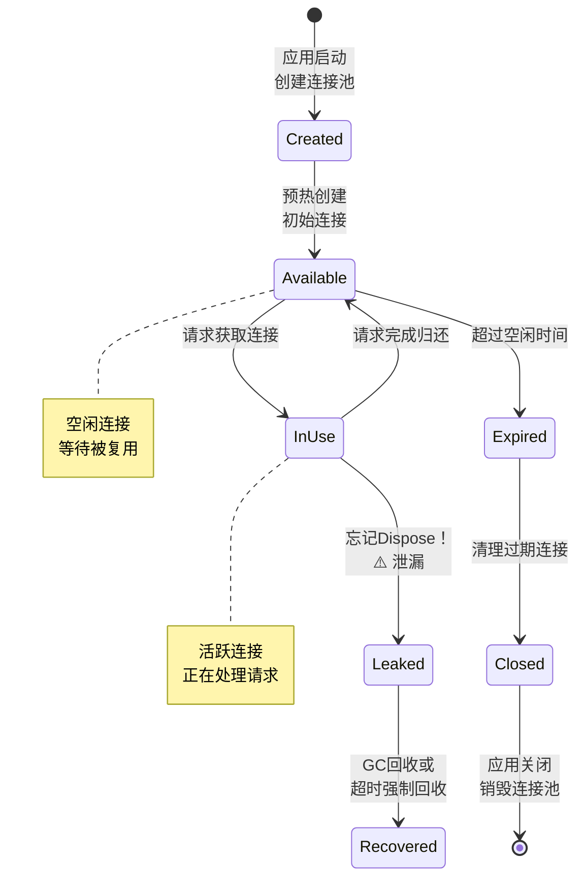

# 连接池与资源管理

> **学习目标**：深入理解.NET中各类连接池的工作原理，掌握HttpClient、数据库连接、DbContext等关键资源的正确管理方式，能够诊断和解决连接泄露、连接耗尽等生产环境问题。

## 目录

- [1. 理解连接池的本质](#1-理解连接池的本质)
  - [1.1 为什么需要连接池](#11为什么需要连接池)
  - [1.2 连接池的生命周期](#12连接池的生命周期)
  - [1.3 连接池的内部结构](#13连接池的内部结构)
- [2. HttpClient连接池管理](#2-httpclient连接池管理)
  - [2.1 Socket exhaustion问题](#21-socket-exhaustion问题)
  - [2.2 IHttpClientFactory的正确使用](#22-ihttpclientfactory的正确使用)
  - [2.3 高级配置与最佳实践](#23-高级配置与最佳实践)
- [3. 数据库连接池深度解析](#3-数据库连接池深度解析)
  - [3.1 SqlConnection连接池机制](#31-sqlconnection连接池机制)
  - [3.2 连接字符串参数详解](#32-连接字符串参数详解)
  - [3.3 连接耗尽排查指南](#33-连接耗尽排查指南)
- [4. DbContext连接池](#4-dbcontext连接池)
- [5. 资源释放模式](#5-资源释放模式)
- [6. SemaphoreSlim并发控制](#6-semaphoreslim并发控制)
- [7. 完整实战案例](#7-完整实战案例)
- [8. 常见陷阱与检查清单](#8-常见陷阱与检查清单)
- [9. 练习题](9-练习题)

---

## 1. 理解连接池的本质

### 1.1 为什么需要连接池

```
┌─────────────────────────────────────────────────────────────┐
│                  没有连接池 vs 有连接池                        │
├──────────────────────────┬───────────────────────────────────┤
│      每次新建连接          │         使用连接池                │
│                          │                                   │
│ 请求1 → 建立连接(100ms)   │ 请求1 → 从池中取(0.01ms)         │
│       → 使用(50ms)        │       → 使用(50ms)               │
│       → 关闭连接(100ms)   │       → 归还到池(0.01ms)         │
│                          │                                   │
│ 请求2 → 建立连接(100ms)   │ 请求2 → 从池中取(0.01ms)         │
│       → 使用(50ms)        │       → 使用(50ms)               │
│       → 关闭连接(100ms)   │       → 归还到池(0.01ms)         │
│                          │                                   │
│ 每次总耗时: ~250ms       │ 每次总耗时: ~50ms                │
│ TCP握手/TLS反复执行      │ 连接复用，省去握手开销            │
└──────────────────────────┴───────────────────────────────────┘

生活类比：
- 无连接池 = 每次打电话都要重新拨号（拨号+等待+通话+挂断）
- 有连接池 = 电话已经接通，拿起就能说，说完放回去别人还能用
```

### 1.2 连接池的生命周期



### 1.3 连接池的内部结构

```csharp
/// <summary>
/// 连接池核心概念（以SqlConnection为例）
/// </summary>
public class ConnectionPoolConcepts
{
    /*
     * ╔═════════════════════════════════════════════════════════╗
     * ║              连接池内部数据结构                          ║
     * ╠═════════════════════════════════════════════════════════╣
     * ║                                                       ║
     * ║  ┌─────────────────────────────────────────┐           ║
     * ║  │              连接池实例                   │           ║
     * ║  │                                         │           ║
     * ║  │  Max Pool Size: 100 (最大连接数)        │           ║
     * ║  │  Min Pool Size: 0  (最小保留数)         │           ║
     * ║  │  Current Count: 45                       │           ║
     * ║  │                                         │           ║
     * ║  │  ┌─ 空闲队列 (Free) ──────────────┐    │           ║
     * ║  │  │ Conn#1  Conn#5  Conn#12  ...    │    │           ║
     * ║  │  └──────────────────────────────────┘    │           ║
     * ║  │                                         │           ║
     * ║  │  ┌─ 活跃集合 (In Use) ─────────────┐    │           ║
     * ║  │  │ Conn#2  Conn#7  Conn#15  ...    │    │           ║
     * ║  │  └──────────────────────────────────┘    │           ║
     * ║  │                                         │           ║
     * ║  │  ┌─ 等待队列 (Waiting) ────────────┐    │           ║
     * ║  │  │ Thread-A  Thread-B  ...         │    │           ║
     * ║  │  └──────────────────────────────────┘    │           ║
     * ║  └─────────────────────────────────────────┘           ║
     * ╚═════════════════════════════════════════════════════════╝
     */
}
```

---

## 2. HttpClient连接池管理

### 2.1 Socket Exhaustion问题

这是.NET Framework时代最著名的"坑"之一。

```csharp
/// <summary>
/// ❌ 错误示范：直接new HttpClient导致的Socket耗尽
/// </summary>
public class BadHttpClientUsage
{
    /// <summary>
    /// 致命错误：每次请求都创建新的HttpClient
    /// </summary>
    public async Task<string> BadCallApiAsync(string url)
    {
        // ❌ 每次方法调用都new一个HttpClient
        // 问题：虽然HttpClient被Dispose了，
        // 但底层的TCP socket进入TIME_WAIT状态
        // 默认4分钟后才能被OS回收！
        using var client = new HttpClient();
        
        var response = await client.GetAsync(url);
        return await response.Content.ReadAsStringAsync();
    }
    
    /*
     * 后果：
     * - 高并发下短时间内耗尽可用端口（默认约5000-65535）
     * - 报错：Unable to connect to remote server / Only one usage...
     * - 即使停止请求，也要等几分钟才能恢复
     * 
     * 根本原因：
     * HttpClient继承自HttpMessageHandler
     * 内部管理着连接池（SocketsHttpHandler）
     * 频繁创建/销毁导致socket无法及时释放
     */
}

/// <summary>
    /// ⚠️ 另一种常见错误：静态单例但从不更新DNS
    /// </summary>
public class StaticHttpClientProblem
{
    // ⚠️ 虽然避免了Socket耗尽，但有DNS缓存问题
    private static readonly HttpClient _client = new();
    
    /*
     * 问题：_client永远不会被替换
     * 如果目标服务的IP地址变化（如Kubernetes Pod重启），
     * 这个静态实例会一直使用旧的IP直到进程重启。
     * 
     * 解决方案：使用IHttpClientFactory（自动处理生命周期和DNS刷新）
     */
}
```

### 2.2 IHttpClientFactory的正确使用

`IHttpClientFactory` 是 .NET Core 2.1 引入的解决方案，完美解决上述所有问题。

```csharp
/// <summary>
/// Program.cs - 注册IHttpClientFactory服务
/// </summary>
public static class HttpClientFactoryConfig
{
    /// <summary>
    /// 方式1：基本注册（最简单）
    /// </summary>
    public static void AddBasicClient(IServiceCollection services, IConfiguration config)
    {
        services.AddHttpClient(); // 注册IHttpClientFactory本身
        
        // 或者注册命名客户端
        services.AddHttpClient("ApiService", client =>
        {
            client.BaseAddress = new Uri(config["ApiBaseUrl"]!);
            client.Timeout = TimeSpan.FromSeconds(30);
            client.DefaultRequestHeaders.Accept.Add(
                new MediaTypeWithQualityHeaderValue("application/json"));
        });
    }

    /// <summary>
    /// 方式2：带Polly重试策略的完整配置
    /// </summary>
    public static void AddResilientClient(IServiceCollection services, IConfiguration config)
    {
        services.AddHttpClient("ResilientApi", client =>
        {
            client.BaseAddress = new Uri(config["ApiBaseUrl"]!);
            client.Timeout = TimeSpan.FromSeconds(30);
        })
        // 配置SocketsHttpHandler的连接池
        .ConfigurePrimaryHttpMessageHandler(() => new SocketsHttpHandler
        {
            // 连接池配置
            PooledConnectionLifetime = TimeSpan.FromMinutes(5),  // 连接最大存活时间
            PooledConnectionIdleTimeout = TimeSpan.FromMinutes(2), // 空闲超时
            MaxConnectionsPerServer = 20,                         // 每个服务器最大连接数
            
            // 启用TLS证书验证
            SslOptions = new SslClientAuthenticationOptions
            {
                RemoteCertificateValidationCallback = 
                    (sender, cert, chain, errors) => errors == System.Net.Security.SslPolicyErrors.None
            },
            
            // 自动解压缩
            AutomaticDecompression = DecompressionMethods.GZip | DecompressionMethods.Deflate,
            
            // Cookie处理
            UseCookies = false, // API通常不需要Cookie
            
            // 保持活动状态检测
            KeepAlivePingPolicy = HttpKeepAlivePingPolicy.WithActiveRequests,
            KeepAlivePingTimeout = TimeSpan.FromSeconds(10),
            KeepAlivePingDelay = TimeSpan.FromSeconds(25)
        })
        // 添加Polly策略
        .AddTransientHttpErrorPolicy(policy => policy
            .WaitAndRetryAsync(
                retryCount: 3,
                sleepDurationProvider: attempt => TimeSpan.FromSeconds(Math.Pow(2, attempt)),
                onRetry: (outcome, delay, attempt, ctx) =>
                {
                    Console.WriteLine($"重试 {attempt}/{3}，延迟 {delay.TotalSeconds}s");
                }))
        .AddPolicyHandler(Policy.TimeoutAsync<HttpResponseMessage>(TimeSpan.FromSeconds(30)));
    }

    /// <summary>
    /// 方式3：类型化客户端（推荐用于业务代码）
    /// </summary>
    public static void AddTypedClients(IServiceCollection services)
    {
        services.AddHttpClient<IProductApiClient, ProductApiClient>(client =>
        {
            client.BaseAddress = new Uri("https://api.products.com/");
            client.Timeout = TimeSpan.FromSeconds(10);
        })
        .AddHttpMessageHandler<AuthHeaderHandler>(); // 添加自定义消息处理器
    }
}

// ==================== 类型化客户端实现 ====================

/// <summary>
/// 类型化HTTP客户端：将API调用封装为强类型接口
/// </summary>
public interface IProductApiClient
{
    Task<ProductDto?> GetByIdAsync(int id, CancellationToken ct = default);
    Task<List<ProductDto>> SearchAsync(string query, CancellationToken ct = default);
    Task<PagedResult<ProductDto>> GetPagedAsync(int page, int size, CancellationToken ct = default);
}

/// <summary>
/// 类型化客户端实现：由DI容器管理生命周期
/// </summary>
public class ProductApiClient : IProductApiClient
{
    private readonly HttpClient _httpClient;
    private readonly ILogger<ProductApiClient> _logger;
    
    // HttpClient由IHttpClientFactory注入，自动管理连接池
    public ProductApiClient(HttpClient httpClient, ILogger<ProductApiClient> logger)
    {
        _httpClient = httpClient;
        _logger = logger;
    }

    public async Task<ProductDto?> GetByIdAsync(int id, CancellationToken ct = default)
    {
        try
        {
            var response = await _httpClient.GetAsync($"products/{id}", ct);
            
            if (!response.IsSuccessStatusCode)
            {
                if (response.StatusCode == HttpStatusCode.NotFound)
                    return null;
                    
                response.EnsureSuccessStatusCode();
            }

            var json = await response.Content.ReadAsStringAsync(ct);
            return JsonSerializer.Deserialize<ProductDto>(json);
        }
        catch (HttpRequestException ex)
        {
            _logger.LogError(ex, "获取商品{id}失败", id);
            throw;
        }
    }

    public async Task<List<ProductDto>> SearchAsync(string query, CancellationToken ct = default)
    {
        var response = await _httpClient.GetAsync($"products/search?q={Uri.EscapeDataString(query)}", ct);
        response.EnsureSuccessStatusCode();

        var json = await response.Content.ReadAsStringAsync(ct);
        var result = JsonSerializer.Deserialize<SearchResult>(json);
        return result?.Items ?? new List<ProductDto>();
    }

    public async Task<PagedResult<ProductDto>> GetPagedAsync(int page, int size, CancellationToken ct = default)
    {
        var response = await _httpClient.GetAsync($"products?page={page}&size={size}", ct);
        response.EnsureSuccessStatusCode();

        var json = await response.Content.ReadAsStringAsync(ct);
        return JsonSerializer.Deserialize<PagedResult<ProductDto>>(json)!;
    }
}

/// <summary>
/// 自定义消息处理器示例：自动添加认证头
/// </summary>
public class AuthHeaderHandler : DelegatingHandler
{
    private readonly ITokenProvider _tokenProvider;

    public AuthHeaderHandler(ITokenProvider tokenProvider)
    {
        _tokenProvider = tokenProvider;
    }

    protected override async Task<HttpResponseMessage> SendAsync(HttpRequestMessage request, CancellationToken cancellationToken)
    {
        // 在每个请求前添加最新的Token
        var token = await _tokenProvider.GetAccessTokenAsync(cancellationToken);
        request.Headers.Authorization = new AuthenticationHeaderValue("Bearer", token);

        return await base.SendAsync(request, cancellationToken);
    }
}

public record ProductDto(int Id, string Name, decimal Price);
public record SearchResult(List<ProductDto> Items);
public record PagedResult<T>(List<T> Items, int TotalCount, int Page, int PageSize);
public interface ITokenProvider { Task<string> GetAccessTokenAsync(CancellationToken ct); }
```

### 2.3 高级配置与最佳实践

```csharp
/// <summary>
/// HttpClient高级配置场景
/// </summary>
public class HttpClientAdvancedConfig
{
    /// <summary>
    /// 场景1：多环境支持（开发/测试/生产不同BaseAddress）
    /// </summary>
    public static void AddMultiEnvironmentClient(IServiceCollection services, IConfiguration config)
    {
        services.AddHttpClient("PaymentGateway", client =>
        {
            // 从配置读取不同环境的地址
            var baseUrl = config.GetSection("PaymentGateway")["BaseUrl"];
            client.BaseAddress = new Uri(baseUrl!);
            client.Timeout = TimeSpan.FromSeconds(15);
        })
        .ConfigurePrimaryHttpMessageHandler(() =>
        {
            // 支付网关需要特殊SSL配置
            var handler = new SocketsHttpHandler
            {
                PooledConnectionLifetime = TimeSpan.FromMinutes(10),
                MaxConnectionsPerServer = 10
            };
            return handler;
        });
    }

    /// <summary>
    /// 场景2：文件下载专用客户端（大响应体）
    /// </summary>
    public static void AddDownloadClient(IServiceCollection services)
    {
        services.AddHttpClient("FileDownloader")
        .ConfigurePrimaryHttpMessageHandler(() => new SocketsHttpHandler
        {
            PooledConnectionLifetime = TimeSpan.FromMinutes(2),
            MaxConnectionsPerServer = 5, // 文件下载不需要太多并行连接
        })
        .ConfigureHttpClient(client =>
        {
            // 大文件下载可能需要更长的超时
            client.Timeout = TimeSpan.FromMinutes(5);
        });
    }

    /// <summary>
    /// 场景3：高吞吐量API调用客户端
    /// </summary>
    public static void AddHighThroughputClient(IServiceCollection services)
    {
        services.AddHttpClient("HighThroughputApi")
        .ConfigurePrimaryHttpMessageHandler(() => new SocketsHttpHandler
        {
            PooledConnectionLifetime = TimeSpan.FromMinutes(1),  // 短生命周期，频繁刷新
            PooledConnectionIdleTimeout = TimeSpan.FromSeconds(30),
            MaxConnectionsPerServer = int.MaxValue,             // 不限制连接数
            EnableMultipleHttp2Connections = true               // HTTP/2多路复用
        });
    }
}
```

---

## 3. 数据库连接池深度解析

### 3.1 SqlConnection连接池机制

ADO.NET 的 `SqlConnection` 内置了强大的连接池功能，由 `DbConnectionPoolGroupManager` 管理。

```csharp
/// <summary>
/// SqlConnection连接池工作原理演示
/// </summary>
public class SqlConnectionPoolDemo
{
    /// <summary>
    /// 正确的使用方式：每次操作都创建新Connection，让池来管理复用
    /// </summary>
    public async Task<int> ExecuteQueryCorrectlyAsync(string connectionString)
    {
        // ✅ 正确：每次使用using创建新连接对象
        // Close()时连接不会真正关闭，而是归还到池中
        using var connection = new SqlConnection(connectionString);
        
        await connection.OpenAsync(); // 可能从池中取出已有连接
        
        using var command = new SqlCommand("SELECT COUNT(*) FROM Products", connection);
        var count = (int)await command.ExecuteScalarAsync()!;
        
        // Dispose时：连接归还到池中（不是真的关闭TCP连接！）
        return count;
        
        /*
         * 第一次调用：
         * 1. new SqlConnection → 创建连接对象（轻量）
         * 2. OpenAsync() → 池中没有连接 → 创建真实TCP连接 + 认证（慢）
         * 3. 执行SQL
         * 4. Dispose → 归还连接到池
         * 
         * 第二次调用：
         * 1. new SqlConnection → 创建连接对象（轻量）
         * 2. OpenAsync() → 从池中取出已存在的连接（极快！跳过TCP握手）
         * 3. 执行SQL
         * 4. Dispose → 再次归还
         */
    }

    /// <summary>
    /// 观察连接池行为
    /// </summary>
    public async Task ObservePoolBehaviorAsync(string connectionString)
    {
        Console.WriteLine("=== 连接池行为观察 ===");
        
        // 清空连接池（仅用于测试！）
        SqlConnection.ClearPool(new SqlConnection(connectionString));
        
        var sw = Stopwatch.StartNew();
        
        // 第1个连接：冷启动
        sw.Restart();
        using (var conn1 = new SqlConnection(connectionString))
        {
            await conn1.OpenAsync();
            Console.WriteLine($"第1次Open: {sw.ElapsedMilliseconds}ms (含TCP建立)");
        }
        
        // 第2个连接：应该从池中获取
        sw.Restart();
        using (var conn2 = new SqlConnection(connectionString))
        {
            await conn2.OpenAsync();
            Console.WriteLine($"第2次Open: {sw.ElapsedMilliseconds}ms (从池中获取)");
        }
        
        // 并发获取多个连接
        var tasks = Enumerable.Range(0, 10).Select(async i =>
        {
            sw.Restart();
            using var conn = new SqlConnection(connectionString);
            await conn1.OpenAsync();
            Console.WriteLine($"  并发#{i}: {sw.ElapsedMilliseconds}ms");
        }).ToArray();
        
        await Task.WhenAll(tasks);
    }
}
```

### 3.2 连接字符串参数详解

```csharp
/// <summary>
/// 数据库连接字符串参数完整参考
/// </summary>
public static class ConnectionStringParams
{
    /*
     * ╔══════════════════════╦══════════════════════════════════╗
     * ║ 参数                 ║ 说明                              ║
     * ╠═════════════════════╬══════════════════════════════════╣
     * ║                     ║                                  ║
     * ║ 【连接池控制】       ║                                  ║
     * ╠═════════════════════╬══════════════════════════════════╣
     * ║ Max Pool Size       ║ 最大连接数（默认100）             ║
     * ║ Min Pool Size       ║ 最小保留连接数（默认0）           ║
     * ║ Pooling             ║ 是否启用连接池（默认true）        ║
     * ║ Connection Lifetime ║ 连接最大存活时间（默认0=无限）    ║
     * ║ Connection Reset    ║ 归还时是否重置连接（默认true）    ║
     * ║                     ║                                  ║
     * ║ 【超时控制】         ║                                  ║
     * ╠═════════════════════╬══════════════════════════════════╣
     * ║ Connect Timeout     ║ 连接超时秒数（默认15）           ║
     * ║ Command Timeout     ║ 命令执行超时秒数（默认30）        ║
     * ║                     ║                                  ║
     * ║ 【安全选项】         ║                                  ║
     * ╠═════════════════════╬══════════════════════════════════╣
     * ║ Encrypt             ║ 加密连接（推荐true）             ║
     * ║ TrustServerCert     ║ 信任服务器证书（仅开发用false）   ║
     * ║ Integrated Security ║ Windows认证                      ║
     * ║ User ID / Password  ║ SQL认证                          ║
     * ╚═════════════════════╩══════════════════════════════════╝
     */

    /// <summary>
    /// 生产环境推荐连接字符串模板
    /// </summary>
    public const string ProductionTemplate =
        "Server={server},{port};" +
        "Database={database};" +
        "User Id={user};Password={password};" +
        "TrustServerCertificate=False;" +
        "Encrypt=True;" +
        "Max Pool Size={max_pool_size};" +
        "Min Pool Size={min_pool_size};" +
        "Connection Timeout={connect_timeout};" +
        "Command Timeout={command_timeout};" +
        "Pooling=true;" +
        "Connection Reset=true;";

    /// <summary>
    /// 不同场景的推荐值
    /// </summary>
    public static class RecommendedValues
    {
        // 低流量应用（内部工具、管理后台）
        public static readonly string LowTraffic = ProductionTemplate
            .Replace("{max_pool_size}", "20")
            .Replace("{min_pool_size}", "0")
            .Replace("{connect_timeout}", "15")
            .Replace("{command_timeout}", "60");

        // 中等流量Web API
        public static readonly string MediumTraffic = ProductionTemplate
            .Replace("{max_pool_size}", "100")
            .Replace("{min_pool_size}", "5")
            .Replace("{connect_timeout}", "10")
            .Replace("{command_timeout}", "30");

        // 高流量API服务
        public static readonly string HighTraffic = ProductionTemplate
            .Replace("{max_pool_size}", "200")
            .Replace("{min_pool_size}", "10")
            .Replace("{connect_timeout}", "5")
            .Replace("{command_timeout}", "30");

        // 长运行批处理任务
        public static readonly string BatchJob = ProductionTemplate
            .Replace("{max_pool_size}", "10")
            .Replace("{min_pool_size}", "2")
            .Replace("{connect_timeout}", "30")
            .Replace("{command_timeout}", "300"); // 允许长时间查询
    }
}
```

### 3.3 连接耗尽排查指南

```csharp
/// <summary>
/// 连接耗尽(Connection Pool Exhaustion)问题诊断
/// </summary>
public class ConnectionExhaustionDiagnostics
{
    /// <summary>
    /// 症状识别
     /// </summary>
    public static readonly string[] Symptoms = new[]
    {
        "Timeout expired. The timeout period elapsed prior to obtaining a connection from the pool.",
        "The connection pool has been reached and the maximum number of connections has been reached.",
        "A transport-level error has occurred when receiving results from the server.",
        "System.InvalidOperationException: Timeout expired."
    };

    /// <summary>
    /// 排查步骤
    /// </summary>
    public static async Task DiagnoseAsync()
    {
        // 步骤1：使用性能计数器监控连接池状态
        await MonitorPoolCounters();

        // 步骤2：检查是否有未关闭的连接
        await DetectLeakedConnections();

        // 步骤3：分析连接使用模式
        AnalyzeConnectionPatterns();
    }

    private static async Task MonitorPoolCounters()
    {
        /*
         * 使用dotnet-counters监控SQL Server连接池指标：
         * 
         * dotnet counters monitor -p <PID> --counters System.Data
         * 
         * 关键指标：
         * - sqlserver-pooler-active-pool-count: 当前活跃连接池数量
         * - sqlserver-pooler-total-pooled-connections: 池中总连接数
         * - sqlserver-pooler-idle-pooled-connections: 空闲连接数
         * 
         * 异常信号：
         * - idle接近0且total达到Max Pool Size → 连接池满
         * - total持续增长但不下降 → 可能有泄漏
         */
    }

    private static async Task DetectLeakedConnections()
    {
        // 使用EF Core拦截器检测长生命周期连接
        /*
        services.AddDbContext<AppDbContext>(options =>
        {
            options.UseSqlServer(connectionString);
            options.AddInterceptors(new LongRunningConnectionInterceptor(thresholdSeconds: 30));
        });
        */
    }

    private static void AnalyzeConnectionPatterns()
    {
        /*
         * 常见导致连接耗尽的根因：
         * 
         * 1. 未Dispose的DbContext/SqlConnection
         *    → 确保所有数据库操作都在using块中
         * 
         * 2. 长时间运行的查询占用连接
         *    → 设置合理的Command Timeout
         *    → 优化慢查询（参见数据库优化章节）
         * 
         * 3. 并发度过高
         *    → 增加Max Pool Size
         *    → 或减少并发请求数（SemaphoreSlim限流）
         * 
         * 4. 连接字符串不一致
         *    → 不同的连接字符串会创建不同的连接池！
         *    → 确保整个应用使用相同的连接字符串
         * 
         * 5. 异步代码中的同步阻塞
         *    → .Result/.Wait阻塞线程，连接无法释放
         *    → 全程async/await
         */
    }
}

/// <summary>
/// 长时间运行连接检测拦截器
/// </summary>
public class LongRunningConnectionInterceptor : DbCommandInterceptor
{
    private readonly int _thresholdSeconds;
    private readonly ILogger<LongRunningConnectionInterceptor> _logger;

    public LongRunningConnectionInterceptor(int thresholdSeconds, ILogger<LongRunningConnectionInterceptor> logger)
    {
        _thresholdSeconds = thresholdSeconds;
        _logger = logger;
    }

    public override ValueTask<DbDataReader> ReaderExecutedAsync(
        DbCommand command,
        CommandExecutedEventData eventData,
        DbDataReader result,
        CancellationToken cancellationToken = default)
    {
        if (eventData.Duration > TimeSpan.FromSeconds(_thresholdSeconds))
        {
            _logger.LogWarning(
                "🐌 长时间运行的数据库命令: {DurationMs}ms\n" +
                "SQL: {Sql}\n" +
                "来源: {SourceLine}",
                eventData.Duration.TotalMilliseconds,
                command.CommandText[..Math.Min(command.CommandText.Length, 200)],
                eventData.GetSourceLine());
        }

        return base.ReaderExecutedAsync(command, eventData, result, cancellationToken);
    }
}
```

---

## 4. DbContext连接池

EF Core的 `AddDbContextPool` 可以复用 `DbContext` 实例，避免重复初始化开销。

```csharp
/// <summary>
/// DbContext池化配置对比
/// </summary>
public class DbContextPoolConfig
{
    /// <summary>
    /// 方式1：标准方式（每次请求创建新DbContext）
    /// </summary>
    public static void AddStandardDbContext(IServiceCollection services, string connectionString)
    {
        services.AddDbContext<AppDbContext>(options =>
        {
            options.UseSqlServer(connectionString);
            // 每次注入都会创建新的DbContext实例
            // 适合：大多数Web API场景
        }, 
        ServiceLifetime.Scoped); // 默认Scoped（每个请求一个实例）
    }

    /// <summary>
    /// 方式2：池化方式（复用DbContext实例）
    /// 性能提升：约2-3倍（取决于模型复杂度）
    /// </summary>
    public static void AddPooledDbContext(IServiceCollection services, string connectionString)
    {
        services.AddDbContextPool<AppDbContext>(options =>
        {
            options.UseSqlServer(connectionString);
        },
        poolSize: 128); // 池大小（根据并发度调整）

        /*
         * 工作原理：
         * 1. 应用启动时预创建N个DbContext实例
         * 2. 请求到来时从池中取出一个（不创建新实例）
         * 3. 请求结束时Reset并归还到池
         * 4. 避免了DbContext的重复初始化（模型构建很耗时）
         * 
         * 注意事项：
         * - 不要在构造函数中做有状态的初始化
         * - 不要在OnConfiguring中修改连接字符串
         * - Reset后所有变更追踪器会被清空
         */
    }

    /// <summary>
     /// 方式3：池化 + 单例（特殊场景）
     /// 用于后台服务等非Web场景
     /// </summary>
    public static void AddPooledSingletonDbContext(IServiceCollection services, string connectionString)
    {
        services.AddDbContextPool<AppDbContext>(options =>
        {
            options.UseSqlServer(connectionString);
        }).AddSingleton<IRepository, Repository>();
        // 注意：DbContext本身不是Singleton，只是池化的
    }
}

/// <summary>
/// DbContext池的正确使用注意事项
/// </summary>
public class DbContextPoolBestPractices
{
    /// <summary>
     /// ✅ 正确做法：无状态的DbContext使用
     /// </summary>
    public class GoodRepository : IRepository
    {
        private readonly AppDbContext _context;

        public GoodRepository(AppDbContext context)
        {
            _context = context;
        }

        public async Task<User?> GetUserAsync(int id)
        {
            // 每次使用都是干净的上下文
            return await _context.Users.FindAsync(id);
        }
    }

    /// <summary>
     /// ❌ 错误做法：在构造函数中做有状态初始化
     /// </summary>
    public class BadRepository : IRepository
    {
        private readonly AppDbContext _context;
        private readonly string _tenantId; // 这在池化模式下会有问题！

        public BadRepository(AppDbContext context, ITenantAccessor tenantAccessor)
        {
            _context = context;
            // ⚠️ 危险：这个值会在池化复用时"残留"
            _tenantId = tenantAccessor.GetCurrentTenantId();
            
            // 更危险的操作：
            // _context.Database.SetCommandTimeout(300); // 会影响后续使用者！
        }
    }

    /// <summary>
     /// ✅ 正确做法：在使用时设置状态
     /// </summary>
    public class GoodTenantAwareRepository : IRepository
    {
        private readonly AppDbContext _context;
        private readonly IServiceScopeFactory _scopeFactory;

        public GoodTenantAwareRepository(AppDbContext context, IServiceScopeFactory scopeFactory)
        {
            _context = context;
            _scopeFactory = scopeFactory;
        }

        public async Task<List<Order>> GetOrdersAsync()
        {
            // 每次使用前确保正确的租户过滤
            var tenantId = GetCurrentTenantId(); // 动态获取
            
            return await _context.Orders
                .Where(o => o.TenantId == tenantId)
                .ToListAsync();
        }
    }

    private static string GetCurrentTenantId() => "tenant-001";
}

public interface IRepository {}
public interface ITenantAccessor { string GetCurrentTenantId(); }
```

---

## 5. 资源释放模式

### IDisposable vs IAsyncDisposable

```csharp
/// <summary>
/// 资源释放模式的完整指南
/// </summary>
public class ResourceDisposalPatterns
{
    /// <summary>
    /// 模式1：同步IDisposable - 适用于快速释放的资源
    /// </summary>
    public void SyncDisposalExample()
    {
        // ✅ 标准using语句（编译器生成try-finally）
        using var stream = File.OpenRead("data.txt");
        var data = new byte[stream.Length];
        stream.Read(data, 0, data.Length);
        // stream.Dispose() 在此处自动调用
    }

    /// <summary>
    /// 模式2：异步IAsyncDisposable - 适用于IO密集型资源的释放
    /// </summary>
    public async Task AsyncDisposalExample()
    {
        // C# 8.0+: 支持await using
        await using var stream = new FileStream(
            "largefile.dat",
            FileMode.Open,
            FileAccess.Read,
            FileShare.None,
            bufferSize: 65536,
            FileOptions.Asynchronous | FileOptions.SequentialScan);

        var buffer = new byte[64 * 1024];
        int bytesRead;
        while ((bytesRead = await stream.ReadAsync(buffer)) > 0)
        {
            ProcessChunk(buffer.AsMemory(0, bytesRead));
        }
        // stream.DisposeAsync() 在此处自动调用
    }

    private void ProcessChunk(Memory<byte> chunk) { }

    /// <summary>
    /// 模式3：同时实现两个接口（推荐做法）
    /// </summary>
    public class DualDisposableResource : IDisposable, IAsyncDisposable
    {
        private bool _disposed;
        private FileStream? _stream;
        private HttpClient? _client;

        public DualDisposableResource()
        {
            _stream = new FileStream("temp.dat", FileMode.Create);
            _client = new HttpClient();
        }

        /// <summary>
        /// 同步Dispose：快速释放托管资源
        /// </summary>
        public void Dispose()
        {
            Dispose(disposing: true);
            GC.SuppressFinalize(this);
        }

        /// <summary>
        /// 异步Dispose：优先使用此方法
        /// </summary>
        public async ValueTask DisposeAsync()
        {
            // 先异步释放IO密集型资源
            if (_stream != null)
            {
                await _stream.DisposeAsync().ConfigureAwait(false);
                _stream = null;
            }

            // 再同步释放其他资源
            Dispose(disposing: false);
            GC.SuppressFinalize(this);
        }

        protected virtual void Dispose(bool disposing)
        {
            if (_disposed) return;

            if (disposing)
            {
                // 释放托管资源
                _client?.Dispose();
                _client = null;
            }

            // 释放非托管资源（如果有）
            _disposed = true;
        }
    }

    /// <summary>
    /// 模式4：工厂模式 + 作用域管理
    /// </summary>
    public async Task FactoryPatternExample()
    {
        // 使用IServiceScopeFactory创建独立的作用域
        // 确保Scoped服务正确释放
        /*
        using var scope = _scopeFactory.CreateScope();
        var service = scope.ServiceProvider.GetRequiredService<HeavyResourceService>();
        await service.DoWorkAsync();
        // scope.Dispose() 时所有Scoped服务都被释放
        */
    }
}
```

---

## 6. SemaphoreSlim并发控制

`SemaphoreSlim` 是控制对有限资源并发访问的最佳选择。

```csharp
/// <summary>
/// SemaphoreSlim 完整使用指南
/// </summary>
public class SemaphoreSlimExamples
{
    /// <summary>
    /// 基础用法：限制对外部API的并发调用
    /// </summary>
    private readonly SemaphoreSlim _apiRateLimiter = new(initialCount: 5, maxCount: 5);

    public async Task<T> CallExternalApiWithRateLimit<T>(
        Func<Task<T>> apiCall,
        CancellationToken ct = default)
    {
        // 等待获取许可（最多5个并发调用）
        await _apiRateLimiter.WaitAsync(ct);
        try
        {
            return await apiCall();
        }
        finally
        {
            _apiRateLimiter.Release(); // 释放许可
        }
    }

    /// <summary>
    /// 进阶用法：带超时的限流
    /// </summary>
    public async Task<bool> TryCallWithTimeoutAsync(
        Func<Task> action,
        TimeSpan maxWaitTime,
        CancellationToken ct = default)
    {
        // 尝试在指定时间内获取许可
        var acquired = await _apiRateLimiter.WaitAsync(maxWaitTime, ct);
        if (!acquired)
        {
            // 超时未获得许可：系统繁忙，拒绝请求
            Console.WriteLine("系统繁忙，请稍后再试");
            return false;
        }

        try
        {
            await action();
            return true;
        }
        finally
        {
            _apiRateLimiter.Release();
        }
    }

    /// <summary>
    /// 高级模式：动态调整并发限制
    /// </summary>
    public class AdaptiveConcurrencyController
    {
        private readonly SemaphoreSlim _semaphore;
        private int _currentLimit;
        private readonly int _minLimit;
        private readonly int _maxLimit;
        private readonly object _lock = new();

        public AdaptiveConcurrencyController(int initialLimit, int minLimit, int maxLimit)
        {
            _currentLimit = initialLimit;
            _minLimit = minLimit;
            _maxLimit = maxLimit;
            _semaphore = new SemaphoreSlim(initialLimit, maxLimit);
        }

        /// <summary>
        /// 根据系统负载动态调整并发限制
        /// </summary>
        public void AdjustLimit(double cpuUsage, double memoryUsage)
        {
            lock (_lock)
            {
                int newLimit = _currentLimit;

                if (cpuUsage > 80 || memoryUsage > 85)
                {
                    // 高负载：降低并发
                    newLimit = Math.Max(_minLimit, _currentLimit - 2);
                }
                else if (cpuUsage < 40 && memoryUsage < 50 && _currentLimit < _maxLimit)
                {
                    // 低负载：增加并发
                    newLimit = Math.Min(_maxLimit, _currentLimit + 1);
                }

                if (newLimit != _currentLimit)
                {
                    Console.WriteLine($"并发限制调整: {_currentLimit} → {newLimit}");
                    
                    // 释放多余的槽位（如果降低）
                    for (int i = _currentLimit; i > newLimit; i--)
                    {
                        try { _semaphore.Release(); } catch { }
                    }
                    
                    _currentLimit = newLimit;
                }
            }
        }

        public async Task<T> ExecuteAsync<T>(Func<Task<T>> operation, CancellationToken ct = default)
        {
            await _semaphore.WaitAsync(ct);
            try
            {
                return await operation();
            }
            finally
            {
                _semaphore.Release();
            }
        }
    }
}
```

---

## 7. 完整实战案例

### 高并发电商系统的连接池调优

```csharp
/// <summary>
/// 完整的生产级资源配置方案
/// 整合HttpClient、数据库连接、并发控制的综合案例
/// </summary>
public class ProductionResourceSetup
{
    /// <summary>
    /// Program.cs 完整配置
    /// </summary>
    public static void ConfigureAllResources(WebApplicationBuilder builder)
    {
        var config = builder.Configuration;

        // ========== 1. HTTP Client Factory ==========
        ConfigureHttpClients(builder.Services, config);

        // ========== 2. Database Context (池化) ==========
        ConfigureDbContext(builder.Services, config);

        // ========== 3. Redis (分布式缓存) ==========
        ConfigureRedis(builder.Services, config);

        // ========== 4. 并发控制器 ==========
        builder.Services.AddSingleton<IConcurrencyController, ConcurrencyController>();

        // ========== 5. 资源监控 ==========
        builder.Services.AddHostedService<ResourceMonitorService>();
    }

    private static void ConfigureHttpClients(IServiceCollection services, IConfiguration config)
    {
        // 商品服务客户端
        services.AddHttpClient(IProductServiceClient, client =>
        {
            client.BaseAddress = new Uri(config["Services:ProductApi:BaseUrl"]!);
            client.Timeout = TimeSpan.FromSeconds(10);
        })
        .ConfigurePrimaryHttpMessageHandler(() => new SocketsHttpHandler
        {
            PooledConnectionLifetime = TimeSpan.FromMinutes(5),
            PooledConnectionIdleTimeout = TimeSpan.FromMinutes(1),
            MaxConnectionsPerServer = 20
        })
        .AddPolicyHandler(GetRetryPolicy())
        .AddPolicyHandler(GetCircuitBreakerPolicy());

        // 支付网关客户端（更严格的控制）
        services.AddHttpClient(IPaymentGatewayClient, client =>
        {
            client.BaseAddress = new Uri(config["Services:Payment:BaseUrl"]!);
            client.Timeout = TimeSpan.FromSeconds(30);
        })
        .ConfigurePrimaryHttpMessageHandler(() => new SocketsHttpHandler
        {
            PooledConnectionLifetime = TimeSpan.FromMinutes(10),
            MaxConnectionsPerServer = 5, // 支付不需要太多连接
        });

        // 通知推送客户端
        services.AddHttpClient(INotificationClient, client =>
        {
            client.BaseAddress = new Uri(config["Services:Notification:BaseUrl"]!);
            client.Timeout = TimeSpan.FromSeconds(5);
        })
        .SetHandlerLifetime(TimeSpan.FromMinutes(2)); // 短生命周期
    }

    private static void ConfigureServices(IServiceCollection services, IConfiguration config)
    {
        var connectionString = config.GetConnectionString("DefaultConnection")!;
        
        // 使用池化DbContext
        services.AddDbContextPool<AppDbContext>(options =>
        {
            options.UseSqlServer(connectionString, sqlOptions =>
            {
                sqlOptions.CommandTimeout(30);
                sqlOptions.EnableRetryOnFailure(
                    maxRetryCount: 3,
                    maxRetryDelay: TimeSpan.FromSeconds(5),
                    errorNumbersToAdd: null);
            });
            
            // 添加性能相关拦截器
            options.AddInterceptors(new SlowQueryInterceptor(thresholdMs: 500));
            options.AddInterceptors(new DiagnosticsInterceptor());
        },
        poolSize: Math.Max(Environment.ProcessorCount * 4, 64)); // 根据CPU核数调整
    }

    private static IAsyncPolicy<HttpResponseMessage> GetRetryPolicy()
    {
        return Policy<HttpResponseMessage>
            .Handle<HttpRequestException>()
            .OrResult(r => (int)r.StatusCode >= 500 || r.StatusCode == HttpStatusCode.RequestTimeout)
            .WaitAndRetryAsync(
                retryCount: 3,
                sleepDurationProvider: attempt => TimeSpan.FromSeconds(Math.Pow(2, attempt)),
                onRetry: (outcome, delay, attempt, ctx) =>
                {
                    Console.WriteLine($"[HTTP] 重试 {attempt}/3, 延迟 {delay.TotalSeconds}s");
                });
    }

    private static IAsyncPolicy<HttpResponseMessage> GetCircuitBreakerPolicy()
    {
        return Policy<HttpResponseMessage>
            .Handle<HttpRequestException>()
            .OrResult(r => (int)r.StatusCode >= 500)
            .AdvancedCircuitBreakerAsync(
                failuresAllowedBeforeBreaking: 5,
                durationOfBreak: TimeSpan.FromSeconds(30),
                samplingDuration: TimeSpan.FromSeconds(10),
                minimumThroughput: 8,
                onBreak: (ex, duration) => Console.WriteLine("[CB] 断路器打开！"),
                onReset: () => Console.WriteLine("[CB] 断路器关闭"),
                onHalfOpen: () => Console.WriteLine("[CB] 半开状态测试"));
    }
}

/// <summary>
/// 并发控制器：统一管理系统资源访问
/// </summary>
public interface IConcurrencyController
{
    Task<T> RunWithDatabaseControlAsync<T>(Func<CancellationToken, Task<T>> operation, CancellationToken ct = default);
    Task<T> RunWithExternalApiControlAsync<T>(string serviceName, Func<CancellationToken, Task<T>> operation, CancellationToken ct = default);
}

public class ConcurrencyController : IConcurrencyController
{
    private readonly SemaphoreSlim _dbSemaphore;
    private readonly ConcurrentDictionary<string, SemaphoreSlim> _apiSemaphores;
    private readonly ILogger<ConcurrencyController> _logger;
    private readonly ConcurrencyConfig _config;

    public ConcurrencyController(ILogger<ConcurrencyController> logger, IOptions<ConcurrencyConfig> config)
    {
        _logger = logger;
        _config = config.Value;
        
        // 数据库并发控制
        _dbSemaphore = new SemaphoreSlim(_config.MaxConcurrentDbOperations, _config.MaxConcurrentDbOperations);
        
        // 各API服务的并发控制
        _apiSemaphores = new ConcurrentDictionary<string, SemaphoreSlim>();
    }

    public async Task<T> RunWithDatabaseControlAsync<T>(Func<CancellationToken, Task<T>> operation, CancellationToken ct = default)
    {
        await _dbSemaphore.WaitAsync(ct);
        try
        {
            return await operation(ct);
        }
        finally
        {
            _dbSemaphore.Release();
        }
    }

    public async Task<T> RunWithExternalApiControlAsync<T>(
        string serviceName, 
        Func<CancellationToken, Task<T>> operation, 
        CancellationToken ct = default)
    {
        var semaphore = _apiSemaphores.GetOrAdd(serviceName, _ => 
            new SemaphoreSlim(_config.MaxConcurrentApiCallsPerService, _config.MaxConcurrentApiCallsPerService));

        await semaphore.WaitAsync(ct);
        try
        {
            return await operation(ct);
        }
        finally
        {
            semaphore.Release();
        }
    }
}

public record ConcurrencyConfig(
    int MaxConcurrentDbOperations = 100,
    int MaxConcurrentApiCallsPerService = 20);

/// <summary>
/// 资源监控后台服务
/// </summary>
public class ResourceMonitorService : BackgroundService
{
    private readonly ILogger<ResourceMonitorService> _logger;
    private readonly PeriodicTimer _timer;

    public ResourceMonitorService(ILogger<ResourceMonitorService> logger)
    {
        _logger = logger;
        _timer = new PeriodicTimer(TimeSpan.FromSeconds(30));
    }

    protected override async Task ExecuteAsync(CancellationToken stoppingToken)
    {
        while (await _timer.WaitForNextTickAsync(stoppingToken))
        {
            try
            {
                LogResourceMetrics();
            }
            catch (Exception ex)
            {
                _logger.LogError(ex, "资源监控出错");
            }
        }
    }

    private void LogResourceMetrics()
    {
        // 监控线程池状态
        var completed = ThreadPool.CompletedWorkItemCount;
        var pending = ThreadPool.PendingWorkItemCount;
        var threads = ThreadPool.ThreadCount;

        // GC信息
        var gen0 = GC.CollectionCount(0);
        var gen1 = GC.CollectionCount(1);
        var gen2 = GC.CollectionCount(2);
        var memMB = GC.GetTotalMemory(false) / (1024 * 1024);

        _logger.LogInformation(
            "资源状态 | Threads={Threads}, Pending={Pending}, Completed={Completed} | " +
            "GC: Gen0={Gen0}, Gen1={Gen1}, Gen2={Gen2} | Memory={Memory}MB",
            threads, pending, completed, gen0, gen1, gen2, memMB);
    }
}
```

---

## 8. 常见陷阱与检查清单

### 陷阱清单

| 陷阱 | 症状 | 根因 | 解决方案 |
|-----|------|-----|---------|
| **new HttpClient()每次调用** | Socket耗尽 | TCP端口TIME_WAIT未释放 | 用IHttpClientFactory |
| **DbContext未Dispose** | 连接池耗尽 | 连接未归还 | 确保using/IoC Scope |
| **连接字符串微小差异** | 多余的连接池 | 空格/大小写/顺序不同 | 统一管理连接字符串 |
| **长事务持有连接** | 连接被长时间占用 | 事务未提交/回滚 | 缩短事务时长 |
| **异步方法中.Result** | 线程池饥饿+死锁 | 同步阻塞异步 | 全程async/await |
| **SemaphoreSlim忘记Release** | 信号量泄漏 | 异常路径未释放 | try/finally |

### 生产环境检查清单

```markdown
## 资源管理Checklist

### HttpClient
- [ ] 使用IHttpClientFactory而非手动new
- [ ] 配置合理的PooledConnectionLifetime
- [ ] 设置MaxConnectionsPerServer
- [ ] 添加Polly重试和熔断策略
- [ ] 类型化客户端封装API调用

### 数据库连接
- [ ] 使用AddDbContextPool（而非AddDbContext）
- [ ] Max Pool Size匹配预期并发度
- [ ] Connect Timeout合理（5-15s）
- [ ] Command Timeout合理（30-120s）
- [ ] 所有数据库操作在using块内
- [ ] 避免跨请求共享DbContext

### 并发控制
- [ ] 外部API调用有限流保护
- [ ] 数据库操作有并发上限
- [ ] SemaphoreSlim配对Wait/Release
- [ ] 有熔断降级机制

### 资源释放
- [ ] IO资源使用IAsyncDisposable
- [ ] Scoped服务不手动创建Singleton依赖
- [ ] BackgroundService正确实现StopAsync
- [ ] 定期监控连接池/线程池/GC指标
```

---

## 9. 练习题

### 练习1：连接泄露排查

**题目**：以下代码存在资源管理问题。请找出所有问题并提供修复方案：

```csharp
public class OrderService
{
    private readonly string _connString;
    private HttpClient _httpClient = new(); // 问题1?
    
    public OrderService(IConfiguration config)
    {
        _connString = config.GetConnectionString("OrderDb");
    }
    
    public async Task<Order> CreateOrderAsync(CreateOrderRequest req)
    {
        var conn = new SqlConnection(_connString); // 问题2?
        await conn.OpenAsync();
        
        var cmd = new SqlCommand("INSERT INTO Orders...", conn);
        await cmd.ExecuteNonQueryAsync();
        
        var paymentResult = await _httpClient.PostAsJsonAsync("https://pay.api/pay", req.Payment);
        // 问题3?
        
        return new Order { Id = /* 获取ID */ };
    }
    
    public async Task<List<Order>> GetUserOrdersAsync(int userId)
    {
        var conn = new SqlConnection(_connString);
        await conn.OpenAsync();
        
        var cmd = new SqlCommand("SELECT * FROM Orders WHERE UserId=@uid", conn);
        cmd.Parameters.AddWithValue("@uid", userId);
        
        using var reader = await cmd.ExecuteReaderAsync(); // 这里用了using
        var orders = new List<Order>();
        while (await reader.ReadAsync())
        {
            orders.Add(MapToOrder(reader));
        }
        
        return orders; // conn和cmd呢？
    }
}
```

**要求**：
1. 列出所有资源管理问题（至少5个）
2. 给出修复后的完整代码
3. 解释每个问题的后果

### 练习2：高并发连接池设计

**题目**：设计一个能支撑以下场景的资源管理系统：

- Web API服务，预计QPS=5000
- 每个请求平均需要：1次DB查询 + 2次外部API调用
- DB查询平均耗时50ms，API调用平均耗时200ms
- 需要防止任何单一故障点导致雪崩

**要求**：
1. 计算各连接池的合理大小
2. 设计完整的资源管理方案（代码）
3. 包含熔断、限流、降级策略
4. 提供监控指标采集点

### 练习3：连接池压力测试

**题目**：编写一个基准测试程序，模拟以下场景并收集数据：

1. 从0逐步增加到200并发用户
2. 每个用户循环发送请求持续60秒
3. 收集以下指标：
   - 平均/P99响应时间
   - 错误率
   - 连接池使用率
   - 内存/CPU使用率
4. 找出系统的最大承载能力（拐点）

**提示**：使用BenchmarkDotNet + NBomber/Wrk进行压测。

---

## 相关链接

- [[01-性能诊断工具]] - 使用dotnet-counters监控连接池指标
- [[03-异步编程深度指南]] - 异步资源释放模式
- [[04-数据库查询优化]] - 减少数据库连接占用时间
- [[07-高级并发编程]] - SemaphoreSlim与并发集合深入探讨

---

> **作者提示**：资源管理的黄金法则是——**谁创建，谁释放；谁申请，谁归还**。在现代ASP.NET Core中，依赖注入框架已经帮你管理了大部分资源的生命周期，你需要关注的是那些超出常规生命周期的资源（如跨请求的长连接、后台任务的资源）。记住：**连接池是朋友，但滥用它会变成敌人——监控它，理解它，善待它**。
