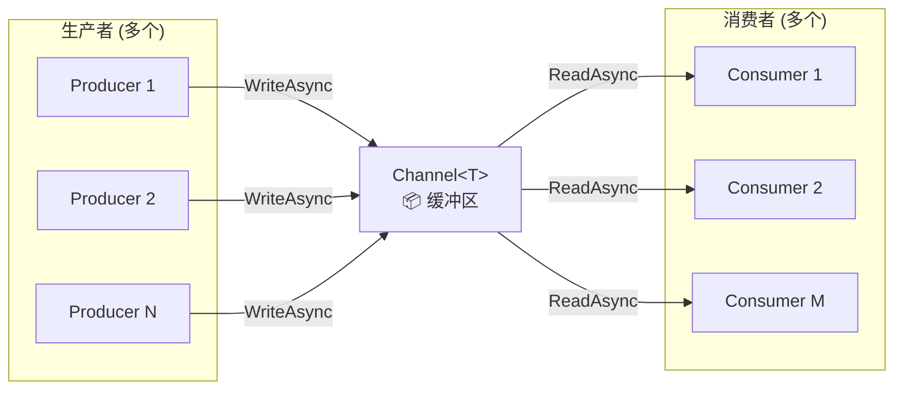

# 高级并发编程

> **学习目标**：深入理解.NET线程池和任务并行库的内部机制，掌握Channel、Dataflow等现代并发编程模型，能够设计并实现高性能、无锁竞争、可扩展的并发系统。

## 目录

- [1. 线程池深度解析](#1-线程池深度解析)
  - [1.1 ThreadPool的工作原理](#11-threadpool的工作原理)
  - [1.2 线程注入与回收机制](#12-线程注入与回收机制)
  - [1.3 线程池调优参数](#13-线程池调优参数)
- [2. 任务并行库(TPL)进阶](#2-任务并行库tpl进阶)
  - [2.1 Task.Run的正确使用](#21-taskrun的正确使用)
  - [2.2 Parallel类详解](#22-parallel类详解)
  - [2.3 ParallelOptions精细控制](#23-paralleloptions精细控制)
- [3. System.Threading.Channels](#3-systemthreadingchannels)
  - [3.1 Channel基础概念](#31-channel基础概念)
  - [3.2 有界通道与背压](#32-有界通道与背压)
  - [3.3 多生产者多消费者模式](#33-多生产者多消费者模式)
- [4. System.Threading.Tasks.Dataflow](#4-systemthreadingtasksdataflow)
  - [4.1 Dataflow核心块类型](#41-dataflow核心块类型)
  - [4.2 构建数据处理管道](#42-构建数据处理管道)
- [5. 并发集合详解](#5-并发集合详解)
- [6. 异步锁模式](#6-异步锁模式)
- [7. 死锁检测与避免](#7-死锁检测与避免)
- [8. 实战案例：高性能任务调度系统](#8-实战案例高性能任务调度系统)
- [9. 常见陷阱与性能对比](#9-常见陷阱与性能对比)
- [10. 练习题](10-练习题)

---

## 1. 线程池深度解析

### 1.1 ThreadPool的工作原理

```
┌─────────────────────────────────────────────────────────────────┐
│                    .NET ThreadPool 架构                          │
├─────────────────────────────────────────────────────────────────┤
│                                                                 │
│   ┌──────────────┐    ┌──────────────────────────────────────┐ │
│   │  应用程序代码  │───→│          全局工作队列 (FIFO)           │ │
│   │ Task.Run()   │    │  [TaskA][TaskB][TaskC][TaskD]...      │ │
│   │ async/await  │    └──────────────┬───────────────────────┘ │
│   │ Parallel.For │                   │                         │
│   └──────────────┘                   ▼                         │
│                              ┌─────────────────┐               │
│                              │   线程调度器     │               │
│                              │ (Hill Climbing) │               │
│                              └────────┬────────┘               │
│                                       │                        │
│                    ┌──────────────────┼──────────────────┐     │
│                    ▼                  ▼                  ▼     │
│            ┌─────────────┐  ┌─────────────┐  ┌─────────────┐  │
│            │ Worker #1   │  │ Worker #2   │  │ Worker #N   │  │
│            │ [I/O完成端口]│  │ [I/O完成端口]│  │ [I/O完成端口]│  │
│            └─────────────┘  └─────────────┘  └─────────────┘  │
│                                                                 │
│   核心特点：                                                     │
│   • 工作窃取(Work Stealing)：空闲线程可以偷取其他线程的任务       │
│   • Hill Climbing算法：自动调整线程数量以优化吞吐量              │
│   • I/O线程与Worker线程分离：I/O操作不占用Worker线程             │
└─────────────────────────────────────────────────────────────────┘
```

```csharp
/// <summary>
/// ThreadPool状态观察器
/// </summary>
public class ThreadPoolMonitor
{
    /// <summary>
    /// 获取当前线程池的详细状态
    /// </summary>
    public static ThreadPoolStatus GetStatus()
    {
        ThreadPool.GetAvailableThreads(out int workerAvailable, out int ioAvailable);
        ThreadPool.GetMaxThreads(out int workerMax, out int ioMax);
        ThreadPool.GetMinThreads(out int workerMin, out int ioMin);
        
        // 已使用 = 最大值 - 可用值（近似，因为可能有波动）
        var workerInUse = workerMax - workerAvailable;
        var ioInUse = ioMax - ioAvailable;

        return new ThreadPoolStatus(
            WorkerThreads: new ThreadPoolInfo(workerMin, workerMax, workerAvailable, workerInUse),
            IOCompletionPortThreads: new ThreadPoolInfo(ioMin, ioMax, ioAvailable, ioInUse),
            CompletedWorkItemCount: ThreadPool.CompletedWorkItemCount,
            PendingWorkItemCount: ThreadPool.PendingWorkItemCount,
            ThreadCount: Environment.ProcessorCount // 当前活跃逻辑处理器数
        );
    }

    /// <summary>
    /// 持续监控线程池状态
    /// </summary>
    public static async Task MonitorContinuouslyAsync(
        TimeSpan interval,
        CancellationToken ct = default)
    {
        while (!ct.IsCancellationRequested)
        {
            var status = GetStatus();
            
            Console.WriteLine($"[ThreadPool] " +
                $"Workers: {status.WorkerThreads.InUse}/{status.WorkerThreads.Max} " +
                $"(avail={status.WorkerThreads.Available}) | " +
                $"IO: {status.IOCompletionPortThreads.InUse}/{status.IOCompletionPortThreads.Max} | " +
                $"Pending={status.PendingWorkItemCount}");

            // 健康检查告警
            if (status.WorkerThreads.Available <= 0)
            {
                Console.WriteLine("⚠️ 警告：Worker线程已耗尽！");
            }

            await Task.Delay(interval, ct);
        }
    }
}

public record ThreadPoolStatus(
    ThreadPoolInfo WorkerThreads,
    ThreadPoolInfo IOCompletionPortThreads,
    long CompletedWorkItemCount,
    long PendingWorkItemCount,
    int ThreadCount);

public record ThreadPoolInfo(int Min, int Max, int Available, int InUse);
```

### 1.2 线程注入与回收机制

```csharp
/// <summary>
/// 线程注入与回收行为演示
/// </summary>
public class ThreadPoolBehaviorDemo
{
    /// <summary>
    /// 观察线程池如何根据负载自动调整
    /// </summary>
    public async Task ObserveThreadInjectionAsync()
    {
        Console.WriteLine("=== 线程注入实验 ===");
        
        var statusBefore = ThreadPoolMonitor.GetStatus();
        Console.WriteLine($"初始状态: Workers可用={statusBefore.WorkerThreads.Available}");
        
        // 突然提交大量任务 → 观察线程注入
        var tasks = Enumerable.Range(0, 100).Select(async i =>
        {
            var statusNow = ThreadPoolMonitor.GetStatus();
            Console.WriteLine($"  任务{i}: 开始执行, 可用Workers={statusNow.WorkerThreads.Available}");
            
            // 模拟CPU工作
            await Task.Delay(100); 
            
            return i * i;
        }).ToArray();

        await Task.WhenAll(tasks);
        
        var statusAfter = ThreadPoolMonitor.GetStatus();
        Console.WriteLine($"最终状态: Workers可用={statusAfter.WorkerThreads.Available}");
        Console.WriteLine($"已完成任务: {statusAfter.CompletedWorkItemCount}");
    }

    /// <summary>
    /// Hill Climbing算法说明
    /// </summary>
    public void ExplainHillClimbing()
    {
        /*
         * ╔═══════════════════════════════════════════════════╗
         * ║           Hill Climbing 线程注入算法              ║
         * ╠═══════════════════════════════════════════════════╣
         * ║                                                  ║
         * ║  1. 初始：从MinThreads开始                        ║
         * ║                                                  ║
         * ║  2. 如果所有线程都忙了超过0.5秒（默认）:          ║
         * ║     → 注入一个新线程                             ║
         * ║     → 等待观察效果                               ║
         * ║                                                  ║
         * ║  3. 如果吞吐量提升:                               ║
         * ║     → 继续注入                                  ║
         * ║                                                  ║
         * ║  4. 如果吞吐量不提升或下降:                       ║
         * ║     → 停止注入（达到最优数量）                    ║
         * ║                                                  ║
         * ║  5. 上限: MaxThreads（默认取决于CPU核心数）       ║
         * ║                                                  ║
         * ║  6. 回收: 空闲线程超过一定时间后自动回收           ║
         * ║     （通常几十秒到几分钟）                        ║
         * ╚═══════════════════════════════════════════════════╝
         */
    }
}
```

### 1.3 线程池调优参数

```csharp
/// <summary>
/// 线程池配置最佳实践
/// </summary>
public class ThreadPoolTuning
{
    /// <summary>
    /// 在应用启动时设置合理的最小线程数
    /// 避免启动时的"冷启动"延迟
    /// </summary>
    public static void ConfigureForWebApi()
    {
        // 获取CPU核心数
        var processorCount = Environment.ProcessorCount;
        
        // 推荐公式：
        // MinWorkerThreads = CPU核心数 × 2（IO密集型）或 × 1（计算密集型）
        // MinIOThreads = CPU核心数（通常不需要太多IO线程）
        int minWorkerThreads = Math.Max(processorCount * 2, 8);
        int minIOThreads = processorCount;
        
        // 设置最小线程数（防止首次请求时的延迟）
        bool setWorker = ThreadPool.SetMinThreads(minWorkerThreads, minIOThreads);
        
        Console.WriteLine($"线程池配置: MinWorkers={minWorkerThreads}, MinIO={minIOThreads}, 成功={setWorker}");
        
        /*
         * 不同场景推荐值：
         * 
         * 场景                    MinWorkers    说明
         * ─────────────────────────────────────────────
         * Web API（IO密集型）     CPU×2~4       大部分时间在等待DB/API
         * 批处理（计算密集型）     CPU×1~2       需要大量CPU计算
         * 实时通信服务             CPU×4~8       大量并发连接
         * 后台作业处理             CPU×2         定时任务为主
         */
    }

    /// <summary>
    /// 设置最大线程数（谨慎使用！）
    /// </summary>
    public static void SetMaxThreads(int maxWorker, int maxIO)
    {
        /*
         * ⚠️ 警告：一般不建议手动设置MaxThreads
         * 
         * 默认值通常是：
         * - MaxWorkerThreads: 32767（.NET Framework）/ 1023×CPU核数（.NET Core+）
         * - MaxIOThreads: 1000
         * 
         * 只有在以下情况考虑调整：
         * 1. 内存受限的环境（如容器限制内存）
         * 2. 明确知道并发上限的场景
         */
        
        bool success = ThreadPool.SetMaxThreads(maxWorker, maxIO);
        Console.WriteLine($"设置最大线程: Workers={maxWorker}, IO={maxIO}, 成功={success}");
    }
}
```

---

## 2. 任务并行库(TPL)进阶

### 2.1 Task.Run的正确使用

```csharp
/// <summary>
/// Task.Run 使用指南：何时用、何时不该用
/// </summary>
public class TaskRunGuide
{
    private readonly ILogger<TaskRunGuide> _logger;

    public TaskRunGuide(ILogger<TaskRunGuide> logger)
    {
        _logger = logger;
    }

    /// <summary>
     /// ✅ 正确用法1：将CPU密集型工作卸载到线程池
     /// 避免阻塞ASP.NET Core的请求处理线程
     /// </summary>
    public async Task<ReportData> GenerateReportAsync(CancellationToken ct)
    {
        // 将CPU密集型的报表生成放到线程池线程上
        var reportData = await Task.Run(() =>
        {
            // 这里是纯CPU计算，可能耗时较长
            return ComputeExpensiveReport(ct);
        }, ct);

        return reportData;
    }

    private ReportData ComputeExpensiveReport(CancellationToken ct)
    {
        // 复杂计算...
        return new ReportData();
    }

    /// <summary>
     /// ✅ 正确用法2：并行执行多个独立的异步操作
     /// </summary>
    public async Task<UserDashboard> BuildDashboardAsync(int userId, CancellationToken ct)
    {
        // 所有数据源查询并行执行
        var profileTask = Task.Run(() => FetchUserProfile(userId), ct);
        var ordersTask = Task.Run(() => FetchRecentOrders(userId), ct);
        var notificationsTask = Task.Run(() => FetchNotifications(userId), ct);
        var recommendationsTask = Task.Run(() => FetchRecommendations(userId), ct);

        // 等待所有任务完成
        await Task.WhenAll(profileTask, ordersTask, notificationsTask, recommendationsTask);

        return new UserDashboard(
            profileTask.Result,
            ordersTask.Result,
            notificationsTask.Result,
            recommendationsTask.Result
        );
    }

    /// <summary>
     /// ❌ 错误用法1：在已经在线程池中的代码中再Task.Run
     /// 无谓的额外调度开销
     /// </summary>
    public async Task BadDoubleDispatch()
    {
        /*
        // ❌ 不必要的嵌套Task.Run
        await Task.Run(async () =>
        {
            // 这里已经在ThreadPool线程上了
            var data = await _db.QueryAsync(...); // 本身就是async
            
            // ❌ 又来一层Task.Run！
            var processed = await Task.Run(() => Process(data));
            
            return processed;
        });
        */

        // ✅ 正确写法：直接await
        var data = await _db.QueryAsync("SELECT ...");
        var processed = Process(data);
    }

    /// <summary>
     /// ❌ 错误用法2：在ASP.NET Core Controller中滥用Task.Run
     /// </summary>
    /*
    [HttpGet("bad")]
    public async Task<IActionResult> BadEndpoint()
    {
        // ❌ 不要这样做！Controller本身就在线程池线程上运行
        // Task.Run只会增加一次不必要的上下文切换
        var result = await Task.Run(() => _service.GetData());
        return Ok(result);
    }
    
    [HttpGet("good")]
    public async Task<IActionResult> GoodEndpoint()
    {
        // ✅ 直接await即可
        var result = await _service.GetDataAsync();
        return Ok(result);
    }
    */

    private object FetchUserProfile(int id) => new object();
    private object FetchRecentOrders(int id) => new object();
    private object FetchNotifications(int id) => new object();
    private object FetchRecommendations(int id) => new object();
    private object Process(object data) => data;
}

public record UserDashboard(object Profile, object Orders, object Notifications, object Recommendations);
public record ReportData;
```

### 2.2 Parallel类详解

```csharp
/// <summary>
/// Parallel 类完整使用指南
/// </summary>
public class ParallelExamples
{
    /// <summary>
    /// Parallel.ForEach：数据并行处理
    /// 最常用的并行方式之一
    /// </summary>
    public void ProcessItemsParallel(List<Item> items)
    {
        var results = new ConcurrentBag<ProcessedItem>();
        
        // 自动利用所有CPU核心并行处理
        Parallel.ForEach(items, item =>
        {
            // 每个item在一个独立的线程池线程上处理
            var processed = HeavyProcessing(item);
            results.Add(processed);
        });

        Console.WriteLine($"处理完成: {results.Count} 条");
    }

    /// <summary>
    /// Parallel.For：索引并行循环
    /// </summary>
    public double[] ComputeArrayParallel(int size)
    {
        var result = new double[size];
        
        Parallel.For(0, size, i =>
        {
            // 并行计算数组每个元素
            result[i] = ExpensiveComputation(i);
        });

        return result;
    }

    /// <summary>
    /// Parallel.Invoke：并行执行多个不同的操作
    /// </summary>
    public void RunMultipleTasks()
    {
        Action task1 = () => ImportUsers();
        Action task2 = () => SyncProducts();
        Action task3 = () => UpdateCache();
        Action task4 = () => SendNotifications();

        // 四个任务并行执行，全部完成后返回
        Parallel.Invoke(task1, task2, task3, task4);
    }

    /// <summary>
    /// Parallel.ForEach带分区器：减少共享资源竞争
    /// </summary>
    public List<Result> ProcessWithPartitioner(IEnumerable<Input> items)
    {
        var results = new ConcurrentBag<Result>();

        // 使用Partitioner将数据分成多个分区
        // 每个线程处理一个完整的分区，减少对共享集合的竞争
        var partitioner = Partitioner.Create(items, true); // true=负载均衡
        
        partitioner.AsParallel().ForAll(partition =>
        {
            // 整个partition在同一线程处理
            foreach (var item in partition)
            {
                var result = Process(item);
                results.Add(result);
            }
        });

        return results.ToList();
    }

    private ProcessedItem HeavyProcessing(Item item) => new();
    private double ExpensiveComputation(int i) => Math.Sqrt(i) * Math.Log(i + 1);
    private Result Process(Input input) => new();
    private void ImportUsers() { }
    private void SyncProducts() { }
    private void UpdateCache() { }
    private void SendNotifications() { }
}

public record Item(int Id);
public record ProcessedItem(int Id);
public record Input(int Id);
public record Result(int Id);
```

### 2.3 ParallelOptions精细控制

```csharp
/// <summary>
    /// ParallelOptions 的各种配置选项
    /// </summary>
public class ParallelOptionsExamples
{
    /// <summary>
    /// 限制最大并行度（最常用）
    /// </summary>
    public void WithDegreeOfParallelism(List<Item> items)
    {
        var options = new ParallelOptions
        {
            MaxDegreeOfParallelism = 4, // 最多同时4个线程
            CancellationToken = default
        };

        Parallel.ForEach(items, options, item =>
        {
            ProcessItem(item);
        });
    }

    /// <summary>
    /// 支持取消
    /// </summary>
    public void WithCancellation(List<Item> items, CancellationToken ct)
    {
        var options = new ParallelOptions
        {
            MaxDegreeOfParallelism = Environment.ProcessorCount,
            CancellationToken = ct
        };

        try
        {
            Parallel.ForEach(items, options, (item, state) =>
            {
                // 手动检查取消令牌
                ct.ThrowIfCancellationRequested();

                // 或者通过state停止
                // if (shouldStop) state.Stop();

                ProcessItem(item);
            });
        }
        catch (OperationCanceledException)
        {
            Console.WriteLine("并行操作被取消");
        }
    }

    /// <summary>
    /// 自定义TaskScheduler（高级用法）
    /// </summary>
    public void WithCustomScheduler(List<Item> items)
    {
        // 使用限定并发度的TaskScheduler
        var scheduler = new LimitedConcurrencyLevelTaskScheduler(maxDegreeOfParallelism: 4);
        
        var options = new ParallelOptions
        {
            TaskScheduler = scheduler
        };

        Parallel.ForEach(items, options, item =>
        {
            ProcessItem(item);
        });
    }

    private void ProcessItem(Item item) { }
}

/// <summary>
/// 自定义TaskScheduler示例：限制并发度
/// </summary>
public sealed class LimitedConcurrencyLevelTaskScheduler : TaskScheduler
{
    // 仅用于演示，实际建议使用SemaphoreSlim而非自定义Scheduler
    [ThreadStatic]
    private static bool _currentThreadIsProcessingItems;

    private readonly LinkedList<Task> _tasks = new(); // 受保护的任务队列
    private readonly int _maxDegreeOfParallelism;
    private volatile int _delegatesQueuedOrRunning; // 保护计数器

    public LimitedConcurrencyLevelTaskScheduler(int maxDegreeOfParallelism)
    {
        _maxDegreeOfParallelism = maxDegreeOfParallelism;
    }

    protected override IEnumerable<Task>? GetScheduledTasks() => 
        _tasks.Where(t => !t.IsCompleted).ToArray();

    protected override void QueueTask(Task task)
    {
        lock (_tasks) _tasks.AddLast(task);
        NotifyThreadPoolOfNewWorkItem();
    }

    protected override bool TryExecuteTaskInline(Task task, bool taskWasPreviouslyQueued) => false;

    private void NotifyThreadPoolOfNewWorkItem()
    {
        Interlocked.Increment(ref _delegatesQueuedOrRunning);
        ThreadPool.UnsafeQueueUserWorkItem(ProcessQueuedItems, null);
    }

    private void ProcessQueuedItems(object? _)
    {
        _currentThreadIsProcessingItems = true;

        try
        {
            while (true)
            {
                Task? item;
                lock (_tasks)
                {
                    if (_tasks.Count == 0)
                    {
                        _delegatesQueuedOrRunning--;
                        break;
                    }
                    item = _tasks.First.Value;
                    _tasks.RemoveFirst();
                }

                base.TryExecuteTask(item);
            }
        }
        finally { _currentThreadIsProcessingItems = false; }
    }
}
```

---

## 3. System.Threading.Channels

`Channel<T>` 是 .NET Core 3.0 引入的高性能生产者-消费者集合。

### 3.1 Channel基础概念



```csharp
/// <summary>
/// Channel 基础用法演示
/// </summary>
public class ChannelBasics
{
    /// <summary>
    /// 创建无界通道（无限缓冲区）
    /// 生产者永远不会被阻塞
    /// </summary>
    public async Task UnboundedChannelDemo()
    {
        // 创建无界通道
        var channel = Channel.CreateUnbounded<int>();

        // 生产者任务
        var producer = Task.Run(async () =>
        {
            for (int i = 0; i < 1000; i++)
            {
                // WriteAsync对于无界通道几乎不会阻塞
                await channel.Writer.WriteAsync(i);
                
                if (i % 100 == 0)
                    Console.WriteLine($"[生产] 已写入 {i} 个");
            }
            channel.Writer.Complete(); // 通知写入完成
        });

        // 消费者任务
        var consumer = Task.Run(async () =>
        {
            await foreach (var item in channel.Reader.ReadAllAsync())
            {
                // 处理数据...
                ProcessItem(item);
            }
            Console.WriteLine("[消费] 所有数据处理完毕");
        });

        await Task.WhenAll(producer, consumer);
    }

    /// <summary>
    /// 创建有界通道（有限缓冲区）- 推荐！
    /// 当缓冲区满时，生产者会被阻塞（背压机制）
    /// </summary>
    public async Task BoundedChannelDemo()
    {
        // 创建有界通道：最多缓存100个元素
        var channel = Channel.CreateBounded<int>(new BoundedChannelOptions(100)
        {
            // 缓冲区满时的行为：
            FullMode = BoundedChannelFullMode.Wait,     // 等待空间（默认，推荐）
            // FullMode = BoundedChannelFullMode.DropNewest, // 丢弃最新的
            // FullMode = BoundedChannelFullMode.DropOldest, // 丢弃最旧的
            // FullMode = BoundedChannelFullMode.DropWrite,  // 直接丢弃当前写入
            
            SingleReader = false, // 允许多个读者
            SingleWriter = false,  // 允许多个写者
        });

        // 快速生产者
        var fastProducer = Task.Run(async () =>
        {
            for (int i = 0; i < 10000; i++)
            {
                // 当缓冲区满时会自动等待
                await channel.Writer.WriteAsync(i);
            }
            channel.Writer.Complete();
        });

        // 慢速消费者（模拟处理慢于生产）
        var slowConsumer = Task.Run(async () =>
        {
            int count = 0;
            await foreach (var item in channel.Reader.ReadAllAsync())
            {
                count++;
                await Task.Delay(10); // 模拟慢处理
                
                if (count % 500 == 0)
                    Console.WriteLine($"[消费] 已处理 {count} 个");
            }
        });

        await Task.WhenAll(fastProducer, slowConsumer);
    }

    private void ProcessItem(int item) { }
}
```

### 3.2 有界通道与背压

```csharp
/// <summary>
/// 背压(Backpressure)机制详解
/// </summary>
public class BackpressurePatterns
{
    /// <summary>
    /// 完整的背压示例：文件处理管道
    /// </summary>
    public async Task FileProcessingPipelineAsync(string inputDir, string outputDir, CancellationToken ct)
    {
        // 有界通道：控制内存使用
        var fileChannel = Channel.CreateBounded<string>(
            new BoundedChannelOptions(50) // 最多50个文件名在内存中
            {
                FullMode = BoundedChannelFullMode.Wait, // 文件太多就等待
                SingleWriter = true,  // 单个扫描器
                SingleReader = false  // 多个处理器
            });

        // 结果收集通道
        var resultChannel = Channel.CreateBounded<ProcessResult>(
            new BoundedChannelOptions(200)
            {
                FullMode = BoundedChannelFullMode.Wait
            });

        // 启动各个阶段
        var scannerTask = ScanFilesAsync(inputDir, fileChannel.Writer, ct);
        var processorTasks = Enumerable.Range(0, 4).Select(_ =>
            ProcessFilesAsync(fileChannel.Reader, resultChannel.Writer, ct)
        ).ToArray();
        var writerTask = WriteResultsAsync(resultChannel.Reader, outputDir, ct);

        // 等待所有阶段完成
        await scannerTask;
        fileChannel.Writer.Complete(); // 通知扫描完成
        await Task.WhenAll(processorTasks);
        resultChannel.Writer.Complete(); // 通知处理完成
        await writerTask;
    }

    private async Task ScanFilesAsync(string dir, ChannelWriter<string> writer, CancellationToken ct)
    {
        try
        {
            foreach (var file in Directory.EnumerateFiles(dir, "*.txt"))
            {
                ct.ThrowIfCancellationRequested();
                await writer.WriteAsync(file, ct); // 可能因背压而等待
            }
        }
        finally
        {
            writer.Complete();
        }
    }

    private async Task ProcessFilesAsync(ChannelReader<string> reader, ChannelWriter<ProcessResult> writer, CancellationToken ct)
    {
        try
        {
            await foreach (var filePath in reader.ReadAllAsync(ct))
            {
                var result = await ProcessSingleFileAsync(filePath, ct);
                await writer.WriteAsync(result, ct); // 可能因背压而等待
            }
        }
        finally
        {
            writer.Complete();
        }
    }

    private async Task<ProcessResult> ProcessSingleFileAsync(string path, CancellationToken ct)
    {
        var content = await File.ReadAllTextAsync(path, ct);
        var lineCount = content.Count(c => c == '\n');
        var wordCount = content.Split(' ', StringSplitOptions.RemoveEmptyEntries).Length;
        
        return new ProcessResult(Path.GetFileName(path), lineCount, wordCount);
    }

    private async Task WriteResultsAsync(ChannelReader<ProcessResult> reader, string outputDir, CancellationToken ct)
    {
        await foreach (var result in reader.ReadAllAsync(ct))
        {
            var outputPath = Path.Combine(outputDir, $"{result.FileName}.result.txt");
            await File.WriteAllTextAsync(outputPath, 
                $"Lines: {result.LineCount}\nWords: {result.WordCount}", ct);
        }
    }
}

public record ProcessResult(string FileName, int LineCount, int WordCount);
```

### 3.3 多生产者多消费者模式

```csharp
/// <summary>
/// 复杂的多生产者多消费者架构
/// </summary>
public class MultiProducerMultiConsumer
{
    /// <summary>
    /// Web爬虫架构：多个下载器 + 多个解析器 + 单个存储器
    /// </summary>
    public async Task WebCrawlerExampleAsync(IEnumerable<string> seedUrls, CancellationToken ct)
    {
        // URL待下载通道
        var downloadQueue = Channel.CreateBounded<CrawlJob>(
            new BoundedChannelOptions(1000) { FullMode = BoundedChannelFullMode.Wait });
        
        // 待解析页面通道
        var parseQueue = Channel.CreateBounded<PageContent>(
            new BoundedChannelOptions(200) { FullMode = BoundedChannelFullMode.Wait });
        
        // 解析结果通道
        var resultQueue = Channel.CreateUnbounded<CrawlResult>();

        // 种子URL入队
        foreach (var url in seedUrls)
        {
            await downloadQueue.Writer.WriteAsync(new CrawlJob(url, depth: 0), ct);
        }

        // 启动多个下载器
        var downloaders = Enumerable.Range(0, 5).Select(i => 
            DownloadWorkerAsync(downloadQueue.Reader, parseQueue.Writer, i, ct)).ToArray();

        // 启动多个解析器
        var parsers = Enumerable.Range(0, 3).Select(i =>
            ParseWorkerAsync(parseQueue.Reader, resultQueue.Writer, downloadQueue.Writer, i, ct)).ToArray();

        // 启动结果存储器
        var storage = StoreResultsAsync(resultQueue.Reader, ct);

        // 标记种子入队完成
        downloadQueue.Writer.Complete();

        // 等待所有下载器完成
        await Task.WhenAll(downloaders);
        parseQueue.Writer.Complete(); // 通知解析器没有更多内容了

        // 等待所有解析器完成
        await Task.WhenAll(parsers);
        resultQueue.Writer.Complete(); // 通知存储器

        // 等待存储完成
        await storage;
    }

    private async Task DownloadWorkerAsync(
        ChannelReader<CrawlJob> reader, 
        ChannelWriter<PageContent> writer,
        int workerId,
        CancellationToken ct)
    {
        await foreach (var job in reader.ReadAllAsync(ct))
        {
            try
            {
                Console.WriteLine($"[Downloader-{workerId}] 下载: {job.Url}");
                var html = await DownloadPageAsync(job.Url, ct);
                await writer.WriteAsync(new PageContent(job.Url, job.Depth, html), ct);
            }
            catch (Exception ex)
            {
                Console.WriteLine($"[Downloader-{workerId}] 下载失败: {job.Url} - {ex.Message}");
            }
        }
        Console.WriteLine($"[Downloader-{workerId}] 工作完成");
    }

    private async Task ParseWorkerAsync(
        ChannelReader<PageContent> reader,
        ChannelWriter<CrawlResult> resultWriter,
        ChannelWriter<CrawlJob> downloadWriter,
        int workerId,
        CancellationToken ct)
    {
        await foreach (var page in reader.ReadAllAsync(ct))
        {
            try
            {
                Console.WriteLine($"[Parser-{workerId}] 解析: {page.Url}");
                
                var (links, content) = ParseHtml(page.Html);
                
                // 发送新发现的链接回下载队列
                if (page.Depth < 3) // 限制深度
                {
                    foreach (var link in links.Take(10)) // 限制每页发现的链接数
                    {
                        await downloadWriter.WriteAsync(new CrawlJob(link, page.Depth + 1), ct);
                    }
                }

                // 发送解析结果
                await resultWriter.WriteAsync(new CrawlResult(page.Url, links.Count, content.Length), ct);
            }
            catch (Exception ex)
            {
                Console.WriteLine($"[Parser-{workerId}] 解析失败: {page.Url} - {ex.Message}");
            }
        }
        Console.WriteLine($"[Parser-{workerId}] 工作完成");
    }

    private async Task StoreResultsAsync(ChannelReader<CrawlResult> reader, CancellationToken ct)
    {
        int total = 0;
        await foreach (var result in reader.ReadAllAsync(ct))
        {
            total++;
            // 存储到数据库/文件...
            if (total % 100 == 0)
                Console.WriteLine($"[Storage] 已存储 {total} 条结果");
        }
        Console.WriteLine($"[Storage] 完成! 共存储 {total} 条结果");
    }

    private async Task<string> DownloadPageAsync(string url, CancellationToken ct)
    {
        using var client = new HttpClient();
        var response = await client.GetAsync(url, ct);
        return await response.Content.ReadAsStringAsync(ct);
    }

    private (List<string> Links, int ContentLength) ParseHtml(string html)
    {
        // 简化的HTML解析...
        var links = new List<string>();
        var matches = System.Text.RegularExpressions.Regex.Matches(html, @"href=""([^""]+)""");
        foreach (System.Text.RegularExpressions.Match match in matches)
        {
            links.Add(match.Groups[1].Value);
        }
        return (links, html.Length);
    }
}

public record CrawlJob(string Url, int Depth);
public record PageContent(string Url, int Depth, string Html);
public record CrawlResult(string Url, int LinksFound, int ContentLength);
```

---

## 4. System.Threading.Tasks.Dataflow

`System.Threading.Tasks.Dataflow`（TPL Dataflow）提供了更高级的数据流编程模型。

### 4.1 Dataflow核心块类型

```csharp
/// <summary>
/// TPL Dataflow 核心块类型一览
/// </summary>
public class DataflowBlockTypes
{
    /*
     * ╔═════════════════════════════════════════════════════════╗
     * ║                 TPL Dataflow 块类型                      ║
     * ╠══════════════════╦═══════════════════════════════════════╣
     * ║ 类型              ║ 用途                                ║
     * ╠══════════════════╬═══════════════════════════════════════╣
     * ║                  ║                                     ║
     * ║ 【缓冲块】        ║ 存储数据的容器                      ║
     * ║ BufferBlock<T>    ║ FIFO缓冲区，支持多读多写            ║
     * ║ BroadcastBlock<T> ║ 广播给所有连接的消费者              ║
     * ║ WriteOnceBlock<T> ║ 只能写入一次（类似Promise）         ║
     * ║                  ║                                     ║
     * ║ 【执行块】        ║ 对数据进行处理的块                   ║
     * ║ ActionBlock<T>    ║ 接收数据并执行Action                ║
     * ║ TransformBlock<T,R>║ 接收T，处理后输出R               ║
     * ║ TransformManyBlock<T,R>║ 接收T，输出0-N个R            ║
     * ║                  ║                                     ║
     * ║ 【组合块】        ║ 连接多个块的复杂结构               ║
     * ║ JoinBlock<T1,T2>  ║ 等待两个输入后合并输出             ║
     * ║ BatchBlock<T>     ║ 收集一批数据后一次性输出           ║
     * ╚══════════════════╩═══════════════════════════════════════╝
     */
}

/// <summary>
/// 各块类型的代码示例
/// </summary>
public class DataflowBlocksDemo
{
    public async Task DemonstrateAllBlocks()
    {
        // ========== BufferBlock ==========
        var buffer = new BufferBlock<int>();
        buffer.Post(1);
        buffer.Post(2);
        buffer.Post(3);
        Console.WriteLine(await buffer.ReceiveAsync()); // 输出1

        // ========== BroadcastBlock ==========
        var broadcast = new BroadcastBlock<string>(s => s);
        var consumer1 = new ActionBlock<string>(s => Console.WriteLine($"消费者1: {s}"));
        var consumer2 = new ActionBlock<string>(s => Console.WriteLine($"消费者2: {s}"));
        
        broadcast.LinkTo(consumer1);
        broadcast.LinkTo(consumer2);
        
        broadcast.Post("Hello"); // 两个消费者都会收到

        // ========== TransformBlock ==========
        var transform = new TransformBlock<int, int>(x => x * x);
        transform.Post(5);
        Console.WriteLine(await transform.ReceiveAsync()); // 输出25

        // ========== ActionBlock ==========
        var action = new ActionBlock<int>(x => Console.WriteLine($"处理: {x}"));
        action.Post(42);

        // ========== BatchBlock ==========
        var batch = new BatchBlock<int>(batchSize: 3);
        batch.Post(1); batch.Post(2); batch.Post(3); // 触发一批输出
        var batched = await batch.ReceiveAsync(); // [1, 2, 3]
    }
}
```

### 4.2 构建数据处理管道

```csharp
/// <summary>
/// 完整的Dataflow数据处理管道：日志分析系统
/// </summary>
public class LogAnalysisPipeline
{
    private readonly ILogger<LogAnalysisPipeline> _logger;

    public LogAnalysisPipeline(ILogger<LogAnalysisPipeline> logger)
    {
        _logger = logger;
    }

    /// <summary>
    /// 构建并启动日志分析管道
    /// </summary>
    public async Task RunAnalysisAsync(string logDirectory, CancellationToken ct = default)
    {
        // ===== 定义管道各阶段 =====
        
        // 阶段1：读取日志文件
        var readFileBlock = new TransformBlock<string, LogEntry>(
            async filePath =>
            {
                var lines = await File.ReadAllLinesAsync(filePath, ct);
                return lines.Select(ParseLogLine).Where(e => e != null).Cast<LogEntry>().ToList();
            },
            new ExecutionDataflowBlockOptions
            {
                MaxDegreeOfParallelism = 4, // 同时读取4个文件
                BoundedCapacity = 20,       // 限制缓冲防止内存爆炸
            });

        // 阶段2：过滤错误日志
        var filterBlock = new TransformManyBlock<List<LogEntry>, LogEntry>(
            entries => entries.Where(e => e.Level >= LogLevel.Warning),
            new ExecutionDataflowBlockOptions
            {
                MaxDegreeOfParallelism = 2,
                BoundedCapacity = 100,
            });

        // 阶段3：聚合统计
        var aggregateBlock = new TransformBlock<LogEntry, AggregatedStats>(
            entry => Aggregate(entry),
            new ExecutionDataflowBlockOptions
            {
                MaxDegreeOfParallelism = Environment.ProcessorCount,
                BoundedCapacity = 500,
            });

        // 阶段4：批量写入数据库
        var batchBlock = new BatchBlock<AggregatedStats>(batchSize: 50);
        var writeBlock = new ActionBlock<List<AggregatedStats>>(
            async batch =>
            {
                await SaveToDatabaseAsync(batch, ct);
                _logger.LogInformation("保存了一批统计数据: {Count}条", batch.Count);
            },
            new ExecutionDataflowBlockOptions
            {
                MaxDegreeOfParallelism = 2, // 数据库写入不宜太并发
                BoundedCapacity = 10,
            });

        // ===== 连接管道 =====
        var linkOptions = new DataflowLinkOptions { PropagateCompletion = true };
        
        readFileBlock.LinkTo(filterBlock, linkOptions);
        filterBlock.LinkTo(aggregateBlock, linkOptions);
        aggregateBlock.LinkTo(batchBlock, linkOptions);
        batchBlock.LinkTo(writeBlock, linkOptions);

        // ===== 投递数据 =====
        var logFiles = Directory.GetFiles(logDirectory, "*.log", SearchOption.AllDirectories);
        
        foreach (var file in logFiles)
        {
            await readFileBlock.SendAsync(file, ct);
        }

        readFileBlock.Complete(); // 标记输入完成

        // ===== 等待管道完成 =====
        await writeBlock.Completion;
        _logger.LogInformation("日志分析管道执行完毕");
    }

    private LogEntry? ParseLogLine(string line)
    {
        // 解析日志行...
        try
        {
            var parts = line.Split('|');
            return new LogEntry(
                Timestamp: DateTime.Parse(parts[0]),
                Level: Enum.Parse<LogLevel>(parts[1]),
                Message: parts[2],
                Source: parts.Length > 3 ? parts[3] : ""
            );
        }
        catch { return null; }
    }

    private AggregatedStats Aggregate(LogEntry entry) =>
        new AggregatedStats(
            TimeBucket: new DateTime(entry.Timestamp.Year, entry.Timestamp.Month, entry.Timestamp.Day, entry.Timestamp.Hour, 0, 0),
            Level: entry.Level,
            Source: entry.Source,
            Count: 1
        );

    private Task SaveToDatabaseAsync(List<AggregatedStats> stats, CancellationToken ct)
    {
        // 批量写入数据库...
        return Task.CompletedTask;
    }
}

public record LogEntry(DateTime Timestamp, LogLevel Level, string Message, string Source);
public enum LogLevel { Debug, Info, Warning, Error, Critical }
public record AggregatedStats(DateTime TimeBucket, LogLevel Level, string Source, int Count);
```

---

## 5. 并发集合详解

```csharp
/// <summary>
/// .NET并发集合选择指南
/// </summary>
public class ConcurrentCollectionsGuide
{
    /// <summary>
     /// ConcurrentDictionary：线程安全的字典
     /// 最常用的并发集合
     /// </summary>
    public async Task ConcurrentDictionaryDemo()
    {
        var cache = new ConcurrentDictionary<string, UserData>();

        // 并发写入
        var tasks = Enumerable.Range(1, 1000).Select(async i =>
        {
            var key = $"user:{i}";
            var data = new UserData($"User{i}", i);
            
            // GetOrAdd：如果key不存在则添加
            cache.GetOrAdd(key, _ => data);
            
            // AddOrUpdate：存在则更新，不存在则添加
            cache.AddOrUpdate(key, 
                addKey => data, 
                (updateKey, existing) => data with { LastAccess = DateTime.UtcNow });
            
            await Task.Delay(1);
        }).ToArray();

        await Task.WhenAll(tasks);
        Console.WriteLine($"缓存大小: {cache.Count}");

        // TryGetValue：安全的读取
        if (cache.TryGetValue("user:1", out var user))
        {
            Console.WriteLine($"找到用户: {user.Name}");
        }

        // TryRemove：安全的删除
        cache.TryRemove("user:999", out _);
    }

    /// <summary>
     /// BlockingCollection：支持等待的生产者-消费者集合
     /// </summary>
    public async Task BlockingCollectionDemo()
    {
        var queue = new BlockingCollection<WorkItem>(boundedCapacity: 100);

        // 生产者
        var producer = Task.Run(async () =>
        {
            for (int i = 0; i < 1000; i++)
            {
                // Add会自动处理满的情况（等待或抛异常）
                queue.Add(new WorkItem(i, $"任务{i}"));
                
                if (i % 100 == 0)
                    Console.WriteLine($"[生产] 已添加 {i} 个任务");
            }
            queue.CompleteAdding(); // 通知不再添加
        });

        // 消费者
        var consumers = Enumerable.Range(0, 4).Select(async consumerId =>
        {
            foreach (var item in queue.GetConsumingEnumerable()) // 阻塞直到有数据
            {
                await ProcessWorkItem(consumerId, item);
            }
            Console.WriteLine($"[消费者{consumerId}] 工作完成");
        }).ToArray();

        await producer;
        await Task.WhenAll(consumers);
    }

    private Task ProcessWorkItem(int consumerId, WorkItem item)
    {
        // 处理工作项...
        return Task.Delay(10);
    }

    /// <summary>
     /// Immutable集合：不可变的线程安全集合
     /// 适用于频繁读取、很少修改的场景
     /// </summary>
    public async Task ImmutableCollectionsDemo()
    {
        // 初始空列表
        ImmutableList<string> names = ImmutableList<string>.Empty;

        // 添加元素（返回新实例，原列表不变）
        names = names.Add("Alice");
        names = names.Add("Bob");
        names = names.Add("Charlie");

        // 可以安全地在多个线程间共享（因为不可变）
        var sharedNames = names; // 任何线程都可以读取，无需锁

        // 修改需要创建新实例（但原始引用仍然有效）
        var updatedNames = sharedNames.Add("Diana");

        // 原始列表不受影响
        Console.WriteLine($"原始: {string.Join(", ", sharedNames)}"); // Alice, Bob, Charlie
        Console.WriteLine($"更新: {string.Join(", ", updatedNames)}"); // Alice, Bob, Charlie, Diana

        // ImmutableDictionary
        ImmutableDictionary<int, string> config = ImmutableDictionary<int, string>.Empty
            .Add(1, "Option A")
            .Add(2, "Option B")
            .Add(3, "Option C");

        // ImmutableHashSet
        ImmutableHashSet<string> tags = ImmutableHashSet<string>.Empty
            .Add("important")
            .Add("urgent")
            .Add("review");
    }
}

public record UserData(string Name, int Id, DateTime LastAccess = default);
public record WorkItem(int Id, string Description);
```

---

## 6. 异步锁模式

### 6.1 SemaphoreSlim.AsyncWait

```csharp
/// <summary>
/// 异步锁的各种实现方式对比
/// </summary>
public class AsyncLockPatterns
{
    private readonly SemaphoreSlim _semaphore = new(1, 1);
    private readonly AsyncLock _asyncLock = new();

    /// <summary>
     /// 方式1：SemaphoreSlim（标准做法）
     /// </summary>
    public async Task<T> WithSemaphoreSlimAsync<T>(Func<Task<T>> operation, CancellationToken ct = default)
    {
        await _semaphore.WaitAsync(ct);
        try
        {
            return await operation();
        }
        finally
        {
            _semaphore.Release();
        }
    }

    /// <summary>
     /// 方式2：封装好的AsyncLock（更简洁）
     /// </summary>
    public async Task<T> WithAsyncLock<T>(Func<Task<T>> operation, CancellationToken ct = default)
    {
        using (await _asyncLock.LockAsync(ct))
        {
            return await operation();
        }
    }

    /// <summary>
     /// 方式3：基于Channel的一次性锁（无竞争实现）
     /// </summary>
    public async Task<T> WithChannelLockAsync<T>(Func<Task<T>> operation)
    {
        // Channel作为锁信号：只有一个槽位
        var lockSignal = Channel.CreateBounded<Unit>(new BoundedChannelOptions(1)
        {
            FullMode = BoundedChannelFullMode.Wait,
            SingleReader = true,
            SingleWriter = true
        });

        // 预先放入一个"令牌"
        await lockSignal.Writer.WriteAsync(default);

        // 获取锁：尝试取出令牌
        await lockSignal.Reader.ReadAsync();
        try
        {
            return await operation();
        }
        finally
        {
            // 释放锁：归还令牌
            await lockSignal.Writer.WriteAsync(default);
        }
    }
}

/// <summary>
/// AsyncLock 实现（来自Stephen Cleary的 AsyncEx库简化版）
/// </summary>
public sealed class AsyncLock : IDisposable
{
    private readonly SemaphoreSlim _semaphore = new(1, 1);
    private readonly ReentrantCheck _reentrant = new();

    /// <summary>
    /// 获取异步锁，返回IDisposable以便using语法
    /// </summary>
    public async Task<IDisposable> LockAsync(CancellationToken ct = default)
    {
        // 支持同一线程重入（可选）
        var reentrant = _reentrant.CheckReentry();
        if (reentrant != null)
            return reentrant;

        await _semaphore.WaitAsync(ct);
        _reentrant.MarkEntered();
        return new Releaser(this);
    }

    private void Release()
    {
        _reentrant.MarkExited();
        _semaphore.Release();
    }

    public void Dispose() => _semaphore.Dispose();

    private sealed class Releaser : IDisposable
    {
        private readonly AsyncLock _lock;
        private bool _disposed;

        public Releaser(AsyncLock @lock) => _lock = @lock;

        public void Dispose()
        {
            if (!_disposed)
            {
                _lock.Release();
                _disposed = true;
            }
        }
    }

    /// <summary>
    /// 重入检查辅助类
    /// </summary>
    private sealed class ReentrantCheck
    {
        private int _enteredThreadId;
        private int _enterCount;

        public IDisposable? CheckReentry()
        {
            var currentThreadId = Thread.CurrentThread.ManagedThreadId;
            if (currentThreadId == Interlocked.CompareExchange(ref _enteredThreadId, 0, 0) &&
                _enteredThreadId == currentThreadId)
            {
                Interlocked.Increment(ref _enterCount);
                return new ReentrantGuard(this);
            }
            return null;
        }

        public void MarkEntered()
        {
            _enteredThreadId = Thread.CurrentThread.ManagedThreadId;
            _enterCount = 1;
        }

        public void MarkExited()
        {
            if (Interlocked.Decrement(ref _enterCount) == 0)
                _enteredThreadId = 0;
        }

        private sealed class ReentrantGuard : IDisposable
        {
            private readonly ReentrantCheck _check;
            public ReentrantGuard(ReentrantCheck check) => _check = check;
            public void Dispose() => Interlocked.Decrement(ref _check._enterCount);
        }
    }
}

internal record Unit;
```

### 6.2 各种锁的性能对比

```csharp
/// <summary>
/// 同步锁 vs 异步锁 性能对比
/// </summary>
[MemoryDianner]
[RankColumn]
public class LockPerformanceBenchmark
{
    private readonly AsyncLock _asyncLock = new();
    private readonly SemaphoreSlim _semaphore = new(1, 1);
    private readonly object _syncLock = new();

    /// <summary>
    /// 同步lock（基线）：不能在async方法中使用
    /// </summary>
    [Benchmark(Baseline = true)]
    public int SyncLock()
    {
        int sum = 0;
        for (int i = 0; i < 1000; i++)
        {
            lock (_syncLock)
            {
                sum += i;
            }
        }
        return sum;
    }

    /// <summary>
    /// Monitor.Enter/Exit（等同于lock）
    /// </summary>
    [Benchmark]
    public int MonitorLock()
    {
        int sum = 0;
        bool acquired = false;
        try
        {
            for (int i = 0; i < 1000; i++)
            {
                Monitor.Enter(_syncLock, ref acquired);
                sum += i;
                Monitor.Exit(_syncLock);
            }
        }
        finally { if (acquired) Monitor.Exit(_syncLock); }
        return sum;
    }

    /// <summary>
    /// SemaphoreSlim.Wait（同步版本）
    /// </summary>
    [Benchmark]
    public int SemaphoreSync()
    {
        int sum = 0;
        for (int i = 0; i < 1000; i++)
        {
            _semaphore.Wait();
            try { sum += i; }
            finally { _semaphore.Release(); }
        }
        return sum;
    }

    /// <summary>
    /// SemaphoreSlim.WaitAsync（异步版本）
    /// </summary>
    [Benchmark]
    public async Task<int> SemaphoreAsync()
    {
        int sum = 0;
        for (int i = 0; i < 1000; i++)
        {
            await _semaphore.WaitAsync();
            try { sum += i; }
            finally { _semaphore.Release(); }
        }
        return sum;
    }

    /// <summary>
    /// AsyncLock（异步版本）
    /// </summary>
    [Benchmark]
    public async Task<int> CustomAsyncLock()
    {
        int sum = 0;
        for (int i = 0; i < 1000; i++)
        {
            using (await _asyncLock.LockAsync())
            {
                sum += i;
            }
        }
        return sum;
    }
}

// 典型结果（单线程场景）:
// | Method            | Mean      | 操作     |
// |------------------|----------:|---------|
// | SyncLock         | 450 μs   | 基线     |
// | MonitorLock      | 452 μs   | ≈ 相同   |
// | SemaphoreSync    | 1200 μs  | ~2.7x慢 |
// | SemaphoreAsync   | 3500 μs  | ~7.8x慢 |
// | CustomAsyncLock  | 3800 μs  | ~8.4x慢 |
//
// 结论：异步锁比同步锁慢约8倍，但在高并发IO场景中，
// 不阻塞线程的价值远超这点开销。
```

---

## 7. 死锁检测与避免

### 7.1 死锁的形成条件

```csharp
/// <summary>
/// 死锁的四个必要条件（Coffman条件）
/// </summary>
public class DeadlockConditions
{
    /*
     * ╔═════════════════════════════════════════════════════════╗
     * ║               死锁的四个必要条件                      ║
     * ╠═════════════════════════════════════════════════════════╣
     * ║                                                      ║
     * ║ 1. 互斥条件 (Mutual Exclusion)                       ║
     * ║    → 资源同一时刻只能被一个线程持有                     ║
     * ║                                                      ║
     * ║ 2. 持有并等待 (Hold and Wait)                        ║
     * ║    → 持有资源的线程在等待其他资源                      ║
     * ║                                                      ║
     * ║ 3. 不可抢占 (No Preemption)                           ║
     * ║    → 资源只能由持有者主动释放                           ║
     * ║                                                      ║
     * ║ 4. 循环等待 (Circular Wait)                            ║
     * ║    → 存在等待链: T1→T2→...→Tn→T1                      ║
     * ║                                                      ║
     * ║ 打破任一条件即可避免死锁！                              ║
     * ╚════════════════════════════════════════════════════════╝
     */
}
```

### 7.2 死锁示例与解决方案

```csharp
/// <summary>
/// 死锁案例与修复方案
/// </summary>
public class DeadlockCases
{
    private readonly object _lockA = new();
    private readonly object _lockB = new();
    private readonly SemaphoreSlim _sem1 = new(1, 1);
    private readonly SemaphoreSlim _sem2 = new(1, 1);

    /// <summary>
    /// 案例1：经典的多锁死锁
    /// </summary>
    public void ClassicDeadlock()
    {
        // 线程1
        var t1 = Task.Run(() =>
        {
            lock (_lockA)        // 获取锁A
            {
                Thread.Sleep(100); // 模拟工作
                lock (_lockB)    // 尝试获取锁B ← 阻塞在这里
                {
                    Console.WriteLine("线程1完成");
                }
            }
        });

        // 线程2
        var t2 = Task.Run(() =>
        {
            lock (_lockB)        // 获取锁B
            {
                Thread.Sleep(100); // 模拟工作
                lock (_lockA)    // 尝试获取锁A ← 阻塞在这里
                {
                    Console.WriteLine("线程2完成");
                }
            }
        });

        // 💀 死锁！t1持有A等待B，t2持有B等待A
        Task.WaitAll(t1, t2); // 永远不会完成
    }

    /// <summary>
    /// 解决方案1：统一加锁顺序（最常用）
    /// </summary>
    public void FixedByOrdering()
    {
        var t1 = Task.Run(() =>
        {
            // 总是按固定顺序获取锁：先A后B
            lock (_lockA)
            {
                Thread.Sleep(100);
                lock (_lockB) // 安全：顺序一致
                {
                    Console.WriteLine("线程1完成");
                }
            }
        });

        var t2 = Task.Run(() =>
        {
            // 也按同样的顺序：先A后B
            lock (_lockA) // 先获取A（即使它主要需要B）
            {
                Thread.Sleep(100);
                lock (_lockB)
                {
                    Console.WriteLine("线程2完成");
                }
            }
        });

        Task.WaitAll(t1, t2); // ✅ 正常完成
    }

    /// <summary>
    /// 解决方案2：使用TryEnter超时放弃
    /// </summary>
    public void FixedByTimeout()
    {
        var t1 = Task.Run(() =>
        {
            bool gotA = Monitor.TryEnter(_lockA, TimeSpan.FromSeconds(5));
            if (!gotA) { Console.WriteLine("线程1: 无法获取锁A"); return; }
            
            try
            {
                Thread.Sleep(100);
                bool gotB = Monitor.TryEnter(_lockB, TimeSpan.FromSeconds(2));
                if (!gotB) { Console.WriteLine("线程1: 无法获取锁B，释放A"); return; }
                
                try { Console.WriteLine("线程1完成"); }
                finally { Monitor.Exit(_lockB); }
            }
            finally { Monitor.Exit(_lockA); }
        });

        // 类似处理t2...
        var t2 = Task.Run(() => { /* ... */ });
        Task.WaitAll(t1, t2);
    }

    /// <summary>
    /// 案例2：异步死锁（SemaphoreSlim顺序不一致）
    /// </summary>
    public async Task AsyncDeadlock()
    {
        var t1 = Task.Run(async () =>
        {
            await _sem1.WaitAsync();
            try
            {
                await Task.Delay(100);
                await _sem2.WaitAsync(); // 可能死锁
                try { Console.WriteLine("t1 done"); }
                finally { _sem2.Release(); }
            }
            finally { _sem1.Release(); }
        });

        var t2 = Task.Run(async () =>
        {
            await _sem2.WaitAsync(); // 注意：顺序相反！
            try
            {
                await Task.Delay(100);
                await _sem1.WaitAsync(); // 死锁点
                try { Console.WriteLine("t2 done"); }
                finally { _sem1.Release(); }
            }
            finally { _sem2.Release(); }
        });

        await Task.WhenAll(t1, t2);
    }

    /// <summary>
    /// 解决方案3：尽量使用单一锁
    /// </summary>
    public async Task FixedBySingleLock()
    {
        var singleLock = new AsyncLock();

        var t1 = Task.Run(async () =>
        {
            using (await singleLock.LockAsync())
            {
                await Task.Delay(100);
                Console.WriteLine("t1 done");
            }
        });

        var t2 = Task.Run(async () =>
        {
            using (await singleLock.LockAsync())
            {
                await Task.Delay(100);
                Console.WriteLine("t2 done");
            }
        });

        await Task.WhenAll(t1, t2); // ✅ 安全
    }
}
```

### 7.3 死锁预防策略总结

```markdown
## 死锁预防清单

### 编码规范
- [ ] **统一加锁顺序**：所有地方都按相同顺序获取多个锁
- [ ] **尽量少用锁**：优先使用无锁数据结构（ConcurrentDictionary等）
- [ ] **缩小锁范围**：锁内只做必要操作，尽快释放
- [ ] **避免嵌套锁**：尽量不要在持有一个锁时去获取另一个锁
- [ ] **使用超时机制**：TryEnter/TryWaitAsync 设置合理超时
- [ ] **优先使用异步锁**：SemaphoreSlim/AsyncLock 替代同步锁

### 设计原则
- [ ] **锁分级**：为不同资源分配级别，总是从低级到高级获取
- [ ] **锁消除**：审查是否真的需要锁（是否可以改为不可变数据）
- [ ] **锁分离**：读写分离（ReaderWriterLockSlim）、数据分片

### 监控检测
- [ ] 定期检查线程转储（dotnet-dump）
- [ ] 监控锁等待时间（PerfView / ETW事件）
- [ ] 设置锁超时告警阈值
```

---

## 8. 实战案例：高性能任务调度系统

```csharp
/// <summary>
/// 完整的高性能任务调度系统
/// 整合本章所有技术：Channel + Dataflow + SemaphoreSlim + 并发集合
/// </summary>
public class HighPerformanceTaskScheduler : IHostedService, ITaskScheduler
{
    private readonly ILogger<HighPerformanceTaskScheduler> _logger;
    private readonly IServiceProvider _serviceProvider;
    
    // 任务提交通道
    private Channel<ScheduledTask>? _taskChannel;
    
    // 优先级队列
    private readonly PriorityBlockingCollection<ScheduledTask> _priorityQueue;
    
    // 并发控制器
    private readonly SemaphoreSlim _concurrencyLimiter;
    private readonly AsyncLock _maintenanceLock;
    
    // 运行状态跟踪
    private readonly ConcurrentDictionary<Guid, TaskExecution> _runningTasks;
    private readonly ConcurrentBag<TaskHistory> _history;
    
    // 取消令牌
    private CancellationTokenSource? _cts;

    public HighPerformanceTaskScheduler(
        ILogger<HighPerformanceTaskScheduler> logger,
        IServiceProvider serviceProvider,
        IConfiguration config)
    {
        _logger = logger;
        _serviceProvider = serviceProvider;
        
        var maxConcurrent = config.GetValue("Scheduler:MaxConcurrentTasks", 20);
        _concurrencyLimiter = new SemaphoreSlim(maxConcurrent, maxConcurrent);
        _maintenanceLock = new AsyncLock();
        _runningTasks = new ConcurrentDictionary<Guid, TaskExecution>();
        _history = new ConcurrentBag<TaskHistory>();
        _priorityQueue = new PriorityBlockingCollection<ScheduledTask>(capacity: 10000);
    }

    public async Task StartAsync(CancellationToken cancellationToken)
    {
        _cts = CancellationTokenSource.CreateLinkedTokenSource(cancellationToken);
        
        // 创建任务通道
        _taskChannel = Channel.CreateBounded<ScheduledTask>(
            new BoundedChannelOptions(5000)
            {
                FullMode = BoundedChannelFullMode.DropOldest, // 太忙就丢弃旧任务
                SingleWriter = false,
                SingleReader = false
            });

        // 启动调度器主循环
        _ = RunDispatcherLoopAsync(_cts.Token);
        
        // 启动工作者池
        var workerCount = Environment.ProcessorCount * 2;
        for (int i = 0; i < workerCount; i++)
        {
            _ = RunWorkerLoopAsync(i, _cts.Token);
        }

        // 启动维护任务（清理历史、统计报告）
        _ = RunMaintenanceLoopAsync(_cts.Token);

        _logger.LogInformation("任务调度器已启动: MaxConcurrent={Max}, Workers={Workers}",
            maxConcurrent, workerCount);
    }

    /// <summary>
    /// 提交新任务
    /// </summary>
    public async Task<Guid> SubmitAsync(ScheduledTask task, CancellationToken ct = default)
    {
        task.Id = Guid.NewGuid();
        task.SubmittedAt = DateTime.UtcNow;
        task.Status = TaskStatus.Pending;
        
        // 写入通道（可能因背压而等待）
        if (_taskChannel != null)
        {
            await _taskChannel.Writer.WriteAsync(task, ct);
        }
        
        _logger.LogDebug("任务已提交: {TaskId} [{Type}] Priority={Priority}", 
            task.Id, task.Type, task.Priority);
        
        return task.Id;
    }

    /// <summary>
    /// 调度器主循环：从通道取出任务并分配给工作者
    /// </summary>
    private async Task RunDispatcherLoopAsync(CancellationToken ct)
    {
        if (_taskChannel == null) return;
        
        await foreach (var task in _taskChannel.Reader.ReadAllAsync(ct))
        {
            ct.ThrowIfCancellationRequested();
            
            // 检查任务是否到期执行
            if (task.ScheduledAt > DateTime.UtcNow && !task.ExecuteImmediately)
            {
                // 未到期：重新放回通道（简单实现，实际应放入延迟队列）
                await Task.Delay(TimeSpan.FromMilliseconds(100), ct);
                if (!_taskChannel.Writer.TryWrite(task))
                {
                    _logger.LogWarning("任务重新入队失败: {TaskId}", task.Id);
                }
                continue;
            }

            // 获取并发许可
            await _concurrencyLimiter.WaitAsync(ct);
            
            try
            {
                // 记录执行状态
                var execution = new TaskExecution
                {
                    TaskId = task.Id,
                    StartedAt = DateTime.UtcNow,
                    Status = TaskStatus.Running
                };
                _runningTasks[task.Id] = execution;

                // 分发给工作者（通过优先级队列）
                _priorityQueue.Add(task);
            }
            catch
            {
                _concurrencyLimiter.Release();
            }
        }
    }

    /// <summary>
    /// 工作者循环：从优先级队列取任务并执行
    /// </summary>
    private async Task RunWorkerLoopAsync(int workerId, CancellationToken ct)
    {
        _logger.LogDebug("工作者-{WorkerId} 启动", workerId);
        
        while (!ct.IsCancellationRequested)
        {
            ScheduledTask? task;
            
            try
            {
                // 从优先级队列阻塞获取任务
                task = _priorityQueue.Take(ct);
            }
            catch (OperationCanceledException)
            {
                break;
            }

            // 执行任务
            sw.Restart();
            try
            {
                _logger.LogTrace("[Worker-{Id}] 开始执行: {TaskId}", workerId, task.Id);
                
                var result = await ExecuteTaskAsync(task, ct);
                
                // 更新执行记录
                if (_runningTasks.TryGetValue(task.Id, var exec))
                {
                    exec.CompletedAt = DateTime.UtcNow;
                    exec.DurationMs = sw.ElapsedMilliseconds;
                    exec.Status = result.Success ? TaskStatus.Completed : TaskStatus.Failed;
                    exec.ErrorMessage = result.Error;
                }
                
                // 记录历史
                _history.Add(new TaskHistory(
                    task.Id, task.Type, task.Priority,
                    sw.ElapsedMilliseconds, result.Success));
            }
            catch (Exception ex)
            {
                _logger.LogError(ex, "[Worker-{Id}] 任务执行异常: {TaskId}", workerId, task.Id);
            }
            finally
            {
                // 释放并发许可
                _concurrencyLimiter.Release();
                
                // 清理运行记录
                _runningTasks.TryRemove(task.Id, out _);
            }
        }
        
        _logger.LogDebug("工作者-{WorkerId} 停止", workerId);
    }

    /// <summary>
    /// 执行单个任务
    /// </summary>
    private async Task<TaskResult> ExecuteTaskAsync(ScheduledTask task, CancellationToken ct)
    {
        using var scope = _serviceProvider.CreateScope();
        
        // 根据任务类型获取对应的处理器
        var handlerType = Type.GetType(task.HandlerTypeName!) 
            ?? throw new InvalidOperationException($"未知处理器类型: {task.HandlerTypeName}");
        
        var handler = scope.ServiceProvider.GetService(typeof(ITaskHandler<>)
            .MakeGenericType(handlerType)) as dynamic
            ?? throw new InvalidOperationException($"无法创建处理器实例");

        try
        {
            dynamic result = await handler.HandleAsync((dynamic)task.Payload, ct);
            return new TaskResult(Success: true, Error: null);
        }
        catch (Exception ex)
        {
            return new TaskResult(Success: false, Error: ex.Message);
        }
    }

    /// <summary>
    /// 维护循环：定期清理和报告
    /// </summary>
    private async Task RunMaintenanceLoopAsync(CancellationToken ct)
    {
        var timer = new PeriodicTimer(TimeSpan.FromMinutes(5));
        
        while (await timer.WaitForNextTickAsync(ct))
        {
            using (await _maintenanceLock.LockAsync(ct))
            {
                // 清理过期的历史记录
                CleanupOldHistory();
                
                // 输出统计报告
                PrintStatistics();
            }
        }
    }

    private void CleanupOldHistory()
    {
        // 保留最近1000条记录
        var recent = _history.OrderByDescending(h => h.ExecutedAt).Take(1000);
        // 实际清理逻辑...
    }

    private void PrintStatistics()
    {
        var running = _runningTasks.Count;
        var queued = _priorityQueue.Count;
        var available = _concurrencyLimiter.CurrentCount;
        
        _logger.LogInformation(
            "[调度器状态] 运行中={Running}, 队列中={Queued}, 可用槽位={Available}, 历史记录={HistoryCount}",
            running, queued, available, _history.Count);
    }

    public async Task StopAsync(CancellationToken cancellationToken)
    {
        _logger.LogInformation("任务调度器正在停止...");
        _cts?.Cancel();
        
        // 等待正在运行的任务完成（最多等待60秒）
        using var cts = new CancellationTokenSource(TimeSpan.FromSeconds(60));
        
        while (_runningTasks.Count > 0 && !cts.Token.IsCancellationRequested)
        {
            _logger.LogInformation("等待 {Count} 个任务完成...", _runningTasks.Count);
            await Task.Delay(1000, cts.Token);
        }
        
        _taskChannel?.Writer.Complete();
        _logger.LogInformation("任务调度器已停止");
    }

    // ========== 公共查询接口 ==========
    
    public SchedulerStatus GetStatus() => new(
        RunningTasks: _runningTasks.Count,
        QueuedTasks: _priorityQueue.Count,
        AvailableSlots: _concurrencyLimiter.CurrentCount,
        TotalProcessed: _history.Count
    );

    public IReadOnlyList<TaskHistory> GetRecentHistory(int count = 50) =>
        _history.OrderByDescending(h => h.ExecutedAt).Take(count).ToList();
}

// ==================== 支撑类型 ====================

public interface ITaskScheduler
{
    Task<Guid> SubmitAsync(ScheduledTask task, CancellationToken ct = default);
    SchedulerStatus GetStatus();
    IReadOnlyList<TaskHistory> GetRecentHistory(int count = 50);
}

public record ScheduledTask
{
    public Guid Id { get; set; }
    public string Type { get; init; } = "";
    public int Priority { get; init; } = 5; // 1-10, 1最高
    public DateTime ScheduledAt { get; init; } = DateTime.UtcNow;
    public bool ExecuteImmediately { get; init; } = true;
    public DateTime SubmittedAt { get; set; }
    public TaskStatus Status { get; set; }
    public string HandlerTypeName { get; init; } = "";
    public object Payload { get; init; } = new {};
}

public enum TaskStatus { Pending, Running, Completed, Failed, Cancelled }

public record TaskExecution(
    Guid TaskId,
    DateTime StartedAt,
    DateTime? CompletedAt = null,
    long? DurationMs = null,
    TaskStatus Status = TaskStatus.Pending,
    string? ErrorMessage = null);

public record TaskResult(bool Success, string? Error);

public record TaskHistory(
    Guid TaskId,
    string Type,
    int Priority,
    long DurationMs,
    bool Success,
    DateTime ExecutedAt = default);

public record SchedulerStatus(
    int RunningTasks,
    int QueuedTasks,
    int AvailableSlots,
    int TotalProcessed);

/// <summary>
/// 基于优先级的阻塞集合
/// </summary>
public class PriorityBlockingCollection<T> where T : IComparable<T>
{
    private readonly PriorityQueue<T, T> _queue = new();
    private readonly SemaphoreSlim _signal = new(0, int.MaxValue);
    private readonly int _capacity;
    private int _count;

    public PriorityBlockingCollection(int capacity = int.MaxValue)
    {
        _capacity = capacity;
    }

    public int Count => _count;

    public void Add(T item)
    {
        if (_count >= _capacity)
            throw new InvalidOperationException("集合已满");
        
        _queue.Enqueue(item, item);
        Interlocked.Increment(ref _count);
        _signal.Release();
    }

    public T Take(CancellationToken ct = default)
    {
        _signal.Wait(ct);
        _queue.TryDequeue(out var item, out _);
        Interlocked.Decrement(ref _count);
        return item!;
    }
}
```

---

## 9. 常见陷阱与性能对比

### 陷阱清单

| 陷阱 | 影响 | 解决方案 |
|-----|------|---------|
| **lock内await** | 死锁风险 | 用SemaphoreSlim或AsyncLock替代 |
| **不加锁访问共享状态** | 数据竞争 | 使用volatile/Interlocked/锁/MemoryBarrier |
| **Task.Run包装已有async** | 双重调度开销 | 直接await |
| **无限大Channel** | 内存溢出(OOM) | 始终使用BoundedChannel |
| **忘记Complete通道** | 消费者永远等待 | Writer.Complete() |
| **Parallel.ForEach内async** | 隐式阻塞 | 用Parallel.ForEachAsync |
| **锁粒度过大** | 吞吐量下降 | 缩小锁范围/用细粒度锁 |

### 性能对比总览

```
┌──────────────────────┬──────────┬──────────┬──────────────┐
│ 技术                  │ 适用场景  │ 吞吐量    │ 复杂度        │
├──────────────────────┼──────────┼──────────┼──────────────┤
│ lock / Monitor       │ 简短临界区│ 最高     │ 低           │
│ SemaphoreSlim        │ 异步互斥  │ 高       │ 中           │
│ AsyncLock            │ 异步重入  │ 中高     │ 中           │
│ ConcurrentDictionary │ 读多写少  │ 很高     │ 低           │
│ Channel<T>           │ 生产者消费者│ 极高  │ 中           │
│ Dataflow             │ 数据管道  │ 极高     │ 高           │
│ Parallel.ForEach     │ CPU并行   │ 高       │ 低           │
│ PLINQ                 │ 数据并行  │ 很高     │ 低           │
└──────────────────────┴──────────┴──────────┴──────────────┘
```

---

## 10. 练习题

### 练习1：设计无锁计数器

**题目**：实现一个线程安全的高性能计数器，要求：

1. 支持 Increment() 和 GetCount() 操作
2. 不能使用 lock / Monitor / SemaphoreSlim
3. 在100个线程各自累加100万次的情况下正确运行
4. 与 lock 版本进行性能对比

**提示**：使用 `Interlocked` 类。

### 练习2：构建限流网关

**题目**：实现一个API限流中间件，具备以下能力：

1. 全局限流：整个API每秒不超过QPS请求
2. 用户限流：单个用户每秒不超过UserQPS请求
3. IP限流：单个IP每秒不超过IPQPS请求
4. 令牌桶或滑动窗口算法
5. 限流时返回429状态码和Retry-After头

**要求**：使用Channel或SemaphoreSlim实现，并通过压力测试验证。

### 练习3：并发任务编排系统

**题目**：实现一个复杂的任务编排引擎：

1. 支持任务依赖关系（DAG - 有向无环图）
2. 并行执行无依赖关系的任务
3. 失败重试（指数退避）
4. 超时取消
5. 进度回调
6. 执行结果汇总

**示例依赖图**：
```
  A ──→ B ──→ D ──→ F
  └──→ C ──┘    └──→ E ──┘
  
  A完成后才能开始B和C
  B和C都完成后才能开始D
  D完成后E和F可以并行执行
```

---

## 相关链接

- [[03-异步编程深度指南]] - async/await与Task的底层原理
- [[06-连接池与资源管理]] - 线程池与连接池的关系
- [[08-性能监控体系搭建]] - 并发指标的监控与可视化

---

> **作者提示**：并发编程是一门平衡的艺术——**在性能、复杂度和正确性之间寻找最佳平衡点**。记住几个原则：**能用现成组件（Channel/Dataflow）就不要自己造轮子；能不用锁就不用锁；必须用锁时尽量用异步锁；永远要考虑取消和超时**。最好的并发代码往往是最简单的并发代码。
