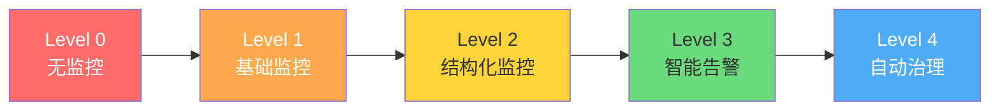

# 性能监控体系搭建

> **学习目标**：从零搭建一套完整的应用性能监控（APM）体系，掌握Prometheus + Grafana + OpenTelemetry的技术栈，能够实现从指标采集、可视化展示到告警通知的全链路监控能力。

## 目录

- [1. 监控体系架构总览](#1-监控体系架构总览)
  - [1.1 可观测性三大支柱](#11可观测性三大支柱)
  - [1.2 监控成熟度模型](#12监控成熟度模型)
- [2. 核心性能指标体系](#2-核心性能指标体系)
  - [2.1 RED方法与USE方法](#21-red方法与use方法)
  - [2.2 四大黄金信号](#22四大黄金信号)
  - [2.3 指标类型详解](#23指标类型详解)
- [3. Prometheus + Grafana 搭建](#3-prometheus--grafana-搭建)
  - [3.1 Docker Compose一键部署](#31-docker-compose一键部署)
  - [3.2 Prometheus配置与数据源](#32-prometheus配置与数据源)
  - [3.3 Grafana仪表盘设计](#33-grafana仪表盘设计)
- [4. OpenTelemetry .NET SDK 集成](#4-opentelemetry-net-sdk-集成)
  - [4.1 Metrics：指标采集](#41-metrics指标采集)
  - [4.2 Traces：分布式追踪](#42-traces分布式追踪)
  - [4.3 Logs：结构化日志](#43-logs结构化日志)
- [5. 自定义业务指标](#5-自定义业务指标)
- [6. 健康检查端点设计](#6-健康检查端点设计)
- [7. 告警系统设计](#7-告警系统设计)
- [8. 实战案例：博客系统APM监控](#8-实战案例博客系统apm监控)
- [9. 常见陷阱与最佳实践](#9-常见陷阱与最佳实践)
- [10. 练习题](10-练习题)

---

## 1. 监控体系架构总览

### 1.1 可观测性三大支柱

```
┌─────────────────────────────────────────────────────────────────────┐
│                    可观测性 (Observability) 架构                    │
├─────────────────────────────────────────────────────────────────────┤
│                                                                     │
│   ┌─────────────┐    ┌─────────────┐    ┌─────────────┐            │
│   │   Metrics   │    │   Traces    │    │    Logs     │            │
│   │   (指标)     │    │   (链路)    │    │   (日志)    │            │
│   └──────┬──────┘    └──────┬──────┘    └──────┬──────┘            │
│          │                  │                  │                    │
│          ▼                  ▼                  ▼                    │
│   ┌─────────────────────────────────────────────────┐              │
│   │           OpenTelemetry Collector               │              │
│   │         (统一收集 → 转发 → 存储)                 │              │
│   └─────────────────────┬───────────────────────────┘              │
│                         │                                          │
│          ┌──────────────┼──────────────┐                          │
│          ▼              ▼              ▼                          │
│   ┌────────────┐ ┌────────────┐ ┌────────────┐                   │
│   │ Prometheus  │ │   Jaeger    │ │ Loki/Elastic│                  │
│   │ (时序数据库) │ │ (链路存储)  │ │ (日志存储)  │                   │
│   └──────┬─────┘ └──────┬─────┘ └──────┬─────┘                   │
│          │              │              │                          │
│          └──────────────┼──────────────┘                          │
│                         ▼                                         │
│                ┌────────────────┐                                │
│                │    Grafana     │                                │
│                │ (统一可视化)    │                                │
│                └────────────────┘                                │
│                                                                     │
│   回答的问题:                                                      │
│   • Metrics → 系统发生了什么？（数量/趋势）                         │
│   • Traces  → 为什么发生？（调用链路/耗时分布）                     │
│   • Logs    → 具体是什么？（详细上下文信息）                        │
└─────────────────────────────────────────────────────────────────────┘
```

### 1.2 监控成熟度模型



| 等级 | 特征 | 能力 |
|-----|------|------|
| **L0 无监控** | 出了问题靠用户反馈 | 无法主动发现问题 |
| **L1 基础** | 服务器资源监控(CPU/内存/磁盘) | 知道机器是否健康 |
| **L2 结构化** | 应用指标(APM) + 日志聚合 | 知道应用是否健康 |
| **L3 智能** | 告警规则 + 趋势分析 | 问题发生前预警 |
| **L4 自治** | 自动扩缩容 + 故障自愈 | 几乎无需人工干预 |

---

## 2. 核心性能指标体系

### 2.1 RED方法与USE方法

```csharp
/// <summary>
/// RED方法：面向请求的指标（适用于微服务/API）
/// </summary>
public class RedMetrics
{
    /*
     * ╔═══════════════════════════════════════════╗
     * ║             RED 方法                       ║
     * ╠════════════╦═══════════════════════════════╣
     * ║ R - Rate    ║ 请求速率：每秒处理多少请求      ║
     * ║ E - Errors  ║ 错误率：多少请求失败了          ║
     * ║ D - Duration║ 延迟：请求处理花了多长时间       ║
     * ╚════════════╩═══════════════════════════════╝
     */
    
    /// <summary>
    /// Rate（吞吐量）：单位时间内的请求数
    /// </summary>
    public record ThroughputMetric(
        double RequestsPerSecond,
        double SuccessfulPerSecond,
        double FailedPerSecond
    );

    /// <summary>
    /// Errors（错误率）：失败请求占比
    /// </summary>
    public record ErrorRateMetric(
        double ErrorPercentage,        // 总错误率
        double ClientErrorPercentage,  // 4xx 客户端错误
        double ServerErrorPercentage,  // 5xx 服务端错误
        Dictionary<int, int> ErrorsByStatusCode // 各状态码分布
    );

    /// <summary>
    /// Duration（延迟）：请求处理时间分布
    /// </summary>
    public record LatencyMetric(
        double AverageMs,     // 平均延迟
        double P50Ms,         // 中位数延迟
        double P90Ms,         // P90延迟
        double P99Ms,         // P99延迟（关键指标！）
        double P999Ms,        // P999延迟
        double MaxMs,         // 最大延迟
        double StdDevMs       // 标准差
    );
}

/// <summary>
/// USE方法：面向资源的指标（适用于基础设施）
/// </summary>
public class UseMetrics
{
    /*
     * ╔═══════════════════════════════════════════╗
     * ║             USE 方法                       ║
     * ╠════════════╦═══════════════════════════════╣
     * ║ U - Utilization ║ 使用率：资源有多忙？        ║
     * ║ S - Saturation   ║ 饱和度：还有多少余量？     ║
     * ║ E - Errors      ║ 错误数：出了多少错？        ║
     * ╚════════════╩═══════════════════════════════╝
     */

    /// <summary>
    /// CPU使用率详情
    /// </summary>
    public record CpuUtilization(
        double TotalUsagePercent,
        double UserPercent,      // 用户态CPU
        double SystemPercent,    // 内核态CPU
        double IdlePercent,      // 空闲
        int ThreadCount,         // 线程数
        int RunnableQueueLength  // 就绪队列长度
    );

    /// <summary>
    /// 内存使用率详情
    /// </summary>
    public record MemoryUtilization(
        long TotalMB,
        long UsedMB,
        long AvailableMB,
        double UsagePercent,
        long Gen0Collections,    // GC Gen0回收次数
        long Gen1Collections,
        long Gen2Collections,
        long WorkingSetMB        // 工作集大小
    );
}
```

### 2.2 四大黄金信号

Google SRE团队提出的四个最关键的服务监控指标：

| 信号 | 定义 | 正常值 | 告警阈值 | 严重程度 |
|-----|------|-------|---------|---------|
| **Latency** | 服务请求的延迟 | P99 < 200ms | P99 > 500ms | P99 > 2s |
| **Traffic** | 服务的请求量(QPS) | 相对稳定 | 突增 > 2x 或骤降 > 50% | 接近0 |
| **Errors** | 错误请求比例 | < 0.1% | > 1% | > 5% |
| **Saturation** | 资源使用率 | < 70% | > 85% | > 95% |

### 2.3 指标类型详解

```csharp
/// <summary>
/// Prometheus四种核心指标类型的.NET实现示例
/// </summary>
public class MetricTypesDemo
{
    private readonly Counter _requestCounter;
    private readonly Histogram _durationHistogram;
    private readonly Gauge _activeConnections;
    private readonly Summary _responseSizeSummary;

    public MetricTypesDemo(IMeterFactory meterFactory)
    {
        var meter = meterFactory.Create("MyApp.Metrics");

        // ========== Counter（计数器）==========
        // 只能递增的累计值，用于计数事件发生的次数
        _requestCounter = meter.CreateCounter(
            name: "http_requests_total",
            unit: "{request}",
            description: "HTTP请求总数");

        // ========== Histogram（直方图）==========
        // 记录值的分布情况，用于延迟等需要观察分布的指标
        _durationHistogram = meter.CreateHistogram(
            name: "http_request_duration_seconds",
            unit: "s",
            description: "HTTP请求处理时长");

        // ========== Gauge（仪表盘）==========
        // 可以任意变化的当前值，用于表示瞬时状态
        _activeConnections = meter.CreateGauge(
            name: "db_active_connections",
            unit: "{connection}",
            description: "当前活跃的数据库连接数");

        // ========== Summary（摘要）==========
        // 类似Histogram但在客户端计算分位数（适合高基数场景）
        _responseSizeSummary = meter.CreateSummary(
            name: "http_response_size_bytes",
            unit: "By",
            description: "HTTP响应体大小");
    }

    /// <summary>
    /// 在中间件中记录所有指标
    /// </summary>
    public void RecordRequest(HttpContext context, TimeSpan duration)
    {
        var statusCode = context.Response.StatusCode;
        var method = context.Request.Method;
        var path = GetNormalizedPath(context.Request.Path);
        
        // Counter: 记录请求次数（按状态码和方法分组）
        _requestCounter.Add(1, 
            new("method", method), 
            new("status", statusCode.ToString()),
            new("path", path));

        // Histogram: 记录请求延迟
        _durationHistogram.Record(duration.TotalSeconds,
            new("method", method),
            new("path", path));

        // Summary: 记录响应大小
        if (context.Response.ContentLength.HasValue)
        {
            _responseSizeSummary.Record(context.Response.ContentLength.Value);
        }
    }

    /// <summary>
    /// 更新Gauge值
    /// </summary>
    public void UpdateActiveConnections(int count)
    {
        _activeConnections.Set(count);
    }

    private static string GetNormalizedPath(string path)
    {
        // 将 /users/123/profile 归一化为 /users/{id}/profile
        return System.Text.RegularExpressions.Regex.Replace(
            path, @"\d+", "{id}");
    }
}
```

---

## 3. Prometheus + Grafana 搭建

### 3.1 Docker Compose一键部署

```yaml
# docker-compose.monitoring.yml
# 使用方式: docker compose -f docker-compose.monitoring.yml up -d
version: '3.8'

services:
  # ==================== Prometheus ====================
  prometheus:
    image: prom/prometheus:v2.50.0
    container_name: prometheus
    ports:
      - "9090:9090"
    volumes:
      - ./prometheus/prometheus.yml:/etc/prometheus/prometheus.yml
      - ./prometheus/rules:/etc/prometheus/rules
      - prometheus_data:/prometheus
    command:
      - '--config.file=/etc/prometheus/prometheus.yml'
      - '--storage.tsdb.retention.time=30d'  # 数据保留30天
      - '--web.enable-lifecycle'              # 支持热重载
      - '--web.enable-admin-api'
    restart: unless-stopped
    networks:
      - monitoring

  # ==================== Grafana ====================
  grafana:
    image: grafana/grafana:10.4.0
    container_name: grafana
    ports:
      - "3000:3000"
    environment:
      - GF_SECURITY_ADMIN_USER=admin
      - GF_SECURITY_ADMIN_PASSWORD=changeme_in_production
      - GF_USERS_ALLOW_SIGN_UP=false
      - GF_SERVER_ROOT_URL=http://localhost:3000
    volumes:
      - ./grafana/provisioning:/etc/grafana/provisioning
      - ./grafana/dashboards:/var/lib/grafana/dashboards
      - grafana_data:/var/lib/grafana
    depends_on:
      - prometheus
    restart: unless-stopped
    networks:
      - monitoring

  # ==================== AlertManager ====================
  alertmanager:
    image: prom/alertmanager:v0.27.0
    container_name: alertmanager
    ports:
      - "9093:9093"
    volumes:
      - ./alertmanager/alertmanager.yml:/etc/alertmanager/alertmanager.yml
    command:
      - '--config.file=/etc/alertmanager/alertmanager.yml'
      - '--web.external-url=http://localhost:9093'
    restart: unless-stopped
    networks:
      - monitoring

  # ==================== Node Exporter (可选) ====================
  node-exporter:
    image: prom/node-exporter:v1.7.0
    container_name: node-exporter
    ports:
      - "9100:9100"
    volumes:
      - /proc:/host/proc:ro
      - /sys:/host/sys:ro
      - /:/rootfs:ro
    command:
      - '--path.procfs=/host/proc'
      - '--path.sysfs=/host/sys'
      - '--path.rootfs=/rootfs'
      --collector.filesystem.mount-points-exclude=^/(sys|proc|dev|host|etc)($$|/)
    restart: unless-stopped
    networks:
      - monitoring

volumes:
  prometheus_data:
  grafana_data:

networks:
  monitoring:
    driver: bridge
```

### 3.2 Prometheus配置与数据源

```yaml
# prometheus/prometheus.yml
global:
  scrape_interval: 15s        # 默认抓取间隔
  evaluation_interval: 15s    # 规则评估间隔
  scrape_timeout: 10s          # 单次抓取超时

# 告警管理器配置
alerting:
  alertmanagers:
    - static_configs:
        - targets:
          - alertmanager:9093

# 抓取目标配置
scrape_configs:
  # ==================== ASP.NET Core 应用 ====================
  - job_name: 'aspnet-app'
    metrics_path: /metrics
    scrape_interval: 10s
    static_configs:
      - targets: ['host.docker.internal:5000']  # 开发环境用host.docker.internal
        labels:
          env: development
          app: my-blog-system
    
  # ==================== Node Exporter (服务器指标) ====================
  - job_name: 'node-exporter'
    static_configs:
      - targets: ['node-exporter:9100']

  # ==================== 数据库监控 (可选) ====================
  - job_name: 'postgres-exporter'
    static_configs:
      - targets: ['postgres-exporter:9187']

  # ==================== Redis 监控 (可选) ====================
  - job_name: 'redis-exporter'
    static_configs:
      - targets: ['redis-exporter:9121']

# 告警规则文件
rule_files:
  - '/etc/prometheus/rules/*.yml'
```

```yaml
# prometheus/rules/alert-rules.yml
groups:
  - name: aspnet-core-alerts
    rules:
      # 高延迟告警
      - alert: HighRequestLatency
        expr: histogram_quantile(0.99, rate(http_request_duration_seconds_bucket[5m])) > 0.5
        for: 2m
        labels:
          severity: warning
        annotations:
          summary: "API P99延迟超过500ms"
          description: "P99请求延迟 {{ $value }}s，持续2分钟"

      # 高错误率告警
      - alert: HighErrorRate
        expr: |
          (
            sum(rate(http_requests_total{status=~"5.."}[5m]))
            /
            sum(rate(http_requests_total[5m]))
          ) * 100 > 5
        for: 1m
        labels:
          severity: critical
        annotations:
          summary: "服务端错误率超过5%"
          description: "当前错误率: {{ $value }}%"

      # 服务不可用告警
      - alert: ServiceDown
        expr: up{job="aspnet-app"} == 0
        for: 30s
        labels:
          severity: critical
        annotations:
          summary: "{{ $labels.app }} 服务不可用"
          description: "应用实例 {{ $labels.instance }} 已停止响应"

      # GC压力过大告警
      - alert: HighGCCollectionRate
        expr: rate(dotnet_gc_collections_total_seconds[5m]) > 0.1
        for: 5m
        labels:
          severity: warning
        annotations:
          summary: "GC回收占用过多CPU时间"
          description: "GC每秒占用CPU: {{ $value }}s"

  - name: infrastructure-alerts
    rules:
      - alert: HighCpuUsage
        expr: 100 - (avg by(instance) (irate(node_cpu_seconds_total{mode="idle"}[5m])) * 100) > 85
        for: 5m
        labels:
          severity: warning
        annotations:
          summary: "CPU使用率过高"
          description: "实例 {{ $labels.instance }} CPU使用率: {{ $value }}%"

      - alert: HighMemoryUsage
        expr: (1 - node_memory_MemAvailable_bytes / node_memory_MemTotal_bytes) * 100 > 90
        for: 5m
        labels:
          severity: warning
        annotations:
          summary: "内存使用率过高"
          description: "内存使用率: {{ $value }}%"
```

### 3.3 Grafana仪表盘设计

```csharp
/// <summary>
/// Grafana仪表盘JSON配置生成器（或直接在UI中创建）
/// 这里以代码形式描述面板布局
/// </summary>
public class DashboardDesignGuide
{
    /*
     * ╔═════════════════════════════════════════════════════════╗
     * ║              推荐的仪表盘布局（1920x1080）              ║
     * ╠═════════════════════════════════════════════════════════╣
     * ║                                                           ║
     * ║  ┌─────────────────────────────────────────────────────┐ ║
     * ║  │ 行1: 核心概览 (Row Height: 150px)                  │ ║
     * ║  │ ┌──────────┐ ┌──────────┐ ┌──────────┐ ┌─────────┐ │ ║
     * ║  │ │ QPS统计图 │ │ 错误率    │ │ P99延迟  │ │ 饱和度   │ │ ║
     * ║  │ │ (Stat)   │ │ (Stat)   │ │ (Stat)   │ │ (Gauge) │ │ ║
     * ║  │ └──────────┘ └──────────┘ └──────────┘ └─────────┘ │ ║
     * ║  ├─────────────────────────────────────────────────────┤ ║
     * ║  │ 行2: 请求量趋势 (Row Height: 250px)                 │ ║
     * ║  │ ┌─────────────────────────────────────────────────┐ │ ║
     * ║  │ │ QPS时间序列图 (按Status Code堆叠面积图)          │ │ ║
     * ║  │ └─────────────────────────────────────────────────┘ │ ║
     * ║  ├─────────────────────────────────────────────────────┤ ║
     * ║  │ 行3: 延迟分布 (Row Height: 250px)                    │ ║
     * ║  │ ┌──────────────────────┐ ┌────────────────────────┐ │ ║
     * ║  │ │ 延迟热力图            │ │ P50/P90/P99/P999趋势   │ │ ║
     * ║  │ │ (Heatmap)            │ │ (Multi-line)           │ │ ║
     * ║  │ └──────────────────────┘ └────────────────────────┘ │ ║
     * ║  ├─────────────────────────────────────────────────────┤ ║
     * ║  │ 行4: 系统资源 (Row Height: 250px)                    │ ║
     * ║  │ ┌────────────────┐ ┌────────────────┐ ┌───────────┐ │ ║
     * ║  │ │ CPU使用率       │ │ 内存使用/GC     │ │ 线程池状态│ │ ║
     * ║  │ │ (Time series)  │ │ (Time series)  │ │ (Stats)   │ │ ║
     * ║  │ └────────────────┘ └────────────────┘ └───────────┘ │ ║
     * ║  ├─────────────────────────────────────────────────────┤ ║
     * ║  │ 行5: Top N 分析 (Row Height: 200px)                  │ ║
     * ║  │ ┌────────────────────────┐ ┌──────────────────────┐ │ ║
     * ║  │ │ 最慢的10个接口(TopN)   │ │ 错误最多的10个接口     │ │ ║
     * ║  │ │ (Table/Bar)           │ │ (Table)               │ │ ║
     * ║  │ └────────────────────────┘ └──────────────────────┘ │ ║
     * ║  └─────────────────────────────────────────────────────┘ ║
     * ╚═════════════════════════════════════════════════════════╝
     */
}

// Grafana重要查询语法速查：

/*
 * PromQL 常用查询：
 *
 * 1. 当前QPS：
 *    sum(rate(http_requests_total[1m])) by (method, path)
 *
 * 2. 错误率：
 *    (
 *      sum(rate(http_requests_total{status=~"5.."}[5m]))
 *      /
 *      sum(rate(http_requests_total[5m]))
 *    ) * 100
 *
 * 3. P99延迟：
 *    histogram_quantile(0.99, 
 *      sum(rate(http_request_duration_seconds_bucket[5m])) by (le))
 *
 * 4. 同比上周：
 *    compare(
 *      sum(rate(http_requests_total[1h])),
 *      1w ago)
 *
 * 5. 异常检测（基于标准差）：
 *    sum(rate(http_requests_total[5m]))
 *    - avg_over_time(sum(rate(http_requests_total[5m])[1d])
 *    > 3 * stddev_over_time(sum(rate(http_requests_total[5m])[1d])
 */
```

---

## 4. OpenTelemetry .NET SDK 集成

### 4.1 Metrics：指标采集

```csharp
/// <summary>
/// Program.cs - 配置OpenTelemetry Metrics导出
/// </summary>
public static class OpenTelemetryConfig
{
    public static void AddOpenTelemetryMonitoring(WebApplicationBuilder builder)
    {
        var otelConfig = builder.Configuration.GetSection("OpenTelemetry");
        var serviceName = otelConfig.GetValue<string>("ServiceName") ?? "my-app";
        var serviceVersion = otelConfig.GetValue<string>("ServiceVersion") ?? "1.0.0";

        builder.Services.AddOpenTelemetry()
            .WithMetrics(metrics =>
            {
                // 导出器：将指标发送给Prometheus（通过OTLP或直接的Prometheus exporter）
                metrics.AddPrometheusExporter(options =>
                {
                    // Prometheus拉取端点
                    options.ScrapeEndpointPath = "/metrics";
                    options.ScrapeResponseCacheDurationMilliseconds = 1000; // 缓存1秒
                });
                
                // 或者通过OTLP发送给Collector
                // metrics.AddOtlpExporter(options =>
                // {
                //     options.Endpoint = new Uri("http://localhost:4317"); // OTLP/gRPC
                // });

                // 添加ASP.NET Core内置指标
                metrics.AddAspNetCoreInstrumentation();
                
                // 添加HttpClient指标
                metrics.AddHttpClientInstrumentation();
                
                // 添加Runtime指标（GC、线程池、内存等）
                metrics.AddRuntimeInstrumentation();

                // 添加Process指标（CPU、内存）
                metrics.AddProcessInstrumentation();
            })
            .WithTracing(tracing =>
            {
                tracing.AddOtlpExporter(options =>
                {
                    options.Endpoint = new Uri("http://localhost:4317/v1/traces");
                });

                // 添加ASP.NET Core追踪
                tracing.AddAspNetCoreInstrumentation(options =>
                {
                    // 记录丰富的请求属性
                    options.EnrichWithHttpRequest = (activity, request) =>
                    {
                        activity.SetTag("user.agent", request.Headers.UserAgent.ToString());
                        activity.SetTag("client.ip", GetClientIp(request));
                    };
                    
                    options.EnrichWithHttpResponse = (activity, response) =>
                    {
                        activity.SetTag("response.size", response.ContentLength ?? 0);
                    };
                });

                // 添加HttpClient追踪
                tracing.AddHttpClientInstrumentation();
            })
            .WithLogging(logging =>
            {
                logging.AddOtlpExporter();
            });

        // 注册自定义Meter
        builder.Services.AddSingleton<BusinessMetrics>();
    }

    private static string? GetClientIp(HttpRequest request)
    {
        return request.Headers["X-Forwarded-For"].FirstOrDefault() 
            ?? request.HttpContext?.Connection.RemoteIpAddress?.ToString();
    }
}

/// <summary>
/// 自定义业务指标收集器
/// </summary>
public class BusinessMetrics
{
    private readonly Counter _orderCreatedCounter;
    private readonly Counter _paymentProcessedCounter;
    private readonly Histogram _orderValueHistogram;
    private readonly Gauge _activeUsersGauge;

    public BusinessMetrics(IMeterFactory meterFactory)
    {
        var meter = meterFactory.Create("BlogSystem.Business");

        // 文章相关指标
        _articleViewsCounter = meter.CreateCounter(
            "blog_article_views_total",
            description: "文章浏览总数");

        _articlePublishCounter = meter.CreateCounter(
            "blog_articles_published_total", 
            description: "发布文章总数");

        // 用户相关指标
        _activeUsersGauge = meter.CreateGauge(
            "blog_active_users_current",
            description: "当前在线用户数");

        _newUsersTodayCounter = meter.CreateCounter(
            "blog_new_users_total",
            description: "今日新注册用户数");

        // 评论相关指标
        _commentCreatedCounter = meter.CreateCounter(
            "blog_comments_created_total",
            description: "创建评论总数");

        _commentModerationTime = meter.CreateHistogram(
            "blog_comment_moderation_duration_seconds",
            description: "审核耗时分布");
    }
    
    private Counter _articleViewsCounter;
    private Counter _articlePublishCounter;
    private Counter _newUsersTodayCounter;
    private Counter _commentCreatedCounter;
    private Histogram _commentModerationTime;

    // ========== 业务操作方法 ==========

    public void RecordArticleView(int articleId, string category)
    {
        _articleViewsCounter.Add(1,
            new("category", category));
    }

    public void RecordArticlePublished(string authorId, string category)
    {
        _articlePublishCounter.Add(1,
            new("author_id", authorId),
            new("category", category));
    }

    public void SetActiveUserCount(int count)
    {
        _activeUsersGauge.Set(count);
    }

    public void RecordNewUser(string source)
    {
        _newUsersTodayCounter.Add(1,
            new("source", source)); // google/github/email
    }

    public void RecordCommentCreated(int articleId, bool requiresModeration)
    {
        _commentCreatedCounter.Add(1,
            new("requires_moderation", requiresModeration.ToString().ToLower()));
    }

    public void RecordCommentModeration(TimeSpan duration, bool approved)
    {
        _commentModerationTime.Record(duration.TotalSeconds,
            new("approved", approved.ToString().ToLower()));
    }
}
```

### 4.2 Traces：分布式追踪

```csharp
/// <summary>
/// 分布式追踪中间件：记录每个请求的完整链路
/// </summary>
public class DistributedTracingMiddleware
{
    private readonly RequestDelegate _next;
    private readonly ILogger<DistributedTracingMiddleware> _logger;
    private readonly ActivitySource _activitySource 
        = new("BlogSystem.RequestTracing");

    public DistributedTracingMiddleware(RequestDelegate next, ILogger<DistributedTracingMiddleware> logger)
    {
        _next = next;
        _logger = logger;
    }

    public async Task InvokeAsync(HttpContext context)
    {
        var startTime = DateTimeOffset.UtcNow;
        
        // 创建Activity（OpenTelemetry会自动传播TraceContext）
        using var activity = _activitySource.StartActivity(
            $"{context.Request.Method} {context.Request.Path.Value}",
            ActivityKind.Server);

        if (activity != null)
        {
            // 设置标准的Trace属性
            activity.SetTag("http.method", context.Request.Method);
            activity.SetTag("http.url", context.Request.Path.Value);
            activity.SetTag("http.scheme", context.Request.Scheme);
            activity.SetTag("http.host", context.Request.Host.Value);
            activity.SetTag("http.user_agent", context.Request.Headers.UserAgent.ToString());
            activity.SetTag("net.host.ip", context.Connection.LocalIpAddress?.ToString());
            
            // 自定义业务属性
            activity.SetTag("app.user_id", context.User.FindFirst("sub")?.Value ?? "anonymous");
            activity.SetTag("app.client_version", context.Request.Headers["X-App-Version"].FirstOrDefault());
            
            // 记录请求体大小（如果不大）
            if (context.Request.ContentLength > 0 && context.Request.ContentLength < 10240)
            {
                activity.SetTag("http.request.body_size", context.Request.ContentLength);
            }
        }

        try
        {
            await _next(context);
            
            // 记录响应信息
            activity?.SetTag("http.status_code", context.Response.StatusCode);
            activity?.SetTag("http.response.content_length", context.Response.ContentLength ?? 0);
            
            // 根据状态码设置Activity状态
            if (context.Response.StatusCode >= 500)
            {
                activity?.SetStatus(ActivityStatusCode.Error);
            }
            else if (context.Response.StatusCode >= 400)
            {
                activity?.SetStatus(ActivityStatusCode.Ok); // 客户端错误不算应用错误
            }
        }
        catch (Exception ex)
        {
            activity?.SetStatus(ActivityStatusCode.Error);
            activity?.RecordException(ex);
            
            activity?.SetTag("error.type", ex.GetType().Name);
            activity?.SetTag("error.message", ex.Message);
            
            throw; // 继续抛出异常让后续中间件处理
        }
        finally
        {
            var elapsed = DateTimeOffset.UtcNow - startTime;
            _logger.LogInformation(
                "请求完成: {Method} {Path} → {StatusCode} ({ElapsedMs}ms) TraceId={TraceId}",
                context.Request.Method,
                context.Request.Path,
                context.Response.StatusCode,
                elapsed.TotalMilliseconds,
                activity?.TraceId);
        }
    }
}
```

### 4.3 Logs：结构化日志

```csharp
/// <summary>
/// 结构化日志配置：与OpenTelemetry集成
/// </summary>
public class StructuredLoggingConfig
{
    public static void ConfigureLogging(ILoggingBuilder logging, IConfiguration config)
    {
        logging.ClearProviders(); // 清除默认提供者
        
        // 控制台输出（开发环境友好格式）
        logging.AddConsole(options =>
        {
            options.IncludeScopes = true;
            options.TimestampFormat = "HH:mm:ss ";
            options.UseUtcTimestamp = true;
        });

        // OpenTelemetry日志导出
        logging.AddOpenTelemetry(options =>
        {
            options.IncludeFormattedMessage = true;
            options.IncludeScopes = true;
            options.ParseStateValues = true;
            options.ResourceAttributes = new Dictionary<string, object>
            {
                ["service.name"] = config["OpenTelemetry:ServiceName"] ?? "blog-system",
                ["service.version"] = config["OpenTelemetry:ServiceVersion"] ?? "1.0.0"
            };

            options.AddOtlpExporter(otelOptions =>
            {
                otelOptions.Endpoint = new Uri("http://localhost:4317/v1/logs");
            });
        });

        // 根据环境过滤日志级别
        var logLevel = config.GetSection("Logging:LogLevel");
        logging.SetMinimumLevel(Enum.Parse<LogLevel>(logLevel["Default"] ?? "Information"));
    }
}

/// <summary>
/// 日志使用规范：结构化的日志消息
/// </summary>
public class LoggingExamples
{
    private readonly ILogger<LoggingExamples> _logger;

    public LoggingExamples(ILogger<LoggingExamples> logger)
    {
        _logger = logger;
    }

    /// <summary>
    /// ✅ 好的结构化日志：包含足够的上下文
    /// </summary>
    public async Task GoodStructuredLog(int userId, string action)
    {
        using (_logger.BeginScope(new Dictionary<string, object>
        {
            { "UserId", userId },
            { "Action", action },
            { "OperationId", Guid.NewGuid() }
        }))
        {
            _logger.LogInformation("开始执行用户操作");
            
            try
            {
                var result = await PerformAction(userId, action);
                _logger.LogInformation(
                    "用户操作完成: {@Result}",
                    new { Success = true, Data = result });
            }
            catch (Exception ex)
            {
                _logger.LogError(ex,
                    "用户操作失败: {ErrorCode}",
                    "ACTION_FAILED");
            }
        }
    }

    /// <summary>
    /// ❌ 差的非结构化日志：缺少上下文，难以搜索和分析
    /// </summary>
    public async Task BadNonStructuredLog(int userId, string action)
    {
        _logger.LogInformation("开始执行操作..."); // 缺少谁？什么操作？
        
        try
        {
            await PerformAction(userId, action);
            _logger.LogInformation("操作完成"); // 什么结果？
        }
        catch (Exception ex)
        {
            _logger.LogError("出错了！"); // 什么错误？无法关联到具体请求
        }
    }

    private Task<object> PerformAction(int userId, string action) => Task.FromResult(new object());
}
```

---

## 5. 自定义业务指标

```csharp
/// <summary>
/// 完整的业务指标SDK封装
/// 提供便捷的方法来记录各种业务事件
/// </summary>
public class ApplicationMetrics
{
    private readonly IMeter _meter;
    
    // ========== 核心业务计数器 ==========
    public Counter ArticleViews => _meter.CreateCounter("app_article_views_total");
    public Counter ArticleLikes => _meter.CreateCounter("app_article_likes_total");
    public Counter ArticleComments => _meter.CreateCounter("app_article_comments_total");
    public Counter UserRegistrations => _meter.CreateCounter("app_user_registrations_total");
    public Counter UserLogins => _meter.CreateCounter("app_user_logins_total");
    public Counter SearchQueries => _meter.CreateCounter("app_search_queries_total");
    
    // ========== 业务延迟直方图 ==========
    public Histogram DbQueryDuration => _meter.CreateHistogram("app_db_query_duration_seconds");
    public Histogram CacheLookupDuration => _meter.CreateHistogram("app_cache_lookup_duration_seconds");
    public Histogram ExternalApiDuration => _meter.CreateHistogram("app_external_api_duration_seconds");
    public Histogram PageRenderDuration => _meter.CreateHistogram("app_page_render_duration_seconds");
    
    // ========== 业务状态仪表盘 ==========
    public Gauge ActiveUsers => _meter.CreateGauge("app_active_users_current");
    public Gauge PendingComments => _meter.CreateGauge("app_pending_comments_count");
    public Gauge DraftArticles => _meter.CreateGauge("app_draft_articles_count");
    public Gauge QueueDepth => _meter.CreateGauge("app_processing_queue_depth");

    public ApplicationMetrics(IMeterFactory factory)
    {
        _meter = factory.Create("BlogSystem.App");
    }
}

// ==================== 在服务中使用 ====================

/// <summary>
/// 文章服务：集成业务指标记录
/// </summary>
public class ArticleService : IArticleService
{
    private readonly IArticleRepository _repository;
    private readonly IMemoryCache _cache;
    private readonly ApplicationMetrics _metrics;
    private readonly ILogger<ArticleService> _logger;

    public ArticleService(
        IArticleRepository repository,
        IMemoryCache cache,
        ApplicationMetrics metrics,
        ILogger<ArticleService> logger)
    {
        _repository = repository;
        _cache = cache;
        _metrics = metrics;
        _logger = logger;
    }

    public async Task<ArticleDto?> GetByIdAsync(int id)
    {
        var sw = ValueStopwatch.StartNew();
        
        try
        {
            // 尝试缓存
            var swCache = ValueStopwatch.StartNew();
            var cached = _cache.Get<ArticleDto>($"article:{id}");
            swCache.Stop();
            _metrics.CacheLookupDuration.Record(swCache.Elapsed.TotalSeconds);
            
            if (cached != null)
            {
                return cached;
            }

            // 缓存未命中，查数据库
            sw.Restart();
            var article = await _repository.GetByIdAsync(id);
            sw.Stop();
            _metrics.DbQueryDuration.Record(sw.Elapsed.TotalSeconds);

            if (article != null)
            {
                // 记录浏览
                _metrics.ArticleViews.Add(1, new("article_id", id.ToString()),
                    new("source", "cache_miss"));
                
                // 写入缓存
                _cache.Set($"article:{id}", article, TimeSpan.FromMinutes(5));
                
                return MapToDto(article);
            }

            return null;
        }
        finally
        {
            _logger.LogDebug("GetById({Id}): {ElapsedMs}ms", id, sw.Elapsed.TotalMilliseconds);
        }
    }

    public async Task LikeArticleAsync(int articleId, int userId)
    {
        var sw = ValueStopwatch.StartNew();
        
        try
        {
            await _repository.LikeArticleAsync(articleId, userId);
            _metrics.ArticleLikes.Add(1, new("article_id", articleId.ToString()));
        }
        finally
        {
            sw.Stop();
            _metrics.DbQueryDuration.Record(sw.Elapsed.TotalSeconds);
        }
    }

    private ArticleDto MapToDto(Article a) => new(a.Id, a.Title, a.ContentPreview);
}

public interface IArticleService {}
public interface IArticleRepository { Task<Article?> GetByIdAsync(int id); Task LikeArticleAsync(int articleId, int userId); }
public record Article(int Id, string Title, string ContentPreview);
public record ArticleDto(int Id, string Title, string Preview);
```

---

## 6. 健康检查端点设计

```csharp
/// <summary>
/// 完整的健康检查方案：Liveness / Readiness / Startup
/// </summary>
public static class HealthCheckSetup
{
    public static void AddHealthChecks(IServiceCollection services, IConfiguration config)
    {
        var connectionString = config.GetConnectionString("DefaultConnection");
        var redisConnectionString = config.GetConnectionString("Redis");

        services.AddHealthChecks()
            // ====== Liveness Probe: 应用是否存活 ======
            .AddCheck("self", () => HealthCheckResult.Healthy(), tags: new[] { "liveness" })

            // ====== Readiness Probe: 是否准备好接收流量 ======
            .AddCheck("database", new SqlConnectionHealthCheck(connectionString), 
                tags: new[] { "readiness" }, failureStatus: HealthStatus.Unhealthy)
            
            .AddCheck("redis", new RedisHealthCheck(redisConnectionString),
                tags: new[] { "readiness" }, failureStatus: HealthStatus.Degraded)

            // ====== Startup Probe: 关键依赖是否就绪 ======
            .AddCheck("essential-config", new ConfigHealthCheck(config),
                tags: new[] { "startup" })

            // ====== 自定义业务健康检查 ======
            .AddCheck("critical-services", new ServicesHealthCheck(),
                tags: new[] { "readiness" });

        // 健康检查UI（开发环境）
        // services.AddHealthChecksUI();
    }

    public static void MapHealthChecks(IEndpointRouteBuilder endpoints)
    {
        // Kubernetes/Docker标准路径
        endpoints.MapHealthChecks("/healthz", new HealthCheckOptions
        {
            Predicate = r => r.Tags.Contains("liveness"),
            ResponseWriter = WriteMinimalResponse
        });

        endpoints.MapHealthChecks("/ready", new HealthCheckOptions
        {
            Predicate = r => r.Tags.Contains("readiness"),
            ResponseWriter = WriteDetailedResponse
        });

        endpoints.MapHealthChecks("/startup", new HealthCheckOptions
        {
            Predicate = r => r.Tags.Contains("startup"),
            ResponseWriter = WriteDetailedResponse
        });

        // 综合端点（人工检查用）
        endpoints.MapHealthChecks("/health", new HealthCheckOptions
        {
            Predicate = _ => true,
            ResponseWriter = WriteDetailedResponse
        });
    }

    private static Task WriteMinimalResponse(HttpContext context, HealthReport report)
    {
        // Liveness探针：简单快速，只返回200或503
        context.Response.ContentType = "text/plain";
        return context.Response.WriteAsync(report.Status == HealthStatus.Healthy ? "OK" : "UNHEALTHY");
    }

    private static async Task WriteDetailedResponse(HttpContext context, HealthReport report)
    {
        context.Response.ContentType = "application/json";
        
        var result = new
        {
            status = report.Status.ToString(),
            totalDurationMs = report.TotalDuration.TotalMilliseconds,
            checks = report.Entries.Select(e => new
            {
                name = e.Key,
                status = e.Value.Status.ToString(),
                duration = e.Value.Duration.TotalMilliseconds,
                description = e.Value.Description,
                data = e.Value.Data,
                tags = e.Value.Tags
            }),
            timestamp = DateTime.UtcNow.ToString("O")
        };

        await context.Response.WriteAsJsonAsync(result);
    }
}

// ==================== 自定义健康检查实现 ====================

/// <summary>
/// 数据库连接健康检查
/// </summary>
public class SqlConnectionHealthCheck : IHealthCheck
{
    private readonly string _connectionString;

    public SqlConnectionHealthCheck(string connectionString)
    {
        _connectionString = connectionString;
    }

    public async Task<HealthCheckResult> CheckHealthAsync(HealthCheckContext context, CancellationToken ct = default)
    {
        try
        {
            using var connection = new SqlConnection(_connectionString);
            await connection.OpenAsync(ct);
            
            using var command = new SqlCommand("SELECT 1", connection);
            await command.ExecuteScalarAsync(ct);

            return HealthCheckResult.Healthy("数据库连接正常");
        }
        catch (Exception ex)
        {
            return HealthCheckResult.Unhealthy($"数据库连接失败: {ex.Message}");
        }
    }
}

/// <summary>
/// Redis连接健康检查
/// </summary>
public class RedisHealthCheck : IHealthCheck
{
    private readonly string _connectionString;

    public RedisHealthCheck(string connectionString)
    {
        _connectionString = connectionString;
    }

    public async Task<HealthCheckResult> CheckHealthAsync(HealthCheckContext context, CancellationToken ct = default)
    {
        try
        {
            var multiplexer = await ConnectionMultiplexer.ConnectAsync(_connectionString);
            var db = multiplexer.GetDatabase();
            var ping = await db.PingAsync();
            
            if (ping.IsSuccess())
                return HealthCheckResult.Healthy($"Redis连接正常, 延迟: {ping.TotalMilliseconds}ms");
            
            return HealthCheckResult.Degraded($"Redis响应慢: {ping.TotalMilliseconds}ms");
        }
        catch (Exception ex)
        {
            return HealthCheckResult.Unhealthy($"Redis连接失败: {ex.Message}");
        }
    }
}

/// <summary>
/// 配置完整性检查
/// </summary>
public class ConfigHealthCheck : IHealthCheck
{
    private readonly IConfiguration _config;

    public ConfigHealthCheck(IConfiguration config)
    {
        _config = config;
    }

    public Task<HealthCheckResult> CheckHealthAsync(HealthCheckContext context, CancellationToken ct = default)
    {
        var requiredKeys = new[] { "ConnectionStrings:DefaultConnection", "Jwt:SecretKey" };
        var missing = requiredKeys.Where(k => string.IsNullOrEmpty(_config[k])).ToList();

        if (missing.Count == 0)
            return Task.FromResult(HealthCheckResult.Healthy("所有必需配置已就绪"));

        return Task.FromResult(HealthCheckResult.Unhealthy(
            $"缺少必需配置: {string.Join(", ", missing)}"));
    }
}

/// <summary>
/// 外部服务可用性检查
/// </summary>
public class ServicesHealthCheck : IHealthCheck
{
    private readonly IHttpClientFactory _httpClientFactory;

    public ServicesHealthCheck(IHttpClientFactory httpClientFactory)
    {
        _httpClientFactory = httpClientFactory;
    }

    public async Task<HealthCheckResult> CheckHealthAsync(HealthCheckContext context, CancellationToken ct = default)
    {
        var results = new List<(string Name, bool Healthy, string Message)>();

        // 检查支付网关
        try
        {
            var client = _httpClientFactory.CreateClient("PaymentGateway");
            var response = await client.GetAsync("/health", ct);
            results.Add(("PaymentGateway", response.IsSuccessStatusCode, ""));
        }
        catch (Exception ex)
        {
            results.Add(("PaymentGateway", false, ex.Message));
        }

        // 检查通知服务...
        // （类似）

        var allHealthy = results.All(r => r.Healthy);
        var message = string.Join("; ", results.Select(r => 
            $"{r.Name}: {(r.Healthy ? "OK" : $"FAIL({r.Message})")}"));

        return allHealthy 
            ? HealthCheckResult.Healthy("所有外部服务正常")
            : HealthCheckResult.Degraded(message);
    }
}
```

---

## 7. 告警系统设计

```csharp
/// <summary>
/// 告警通知服务：支持多种渠道
/// </summary>
public class AlertNotificationService
{
    private readonly IAlertChannel[] _channels;
    private readonly ILogger<AlertNotificationService> _logger;
    private readonly AlertConfig _config;

    public AlertNotificationService(
        IEnumerable<IAlertChannel> channels,
        ILogger<AlertNotificationService> logger,
        IOptions<AlertConfig> config)
    {
        _channels = channels.ToArray();
        _logger = logger;
        _config = config.Value;
    }

    /// <summary>
    /// 发送告警通知
    /// </summary>
    public async Task SendAlertAsync(AlertInfo alert, CancellationToken ct = default)
    {
        _logger.LogCritical(
            "🚨 [{Level}] 告警触发: {Name}\n" +
            "  描述: {Description}\n" +
            "  当前值: {CurrentValue}\n" +
            "  阈值: {Threshold}\n" +
            "  持续时间: {Duration}",
            alert.Severity,
            alert.Name,
            alert.Description,
            alert.CurrentValue,
            alert.Threshold,
            alert.Duration);

        // 根据严重级别选择通知渠道
        var channelsToUse = alert.Severity switch
        {
            Severity.Critical => _channels.Where(c => c is ISlackChannel or IPhoneChannel).ToArray(),
            Severity.Warning => _channels.Where(c => c is ISlackChannel).ToArray(),
            _ => Array.Empty<IAlertChannel>()
        };

        if (channelsToUse.Length == 0)
        {
            _logger.LogWarning("没有匹配的通知渠道: {Severity}", alert.Severity);
            return;
        }

        // 并行发送到各渠道
        var tasks = channelsToUse.Select(c => c.SendAsync(alert, ct)).ToArray();
        var results = await Task.WhenAll(tasks);

        var failures = results.Where(r => !r).Count();
        if (failures > 0)
        {
            _logger.LogError("{Count}/{Total} 个通知渠道发送失败", failures, results.Length);
        }
    }
}

// ==================== 告警渠道接口与实现 ====================

public interface IAlertChannel
{
    Task<bool> SendAsync(AlertInfo alert, CancellationToken ct);
}

public interface ISlackChannel : IAlertChannel { }
public interface IPhoneChannel : IAlertChannel { }
public interface IEmailChannel : IAlertChannel { }

/// <summary>
/// Slack通知渠道
/// </summary>
public class SlackAlertChannel : ISlackChannel
{
    private readonly HttpClient _httpClient;
    private readonly string _webhookUrl;
    private readonly ILogger<SlackAlertChannel> _logger;

    public SlackAlertChannel(HttpClient httpClient, IConfiguration config, ILogger<SlackAlertChannel> logger)
    {
        _httpClient = httpClient;
        _webhookUrl = config["Alerts:Slack:WebhookUrl"]!;
        _logger = logger;
    }

    public async Task<bool> SendAsync(AlertInfo alert, CancellationToken ct)
    {
        try
        {
            var color = alert.Severity switch
            {
                Severity.Critical => "#FF0000", // 红色
                Severity.Warning => "#FFA500",  // 橙色
                _ => "#36a64b"                   // 绿色
            };

            var payload = new
            {
                text = $"*{alert.Severity.ToUpper()}*: {alert.Name}",
                attachments = new[]
                {
                    new
                    {
                        color = color,
                        fields = new[]
                        {
                            new { title = "描述", value = alert.Description, @short = false },
                            new { title = "当前值", value = alert.CurrentValue, @short = true },
                            new { title = "阈值", value = alert.Threshold, @short = true },
                            new { title = "持续时间", value = alert.Duration, @short = true },
                            new { title = "实例", value = alert.Instance, @short = true },
                            new { title = "时间", value = DateTime.UtcNow.ToString("yyyy-MM-dd HH:mm:ss UTC"), @short = true }
                        }
                    }
                }
            };

            var content = new StringContent(
                JsonSerializer.Serialize(payload),
                Encoding.UTF8,
                "application/json");

            var response = await _httpClient.PostAsync(_webhookUrl, content, ct);
            return response.IsSuccessStatusCode;
        }
        catch (Exception ex)
        {
            _logger.LogError(ex, "Slack通知发送失败");
            return false;
        }
    }
}

/// <summary>
/// 告警信息模型
/// </summary>
public record AlertInfo(
    string Name,
    string Description,
    string CurrentValue,
    string Threshold,
    string Duration,
    Severity Severity,
    string Instance = "",
    Dictionary<string, string>? Labels = null);

public enum Severity { Info, Warning, Critical }

public record AlertConfig(
    string SlackWebhookUrl = "",
    string PhoneApiUrl = "",
    string SmtpServer = ""
);
```

---

## 8. 实战案例：博客系统APM监控

```csharp
/// <summary>
/// 完整的博客系统监控方案整合
/// Program.cs 中的完整配置
/// </summary>
public static class BlogSystemMonitoringSetup
{
    public static WebApplication ConfigureAllMonitoring(this WebApplicationBuilder builder)
    {
        // ========== 1. OpenTelemetry ==========
        ConfigureOpenTelemetry(builder);

        // ========== 2. 健康检查 ==========
        HealthCheckSetup.AddHealthChecks(builder.Services, builder.Configuration);

        // ========== 3. 自定义指标 ==========
        builder.Services.AddSingleton<ApplicationMetrics>();
        builder.Services.AddSingleton<BusinessMetrics>();

        // ========== 4. 告警服务 ==========
        builder.Services.AddSingleton<AlertNotificationService>();
        builder.Services.AddTransient<ISlackChannel, SlackAlertChannel>();
        // builder.Services.AddTransient<IPhoneChannel, TwilioAlertChannel>();

        // ========== 5. 监控后台服务 ==========
        builder.Services.AddHostedService<MetricsReportingBackgroundService>();

        var app = builder.Build();

        // ========== 6. 中间件管道 ==========
        app.UseMiddleware<DistributedTracingMiddleware>(); // 追踪中间件
        
        // Prometheus抓取端点
        app.MapPrometheusScrapingEndpoint(); // 来自 OpenTelemetry.Exporter.Prometheus.AspNetCore
        
        // 健康检查端点
        HealthCheckSetup.MapHealthChecks(app);

        return app;
    }
}

/// <summary>
/// 后台服务：定期报告自定义指标摘要
/// </summary>
public class MetricsReportingBackgroundService : BackgroundService
{
    private readonly ApplicationMetrics _metrics;
    private readonly IBlogRepository _logRepo;
    private readonly IUserRepository _userRepo;
    private readonly PeriodicTimer _timer;
    private readonly ILogger<MetricsReportingBackgroundService> _logger;

    public MetricsReportingBackgroundService(
        ApplicationMetrics metrics,
        IBlogRepository logRepo,
        IUserRepository userRepo,
        ILogger<MetricsReportingBackgroundService> logger)
    {
        _metrics = metrics;
        _logRepo = logRepo;
        _userRepo = userRepo;
        _logger = logger;
        _timer = new PeriodicTimer(TimeSpan.FromMinutes(5));
    }

    protected override async Task ExecuteAsync(CancellationToken stoppingToken)
    {
        while (await _timer.WaitForNextTickAsync(stoppingToken))
        {
            try
            {
                await CollectAndReportMetricsAsync(stoppingToken);
            }
            catch (Exception ex)
            {
                _logger.LogError(ex, "指标收集出错");
            }
        }
    }

    private async Task CollectAndReportMetricsAsync(CancellationToken ct)
    {
        // 收集活跃用户数
        var activeUsers = await _userRepo.CountActiveLastMinutesAsync(30, ct);
        _metrics.ActiveUsers.Set(activeUsers);

        // 收集待审核评论数
        var pendingComments = await _logRepo.CountPendingCommentsAsync(ct);
        _metrics.PendingComments.Set(pendingComments);

        // 收集草稿文章数
        var draftArticles = await _logRepo.CountDraftArticlesAsync(ct);
        _metrics.DraftArticles.Set(draftArticles);

        _logger.LogDebug(
            "指标快照: ActiveUsers={Users}, PendingComments={Comments}, Drafts={Drafts}",
            activeUsers, pendingComments, draftArticles);
    }
}

public interface IBlogRepository 
{ 
    Task<int> CountPendingCommentsAsync(CancellationToken ct); 
    Task<int> CountDraftArticlesAsync(CancellationToken ct); 
}
public interface IUserRepository 
{ 
    Task<int> CountActiveLastMinutesAsync(int minutes, CancellationToken ct); 
}
```

---

## 9. 常见陷阱与最佳实践

### 陷阱清单

| 陷阱 | 影响 | 解决方案 |
|-----|------|---------|
| **指标维度爆炸** | Prometheus性能下降 | 限制Label基数(<10个值) |
| **高频指标采集** | 网络和存储压力大 | 合理设置scrape_interval |
| **缺少基线数据** | 无法判断异常 | 上线前建立性能基线 |
| **告警风暴** | 大量无效告警 | 设置合理的for持续时间 |
| **单一指标告警** | 误报率高 | 组合多指标条件 |
| **忽略P99** | 只看平均值掩盖问题 | 关注尾部延迟 |

### 最佳实践清单

```markdown
## APM实施Checklist

### 指标设计
- [ ] RED四项指标齐全（Rate/Errors/Duration/Saturation）
- [ ] Label基数控制在合理范围（<1000唯一组合）
- [ ] 关键业务流程有专属指标
- [ ] 有明确的SLI/SLO定义

### 告警策略
- [ ] 每条告警有明确的责任人和处理SOP
- [ ] 告警分级合理（Critical/Warning/Info）
- [ ] 设置了静默期防止告警风暴
- [ ] 有告警升级机制（无人处理则升级）

### 仪表盘
- [ ] 有面向不同角色的视图（开发/SRE/管理层）
- [ ] 关键指标一目了然（首屏可见）
- [ ] 支持下钻分析（点击查看详情）
- [ ] 定期审查和优化仪表盘

### 可观测性文化
- [ ] 新功能必须包含指标埋点
- [ ] 故障复盘必须基于监控数据
- [ ] 定期进行故障演练验证监控有效性
```

---

## 10. 练习题

### 练习1：从零搭建监控栈

**题目**：使用Docker Compose部署完整的监控栈，并完成以下任务：

1. 部署Prometheus + Grafana + AlertManager
2. 创建一个ASP.NET Core API项目，集成OpenTelemetry
3. 实现至少5个自定义业务指标
4. 创建Grafana仪表盘，包含：
   - 核心概览面板（QPS/P99/错误率）
   - 延迟热力图
   - Top 10慢接口
   - 系统资源面板
5. 配置至少3条告警规则并通过Slack/Webhook接收

**要求**：提交完整的docker-compose文件、应用代码和仪表盘JSON。

### 练习2：SLI/SLO设计

**题目**：为一个电商API设计完整的SLI/SLO体系：

**服务级别指标(SLI)**：
- API可用性目标：99.9%（月度）
- API延迟目标：P99 < 200ms
- 错误率目标：< 0.1%

**要求**：
1. 设计对应的PromQL查询
2. 创建SLO仪表盘（显示剩余错误预算/Burn rate）
3. 设计告警规则（当SLO有违约风险时提前告警）
4. 编写月度SLO报告生成脚本

### 练习3：全链路追踪实战

**题目**：为一个包含以下组件的系统实现完整的分布式追踪：

- API Gateway（ASP.NET Core）
- 用户服务（gRPC）
- 商品服务（HTTP API）
- 订单服务（Message Queue）
- 支付服务（外部HTTP调用）

**要求**：
1. 每个服务正确传递TraceContext
2. 在Jaeger/Grafana Tempo中能看到完整的调用链路
3. 能追踪到一个请求在各服务的耗时分布
4. 能识别出哪个服务是瓶颈

---

## 相关链接

- [[01-性能诊断工具]] - 使用dotnet-trace获取性能数据用于监控
- [[05-响应压缩与缓存策略]] - 缓存命中率是重要的监控指标
- [[06-连接池与资源管理]] - 连接池状态监控
- [[07-高级并发编程]] - 线程池指标解读

---

> **作者提示**：监控不是事后诸葛亮——它应该是你系统的**神经系统**。好的监控系统让你能在用户之前发现问题，在没有影响之前定位根因。记住Google SRE的一句话：**"如果你不能度量它，你就不能改进它"。从今天开始，为你最重要的三个指标建立监控吧**。
