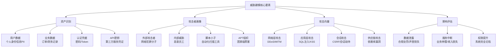
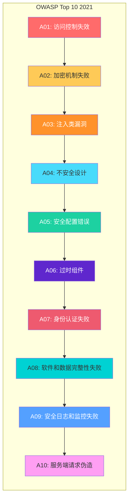
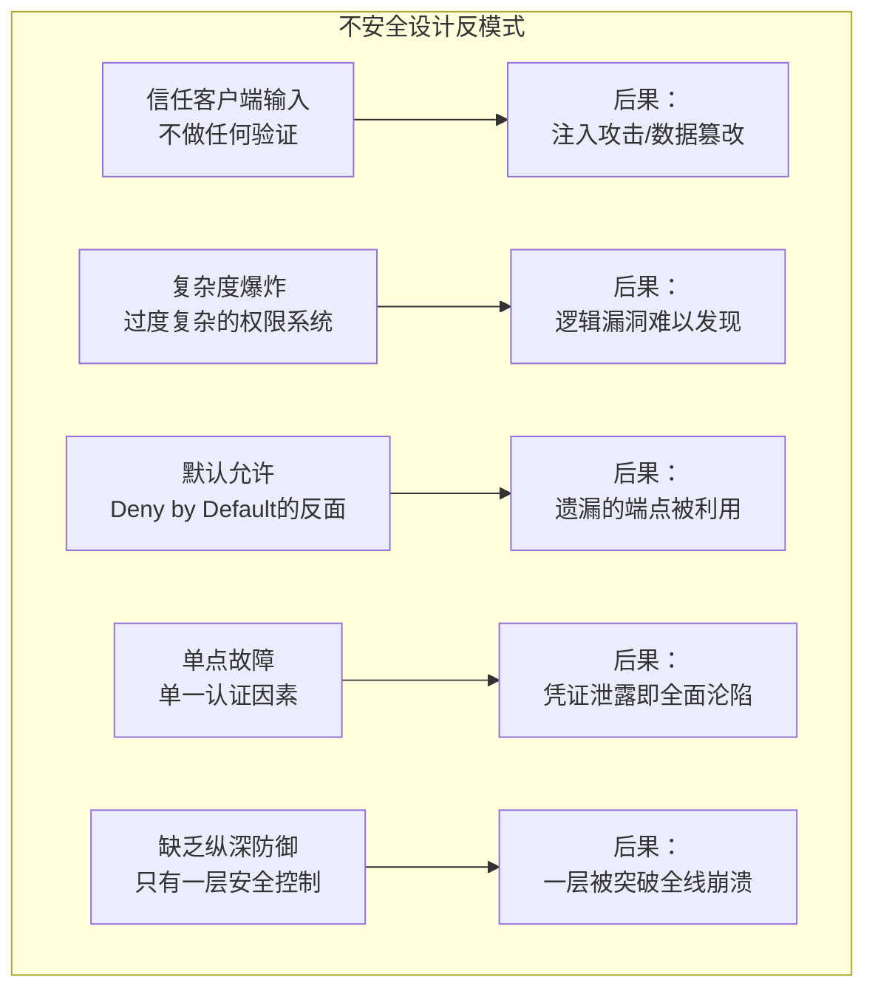
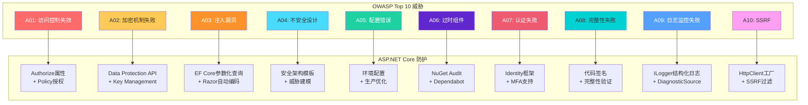
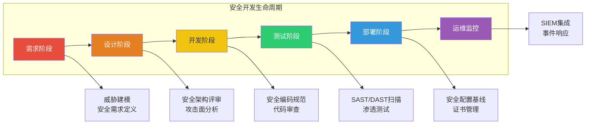
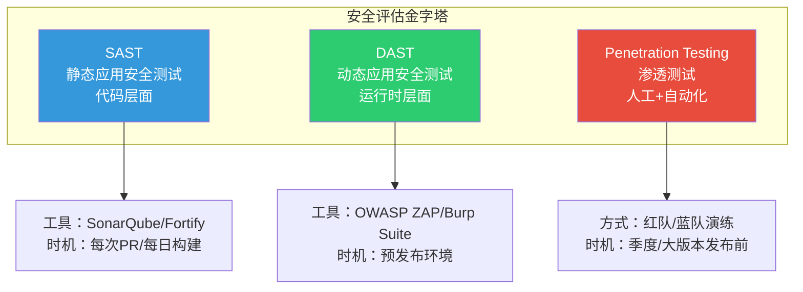

# OWASP Top 10 安全指南

> **学习目标**：掌握OWASP Top 10 2021十大Web应用安全风险，理解每个漏洞的攻击原理、危害程度，以及如何在ASP.NET Core项目中构建系统化的防护体系。

## 📚 目录

- [威胁模型概述](#威胁模型概述)
- [OWASP Top 10 详解](#owasp-top-10-详解)
- [ASP.NET Core 内置防护机制](#aspnet-core-内置防护机制)
- [安全开发生命周期(SDLC)](#安全开发生命周期sdlc)
- [安全评估方法论](#安全评估方法论)
- [实战演练](#实战演练)
- [安全检查清单](#安全检查清单)

---

## 威胁模型概述

### 什么是威胁建模？

**威胁建模（Threat Modeling）**是一种结构化的安全分析方法，帮助开发团队在设计和实现阶段识别潜在的安全威胁。对于ASP.NET Core应用程序，我们需要考虑以下关键维度：



### STRIDE威胁分类法

在构建ASP.NET应用时，使用STRIDE方法系统化地分析威胁：

| 威胁类型 | 英文 | ASP.NET场景示例 | 防护措施 |
|---------|------|----------------|---------|
| **S**poofing | 伪装 | 伪造管理员Token、伪造Cookie | 强身份验证、AntiForgery |
| **T**ampering | 篡改 | 修改表单数据、篡改请求参数 | 数字签名、HMAC校验 |
| **R**epudiation | 抵赖 | 用户否认执行过某操作 | 审计日志、操作追踪 |
| **I**nformation Disclosure | 信息泄露 | 错误信息暴露堆栈、敏感数据明文 | 统一错误处理、数据加密 |
| **D**enial of Service | 拒绝服务 | 资源耗尽型攻击、慢速连接 | 限流、资源配额 |
| **E**levation of Privilege | 权限提升 | 普通用户获取管理员权限 | 最小权限原则、RBAC |

---

## OWASP Top 10 详解

### OWASP Top 10 2021 完整列表

OWASP（Open Web Application Security Project）每几年更新一次Top 10列表，反映当前最严重的Web应用安全风险。以下是2021年版本的完整解析：



### A01:2021 - 访问控制失效 (Broken Access Control)

**风险等级**：⭐⭐⭐⭐⭐ (严重)

**攻击原理**：
访问控制失效是指应用程序未能正确实施对已认证用户的权限限制。攻击者可以利用这些缺陷访问未授权的功能或数据。

```csharp
// ❌ 危险代码：通过URL参数直接访问用户ID
[HttpGet("user/{userId}")]
public async Task<IActionResult> GetUserProfile(int userId)
{
    // 攻击者可以将userId改为任意值，访问其他用户数据
    var user = await _context.Users.FindAsync(userId);
    return Ok(user); // 直接返回用户信息，无权限检查
}

// ✅ 安全代码：基于当前用户身份进行授权
[HttpGet("profile")]
public async Task<IActionResult> GetMyProfile()
{
    // 从当前用户上下文获取用户ID，而非从参数接收
    var currentUserId = User.FindFirstValue(ClaimTypes.NameIdentifier);
    var user = await _context.Users.FindAsync(currentUserId);

    if (user == null)
        return NotFound();

    return Ok(new { user.Id, user.Username, user.Email }); // 只返回必要字段
}
```

**真实案例**：
- **Facebook 2019隐私泄露**：由于访问控制缺陷，4.19亿用户电话号码被公开
- **GitHub私有仓库泄露**：2019年发现可绕过权限直接克隆私有仓库

**ASP.NET Core防护方案**：

```csharp
// 1. 使用基于策略的授权
builder.Services.AddAuthorization(options =>
{
    options.AddPolicy("RequireAdminRole", policy =>
        policy.RequireRole("Admin"));

    options.AddPolicy("ResourceOwnerOnly", policy =>
        policy.Requirements.Add(new ResourceOwnerRequirement()));
});

// 2. 控制器级别授权
[ApiController]
[Route("api/[controller]")]
[Authorize] // 全局要求认证
public class OrdersController : ControllerBase
{
    // 只有管理员才能查看所有订单
    [HttpGet("all")]
    [Authorize(Policy = "RequireAdminRole")]
    public async Task<IActionResult> GetAllOrders() { ... }

    // 用户只能查看自己的订单
    [HttpGet("my-orders")]
    public async Task<IActionResult> GetMyOrders()
    {
        var userId = User.FindFirstValue(ClaimTypes.NameIdentifier);
        var orders = await _context.Orders
            .Where(o => o.UserId == userId)
            .ToListAsync();
        return Ok(orders);
    }
}

// 3. 自定义资源所有者授权处理器
public class ResourceOwnerHandler : AuthorizationHandler<ResourceOwnerRequirement>
{
    protected override Task HandleRequirementAsync(
        AuthorizationHandlerContext context,
        ResourceOwnerRequirement requirement)
    {
        // 验证当前用户是否是资源所有者
        var resourceOwnerId = context.Resource as string;
        var currentUserId = context.User.FindFirstValue(ClaimTypes.NameIdentifier);

        if (resourceOwnerId == currentUserId)
        {
            context.Succeed(requirement);
        }

        return Task.CompletedTask;
    }
}
```

---

### A02:2021 - 加密机制失败 (Cryptographic Failures)

**风险等级**：⭐⭐⭐⭐⭐ (严重)

**攻击原理**：
加密机制失败通常涉及敏感数据的保护不当，包括使用弱加密算法、硬编码密钥、传输中未加密等。

```csharp
// ❌ 危险代码：使用过时的加密算法
public class LegacyEncryptionService
{
    private readonly string _key = "MySecretKey123"; // 硬编码密钥！

    public string Encrypt(string plainText)
    {
        using (var des = DES.Create()) // MD5和DES已被破解
        {
            des.Key = Encoding.UTF8.GetBytes(_key);
            des.IV = Encoding.UTF8.GetBytes(_key);
            // ... 加密逻辑
        }
    }
}

// ✅ 安全代码：使用AES-256-GCM + 密钥管理
public class SecureEncryptionService : IDisposable
{
    private readonly byte[] _key;
    private bool _disposed = false;

    public SecureEncryptionService(IConfiguration configuration)
    {
        // 从安全的密钥存储获取密钥，支持轮换
        var keyBase64 = configuration["Encryption:Key"];
        _key = Convert.FromBase64String(keyBase64);

        if (_key.Length != 32) // AES-256需要32字节密钥
            throw new InvalidOperationException("密钥长度必须为256位");
    }

    public EncryptedResult Encrypt(string plainText)
    {
        using var aes = Aes.Create();
        aes.KeySize = 256; // 使用AES-256
        aes.Mode = CipherMode.GCM; // GCM模式提供完整性保护
        aes.GenerateIV(); // 每次加密生成新的IV
        aes.GenerateNonce(); // GCM模式需要Nonce

        using var encryptor = aes.CreateEncryptor();
        var plainBytes = Encoding.UTF8.GetBytes(plainText);
        var cipherBytes = encryptor.TransformFinalBlock(plainBytes, 0, plainBytes.Length);

        // 获取认证标签（用于验证数据完整性）
        var tag = ((AesGcm)encryptor).Tag;

        return new EncryptedResult
        {
            CipherText = Convert.ToBase64String(cipherBytes),
            IV = Convert.ToBase64String(aes.IV),
            Nonce = Convert.ToBase64String(aes.Nonce),
            AuthTag = Convert.ToBase64String(tag)
        };
    }

    public void Dispose()
    {
        if (!_disposed)
        {
            // 安全清除内存中的密钥
            Array.Clear(_key, 0, _key.Length);
            _disposed = true;
        }
    }
}
```

**真实案例**：
- **Equifax 2017数据泄露**：1.43亿用户数据泄露，部分原因是未及时修补Apache Struts的加密漏洞
- **LinkedIn 2012密码泄露**：650万密码哈希被破解，使用了简单的SHA-1且无盐值

**配置最佳实践**：

```json
// appsettings.Production.json
{
  "ConnectionStrings": {
    "DefaultConnection": "Server=myServer;Database=myDb;Integrated Security=True;Encrypt=True;TrustServerCertificate=False;"
  },
  "DataProtection": {
    // 使用Azure Key Vault或AWS KMS存储密钥
  },
  "Encryption": {
    "Key": "{从安全位置读取}",
    "Algorithm": "AES_256_GCM"
  },
  "Cookie": {
    "SecurePolicy": "Always", // 仅HTTPS传输Cookie
    "HttpOnly": true,         // 禁止JavaScript访问Cookie
    "SameSite": "Strict"      // 防止CSRF
  }
}
```

---

### A03:2021 - 注入类漏洞 (Injection)

**风险等级**：⭐⭐⭐⭐⭐ (严重)

注入类漏洞是Web应用中最常见也最危险的安全问题之一。详见本系列文章 [[02-SQL注入攻防详解]]。

**常见注入类型**：

| 注入类型 | 危害程度 | 典型场景 |
|---------|---------|---------|
| SQL注入 | 极高 | 用户输入拼接到SQL语句 |
| NoSQL注入 | 高 | MongoDB查询构造不安全 |
| OS命令注入 | 极高 | 系统调用包含用户输入 |
| LDAP注入 | 中高 | 目录查询未过滤 |
| XPath注入 | 中 | XML查询拼接 |

**ASP.NET Core通用防护原则**：

```csharp
// ❌ 危险代码：字符串拼接导致注入风险
public IActionResult Search(string keyword)
{
    var query = $"SELECT * FROM Products WHERE Name LIKE '%{keyword}%'";
    // SQL注入！攻击者可以输入: ' OR '1'='1' --
    var results = _context.Database.ExecuteSqlRaw(query);
    return View(results);
}

// ✅ 安全代码：使用参数化查询
public IActionResult Search(string keyword)
{
    // EF Core LINQ自动参数化查询
    var results = _context.Products
        .Where(p => p.Name.Contains(keyword))
        .ToList();

    return View(results);
}

// 如果必须使用原生SQL，使用参数化
public IActionResult SearchWithRawSql(string keyword)
{
    var results = _context.Products
        .FromSqlInterpolated($"SELECT * FROM Products WHERE Name LIKE ")
        .ToList();

    return View(results);
}
```

---

### A04:2021 - 不安全设计 (Insecure Design)

**风险等级**：⭐⭐⭐⭐ (高危)

**攻击原理**：
不安全设计是指在架构设计阶段就缺乏安全考量，导致整个系统存在根本性的安全隐患。这与"不安全实现"不同——即使代码完美实现，如果设计本身有缺陷，系统仍然不安全。

**典型的不安全设计模式**：



**安全设计原则 - 示例**：

```csharp
// ❌ 不安全设计：业务逻辑在客户端
// 前端JavaScript计算价格
function calculatePrice(quantity, unitPrice) {
    return quantity * unitPrice; // 可被篡改
}

// ✅ 安全设计：服务端强制执行业务规则
[HttpPost("checkout")]
public async Task<IActionResult> Checkout([FromBody] CheckoutRequest request)
{
    // 1. 重新从数据库获取商品价格（不信任客户端）
    var product = await _context.Products.FindAsync(request.ProductId);
    if (product == null)
        return BadRequest("商品不存在");

    // 2. 服务端重新计算总价
    var expectedTotal = product.Price * request.Quantity;

    // 3. 验证客户端提交的总价是否匹配
    if (Math.Abs(request.TotalAmount - expectedTotal) > 0.01m)
    {
        // 记录可疑行为
        _logger.LogWarning(
            "价格篡改检测：用户{UserId}提交金额{Submitted}，期望金额{Expected}",
            User.Identity?.Name, request.TotalAmount, expectedTotal);

        return BadRequest("价格异常");
    }

    // 4. 执行业务限制
    if (request.Quantity > product.MaxPurchaseQuantity)
    {
        return BadRequest($"单次购买上限为{product.MaxPurchaseQuantity}件");
    }

    // 5. 创建订单
    var order = CreateOrder(product, request.Quantity, expectedTotal);
    await _context.Orders.AddAsync(order);
    await _context.SaveChangesAsync();

    return CreatedAtAction(nameof(GetOrder), new { id = order.Id }, order);
}
```

---

### A05:2021 - 安全配置错误 (Security Misconfiguration)

**风险等级**：⭐⭐⭐⭐ (高危)

**攻击原理**：
安全配置错误是最常见的问题之一，包括使用默认配置、不必要的功能开启、错误信息泄露、云服务配置不当等。

```csharp
// Program.cs - 生产环境安全配置模板
var builder = WebApplication.CreateBuilder(args);

// ==================== 安全基础配置 ====================

// 1. 环境检测与严格模式
if (builder.Environment.IsProduction())
{
    // 生产环境启用详细日志（但脱敏）
    builder.Logging.SetMinimumLevel(LogLevel.Warning);
}

// 2. HTTPS重定向
builder.Services.AddHsts(options =>
{
    options.MaxAge = TimeSpan.FromDays(365);
    options.IncludeSubDomains = true;
    options.Preload = true;
});

builder.Services.AddHttpsRedirection(options =>
{
    options.HttpsPort = 443;
    options.RedirectStatusCode = StatusCodes.Status308PermanentRedirect;
});

// 3. Cookie安全配置
builder.Services.Configure<CookiePolicyOptions>(options =>
{
    options.MinimumSameSitePolicy = SameSiteMode.Strict;
    options.Secure = CookieSecurePolicy.Always;
});

// 4. CORS严格配置（禁止 * 通配符）
builder.Services.AddCors(options =>
{
    options.AddDefaultPolicy(policy =>
    {
        policy.WithOrigins("https://yourdomain.com") // 明确指定允许的域名
              .AllowCredentials()
              .WithMethods("GET", "POST", "PUT", "DELETE")
              .WithHeaders("Authorization", "Content-Type");
    });
});

// 5. 反向代理头部转发配置
builder.Services.Configure<ForwardedHeadersOptions>(options =>
{
    options.ForwardedHeaders = ForwardedHeaders.XForwardedFor |
                               ForwardedHeaders.XForwardedProto |
                               ForwardedHeaders.XForwardedHost;
    // 限制受信任的网络
    options.KnownNetworks.Clear();
    options.KnownProxies.Add(IPAddress.Parse("10.0.0.100")); // 你的负载均衡器IP
});

var app = builder.Build();

// ==================== 中间件管道（顺序重要！）====================

if (app.Environment.IsProduction())
{
    // HSTS必须在UseHttpsRedirection之前
    app.UseHsts();

    // 强制HTTPS
    app.UseHttpsRedirection();

    // 严格的异常处理（不泄露详细信息）
    app.UseExceptionHandler("/error");
    app.UseStatusCodePagesWithReExecute("/error/{0}");
}

// 转发代理头（必须在其他中间件之前）
app.UseForwardedHeaders();

// 安全头部中间件（见第5篇详细说明）
app.UseSecurityHeaders();

// CORS
app.UseCors();

// 静态文件安全配置
app.UseStaticFiles(new StaticFileOptions
{
    OnPrepareResponse = ctx =>
    {
        // 缓存静态资源但不缓存HTML
        var headers = ctx.Context.Response.Headers;
        var path = ctx.File.Name.ToLowerInvariant();

        if (path.EndsWith(".html") || path.EndsWith(".htm"))
        {
            headers["Cache-Control"] = "no-cache, no-store";
            headers["Pragma"] = "no-cache";
        }
        else
        {
            headers["Cache-Control"] = "public, max-age=31536000";
        }
    }
});

// 路由与端点
app.MapControllers();

// 健康检查端点（生产环境应限制访问）
app.MapHealthChecks("/health").RequireHost("localhost");

app.Run();
```

**常见配置错误清单**：

- [ ] 开发环境调试模式在生产环境开启 (`appsettings.Development.json` 被部署)
- [ ] 详细错误信息暴露给终端用户（堆栈跟踪、SQL语句）
- [ ] 默认的管理员账户未修改密码
- [ ] 不必要的功能端口开放（如Swagger UI、GraphQL IDE）
- [ ] 云存储桶（S3/Blob）设置为公开访问
- [ ] 数据库、Redis等服务无防火墙保护
- [ ] 日志中记录敏感信息（密码、信用卡号、Token）

---

### A06:2021 - 过时组件 (Vulnerable and Outdated Components)

**风险等级**：⭐⭐⭐⭐ (高危)

**攻击原理**：
现代应用程序大量依赖第三方库和框架，这些组件可能存在已知漏洞。如果未及时更新，攻击者可以利用这些已知漏洞入侵系统。

**依赖安全管理流程**：

```bash
# 1. 使用DotNet工具扫描漏洞
dotnet tool install --global Microsoft.Security.RiskAnalysers
dotnet list package --vulnerable

# 2. 使用NuGet Audit功能
dotnet restore
audit-packages  # NuGet 6.x+ 内置审计功能

# 3. GitHub Dependabot自动监控
# 在仓库根目录创建 .github/dependabot.yml
```

```yaml
# .github/dependabot.yml
version: 2
updates:
  # .NET SDK更新
  - package-ecosystem: "nuget"
    directory: "/"
    schedule:
      interval: "weekly"
    open-pull-requests-limit: 10
    reviewers:
      - "security-team"
    labels:
      - "security"
      - "dependencies"

  # GitHub Actions更新
  - package-ecosystem: "github-actions"
    directory: "/"
    schedule:
      "weekly"
```

**自动化漏洞扫描集成到CI/CD**：

```yaml
# .github/workflows/security-scan.yml
name: 安全扫描

on:
  push:
    branches: [main, develop]
  pull_request:
    branches: [main]

jobs:
  security-audit:
    runs-on: windows-latest
    steps:
      - uses: actions/checkout@v4

      - name: 设置.NET SDK
        uses: actions/setup-dotnet@v4
        with:
          dotnet-version: '8.0.x'

      - name: 还原依赖
        run: dotnet restore

      - name: 运行NuGet漏洞审计
        run: dotnet list package --vulnerable --include-transitive

      - name: 运行Microsoft安全分析器
        run: dotnet build /p:EnableNETAnalyzers=true /p:AnalysisMode=AllEnabledByDefault

      - name: 检查Secret泄露
        uses: trufflesecurity/trufflehog@main
        with:
          path: .
          base: ${{ github.event.repository.default_branch }}
          head: HEAD
```

---

### A07:2021 - 身份认证失败 (Identification and Authentication Failures)

**风险等级**：⭐⭐⭐⭐⭐ (严重)

**攻击原理**：
身份认证失败涉及认证机制的弱点，包括弱密码策略、会话管理不当、凭证填充攻击等。

**完整认证安全实现**：

```csharp
// 1. 密码策略配置
public class PasswordOptions
{
    public const int MinLength = 12;           // 最小12位
    public const int MaxLength = 128;          // 最大128位
    public const int RequiredUniqueChars = 6;   // 至少6个不同字符
    public const bool RequireNonAlphanumeric = true;  // 必须含特殊字符
    public const bool RequireDigit = true;             // 必须含数字
    public const bool RequireLowercase = true;         // 必须含小写字母
    public const bool RequireUppercase = true;         // 必须含大写字母
}

// 2. 配置Identity强密码策略
builder.Services.Configure<IdentityOptions>(options =>
{
    options.Password.RequiredLength = PasswordOptions.MinLength;
    options.Password.RequireNonAlphanumeric = PasswordOptions.RequireNonAlphanumeric;
    options.Password.RequireDigit = PasswordOptions.RequireDigit;
    options.Password.RequireLowercase = PasswordOptions.RequireLowercase;
    options.Password.RequireUppercase = PasswordOptions.RequireUppercase;

    // 锁定策略：防止暴力破解
    options.Lockout.DefaultLockoutTimeSpan = TimeSpan.FromMinutes(15);
    options.Lockout.MaxFailedAccessAttempts = 5;
    options.Lockout.AllowedForNewUsers = true;

    // 会话安全
    options.User.RequireUniqueEmail = true;
    options.SignIn.RequireConfirmedEmail = true;
    options.SignIn.RequireConfirmedPhoneNumber = false;
});

// 3. 自定义密码验证器（额外强度检查）
public class StrongPasswordValidator<TUser> : IPasswordValidator<TUser>
    where TUser : class
{
    public async Task<IdentityResult> ValidateAsync(UserManager<TUser> manager,
                                                     TUser user,
                                                     string password)
    {
        var errors = new List<IdentityError>();

        // 检查常见弱密码
        var commonPasswords = new[]
        {
            "password", "123456", "qwerty", "admin",
            "letmein", "welcome", "monkey", "dragon"
        };

        if (commonPasswords.Any(p => password.ToLower().Contains(p)))
        {
            errors.Add(new IdentityError
            {
                Code = "CommonPassword",
                Description = "不能使用常见的弱密码"
            });
        }

        // 检查连续字符（如"aaa"、"111"）
        if (Regex.IsMatch(password, @"(.)\1{2,}"))
        {
            errors.Add(new IdentityError
            {
                Code = "SequentialChars",
                Description = "密码不能包含3个以上连续相同字符"
            });
        }

        // 检查键盘序列（如"qwer"、"asdf"）
        var keyboardSequences = new[] { "qwert", "asdfg", "zxcvb", "12345" };
        if (keyboardSequences.Any(s => password.ToLower().Contains(s)))
        {
            errors.Add(new IdentityError
            {
                Code = "KeyboardSequence",
                Description = "不能使用键盘上的连续字符序列"
            });
        }

        return errors.Count > 0
            ? IdentityResult.Failed(errors.ToArray())
            : IdentityResult.Success;
    }
}
```

**多因素认证(MFA)实现**：

```csharp
// 启用TOTP（基于时间的一次性密码）
builder.Services.AddIdentity<ApplicationUser, IdentityRole>()
    .AddEntityFrameworkStores<ApplicationDbContext>()
    .AddDefaultTokenProviders() // 用于2FA令牌生成
    .AddTokenProvider<DataProtectorTokenProvider<ApplicationUser>>("Default");

// 2FA控制器
[ApiController]
[Route("api/[controller]")]
public class TwoFactorController : ControllerBase
{
    private readonly UserManager<ApplicationUser> _userManager;
    private readonly UrlEncoder _urlEncoder;

    // 生成2FA设置密钥
    [HttpPost("setup")]
    public async Task<IActionResult> SetupTwoFactor()
    {
        var user = await GetUserAsync();
        if (user == null) return Unauthorized();

        // 生成共享密钥
        var authenticatorKey = await _userManager.GetAuthenticatorKeyAsync(user);
        if (string.IsNullOrEmpty(authenticatorKey))
        {
            await _userManager.ResetAuthenticatorKeyAsync(user);
            authenticatorKey = await _userManager.GetAuthenticatorKeyAsync(user);
        }

        // 生成QR码URL（用于Google Authenticator/Microsoft Authenticator扫码）
        var qrCodeUrl = GenerateQrCodeUrl(user.Email, authenticatorKey);

        return Ok(new
        {
            SharedKey = authenticatorKey,
            QrCodeSetupImageUrl = qrCodeUrl,
            ManualEntryKey = FormatKeyForManualEntry(authenticatorKey)
        });
    }

    // 验证2FA码
    [HttpPost("verify")]
    public async Task<IActionResult> VerifyTwoFactor([FromBody] Verify2FARequest request)
    {
        var user = await GetUserAsync();
        if (user == null) return Unauthorized();

        // 移除空格和短横线
        var code = request.Code.Replace(" ", string.Empty).Replace("-", string.Empty);

        var result = await _userManager.VerifyTwoFactorTokenAsync(
            user,
            _userManager.Options.Tokens.AuthenticatorTokenProvider,
            code);

        if (!result)
        {
            // 记录失败的2FA尝试
            _logger.LogWarning("2FA验证失败，用户：{Email}", user.Email);
            return BadRequest("验证码无效");
        }

        // 启用2FA
        await _userManager.SetTwoFactorEnabledAsync(user, true);
        return Ok(new { Message = "双因素认证已启用" });
    }
}
```

---

### A08:2021 - 软件和数据完整性失败 (Software and Data Integrity Failures)

**风险等级**：⭐⭐⭐⭐ (高危)

**攻击原理**：
软件和数据完整性失败涉及不信任的数据和代码更新流程，包括不安全的CI/CD管道、未签名的更新包、CDN劫持等。

**CI/CD安全实践**：

```yaml
# 安全的GitHub Actions工作流示例
name: 安全部署流水线

on:
  push:
    tags: ['v*']

jobs:
  # 1. 代码签名验证
  verify-signatures:
    runs-on: ubuntu-latest
    steps:
      - uses: actions/checkout@v4
        with:
          fetch-depth: 0  # 获取完整历史以验证签名

      - name: 验证Git提交签名
        run: |
          git log --format="%H %ae %G?" ${{ github.event.before }}..${{ github.sha }} |
          while read hash email status; do
            if [ "$status" != "G" ]; then
              echo "::error::未签名的提交: $hash by $email"
              exit 1
            fi
          done

  # 2. 依赖完整性验证
  verify-dependencies:
    needs: verify-signatures
    runs-on: ubuntu-latest
    steps:
      - uses: actions/checkout@v4

      - name: 验证NuGet包锁文件
        run: |
          if ! Test-Path packages.lock.json; then
            Write-Error "缺少packages.lock.json，无法确保依赖一致性"
            exit 1
          }

          # 启用锁文件模式
          dotnet restore --locked-mode

  # 3. 构建并签名程序集
  build-and-sign:
    needs: verify-dependencies
    runs-on: windows-latest
    env:
      SIGNING_CERTIFICATE_BASE64: ${{ secrets.SIGNING_CERTIFICATE }}
      SIGNING_CERTIFICATE_PASSWORD: ${{ secrets.CERT_PASSWORD }}

    steps:
      - uses: actions/checkout@v4

      - name: 构建项目
        run: dotnet build --configuration Release

      - name: 对程序集进行代码签名
        shell: pwsh
        run: |
          $certPath = "$env:TEMP\signing-cert.pfx"
          [System.IO.File]::WriteAllBytes($certPath,
            [Convert]::FromBase64String($env:SIGNING_CERTIFICATE_BASE64))

          Get-ChildItem -Path bin\Release\net8.0\*.dll |
            Where-Object { !$_.Name.StartsWith('Microsoft.') -and
                          !$_.Name.StartsWith('System.') } |
            ForEach-Object {
              signtool sign /f $certPath /p $env:SIGNING_CERTIFICATE_PASSWORD /tr http://timestamp.digicert.com /td SHA256 /fd SHA256 $_.FullName
            }
```

**运行时完整性保护**：

```csharp
// 程序启动时验证关键文件的完整性
public class IntegrityVerificationStartupFilter : IStartupFilter
{
    public Action<IApplicationBuilder> Configure(Action<IApplicationBuilder> next)
    {
        return app =>
        {
            // 在应用启动时验证关键文件哈希
            VerifyCriticalFilesIntegrity(app.ApplicationServices);

            next(app);
        };
    }

    private void VerifyCriticalFilesIntegrity(IServiceProvider serviceProvider)
    {
        var logger = serviceProvider.GetRequiredService<ILogger<IntegrityVerificationStartupFilter>>();
        var hostEnvironment = serviceProvider.GetRequiredService<IHostEnvironment>();
        var configuration = serviceProvider.GetRequiredService<IConfiguration>();

        // 从安全存储加载预期的文件哈希
        var expectedHashes = configuration.GetSection("FileIntegrity")
                                          .Get<Dictionary<string, string>>();

        foreach (var (file, expectedHash) in expectedHashes)
        {
            var filePath = Path.Combine(hostEnvironment.ContentRootPath, file);

            if (!System.IO.File.Exists(filePath))
            {
                logger.LogCritical("关键文件缺失：{File}", file);
                throw new FileNotFoundException($"安全违规：关键文件 {file} 缺失");
            }

            var actualHash = ComputeSha256Hash(filePath);

            if (!string.Equals(actualHash, expectedHash, StringComparison.OrdinalIgnoreCase))
            {
                logger.LogCritical(
                    "文件完整性验证失败：{File}，预期哈希：{Expected}，实际哈希：{Actual}",
                    file, expectedHash, actualHash);

                throw new InvalidOperationException(
                    $"安全违规：文件 {file} 可能已被篡改！");
            }

            logger.LogInformation("文件完整性验证通过：{File}", file);
        }
    }

    private static string ComputeSha256Hash(string filePath)
    {
        using var sha256 = SHA256.Create();
        using var stream = System.IO.File.OpenRead(filePath);
        var hashBytes = sha256.ComputeHash(stream);
        return BitConverter.ToString(hashBytes).Replace("-", "").ToLowerInvariant();
    }
}
```

---

### A09:2021 - 安全日志和监控失败 (Security Logging and Monitoring Failures)

**风险等级**：⭐⭐⭐⭐ (高危)

**攻击原理**：
缺乏日志记录和监控使得攻击无法被及时发现和响应。大多数成功的 breaches 都是因为日志不足或无人审查日志。

**完整的日志架构**：

```csharp
// 1. 定义安全事件枚举
public enum SecurityEventType
{
    AuthenticationSuccess,
    AuthenticationFailure,
    AccountLockedOut,
    PasswordChanged,
    TwoFactorEnabled,
    PrivilegeEscalationAttempt,
    DataAccessViolation,
    SuspiciousApiCall,
    RateLimitExceeded,
    InvalidAntiForgeryToken
}

// 2. 安全事件记录服务
public interface ISecurityEventLogger
{
    Task LogAsync(SecurityEventType eventType, string userId, string details,
                  HttpContext? context = null, Dictionary<string, object>? metadata = null);
}

public class SecurityEventLogger : ISecurityEventLogger
{
    private readonly ILogger<SecurityEventLogger> _logger;
    private readonly ApplicationDbContext _dbContext;
    private readonly IHttpContextAccessor _httpContextAccessor;

    public SecurityEventLogger(
        ILogger<SecurityEventLogger> logger,
        ApplicationDbContext dbContext,
        IHttpContextAccessor httpContextAccessor)
    {
        _logger = logger;
        _dbContext = dbContext;
        _httpContextAccessor = httpContextAccessor;
    }

    public async Task LogAsync(
        SecurityEventType eventType,
        string userId,
        string details,
        HttpContext? context = null,
        Dictionary<string, object>? metadata = null)
    {
        var httpContext = context ?? _httpContextAccessor.HttpContext;

        // 构建安全事件实体
        var securityEvent = new SecurityEvent
        {
            Id = Guid.NewGuid(),
            EventType = eventType,
            UserId = userId,
            Timestamp = DateTime.UtcNow,
            Details = details,

            // 收集上下文信息
            IpAddress = httpContext?.Connection?.RemoteIpAddress?.ToString(),
            UserAgent = httpContext?.Request?.Headers["UserAgent"].FirstOrDefault(),
            RequestPath = httpContext?.Request?.Path.Value,
            HttpMethod = httpContext?.Request?.Method,
            StatusCode = httpContext?.Response?.StatusCode,

            // 序列化元数据
            MetadataJson = metadata != null ? JsonSerializer.Serialize(metadata) : null
        };

        // 异步写入数据库
        _dbContext.SecurityEvents.Add(securityEvent);
        await _dbContext.SaveChangesAsync();

        // 同时输出到结构化日志
        using (_logger.BeginScope(new Dictionary<string, object>
        {
            ["EventId"] = securityEvent.Id,
            ["EventType"] = eventType.ToString(),
            ["UserId"] = userId,
            ["IpAddress"] = securityEvent.IpAddress ?? "N/A"
        }))
        {
            var logLevel = DetermineLogLevel(eventType);
            _logger.Log(logLevel, "安全事件：{EventType} - {Details}",
                       eventType, details);
        }
    }

    private static LogLevel DetermineLogLevel(SecurityEventType eventType)
    {
        return eventType switch
        {
            SecurityEventType.PrivilegeEscalationAttempt or
            SecurityEvent.DataAccessViolation or
            SecurityEventType.AccountLockedOut => LogLevel.Critical,

            SecurityEventType.AuthenticationFailure or
            SecurityEventType.InvalidAntiForgeryToken or
            SecurityEventType.RateLimitExceeded => LogLevel.Warning,

            _ => LogLevel.Information
        };
    }
}
```

**实时告警规则配置**：

```json
// 监控系统告警规则示例（适用于ELK/Prometheus/Grafana）
{
  "alert_rules": [
    {
      "name": "暴力破解检测",
      "condition": "同一IP在5分钟内登录失败超过5次",
      "severity": "high",
      "action": [
        "发送邮件给安全团队",
        "临时封锁IP",
        "增加该账号的验证要求"
      ]
    },
    {
      "name": "异常数据访问",
      "condition": "单个用户在1小时内查询超过正常量3倍的记录",
      "severity": "medium",
      "action": [
        "标记账号待审核",
        "通知用户确认活动"
      ]
    },
    {
      "name": "权限提升尝试",
      "condition": "普通用户尝试访问管理员API",
      "severity": "critical",
      "action": [
        "立即封锁账号",
        "触发安全事件响应流程",
        "保留完整审计追踪"
      ]
    },
    {
      "name": "大量404错误",
      "condition": "单IP产生超过100个404响应/分钟",
      "severity": "low",
      "action": [
        "记录为潜在侦察行为",
        "若持续则升级处理"
      ]
    }
  ]
}
```

---

### A10:2021 - 服务端请求伪造 (Server-Side Request Forgery, SSRF)

**风险等级**：⭐⭐⭐⭐ (高危)

**攻击原理**：
SSRF攻击允许攻击者诱导服务器向其选择的地址发起请求。这在云环境中尤其危险，因为可以用来访问内部元数据服务（如AWS EC2的169.254.169.254）。

**SSRF防护中间件**：

```csharp
/// <summary>
/// SSRF防护中间件 - 限制服务器发起的出站请求
/// </summary>
public class SsrfProtectionMiddleware
{
    private readonly RequestDelegate _next;
    private readonly SsrfProtectionOptions _options;
    private readonly ILogger<SsrfProtectionMiddleware> _logger;

    public SsrfProtectionMiddleware(
        RequestDelegate next,
        IOptions<SsrfProtectionOptions> options,
        ILogger<SsrfProtectionMiddleware> logger)
    {
        _next = next;
        _options = options.Value;
        _logger = logger;
    }

    public async Task InvokeAsync(HttpContext context)
    {
        // 检查请求是否包含URL参数（SSRF常见入口点）
        var targetUrl = ExtractTargetUrl(context.Request);

        if (targetUrl != null)
        {
            if (!IsUrlAllowed(targetUrl))
            {
                _logger.LogWarning(
                    "SSRF攻击尝试被拦截：目标URL={TargetUrl}，来源IP={RemoteIp}",
                    targetUrl,
                    context.Connection.RemoteIpAddress);

                context.Response.StatusCode = StatusCodes.Status403Forbidden;
                await context.Response.WriteAsync("请求的目标地址不被允许");
                return;
            }
        }

        await _next(context);
    }

    private string? ExtractTargetUrl(HttpRequest request)
    {
        // 检查常见的SSRF攻击参数
        var suspiciousParameters = new[] { "url", "uri", "path", "dest", "redirect", "target", "link", "next", "return_to", "callback" };

        foreach (var param in suspiciousParameters)
        {
            if (request.Query.TryGetValue(param, out var values) &&
                Uri.TryCreate(values.FirstOrDefault(), UriKind.Absolute, out var uri))
            {
                return uri.ToString();
            }

            // 也检查JSON body（针对API请求）
            if (request.HasFormContentType && request.Form.TryGetValue(param, out var formValues))
            {
                return formValues.FirstOrDefault();
            }
        }

        return null;
    }

    private bool IsUrlAllowed(string url)
    {
        if (!Uri.TryCreate(url, UriKind.Absolute, out var uri))
            return false;

        // 1. 协议白名单（只允许HTTP/HTTPS）
        var allowedSchemes = new[] { Uri.UriSchemeHttp, Uri.UriSchemeHttps };
        if (!allowedSchemes.Contains(uri.Scheme, StringComparer.OrdinalIgnoreCase))
            return false;

        // 2. 禁止私有IP地址范围
        if (IsPrivateIpAddress(uri.Host) || IsLoopback(uri.Host))
            return false;

        // 3. 禁止IPv6本地地址
        if (uri.HostNameType == UriHostNameType.IPv6 && IsIpv6Local(uri.Host))
            return false;

        // 4. DNS rebinding防护：解析后再次检查IP
        try
        {
            var addresses = Dns.GetHostAddresses(uri.Host);
            return !addresses.Any(ip => IsPrivateIpAddress(ip.ToString()) || IsLoopback(ip.ToString()));
        }
        catch
        {
            // DNS解析失败，拒绝请求
            return false;
        }
    }

    private static bool IsPrivateIpAddress(string host)
    {
        if (!IPAddress.TryParse(host, out var ipAddress))
        {
            // 尝试DNS解析后再判断
            try
            {
                var addresses = Dns.GetHostAddresses(host);
                return addresses.Any(IsPrivateIp);
            }
            catch
            {
                return true; // 无法解析则视为不安全
            }
        }

        return IsPrivateIp(ipAddress);
    }

    private static bool IsPrivateIp(IPAddress ip)
    {
        // 10.0.0.0/8
        // 172.16.0.0/12
        // 192.168.0.0/16
        // 127.0.0.0/8 (loopback)
        // 169.254.169.254 (cloud metadata)
        byte[] bytes = ip.GetAddressBytes();

        // 10.0.0.0/8
        if (bytes[0] == 10) return true;

        // 172.16.0.0/12
        if (bytes[0] == 172 && bytes[1] >= 16 && bytes[1] <= 31) return true;

        // 192.168.0.0/16
        if (bytes[0] == 192 && bytes[1] == 168) return true;

        // 127.0.0.0/8
        if (bytes[0] == 127) return true;

        // 169.254.169.254 (AWS/Azure/GCP元数据服务)
        if (bytes[0] == 169 && bytes[1] == 254) return true;

        return false;
    }

    private static bool IsLoopback(string host) =>
        IPAddress.IsLoopback(IPAddress.Parse(host));

    private static bool IsIpv6Local(string host) =>
        host == "::1" || host.StartsWith("fe80:") || host.StartsWith("fc00:");
}

// 配置选项
public class SsrfProtectionOptions
{
    // 可以添加自定义的白名单域名
    public HashSet<string> AllowedDomains { get; set; } = new();
    public bool BlockPrivateNetworks { get; set; } = true;
    public bool EnableDnsRebindingProtection { get; set; } = true;
}
```

---

## ASP.NET Core 内置防护机制

### 威胁矩阵与防护映射图



### 核心防护组件一览

| OWASP类别 | ASP.NET Core内置机制 | 配置要点 |
|----------|---------------------|---------|
| A01 访问控制 | `[Authorize]`、`IAuthorizationService` | 始终显式声明授权策略 |
| A02 加密 | `IDataProtector`、`IAuthenticatedEncryptor` | 生产环境配置专用密钥存储 |
| A03 注入 | EF Core LINQ、Razor HTML编码 | 避免原始SQL拼接 |
| A04 设计 | 依赖注入、中间件管道 | 采用安全设计模式 |
| A05 配置 | 多环境配置、选项模式 | 生产环境严格配置 |
| A06 组件 | NuGet包还原锁定 | 启用Dependabot自动化 |
| A07 认证 | ASP.NET Core Identity | 启用MFA和账户锁定 |
| A08 完整性 | 程序集签名、锁文件 | CI/CD中加入完整性检查 |
| A09 日志 | `ILogger<T>`、`DiagnosticSource` | 结构化日志+集中式收集 |
| A10 SSRF | `IHttpClientFactory`、`SocketsHttpHandler` | 白名单+DNS验证 |

---

## 安全开发生命周期(SDLC)

### 将安全融入每个阶段



### 各阶段安全任务清单

#### 1. 需求阶段

```markdown
## 安全需求文档模板

### 1. 项目背景与资产识别
- [ ] 列出系统处理的敏感数据类型（PII、财务数据、健康信息等）
- [ ] 识别关键的 业务功能和数据流
- [ ] 定义合规要求（GDPR、等保、PCI-DSS等）

### 2. 威胁建模结果
- [ ] 完成STRIDE/PASTA/DREA威胁建模
- [ ] 识别TOP 5高风险威胁
- [ ] 为每个威胁定义缓解措施

### 3. 安全需求定义
#### 认证需求
- [ ] 支持哪些认证方式？（用户名密码/OAuth/OpenID Connect）
- [ ] 是否需要多因素认证？
- [ ] 密码策略要求？

#### 授权需求
- [ ] 角色权限矩阵
- [ ] 数据访问粒度（行级/列级？）
- [ ] API访问控制策略？

#### 数据保护需求
- [ ] 静态数据加密要求（字段级/磁盘级？）
- [ ] 传输加密要求（TLS版本？）
- [ ] 密钥管理方案？

#### 日志审计需求
- [ ] 需要记录哪些安全事件？
- [ ] 日志保留期限？
- [ ] 实时告警阈值？

### 4. 合规检查项
- [ ] GDPR：数据主体权利实现计划
- [ ] 等保2.0：对应级别的技术要求
- [ ] 行业特定法规遵循计划
```

#### 2. 设计阶段

```csharp
// 安全架构决策记录 (ADR) 模板
/*
 * ADR-001: 认证方案选择
 *
 * 背景：系统需要支持多种用户类型的认证
 *
 * 决策：采用OpenID Connect + OAuth 2.0协议
 * - 前端应用：Authorization Code Flow + PKCE
 * - 后端API：Bearer Token验证
 * - 第三方登录：Google/GitHub/企业AD
 *
 * 替代方案：
 * - 方案A：自建Identity Provider → 维护成本高
 * - 方案B：Session-based认证 → 不适合前后端分离
 *
 * 影响：
 * - 需要部署IdentityServer4或使用Azure AD B2C
 * - Token刷新机制需要前端配合
 * - 需要实现Token Revocation列表
 */
```

#### 3. 开发阶段 - 安全编码规范

```csharp
/// <summary>
/// 安全编码规范示例 - 输入处理
/// </summary>
public static class SecureInputExtensions
{
    /// <summary>
    /// 安全地获取并验证用户输入
    /// </summary>
    public static T? GetValidatedInput<T>(this HttpRequest request,
                                           string parameterName,
                                           Func<string, (bool IsValid, T? Value)> validator,
                                           T? defaultValue = default)
    {
        var rawValue = request.Query[parameterName].FirstOrDefault()
                     ?? request.Form[parameterName].FirstOrDefault();

        if (string.IsNullOrWhiteSpace(rawValue))
            return defaultValue;

        // 1. 长度限制（防止DoS）
        if (rawValue.Length > 1000)
            throw new SecurityException($"参数 {parameterName} 超过最大长度限制");

        // 2. 自定义验证
        var (isValid, value) = validator(rawValue.Trim());

        if (!isValid)
            throw new ValidationException($"参数 {parameterName} 格式无效");

        return value;
    }

    /// <summary>
    /// 安全地从JSON Body获取输入
    /// </summary>
    public static async Task<T?> GetValidatedBodyAsync<T>(
        this HttpRequest request,
        Action<T>? additionalValidation = null)
    {
        try
        {
            // 限制请求体大小（默认28.6MB，这里限制为1MB）
            if (request.ContentLength > 1024 * 1024)
                throw new RequestSizeLimitExceededException();

            var model = await request.ReadFromJsonAsync<T>();

            if (model == null)
                return default;

            // 执行额外的业务验证
            additionalValidation?.Invoke(model);

            return model;
        }
        catch (JsonException ex)
        {
            throw new SecurityException("请求数据格式无效", ex);
        }
    }
}
```

#### 4. 测试阶段 - 自动化安全测试

```csharp
/// <summary>
/// 安全单元测试示例 - 测试访问控制
/// </summary>
[TestClass]
public class AccessControlSecurityTests
{
    private HttpClient _anonymousClient;
    private HttpClient _regularUserClient;
    private HttpClient _adminClient;

    [TestInitialize]
    public void Setup()
    {
        // 创建不同角色的测试客户端
        var application = new WebApplicationFactory<Program>();

        _anonymousClient = application.CreateClient();

        _regularUserClient = application.WithWebHostBuilder(builder =>
        {
            builder.ConfigureTestServices(services =>
            {
                services.AddAuthentication(TestAuthHandler.AuthenticationScheme)
                        .AddScheme<TestAuthHandler, TestAuthHandler>(
                            TestAuthHandler.AuthenticationScheme, options => { });

                // 模拟普通用户身份
                services.AddScoped<ICurrentUserService, TestRegularUserService>();
            });
        }).CreateClient(new WebApplicationFactoryClientOptions
        {
            AllowAutoRedirect = false
        });

        _adminClient = application.WithWebHostBuilder(builder =>
        {
            builder.ConfigureTestServices(services =>
            {
                services.AddAuthentication(TestAuthHandler.AuthenticationScheme)
                        .AddScheme<TestAuthHandler, TestAuthHandler>(
                            TestAuthHandler.AuthenticationScheme, options => { });

                // 模拟管理员身份
                services.AddScoped<ICurrentUserService, TestAdminUserService>();
            });
        }).CreateClient();
    }

    [TestMethod]
    [Description("匿名用户不应能访问受保护的API")]
    public async Task AnonymousUser_CannotAccess_ProtectedEndpoint()
    {
        // Arrange & Act
        var response = await _anonymousClient.GetAsync("/api/admin/users");

        // Assert
        Assert.AreEqual(HttpStatusCode.Unauthorized, response.StatusCode);
    }

    [TestMethod]
    [Description("普通用户不应能访问管理员接口")]
    public async Task RegularUser_CannotAccess_AdminEndpoint()
    {
        // Arrange & Act
        var response = await _regularUserClient.GetAsync("/api/admin/users");

        // Assert
        Assert.AreEqual(HttpStatusCode.Forbidden, response.StatusCode);
    }

    [TestMethod]
    [Description("管理员应该能访问管理员接口")]
    public async Task AdminUser_CanAccess_AdminEndpoint()
    {
        // Arrange & Act
        var response = await _adminClient.GetAsync("/api/admin/users");

        // Assert
        Assert.AreEqual(HttpStatusCode.OK, response.StatusCode);
    }

    [TestMethod]
    [Description("用户不能访问其他用户的数据")]
    public async Task User_CannotAccess_OtherUserData()
    {
        // Arrange
        var otherUserId = "other-user-123";

        // Act - 尝试直接通过ID访问其他用户数据
        var response = await _regularUserClient.GetAsync($"/api/users/{otherUserId}/profile");

        // Assert - 应该返回Forbidden或NotFound（而不是OK）
        Assert.IsTrue(response.StatusCode == HttpStatusCode.Forbidden ||
                      response.StatusCode == HttpStatusCode.NotFound,
                      $"期望403或403，实际得到{(int)response.StatusCode}");
    }
}
```

---

## 安全评估方法论

### 三层安全评估体系



### SAST（静态应用安全测试）

**推荐工具链**：

```bash
# 1. 安装.NET安全分析器（Visual Studio内置）
dotnet add package Microsoft.CodeAnalysis.NetAnalyzers

# 2. SonarQube Scanner for MSBuild
# 下载：https://docs.sonarqube.com/latest/analyzing-source-code/languages/csharp/

# 3. 运行分析
dotnet-sonarscanner begin \
  /k:"project-key" \
  /n:"Project Name" \
  /v:"1.0" \
  /o:"organization" \
  /d:sonar.login="$SONAR_TOKEN" \
  /d:sonar.host.url="https://sonar.yourcompany.com"

dotnet build
dotnet-sonarscanner end /d:sonar.login="$SONAR_TOKEN"
```

**自定义安全规则集示例**：

```xml
<!-- .ruleset 文件 - 自定义安全规则 -->
<RuleSet Name="ASP.NET Security Rules" Description="安全相关规则集合" ToolsVersion="16.0">
  <Rules AnalyzerId="Microsoft.Net.Core.Analyzers" RuleNamespace="Microsoft.Net.Core.Analyzers">
    <!-- SQL注入检测 -->
    <Rule Id="CA2100" Action="Error" />
    <!-- XSS检测 -->
    <Rule Id="CA1054" Action="Warning" />
    <!-- 信息泄露 -->
    <Rule Id="CA2300" Action="Error" />
    <Rule Id="CA2301" Action="Error" />
    <Rule Id="CA2302" Action="Error" />
  </Rules>

  <Rules AnalyzerId="Microsoft.Net.CSharp.Analyzers" RuleNamespace="Microsoft.Net.CSharp.Analyzers">
    <!-- 危险方法调用 -->
    <Rule Id="CA5350" Action="Warning" />  <!-- 弱加密算法 -->
    <Rule Id="CA5351" Action="Error" />    <!-- 已破解的加密算法 -->
    <Rule Id="CA5390" Action="Error" />    <!-- 硬编码密钥 -->
  </Rules>
</RuleSet>
```

### DAST（动态应用安全测试）

**OWASP ZAP自动化扫描配置**：

```bash
#!/bin/bash
# zap-baseline-scan.sh - CI/CD集成脚本

# ZAP参数配置
ZAP_HOST="localhost"
ZAP_PORT="8080"
TARGET_URL="https://staging.yourapp.com"
CONTEXT_NAME="Test Context"
AUTH_URL="https://staging.yourapp.com/api/auth/login"
USERNAME="test-user"
PASSWORD="test-password-123"

# 启动ZAP daemon模式
docker run --rm -u zap \
  -i -t \
  -p ${ZAP_PORT}:${ZAP_PORT} \
  owasp/zap-stable \
  zap.sh -daemon \
    -host 0.0.0.0 \
    -port ${ZAP_PORT} \
    -config api.addrs.addr.name=.* \
    -config api.addrs.addr.regex=true \
    -config api.key=${ZAP_API_KEY}

# 等待ZAP启动
sleep 10

# 执行基线扫描
docker run --rm -v $(pwd):/zap/wrk:rw \
  -t owasp/zap-stable \
  zap-baseline.py \
    -t ${TARGET_URL} \
    -j zap-report.json \
    -w zap-report.html \
    -I \
    -r \
    -c zap-context.json

# 解析结果
if grep -q '"risk":"High"' zap-report.json; then
    echo "ERROR: 发现高危漏洞！"
    exit 1
else
    echo "INFO: 扫描完成，未发现高危漏洞"
fi
```

### 渗透测试清单

```markdown
## 渗透测试范围清单

### 信息收集
- [ ] DNS信息收集（子域名、MX记录、TXT记录）
- [ ] 端口扫描和服务识别
- [ ] Web指纹识别（框架版本、服务器信息）
- [ ] Google hacking（site:yourdomain.com 敏感文件）
- [ ] GitHub信息泄露（.git/config、.env文件、API密钥）

### 认证测试
- [ ] 弱密码爆破
- [ ] 密码重置流程滥用
- [ ] 会话固定攻击
- [ ] Cookie安全性检查
- [ ] 多因素认证绕过
- [ ] OAuth/OpenID Connect流程缺陷

### 授权测试
- [ ] 水平越权（同角色访问他人数据）
- [ ] 垂直越权（低权限访问高权限功能）
- [ ] IDOR（不安全的直接对象引用）
- [ ] 参数篡改（价格、数量、权限标志）
- [ ] HTTP Method绕过（PUT/DELETE未授权）

### 注入测试
- [ ] SQL注入（GET/POST/Header/Cookie）
- [ ] NoSQL注入（MongoDB操作符注入）
- [ ] XSS（反射型/存储型/DOM型）
- [ ] 命令注入（OS Command Injection）
- [ ] LDAP注入
- [ ] XPath注入

### 其他测试
- [ ] CSRF Token有效性
- [ ] SSRF（内部服务探测）
- [ ] 文件上传漏洞
- [ ] 业务逻辑漏洞
- [ ] 并发竞争条件
- [ ] API速率限制绕过
```

---

## 实战演练

### 场景：电商网站安全加固

假设我们有一个电商平台，需要根据OWASP Top 10进行全面安全加固。以下是一个完整的实战示例：

#### 步骤1：建立安全基线

```csharp
// SecurityBaseline.cs - 安全基线检查
public class SecurityBaselineChecker
{
    private readonly IConfiguration _configuration;
    private readonly ILogger<SecurityBaselineChecker> _logger;

    public SecurityBaselineChecker(IConfiguration configuration,
                                    ILogger<SecurityBaselineChecker> logger)
    {
        _configuration = configuration;
        _logger = logger;
    }

    public async Task<SecurityReport> RunFullCheckup()
    {
        var report = new SecurityReport
        {
            CheckTimestamp = DateTime.UtcNow,
            Items = new List<SecurityCheckItem>()
        };

        // A01: 访问控制检查
        report.Items.Add(CheckAccessControl());

        // A02: 加密配置检查
        report.Items.Add(CheckEncryptionSettings());

        // A05: 安全配置检查
        report.Items.Add(CheckSecurityConfiguration());

        // A07: 认证配置检查
        report.Items.Add(CheckAuthenticationConfig());

        // A09: 日志配置检查
        report.Items.Add(CheckLoggingConfiguration());

        // 生成报告摘要
        report.Summary = GenerateSummary(report.Items);

        return report;
    }

    private SecurityCheckItem CheckAccessControl()
    {
        var item = new SecurityCheckItem
        {
            Category = "A01-访问控制",
            Checks = new List<IndividualCheck>()
        };

        // 检查1：全局授权过滤器
        item.Checks.Add(new IndividualCheck
        {
            Name = "全局[Authorize]过滤器",
            Status = CheckGlobalAuthorizeFilter(),
            Description = "所有Controller都应该默认要求认证",
            Remediation = "在Program.cs中添加全局过滤器：builder.Services.AddMvc(options => options.Filters.Add<AuthorizeAttribute>())"
        });

        // 检查2：敏感操作的二次验证
        item.Checks.Add(new IndividualCheck
        {
            Name = "敏感操作二次验证",
            Status = CheckSensitiveOperationProtection(),
            Description = "删除/修改密码等操作需要额外的验证步骤",
            Remediation = "实现IReauthorizationService，在敏感操作前重新验证用户身份"
        });

        return item;
    }

    private CheckStatus CheckGlobalAuthorizeFilter()
    {
        // 这里应该是实际的代码检查逻辑
        // 例如：扫描所有Controller是否有[AllowAnonymous]的合理理由
        return CheckStatus.Pass; // 或 Warning / Fail
    }

    // ... 其他检查方法的实现
}
```

#### 步骤2：自动化安全门禁

```yaml
# .github/workflows/security-gate.yml
name: 安全质量门禁

on:
  pull_request:
    types: [opened, synchronize, reopened]

jobs:
  security-gate:
    runs-on: windows-latest
    steps:
      - uses: actions/checkout@v4

      - name: 设置.NET SDK
        uses: actions/setup-dotnet@v4
        with:
          dotnet-version: '8.0.x'

      - name: 恢复依赖
        run: dotnet restore --locked-mode

      # 门禁1：编译时安全分析
      - name: 编译时安全分析
        run: |
          dotnet build `
            /p:EnforceCodeStyleInBuild=true `
            /p:EnableNETAnalyzers=true `
            /p:AnalysisMode=AllEnabledByDefault `
            /p:TreatWarningsAsErrors=true `
            /p:WarningLevel=4

      # 门禁2：漏洞依赖扫描
      - name: NuGet漏洞扫描
        run: dotnet list package --vulnerable --include-transitive

      # 门禁3：Secrets扫描
      - name: TruffleHog Secrets扫描
        uses: trufflesecurity/trufflehog@main
        with:
          path: .
          base: ${{ github.event.pull_request.base.sha }}
          head: ${{ github.event.pull_request.head.sha }}

      # 门禁4：代码质量门槛
      - name: 代码质量检查
        run: |
          # 确保没有新增的高/中危安全问题
          # （这需要结合SonarQube等工具的结果）

      - name: 生成安全报告
        if: always()
        run: |
          Write-Output "=== 安全门禁报告 ==="
          Write-Output "PR: ${{ github.event.pull_request.number }}"
          Write-Output "分支: ${{ github.event.pull_request.head.ref }}"
          Write-Output "时间: $(Get-Date -Format 'yyyy-MM-dd HH:mm:ss UTC')"
```

---

## 安全检查清单

### 开发阶段检查清单（30+项）

#### 通用安全（适用于所有模块）

- [ ] **1.1** 所有API端点都实现了适当的认证和授权检查
- [ ] **1.2** 使用参数化查询或ORM（EF Core），绝不拼接SQL字符串
- [ ] **1.3** 所有用户输入都经过验证和清理（服务端验证是必须的）
- [ ] **1.4** 敏感数据（密码、Token、PII）不会出现在日志、错误消息或响应中
- [ ] **1.5** 使用HTTPS传输所有敏感数据
- [ ] **1.6** 错误处理统一且不向用户展示技术细节（堆栈、SQL语句、路径）
- [ ] **1.7** 实现了适当的CORS策略（不允许通配符*）
- [ ] **1.8** CSRF保护已启用（表单和AJAX请求）
- [ ] **1.9** 实现了速率限制，防止暴力破解和DoS
- [ ] **1.10** 敏感操作有审计日志记录

#### 认证与会话安全

- [ ] **2.1** 密码符合强密码策略（12+字符、大小写、数字、特殊字符）
- [ ] **2.2** 密码使用bcrypt/Argon2/ PBKDF2加盐哈希存储
- [ ] **2.3** 登录失败后有账户锁定机制（5次失败锁定15分钟+）
- [ ] **2.4** 会话Token具有足够的熵值且随机生成
- [ ] **2.5** 会话在闲置超时后自动过期（建议15-30分钟）
- [ ] **2.6** 支持/强制多因素认证（MFA）用于敏感操作
- [ ] **2.7** 密码重置链接有时效性（24小时内有效）且一次性使用
- [ ] **2.8** 登录成功/失败都有日志记录（包含IP、时间戳、用户代理）

#### 数据保护

- [ ] **3.1** 数据库连接使用加密传输（SSL/TLS）
- [ ] **3.2** 敏感字段使用AES-256加密存储
- [ ] **3.3** 加密密钥从安全存储获取（非硬编码）
- [ ] **3.4** 实现了密钥轮换机制
- [ ] **3.5** 备份数据也是加密的
- [ ] **3.6** 符合GDPR/等保等法规的数据处理要求（如适用）

#### API安全

- [ ] **4.1** API使用JWT/OAuth 2.0 Token认证
- [ ] **4.2** Token有过期时间和刷新机制
- [ ] **4.3** API响应不包含不必要的敏感信息
- [ ] **4.4** 实现了API版本控制策略
- [ ] **4.5** 有限流措施（按IP/用户/API Key）
- [ ] **4.6** 输入验证使用Data Annotations或FluentValidation
- [ ] **4.7** HTTP动词正确使用（GET不修改数据，幂等性）
- [ ] **4.8** 批量操作有数量限制（防批量数据泄露）

#### 基础设施与DevOps

- [ ] **5.1** 依赖项定期更新（每月至少一次）
- [ ] **5.2** 使用lock文件（packages.lock.json）确保依赖一致性
- [ ] **5.3** CI/CD包含安全扫描步骤（SAST/DAST/依赖扫描）
- [ ] **5.4** 生产环境配置与开发环境隔离
- [ ] **5.5** 服务器和容器镜像定期打补丁
- [ ] **5.6** 访问日志集中收集和分析（ELK/Splunk）
- [ ] **5.7** 有应急响应计划和联系人名单
- [ ] **5.8** 定期进行渗透测试（至少每年一次）
- [ ] **5.9** 安全事件有明确的升级路径和处理流程

### 发布前最终检查

```markdown
## 🚀 发布前安全检查清单

### 代码质量
- [ ] 无编译警告（TreatWarningsAsErrors=true）
- [ ] SAST扫描无新增High/Critical问题
- [ ] 代码审查完成且至少2人批准
- [ ] 单元测试覆盖率 > 80%（安全关键代码 > 90%）
- [ ] 无硬编码的密钥、密码、连接字符串

### 依赖安全
- [ ] `dotnet list package --vulnerable` 无已知CVE漏洞
- [ ] packages.lock.json 已提交且一致
- [ ] 第三方库许可证合规

### 配置安全
- [ ] appsettings.Production.json 不含敏感信息
- [ ] HTTPS强制重定向已启用
- [ ] 安全头已配置（HSTS、CSP、X-Frame-Options等）
- [ ] 详细错误页面仅对localhost显示
- [ ] Swagger/UI仅在开发环境可用

### 运行准备
- [ ] 数据库迁移脚本已审查
- [ ] 备份和恢复流程已测试
- [ ] 监控和告警规则已配置
- [ ] 日志聚合系统已接入
- [ ] 应急联系人和响应流程已确认

✅ **签署人**：____________________ **日期**：__________
```

---

## 总结

OWASP Top 10为我们提供了一个系统化的Web应用安全风险评估框架。作为ASP.NET Core开发者，我们应该：

1. **理解威胁**：深入理解每个漏洞类别的攻击原理和危害
2. **利用框架**：充分利用ASP.NET Core提供的内置安全特性
3. **安全左移**：将安全实践融入SDLC的每个阶段，而非事后补救
4. **持续改进**：建立自动化安全门禁，定期评估和改进安全态势
5. **纵深防御**：采用多层防护策略，单一控制失效不会导致全面崩溃

记住：**安全不是产品，而是一个持续的过程**。每一次代码提交都是增强或削弱系统安全性的机会。

---

## 相关文章

- [[02-SQL注入攻防详解]] - 深入理解A03注入类漏洞中最危险的SQL注入
- [[03-XSS跨站脚本攻防]] - 学习如何防范跨站脚本攻击
- [[04-CSRF跨站请求伪造防御]] - 保护你的应用免受跨站请求伪造
- [[05-HTTPS与安全头部配置]] - 传输层安全和响应头配置指南
- [[06-输入验证与速率限制]] - 第一道防线：输入验证和流量控制

## 参考资源

- [OWASP Top 10 2021 官方文档](https://owasp.org/www-project-top-ten/)
- [微软安全编码指南](https://learn.microsoft.com/en-us/dotnet/standard/security-guidelines)
- [ASP.NET Core安全最佳实践](https://learn.microsoft.com/en-us/aspnet/core/security/)
- [OWASP Testing Guide v4](https://owasp.org/www-project-web-security-testing-guide/)
- [CWE Top 25](https://cwe.mitre.org/top25/archive/2023/2023_cwe_top25.html)
