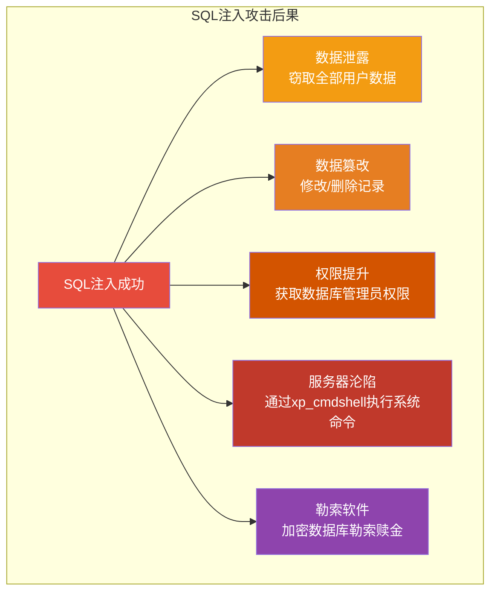
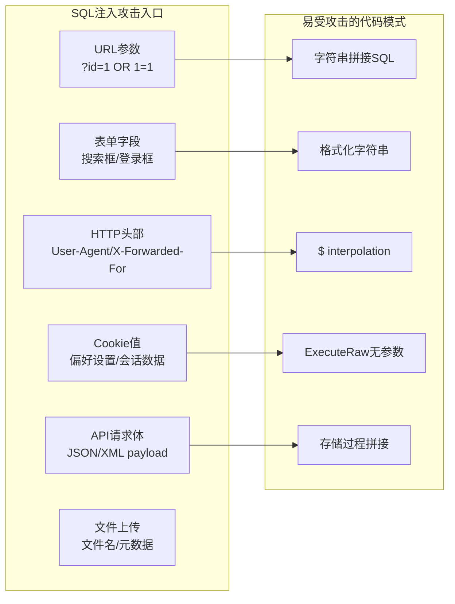
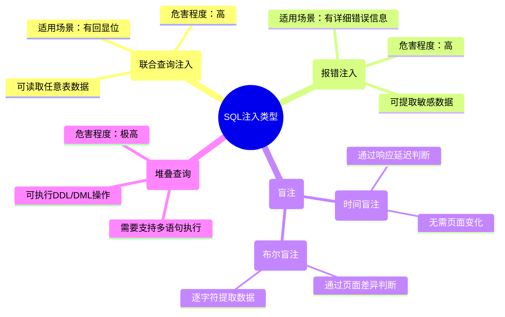
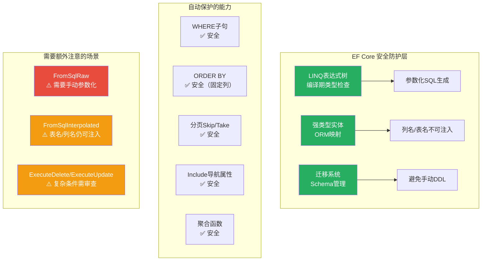
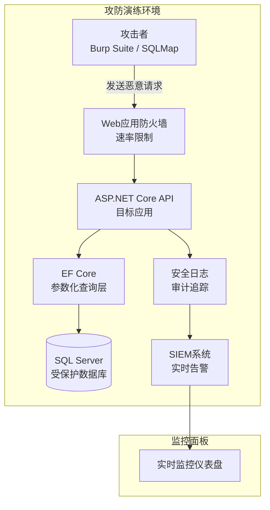

# SQL注入攻防详解

> **学习目标**：深入理解SQL注入攻击的原理、类型和危害，掌握EF Core的参数化查询机制，学会在ASP.NET Core中构建完整的SQL注入防御体系。

## 📚 目录

- [威胁模型](#威胁模型)
- [SQL注入原理深度剖析](#sql注入原理深度剖析)
- [五种注入类型详解](#五种注入类型详解)
- [手工注入实战演示](#手工注入实战演示)
- [EF Core参数化查询机制](#ef-core参数化查询机制)
- [FromSqlRaw与FromSqlInterpolated安全用法](#fromsqlraw与fromsqlinterpolated安全用法)
- [存储过程安全性分析](#存储过程安全性分析)
- [动态查询的安全构建](#动态查询的安全构建)
- [自动化检测工具链](#自动化检测工具链)
- [完整攻防演练](#完整攻防演练)
- [安全检查清单](#安全检查清单)

---

## 威胁模型

### 为什么SQL注入如此危险？

SQL注入长期位居OWASP Top 10前列，是Web应用中最危险也最常见的安全漏洞之一。一次成功的SQL注入攻击可能导致：



**真实案例警示**：

| 时间 | 公司 | 影响 | 损失 |
|------|------|------|------|
| 2017 | Equifax | 1.43亿用户数据泄露 | 17.5亿美元 |
| 2019 | First American | 8.85亿文件暴露 | 声誉严重受损 |
| 2020 | Garmin | 被WastedLocker勒索软件攻击 | 数千万美元 |
| 2021 | Microsoft Exchange | ProxyLogon漏洞利用 | 全球数万服务器 |

这些案例的共同点：**都是由于未正确处理用户输入导致的注入类漏洞**。

### 攻击面分析



---

## SQL注入原理深度剖析

### 核心问题：代码与数据的混淆

SQL注入的根本原因在于：**应用程序将用户输入直接拼接到SQL语句中，导致数据库无法区分"代码"和"数据"**。

```csharp
// ❌ 致命错误：将用户输入当作SQL代码的一部分
public async Task<IActionResult> VulnerableSearch(string keyword)
{
    // 用户输入: ' OR '1'='1' --
    var sql = $"SELECT * FROM Products WHERE Name LIKE '%{keyword}%'";

    // 数据库实际执行的SQL：
    // SELECT * FROM Products WHERE Name LIKE '%' OR '1'='1' --%'
    // -- 后面的内容被注释，条件永远为真！

    var products = await _context.Database.ExecuteSqlRawAsync(sql);
    return View(products);
}
```

**解析过程对比**：

```
正常情况（keyword = "手机"）：
┌─────────────────────────────────────────────────────┐
│ SQL语句：SELECT * FROM Products WHERE Name LIKE '%手机%' │
│                                                      │
│ 数据库理解：                                          │
│   SELECT * FROM Products WHERE Name LIKE '%手机%'     │
│   ────命令─── ───────────── ────数据────────         │
│   结果：返回名称包含"手机"的产品                       │
└─────────────────────────────────────────────────────┘

注入情况（keyword = "' OR '1'='1' --"）：
┌──────────────────────────────────────────────────────────┐
│ SQL语句：SELECT * FROM Products WHERE Name LIKE '%' OR '1'='1' --%' │
│                                                            │
│ 数据库理解：                                                │
│   SELECT * FROM Products WHERE Name LIKE '%'               │
│   ────命令─── ───────────── ──数据─ ──命令─── ──数据─       │
│   OR '1'='1'                                                │
│   ─命令─  ─数据                                             │
│   --%                                                       │
│   ─注释（忽略后续内容）                                      │
│                                                            │
│ 结果：返回所有产品！因为 '1'='1' 永远为真                    │
└──────────────────────────────────────────────────────────┘
```

### 参数化查询如何解决问题？

```csharp
// ✅ 安全方案：使用参数化查询
public async Task<IActionResult> SafeSearch(string keyword)
{
    // EF Core LINQ - 自动参数化
    var products = await _context.Products
        .Where(p => p.Name.Contains(keyword))
        .ToListAsync();

    return View(products);
}

// EF Core生成的SQL（注意 @__keyword_0 是参数）：
// SELECT [p].[Id], [p].[Name], [p].[Price]
// FROM [Products] AS [p]
// WHERE CHARINDEX(@__keyword_0, [p].[Name]) > 0
//
// 无论用户输入什么，都只是参数@__keyword_0的值
// 数据库明确知道这是数据而非代码
```

---

## 五种注入类型详解

### 类型总览图



### 1. Union-based Injection（联合查询注入）

**适用场景**：页面会将查询结果直接显示出来。

**攻击原理**：利用UNION操作符合并恶意查询结果到正常结果中。

```sql
-- 正常查询（假设返回2列）
SELECT Id, Name FROM Products WHERE Id = 1

-- 注入后的查询（攻击者输入：1 UNION SELECT Username, Password FROM Users--）
SELECT Id, Name FROM Products WHERE Id = 1 UNION SELECT Username, Password FROM Users--

-- 执行结果：
-- 正常数据：1, iPhone 15
-- 泄露数据：admin, $2a$10$xxxxx (密码哈希)
```

**ASP.NET中的漏洞代码示例**：

```csharp
// ❌ 易受联合查询注入攻击
[HttpGet("product/{id}")]
public async Task<IActionResult> GetProduct(string id)
{
    // 攻击者传入 id = "0 UNION SELECT username, password_hash FROM users--"
    var sql = $"SELECT product_name, price FROM products WHERE product_id = {id}";

    using (var command = _context.Database.GetDbConnection().CreateCommand())
    {
        command.CommandText = sql;
        await _context.Database.OpenConnectionAsync();

        using (var reader = await command.ExecuteReaderAsync())
        {
            var results = new List<object>();
            while (await reader.ReadAsync())
            {
                results.Add(new
                {
                    ProductName = reader["product_name"],
                    Price = reader["price"]
                });
            }
            return Ok(results); // 直接返回给前端，包括泄露的用户数据！
        }
    }
}
```

**防御方案**：

```csharp
// ✅ 方案1：使用EF Core LINQ（推荐）
[HttpGet("product/{id:int}")] // 强制整数类型
public async Task<IActionResult> GetProduct(int id) // 类型约束
{
    var product = await _context.Products
        .FirstOrDefaultAsync(p => p.Id == id); // 自动参数化

    if (product == null)
        return NotFound();

    return Ok(new { product.Name, product.Price }); // 只返回必要字段
}

// ✅ 方案2：必须用原生SQL时使用参数化
[HttpGet("product/{id}")]
public async Task<IActionResult> GetProductSafe(int id)
{
    var sql = "SELECT product_name, price FROM products WHERE product_id = @id";

    using (var command = _context.Database.GetDbConnection().CreateCommand())
    {
        command.CommandText = sql;

        // 使用参数化查询
        var parameter = command.CreateParameter();
        parameter.ParameterName = "@id";
        parameter.Value = id;
        command.Parameters.Add(parameter);

        await _context.Database.OpenConnectionAsync();

        using (var reader = await command.ExecuteReaderAsync())
        {
            // ... 处理结果
        }
    }
}
```

### 2. Error-based Injection（报错注入）

**适用场景**：应用开启了详细的错误输出，将数据库错误信息返回给客户端。

**攻击原理**：构造导致错误的SQL，让数据库在错误消息中泄露数据。

```sql
-- MySQL报错注入示例（攻击者输入：' AND ExtractValue(1,CONCAT(0x7e,(SELECT version())))--）

-- 触发的SQL：
SELECT * FROM users WHERE username = '' AND ExtractValue(1,CONCAT(0x7e,(SELECT version())))--'

-- 错误消息可能包含：
// ERROR 1105 (HY000): XPATH syntax error: '~8.0.33'
// 版本号被泄露了！
```

**防御关键**：

```csharp
// Program.cs - 生产环境必须关闭详细错误
if (!app.Environment.IsDevelopment())
{
    app.UseExceptionHandler("/Error"); // 统一错误处理页
    app.UseHsts();
}

// 自定义错误处理中间件
public class GlobalExceptionMiddleware
{
    private readonly RequestDelegate _next;
    private readonly ILogger<GlobalExceptionMiddleware> _logger;
    private readonly IHostEnvironment _environment;

    public GlobalExceptionMiddleware(
        RequestDelegate next,
        ILogger<GlobalExceptionMiddleware> logger,
        IHostEnvironment environment)
    {
        _next = next;
        _logger = logger;
        _environment = environment;
    }

    public async Task InvokeAsync(HttpContext context)
    {
        try
        {
            await _next(context);
        }
        catch (Exception ex)
        {
            // 记录完整错误到日志（仅服务端可见）
            _logger.LogError(ex, "未处理的异常：{Message}", ex.Message);

            // 根据环境决定返回的信息
            if (_environment.IsDevelopment())
            {
                // 开发环境：返回详细信息用于调试
                context.Response.StatusCode = 500;
                await context.Response.WriteAsJsonAsync(new
                {
                    error = "Internal Server Error",
                    message = ex.Message,
                    stackTrace = ex.StackTrace,
                    details = ex.InnerException?.Message
                });
            }
            else
            {
                // 生产环境：只返回通用错误信息
                context.Response.StatusCode = 500;
                await context.Response.WriteAsJsonAsync(new
                {
                    error = "Internal Server Error",
                    message = "发生意外错误，请稍后重试",
                    requestId = context.TraceIdentifier // 用于追踪问题
                });
            }
        }
    }
}
```

### 3. Blind Injection（盲注）

#### 3.1 Boolean-based Blind Injection（布尔盲注）

**适用场景**：页面根据查询结果显示不同内容，但不显示具体数据或错误信息。

**攻击原理**：通过构造条件语句，观察页面行为变化来逐位推断数据。

```sql
-- 假设我们想猜解第一个字符的ASCII码是否大于80
-- 正常查询返回有内容 vs 空结果

-- 测试1：如果第一个用户名的第一个字符ASCII > 80，返回正常页面
' AND ASCII(SUBSTRING((SELECT username FROM users LIMIT 1),1,1)) > 80--

-- 测试2：缩小范围
' AND ASCII(SUBSTRING((SELECT username FROM users LIMIT 1),1,1)) > 100--

-- 通过二分查找法，最终确定每个字符的值
-- 效率低但有效，自动化工具可以快速完成
```

**防御要点**：

```csharp
// 统一错误响应 - 不泄露任何查询结果差异
[HttpGet("user/check")]
public async Task<IActionResult> CheckUserExists(string username)
{
    // ❌ 危险：不同的响应会泄露信息
    // var exists = await _context.Users.AnyAsync(u => u.Username == username);
    // if (exists) return Ok(new { exists = true, message = "用户名已存在" });
    // else return NotFound(new { exists = false, message = "用户名可用" });

    // ✅ 安全：统一响应格式，不泄露是否存在
    var normalizedUsername = username?.Trim().ToLowerInvariant();

    // 记录所有尝试（无论成功失败）
    _logger.LogInformation("用户名可用性检查：{Username}", normalizedUsername);

    // 返回统一的消息，不透露实际状态
    return Ok(new
    {
        message = "如果此用户名可用，您将在注册时收到确认",
        // 不返回exists标志！
        timestamp = DateTime.UtcNow
    });

    // 或者更好的做法：注册时才验证唯一性
}
```

#### 3.2 Time-based Blind Injection（时间盲注）

**适用场景**：即使页面完全相同（无任何差异），也可以利用延迟来判断条件真假。

**攻击原理**：使用`SLEEP()`、`WAITFOR DELAY`等函数，当条件为真时让数据库暂停几秒。

```sql
-- 如果当前数据库用户是sa（管理员），则延迟5秒
'; IF (SELECT user()) = 'root@localhost' WAITFOR DELAY '0:0:5'--

-- MySQL版本
' AND IF(ASCII(SUBSTRING(user(),1,1)) > 64, SLEEP(5), 0)--
```

**防御措施**：

```csharp
// 1. 限制查询执行时间
public class QueryTimeoutMiddleware
{
    private readonly RequestDelegate _next;

    public QueryTimeoutMiddleware(RequestDelegate next)
    {
        _next = next;
    }

    public async Task InvokeAsync(HttpContext context)
    {
        // 设置请求超时（防止时间盲注的长时间挂起）
        using var cts = new CancellationTokenSource(TimeSpan.FromSeconds(30));

        try
        {
            await _next(context);
        }
        catch (OperationCanceledException)
        {
            context.Response.StatusCode = StatusCodes.Status504GatewayTimeout;
            await context.Response.WriteAsJsonAsync(new { error = "请求超时" });
        }
    }
}

// 2. 在DbContext中配置命令超时
protected override void OnConfiguring(DbContextOptionsBuilder optionsBuilder)
{
    optionsBuilder.UseSqlServer(
        connectionString,
        sqlOptions => sqlOptions.CommandTimeout(10)); // 单个查询最多10秒
}
```

### 4. Stacked Queries（堆叠查询注入）

**适用场景**：数据库连接支持执行多条SQL语句（如MySQL、PostgreSQL、SQL Server）。

**危害等级**：**最高** - 可以执行任意SQL，包括DROP TABLE、INSERT INTO等破坏性操作。

```sql
-- 攻击者输入：1; DROP TABLE Users; --

-- 实际执行的SQL：
SELECT * FROM Products WHERE Id = 1; DROP TABLE Users;--

-- 结果：Products查询正常执行，然后Users表被删除！
```

**更危险的场景**：

```sql
-- 创建管理员账户
'; INSERT INTO Users (username, password_hash, role) VALUES ('hacker', 'xxx', 'admin')--

-- 读取服务器文件（MySQL）
'; LOAD_FILE('/etc/passwd')--

-- 写入WebShell（最危险！）
'; SELECT '<?php system($_GET["cmd"]); ?>' INTO OUTFILE '/var/www/html/shell.php'--
```

**彻底防御**：

```csharp
// 方案1：禁用多语句执行（数据库层面）
// SQL Server连接字符串添加：
// "MultipleActiveResultSets=False"

// 方案2：使用EF Core（自动防止堆叠查询）
// EF Core的ExecuteSqlRaw默认不支持多条语句

// 方案3：严格的输入验证和类型转换
[HttpPost("search")]
public IActionResult Search([FromBody] SearchRequest request)
{
    // 强类型绑定 + Data Annotations验证
    if (!ModelState.IsValid)
        return BadRequest(ModelState);

    // 白名单验证
    var allowedChars = new Regex(@"^[a-zA-Z0-9\s\-_\.]+$");
    if (!allowedChars.IsMatch(request.Keyword))
    {
        _logger.LogWarning("非法字符检测：{Keyword}", request.Keyword);
        return BadRequest("搜索关键词包含非法字符");
    }

    // ... 执行安全查询
}
```

---

## 手工注入实战演示

> **警告**：以下演示仅在授权的安全测试环境中进行。未经授权对他人系统进行测试属于违法行为。

### 演示环境搭建

```csharp
// 创建一个故意存在漏洞的控制器用于教学演示
/// <summary>
/// ⚠️ 仅用于安全教学的漏洞演示控制器
/// 生产环境中绝对不要这样写代码！
/// </summary>
[ApiController]
[Route("api/demo")]
public class VulnerableDemoController : ControllerBase
{
    private readonly ApplicationDbContext _context;
    private readonly ILogger<VulnerableDemoController> _logger;

    public VulnerableDemoController(
        ApplicationDbContext context,
        ILogger<VulnerableDemoController> logger)
    {
        _context = context;
        _logger = logger;
    }

    /// <summary>
    /// ❌ 漏洞示例1：登录接口存在SQL注入
    /// </summary>
    [HttpPost("login-vulnerable")]
    public async Task<IActionResult> VulnerableLogin([FromBody] LoginRequest request)
    {
        // 构造不安全的SQL查询
        var sql = $@"
            SELECT Id, Username, Role
            FROM Users
            WHERE Username = '{request.Username}'
            AND PasswordHash = '{request.Password}'"; // 密码应该先哈希再比较！

        _logger.LogWarning("⚠️ 演示：执行不安全的SQL：{Sql}", sql);

        try
        {
            using var command = _context.Database.GetDbConnection().CreateCommand();
            command.CommandText = sql;
            await _context.Database.OpenConnectionAsync();

            using var reader = await command.ExecuteReaderAsync();
            if (await reader.ReadAsync())
            {
                return Ok(new
                {
                    Success = true,
                    UserId = reader["Id"],
                    Username = reader["Username"],
                    Role = reader["Role"]
                });
            }

            return Unauthorized(new { Success = false, Message = "用户名或密码错误" });
        }
        catch (Exception ex)
        {
            // ❌ 将异常详情返回给客户端（生产环境大忌！）
            return StatusCode(500, new { Error = ex.Message, StackTrace = ex.StackTrace });
        }
    }
}
```

### 攻击步骤演示

**Step 1：探测注入点**

```bash
# 测试是否存在注入
curl -X POST https://demo.com/api/demo/login-vulnerable \
  -H "Content-Type: application/json" \
  -d '{"username": "admin'", "password": "anything"}'

# 如果返回SQL语法错误，说明存在注入点
# 响应示例：
# {"Error":"Unclosed quotation mark after the character string..."}
```

**Step 2：绕过认证**

```bash
# 万能密码攻击
curl -X POST https://demo.com/api/demo/login-vulnerable \
  -H "Content-Type: application/json" \
  -d '{"username": "admin' OR '1'='1' --", "password": "anything"}'

# 生成的SQL：
# SELECT * FROM Users WHERE Username = 'admin' OR '1'='1' --' AND PasswordHash = 'anything'
# 条件永远为真，绕过认证！
```

**Step 3：提取数据**

```bash
# 使用UNION注入提取用户表
curl -X POST https://demo.com/api/demo/login-vulnerable \
  -H "Content-Type: application/json" \
  -d '{
    "username": "admin' UNION SELECT Id, Username, NULL FROM Users --",
    "password": "x"
  }'
```

### 从漏洞到修复的完整流程

```csharp
/// <summary>
/// ✅ 修复后的安全登录实现
/// </summary>
[ApiController]
[Route("api/auth")]
public class SecureAuthController : ControllerBase
{
    private readonly SignInManager<ApplicationUser> _signInManager;
    private readonly UserManager<ApplicationUser> _userManager;
    private readonly ILogger<SecureAuthController> _logger;

    public SecureAuthController(
        SignInManager<ApplicationUser> signInManager,
        UserManager<ApplicationUser> userManager,
        ILogger<SecureAuthController> logger)
    {
        _signInManager = signInManager;
        _userManager = userManager;
        _logger = logger;
    }

    /// <summary>
    /// 安全登录 - 使用Identity框架处理认证
    /// </summary>
    [HttpPost("login")]
    public async Task<IActionResult> SecureLogin([FromBody] LoginRequest request)
    {
        // 1. 输入验证（使用Data Annotations或FluentValidation）
        if (!ModelState.IsValid)
        {
            return BadRequest(ModelState);
        }

        // 2. 查找用户（EF Core自动参数化，杜绝SQL注入）
        var user = await _userManager.FindByNameAsync(request.Username);

        // 3. 统一错误消息（不泄露用户是否存在）
        if (user == null)
        {
            // 记录失败的登录尝试
            _logger.LogWarning("登录失败：用户名 {Username} 不存在", request.Username);

            // 使用固定延迟防止时序攻击
            await Task.Delay(Random.Shared.Next(1000, 2000));

            return Unauthorized(new
            {
                success = false,
                message = "用户名或密码错误" // 统一消息
            });
        }

        // 4. 验证密码（Identity内部使用安全的哈希比较）
        var result = await _signInManager.CheckPasswordSignInAsync(
            user,
            request.Password,
            lockoutOnFailure: true); // 启用账户锁定

        // 5. 处理登录结果
        if (result.Succeeded)
        {
            _logger.LogInformation("用户 {Username} 登录成功", user.UserName);

            // 生成JWT Token或其他认证令牌
            var token = GenerateJwtToken(user);

            return Ok(new
            {
                success = true,
                token = token,
                expiresIn = 3600
            });
        }

        if (result.IsLockedOut)
        {
            _logger.LogWarning("账户已被锁定：{Username}", user.UserName);
            return Unauthorized(new
            {
                success = false,
                message = "账户已被临时锁定，请15分钟后重试"
            });
        }

        if (result.RequiresTwoFactor)
        {
            return Ok(new
            {
                requires2FA = true,
                message = "请输入双因素认证码"
            });
        }

        // 密码错误
        _logger.LogWarning("密码错误：用户 {Username}", user.UserName);
        await Task.Delay(Random.Shared.Next(1000, 2000)); // 固定延迟

        return Unauthorized(new
        {
            success = false,
            message = "用户名或密码错误"
        });
    }
}
```

---

## EF Core参数化查询机制

### 为什么EF Core是安全的？

Entity Framework Core在设计时就考虑了安全性，其LINQ提供程序会**自动将所有用户输入转换为参数化查询**。

```csharp
// 示例：展示EF Core如何自动参数化
public class ProductService
{
    private readonly AppDbContext _context;

    public async Task<List<Product>> SearchProducts(string keyword, decimal? minPrice, decimal? maxPrice)
    {
        // 这段代码看起来像是在构建查询字符串，
        // 但实际上EF Core会在底层生成参数化SQL
        var query = _context.Products.AsQueryable();

        // 动态条件构建 - 全部是安全的！
        if (!string.IsNullOrWhiteSpace(keyword))
        {
            query = query.Where(p => p.Name.Contains(keyword));
            // 生成的SQL：WHERE CHARINDEX(@__keyword_0, [p].[Name]) > 0
        }

        if (minPrice.HasValue)
        {
            query = query.Where(p => p.Price >= minPrice.Value);
            // 生成的SQL：AND [p].[Price] >= @__minPrice_1
        }

        if (maxPrice.HasValue)
        {
            query = query.Where(p => p.Price <= maxPrice.Value);
            // 生成的SQL：AND [p].[Price] <= @__maxPrice_2
        }

        // 排序也是安全的
        query = query.OrderByDescending(p => p.CreatedAt);

        // 分页同样安全
        var page = 1;
        var pageSize = 20;
        query = query.Skip((page - 1) * pageSize).Take(pageSize);

        // 最终执行的SQL类似：
        /*
        DECLARE @__keyword_0 nvarchar(256) = N'手机';
        DECLARE @__minPrice_1 decimal(18,2) = 1000.00;
        DECLARE @__maxPrice_2 decimal(18,2) = 5000.00;

        SELECT [p].*
        FROM [Products] AS [p]
        WHERE CHARINDEX(@__keyword_0, [p].[Name]) > 0
          AND [p].[Price] >= @__minPrice_1
          AND [p].[Price] <= @__maxPrice_2
        ORDER BY [p].[CreatedAt] DESC
        OFFSET @__p_3 ROWS FETCH NEXT @__p_4 ROWS ONLY
        */

        return await query.ToListAsync();
    }
}
```

### EF Core安全特性总结



---

## FromSqlRaw与FromSqlInterpolated安全用法

### FromSqlRaw - 必须显式参数化

```csharp
public class RawSqlRepository
{
    private readonly ApplicationDbContext _context;

    /// <summary>
    /// ❌ 危险：FromSqlRaw未使用参数
    /// </summary>
    public async Task<List<Product>> VulnerableSearch(string keyword)
    {
        // 直接拼接 - 存在SQL注入风险！
        var sql = $"SELECT * FROM Products WHERE Name LIKE '%{keyword}%'";

        return await _context.Products
            .FromSqlRaw(sql)
            .ToListAsync();
    }

    /// <summary>
    /// ✅ 安全：FromSqlRaw使用参数化
    /// </summary>
    public async Task<List<Product>> SafeSearch(string keyword)
    {
        // 使用参数占位符
        var sql = "SELECT * FROM Products WHERE Name LIKE '%' + @keyword + '%'";

        // 创建SqlParameter
        var parameter = new SqlParameter("@keyword", SqlDbType.NVarChar, 256)
        {
            Value = keyword ?? (object)DBNull.Value
        };

        return await _context.Products
            .FromSqlRaw(sql, parameter)
            .ToListAsync();
    }

    /// <summary>
    /// ✅ 安全：多个参数的情况
    /// </summary>
    public async Task<PagedResult<Product>> AdvancedSearch(
        string keyword,
        decimal? minPrice,
        decimal? maxPrice,
        int categoryId,
        int pageNumber,
        int pageSize)
    {
        // 构建参数列表
        var parameters = new List<SqlParameter>();
        var conditions = new List<string>();

        // 动态构建WHERE条件
        if (!string.IsNullOrWhiteSpace(keyword))
        {
            conditions.Add("(p.Name LIKE '%' + @keyword + '%' OR p.Description LIKE '%' + @keyword + '%')");
            parameters.Add(new SqlParameter("@keyword", keyword));
        }

        if (minPrice.HasValue)
        {
            conditions.Add("p.Price >= @minPrice");
            parameters.Add(new SqlParameter("@minPrice", minPrice.Value));
        }

        if (maxPrice.HasValue)
        {
            conditions.Add("p.Price <= @maxPrice");
            parameters.Add(new SqlParameter("@maxPrice", maxPrice.Value));
        }

        if (categoryId > 0)
        {
            conditions.Add("p.CategoryId = @categoryId");
            parameters.Add(new SqlParameter("@categoryId", categoryId));
        }

        // 组装完整SQL
        var whereClause = conditions.Any()
            ? "WHERE " + string.Join(" AND ", conditions)
            : "";

        var countSql = $"SELECT COUNT(*) FROM Products p {whereClause}";
        var dataSql = $"SELECT * FROM Products p {whereClause} ORDER BY p.Id OFFSET @offset ROWS FETCH NEXT @limit ROWS ONLY";

        // 分页参数
        parameters.Add(new SqlParameter("@offset", (pageNumber - 1) * pageSize));
        parameters.Add(new SqlParameter("@limit", pageSize));

        // 并行执行计数和数据查询
        var countTask = _context.Database
            .ExecuteSqlRawAsync(countSql, parameters.ToArray<object>());

        var dataTask = _context.Products
            .FromSqlRaw(dataSql, parameters.ToArray<object>())
            .ToListAsync();

        await Task.WhenAll(countTask, dataTask);

        return new PagedResult<Product>
        {
            Items = dataTask.Result,
            TotalCount = countTask.Result,
            PageNumber = pageNumber,
            PageSize = pageSize
        };
    }
}
```

### FromSqlInterpolated - 更简洁但有限制

```csharp
/// <summary>
/// FromSqlInterpolated 使用说明
/// 注意：只能参数化VALUES，不能参数化标识符（表名、列名）
/// </summary>
public class InterpolatedSqlRepository
{
    private readonly ApplicationDbContext _context;

    /// <summary>
     /// ✅ 安全：插值变量会被自动参数化
     /// </summary>
    public async Task<List<Product>> SearchByCategory(int categoryId, string keyword)
    {
        // categoryId 和 keyword 都会被作为参数传递
        return await _context.Products
            .FromSqlInterpolated($@"
                SELECT * FROM Products
                WHERE CategoryId = {categoryId}
                  AND Name LIKE {'%' + keyword + '%'}
            ")
            .ToListAsync();
    }

    /// <summary>
     /// ⚠️ 危险：表名不能参数化！
     /// 即使使用FromSqlInterpolated，表名仍然是拼接的
     /// </summary>
    public async Task<List<T>> UnsafeDynamicTableQuery<T>(string tableName) where T : class
    {
        // ❌ 这是危险的！tableName不会被参数化
        // return await _context.Set<T>()
        //     .FromSqlInterpolated($"SELECT * FROM {tableName}")
        //     .ToListAsync();

        // ✅ 安全替代方案：使用白名单
        var allowedTables = new HashSet<string>(StringComparer.OrdinalIgnoreCase)
        {
            "Products", "Categories", "Orders", "Users"
        };

        if (!allowedTables.Contains(tableName))
        {
            throw new SecurityException($"不允许访问表：{tableName}");
        }

        // 根据白名单选择查询逻辑
        return tableName switch
        {
            "Products" => await _context.Products.FromSqlInterpolated($"SELECT * FROM Products").Cast<T>().ToListAsync(),
            "Categories" => await _context.Categories.FromSqlInterpolated($"SELECT * FROM Categories").Cast<T>().ToListAsync(),
            _ => throw new NotSupportedException($"不支持的表：{tableName}")
        };
    }

    /// <summary>
     /// ⚠️ ORDER BY 列名也不能参数化
     /// </summary>
    public async Task<List<Product>> SafeSort(string sortBy, bool descending)
    {
        // 白名单验证排序字段
        var allowedSortColumns = new Dictionary<string, string>(StringComparer.OrdinalIgnoreCase)
        {
            ["name"] = "Name",
            ["price"] = "Price",
            ["createdat"] = "CreatedAt",
            ["id"] = "Id"
        };

        if (!allowedSortColumns.TryGetValue(sortBy, out var columnName))
        {
            throw new ArgumentException($"不允许的排序字段：{sortBy}");
        }

        var direction = descending ? "DESC" : "ASC";
        var orderByClause = $"{columnName} {direction}";

        // 列名来自白名单，所以这里是安全的
        return await _context.Products
            .FromSqlInterpolated($"SELECT * FROM Products ORDER BY {orderByClause}")
            .ToListAsync();
    }
}
```

### 参数化最佳实践总结

| 场景 | 推荐方式 | 安全性 |
|------|---------|--------|
| 标准CRUD操作 | EF Core LINQ | ✅ 最安全 |
| 简单原生SQL | `FromSqlInterpolated` | ✅ 安全（仅限值） |
| 复杂原生SQL | `FromSqlRaw` + `SqlParameter` | ✅ 安全（手动参数化） |
| 动态表名 | **白名单映射** | ⚠️ 需要额外验证 |
| 动态列名 | **白名单映射** | ⚠️ 需要额外验证 |
| 动态ORDER BY | **枚举/字典映射** | ⚠️ 需要额外验证 |
| IN子句 | `Contains` 或参数列表 | ✅ 安全 |

---

## 存储过程安全性分析

### 存储过程能防止SQL注入吗？

**答案：取决于如何调用存储过程**。存储过程本身不是银弹，不当使用仍然会导致注入。

```csharp
public class StoredProcedureService
{
    private readonly ApplicationDbContext _context;

    /// <summary>
    /// ❌ 危险：拼接存储过程调用
    /// </summary>
    public async Task<IActionResult> VulnerableStoredProcedureCall(string userName)
    {
        // 拼接EXEC语句 - 仍然可以注入！
        var sql = $"EXEC sp_GetUserInfo '{userName}'";

        // 攻击者输入: '; DROP TABLE Users; --
        // 实际执行: EXEC sp_GetUserInfo ''; DROP TABLE Users; --

        using var command = _context.Database.GetDbConnection().CreateCommand();
        command.CommandText = sql;
        // ...
    }

    /// <summary>
     /// ✅ 安全：参数化调用存储过程
     /// </summary>
    public async Task<UserInfoDto?> SafeStoredProcedureCall(string userName)
    {
        using var command = _context.Database.GetDbConnection().CreateCommand();
        command.CommandType = CommandType.StoredProcedure;
        command.CommandText = "sp_GetUserInfo";

        // 添加参数
        var userNameParam = new SqlParameter("@UserName", SqlDbType.NVarChar, 100)
        {
            Value = userName ?? (object)DBNull.Value
        };
        command.Parameters.Add(userNameParam);

        // 输出参数
        var statusCodeParam = new SqlParameter("@StatusCode", SqlDbType.Int)
        {
            Direction = ParameterDirection.Output
        };
        command.Parameters.Add(statusCodeParam);

        await _context.Database.OpenConnectionAsync();

        using var reader = await command.ExecuteReaderAsync();
        if (await reader.ReadAsync())
        {
            return new UserInfoDto
            {
                Id = reader.GetInt32("Id"),
                Username = reader.GetString("Username"),
                Email = reader.GetString("Email"),
                StatusCode = (int)(statusCodeParam.Value ?? -1)
            };
        }

        return null;
    }

    /// <summary>
     /// ✅ 最佳实践：使用EF Core调用存储过程
     /// </summary>
    public async Task<List<OrderSummaryDto>> GetOrderSummaries(
        int userId,
        DateTime startDate,
        DateTime endDate)
    {
        // 定义参数
        var userIdParam = new SqlParameter("@UserId", userId);
        var startDateParam = new SqlParameter("@StartDate", startDate);
        var endDateParam = new SqlParameter("@EndDate", endDate);

        // 调用存储过程
        return await _context.OrderSummaries
            .FromSqlInterpolated($@"
                EXEC sp_GetOrderSummaries
                    @UserId = {userIdParam},
                    @StartDate = {startDateParam},
                    @EndDate = {endDateParam}
            ")
            .ToListAsync();
    }
}
```

### 存储过程中的动态SQL

```sql
-- ❌ 存储过程内部的SQL注入风险
CREATE PROCEDURE sp_SearchProducts_Vulnerable
    @Keyword NVARCHAR(256)
AS
BEGIN
    -- 这里的拼接仍然危险！
    DECLARE @SQL NVARCHAR(MAX)
    SET @SQL = 'SELECT * FROM Products WHERE Name LIKE ''' + @Keyword + ''''
    EXEC(@SQL)
END

-- ✅ 安全的存储过程实现
CREATE PROCEDURE sp_SearchProducts_Safe
    @Keyword NVARCHAR(256)
AS
BEGIN
    -- 使用sp_executesql进行参数化
    DECLARE @SQL NVARCHAR(MAX)
    SET @SQL = N'SELECT * FROM Products WHERE Name LIKE @Pattern'

    DECLARE @Pattern NVARCHAR(300) = '%' + @Keyword + '%'

    EXEC sp_executesql
        @SQL,
        N'@Pattern NVARCHAR(300)',
        @Pattern = @Pattern
END
```

---

## 动态查询的安全构建

### 场景：高级搜索功能

在实际项目中，经常需要支持复杂的动态查询条件。以下是安全的实现方式：

```csharp
/// <summary>
/// 安全的动态查询构建器
/// 使用Expression Tree构建动态LINQ查询
/// </summary>
public static class DynamicQueryBuilder
{
    /// <summary>
    /// 安全地构建动态WHERE条件
    /// </summary>
    public static IQueryable<T> ApplyFilters<T>(
        this IQueryable<T> query,
        FilterCriteria criteria) where T : class
    {
        var parameter = Expression.Parameter(typeof(T), "x");
        Expression? combinedExpression = null;

        foreach (var filter in criteria.Filters)
        {
            // 验证属性名是否存在于实体上（防止注入属性名）
            var property = typeof(T).GetProperty(filter.FieldName);
            if (property == null)
            {
                throw new InvalidOperationException(
                    $"无效的过滤字段：{filter.FieldName}");
            }

            // 构建属性访问表达式
            var propertyAccess = Expression.Property(parameter, filter.FieldName);

            // 根据操作符构建比较表达式
            Expression comparison;
            var constantValue = Convert.ChangeType(filter.Value, property.PropertyType);

            comparison = filter.Operator switch
            {
                "eq" => Expression.Equal(propertyAccess, Expression.Constant(constantValue)),
                "neq" => Expression.NotEqual(propertyAccess, Expression.Constant(constantValue)),
                "gt" => Expression.GreaterThan(propertyAccess, Expression.Constant(constantValue)),
                "gte" => Expression.GreaterThanOrEqual(propertyAccess, Expression.Constant(constantValue)),
                "lt" => Expression.LessThan(propertyAccess, Expression.Constant(constantValue)),
                "lte" => Expression.LessThanOrEqual(propertyAccess, Expression.Constant(constantValue)),
                "contains" => BuildContainsExpression(propertyAccess, constantValue),
                "startswith" => BuildStartsWithExpression(propertyAccess, constantValue),
                "endswith" => BuildEndsWithExpression(propertyAccess, constantValue),
                _ => throw new NotSupportedException($"不支持的操作符：{filter.Operator}")
            };

            combinedExpression = combinedExpression == null
                ? comparison
                : filter.Logic == "and"
                    ? Expression.AndAlso(combinedExpression, comparison)
                    : Expression.OrElse(combinedExpression, comparison);
        }

        if (combinedExpression != null)
        {
            var lambda = Expression.Lambda<Func<T, bool>>(combinedExpression, parameter);
            query = query.Where(lambda);
        }

        return query;
    }

    private static Expression BuildContainsExpression(MemberExpression member, object value)
    {
        var methodInfo = typeof(string).GetMethod("Contains", new[] { typeof(string) })!;
        var constant = Expression.Constant(value.ToString());
        return Expression.Call(member, methodInfo, constant);
    }

    private static Expression BuildStartsWithExpression(MemberExpression member, object value)
    {
        var methodInfo = typeof(string).GetMethod("StartsWith", new[] { typeof(string) })!;
        var constant = Expression.Constant(value.ToString());
        return Expression.Call(member, methodInfo, constant);
    }

    private static Expression BuildEndsWithExpression(MemberExpression member, object value)
    {
        var methodInfo = typeof(string).GetMethod("EndsWith", new[] { typeof(string) })!;
        var constant = Expression.Constant(value.ToString());
        return Expression.Call(member, methodInfo, constant);
    }
}

// 使用示例
[HttpGet("advanced-search")]
public async Task<IActionResult> AdvancedSearch([FromBody] FilterRequest request)
{
    // 1. 验证请求结构
    if (request?.Filters == null || !request.Filters.Any())
        return BadRequest("至少需要一个过滤条件");

    // 2. 限制最大过滤条件数量（防止复杂度攻击）
    if (request.Filters.Count > 10)
        return BadRequest("过滤条件过多");

    // 3. 应用过滤器（内部会验证字段名合法性）
    var query = _context.Products.ApplyFilters(new FilterCriteria
    {
        Filters = request.Filters
    });

    // 4. 排序（白名单验证）
    if (!string.IsNullOrWhiteSpace(request.SortBy))
    {
        query = ApplySafeSorting(query, request.SortBy, request.SortDescending);
    }

    // 5. 分页
    var result = await PaginatedList<Product>.CreateAsync(
        query,
        request.PageNumber ?? 1,
        request.PageSize ?? 20);

    return Ok(result);
}

private IQueryable<Product> ApplySafeSorting(
    IQueryable<Product> query,
    string sortBy,
    bool descending)
{
    // 允许排序的字段白名单
    var allowedSortFields = new Dictionary<string, Expression<Func<Product, object>>>(StringComparer.OrdinalIgnoreCase)
    {
        ["name"] = p => p.Name,
        ["price"] => p => p.Price,
        ["createdat"] = p => p.CreatedAt,
        ["stockquantity"] = p => p.StockQuantity
    };

    if (!allowedSortFields.TryGetValue(sortBy, out var sortExpression))
    {
        // 默认按创建时间排序
        sortExpression = allowedSortFields["createdat"];
    }

    return descending
        ? query.OrderByDescending(sortExpression)
        : query.OrderBy(sortExpression);
}
```

---

## 自动化检测工具链

### 开发阶段工具

```bash
# 1. Microsoft.CodeAnalysis.NetAnalyzers（内置安全规则）
dotnet add package Microsoft.CodeAnalysis.NetAnalyzers

# 2. 编辑器中启用安全分析
# Visual Studio: 工具 → 选项 → 文本编辑器 → C# → 高级
# 启用："对.NET分析器建议运行代码分析作为构建的一部分"

# 3. Security Code Scan（社区版免费）
dotnet tool install --global SecurityCodeScan.Tool
scs -f src/YourProject.sln
```

### CI/CD集成扫描

```yaml
# .github/workflows/sql-injection-scan.yml
name: SQL注入扫描

on:
  push:
    branches: [main, develop]
  pull_request:
    branches: [main]

jobs:
  security-scan:
    runs-on: windows-latest
    steps:
      - uses: actions/checkout@v4

      - name: 安装.NET SDK
        uses: actions/setup-dotnet@v4
        with:
          dotnet-version: '8.0.x'

      - name: 还原依赖
        run: dotnet restore

      # 1. 编译时安全分析
      - name: 运行.NET分析器
        run: dotnet build /p:EnableNETAnalyzers=true /p:AnalysisMode=AllEnabledByDefault

      # 2. Security Code Scan
      - name: 安装SCS
        run: dotnet tool install --global SecurityCodeScan.Tool

      - name: 运行Security Code Scan
        run: scs -f *.sln -o security-report.json

      - name: 上传扫描报告
        uses: actions/upload-artifact@v4
        with:
          name: security-report
          path: security-report.json

      # 3. 检查是否有高危问题
      - name: 检查安全问题
        shell: pwsh
        run: |
          $report = Get-Content security-report.json | ConvertFrom-Json
          $criticalIssues = $report | Where-Object { $_.Severity -eq "Critical" -or $_.Severity -eq "High" }

          if ($criticalIssues.Count -gt 0) {
              Write-Error "发现 ${$criticalIssues.Count} 个高危安全问题！"
              $criticalIssues | ForEach-Object { Write-Warning $_.Message }
              exit 1
          } else {
              Write-Host "✅ 未发现高危安全问题"
          }
```

### 运行时DAST工具

```csharp
// 集成OWASP ZAP基线扫描到测试套件
public class OwaspZapTests : IClassFixture<WebApplicationFactory<Program>>
{
    private readonly WebApplicationFactory<Program> _factory;
    private readonly HttpClient _client;

    public OwaspZapTests(WebApplicationFactory<Program> factory)
    {
        _factory = factory.WithWebHostBuilder(builder =>
        {
            builder.ConfigureTestServices(services =>
            {
                // 使用测试数据库
                services.RemoveAll(typeof(DbContextOptions<ApplicationDbContext>));
                services.AddDbContext<ApplicationDbContext>(options =>
                    options.UseInMemoryDatabase("TestDb"));
            });
        });

        _client = _factory.CreateClient();
    }

    [Fact]
    [Trait("Category", "Security")]
    [Trait("Tool", "ZAP")]
    public async Task ZapBaselineScan_ShouldNotFindCriticalVulnerabilities()
    {
        // 此测试应在CI/CD中使用实际的ZAP扫描
        // 这里模拟扫描结果检查

        // 1. 对常见端点发起基本请求
        var endpoints = new[]
        {
            ("/api/products", HttpMethod.Get),
            ("/api/auth/login", HttpMethod.Post),
            ("/api/users/profile", HttpMethod.Get),
            ("/api/admin/settings", HttpMethod.Get)
        };

        var vulnerabilities = new List<string>();

        foreach (var (path, method) in endpoints)
        {
            var request = new HttpRequestMessage(method, path);

            // 添加常见的注入payload进行测试
            if (method == HttpMethod.Post || method == HttpMethod.Get)
            {
                var testPayloads = new[]
                {
                    "' OR '1'='1",
                    "1; DROP TABLE",
                    "<script>alert(1)</script>",
                    "../../../etc/passwd"
                };

                foreach (var payload in testPayloads)
                {
                    try
                    {
                        if (method == HttpMethod.Get)
                        {
                            request.RequestUri = new Uri($"{path}?q={Uri.EscapeDataString(payload)}");
                        }
                        else
                        {
                            request.Content = JsonContent.Create(new { input = payload });
                        }

                        var response = await _client.SendAsync(request);

                        // 检查响应中是否泄露了不应该出现的内容
                        var content = await response.Content.ReadAsStringAsync();

                        if (content.Contains("syntax error") ||
                            content.Contains("SQLException") ||
                            content.Contains("Stack trace"))
                        {
                            vulnerabilities.Add(
                                $"端点 {path} 可能泄露错误详情 (Payload: {payload})");
                        }
                    }
                    catch { /* 忽略网络错误 */ }
                }
            }
        }

        // 断言：不应发现明显的漏洞
        Assert.Empty(vulnerabilities);
    }
}
```

---

## 完整攻防演练

### 演示项目架构



### 完整的防御实现

```csharp
// Program.cs - 多层防御体系
var builder = WebApplication.CreateBuilder(args);

// ==================== 第一层：输入验证 ====================
builder.Services.AddControllers(options =>
{
    // 全局模型验证过滤器
    options.Filters(new ValidationModelAttribute());
});

// FluentValidation
builder.Services.AddValidatorsFromAssemblyContaining<Program>();

// ==================== 第二层：ORM安全配置 ====================
builder.Services.AddDbContext<ApplicationDbContext>(options =>
{
    options.UseSqlServer(
        builder.Configuration.GetConnectionString("DefaultConnection"),
        sqlOptions =>
        {
            // 启用敏感数据日志记录（仅开发环境）
            sqlOptions.EnableSensitiveDataLogging(builder.Environment.IsDevelopment());
            // 命令超时
            sqlOptions.CommandTimeout(30);
            // 重试策略（针对瞬时故障）
            sqlOptions.EnableRetryOnFailure(3);
        });
});

// ==================== 第三层：安全中间件 ====================
var app = builder.Build();

// 中间件管道（顺序很重要）
app.UseMiddleware<RequestIdMiddleware>();           // 请求追踪ID
app.UseMiddleware<RateLimitingMiddleware>();        // 速率限制
app.UseMiddleware<SqliDetectionMiddleware>();       // SQL注入特征检测
app.UseMiddleware<SecurityLoggingMiddleware>();     // 安全事件日志
app.UseExceptionHandler("/error");                   // 统一错误处理
app.UseHttpsRedirection();                           // HTTPS强制
app.UseRouting();
app.UseAuthentication();                             // 认证
app.UseAuthorization();                              // 授权
app.MapControllers();

app.Run();

// SQL注入检测中间件
public class SqliDetectionMiddleware
{
    private readonly RequestDelegate _next;
    private readonly ILogger<SqliDetectionMiddleware> _logger;
    private static readonly Regex SqliPattern = new Regex(
        @"(?i)\b(union\s+select|select\s+.*\s+from|insert\s+into|delete\s+from|" +
        @"drop\s+table|exec(?:ute)?\s+|xp_cmdshell|waitfor\s+delay|" +
        @"'\s*(or|and)\s+'?\d*\s*=\s*'?\d*|--|;\s*--)",
        RegexOptions.Compiled);

    public SqliDetectionMiddleware(RequestDelegate next, ILogger<SqliDetectionMiddleware> logger)
    {
        _next = next;
        _logger = logger;
    }

    public async Task InvokeAsync(HttpContext context)
    {
        // 检查查询字符串
        if (DetectSqliInString(context.Request.QueryString.Value))
        {
            await BlockRequest(context, "QueryString");
            return;
        }

        // 检查请求头
        foreach (var header in context.Request.Headers)
        {
            if (DetectSqliInString(header.Value))
            {
                await BlockRequest(context, $"Header:{header.Key}");
                return;
            }
        }

        // 检查请求体（对于JSON请求）
        if (context.Request.HasJsonContentType() && context.Request.ContentLength > 0 &&
            context.Request.ContentLength < 1024 * 1024) // 限制大小
        {
            var body = await new StreamReader(context.Request.Body).ReadToEndAsync();
            context.Request.Body.Position = 0; // 重置流位置供后续使用

            if (DetectSqliInString(body))
            {
                await BlockRequest(context, "RequestBody");
                return;
            }
        }

        await _next(context);
    }

    private bool DetectSqliInString(string? input)
    {
        if (string.IsNullOrEmpty(input))
            return false;

        return SqliPattern.IsMatch(input);
    }

    private async Task BlockRequest(HttpContext context, string source)
    {
        var clientIp = context.Connection.RemoteIpAddress?.ToString() ?? "unknown";
        var path = context.Request.Path.Value;
        var method = context.Request.Method;

        _logger.LogCritical(
            "🚨 SQL注入攻击尝试被拦截！来源：{Source}，IP：{Ip}，路径：{Path}，方法：{Method}",
            source, clientIp, path, method);

        // 记录安全事件
        // await _securityEventLogger.LogAsync(...)

        context.Response.StatusCode = StatusCodes.Status403Forbidden;
        await context.Response.WriteAsJsonAsync(new
        {
            error = "Forbidden",
            message = "您的请求包含不被允许的内容"
        });
    }
}
```

### 渗透测试验证脚本

```python
#!/usr/bin/env python3
"""
SQL注入渗透测试脚本（仅用于授权的安全测试）
"""
import requests
import time
import json
from urllib.parse import quote

class SQLInjectionTester:
    def __init__(self, target_url):
        self.target_url = target_url
        self.session = requests.Session()
        self.results = []

    def test_union_injection(self, endpoint, param_name):
        """测试联合查询注入"""
        payloads = [
            "' UNION SELECT NULL--",
            "' UNION SELECT NULL, NULL--",
            "' UNION SELECT table_name, column_name FROM information_schema.columns--"
        ]

        for payload in payloads:
            params = {param_name: payload}
            try:
                response = self.session.get(f"{self.target_url}{endpoint}",
                                           params=params, timeout=10)

                if response.status_code == 200 and "error" not in response.text.lower():
                    self.results.append({
                        "type": "UNION Injection",
                        "endpoint": endpoint,
                        "parameter": param_name,
                        "payload": payload,
                        "status": "POTENTIAL VULNERABILITY"
                    })
            except Exception as e:
                print(f"测试出错: {e}")

    def test_boolean_blind(self, endpoint, param_name):
        """测试布尔盲注"""
        true_condition = f"{param_name}=1' AND 1=1--"
        false_condition = f"{param_name}=1' AND 1=2--"

        try:
            true_response = self.session.get(f"{self.target_url}{endpoint}",
                                              params={param_name: true_condition}, timeout=10)
            false_response = self.session.get(f"{self.target_url}{endpoint}",
                                               params={param_name: false_condition}, timeout=10)

            # 如果两个响应有明显差异，可能存在盲注
            if len(true_response.content) != len(false_response.content):
                diff_ratio = abs(len(true_response.content) - len(false_response.content)) / max(len(true_response.content), len(false_response.content))

                if diff_ratio > 0.1:  # 10%以上的差异
                    self.results.append({
                        "type": "Boolean Blind Injection",
                        "endpoint": endpoint,
                        "parameter": param_name,
                        "observation": f"Response size difference: {diff_ratio:.2%}",
                        "status": "POTENTIAL VULNERABILITY"
                    })
        except Exception as e:
            print(f"盲注测试出错: {e}")

    def test_time_blind(self, endpoint, param_name):
        """测试时间盲注"""
        payload = f"{param_name}=1'; WAITFOR DELAY '0:0:5'--"

        start_time = time.time()
        try:
            response = self.session.get(f"{self.target_url}{endpoint}",
                                        params={param_name: payload}, timeout=15)
            elapsed = time.time() - start_time

            if elapsed >= 4:  # 接近5秒延迟
                self.results.append({
                    "type": "Time-Based Blind Injection",
                    "endpoint": endpoint,
                    "parameter": param_name,
                    "observation": f"Response time: {elapsed:.2f}s (expected ~5s delay)",
                    "status": "VULNERABLE"
                })
        except requests.exceptions.Timeout:
            elapsed = time.time() - start_time
            self.results.append({
                "type": "Time-Based Blind Injection",
                "endpoint": endpoint,
                "parameter": param_name,
                "observation": f"Timeout after {elapsed:.2f}s (indicates SLEEP executed)",
                "status": "HIGH LIKELIHOOD"
            })

    def generate_report(self):
        """生成测试报告"""
        report = {
            "target": self.target_url,
            "test_date": time.strftime("%Y-%m-%d %H:%M:%S"),
            "total_findings": len(self.results),
            "findings": self.results
        }

        report_path = f"sqli_test_report_{int(time.time())}.json"
        with open(report_path, 'w', encoding='utf-8') as f:
            json.dump(report, f, indent=2, ensure_ascii=False)

        print(f"\n{'='*60}")
        print(f"SQL注入测试报告")
        print(f"{'='*60}")
        print(f"目标: {self.target_url}")
        print(f"发现的问题: {len(self.results)}")

        for i, finding in enumerate(self.results, 1):
            print(f"\n[{i}] {finding['type']}")
            print(f"    端点: {finding['endpoint']}")
            print(f"    参数: {finding['parameter']}")
            print(f"    状态: {finding['status']}")

        print(f"\n详细报告已保存至: {report_path}")
        return report


# 使用示例（仅在授权测试环境中使用）
if __name__ == "__main__":
    import sys

    if len(sys.argv) < 2:
        print("用法: python sqli_tester.py <target_url>")
        print("示例: python sqli_tester.py http://localhost:5000")
        sys.exit(1)

    tester = SQLInjectionTester(sys.argv[1])

    # 测试常见端点
    endpoints_to_test = [
        ("/api/products/search", "keyword"),
        ("/api/users/get", "id"),
        ("/api/orders/list", "userId"),
    ]

    for endpoint, param in endpoints_to_test:
        print(f"\n测试端点: {endpoint}")
        tester.test_union_injection(endpoint, param)
        tester.test_boolean_blind(endpoint, param)
        tester.test_time_blind(endpoint, param)

    # 生成报告
    tester.generate_report()
```

---

## 安全检查清单

### 代码审查清单

#### SQL注入专项检查

- [ ] **1.1** 项目中不存在原始SQL字符串拼接（`$""`、`+`、`string.Format`）
- [ ] **1.2** 所有数据库查询优先使用EF Core LINQ
- [ ] **1.3** 使用`FromSqlRaw`时，每个变量都有对应的`SqlParameter`
- [ ] **1.4** 使用`FromSqlInterpolated`时，确认不会用于表名/列名
- [ ] **1.5** 动态表名/列名使用白名单映射（Dictionary/Enum/Switch）
- [ ] **1.6** 存储过程调用使用`CommandType.StoredProcedure` + 参数
- [ ] **1.7** LIKE查询的通配符由代码控制，非用户输入
- [ ] **1.8** ORDER BY字段来自预定义的白名单集合
- [ ] **1.9** IN子句使用`.Contains()`方法或参数列表
- [ ] **1.10** 数据库命令设置了合理的超时时间（10-30秒）

#### 配置与环境检查

- [ ] **2.1** 连接字符串不包含硬编码的凭据
- [ ] **2.2** 生产环境关闭了详细错误输出
- [ ] **2.3** 数据库用户遵循最小权限原则（应用账号不是dbo/sa）
- [ ] **2.4** 启用了数据库审计日志
- [ ] **2.5** 定期更新数据库引擎补丁
- [ ] **2.6** 数据库防火墙只允许应用服务器IP连接
- [ ] **2.7** 加密了数据库备份文件

#### DevOps与运维检查

- [ ] **3.1** CI/CD流水线包含SQL注入静态扫描
- [ ] **3.2** 使用packages.lock.json锁定依赖版本
- [ ] **3.3** 预发布环境定期执行DAST扫描（OWASP ZAP/Burp Suite）
- [ ] **3.4** 至少每季度进行一次人工渗透测试
- [ ] **3.5** 有应急响应计划，包含数据库泄露的处理流程
- [ ] **3.6** 监控系统能够识别异常的SQL查询模式

### 快速自检脚本

```powershell
# Quick-SQLInjection-Check.ps1
# 快速检查项目中潜在的SQL注入漏洞

Write-Host "=== ASP.NET Core SQL注入快速检查 ===" -ForegroundColor Cyan
Write-Host ""

$projectPath = "."
$issues = @()

# 检查1：查找可能的SQL拼接
Write-Host "[1/5] 检查SQL字符串拼接..." -ForegroundColor Yellow

$suspiciousPatterns = @(
    '\$\s*".*SELECT',
    '\+\s*"SELECT',
    'string\.Format.*SELECT',
    'ExecuteSqlCommand\(',
    'ExecuteSqlRaw\('
)

foreach ($pattern in $suspiciousPatterns) {
    $files = Get-ChildItem -Path $projectPath -Recurse -Include *.cs |
             Select-String -Pattern $pattern -CaseSensitive:$false

    foreach ($match in $files) {
        $issues += @{
            File = $match.Path
            Line = $match.LineNumber
            Type = "可疑SQL拼接"
            Content = $match.Line.Trim()
        }
    }
}

# 检查2：查找未参数化的FromSqlRaw
Write-Host "[2/5] 检查未参数化的FromSqlRaw..." -ForegroundColor Yellow

$rawSqlFiles = Get-ChildItem -Path $projectPath -Recurse -Include *.cs |
               Select-String -Pattern 'FromSqlRaw\('

foreach ($match in $rawSqlFiles) {
    # 检查同一行是否有SqlParameter
    if ($match.Line -notmatch 'SqlParameter') {
        $issues += @{
            File = $match.Path
            Line = $match.LineNumber
            Type = "可能未参数化的FromSqlRaw"
            Content = $match.Line.Trim()
        }
    }
}

# 检查3：查找内联SQL（排除迁移文件）
Write-Host "[3/5] 检查内联SQL..." -ForegroundColor Yellow

$sqlKeywords = Get-ChildItem -Path $projectPath -Recurse -Include *.cs -Exclude *DesignTime*.cs,*Migrations/*.cs |
               Select-String -Pattern '(SELECT|INSERT|UPDATE|DELETE|EXEC)\s'

foreach ($match in $sqlKeywords) {
    $issues += @{
        File = $match.Path
        Line = $match.LineNumber
        Type = "内联SQL关键字"
        Content = $match.Line.Trim()
    }
}

# 检查4：查找详细的错误信息返回
Write-Host "[4/5] 检查错误信息泄露..." -ForegroundColor Yellow

$errorPatterns = @(
    '\.Message\s*,',
    '\.StackTrace',
    'ex\.ToString\(\)'
)

foreach ($pattern in $errorPatterns) {
    $files = Get-ChildItem -Path $projectPath -Recurse -Include *.cs |
             Select-String -Pattern $pattern

    foreach ($match in $files) {
        # 排除日志记录代码
        if ($match.Line -notmatch '_logger\.' -and $match.Line -notmatch '//.*log') {
            $issues += @{
                File = $match.Path
                Line = $match.LineNumber
                Type = "可能的错误信息泄露"
                Content = $match.Line.Trim()
            }
        }
    }
}

# 检查5：检查DbContext配置
Write-Host "[5/5] 检查DbContext安全配置..." -ForegroundColor Yellow

$dbContextFiles = Get-ChildItem -Path $projectPath -Recurse -Include *.cs |
                 Select-String -Pattern 'class\s+\w*Context\s*:.*DbContext'

foreach ($match in $dbContextFiles) {
    $fileContent = Get-Content $match.Path -Raw
    if ($fileContent -notmatch 'CommandTimeout') {
        $issues += @{
            File = $match.Path
            Line = $match.LineNumber
            Type = "DbContext未设置CommandTimeout"
            Content = "建议设置 CommandTimeout 以防止长时间运行的查询"
        }
    }
}

# 输出结果
Write-Host ""
Write-Host "=== 检查结果 ===" -ForegroundColor $(if ($issues.Count -gt 0) { 'Red' } else { 'Green' })

if ($issues.Count -gt 0) {
    Write-Host "发现 $($issues.Count) 个潜在问题：" -ForegroundColor Red
    Write-Host ""

    foreach ($issue in $issues) {
        Write-Host "[$($issue.Type)]" -ForegroundColor Yellow
        Write-Host "  文件: $($issue.File)" -ForegroundColor Gray
        Write-Host "  行号: $($issue.Line)" -ForegroundColor Gray
        Write-Host "  代码: $($issue.Content)" -ForegroundColor White
        Write-Host ""
    }

    Write-Host "建议：逐一审查以上代码，确保使用参数化查询。" -ForegroundColor Cyan
}
else {
    Write-Host "✅ 未发现明显的SQL注入风险代码！" -ForegroundColor Green
    Write-Host ""
    Write-Host "提示：此工具仅做基础检查，建议结合专业的SAST工具进行深度扫描。" -ForegroundColor Gray
}
```

---

## 总结

SQL注入虽然是一个"古老"的漏洞，但在今天依然是最危险的Web安全威胁之一。作为ASP.NET Core开发者，我们应该：

1. **首选EF Core LINQ**：让框架自动处理参数化，从根本上消除注入风险
2. **理解原理**：知道为什么参数化查询是安全的，以及什么情况下需要特别注意
3. **多层防御**：输入验证 + 参数化查询 + 错误处理 + 日志监控 + 速率限制
4. **自动化保障**：在CI/CD中集成SAST/DAST扫描，将安全左移
5. **持续学习**：攻击技术在不断进化，防御手段也需要与时俱进

记住黄金法则：**永远不要信任用户的输入，永远使用参数化查询**。

---

## 相关文章

- [[01-OWASP-Top10安全指南]] - OWASP Top 10全面解读，了解SQL注入在整体威胁模型中的位置
- [[03-XSS跨站脚本攻防]] - 另一种常见的注入类攻击：XSS跨站脚本
- [[06-输入验证与速率限制]] - 第一道防线：输入验证和流量控制的最佳实践

## 参考资源

- [OWASP SQL Injection Prevention Cheat Sheet](https://cheatsheetseries.owasp.org/cheatsheets/SQL_Injection_Prevention_Cheat_Sheet.html)
- [CWE-89: SQL Injection](https://cwe.mitre.org/data/definitions/89.html)
- [PortSwigger SQL Injection Guide](https://portswigger.net/web-security/sql-injection)
- [Microsoft Entity Framework Core Performance Best Practices](https://learn.microsoft.com/en-us/ef/core/performance/)
- [SQLMap官方文档](http://sqlmap.org/)
