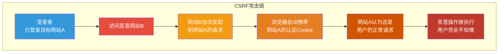
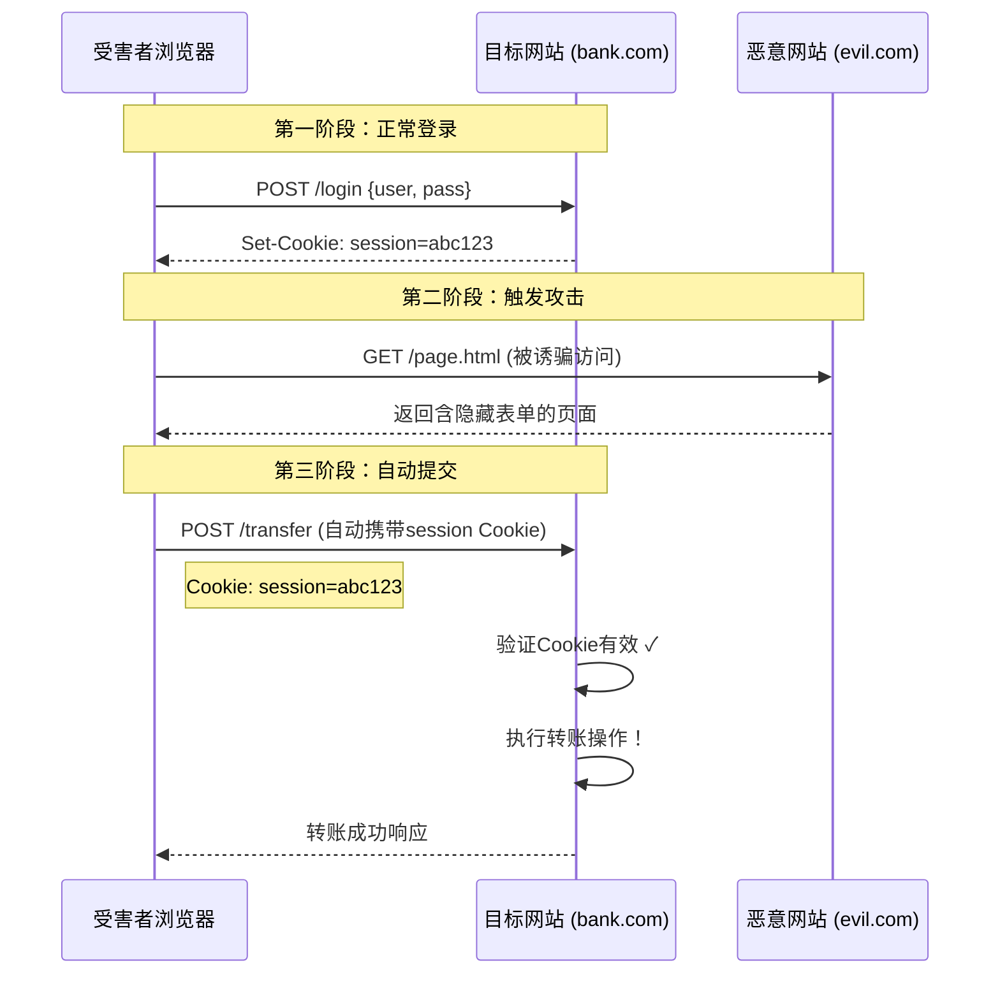
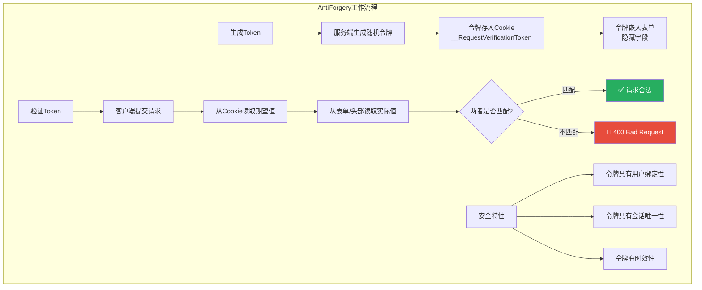
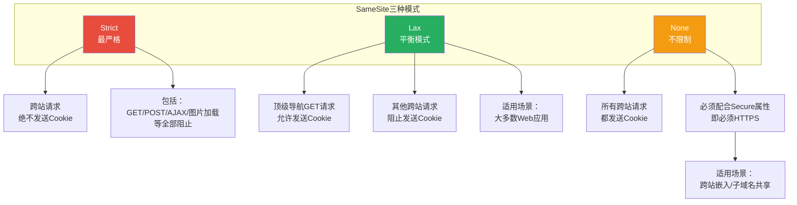
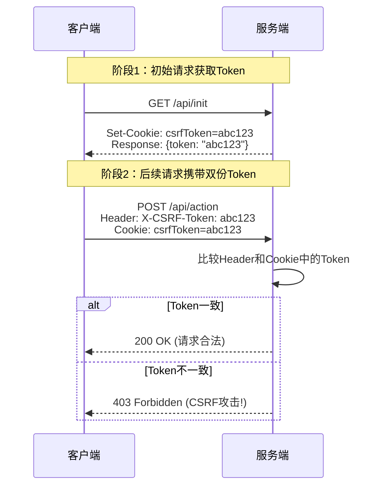
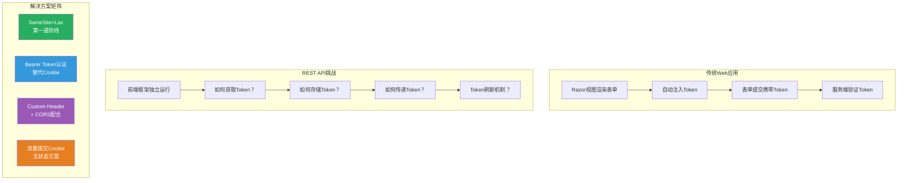

# CSRF跨站请求伪造防御

> **学习目标**：深入理解CSRF（Cross-Site Request Forgery）攻击的原理与危害，掌握ASP.NET Core AntiForgery中间件的工作机制，学会在表单、AJAX和REST API三种场景下构建完整的CSRF防御体系。

## 📚 目录

- [威胁模型](#威胁模型)
- [CSRF攻击原理深度剖析](#csrf攻击原理深度剖析)
- [攻击场景与真实案例](#攻击场景与真实案例)
- [ASP.NET Core AntiForgery机制详解](#aspnet-core-antiforgery机制详解)
- [表单场景的CSRF防护](#表单场景的csrf防护)
- [AJAX请求的Token传递](#ajax请求的token传递)
- [SameSite Cookie配置](#samesite-cookie配置)
- [双重提交Cookie模式](#双重提交cookie模式)
- [REST API的CSRF策略](#rest-api的csrf策略)
- [完整实战：三场景统一防护方案](#完整实战三场景统一防护方案)
- [安全检查清单](#安全检查清单)

---

## 威胁模型

### 为什么CSRF如此危险？

CSRF（Cross-Site Request Forgery，跨站请求伪造）是一种让攻击者能够**以已认证用户的身份执行非预期操作**的攻击方式。其危险性在于：



**核心问题**：浏览器会自动在每次请求中附加对应域名的Cookie，而服务器无法区分这个请求是用户主动发起的还是被恶意页面触发的。

### XSS vs CSRF 对比

| 特性 | XSS (跨站脚本) | CSRF (跨站请求伪造) |
|------|---------------|-------------------|
| **攻击位置** | 在目标网站内执行 | 从第三方网站发起 |
| **代码执行** | 是，JavaScript在目标站运行 | 否，只是普通HTTP请求 |
| **获取Cookie** | 可以读取（HttpOnly除外） | 不能读取，只能自动附带 |
| **主要危害** | 窃取数据、篡改页面 | 伪造用户操作 |
| **防御重点** | 输出编码、CSP | AntiForgeryToken、SameSite |
| **OWASP分类** | A03: 注入类漏洞 | A01: 访问控制失效 |

---

## CSRF攻击原理深度剖析

### 攻击前提条件

一次成功的CSRF攻击需要同时满足以下条件：

```
┌─────────────────────────────────────────────────────┐
│              CSRF攻击的前提条件                      │
├─────────────────────────────────────────────────────┤
│                                                     │
│  ✅ 条件1: 受害者已登录目标网站                       │
│     → 浏览器持有该网站的有效认证Cookie               │
│                                                     │
│  ✅ 条件2: 目标网站的Cookie未设置SameSite限制         │
│     → 或SameSite设置为None                          │
│                                                     │
│  ✅ 条件3: 目标网站没有CSRF Token验证                │
│     → 或验证可以被绕过                              │
│                                                     │
│  ✅ 条件4: 攻击者知道目标API的URL和参数格式           │
│     → 大多数公开的API都满足此条件                    │
│                                                     │
│  ✅ 条件5: 受害者访问了攻击者控制的页面               │
│     → 通过钓鱼邮件、恶意广告、论坛帖子等             │
│                                                     │
└─────────────────────────────────────────────────────┘
```

### 攻击流程图解



### 恶意页面示例

```html
<!-- evil.com/attack.html - 攻击者的恶意页面 -->
<!DOCTYPE html>
<html>
<head>
    <title>恭喜您中奖了！</title>
</head>
<body>
    <h1>🎉 恭喜您获得iPhone 15抽奖资格！</h1>
    <p>点击下方按钮立即参与...</p>

    <!-- 方式1：自动提交的隐藏表单 -->
    <form id="attackForm" method="POST" action="https://bank.com/api/transfer">
        <input type="hidden" name="toAccount" value="attacker-account" />
        <input type="hidden" name="amount" value="10000" />
        <input type="hidden" name="currency" value="CNY" />
    </form>

    <!-- 方式2：使用JavaScript自动触发 -->
    <script>
        // 页面加载后立即自动提交表单
        window.addEventListener('load', function() {
            document.getElementById('attackForm').submit();
            // 或者使用fetch/XMLHttpRequest
            // fetch('https://bank.com/api/transfer', {
            //     method: 'POST',
            //     credentials: 'include', // 关键：携带Cookie
            //     headers: {'Content-Type': 'application/json'},
            //     body: JSON.stringify({
            //         toAccount: 'attacker-account',
            //         amount: 10000
            //     })
            // });
        });
    </script>

    <!-- 同时显示一些迷惑性内容 -->
    <div id="loading">正在验证您的身份，请稍候...</div>
</body>
</html>
```

---

## 攻击场景与真实案例

### 常见攻击场景

#### 场景1：银行转账

```bash
# 攻击者构造的转账请求
POST https://bank.example.com/api/transfers HTTP/1.1
Host: bank.example.com
Cookie: session_id=abc123; auth_token=xyz789

{
    "to_account": "ATTACKER_ACCOUNT_NUMBER",
    "amount": 50000.00,
    "currency": "USD",
    "note": "Payment"
}

# 结果：受害者在不知情的情况下向攻击者账户转账5万美元
```

#### 场景2：修改密码

```html
<!-- 修改密码的CSRF攻击 -->
<form action="https://target.com/account/change-password" method="POST">
    <input type="hidden" name="new_password" value="Hacked123!" />
    <input type="hidden" name="confirm_password" value="Hacked123!" />
</form>
<script>document.forms[0].submit();</script>

<!-- 结果：攻击者可以锁定原用户或接管账号 -->
```

#### 场景3：社交媒体发帖

```javascript
// 自动发布垃圾信息或恶意链接
fetch('https://social-network.com/api/posts', {
    method: 'POST',
    credentials: 'include',
    headers: { 'Content-Type': 'application/json' },
    body: JSON.stringify({
        content: '快来领取免费礼品！http://evil.com/phishing',
        visibility: 'public'
    })
});
// 结果：用户的社交账号被用来传播钓鱼链接
```

#### 场景4：添加管理员账户

```html
<!-- 提权攻击 -->
<form action="https://admin-panel.com/users/create" method="POST">
    <input type="hidden" name="username" value="hacker_admin" />
    <input type="hidden" name="email" value="hacker@evil.com" />
    <input type="hidden" name="role" value="Administrator" />
    <input type="hidden" name="password" value="P@ssw0rd!" />
</form>
```

#### 场景5：删除数据

```javascript
// 批量删除用户数据的CSRF攻击
for (let i = 1; i <= 100; i++) {
    fetch(`https://api.target.com/data/${i}`, {
        method: 'DELETE',
        credentials: 'include'
    });
}
// 结果：用户的重要数据被批量删除
```

### 真实案例

| 时间 | 公司/产品 | 攻击方式 | 影响 |
|------|----------|---------|------|
| **2008** | Netflix | CSRF修改邮箱和密码 | 数百万用户受影响 |
| **2009** | ING Direct（荷兰） | CSRF转账攻击 | 用户资金被盗 |
| **2018** | GitHub | CSRF创建SSH密钥 | 可获取仓库写权限 |
| **2019** | WordPress插件 | CSRF提权至管理员 | 20万+站点受影响 |
| **2020** | Microsoft Teams | CSRF通过SIP消息远程执行代码 | 企业用户受影响 |

---

## ASP.NET Core AntiForgery机制详解

### 工作原理概览



### 核心组件架构

```csharp
/// <summary>
/// ASP.NET Core AntiForgery系统核心接口
/// </summary>

// 1. IAntiforgery - 主要的服务接口
public interface IAntiforgery
{
    /// <summary>
    /// 生成AntiForgery token集合（用于嵌入HTML）
    /// </summary>
    AntiforgeryTokenSet GetAndStoreTokens(HttpContext httpContext);

    /// <summary>
    /// 验证请求中的token是否有效
    /// </summary>
    Task ValidateRequestAsync(HttpContext httpContext);

    /// <summary>
    /// 判断当前请求是否需要CSRF保护
    /// </summary>
    bool IsRequestValidAsync(HttpContext httpContext); // 注意：实际方法名可能不同
}

// 2. AntiforgeryTokenSet - Token集合
public class AntiforgeryTokenSet
{
    /// <summary>
    /// 要放入表单隐藏字段的token值
    /// </summary>
    public string? RequestToken { get; set; }

    /// <summary>
    /// Cookie名称（通常不需要手动设置）
    /// </summary>
    public string? CookieName { get; set; }

    /// <summary>
    /// 表单字段名称
    /// </summary>
    public string? FormFieldName { get; set; }
}

// 3. ValidateAntiForgeryTokenAttribute - MVC过滤器属性
[AttributeUsage(AttributeTargets.Class | AttributeTargets.Method,
                AllowMultiple = false, Inherited = true)]
public class ValidateAntiForgeryTokenAttribute : Attribute, IFilterFactory, IOrderedFilter
{
    // 在Action执行前验证token
    // 如果验证失败，返回400 Bad Request
}

// 4. AutoValidateAntiforgeryTokenAttribute - 全局验证属性
// 与ValidateAntiForgeryToken的区别：
// - 对GET/HEAD/OPTIONS/TRACE请求跳过验证
// - 对其他HTTP方法（POST/PUT/DELETE/PATCH）自动验证
[AttributeUsage(AttributeTargets.Class | AttributeTypes.Method,
                AllowMultiple = false, Inherited = true)]
public class AutoValidateAntiforgeryTokenAttribute : ValidateAntiForgeryTokenAttribute
{
    // 重写验证逻辑，排除安全的HTTP方法
}
```

### Token生成与存储机制

```csharp
/// <summary>
/// DefaultAntiforgeryTokenGenerator - 默认Token生成器实现细节
/// </summary>
internal class DefaultAntiforgeryTokenGenerator
{
    private readonly IAntiforgeryOptions _options;
    private readonly ICryptoSystem _cryptoSystem;

    /// <summary>
    /// 生成新的AntiForgery Token对
    /// </summary>
    public AntiforgeryTokenSet GenerateTokenSet(HttpContext context)
    {
        // 1. 生成Cookie Token（持久化标识）
        var cookieToken = GenerateCookieToken();

        // 2. 存储Cookie Token到浏览器
        SetCookieToken(context, cookieToken);

        // 3. 生成Request Token（一次性令牌）
        var requestToken = GenerateRequestToken(context, cookieToken);

        return new AntiforgeryTokenSet
        {
            FormFieldName = _options.FormFieldName,       // "__RequestVerificationToken"
            RequestToken = SerializeToken(requestToken),   // 序列化后的token字符串
            CookieName = _options.CookieName               // "__RequestVerificationToken"
        };
    }

    private AntiforgeryToken GenerateCookieToken()
    {
        // 使用加密安全的随机数生成器
        // 包含：随机标识符 + 创建时间戳
        return new AntiforgeryToken
        {
            IsCookieToken = true,
            SecurityToken = _cryptoSystem.GenerateRandomBytes(256), // 256位随机数
            Timestamp = DateTime.UtcNow
        };
    }

    private AntiforgeryToken GenerateRequestToken(
        HttpContext context, AntiforgeryToken cookieToken)
    {
        // Request Token包含：
        // 1. Cookie Token的副本（用于匹配）
        // 2. 当前用户的标识符（防止跨用户攻击）
        // 3. 额外的随机盐值

        return new AntiforgeryToken
        {
            IsCookieToken = false,
            SecurityToken = CombineTokens(
                cookieToken.SecurityToken,
                GetAdditionalData(context),  // 用户标识
                _cryptoSystem.GenerateRandomBytes(128) // 随机盐
            ),
            Timestamp = DateTime.UtcNow
        };
    }
}

/// <summary>
/// Token验证流程
/// </summary>
internal class DefaultAntiforgeryTokenValidator
{
    public async Task<bool> TryValidateTokenSet(
        HttpContext context,
        AntiforgeryToken requestToken,
        AntiforgeryToken cookieToken)
    {
        // 1. 检查Token是否存在
        if (requestToken == null || cookieToken == null)
            return false;

        // 2. 检查Token时效性（默认无过期时间，但可配置）
        if (_options.TokenExpiration.HasValue &&
            (DateTime.UtcNow - requestToken.Timestamp) > _options.TokenExpiration.Value)
        {
            return false;
        }

        // 3. 验证两个Token的关联性
        if (!AreTokensRelated(requestToken, cookieToken))
            return false;

        // 4. 验证用户标识一致性
        var currentUserIdentifier = GetUserIdentifier(context);
        var tokenUserIdentifier = ExtractUserIdentifier(requestToken);

        if (!string.Equals(currentUserIdentifier, tokenUserIdentifier))
            return false;

        // 5. 所有检查通过
        return true;
    }
}
```

### Program.cs 配置

```csharp
var builder = WebApplication.CreateBuilder(args);

// ==================== AntiForgery 配置 ====================

// 方式1：基本配置（默认即可工作）
builder.Services.AddAntiforgery(options =>
{
    // Cookie名称
    options.Cookie.Name = "XSRF-TOKEN"; // 常用命名，便于前端识别
    options.Cookie.HttpOnly = true;      // 防止JavaScript访问
    options.Cookie.SecurePolicy = CookieSecurePolicy.SameAsRequest;
    options.Cookie.SameSite = SameSiteMode.Strict;

    // 表单字段名称
    options.FormFieldName = "__RequestVerificationToken";

    // Header名称（用于AJAX/API请求）
    options.HeaderName = "X-XSRF-TOKEN";

    // 是否禁止同一页面多个表单共享token
    options.SuppressXFrameOptionsHeader = false;

    // Token存储选项
    options.StoreTokensWhenAuxiliaryAuthenticationOutlivesAntiforgeryToken = true;
});

var app = builder.Build();

// 使用AntiForgery中间件（通常隐式启用）
app.UseAntiforgery(); // .NET 8+ 显式调用

// ==================== 全局CSRF保护 ====================

// 方式A：全局自动验证（推荐MVC应用）
builder.Services.AddControllersWithViews(options =>
{
    // 添加全局过滤器：对所有POST/PUT/DELETE等请求自动验证
    options.Filters.Add<AutoValidateAntiforgeryTokenAttribute>();
})
    .AddRazorRuntimeCompilation();

// 方式B：仅对特定控制器启用（更灵活）
// 不添加全局过滤器，而是在需要的Controller上单独标注

app.Run();
```

---

## 表单场景的CSRF防护

### Razor Pages 表单防护

```razor
<!-- Pages/Contact.cshtml - 安全的表单实现 -->
@page
@model ContactModel
@{ ViewData["Title"] = "联系我们"; }

<div class="row">
    <div class="col-md-8">
        <section>
            <form method="post">
                <!-- ✅ 关键：Razor自动注入AntiForgery Token -->
                @* 这一行会生成:
                     1. 隐藏输入框: <input name="__RequestVerificationToken" ...>
                     2. 设置Cookie: __RequestVerificationToken=xxx
                *@

                <h4>发送消息给我们</h4>
                <hr />

                <div asp-validation-summary="All" class="text-danger"></div>

                <div class="form-group mb-3">
                    <label asp-for="Input.Email" class="form-label"></label>
                    <input asp-for="Input.Email" class="form-control"
                           autocomplete="username" aria-required="true" />
                    <span asp-validation-for="Input.Email" class="text-danger"></span>
                </div>

                <div class="form-group mb-3">
                    <label asp-for="Input.Subject" class="form-label"></label>
                    <input asp-for="Input.Subject" class="form-control" />
                    <span asp-validation-for="Input.Subject" class="text-danger"></span>
                </div>

                <div class="form-group mb-3">
                    <label asp-for="Input.Message" class="form-label"></label>
                    <textarea asp-for="Input.Message" class="form-control"
                              rows="5"></textarea>
                    <span asp-validation-for="Input.Message" class="text-danger"></span>
                </div>

                <button type="submit" class="btn btn-primary">
                    发送消息
                </button>
            </form>
        </section>
    </div>
</div>
```

```csharp
// Pages/Contact.cshtml.cs - PageModel后端代码
using Microsoft.AspNetCore.Antiforgery;
using Microsoft.AspNetCore.Mvc;
using Microsoft.AspNetCore.Mvc.RazorPages;

[ValidateAntiForgeryToken] // PageModel级别也可以添加
public class ContactModel : PageModel
{
    private readonly ILogger<ContactModel> _logger;
    private readonly IEmailSender _emailSender;

    public ContactModel(ILogger<ContactModel> logger, IEmailSender emailSender)
    {
        _logger = logger;
        _emailSender = emailSender;
    }

    [BindProperty]
    public InputModel Input { get; set; } = new();

    public class InputModel
    {
        [Required]
        [EmailAddress]
        [Display(Name = "电子邮箱")]
        public string Email { get; set; } = string.Empty;

        [Required]
        [StringLength(100, MinimumLength = 3)]
        [Display(Name = "主题")]
        public string Subject { get; set; } = string.Empty;

        [Required]
        [StringLength(2000, MinimumLength = 10)]
        [Display(Name = "消息内容")]
        public string Message { get; set; } = string.Empty;
    }

    /// <summary>
    /// POST处理程序 - 处理表单提交
    /// [HttpPost] 会自动触发ValidateAntiForgeryToken验证
    /// （如果配置了AutoValidateAntiforgeryToken全局过滤器）
    /// </summary>
    public async Task<IActionResult> OnPostAsync()
    {
        // 如果到达这里，说明CSRF Token验证已经通过！

        if (!ModelState.IsValid)
            return Page();

        try
        {
            await _emailSender.SendEmailAsync(
                "contact@example.com",
                $"[联系表单] {Input.Subject}",
                $"来自: {Input.Email}\n\n{Input.Message}");

            TempData["SuccessMessage"] = "您的消息已成功发送！我们会尽快回复。";
            return RedirectToPage("./Index");
        }
        catch (Exception ex)
        {
            _logger.LogError(ex, "发送联系表单邮件失败");
            ModelState.AddModelError(string.Empty, "发送消息时出错，请稍后重试。");
            return Page();
        }
    }
}
```

### MVC Controller 表单防护

```csharp
// Controllers/AccountController.cs
using Microsoft.AspNetCore.Mvc;
using Microsoft.AspNetCore.Antiforgery;

public class AccountController : Controller
{
    private readonly UserManager<ApplicationUser> _userManager;
    private readonly SignInManager<ApplicationUser> _signInManager;
    private readonly IAntiforgery _antiforgery;
    private readonly ILogger<AccountController> _logger;

    public AccountController(
        UserManager<ApplicationUser> userManager,
        SignInManager<ApplicationUser> signInManager,
        IAntiforgery antiforgery,
        ILogger<AccountController> logger)
    {
        _userManager = userManager;
        _signInManager = signInManager;
        _antiforgery antiforgery;
        _logger = logger;
    }

    /// <summary>
    /// 显示修改密码表单
    /// </summary>
    [HttpGet]
    public IActionResult ChangePassword()
    {
        // 手动获取Token并传给视图（如果需要在JS中使用）
        var tokens = _antiforgery.GetAndStoreTokens(HttpContext);
        ViewBag.RequestToken = tokens.RequestToken;

        return View();
    }

    /// <summary>
    /// 处理修改密码请求
    /// [ValidateAntiForgeryToken] 属性确保只有包含有效Token的请求才能通过
    /// </summary>
    [HttpPost]
    [ValidateAntiForgeryToken] // ✅ 必须添加此属性
    public async Task<IActionResult> ChangePassword(ChangePasswordViewModel model)
    {
        // Token验证由框架自动完成，如果无效直接返回400

        if (!ModelState.IsValid)
            return View(model);

        var user = await _userManager.GetUserAsync(User);
        if (user == null)
            return NotFound("无法找到用户");

        // 验证旧密码
        var result = await _userManager.ChangePasswordAsync(user,
            model.OldPassword, model.NewPassword);

        if (result.Succeeded)
        {
            await _signInManager.RefreshSignInAsync(user);
            _logger.LogInformation("用户 {UserId} 成功修改密码", user.Id);

            return RedirectToAction(nameof(Index), "Home");
        }

        foreach (var error in result.Errors)
        {
            ModelState.AddModelError(string.Empty, error.Description);
        }

        return View(model);
    }

    /// <summary>
    /// 更新个人资料
    /// 另一个需要CSRF保护的敏感操作示例
    /// </summary>
    [HttpPost]
    [ValidateAntiForgeryToken]
    public async Task<IActionResult> UpdateProfile(ProfileViewModel model)
    {
        if (!ModelState.IsValid)
            return View(model);

        var user = await _userManager.GetUserAsync(User);
        if (user == null)
            return NotFound();

        user.DisplayName = model.DisplayName;
        user.Bio = model.Bio;

        var result = await _userManager.UpdateAsync(user);

        if (result.Succeeded)
        {
            TempData["StatusMessage"] = "资料更新成功";
            return RedirectToAction(nameof(Profile));
        }

        return View(model);
    }
}
```

### 手动渲染Token（特殊情况）

```html
<!-- 有时需要在非Razor环境中手动输出Token -->

@inject Microsoft.AspNetCore.Antiforgery.IAntiforgery Antiforgery

@{
    var tokens = Antiforgery.GetAndStoreTokens(Context);
}

<!-- 方式1：使用Tag Helper（推荐） -->
<form method="post">
    <antiforgery /> <!-- 等同于 @Html.AntiForgeryToken() -->
</form>

<!-- 方式2：使用HTML Helper -->
<form method="post">
    @Html.AntiForgeryToken()
</form>

<!-- 方式3：完全手动（极少数情况） -->
<form method="post">
    <input type="hidden"
           name="@tokens.FormFieldName"
           value="@tokens.RequestToken" />
</form>

<!-- JavaScript中获取Token值 -->
<script type="text/javascript">
    // 将token暴露给JavaScript（用于AJAX请求）
    window.csrfToken = '@tokens.RequestToken';
    window.csrfHeaderName = 'X-XSRF-TOKEN'; // 或自定义Header名称
</script>
```

---

## AJAX请求的Token传递

### 推荐方式：自定义HTTP Header

使用自定义Header传递CSRF Token是最安全的方式，因为：

1. 同源策略阻止跨域请求自定义Header
2. 即使存在XSS漏洞，攻击者也难以读取HttpOnly的Cookie
3. 不会污染URL参数

#### 步骤1：服务端配置

```csharp
// Program.cs - 配置Header名称
builder.Services.AddAntiforgery(options =>
{
    options.HeaderName = "X-XSRF-TOKEN"; // 自定义Header名称
    options.Cookie.Name = "XSRF-TOKEN";
});
```

#### 步骤2：前端统一拦截器

```typescript
// utils/http.ts - Axios拦截器配置
import axios from 'axios';

// 创建Axios实例
const apiClient = axios.create({
    baseURL: '/api',
    timeout: 30000,
    withCredentials: true, // 重要：允许携带Cookie
    headers: {
        'Content-Type': 'application/json',
        'Accept': 'application/json'
    }
});

// 请求拦截器：自动附加CSRF Token
apiClient.interceptors.request.use((config) => {
    // 从meta标签或Cookie中获取token
    const csrfToken = getCsrfToken();

    if (csrfToken) {
        // 设置到自定义Header中
        config.headers['X-XSRF-TOKEN'] = csrfToken;
    }

    return config;
}, (error) => {
    return Promise.reject(error);
});

// 响应拦截器：处理403错误（可能是CSRF验证失败）
apiClient.interceptors.response.use(
    (response) => response,
    async (error) => {
        if (error.response?.status === 403) {
            const data = error.response.data;

            // 检查是否为CSRF验证失败
            if (data?.error === 'ANTIFORGERY_TOKEN_INVALID' ||
                data?.message?.includes('antiforgery')) {

                console.warn('CSRF Token验证失败，尝试重新获取...');

                // 尝试重新获取token
                try {
                    const newToken = await refreshCsrfToken();
                    if (newToken && error.config) {
                        // 重试原始请求
                        error.config.headers['X-XSRF-TOKEN'] = newToken;
                        return apiClient.request(error.config);
                    }
                } catch (refreshError) {
                    console.error('刷新CSRF Token失败', refreshError);
                }

                // 无法恢复，跳转到首页重新开始
                window.location.href = '/';
            }
        }

        return Promise.reject(error);
    }
);

/**
 * 获取CSRF Token
 */
function getCsrfToken(): string | null {
    // 方式1：从meta标签获取（推荐）
    const metaTag = document.querySelector('meta[name="csrf-token"]');
    if (metaTag) {
        return metaTag.getAttribute('content');
    }

    // 方式2：从Cookie获取（需要服务端配合）
    // 注意：如果Cookie设置了HttpOnly，这种方式不可行
    const match = document.cookie.match(/XSRF-TOKEN=([^;]+)/);
    return match ? match[1] : null;
}

/**
 * 刷新CSRF Token
 */
async function refreshCsrfToken(): Promise<string | null> {
    try {
        const response = await axios.get('/api/csrf/token', {
            withCredentials: true
        });
        return response.data.token;
    } catch (error) {
        console.error('获取新CSRF Token失败', error);
        return null;
    }
}

export default apiClient;
```

#### 步骤3：Layout页面提供Token

```html
<!-- Views/Shared/_Layout.cshtml -->
<!DOCTYPE html>
<html lang="zh-CN">
<head>
    <meta charset="utf-8" />
    <meta name="viewport" content="width=device-width, initial-scale=1.0" />

    <!-- ✅ 关键：将CSRF Token放入meta标签供前端JavaScript使用 -->
    @{
        var antiforgery = Context.RequestServices.GetRequiredService<IAntiforgery>();
        var tokens = antiforgery.GetAndStoreTokens(Context);
    }
    <meta name="csrf-token" content="@tokens.RequestToken" />
    <meta name="csrf-header-name" content="@(options?.HeaderName ?? "X-XSRF-TOKEN")" />

    <title>@ViewData["Title"] - SecureApp</title>
</head>
<body>
    @RenderBody()

    <!-- 前端应用程序入口 -->
    <script src="~/js/app.js" asp-append-version="true"></script>

    @await RenderSectionAsync("Scripts", required: false)
</body>
</html>
```

#### 步骤4：API端点提供Token（SPA应用）

```csharp
/// <summary>
/// 为SPA/前端应用提供CSRF Token的API端点
/// </summary>
[ApiController]
[Route("api/[controller]")]
public class CsrfController : ControllerBase
{
    private readonly IAntiforgery _antiforgery;

    public CsrfController(IAntiforgery antiforgery)
    {
        _antiforgery = antiforgery;
    }

    /// <summary>
    /// 获取当前的CSRF Token
    /// SPA应用初始化时调用此接口获取token
    /// </summary>
    [HttpGet("token")]
    [IgnoreAntiforgeryToken] // 获取token的请求本身不需要验证
    public IActionResult GetToken()
    {
        var tokens = _antiforgery.GetAndStoreTokens(HttpContext);

        return Ok(new
        {
            token = tokens.RequestToken,
            headerName = "X-XSRF-TOKEN",
            formFieldName = tokens.FormFieldName
        });
    }

    /// <summary>
    /// 刷新CSRF Token（当token过期或验证失败时调用）
    /// </summary>
    [HttpPost("refresh")]
    [IgnoreAntiforgeryToken]
    public IActionResult RefreshToken()
    {
        // 强制生成新的token
        var tokens = _antiforgery.GetAndStoreTokens(HttpContext);

        Response.Cookies.Delete("XSRF-TOKEN");

        return Ok(new
        {
            token = tokens.RequestToken,
            message = "Token已刷新"
        });
    }
}
```

### jQuery AJAX集成

```javascript
// jQuery版本：自动附加CSRF Token
$(document).ready(function() {
    // 从meta标签获取token
    var csrfToken = $('meta[name="csrf-token"]').attr('content');
    var csrfHeaderName = $('meta[name="csrf-header-name"]').attr('content') || 'X-XSRF-TOKEN';

    // 为所有jQuery AJAX请求设置默认headers
    $.ajaxSetup({
        beforeSend: function(xhr, settings) {
            // 只对同源请求和非GET请求添加token
            if (!isCrossOrigin(settings.url) &&
                !/^(GET|HEAD|OPTIONS|TRACE)$/i.test(settings.type)) {
                xhr.setRequestHeader(csrfHeaderName, csrfToken);
            }
        },
        complete: function(xhr, status) {
            // 处理403错误
            if (xhr.status === 403) {
                handleCsrfError(xhr);
            }
        }
    });

    // 处理CSRF错误
    function handleCsrfError(xhr) {
        try {
            var response = JSON.parse(xhr.responseText);
            if (response.error === 'ANTIFORGERY_TOKEN_INVALID') {
                // 尝试刷新token并重试
                $.get('/api/csrf/token').done(function(data) {
                    csrfToken = data.token;
                    $('meta[name="csrf-token"]').attr('content', data.token);
                    // 通知用户可以重试操作
                    alert('会话已更新，请重试操作');
                });
            }
        } catch (e) {
            console.error('解析错误响应失败', e);
        }
    }

    // 判断是否跨域请求
    function isCrossOrigin(url) {
        if (!url) return false;
        var link = document.createElement('a');
        link.href = url;
        return link.protocol !== location.protocol ||
               link.hostname !== location.hostname ||
               link.port !== location.port;
    }
});
```

---

## SameSite Cookie配置

### SameSite属性详解

`SameSite`是Cookie的一个属性，控制第三方网站请求时是否发送Cookie。它是CSRF防御的第一道防线。



### 各模式对比

| 场景 | Strict | Lax | None |
|------|--------|-----|------|
| 同站请求（相同域名） | 发送 | 发送 | 发送 |
| 跨站链接点击（GET） | **不发送** | **发送** | 发送 |
| 跨站表单提交（POST） | **不发送** | **不发送** | 发送 |
| 跨站AJAX请求 | **不发送** | **不发送** | 发送 |
| 跨站iframe加载 | **不发送** | **不发送** | 发送 |
| 跨站图片加载 | **不发送** | **不发送** | 发送 |

### ASP.NET Core中的配置

```csharp
// Program.cs - SameSite配置

// 方式1：全局Cookie策略
builder.Services.Configure<CookiePolicyOptions>(options =>
{
    options.MinimumSameSitePolicy = SameSiteMode.Strict; // 最严格
    options.Secure = CookieSecurePolicy.Always;          // 仅HTTPS
});

// 方式2：Identity Cookie单独配置
builder.Services.ConfigureApplicationCookie(options =>
{
    options.Cookie.SameSite = SameSiteMode.Lax;  // 平衡安全性和用户体验
    options.Cookie.HttpOnly = true;              // 防止XSS窃取
    options.Cookie.SecurePolicy = CookieSecurePolicy.SameAsRequest;
});

// 方式3：外部认证Cookie（OAuth/OpenID Connect）
builder.Services.AddAuthentication()
    .AddCookie("ExternalCookie", options =>
    {
        options.Cookie.Name = ".AspNet.External";
        options.Cookie.SameSite = SameSiteMode.None; // 跨站认证需要None
        options.Cookie.SecurePolicy = CookieSecurePolicy.Always;
    })
    .AddGoogle(options =>
    {
        options.SignInScheme = "ExternalCookie";
        options.ClientId = configuration["Authentication:Google:ClientId"];
        options.ClientSecret = configuration["Authentication:Google:ClientSecret"];
    });

// 方式4：AntiForgery Cookie配置
builder.Services.AddAntiforgery(options =>
{
    options.Cookie.SameSite = SameSiteMode.Strict;
    options.Cookie.SecurePolicy = CookieSecurePolicy.Always;
    options.HeaderName = "X-CSRF-TOKEN";
});

var app = builder.Build();

// 应用Cookie策略中间件
app.UseCookiePolicy(); // 必须在UseAuthentication之前
```

### 不同场景的最佳实践

```csharp
/// <summary>
/// 根据应用类型选择合适的SameSite策略
/// </summary>
public static class SameSiteRecommendations
{
    /// <summary>
    /// 传统MVC/Razor Pages应用（推荐配置）
    /// </summary>
    public static void ConfigureForMvcApp(CookiePolicyOptions options)
    {
        // Lax模式：允许跨站GET导航（如从搜索引擎进入）
        // 但阻止跨站POST（CSRF的主要攻击向量）
        options.MinimumSameSitePolicy = SameSiteMode.Lax;
        options.Secure = CookieSecurePolicy.Always;
    }

    /// <summary>
    /// SPA前后端分离应用（API + React/Vue/Angular）
    /// </summary>
    public static void ConfigureForSpaApp(IServiceCollection services)
    {
        // API Cookie：Strict（API不应被跨站调用）
        services.AddAntiforgery(options =>
        {
            options.Cookie.SameSite = SameSiteMode.Strict;
            options.HeaderName = "X-XSRF-TOKEN";
        });
    }

    /// <summary>
    /// 多租户SaaS应用（可能有子域名需求）
    /// </summary>
    public static void ConfigureForMultiTenantApp(CookiePolicyOptions options)
    {
        // 如果需要跨子域名共享Cookie
        options.MinimumSameSitePolicy = SameSiteMode.Lax;
        options.Secure = CookieSecurePolicy.Always;

        // Cookie Domain设置为父域名
        // options.Domain = ".example.com";
    }

    /// <summary>
    /// 需要嵌入第三方网站的应用（如支付网关回调）
    /// </summary>
    public static void ConfigureForEmbeddedApp(CookiePolicyOptions options)
    {
        // 特定场景需要None + Secure
        options.MinimumSameSitePolicy = SameSiteMode.None;
        options.Secure = CookieSecurePolicy.Always; // None必须配合Secure

        // ⚠️ 使用None时必须有其他CSRF保护措施！
    }
}
```

---

## 双重提交Cookie模式

### 原理说明

当无法使用传统的Session-based CSRF Token时（例如无状态API），可以使用**双重提交Cookie（Double Submit Cookie）**模式：



### ASP.NET Core实现

```csharp
/// <summary>
/// 双重提交Cookie CSRF保护中间件
/// 适用于无状态的REST API场景
/// </summary>
public class DoubleSubmitCookieMiddleware
{
    private readonly RequestDelegate _next;
    private readonly DoubleSubmitCookieOptions _options;
    private readonly ILogger<DoubleSubmitCookieMiddleware> _logger;

    public DoubleSubmitCookieMiddleware(
        RequestDelegate next,
        IOptions<DoubleSubmitCookieOptions> options,
        ILogger<DoubleSubmitCookieMiddleware> logger)
    {
        _next = next;
        _options = options.Value;
        _logger = logger;
    }

    public async Task InvokeAsync(HttpContext context)
    {
        var path = context.Request.Path.Value;

        // 只对需要保护的路径进行验证
        if (_options.ProtectedPaths.Any(p => path.StartsWith(p, StringComparison.OrdinalIgnoreCase)))
        {
            var method = context.Request.Method;

            // 跳过安全的方法
            if (!_options.SafeMethods.Contains(method, StringComparer.OrdinalIgnoreCase))
            {
                // 执行双重提交验证
                if (!ValidateDoubleSubmit(context))
                {
                    _logger.LogWarning(
                        "双重提交Cookie验证失败：路径={Path}，方法={Method}，IP={RemoteIp}",
                        path, method, context.Connection.RemoteIpAddress);

                    context.Response.StatusCode = StatusCodes.Status403Forbidden;
                    await context.Response.WriteAsJsonAsync(new
                        {
                            error = "ANTIFORGERY_TOKEN_INVALID",
                            message = "CSRF验证失败，请刷新页面后重试"
                        });
                    return;
                }
            }
        }

        await _next(context);
    }

    private bool ValidateDoubleSubmitCookie(HttpContext context)
    {
        // 1. 从Header中获取Token
        var headerToken = context.Request.Headers[_options.HeaderName].FirstOrDefault();

        // 2. 从Cookie中获取Token
        var cookieToken = context.Request.Cookies[_options.CookieName];

        // 3. 两者都必须存在
        if (string.IsNullOrEmpty(headerToken) || string.IsNullOrEmpty(cookieToken))
        {
            return false;
        }

        // 4. 进行恒定时间比较（防时序攻击）
        return CryptographicOperations.FixedTimeEquals(
            Encoding.UTF8.GetBytes(headerToken),
            Encoding.UTF8.GetBytes(cookieToken));
    }
}

// 配置选项
public class DoubleSubmitCookieOptions
{
    public string CookieName { get; set; } = "XSRF-TOKEN";
    public string HeaderName { get; set; } = "X-XSRF-TOKEN";
    public string[] ProtectedPaths { get; set; } = { "/api/" };
    public string[] SafeMethods { get; set; } = { "GET", "HEAD", "OPTIONS" };

    // Token有效期（分钟）
    public int TokenExpirationMinutes { get; set; } = 60;
}

/// <summary>
/// Token生成和设置的扩展方法
/// </summary>
public static class CsrfTokenExtensions
{
    /// <summary>
    /// 为响应设置双重提交Cookie Token
    /// </summary>
    public static void SetDoubleSubmitCookie(
        this HttpContext context,
        DoubleSubmitCookieOptions options)
    {
        // 生成安全的随机Token
        var token = Convert.ToBase64String(
            RandomNumberGenerator.GetBytes(32)); // 256位随机数

        // 设置Cookie
        var cookieOptions = new CookieOptions
        {
            HttpOnly = false, // JavaScript需要读取以便放到Header中
            Secure = context.Request.IsHttps,
            SameSite = SameSiteMode.Strict,
            MaxAge = TimeSpan.FromMinutes(options.TokenExpirationMinutes),
            Path = "/"
        };

        context.Response.Cookies.Append(options.CookieName, token, cookieOptions);

        // 同时在响应体中返回token（供前端读取）
        // 或者前端可以从Cookie中读取（非HttpOnly的情况下）
    }
}
```

### 注册和使用

```csharp
// Program.cs
builder.Services.Configure<DoubleSubmitCookieOptions>(options =>
{
    options.ProtectedPaths = new[] { "/api/" };
    options.HeaderName = "X-XSRF-TOKEN";
    options.CookieName = "XSRF-TOKEN";
    options.TokenExpirationMinutes = 120;
});

// 注册中间件
var app = builder.Build();
app.UseMiddleware<DoubleSubmitCookieMiddleware>();

// Token生成端点
app.MapGet("/api/csrf/token", (HttpContext context) =>
{
    context.SetDoubleSubmitCookie(
        context.RequestServices.GetRequiredService<IOptions<DoubleSubmitCookieOptions>>().Value);

    // 返回token给前端
    var token = context.Response.Headers["Set-Cookie"]
        .FirstOrDefault(c => c.Contains("XSRF-TOKEN"));

    return Results.Ok(new
    {
        message = "CSRF Token已设置",
        // 前端也可以从Cookie中读取
    });
}).RequireCors("AllowFrontend");

app.Run();
```

---

## REST API的CSRF策略

### API的特殊挑战

REST API与传统Web表单不同，它们面临独特的CSRF防护挑战：



### 策略1：Bearer Token认证（推荐）

对于纯API后端，最好的CSRF防御是不使用Cookie认证：

```csharp
// Program.cs - JWT Bearer Token认证
builder.Services.AddAuthentication(JwtBearerDefaults.AuthenticationScheme)
    .AddJwtBearer(options =>
    {
        options.Authority = "https://auth.yourcompany.com"; // IdentityServer
        options.Audience = "your-api";
        options.RequireHttpsMetadata = true;
        options.TokenValidationParameters = new TokenValidationParameters
        {
            ClockSkew = TimeSpan.Zero,
            ValidateLifetime = true
        };
    });

// 当使用Bearer Token时：
// 1. Token存储在localStorage/sessionStorage（非Cookie）
// 2. 每个请求通过Authorization Header传递
// 3. 跨站请求无法读取localStorage中的Token
// 4. 因此天然免疫CSRF攻击！
```

```typescript
// 前端：JWT Token的使用
const apiClient = axios.create({
    baseURL: '/api',
    headers: {
        'Authorization': `Bearer ${getAuthToken()}`
        // 不需要withCredentials: true（不发送Cookie）
    }
});
```

### 策略2：CORS + Custom Header（混合方案）

当必须使用Cookie认证时，结合CORS策略：

```csharp
// Program.cs - CORS严格配置
builder.Services.AddCors(options =>
{
    options.AddPolicy("ApiCorsPolicy", policy =>
    {
        // 明确指定允许的前端源
        policy.WithOrigins(
                "https://frontend.example.com",
                "https://staging-frontend.example.com"
            )
            .AllowCredentials() // 允许携带凭证（Cookie）
            .WithMethods("GET", "POST", "PUT", "DELETE")
            .WithHeaders(
                "Content-Type",
                "Authorization",
                "X-XSRF-TOKEN"  // 允许自定义CSRF Header
            )
            .SetPreflightMaxAge(TimeSpan.FromHours(1)); // 缓存预检结果
    });
});

var app = builder.Build();
app.UseCors("ApiCorsPolicy");
```

### 策略3：基于角色的差异化保护

```csharp
/// <summary>
/// 智能CSRF过滤器 - 根据请求特征决定是否需要验证
/// </summary>
public class ConditionalAntiforgeryAttribute : ActionFilterAttribute
{
    public override void OnActionExecuting(ActionExecutingContext context)
    {
        var request = context.HttpContext.Request;

        // 1. Bearer Token认证 → 跳过CSRF验证
        var authHeader = request.Headers.Authorization.FirstOrDefault();
        if (authHeader?.StartsWith("Bearer ") == true)
        {
            return; // 天然免疫CSRF
        }

        // 2. 来自Swagger/UI工具 → 跳过（开发环境）
        if (IsDevelopmentTool(request))
        {
            if (context.HttpContext.Environment.IsDevelopment())
                return;
        }

        // 3. 其他情况 → 执行标准CSRF验证
        var antiforgery = context.HttpContext.RequestServices
            .GetRequiredService<IAntiforgery>();

        try
        {
            antiforgery.ValidateRequestAsync(context.HttpContext).GetAwaiter().GetResult();
        }
        catch (AntiforgeryValidationException)
        {
            context.Result = new StatusCodeResult(StatusCodes.Status403Forbidden);
        }
    }

    private static bool IsDevelopmentTool(HttpRequest request)
    {
        var userAgent = request.Headers.UserAgent.ToString().ToLowerInvariant();
        return userAgent.Contains("swagger") ||
               userAgent.Contains("postman") ||
               userAgent.Contains("insomnia");
    }
}

// 使用
[ApiController]
[Route("api/[controller]")]
[ConditionalAntiforgery] // 应用智能过滤
public class ValuesController : ControllerBase
{
    // ...
}
```

---

## 完整实战：三场景统一防护方案

### 项目结构

```
SecureApp/
├── Controllers/
│   ├── HomeController.cs          # 传统页面（表单CSRF）
│   └── Api/
│       └── AccountController.cs   # API端点（Header CSRF）
├── Services/
│   ├── ICsrfService.cs            # CSRF服务接口
│   └── CsrfService.cs             # 统一CSRF管理
├── Middleware/
│   └── CsrfProtectionMiddleware.cs # 中间件
├── wwwroot/js/
│   └── csrf-helper.js            # 前端CSRF辅助库
└── Program.cs                     # 统一配置
```

### 统一CSRF服务

```csharp
// Services/CsrfService.cs
/// <summary>
/// 统一的CSRF Token管理服务
/// 支持表单、AJAX、API三种场景
/// </summary>
public interface ICsrfService
{
    /// <summary>
    /// 获取当前请求的Token集合（用于Razor视图）
    /// </summary>
    AntiforgeryTokenSet GetCurrentTokens(HttpContext context);

    /// <summary>
    /// 为API/SPA提供Token（JSON响应）
    /// </summary>
    CsrfTokenDto GenerateApiToken(HttpContext context);

    /// <summary>
    /// 验证请求（支持多种来源）
    /// </summary>
    Task<bool> ValidateAsync(HttpContext context);

    /// <summary>
    /// 使当前Token失效（登出时调用）
    /// </summary>
    void InvalidateCurrentToken(HttpContext context);
}

public class CsrfService : ICsrfService
{
    private readonly IAntiforgery _antiforgery;
    private readonly ILogger<CsrfService> _logger;
    private readonly CsrfOptions _options;

    public CsrfService(
        IAntiforgery antiforgery,
        ILogger<CsrfService> logger,
        IOptions<CsrfOptions> options)
    {
        _antiforgery = antiforgery;
        _logger = logger;
        _options = options.Value;
    }

    public AntiforgeryTokenSet GetCurrentTokens(HttpContext context)
    {
        return _antiforgery.GetAndStoreTokens(context);
    }

    public CsrfTokenDto GenerateApiToken(HttpContext context)
    {
        var tokens = _antiforgery.GetAndStoreTokens(context);

        return new CsrfTokenDto
        {
            Token = tokens.RequestToken,
            HeaderName = _options.HeaderName,
            FormFieldName = tokens.FormFieldName,
            ExpiresInMinutes = _options.TokenLifetimeMinutes
        };
    }

    public async Task<bool> ValidateAsync(HttpContext context)
    {
        try
        {
            await _antiforgery.ValidateRequestAsync(context);
            return true;
        }
        catch (AntiforgeryValidationException ex)
        {
            _logger.LogWarning(
                "CSRF验证失败：IP={Ip}，路径={Path}，原因={Reason}",
                context.Connection.RemoteIpAddress,
                context.Path,
                ex.Message);

            return false;
        }
    }

    public void InvalidateCurrentToken(HttpContext context)
    {
        // 删除现有的AntiForgery Cookie
        context.Response.Cookies.Delete(_options.CookieName);

        _logger.LogInformation("CSRF Token已失效");
    }
}

// DTO
public class CsrfTokenDto
{
    public string Token { get; set; } = string.Empty;
    public string HeaderName { get; set; } = "X-XSRF-TOKEN";
    public string FormFieldName { get; set; } = "__RequestVerificationToken";
    public int ExpiresInMinutes { get; set; } = 60;
}

public class CsrfOptions
{
    public string CookieName { get; set; } = "XSRF-TOKEN";
    public string HeaderName { get; set; } = "X-XSRF-TOKEN";
    public int TokenLifetimeMinutes { get; set; } = 120;
}
```

### 统一配置Program.cs

```csharp
var builder = WebApplication.CreateBuilder(args);

// ==================== CSRF统一配置 ====================
builder.Services.Configure<CsrfOptions>(builder.Configuration.GetSection("Csrf"));
builder.Services.AddSingleton<ICsrfService, CsrfService>();

// AntiForgery基础配置
builder.Services.AddAntiforgery(options =>
{
    var csrfConfig = builder.Configuration.GetSection("Csrf").Get<CsrfOptions>()
                     ?? new CsrfOptions();

    options.Cookie.Name = csrfConfig.CookieName;
    options.Cookie.HttpOnly = true;
    options.Cookie.SecurePolicy = CookieSecurePolicy.Always;
    options.Cookie.SameSite = SameSiteMode.Strict;
    options.HeaderName = csrfConfig.HeaderName;
    options.FormFieldName = "__RequestVerificationToken";
});

// MVC全局CSRF保护（表单场景）
builder.Services.AddControllersWithViews(options =>
{
    options.Filters.Add<AutoValidateAntiforgeryTokenAttribute>();
});

// API特定配置
builder.Services.AddControllers();

// CORS配置（API场景）
builder.Services.AddCors(options =>
{
    options.AddDefaultPolicy(policy =>
    {
        policy.WithOrigins(builder.Configuration["AllowedOrigions"]?.Split(',') ?? Array.Empty<string>())
              .AllowAnyMethod()
              .AllowAnyHeader()
              .AllowCredentials();
    });
});

var app = builder.Build();

// 中间件管道
app.UseHttpsRedirection();
app.UseStaticFiles();
app.UseRouting();
app.UseCors();
app.UseAuthentication();
app.UseAuthorization();
app.UseAntiforgery(); // .NET 8+

// 端点映射
app.MapControllerRoute(
    name: "default",
    pattern: "{controller=Home}/{action=Index}/{id?}");

// API专用CSRF Token端点
app.MapGet("/api/csrf/token", async (HttpContext context) =>
{
    var csrfService = context.RequestServices.GetRequiredService<ICsrfService>();
    var token = csrfService.GenerateApiToken(context);

    return Results.Ok(token);
});

app.Run();
```

### 前端统一辅助库

```typescript
// wwwroot/js/csrf-helper.js
/**
 * CSRF Helper Library
 * 统一处理CSRF Token的获取、存储和附加
 */

class CsrfHelper {
    private token: string | null = null;
    private headerName: string = 'X-XSRF-TOKEN';
    private tokenEndpoint: string = '/api/csrf/token';

    constructor(config?: Partial<CsrfConfig>) {
        if (config?.headerName) this.headerName = config.headerName;
        if (config?.tokenEndpoint) this.tokenEndpoint = config.tokenEndpoint;

        this.initFromMetaTag();
    }

    /**
     * 从meta标签初始化（Razor页面场景）
     */
    private initFromMetaTag(): void {
        const metaTag = document.querySelector('meta[name="csrf-token"]');
        if (metaTag) {
            this.token = metaTag.getAttribute('content');
            const headerMeta = document.querySelector('meta[name="csrf-header-name"]');
            if (headerMeta) {
                this.headerName = headerMeta.getAttribute('content') || this.headerName;
            }
        }
    }

    /**
     * 获取当前Token（异步，必要时从服务器获取）
     */
    async getToken(): Promise<string | null> {
        // 优先使用内存中的token
        if (this.token) return this.token;

        // 尝试从Cookie获取
        const cookieToken = this.getCookieToken();
        if (cookieToken) {
            this.token = cookieToken;
            return this.token;
        }

        // 从服务器获取
        return await this.fetchNewToken();
    }

    /**
     * 从服务器获取新Token
     */
    async fetchNewToken(): Promise<string | null> {
        try {
            const response = await fetch(this.tokenEndpoint, {
                method: 'GET',
                credentials: 'include'
            });

            if (response.ok) {
                const data = await response.json();
                this.token = data.token;
                if (data.headerName) this.headerName = data.headerName;
                return this.token;
            }
        } catch (error) {
            console.error('获取CSRF Token失败:', error);
        }
        return null;
    }

    /**
     * 将Token附加到请求头
     */
    async attachToHeaders(headers: Headers): Promise<void> {
        const token = await this.getToken();
        if (token) {
            headers.set(this.headerName, token);
        }
    }

    /**
     * 创建带CSRF Token的Fetch封装
     */
    createSecureFetch(input: RequestInfo, init?: RequestInit): Promise<Response> {
        return new Promise(async (resolve, reject) => {
            const headers = new Headers(init?.headers);
            await this.attachToHeaders(headers);

            const secureInit = {
                ...init,
                headers,
                credentials: 'include' as RequestCredentials
            };

            try {
                const response = await fetch(input, secureInit);

                // 处理403（可能的CSRF失败）
                if (response.status === 403) {
                    const refreshed = await this.handleForbidden(response, input, init);
                    resolve(refreshed);
                } else {
                    resolve(response);
                }
            } catch (error) {
                reject(error);
            }
        });
    }

    /**
     * 处理403 Forbidden响应
     */
    private async handleForbidden(
        response: Response,
        originalInput: RequestInfo,
        originalInit?: RequestInit
    ): Promise<Response> {
        // 尝试刷新token并重试
        const newToken = await this.fetchNewToken();
        if (newToken && originalInit) {
            const headers = new Headers(originalInit.headers);
            headers.set(this.headerName, newToken);

            return fetch(originalInput, {
                ...originalInit,
                headers,
                credentials: 'include'
            });
        }

        return response; // 无法恢复，返回原始403
    }

    /**
     * 从Cookie获取Token
     */
    private getCookieToken(): string | null {
        const match = document.cookie.match(/XSRF-TOKEN=([^;]+)/);
        return match ? decodeURIComponent(match[1]) : null;
    }

    /**
     * 使当前Token失效
     */
    invalidate(): void {
        this.token = null;
        // 清除Cookie（如果可访问）
        document.cookie = 'XSRF-TOKEN=; expires=Thu, 01 Jan 1970 00:00:00 UTC; path=/;';
    }
}

interface CsrfConfig {
    headerName?: string;
    tokenEndpoint?: string;
}

// 导出全局实例
window.csrfHelper = new CsrfHelper();

// TypeScript声明
declare global {
    interface Window {
        csrfHelper: CsrfHelper;
    }
}

export default CsrfHelper;
```

---

## 安全检查清单

### 开发阶段检查清单

#### CSRF专项检查

- [ ] **1.1** 所有修改数据的操作（POST/PUT/DELETE/PATCH）都有CSRF保护
- [ ] **1.2** MVC/Razor Pages使用了`[ValidateAntiForgeryToken]`或`[AutoValidateAntiforgeryToken]`
- [ ] **1.3** API端点有相应的CSRF Token验证机制
- [ ] **1.4** AJAX请求通过自定义Header传递Token（而非URL参数）
- [ ] **1.5** Cookie设置了适当的SameSite属性（Lax或Strict）
- [ ] **1.6** 认证Cookie标记为HttpOnly（除非需要双重提交Cookie模式）
- [ ] **1.7** 生产环境强制使用HTTPS（Secure Cookie）
- [ ] **1.8** GET请求不产生副作用（幂等性）
- [ ] **1.9** 登出操作使CSRF Token失效
- [ ] **1.10** Token有合理的过期时间

#### 配置检查

- [ ] **2.1** `AddAntiforgery()`已在Program.cs中正确配置
- [ ] **2.2** Cookie名称和Header名称符合项目规范
- [ ] **2.3** 开发环境和生产环境使用不同的配置
- [ ] **2.4** CORS策略限制了允许的前端源
- [ ] **2.5** Swagger UI在开发环境禁用了CSRF验证（生产环境关闭）

#### 测试检查

- [ ] **3.1** 编写了CSRF攻击模拟测试用例
- [ ] **3.2** 验证了不带Token的请求被拒绝（返回400/403）
- [ ] **3.3** 验证了错误Token的请求被拒绝
- [ ] **3.4** 验证了过期Token的处理流程
- [ ] **3.5** 测试了Token刷新机制的有效性

### 快速测试脚本

```bash
#!/bin/bash
# csrf-test.sh - CSRF防护快速测试脚本

TARGET_URL="${1:-http://localhost:5000}"
echo "=== CSRF防护测试 ==="
echo "目标: $TARGET_URL"
echo ""

# 测试1：获取页面并提取CSRF Token
echo "[1/4] 获取CSRF Token..."
RESPONSE=$(curl -s -c cookies.txt "$TARGET_URL/account/changepassword")
TOKEN=$(echo "$RESPONSE" | grep -oP '(?<=name="__RequestVerificationToken"\s+value=")[^"]+')

if [ -z "$TOKEN" ]; then
    echo "❌ 未找到CSRF Token！页面可能缺少AntiForgery配置"
    exit 1
fi
echo "✅ 找到Token: ${TOKEN:0:20}..."

# 测试2：带Token的正常请求
echo ""
echo "[2/4] 测试带Token的请求..."
RESULT=$(curl -s -b cookies.txt -o /dev/null -w "%{http_code}" \
    -X POST "$TARGET_URL/account/changepassword" \
    -d "__RequestVerificationToken=$TOKEN" \
    -d "OldPassword=test&NewPassword=test123")

if [ "$RESULT" = "200" ] || [ "$RESULT" = "302" ]; then
    echo "✅ 带Token请求成功 (HTTP $RESULT)"
else
    echo "⚠️ 带Token请求返回 HTTP $RESULT（可能是业务逻辑错误）"
fi

# 测试3：不带Token的请求（应该被拒绝）
echo ""
echo "[3/4] 测试不带Token的请求..."
RESULT=$(curl -s -b cookies.txt -o /dev/null -w "%{http_code}" \
    -X POST "$TARGET_URL/account/changepassword" \
    -d "OldPassword=test&NewPassword=test123")

if [ "$RESULT" = "400" ] || [ "$RESULT" = "403" ]; then
    echo "✅ 无Token请求被正确拒绝 (HTTP $RESULT)"
else
    echo "❌ 无Token请求未被拒绝！(HTTP $RESULT) - 存在CSRF漏洞！"
fi

# 测试4：错误Token的请求（应该被拒绝）
echo ""
echo "[4/4] 测试错误Token的请求..."
FAKE_TOKEN="fake_token_$(date +%s)"
RESULT=$(curl -s -b cookies.txt -o /dev/null -w "%{http_code}" \
    -X POST "$TARGET_URL/account/changepassword" \
    -d "__RequestVerificationToken=$FAKE_TOKEN" \
    -d "OldPassword=test&NewPassword=test123")

if [ "$RESULT" = "400" ] || [ "$RESULT" = "403" ]; then
    echo "✅ 错误Token请求被正确拒绝 (HTTP $RESULT)"
else
    echo "❌ 错误Token请求未被拒绝！(HTTP $RESULT) - 可能存在绕过风险！"
fi

# 清理
rm -f cookies.txt

echo ""
echo "=== 测试完成 ==="
```

---

## 总结

CSRF攻击虽然不如SQL注入或XSS那样广为人知，但其危害同样严重——它可以让攻击者**以受害者身份执行任何操作**。作为ASP.NET Core开发者，我们应该：

1. **理解原理**：CSRF利用的是浏览器自动携带Cookie的特性，核心是区分"用户自愿的操作"和"被诱导的操作"

2. **多层防御**：
   - **SameSite Cookie**：第一道防线，阻止大部分自动化攻击
   - **AntiForgery Token**：核心防线，确保请求来自我们的页面
   - **自定义Header**：增强方案，利用同源策略增加安全性

3. **根据场景选择**：
   - **传统MVC/Razor Pages**：使用内置的`[ValidateAntiForgeryToken]`
   - **SPA + API**：使用Header传递Token + SameSite=Strict
   - **纯REST API**：考虑使用Bearer Token认证（天然免疫）

4. **不要忽略细节**：
   - GET请求必须是幂等的（不产生副作用）
   - 登出时要使Token失效
   - Token要有合理的过期时间
   - CORS要严格配置

记住：**CSRF防御不是可有可无的安全增强，而是现代Web应用的必备基础设施**。

---

## 相关文章

- [[01-OWASP-Top10安全指南]] - 了解CSRF在OWASP Top 10中的位置（A01:2021 访问控制失效）
- [[03-XSS跨站脚本攻防]] - XSS与CSRF经常协同攻击，了解XSS防护同样重要
- [[05-HTTPS与安全头部配置]] - HTTPS和SameSite配置的基础
- [[06-输入验证与速率限制]] - 作为额外的防护层

## 参考资源

- [OWASP CSRF Prevention Cheat Sheet](https://cheatsheetseries.owasp.org/cheatsheets/Cross-Site_Request_Forgery_Prevention_Cheat_Sheet.html)
- [CWE-352: Cross-Site Request Forgery](https://cwe.mitre.org/data/definitions/352.html)
- [Microsoft Docs: Prevent XSRF/CSRF attacks in ASP.NET Core](https://learn.microsoft.com/en-us/asp.net/core/security/anti-request-forgery)
- [SameSite Cookies Explained](https://developer.mozilla.org/en-US/docs/Web/HTTP/Headers/Set-Cookie/SameSite)
- [PortSwigger CSRF Guide](https://portswigger.net/web-security/csrf)
