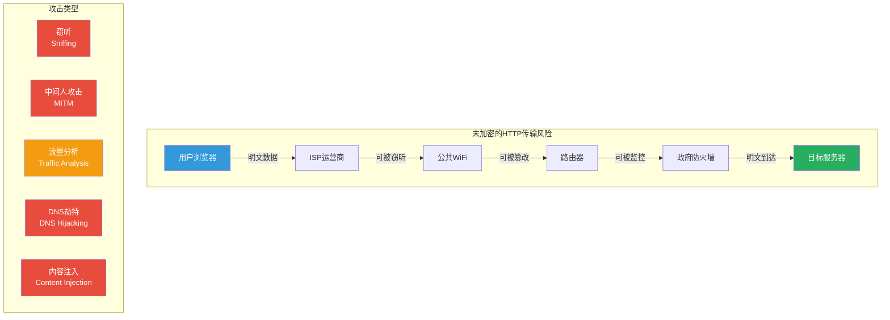
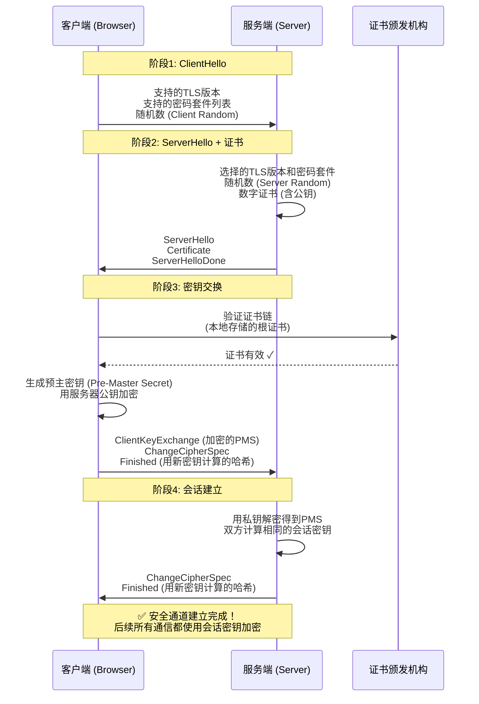
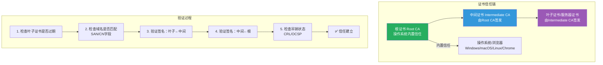
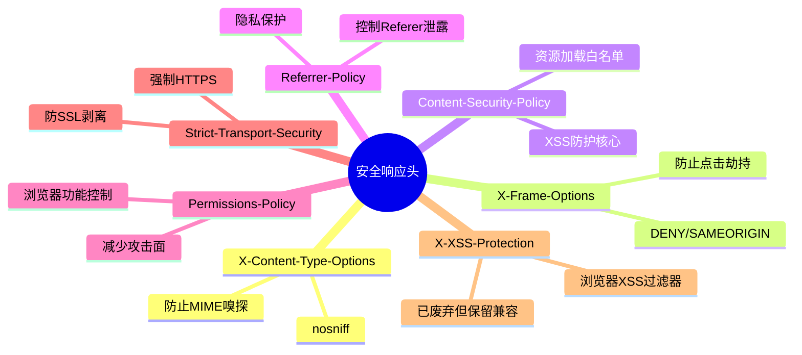
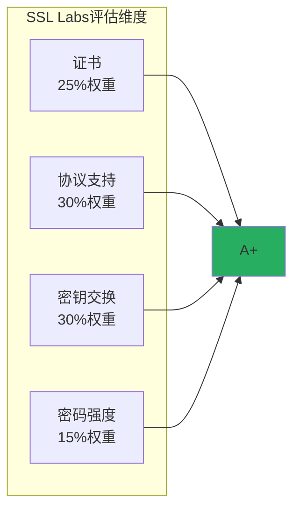

# HTTPS与安全头部配置

> **学习目标**：深入理解HTTPS/TLS加密通信原理，掌握Let's Encrypt证书的自动化管理，学会在ASP.NET Core中配置完整的安全响应头体系，达成SSL Labs A+安全评级。

## 📚 目录

- [威胁模型](#威胁模型)
- [HTTPS/TLS原理深度剖析](#httpstls原理深度剖析)
- [证书管理与Let's Encrypt](#证书管理与lets-encrypt)
- [ASP.NET Core HTTPS配置](#aspnet-core-https配置)
- [HSTS严格传输安全](#hsts严格传输安全)
- [七大安全响应头详解](#七大安全响应头详解)
- [安全头部中间件实现](#安全头部中间件实现)
- [SSL Labs A+评级指南](#ssl-labs-a评级指南)
- [生产级Program.cs模板](#生产级programcs模板)
- [安全检查清单](#安全检查清单)

---

## 威胁模型

### 为什么传输层安全如此重要？

在互联网上，数据经过无数个网络节点才能从客户端到达服务器。如果没有加密，这些数据就像明信片一样可以被任何人阅读：



### 传输层保护的目标

```
┌─────────────────────────────────────────────────────┐
│              传输层安全的三大目标                      │
├─────────────────────────────────────────────────────┤
│                                                     │
│  🔒 机密性 (Confidentiality)                        │
│     → 只有通信双方能理解数据内容                     │
│     → 防止窃听者获取敏感信息                         │
│                                                     │
│  ✅ 完整性 (Integrity)                              │
│     → 数据在传输过程中不被篡改                       │
│     → 接收方能检测到任何修改                         │
│                                                     │
│  🎭 认证 (Authentication)                           │
│     → 确保正在通信的是真正的目标服务器               │
│     → 防止攻击者冒充合法服务器                       │
│                                                     │
└─────────────────────────────────────────────────────┘
```

---

## HTTPS/TLS原理深度剖析

### TLS握手过程



### 证书链结构



### 密码套件选择

密码套件（Cipher Suite）决定了TLS连接使用的具体加密算法组合：

```
格式：TLS_密钥交换算法_认证算法_加密算法_MAC算法

示例解析：
ECDHE-RSA-AES256-GCM-SHA384
 ├─ ECDHE   : 密钥交换 - 椭圆曲线Diffie-Hellman（临时，支持前向保密）
 ├─ RSA     : 认证 - RSA签名
 ├─ AES256  : 加密 - AES 256位（分组密码）
 ├─ GCM     : 认证加密模式 - Galois/Counter Mode
 └─ SHA384  : MAC - SHA-384哈希函数
```

**推荐的安全密码套件优先级**：

| 优先级 | 密码套件 | 密钥长度 | 前向保密 |
|--------|---------|---------|----------|
| 1 | TLS_ECDHE_ECDSA_WITH_AES_256_GCM_SHA384 | 256位 | 是 |
| 2 | TLS_ECDHE_RSA_WITH_AES_256_GCM_SHA384 | 2048+位 | 是 |
| 3 | TLS_ECDHE_ECDSA_WITH_AES_128_GCM_SHA256 | 128位 | 是 |
| 4 | TLS_ECDHE_RSA_WITH_AES_128_GCM_SHA256 | 2048+位 | 是 |
| 5 | TLS_DHE_RSA_WITH_AES_256_GCM_SHA384 | 2048+位 | 是 |

**应禁用的不安全套件**：

| 禁止原因 | 不安全套件 |
|---------|-----------|
| 无前向保密 | TLS_RSA_WITH_* |
| 弱加密 | TLS_*_WITH_RC4_128_*、TLS_*_WITH_DES_* |
| 已破解 | TLS_*_EXPORT_*、TLS_*_WITH_NULL_* |
| 过时协议 | SSLv2、SSLv3、TLSv1.0、TLSv1.1 |

---

## 证书管理与Let's Encrypt

### Let's Encrypt简介

**Let's Encrypt**是一个免费的、自动化的、开放的证书颁发机构(CA)，由ISRG（Internet Security Research Group）运营。它提供完全免费的DV（Domain Validation）证书，通过ACME协议实现自动化申请和续期。

### 使用Certbot自动化管理

```bash
# 在Linux服务器上安装Certbot
sudo apt-get update
sudo apt-get install certbot python3-certbot-nginx

# 方式1：自动配置Nginx（推荐）
sudo certbot --nginx -d yourdomain.com -d www.yourdomain.com

# 方式2：仅获取证书（手动配置）
sudo certbot certonly --webroot \
    -w /var/www/html \
    -d yourdomain.com \
    -d www.yourdomain.com

# 自动续期测试
sudo certbot renew --dry-run

# 设置自动续期cron任务（通常安装时已自动配置）
# 0 */12 * * * root test -x /usr/bin/certbot -a \! -d /run/systemd/system && perl -e 'sleep int(rand(3600))' && certbot -q renew
```

### 在ASP.NET Core中配置证书

#### 开发环境

```csharp
// Program.cs - 开发环境HTTPS配置
var builder = WebApplication.CreateBuilder(args);

// 开发环境：使用.NET自带的开发证书
if (builder.Environment.IsDevelopment())
{
    // .NET CLI创建的开发证书
    // 首次运行时会自动生成并信任
    builder.WebHost.ConfigureKestrel(options =>
    {
        options.ListenLocalhost(5000, listenOptions =>
        {
            listenOptions.UseHttps(); // 使用默认开发证书
        });
    });
}
```

```bash
# 创建和信任开发证书
dotnet dev-certs https -c
dotnet dev-certs https --trust
# Windows: 会弹出提示询问是否信任
# macOS: 输入管理员密码
# Linux: 手动将证书导入系统信任存储
```

#### 生产环境

```csharp
// Program.cs - 生产环境HTTPS配置
var builder = WebApplication.CreateBuilder(args);

if (!builder.Environment.IsDevelopment())
{
    var certificatePath = builder.Configuration["Certificates:Path"];
    var certificatePassword = builder.Configuration["Certificates:Password"];

    builder.WebHost.ConfigureKestrel(options =>
    {
        options.ListenAnyIP(80); // HTTP端口（用于重定向）

        options.ListenAnyIP(443, listenOptions =>
        {
            listenOptions.UseHttps(newHttpsConnectionAdapterOptions
            {
                // 从文件加载证书（PFX格式）
                ServerCertificate = new X509Certificate2(
                    certificatePath,
                    certificatePassword),

                // 或者从证书存储加载
                // ServerCertificate = LoadFromStore(),

                // 协议设置
                SslProtocols = SslProtocols.Tls13 | SslProtocols.Tls12,

                // 客户端证书验证（mTLS场景）
                ClientCertificateMode = ClientCertificateMode.NoCertificate,

                // 密码套件自定义（可选）
                CipherSuitesPolicy = new CipherSuitesPolicy
                {
                    AllowedCipherSuites = new[]
                    {
                        TlsCipherSuite.TLS_ECDHE_ECDSA_WITH_AES_256_GCM_SHA384,
                        TlsCipherSuite.TLS_ECDHE_RSA_WITH_AES_256_GCM_SHA384,
                        TlsCipherSuite.TLS_ECDHE_ECDSA_WITH_AES_128_GCM_SHA256,
                        TlsCipherSuite.TLS_ECDHE_RSA_WITH_AES_128_GCM_SHA256,
                    }
                }
            });

            // 启用HTTP/3（QUIC）
            // listenOptions.UseHttp3();
        });
    });
}
```

```json
// appsettings.Production.json
{
  "Certificates": {
    "Path": "/etc/letsencrypt/live/yourdomain.com/fullchain.pfx",
    "Password": "{从安全存储读取}"
  },
  "Kestrel": {
    "Endpoints": {
      "HttpsInlineCertFile": {
        "Url": "https://*:443",
        "Certificate": {
          "Path": "/etc/letsencrypt/live/yourdomain.com/pfx",
          "Password": "{secure_password}"
        }
      },
      "Http": {
        "Url": "http://*:80"
      }
    }
  }
}
```

### 自动化证书续期脚本

```bash
#!/bin/bash
# renew-and-restart.sh - Let's Encrypt证书续期后重启服务

echo "$(date): 开始检查证书续期..."

# 执行续期（dry-run模式测试）
certbot renew --quiet

# 检查是否有证书被更新
if [ $? -eq 0 ]; then
    echo "$(date): 证书检查完成"

    # 如果证书确实更新了，重启应用
    # Certbot会在更新后执行renew-hook或deploy-hook
    # 这里我们检查证书文件的修改时间
else
    echo "$(date): 续期检查出错"
    exit 1
fi

# 部署钩子：复制PFX格式的证书供.NET应用使用
DEPLOY_HOOK="/etc/letsencrypt/renewal-hooks/deploy/restart-app.sh"

cat > $DEPLOY_HOOK << 'EOF'
#!/bin/bash
# 将Let's Encrypt证书转换为PFX格式
DOMAIN="yourdomain.com"
LIVE_DIR="/etc/letsencrypt/live/$DOMAIN"
PFX_PATH="/var/certificates/$DOMAIN.pfx"
PFX_PASSWORD="{your_secure_password}"

# 使用OpenSSL转换
openssl pkcs12 -export \
    -inkey "$LIVE_DIR/privkey.pem" \
    -in "$LIVE_DIR/fullchain.pem" \
    -out "$PFX_PATH" \
    -password "pass:$PFX_PASSWORD"

# 设置权限
chmod 600 "$PFX_PATH"

# 重启ASP.NET Core应用（systemd）
sudo systemctl restart your-app.service

echo "$(date): 证书已部署，应用已重启"
EOF

chmod +x $DEPLOY_HOOK

echo "$(date): 脚本执行完毕"
```

---

## ASP.NET Core HTTPS配置

### HTTPS重定向中间件

```csharp
var app = builder.Build();

// HTTPS重定向必须在其他中间件之前
app.UseHttpsRedirection(options =>
{
    // 重定向状态码
    options.RedirectStatusCode = StatusCodes.Status308PermanentRedirect;
    // 或临时重定向（测试阶段）
    // options.RedirectStatusCode = StatusCodes.Status307TemporaryRedirect;

    // HTTPS端口号
    options.HttpsPort = 443;

    // 排除某些路径不需要HTTPS（如健康检查端点）
    // 通过自定义中间件实现更灵活的控制
});
```

### 自定义HTTPS重定向规则

```csharp
/// <summary>
/// 高级HTTPS重定向中间件
/// 支持排除特定路径、白名单IP等功能
/// </summary>
public class AdvancedHttpsRedirectionMiddleware
{
    private readonly RequestDelegate _next;
    private readonly AdvancedHttpsRedirectOptions _options;
    private readonly ILogger<AdvancedHttpsRedirectionMiddleware> _logger;

    public AdvancedHttpsRedirectionMiddleware(
        RequestDelegate next,
        IOptions<AdvancedHttpsRedirectOptions> options,
        ILogger<AdvancedHttpsRedirectionMiddleware> logger)
    {
        _next = next;
        _options = options.Value;
        _logger = logger;
    }

    public async Task InvokeAsync(HttpContext context)
    {
        var request = context.Request;

        // 已经是HTTPS → 放行
        if (request.IsHttps)
        {
            await _next(context);
            return;
        }

        // 检查是否需要跳过重定向的路径
        if (ShouldSkipRedirection(request.Path))
        {
            await _next(context);
            return;
        }

        // 检查是否是内部/受信任的网络（可选）
        if (_options.AllowLocalNetwork && IsLocalNetworkRequest(context))
        {
            await _next(context);
            return;
        }

        // 构建重定向URL
        var httpsUrl = BuildHttpsUrl(request);

        _logger.LogInformation(
            "HTTP→HTTPS重定向：{Method} {Path} → {Target}",
            request.Method, request.Path, httpsUrl);

        context.Response.StatusCode = _options.RedirectStatusCode;
        context.Response.Headers.Location = httpsUrl;
    }

    private bool ShouldSkipRedirection(PathString path)
    {
        return _options.ExcludedPaths.Any(excluded =>
            path.StartsWithSegments(excluded, StringComparison.OrdinalIgnoreCase));
    }

    private bool IsLocalNetworkRequest(HttpContext context)
    {
        var remoteIp = context.Connection.RemoteIpAddress;
        if (remoteIp == null) return false;

        // 本地回环地址
        if (IPAddress.IsLoopback(remoteIp)) return true;

        // 私有网络地址范围
        var bytes = remoteIp.GetAddressBytes();
        return bytes[0] == 10 ||                               // 10.0.0.0/8
              (bytes[0] == 172 && bytes[1] >= 16 && bytes[1] <= 31) || // 172.16.0.0/12
              (bytes[0] == 192 && bytes[1] == 168) ||         // 192.168.0.0/16
              bytes[0] == 127;                                 // 127.0.0.0/8
    }

    private string BuildHttpsUrl(HttpRequest request)
    {
        var host = request.Host.Host;
        var port = _options.HttpsPort ?? 443;
        var pathBase = request.PathBase.Value ?? "";
        var path = request.Path.Value ?? "";
        var queryString = request.QueryString.Value ?? "";

        // 构建标准URL
        var urlBuilder = new UriBuilder("https", host, port, pathBase + path, queryString);

        // 处理特殊端口（非标准443端口需要显式指定）
        if (port != 443)
        {
            urlBuilder.Port = port;
        }

        return urlBuilder.ToString();
    }
}

public class AdvancedHttpsRedirectOptions
{
    public int RedirectStatusCode { get; set; } = 308;
    public int? HttpsPort { get; set; } = 443;
    public PathString[] ExcludedPaths { get; set; } = Array.Empty<PathString>();
    public bool AllowLocalNetwork { get; set; } = false;
}
```

---

## HSTS严格传输安全

### 什么是HSTS？

**HTTP Strict Transport Security (HSTS)** 是一个安全策略机制，告诉浏览器只能通过HTTPS与服务器通信，并在一定时间内记住这个规则。

### 为什么HSTS很重要？

没有HSTS时，攻击者可以使用 **SSL Stripping（SSL剥离）** 攻击：

```mermaid
sequenceDiagram
    participant A as 攻击者 (MitM)
    participant B as 受害者浏览器
    participant S as 目标网站

    Note over A,B,S: SSL Stripping攻击流程

    B->>A: GET https://bank.com (用户输入HTTPS URL)
    A->>B: 将请求降级为 http://bank.com
    Note right of A: 中间人将HTTPS降为HTTP

    B->>S: GET http://bank.com (受害者不知道已被降级)
    S->>B: 302 重定向到 https://bank.com
    A->>B: 拦截重定向，保持 http://bank.com
    Note right of A: 阻止HTTPS升级！

    B->>A: POST http://bank.com/login (发送凭据)
    Note right of B: 用户以为在使用HTTPS<br/>实际上所有数据都是明文！
    A->>A: 窃取登录凭据 ✓
```

有了HSTS后，浏览器第一次访问后会记住"此站点必须使用HTTPS"，之后即使遇到SSL剥离攻击也会拒绝HTTP连接。

### ASP.NET Core HSTS配置

```csharp
// Program.cs
var builder = WebApplication.CreateBuilder(args);

// 配置HSTS选项
builder.Services.AddHsts(options =>
{
    // 最大有效期：建议6个月到1年
    // 一旦设置，在这个期间内无法撤销！请谨慎设置
    options.MaxAge = TimeSpan.FromDays(365);

    // 是否包含子域名
    // 如果你的域名有子域名（如 api.example.com），应该启用
    options.IncludeSubDomains = true;

    // 预加载：加入浏览器的HSTS预加载列表
    // 需要提交到 hstspreload.org 并审核通过
    options.Preload = true;
});

var app = builder.Build();

// 仅在生产环境启用HSTS
if (!app.Environment.IsDevelopment())
{
    // HSTS必须在UseHttpsRedirection之前
    app.UseHsts();
    app.UseHttpsRedirection();
}
```

**HSTS响应头示例**：

```
Strict-Transport-Security: max-age=31536000; includeSubDomains; preload
```

各参数说明：

| 参数 | 值 | 含义 |
|------|-----|------|
| `max-age` | `31536000` (365天) | 浏览器记忆HTTPS要求的秒数 |
| `includeSubDomains` | - | 规则也适用于所有子域名 |
| `preload` | - | 申请加入浏览器内置的HSTS预加载列表 |

### HSTS预加载

```markdown
## 提交HSTS预加载申请

### 前置条件
1. 你的站点已经正确配置了HSTS头
2. max-age >= 31536000 (1年)
3. includeSubDomains 已启用
4. preload 已启用
4. 你的站点支持从根域名和www重定向到HTTPS

### 提交步骤
1. 访问 https://hstspreload.org/
2. 输入你的域名
3. 检查是否符合条件
4. 提交申请
5. 等待审核（通常几周到几个月）

### 注意事项
⚠️ **HSTS预加载不可逆！**
一旦被加入预加载列表，即使你移除了HSTS头，
浏览器仍会强制使用HTTPS，直到预加载列表更新。
如果证书出现问题，用户将无法访问你的网站！
```

---

## 七大安全响应头详解

### 安全响应头总览图



### 1. X-Content-Type-Options: nosniff

**作用**：防止浏览器进行MIME类型嗅探（MIME Sniffing）。

**为什么重要**：有些浏览器会尝试猜测内容的真实类型，而不是相信服务器声明的`Content-Type`。这可能导致恶意脚本被执行。

```csharp
// 配置
options.Headers.Add("X-Content-Type-Options", "nosniff");
```

**攻击场景**：

```
攻击者上传一个名为 "avatar.jpg" 的文件，
实际内容是 JavaScript代码。

没有nosniff：
  浏览器可能将其当作 script 执行 → XSS攻击

有nosniff：
  浏览器严格执行 Content-Type: image/jpeg
  即使内容看起来像JavaScript也不会执行
```

### 2. X-Frame-Options

**作用**：控制页面能否被嵌入到`<iframe>`中，防止**点击劫持（Clickjacking）**攻击。

**可选值**：

| 值 | 效果 |
|----|------|
| `DENY` | 完全禁止嵌入（最安全） |
| `SAMEORIGIN` | 只允许同源嵌入 |
| `ALLOW-FROM uri` | 只允许指定来源（部分浏览器不支持） |

```csharp
// 推荐：SAMEORIGIN（如果你的页面需要被同源iframe嵌入）
options.Headers.Add("X-Frame-Options", "SAMEORIGIN");

// 或最严格的DENY
// options.Headers.Add("X-Frame-Options", "DENY");
```

**注意**：现代替代方案是CSP中的`frame-ancestors`指令，两者可以同时设置以兼容旧浏览器。

### 3. Content-Security-Policy (CSP)

详见 [[03-XSS跨站脚本攻防]] 文章的详细说明。基本配置：

```csharp
options.Headers.Add("Content-Security-Policy",
    "default-src 'self'; " +
    "script-src 'self' 'nonce-{nonce}'; " +
    "style-src 'self' 'unsafe-inline' https://fonts.googleapis.com; " +
    "img-src 'self' data: https:; " +
    "font-src 'self' https://fonts.gstatic.com; " +
    "connect-src 'self' https://api.example.com; " +
    "frame-ancestors 'none'; " +
    "form-action 'self'; " +
    "base-uri 'self'; " +
    "object-src 'none'; " +
    "report-uri /api/security/csp-report");
```

### 4. Referrer-Policy

**作用**：控制HTTP请求中`Referer`头的发送行为，保护用户隐私和敏感URL信息。

**推荐值对比**：

| 策略 | Referer发送情况 | 隐私性 | 兼容性 |
|------|----------------|--------|--------|
| `no-referrer` | 从不发送 | 最高 | 好 |
| `same-origin` | 仅同源请求发送 | 高 | 好 |
| `strict-origin` | 只发送源（无路径） | 中高 | 好 |
| `strict-origin-when-cross-origin` | 同源完整，跨域只发源 | 中 | 好 |
| `origin-when-cross-origin` | 同源完整，跨域只发源 | 中 | 好 |
| `origin` | 总是只发送源 | 中高 | 好 |
| `unsafe-url` | 总是发送完整URL | 低 | 好 |

```csharp
// 推荐：平衡隐私性和功能性
options.Headers.Add("Referrer-Policy", "strict-origin-when-cross-origin");

// 或更高隐私级别
// options.Headers.Add("Referrer-Policy", "no-referrer");
```

**为什么重要？**：

```
场景：用户访问 https://example.com/reset-password?token=abc123&email=user@example.com

不设Referrer-Policy：
  页面中的外部资源请求会携带完整URL
  → Token和邮箱泄露给第三方！

设置strict-origin-when-cross-origin：
  跨域请求只发送 https://example.com
  → 敏感参数不会泄露
```

### 5. Permissions-Policy (原Feature-Policy)

**作用**：控制浏览器功能和API的使用权限，减少攻击面。

```csharp
var permissions = new StringBuilder();
permissions.Append("accelerometer=(), ");           // 加速度传感器
permissions.Append("camera=(), ");                  // 相机
permissions.Append("geolocation=(self), ");         // 地理位置（仅允许自身）
permissions.Append("gyroscope=(), ");               // 陀螺仪
permissions.Append("magnetometer=(), ");            // 磁力计
permissions.Append("microphone=(), ");              // 麦克风
permissions.Append("midi=(), ");                   // MIDI设备
permissions.Append("payment=(), ");                 // 支付API
permissions.Append("usb=(), ");                     // USB接口
permissions.Append("screen-wake-lock=(), ");        // 屏幕唤醒锁
permissions.Append("interest-cohort=(), ");         // FloC广告兴趣队列
permissions.Append("clipboard-read=(), ");          // 剪贴板读取
permissions.Append("clipboard-write=(self), ");     // 剪贴板写入（自身）

options.Headers.Add("Permissions-Policy", permissions.ToString().TrimEnd(',', ' '));
```

### 6. Strict-Transport-Security

已在前面HSTS章节详细介绍。

### 7. X-XSS-Protection (已废弃)

**状态**：此头已被现代浏览器废弃，因为现代浏览器默认启用了XSS过滤器，且该头本身存在安全问题（可以启用XSS过滤器绕过）。

```csharp
// 仍然设置以确保兼容性（特别是旧版IE/Edge）
// 值为0表示禁用（推荐），1表示启用
options.Headers.Add("X-XSS-Protection", "0");
```

### 其他有用的安全头

```csharp
// Cross-Origin Opener Policy (COOP) - 防止窗口间干扰
options.Headers.Add("Cross-Origin-Opener-Policy", "same-origin");

// Cross-Origin Embedder Policy (COEP) - 启用跨域隔离
options.Headers.Add("Cross-Origin-Embedder-Policy", "require-corp");

// Cross-Origin Resource Policy (CORP) - 保护资源不被跨域加载
options.Headers.Add("Cross-Origin-Resource-Policy", "same-origin");

// Cache-Control for sensitive responses
// 注意：这不是通用头，应根据响应类型动态设置

// Clear Site Data - 登出时清除站点数据
// 在登出响应中使用：Clear-Site-Data: "cache", "cookies", "storage"
```

---

## 安全头部中间件实现

### 完整的自定义安全头部中间件

```csharp
/// <summary>
/// 安全响应头中间件
/// 统一配置和管理所有安全相关的HTTP响应头
/// </summary>
public class SecurityHeadersMiddleware
{
    private readonly RequestDelegate _next;
    private readonly SecurityHeadersOptions _options;
    private readonly ILogger<SecurityHeadersMiddleware> _logger;

    public SecurityHeadersMiddleware(
        RequestDelegate next,
        IOptions<SecurityHeadersOptions> options,
        ILogger<SecurityHeadersMiddleware> logger)
    {
        _next = next;
        _options = options.Value;
        _logger = logger;
    }

    public async Task InvokeAsync(HttpContext context)
    {
        // 根据环境选择配置集
        var headersConfig = context.Environment.IsDevelopment()
            ? _options.Development
            : _options.Production;

        // 应用每个安全头
        foreach (var header in headersConfig.Headers)
        {
            if (header.Condition == null || header.Condition(context))
            {
                context.Response.Headers[header.Name] = header.Value;
            }
        }

        // 记录安全头设置（Debug级别）
        if (_logger.IsEnabled(LogLevel.Debug))
        {
            var appliedHeaders = headersConfig.Headers
                .Where(h => h.Condition == null || h.Condition(context))
                .Select(h => $"{h.Name}: {h.Value}");

            _logger.LogDebug("安全响应头已设置：{Headers}",
                string.Join("; ", appliedHeaders));
        }

        await _next(context);
    }
}

/// <summary>
/// 单个安全头定义
/// </summary>
public class SecurityHeader
{
    public string Name { get; set; } = string.Empty;
    public string Value { get; set; } = string.Empty;
    /// <summary>
    /// 可选的条件委托，返回true才设置此头
    /// </summary>
    public Func<HttpContext, bool>? Condition { get; set; }
}

/// <summary>
/// 安全头部配置集合
/// </summary>
public class SecurityHeadersOptions
{
    public SecurityHeaderSet Development { get; set; } = new();
    public SecurityHeaderSet Production { get; set; } = new();
}

public class SecurityHeaderSet
{
    public List<SecurityHeader> Headers { get; set; } = new();
}
```

### 注册和使用

```csharp
// Program.cs
builder.Services.Configure<SecurityHeadersOptions>(options =>
{
    // ==================== 生产环境配置 ====================
    options.Production.Headers = new List<SecurityHeader>
    {
        // 1. 防止MIME嗅探
        new() { Name = "X-Content-Type-Options", Value = "nosniff" },

        // 2. 防止点击劫持
        new() { Name = "X-Frame-Options", Value = "SAMEORIGIN" },

        // 3. XSS防护（已废弃但兼容）
        new() { Name = "X-XSS-Protection", Value = "0" },

        // 4. HSTS（如果不在HSTS中间件中单独配置）
        // new() { Name = "Strict-Transport-Security",
        //        Value = "max-age=31536000; includeSubDomains; preload" },

        // 5. 引用策略
        new() { Name = "Referrer-Policy",
               Value = "strict-origin-when-cross-origin" },

        // 6. 权限策略
        new() { Name = "Permissions-Policy",
               Value = "accelerometer=(), camera=(), geolocation=(self), gyroscope=(), magnetometer=(), microphone=(), payment=(), usb=(), clipboard-read=()" },

        // 7. COOP + COEP（启用跨域隔离，提升安全性）
        new() { Name = "Cross-Origin-Opener-Policy", Value = "same-origin" },
        new() { Name = "Cross-Origin-Embedder-Policy", Value = "require-corp" },

        // 8. CORP
        new() { Name = "Cross-Origin-Resource-Policy", Value = "same-origin" },

        // 9. Content-Type Options (Nosniff 变体)
        new() { Name = "X-Download-Options", Value = "noopen" }, // IE专用

        // 10. 服务器信息隐藏（不要暴露框架版本）
        new() { Name = "X-Powered-By", Value = "" }, // 移除
    };

    // ==================== 开发环境配置（较宽松）====================
    options.Development.Headers = new List<SecurityHeader>
    {
        new() { Name = "X-Content-Type-Options", Value = "nosniff" },
        // 开发环境可以禁用一些严格限制以便调试
        // 但基本的头还是要设置
    };
});

// 注册中间件
var app = builder.Build();
app.UseMiddleware<SecurityHeadersMiddleware>();
```

### 使用NWebSec库（推荐用于生产环境）

[NWebSec](https://github.com/NWebSec/NWebSec)是一个成熟的ASP.NET Core安全头管理库，提供了强类型的API和丰富的配置选项。

```bash
# 安装NWebSec
dotnet add package NWebSec.AspNetCore.Middleware
```

```csharp
// Program.cs - 使用NWebSec
using NWebsec.AspNetCore.Middleware;

var builder = WebApplication.CreateBuilder(args);

// NWebSec不需要额外注册服务（纯中间件）

var app = builder.Build();

if (!app.Environment.IsDevelopment())
{
    // ========== CSP配置 ==========
    app.UseCsp(options =>
    {
        // 默认策略
        options.DefaultSources(s => s.Self());

        // 脚本来源
        options.ScriptSources(s =>
        {
            s.Self();
            s.UnsafeInline(); // 开发需要，生产环境移除
            s.UnsafeEval();   // 开发需要，生产环境移除
        });

        // 样式来源
        options.StyleSources(s =>
        {
            s.Self();
            s.UnsafeInline();
            s.CustomSources("https://fonts.googleapis.com");
        });

        // 图片来源
        options.ImageSources(s =>
        {
            s.Self();
            s.Data();
            s.CustomSources("https:", "blob:");
        });

        // 字体来源
        options.FontSources(s =>
        {
            s.Self();
            s.CustomSources("https://fonts.gstatic.com");
        });

        // 连接来源（AJAX/WebSocket）
        options.ConnectSources(s =>
        {
            s.Self();
            s.CustomSources("wss://socket.example.com", "https://api.example.com");
        });

        // iframe祖先（点击劫持防护）
        options.FrameAncestorsSource(s => s.None());

        // 表单目标
        options.FormAction(s => s.Self());

        // Base URI
        options.BaseUri(s => s.Self());

        // 对象/插件源
        options.ObjectSources(s => s.None());

        // 违规报告
        options.ReportUris(r => r.To("/api/security/csp-violation"));
    });

    // ========== HSTS配置 ==========
    app.UseHsts(hsts =>
    {
        hsts.MaxAge(365);
        hsts.IncludeSubdomains();
        hsts.Preload();
    });

    // ========== X-Frame-Options ==========
    app.UseXFrameOptions(xframe => xframe.SameOrigin());

    // ========== XSS Protection ==========
    // 已废弃，但仍设置以确保兼容性
    app.UseXXssProtection(xss => xss.Disabled());

    // ========== Content Type Options ==========
    app.UseContentTypeOptions();

    // ========== Referrer Policy ==========
    app.UseReferrerPolicy(opts =>
        opts.StrictOriginWhenCrossOrigin());

    // ========== Permissions Policy ==========
    app.UsePermissionsPolicy(policy =>
    {
        policy.AddCameraPermission().NoneForAll();
        policy.AddMicrophonePermission().NoneForAll();
        policy.AddGeolocationPermission().SelfFor("https://yourdomain.com");
        policy.AddPaymentPermission().NoneForAll();
        policy.AddUsbPermission().NoneForAll();
    });

    // ========== CORS (NWebSec版本) ==========
    app.UseCors(cors =>
    {
        cors.ForOrigins("https://frontend.example.com")
            .WithMethods(HttpMethods.Get, HttpMethods.Post, HttpMethods.Put, HttpMethods.Delete)
            .WithHeaders("Content-Type", "Authorization", "X-XSRF-TOKEN")
            .AllowCredentials()
            .SetPreflightMaxAge(TimeSpan.FromHours(1));
    });
}

app.Run();
```

---

## SSL Labs A+评级指南

### SSL Labs评估项目

[SSL Labs](https://www.ssllabs.com/ssltest/) 是Qualys提供的免费在线SSL/TLS配置评估工具，给出A+到F的评级。



### 达成A+的完整清单

#### 1. 证书要求 (25%)

- [ ] 证书信任链完整且有效
- [ ] 证书未过期（剩余有效期 > 30天）
- [ ] 域名匹配正确（SAN包含所有使用的域名）
- [ ] 使用2048位以上RSA或256位以上ECDSA密钥
- [ ] 启用了OCSP Stapling（提高性能和隐私）
- [ ] 证书签名算法安全（SHA-256以上）

#### 2. 协议支持 (30%)

```csharp
// 只启用TLS 1.2和TLS 1.3
options.SslProtocols = SslProtocols.Tls13 | SslProtocols.Tls12;

// 明确禁用旧协议
// 不要出现：SSLv2, SSLv3, TLSv1.0, TLSv1.1
```

**必须禁用的协议**：

| 协议 | 版本 | 禁用原因 |
|------|------|---------|
| SSL 2.0 | 1995 | 多个致命漏洞（DROWN等） |
| SSL 3.0 | 1996 | POODLE漏洞 |
| TLS 1.0 | 1999 | BEAST漏洞、弱密码套件 |
| TLS 1.1 | 2006 | RC4等弱算法、缺乏现代特性 |

#### 3. 密钥交换 (30%) - 关键！

这是获得A+的最关键因素：**必须支持前向保密（Forward Secrecy）**

```csharp
// Kestrel配置 - 启用前向保密
builder.WebHost.ConfigureKestrel(options =>
{
    options.ConfigureHttpsDefaults(listenOptions =>
    {
        // 必须使用ECDHE或DHE密钥交换（支持前向保密）
        // 不能使用RSA密钥交换（静态密钥，无前向保密）

        listenOptions.OnAuthenticate = (connectionContext, sslState) =>
        {
            // 可以在这里记录TLS协商信息用于调试
        };
    });
});
```

**前向保密（Forward Secrecy/PFS）的重要性**：

```
没有前向保密（RSA密钥交换）：
  服务器私钥泄露 → 所有历史会话都可被解密！

有前向保密（ECDHE/DHE）：
  每次会话使用临时密钥
  服务器私钥泄露 → 只有当前及之后的会话受影响
  历史会话仍然是安全的！
```

#### 4. 密码强度 (15%)

```csharp
// 自定义密码套件（确保只有强密码套件可用）
listenOptions.UseHttps(new HttpsConnectionAdapterOptions
{
    CipherSuitesPolicy = new CipherSuitesPolicy
    {
        AllowedCipherSuites = new[]
        {
            // 优先级排序：强 > 弱
            TlsCipherSuite.TLS_ECDHE_ECDSA_WITH_AES_256_GCM_SHA384,
            TlsCipherSuite.TLS_ECDHE_RSA_WITH_AES_256_GCM_SHA384,
            TlsCipherSuite.TLS_ECDHE_ECDSA_WITH_AES_128_GCM_SHA256,
            TlsCipherSuite.TLS_ECDHE_RSA_WITH_AES_128_GCM_SHA256,

            // 可选：为了兼容性添加一些稍弱的套件
            // TlsCipherSuite.TLS_DHE_RSA_WITH_AES_256_GCM_SHA384,
            // TlsCipherSuite.TLS_DHE_RSA_WITH_AES_128_GCM_SHA256,
        }
    }
});
```

### OCSP Stapling配置

```csharp
/// <summary>
/// 启用OCSP Stapling以提高TLS握手性能
/// </summary>
public static class OcspStaplingExtensions
{
    public static void EnableOcspStapling(this HttpsConnectionAdapterOptions options)
    {
        // .NET Core 3.1+ 支持OCSP Stapling
        // 默认情况下，当证书包含OCSP responder信息时会自动启用

        // 对于手动配置的场景：
        options.ServerCertificateContext = new SslStreamCertificateContext(
            options.ServerCertificate,
            null, // additional intermediates
            true  // enable online certificate revocation check
        );
    }
}
```

### 快速检测工具

```powershell
# PowerShell脚本：快速检查HTTPS配置
param(
    [string]$TargetUrl = "https://localhost:5001"
)

Write-Host "=== HTTPS安全配置快速检查 ===" -ForegroundColor Cyan
Write-Host ""

try {
    # 发送请求获取响应头
    $response = Invoke-WebRequest -Uri $TargetUrl -MaximumRedirection 0 -ErrorAction Stop
    $headers = $response.Headers

    Write-Host "[1/7] X-Content-Type-Options:" -ForegroundColor Yellow
    if ($headers["X-Content-Type-Options"] -eq "nosniff") {
        Write-Host "    ✅ nosniff" -ForegroundColor Green
    } else {
        Write-Host "    ❌ 未设置或不正确: $($headers['X-Content-Type-Options'])" -ForegroundColor Red
    }

    Write-Host "[2/7] X-Frame-Options:" -ForegroundColor Yellow
    if ($headers["X-Frame-Options"] -match "(DENY|SAMEORIGIN)") {
        Write-Host "    ✅ $($headers['X-Frame-Options'])" -ForegroundColor Green
    } else {
        Write-Host "    ❌ 未设置或不正确" -ForegroundColor Red
    }

    Write-Host "[3/7] Strict-Transport-Security:" -ForegroundColor Yellow
    $hsts = $headers["Strict-Transport-Security"]
    if ($hsts -and $hsts -match "max-age=\d{5,}") {
        Write-Host "    ✅ $hsts" -ForegroundColor Green
    } else {
        Write-Host "    ❌ 未设置或max-age太短" -ForegroundColor Red
    }

    Write-Host "[4/7] Content-Security-Policy:" -ForegroundColor Yellow
    if ($headers["Content-Security-Policy"]) {
        Write-Host "    ✅ 已设置 (长度: $($headers['Content-Security-Policy'].Length)字符)" -ForegroundColor Green
    } else {
        Write-Head "    ❌ 未设置" -ForegroundColor Red
    }

    Write-Host "[5/7] Referrer-Policy:" -ForegroundColor Yellow
    if ($headers["Referrer-Policy"]) {
        Write-Host "    ✅ $($headers['Referrer-Policy'])" -ForegroundColor Green
    } else {
        Write-Host "    ❌ 未设置" -ForegroundColor Red
    }

    Write-Host "[6/7] X-XSS-Protection:" -ForegroundColor Yellow
    if ($headers["X-XSS-Protection"]) {
        Write-Host "    ✅ $($headers['X-XSS-Protection'])" -ForegroundColor Green
    } else {
        Write-Host "    ⚠️ 未设置（现代浏览器不需要）" -ForegroundColor DarkYellow
    }

    Write-Host "[7/7] Permissions-Policy:" -ForegroundColor Yellow
    if ($headers["Permissions-Policy"]) {
        Write-Host "    ✅ 已设置" -ForegroundColor Green
    } else {
        Write-Host "    ❌ 未设置" -ForegroundColor Red
    }

    Write-Host ""
    Write-Host "=== 建议 ===" -ForegroundColor Cyan
    Write-Host "完整的SSL/TLS评估请访问：" -ForegroundColor Gray
    Write-Host "https://www.ssllabs.com/ssltest/analyze.html?d=$($TargetUrl.Replace('https://',''))" -ForegroundColor White

} catch {
    Write-Host "❌ 无法连接到 $TargetUrl" -ForegroundColor Red
    Write-Host "错误: $_" -ForegroundColor Gray
}
```

---

## 生产级Program.cs模板

### 完整的生产环境安全配置

```csharp
// Program.cs - 生产级安全配置模板
// 此模板整合了所有安全最佳实践

using Microsoft.AspNetCore.HttpOverrides;
using NWebsec.AspNetCore.Middleware;
using System.Security.Authentication;

var builder = WebApplication.CreateBuilder(args);

// ================================================================
// 第一阶段：服务配置
// ================================================================

// --- 1. 主机过滤 ---
builder.Services.Configure<HostFilteringOptions>(options =>
{
    options.AllowedHosts = builder.Configuration.GetSection("AllowedHosts").Get<string[]>()
                             ?? new[] { "yourdomain.com", "*.yourdomain.com" };
});

// --- 2. HTTPS配置 ---
builder.WebHost.ConfigureKestrel(serverOptions =>
{
    serverOptions.Limits.MaxRequestBodySize = 50 * 1024 * 1024; // 50MB限制
    serverOptions.Limits.KeepAliveTimeout = TimeSpan.FromMinutes(5);

    // 生产环境HTTPS配置
    if (!builder.Environment.IsDevelopment())
    {
        var certSettings = builder.Configuration.GetSection("Certificates");
        var certPath = certSettings["Path"];
        var certPassword = certSettings["Password"];

        serverOptions.ListenAnyIP(80); // HTTP端口

        serverOptions.ListenAnyIP(443, listenOptions =>
        {
            listenOptions.UseHttps(new HttpsConnectionAdapterOptions
            {
                ServerCertificate = new X509Certificate2(certPath!, certPassword!),

                // 协议：只允许TLS 1.2和1.3
                SslProtocols = SslProtocols.Tls13 | SslProtocols.Tls12,

                // 客户端证书（如需mTLS）
                ClientCertificateMode = ClientCertificateMode.NoCertificate,

                // 密码套件：只允许强密码套件
                CipherSuitesPolicy = new CipherSuitesPolicy
                {
                    AllowedCipherSuites = new[]
                    {
                        TlsCipherSuite.TLS_ECDHE_ECDSA_WITH_AES_256_GCM_SHA384,
                        TlsCipherSuite.TLS_ECDHE_RSA_WITH_AES_256_GCM_SHA384,
                        TlsCipherSuite.TLS_ECDHE_ECDSA_WITH_AES_128_GCM_SHA256,
                        TlsCipherSuite.TLS_ECDHE_RSA_WITH_AES_128_GCM_SHA256,
                    }
                }
            });
        });
    }
});

// --- 3. HSTS配置 ---
builder.Services.AddHsts(options =>
{
    options.MaxAge = TimeSpan.FromDays(365);
    options.IncludeSubDomains = true;
    options.Preload = true;
});

// --- 4. AntiForgery ---
builder.Services.AddAntiforgery(options =>
{
    options.Cookie.Name = "XSRF-TOKEN";
    options.Cookie.HttpOnly = true;
    options.Cookie.SecurePolicy = CookieSecurePolicy.Always;
    options.Cookie.SameSite = SameSiteMode.Strict;
    options.HeaderName = "X-XSRF-TOKEN";
});

// --- 5. CORS ---
builder.Services.AddCors(options =>
{
    options.AddDefaultPolicy(policy =>
    {
        policy.WithOrigins(builder.Configuration.GetSection("AllowedOrigins").Get<string[]>()!)
              .AllowCredentials()
              .WithMethods("GET", "POST", "PUT", "DELETE", "OPTIONS")
              .WithHeaders("Content-Type", "Authorization", "X-XSRF-TOKEN")
              .SetPreflightMaxAge(TimeSpan.FromHours(1));
    });
});

// --- 6. MVC/API ---
builder.Services.AddControllersWithViews(options =>
{
    options.Filters.Add<AutoValidateAntiforgeryTokenAttribute>();
})
.AddJsonOptions(options =>
{
    // 防止JSON反序列化攻击
    options.JsonSerializerOptions.PropertyNamingPolicy = JsonNamingPolicy.CamelCase;
});

// ================================================================
// 第二阶段：构建应用
// ================================================================

var app = builder.Build();

// ================================================================
// 第三阶段：中间件管道（顺序至关重要！）
// ================================================================

if (app.Environment.IsDevelopment())
{
    app.UseDeveloperExceptionPage();
}
else
{
    // 生产环境错误处理
    app.UseExceptionHandler("/Error");
    app.UseHsts();                          // ⬇️ HSTS（必须在HTTPS重定向前）
    app.UseHttpsRedirection();              // ⬇️ HTTPS重定向
    app.UseStatusCodePagesWithReExecute("/Error/{0}");
}

// 反向代理头部转发（如果在负载均衡器后面）
app.UseForwardedHeaders(new ForwardedHeadersOptions
{
    ForwardedHeaders = ForwardedHeaders.XForwardedFor |
                       ForwardedHeaders.XForwardedProto |
                       ForwardedHeaders.XForwardedHost
});

// ================================================================
// 安全响应头（NWebSec）
// ================================================================

// 1. CSP - 内容安全策略
app.UseCsp(csp =>
{
    csp.DefaultSources(s => s.Self());
    csp.ScriptSources(s =>
    {
        s.Self();
        // 生产环境移除 UnsafeInline 和 UnsafeEval
        // 使用 nonce 替代
    });
    csp.StyleSources(s =>
    {
        s.Self();
        s.CustomSources("https://fonts.googleapis.com");
    });
    csp.ImageSources(s => s.Self().Data().CustomSources("https:", "blob:"));
    csp.FontSources(s => s.Self().CustomSources("https://fonts.gstatic.com"));
    csp.ConnectSources(s => s.Self().CustomSources("https://api.example.com"));
    csp.FrameAncestorsSource(s => s.None());
    csp.BaseUri(s => s.Self());
    csp.FormAction(s => s.Self());
    csp.ObjectSources(s => s.None());
    csp.ReportUris(r => r.To("/api/security/csp-violation"));
});

// 2. X-Frame-Options
app.UseXFrameOptions(xfo => xfo.SameOrigin());

// 3. XSS Protection (已废弃)
app.UseXXssProtection(xss => xss.Disabled());

// 4. Content-Type Options
app.UseContentTypeOptions();

// 5. Referrer Policy
app.UseReferrerPolicy(rp => rp.StrictOriginWhenCrossOrigin());

// 6. Permissions Policy
app.UsePermissionsPolicy(policy =>
{
    policy.AddCameraPermission().NoneForAll();
    policy.AddMicrophonePermission().NoneForAll();
    policy.AddGeolocationPermission().SelfFor("https://yourdomain.com");
    policy.AddPaymentPermission().NoneForAll();
    policy.AddUsbPermission().NoneForAll();
});

// 7. Cross-Origin policies
app.UseCrossOriginOpenerPolicy(coop => coop.SameOrigin());
app.UseCrossOriginEmbedderPolicy(coep => coep.RequireCorp());
app.UseCrossOriginResourcePolicy(corp => corp.SameOrigin());

// ================================================================
// 其他中间件
// ================================================================

app.UseStaticFiles(new StaticFileOptions
{
    OnPrepareResponse = ctx =>
    {
        // 静态资源缓存策略
        var headers = ctx.Context.Response.Headers;
        var path = ctx.File.Name.ToLowerInvariant();

        if (path.EndsWith(".html") || path.EndsWith(".htm"))
        {
            headers["Cache-Control"] = "no-cache, no-store, must-revalidate";
        }
        else
        {
            headers["Cache-Control"] = "public, max-age=31536000, immutable";
        }
    }
});

app.UseRouting();
app.UseCors();
app.UseAuthentication();
app.UseAuthorization();
app.UseAntiforgery(); // .NET 8+

// ================================================================
// 端点映射
// ================================================================

app.MapControllerRoute(
    name: "default",
    pattern: "{controller=Home}/{action=Index}/{id?}");

// 健康检查（限制访问）
app.MapHealthChecks("/health").RequireHost("localhost");

// 安全相关端点
app.MapGroup("/api/security")
    .MapSecurityEndpoints();

app.Run();

// ================================================================
// 辅助扩展方法
// ================================================================

static class SecurityEndpointExtensions
{
    public static IEndpointRouteBuilder MapSecurityEndpoints(this IEndpointRouteBuilder group)
    {
        group.MapGet("csp-violation", ReceiveCspViolationReport);
        return group;
    }

    static async Task<IResult> ReceiveCspViolationReport(
        HttpContext context,
        [FromBody] object report)
    {
        // 记录CSP违规
        // TODO: 实现违规日志记录逻辑
        return Results.Ok();
    }
}
```

### 对应的配置文件

```json
// appsettings.Production.json
{
  "AllowedHosts": [
    "yourdomain.com",
    "www.yourdomain.com",
    "api.yourdomain.com"
  ],
  "AllowedOrigins": [
    "https://yourdomain.com",
    "https://www.yourdomain.com",
    "https://admin.yourdomain.com"
  ],
  "Certificates": {
    "Path": "/etc/letsencrypt/live/yourdomain.com/fullchain.pfx",
    "Password": "{从AzureKeyVault/AWSSecretsManager读取}"
  },
  "ConnectionStrings": {
    "DefaultConnection": "Server=db.example.com;Database=prod_db;Encrypt=True;TrustServerCertificate=False;"
  },
  "Logging": {
    "LogLevel": {
      "Default": "Warning",
      "Microsoft.AspNetCore": "Warning",
      "System": "Warning"
    }
  },
  "Serilog": {
    "MinimumLevel": "Information",
    "WriteTo": [
      { "Name": "Console" },
      {
        "Name": "Seq",
        "Args": { "serverUrl": "http://seq-server:5341" }
      }
    ]
  }
}
```

---

## 安全检查清单

### 部署前检查清单

#### 证书与TLS

- [ ] **1.1** 证书由可信CA签发（非自签名）
- [ ] **1.2** 证书未过期（有效期 > 30天）
- [ ] **1.3** 证书覆盖所有使用的域名（包括www、api等）
- [ ] **1.4** 私钥安全存储（权限600，非world-readable）
- [ ] **1.5** 证书链完整（包含中间证书）
- [ ] **1.6** 启用了OCSP Stapling
- [ ] **1.7** 仅支持TLS 1.2和TLS 1.3
- [ ] **1.8** 所有密码套件支持前向保密（ECDHE/DHE）
- [ ] **1.9** SSL Labs评级达到A或A+
- [ ] **1.10** 证书自动续期机制正常工作

#### 安全响应头

- [ ] **2.1** `Strict-Transport-Security`: max-age>=31536000, includeSubDomains, preload
- [ ] **2.2** `X-Content-Type-Options`: nosniff
- [ ] **2.3** `X-Frame-Options`: SAMEORIGIN 或 DENY
- [ ] **2.4** `Content-Security-Policy`: 已配置且有效
- [ ] **2.5** `Referrer-Policy`: strict-origin-when-cross-origin 或更严格
- [ ] **2.6** `Permissions-Policy`: 限制了不必要的浏览器功能
- [ ] **2.7** `X-XSS-Protection`: 0（禁用）
- [ ] **2.8** `Cross-Origin-Opener-Policy`: same-origin
- [ ] **2.9** `Cross-Origin-Embedder-Policy`: require-corp
- [ ] **2.10** `X-Powered-By`: 已移除或修改

#### HTTPS配置

- [ ] **3.1** HTTP自动重定向到HTTPS（301/308）
- [ ] **3.2** HSTS已启用且配置正确
- [ ] **3.3** 开发环境不使用生产证书
- [ ] **3.4** Cookie设置了Secure标志
- [ ] **3.5** Cookie设置了适当的SameSite属性
- [ ] **3.6** 混合内容（Mixed Content）已被阻止
- [ ] **3.7** 内部链接全部使用相对路径或HTTPS绝对路径
- [ ] **3.8** 外部资源也使用HTTPS

### 定期维护检查

- [ ] **M1** 每月检查证书有效期
- [ ] **M2** 每季度重新运行SSL Labs测试
- [ ] **M3** 关注CVE数据库中的TLS/SSL漏洞
- [ ] **M4** 监控TLS握手失败率（可能表明配置问题）
- [ ] **M5** 审计CSP违规报告，优化策略

---

## 总结

传输层安全和响应头配置是Web安全的基石。虽然它们不能防御所有类型的攻击，但没有它们，其他所有的安全措施都可能功亏一篑。作为ASP.NET Core开发者，我们应该：

1. **HTTPS是必须品**：在2024年及以后，没有任何理由让生产环境运行在HTTP上
2. **证书自动化**：使用Let's Encrypt + Certbot实现零成本、全自动的证书管理
3. **安全头是标配**：七大安全头应该是每个项目的标准配置
4. **追求A+评级**：SSL Labs A+不仅是荣誉，更是对用户负责的表现
5. **持续监控**：安全配置不是一次性的工作，需要定期审查和更新

记住：**最好的加密是用户感知不到的加密**——它应该像空气一样无处不在却又透明无感。

---

## 相关文章

- [[03-XSS跨站脚本攻防]] - CSP是XSS防御的核心，两者配合效果最佳
- [[04-CSRF跨站请求伪造防御]] - SameSite Cookie配置的基础知识
- [[01-OWASP-Top10安全指南]] - 了解安全配置错误(A05)在整体威胁模型中的位置

## 参考资源

- [SSL Labs User Guide](https://www.ssllabs.com/projects/)
 Mozilla Security Guidelines](https://infosec.mozilla.org/guidelines/web_security)
- [OWASP Secure Headers Project](https://owasp.org/www-project-secure-headers/)
- [HSTS Preload Website](https://hstspreload.org/)
- [Let's Encrypt Documentation](https://letsencrypt.org/docs/)
- [NWebSec Documentation](https://docs.nwebsec.com/)
