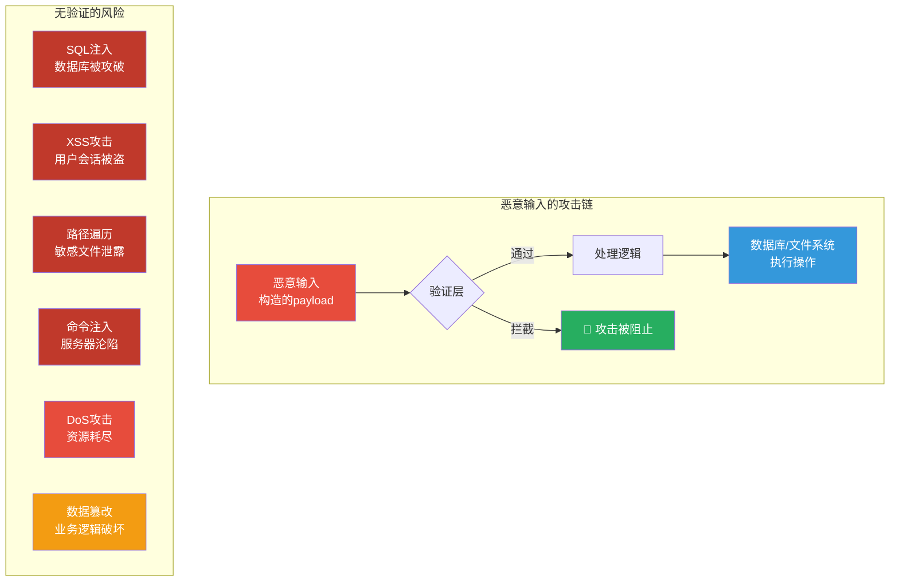
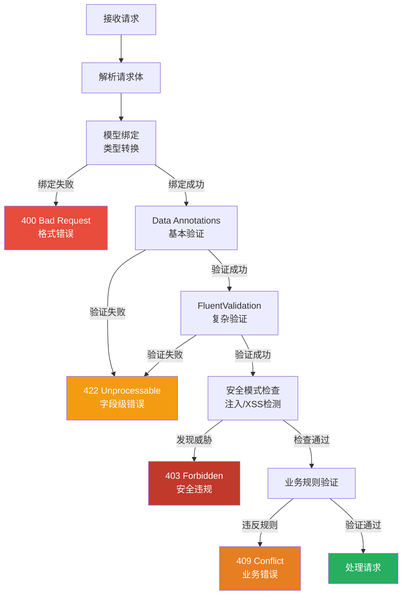
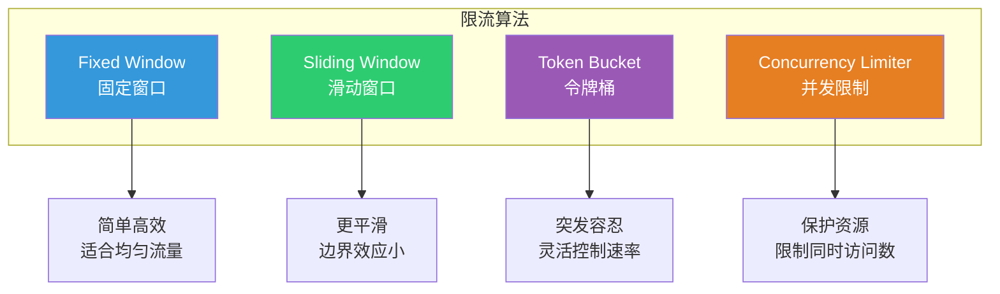
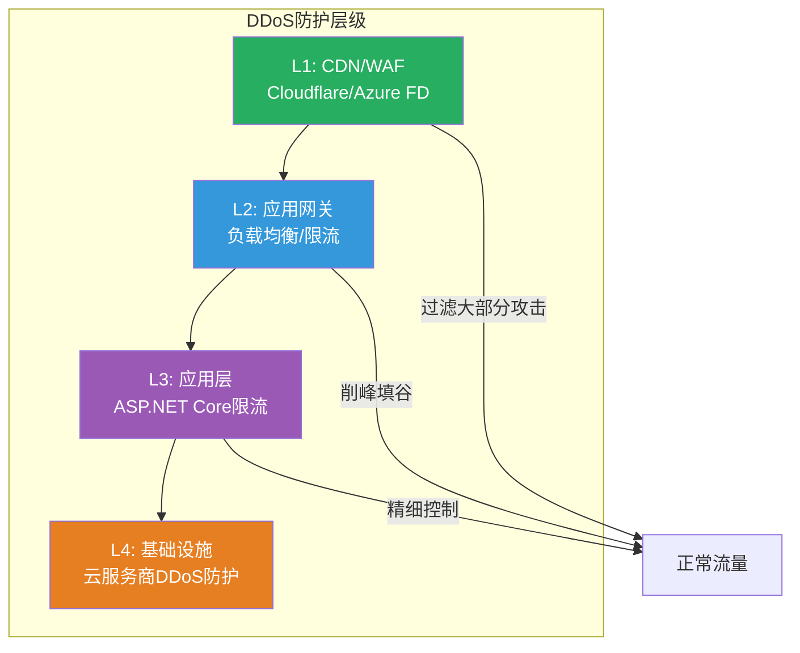
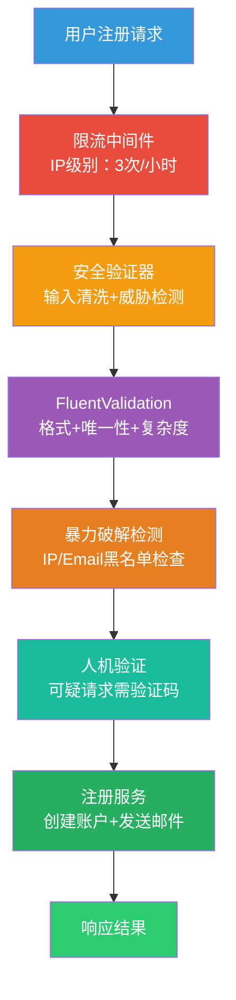

# 输入验证与速率限制

> **学习目标**：掌握ASP.NET Core多层输入验证体系，学会使用Data Annotations和FluentValidation构建健壮的验证机制，实现完整的API速率限制方案，包括固定窗口、滑动窗口、令牌桶等算法，以及防暴力破解和DDoS防护基础。

## 📚 目录

- [威胁模型](#威胁模型)
- [输入验证层次架构](#输入验证层次架构)
- [Data Annotations与FluentValidation](#data-annotations与fluentvalidation)
- [自定义验证器实战](#自定义验证器实战)
- [文件上传安全](#文件上传安全)
- [ASP.NET Core 8 限流中间件详解](#aspnet-core-8-限流中间件详解)
- [自定义限流策略](#自定义限流策略)
- [分布式限流（Redis）](#分布式限流redis)
- [防暴力破解系统](#防暴力破解系统)
- [DDoS防护基础](#ddos防护基础)
- [完整实战：注册接口安全防护体系](#完整实战注册接口安全防护体系)
- [安全检查清单](#安全检查清单)

---

## 威胁模型

### 为什么输入验证如此重要？

**所有Web攻击的入口都是用户输入**。无论是SQL注入、XSS、命令注入还是路径遍历，其根源都是应用程序未能正确验证和清理外部数据。



### 防御深度原则

输入验证应该遵循**防御深度（Defense in Depth）**原则，建立多道防线：

```
┌─────────────────────────────────────────────────────┐
│              多层输入防御体系                         │
├─────────────────────────────────────────────────────┤
│                                                     │
│  第1层: 客户端验证 (用户体验)                        │
│  ├─ 即时反馈，减少无效请求                            │
│  └─ ⚠️ 可被绕过，不能作为唯一防线                     │
│                                                     │
│  第2层: 服务端验证 (核心防线) ✅                      │
│  ├─ 数据格式验证 (类型、长度、范围)                   │
│  ├─ 业务规则验证 (唯一性、权限、状态)                 │
│  └─ 安全规则检测 (注入模式、危险字符)                │
│                                                     │
│  第3层: ORM/参数化查询 (SQL注入防护)                  │
│  └─ EF Core LINQ / 参数化查询                       │
│                                                     │
│  第4层: 数据库约束 (最后保障)                        │
│  ├─ NOT NULL / UNIQUE / CHECK                       │
│  └─ 外键约束 / 触发器                               │
│                                                     │
│  第5层: 速率限制 (DoS防护)                           │
│  └─ IP/用户/API Key级别的请求频率控制               │
│                                                     │
└─────────────────────────────────────────────────────┘
```

---

## 输入验证层次架构

### 三层验证对比

| 层次 | 位置 | 优点 | 缺点 | 安全性 |
|------|------|------|------|--------|
| **客户端** | 浏览器/移动应用 | 即时反馈、减少网络请求 | 可被绕过、可修改代码 | 低 - 仅用于UX |
| **服务端-API** | Controller/Action | 必经之路、可控性强 | 需要编写代码 | 高 - 核心防线 |
| **服务端-数据** | Entity/Database | 最终保障、无法绕过 | 错误信息可能暴露 | 最高 - 最后兜底 |

### 验证流程图



---

## Data Annotations与FluentValidation

### Data Annotations基础

Data Annotations是.NET内置的声明式验证框架，通过特性（Attribute）在模型上定义验证规则。

```csharp
/// <summary>
/// 用户注册DTO - 使用Data Annotations进行基本验证
/// </summary>
public class RegisterRequestDto
{
    /// <summary>
    /// 用户名 - 复杂度要求
    /// </summary>
    [Required(ErrorMessage = "用户名不能为空")]
    [MinLength(3, ErrorMessage = "用户名至少3个字符")]
    [MaxLength(50, ErrorMessage = "用户名不能超过50个字符")]
    [RegularExpression(@"^[a-zA-Z0-9_]+$",
        ErrorMessage = "用户名只能包含字母、数字和下划线")]
    public string Username { get; set; } = string.Empty;

    /// <summary>
    /// 电子邮箱
    /// </summary>
    [Required(ErrorMessage = "邮箱地址不能为空")]
    [EmailAddress(ErrorMessage = "请输入有效的邮箱地址")]
    [MaxLength(256, ErrorMessage = "邮箱地址过长")]
    public string Email { get; set; } = string.Empty;

    /// <summary>
    /// 密码 - 强密码策略
    /// </summary>
    [Required(ErrorMessage = "密码不能为空")]
    [DataType(DataType.Password)]
    [MinLength(12, ErrorMessage = "密码至少12个字符")]
    [MaxLength(128, ErrorMessage = "密码不能超过128个字符")]
    // 自定义正则表达式：复杂度要求
    [RegularExpression(@"^(?=.*[a-z])(?=.*[A-Z])(?=.*\d)(?=.*[@$!%*?&])[A-Za-z\d@$!%*?&]{12,}$",
        ErrorMessage = "密码必须包含大小写字母、数字和特殊字符")]
    public string Password { get; set; } = string.Empty;

    /// <summary>
    /// 确认密码
    /// </summary>
    [Required(ErrorMessage = "请确认密码")]
    [Compare("Password", ErrorMessage = "两次输入的密码不一致")]
    [DataType(DataType.Password)]
    public string ConfirmPassword { get; set; } = string.Empty;

    /// <summary>
    /// 手机号（可选）
    /// </summary>
    [Phone(ErrorMessage = "手机号格式不正确")]
    [RegularExpression(@"^1[3-9]\d{9}$", ErrorMessage = "请输入有效的中国大陆手机号")]
    public string? PhoneNumber { get; set; }

    /// <summary>
    /// 同意条款
    /// </summary>
    [Range(typeof(bool), "true", "true",
        ErrorMessage = "必须同意服务条款和隐私政策")]
    public bool AgreeToTerms { get; set; }

    /// <summary>
    /// 邀请码（可选）
    /// </summary>
    [StringLength(20, MinimumLength = 6,
        ErrorMessage = "邀请码长度应在6-20位之间")]
    [RegularExpression(@"^[A-Za-z0-9]+$",
        ErrorMessage = "邀请码只能包含字母和数字")]
    public string? InvitationCode { get; set; }
}

// 自定义验证属性示例
public class NoHtmlTagAttribute : ValidationAttribute
{
    protected override ValidationResult IsValid(object value,
                                              ValidationContext validationContext)
    {
        var strValue = value as string;
        if (string.IsNullOrWhiteSpace(strValue))
            return ValidationResult.Success;

        // 检测HTML标签
        if (Regex.IsMatch(strValue, @"<[^>]+>", RegexOptions.IgnoreCase))
        {
            return new ValidationResult(
                $"字段 {validationContext.DisplayName} 不能包含HTML标签");
        }

        return ValidationResult.Success;
    }
}

// 使用自定义属性
public class CommentDto
{
    [NoHtmlTag(ErrorMessage = "评论内容不能包含HTML标签")]
    [Required]
    [StringLength(2000)]
    public string Content { get; set; } = string.Empty;
}
```

### FluentValidation进阶

[FluentValidation](https://docs.fluentvalidation.net/)是一个强大的.NET验证库，支持复杂的验证规则、条件验证和自定义消息。

```bash
# 安装FluentValidation
dotnet add package FluentValidation.AspNetCore
dotnet add package FluentValidation.DependencyInjectionExtensions
```

```csharp
// Validators/RegisterValidator.cs
using FluentValidation;

/// <summary>
/// 注册请求的FluentValidation验证器
/// 提供比Data Annotations更强大和灵活的验证能力
/// </summary>
public class RegisterRequestValidator : AbstractValidator<RegisterRequestDto>
{
    private readonly ApplicationDbContext _dbContext;

    // 注入数据库上下文用于唯一性检查
    public RegisterRequestValidator(ApplicationDbContext dbContext)
    {
        _dbContext = dbContext;

        // ========== 用户名验证 ==========
        RuleFor(x => x.Username)
            .NotEmpty().WithMessage("用户名不能为空")
            .Length(3, 50).WithMessage("用户名长度必须在3-50个字符之间")
            .Matches(@"^[a-zA-Z0-9_\u4e00-\u9fa5]+$")
                .WithMessage("用户名只能包含字母、数字、下划线和中文")
            // 异步唯一性检查
            .MustAsync(BeUniqueUsername).WithMessage("该用户名已被使用")
            // 禁止保留名称
            .MustNotBeReservedUsername()
            .WithName("用户名");

        // ========== 邮箱验证 ==========
        RuleFor(x => x.Email)
            .NotEmpty().WithMessage("邮箱不能为空")
            .EmailAddress(FluentValidation.Validators.EmailValidationMode.Net5x)
                .WithMessage("请输入有效的邮箱地址")
            .MaximumLength(256).WithMessage("邮箱过长")
            // 异步唯一性检查
            .MustAsync(BeUniqueEmail).WithMessage("该邮箱已被注册")
            // 禁止一次性邮箱域名
            .MustNotBeDisposableEmail()
            .WithName("电子邮箱");

        // ========== 密码验证 ==========
        RuleFor(x => x.Password)
            .NotEmpty().WithMessage("密码不能为空")
            .MinimumLength(12).WithMessage("密码至少12个字符")
            .MaximumLength(128).WithMessage("密码最多128个字符")
            // 强密码规则
            .Matches(@"[a-z]").WithMessage("密码必须包含小写字母")
            .Matches(@"[A-Z]").WithMessage("密码必须包含大写字母")
            .Matches(@"\d").WithMessage("密码必须包含数字")
            .Matches(@"[@$!%*?&]").WithMessage("密码必须包含特殊字符")
            // 禁止常见弱密码
            .MustNotBeCommonPassword()
            // 禁止连续或重复字符
            .MustNotHaveSequentialChars()
            .WithName("密码");

        // ========== 确认密码 ==========
        RuleFor(x => x.ConfirmPassword)
            .NotEmpty().WithMessage("请确认密码")
            .Equal(x => x.Password).WithMessage("两次输入的密码不一致")
            .WithName("确认密码");

        // ========== 手机号（可选但如果有值则验证）==========
        RuleFor(x => x.PhoneNumber)
            .Matches(@"^1[3-9]\d{9}$").When(x => !string.IsNullOrEmpty(x.PhoneNumber))
                .WithMessage("请输入有效的中国大陆手机号")
            .MustAsync(BeUniquePhoneWhenProvided).WithMessage("该手机号已被注册")
            .WithName("手机号");

        // ========== 条件验证：邀请码场景 ==========
        When(x => !string.IsNullOrEmpty(x.InvitationCode), () =>
        {
            RuleFor(x => x.InvitationCode!)
                .Length(6, 20).WithMessage("邀请码格式不正确")
                .Matches(@"^[A-Za-z0-9]+$").WithMessage("邀请码包含非法字符")
                .MustAsync(BeValidInvitationCode).WithMessage("邀请码无效或已过期");
        });

        // ========== 全局规则集 ==========
        // 使用RuleSet进行分组验证（如不同步骤验证不同内容）
        RuleSet("Step1", () =>
        {
            RuleFor(x => x.Username).NotEmpty();
            RuleFor(x => x.Email).NotEmpty();
            RuleFor(x => x.Password).NotEmpty();
        });
    }

    // ========== 异步验证方法 ==========

    /// <summary>
    /// 检查用户名是否唯一
    /// </summary>
    private async Task<bool> BeUniqueUsername(string username,
                                               CancellationToken cancellationToken)
    {
        return !await _dbContext.Users.AnyAsync(u =>
            u.NormalizedUserName == username.ToUpperInvariant(), cancellationToken);
    }

    /// <summary>
    /// 检查邮箱是否唯一
    /// </summary>
    private async Task<bool> BeUniqueEmail(string email,
                                           CancellationToken cancellationToken)
    {
        return !await _dbContext.Users.AnyAsync(u =>
            u.NormalizedEmail == email.ToUpperInvariant(), cancellationToken);
    }

    /// <summary>
    /// 检查手机号是否唯一（仅当提供了手机号时）
    /// </summary>
    private async Task<bool> BeUniquePhoneWhenProvided(RegisterRequestDto model,
                                                        string? phone,
                                                        CancellationToken ct)
    {
        if (string.IsNullOrEmpty(phone)) return true;
        return !await _dbContext.UserPhones.AnyAsync(p =>
            p.PhoneNumber == phone && p.IsVerified, ct);
    }

    /// <summary>
    /// 验证邀请码有效性
    /// </summary>
    private async Task<bool> BeValidInvitationCode(string code,
                                                   CancellationToken ct)
    {
        var invitation = await _dbContext.Invitations
            .FirstOrDefaultAsync(i =>
                i.Code == code &&
                i.IsActive &&
                (!i.ExpiresAt.HasValue || i.ExpiresAt > DateTime.UtcNow) &&
                i.UsageCount < i.MaxUsageCount, ct);

        return invitation != null;
    }
}

// ========== 扩展方法 ==========

/// <summary>
/// FluentValidation扩展方法 - 禁止保留用户名
/// </summary>
public static class UsernameValidationExtensions
{
    private static readonly HashSet<string> ReservedUsernames = new(StringComparer.OrdinalIgnoreCase)
    {
        "admin", "administrator", "root", "system", "superuser",
        "support", "help", "info", "test", "demo", "api",
        "www", "mail", "ftp", "db", "sql", "backup"
    };

    public static IRuleBuilderOptions<T, string> MustNotBeReservedUsername<T>(
        this IRuleBuilder<T, string> ruleBuilder)
    {
        return ruleBuilder.Must(username =>
            !ReservedUsernames.Contains(username))
            .WithMessage("此用户名为系统保留，不可使用");
    }
}

/// <summary>
/// 禁止一次性邮箱
/// </summary>
public static class EmailValidationExtensions
{
    private static readonly HashSet<string> DisposableDomains = new(StringComparer.OrdinalIgnoreCase)
    {
        "tempmail.com", "guerrillamail.com", "10minutemail.com",
        "mailinator.com", "throwaway.email", "fakeinbox.com"
        // ... 更多一次性邮箱域名
    };

    public static IRuleBuilderOptions<T, string> MustNotBeDisposableEmail<T>(
        this IRuleBuilder<T, string> ruleBuilder)
    {
        return ruleBuilder.Must(email =>
        {
            if (string.IsNullOrEmpty(email)) return true;
            var domain = email.Split('@').LastOrDefault()?.ToLowerInvariant();
            return domain == null || !DisposableDomains.Contains(domain);
        }).WithMessage("不支持使用一次性邮箱注册");
    }
}

/// <summary>
/// 密码强度验证扩展
/// </summary>
public static class PasswordValidationExtensions
{
    private static readonly string[] CommonPasswords =
    {
        "password", "12345678", "qwerty123", "admin123",
        "letmein", "welcome1", "monkey123", "dragon123"
    };

    public static IRuleBuilderOptions<T, string> MustNotBeCommonPassword<T>(
        this IRuleBuilder<T, string> ruleBuilder)
    {
        return ruleBuilder.Must(password =>
        {
            var lowerPwd = password.ToLowerInvariant();
            return !CommonPasswords.Any(common =>
                lowerPwd.Contains(common));
        }).WithMessage("密码过于简单，请使用更复杂的组合");
    }

    public static IRuleBuilderOptions<T, string> MustNotHaveSequentialChars<T>(
        this IRuleBuilder<T, string> ruleBuilder)
    {
        return ruleBuilder.Must(password =>
        {
            // 检查3个以上连续相同字符
            if (Regex.IsMatch(password, @"(.)\1{2,}"))
                return false;

            // 检查键盘序列（简化版）
            var sequences = new[] { "abc", "bcd", "cde", "def",
                                   "123", "234", "345", "456" };
            var lowerPwd = password.ToLowerInvariant();
            return !sequences.Any(s => lowerPwd.Contains(s));
        }).WithMessage("密码不能包含连续的字符序列");
    }
}
```

### 注册验证服务

```csharp
// Program.cs - 注册FluentValidation
using FluentValidation;
using FluentValidation.AspNetCore;

builder.Services.AddValidatorsFromAssemblyContaining<Program>();
builder.Services.AddFluentValidationAutoValidation();

// 控制器中使用
[ApiController]
[Route("api/[controller]")]
public class AccountController : ControllerBase
{
    private readonly IValidator<RegisterRequestDto> _registerValidator;

    public AccountController(IValidator<RegisterRequestDto> registerValidator)
    {
        _registerValidator = registerValidator;
    }

    [HttpPost("register")]
    public async Task<IActionResult> Register([FromBody] RegisterRequestDto request)
    {
        // 手动触发验证
        var validationResult = await _registerValidator.ValidateAsync(request);

        if (!validationResult.IsValid)
        {
            // 返回详细的字段级错误
            return UnprocessableEntity(new
            {
                success = false,
                errors = validationResult.Errors.Select(e => new
                {
                    field = e.PropertyName,
                    message = e.ErrorMessage,
                    attemptedValue = e.AttemptedValue
                })
            });
        }

        // 验证通过，继续处理...
        var result = await _accountService.RegisterAsync(request);
        return Ok(result);
    }
}
```

---

## 自定义验证器实战

### 正则表达式验证器库

```csharp
/// <summary>
/// 正则表达式验证工具类
/// 收集常用的安全相关正则表达式
/// </summary>
public static class SecurityPatterns
{
    // ==================== 通用验证 ====================

    /// <summary>
    /// 安全的用户名（允许中英文、数字、下划线）
    /// </summary>
    public const string SafeUsername = @"^[\w\u4e00-\u9fa5]{2,30}$";

    /// <summary>
    /// 强密码（至少12位，含大小写、数字、特殊字符）
    /// </summary>
    public const string StrongPassword =
        @"^(?=.*[a-z])(?=.*[A-Z])(?=.*\d)(?=.*[@$!%*?&\-_+=()[\]{}|\\:;<>,.?/~`]).{12,}$";

    /// <summary>
    /// 中国大陆手机号
    /// </summary>
    public const string ChineseMobile = @"^1[3-9]\d{9}$";

    /// <summary>
    /// 中国大陆身份证号（18位）
    /// </summary>
    public const string ChineseIdCard =
        @"^[1-9]\d{5}(18|19|20)\d{2}(0[1-9]|1[0-2])(0[1-9]|[12]\d|3[01])\d{3}[\dXx]$";

    /// <summary>
    /// 安全的URL（只允许http/https协议）
    /// </summary>
    public const string SafeUrl =
        @"^https?://(?:[-\w.])+(?:[:/\?#][-=!()*\[\]{};:@&+$,%/\w.]*)?$";

    // ==================== 安全检测 ====================

    /// <summary>
    /// SQL注入特征检测（保守版，误报率低）
    /// </summary>
    public const string SqlInjectionPattern =
        @"\b(union\s+(all\s+)?select|insert\s+into|delete\s+from|" +
        @"drop\s+(table|database)|exec(ute)?\s+" +
        @"xp_cmdshell|waitfor\s+delay" +
        @")\b";

    /// <summary>
    /// XSS特征检测
    /// </summary>
    public const string XssPattern =
        @"<[\s]*script|javascript\s*:|on(error|load|click)\s*=";

    /// <summary>
    /// 路径遍历检测
    /// </summary>
    public const string PathTraversalPattern =
        @"\.\.[\\/]|%2e%2e[%/\\]";

    /// <summary>
    /// 命令注入检测
    /// </summary>
    public const string CommandInjectionPattern =
        @[;&|`$(){}]";
}

/// <summary>
/// 输入安全验证器
/// </summary>
public interface ISecurityValidator
{
    /// <summary>
    /// 验证输入是否包含潜在的安全威胁
    /// </summary>
    SecurityValidationResult Validate(string input, InputType type);
}

public enum InputType
{
    FreeText,
    Username,
    SearchQuery,
    UrlParameter,
    FileName,
    JsonContent
}

public class SecurityValidationResult
{
    public bool IsValid { get; set; }
    public List<string> ThreatsDetected { get; set; } = new();
    public string SanitizedInput { get; set; } = string.Empty;
}

public class SecurityValidator : ISecurityValidator
{
    private readonly ILogger<SecurityValidator> _logger;

    public SecurityValidator(ILogger<SecurityValidator> logger)
    {
        _logger = logger;
    }

    public SecurityValidationResult Validate(string input, InputType type)
    {
        var result = new SecurityValidationResult { IsValid = true };

        if (string.IsNullOrWhiteSpace(input))
            return result;

        // 根据输入类型选择不同的检测策略
        switch (type)
        {
            case InputType.SearchQuery:
                CheckSqlInjection(input, result);
                break;

            case InputType.FreeText:
            case InputType.Username:
                CheckXss(input, result);
                CheckPathTraversal(input, result);
                break;

            case InputType.FileName:
                CheckPathTraversal(input, result);
                CheckDangerousFileName(input, result);
                break;

            case InputType.UrlParameter:
                CheckXss(input, result);
                CheckProtocolInjection(input, result);
                break;
        }

        // 如果检测到威胁，记录日志
        if (!result.IsValid)
        {
            _logger.LogWarning(
                "安全验证检测到威胁：类型={Type}，威胁={Threats}，输入预览={Preview}",
                type, string.Join(", ", result.ThreatsDetected),
                input.Length > 100 ? input[..100] + "..." : input);
        }

        return result;
    }

    private void CheckSqlInjection(string input, SecurityValidationResult result)
    {
        if (Regex.IsMatch(input, SecurityPatterns.SqlInjectionPattern,
            RegexOptions.IgnoreCase))
        {
            result.IsValid = false;
            result.ThreatsDetected.Add("SQL_INJECTION_PATTERN");
        }
    }

    private void CheckXss(string input, SecurityValidationResult result)
    {
        if (Regex.IsMatch(input, SecurityPatterns.XssPattern,
            RegexOptions.IgnoreCase))
        {
            result.IsValid = false;
            result.ThreatsDetected.Add("XSS_PATTERN");
        }
    }

    private void CheckPathTraversal(string input, SecurityValidationResult result)
    {
        if (Regex.IsMatch(input, SecurityPatterns.PathTraversalPattern,
            RegexOptions.IgnoreCase))
        {
            result.IsValid = false;
            result.ThreatsDetected.Add("PATH_TRAVERSAL");
        }
    }

    private void CheckDangerousFileName(string input, SecurityValidationResult result)
    {
        var dangerousNames = new[] { ".htaccess", "web.config", ".gitignore",
                                     ".env", ".DS_Store", "thumbs.db" };
        var lowerName = input.ToLowerInvariant();

        foreach (var name in dangerousNames)
        {
            if (lowerName.Contains(name))
            {
                result.IsValid = false;
                result.ThreatsDetected.Add($"DANGEROUS_FILENAME:{name}");
                break;
            }
        }
    }

    private void CheckProtocolInjection(string input, SecurityValidationResult result)
    {
        var dangerousProtocols = new[] { "javascript:", "vbscript:", "data:" };
        var lowerInput = input.ToLowerInvariant();

        foreach (var protocol in dangerousProtocols)
        {
            if (lowerInput.Contains(protocol))
            {
                result.IsValid = false;
                result.ThreatsDetected.Add($"PROTOCOL_INJECTION:{protocol}");
                break;
            }
        }
    }
}
```

---

## 文件上传安全

### 文件上传攻击面分析

```mermaid
graph TB
    subgraph "文件上传风险"
        F1[恶意文件上传<br/>WebShell/病毒]
        F2[路径遍历<br/>覆盖系统文件]
        F3[文件名注入<br/>XSS/路径操作]
        F4[资源耗尽<br/>超大文件/大量文件]
        F5[MIME欺骗<br/>伪装文件类型]
        F6[图片马<br/>隐藏在图片中的代码]
    end

    subgraph "防御措施"
        D1[扩展名白名单]
        D2[MIME类型验证]
        D3[魔数(File Signature)检测]
        D4[文件大小限制]
        D5[文件名消毒]
        D6[隔离存储目录]
        D7[病毒扫描]
        D8[图片重新编码]
    end

    F1 --> D1 & D2 & D3 & D7
    F2 --> D5 & D6
    F3 --> D5
    F4 --> D4
    F5 --> D2 & D3
    F6 --> D8
```

### 安全的文件上传实现

```csharp
/// <summary>
/// 文件上传安全配置
/// </summary>
public class FileUploadSecurityOptions
{
    /// <summary>
    /// 允许的文件扩展名白名单
    /// </summary>
    public HashSet<string> AllowedExtensions { get; set; } = new()
    {
        ".jpg", ".jpeg", ".png", ".gif", ".webp",   // 图片
        ".pdf", ".doc", ".docx", ".xls", ".xlsx",     // 文档
        ".txt", ".csv",                                // 文本
        ".mp4", ".mp3", ".wav",                        // 媒体
        ".zip", ".rar", ".7z"                          // 压缩包
    };

    /// <summary>
    /// 最大文件大小（字节）
    /// </summary>
    public long MaxFileSize { get; set; } = 10 * 1024 * 1024; // 10MB

    /// <summary>
    /// 单次请求最大文件数量
    /// </summary>
    public int MaxFileCount { get; set; } = 5;

    /// <summary>
    /// 上传目录（相对于wwwroot）
    /// </summary>
    public string UploadDirectory { get; set; } = "uploads";

    /// <summary>
    /// 是否启用病毒扫描
    /// </summary>
    public bool EnableVirusScan { get; set; } = true;

    /// <summary>
    /// 是否对图片重新编码（防止图片马）
    /// </summary>
    public bool ReEncodeImages { get; set; } = true;
}

/// <summary>
/// 安全文件上传服务
/// </summary>
public interface IFileUploadService
{
    Task<FileUploadResult> UploadAsync(IFormFile file, CancellationToken ct = default);
    Task<List<FileUploadResult>> UploadMultipleAsync(IEnumerable<IFormFile> files, CancellationToken ct = default);
    Task DeleteAsync(string filePath, CancellationToken ct = default);
}

public class FileUploadService : IFileUploadService
{
    private readonly FileUploadSecurityOptions _options;
    private readonly ILogger<FileUploadService> _logger;
    private readonly IWebHostEnvironment _environment;

    // 文件签名映射（魔数）
    private static readonly Dictionary<string, byte[]> FileSignatures = new()
    {
        { ".jpg", new byte[] { 0xFF, 0xD8, 0xFF } },
        { ".jpeg", new byte[] { 0xFF, 0xD8, 0xFF } },
        { ".png", new byte[] { 0x89, 0x50, 0x4E, 0x47 } },
        { ".gif", new byte[] { 0x47, 0x49, 0x46, 0x38 } },
        { ".pdf", new byte[] { 0x25, 0x50, 0x44, 0x46 } },
        { ".zip", new byte[] { 0x50, 0x4B, 0x03, 0x04 } },
    };

    public FileUploadService(
        IOptions<FileUploadSecurityOptions> options,
        ILogger<FileUploadService> logger,
        IWebHostEnvironment environment)
    {
        _options = options.Value;
        _logger = logger;
        _environment = environment;
    }

    public async Task<FileUploadResult> UploadAsync(IFormFile file, CancellationToken ct)
    {
        // 1. 基本检查
        if (file == null || file.Length == 0)
            throw new ArgumentException("未选择文件");

        // 2. 文件大小检查
        if (file.Length > _options.MaxFileSize)
        {
            throw new FileSizeExceededException(
                $"文件大小 ({file.BytesToString()}) 超过限制 ({_options.MaxFileSize.BytesToString()})");
        }

        // 3. 文件名消毒
        var originalFileName = Path.GetFileName(file.FileName); // 移除路径部分
        var safeFileName = SanitizeFileName(originalFileName);
        var extension = Path.GetExtension(safeFileName).ToLowerInvariant();

        // 4. 扩展名白名单检查
        if (!_options.AllowedExtensions.Contains(extension))
        {
            _logger.LogWarning("不允许的文件类型：{Extension}，原始文件名：{OriginalName}",
                extension, originalFileName);
            throw new UnsupportedFileTypeException(
                $"不允许的文件类型：{extension}。允许的类型：{string.Join(", ", _options.AllowedExtensions)}");
        }

        // 5. MIME类型验证
        var contentType = file.ContentType.ToLowerInvariant();
        if (!IsAllowedMimeType(contentType, extension))
        {
            throw new MimeTypeMismatchException(
                $"文件MIME类型({contentType})与扩展名({extension})不匹配或不受信任");
        }

        // 6. 文件签名（魔数）验证
        using var stream = file.OpenReadStream();
        if (!await ValidateFileSignature(stream, extension))
        {
            throw new InvalidFileSignatureException(
                "文件内容与声明的类型不符，可能存在伪造");
        }

        stream.Position = 0; // 重置流位置

        // 7. 生成安全的存储文件名
        var storedFileName = GenerateSecureFileName(extension);
        var relativePath = Path.Combine(
            DateTime.UtcNow.ToString("yyyy/MM/dd"), // 按日期分目录
            storedFileName);
        var fullPath = Path.Combine(_environment.WebRootPath, _options.UploadDirectory, relativePath);

        // 确保目录存在
        Directory.CreateDirectory(Path.GetDirectoryName(fullPath)!);

        // 8. 保存文件
        await using var fileStream = new FileStream(fullPath, FileMode.Create);
        await stream.CopyToAsync(fileStream, ct);

        // 9. 图片额外处理：重新编码以去除可能的恶意代码
        if (_options.ReEncodeImages && IsImageFile(extension))
        {
            await ReEncodeImage(fullPath, extension);
        }

        // 10. 病毒扫描（如果启用）
        if (_options.EnableVirusScan)
        {
            var scanResult = await ScanForVirusAsync(fullPath);
            if (!scanResult.IsClean)
            {
                // 删除已上传的文件
                System.IO.File.Delete(fullPath);
                throw new VirusDetectedException(scanResult.VirusName);
            }
        }

        _logger.LogInformation("文件上传成功：{OriginalName} → {StoredPath}",
            originalFileName, relativePath);

        return new FileUploadResult
        {
            OriginalFileName = originalFileName,
            StoredFileName = storedFileName,
            RelativePath = relativePath,
            FileSize = file.Length,
            ContentType = contentType,
            UploadedAt = DateTime.UtcNow
        };
    }

    /// <summary>
    /// 消毒文件名：移除危险字符和路径信息
    /// </summary>
    private string SanitizeFileName(string fileName)
    {
        // 只保留文件名部分（移除路径）
        var name = Path.GetFileName(fileName);

        // 移除危险字符
        var invalidChars = Path.GetInvalidFileNameChars()
            .Concat(new[] { '..', '/', '\\', '\0', '%', '*', '?', '"', '<', '>', '|', ':' })
            .ToArray();

        foreach (var c in invalidChars)
        {
            name = name.Replace(c, '_');
        }

        // 截断过长的文件名
        var nameWithoutExt = Path.GetFileNameWithoutExtension(name);
        var ext = Path.GetExtension(name);
        if (nameWithoutExt.Length > 100)
        {
            nameWithoutExt = nameWithoutExt[..100];
        }

        return nameWithoutExt + ext;
    }

    /// <summary>
    /// 生成安全的随机文件名
    /// </summary>
    private string GenerateSecureFileName(string extension)
    {
        // 使用GUID + 时间戳确保唯一性和不可预测性
        var guid = Guid.NewGuid().ToString("N");
        var timestamp = DateTimeOffset.UtcNow.ToUnixTimeMilliseconds();
        return $"{guid}_{timestamp}{extension}";
    }

    /// <summary>
    /// 验证MIME类型是否合法
    /// </summary>
    private bool IsAllowedMimeType(string mimeType, string extension)
    {
        // MIME类型到扩展名的映射
        var mimeMap = new Dictionary<string, HashSet<string>>(StringComparer.OrdinalIgnoreCase)
        {
            ["image/jpeg"] = new() { ".jpg", ".jpeg" },
            ["image/png"] = new() { ".png" },
            ["image/gif"] = new() { ".gif" },
            ["image/webp"] = new() { ".webp" },
            ["application/pdf"] = new() { ".pdf" },
            ["application/zip"] = new() { ".zip" },
        };

        if (mimeMap.TryGetValue(mimeType, out var allowedExtensions))
        {
            return allowedExtensions.Contains(extension);
        }

        // 未知的MIME类型，根据严格程度决定是否拒绝
        return false; // 严格模式：拒绝未知MIME
    }

    /// <summary>
    /// 验证文件签名（魔数检测）
    /// </summary>
    private async Task<bool> ValidateFileSignature(Stream stream, string extension)
    {
        if (!FileSignatures.TryGetValue(extension, out var expectedSignature))
            return true; // 无法验证的文件类型，跳过

        var header = new byte[expectedSignature.Length];
        var bytesRead = await stream.ReadAsync(header.AsMemory(0, expectedSignature.Length));

        if (bytesRead < expectedSignature.Length)
            return false;

        for (int i = 0; i < expectedSignature.Length; i++)
        {
            if (header[i] != expectedSignature[i])
                return false;
        }

        return true;
    }

    /// <summary>
    /// 重新编码图片（去除EXIF中的恶意代码和图片马）
    /// </summary>
    private async Task ReEncodeImage(string filePath, string extension)
    {
        try
        {
            using var image = await Image.LoadAsync(filePath);
            var encoder = extension.ToLowerInvariant() switch
            {
                ".jpg" or ".jpeg" => new JpegEncoder(),
                ".png" => new PngEncoder(),
                ".gif" => new GifEncoder(),
                ".webp" => new WebpEncoder(),
                _ => null
            };

            if (encoder != null)
            {
                await image.SaveAsync(filePath, encoder);
            }
        }
        catch (Exception ex)
        {
            _logger.LogWarning(ex, "图片重新编码失败：{FilePath}", filePath);
            // 不抛出异常，继续使用原文件
        }
    }

    /// <summary>
    /// 病毒扫描（需要集成ClamAV等杀毒引擎）
    /// </summary>
    private async Task<VirusScanResult> ScanForVirusAsync(string filePath)
    {
        // TODO: 集成实际的病毒扫描引擎
        // 例如：ClamAV、Windows Defender API等

        // 占位实现
        return new VirusScanResult { IsClean = true };
    }

    private bool IsImageFile(string extension) =>
        new[] { ".jpg", ".jpeg", ".png", ".gif", ".webp", ".bmp" }.Contains(extension);

    public async Task<List<FileUploadResult>> UploadMultipleAsync(
        IEnumerable<IFormFile> files, CancellationToken ct)
    {
        var fileList = files.ToList();

        if (fileList.Count > _options.MaxFileCount)
        {
            throw new TooManyFilesException(
                $"单次上传文件数量不能超过{_options.MaxFileCount}个");
        }

        var results = new List<FileUploadResult>();
        foreach (var file in fileList)
        {
            try
            {
                var result = await UploadAsync(file, ct);
                results.Add(result);
            }
            catch (Exception ex)
            {
                results.Add(new FileUploadResult
                {
                    OriginalFileName = file.FileName,
                    Error = ex.Message
                });
            }
        }

        return results;
    }

    public async Task DeleteAsync(string filePath, CancellationToken ct)
    {
        var fullPath = Path.Combine(_environment.WebRootPath, _options.UploadDirectory, filePath);

        // 安全检查：确保路径在上传目录内
        var fullDirectory = Path.GetFullPath(Path.Combine(
            _environment.WebRootPath, _options.UploadDirectory));
        var targetFullPath = Path.GetFullPath(fullPath);

        if (!targetFullPath.StartsWith(fullDirectory))
        {
            throw new UnauthorizedAccessException("尝试删除目录外的文件");
        }

        if (System.IO.File.Exists(targetFullPath))
        {
            System.IO.File.Delete(targetFullPath);
        }
    }
}

// 结果和异常类型
public record FileUploadResult
{
    public string OriginalFileName { get; init; } = string.Empty;
    public string StoredFileName { get; init; } = string.Empty;
    public string RelativePath { get; init; } = string.Empty;
    public long FileSize { get; init; }
    public string ContentType { get; init; } = string.Empty;
    public DateTime UploadedAt { get; init; }
    public string? Error { get; init; }
}

public record VirusScanResult(bool IsClean, string VirusName = "");

// 自定义异常
public class FileSizeExceededException : Exception { /* ... */ }
public class UnsupportedFileTypeException : Exception { /* ... */ }
public class MimeTypeMismatchException : Exception { /* ... */ }
public class InvalidFileSignatureException : Exception { /* ... */ }
public class VirusDetectedException : Exception
{
    public string VirusName { get; }
    public VirusDetectedException(string virusName) :
        base($"检测到病毒：{virusName}") { VirusName = virusName; }
}
public class TooManyFilesException : Exception { /* ... */ }

// 扩展方法
public static class FileSizeExtensions
{
    public static string BytesToString(this long bytes)
    {
        string[] suffixes = { "B", "KB", "MB", "GB", "TB" };
        int i = 0;
        double size = bytes;
        while (size >= 1024 && i < suffixes.Length - 1)
        {
            size /= 1024;
            i++;
        }
        return $"{size:0.##} {suffixes[i]}";
    }
}
```

---

## ASP.NET Core 8 限流中间件详解

### 内置限流算法概览

ASP.NET Core 8 引入了官方的限流中间件 `Microsoft.AspNetCore.RateLimiting`，支持多种限流算法：



### 基础配置与使用

```csharp
// Program.cs - 注册限流服务
using System.Threading.RateLimiting;

var builder = WebApplication.CreateBuilder(args);

// 注册限流服务
builder.Services.AddRateLimiter(options =>
{
    options.RejectionStatusCode = StatusCodes.Status429TooManyRequests;

    // 全局默认策略
    options.GlobalLimiter = PartitionedRateLimiter.Create<HttpContext, string>(context =>
    {
        // 基于IP的默认限流
        var ipAddress = context.Connection.RemoteIpAddress?.ToString() ?? "unknown";

        return RateLimitPartition.GetSlidingWindowLimiter(
            partitionKey: ipAddress,
            factory: partition => new SlidingWindowRateLimiterOptions
            {
                PermitLimit = 100,           // 窗口内允许100次请求
                Window = TimeSpan.FromMinutes(1), // 1分钟窗口
                SegmentsPerWindow = 6,       // 分为6段（每10秒补充）
                QueueProcessingOrder = QueueProcessingOrder.OldestFirst,
                QueueLimit = 10             // 队列最多等待10个请求
            });
    });

    // 当达到限制时返回自定义响应
    options.OnRejected = async (context, token) =>
    {
        context.HttpContext.Response.StatusCode = StatusCodes.Status429TooManyRequests;

        if (context.Lease.TryGetMetadata(MetadataName.RetryAfter, out var retryAfter))
        {
            context.HttpContext.Response.Headers.RetryAfter =
                ((int)retryAfter.TotalSeconds).ToString();
        }

        await context.HttpContext.Response.WriteAsJsonAsync(new
        {
            error = "Too Many Requests",
            message = "请求过于频繁，请稍后重试",
            retryAfterSeconds = retryAfter?.TotalSeconds ?? 60
        }, token);

        // 记录限流事件
        var logger = context.HttpContext.RequestServices
            .GetRequiredService<ILogger<Program>>();
        logger.LogWarning(
            "请求被限流：IP={Ip}，Endpoint={Path}",
            context.HttpContext.Connection.RemoteIpAddress,
            context.HttpContext.Request.Path);
    };
});

var app = builder.Build();

// 启用限流中间件（必须在UseRouting之后）
app.UseRouting();
app.UseRateLimiter(); // ⚠️ 必须在MapControllers之前
app.MapControllers();

app.Run();
```

### 四种算法详细说明

#### 1. Fixed Window（固定窗口）

```csharp
// 固定窗口：最简单的限流方式
// 在每个固定时间窗口（如1分钟）内限制请求数量

app.MapGet("/api/demo/fixed-window", () => Results.Ok("Fixed Window Demo"))
    .RequireRateLimiter(rateLimiter => rateLimiter
        .Policy(new FixedWindowRateLimiterOptions
        {
            PermitLimit = 10,                   // 每10秒最多10个请求
            Window = TimeSpan.FromSeconds(10),   // 固定窗口：10秒
            QueueProcessingOrder = QueueProcessingOrder.OldestFirst,
            QueueLimit = 5                      // 超出时排队等待5个
        }));

/*
 * 特点：
 * + 实现简单，内存占用低
 * + 适合均匀分布的流量
 * - 存在"突发"问题：窗口边界处可能有2倍流量
 *
 * 示例：
 * 时间轴: |--[窗口1: 10请求]--|--[窗口2: 10请求]--|
 * 在窗口1的最后1秒和窗口2的第1秒，可以瞬间收到20个请求！
 */
```

#### 2. Sliding Window（滑动窗口）

```csharp
// 滑动窗口：更平滑的限流方式
// 窗口随时间滑动，避免固定窗口的边界问题

app.MapGet("/api/demo/sliding-window", () => Results.Ok("Sliding Window Demo"))
    .RequireRateLimiter(rateLimiter => rateLimiter
        .Policy(new SlidingWindowRateLimiterOptions
        {
            PermitLimit = 100,                  // 每1分钟最多100个请求
            Window = TimeSpan.FromMinutes(1),   // 滑动窗口：1分钟
            SegmentsPerWindow = 6,             // 分为6段（每段10秒）
            QueueProcessingOrder = QueueProcessingOrder.OldestFirst,
            QueueLimit = 20
        }));

/*
 * 工作原理：
 * 将1分钟窗口分为6个10秒的小段
 * 当前限额 = 过去5个小段的请求数之和 + 当前小段已用配额
 *
 * 示例（SegmentsPerWindow=6, PermitLimit=100）:
 * 时间: |---[0-10s]---|---[10-20s]--|---[20-30s]--|...|
 * 请求:      15 req         20 req          25 req
 *
 * 在第30秒时计算：
 * 总可用 = 100 - (15+20+25) = 40 个请求剩余
 * （只看最近的3个完整段 + 当前段的一部分）
 */
```

#### 3. Token Bucket（令牌桶）

```csharp
// 令牌桶：最适合有突发流量的场景
// 以恒定速率填充令牌，请求消耗令牌

app.MapGet("/api/demo/token-bucket", () => Results.Ok("Token Bucket Demo"))
    .RequireRateLimiter(rateLimiter => rateLimiter
        .Policy(new TokenBucketRateLimiterOptions
        {
            TokenLimit = 100,                  // 桶的最大容量：100个令牌
            QueueLimit = 20,                   // 排队容量
            ReplenishmentPeriod = TimeSpan.FromSeconds(1), // 每1秒补充
            TokensPerPeriod = 10,             // 每次补充10个令牌
            AutoReplenish = true               // 自动补充
        }));

/*
 * 特点：
 * + 允许突发流量（桶中有足够令牌时可以快速响应）
 * + 平均速率受控（补充速率决定了平均吞吐量）
 * + 适合API调用场景
 *
 * 场景示例：
 * 用户平时每秒发1-2个请求（消耗少量令牌）
 * 突然需要批量操作时，可以使用积累的令牌快速完成
 * 但平均下来不会超过 10 requests/second 的速率
 */
```

#### 4. Concurrency Limiter（并发限制）

```csharp
// 并发限制：限制同时处理的请求数量
// 适用于保护昂贵的资源（如数据库连接、文件I/O）

app.MapGet("/api/demo/concurrency", async () =>
{
    // 模拟耗时操作
    await Task.Delay(TimeSpan.FromSeconds(2));
    return Results.Ok("Concurrency Limited Operation");
})
.RequireRateLimiter(rateLimiter => rateLimiter
    .Policy(new ConcurrencyLimiterOptions
    {
        PermitLimit = 5,                      // 同时最多5个请求
        QueueProcessingOrder = QueueProcessingOrder.OldestFirst,
        QueueLimit = 10                       // 排队等待10个
    }));

/*
 * 适用场景：
 * - 数据库密集型操作
 * - 文件上传/下载
 * - 外部API调用
 * - 任何需要长时间保持资源的操作
 */
```

### 在Controller中使用限流

```csharp
[ApiController]
[Route("api/[controller]")]
[EnableRateLimiting("AuthPolicy")] // 控制器级别策略
public class AuthController : ControllerBase
{
    private readonly IAuthService _authService;
    private readonly ILogger<AuthController> _logger;

    public AuthController(IAuthService authService, ILogger<AuthController> logger)
    {
        _authService = authService;
        _logger = logger;
    }

    /// <summary>
    /// 登录接口 - 特别严格的限流（防暴力破解）
    /// </summary>
    [HttpPost("login")]
    [EnableRateLimiting("LoginRateLimit")] // 方法级别覆盖
    public async Task<IActionResult> Login([FromBody] LoginRequest request)
    {
        // ...
    }

    /// <summary>
    /// 注册接口 - 中等限流
    /// </summary>
    [HttpPost("register")]
    [EnableRateLimiting("RegisterRateLimit")]
    public async Task<IActionResult> Register([FromBody] RegisterRequest request)
    {
        // ...
    }

    /// <summary>
    /// 公开的健康检查 - 不限流
    /// </summary>
    [HttpGet("health")]
    [DisableRateLimiting] // 禁用限流
    public IActionResult Health()
    {
        return Ok(new { status = "healthy", timestamp = DateTime.UtcNow });
    }
}
```

### 定义命名策略

```csharp
// Program.cs 或单独的配置类
public static class RateLimitPolicies
{
    public const string GlobalPolicy = "Global";
    public const string LoginPolicy = "LoginRateLimit";
    public const string RegisterPolicy = "RegisterRateLimit";
    public const string ApiPolicy = "ApiRateLimit";
    public const string UploadPolicy = "UploadRateLimit";
}

// 配置多种限流策略
public static class RateLimitConfiguration
{
    public static IServiceCollection AddAppRateLimiters(this IServiceCollection services)
    {
        services.AddRateLimiter(options =>
        {
            options.RejectionStatusCode = 429;

            options.OnRejected = async (context, token) =>
            {
                var response = context.HttpContext.Response;
                response.StatusCode = 429;

                if (context.Lease.TryGetMetadata(MetadataName.RetryAfter, out var retryAfter))
                {
                    response.Headers["Retry-After"] =
                        ((int)retryAfter.TotalSeconds).ToString();
                }

                await response.WriteAsJsonAsync(new
                {
                    error = "RATE_LIMIT_EXCEEDED",
                    message = "请求过于频繁，请稍后重试",
                    retryAfterSeconds = retryAfter?.TotalSeconds ?? 60
                }, cancellationToken: token);
            };

            // 策略定义
            options.AddPolicy(RateLimitPolicies.LoginPolicy, httpContext =>
            {
                var ipAddress = httpContext.Connection.RemoteIpAddress?.ToString() ?? "unknown";

                return RateLimitPartition.GetSlidingWindowLimiter(
                    partitionKey: $"{ipAddress}:login",
                    factory: _ => new SlidingWindowRateLimiterOptions
                    {
                        PermitLimit = 5,                    // 每分钟5次登录尝试
                        Window = TimeSpan.FromMinutes(1),
                        SegmentsPerWindow = 4,
                        QueueLimit = 2,
                        QueueProcessingOrder = QueueProcessingOrder.OldestFirst
                    });
            });

            options.AddPolicy(RateLimitPolicies.RegisterPolicy, httpContext =>
            {
                var ipAddress = httpContext.Connection.RemoteIpAddress?.ToString() ?? "unknown";

                return RateLimitPartition.GetTokenBucketLimiter(
                    partitionKey: $"{ipAddress}:register",
                    factory: _ => new TokenBucketRateLimiterOptions
                    {
                        TokenLimit = 3,                     // 桶容量3
                        QueueLimit = 2,
                        ReplenishmentPeriod = TimeSpan.FromHours(1), // 每小时恢复
                        TokensPerPeriod = 1,               // 每小时补充1个
                        AutoReplenish = true
                    });
            });

            options.AddPolicy(RateLimitPolicies.ApiPolicy, httpContext =>
            {
                var user = httpContext.User.Identity?.IsAuthenticated == true
                    ? httpContext.User.FindFirstValue(ClaimTypes.NameIdentifier)
                    : httpContext.Connection.RemoteIpAddress?.ToString() ?? "anonymous";

                return RateLimitPartition.GetSlidingWindowLimiter(
                    partitionKey: $"api:{user}",
                    factory: _ => new SlidingWindowRateLimiterOptions
                    {
                        PermitLimit = 1000,                 // 每分钟1000次API调用
                        Window = TimeSpan.FromMinutes(1),
                        SegmentsPerWindow = 10,
                        QueueLimit = 50
                    });
            });

            options.AddPolicy(RateLimitPolicies.UploadPolicy, httpContext =>
            {
                var userId = httpContext.User.FindFirstValue(ClaimTypes.NameIdentifier)
                             ?? httpContext.Connection.RemoteIpAddress?.ToString() ?? "unknown";

                return RateLimitPartition.GetConcurrencyLimiter(
                    partitionKey: $"upload:{userId}",
                    factory: _ => new ConcurrencyLimiterOptions
                    {
                        PermitLimit = 2,                     // 同时2个上传任务
                        QueueLimit = 3,
                        QueueProcessingOrder = QueueProcessingOrder.OldestFirst
                    });
            });
        });

        return services;
    }
}
```

---

## 自定义限流策略

### 基于用户的智能限流

```csharp
/// <summary>
/// 智能限流策略工厂
/// 根据用户角色、VIP等级等因素动态调整限流阈值
/// </summary>
public class SmartRateLimiterPolicy : IRateLimiterPolicy<string>
{
    private readonly ILogger<SmartRateLimiterPolicy> _logger;

    public SmartRateLimiterPolicy(ILogger<SmartRateLimiterPolicy> logger)
    {
        _logger = logger;
    }

    public RateLimitPartition<string> GetPartition(HttpContext context)
    {
        // 获取身份标识
        var identityKey = GetIdentityKey(context);

        // 根据用户等级获取不同的限流配置
        var config = GetRateLimitConfig(context);

        return RateLimitPartition.GetSlidingWindowLimiter(
            partitionKey: identityKey,
            factory: _ => new SlidingWindowRateLimiterOptions
            {
                PermitLimit = config.PermitLimit,
                Window = config.Window,
                SegmentsPerWindow = config.SegmentsPerWindow,
                QueueLimit = config.QueueLimit,
                QueueProcessingOrder = QueueProcessingOrder.OldestFirst
            });
    }

    private string GetIdentityKey(HttpContext context)
    {
        // 已认证用户：使用UserId
        if (context.User.Identity?.IsAuthenticated == true)
        {
            var userId = context.User.FindFirstValue(ClaimTypes.NameIdentifier);
            return $"user:{userId}";
        }

        // 匿名用户：使用IP地址
        var ip = context.Connection.RemoteIpAddress?.ToString() ?? "unknown";

        // 对IP进行哈希处理（保护隐私）
        using var sha256 = SHA256.Create();
        var hashBytes = sha256.ComputeHash(Encoding.UTF8.GetBytes(ip));
        return $"anon:{Convert.ToHexString(hashBytes)[..16]}";
    }

    private RateLimitConfig GetRateLimitConfig(HttpContext context)
    {
        // 默认配置
        var config = new RateLimitConfig
        {
            PermitLimit = 100,
            Window = TimeSpan.FromMinutes(1),
            SegmentsPerWindow = 6,
            QueueLimit = 20
        };

        // 检查用户角色
        if (context.User.IsInRole("Admin"))
        {
            // 管理员：更高的限额
            config.PermitLimit = 5000;
            config.Window = TimeSpan.FromMinutes(1);
        }
        else if (context.User.IsInRole("PremiumUser"))
        {
            // VIP用户：较高限额
            config.PermitLimit = 1000;
            config.Window = TimeSpan.FromMinutes(1);
        }
        else if (context.User.IsInRole("ApiUser"))
        {
            // API调用者：基于API Key的配置
            var apiKeyTier = context.Items["ApiKeyTier"] as string ?? "basic";
            config = apiKeyTier switch
            {
                "enterprise" => new RateLimitConfig { PermitLimit = 10000, Window = TimeSpan.FromMinutes(1) },
                "business" => new RateLimitConfig { PermitLimit = 3000, Window = TimeSpan.FromMinutes(1) },
                "starter" => new RateLimitConfig { PermitLimit = 500, Window = TimeSpan.FromMinutes(1) },
                _ => config
            };
        }

        return config;
    }

    public async Task OnRejected(OnRejectedContext context, CancellationToken cancellationToken)
    {
        var response = context.HttpContext.Response;
        response.StatusCode = 429;

        // 尝试获取Retry-After头
        string? retryAfter = null;
        if (context.Lease.TryGetMetadata(MetadataName.RetryAfter, out var retryAfterTimeSpan))
        {
            retryAfter = ((int)retryAfterTimeSpan.TotalSeconds).ToString();
            response.Headers["Retry-After"] = retryAfter;
        }

        // 记录限流事件
        _logger.LogWarning(
            "限流触发：Identity={Identity}，Endpoint={Path}，Method={Method}，重试={RetryAfter}s",
            GetIdentityKey(context.HttpContext),
            context.HttpContext.Request.Path,
            context.HttpContext.Request.Method,
            retryAfter ?? "N/A");

        await response.WriteAsJsonAsync(new
        {
            error = "RATE_LIMIT_EXCEEDED",
            message = "请求频率超出限制，请稍后重试",
            retryAfterSeconds = retryAfter,
            documentationUrl = "/docs/rate-limits"
        }, cancellationToken: cancellationToken);
    }
}

public record RateLimitConfig
{
    public int PermitLimit { get; init; }
    public TimeSpan Window { get; init; }
    public int SegmentsPerWindow { get; init; }
    public int QueueLimit { get; init; }
}
```

---

## 分布式限流（Redis）

### 为什么需要分布式限流？

当你的应用部署多个实例（集群/容器化）时，进程内的限流器无法跨实例共享状态：

```
问题场景：
┌──────────┐     ┌──────────┐     ┌──────────┐
│ Instance │     │ Instance │     │ Instance │
│    1     │     │    2     │     │    3     │
│          │     │          │     │          │
│ 限流:50/s│     │ 限流:50/s│     │ 限流:50/s│
│  已用:30 │     │  已用:30  │     │  已用:30  │
└────┬─────┘     └────┬─────┘     └────┬─────┘
     │                │                │
     ▼                ▼                ▼
  同一用户可以通过负载均衡器
  向每个实例各发送30个请求
  → 实际总请求 = 90/s（远超预期的50/s！）
```

### Redis滑动窗口限流实现

```csharp
/// <summary>
/// 分布式限流服务 - 基于Redis滑动窗口
/// </summary>
public interface IDistributedRateLimiter
{
    Task<bool> TryAcquireAsync(string key, int limit, TimeSpan window, CancellationToken ct = default);
    Task<int> GetCurrentUsageAsync(string key, TimeSpan window, CancellationToken ct = default);
}

public class RedisSlidingWindowRateLimiter : IDistributedRateLimiter
{
    private readonly IDatabase _redis;
    private readonly ILogger<RedisSlidingWindowRateLimiter> _logger;

    public RedisSlidingWindowRateLimiter(
        IConnectionMultiplexer redis,
        ILogger<RedisSlidingWindowRateLimiter> logger)
    {
        _redis = redis.GetDatabase();
        _logger = logger;
    }

    /// <summary>
    /// 尝试获取访问许可（Redis Lua脚本保证原子性）
    /// </summary>
    public async Task<bool> TryAcquireAsync(
        string key,
        int limit,
        TimeSpan window,
        CancellationToken ct = default)
    {
        // Redis Key设计
        var redisKey = $"ratelimit:{key}";
        var now = DateTimeOffset.UtcNow.ToUnixTimeMilliseconds();

        /*
         * Lua脚本说明：
         * 1. 清除窗口外的旧记录
         * 2. 统计当前窗口内的请求数
         * 3. 如果未超限，添加当前请求并返回true；否则返回false
         */
        var luaScript = @"
            local current_time = tonumber(ARGV[1])
            local window_size = tonumber(ARGV[2])
            local limit_count = tonumber(ARGV[3])

            -- 清除过期的记录
            redis.call('ZREMRANGEBYSCORE', KEYS[1], 0, current_time - window_size * 1000)

            -- 获取当前窗口内的请求数
            local current_count = redis.call('ZCARD', KEYS[1])

            if current_count < limit_count then
                -- 未超限，添加当前请求（使用时间戳作为score和member）
                redis.call('ZADD', KEYS[1], current_time, current_time .. ':' .. math.random())
                -- 设置过期时间（自动清理）
                redis.call('EXPIRE', KEYS[1], math.ceil(window_size) + 1)
                return 1
            else
                -- 已超限
                return 0
            end
        ";

        try
        {
            var result = await _redis.ScriptEvaluateAsync(
                luaScript,
                new RedisKey[] { redisKey },
                new RedisValue[]
                {
                    now,                                    // ARGV[1]: 当前时间戳
                    (long)window.TotalMilliseconds,          // ARGV[2]: 窗口大小(ms)
                    limit                                    // ARGV[3]: 限制数量
                });

            var allowed = (int)result == 1;

            if (!allowed)
            {
                _logger.LogDebug(
                    "分布式限流：Key={Key}，Limit={Limit}，Window={Window}s - 已满",
                    key, limit, window.TotalSeconds);
            }

            return allowed;
        }
        catch (RedisException ex)
        {
            _logger.LogError(ex, "Redis限流操作失败，降级为允许请求");
            // Redis故障时降级：允许请求通过（fail-open策略）
            return true;
        }
    }

    /// <summary>
    /// 获取当前使用量（用于响应头告知客户端）
    /// </summary>
    public async Task<int> GetCurrentUsageAsync(string key, TimeSpan window, CancellationToken ct)
    {
        var redisKey = $"ratelimit:{key}";
        var now = DateTimeOffset.UtcNow.ToUnixTimeMilliseconds();

        try
        {
            // 清除过期记录并计数
            await _redis.ZRemRangeByScoreAsync(redisKey, 0, now - window.TotalMilliseconds);
            var count = await _redis.ZCardAsync(redisKey);
            return count;
        }
        catch
        {
            return -1; // 无法获取
        }
    }
}

/// <summary>
/// 分布式限流中间件
/// </summary>
public class DistributedRateLimitMiddleware
{
    private readonly RequestDelegate _next;
    private readonly IDistributedRateLimiter _rateLimiter;
    private readonly DistributedRateLimitOptions _options;
    private readonly ILogger<DistributedRateLimitMiddleware> _logger;

    public DistributedRateLimitMiddleware(
        RequestDelegate next,
        IDistributedRateLimiter rateLimiter,
        IOptions<DistributedRateLimitOptions> options,
        ILogger<DistributedRateLimitMiddleware> logger)
    {
        _next = next;
        _rateLimiter = rateLimiter;
        _options = options.Value;
        _logger = logger;
    }

    public async Task InvokeAsync(HttpContext context)
    {
        // 获取限流key（IP或用户ID）
        var key = ResolveKey(context);

        // 查找匹配的规则
        var rule = FindMatchingRule(context.Request.Path);

        if (rule != null)
        {
            // 尝试获取许可
            var allowed = await _rateLimiter.TryAcquireAsync(
                $"{rule.Prefix}:{key}",
                rule.Limit,
                rule.Window);

            if (!allowed)
            {
                // 设置响应头
                context.Response.Headers["X-RateLimit-Limit"] = rule.Limit.ToString();
                context.Response.Headers["X-RateLimit-Retry-After"] =
                    ((int)rule.Window.TotalSeconds).ToString();

                context.Response.StatusCode = 429;
                await context.Response.WriteAsJsonAsync(new
                {
                    error = "RATE_LIMIT_EXCEEDED",
                    message = "请求过于频繁",
                    retryAfterSeconds = (int)rule.Window.TotalSeconds
                });
                return;
            }

            // 设置信息头（即使成功也告知客户端当前状态）
            var usage = await _rateLimiter.GetCurrentUsageAsync(
                $"{rule.Prefix}:{key}", rule.Window);
            if (usage >= 0)
            {
                context.Response.Headers["X-RateLimit-Limit"] = rule.Limit.ToString();
                context.Response.Headers["X-RateLimit-Remaining"] = Math.Max(0, rule.Limit - usage).ToString();
            }
        }

        await _next(context);
    }

    private string ResolveKey(HttpContext context)
    {
        // 优先使用用户ID
        if (context.User.Identity?.IsAuthenticated == true)
        {
            return context.User.FindFirstValue(ClaimTypes.NameIdentifier) ?? "unknown-user";
        }

        // 其次使用IP
        return context.Connection.RemoteIpAddress?.ToString() ?? "unknown-ip";
    }

    private RateLimitRule? FindMatchingRule(PathString path)
    {
        return _options.Rules.FirstOrDefault(r =>
            path.StartsWithSegments(r.PathPrefix, StringComparison.OrdinalIgnoreCase));
    }
}

public class DistributedRateLimitOptions
{
    public List<RateLimitRule> Rules { get; set; } = new();
}

public class RateLimitRule
{
    public string PathPrefix { get; set; } = "/";
    public string Prefix { get; set; } = "default";
    public int Limit { get; set; } = 100;
    public TimeSpan Window { get; set; } = TimeSpan.FromMinutes(1);
}
```

---

## 防暴力破解系统

### 完整的登录保护方案

```csharp
/// <summary>
/// 防暴力破解服务
/// 结合账户锁定 + IP限制 + CAPTCHA + 延迟策略
/// </summary>
public interface IBruteForceProtectionService
{
    Task<BruteForceCheckResult> CheckLoginAttemptAsync(string identifier, string ipAddress, CancellationToken ct);
    Task RecordSuccessfulLoginAsync(string identifier, string ipAddress, CancellationToken ct);
    Task RecordFailedLoginAsync(string identifier, string ipAddress, CancellationToken ct);
    Task<bool> IsAccountLockedOutAsync(string identifier, CancellationToken ct);
    Task UnlockAccountAsync(string identifier, CancellationToken ct);
}

public class BruteForceProtectionService : IBruteForceProtectionService
{
    private readonly IDistributedCache _cache; // 使用Redis或内存缓存
    private readonly ApplicationDbContext _dbContext;
    private readonly ILogger<BruteForceProtectionService> _logger;
    private readonly BruteForceOptions _options;

    // 缓存Key前缀
    private const string FailedAttemptsPrefix = "login_failed:";
    private const string LockoutPrefix = "lockout:";
    private const string IpFailedPrefix = "ip_failed:";

    public BruteForceProtectionService(
        IDistributedCache cache,
        ApplicationDbContext dbContext,
        ILogger<BruteForceProtectionService> logger,
        IOptions<BruteForceOptions> options)
    {
        _cache = cache;
        _dbContext = dbContext;
        _logger = logger;
        _options = options.Value;
    }

    public async Task<BruteForceCheckResult> CheckLoginAttemptAsync(
        string identifier, string ipAddress, CancellationToken ct)
    {
        var result = new BruteForceCheckResult { Allowed = true };

        // 1. 检查账户锁定状态
        var lockoutInfo = await GetLockoutStatusAsync(identifier, ct);
        if (lockoutInfo.IsLockedOut)
        {
            result.Allowed = false;
            result.Reason = BlockReason.AccountLocked;
            result.RemainingTime = lockoutInfo.RemainingTime;
            return result;
        }

        // 2. 检查IP级别的失败次数
        var ipFailures = await GetFailedAttemptCountAsync($"{IpFailedPrefix}{ipAddress}", ct);
        if (ipFailures >= _options.IpMaxFailures)
        {
            result.Allowed = false;
            result.Reason = BlockReason.IpBlocked;
            result.RequiresCaptcha = true;
            return result;
        }

        // 3. 检查账户级别的失败次数
        var accountFailures = await GetFailedAttemptCountAsync(
            $"{FailedAttemptsPrefix}{identifier}", ct);

        if (accountFailures >= _options.AccountThresholdForCaptcha)
        {
            result.RequiresCaptcha = true;
        }

        if (accountFailures >= _options.MaxFailedAttempts)
        {
            // 达到最大次数，锁定账户
            await LockoutAccountAsync(identifier, ct);
            result.Allowed = false;
            result.Reason = BlockReason.AccountLocked;
            result.RemainingTime = _options.LockoutDuration;
            return result;
        }

        // 4. 添加延迟（防止时序攻击）
        if (accountFailures > 0)
        {
            var delay = CalculateDelay(accountFailures);
            await Task.Delay(delay, ct);
        }

        return result;
    }

    public async Task RecordSuccessfulLoginAsync(string identifier, string ipAddress, CancellationToken ct)
    {
        // 清除失败计数
        await _cache.RemoveAsync($"{FailedAttemptsPrefix}{identifier}", ct);
        await _cache.RemoveAsync($"{IpFailedPrefix}{ipAddress}", ct);

        // 记录登录事件到数据库（审计）
        await _dbContext.LoginEvents.AddAsync(new LoginEvent
        {
            Identifier = identifier,
            IpAddress = ipAddress,
            Success = true,
            Timestamp = DateTime.UtcNow
        }, ct);

        await _dbContext.SaveChangesAsync(ct);

        _logger.LogInformation("登录成功：{Identifier}，IP={Ip}", identifier, ipAddress);
    }

    public async Task RecordFailedLoginAsync(string identifier, string ipAddress, CancellationToken ct)
    {
        // 增加账户失败计数
        var accountKey = $"{FailedAttemptsPrefix}{identifier}";
        var accountFailures = await IncrementFailedAttemptsAsync(accountKey, ct);

        // 增加IP失败计数
        var ipKey = $"{IpFailedPrefix}{ipAddress}";
        var ipFailures = await IncrementFailedAttemptsAsync(ipKey, ct);

        // 记录失败事件
        await _dbContext.LoginEvents.AddAsync(new LoginEvent
        {
            Identifier = identifier,
            IpAddress = ipAddress,
            Success = false,
            FailureCount = accountFailures,
            IpFailureCount = ipFailures,
            Timestamp = DateTime.UtcNow
        }, ct);

        await _dbContext.SaveChangesAsync(ct);

        _logger.LogWarning(
            "登录失败：{Identifier}，IP={Ip}，账户失败次数={AccFails}，IP失败次数={IpFails}",
            identifier, ipAddress, accountFailures, ipFailures);

        // 检查是否需要告警
        if (accountFailures >= _options.AlertThreshold ||
            ipFailures >= _options.IpAlertThreshold)
        {
            await TriggerSecurityAlert(identifier, ipAddress, accountFailures, ipFailures);
        }
    }

    public async Task<bool> IsAccountLockedOutAsync(string identifier, CancellationToken ct)
    {
        var lockoutInfo = await GetLockoutStatusAsync(identifier, ct);
        return lockoutInfo.IsLockedOut;
    }

    public async Task UnlockAccountAsync(string identifier, CancellationToken ct)
    {
        await _cache.RemoveAsync($"{LockoutPrefix}{identifier}", ct);
        await _cache.RemoveAsync($"{FailedAttemptsPrefix}{identifier}", ct);

        _logger.LogInformation("账户手动解锁：{Identifier}", identifier);
    }

    #region 私有辅助方法

    private async Task<int> GetFailedAttemptCountAsync(string key, CancellationToken ct)
    {
        var cached = await _cache.GetAsync(key, ct);
        if (cached == null) return 0;
        return int.TryParse(Encoding.UTF8.GetString(cached), out var count) ? count : 0;
    }

    private async Task<int> IncrementFailedAttemptsAsync(string key, CancellationToken ct)
    {
        var count = await GetFailedAttemptCountAsync(key, ct);
        count++;
        await _cache.SetAsync(key,
            Encoding.UTF8.GetBytes(count.ToString()),
            new DistributedCacheEntryOptions
            {
                AbsoluteExpirationRelativeToNow = _options.FailureTrackingWindow
            }, ct);
        return count;
    }

    private async Task<(bool IsLockedOut, TimeSpan? RemainingTime)> GetLockoutStatusAsync(
        string identifier, CancellationToken ct)
    {
        var lockoutKey = $"{LockoutPrefix}{identifier}";
        var lockedUntil = await _cache.GetAsync(lockoutKey, ct);

        if (lockedUntil == null)
            return (false, null);

        if (DateTimeOffset.TryParse(Encoding.UTF8.GetString(lockedUntil), out var lockUntil))
        {
            if (lockUntil > DateTimeOffset.UtcNow)
            {
                return (true, lockUntil - DateTimeOffset.UtcNow);
            }
            // 锁定已过期
            await _cache.RemoveAsync(lockoutKey, ct);
        }

        return (false, null);
    }

    private async Task LockoutAccountAsync(string identifier, CancellationToken ct)
    {
        var lockoutKey = $"{LockoutPrefix}{identifier}";
        var lockUntil = DateTimeOffset.UtcNow.Add(_options.LockoutDuration);

        await _cache.SetAsync(lockoutKey,
            Encoding.UTF8.GetBytes(lockUntil.ToString("O")),
            new DistributedCacheEntryOptions
            {
                AbsoluteExpiration = lockUntil
            }, ct);

        _logger.LogWarning("账户已锁定：{Identifier}，解锁时间：{UnlockAt}",
            identifier, lockUntil);
    }

    private TimeSpan CalculateDelay(int failedAttempts)
    {
        // 指数退避延迟：防止时序攻击
        // 第1次失败：0ms
        // 第2次失败：500ms
        // 第3次失败：1000ms
        // ...
        var baseDelay = TimeSpan.FromMilliseconds(500);
        var maxDelay = TimeSpan.FromSeconds(5);
        var delay = baseDelay * Math.Pow(2, failedAttempts - 1);
        return delay > maxDelay ? maxDelay : delay;
    }

    private async Task TriggerSecurityAlert(
        string identifier, string ipAddress,
        int accountFailures, int ipFailures)
    {
        _logger.LogCritical(
            "⚠️ 安全警报：疑似暴力破解攻击！" +
            "\n目标账户：{Identifier}" +
            "\n来源IP：{IpAddress}" +
            "\n账户失败次数：{AccountFailures}" +
            "\nIP失败次数：{IpFailures}",
            identifier, ipAddress, accountFailures, ipFailures);

        // TODO: 发送通知给安全团队
        // TODO: 可能自动将IP加入临时黑名单
    }

    #endregion
}

// 相关类型定义
public class BruteForceOptions
{
    public int MaxFailedAttempts { get; set; } = 5;           // 最大失败次数后锁定
    public TimeSpan LockoutDuration { get; set; } = TimeSpan.FromMinutes(15); // 锁定时长
    public int AccountThresholdForCaptcha { get; set; } = 3;  // 触发CAPTCHA的阈值
    public int IpMaxFailures { get; set; } = 20;             // IP级别的最大失败次数
    public int IpAlertThreshold { get; set; } = 15;           // IP告警阈值
    public int AlertThreshold { get; set; } = 4;              // 账户告警阈值
    public TimeSpan FailureTrackingWindow { get; set; } = TimeSpan.FromHours(1); // 失败记录保留时长
}

public class BruteForceCheckResult
{
    public bool Allowed { get; set; }
    public bool RequiresCaptcha { get; set; }
    public BlockReason? Reason { get; set; }
    public TimeSpan? RemainingTime { get; set; }
}

public enum BlockReason
{
    AccountLocked,
    IpBlocked,
    CaptchaRequired
}
```

---

## DDoS防护基础

### 防护层级



### Cloudflare集成参考

```markdown
## Cloudflare DDoS防护配置建议

### 1. 安全级别设置
- **安全级别**: Medium 或 High（根据业务需求调整）
- **挑战通过期**: 30分钟
- **浏览器完整性检查**: 启用

### 2. 速率规则
创建以下速率规则：

| 规则名称 | 条件 | 动作 |
|---------|------|------|
| API限流 | URI路径以 `/api/` 开头 | 超过100 req/min → Challenge |
| 登录保护 | URI路径包含 `/login` | 超过 5 req/min → JS Challenge |
| 搜索保护 | URI路径包含 `/search` | 超过 30 req/min → Rate Limit |
| 敏感操作 | POST请求且URI包含 `/admin/` | 超过 10 req/min → Block |

### 3. WAF规则
启用Managed Rules：
- Cloudflare Managed Ruleset
- OWASP Core Rule Set（Level: Medium）
- Cloudflare Specials Ruleset

### 4. Bot管理
- **已知Bot**: Allow
- **可疑Bot**: Challenge
- **恶意的Block**: Block

### 5. 缓存策略
- 静态资源：Cache Everything（Edge TTL: 1 month）
- API响应：Bypass（不缓存）
- HTML页面：Respect Existing Headers
```

### Azure Front Door配置要点

```json
// azure-front-door-rules.json
{
  "rulesEngine": [
    {
      "name": "Rate Limit API",
      "priority": 1,
      "matchConditions": [
        {
          "matchVariable": "RequestUri",
          "operator": "BeginsWith",
          "values": ["/api/"]
        }
      ],
      "actions": [
        {
          "type": "RateLimit",
          "parameters": {
            "requestCountThreshold": 100,
            "durationInSeconds": 60,
            "customResponseEnabled": true,
            "customResponseBody": "{\"error\":\"Rate limited\"}",
            "customResponseStatusCode": 429
          }
        }
      ]
    }
  ],
  "webApplicationFirewall": {
    "enabled": true,
    "firewallMode": "Prevention",
    "ruleSetType": "OWASP_CRS",
    "ruleSetVersion": "3.3.0",
    "exclusionRules": []
  }
}
```

---

## 完整实战：注册接口安全防护体系

### 架构总览



### 完整控制器实现

```csharp
[ApiController]
[Route("api/[controller]")]
[EnableRateLimiting(RateLimitPolicies.RegisterPolicy)]
public class AccountController : ControllerBase
{
    private readonly IValidator<RegisterRequestDto> _validator;
    private readonly IBruteForceProtectionService _bruteForceProtection;
    private readonly ISecurityValidator _securityValidator;
    private readonly IAccountService _accountService;
    private readonly ICaptchaService _captchaService;
    private readonly ILogger<AccountController> _logger;

    public AccountController(
        IValidator<RegisterRequestDto> validator,
        IBruteForceProtectionService bruteForceProtection,
        ISecurityValidator securityValidator,
        IAccountService accountService,
        ICaptchaService captchaService,
        ILogger<AccountController> logger)
    {
        _validator = validator;
        _bruteForceProtection = bruteForceProtection;
        _securityValidator = securityValidator;
        _accountService = accountService;
        _captchaService = captchaService;
        _logger = logger;
    }

    /// <summary>
    /// 用户注册 - 多层安全防护
    /// </summary>
    [HttpPost("register")]
    [ProducesResponseType(typeof(RegisterResponse), StatusCodes.Status201Created)]
    [ProducesResponseType(typeof(ValidationProblemDetails), StatusCodes.Status422UnprocessableEntity)]
    [ProducesResponseType(typeof(ErrorResponse), StatusCodes.Status429TooManyRequests)]
    [ProducesResponseType(typeof(ErrorResponse), StatusCodes.Status403Forbidden)]
    public async Task<IActionResult> Register([FromBody] RegisterRequestDto request)
    {
        var clientIp = HttpContext.Connection.RemoteIpAddress?.ToString() ?? "unknown";
        var identifier = request.Email; // 使用邮箱作为标识

        // ================================================================
        // 第1层：安全模式检测
        // ================================================================

        // 检查用户名
        var usernameCheck = _securityValidator.Validate(request.Username, InputType.Username);
        if (!usernameCheck.IsValid)
        {
            _logger.LogWarning("注册请求包含安全威胁：用户名");
            return StatusCode(403, new ErrorResponse
            {
                Error = "SECURITY_VIOLATION",
                Message = "提交的数据包含不被允许的内容"
            });
        }

        // 检查密码（虽然不会存储明文，但检测是否有明显问题）
        var passwordCheck = _securityValidator.Validate(request.Password, InputType.FreeText);
        if (!passwordCheck.IsValid)
        {
            return StatusCode(403, new ErrorResponse
            {
                Error = "SECURITY_VIOLATION",
                Message = "密码格式不符合安全要求"
            });
        }

        // ================================================================
        // 第2层：FluentValidation验证
        // ================================================================

        var validationResult = await _validator.ValidateAsync(request);
        if (!validationResult.IsValid)
        {
            return UnprocessableEntity(new
            {
                success = false,
                errors = validationResult.Errors.GroupBy(e => e.PropertyName)
                    .Select(g => new
                    {
                        field = g.Key,
                        messages = g.Select(e => e.Message).Distinct()
                    })
            });
        }

        // ================================================================
        // 第3层：暴力破解检测
        // ================================================================

        var bruteForceResult = await _bruteForceProtection.CheckLoginAttemptAsync(
            identifier, clientIp);

        if (!bruteForceResult.Allowed)
        {
            return HandleBlockedRequest(bruteForceResult);
        }

        // ================================================================
        // 第4层：人机验证（CAPTCHA）
        // ================================================================

        if (bruteForceResult.RequiresCaptcha)
        {
            if (string.IsNullOrEmpty(request.CaptchaToken))
            {
                return StatusCode(400, new ErrorResponse
                {
                    Error = "CAPTCHA_REQUIRED",
                    Message = "由于多次尝试，请完成人机验证"
                });
            }

            var captchaValid = await _captchaService.VerifyAsync(
                request.CaptchaToken, clientIp);

            if (!captchaValid)
            {
                await _bruteForceProtection.RecordFailedLoginAsync(identifier, clientIp);

                return StatusCode(400, new ErrorResponse
                {
                    Error = "INVALID_CAPTCHA",
                    Message = "人机验证失败，请重试"
                });
            }
        }

        // ================================================================
        // 所有检查通过，执行注册
        // ================================================================

        try
        {
            var result = await _accountService.RegisterAsync(request, clientIp);

            // 记录成功的注册尝试
            await _bruteForceProtection.RecordSuccessfulLoginAsync(identifier, clientIp);

            _logger.LogInformation("新用户注册成功：{Email}", request.Email);

            return StatusCode(StatusCodes.Status201Created, new
            {
                success = true,
                message = "注册成功，请查看邮箱验证邮件",
                data = new
                {
                    userId = result.UserId,
                    emailMasked = MaskEmail(result.Email)
                }
            });
        }
        catch (DuplicateEmailException ex)
        {
            // 不要透露邮箱是否已注册（防止枚举攻击）
            // 返回通用成功消息，实际发送的是"找回密码"邮件
            return Ok(new
            {
                success = true,
                message = "如果该邮箱尚未注册，我们会发送验证邮件"
            });
        }
        catch (Exception ex)
        {
            _logger.LogError(ex, "注册过程出错：{Email}", request.Email);
            return StatusCode(500, new ErrorResponse
            {
                Error = "INTERNAL_ERROR",
                Message = "注册过程中发生错误，请稍后重试"
            });
        }
    }

    private IActionResult HandleBlockedRequest(BruteForceCheckResult result)
    {
        return result.Reason switch
        {
            BlockReason.AccountLocked => StatusCode(423, new ErrorResponse
            {
                Error = "ACCOUNT_TEMPORARILY_LOCKED",
                Message = "由于多次失败尝试，此账户暂时无法注册",
                RetryAfterSeconds = result.RemainingTime?.TotalSeconds
            }),

            BlockReason.IpBlocked => StatusCode(429, new ErrorResponse
            {
                Error = "TOO_MANY_ATTEMPTS_FROM_IP",
                Message = "来自您IP地址的请求过于频繁，请稍后重试"
            }),

            _ => StatusCode(403, new ErrorResponse
            {
                Error = "REQUEST_BLOCKED",
                Message = "您的请求被安全系统拦截"
            })
        };
    }

    private static string MaskEmail(string email)
    {
        var atIndex = email.IndexOf('@');
        if (atIndex <= 2) return "***@***";

        var local = email[..atIndex];
        var domain = email[(atIndex + 1)..];

        return $"{local[0]}***@{domain}";
    }
}

// 辅助类型
public record ErrorResponse
{
    public string Error { get; init; } = "";
    public string Message { get; init; } = "";
    public double? RetryAfterSeconds { get; init; }
}

public record RegisterResponse
{
    public Guid UserId { get; init; }
    public string Email { get; init; } = "";
}
```

---

## 安全检查清单

### 输入验证检查清单

#### 通用验证

- [ ] **1.1** 所有API输入都经过服务端验证（不依赖客户端）
- [ ] **1.2** 使用强类型的DTO/ViewModel接收输入
- [ ] **1.3** 字符串字段设置了合理的长度限制
- [ ] **1.4** 数值字段设置了范围限制（Min/Max）
- [ ] **1.5** 枚举类型使用了[EnumDataType]或类似验证
- [ ] **1.6** 日期字段进行了合理性检查
- [ ] **1.7** 文件上传使用了白名单（扩展名/MIME/魔数）
- [ ] **1.8** URL参数进行了协议白名单验证
- [ ] **1.9** JSON反序列化配置了安全选项（限制深度、大小）
- [ ] **1.10** XML输入禁用了DTD/外部实体

#### 安全模式检测

- [ ] **2.1** SQL注入模式检测已启用
- [ ] **2.2** XSS模式检测已启用
- [ ] **2.3** 路径遍历模式检测已启用
- [ ] **2.4** 命令注入模式检测已启用
- [ ] **2.5** LDAP注入检测已启用（如适用）

### 速率限制检查清单

#### 限流配置

- [ ] **3.1** 已注册AddRateLimiter服务
- [ ] **3.2** UseRateLimiter中间件已在正确位置调用
- [ ] **3.3** 公开API有限流策略
- [ ] **3.4** 认证API有限流策略（通常更严格）
- [ ] **3.5** 敏感操作（登录/注册/支付）有特别严格的限流
- [ ] **3.6** 429响应包含了Retry-After头
- [ ] **3.7** 限流事件有日志记录
- [ ] **3.8** 限流策略考虑了用户角色差异

#### 分布式环境

- [ ] **4.1** 多实例部署使用了分布式限流（Redis等）
- [ ] **4.2** Redis连接有容错处理（降级策略）
- [ ] **4.3** 限流Key设计考虑了隐私保护

### 防暴力破解检查清单

- [ ] **5.1** 登录接口有失败次数限制
- [ ] **5.2** 账户锁定机制已实现
- [ ] **5.3** 锁定后有明确的解锁途径
- [ ] **5.4** 有指数退避延迟（防时序攻击）
- [ ] **5.5** 成功/失败登录都有审计日志
- [ ] **5.6** 异常行为触发了安全告警
- [ ] **5.7** IP黑名单机制可用
- [ ] **5.8** CAPTCHA集成在适当的位置

---

## 总结

输入验证和速率限制是Web应用安全的**第一道防线**。作为ASP.NET Core开发者，我们应该：

1. **永远不信任用户输入**：无论来自表单、API还是URL参数
2. **多层验证**：Data Annotations + FluentValidation + 安全模式检测
3. **合理限流**：根据不同场景选择合适的限流算法
4. **防暴力破解**：账户锁定 + IP限制 + CAPTCHA + 延迟策略
5. **纵深防御**：验证 → 限流 → WAF → CDN，层层把关
6. **监控告警**：及时发现异常流量和安全事件

记住：**一个健壮的输入验证和限流系统，可以阻挡90%以上的自动化攻击**。

---

## 相关文章

- [[01-OWASP-Top10安全指南]] - 了解输入验证在整体安全体系中的位置
- [[02-SQL注入攻防详解]] - 输入验证是防止SQL注入的关键环节
- [[03-XSS跨站脚本攻防]] - 输入清理对XSS防护的重要性
- [[04-CSRF跨站请求伪造防御]] - CSRF Token也是一种输入验证形式

## 参考资源

- [OWASP Input Validation Cheat Sheet](https://cheatsheetseries.owasp.org/cheatsheets/Input_Validation_Cheat_Sheet.html)
- [OWASP Rate Limiting Cheat Sheet](https://cheatsheetseries.owasp.org/cheatsheets/Rate_Limiting_Cheat_Sheet.html)
- [OWASP Brute Force Prevention](https://owasp.org/www-community/controls/preventing-brute-force)
- [FluentValidation Documentation](https://docs.fluentvalidation.net/)
- [Microsoft Docs: Rate limiting middleware](https://learn.microsoft.com/en-us/aspnet/core/performance/rate-limit)
- [Cloudflare DDoS Protection](https://www.cloudflare.com/ddos/)
