# Azure App Service 部署实战指南

> **标签**：#Azure #PaaS #云部署 #AppService
> **阅读时间**：约25分钟 | **难度**：⭐⭐⭐⭐
> **前置知识**：[[02-微服务架构/容器化Docker基础]]、[[01-设计模式/依赖注入进阶]]

---

## 目录

- [一、Azure App Service 概述](#一azure-app-service-概述)
- [二、通过Azure Portal创建Web应用](#二通过azure-portal创建web应用)
- [三、部署方式深度对比](#三部署方式深度对比)
- [四、配置插槽实现零停机部署](#四配置插槽实现零停机部署)
- [五、应用设置管理](#五应用设置管理)
- [六、自动缩放配置](#六自动缩放配置)
- [七、Azure DevOps Pipeline集成](#七azure-devops-pipeline集成)
- [八、成本优化策略](#八成本优化策略)
- [九、完整示例：从零部署博客系统](#九完整示例从零部署博客系统)
- [十、故障排查与最佳实践](#十故障排查与最佳实践)

---

## 一、Azure App Service 概述

### 1.1 什么是Azure App Service

Azure App Service是微软Azure云平台提供的**全托管PaaS（Platform as a Service）**服务，专门用于托管Web应用程序、REST API和移动后端服务。作为.NET开发者，App Service是最自然的云部署选择——它与ASP.NET Core有着原生级的深度集成。

```mermaid
graph TB
    subgraph "传统自建服务器"
        A1[物理服务器/VPS] --> A2[操作系统安装]
        A2 --> A3[运行时环境配置]
        A3 --> A4[IIS/Nginx配置]
        A4 --> A5[安全补丁维护]
        A5 --> A6[备份策略实施]
    end

    subgraph "Azure App Service PaaS"
        B1[上传代码/Docker镜像] --> B2[Azure自动管理基础设施]
        B2 --> B3[内置负载均衡]
        B3 --> B4[自动SSL证书]
        B4 --> B5[自动扩缩容]
        B5 --> B6[内置监控告警]
    end

    style A1 fill:#ff6b6b,color:#fff
    style B1 fill:#51cf66,color:#fff
```

### 1.2 PaaS vs 自建服务器核心优势对比

| 维度 | 自建服务器 (IaaS) | Azure App Service (PaaS) |
|------|------------------|-------------------------|
| **运维负担** | 高 - 需管理OS、补丁、安全 | 极低 - 微软全权负责 |
| **部署速度** | 数小时到数天 | 分钟级 |
| **可用性SLA** | 取决于自身能力 | 99.95% (标准层) |
| **自动缩放** | 需自行实现 | 内置支持 |
| **SSL/TLS** | 手动申请和续期 | 自动管理Let's Encrypt |
| **全球CDN** | 需单独配置 | 一键集成 |
| **成本模式** | 固定成本 | 按需付费 |
| **适合场景** | 特殊需求/完全控制 | 标准Web/API应用 |

### 1.3 App Service 计划层级选择

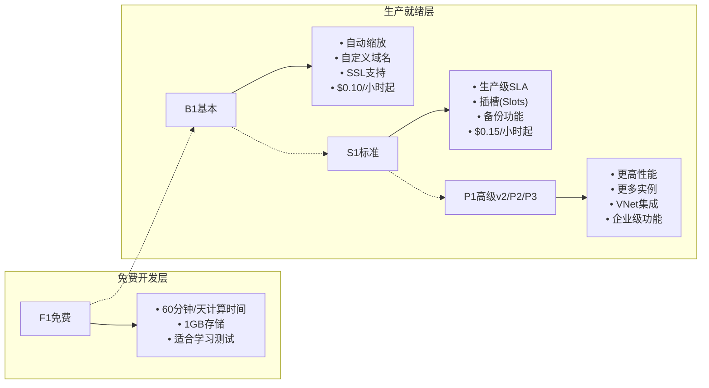

**选型建议**：
- **学习/原型验证**：F1免费层（注意每日60分钟限制）
- **小型项目/个人博客**：B1基本层（支持自定义域名和SSL）
- **生产环境推荐**：S1标准层（支持插槽、备份、99.95% SLA）
- **高流量企业应用**：P1v2或更高（支持VNet、更大内存）

---

## 二、通过Azure Portal创建Web应用

### 2.1 创建步骤详解

#### 步骤1：登录Azure Portal

访问 [https://portal.azure.com](https://portal.azure.com)，使用Azure账户登录。如果没有账户，可以注册免费账户获得$200额度+12个月免费服务。

#### 步骤2：创建资源

1. 点击左上角"**创建资源**"或搜索"Web App"
2. 选择"**Web 应用**"（不是"Web App for Containers"，除非要用Docker）


*图：在Azure Portal搜索并选择"Web 应用"*

#### 步骤3：配置基本信息

```yaml
# 基本配置选项卡
订阅: 你的Azure订阅名称
资源组: 新建 rg-blog-production  # 或选择已有资源组
名称: my-awesome-blog            # 全局唯一，将成为 URL的一部分
发布: 代码                        # 选择"代码"而非"Docker容器"
运行时堆栈: .NET 8 (LTS)         # 或 .NET 6/.NET Core 3.1
区域: East Asia (香港)           # 选择离用户最近的区域
操作系统: Windows                  # Linux对.NET性能更好且更便宜
```

> **重要提示**：选择Linux操作系统可以获得更好的性能和更低的价格。Windows App Service需要额外的Windows许可证费用。

#### 步骤4：选择计划

点击"**更改大小**"进入计划选择界面：

| 配置项 | 开发环境建议 | 生产环境建议 |
|--------|-------------|-------------|
| **计划类型** | Free (F1) | Standard (S1) |
| **SKU大小** | F1 Free | S1: 1核/1.75GB |
| **实例数量** | 1 | 2（高可用最低要求） |
| **自动缩放** | 不需要 | 启用（最小2-最大10） |

#### 步骤5：部署选项

在"部署"选项卡中，可以选择：

- **工作流**：GitHub Actions（推荐，自动CI/CD）
- **本地Git仓库**：推送代码直接触发部署
- **FTP/S**：传统方式，不推荐新项目使用

### 2.2 验证创建成功

创建完成后（约2-3分钟），你会看到：

```
✅ Web应用已成功创建
🌐 访问地址: https://my-awesome-blog.azurewebsites.net
📊 资源组: rg-blog-production
💰 定价层: S1 Standard
```

访问默认URL，你应该能看到Azure的欢迎页面或你部署的应用。

---

## 三、部署方式深度对比

### 3.1 四种主流部署方式

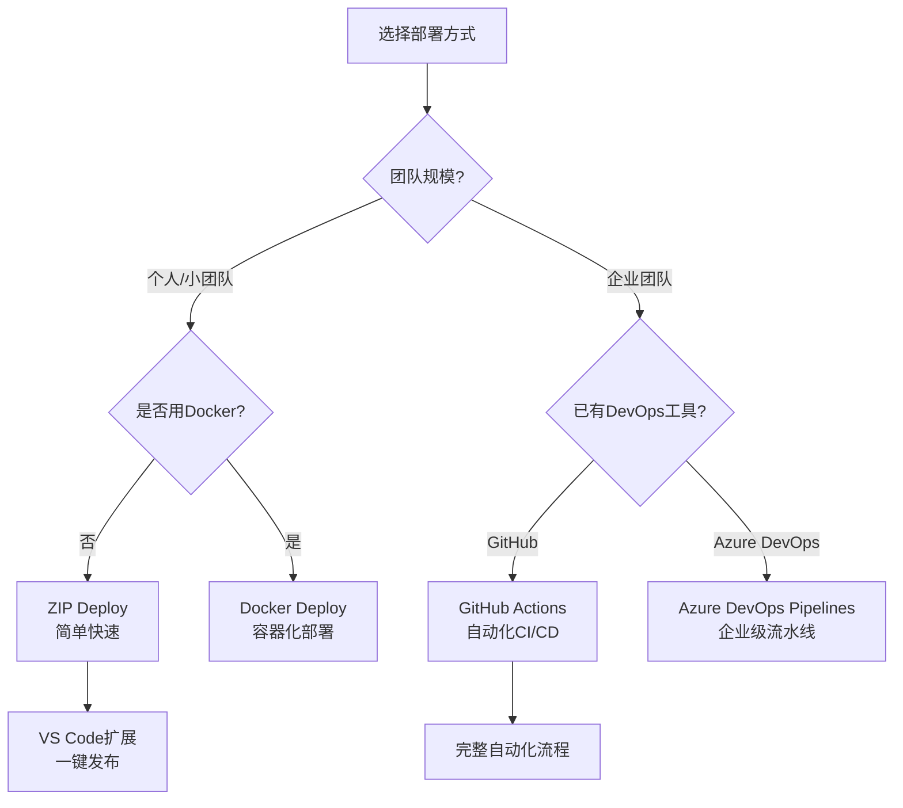

### 3.2 方式一：ZIP Deploy（最简单）

ZIP Deploy是将编译后的项目打包成ZIP文件上传的方式，适合快速测试和小型项目。

**操作步骤**：

```bash
# 1. 发布项目为文件夹
dotnet publish src/MyBlog/MyBlog.csproj \
    -c Release \
    -o ./publish

# 2. 打包为ZIP
cd publish
Compress-Archive -Path * -DestinationPath ../deploy.zip -Force

# 3. 使用Azure CLI部署
az webapp deployment source config-zip \
    --resource-group rg-blog-production \
    --name my-awesome-blog \
    --src ../deploy.zip
```

**优点**：
- ✅ 最简单的部署方式
- ✅ 无需额外配置
- ✅ 适合快速迭代

**缺点**：
- ❌ 没有版本回滚能力
- ❌ 无法实现自动化CI/CD
- ❌ 不适合团队协作

### 3.3 方式二：Local Git部署

将Azure App Service作为Git远程仓库，push代码即可触发构建和部署。

**配置步骤**：

```bash
# 1. 获取部署凭据
az webapp deployment list-publishing-profiles \
    --name my-awesome-blog \
    --resource-group rg-blog-production \
    --query "[].publishUrl, [0].publishingUserName, [0].publishingPassword"

# 2. 添加远程仓库
git remote add azure https://<用户名>:<密码>@my-awesome-blog.scm.azurewebsites.net:443/my-awesome-blog.git

# 3. 推送代码触发部署
git push azure main
```

**优点**：
- ✅ 简单的Git工作流
- ✅ 每次push自动部署
- ✅ 有部署历史记录

**缺点**：
- ❌ 构建在云端执行，时间长
- ❌ 无法本地验证构建结果
- ❌ 缺少CI/CD流程控制

### 3.4 方式三：GitHub Actions（强烈推荐）

这是目前最受欢迎的方式，提供完整的CI/CD自动化能力。详见本文第七节和[[03-GitHub Actions CI-CD流水线]]。

### 3.5 方式四：VS Code发布（可视化操作）

适合不熟悉命令行的开发者：

1. 安装 **Azure App Service** 扩展
2. 打开项目，按 `F1` → "Azure: Deploy to Web App"
3. 选择订阅、应用、完成部署

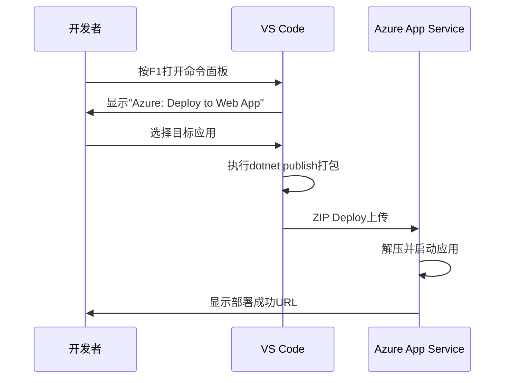

### 3.6 部署方式选型决策树

| 场景 | 推荐方式 | 原因 |
|------|---------|------|
| 快速验证想法 | ZIP Deploy | 最快上手 |
| 个人项目 | Local Git + GitHub Actions | 平衡简单与自动化 |
| 团队协作项目 | GitHub Actions / Azure DevOps | 完整CI/CD流程 |
| Docker容器化应用 | 容器部署 + ACR | 与容器生态一致 |
| 企业级应用 | Azure DevOps Pipelines | 审批流、合规性 |

---

## 四、配置插槽实现零停机部署

### 4.1 什么是Deployment Slots（部署插槽）

插槽是App Service最强大的功能之一，它允许你在同一个App Service Plan中运行多个版本的Web应用，每个插槽都有独立的URL，但共享相同的配置。

**核心价值**：
- 🔄 **零停机部署**：先部署到预发插槽，验证后一键交换
- 🔙 **即时回滚**：出问题可立即换回旧版本
- 🧪 **A/B测试**：不同插槽运行不同版本进行对比
- 🎯 **预热**：生产流量切换前完成初始化

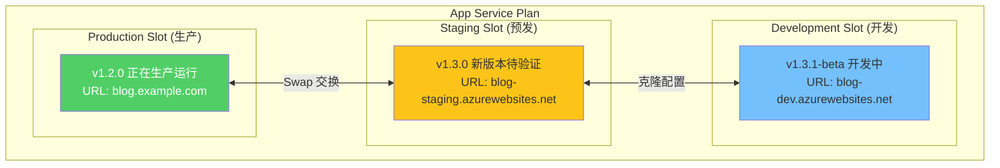

### 4.2 在Portal中配置插槽

#### 步骤1：启用插槽功能

1. 进入Web应用的"**设置**" → "**部署插槽**"
2. 点击"**添加插槽**"
3. 输入插槽名称（如`staging`）
4. 选择"**克隆配置自**"生产插槽

#### 步骤2：配置插槽特定设置

某些设置应该随插槽一起交换，有些则不应该：

```yaml
# 会跟随插槽交换的设置（Sticky Settings）
交换时保留:
  - 连接字符串
  - Application Settings中的部分设置（标记为"Slot Setting"）
  - 公共TLS/SSL证书

# 不会交换的设置（固定在插槽上）
始终保留:
  - 发布终结点
  - 自定义域名
  - 非公共证书
  - 缩放设置
  - VNet集成
```

**重要实践**：将连接字符串标记为"**Slot Setting**"，这样每个插槽可以使用不同的数据库！

#### 步骤3：执行交换操作

```bash
# 使用Azure CLI执行交换
az webapp deployment slot swap \
    --resource-group rg-blog-production \
    --name my-awesome-blog \
    --target-slot production \
    --source-slot staging \
    --preserve-vnet true  # 保留VNet配置
```

**交换过程说明**：

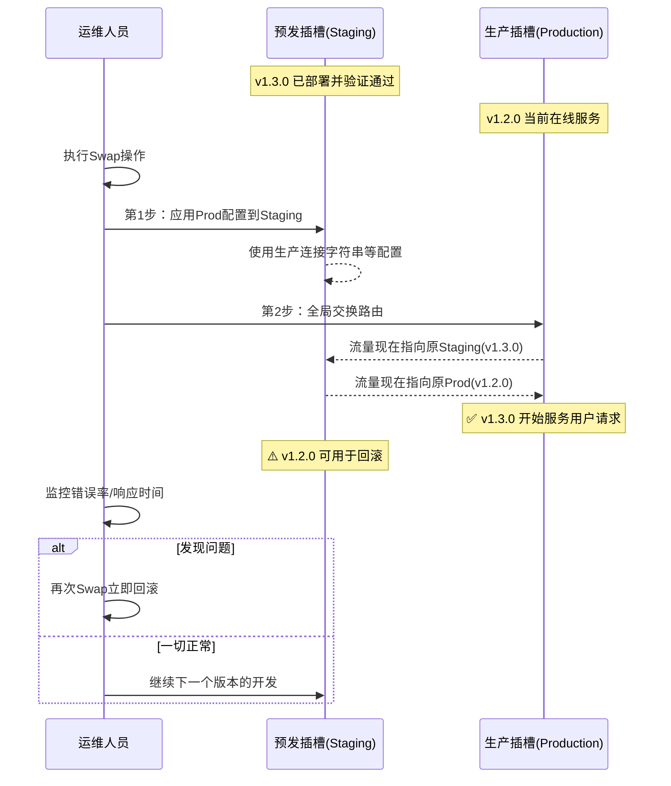

### 4.3 蓝绿部署与金丝雀发布

#### 蓝绿部署（Blue-Green Deployment）

蓝绿部署是插槽最常见的使用场景：

```yaml
# 蓝绿部署流程
蓝色环境(Blue):
  - 当前生产版本 v1.2.0
  - 服务所有用户流量
  - URL: https://blog.example.com

绿色环境(Green):
  - 新版本 v1.3.0
  - 部署到Staging插槽
  - URL: https://blog-staging.azurewebsites.net

交换时机:
  条件1: 所有自动化测试通过 ✅
  条件2: 人工验证UI/UX正常 ✅
  条件3: 性能测试达标 ✅
  条件4: 监控指标无异常 ✅

执行: Swap Blue ↔ Green
结果: 用户无感知地切换到v1.3.0
```

#### 金丝雀发布（Canary Release）

虽然App Service本身不支持流量分割，但可以通过以下方式模拟：

```csharp
// Program.cs - 简单的金丝雀逻辑示例
var builder = WebApplication.CreateBuilder(args);

// 从环境变量读取金丝雀比例（0-100）
var canaryPercentage = Environment.GetEnvironmentVariable("CANARY_PERCENTION") ?? "0";

builder.Services.AddSingleton<ICanaryService>(new CanaryService(int.Parse(canaryPercentage)));

var app = builder.Build();

app.MapGet("/api/features/new-feature", (HttpContext context, ICanaryService canary) =>
{
    if (canary.ShouldShowNewFeature(context))
    {
        return Results.Ok(new { version = "v2.0", features = "new-ui, improved-performance" });
    }
    return Results.Ok(new { version = "v1.0", features = "stable" });
});

app.Run();

// 金丝雀服务实现
public interface ICanaryService { bool ShouldShowNewFeature(HttpContext context); }

public class CanaryService : ICanaryService
{
    private readonly int _percentage;
    private readonly Random _random = new();

    public CanaryService(int percentage) => _percentage = percentage;

    public bool ShouldShowNewFeature(HttpContext context)
    {
        // 可以基于用户ID哈希确保一致性
        var userId = context.User?.FindFirst("sub")?.Value ?? Guid.NewGuid().ToString();
        var hash = Math.Abs(userId.GetHashCode() % 100);
        return hash < _percentage;
    }
}
```

### 4.4 插槽最佳实践清单

- [ ] **至少配置Production和Staging两个插槽**
- [ ] **将所有敏感配置标记为Slot Setting**
- [ ] **为Staging插槽配置独立的Application Insights**
- [ ] **编写自动化冒烟测试验证Staging部署**
- [ ] **建立明确的Swap审批流程**
- [ ] **监控Swap后的关键指标（错误率、延迟P95）**
- [ ] **定期演练回滚流程**

---

## 五、应用设置管理

### 5.1 Application Settings vs Connection Strings

Azure App Service提供了两种配置存储方式：

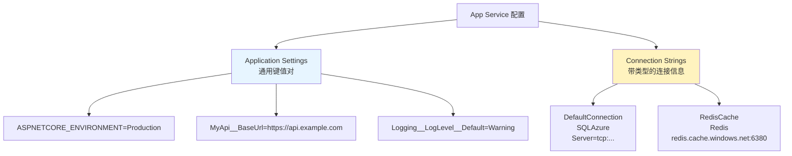

### 5.2 在Portal中配置应用设置

**路径**：Web应用 → 设置 → 配置 → 应用设置

#### 示例配置（博客系统）

```json
{
  "Application Settings": {
    "ASPNETCORE_ENVIRONMENT": "Production",
    "ASPNETCORE_URLS": "http://+:80;https://+:443",
    "Blog__Title": "我的技术博客",
    "Blog__PostsPerPage": "10",
    "Blog__EnableComments": "true",
    "Cache__RedisConnectionString": "@Microsoft.KeyVault(SecretUri=https://mykv.vault.azure.net/secrets/RedisConn/)",
    "Storage__AzureBlobConnectionString": "@Microsoft.KeyVault(SecretUri=https://mykv.vault.azure.net/secrets/BlobConn/)",
    "Serilog__WriteTo__0__Name": "Seq",
    "Serilog__WriteTo__0__Args__serverUrl": "https://seq.mycompany.com"
  },
  "Connection Strings": {
    "DefaultConnection": {
      "value": "Server=mydb.database.windows.net;Database=BlogDb;User Id=bloguser;Password=***;",
      "type": "SQLAzure"
    }
  }
}
```

### 5.3 使用Key Vault引用（安全最佳实践）

**永远不要在Application Settings中明文存储密码！**

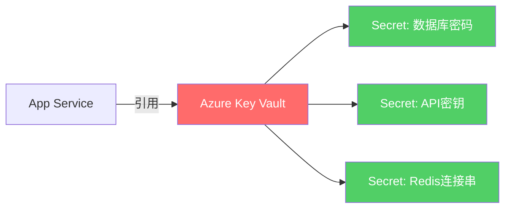

**配置Key Vault引用**：

```bash
# 1. 创建Key Vault（如果还没有）
az keyvault create \
    --name myblog-kv \
    --resource-group rg-blog-production \
    --location eastasia \
    --enable-rbac-authorization

# 2. 存储密钥
az keyvault secret set \
    --vault-name myblog-kv \
    --name "SqlPassword" \
    --value "YourStrong@Password123"

# 3. 授予App Service访问权限
principalId=$(az webapp show \
    --name my-awesome-blog \
    --resource-group rg-blog-production \
    --query identity.principalId -o tsv)

az role assignment create \
    --assignee-object-id $principalId \
    --role "Key Vault Secrets User" \
    --scope /subscriptions/<subscription-id>/resourceGroups/rg-blog-production/providers/Microsoft.KeyVault/vaults/myblog-kv

# 4. 在App Service中使用引用
# 格式: @Microsoft.KeyVault(SecretUri=https://<vault-name>.vault.azure.net/secrets/<secret-name>/<version>)
```

### 5.4 通过ARM模板管理配置（基础设施即代码）

```json
// deploy/appservice.json - ARM模板片段
{
  "type": "Microsoft.Web/sites/config",
  "apiVersion": "2022-09-01",
  "name": "[concat(variables('webAppName'), '/web')]",
  "properties": {
    "connectionStrings": [
      {
        "name": "DefaultConnection",
        "connectionString": "[reference(resourceId('Microsoft.KeyVault/vaults/secrets', variables('keyVaultName'), 'SqlPassword'), '2023-07-01').value]",
        "type": "SQLAzure"
      }
    ],
    "appSettings": [
      {
        "name": "ASPNETCORE_ENVIRONMENT",
        "value": "Production"
      },
      {
        "name": "Blog__Title",
        "value": "[parameters('blogTitle')]"
      }
    ]
  }
}
```

---

## 六、自动缩放配置

### 6.1 为什么需要自动缩放

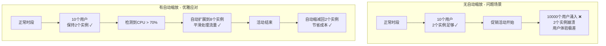

### 6.2 基于CPU的自动缩放规则

**前提条件**：需要S1及以上定价层才能使用自动缩放。

**配置步骤（Portal）**：

1. 进入Web应用 → "**向外缩放（应用计划）**"
2. 点击"**缩放条件**"
3. 创建规则：

```yaml
# 规则1：基于CPU使用率扩展
默认实例数: 2
最大实例数: 10
最小实例数: 2

规则:
  - 名称: CPU高负载扩展
    指标: CPU百分比
    运算符: 大于
    阈值: 70%
    持续时间: 5分钟
    操作: 增加1个实例
    冷却时间: 5分钟

  - 名称: CPU低负载缩减
    指标: CPU百分比
    运算符: 小于
    阈值: 30%
    持续时间: 15分钟
    操作: 减少1个实例
    冷却时间: 15分钟
```

### 6.3 基于自定义指标的智能缩放

对于更精细的控制，可以使用Application Insights的自定义指标：

```csharp
// Services/MetricsService.cs - 收集业务指标
public class MetricsService : IMetricsService
{
    private readonly TelemetryClient _telemetryClient;

    public MetricsService(TelemetryClient telemetryClient)
    {
        _telemetryClient = telemetryClient;
    }

    // 记录当前排队请求数
    public void RecordQueueDepth(int depth)
    {
        _telemetryClient.TrackMetric(
            new MetricTelemetry
            {
                Name = "Request Queue Depth",
                Sum = depth
            });
    }

    // 记录活跃用户数
    public void RecordActiveUsers(int count)
    {
        _telemetryClient.TrackMetric(
            new MetricTelemetry
            {
                Name = "Active Users",
                Sum = count
            });
    }

    // 记录数据库连接池使用率
    public void RecordDbPoolUsage(double percentage)
    {
        _telemetryClient.TrackMetric(
            new MetricTelemetry
            {
                Name = "DB Connection Pool Usage",
                Sum = percentage
            });
    }
}
```

### 6.4 基于计划的预测性缩放

如果知道业务有规律性的波峰波谷，可以配置基于时间的计划：

```yaml
# 工作日缩放计划
计划名称: 工作日高峰期
重复: 周一到周五

时间表:
  - 时间: 08:00
    实例数: 4  # 上班前准备
  - 时间: 12:00
    实例数: 6  # 午间高峰
  - 时间: 18:00
    实例数: 8  # 下班晚高峰
  - 时间: 22:00
    实例数: 2  # 夜间低峰

周末:
  - 全天保持2个实例
```

### 6.5 缩放最佳实践

| 实践 | 说明 | 原因 |
|------|------|------|
| 设置最小实例数≥2 | 保证高可用 | 单实例故障会导致停机 |
| 合理设置冷却时间 | 避免频繁伸缩 | 过度伸缩会造成抖动 |
| 结合业务指标 | 不仅看CPU | 可能CPU不高但请求队列很长 |
| 测试缩放行为 | 在非生产环境验证 | 确认应用能正确处理水平扩展 |
| 监控缩放事件 | 记录每次伸缩 | 分析容量规划 |

---

## 七、Azure DevOps Pipeline集成

### 7.1 完整的CI/CD流水线架构

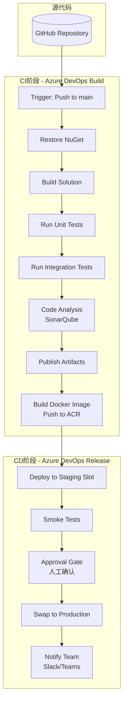

### 7.2 Azure Pipelines YAML配置

```yaml
# azure-pipelines.yml - ASP.NET Core CI/CD Pipeline
trigger:
  branches:
    include:
      - main
      - release/*
  paths:
    exclude:
      - '*.md'
      - 'docs/**'

pr:
  branches:
    include:
      - main

variables:
  buildConfiguration: 'Release'
  dotnetVersion: '8.0.x'
  azureSubscription: 'MyAzureSubscription'
  webAppName: 'my-awesome-blog'
  resourceGroupName: 'rg-blog-production'
  acrName: 'myblogregistry'
  dockerImagePath: '$(acrName).azurecr.io/blog:$(Build.BuildId)'

stages:
  # ==================== 构建阶段 ====================
  - stage: Build
    displayName: '🔨 构建与测试'
    jobs:
      - job: Build
        pool:
          vmImage: 'ubuntu-latest'
        steps:
          # 安装.NET SDK
          - task: UseDotNet@2
            inputs:
              packageType: 'sdk'
              version: $(dotnetVersion)
              installationPath: $(Agent.ToolsDirectory)/dotnet

          # 还原NuGet包（带缓存加速）
          - task: Cache@2
            inputs:
              key: 'nuget | "$(Agent.OS)" | **/packages.lock.json'
              restoreKeys: |
                nuget | "$(Agent.OS)"
              path: $(System.DefaultWorkingDirectory)/packages
            displayName: '缓存 NuGet 包'

          - script: dotnet restore \
              --configfile NuGet.Config \
              --packages $(System.DefaultWorkingDirectory)/packages
            displayName: '还原 NuGet 依赖'

          # 编译项目
          - script: dotnet build \
              --configuration $(buildConfiguration) \
              --no-restore \
              /p:TreatWarningsAsErrors=true
            displayName: '编译解决方案'

          # 运行单元测试
          - script: dotnet test \
              --configuration $(buildConfiguration) \
              --no-build \
              --verbosity normal \
              --collect:"XPlat code coverage" \
              --results-directory $(Build.StagingDirectory)/TestResults
            displayName: '运行单元测试'

          # 发布代码覆盖率报告
          - task: PublishCodeCoverageResults@1
            inputs:
              codeCoverageTool: 'Cobertura'
              summaryFileLocation: '$(Build.StagingDirectory)/TestResults/**/*.cobertura.xml'
            displayName: '发布覆盖率报告'

          # 发布Web项目
          - script: dotnet publish \
              src/MyBlog/MyBlog.csproj \
              --configuration $(buildConfiguration) \
              --output $(Build.ArtifactStagingDirectory)/publish \
              --self-contained false \
              /p:PublishTrimmed=false
            displayName: '发布Web应用'

          # 发布构建产物
          - task: PublishBuildArtifacts@1
            inputs:
              PathtoPublish: '$(Build.ArtifactStagingDirectory)/publish'
              ArtifactName: 'drop'
              publishLocation: 'Container'
            displayName: '发布构建产物'

          # 构建并推送Docker镜像
          - task: Docker@2
            inputs:
              command: 'buildAndPush'
              containerRegistry: $(acrName)
              repository: 'blog'
              tags: |
                $(Build.BuildId)
                latest
            displayName: '构建并推送Docker镜像'

  # ==================== 部署到预发环境 ====================
  - stage: DeployStaging
    displayName: '🚧 部署到预发环境'
    dependsOn: Build
    condition: succeeded()
    jobs:
      - deployment: DeployStaging
        environment: 'Staging'
        strategy:
          runOnce:
            deploy:
              steps:
                - task: AzureWebApp@1
                  inputs:
                    azureSubscription: $(azureSubscription)
                    appName: $(webAppName)
                    slot: 'staging'  # 部署到staging插槽
                    package: $(Pipeline.Workspace)/drop/*.zip
                    deploymentMethod: 'zipDeploy'
                  displayName: '部署到Staging插槽'

                # 冒烟测试
                - script: |
                    echo "执行冒烟测试..."
                    curl -f https://$(webAppName)-staging.azurewebsites.net/health || exit 1
                    curl -f https://$(webAppName)-staging.azurewebsites.net/api/health/ready || exit 1
                  displayName: '运行冒烟测试'

  # ==================== 部署到生产环境 ====================
  - stage: DeployProduction
    displayName: '🚀 部署到生产环境'
    dependsOn: DeployStaging
    condition: succeeded()
    jobs:
      - deployment: DeployProduction
        environment: 'Production'  # 可以配置审批门禁
        strategy:
          runOnce:
            deploy:
              steps:
                - task: AzureRmWebAppDeployment@4
                  inputs:
                    ConnectionType: 'AzureRM'
                    azureSubscription: $(azureSubscription)
                    WebAppName: $(webAppName)
                    ResourceGroupName: $(resourceGroupName)
                    DeployToSlotOrASE: true
                    ResourceGroupNameForSlots: $(resourceGroupName)
                    SlotName: 'production'
                    Source: 'Package'
                    Package: $(Pipeline.Workspace)/drop/*.zip
                    SwapWithProduction: true
                  displayName: 'Swap到生产环境'

                # 部署后通知
                - task: SlackNotification@0
                  condition: always()
                  inputs:
                    slackWebhookEndpoint: $(SlackWebhook)
                    message: '✅ 博客系统 v$(Build.BuildId) 已成功部署到生产环境'
                    notifyCommitters: true
                  displayName: '发送Slack通知'
```

---

## 八、成本优化策略

### 8.1 各层级详细定价（2024年价格参考）

| 层级 | 实例规格 | 价格/小时 | 月估算成本 | 适用场景 |
|------|---------|-----------|-----------|---------|
| **F1 免费** | 共享 | $0 | $0 | 学习、测试 |
| **F2 免费** | 共享 | $0 | $0 | 更大免费配额 |
| **B1 基本** | 1核/1.75GiB | $0.10 | ~$73 | 小型应用 |
| **B2 基本** | 2核/3.5GiB | $0.20 | ~$146 | 中型应用 |
| **S1 标准** | 1核/1.75GiB | $0.15 | ~$109 | 生产入门 |
| **S2 标准** | 2核/3.5GiB | $0.30 | ~$219 | 中等流量 |
| **P1v2 高级** | 1核/3.5GiB | $0.24 | ~$174 | 高性能需求 |
| **P2v2 高级** | 2核/7GiB | $0.48 | ~$347 | 大流量应用 |
| **P3v2 高级** | 4核/14GiB | $0.96 | ~$694 | 企业级 |

> **注意**：以上为东亚区域预估价格，实际以Azure计费页面为准。Linux通常比Windows便宜约50%。

### 8.2 成本优化技巧

#### 技巧1：选择正确的操作系统

```bash
# 同样配置下，Linux比Windows便宜近一半
# Windows需要额外的Windows Server许可证费用

# 推荐：除非必须使用Windows特性，否则选择Linux
az webapp create \
    --resource-group rg-blog-production \
    --plan my-linux-plan \
    --name my-blog-linux \
    --runtime "DOTNETCORE|8.0"
```

#### 技巧2：利用预留实例（Reserved Instance）

如果你确定长期运行某个层级的实例，可以购买预留实例节省最多60%费用：

```yaml
# 预留实例折扣示例
1年预留: 节省约35%
3年预留: 节省约60%

适用条件:
  - 区域固定不变
  - 层级不会降级
  - 至少运行满预留期限
```

#### 技巧3：开发/测试环境自动关停

```bash
# 为开发环境的App Service配置自动关停（夜间和周末）
az webapp update \
    --name my-dev-blog \
    --resource-group rg-blog-development \
    --set autoStartStopTime="17:00/09:00"  # 17:00停止，09:00启动

# 或者使用Azure Automation定时启停
```

#### 技巧4：合理利用免费额度

- **F1/F2免费层**：适合个人博客、作品集网站
- **Azure学生账户**：$100信用额度+免费热门服务
- **新账户优惠**：首月$200 credit + 12个月免费服务
- **Always Free服务**：即使credit用完也免费的某些服务

#### 技巧5：监控与预算告警

```bash
# 设置月度预算告警
az monitor account create \
    --name budget-alerts \
    --resource-group rg-monitoring

az consumption budget create \
    --account-name budget-alerts \
    --name monthly-budget \
    --category cost \
    --amount 100 \
    --time-grain Monthly \
    --notifications \
        threshold=80 email=admin@company.com \
        threshold=100 email=admin@company.com
```

### 8.3 成本优化决策矩阵

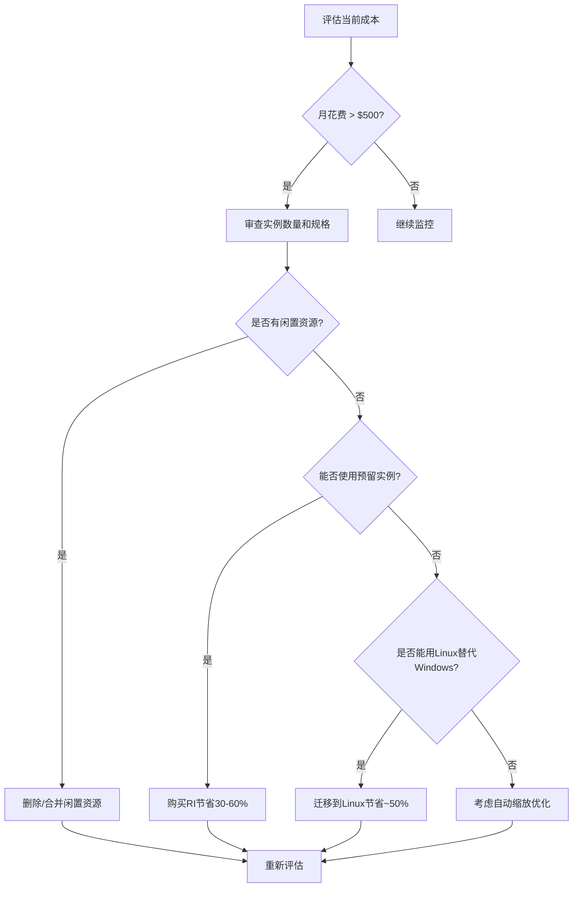

---

## 九、完整示例：从零部署博客系统到Azure App Service

### 9.1 项目结构

```
asp-net-blog-deployment/
├── src/
│   └── MyBlog/
│       ├── MyBlog.csproj
│       ├── Program.cs
│       ├── appsettings.Development.json
│       ├── appsettings.Production.json
│       ├── Controllers/
│       │   └── BlogController.cs
│       ├── Models/
│       │   └── Post.cs
│       ├── Services/
│       │   └── BlogService.cs
│       └── wwwroot/
├── tests/
│   └── MyBlog.Tests/
│       └── BlogServiceTests.cs
├── Dockerfile
├── docker-compose.yml
├── docker-compose.prod.yml
├── .github/workflows/
│   └── deploy.yml
└── azuredeploy.json          # ARM模板
```

### 9.2 完整的Program.cs

```csharp
using Microsoft.AspNetCore.Diagnostics.HealthChecks;
using Serilog;
using Serilog.Events;

var builder = WebApplication.CreateBuilder(args);

// ========== 配置Serilog日志 ==========
Log.Logger = new LoggerConfiguration()
    .MinimumLevel.Override("Microsoft", LogEventLevel.Warning)
    .MinimumLevel.Override("System", LogEventLevel.Warning)
    .Enrich.FromLogContext()
    .WriteTo.Console()
    // 生产环境写入Seq（如果配置了Seq服务器地址）
    .WriteTo.Conditional(
        e => !string.IsNullOrEmpty(builder.Configuration["Seq:ServerUrl"]),
        wt => wt.Seq(
            serverUrl: builder.Configuration["Seq:ServerUrl"]!)
    )
    CreateLogger();

builder.Host.UseSerilog();

// ========== 配置服务 ==========
var connectionString = builder.Configuration.GetConnectionString("DefaultConnection");

builder.Services.AddDbContextPool<BlogDbContext>(options =>
    options.UseSqlServer(connectionString));

builder.Services.AddScoped<IBlogService, BlogService>();

// ========== 配置健康检查 ==========
builder.Services.AddHealthChecks()
    // 数据库健康检查
    .AddSqlServer(
        connectionString!,
        name: "database",
        tags: new[] { "ready" })
    // 可选：Redis缓存检查
    .AddRedis(
        builder.Configuration["Cache:RedisConnectionString"] ?? "localhost:6379",
        name: "redis-cache",
        tags: new[] { "ready" });

// ========== 配置控制器 ==========
builder.Services.AddControllers()
    .ConfigureApiBehaviorOptions(options =>
    {
        options.InvalidModelStateResponseFactory = context =>
        {
            var errors = context.ModelState
                .Where(e => e.Value?.Errors.Count > 0)
                .SelectMany(e => e.Value!.Errors)
                .Select(e => e.ErrorMessage)
                .ToArray();

            return new BadRequestObjectResult(new
            {
                Success = false,
                Errors = errors,
                TraceId = context.HttpContext.TraceIdentifier
            });
        };
    });

// ========== 配置CORS（允许前端调用API） ==========
builder.Services.AddCors(options =>
{
    options.AddPolicy("AllowFrontend", policy =>
    {
        policy.WithOrigins(
                builder.Configuration["AllowedOrigets"]?.Split(",") ?? new[] { "*" })
            .AllowAnyHeader()
            .AllowAnyMethod()
            .AllowCredentials();
    });
});

var app = builder.Build();

// ========== 配置中间件管道 ==========
if (app.Environment.IsDevelopment())
{
    app.UseDeveloperExceptionPage();
}
else
{
    // 生产环境安全头部
    app.UseHsts(hsts => hsts.MaxAge(365));
    app.UseHttpsRedirection();
    // 安全头部中间件
    app.UseSecurityHeaders(headers => headers
        .AddStrictTransportSecurityMaxAgeInSeconds(31536000)
        .AddXFrameOptionsSameOrigin()
        .AddXContentTypeOptionsNoSniff()
        .AddReferrerPolicyStrictOriginWhenCrossOrigin()
    );
}

app.UseCors("AllowFrontend");

// 健康检查端点
app.MapHealthChecks("/health", new HealthCheckOptions
{
    Predicate = _ => false,  // 只返回整体状态
    ResponseWriter = HealthCheckResponseWriter.WriteResponse
});

app.MapHealthChecks("/health/ready", new HealthCheckOptions
{
    Predicate = check => check.Tags.Contains("ready"),  // 只检查就绪探针
    ResponseWriter = HealthCheckResponseWriter.WriteResponse
});

// API路由
app.MapControllers();

// 404处理
app.MapFallback(context =>
{
    context.Response.StatusCode = StatusCodes.Status404NotFound;
    return context.Response.WriteAsJsonAsync(new
    {
        Success = false,
        Error = "请求的资源不存在",
        Path = context.Request.Path.Value
    });
});

app.Run();

// 健康检查响应格式化器
public static class HealthCheckResponseWriter
{
    public static async Task WriteResponse(HttpContext context, HealthReport report)
    {
        context.Response.ContentType = "application/json";

        var response = new
        {
            Status = report.Status.ToString(),
            TotalDurationMs = report.TotalDuration.TotalMilliseconds,
            Checks = report.Entries.Select(entry => new
            {
                Name = entry.Key,
                Status = entry.Value.Status.ToString(),
                DurationMs = entry.Value.Duration.TotalMilliseconds,
                Description = entry.Value.Description ?? "OK",
                Exception = entry.Value.Exception?.Message
            })
        };

        await context.Response.WriteAsync(System.Text.Json.JsonSerializer.Serialize(response));
    }
}
```

### 9.3 完整的部署脚本

```powershell
# deploy-to-azure.ps1 - 一键部署脚本
param(
    [Parameter(Mandatory)]
    [string]$ResourceGroupName,

    [Parameter(Mandatory)]
    [string]$WebAppName,

    [string]$Location = "eastasia",

    [ValidateSet("F1", "B1", "S1", "P1v2")]
    [string]$Sku = "S1"
)

$ErrorActionPreference = "Stop"

Write-Host "======================================" -ForegroundColor Cyan
Write-Host "  Azure App Service 部署脚本" -ForegroundColor Cyan
Write-Host "======================================" -ForegroundColor Cyan

# Step 1: 创建资源组（如果不存在）
Write-Host "`n[1/7] 检查/创建资源组..." -ForegroundColor Yellow
$rgExists = az group exists --name $ResourceGroupName --query value -o tsv
if ($rgExists -eq "false") {
    az group create --name $ResourceGroupName --location $Location
    Write-Host "  ✅ 资源组已创建: $ResourceGroupName" -ForegroundColor Green
} else {
    Write-Host "  ℹ️  资源组已存在: $ResourceGroupName" -ForegroundColor Gray
}

# Step 2: 创建App Service Plan
Write-Host "`n[2/7] 创建App Service Plan..." -ForegroundColor Yellow
az appservice plan create `
    --name "$($WebAppName)-plan" `
    --resource-group $ResourceGroupName `
    --sku $Sku `
    --is-linux
Write-Host "  ✅ 服务计划已创建 ($Sku)" -ForegroundColor Green

# Step 3: 创建Web应用
Write-Host "`n[3/7] 创建Web应用..." -ForegroundColor Yellow
az webapp create `
    --resource-group $ResourceGroupName `
    --plan "$($WebAppName)-plan" `
    --name $WebAppName `
    --runtime "DOTNETCORE|8.0"
Write-Host "  ✅ Web应用已创建" -ForegroundColor Green

# Step 4: 配置部署插槽
Write-Host "`n[4/7] 配置Staging插槽..." -ForegroundColor Yellow
$slotExists = az webapp slot list `
    --name $WebAppName `
    --resource-group $ResourceGroupName `
    --query "[?name=='staging'].name" -o tsv

if (-not $slotExists) {
    az webapp deployment slot create `
        --slot staging `
        --name $WebAppName `
        --resource-group $ResourceGroupName `
        --configuration-source $WebAppName
    Write-Host "  ✅ Staging插槽已创建" -ForegroundColor Green
} else {
    Write-Host "  ℹ️  Staging插槽已存在" -ForegroundColor Gray
}

# Step 5: 配置应用设置
Write-Host "`n[5/7] 配置应用设置..." -ForegroundColor Yellow
az webapp config appsettings set `
    --name $WebAppName `
    --resource-group $ResourceGroupName `
    --settings `
        ASPNETCORE_ENVIRONMENT="Production" `
        ASPNETCORE_URLS="http://+:80;https://+:443"
Write-Host "  ✅ 应用设置已配置" -ForegroundColor Green

# Step 6: 配置自动缩放（仅S1及以上）
if ($Sku -in @("S1", "P1v2", "P2v2", "P3v2")) {
    Write-Host "`n[6/7] 配置自动缩放..." -ForegroundColor Yellow
    az autoscale create `
        --name "$($WebAppName)-autoscale" `
        --resource-group $ResourceGroupName `
        --min-count 2 `
        --max-count 10 `
        --count 2

    az autoscale rule create `
        --autoscale-name "$($WebAppName)-autoscale" `
        --resource-group $ResourceGroupName `
        --scale out-by 1 `
        --condition "PercentCPU > 70" `
        --timegrain 5
    Write-Host "  ✅ 自动缩放已配置 (2-10实例)" -ForegroundColor Green
}

# Step 7: 输出摘要
Write-Host "`n[7/7] 部署完成！" -ForegroundColor Green
Write-Host "`n======================================" -ForegroundColor Cyan
Write-Host "  部署摘要" -ForegroundColor Cyan
Write-Host "======================================" -ForegroundColor Cyan
Write-Host "  Web应用URL: https://$WebAppName.azurewebsites.net" -ForegroundColor White
Write-Host "  Staging URL:  https://$WebAppName-staging.azurewebsites.net" -ForegroundColor White
Write-Host "  资源组:     $ResourceGroupName" -ForegroundColor White
Write-Host "  定价层:     $Sku" -ForegroundColor White
Write-Host "`n后续步骤：" -ForegroundColor Yellow
Write-Host "  1. 配置自定义域名和SSL证书" -ForegroundColor Gray
Write-Host "  2. 设置连接字符串（使用Key Vault引用）" -ForegroundColor Gray
Write-Host "  3. 配置CI/CD流水线" -ForegroundColor Gray
Write-Host "  4. 集成Application Insights监控" -ForegroundColor Gray
Write-Host "======================================" -ForegroundColor Cyan
```

### 9.4 ARM模板完整版（可选）

```json
{
  "$schema": "https://schema.management.azure.com/schemas/2019-04-01/deploymentTemplate.json#",
  "contentVersion": "1.0.0.0",
  "parameters": {
    "webAppName": {
      "type": "string",
      "defaultValue": "my-awesome-blog",
      "metadata": {
        "description": "Web应用的名称（全局唯一）"
      }
    },
    "skuName": {
      "type": "string",
      "defaultValue": "S1",
      "allowedValues": ["F1", "B1", "B2", "S1", "S2", "S3", "P1v2", "P2v2", "P3v2"],
      "metadata": {
        "description": "定价层SKU名称"
      }
    },
    "location": {
      "type": "string",
      "defaultValue": "[resourceGroup().location]",
      "metadata": {
        "description": "资源所在区域"
      }
    },
    "sqlAdministratorLogin": {
      "type": "string",
      "metadata": {
        "description": "SQL Server管理员登录名"
      }
    },
    "sqlAdministratorLoginPassword": {
      "type": "securestring",
      "metadata": {
        "description": "SQL Server管理员密码"
      }
    }
  },
  "variables": {
    "appServicePlanName": "[concat(parameters('webAppName'), '-plan')]",
    "sqlServerName": "[concat(parameters('webAppName'), '-db')]",
    "databaseName": "BlogDb",
    "stagingSlotName": "staging"
  },
  "resources": [
    {
      "type": "Microsoft.Web/serverfarms",
      "apiVersion": "2022-09-01",
      "name": "[variables('appServicePlanName')]",
      "location": "[parameters('location')]",
      "sku": {
        "name": "[parameters('skuName')]",
        "tier": "[if(contains(split(parameters('skuName'), ''), 'F'), 'Free', if(contains(split(parameters('skuName'), ''), 'B'), 'Basic', if(contains(split(parameters('skuName'), ''), 'P'), 'PremiumV2', 'Standard')))]",
        "capacity": 1
      },
      "properties": {
        "reserved": true  # Linux
      }
    },
    {
      "type": "Microsoft.Web/sites",
      "apiVersion": "2022-09-01",
      "name": "[parameters('webAppName')]",
      "location": "[parameters('location')]",
      "dependsOn": [
        "[resourceId('Microsoft.Web/serverfarms', variables('appServicePlanName'))]"
      ],
      "identity": {
        "type": "SystemAssigned"
      },
      "properties": {
        "serverFarmId": "[resourceId('Microsoft.Web/serverfarms', variables('appServicePlanName'))]",
        "siteConfig": {
          "linuxFxVersion": "DOTNETCORE|8.0",
          "alwaysOn": true,
          "ftpsState": "Disabled",
          "minTlsVersion": "1.2",
          "http20Enabled": true,
          "autoHealEnabled": true,
          "autoHealRules": {
            "triggers": {
              "requests": {
                "count": 10,
                "timeInterval": "00:01:00"
              },
              "privateBytesInKB": 1000000,
              "statusCodes": ["502", "503"]
            },
            "actions": {
              "actionType": "Recycle"
            }
          }
        }
      }
    },
    {
      "type": "Microsoft.Web/sites/slots",
      "apiVersion": "2022-09-01",
      "name": "[concat(parameters('webAppName'), '/', variables('stagingSlotName'))]",
      "location": "[parameters('location')]",
      "dependsOn": [
        "[resourceId('Microsoft.Web/sites', parameters('webAppName'))]"
      ],
      "properties": {
        "serverFarmId": "[resourceId('Microsoft.Web/serverfarms', variables('appServicePlanName'))]",
        "siteConfig": {
          "linuxFxVersion": "DOTNETCORE|8.0"
        }
      }
    },
    {
      "type": "Microsoft.Sql/servers",
      "apiVersion": "2021-11-01-preview",
      "name": "[variables('sqlServerName')]",
      "location": "[parameters('location')]",
      "properties": {
        "administratorLogin": "[parameters('sqlAdministratorLogin')]",
        "administratorLoginPassword": "[parameters('sqlAdministratorLoginPassword')]",
        "version": "12.0",
        "minimalTlsVersion": "1.2"
      }
    },
    {
      "type": "Microsoft.Sql/servers/databases",
      "apiVersion": "2021-11-01-preview",
      "name": "[concat(variables('sqlServerName'), '/', variables('databaseName'))]",
      "location": "[parameters('location')]",
      "dependsOn": [
        "[resourceId('Microsoft.Sql/servers', variables('sqlServerName'))]"
      ],
      "sku": {
        "name": "Basic",
        "tier": "Basic"
      }
    },
    {
      "type": "Microsoft.Insights/components",
      "apiVersion": "2020-02-02",
      "name": "[concat(parameters('webAppName'), '-ai')]",
      "location": "[parameters('location')]",
      "kind": "web",
      "properties": {
        "Application_Type": "web",
        "WorkspaceResourceId": "[resourceId('Microsoft.OperationalInsights/workspaces', concat(parameters('webAppName'), '-law'))]"
      }
    }
  ],
  "outputs": {
    "webAppUrl": {
      "type": "string",
      "value": "[concat('https://', reference(resourceId('Microsoft.Web/sites', parameters('webAppName')).defaultHostDomain)]"
    },
    "stagingUrl": {
      "type": "string",
      "value": "[concat('https://', parameters('webAppName'), '-', variables('stagingSlotName'), '.azurewebsites.net')]"
    }
  }
}
```

---

## 十、故障排查与最佳实践

### 10.1 常见问题诊断

#### 问题1：502 Bad Gateway

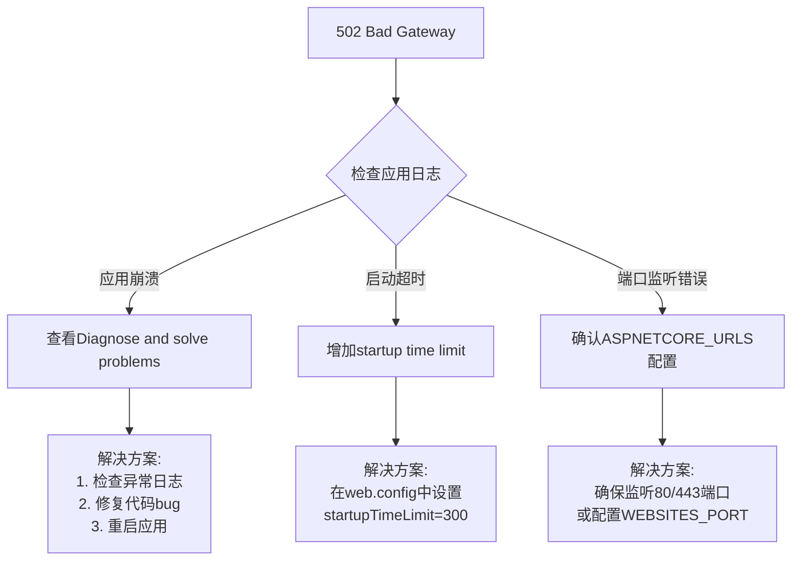

**排查命令**：

```bash
# 查看最近的事件日志
az webapp log tail \
    --name my-awesome-blog \
    --resource-group rg-blog-production

# 启用详细日志记录
az webapp config set \
    --name my-awesome-blog \
    --resource-group rg-blog-production \
    --detailed-error-messages true \
    --failed-request-tracing true

# 下载日志文件
az webapp log download \
    --name my-awesome-blog \
    --resource-group rg-blog-production
```

#### 问题2：部署失败

| 错误信息 | 原因 | 解决方案 |
|---------|------|---------|
| `No such file or directory` | publish输出路径错误 | 检查csproj中的PublishDir |
| `An error occurred while sending the request` | 网络问题或认证失败 | 检查Service Principal权限 |
| `Package too large` | 超过App Service限制 | 清理不必要的文件，使用.dockerignore |
| `503 Service Unavailable` | 应用未正确启动 | 检查Startup Command配置 |

#### 问题3：性能问题

```bash
# 诊断性能瓶颈
# 1. 查看当前实例状态
az webapp show \
    --name my-awesome-blog \
    --resource-group rg-blog-production \
    --query "{state: state, defaultHostName: defaultHostName, outboundIpAddresses: outboundIpAddresses}"

# 2. 检查资源使用情况
az monitor metrics list \
    --resource $(az webapp show -n my-awesome-blog -g rg-blog-production --query id -o tsv) \
    --metrics "CpuPercentage MemoryPercentage" \
    --interval PT1M \
    --top 10
```

### 10.2 性能优化检查清单

- [ ] **启用Always On**：防止应用因空闲被卸载
- [ ] **选择最近的区域**：减少网络延迟
- [ ] **启用HTTP/2**：提升加载性能
- [ ] **配置输出缓存**：静态资源缓存策略
- [ ] **压缩响应**：启用Brotli/Gzip压缩
- [ ] **连接池优化**：数据库和HTTP客户端复用
- [ ] **异步编程**：避免阻塞线程
- [ ] **CDN集成**：静态资源走Azure CDN

### 10.3 安全最佳实践

```markdown
## 必做安全项

### 1. HTTPS强制跳转
- 在App Service配置中启用"HTTPS Only"
- 配置HSTS头（max-age=31536000）

### 2. 访问限制
- IP限制：限制管理端点访问IP
- 虚拟网络集成：只允许内网访问内部API

### 3. 身份验证
- 启用Managed Identity（系统分配的托管标识）
- 使用Azure AD认证保护管理接口

### 4. 密钥管理
- 所有密钥存放在Azure Key Vault
- App Service通过MI访问Key Vault
- 绝不在代码或配置中硬编码密钥

### 5. 定期更新
- 及时更新.NET运行时版本
- 关注安全公告并及时修复CVE
- 定期轮换密钥和证书
```

### 10.4 监控与告警配置

```bash
# 创建关键指标告警规则
az monitor metrics alert create \
    --name "High-CPU-Alert" \
    --resource-group rg-blog-production \
    --scopes $(az webapp show -n my-awesome-blog -g rg-blog-production --query id -o tsv) \
    --condition "avg Percentage CPU > 80" \
    --window-size 5m \
    --evaluation-frequency 1m \
    --action-groups /subscriptions/{sub}/resourceGroups/{rg}/providers/microsoft.insights/actiongroups/{ag} \
    --severity 2 \
    --description "当CPU持续超过80%时告警"

az monitor metrics alert create \
    --name "High-Error-Rate-Alert" \
    --resource-group rg-blog-production \
    --scopes $(az webapp show -n my-awesome-blog -g rg-blog-production --query id -o tsv) \
    --condition "total Http5xx > 10" \
    --window-size 5m \
    --evaluation-frequency 1m \
    --action-groups /subscriptions/{sub}/resourceGroups/{rg}/providers/microsoft.insights/actiongroups/{ag} \
    --severity 0 \
    --description "当5xx错误激增时紧急告警"
```

---

## 总结

Azure App Service作为微软云平台的旗舰PaaS产品，为.NET开发者提供了**开箱即用的生产级部署体验**。通过本文学到的知识，你应该能够：

✅ **理解PaaS价值**：相比自建服务器，App Service大幅降低运维复杂度  
✅ **掌握多种部署方式**：根据团队情况选择ZIP Deploy、GitHub Actions或Azure DevOps  
✅ **实现零停机部署**：通过插槽机制实现蓝绿部署和即时回滚  
✅ **安全管理配置**：结合Key Vault实现密钥的安全存储和访问  
✅ **弹性伸缩**：基于CPU、内存或自定义指标自动调整实例数量  
✅ **成本优化**：通过合理的层级选择和预留实例降低云开销  

**下一步学习**：
- [[03-GitHub Actions CI-CD流水线]] - 构建完整的自动化部署流水线
- [[07-Application Insights监控]] - 深入了解应用监控和APM
- [[08-集中式日志解决方案]] - 搭建生产级日志分析体系
- [[06-健康检查与优雅关闭]] - 提升应用的可靠性和可观测性

---

> **相关文章**：
> - [[02-微服务架构/Kubernetes基础概念]] - 了解容器编排基础
> - [[03-性能优化/08-性能监控体系搭建]] - 本地化监控方案
> - [[04-安全加固/05-HTTPS与安全头部配置]] - 安全加固细节
> - [[05-多环境配置管理]] - 多环境配置最佳实践
