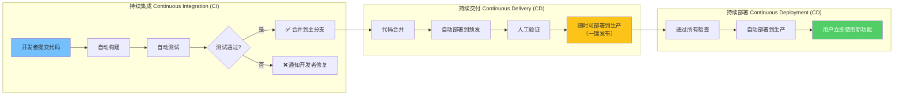
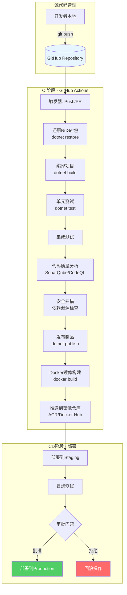
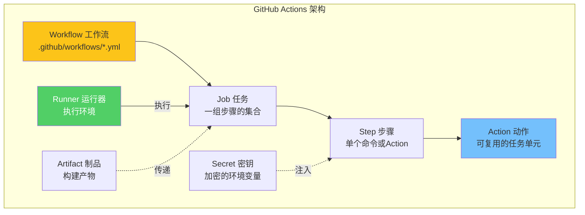
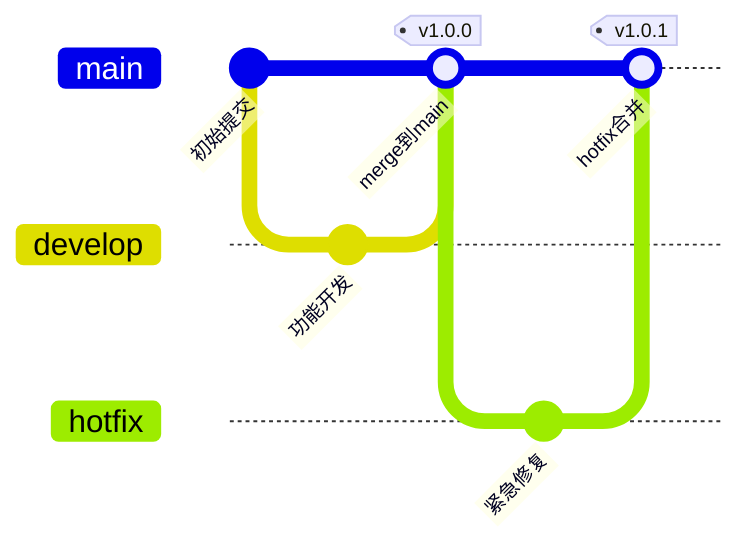

# GitHub Actions CI/CD流水线实战

> **标签**：#CI-CD #GitHubActions #自动化部署 #DevOps
> **阅读时间**：约35分钟 | **难度**：⭐⭐⭐⭐⭐
> **前置知识**：[[02-微服务架构/容器化Docker基础]]、[[02-Docker生产环境最佳实践]]

---

## 目录

- [一、CI/CD概念与价值](#一cicd概念与价值)
- [二、GitHub Actions核心概念](#二github-actions核心概念)
- [三、完整的ASP.NET Core CI-CD Workflow](#三完整的aspnet-core-cicd-workflow)
- [四、缓存加速策略](#四缓存加速策略)
- [五、测试集成方案](#五测试集成方案)
- [六、代码质量门禁](#六代码质量门禁)
- [七、通知集成](#七通知集成)
- [八、多环境部署矩阵策略](#八多环境部署矩阵策略)
- [九、完整Workflow YAML文件](#九完整workflow-yaml文件)
- [十、故障排查与最佳实践](#十故障排查与最佳实践)

---

## 一、CI/CD概念与价值

### 1.1 什么是CI/CD



### 1.2 CI/CD的核心价值

| 维度 | 手动流程 | 自动化CI/CD | 提升幅度 |
|------|---------|------------|---------|
| **部署频率** | 每周/每月 | 每天/每天多次 | **10-50x** |
| **交付周期** | 数天到数周 | 数分钟到数小时 | **95%+** |
| **平均恢复时间(MTTR)** | 数小时到数天 | 数分钟 | **90%+** |
| **变更失败率** | 高（人为错误） | 低（自动化验证） | **降低60%** |
| **团队满意度** | 低（重复劳动） | 高（专注开发） | **显著提升** |

### 1.3 ASP.NET Core项目的CI/CD典型流程



---

## 二、GitHub Actions核心概念

### 2.1 核心组件一览



### 2.2 核心概念详解

#### Workflow（工作流）

Workflow是一个自动化过程，由YAML文件定义，存储在仓库的`.github/workflows/`目录下：

```yaml
# .github/workflows/ci-cd.yml - Workflow定义示例
name: ASP.NET Core CI/CD Pipeline   # Workflow名称

on:                                  # 触发条件
  push:
    branches: [main, release/*]
  pull_request:
    branches: [main]
  workflow_dispatch:                 # 允许手动触发

env:                                 # 全局环境变量
  DOTNET_VERSION: '8.0.x'
  BUILD_CONFIGURATION: Release

jobs:                                # 任务定义
  build-and-test:
    # ...
```

#### Job（任务）

Job是一组在相同Runner上运行的Step的集合。默认情况下，Job并行运行，但可以通过`needs`指定依赖关系：

```yaml
jobs:
  # Job 1: 构建和测试
  build:
    runs-on: ubuntu-latest
    steps:
      - name: 编译项目
        run: dotnet build

  # Job 2: 依赖于build完成后才运行
  deploy:
    needs: build                    # 关键：声明依赖关系
    runs-on: ubuntu-latest
    if: success()                   # 只在前置Job成功时运行
    steps:
      - name: 部署应用
        run: echo "部署中..."
```

#### Step（步骤）

Step是Job中的单个任务，可以是`run`命令或`action`：

```yaml
steps:
  # 类型1: shell命令
  - name: 还原依赖
    run: dotnet restore

  # 类型2: 使用预构建的Action
  - name: 检出代码
    uses: actions/checkout@v4

  # 类型3: 使用带参数的Action
  - name: 设置.NET SDK
    uses: actions/setup-dotnet@v4
    with:
      dotnet-version: '8.0.x'

  # 类型4: 条件执行的Step
  - name: 发布失败通知
    if: failure()
    uses: slackapi/slack-github-action@v1
    with:
      payload: |
        {"text": "❌ 构建失败"}
```

#### Runner（运行器）

Runner是执行Job的服务器：

| Runner类型 | 特点 | 适用场景 |
|-----------|------|---------|
| `ubuntu-latest` | Linux，免费，最快 | 大多数.NET项目推荐 |
| `windows-latest` | Windows，免费 | 需要Windows特定功能 |
| `macos-latest` | macOS，免费 | iOS/macOS相关构建 |
| `self-hosted` | 自有服务器 | 特殊需求/私有网络 |

> **重要提示**：对于ASP.NET Core项目，强烈建议使用`ubuntu-latest`作为Runner，因为：
> 1. 启动速度比Windows快30%以上
> 2. 完全支持跨平台.NET
> 3. 与Linux生产环境一致

#### Action（动作）

Action是可复用的最小单元，来自GitHub官方社区或第三方：

```yaml
# 常用Actions清单
steps:
  # 代码检出（几乎每个workflow都需要）
  - uses: actions/checkout@v4

  # .NET SDK安装
  - uses: actions/setup-dotnet@v4

  # Docker构建和推送
  - uses: docker/build-push-action@v5

  # 缓存加速
  - uses: actions/cache@v4

  # 上传/下载构建产物
  - uses: actions/upload-artifact@v4
  - uses: actions/download-artifact@v4

  # Azure部署
  - uses: azure/webapps-deploy@v2

  # Slack通知
  - uses: slackapi/slack-github-action@v1
```

### 2.3 Secret和Environment变量管理

```yaml
# 在Repository Settings -> Secrets and variables -> Actions 中配置

# Workflow中使用Secrets
jobs:
  build:
    steps:
      - name: 使用Secret
        env:
          # 方式1: 直接引用
          CONNECTION_STRING: ${{ secrets.CONNECTION_STRING }}
          # 方式2: 在run命令中使用
        run: |
          echo "连接字符串已配置"
          dotnet run --connection "$CONNECTION_STRING"

      - name: 使用Environment Secrets
        env:
          # Environment级别的Secret（更安全）
          AZURE_CREDENTIALS: ${{ secrets.AZURE_CREDENTIALS }}
        run: az login --service-principal -u "$AZURE_APP_ID" -p "$AZURE_PASSWORD" --tenant "$AZURE_TENANT_ID"
```

---

## 三、完整的ASP.NET Core CI-CD Workflow

### 3.1 触发器配置

```yaml
# ========================================
# 触发器配置 - 控制何时运行Workflow
# ========================================

name: ASP.NET Core CI/CD Pipeline

# ===== 场景1: 推送到主分支时触发 =====
on:
  push:
    branches:
      - main              # 主分支
      - 'release/**'       # 所有release开头的分支
    paths-ignore:         # 排除以下文件的变更不触发
      - '**.md'
      - 'docs/**'
      - '.github/ISSUE_TEMPLATE/**'
      - 'LICENSE'
    tags:                 # 打标签时也触发
      - 'v*'

# ===== 场景2: Pull Request时触发 =====
# on:
#   pull_request:
#     branches: [main]
#     types: [opened, synchronize, reopened]

# ===== 场景3: 手动触发（带输入参数）=====
# on:
#   workflow_dispatch:
#     inputs:
#       environment:
#         description: '部署目标环境'
#         required: true
#         default: 'staging'
#         type: choice
#         options:
#           - staging
#           - production
#       version:
#         description: '部署版本号'
#         required: true
#         type: string

# ===== 场景4: 定时触发（每晚构建）=====
# on:
#   schedule:
#     - cron: '0 2 * * *'  # UTC时间凌晨2点（北京时间上午10点）
```

### 3.2 环境变量与全局配置

```yaml
# ========================================
# 全局环境变量和配置
# ========================================

env:
  # .NET配置
  DOTNET_VERSION: '8.0.x'
  BUILD_CONFIGURATION: 'Release'
  PROJECT_PATH: 'src/MyApi/MyApi.csproj'
  TEST_PROJECT_PATH: 'tests/MyApi.Tests/MyApi.Tests.csproj'
  SOLUTION_FILE: 'MyApi.sln'

  # Docker配置
  DOCKER_REGISTRY: '${{ secrets.ACR_NAME }}.azurecr.io'
  IMAGE_NAME: 'myapi'
  # 镜像标签：使用短SHA + 分支名
  IMAGE_TAG: '${{ github.sha }}'

  # Azure配置
  AZURE_RESOURCE_GROUP: '${{ secrets.AZURE_RESOURCE_GROUP }}'
  AZURE_WEBAPP_NAME: '${{ secrets.AZURE_WEBAPP_NAME }}'

  # 通用配置
  TZ: 'Asia/Shanghai'

# 并发控制：同一分支只保留最新的运行
concurrency:
  group: '${{ github.workflow }}-${{ github.ref }}'
  cancel-in-progress: true  # 取消正在进行的旧运行

# 权限配置
permissions:
  contents: read
  pull-requests: write
  checks: write
  packages: write
  id-token: write           # 用于OIDC认证
```

### 3.3 构建阶段完整实现

```yaml
# ========================================
# Job 1: 构建与测试
# ========================================

jobs:
  build-and-test:
    name: '🔨 构建与单元测试'
    runs-on: ubuntu-latest
    timeout-minutes: 20

    # 输出变量供后续Job使用
    outputs:
      image_tag: ${{ steps.meta.outputs.version }}
      build_number: ${{ github.run_number }}

    steps:
      # ==================== Step 1: 检出代码 ====================
      - name: 📥 检出代码
        uses: actions/checkout@v4
        with:
          fetch-depth: 0  # 获取完整历史（用于版本号计算）

      # ==================== Step 2: 设置.NET SDK ====================
      - name: 🔧 安装 .NET SDK ${{ env.DOTNET_VERSION }}
        uses: actions/setup-dotnet@v4
        with:
          dotnet-version: ${{ env.DOTNET_VERSION }}

      # ==================== Step 3: 缓存NuGet包 ====================
      - name: 💾 缓存 NuGet 包
        uses: actions/cache@v4
        id: cache-nuget
        with:
          path: ~/.nuget/packages
          key: ${{ runner.os }}-nuget-${{ hashFiles('**/packages.lock.json') }}
          restore-keys: |
            ${{ runner.os }}-nuget-

      # ==================== Step 4: 还原依赖 ====================
      - name: 📦 还原 NuGet 依赖
        if: steps.cache-nuget.outputs.cache-hit != 'true'
        run: |
          dotnet restore \
            "${{ env.SOLUTION_FILE }}" \
            --configfile NuGet.Config \
            --locked-mode

      # ==================== Step 5: 编译项目 ====================
      - name: 🔨 编译解决方案
        run: |
          dotnet build \
            "${{ env.SOLUTION_FILE }}" \
            --configuration ${{ env.BUILD_CONFIGURATION }} \
            --no-restore \
            /p:TreatWarningsAsErrors=true \
            /p:WarningsAsErrors=true \
            --verbosity normal

      # ==================== Step 6: 运行单元测试 ====================
      - name: 🧪 运行单元测试
        run: |
          dotnet test \
            "${{ env.TEST_PROJECT_PATH }}" \
            --configuration ${{ env.BUILD_CONFIGURATION }} \
            --no-build \
            --verbosity normal \
            --collect:"XPlat code coverage" \
            --results-directory TestResults \
            --logger:"trx;LogFileName=test-results.trx" \
            --logger:"console;verbosity=detailed" \
            /p:CoverletOutputFormat=opencover \
            /p:CoverletOutput=TestResults/coverage/

      # ==================== Step 7: 发布代码覆盖率报告 ====================
      - name: 📊 发布代码覆盖率
        uses: dorny/test-reporter@v1
        if: success() || failure()
        with:
          name: 单元测试报告
          path: TestResults/**/*.trx
          reporter: dotnet-trx
          fail-on-error: false

      # ==================== Step 8: 生成Docker元数据 ====================
      - name: 🏷️ 提取 Docker 元数据
        id: meta
        uses: docker/metadata-action@v5
        with:
          images: ${{ env.DOCKER_REGISTRY }}/${{ env.IMAGE_NAME }}
          tags: |
            type=sha,prefix=
            type=ref,event=branch
            type=semver,pattern={{version}}
            type=raw,value=latest,enable={{is_default_branch}}

      # ==================== Step 9: 登录容器注册表 ====================
      - name: 🔐 登录 Azure Container Registry
        uses: docker/login-action@v3
        with:
          registry: ${{ env.DOCKER_REGISTRY }}
          username: ${{ secrets.ACR_USERNAME }}
          password: ${{ secrets.ACR_PASSWORD }}

      # ==================== Step 10: 设置Docker Buildx ====================
      - name: 🔨 设置 Docker Buildx
        uses: docker/setup-buildx-action@v3

      # ==================== Step 11: 缓存Docker层 ====================
      - name: 💾 缓存 Docker 层
        uses: actions/cache@v4
        with:
          path: /tmp/.buildx-cache
          key: ${{ runner.os }}-buildx-${{ github.sha }}
          restore-keys: |
            ${{ runner.os }}-buildx-

      # ==================== Step 12: 构建并推送Docker镜像 ====================
      - name: 🐳 构建并推送 Docker 镜像
        uses: docker/build-push-action@v5
        with:
          context: .
          file: ./Dockerfile
          push: true
          tags: ${{ steps.meta.outputs.tags }}
          labels: ${{ steps.meta.outputs.labels }}
          cache-from: type=local,src=/tmp/.buildx-cache
          cache-to: type=local,dest=/tmp/.buildx-cache-new,mode=max
          build-args: |
            BUILD_CONFIGURATION=${{ env.BUILD_CONFIGURATION }}
            VERSION=${{ steps.meta.outputs.version }}

      # ==================== Step 13: 更新缓存（避免缓存膨胀）====================
      - name: 🔄 更新 Docker 缓存
        run: |
          rm -rf /tmp/.buildx-cache
          mv /tmp/.buildx-cache-new /tmp/.buildx-cache || true

      # ==================== Step 14: 扫描镜像安全漏洞 ====================
      - name: 🔍 Trivy 镜像漏洞扫描
        uses: aquasecurity/trivy-action@master
        with:
          image-ref: ${{ env.DOCKER_REGISTRY }}/${{ env.IMAGE_NAME }}:${{ github.sha }}
          format: 'table'
          exit-code: '0'
          ignore-unfixed: true
          vuln-type: 'os,library'
          severity: 'CRITICAL,HIGH'

      # ==================== Step 15: 上传构建产物 ====================
      - name: 📤 上传构建产物
        uses: actions/upload-artifact@v4
        if: always()
        with:
          name: publish-output
          path: |
            src/MyApi/bin/${{ env.BUILD_CONFIGURATION }}/net8.0/publish/
            TestResults/
          retention-days: 5
          if-no-files-found: warn
```

### 3.4 部署阶段完整实现

```yaml
  # ========================================
  # Job 2: 部署到Staging环境
  # ========================================
  deploy-staging:
    name: '🚀 部署到 Staging 环境'
    needs: build-and-test
    if: github.event_name == 'push' && github.ref == 'refs/heads/main'
    runs-on: ubuntu-latest
    environment:
      name: staging                    # GitHub Environment（可配置审批规则）
      url: https://${{ secrets.STAGING_DOMAIN }}

    steps:
      - name: 📥 检出代码
        uses: actions/checkout@v4

      - name: 🔐 Azure 登录
        uses: azure/login@v2
        with:
          creds: ${{ secrets.AZURE_CREDENTIALS }}

      - name: 🚀 部署到 Azure App Service (Staging Slot)
        uses: azure/webapps-deploy@v2
        with:
          app-name: ${{ env.AZURE_WEBAPP_NAME }}
          slot: 'staging'               # 部署到staging插槽
          images: ${{ env.DOCKER_REGISTRY }}/${{ env.IMAGE_NAME }}:${{ github.sha }}

      # ==================== 冒烟测试 ====================
      - name: 🧪 运行冒烟测试
        run: |
          echo "等待应用启动..."
          sleep 30

          STAGING_URL="https://${{ secrets.STAGING_DOMAIN }}"
          MAX_RETRIES=10
          RETRY_COUNT=0

          while [ $RETRY_COUNT -lt $MAX_RETRIES ]; do
            echo "尝试 #$((RETRY_COUNT + 1))..."

            HTTP_CODE=$(curl -s -o /dev/null -w "%{http_code}" "$STAGING_URL/health/live")

            if [ "$HTTP_CODE" = "200" ]; then
              echo "✅ 健康检查通过！"
              break
            fi

            RETRY_COUNT=$((RETRY_COUNT + 1))
            echo "⏳ 等待应用就绪... ($RETRY_COUNT/$MAX_RETRIES)"
            sleep 10
          done

          if [ $RETRY_COUNT -eq $MAX_RETRIES ]; then
            echo "❌ 冒烟测试失败！"
            exit 1
          fi

          # 测试关键API端点
          curl -f "$STAGING_URL/api/posts" > /dev/null && echo "✅ API端点正常" || { echo "❌ API异常"; exit 1; }

      - name: 📝 创建 GitHub Deployment 状态
        if: always()
        uses: actions/github-script@v7
        with:
          script: |
            const deploymentId = context.runId;
            const state = job.status === 'success' ? 'success' : 'failure';
            await github.rest.repos.createDeploymentStatus({
              owner: context.repo.owner,
              repo: context.repo.repo,
              deployment_id: deploymentId,
              state: state,
              description: `部署到Staging ${state === 'success' ? '成功' : '失败'}`,
              log_url: `${context.serverUrl}/${context.repo.owner}/${context.repo.repo}/actions/runs/${context.runId}`
            });

  # ========================================
  # Job 3: 部署到Production环境（需要审批）
  # ========================================
  deploy-production:
    name: '🎯 部署到 Production 环境'
    needs: deploy-staging
    if: success()
    runs-on: ubuntu-latest
    environment:
      name: production                # 可配置审批门禁！
      url: https://${{ secrets.PRODUCTION_DOMAIN }}

    steps:
      - name: 📥 检出代码
        uses: actions/checkout@v4

      - name: 🔐 Azure 登录
        uses: azure/login@v2
        with:
          creds: ${{ secrets.AZURE_CREDENTIALS }}

      # 方式1: 直接部署新镜像
      - name: 🚀 部署到 Production Slot
        uses: azure/webapps-deploy@v2
        with:
          app-name: ${{ env.AZURE_WEBAPP_NAME }}
          images: ${{ env.DOCKER_REGISTRY }}/${{ env.IMAGE_NAME }}:${{ github.sha }}

      # 方式2: 使用Swap方式（推荐用于零停机）
      # - name: 🔄 Swap 到 Production
      #   run: |
      #     az webapp deployment slot swap \
      #       --resource-group ${{ env.AZURE_RESOURCE_GROUP }} \
      #       --name ${{ env.AZURE_WEBAPP_NAME }} \
      #       --slot staging \
      #       --target-slot production

      # ==================== 部署后验证 ====================
      - name: ✅ 生产环境健康检查
        run: |
          PROD_URL="https://${{ secrets.PRODUCTION_DOMAIN }}"
          echo "验证生产环境..."

          # 健康检查
          curl -sf "$PROD_URL/health/live" && echo "✅ 存活探针正常" || exit 1
          curl -sf "$PROD_URL/health/ready" && echo "✅ 就绪探针正常" || exit 1

          # 记录部署信息
          echo "## 部署摘要" >> $GITHUB_STEP_SUMMARY
          echo "- **环境**: Production" >> $GITHUB_STEP_SUMMARY
          echo "- **镜像**: \`${{ env.DOCKER_REGISTRY }}/${{ env.IMAGE_NAME }}:${{ github.sha }}\`" >> $GITHUB_STEP_SUMMARY
          echo "- **时间**: $(date -u '+%Y-%m-%d %H:%M:%S UTC')" >> $GITHUB_STEP_SUMMARY
          echo "- **操作人**: ${{ github.actor }}" >> $GITHUB_STEP_SUMMARY

      # ==================== 发送通知 ====================
      - name: 📢 Slack 通知（成功）
        if: success()
        uses: slackapi/slack-github-action@v1
        with:
          payload: |
            {
              "text": "✅ *生产环境部署成功*",
              "blocks": [
                {
                  "type": "section",
                  "text": {
                    "type": "mrkdwn",
                    "text": "*部署成功*\n\n*仓库*: ${{ github.repository }}\n*分支*: ${{ github.ref_name }}\n*提交*: ${{ github.sha }}\n*作者*: ${{ github.actor }}\n*镜像*: ${{ env.IMAGE_NAME }}:${{ github.sha }}"
                  }
                }
              ]
            }
        env:
          SLACK_WEBHOOK_URL: ${{ secrets.SLACK_WEBHOOK_URL }}

      - name: 📢 Slack 通知（失败）
        if: failure()
        uses: slackapi/slack-github-action@v1
        with:
          payload: |
            {
              "text": "❌ *生产环境部署失败*",
              "blocks": [
                {
                  "type": "section",
                  "text": {
                    "type": "mrkdwn",
                    "text": "*部署失败*\n\n*仓库*: ${{ github.repository }}\n*分支*: ${{ github.ref_name }}\n*提交*: ${{ github.sha }}\n*查看日志*: ${{ serverUrl }}/${{ github.repository }}/actions/runs/${{ github.runId }}"
                  }
                }
              ]
            }
        env:
          SLACK_WEBHOOK_URL: ${{ secrets.SLACK_WEBHOOK_URL }}
```

---

## 四、缓存加速策略

### 4.1 为什么需要缓存

没有缓存的CI/CD流程每次都要：
1. 下载.NET SDK (~500MB)
2. 还原NuGet包 (~200MB-2GB)
3. 重新编译所有代码
4. 重新构建Docker镜像的所有层

**结果**：一次构建可能需要10-20分钟！

有了合理的缓存，可以将构建时间缩短到3-5分钟。

### 4.2 NuGet包缓存

```yaml
# 方法1: 使用actions/cache（推荐）
- name: 缓存 NuGet 包
  uses: actions/cache@v4
  id: nuget-cache
  with:
    path: ~/.nuget/packages
    # 基于packages.lock.json生成唯一key
    key: ${{ runner.os }}-nuget-${{ hashFiles('**/packages.lock.json') }}
    # 如果精确匹配失败，使用前缀匹配最近的缓存
    restore-keys: |
      ${{ runner.os }}-nuget-

# 只有缓存未命中时才restore
- name: 还原依赖
  if: steps.nuget-cache.outputs.cache-hit != 'true'
  run: dotnet restore --locked-mode

# 方法2: 使用setup-dotnet内置缓存（更简单）
- uses: actions/setup-dotnet@v4
  with:
    dotnet-version: '8.0.x'
    cache: true                    # 自动缓存NuGet包
    cache-dependency-path: '**/packages.lock.json'
```

### 4.3 Docker层缓存

```yaml
# Docker BuildKit缓存策略

# 方案A: GitHub Actions Cache后端（推荐）
- uses: actions/cache@v4
  with:
    path: /tmp/.buildx-cache
    key: ${{ runner.os }}-buildx-${{ github.sha }}
    restore-keys: |
      ${{ runner.os }}-buildx-

- uses: docker/build-push-action@v5
  with:
    context: .
    push: true
    tags: ${{ env.REGISTRY }}/${{ env.IMAGE }}:${{ github.sha }}
    # 从本地缓存加载
    cache-from: type=local,src=/tmp/.buildx-cache
    # 保存到本地缓存（供下次使用）
    cache-to: type=local,dest=/tmp/.buildx-cache-new,mode=max

# 方案B: Registry缓存（适合大型团队共享缓存）
- uses: docker/build-push-action@v5
  with:
    context: .
    push: true
    tags: ${{ env.REGISTRY }}/${{ env.IMAGE }}:${{ github.sha }}
    # 从Registry缓存加载（基于镜像tag）
    cache-from: type=registry,ref=${{ env.REGISTRY }}/${{ env.IMAGE }}:cache
    # 推送缓存到Registry
    cache-to: type=registry,ref=${{ env.REGISTRY }}/${{ env.IMAGE }}:cache,mode=max

# 方案C: GHA缓存 + Registry缓存组合（最佳性能）
- uses: docker/build-push-action@v5
  with:
    context: .
    push: true
    tags: ${{ env.REGISTRY }}/${{ env.IMAGE }}:${{ github.sha }}
    cache-from: |
      type=local,src=/tmp/.buildx-cache
      type=registry,ref=${{ env.REGISTRY }}/${{ env.IMAGE }}:cache
    cache-to: type=local,dest=/tmp/.buildx-cache-new,mode=max
```

### 4.4 其他缓存技巧

```yaml
# 缓存测试结果（加速重跑失败的测试）
- name: 缓存测试结果
  uses: actions/cache@v4
  with:
    path: TestResults
    key: test-results-${{ github.sha }}
    restore-keys: |
      test-results-

# 缓存PowerShell模块（如果使用PS脚本）
- name: 缓存 PowerShell 模块
  uses: actions/cache@v4
  with:
    path: ~/.local/share/powershell/Modules
    key: ps-modules-${{ hashFiles('**/requirements.psd1') }}
```

---

## 五、测试集成方案

### 5.1 测试金字塔与CI集成

```mermaid
pyramid
    title 测试金字塔
    section E2E测试
        少量(5-10个)
        关键业务流程
        部署后运行
    section 集成测试
        适量(20-50个)
        API接口测试
        数据库交互
    section 单元测试
        大量(100+)
        业务逻辑验证
        快速反馈
```

### 5.2 单元测试CI集成

```csharp
// 示例：一个典型的单元测试
using Xunit;
using MyApi.Services;

namespace MyApi.Tests;

public class BlogServiceTests
{
    private readonly BlogService _service;
    private readonly Mock<IBlogRepository> _mockRepo;

    public BlogServiceTests()
    {
        _mockRepo = new Mock<IBlogRepository>();
        _service = new BlogService(_mockRepo.Object);
    }

    [Fact]
    public async Task GetPostsAsync_当有文章时_返回文章列表()
    {
        // Arrange - 准备测试数据
        var expectedPosts = new List<Post>
        {
            new() { Id = 1, Title = "测试文章1", Content = "内容..." },
            new() { Id = 2, Title = "测试文章2", Content = "内容..." }
        };
        _mockRepo.Setup(r => r.GetAllAsync())
            .ReturnsAsync(expectedPosts);

        // Act - 执行被测方法
        var result = await _service.GetPostsAsync();

        // Assert - 验证结果
        Assert.NotNull(result);
        Assert.Equal(2, result.Count());
        Assert.Equal("测试文章1", result.First().Title);
    }

    [Theory]
    [InlineData(null)]
    [InlineData("")]
    [InlineData("   ")]
    public async Task CreatePostAsync_标题无效时_抛出异常(string? invalidTitle)
    {
        // Arrange & Act & Assert
        await Assert.ThrowsAnyAsync<ArgumentException>(
            () => _service.CreatePostAsync(new Post { Title = invalidTitle! })
        );
    }

    [Fact]
    public async Task GetPostByIdAsync_文章不存在时_返回null()
    {
        // Arrange
        _mockRepo.Setup(r => r.GetByIdAsync(999))
            .ReturnsAsync((Post?)null);

        // Act
        var result = await _service.GetPostByIdAsync(999);

        // Assert
        Assert.Null(result);
    }
}
```

### 5.3 集成测试CI集成

```csharp
// Tests/Integration/PostIntegrationTests.cs
using Xunit;
using Microsoft.AspNetCore.Mvc.Testing;
using Microsoft.EntityFrameworkCore;
using Microsoft.Extensions.DependencyInjection;
using System.Net.Http.Json;
using MyApi;
using MyApi.Data;

namespace MyApi.IntegrationTests;

[Collection("Database Collection")]  // 共享数据库fixture
public class PostIntegrationTests : IClassFixture<WebApplicationFactory<Program>>
{
    private readonly WebApplicationFactory<Program> _factory;
    private readonly HttpClient _client;

    public PostIntegrationTests(WebApplicationFactory<Program> factory)
    {
        _factory = factory.WithWebHostBuilder(builder =>
        {
            builder.ConfigureServices(services =>
            {
                // 移除真实的DbContext，使用内存数据库
                var descriptor = services.SingleOrDefault(
                    d => d.ServiceType == typeof(DbContextOptions<BlogDbContext>));

                if (descriptor != null)
                {
                    services.Remove(descriptor);
                }

                services.AddDbContext<BlogDbContext>(options =>
                {
                    options.UseInMemoryDatabase("TestDb");
                });

                // 确保数据库schema已创建
                var sp = services.BuildServiceProvider();
                using var scope = sp.CreateScope();
                var db = scope.ServiceProvider.GetRequiredService<BlogDbContext>();
                db.Database.EnsureCreated();
            });
        });

        _client = _factory.CreateClient();
    }

    [Fact]
    public async Task GetPosts_返回成功响应()
    {
        // Arrange - 通过API先插入测试数据
        var createResponse = await _client.PostAsJsonAsync("/api/posts", new
        {
            title = "集成测试文章",
            content = "这是集成测试的内容"
        });
        Assert.Equal(HttpStatusCode.Created, createResponse.StatusCode);

        // Act
        var response = await _client.GetAsync("/api/posts");

        // Assert
        Assert.Equal(HttpStatusCode.OK, response.StatusCode);

        var posts = await response.Content.ReadFromJsonAsync<List<PostDto>>();
        Assert.NotNull(posts);
        Assert.NotEmpty(posts);
        Assert.Contains(posts, p => p.Title == "集成测试文章");
    }

    [Fact]
    public async Task GetPostById_存在时返回文章()
    {
        // Arrange
        var createResp = await _client.PostAsJsonAsync("/api/posts", new
        {
            title = "按ID查询测试",
            content = "测试内容"
        });
        var created = await createResp.Content.ReadFromJsonAsync<PostDto>();

        // Act
        var response = await _client.GetAsync($"/api/posts/{created!.Id}");

        // Assert
        Assert.Equal(HttpStatusCode.OK, response.StatusCode);
        var post = await response.Content.ReadFromJsonAsync<PostDto>();
        Assert.Equal("按ID查询测试", post!.Title);
    }

    [Fact]
    public async Task DeletePost_删除成功返回NoContent()
    {
        // Arrange
        var createResp = await _client.PostAsJsonAsync("/api/posts", new
        {
            title = "待删除的文章",
            content = "将被删除"
        });
        var created = await createResp.Content.ReadFromJsonAsync<PostDto>();

        // Act
        var deleteResponse = await _client.DeleteAsync($"/api/posts/{created!.Id}");

        // Assert
        Assert.Equal(HttpStatusCode.NoContent, deleteResponse.StatusCode);

        // 验证确实删除了
        var getResponse = await _client.GetAsync($"/api/posts/{created.Id}");
        Assert.Equal(HttpStatusCode.NotFound, getResponse.StatusCode);
    }
}
```

### 5.4 在Workflow中运行测试

```yaml
# 在build-and-test Job中添加完整测试步骤

- name: 🧪 运行单元测试
  run: |
    dotnet test \
      "tests/UnitTests/UnitTests.csproj" \
      --configuration ${{ env.BUILD_CONFIGURATION }} \
      --no-build \
      --verbosity normal \
      --collect:"XPlat code coverage" \
      --results-directory TestResults/Unit \
      --logger:"trx;LogFileName=unit-tests.trx" \
      /p:CoverletOutputFormat=opencover,cobertura \
      /p:Exclude="[xunit*]*,[MyApi.Tests]*"

- name: 🧪 运行集成测试
  run: |
    dotnet test \
      "tests/IntegrationTests/IntegrationTests.csproj" \
      --configuration ${{ env.BUILD_CONFIGURATION }} \
      --no-build \
      --verbosity normal \
      --results-directory TestResults/Integration \
      --logger:"trx;LogFileName=integration-tests.trx"

- name: 📊 合并代码覆盖率
  uses: dorny/coverage-badge-pipeline@1.3.0
  with:
    coverage-summary-path: TestResults/Unit/coverage.opencover.xml
    git-branch: main
    badge-path: coverage-badge.svg

- name: 📈 发布测试报告
  uses: mikepenz/action-junit-report@v4
  if: success() || failure()
  with:
      report_paths: 'TestResults/**/*.trx'
      include_passed: true
      include_skipped: true
      fail_on_failure: false  # 不因测试报告生成失败而终止
```

---

## 六、代码质量门禁

### 6.1 SonarQube集成

```yaml
# SonarQube代码质量分析
- name: 🔍 SonarQube 分析开始
  uses: SonarSource/sonarqube-scan-action@master
  env:
    SONAR_TOKEN: ${{ secrets.SONAR_TOKEN }}
    SONAR_HOST_URL: ${{ secrets.SONAR_HOST_URL }}
  # 如果是PR，会自动进行增量分析并评论
  # 如果是main分支推送，会进行全面分析

# SonarCloud（云端版SonarQube）配置
# - name: SonarCloud Scan
#   uses: SonarSource/sonarcloud-github-action@master
#   env:
#     GITHUB_TOKEN: ${{ secrets.GITHUB_TOKEN }}
#     SONAR_TOKEN: ${{ secrets.SONAR_TOKEN }}
```

配合`Directory.Build.props`中的Sonar配置：

```xml
<!-- Directory.Build.props -->
<Project>
  <PropertyGroup>
    <!-- SonarQube分析需要 -->
    <SonarQubeProjectKey>myorg_myapi</SonarQubeProjectKey>
    <SonarQubeOrganization>myorg</SonarQubeOrganization>
    <SonarQubeHostName>https://sonarcloud.io</SonarQubeHostName>
    <SonarQubeCondition>eq(variables['Build.Reason'], 'PullRequest')</SonarQubeCondition>
  </PropertyGroup>
</Project>
```

### 6.2 CodeQL安全扫描（GitHub原生）

```yaml
# CodeQL安全扫描 - 自动检测常见漏洞模式
- name: 🛡️ 初始化 CodeQL
  uses: github/codeql-action/init@v3
  with:
    languages: csharp
    # 查询套件：security-extended包含更多规则
    queries: security-extended,security-and-quality

- name: 🛡️ 执行 CodeQL 分析
  uses: github/codeql-action/analyze@v3
  with:
    category: "/language:csharp"
```

### 6.3 依赖漏洞扫描

```yaml
# 检查NuGet包已知漏洞
- name: 🔍 依赖漏洞扫描
  uses: dependency-check/Dependency-Check_Action@main
  with:
      project: 'MyApi'
      path: '.'
      format: 'HTML'
      out: 'reports'
  continue-on-error: true  # 不阻塞构建，但记录警告

- name: 📤 上传漏洞扫描报告
  uses: actions/upload-artifact@v4
  if: always()
  with:
    name: vulnerability-report
    path: reports/*
    retention-days: 7
```

### 6.4 自定义质量门禁

```yaml
# 定义质量门禁Job
quality-gate:
  name: '🛡️ 质量门禁检查'
  needs: [build-and-test]
  if: always()
  runs-on: ubuntu-latest
  steps:
    - name: 检查前置Job状态
      run: |
        echo "检查构建状态..."
        if [ "${{ needs.build-and-test.result }}" != "success" ]; then
          echo "::error::构建或测试未通过，无法进入部署阶段"
          exit 1
        fi

    - name: 检查代码覆盖率
      run: |
        # 从artifact下载覆盖率报告
        COVERAGE=$(cat coverage-summary.json | jq -r '.lineCoverage')
        THRESHOLD=80

        if (( $(echo "$COVERAGE < $THRESHOLD" | bc -l) )); then
          echo "::warning::代码覆盖率 ${COVERAGE}% 低于阈值 ${THRESHOLD}%"
          # 可以选择是否阻塞
          # exit 1
        else
          echo "✅ 代码覆盖率 ${COVERAGE}% 达标"
        fi

    - name: 检查安全问题
      run: |
        # 检查是否有CRITICAL级别的问题
        CRITICAL_COUNT=$(cat sonar-report.json | jq -r '.component.measures[] | select(.metric=="vulnerabilities") | .value')
        if [ "$CRITICAL_COUNT" -gt 0 ]; then
          echo "::error::发现 $CRITICAL_COUNT 个严重安全漏洞！"
          exit 1
        fi
```

---

## 七、通知集成

### 7.1 Slack通知

```yaml
# 完整的Slack通知配置
- name: 📢 发送 Slack 通知
  if: always()  # 无论成功失败都发送
  uses: slackapi/slack-github-action@v1
  with:
    # 方法1: 使用Webhook（简单场景）
    payload: |
      {
        "text": "${{ job.status == 'success' && '✅' || '❌' }} 工作流 *${{ github.workflow }}* ${{ job.status == 'success' && '成功' || '失败' }}",
        "blocks": [
          {
            "type": "header",
            "text": {
              "type": "plain_text",
              "text": "${{ job.status == 'success' && '🎉 部署成功' || '⚠️ 部署失败' }}"
            }
          },
          {
            "type": "section",
            "fields": [
              {
                "type": "mrkdwn",
                "text": "*仓库:*\n${{ github.repository }}"
              },
              {
                "type": "mrkdwn",
                "text": "*分支:*\n${{ github.ref_name }}"
              },
              {
                "type": "mrkdwn",
                "text": "*提交:*\n`${{ github.sha }}`"
              },
              {
                "type": "mrkdwn",
                "text": "*触发者:*\n${{ github.actor }}"
              },
              {
                "type": "mrkdwn",
                "text": "*耗时:*\n${{ github.event_name == 'schedule' && '定时触发' || format('{0}m {1}s', (math.ceil(job.elapsed-time / 60)), (job.elapsed-time % 60)) }}"
              },
              {
                "type": "mrkdwn",
                "text": "*详情:*\n<${{ github.server_url }}/${{ github.repository }}/actions/runs/${{ github.run_id }}|查看日志>"
              }
            ]
          }
        ]
      }
  env:
    SLACK_WEBHOOK_URL: ${{ secrets.SLACK_WEBHOOK_URL }}
    SLACK_WEBHOOK_TYPE: INCOMING_WEBHOOK
```

### 7.2 Microsoft Teams通知

```yaml
- name: 📢 Teams 通知
  if: always()
  run: |
    # 使用Teams Incoming Webhook
    STATUS="${{ job.status }}"
    COLOR="${{ job.status == 'success' && '00FF00' || 'FF0000' }}"
    ICON="${{ job.status == 'success' && '✅' || '❌' }}"

    curl -X POST '${{ secrets.TEAMS_WEBHOOK_URL }}' \
      -H 'Content-Type: application/json' \
      -d @- <<EOF
    {
      "@type": "MessageCard",
      "@context": "http://schema.org/extensions",
      "themeColor": "${COLOR}",
      "summary": "CI/CD 通知",
      "sections": [{
        "activityTitle": "${ICON} GitHub Actions - ${STATUS}",
        "facts": [
          {"name": "仓库", "value": "${{ github.repository }}"},
          {"name": "分支", "value": "${{ github.ref_name }}"},
          {"name": "提交", "value": "`${{ github.sha }}`"},
          {"name": "操作者", "value": "${{ github.actor }}"},
          {"name": "详情", "value": "[查看日志](${{ github.server_url }}/${{ github.repository }}/actions/runs/${{ github.run_id }})"}
        ]
      }]
    }
    EOF
```

### 7.3 邮件通知

```yaml
- name: 📧 邮件通知（构建失败时）
  if: failure()
  uses: dawidd6/action-send-mail@v3
  with:
    server_address: smtp.gmail.com
    server_port: 465
    username: ${{ secrets.EMAIL_USER }}
    password: ${{ secrets.EMAIL_PASSWORD }}
    subject: "❌ GitHub Actions 构建失败 - ${{ github.repository }}"
    to: team@example.com
    from: GitHub Actions
    body: |
      构建失败详情:

      仓库: ${{ github.repository }}
      分支: ${{ github.ref_name }}
      提交: ${{ github.sha }}
      作者: ${{ github.actor }}
      失败Job: ${{ github.job }}
      日志: ${{ github.server_url }}/${{ github.repository }}/actions/runs/${{ github.run_id }}
```

### 7.4 GitHub Commit Status

```yaml
# 更新Git Commit状态（显示在PR页面）
- name: 更新提交状态
  if: always()
  uses: actions/github-script@v7
  with:
    script: |
      const state = context.job.status === 'success' ? 'success' : 'failure';
      const description = context.job.status === 'success'
        ? '所有检查通过 ✅'
        : `检查失败: ${context.job}`;

      await github.rest.repos.createCommitStatus({
        owner: context.repo.owner,
        repo: context.repo.repo,
        sha: context.sha,
        state: state,
        target_url: `${context.serverUrl}/${context.repo.owner}/${context.repo.repo}/actions/runs/${context.runId}`,
        description: description,
        context: `ci/${context.job}`
      });
```

---

## 八、多环境部署矩阵策略

### 8.1 环境矩阵部署

```yaml
# 使用矩阵策略同时部署多个环境
deploy-matrix:
  name: '🌍 多环境部署'
  needs: build-and-test
  if: github.ref == 'refs/heads/main'
  strategy:
    matrix:
      include:
        - environment: development
          app_name: ${{ secrets.DEV_APP_NAME }}
          resource_group: ${{ secrets.DEV_RG }}
          slot: ''
          auto_swap: false

        - environment: staging
          app_name: ${{ secrets.STAGING_APP_NAME }}
          resource_group: ${{ secrets.STAGING_RG }}
          slot: staging
          auto_swap: false

        # Production不在这里，单独处理（需要审批）
    max-parallel: 2  # Dev和Staging并行部署
  runs-on: ubuntu-latest

  environment:
    name: ${{ matrix.environment }}
    url: https://${{ matrix.app_name }}.azurewebsites.net

  steps:
    - name: 部署到 ${{ matrix.environment }}
      uses: azure/webapps-deploy@v2
      with:
        app-name: ${{ matrix.app_name }}
        images: ${{ env.DOCKER_REGISTRY }}/${{ env.IMAGE_NAME }}:${{ github.sha }}
```

### 8.2 基于分支的自动部署策略



```yaml
# 基于分支名的智能路由
on:
  push:
    branches:
      - main           # → Production + Staging
      - develop         # → Development
      - 'release/**'    # → Staging
      - 'feature/**'    # → 仅构建测试，不部署
      - 'hotfix/**'     # → Production（紧急）

jobs:
  determine-target:
    name: 判断部署目标
    runs-on: ubuntu-latest
    outputs:
      target_env: ${{ steps.env.outputs.target }}
      should_deploy: ${{ steps.env.outputs.deploy }}
    steps:
      - id: env
        name: 确定目标环境
        run: |
          BRANCH="${GITHUB_REF#refs/heads/}"
          case "$BRANCH" in
            main)          echo "target=production" && echo "deploy=true" ;;
            develop)       echo "target=development" && echo "deploy=true" ;;
            release/*)     echo "target=staging" && echo "deploy=true" ;;
            hotfix/*)      echo "target=production" && echo "deploy=true" ;;
            *)             echo "target=none" && echo "deploy=false" ;;
          esac >> "$GITHUB_OUTPUT"

  deploy:
    needs: determine-target
    if: needs.determine-target.outputs.should_deploy == 'true'
    # ... 后续部署逻辑
```

---

## 九、完整Workflow YAML文件

下面提供一个可直接使用的完整ASP.NET Core CI/CD Workflow文件：

```yaml
# =============================================================================
# ASP.NET Core 8 完整 CI/CD Workflow
# 功能: 构建→测试→Docker镜像→安全扫描→多环境部署→通知
# 用法: 复制到 .github/workflows/ci-cd.yml
# =============================================================================

name: '🚀 CI/CD Pipeline'

# ============================================================================
# 触发条件
# ============================================================================
on:
  push:
    branches: ['main', 'release/*']
    tags: ['v*']
  pull_request:
    branches: ['main']
  workflow_dispatch:
    inputs:
      environment:
        description: '部署目标环境'
        required: true
        default: 'staging'
        type: choice
        options:
          - staging
          - production
      debug_enabled:
        description: '启用调试日志'
        required: false
        type: boolean
        default: false

# ============================================================================
# 全局配置
# ============================================================================
env:
  DOTNET_VERSION: '8.0.x'
  CONFIGURATION: 'Release'
  ACR_NAME: ${{ secrets.ACR_NAME }}
  IMAGE_NAME: myapi
  SOLUTION: MyApi.sln
  WEBAPP_PRODUCTION: ${{ secrets.WEBAPP_PRODUCTION }}
  WEBAPP_STAGING: ${{ secrets.WEBAPP_STAGING }}
  RESOURCE_GROUP: ${{ secrets.RESOURCE_GROUP }}

permissions:
  contents: read
  packages: write
  id-token: write
  security-events: write

concurrency:
  group: ${{ github.workflow }}-${{ github.ref }}
  cancel-in-progress: true

# ============================================================================
# Jobs 定义
# ============================================================================
jobs:

  # ===========================================================================
  # Job 1: 构建与测试
  # ===========================================================================
  build:
    name: '🔨 Build & Test'
    runs-on: ubuntu-latest
    timeout-minutes: 25
    outputs:
      image_tag: ${{ steps.buildinfo.outputs.tag }}
      version: ${{ steps.buildinfo.outputs.version }}

    steps:
      - name: 📥 Checkout
        uses: actions/checkout@v4
        with:
          fetch-depth: 0

      - name: 🏷️ 构建信息
        id: buildinfo
        run: |
          VERSION="${GITHUB_REF_NAME}"
          if [[ "$GITHUB_REF" == refs/tags/* ]]; then
            VERSION="${GITHUB_REF#refs/tags/}"
          fi
          TAG="${GITHUB_SHA:0:8}"
          echo "version=${VERSION}" >> $GITHUB_OUTPUT
          echo "tag=${TAG}" >> $GITHUB_OUTPUT

      - name: 🔧 Setup .NET
        uses: actions/setup-dotnet@v4
        with:
          dotnet-version: ${{ env.DOTNET_VERSION }}
          cache: true
          cache-dependency-path: '**/packages.lock.json'

      - name: 📦 Restore
        run: dotnet restore ${{ env.SOLUTION }} --locked-mode

      - name: 🔨 Build
        run: |
          dotnet build ${{ env.SOLUTION }} \
            -c ${{ env.CONFIGURATION }} \
            --no-restore \
            -warnaserror \
            /p:Version=${{ steps.buildinfo.outputs.version }}

      - name: 🧪 Unit Tests
        run: |
          dotnet test tests/UnitTests/UnitTests.csproj \
            -c ${{ env.CONFIGURATION }} \
            --no-build \
            --verbosity normal \
            --collect:"XPlat code coverage" \
            --results-directory TestResults/unit \
            logger:"trx;LogFileResults=unit.trx" \
            p:CoverletOutputFormat=opencover \
            p:CoverletOutput=TestResults/unit/coverage/

      - name: 🧪 Integration Tests
        run: |
          dotnet test tests/IntegrationTests/IntegrationTests.csproj \
            -c ${{ env.CONFIGURATION }} \
            --no-build \
            --results-directory TestResults/integration \
            logger:"trx;LogFileResults=integration.trx"

      - name: 📊 Publish Test Results
        uses: EnricoMi/publish-unit-test-result-action@v2
        if: always()
        with:
          files: TestResults/**/*.trx
          check_name: '测试结果'
          comment_mode: 'always'
          fail_on: 'test failures'

      - name: 🔐 Login to ACR
        uses: docker/login-action@v3
        with:
          registry: ${{ env.ACR_NAME }}.azurecr.io
          username: ${{ secrets.ACR_USERNAME }}
          password: ${{ secrets.ACR_PASSWORD }}

      - name: 🔨 Set up Docker Buildx
        uses: docker/setup-buildx-action@v3

      - name: 🏷️ Docker Meta
        id: meta
        uses: docker/metadata-action@v5
        with:
          images: ${{ env.ACR_NAME }}.azurecr.io/${{ env.IMAGE_NAME }}
          tags: |
            type=sha,prefix=,format=short
            type=raw,value=latest,enable={{is_default_branch}}
            type=semver,pattern={{version}}
            type=ref,event=branch

      - name: 💾 Cache Docker layers
        uses: actions/cache@v4
        with:
          path: /tmp/.buildx-cache
          key: ${{ runner.os }}-buildx-${{ github.sha }}
          restore-keys: |
            ${{ runner.os }}-buildx-

      - name: 🐳 Build and Push
        uses: docker/build-push-action@v5
        with:
          context: .
          file: ./Dockerfile
          push: true
          tags: ${{ steps.meta.outputs.tags }}
          labels: ${{ steps.meta.outputs.labels }}
          cache-from: type=local,src=/tmp/.buildx-cache
          cache-to: type=local,dest=/tmp/.buildx-cache-new
          build-args: |
            BUILD_VERSION=${{ steps.buildinfo.outputs.version }}
            BUILD_CONFIG=${{ env.CONFIGURATION }}

      - name: 🔄 Move Docker Cache
        run: |
          rm -rf /tmp/.buildx-cache
          mv /tmp/.buildx-cache-new /tmp/.buildx-cache 2>/dev/null || true

      - name: 🔍 Trivy Vulnerability Scanner
        uses: aquasecurity/trivy-action@master
        continue-on-error: true
        with:
          image-ref: ${{ env.ACR_NAME }}.azurecr.io/${{ env.IMAGE_NAME }}:${{ steps.buildinfo.outputs.tag }}
          format: 'sarif'
          output: 'trivy-results.sarif'
          severity: 'CRITICAL,HIGH'

      - name: 📤 Upload Trivy Results
        uses: github/codeql-action/upload-sarif@v3
        if: always()
        with:
          sarif_file: 'trivy-results.sarif'
          category: trivy-vulnerability-scan

  # ===========================================================================
  # Job 2: 部署到 Staging
  # ===========================================================================
  deploy-staging:
    name: '🚀 Deploy to Staging'
    needs: build
    if: github.event_name == 'push' && github.ref == 'refs/heads/main'
    runs-on: ubuntu-latest
    environment:
      name: staging
      url: 'https://${{ secrets.STAGING_DOMAIN }}'

    steps:
      - name: 📥 Checkout
        uses: actions/checkout@v4

      - name: 🔐 Azure Login
        uses: azure/login@v2
        with:
          creds: ${{ secrets.AZURE_CREDENTIALS }}

      - name: 🚀 Deploy to Staging Slot
        uses: azure/webapps-deploy@v2
        with:
          app-name: ${{ env.WEBAPP_STAGING }}
          images: ${{ env.ACR_NAME }}.azurecr.io/${{ env.IMAGE_NAME }}:${{ needs.build.outputs.image_tag }}

      - name: ⏳ Wait for Startup
        run: sleep 45

      - name: 🧪 Smoke Tests
        run: |
          URL="https://${{ secrets.STAGING_DOMAIN }}"

          # 存活探针检查
          for i in {1..12}; do
            CODE=$(curl -sf -o /dev/null -w '%{http_code}' "$URL/health/live") && break ||
            { [ $i -eq 12 ] && echo "❌ 启动超时" && exit 1 || sleep 5; }
          done
          echo "✅ 应用启动成功"

          # API端点检查
          curl -sf "$URL/api/health" && echo "✅ API正常" || { echo "❌ API异常"; exit 1; }

  # ===========================================================================
  # Job 3: 部署到 Production（需审批）
  # ===========================================================================
  deploy-production:
    name: '🎯 Deploy to Production'
    needs: deploy-staging
    if: success()
    runs-on: ubuntu-latest
    environment:
      name: production
      url: 'https://${{ secrets.PRODUCTION_DOMAIN }}'

    steps:
      - name: 📥 Checkout
        uses: actions/checkout@v4

      - name: 🔐 Azure Login
        uses: azure/login@v2
        with:
          creds: ${{ secrets.AZURE_CREDENTIALS }}

      - name: 🚀 Deploy to Production
        uses: azure/webapps-deploy@v2
        with:
          app-name: ${{ env.WEBAPP_PRODUCTION }}
          images: ${{ env.ACR_NAME }}.azurecr.io/${{ env.IMAGE_NAME }}:${{ needs.build.outputs.image_tag }}

      - name: ✅ Health Check
        run: |
          URL="https://${{ secrets.PRODUCTION_DOMAIN }}"
          curl -sf "$URL/health/live" && echo "✅ 存活正常"
          curl -sf "$URL/health/ready" && echo "✅ 就绪正常"

      - name: 📋 Summary
        run: |
          echo "## 🎉 部署成功" >> $GITHUB_STEP_SUMMARY
          echo "" >> $GITHUB_STEP_SUMMARY
          echo "| 项目 | 值 |" >> $GITHUB_STEP_SUMMARY
          echo "|------|-----|" >> $GITHUB_STEP_SUMMARY
          echo "| 环境 | Production |" >> $GITHUB_STEP_SUMMARY
          echo "| 版本 | \`${{ needs.build.outputs.version }}\` |" >> $GITHUB_STEP_SUMMARY
          echo "| 镜像 | \`${{ env.ACR_NAME }}.azurecr.io/${{ env.IMAGE_NAME }}:${{ needs.build.outputs.image_tag }}\` |" >> $GITHUB_STEP_SUMMARY
          echo "| 时间 | $(date -u '+%Y-%m-%d %H:%M:%S UTC') |" >> $GITHUB_STEP_SUMMARY
          echo "| 操作者 | @${{ github.actor }} |" >> $GITHUB_STEP_SUMMARY

      - name: 📢 Notify Slack
        if: always()
        uses: slackapi/slack-github-action@v1
        with:
          payload: |
            {
              "text": "${{ job.status == 'success' && '✅' || '❌' }} *Production部署${{ job.status == 'success' && '成功' || '失败' }}*",
              "blocks": [{
                "type": "section",
                "text": {
                  "type": "mrkdwn",
                  "text": "*${{ job.status == 'success' && '🎉' || '⚠️' }} 部署${{ job.status == 'success' && '成功' || '失败' }}*\n\n仓库: \`${{ github.repository }}\`\n版本: \`${{ needs.build.outputs.version }}\`\n操作者: ${{ github.actor }}\n[查看详情](${{ github.serverUrl }}/${{ github.repository }}/actions/runs/${{ github.run_id }})"
                }
              }]
            }
        env:
          SLACK_WEBHOOK_URL: ${{ secrets.SLACK_WEBHOOK }}

  # ===========================================================================
  # Job 4: 清理旧镜像（可选）
  # ===========================================================================
  cleanup:
    name: '🧹 Cleanup Old Images'
    needs: [deploy-production]
    if: always() && needs.deploy-production.result == 'success'
    runs-on: ubuntu-latest
    steps:
      - name: 🔐 Login to ACR
        uses: docker/login-action@v3
        with:
          registry: ${{ env.ACR_NAME }}.azurecr.io
          username: ${{ secrets.ACR_USERNAME }}
          password: ${{ secrets.ACR_PASSWORD }}

      - name: 🧹 Clean Old Images
        run: |
          echo "清理超过30天的旧镜像..."
          # 使用acr purge或自定义脚本清理
          # 这里仅作示例，实际应根据业务需求制定清理策略
          echo "保留最近10个版本的镜像"
```

---

## 十、故障排查与最佳实践

### 10.1 常见问题速查表

| 问题 | 可能原因 | 解决方案 |
|------|---------|---------|
| `dotnet: command not found` | setup-dotnet未执行或版本错误 | 检查step顺序和版本号 |
| NuGet restore超时 | 网络问题或锁文件不一致 | 配置国内镜像源，检查packages.lock.json |
| 测试随机失败 | 测试间存在竞态条件 | 使用隔离机制，增加重试 |
| Docker build失败 | Dockerfile语法错误或上下文问题 | 本地验证Dockerfile |
| 登录ACR失败 | Secret过期或权限不足 | 更新credentials |
| 部署超时 | App Service资源不足或启动慢 | 增加startup time，优化启动性能 |
| Workflow不触发 | 触发条件不匹配 | 检查branch名称和path过滤 |

### 10.2 调试技巧

```yaml
# 开启详细日志（临时）
- name: Debug Info
  run: |
    echo "===== 环境信息 ====="
    echo "Runner OS: ${{ runner.os }}"
    echo "Runner Arch: ${{ runner.arch }}"
    echo "GitHub Ref: ${{ github.ref }}"
    echo "SHA: ${{ github.sha }}"
    echo "Event: ${{ github.event_name }}"
    echo "Actor: ${{ github.actor }}"
    echo ""
    echo "===== 磁盘空间 ====="
    df -h
    echo ""
    echo "===== 内存使用 ====="
    free -h
    echo ""
    echo "===== .NET 信息 ====="
    dotnet --info
```

### 10.3 性能优化清单

```markdown
## CI/CD性能优化检查清单

### 构建速度
- [ ] 使用actions/setup-dotnet的cache参数
- [ ] 配置packages.lock.json启用锁定模式
- [ ] Docker层缓存（BuildKit + GHA Cache）
- [ ] 并行化独立的Jobs
- [ ] 使用matrix减少重复配置

### 可靠性
- [ ] 设置timeout-minutes防止卡住
- [ ] 配置retry机制处理瞬时故障
- [ ] 使用concurrency取消旧运行
- [ ] 关键步骤添加continue-on-error: false
- [ ] 正确设置needs依赖关系

### 安全性
- [ ] 所有敏感值使用secrets存储
- [ ] 使用OIDC替代长期凭证
- [ ] 最小化permissions范围
- [ ] 定期轮换secrets
- [ ] 启用CodeQL/Trivy安全扫描

### 可维护性
- [ ] YAML文件添加详细中文注释
- [ ] 使用复用的composite actions
- [ ] 统一的命名规范
- [ ] 版本固定Actions引用
- [ ] 文档化secrets清单
```

### 10.4 Workflow模板库

建议为不同类型的项目维护Workflow模板：

```
.github/
├── workflows/
│   ├── ci-cd.yml              # 主CI/CD流水线（本文档）
│   ├── pr-validation.yml      # PR验证专用（快速反馈）
│   ├── nightly-build.yml      # 每日夜间构建
│   └── dependency-update.yml  # 依赖更新
├── actions/
│   ├── setup-dotnet/          # 自定义.NET setup action
│   └── notify-slack/          # 通知action
└── CODEOWNERS                 # 代码审查规则
```

---

## 总结

GitHub Actions为.NET开发者提供了强大且免费的CI/CD能力。通过本文学到的知识，你应该能够：

✅ **理解CI/CD价值**：从手动部署到全自动化的巨大提升  
✅ **掌握核心概念**：Workflow、Job、Step、Action、Runner  
✅ **编写完整Workflow**：从构建到部署的全流程自动化  
✅ **实施缓存策略**：将构建时间缩短50%以上  
✅ **集成测试体系**：单元测试、集成测试、E2E测试全覆盖  
✅ **建立质量门禁**：SonarQube、CodeQL、漏洞扫描  
✅ **配置通知系统**：Slack、Teams、邮件多渠道告警  

**关键数字对比**：

| 指标 | 无CI/CD | 有GitHub Actions CI/CD |
|------|---------|----------------------|
| 平均部署时间 | 2-4小时 | 5-15分钟 |
| 部署频率 | 每周1-2次 | 每天5-10次 |
| 回滚时间 | 30-60分钟 | 1-5分钟 |
| 人为错误率 | ~15% | <1% |

**下一步学习**：
- [[04-Azure DevOps Pipelines]] - 企业级DevOps平台深度对比
- [[01-Azure App Service部署]] - 了解部署目标平台
- [[07-Application Insights监控]] - 监控部署后的应用表现
- [[08-集中式日志解决方案]] - 收集和分析运行日志

---

> **相关文章**：
> - [[02-Docker生产环境最佳实践]] - Docker镜像构建最佳实践
> - [[06-健康检查与优雅关闭]] - 保障部署后的应用稳定性
> - [[05-多环境配置管理]] - 管理多套环境的配置差异
> - [[04-安全加固/05-HTTPS与安全头部配置]] - 安全加固细节
