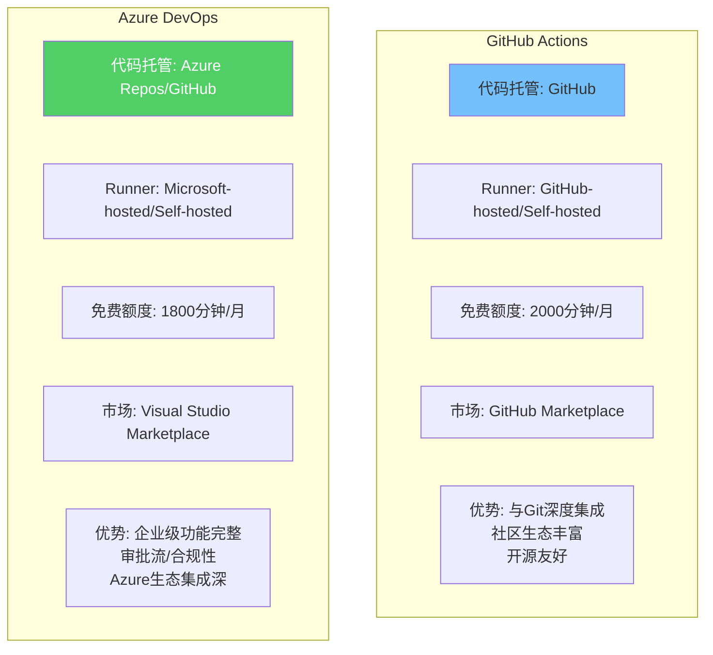
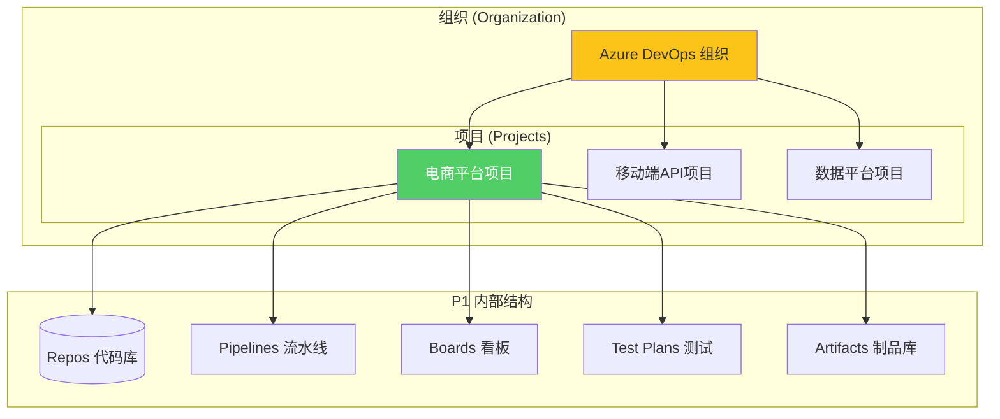
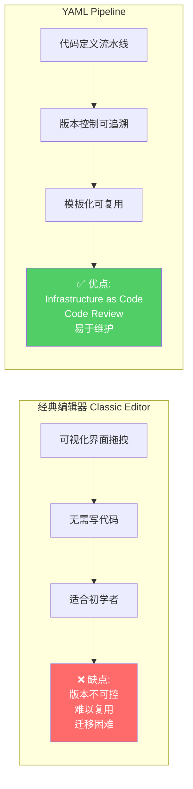
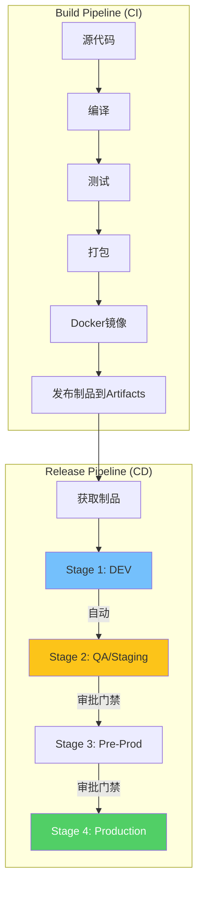
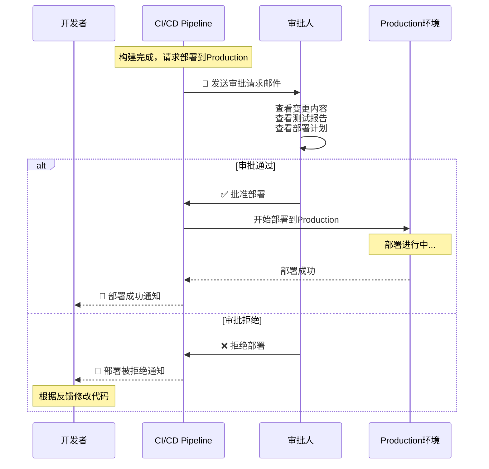
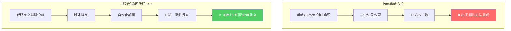
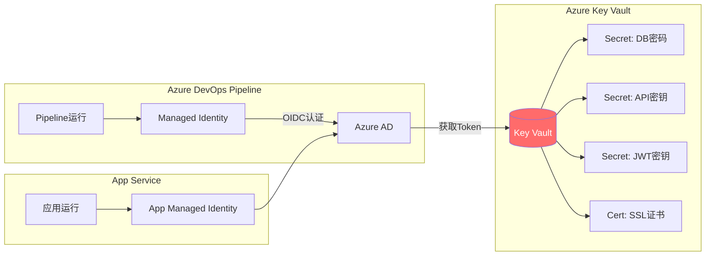
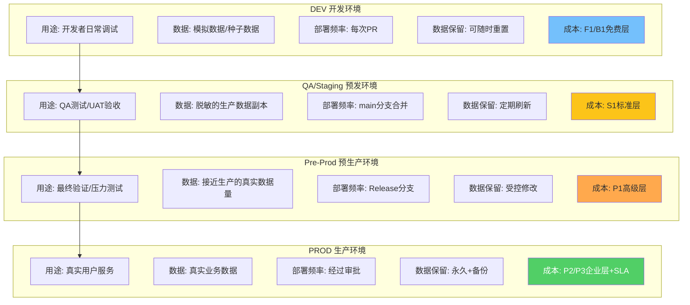
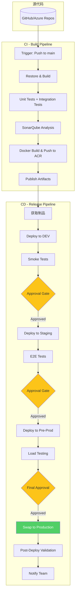

# Azure DevOps Pipelines 实战指南

> **标签**：#AzureDevOps #CI-CD #Pipelines #企业级DevOps
> **阅读时间**：约32分钟 | **难度**：⭐⭐⭐⭐⭐
> **前置知识**：[[03-GitHub Actions CI-CD流水线]]、[[01-Azure App Service部署]]

---

## 目录

- [一、Azure DevOps vs GitHub Actions 对比选型](#一azure-devops-vs-github-actions-对比选型)
- [二、Azure DevOps 项目与组织结构](#二azure-devops-项目与组织结构)
- [三、经典编辑器 vs YAML Pipeline](#三经典编辑器-vs-yaml-pipeline)
- [四、完整Build Pipeline实现](#四完整build-pipeline实现)
- [五、Release Pipeline多阶段部署](#五release-pipeline多阶段部署)
- [六、ARM/Bicep模板基础设施即代码](#六armbicep模板基础设施即代码)
- [七、Azure Key Vault集成](#七azure-key-vault集成)
- [八、Test Plans集成](#八test-plans集成)
- [九、环境管理最佳实践](#九环境管理最佳实践)
- [十、完整电商系统端到端示例](#十完整电商系统端到端示例)

---

## 一、Azure DevOps vs GitHub Actions 对比选型

### 1.1 两大平台核心差异



### 1.2 详细功能对比表

| 功能维度 | GitHub Actions | Azure DevOps Pipelines | 胜出者 |
|---------|---------------|----------------------|--------|
| **代码仓库** | 仅GitHub | Azure Repos + GitHub | Azure DevOps |
| **免费额度** | 公开repo无限/私有2000分钟 | 开源无限/私有1800分钟 | 平手 |
| **并行Job数** | 20（免费）/300（付费） | 10（免费）/无限制（付费） | GitHub |
| **YAML语法** | 简洁直观 | 功能强大但复杂 | GitHub |
| **审批门禁** | Environment + Rules | Release Approval + Gates | **Azure DevOps** |
| **制品管理** | Artifacts（有限） | Azure Artifacts（NuGet/npm/Maven等） | **Azure DevOps** |
| **测试管理** | 第三方集成 | Test Plans原生支持 | **Azure DevOps** |
| **报表仪表板** | 基础 | Power BI集成+丰富报表 | **Azure DevOps** |
| **Self-hosted Runner** | 支持 | 支持Agent Pool管理 | **Azure DevOps** |
| **模板系统** | Composite/Reusable | Template参数化 | **Azure DevOps** |
| **条件逻辑** | if/else表达式 | conditions + ${{}} | 平手 |
| **Azure集成** | 通过Action | 原生Service Connection | **Azure DevOps** |
| **学习曲线** | 较低 | 中等偏高 | GitHub |

### 1.3 选型决策指南

```mermaid
flowchart TD
    Start{选择CI/CD平台} --> Q1{团队规模?}

    Q1 -->|"小型团队(<10人)"| Q2{主要用哪个代码平台?}
    Q1 -->|"中大型团队(≥10人)"| Q3{需要企业级合规?}

    Q2 -->|GitHub| Rec1["✅ 推荐 GitHub Actions"]
    Q2 -->|Azure Repos| Rec2["⚡ 推荐 Azure DevOps"]

    Q3 -->|是| Rec3["✅ 强烈推荐 Azure DevOps<br/>审批流/审计追踪/权限控制"]
    Q3 -->|否| Q4{已使用Azure服务?}

    Q4 -->|是(大量)| Rec4["推荐 Azure DevOps<br/>原生集成更顺畅"]
    Q4 -->|少量/不用| Rec5["两者皆可<br/>根据团队偏好选择"]

    style Rec1 fill:#51cf66,color:#fff
    style Rec3 fill:#51cf66,color:#fff
```

**典型场景推荐**：

| 场景 | 推荐方案 | 理由 |
|------|---------|------|
| 开源项目 | GitHub Actions | 社区可见，贡献者熟悉 |
| 初创公司 | GitHub Actions | 快速上手，成本低 |
| 传统企业 | Azure DevOps | 合规要求，现有基础设施 |
| 金融/医疗 | Azure DevOPS | 审批流程，审计日志 |
| 混合云架构 | Azure DevOps | 统一管控，多集群部署 |
| .NET全栈团队 | 两者皆可 | 微软生态对两者都支持好 |

---

## 二、Azure DevOps 项目与组织结构

### 2.1 组织层级架构



### 2.2 创建项目和初始化

```bash
# 使用Azure CLI创建Azure DevOps项目
# 前提: 已安装 azure-devops 扩展
az extension add --name azure-devops

# 创建组织（如果还没有）
# 访问 https://dev.azure.com 创建组织

# 创建项目
az devops project create \
    --name "ECommerce-Platform" \
    --description "电商平台全栈项目" \
    --process Scrum \
    --visibility private \
    --organization https://dev.azure.com/myorg

# 初始化Git仓库并推送
cd my-project
git init
git remote add origin https://dev.azure.com/myorg/ECommerce-Platform/_git/ECommerce-Platform
git add .
git commit -m "Initial commit"
git push -u origin main
```

### 2.3 Service Connection配置

Service Connection是Azure DevOps连接外部服务的桥梁：

```yaml
# 常见Service Connection类型:

# 1. Azure Resource Manager 服务连接（最常用）
# 用于部署到Azure资源
类型: Azure Resource Manager
认证方式:
  - 服务主体(Service Principal)     # 推荐
  - 托管身份(Managed Identity)       # 更安全
  - 工作负载身份 federation          # 最安全(OIDC)

# 2. Docker Registry 服务连接
# 用于推送Docker镜像到ACR/Docker Hub
类型: Docker Registry
示例: myregistry.azurecr.io

# 3. GitHub 服务连接
# 用于触发GitHub仓库的构建
类型: GitHub
OAuth授权或PAT令牌

# 4. Kubernetes 服务连接
# 用于部署到K8s集群
类型: Kubernetes Service Connection
配置: Kubeconfig或Azure AKS集成
```

---

## 三、经典编辑器 vs YAML Pipeline

### 3.1 两种模式对比



### 3.2 为什么强烈推荐YAML

```markdown
## YAML Pipeline的核心优势

### 1. 版本控制
- 流水线定义随代码一起演进
- 可以回滚到历史版本的流水线
- Code Review机制确保质量

### 2. 可复用性
- Template模板机制避免重复
- 参数化设计适应不同场景
- 跨项目共享通用步骤

### 3. 可移植性
- 不依赖特定UI界面
- 可在不同组织间迁移
- 符合Infrastructure as Code理念

### 4. 更强大的功能
- Matrix矩阵策略
- 条件执行和循环
- 复杂变量和表达式
```

### 3.3 从经典编辑器迁移到YAML

```yaml
# 经典编辑器的典型任务 → YAML等价物

# ============================================
# 任务映射参考
# ============================================

# 经典: Visual Studio Build task
# YAML:
- task: DotNetCoreCLI@2
  inputs:
    command: 'build'
    projects: '**/*.csproj'
    arguments: '--configuration $(BuildConfiguration)'

# 经典: Visual Studio Test task
# YAML:
- task: DotNetCoreCLI@2
  inputs:
    command: 'test'
    projects: '**/*Tests/*.csproj'
    arguments: '--configuration $(BuildConfiguration)'

# 经典: Publish Artifacts
# YAML:
- task: PublishBuildArtifacts@1
  inputs:
    PathtoPublish: '$(Build.ArtifactStagingDirectory)'
    ArtifactName: 'drop'
    publishLocation: 'Container'

# 经典: Azure Web App Deploy
# YAML:
- task: AzureWebApp@1
  inputs:
    azureSubscription: $(AzureSubscription)
    appName: $(WebAppName)
    package: '$(Pipeline.Workspace)/drop/**/*.zip'
```

---

## 四、完整Build Pipeline实现

### 4.1 Pipeline结构与变量定义

```yaml
# =============================================================================
# azure-pipelines.yml - ASP.NET Core 构建Pipeline
# 项目: ECommerce Platform
# 用途: 编译、测试、打包、发布制品和Docker镜像
# =============================================================================

# ===== 触发器配置 =====
trigger:
  branches:
    include:
      - main
      - release/*
      - hotfix/*
  paths:
    exclude:
      - '*.md'
      - 'docs/**'
      - '.github/**'

pr:
  branches:
    include:
      - main
  autoCancel: true  # 新PR提交时取消旧构建

# ===== 全局变量 =====
variables:
  # 构建配置
  buildConfiguration: 'Release'
  dotnetVersion: '8.0.x'
  solution: '**/*.sln'
  testProject: '**/*Tests/*.csproj'
  webProject: 'src/WebApi/WebApi.csproj'

  # Docker配置
  dockerRegistry: '$(ACR_NAME).azurecr.io'
  imageName: 'ecommerce-api'
  imageTag: '$(Build.BuildId)'

  # Azure资源配置
  acrName: '$(ACR_NAME)'
  resourceGroup: '$(RESOURCE_GROUP)'
  webAppName: '$(WEBAPP_NAME)'

  # 工作目录
  buildArtifactName: 'webapp'
  dockerArtifactName: 'manifests'

# ===== Pool配置 =====
pool:
  vmImage: 'ubuntu-latest'  # Linux Agent性能更好且免费

# ===== Jobs定义 =====
jobs:

  # ==========================================================================
  # Job 1: 还原与编译
  # ==========================================================================
  - job: Build
    displayName: '🔨 构建解决方案'
    timeoutInMinutes: 15
    workspace:
      clean: all  # 清理工作区确保干净构建

    steps:

      # ----- Step 1: 安装.NET SDK -----
      - task: UseDotNet@2
        displayName: '安装 .NET SDK $(dotnetVersion)'
        inputs:
          packageType: 'sdk'
          version: $(dotnetVersion)
          installationPath: $(Agent.ToolsDirectory)/dotnet

      # ----- Step 2: NuGet缓存加速 -----
      - task: Cache@2
        displayName: '缓存 NuGet 包'
        inputs:
          key: 'nuget | "$(Agent.OS)" | **/packages.lock.json'
          restoreKeys: |
            nuget | "$(Agent.OS)"
          path: $(System.DefaultWorkingDirectory)/packages

      # ----- Step 3: 还原依赖 -----
      - task: DotNetCoreCLI@2
        displayName: '还原 NuGet 依赖'
        condition: ne(variables['Cache.Restored'], 'true')
        inputs:
          command: 'restore'
          projects: $(solution)
          feedsToUse: 'select'
          vstsFeed: '{your-feed-id}'  # Azure Artifacts Feed

      # ----- Step 4: 编译项目 -----
      - task: DotNetCoreCLI@2
        displayName: '编译项目'
        inputs:
          command: 'build'
          projects: $(solution)
          arguments: >
            --configuration $(buildConfiguration)
            --no-restore
            /warnaserror
            /p:TreatWarningsAsErrors=true
            /p:Version=$(Build.BuildNumber)

      # ----- Step 5: 运行单元测试 -----
      - task: DotNetCoreCLI@2
        displayName: '运行单元测试'
        inputs:
          command: 'test'
          projects: $(testProject)
          arguments: >
            --configuration $(buildConfiguration)
            --no-build
            --verbosity normal
            --collect:"XPlat code coverage"
            --results-directory $(Common.TestResultsDirectory)/UnitTests
            /p:CoverletOutputFormat=opencover,cobertura
            /p:Exclude="[xunit*]*,[*Tests]*"

      # ----- Step 6: 发布代码覆盖率报告 -----
      - task: PublishCodeCoverageResults@1
        displayName: '发布覆盖率报告'
        condition: succeededOrFailed()
        inputs:
          codeCoverageTool: 'Cobertura'
          summaryFileLocation: '$(Common.TestResultsDirectory)/UnitTests/**/coverage.cobertura.xml'
          reportDirectory: '$(Common.TestResultsDirectory)/UnitResults/Cobertura'

      # ----- Step 7: 发布Web应用 -----
      - task: DotNetCoreCLI@2
        displayName: '发布Web应用'
        inputs:
          command: 'publish'
          publishWebProjects: false
          projects: $(webProject)
          arguments: >
            --configuration $(buildConfiguration)
            --output $(Build.ArtifactStagingDirectory)/publish
            --self-contained false
            --no-build
            -p:PublishTrimmed=false

      # ----- Step 8: 发布构建制品 -----
      - task: CopyFiles@2
        displayName: '复制额外文件到制品目录'
        inputs:
          SourceFolder: '$(Build.SourcesDirectory)'
            Contents: |
              deploy/**
              scripts/**
              *.ps1
            TargetFolder: '$(Build.ArtifactStagingDirectory)/publish'

      - task: PublishBuildArtifacts@1
        displayName: '发布构建制品'
        inputs:
          PathtoPublish: '$(Build.ArtifactStagingDirectory)/publish'
          ArtifactName: $(buildArtifactName)
          publishLocation: 'Container'

  # ==========================================================================
  # Job 2: Docker镜像构建
  # ==========================================================================
  - job: DockerBuild
    displayName: '🐳 构建Docker镜像'
    dependsOn: Build
    condition: succeeded()
    timeoutInMinutes: 20

    steps:
      # ----- 登录ACR -----
      - task: Docker@2
        displayName: '登录 Azure Container Registry'
        inputs:
          containerRegistry: '$(dockerRegistry)'
          command: 'login'

      # ----- 设置Buildx -----
      - task: Docker@2
        displayName: '设置 Docker Buildx'
        inputs:
          containerRegistry: '$(dockerRegistry)'
          command: 'buildx'
          buildxCommand: 'create'
          buildxDriver: 'docker-container'
          buildxDriverOpt: 'network=host'
          buildxUse: true

      # ----- 构建并推送镜像 -----
      - task: Docker@2
        displayName: '构建并推送Docker镜像'
        inputs:
          containerRegistry: '$(dockerRegistry)'
          repository: $(imageName)
          command: 'buildAndPush'
          Dockerfile: '**/Dockerfile'
          buildContext: '$(Build.SourcesDirectory)'
          tags: |
            $(imageTag)
            latest
            $(Build.SourceBranchName)-latest
          buildArgs: |
            BUILD_CONFIGURATION=$(buildConfiguration)
            VERSION=$(Build.BuildNumber)

      # ----- 安全扫描 -----
      - task: ContainerStructureTestTask@0
        displayName: '容器结构测试'
        continueOnError: true
        inputs:
          dockerRegistry: '$(dockerRegistry)'
          repository: $(imageName)
          tag: $(imageTag)
          configFile: '**/container-structure-test.yaml'

  # ==========================================================================
  # Job 3: SonarQube分析（可选）
  # ==========================================================================
  - job: CodeQuality
    displayName: '🛡️ 代码质量分析'
    dependsOn: Build
    condition: succeeded()

    steps:
      - task: SonarQubePrepare@5
        displayName: '准备SonarQube分析'
        inputs:
          SonarQube: 'SonarQube-Connection'
          scannerMode: 'CLI'
          projectKey: 'myorg_ecommerce-api'
          projectName: 'ECommerce API'

      - task: DotNetCoreCLI@2
        displayName: '执行SonarQube分析'
        inputs:
          command: 'custom'
          customProject: $(solution)
          arguments: >
            build /t:Rebuild
            /d:sonar.scanner.mode=upload
            /d:sonar.coverageReportPaths=$(Common.TestResultsDirectory)/UnitTests/**/coverage.opencover.xml

      - task: SonarQubeAnalyze@5
        displayName: '运行SonarQube分析'
        condition: succeededOrFailed()

      - task: SonarQubePublish@5
        displayName: '发布SonarQube质量门禁结果'
        condition: succeededOrFailed()
        inputs:
          pollingTimeoutSec: '300'
```

### 4.2 变量组管理

```powershell
# 使用PowerShell或Portal创建变量组

# 变量组: Production Variables
$prodVars = @{
    "AZURE_SUBSCRIPTION" = "Production-Sub"
    "RESOURCE_GROUP" = "rg-ecommerce-prod"
    "ACR_NAME" = "ecommacr"
    "WEBAPP_NAME" = "ecommerce-api-prod"
    "SQL_SERVER" = "ecommerce-sql-prod.database.windows.net"
    "REDIS_CACHE" = "ecommerce-redis.redis.cache.windows.net"
}

# 变量组: Staging Variables
$stagingVars = @{
    "AZURE_SUBSCRIPTION" = "Staging-Sub"
    "RESOURCE_GROUP" = "rg-ecommerce-staging"
    "ACR_NAME" = "ecommacr"
    "WEBAPP_NAME" = "ecommerce-api-staging"
}
```

在YAML中使用变量组：

```yaml
# 引用变量组
variables:
  - group: 'Production Variables'   # 生产环境变量组
  - group: 'Docker Config'         # Docker配置变量组
  - name: buildConfiguration
    value: 'Release'
```

---

## 五、Release Pipeline多阶段部署

### 5.1 Release Pipeline架构



### 5.2 完整Release Pipeline YAML

```yaml
# =============================================================================
# release-pipeline.yml - 多阶段部署Pipeline
# 特点: 审批门禁 + 自动回滚 + 部署后验证
# =============================================================================

# 注意: Release Pipeline也可以用YAML定义（Multi-stage YAML）

stages:

  # ==========================================================================
  # Stage 1: 开发环境部署
  # ==========================================================================
  - stage: DeployDev
    displayName: '💻 部署到开发环境'
    dependsOn: []  # 无依赖，可与Build并行
    condition: and(succeeded(), eq(variables['Build.Reason'], 'PullRequest'))
    variables:
      - group: 'Development Variables'
    jobs:
      - deployment: DeployDev
        environment: Development
        pool:
          vmImage: 'ubuntu-latest'
        strategy:
          runOnce:
            deploy:
              steps:
                - download: current
                  artifact: $(buildArtifactName)

                - task: AzureWebApp@1
                  displayName: '部署到Dev App Service'
                  inputs:
                    azureSubscription: $(AZURE_SUBSCRIPTION)
                    appName: $(WEBAPP_DEV_NAME)
                    package: '$(Pipeline.Workspace)/$(buildArtifactName)/**/*.zip'
                    deploymentMethod: 'zipDeploy'

                - script: |
                    echo "开发环境部署完成"
                    echo "URL: https://$(WEBAPP_DEV_NAME).azurewebsites.net"

  # ==========================================================================
  # Stage 2: Staging/QA环境部署
  # ==========================================================================
  - stage: DeployStaging
    displayName: '🧪 部署到预发环境'
    dependsOn: Build
    condition: and(succeeded(), eq(variables['Build.SourceBranch'], 'refs/heads/main'))
    variables:
      - group: 'Staging Variables'
    jobs:
      - deployment: DeployStaging
        environment:
          name: Staging
          resourceType: VirtualMachine  # 或其他资源类型
        pool:
          vmImage: 'ubuntu-latest'
        strategy:
          runOnce:
            preDeploy:
              steps:
                - script: |
                    echo "=== 预部署检查 ==="
                    echo "验证目标环境状态..."
                    echo "备份当前版本..."
                  displayName: '预部署准备'

            deploy:
              steps:
                - download: current
                  artifact: $(buildArtifactName)

                - task: AzureRmWebAppDeployment@4
                  displayName: '部署到Staging插槽'
                  inputs:
                    ConnectionType: 'AzureRM'
                    azureSubscription: $(AZURE_SUBSCRIPTION)
                    WebAppName: $(WEBAPP_STAGING_NAME)
                    ResourceGroupName: $(RESOURCE_GROUP)
                    DeployToSlotOrASE: true
                    SlotName: 'staging'
                    Package: '$(Pipeline.Workspace)/$(buildArtifactName)/**/*.zip'
                    TakeAppOfflineFlag: true
                    SetParametersFile: ''

                # ----- 冒烟测试 -----
                - task: Bash@3
                  displayName: '冒烟测试'
                  env:
                    STAGING_URL: 'https://$(WEBAPP_STAGING_NAME)-staging.azurewebsites.net'
                  inputs:
                    targetType: 'inline'
                    script: |
                      echo "等待应用启动..."
                      sleep 30

                      # 存活探针
                      for i in {1..12}; do
                        HTTP_CODE=$(curl -sf -o /dev/null -w "%{http_code}" "$STAGING_URL/health/live")
                        if [ "$HTTP_CODE" = "200" ]; then
                          echo "✅ 应用健康"
                          break
                        fi
                        [ $i -eq 12 ] && echo "❌ 启动超时" && exit 1
                        echo "等待中... ($i/12)"
                        sleep 5
                      done

                      # API端点验证
                      curl -sf "$STAGING_URL/api/health/ready" && echo "✅ 就绪探针正常"
                      curl -sf "$STAGING_URL/api/products" && echo "✅ 产品API正常"

            routeTraffic:
              steps:
                - script: |
                    echo "开始路由流量到新版本..."
                    # 如果使用Slot Swap，在这里执行swap操作
                  displayName: '切换流量'

            postRouteTraffic:
              steps:
                - task: Bash@3
                  displayName: '部署后验证'
                  inputs:
                    targetType: 'inline'
                    script: |
                      STAGING_URL="https://$(WEBAPP_STAGING_NAME)-staging.azurewebsites.net"
                      echo "执行部署后验证..."

                      # 检查错误率
                      ERROR_COUNT=$(curl -sf "$STAGING_URL/api/metrics/errors" || echo "N/A")
                      echo "当前错误数: $ERROR_COUNT"

                      # 检查响应时间
                      LATENCY=$(curl -sf -o /dev/null -w "%{time_total}" "$STAGING_URL/api/ping")
                      echo "响应延迟: ${LATENCY}s"

                      if (( $(echo "$LATENCY > 2.0" | bc -l) )); then
                        echo "::warning::响应时间偏慢: ${LATENCY}s"
                      fi

            on:
              failure:
                steps:
                  - script: |
                      echo "❌ 部署失败，触发回滚..."
                      # 回滚逻辑
                    displayName: '失败处理'
              success:
                steps:
                  - script: |
                      echo "✅ Staging部署成功！"
                    displayName: '成功通知'

  # ==========================================================================
  # Stage 3: 生产环境部署（需要审批）
  # ==========================================================================
  - stage: DeployProduction
    displayName: '🚀 部署到生产环境'
    dependsOn: DeployStaging
    condition: succeeded()
    variables:
      - group: 'Production Variables'  # 敏感变量在变量组中
    jobs:
      - deployment: DeployProduction
        # 关键：指定Environment以启用审批规则
        environment:
          name: Production
          resourceType: VirtualMachine
        pool:
          vmImage: 'ubuntu-latest'
        strategy:
          runOnce:
            deploy:
              steps:
                - download: current
                  artifact: $(buildArtifactName)

                - task: AzureRmWebAppDeployment@4
                  displayName: '部署到生产环境'
                  inputs:
                    ConnectionType: 'AzureRM'
                    azureSubscription: $(AZURE_SUBSCRIPTION)
                    WebAppName: $(WEBAPP_PROD_NAME)
                    ResourceGroupName: $(RESOURCE_GROUP)
                    DeployToSlotOrASE: true
                    SlotName: 'production'
                    Package: '$(Pipeline.Workspace)/$(buildArtifactName)/**/*.zip'
                    enableCustomDeployment: true
                    DeploymentType: zipDeploy
                    TakeAppOfflineFlag: true

                # ----- 生产环境健康检查 -----
                - task: Bash@3
                  displayName: '生产环境验证'
                  env:
                    PROD_URL: 'https://$(PRODUCTION_DOMAIN)'
                  inputs:
                    targetType: 'inline'
                    script: |
                      echo "===== 生产环境部署验证 ====="

                      # 1. 基础健康检查
                      curl -sf "$PROD_URL/health/live" && echo "✅ 存活探针OK" || exit 1
                      curl -sf "$PROD_URL/health/ready" && echo "✅ 就绪探针OK" || exit 1

                      # 2. 业务关键路径验证
                      echo ""
                      echo "--- 业务验证 ---"
                      curl -sf "$PROD_URL/api/products?page=1&pageSize=10" > /dev/null && echo "✅ 产品列表API"
                      curl -sf "$PROD_URL/api/categories" > /dev/null && echo "✅ 分类API"
                      curl -sf "$PROD_URL/api/health/checks" > /dev/null && echo "✅ 依赖检查"

                      # 3. 性能基线检查
                      RESPONSE_TIME=$(curl -sf -o /dev/null -w "%{time_total}" "$PROD_URL/api/ping")
                      echo ""
                      echo "首页响应时间: ${RESPONSE_TIME}s"
                      if (( $(echo "$RESPONSE_TIME > 1.0" | bc -l) )); then
                        echo "::warning::生产环境响应时间异常: ${RESPONSE_TIME}s"
                      else
                        echo "✅ 响应时间正常"
                      fi

                      echo ""
                      echo "===== 验证完成 ====="

                # ----- 生成部署报告 -----
                - task: Bash@3
                  displayName: '生成部署摘要'
                  inputs:
                    targetType: 'inline'
                    script: |
                      cat <<'EOF' >> $BUILD_SUMMARYFILE
                      ## 🎉 生产环境部署成功

                      | 项目 | 详情 |
                      |------|------|
                      | **环境** | Production |
                      | **版本** | $(Build.BuildNumber) |
                      | **提交** | [$(Build.SourceVersion)]($(Build.Repository.Uri)/commit/$(Build.SourceVersion)) |
                      | **分支** | $(Build.SourceBranchName) |
                      | **触发者** | $(Build.QueuedBy) |
                      | **时间** | $(Date:yyyy-MM-dd HH:mm:ss) UTC |
                      | **URL** | https://$(PRODUCTION_DOMAIN) |

                      ### 部署产物
                      - 镜像: `$(dockerRegistry)/$(imageName):$(imageTag)`
                      - 制品: `$(buildArtifactName)`
                      EOF

                # ----- 发送通知 -----
                - task: PowerShell@2
                  displayName: '发送Teams通知'
                  condition: always()
                  inputs:
                    targetType: 'inline'
                    pwsh: true
                    script: |
                      $status = if ("$(Agent.JobStatus)" -eq "Succeeded") { "✅ 成功" } else { "❌ 失败" }

                      $body = @{
                          "@type" = "MessageCard"
                          "@context" = "http://schema.org/extensions"
                          "themeColor" = if ("$(Agent.JobStatus)" -eq "Succeeded") { "00FF00" } else { "FF0000" }
                          "summary" = "部署通知"
                          "sections" = @(
                              @{
                                  "activityTitle" = "$status - 生产环境部署"
                                  "facts" = @(
                                      @{ "name" = "项目"; "value" = "ECommerce API" },
                                      @{ "name" = "版本"; "value" = "$(Build.BuildNumber)" },
                                      @{ "name" = "操作者"; "value" = "$(Build.QueuedBy)" },
                                      @{ "name" = "时间"; "value" = Get-Date -Format "yyyy-MM-dd HH:mm:ss" }
                                  )
                              }
                          )
                      } | ConvertTo-Json -Depth 5

                      Invoke-RestMethod -Method Post -Uri "$env:TEAMS_WEBHOOK" -ContentType "application/json" -Body $body
                  env:
                    TEAMS_WEBHOOK: $(TEAMS_WEBHOOK_URL)
```

### 5.3 配置审批门禁



**配置审批规则的步骤**：

1. 进入 **Pipelines → Environments**
2. 创建或选择 **Production** 环境
3. 点击 **Approvals and checks** (三个点菜单)
4. 添加 **Approvals**
5. 选择审批人和审批选项：
   - 允许批准者自行批准
   - 超时时间（如24小时未处理则拒绝）
   - 需要多少审批人同意

---

## 六、ARM/Bicep模板基础设施即代码

### 6.1 为什么需要IaC



### 6.2 Bicep模板示例（推荐）

Bicep是微软新一代的IaC语言，比ARM JSON更简洁：

```bicep
// main.bicep - 电商系统基础设施定义
targetScope = 'resourceGroup'

// ========== 参数定义 ==========
param location string = resourceGroup().location
param environment string = 'Production'
param sqlAdministratorLogin string
@secure()
param sqlAdministratorLoginPassword string
param appServiceSkuName string = 'P1v2'
param appServiceCapacity int = 2

// ========== 变量 ==========
var appServiceName = 'ecommerce-${environment}-api'
var sqlServerName = 'ecommerce-${environment}-sql'
var databaseName = 'EcommerceDb'
var acrName = 'ecommerce${toLower(environment)}acr'
var keyVaultName = 'ecommerce-${environment}-kv'
var appInsightsName = 'ecommerce-${environment}-ai'

// ========== 资源定义 ==========

// 1. App Service Plan
resource appServicePlan 'Microsoft.Web/serverfarms@2023-12-01' = {
  name: '${appServiceName}-plan'
  location: location
  sku: {
    name: appServiceSkuName
    tier: 'PremiumV2'
    capacity: appServiceCapacity
  }
  properties: {
    reserved: true // Linux
  }
}

// 2. Web App (Linux)
resource webApp 'Microsoft.Web/sites@2023-12-01' = {
  name: appServiceName
  location: location
  identity: {
    type: 'SystemAssigned'
  }
  properties: {
    serverFarmId: appServicePlan.id
    siteConfig: {
      linuxFxVersion: 'DOTNETCORE|8.0'
      alwaysOn: true
      ftpsState: 'FtpsOnly'
      minTlsVersion: '1.2'
      http20Enabled: true
      autoHealEnabled: true
      autoHealRules: {
        triggers: {
          requests: {
            count: 10
            timeInterval: '00:01:00'
          }
          statusCodes: ['502', '503']
          privateBytesInKB: 1000000
        }
        actions: {
          actionType: 'Recycle'
        }
      }
      // 连接字符串引用Key Vault
      connectionStrings: [
        {
          name: 'DefaultConnection'
          connectionString: '@Microsoft.KeyVault(SecretUri=${keyVault.id}/secrets/SqlConnectionString/)'
          type: 'SQLAzure'
        }
      ]
      appSettings: [
        {
          name: 'ASPNETCORE_ENVIRONMENT'
          value: environment
        }
        {
          name: 'ApplicationInsights__InstrumentationKey'
          value: appInsights.properties.InstrumentationKey
        }
      ]
    }
  }
  dependsOn: [appServicePlan, keyVault, appInsights]
}

// 3. Deployment Slots
resource stagingSlot 'Microsoft.Web/sites/slots@2023-12-01' = {
  parent: webApp
  name: 'staging'
  location: location
  properties: {
    serverFarmId: appServicePlan.id
  }
}

// 4. SQL Server + Database
resource sqlServer 'Microsoft.Sql/servers@2022-11-01-preview' = {
  name: sqlServerName
  location: location
  properties: {
    administratorLogin: sqlAdministratorLogin
    administratorLoginPassword: sqlAdministratorLoginPassword
    version: '12.0'
    minimalTlsVersion: '1.2'
    publicNetworkAccess: 'Disabled' // 安全：禁止公网访问
  }
}

resource sqlDatabase 'Microsoft.Sql/servers/databases@2022-11-01-preview' = {
  parent: sqlServer
  name: databaseName
  location: location
  sku: {
    name: 'Standard_S1'
    tier: 'Standard'
  }
}

// 5. Azure Container Registry
resource acr 'Microsoft.ContainerRegistry/registries@2023-07-01' = {
  name: acrName
  location: location
  sku: {
    name: 'Premium'  # Premium支持防火墙和VNet
  }
  properties: {
    adminUserEnabled: false // 使用Managed Identity替代
    publicNetworkAccess: 'Disabled'
    networkRuleSet: {
      defaultAction: 'Deny'
      virtualNetworkRules: []
      ipRules: []
    }
  }
}

// 6. Key Vault
resource keyVault 'Microsoft.KeyVault/vaults@2023-07-01' = {
  name: keyVaultName
  location: location
  properties: {
    tenantId: subscription().tenantId
    sku: {
      name: 'standard'
      family: 'A'
    }
    enableSoftDelete: true
    softDeleteRetentionDays: 90
    enablePurgeProtection: true
    accessPolicies: [] // 使用RBAC代替access policy
  }
}

// 7. Key Vault Secrets
resource sqlConnectionString 'Microsoft.KeyVault/vaults/secrets@2023-07-01' = {
  parent: keyVault
  name: 'SqlConnectionString'
  properties: {
    value: 'Server=tcp:${sqlServerName}.database.windows.net,1433;Initial Catalog=${databaseName};Persist Security Info=False;User ID=${sqlAdministratorLogin};Password=${sqlAdministratorLoginPassword};TrustServerCertificate=False;'
  }
}

resource redisConnectionString 'Microsoft.KeyVault/vaults/secrets@2023-07-01' = {
  parent: keyVault
  name: 'RedisConnectionString'
  properties: {
    value: '${redis.name}:6380,password=${redisPassword.properties.value},ssl=True,abortConnect=False'
  }
}

// 8. Redis Cache
resource redis 'Microsoft.Redis/redis@2023-04-01' = {
  name: '${appServiceName}-redis'
  location: location
  properties: {
    sku: {
      name: 'Standard_C1'
      family: 'C'
      capacity: 1
    }
    enableNonSslPort: false
    minimumTlsVersion: '1.2'
  }
}

resource redisPassword 'Microsoft.Redis/redis/keys@2023-04-01' = {
  parent: redis
  name: 'primaryKey'
}

// 9. Application Insights
resource appInsights 'Microsoft.Insights/components@2020-02-02' = {
  name: appInsightsName
  location: globalLocation
  kind: 'web'
  properties: {
    Application_Type: 'web'
    WorkspaceResourceId: logAnalytics.id
    IngestionMode: 'ApplicationInsights' | 'LogAnalytics'
  }
}

resource logAnalytics 'Microsoft.OperationalInsights/workspaces@2023-09-01' = {
  name: '${appServiceName}-law'
  location: location
  properties: {
    retentionInDays: 30
    sku: {
      name: 'PerGB2018'
    }
  }
}

// ========== 输出 ==========
output webAppUrl string = 'https://${webApp.defaultHostName}'
output stagingSlotUrl string = 'https://${appServiceName}-staging.azurewebsites.net'
output acrLoginServer string = acr.loginServerUrl
output keyVaultUri string = keyVault.properties.vaultUri
output appInsightsInstrumentationKey string = appInsights.properties.InstrumentationKey
```

### 6.3 在Pipeline中部署Bicep

```yaml
# 在Pipeline中添加IaC部署stage
- stage: Infrastructure
  displayName: '🏗️ 部署基础设施'
  jobs:
    - job: DeployInfra
      displayName: '部署Azure资源'
      pool:
        vmImage: 'ubuntu-latest'
      steps:
        - task: AzureCLI@2
          displayName: '部署Bicep模板'
          inputs:
            azureSubscription: $(AZURE_SUBSCRIPTION)
            scriptType: 'bash'
            scriptLocation: 'inlineScript'
            inlineScript: |
              az deployment group create \
                --resource-group $(RESOURCE_GROUP) \
                --template-file infra/main.bicep \
                --parameters \
                  environment=Production \
                  sqlAdministratorLogin=$(SQL_ADMIN_LOGIN) \
                  sqlAdministratorLoginPassword=$(SQL_ADMIN_PASSWORD) \
                  appServiceSkuName='P1v2' \
                  appServiceCapacity=2
```

---

## 七、Azure Key Vault集成

### 7.1 安全地管理密钥



### 7.2 在Pipeline中使用Key Vault

```yaml
# 方法1: Azure Key Vault Task（推荐）
- task: AzureKeyVault@2
  displayName: '从Key Vault获取密钥'
  inputs:
    azureSubscription: $(AZURE_SUBSCRIPTION)
    KeyVaultName: 'ecommerce-prod-kv'
    SecretsFilter: '*'
    RunAsPreJob: false

# 之后可以直接使用密钥作为变量
# $(SqlPassword), $(JwtSecretKey), $(StripeApiKey) 等

# 方法2: Azure CLI获取
- task: AzureCLI@2
  displayName: '获取密钥值'
  inputs:
    azureSubscription: $(AZURE_SUBSCRIPTION)
    scriptType: 'bash'
    scriptLocation: 'inlineScript'
    inlineScript: |
      # 获取单个密钥
      SQL_PASSWORD=$(az keyvault secret show \
        --vault-name ecommerce-prod-kv \
        --name SqlPassword \
        --query value -o tsv)

      echo "##vso[task.setvariable variable=SqlPassword;issecret=true]$SQL_PASSWORD"
```

### 7.3 Link Variable Group to Key Vault（最简单的方式）

这是最推荐的集成方式——将变量组链接到Key Vault：

```powershell
# 使用PowerShell或Azure Portal操作
# 1. 创建变量组
# 2. 链接到Key Vault
# 3. 自动同步所有Secret作为变量

# PowerShell方式
$orgUrl = "https://dev.azure.com/myorg"
$project = "ECommerce-Platform"
$vgroupName = "Production Secrets"
$keyVaultName = "ecommerce-prod-kv"

# 使用REST API链接
# 或者直接在Portal: Library → Variable Groups → Add → Link secrets from a key vault
```

---

## 八、Test Plans集成

### 8.1 自动化测试与Test Plans联动

```yaml
# 在Build Pipeline中集成测试结果发布
- task: PublishTestResults@2
  displayName: '发布测试结果到Azure Test Plans'
  condition: succeededOrFailed()
  inputs:
    testRunner: VSTest
    testResultsFiles: '**/*.trx'
    testRunTitle: 'CI Build $(Build.BuildNumber)'
    buildPlatform: $(Build.Platform)
    buildConfiguration: $(Build.Configuration)
    publishRunAttachments: true

# 手动测试用例关联
- task: AzurePowerShell@5
  displayName: '更新测试用例状态'
  condition: succeededOrFailed()
  inputs:
    azureSubscription: $(AZURE_SUBSCRIPTION)
    ScriptType: 'InlineScript'
    azurePowerShellVersion: 'LatestVersion'
    Inline: |
      # 根据测试结果更新Test Plans中的用例状态
      $pat = "$(SYSTEM_ACCESSTOKEN)"
      $headers = @{
          Authorization = "Basic $([Convert]::ToBase64String([Text.Encoding]::ASCII.GetBytes(":$pat")))"
      }

      $url = "$(System.CollectionUri)/$(System.TeamProject)/_apis/test/runs?api-version=6.0"
      # ... 发布测试运行
```

### 8.2 测试覆盖率仪表板

```yaml
# 发布覆盖率到Azure DevOps仪表板
- task: PublishCodeCoverageResults@1
  displayName: '发布代码覆盖率'
  inputs:
    codeCoverageTool: 'Cobertura'
    summaryFileLocation: '$(Common.TestResultsDirectory)/**/coverage.cobertura.xml'
    reportDirectory: '$(Common.TestResultsDirectory)/CoverageReport'
    failIfCoverageEmpty: false

# 覆盖率质量门禁
- task: Bash@3
  displayName: '检查覆盖率阈值'
  inputs:
    targetType: 'inline'
    script: |
      # 解析覆盖率XML获取行覆盖率
      COVERAGE=$(grep 'line-rate' coverage.cobertura.xml | head -1 | grep -oP 'line-rate="\K[^"]+')
      PERCENTAGE=$(echo "$COVERAGE * 100" | bc)

      echo "代码行覆盖率: ${PERCENTAGE}%"

      if (( $(echo "$PERCENTAGE < 80" | bc -l) )); then
        echo "::warning::代码覆盖率 ${PERCENTAGE}% 低于80%阈值"
        # 取消下面这行的注释来强制阻塞
        # exit 1
      else
        echo "✅ 覆盖率达标"
      fi
```

---

## 九、环境管理最佳实践

### 9.1 四环境标准模型



### 9.2 环境配置对比表

| 配置项 | Development | Staging | Pre-Prod | Production |
|--------|------------|---------|----------|-----------|
| **ASPNETCORE_ENVIRONMENT** | Development | Staging | Production | Production |
| **日志级别** | Debug/Trace | Information | Warning | Warning/Error |
| **数据库** | LocalDB/SQLite | SQL Dev Tier | SQL Standard | SQL Premium/Premium |
| **缓存** | 内存缓存 | Redis Basic | Redis Standard | Redis Premium |
| **连接池大小** | 5 | 10 | 20 | 50 |
| **CORS** | * (所有来源) | 前端域名 | 前端域名 | 前端域名 |
| **HTTPS** | 否 | 是 | 是 | 是（HSTS） |
| **健康检查** | 详细输出 | 标准 | 标准 | 最小输出 |
| **错误详情** | 显示详细信息 | 显示基本信息 | 隐藏详情 | 自定义错误页 |
| **实例数** | 1 | 1-2 | 2-4 | 3+ (自动缩放) |
| **备份策略** | 无 | 每日 | 每6小时 | 实时+异地 |
| **监控** | 基础 | 完整 | 完整+告警 | 完整+告警+PagerDuty |

### 9.3 环境保护规则

```yaml
# 在Azure DevOps Environments中配置保护规则

# Production环境保护规则:
# 1. 审批: 至少2人审批（不能自己审批自己的代码）
# 2. 时间窗口: 只允许工作日 9:00-18:00 部署
# 3. 检查: 所有测试必须通过
# 4. 检查: SonarQube Quality Gate通过
# 5. 检查: 安全扫描无CRITICAL漏洞
# 6. 检查: 只能从main/release分支部署

# Staging环境保护规则:
# 1. 审批: 1人或自动（来自main分支）
# 2. 检查: 单元测试和集成测试通过
```

---

## 十、完整电商系统端到端示例

### 10.1 项目整体架构图



### 10.2 完整的azure-pipelines.yml（一体化）

```yaml
# =============================================================================
# ECommerce Platform - 一体化CI/CD Pipeline
# 包含: 构建→测试→质量门禁→Docker→多环境部署→通知
# =============================================================================

name: $(Date:yyyyMMdd)$(Rev:.r)

# 触发器
trigger:
  branches:
    include:
      - main
      - release/*
  paths:
    exclude:
      - '*.md'
      - 'docs/**'

pr:
  branches:
    include:
      - main
  autoCancel: true

# 全局变量
variables:
  dotnetVersion: '8.0.x'
  buildConfiguration: 'Release'
  solution: '**/*.sln'
  acrName: 'ecommacr'
  imageName: 'ecommerce-api'

# 模板引用（可选：将公共步骤提取为模板）
# resources:
#   repositories:
#     - repository: templates
#       type: git
#       name: MyOrg/pipeline-templates

stages:

  # ==========================================================================
  # Stage 1: 构建、测试和质量检查
  # ==========================================================================
  - stage: Build
    displayName: '🔨 Build & Quality'
    jobs:
      - job: BuildJob
        displayName: '构建与测试'
        pool:
          vmImage: 'ubuntu-latest'
        timeoutInMinutes: 25

        variables:
          coverageDir: '$(Build.SourcesDirectory)/TestResults/Coverage'

        steps:
          - checkout: self
            fetchDepth: 0

          - task: UseDotNet@2
            displayName: '安装 .NET SDK'
            inputs:
              packageType: 'sdk'
              version: $(dotnetVersion)

          - task: CacheBeta@0
            inputs:
              key: '"nuget" | "$(Agent.OS)" | **/packages.lock.json'
              path: '$(UserProfile)\.nuget\packages'
              cacheHitVar: CACHE_RESTORED
            displayName: '缓存 NuGet 包'

          - task: DotNetCoreCLI@2
            displayName: '还原依赖'
            condition: ne(variables.CACHE_RESTORED, 'true')
            inputs:
              command: 'restore'
              projects: $(solution)
              arguments: '--locked-mode'

          - task: DotNetCoreCLI@2
            displayName: '编译'
            inputs:
              command: 'build'
              projects: $(solution)
              arguments: '-c $(buildConfiguration) --no-restore /warnaserror'

          - task: DotNetCoreCLI@2
            displayName: '单元测试'
            inputs:
              command: 'test'
              projects: '**/*UnitTests/*.csproj'
              arguments: >
                -c $(buildConfiguration) --no-build --verbosity normal
                --collect:"XPlat code coverage"
                --results-directory $(Common.TestResultsDirectory)/Unit
                /p:CoverletOutputFormat=opencover
                /p:Exclude="[xunit*]*,[*Tests]*"

          - task: DotNetCoreCLI@2
            displayName: '集成测试'
            inputs:
              command: 'test'
              projects: '**/*IntegrationTests/*.csproj'
              arguments: >
                -c $(buildConfiguration) --no-build
                --results-directory $(Common.TestResultsDirectory)/Integration

          - task: PublishTestResults@2
            displayName: '发布测试结果'
            condition: succeededOrFailed()
            inputs:
              testRunner: VSTest
              testResultsFiles: '**/*.trx'
              testRunTitle: 'ECommerce $(Build.BuildNumber)'
              mergeTestResults: true
              failTaskOnFailedTests: true

          - task: PublishCodeCoverageResults@1
            displayName: '发布覆盖率'
            inputs:
              codeCoverageTool: Cobertura
              summaryFileLocation: '$(Common.TestResultsDirectory)/**/coverage.cobertura.xml'
              reportDirectory: '$(Common.TestResultsDirectory)/CoverageReport'

          - task: SonarQubePrepare@5
            displayName: 'SonarQube 准备'
            inputs:
              SonarQube: 'SonarQube'
              scannerMode: CLI
              projectKey: 'ecommerce-api'
              projectName: 'ECommerce API'

          - task: DotNetCoreCLI@2
            displayName: 'SonarQube 分析'
            inputs:
              command: 'custom'
              customProject: $(solution)
              arguments: 'build /t:Rebuild,dotnet-sonarscanner-end /d:sonar.cs.vscoveragexml.reportsPaths=$(Common.TestResultsDirectory)/Unit/**/coverage.opencover.xml'

          - task: SonarQubeAnalyze@5
            displayName: 'SonarQube 分析执行'
            condition: succeededOrFailed()

          - task: SonarQubePublish@5
            displayName: 'SonarQube 质量门禁'
            condition: succeededOrFailed()
            inputs:
              pollingTimeoutSec: '300'

          - task: DotNetCoreCLI@2
            displayName: '发布应用'
            inputs:
              command: 'publish'
              zipAfterPublish: false
              modifyOutputPath: false
              projects: '**/*Api/*.csproj'
              arguments: >
                -c $(buildConfiguration) -o $(Build.ArtifactStagingDirectory)/publish
                --no-build --self-contained false

          - task: PublishBuildArtifacts@1
            displayName: '发布制品'
            inputs:
              PathtoPublish: '$(Build.ArtifactStagingDirectory)/publish'
              ArtifactName: 'drop'
              publishLocation: Container

          - task: Docker@2
            displayName: '登录 ACR'
            inputs:
              containerRegistry: '$(acrName).azurecr.io'
              command: 'login'

          - task: Docker@2
            displayName: '构建并推送镜像'
            inputs:
              containerRegistry: '$(acrName).azurecr.io'
              repository: $(imageName)
              command: 'buildAndPush'
              Dockerfile: '**/Dockerfile'
              tags: |
                $(Build.BuildId)
                $(Build.SourceBranchName)-latest
                latest

  # ==========================================================================
  # Stage 2: 部署到Staging
  # ==========================================================================
  - stage: DeployStaging
    displayName: '🚀 Deploy to Staging'
    dependsOn: Build
    condition: succeeded()
    jobs:
      - deployment: DeployStagingJob
        displayName: '部署Staging'
        environment: Staging
        pool:
          vmImage: 'ubuntu-latest'
        strategy:
          runOnce:
            deploy:
              steps:
                - download: current
                  artifact: drop

                - task: AzureWebApp@1
                  displayName: '部署到Staging'
                  inputs:
                    azureSubscription: 'Staging-Azure-SP'
                    appName: 'ecommerce-api-staging'
                    package: '$(Pipeline.Workspace)/drop/**/*.zip'
                    deploymentMethod: 'zipDeploy'

                - task: Bash@3
                  displayName: '冒烟测试'
                  inputs:
                    targetType: 'inline'
                    script: |
                      URL="https://ecommerce-api-staging.azurewebsites.net"
                      sleep 30
                      curl -sf "$URL/health/live" && echo "✅ OK" || exit 1
                      curl -sf "$URL/api/products" && echo "✅ Products API OK"

  # ==========================================================================
  # Stage 3: 部署到Production（需审批）
  # ==========================================================================
  - stage: DeployProduction
    displayName: '🎯 Deploy to Production'
    dependsOn: DeployStaging
    condition: succeeded()
    jobs:
      - deployment: DeployProductionJob
        displayName: '部署Production'
        # 这里配置了Environment后会自动启用审批规则
        environment:
          name: Production
          url: 'https://api.ecommerce.example.com'
        pool:
          vmImage: 'ubuntu-latest'
        strategy:
          runOnce:
            deploy:
              steps:
                - download: current
                  artifact: drop

                - task: AzureRmWebAppDeployment@4
                  displayName: '部署到Production'
                  inputs:
                    ConnectionType: AzureRM
                    azureSubscription: 'Production-Azure-SP'
                    WebAppName: 'ecommerce-api-prod'
                    ResourceGroupName: 'rg-ecommerce-prod'
                    DeployToSlotOrASE: true
                    SlotName: production
                    Package: '$(Pipeline.Workspace)/drop/**/*.zip'
                    EnableCustomDeployment: true
                    DeploymentType: zipDeploy

                - task: Bash@3
                  displayName: '生产验证'
                  inputs:
                    targetType: 'inline'
                    script: |
                      PROD="https://api.ecommerce.example.com"
                      curl -sf "$PROD/health/live" && echo "✅ Live"
                      curl -sf "$PROD/health/ready" && echo "✅ Ready"
                      echo "##vso[task.complete result=Succeeded;]DONE"

                - task: SlackNotification@0
                  displayName: 'Slack通知'
                  condition: always()
                  inputs:
                    slackWebhookEndpoint: $(SLACK_WEBHOOK)
                    message: |
                      *${{ job.status == 'Succeeded' && '✅' || '❌' }} ECommerce API 部署*
                      环境: Production
                      版本: $(Build.BuildNumber)
                      操作: $(Build.RequestedFor)
```

---

## 总结

Azure DevOps Pipelines为企业级.NET项目提供了完整的DevOps能力。通过本文学到的知识，你应该能够：

✅ **做出正确选型**：理解Azure DevOps与GitHub Actions的差异及适用场景  
✅ **掌握YAML Pipeline**：编写声明式的、可版本控制的流水线  
✅ **实施多阶段部署**：Dev → Staging → Pre-Prod → Production完整链路  
✅ **配置审批门禁**：保障生产环境部署的安全性和合规性  
✅ **实践IaC理念**：使用Bicep/ARM管理Azure基础设施  
✅ **安全管理密钥**：通过Key Vault集成实现零明文密钥  
✅ **建立质量体系**：SonarQube + Test Plans + 覆盖率门禁  

**Azure DevOps vs GitHub Actions最终建议**：

| 团队特征 | 推荐方案 |
|---------|---------|
| 小型敏捷团队 | GitHub Actions（快速上手） |
| 大型企业/金融 | Azure DevOps（合规审批） |
| 混合使用 | 两者结合：GitHub Actions做CI + Azure DevOps做CD |

**下一步学习**：
- [[01-Azure App Service部署]] - 了解部署目标的详细配置
- [[05-多环境配置管理]] - 深入管理多套环境的配置差异
- [[08-集中式日志解决方案]] - 收集和分析各环境的运行日志
- [[07-Application Insights监控]] - 监控部署后的应用表现

---

> **相关文章**：
> - [[03-GitHub Actions CI-CD流水线]] - 另一种流行的CI/CD方案
> - [[02-Docker生产环境最佳实践]] - Docker镜像构建最佳实践
> - [[06-健康检查与优雅关闭]] - 提升部署后的应用可靠性
> - [[04-安全加固/05-HTTPS与安全头部配置]] - 安全加固细节
