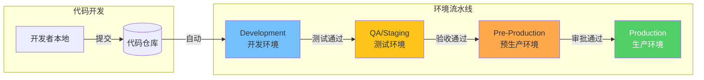
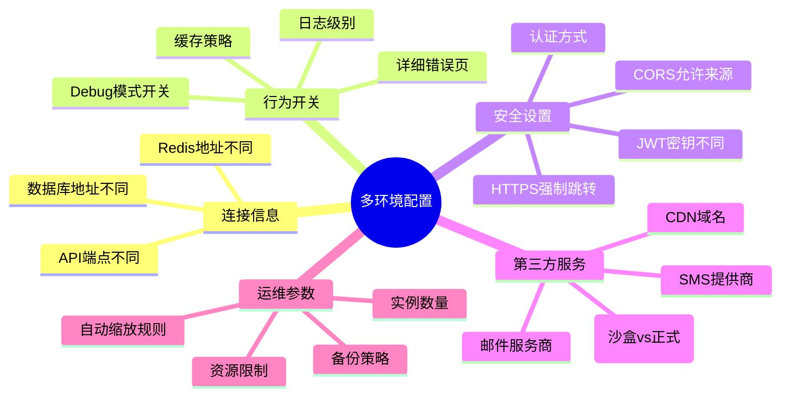
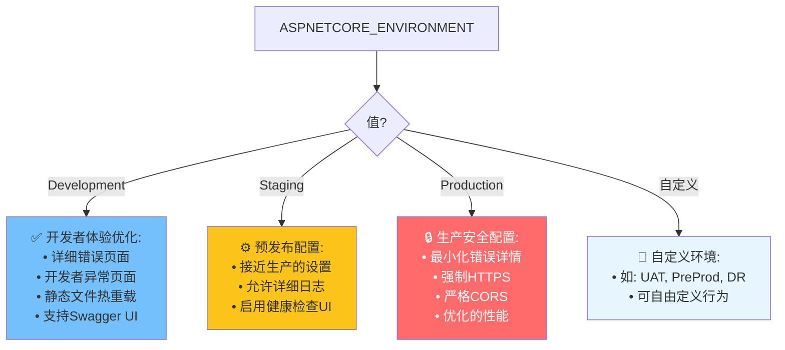
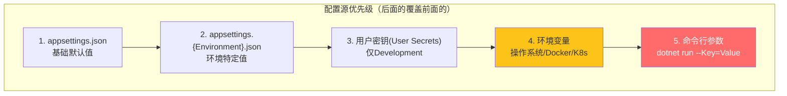
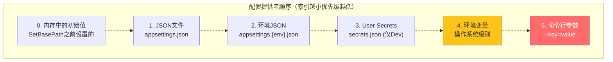
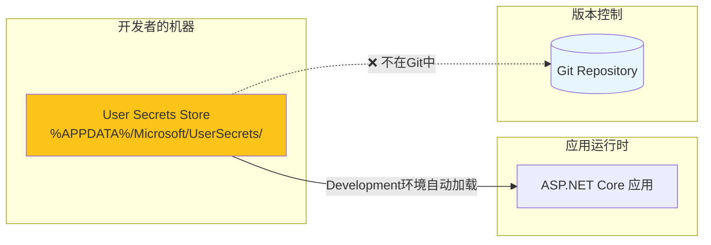
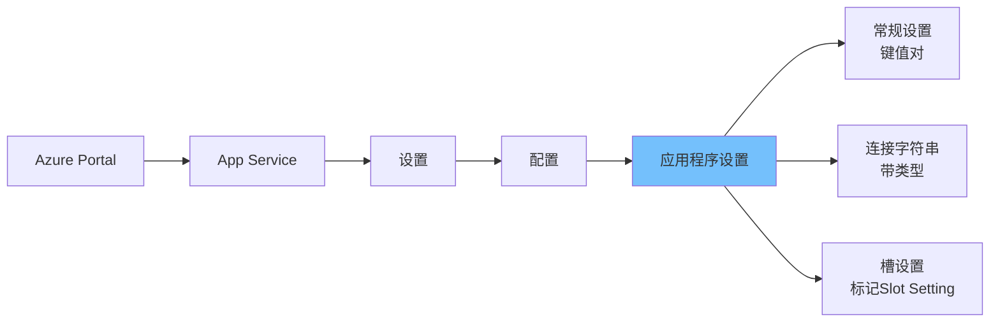

# 多环境配置管理实战指南

> **标签**：#配置管理 #多环境 #Environment #最佳实践
> **阅读时间**：约28分钟 | **难度**：⭐⭐⭐⭐
> **前置知识**：[[01-设计模式/依赖注入进阶]]、[[03-GitHub Actions CI-CD流水线]]

---

## 目录

- [一、为什么需要多环境](#一为什么需要多环境)
- [二、ASP.NET Core 环境系统详解](#二aspnet-core-环境系统详解)
- [三、appsettings层级覆盖机制](#三appsettings层级覆盖机制)
- [四、环境变量优先级体系](#四环境变量优先级体系)
- [五、User Secrets开发环境管理](#五user-secrets开发环境管理)
- [六、Docker Compose环境变量](#六docker-compose环境变量)
- [七、Kubernetes ConfigMap与Secret](#七kubernetes-configmap与secret)
- [八、Azure App Service Application Settings](#八azure-app-service-application-settings)
- [九、配置验证最佳实践](#九配置验证最佳实践)
- [十、完整4套环境配置示例](#十完整4套环境配置示例)

---

## 一、为什么需要多环境

### 1.1 软件交付的生命周期



### 1.2 各环境的职责定义

| 环境 | 目标用户 | 主要用途 | 数据特点 | 部署频率 |
|------|---------|---------|---------|---------|
| **Development** | 开发者 | 日常编码调试 | 模拟/种子数据 | 每次保存/PR |
| **QA/Staging** | QA团队/UAT用户 | 功能测试/用户验收 | 脱敏数据副本 | main分支合并后 |
| **Pre-Prod** | 性能团队/SRE | 压力测试/最终验证 | 接近真实规模 | Release分支 |
| **Production** | 真实终端用户 | 提供商业服务 | 真实业务数据 | 经过审批 |

### 1.3 配置差异的核心场景



---

## 二、ASP.NET Core 环境系统详解

### 2.1 ASPNETCORE_ENVIRONMENT 环境变量

这是ASP.NET Core最核心的环境标识，决定了应用加载哪些配置文件和启用哪些功能：

```bash
# 设置环境变量的方式（按优先级从低到高）

# 方式1: 操作系统环境变量（最常见）
# Linux/macOS:
export ASPNETCORE_ENVIRONMENT=Production

# Windows (CMD):
set ASPNETCORE_ENVIRONMENT=Production

# Windows (PowerShell):
$env:ASPNETCORE_ENVIRONMENT="Production"

# 方式2: launchSettings.json（仅开发时）
# 方式3: Dockerfile中的ENV指令
# 方式4: docker-compose.yml的environment节
# 方式5: Kubernetes的env/envFrom
# 方式6: Azure App Service Application Settings
```

### 2.2 环境名称约定



### 2.3 在代码中检测当前环境

```csharp
// Program.cs - 根据环境条件注册服务
var builder = WebApplication.CreateBuilder(args);

var env = builder.Environment;

// ===== 根据环境加载不同的服务 =====

// 所有环境都有的基础服务
builder.Services.AddControllers();
builder.Services.AddEndpointsApiExplorer();

// 仅在开发环境启用Swagger
if (env.IsDevelopment())
{
    builder.Services.AddSwaggerGen();
    builder.Services.AddSwaggerGenNewtonsoftSupport();

    // 开发环境可以连接到本地数据库
    // builder.Services.AddDbContext<AppDbContext>(options =>
    //     options.UseSqlite("Data Source=localdev.db"));
}

// Staging和Production使用真实数据库
if (env.IsStaging() || env.IsProduction())
{
    // 使用连接池优化的SQL Server
    builder.Services.AddDbContextPool<AppDbContext>(options =>
        options.UseSqlServer(
            builder.Configuration.GetConnectionString("DefaultConnection"),
            sqlOptions => {
                sqlOptions.EnableRetryOnFailure(
                    maxRetryCount: 3,
                    maxRetryDelay: TimeSpan.FromSeconds(30),
                    errorNumbersToAdd: null);
            }));

    // 添加响应压缩（生产环境优化）
    builder.Services.AddResponseCompression(options =>
    {
        options.EnableForHttps = true;
        options.Providers.Add<BrotliCompressionProvider>();
        options.Providers.Add<GzipCompressionProvider>();
    });

    // 添加HSTS（仅非Development环境）
    builder.Services.AddHsts(options =>
    {
        options.MaxAge = TimeSpan.FromDays(365);
        options.IncludeSubDomains = true;
        options.Preload = true;
    });
}

// 自定义环境判断
if (env.EnvironmentName == "UAT")
{
    // UAT特定配置
    builder.Logging.SetMinimumLevel(LogLevel.Debug);
}

var app = builder.Build();

// ===== 中间件管道（根据环境差异化）=====

if (app.Environment.IsDevelopment())
{
    // 开发环境中间件
    app.UseDeveloperExceptionPage();     // 显示详细异常堆栈
    app.UseSwagger();                    // Swagger UI
    app.UseSwaggerUI(c => c.SwaggerEndpoint("/swagger/v1/swagger.json", "My API v1"));
}
else
{
    // 生产环境中间件
    app.UseExceptionHandler("/error");   // 自定义错误处理
    app.UseHsts();                       // HTTP Strict Transport Security
    app.UseHttpsRedirection();           // HTTP→HTTPS重定向

    // 安全头部
    app.UseSecurityHeaders(headers => headers
        .AddStrictTransportSecurityMaxAgeInSeconds(31536000)
        .AddXFrameOptionsSameOrigin()
        .AddXContentTypeOptionsNoSniff()
        .AddReferrerPolicyStrictOriginWhenCrossOrigin()
        .RemoveServerHeader()
    );
}

app.UseRouting();
app.UseAuthentication();
app.UseAuthorization();
app.MapControllers();

app.Run();
```

### 2.4 自定义环境扩展方法

```csharp
// Extensions/HostingEnvironmentExtensions.cs
namespace MyApi.Extensions;

public static class HostingEnvironmentExtensions
{
    /// <summary>
    /// 判断是否为本地开发环境（Development或自定义Local环境）
    /// </summary>
    public static bool IsLocal(this IHostEnvironment env)
    {
        return env.IsDevelopment() || env.EnvironmentName == "Local";
    }

    /// <summary>
    /// 判断是否为类生产环境（Staging, Production, PreProd等）
    /// </summary>
    public static bool IsProductionLike(this IHostEnvironment env)
    {
        var prodLikeEnvironments = new[] { "Staging", "Production", "PreProd" };
        return prodLikeEnvironments.Contains(env.EnvironmentName, StringComparer.OrdinalIgnoreCase);
    }

    /// <summary>
    /// 是否为云环境（非本地）
    /// </summary>
    public static bool IsCloud(this IHostEnvironment env)
    {
        return !env.IsLocal();
    }
}
```

---

## 三、appsettings层级覆盖机制

### 3.1 配置文件层次结构

```
项目根目录/
├── appsettings.json                    # ← 基础配置（所有环境共享）
├── appsettings.Development.json         # ← 开发环境覆盖
├── appsettings.Staging.json             # ← 预发环境覆盖
├── appsettings.Production.json          # ← 生产环境覆盖
├── appsettings.UAT.json                 # ← UAT环境覆盖（可选）
└── appsettings.{CustomEnv}.json         # ← 自定义环境
```

### 3.2 配置加载优先级（从低到高）



### 3.3 完整的配置文件示例

#### appsettings.json - 基础配置

```json
{
  // ============================================
  // appsettings.json - 基础默认配置
  // 注意: 此文件可以安全地提交到Git
  // 包含所有环境的共享默认值
  // ============================================

  "Logging": {
    "LogLevel": {
      "Default": "Information",
      "Microsoft.AspNetCore": "Warning",
      "Microsoft.EntityFrameworkCore": "Warning",
      "System": "Warning"
    },
    "Console": {
      "FormatterName": "json",
      "IncludeScopes": true
    }
  },

  "AllowedHosts": "*",

  "ConnectionStrings": {
    "DefaultConnection": "Server=(localdb)\\mssqllocaldb;Database=MyDb;Trusted_Connection=True;MultipleActiveResultSets=true"
  },

  "Cache": {
    "Enabled": true,
    "DefaultExpirationMinutes": 30,
    "SlidingExpiration": true
  },

  "Redis": {
    "Enabled": false,
    "ConnectionString": "localhost:6379",
    "InstanceName": "myapi:"
  },

  "Jwt": {
    "Issuer": "https://api.mycompany.com",
    "Audience": "https://mycompany.com",
    "AccessTokenExpirationMinutes": 60,
    "RefreshTokenExpirationDays": 7,
    "SecretKey": "PLEASE_OVERRIDE_IN_ENV_SETTINGS"  // 占位符，实际值来自环境变量
  },

  "RateLimiting": {
    "Enabled": true,
    "PermitLimit": 100,
    "WindowSeconds": 60,
    "QueueLimit": 0
  },

  "Cors": {
    "AllowedOrigins": ["http://localhost:3000", "http://localhost:5173"],
    "AllowCredentials": true,
    "AllowMethods": ["GET", "POST", "PUT", "DELETE", "OPTIONS"],
    "AllowHeaders": ["Content-Type", "Authorization", "X-Requested-With", "X-Custom-Header"]
  },

  "Serilog": {
    "Using": ["Serilog.Sinks.Console", "Serilog.Sinks.File"],
    "MinimumLevel": {
      "Default": "Information",
      "Override": {
        "Microsoft": "Warning",
        "System": "Warning",
        "Microsoft.Hosting.Lifetime": "Information"
      }
    },
    "WriteTo": [
      {
        "Name": "Console",
        "Args": {
          "outputTemplate": "[{Timestamp:HH:mm:ss} {Level:u3}] {Message:lj}{NewLine}{Exception}"
        }
      },
      {
        "Name": "File",
        "Args": {
          "path": "logs/log-.txt",
          "rollingInterval": "Day",
          "retainedFileCountLimit": 30,
          "fileSizeLimitBytes": 52428800,
          "rollOnFileSizeLimit": true
        }
      }
    ],
    "Enrich": ["FromLogContext", "WithMachineName", "WithThreadId"]
  },

  "HealthChecks": {
    "Enabled": true,
    "LivenessPath": "/health/live",
    "ReadinessPath": "/health/ready"
  },

  "Features": {
    "EnableNewDashboard": false,
    "EnableBetaAPIs": false,
    "MaxUploadFileSizeMB": 10,
    "MaxRequestSizeMB": 25
  },

  "Kestrel": {
    "Limits": {
      "MaxRequestBodySize": 26214400,
      "KeepAliveTimeout": 120,
      "RequestHeadersTimeout": 30
    }
  }
}
```

#### appsettings.Development.json - 开发环境

```json
{
  // ============================================
  // appsettings.Development.json - 开发环境专用
  // 此文件可安全提交到Git（不含敏感信息）
  // ============================================

  "Logging": {
    "LogLevel": {
      "Default": "Debug",
      "Microsoft.AspNetCore": "Information",
      "Microsoft.EntityFrameworkCore.Database.Command": "Information",  // 显示SQL语句
      "MyApi": "Debug"
    }
  },

  "ConnectionStrings": {
    // 开发环境使用LocalDB或SQLite
    "DefaultConnection": "Server=(localdb)\\mssqllocaldb;Database=MyDevDb;Trusted_Connection=True;MultipleActiveResultSets=true;"
  },

  "Jwt": {
    // 开发用的短过期时间，方便测试
    "AccessTokenExpirationMinutes": 1440,  // 24小时
    "RefreshTokenExpirationDays": 30,
    // 开发用固定密钥（仅限本地！）
    "SecretKey": "Dev_Secret_Key_For_Development_Only_12345678"
  },

  "Cors": {
    // 开放所有来源方便调试
    "AllowedOrigins": ["*"],
    "AllowCredentials": false
  },

  "Serilog": {
    "MinimumLevel": {
      "Default": "Debug",
      "Override": {
        "Microsoft": "Information",
        "Microsoft.EntityFrameworkCore": "Information"
      }
    },
    "WriteTo": [
      { "Name": "Console", "Args": { "theme": "Serilog.Themes.SystemConsoleTheme::Code, Serilog" } },
      {
        "Name": "File",
        "Args": {
          "path": "logs/dev-.txt",
          "rollingInterval": "Minute"  // 开发环境更频繁滚动
        }
      }
    ]
  },

  "Features": {
    "EnableNewDashboard": true,
    "EnableBetaAPIs": true,
    "MaxUploadFileSizeMB": 50  // 开发环境允许更大上传
  },

  // ===== 开发环境特有配置 =====
  "DeveloperSettings": {
    "ShowDetailedErrors": true,
    "EnableProfiler": true,
    "EnableMiniProfiler": true,
    "SeedDatabaseOnStartup": true,  // 启动时自动填充种子数据
    "FakeEmailService": true       # 使用假邮件服务
  }
}
```

#### appsettings.Production.json - 生产环境

```json
{
  // ============================================
  // appsettings.Production.json - 生产环境专用
  // 重要: 敏感值应通过环境变量或Key Vault注入！
  // ============================================

  "Logging": {
    "LogLevel": {
      "Default": "Warning",
      "Microsoft.AspNetCore": "Warning",
      "Microsoft.EntityFrameworkCore": "Error",  // 生产不记录SQL
      "MyApi": "Warning"
    }
  },

  // 生产环境连接字符串应该为空或占位符
  // 实际值来自 Azure App Service Settings 或 Key Vault 引用
  "ConnectionStrings": {
    "DefaultConnection": ""
  },

  "Jwt": {
    "AccessTokenExpirationMinutes": 15,   // 生产环境更短的Token有效期
    "RefreshTokenExpirationDays": 3,
    // 绝不在配置文件中存储密钥！
    "SecretKey": ""
  },

  "Cors": {
    "AllowedOrigins": [
      "https://www.mycompany.com",
      "https://app.mycompany.com",
      "https://admin.mycompany.com"
    ],
    "AllowCredentials": true
  },

  "Serilog": {
    "MinimumLevel": {
      "Default": "Warning",
      "Override": {
        "Microsoft": "Warning",
        "Microsoft.Hosting.Lifetime": "Information",
        "System": "Error"
      }
    },
    "WriteTo": [
      // 生产环境通常写入外部日志系统
      // Seq / Elasticsearch / Azure Log Analytics
      {
        "Name": "Seq",
        "Args": {
          "serverUrl": "",  // 来自环境变量
          "apiKey": ""      // 来自环境变量
        }
      }
    ]
  },

  "HealthChecks": {
    "Enabled": true,
    "LivenessPath": "/health/live",
    "ReadinessPath": "/health/ready",
    "StartupPath": "/health/startup"
  },

  "Features": {
    "EnableNewDashboard": false,  // 默认关闭新功能
    "EnableBetaAPIs": false,
    "MaxUploadFileSizeMB": 10
  },

  "RateLimiting": {
    "Enabled": true,
    "PermitLimit": 100,
    "WindowSeconds": 60,
    "QueueLimit": 20
  },

  // ===== 生产安全加固 =====
  "Security": {
    "HstsMaxAge": 365,
    "EnableContentSecurityPolicy": true,
    "EnableXssProtection": true,
    "CookieSecurePolicy": "Always",
    "SameSiteMode": "Strict"
  }
}
```

#### appsettings.Staging.json - 预发环境

```json
{
  // ============================================
  // appsettings.Staging.json - 预发/Staging环境
  // 介于开发和生产之间的配置
  // ============================================

  "Logging": {
    "LogLevel": {
      "Default": "Information",
      "Microsoft.AspNetCore": "Warning",
      "Microsoft.EntityFrameworkCore.Database.Command": "Information",
      "MyApi": "Information"
    }
  },

  "ConnectionStrings": {
    "DefaultConnection": ""
  },

  "Jwt": {
    "AccessTokenExpirationMinutes": 60,
    "RefreshTokenExpirationDays": 7,
    "SecretKey": ""
  },

  "Cors": {
    "AllowedOrigins": [
      "https://staging.mycompany.com",
      "https://staging-app.mycompany.com",
      "http://localhost:*"  // 允许本地前端联调
    ],
    "AllowCredentials": true
  },

  "Serilog": {
    "MinimumLevel": {
      "Default": "Information",
      "Override": {
        "Microsoft": "Information",
        "MyApi": "Debug"  // Staging保留更多日志用于排查问题
      }
    },
    "WriteTo": [
      { "Name": "Console" },
      {
        "Name": "Seq",
        "Args": {
          "serverUrl": "",
          "apiKey": ""
        }
      }
    ]
  },

  "Features": {
    "EnableNewDashboard": true,   // Staging开启新功能供测试
    "EnableBetaAPIs": true,
    "MaxUploadFileSizeMB": 20
  },

  "DeveloperSettings": {
    "ShowDetailedErrors": true,  // Staging显示详细错误便于排查
    "EnableProfiler": false,
    "SeedDatabaseOnStartup": false
  }
}
```

---

## 四、环境变量优先级体系

### 4.1 完整优先级链



### 4.2 环境变量命名映射规则

ASP.NET Core将环境变量映射到配置键时有特殊规则：

```csharp
// 配置键: ConnectionStrings:DefaultConnection
// 对应的环境变量名（两种写法都支持）:

// 写法1: 双下划线分隔（推荐，兼容性最好）
ConnectionStrings__DefaultConnection

// 写法2: 冒号分隔（部分平台不支持）
ConnectionStrings:DefaultConnection

// 更多示例:
// 配置键                          → 环境变量
// Jwt:SecretKey                   → Jwt__SecretKey
// Cors:AllowedOrigins:0           → Cors__AllowedOrigins__0
// Serilog:WriteTo:0:Name          → Serilog__WriteTo__0__Name
// Logging:LogLevel:Default        → Logging__LogLevel__Default
```

### 4.3 程序化访问配置

```csharp
// Options Pattern + IOptions<T> - 类型安全的配置访问

// 1. 定义配置模型类
namespace MyApi.Options;

public class JwtOptions
{
    public const string SectionName = "Jwt";
    public string Issuer { get; set; } = "";
    public string Audience { get; set; } = "";
    public string SecretKey { get; set; } = "";
    public int AccessTokenExpirationMinutes { get; set; } = 60;
    public int RefreshTokenExpirationDays { get; set; } = 7;
}

public class CacheOptions
{
    public const string SectionName = "Cache";
    public bool Enabled { get; set; } = true;
    public int DefaultExpirationMinutes { get; set; } = 30;
    public bool SlidingExpiration { get; set; } = true;
}

public class FeatureFlags
{
    public bool EnableNewDashboard { get; set; }
    public bool EnableBetaAPIs { get; set; }
    public int MaxUploadFileSizeMB { get; set; } = 10;
}

// 2. 注册Options服务
// Program.cs
builder.Services.Configure<JwtOptions>(
    builder.Configuration.GetSection(JwtOptions.SectionName));

builder.Services.Configure<CacheOptions>(
    builder.Configuration.GetSection(CacheOptions.SectionName));

builder.Services.Configure<FeatureFlags>(
    builder.Configuration);

// 3. 通过构造函数注入使用
public class AuthService : IAuthService
{
    private readonly JwtOptions _jwtOptions;

    public AuthService(IOptions<JwtOptions> jwtOptions)
    {
        _jwtOptions = jwtOptions.Value;

        // 启动时验证必要配置
        if (string.IsNullOrWhiteSpace(_jwtOptions.SecretKey))
        {
            throw new InvalidOperationException(
                $"配置 '{JwtOptions.SectionName}:SecretKey' 不能为空！");
        }

        if (_jwtOptions.SecretKey.Length < 32)
        {
            throw new ArgumentException(
                $"JWT SecretKey长度至少32个字符，当前{_jwtOptions.SecretKey.Length}");
        }
    }

    public string GenerateToken(User user)
    {
        var key = new SymmetricSecurityKey(Encoding.UTF8.GetBytes(_jwtOptions.SecretKey));
        var creds = new SigningCredentials(key, SecurityAlgorithms.HmacSha256);

        var token = new JwtSecurityToken(
            issuer: _jwtOptions.Issuer,
            audience: _jwtOptions.Audience,
            claims: GetClaims(user),
            expires: DateTime.Now.AddMinutes(_jwtOptions.AccessTokenExpirationMinutes),
            signingCredentials: creds);

        return new JwtSecurityTokenHandler().WriteToken(token);
    }
}

// 4. 使用IOptionsSnapshot获取最新值（每次请求重新读取）
public class DashboardController : ControllerBase
{
    private readonly IOptionsSnapshot<FeatureFlags> _featureFlags;

    public DashboardController(IOptionsSnapshot<FeatureFlags> featureFlags)
    {
        _featureFlags = featureFlags;
    }

    [HttpGet("new-dashboard")]
    public IActionResult GetNewDashboard()
    {
        if (!_featureFlags.Value.EnableNewDashboard)
        {
            return NotFound("该功能尚未开放");
        }

        return Ok(new { message = "新仪表板数据..." });
    }
}
```

---

## 五、User Secrets开发环境管理

### 5.1 什么是User Secrets

User Secrets是ASP.NET Core提供的开发环境敏感信息管理工具：



### 5.2 User Secrets命令大全

```bash
# ============================================
# User Secrets 常用命令
# ============================================

# 1. 初始化（首次使用必须执行）
# 这会在项目中生成一个UserSecretsId
dotnet user-secrets init

# 输出示例:
# 已将 UserSecretsId 设置为 'abc123def456-...'

# 2. 设置密钥值对
dotnet user-secrets set "ConnectionStrings:DefaultConnection" "Server=localhost;Database=DevDb;..."
dotnet user-secrets set "Jwt:SecretKey" "MySuperSecretDevKey12345678901234567890"
dotnet user-secrets set "SendGrid:ApiKey" "SG.xxxxxxxxxxxxxx"

# 3. 读取密钥值
dotnet user-secrets get "ConnectionStrings:DefaultConnection"

# 4. 列出所有密钥
dotnet user-secrets list

# 示例输出:
# ConnectionStrings:DefaultConnection = Server=localhost;...
# Jwt:SecretKey = MySuperSecret...
# SendGrid:ApiKey = SG.xxx...

# 5. 删除单个密钥
dotnet user-secrets remove "SendGrid:ApiKey"

# 6. 清除所有密钥
dotnet user-secrets clear

# 7. 查看UserSecretsId
dotnet user-secrets list --project src/MyApi/MyApi.csproj
```

### 5.3 团队协作时的Secrets管理

```markdown
## User Secrets 团队协作方案

### 方案A: 文档化 + 各自配置（推荐小型团队）

在项目README中记录需要的Secrets:

```markdown
## 开发环境配置

请使用以下命令初始化你的User Secrets:

```bash
cd src/MyApi
dotnet user-secrets init  # 如果还没初始化

# 必需的密钥:
dotnet user-secrets set "ConnectionStrings:DefaultConnection" "<你的本地数据库连接串>"
dotnet user-secrets set "Jwt:SecretKey" "<至少32字符的随机字符串>"
dotnet user-secrets set "SendGrid:ApiKey" "<你的SendGrid API Key>"

# 可选密钥:
dotnet user-secrets set "ExternalApi:ApiKey" "<外部API密钥>"
```
```

### 方案B: 共享种子数据脚本（推荐中型团队）

创建 `scripts/init-dev-secrets.ps1`:

```powershell
# scripts/init-dev-secrets.ps1 - 开发环境Secrets初始化脚本
param(
    [switch]$Force  # 强制覆盖现有值
)

$ErrorActionPreference = "Stop"

Write-Host "========================================" -ForegroundColor Cyan
Write-Host "  初始化开发环境 User Secrets" -ForegroundColor Cyan
Write-Host "========================================" -ForegroundColor Cyan

$projectPath = Join-Path $PSScriptRoot "..\src\MyApi\MyApi.csproj"
Push-Location (Split-Path $projectPath)

try {
    # 检查是否已初始化
    $userSecretsId = dotnet user-secrets list 2>$null
    if (-not $userSecretsId -and -not $Force) {
        Write-Host "正在初始化 User Secrets..." -ForegroundColor Yellow
        dotnet user-secrets init | Out-Null
    }

    $secrets = @{
        "ConnectionStrings:DefaultConnection" = "Server=(localdb)\mssqllocaldb;Database=MyDevDb;Trusted_Connection=True;"
        "Jwt:Issuer" = "https://localhost:5001"
        "Jwt:Audience" = "https://localhost:3000"
        "Jwt:SecretKey" = "Dev_Super_Secret_Key_1234567890abcdef"
        "Jwt:AccessTokenExpirationMinutes" = "1440"
        "Redis:ConnectionString" = "localhost:6379"
        "Serilog:Seq:ServerUrl" = "http://localhost:5341"
    }

    foreach ($key in $secrets.Keys) {
        $value = $secrets[$key]

        if ($Force) {
            dotnet user-secrets set $key $value | Out-Null
            Write-Host "  ✅ 设置: $key" -ForegroundColor Green
        } else {
            $existing = dotnet user-secrets get $key 2>$null
            if ($existing) {
                Write-Host "  ⏭️  跳过 (已存在): $key" -ForegroundColor Gray
            } else {
                dotnet user-secrets set $key $value | Out-Null
                Write-Host "  ✅ 设置: $key" -ForegroundColor Green
            }
        }
    }

    Write-Host "`n完成! 当前Secrets:" -ForegroundColor Cyan
    dotnet user-secrets list | ForEach-Object {
        Write-Host "  $_" -ForegroundColor White
    }
}
finally {
    Pop-Location
}
```

---

## 六、Docker Compose环境变量

### 6.1 .env文件管理

```bash
# .env - Docker Compose 环境变量文件
# ⚠️ 此文件已在.gitignore中，不要提交到Git！

# ===== 通用配置 =====
COMPOSE_PROJECT_NAME=myapi
DOCKER_REGISTRY=myregistry.azurecr.io
IMAGE_TAG=latest
TZ=Asia/Shanghai

# ===== 应用配置 =====
ASPNETCORE_ENVIRONMENT=Production
ASPNETCORE_URLS=http://+:8080

# ===== 数据库 =====
MSSQL_SA_PASSWORD=YourStrong@Password123!
DB_CONNECTION_STRING=Server=db,1433;Database=MyDb;User Id=sa;Password=${MSSQL_SA_PASSWORD};TrustServerCertificate=True;

# ===== Redis =====
REDIS_PASSWORD=AnotherSecurePass123!
REDIS_CONNECTION_STRING=db,6379,password=${REDIS_PASSWORD},abortConnect=False

# ===== 监控 =====
SEQ_SERVER_URL=http://seq:5341
APPLICATIONINSIGHTS_CONNECTION_STRING=

# ===== JWT =====
JWT_SECRET_KEY=your-production-jwt-secret-key-at-least-32-chars-long!!
JWT_ISSUER=https://api.mycompany.com
JWT_AUDIENCE=https://mycompany.com

# ===== 第三方服务 =====
STRIPE_API_KEY=
SENDGRID_API_KEY=
```

### 6.2 docker-compose.yml 与 compose.override.yml

```yaml
# docker-compose.base.yml - 基础服务定义（无环境变量）
version: '3.8'

services:
  api:
    image: ${DOCKER_REGISTRY:-myapi}/api:${IMAGE_TAG:-latest}
    restart: unless-stopped
    expose:
      - "8080"
    depends_on:
      db:
        condition: service_healthy
      redis:
        condition: service_healthy
    networks:
      - backend
    healthcheck:
      test: ["CMD", "curl", "-f", "http://localhost:8080/health/live"]
      interval: 30s
      timeout: 10s
      retries: 3
      start_period: 60s

  db:
    image: mcr.microsoft.com/mssql/server:2022-latest
    expose:
      - "1433"
    networks:
      - backend
    healthcheck:
      test: >
        CMD-SHELL /opt/mssql-tools18/bin/sqlcmd -S localhost
        -U sa -P "$$MSSQL_SA_PASSWORD" -C -Q "SELECT 1" || exit 1
      interval: 15s
      timeout: 10s
      retries: 10

  redis:
    image: redis:7-alpine
    command: >
      redis-server
      --maxmemory 256mb
      --maxmemory-policy allkeys-lru
      --requirepass ${REDIS_PASSWORD}
      --appendonly yes
    expose:
      - "6379"
    networks:
      - backend

networks:
  backend:
    driver: bridge
```

```yaml
# docker-compose.override.yml - 开发环境覆盖
# 此文件会自动被docker compose加载

services:
  api:
    build:
      context: .
      dockerfile: Dockerfile.dev
    volumes:
      - ./src:/app                    # 热重载
      - ~/.nuget/packages:/root/.nuget/packages  # NuGet缓存
    environment:
      - ASPNETCORE_ENVIRONMENT=Development
      - ASPNETCORE_URLS=https://+:8081;http://+:8080
    ports:
      - "5000:8080"    # HTTP
      - "5001:8081"    # HTTPS (开发用)

  db:
    ports:
      - "1433:1433"    # 开发时可直连数据库
    environment:
      - ACCEPT_EULA=Y
      - MSSQL_SA_PASSWORD=Dev@Password123

  redis:
    ports:
      - "6379:6379"    # 开发时可直连Redis

  seq:
    image: datalust/seq:latest
    ports:
      - "5341:80"
    environment:
      - ACCEPT_EULA=Y
    volumes:
      - seq-data:/data
    networks:
      - backend

volumes:
  seq-data:
```

```yaml
# docker-compose.prod.yml - 生产环境配置
# 使用: docker compose -f docker-compose.base.yml -f docker-compose.prod.yml up -d

services:
  api:
    image: ${DOCKER_REGISTRY}/api:${IMAGE_TAG}
    restart: unless-stopped
    environment:
      - ASPNETCORE_ENVIRONMENT=${ASPNETCORE_ENVIRONMENT:-Production}
      - ASPNETCORE_URLS=http://+:8080
      - ConnectionStrings__DefaultConnection=${DB_CONNECTION_STRING}
      - Redis__ConnectionString=${REDIS_CONNECTION_STRING}
      - Jwt__SecretKey=${JWT_SECRET_KEY}
      - Jwt__Issuer=${JWT_ISSUER}
      - Jwt__Audience=${JWT_AUDIENCE}
      - Serilog__Seq__ServerUrl=${SEQ_SERVER_URL}
      - APPLICATIONINSIGHTS_CONNECTION_STRING=${APPLICATIONINSIGHTS_CONNECTION_STRING}
    deploy:
      resources:
        limits:
          cpus: '2.0'
          memory: 1G
        reservations:
          cpus: '0.5'
          memory: 256M
    logging:
      driver: json-file
      options:
        max-size: "50m"
        max-file: "5"
    security_opt:
      - no-new-privileges:true
    read_only: true
    tmpfs:
      - /tmp:size=100M,mode=1777
      - /app/temp:size=200M,mode=1777

  db:
    restart: unless-stopped
    environment:
      - ACCEPT_EULA=Y
      - MSSQL_SA_PASSWORD=${MSSQL_SA_PASSWORD}
      - MSSQL_COLLATION=Chinese_PRC_CI_AS
    volumes:
      - mssql_prod_data:/var/opt/mssql
    deploy:
      resources:
        limits:
          memory: 2G
    logging:
      driver: json-file
      options:
        max-size: "100m"
        max-file: "3"

  redis:
    restart: unless-stopped
    command: >
      redis-server
      --maxmemory 512mb
      --maxmemory-policy allkeys-lru
      --requirepass ${REDIS_PASSWORD}
      --appendonly yes
      --save 900 1
      --save 300 10
      --save 60 10000
    volumes:
      - redis_prod_data:/data
    deploy:
      resources:
        limits:
          memory: 384M
    sysctls:
      net.core.somaxconn: 1024

volumes:
  mssql_prod_data:
    driver: local
  redis_prod_data:
    driver: local
```

---

## 七、Kubernetes ConfigMap与Secret

### 7.1 ConfigMap - 非敏感配置

```yaml
# k8s/configmap.yaml - Kubernetes ConfigMap
apiVersion: v1
kind: ConfigMap
metadata:
  name: myapi-config
  namespace: production
data:
  # 基本配置
  ASPNETCORE_ENVIRONMENT: "Production"
  ASPNETCORE_URLS: "http://+:8080"
  TZ: "Asia/Shanghai"

  # 功能开关
  Features__EnableNewDashboard: "false"
  Features__EnableBetaAPIs: "false"
  Features__MaxUploadFileSizeMB: "10"

  # 日志配置
  Logging__LogLevel__Default: "Warning"
  Logging__LogLevel__Microsoft: "Warning"
  Logging__LogLevel__Microsoft_AspNetCore: "Warning"

  # 限流配置
  RateLimiting__Enabled: "true"
  RateLimiting__PermitLimit: "100"
  RateLimiting__WindowSeconds: "60"

  # 缓存配置
  Cache__Enabled: "true"
  Cache__DefaultExpirationMinutes: "30"

  # Serilog配置（JSON格式）
  Serilog__WriteTo__0__Name: "Console"
  Serilog__WriteTo__0__Args__outputTemplate: "[{Timestamp:HH:mm:ss} {Level:u3}] {Message:lj}{NewLine}{Exception}"

  # 自定义配置文件（如果需要）
  appsettings.Production.json: |
    {
      "Logging": {
        "LogLevel": {
          "Default": "Warning"
        }
      },
      "Features": {
        "EnableNewDashboard": false
      }
    }
---
# 不同环境的ConfigMap
apiVersion: v1
kind: ConfigMap
metadata:
  name: myapi-config
  namespace: staging
data:
  ASPNETCORE_ENVIRONMENT: "Staging"
  Logging__LogLevel__Default: "Information"
  Logging__LogLevel__MyApi: "Debug"
  Features__EnableNewDashboard: "true"
  Features__EnableBetaAPIs: "true"
  Features__MaxUploadFileSizeMB: "20"
```

### 7.2 Secret - 敏感信息

```yaml
# k8s/secrets.yaml - Kubernetes Secret
apiVersion: v1
kind: Secret
metadata:
  name: myapi-secrets
  namespace: production
type: Opaque
# stringData 会自动进行 Base64 编码
stringData:
  # 数据库连接字符串
  connection-string: "Server=mssql-service,1433;Database=MyProdDb;User Id=appuser;Password=ProdDBPassword2024!;TrustServerCertificate=False;"

  # Redis连接
  redis-password: "SuperSecureRedisPassword!@#$"
  redis-connection-string: "redis-master:6379,password=SuperSecureRedisPassword!@#$,ssl=true,abortConnect=false"

  # JWT配置
  jwt-secret-key: "your-super-long-and-random-production-jwt-secret-key-minimum-32-characters!!"
  jwt-issuer: "https://api.mycompany.com"
  jwt-audience: "https://mycompany.com"

  # 外部服务API Key
  stripe-api-key: ""
  sendgrid-api-key: "SG.xxxxxxxxxxxxxxxxxxxxxxxxxxxxxxxx"

  # Application Insights
  application-insights-connection-string: "InstrumentationKey=xxx;IngestionEndpoint=https://xxx.in.applicationinsights.azure.com/"

  # Seq日志服务器
  seq-api-key: "seq-api-key-here"
---
# 从外部Secret Manager同步的Secret（推荐生产使用）
apiVersion: v1
kind: Secret
metadata:
  name: tls-certificate
  namespace: production
type: kubernetes.io/tls
data:
  # 这些值需要预先Base64编码
  tls.crt: LS0tLS1CRUdJTi...（Base64编码的证书内容）
  tls.key: LS0tLS1CRUdJTi...（Base64编码的私钥内容）
```

### 7.3 Deployment中引用ConfigMap和Secret

```yaml
# k8s/deployment.yaml - Pod配置
apiVersion: apps/v1
kind: Deployment
metadata:
  name: myapi
  namespace: production
spec:
  replicas: 3
  selector:
    matchLabels:
      app: myapi
  template:
    metadata:
      labels:
        app: myapi
      annotations:
        prometheus.io/scrape: "true"
        prometheus.io/port: "8080"
        prometheus.io/path: "/metrics"
    spec:
      # Service Account（用于访问Azure资源）
      serviceAccountName: myapi-sa

      containers:
      - name: myapi
        image: myregistry.azurecr.io/myapi:v1.2.0
        ports:
        - containerPort: 8080
          protocol: TCP

        # ========== 从ConfigMap注入环境变量 ==========
        envFrom:
        - configMapRef:
            name: myapi-config

        # ========== 从Secret注入环境变量 ==========
        envFrom:
        - secretRef:
            name: myapi-secrets

        # ========== 单独指定特定的配置项 ==========
        env:
        # 覆盖ConfigMap中的值
        - name: ASPNETCORE_URLS
          value: "http://+:8080"
        # 特定Secret值
        - name: CONNECTION_STRINGS__DEFAULTCONNECTION
          valueFrom:
            secretKeyRef:
              name: myapi-secrets
              key: connection-string
        - name: JWT__SECRETKEY
          valueFrom:
            secretKeyRef:
              name: myapi-secrets
              key: jwt-secret-key

        # ========== 资源限制 ==========
        resources:
          requests:
            cpu: 250m
            memory: 256Mi
          limits:
            cpu: 1000m
            memory: 512Mi

        # ========== 挂载ConfigMap作为文件 ==========
        volumeMounts:
        - name: config-volume
          mountPath: /app/config
          readOnly: true
        - name: secrets-volume
          mountPath: /app/secrets
          readOnly: true

        # ========== 探针配置 ==========
        livenessProbe:
          httpGet:
            path: /health/live
            port: 8080
          initialDelaySeconds: 30
          periodSeconds: 15
          timeoutSeconds: 5
          failureThreshold: 3

        readinessProbe:
          httpGet:
            path: /health/ready
            port: 8080
          initialDelaySeconds: 10
          periodSeconds: 10
          timeoutSeconds: 5
          failureThreshold: 3

        startupProbe:
          httpGet:
            path: /health/ready
            port: 8080
          initialDelaySeconds: 0
          periodSeconds: 10
          timeoutSeconds: 5
          failureThreshold: 30  # 允许最多5分钟启动

        # ========== 安全上下文 ==========
        securityContext:
          allowPrivilegeEscalation: false
          readOnlyRootFilesystem: true
          runAsNonRoot: true
          runAsUser: 10001

      volumes:
      # ConfigMap挂载
      - name: config-volume
        configMap:
          name: myapi-config
      # Secret挂载
      - name: secrets-volume
        secret:
          secretName: myapi-secrets
          defaultMode: 0400  # 只读权限

      # 临时目录（因为root filesystem是只读的）
      - name: tmp-dir
        emptyDir: {}

      - name: app-temp
        emptyDir: {}
---
apiVersion: v1
kind: Service
metadata:
  name: myapi-service
  namespace: production
spec:
  selector:
    app: myapi
  ports:
  - port: 80
    targetPort: 8080
    protocol: TCP
  type: ClusterIP
```

---

## 八、Azure App Service Application Settings

### 8.1 Portal中配置Application Settings



### 8.2 完整的Application Settings配置清单

```powershell
# configure-app-settings.ps1 - 批量配置App Service设置
param(
    [Parameter(Mandatory)]
    [string]$ResourceGroupName,

    [Parameter(Mandatory)]
    [string]$WebAppName,

    [Parameter(Mandatory)]
    [string]$Environment  # Development, Staging, Production
)

$ErrorActionPreference = "Stop"

Write-Host "配置 $WebAppName 的 Application Settings ($Environment)" -ForegroundColor Cyan

# 根据环境选择配置
switch ($Environment) {
    "Development" {
        $appSettings = @{
            "ASPNETCORE_ENVIRONMENT" = "Development"
            "ASPNETCORE_URLS" = "http://+:8080"
            "Logging__LogLevel__Default" = "Debug"
            "Logging__LogLevel__Microsoft" = "Information"
            "Features__EnableNewDashboard" = "true"
            "Features__EnableBetaAPIs" = "true"
        }
    }
    "Staging" {
        $appSettings = @{
            "ASPNETCORE_ENVIRONMENT" = "Staging"
            "ASPNETCORE_URLS" = "http://+:8080"
            "Logging__LogLevel__Default" = "Information"
            "Logging__LogLevel__Microsoft" = "Warning"
            "Features__EnableNewDashboard" = "true"
            "Features__EnableBetaAPIs" = "true"
        }
    }
    "Production" {
        $appSettings = @{
            "ASPNETCORE_ENVIRONMENT" = "Production"
            "ASPNETCORE_URLS" = "http://+:8080"
            "Logging__LogLevel__Default" = "Warning"
            "Logging__LogLevel__Microsoft" = "Warning"
            "Features__EnableNewDashboard" = "false"
            "Features__EnableBetaAPIs" = "false"
        }
    }
}

# 应用设置
Write-Host "`n[1/3] 配置 Application Settings..." -ForegroundColor Yellow
az webapp config appsettings set `
    --name $WebAppName `
    --resource-group $ResourceGroupName `
    --settings @appSettings

# 连接字符串（使用Key Vault引用更安全）
Write-Host "`n[2/3] 配置 Connection Strings..." -ForegroundColor Yellow
az webapp config connection-string set `
    --name $WebAppName `
    --resource-group $ResourceGroupName `
    --settings `
        DefaultConnection="@Microsoft.KeyVault(SecretUri=https://mykv.vault.azure.net/secrets/SqlConnectionString/)" `
        Type=SQLAzure

# 通用设置
Write-Host "`n[3/3] 配置通用设置..." -ForegroundColor Yellow
az webapp config set `
    --name $WebAppName `
    --resource-group $ResourceGroupName `
    --always-on true `
    --ftps-state FtpsOnly `
    --min-tls-version 1.2 `
    --http20-enabled true `
    --prewarmed-instance-count 2

Write-Host "`n✅ 配置完成!" -ForegroundColor Green
```

### 8.3 Key Vault引用（生产环境推荐）

```bash
# 使用Key Vault引用代替明文值
# 格式: @Microsoft.KeyVault(SecretUri=https://{vault}.vault.azure.net/secrets/{secret-name}/{version})

# Application Settings中使用:
az webapp config appsettings set \
    -g rg-prod -n myapi-prod \
    --settings \
        "Jwt__SecretKey=@Microsoft.KeyVault(SecretUri=https://mykv.vault.azure.net/secrets/JwtSecretKey/)" \
        "Stripe__ApiKey=@Microsoft.KeyVault(SecretUri=https://mykv.vault.azure.net/secrets/StripeApiKey/)" \
        "SendGrid__ApiKey=@Microsoft.KeyVault(SecretUri=https://mykv.vault.azure.net/secrets/SendGridApiKey/)"

# Connection Strings中使用:
az webapp config connection-string set \
    -g rg-prod -n myapi-prod \
    --settings \
        DefaultConnection="@Microsoft.KeyVault(SecretUri=https://mykv.vault.azure.net/secrets/SqlConnectionString/)" \
        Type=SQLAzure
```

---

## 九、配置验证最佳实践

### 9.1 Options Pattern + Data Annotations

```csharp
using System.ComponentModel.DataAnnotations;

namespace MyApi.Options;

/// <summary>
/// JWT配置选项 - 带有验证注解
/// </summary>
public class JwtOptions
{
    public const string SectionName = "Jwt";

    [Required(ErrorMessage = "Jwt:Issuer 不能为空")]
    [StringLength(200, MinimumLength = 3, ErrorMessage = "Issuer长度必须在3-200之间")]
    public string Issuer { get; set; } = "";

    [Required(ErrorMessage = "Jwt:Audience 不能为空")]
    [StringLength(200, MinimumLength = 3)]
    public string Audience { get; set; } = "";

    /// <summary>
    /// 密钥 - 至少32字符
    /// </summary>
    [Required(ErrorMessage = "Jwt:SecretKey 不能为空")]
    [MinLength(32, ErrorMessage = "JWT SecretKey至少32个字符以确保安全性")]
    [RegularExpression(@"^[a-zA-Z0-9_\-!@#$%^&*()+=]{32,}$",
        ErrorMessage = "SecretKey包含非法字符")]
    public string SecretKey { get; set; } = "";

    [Range(5, 1440, ErrorMessage = "AccessToken过期时间应在5-1440分钟之间")]
    public int AccessTokenExpirationMinutes { get; set; } = 60;

    [Range(1, 90, ErrorMessage = "RefreshToken过期时间应在1-90天之间")]
    public int RefreshTokenExpirationDays { get; set; } = 7;
}

/// <summary>
/// 数据库连接选项
/// </summary>
public class DatabaseOptions
{
    public const string SectionName = "ConnectionStrings";

    [Required(ErrorMessage = "数据库连接字符串不能为空")]
    [StringLength(2000, MinimumLength = 10)]
    public string DefaultConnection { get; set; } = "";

    [Range(1, 100, ErrorMessage = "连接池大小应在1-100之间")]
    public int MaxPoolSize { get; set; } = 20;

    [Range(1, 300, ErrorMessage = "连接超时应在1-300秒之间")]
    public int ConnectionTimeoutSeconds { get; set; } = 30;
}

/// <summary>
/// Redis缓存选项
/// </summary>
public class RedisOptions
{
    public const string SectionName = "Redis";

    public bool Enabled { get; set; }

    [StringLength(500)]
    public string ConnectionString { get; set; } = "";

    [Range(1, 60, ErrorMessage = "默认过期时间应在1-60分钟之间")]
    public int DefaultExpirationMinutes { get; set; } = 30;
}
```

### 9.2 注册验证服务

```csharp
// Program.cs - 注册带验证的Options
using Microsoft.Extensions.Options;

var builder = WebApplication.CreateBuilder(args);

// 注册Options并启用Data Annotations验证
builder.Services.AddOptions<JwtOptions>()
    .Bind(builder.Configuration.GetSection(JwtOptions.SectionName))
    .ValidateDataAnnotations()              // 启用Data Annotations验证
    .ValidateOnStart();                     // 启动时就验证，不要等到第一次使用时

builder.Services.AddOptions<DatabaseOptions>()
    .BindConfiguration(DatabaseOptions.SectionName)
    .ValidateDataAnnotations()
    .Validate(options => {
        // 自定义验证逻辑
        if (!string.IsNullOrEmpty(options.DefaultConnection) &&
            options.DefaultConnection.Contains("Trusted_Connection") &&
            !builder.Environment.IsDevelopment())
        {
            // 生产环境不应该使用Windows认证
            return ValidationResult.Failure("生产环境不应使用Trusted_Connection");
        }
        return ValidationResult.Success;
    })
    .ValidateOnStart();

builder.Services.AddOptions<RedisOptions>()
    .BindConfiguration(RedisOptions.SectionName)
    .ValidateDataAnnotations()
    .ValidateOnStart();

// 如果验证失败，应用将在启动时报错并显示清晰的错误消息
// 例如: "Jwt:SecretKey 至少32个字符以确保安全性"
```

### 9.3 自定义配置验证器

```csharp
// Validators/ConfigurationValidator.cs
using Microsoft.Extensions.Options;

public class ConfigurationValidator : IValidateOptions<JwtOptions>
{
    public ValidateOptionsResult Validate(string? name, JwtOptions options)
    {
        var failures = new List<string>();

        // 检查密钥强度
        if (options.SecretKey.Length < 32)
        {
            failures.Add($"JWT SecretKey太短({options.SecretKey.Length}字符)，至少需要32个字符");
        }

        // 检查是否使用了默认/占位符值
        var placeholderKeywords = new[] { "placeholder", "override", "change-me", "YOUR_KEY" };
        foreach (var keyword in placeholderKeywords)
        {
            if (options.SecretKey.Contains(keyword, StringComparison.OrdinalIgnoreCase))
            {
                failures.Add($"JWT SecretKey包含占位符关键字'{keyword}'，请设置真实的密钥值");
                break;
            }
        }

        // 检查Issuer/Audience格式
        if (!options.Issuer.StartsWith("http"))
        {
            failures.Add($"JWT Issuer应该是有效的URL格式，当前值: {options.Issuer}");
        }

        return failures.Any()
            ? ValidateOptionsResult.Fail(failures)
            : ValidateOptionsResult.Success;
    }
}

// 注册自定义验证器
builder.Services.AddOptions<JwtOptions>()
    .Bind(builder.Configuration.GetSection(JwtOptions.SectionName))
    .Validate<ConfigurationValidator>()  // 使用自定义验证器
    .ValidateOnStart();
```

### 9.4 配置漂移检测

```csharp
// Services/ConfigAuditService.cs - 配置审计服务
public interface IConfigAuditService
{
    Task<AuditReport> AuditAsync();
}

public record AuditReport(
    DateTime AuditTime,
    List<ConfigItem> Items,
    List<string> Warnings,
    List<string> Errors
);

public record ConfigItem(string Key, string Value, string Source);

public class ConfigAuditService : IConfigAuditService
{
    private readonly IConfiguration _configuration;
    private readonly ILogger<ConfigAuditService> _logger;

    public ConfigAuditService(IConfiguration configuration, ILogger<ConfigAuditService> logger)
    {
        _configuration = configuration;
        _logger = logger;
    }

    public async Task<AuditReport> AuditAsync()
    {
        var items = new List<ConfigItem>();
        var warnings = new List<string>();
        var errors = new List<string>();

        // 检查必需的配置项
        var requiredConfigs = new[]
        {
            ("ConnectionStrings:DefaultConnection", "数据库连接"),
            ("Jwt:SecretKey", "JWT密钥"),
            ("Jwt:Issuer", "JWT签发者")
        };

        foreach ((var key, var description) in requiredConfigs)
        {
            var value = _configuration[key];
            items.Add(new(key, value ?? "(空)", "Configuration"));

            if (string.IsNullOrWhiteSpace(value))
            {
                errors.Add($"缺少必需配置: {key} ({description})");
            }
            else if (value.Contains("placeholder", StringComparison.OrdinalIgnoreCase))
            {
                warnings.Add($"配置可能未正确设置: {key} 包含占位符");
            }
        }

        // 检查环境一致性
        var env = _configuration["ASPNETCORE_ENVIRONMENT"];
        var expectedValues = new Dictionary<string, HashSet<string>>
        {
            ["Production"] = new() { "Warning", "Error" },  // 生产环境日志级别不应低于Warning
            ["Development"] = new() { "Debug", "Trace" }    // 开发环境应有详细日志
        };

        var logLevel = _configuration["Logging:LogLevel:Default"];
        if (expectedValues.TryGetValue(env ?? "", out var expectedLevels) &&
            !expectedLevels.Contains(logLevel ?? ""))
        {
            warnings.Add($"环境{env}的日志级别{logLevel}可能不符合预期");
        }

        return new AuditReport(
            DateTime.UtcNow,
            items,
            warnings,
            errors
        );
    }
}
```

---

## 十、完整4套环境配置示例

### 10.1 四环境配置对照总表

```mermaid
graph TB
    subgraph "Development 本地开发"
        D1[ASPNETCORE_ENVIRONMENT=Development]
        D2[数据库: LocalDB/SQLite]
        D3[缓存: 内存/本地Redis]
        D4[日志: Console+File(Debug级)]
        D5[CORS: * 全部允许]
        D6[JWT: 24h过期/固定密钥]
        D7[错误: 详细堆栈展示]
        D8[Secrets: User Secrets]
    end

    subgraph "Staging 测试预发"
        S1[ASPNETCORE_ENVIRONMENT=Staging]
        S2[数据库: SQL Dev Tier]
        S3[缓存: Redis Basic]
        S4[日志: Seq(Info级)]
        S5[CORS: Staging域名+localhost]
        S6[JWT: 1h过期]
        S7[错误: 展示详细信息]
        S8[Secrets: App Settings/Key Vault]
    end

    subgraph "Pre-Prod 预生产"
        P1[ASPNETCORE_ENVIRONMENT=Production]
        P2[数据库: SQL Standard]
        P3[缓存: Redis Standard]
        P4[日志: AI+Seq(Warn级)]
        P5[CORS: 仅预生产域名]
        P6[JWT: 15min过期]
        P7[错误: 自定义错误页]
        P8[Secrets: Key Vault Only]
    end

    subgraph "Production 生产"
        PR1[ASPNETCORE_ENVIRONMENT=Production]
        PR2[数据库: SQL Premium+Geo]
        PR3[缓存: Redis Premium Cluster]
        PR4[日志: AI+ELK(Warn级)]
        PR5[CORS: 仅生产域名]
        PR6[JWT: 15min过期]
        PR7[错误: 通用错误页]
        PR8[Secrets: Key Vault+RBAC]
    end

    style D8 fill:#fcc419,color:#333
    style S8 fill:#fcc419,color:#333
    style P8 fill:#ff6b6b,color:#fff
    style PR8 fill:#ff6b6b,color:#fff
```

### 10.2 配置对比速查表

| 配置项 | Development | Staging | Pre-Prod | Production |
|--------|------------|---------|----------|-----------|
| **ASPNETCORE_ENVIRONMENT** | `Development` | `Staging` | `Production` | `Production` |
| **日志级别** | Debug | Information | Warning | Warning |
| **DB连接** | `(localdb)` | Dev SQL | Standard SQL | Premium SQL |
| **连接池大小** | 5 | 10 | 20 | 50 |
| **Redis** | localhost:6379 | Basic | Standard | Premium Cluster |
| **CORS Origins** | `*` | Staging+localhost | PreProd域名 | Prod域名 |
| **JWT过期** | 1440min(24h) | 60min(1h) | 15min | 15min |
| **JWT密钥** | User Secrets | Key Vault | Key Vault | Key Vault |
| **详细错误** | 是 | 是 | 否 | 否 |
| **Swagger/UI** | 启用 | 可选启用 | 禁用 | 禁用 |
| **HTTPS** | 否 | 是(HSTS) | 是(HSTS+Preload) | 是 |
| **速率限制** | 关闭/宽松 | 100/min | 50/min | 100/min |
| **实例数** | 1 | 1-2 | 2-4 | 3+(自动缩放) |
| **备份** | 无 | 每日 | 每6小时 | 实时+异地 |
| **监控** | 基础 | 完整 | 完整+告警 | 完整+PagerDuty |
| **Secrets存储** | User Secrets | App Settings | Key Vault Ref | Key Vault Ref |

### 10.3 敏感信息安全处理清单

```markdown
## 敏感信息处理最佳实践

### ❌ 绝对禁止做的事
- [ ] 将密码/密钥写入appsettings.json并提交Git
- [ ] 将.env文件提交到版本控制
- [ ] 在Docker镜像中硬编码任何凭证
- [ ] 在客户端代码（JS/TS）中暴露API密钥
- [ ] 通过URL查询参数传递token
- [ ] 在日志中输出完整的连接字符串

### ✅ 应该做的事
- [ ] 所有密钥存入Azure Key Vault / AWS Secrets Manager
- [ ] App Service使用Key Vault引用语法
- [ ] K8s使用Secret对象（加密存储）
- [ ] Docker Compose使用.env文件（加入.gitignore）
- [ ] GitHub Actions/GitLab CI使用Encrypted Secrets
- [ ] 定期轮换密钥（建议90天一次）

### 📋 .gitignore 必须包含
```
# 敏感配置文件
.env
.env.local
.env.*.local
appsettings.local.json
secrets.json

# User Secrets
*.user.secrets

# IDE/OS
.vscode/settings.json (含可能的本地路径)
.DS_Store
Thumbs.db
```

### 🔒 权限最小化原则
- 每个环境使用独立的密钥集
- 服务账号只授予所需的最小权限
- 使用短期有效的Token（如OIDC替代长期PAT）
- 定期审计密钥访问日志
```

---

## 总结

多环境配置管理是企业级.NET应用的基石技能。通过本文学到的知识，你应该能够：

✅ **理解环境必要性**：四环境模型保障软件质量  
✅ **掌握配置层级**：appsettings → Environment → Variables → CLI完整优先链  
✅ **熟练User Secrets**：安全地管理开发环境敏感信息  
✅ **精通Docker配置**：.env + compose.override实现dev/prod分离  
✅ **驾驭K8s配置**：ConfigMap + Secret的正确使用方式  
✅ **集成Azure服务**：App Service Settings + Key Vault引用  
✅ **实施配置验证**：Data Annotations + 自定义Validator防止配置错误  

**核心原则记忆口诀**：

> **"敏感不入库，环境要分离；验证启启动，漂移常审计。"**

**下一步学习**：
- [[01-Azure App Service部署]] - 了解各配置在Azure上的落地
- [[06-健康检查与优雅关闭]] - 配置好环境后的可靠性保障
- [[07-Application Insights监控]] - 监控各环境的应用表现
- [[04-Azure DevOps Pipelines]] - 自动化多环境部署流程

---

> **相关文章**：
> - [[01-设计模式/依赖注入进阶]] - Options Pattern深度解析
> - [[03-GitHub Actions CI-CD流水线]] - 多环境自动化部署
> - [[02-Docker生产环境最佳实践]] - Docker环境配置最佳实践
> - [[08-集中式日志解决方案]] - 各环境日志统一收集
