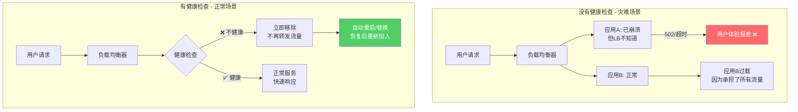
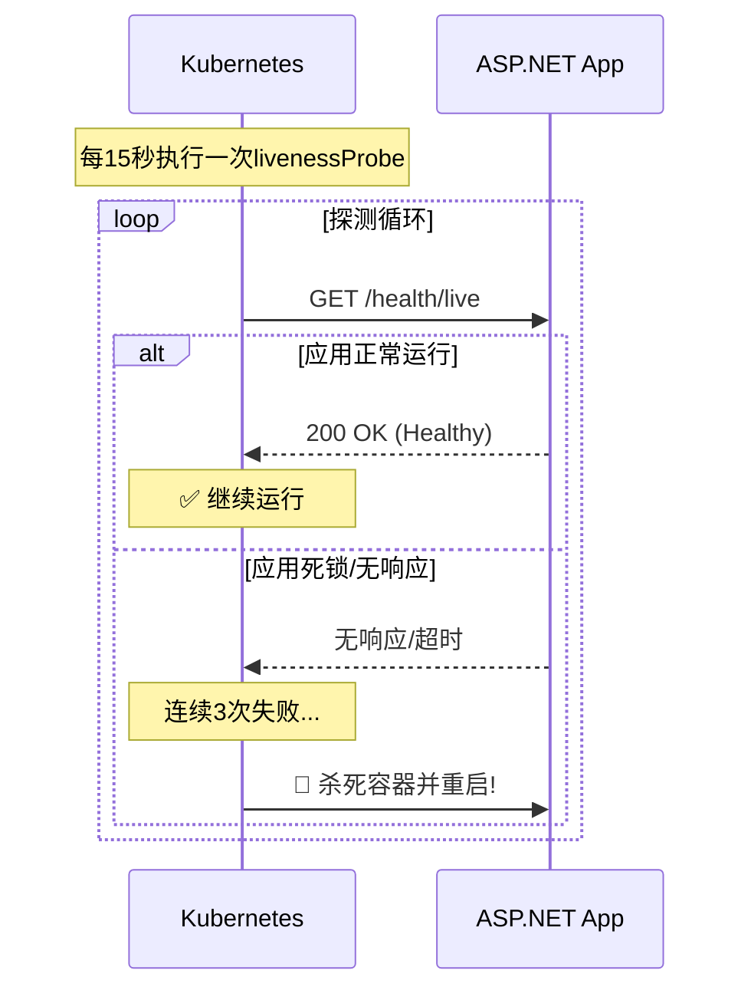
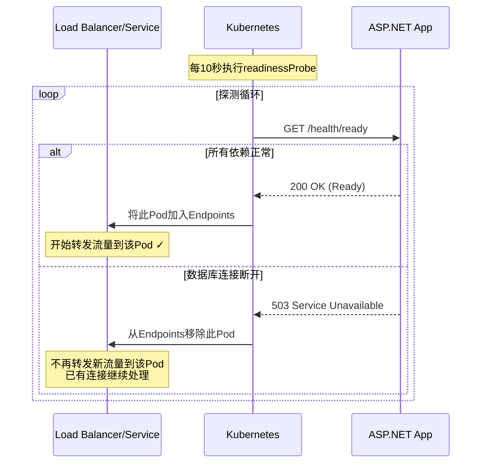
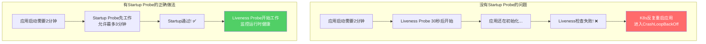
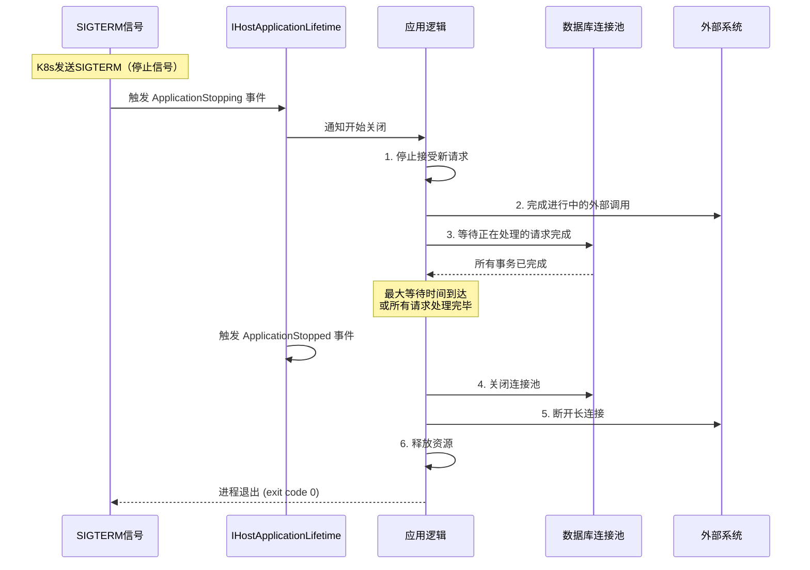
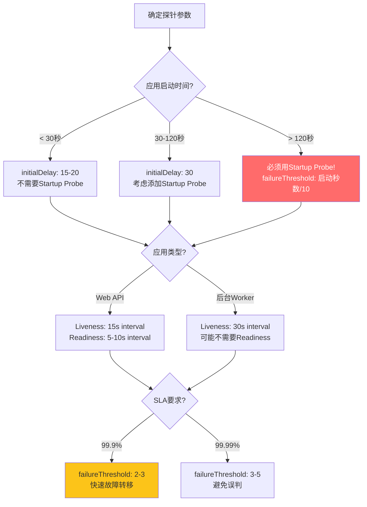

# 健康检查与优雅关闭实战指南

> **标签**：#健康检查 #优雅关闭 #Kubernetes探针 #高可用
> **阅读时间**：约30分钟 | **难度**：⭐⭐⭐⭐
> **前置知识**：[[02-Docker生产环境最佳实践]]、[[05-多环境配置管理]]

---

## 目录

- [一、健康检查的重要性](#一健康检查的重要性)
- [二、ASP.NET Core内置健康检查中间件](#二aspnet-core内置健康检查中间件)
- [三、三种探针类型详解](#三三种探针类型详解)
- [四、自定义健康检查实现](#四自定义健康检查实现)
- [五、健康检查UI界面](#五健康检查ui界面)
- [六、优雅关闭Graceful Shutdown](#六优雅关闭graceful-shutdown)
- [七、Kubernetes集成配置](#七kubernetes集成配置)
- [八、完整示例：5项依赖检查+优雅关闭](#八完整示例5项依赖检查优雅关闭)
- [九、故障排查指南](#九故障排查指南)

---

## 一、健康检查的重要性

### 1.1 为什么生产环境必须要有健康检查



### 1.2 健康检查的核心使用场景

| 场景 | 说明 | 没有健康检查的后果 |
|------|------|-------------------|
| **负载均衡决策** | LB只向健康的实例转发请求 | 流量打到已死的服务，大量错误 |
| **容器编排调度** | K8s根据探针决定Pod生命周期 | 不健康的Pod不被重启或替换 |
| **自动扩缩容** | 基于健康实例数决定是否扩缩 | 扩缩出更多不健康实例 |
| **部署验证** | 部署后验证新版本是否正常 | 将有问题的版本暴露给用户 |
| **蓝绿/金丝雀** | 验证新版本就绪后再切换流量 | 切换到无法工作的版本 |
| **监控告警** | 触发基于健康状态的告警 | 问题发现延迟 |

### 1.3 健康检查 vs 心跳检测

```mermaid
graph LR
    subgraph "心跳 Heartbeat（客户端主动）"
        H1[应用] -->|"定期发送心跳"| H2[监控系统]
        H2 --> H3{"收到心跳?"}
        H3 -->|是| H4[✅ 标记为存活]
        H3 -->|否(超时)| H5[❌ 标记为失联]
    end

    subgraph "健康检查 Health Check（外部探测）"
        C1[监控系统/LB/K8s] -->|"主动探测"| C2[应用]
        C2 --> C3{响应正常?}
        C3 -->|是| C4[✅ 标记为健康]
        C3 -->|否| C5[❌ 标记为不健康]
    end

    style H1 fill:#74c0fc,color:#333
    style C1 fill:#fcc419,color:#333
```

**关键区别**：
- **心跳**：应用主动报告"我还活着"（推模式）
- **健康检查**：外部系统主动询问"你还好吗？"（拉模式）
- ASP.NET Core的Health Checks是**拉模式**的实现

---

## 二、ASP.NET Core内置健康检查中间件

### 2.1 快速入门

```csharp
// Program.cs - 最简单的健康检查
var builder = WebApplication.CreateBuilder(args);

// 注册健康检查服务（最基础版）
builder.Services.AddHealthChecks();

var app = builder.Build();

// 映射健康检查端点
app.MapHealthChecks("/health");

app.Run();
```

访问 `GET /health` 返回：

```
HTTP/1.1 200 OK
Content-Type: text/plain

Healthy
```

### 2.2 完整注册方式

```csharp
// Program.cs - 完整的健康检查配置
using Microsoft.AspNetCore.Diagnostics.HealthChecks;
using Microsoft.Extensions.Diagnostics.HealthChecks;

var builder = WebApplication.CreateBuilder(args);

// ========== 方式1: 最简单注册 ==========
builder.Services.AddHealthChecks();

// ========== 方式2: 添加单个检查项 ==========
builder.Services.AddHealthChecks()
    // 自定义名称和失败状态
    .AddCheck("self", () => HealthCheckResult.Healthy(), tags: new[] { "live" });

// ========== 方式3: 带依赖注入的完整配置 ==========
builder.Services.AddHealthChecks()
    // ---- 存活检查（轻量）----
    .AddCheck("self", () => HealthCheckResult.Healthy("API is alive"), tags: new[] { "live" })

    // ---- 就绪检查（重量）----

    // SQL Server数据库检查
    .AddSqlServer(
        connectionString: builder.Configuration.GetConnectionString("DefaultConnection")!,
        name: "database",
        healthQuery: "SELECT 1;",  // 轻量查询避免性能影响
        failureStatus: HealthStatus.Unhealthy,
        tags: new[] { "ready" },
        timeout: TimeSpan.FromSeconds(5))

    // Redis缓存检查
    .AddRedis(
        redisConnectionString: builder.Configuration["Redis:ConnectionString"] ?? "localhost:6379",
        name: "redis-cache",
        failureStatus: HealthStatus.Degraded,  // Redis降级时应用仍可用
        tags: new[] { "ready" },
        timeout: TimeSpan.FromSeconds(3))

    // ---- 自定义检查 ----
    .AddCheck<DiskSpaceHealthCheck>("disk-space", tags: new[] { "ready" })
    .AddCheck<ExternalApiHealthCheck>("payment-api", tags: new[] { "ready" })
    .AddCheck<MemoryHealthCheck>("memory-pressure", tags: new[] { "live" });

var app = builder.Build();
```

### 2.3 映射多个端点

```csharp
// Program.cs - 多端点映射策略

// ===== 端点1: 存活探针 (Liveness) =====
// 用途: K8s/Docker判断应用进程是否活着
// 特点: 轻量快速，不检查外部依赖
app.MapHealthChecks("/health/live", new HealthCheckOptions
{
    Predicate = check => check.Tags.Contains("live"),
    ResponseWriter = WriteJsonResponse,
    // 结果缓存30秒（避免频繁检查影响性能）
    ResultStatusCodes =
    {
        [HealthStatus.Healthy] = StatusCodes.Status200OK,
        [HealthStatus.Degraded] = StatusCodes.Status200OK,  // 降级也算活着
        [HealthStatus.Unhealthy] = StatusCodes.Status503ServiceUnavailable
    }
});

// ===== 端点2: 就绪探针 (Readiness) =====
// 用途: 判断应用是否准备好接收流量
// 特点: 检查所有关键依赖（DB、Redis等）
app.MapHealthChecks("/health/ready", new HealthCheckOptions
{
    Predicate = check => check.Tags.Contains("ready"),
    ResponseWriter = WriteJsonResponse,
    ResultStatusCodes =
    {
        [HealthStatus.Healthy] = StatusCodes.Status200OK,
        [HealthStatus.Degraded] = StatusCodes.Status200OK,   // 部分降级仍可服务
        [HealthStatus.Unhealthy] = StatusCodes.Status503ServiceUnavailable
    }
});

// ===== 端点3: 启动探针 (Startup) =====
// 用途: 慢启动应用的专用探针
// 特点: 更长的超时容忍时间
app.MapHealthChecks("/health/startup", new HealthCheckOptions
{
    Predicate = _ => true,  // 检查所有项目
    ResponseWriter = WriteJsonResponse,
    ResultStatusCodes =
    {
        [HealthStatus.Healthy] = StatusCodes.Status200OK,
        [HealthStatus.Unhealthy] = StatusCodes.Status503ServiceUnavailable
    }
});

// ===== 端点4: 详细信息端点（受保护）=====
// 用途: 运维人员查看详细状态
// 特点: 包含所有检查项详情、耗时等信息
app.MapHealthChecks("/health/detail", new HealthCheckOptions
{
    Predicate = _ => true,
    ResponseWriter = WriteDetailedJsonResponse,
    AllowCachingResponses = false  // 始终获取最新结果
});

// ===== 端点5: 极简端点（用于LB快速检查）=====
app.MapHealthChecks("/health/ping", new HealthCheckOptions
{
    Predicate = _ => false,  // 不执行任何检查
    ResponseWriter = async (context) =>
    {
        context.Response.ContentType = "text/plain";
        await context.Response.WriteAsync("pong");
    }
});
```

### 2.4 JSON响应格式化器

```csharp
// ===== 健康检查JSON响应格式化器 =====

/// <summary>
/// 标准JSON格式响应（精简版）- 用于探针调用
/// </summary>
static async Task WriteJsonResponse(HttpContext context, HealthReport report)
{
    context.Response.ContentType = "application/json";

    var response = new
    {
        status = report.Status.ToString(),
        totalDurationMs = report.TotalDuration.TotalMilliseconds.ToString("F2"),
        timestamp = DateTime.UtcNow.ToString("o")
    };

    await context.Response.WriteAsJsonAsync(response);
}

/// <summary>
/// 详细JSON格式响应 - 用于人工查看和调试
/// </summary>
static async Task WriteDetailedJsonResponse(HttpContext context, HealthReport report)
{
    context.Response.ContentType = "application/json";

    var checks = report.Entries.Select(entry => new
    {
        name = entry.Key,
        status = entry.Value.Status.ToString(),
        durationMs = entry.Value.Duration.TotalMilliseconds.ToString("F2"),
        description = entry.Value.Description ?? "",
        error = entry.Value.Exception?.Message,
        data = entry.Value.Data.ToDictionary(
            d => d.Key,
            d => d.Value?.ToString() ?? ""),
        tags = entry.Value.Tags.ToArray()
    }).OrderBy(c => c.name);

    var response = new
    {
        status = report.Status.ToString(),
        totalDurationMs = report.TotalDuration.TotalMilliseconds.ToString("F2"),
        timestamp = DateTime.UtcNow.ToString("o"),
        checks = checks,
        summary = new
        {
            total = report.Entries.Count,
            healthy = report.Entries.Count(e => e.Value.Status == HealthStatus.Healthy),
            degraded = report.Entries.Count(e => e.Value.Status == HealthStatus.Degraded),
            unhealthy = report.Entries.Count(e => e.Value.Status == HealthStatus.Unhealthy)
        }
    };

    var options = new System.Text.Json.JsonSerializerOptions
    {
        WriteIndented = true,
        PropertyNamingPolicy = System.Text.Json.JsonNamingPolicy.CamelCase
    };

    await context.Response.WriteAsJsonAsync(response, options);
}
```

---

## 三、三种探针类型详解

### 3.1 Liveness Probe（存活探针）



**核心要点**：

| 属性 | 推荐值 | 说明 |
|------|--------|------|
| 检查路径 | `/health/live` | 只检查自身是否存活 |
| 检查间隔 | 10-15秒 | 太频繁浪费资源 |
| 超时时间 | 2-5秒 | 必须小于间隔 |
| 失败阈值 | 3次 | 连续3次失败才重启 |
| 成功阈值 | 1次 | 一次成功即可标记健康 |
| 初始延迟 | 30-60秒 | 给应用足够的启动时间 |

### 3.2 Readiness Probe（就绪探针）



**核心要点**：

| 属性 | 推荐值 | 说明 |
|------|--------|------|
| 检查路径 | `/health/ready` | 检查所有关键依赖 |
| 检查间隔 | 5-10秒 | 比liveness更频繁 |
| 超时时间 | 3-10秒 | 外部依赖可能慢 |
| 失败阈值 | 3次 | 从Service摘除 |
| 初始延迟 | 10-20秒 | 可以比liveness短 |

### 3.3 Startup Probe（启动探针）



**适用场景**：
- 应用启动时间长（如预加载大量数据、编译视图）
- 依赖的外部服务启动较慢
- 首次请求需要预热（JIT编译、连接池初始化）

---

## 四、自定义健康检查实现

### 4.1 数据库连接健康检查

```csharp
// HealthChecks/DatabaseHealthCheck.cs
using Microsoft.Extensions.Diagnostics.HealthChecks;

public class DatabaseHealthCheck : IHealthCheck
{
    private readonly IDbConnection _dbConnection;
    private readonly string _connectionString;
    private readonly ILogger<DatabaseHealthCheck> _logger;

    public DatabaseHealthCheck(
        IConfiguration config,
        ILogger<DatabaseHealthCheck> logger)
    {
        _connectionString = config.GetConnectionString("DefaultConnection")
            ?? throw new ArgumentNullException(nameof(config));
        _logger = logger;
    }

    public async Task<HealthCheckResult> CheckHealthAsync(
        HealthCheckContext context,
        CancellationToken cancellationToken = default)
    {
        try
        {
            var stopwatch = Stopwatch.StartNew();

            using var connection = new SqlConnection(_connectionString);
            await connection.OpenAsync(cancellationToken);

            // 执行轻量级查询
            using var command = connection.CreateCommand();
            command.CommandText = "SELECT 1;";
            var result = await command.ExecuteScalarAsync(cancellationToken);

            stopwatch.Stop();

            var data = new Dictionary<string, object>
            {
                { "responseTimeMs", stopwatch.ElapsedMilliseconds },
                { "serverVersion", connection.ServerVersion ?? "unknown" },
                { "database", connection.Database },
                { "dataSource", connection.DataSource }
            };

            _logger.LogDebug("数据库健康检查完成, 耗时{ElapsedMs}ms", stopwatch.ElapsedMilliseconds);

            return HealthCheckResult.Healthy(
                description: $"数据库连接正常 (耗时{stopwatch.ElapsedMilliseconds}ms)",
                data: data);
        }
        catch (SqlException ex) when (ex.Number == 53 || ex.Number == 2)
        {
            // 连接相关的错误
            _logger.LogWarning(ex, "数据库连接失败: {Message}", ex.Message);
            return HealthCheckResult.Unhealthy(
                description: "无法连接到数据库服务器",
                exception: ex,
                data: new { error = ex.Message, sqlErrorNumber = ex.Number });
        }
        catch (SqlException ex)
        {
            // 查询执行错误
            _logger.LogWarning(ex, "数据库查询异常: {Message}", ex.Message);
            return HealthCheckResult.Degraded(
                description: "数据库可连接但查询异常",
                exception: ex);
        }
        catch (Exception ex)
        {
            _logger.LogError(ex, "数据库健康检查未知错误");
            return HealthCheckResult.Unhealthy(
                description: "数据库健康检查发生未预期错误",
                exception: ex);
        }
    }
}
```

### 4.2 Redis连接健康检查

```csharp
// HealthChecks/RedisHealthCheck.cs
using StackExchange.Redis;

public class RedisHealthCheck : IHealthCheck
{
    private readonly IConnectionMultiplexer _redis;
    private readonly ILogger<RedisHealthCheck> _logger;

    public RedisHealthCheck(IConnectionMultiplexer redis, ILogger<RedisHealthCheck> logger)
    {
        _redis = redis;
        _logger = logger;
    }

    public async Task<HealthCheckResult> CheckHealthAsync(
        HealthCheckContext context,
        CancellationToken cancellationToken = default)
    {
        try
        {
            if (!_redis.IsConnected)
            {
                return HealthCheckResult.Unhealthy(description: "Redis连接已断开");
            }

            var db = _redis.GetDatabase();
            var stopwatch = Stopwatch.StartNew;

            // Ping测试 + 写入读取测试
            var pingResult = await db.PingAsync();
            var testKey = "health-check-test";
            await db.StringSetAsync(testKey, "ok", TimeSpan.FromSeconds(5));
            var value = await db.StringGetAsync(testKey);
            await db.KeyDeleteAsync(testKey);

            stopwatch.Stop();

            var serverInfo = _redis.GetServers().FirstOrDefault();
            var info = serverInfo != null ? await serverInfo.InfoAsync() : null;

            var data = new Dictionary<string, object>
            {
                { "pingMs", pingResult.TotalMilliseconds },
                { "totalTimeMs", stopwatch.ElapsedMilliseconds },
                { "isConnected", _redis.IsConnected },
                { "clientCount", _redis.GetCounters().TotalOutstanding }
            };

            if (info != null && info.TryGetValue("connected_clients", out var clients))
            {
                data["connectedClients"] = clients;
            }

            return HealthCheckResult.Healthy(
                description: $"Redis正常运行 (Ping:{pingResult.TotalMilliseconds:F1}ms)",
                data: data);
        }
        (RedisConnectionException ex)
        {
            _logger.LogWarning(ex, "Redis连接异常");
            return HealthCheckResult.Unhealthy(
                description: "无法连接到Redis",
                exception: ex);
        }
        catch (Exception ex)
        {
            _logger.LogError(ex, "Redis健康检查异常");
            return HealthCheckResult.Unhealthy(exception: ex);
        }
    }
}
```

### 4.3 外部API依赖健康检查

```csharp
// HealthChecks/ExternalApiHealthCheck.cs
using System.Net.Http.Headers;

public class ExternalApiHealthCheck : IHealthCheck
{
    private readonly HttpClient _httpClient;
    private readonly string _apiName;
    private readonly string _healthUrl;
    private readonly int _timeoutSeconds;
    private readonly ILogger<ExternalApiHealthCheck> _logger;

    public ExternalApiHealthCheck(
        HttpClient httpClient,
        string apiName,
        string healthUrl,
        int timeoutSeconds = 5,
        ILogger<ExternalApiHealthCheck> logger)
    {
        _httpClient = httpClient;
        _apiName = apiName;
        _healthUrl = healthUrl;
        _timeoutSeconds = timeoutSeconds;
        _logger = logger;
    }

    public async Task<HealthCheckResult> CheckHealthAsync(
        HealthCheckContext context,
        CancellationToken cancellationToken = default)
    {
        try
        {
            using var cts = CancellationTokenSource.CreateLinkedTokenSource(cancellationToken);
            cts.CancelAfter(TimeSpan.FromSeconds(_timeoutSeconds));

            var request = new HttpRequestMessage(HttpMethod.Get, _healthUrl);
            request.Headers.Accept.Add(new MediaTypeWithQualityHeaderValue("application/json"));
            request.Headers.UserAgent.ParseAdd("MyApi-HealthCheck/1.0");

            var stopwatch = Stopwatch.StartNew();
            var response = await _httpClient.SendAsync(request, cts.Token);
            stopwatch.Stop();

            var content = string.Empty;
            if (response.Content.Headers.ContentLength > 0 &&
                response.Content.Headers.ContentLength.Value < 10240) // 小于10KB才读内容
            {
                content = await response.Content.ReadAsStringAsync(cts.Token);
            }

            var data = new Dictionary<string, object>
            {
                { "apiName", _apiName },
                { "url", _healthUrl },
                { "statusCode", (int)response.StatusCode },
                { "responseTimeMs", stopwatch.ElapsedMilliseconds },
                { "timeoutSeconds", _timeoutSeconds }
            };

            if (response.IsSuccessStatusCode)
            {
                return HealthCheckResult.Healthy(
                    description: $"{_apiName} API 可用 ({stopwatch.ElapsedMilliseconds:F0}ms)",
                    data: data);
            }

            // HTTP错误但服务可达
            if ((int)response.StatusCode >= 400 && (int)response.StatusCode < 500)
            {
                return HealthCheckResult.Degraded(
                    description: $"{_apiName} API 返回 {(int)response.StatusCode}",
                    data: data);
            }

            // 服务端错误
            return HealthCheckResult.Unhealthy(
                description: $"{_apiName} API 返回 {(int)response.StatusCode}",
                data: data);
        }
        catch (TaskCanceledException) when (!cancellationToken.IsCancellationRequested)
        {
            _logger.LogWarning("{ApiName} API 健康检查超时 (>{Timeout}s)", _apiName, _timeoutSeconds);
            return HealthCheckResult.Unhealthy(
                description: $"{_apiName} API 响应超时 (> {_timeoutSeconds}s)");
        }
        catch (HttpRequestException ex)
        {
            _logger.LogWarning(ex, "{ApiName} API 无法连接", _apiName);
            return HealthCheckResult.Unhealthy(
                description: $"无法连接到 {_apiName} API: {ex.InnerException?.Message ?? ex.Message}",
                exception: ex);
        }
        catch (Exception ex)
        {
            _logger.LogError(ex, "{ApiName} API 健康检查异常", _apiName);
            return HealthCheckResult.Unhealthy(exception: ex);
        }
    }
}

// 注册时的DI配置
// Program.cs:
builder.Services.AddHttpClient<ExternalApiHealthCheck>(nameof(PaymentApi))
    .ConfigurePrimaryHttpMessageHandler(handler =>
    {
        handler.MaxAutomaticRedirections = 2;
        handler.AutomaticDecompression = DecompressionMethods.GZip | DecompressionMethods.Deflate;
    });
```

### 4.4 磁盘空间健康检查

```csharp
// HealthChecks/DiskSpaceHealthCheck.cs
public class DiskSpaceHealthCheck : IHealthCheck
{
    private readonly long _minFreeBytes;
    private readonly string? _path;
    private readonly ILogger<DiskSpaceHealthCheck> _logger;

    /// <param name="minFreeMB">最小剩余空间(MB)</param>
    /// <param name="path">检查路径，默认为应用根目录</param>
    public DiskSpaceHealthCheck(
        IConfiguration config,
        ILogger<DiskSpaceHealthCheck> logger)
    {
        _minFreeBytes = config.GetValue<long>("HealthChecks:DiskMinFreeMB", 1024) * 1024 * 1024; // 默认1GB
        _path = config["HealthChecks:DiskPath"];
        _logger = logger;
    }

    public Task<HealthCheckResult> CheckHealthAsync(
        HealthCheckContext context,
        CancellationToken cancellationToken = default)
    {
        try
        {
            var pathToCheck = _path ?? AppDomain.CurrentDomain.BaseDirectory;
            var driveInfo = new DriveInfo(pathToCheck);

            if (!driveInfo.IsReady)
            {
                return Task.FromResult(HealthCheckResult.Unhealthy(
                    description: $"磁盘 {driveInfo.Name} 未就绪"));
            }

            var freeBytes = driveInfo.AvailableFreeSpace;
            var totalBytes = driveInfo.TotalSize;
            var usedPercent = (double)(totalBytes - freeBytes) / totalBytes * 100;
            var freeMB = freeBytes / 1024 / 1024;
            var totalMB = totalBytes / 1024 / 1024;

            var data = new Dictionary<string, object>
            {
                { "freeMB", freeMB },
                { "totalMB", totalMB },
                { "usedPercent", Math.Round(usedPercent, 1) },
                { "driveName", driveInfo.Name },
                { "driveFormat", driveInfo.DriveFormat },
                { "minRequiredMB", _minFreeBytes / 1024 / 1024 }
            };

            if (freeBytes < _minFreeBytes)
            {
                _logger.LogWarning(
                    "磁盘空间不足: 剩余{FreeMB}MB, 要求至少{RequiredMB}MB",
                    freeMB, _minFreeBytes / 1024 / 1024);

                return Task.FromResult(HealthCheckResult.Unhealthy(
                    description: $"磁盘空间不足: 剩余{freeMB:F0}MB (要求{_minFreeBytes / 1024 / 1024}MB), 使用率{usedPercent:F1}%",
                    data: data));
            }

            // 使用率超过85%时返回Degraded
            if (usedPercent > 85)
            {
                return Task.FromResult(HealthCheckResult.Degraded(
                    description: $"磁盘空间紧张: 剩余{freeMB:F0}MB, 使用率{usedPercent:F1}%",
                    data: data));
            }

            return Task.FromResult(HealthCheckResult.Healthy(
                description: $"磁盘空间充足: 剩余{freeMB:F0}MB / 总共{totalMB:F0}MB ({usedPercent:F1}%使用)",
                data: data));
        }
        catch (Exception ex)
        {
            _logger.LogError(ex, "磁盘空间检查异常");
            return Task.FromResult(HealthCheckResult.Unhealthy(
                description: "磁盘空间检查发生异常",
                exception: ex));
        }
    }
}
```

### 4.5 内存压力健康检查

```csharp
// HealthChecks/MemoryHealthCheck.cs
public class MemoryHealthCheck : IHealthCheck
{
    private readonly long _thresholdBytes;
    private readonly ILogger<MemoryHealthCheck> _logger;

    /// <param name="thresholdMB">内存使用率阈值(MB)，超过则报告Unhealthy</param>
    public MemoryHealthCheck(IConfiguration config, ILogger<MemoryHealthCheck> logger)
    {
        _thresholdBytes = config.GetValue<long>("HealthChecks:MemoryThresholdMB", 512) * 1024 * 1024;
        _logger = logger;
    }

    public Task<HealthCheckResult> CheckHealthAsync(
        HealthCheckContext context,
        CancellationToken cancellationToken = default)
    {
        var allocated = GC.GetTotalMemory(false);
        var gen0Collections = GC.CollectionCount(0);
        var gen1Collections = GC.CollectionCount(1);
        var gen2Collections = GC.CollectionCount(2);

        var data = new Dictionary<string, object>
        {
            { "allocatedMB", allocated / 1024 / 1024 },
            { "thresholdMB", _thresholdBytes / 1024 / 1024 },
            { "gen0Collections", gen0Collections },
            { "gen1Collections", gen1Collections },
            { "gen2Collections", gen2Collections }
        };

        var status = allocated <= _thresholdBytes ? HealthCheckResult.Healthy :
                     allocated <= _thresholdBytes * 1.5 ? HealthCheckResult.Degraded :
                     HealthCheckResult.Unhealthy;

        var description = status.Status switch
        {
            HealthStatus.Healthy => $"内存使用正常: {allocated / 1024 / 1024}MB",
            HealthStatus.Degraded => $"内存使用偏高: {allocated / 1024 / 1024}MB (阈值{_thresholdBytes / 1024 / 1024}MB)",
            _ => $"内存使用过高: {allocated / 1024 / 1024}MB (阈值{_thresholdBytes / 1024 / 1024}MB)"
        };

        return Task.FromResult(new HealthCheckResult(status, description, data: data));
    }
}
```

---

## 五、健康检查UI界面

### 5.1 AspNetCore.HealthChecks.UI 配置

```bash
# 安装NuGet包
dotnet add package AspNetCore.HealthChecks.UI
dotnet add package AspNetCore.HealthChecks.UI.Client
dotnet add package AspNetCore.HealthChecks.UI.InMemory.Storage
```

```csharp
// Program.cs - 健康检查UI配置
var builder = WebApplication.CreateBuilder(args);

builder.Services.AddHealthChecks()
    // ... 各种检查项 ...

// 添加UI服务
builder.Services.AddHealthChecksUI(settings =>
{
    // UI资源路径
    settings.SetApiMaxActiveRequests(1);

    // 结果评估时间（多久刷新一次结果）
    settings.SetEvaluationTimeInSeconds(15);

    // 历史记录保留天数
    settings.SetMinimumHistoryDurationInSeconds(300);

    // UI页面标题
    settings.AddHealthCheckEndpoint("基本检查", "/health");
    settings.AddHealthCheckEndpoint("存活检查", "/health/live");
    settings.AddHealthCheckEndpoint("就绪检查", "/health/ready");

    // 使用内存存储（开发/小规模）
    settings.UseInMemoryStorage();
});

var app = builder.Build();

// UI端点
app.MapHealthChecksUI(options =>
{
    options.UIPath = "/health-ui";           // UI访问路径
    options.ApiPath = "/health-ui-api";      // API数据路径
    options.CustomStylesheetPath = "/css/health-checks-custom.css";  // 自定义样式
});

// 只在开发环境启用UI
if (app.Environment.IsDevelopment())
{
    app.MapHealthChecksUI();
}

// 生产环境需要认证才能访问
if (app.Environment.IsProduction())
{
    app.MapHealthChecksUI()
        .RequireAuthorization();  // 需要认证
}
```

### 5.2 自定义UI样式

```css
/* wwwroot/css/health-checks-custom.css */

/* 整体主题色 */
.health-checks-ui {
    --primary-color: #2563eb;
    --success-color: #16a34a;
    --warning-color: #ca8a04;
    --danger-color: #dc2626;
}

/* 卡片样式 */
.health-checks-ui .hc-card {
    border-radius: 12px;
    box-shadow: 0 4px 6px -1px rgba(0, 0, 0, 0.1);
    transition: transform 0.2s ease, box-shadow 0.2s ease;
}

.health-checks-ui .hc-card:hover {
    transform: translateY(-2px);
    box-shadow: 0 10px 15px -3px rgba(0, 0, 0, 0.1);
}

/* 状态标签 */
.health-checks-ui .hc-badge-success {
    background-color: var(--success-color);
    color: white;
    padding: 4px 12px;
    border-radius: 9999px;
    font-weight: 600;
    font-size: 0.75rem;
}

.health-checks-ui .hc-badge-warning {
    background-color: var(--warning-color);
    color: white;
}

.health-checks-ui .hc-badge-danger {
    background-color: var(--danger-color);
    color: white;
    animation: pulse 2s infinite;
}

@keyframes pulse {
    0%, 100% { opacity: 1; }
    50% { opacity: 0.7; }
}

/* 时间线 */
.health-checks-ui .hc-timeline-item {
    position: relative;
    padding-left: 24px;
}

.health-checks-ui .hc-timeline-item::before {
    content: '';
    position: absolute;
    left: 0;
    top: 8px;
    width: 8px;
    height: 8px;
    border-radius: 50%;
    background-color: var(--success-color);
}
```

---

## 六、优雅关闭Graceful Shutdown

### 6.1 什么是优雅关闭



### 6.2 完整的优雅关闭实现

```csharp
// Program.cs - 优雅关闭完整实现
using Microsoft.AspNetCore.Hosting.Server.Features;

var builder = WebApplication.CreateBuilder(args);

// ... 其他服务注册 ...

// 注册应用生命周期事件
builder.Services.AddSingleton<IHostedService, GracefulShutdownService>();

var app = builderBuild();

// ===== 优雅关闭中间件 =====
app.UseMiddleware<GracefulShutdownMiddleware>();

app.Run();

// ==========================================
// GracefulShutdownService.cs - 后台服务处理关闭事件
// ==========================================

public class GracefulShutdownService : IHostedService
{
    private readonly IHostApplicationLifetime _lifetime;
    private readonly ILogger<GracefulShutdownService> _logger;
    private readonly IServiceScopeFactory _scopeFactory;

    public GracefulShutdownService(
        IHostApplicationLifetime lifetime,
        ILogger<GracefulShutdownService> logger,
        IServiceScopeFactory scopeFactory)
    {
        _lifetime = lifetime;
        _logger = logger;
        _scopeFactory = scopeFactory;
    }

    public Task StartAsync(CancellationToken cancellationToken)
    {
        // 注册ApplicationStopping事件
        _lifetime.ApplicationStopping.Register(OnStopping);
        // 注册ApplicationStopped事件
        _lifetime.ApplicationStopped.Register(OnStopped);

        _logger.LogInformation("优雅关闭服务已注册");
        return Task.CompletedTask;
    }

    public Task StopAsync(CancellationToken cancellationToken)
    {
        return Task.CompletedTask;
    }

    private void OnStopping()
    {
        _logger.LogWarning("========================================");
        _logger.LogWarning("  🛑 应用正在关闭...");
        _logger.LogWarning("  开始执行清理操作");
        _logger.LogWarning("========================================");
    }

    private void OnStopped()
    {
        _logger.LogInformation("========================================");
        _logger.LogInformation("  ✅ 应用已完全关闭");
        _logger.LogInformation("  所有资源已释放");
        _logger.LogInformation("========================================");
    }
}

// ==========================================
// GracefulShutdownMiddleware.cs - 中间件
// ==========================================

public class GracefulShutdownMiddleware
{
    private readonly RequestDelegate _next;
    private readonly IHostApplicationLifetime _lifetime;
    private readonly ILogger<GracefulShutdownMiddleware> _logger;
    private static volatile bool _shuttingDown = false;
    private static readonly object _lock = new();

    public GracefulShutdownMiddleware(
        RequestDelegate next,
        IHostApplicationLifetime lifetime,
        ILogger<GracefulShutdownMiddleware> logger)
    {
        _next = next;
        _lifetime = lifetime;
        _logger = logger;
    }

    public async Task InvokeAsync(HttpContext context)
    {
        // 检查是否正在关闭
        lock (_lock)
        {
            if (_shuttingDown)
            {
                _logger.LogInformation("拒绝新请求: 应用正在关闭中 (Path: {Path})", context.Request.Path);

                context.Response.StatusCode = StatusCodes.Status503ServiceUnavailable;
                context.Response.Headers["Connection"] = "close";
                context.Response.Headers["Retry-After"] = "5";

                await context.Response.WriteAsJsonAsync(new
                {
                    error = "ServiceUnavailable",
                    message = "服务正在维护中，请稍后重试",
                    timestamp = DateTime.UtcNow.ToString("o")
                });
                return;
            }
        }

        // 监听ApplicationStopping事件
        using var stoppingRegistration = _lifetime.ApplicationStopping.Register(() =>
        {
            lock (_lock)
            {
                _shuttingDown = true;
            }
            _logger.LogWarning("设置关闭标志: 新请求将被拒绝");
        });

        // 记录活跃请求
        var requestId = context.TraceIdentifier;
        _logger.LogDebug("开始处理请求: {RequestId} {Method} {Path}", requestId, context.Request.Method, context.Request.Path);

        try
        {
            await _next(context);
        }
        finally
        {
            _logger.LogDebug("请求处理完成: {RequestId} {StatusCode}", requestId, context.Response.StatusCode);
        }
    }
}
```

### 6.3 资源清理示例

```csharp
// Services/CleanupService.cs - 关闭时资源清理
public class CleanupService : IHostedService, IDisposable
{
    private readonly IServiceProvider _serviceProvider;
    private readonly ILogger<CleanupService> _logger;
    private Timer? _cleanupTimer;
    private readonly List<IDisposable> _disposables = new();
    private CancellationTokenSource? _shutdownCts;

    public CleanupService(IServiceProvider serviceProvider, ILogger<CleanupService> logger)
    {
        _serviceProvider = serviceProvider;
        _logger = logger;
    }

    public Task StartAsync(CancellationToken cancellationToken)
    {
        // 定期清理任务（每5分钟）
        _cleanupTimer = new Timer(CleanupCallback, null, TimeSpan.FromMinutes(5), TimeSpan.FromMinutes(5));

        _logger.LogInformation("清理服务已启动");
        return Task.CompletedTask;
    }

    private void CleanupCallback(object? state)
    {
        try
        {
            // 定期清理临时文件等
            CleanTempFiles();
        }
        catch (Exception ex)
        {
            _logger.LogError(ex, "定期清理任务出错");
        }
    }

    public async Task StopAsync(CancellationToken cancellationToken)
    {
        _logger.LogInformation("开始执行关闭清理...");

        _shutdownCts = CancellationTokenSource.CreateLinkedTokenSource(cancellationToken);
        _shutdownCts.CancelAfter(TimeSpan.FromSeconds(30)); // 最多等待30秒

        // 停止定时任务
        _cleanupTimer?.Change(Timeout.Infinite, Timeout.Infinite);

        // 创建作用域以获取scoped服务
        using var scope = _serviceProvider.CreateScope();

        // 1. 等待进行中的操作完成
        await WaitForPendingOperations(scope, _shutdownCts.Token);

        // 2. 关闭数据库连接池
        await CloseDatabaseConnections(scope);

        // 3. 清理临时文件
        CleanTempFiles();

        // 4. 取消注册的长轮询/SSE连接
        CancelActiveStreams();

        // 5. 释放所有Disposable资源
        foreach (var disposable in _disposables)
        {
            try
            {
                disposable.Dispose();
            }
            catch (Exception ex)
            {
                _logger.LogWarning(ex, "释放资源时出错");
            }
        }

        _logger.LogInformation("关闭清理完成");
    }

    private async Task WaitForPendingOperations(IServiceScope scope, CancellationToken token)
    {
        _logger.LogInformation("等待进行中的操作完成...");

        // 示例: 等待消息队列消费者完成当前消息处理
        // var messageConsumer = scope.ServiceProvider.GetRequiredService<IMessageConsumer>();
        // await messageConsumer.GracefulStopAsync(token);

        await Task.Delay(100, token); // 给一点缓冲时间
        _logger.LogInformation("操作等待完成");
    }

    private async Task CloseDatabaseConnections(IServiceScope scope)
    {
        _logger.LogInformation("关闭数据库连接...");

        try
        {
            var dbContext = scope.ServiceProvider.GetService<AppDbContext>();
            if (dbContext != null)
            {
                await dbContext.Database.CloseConnectionAsync();
                _logger.LogInformation("数据库主连接已关闭");
            }
        }
        catch (Exception ex)
        {
            _logger.LogWarning(ex, "关闭数据库连接时出错");
        }
    }

    private void CleanTempFiles()
    {
        try
        {
            var tempDir = Path.Combine(Path.GetTempPath(), "myapi-temp");
            if (Directory.Exists(tempDir))
            {
                var files = Directory.GetFiles(tempDir, "*", SearchOption.AllDirectories);
                foreach (var file in files)
                {
                    var fileInfo = new FileInfo(file);
                    if (fileInfo.CreationTimeUtc < DateTime.UtcNow.AddHours(-1)) // 1小时前的临时文件
                    {
                        File.Delete(file);
                    }
                }
                _logger.LogInformation("临时文件清理完成");
            }
        }
        catch (Exception ex)
        {
            _logger.LogWarning(ex, "清理临时文件时出错");
        }
    }

    private void CancelActiveStreams()
    {
        _logger.LogDebug("取消活跃的流式连接");
        // 实现取决于你的SSE/WebSocket实现
    }

    public void Dispose()
    {
        _cleanupTimer?.Dispose();
        _shutdownCts?.Dispose();
    }
}
```

### 6.4 CancellationToken正确传播

```csharp
// Controllers/BaseApiController.cs - 带取消令牌的基础控制器
[ApiController]
[Route("api/[controller]")]
public abstract class BaseApiController : ControllerBase
{
    protected readonly ILogger _logger;

    protected BaseApiController(ILogger logger)
    {
        _logger = logger;
    }

    /// <summary>
    /// 获取合并后的CancellationToken（优先使用请求取消令牌）
    /// </summary>
    protected CancellationToken GetMergedCancellationToken(CancellationToken ct = default)
    {
        // 合并请求级别的token和应用关闭的token
        return CancellationTokenSource.CreateLinkedTokenSource(ct, HttpContext.RequestAborted).Token;
    }

    /// <summary>
    /// 安全地执行长时间操作（支持取消）
    /// </summary>
    protected async Task<IActionResult> ExecuteLongRunningOperation<T>(
        Func<CancellationToken, Task<T>> operation,
        int timeoutSeconds = 30)
    {
        var cts = CancellationTokenSource.CreateLinkedTokenSource(
            HttpContext.RequestAborted);

        cts.CancelAfter(TimeSpan.FromSeconds(timeoutSeconds));

        try
        {
            var result = await operation(cts.Token);
            return Ok(result);
        }
        catch (OperationCanceledException) when (HttpContext.RequestAborted.IsCancellationRequested)
        {
            _logger.LogWarning("请求被客户端取消: {Method} {Path}", Request.Method, Request.Path);
            return StatusCode(StatusCodes.Status499ClientClosedRequest); // 自定义非标准状态码
        }
        catch (OperationCanceledException)
        {
            _logger.LogWarning("操作超时: {Method} {Path}", Request.Method, Request.Path);
            return StatusCode(StatusCodes.Status504GatewayTimeout);
        }
    }
}

// 具体控制器使用示例
[ApiController]
[Route("api/[controller]")]
public class ReportsController : BaseApiController
{
    private readonly IReportService _reportService;

    public ReportsController(IReportService reportService, ILogger<ReportsController> logger)
        : base(logger)
    {
        _reportService = reportService;
    }

    [HttpGet("monthly/{year}/{month}")]
    public async Task<IActionResult> GetMonthlyReport(int year, int month)
    {
        return await ExecuteLongRunningOperation(async ct =>
        {
            // 操作内部传播CancellationToken
            var report = await _reportService.GenerateMonthlyReportAsync(year, month, ct);
            return report;
        }, timeoutSeconds: 120); // 月度报表可能需要更长时间
    }
}

// Service层传播CancellationToken
public class ReportService : IReportService
{
    public async Task<MonthlyReport> GenerateMonthlyReportAsync(
        int year, int month, CancellationToken ct)
    {
        // 传递给数据库查询
        var orders = await _dbContext.Orders
            .Where(o => o.CreatedAt.Year == year && o.CreatedAt.Month == month)
            .ToListAsync(ct);

        // 传递给HTTP调用
        var userData = await _httpClient.GetAsync($"api/users/stats?month={month}", ct);

        // 传递给文件操作
        using var stream = new FileStream(path, FileMode.Create, FileAccess.Write, FileShare.None, 4096, true);
        await stream.WriteAsync(data, 0, data.Length, ct);

        return new MonthlyReport { /* ... */ };
    }
}
```

---

## 七、Kubernetes集成配置

### 7.1 完整Deployment YAML

```yaml
# k8s/deployment-with-probes.yaml
apiVersion: apps/v1
kind: Deployment
metadata:
  name: myapi
  namespace: production
spec:
  replicas: 3
  selector:
    matchLabels:
      app: myapi
  template:
    metadata:
      labels:
        app: myapi
      annotations:
        prometheus.io/scrape: "true"
        prometheus.io/port: "8080"
        prometheus.io/path: "/metrics"
    spec:
      terminationGracePeriodSeconds: 60  # ★ 优雅关闭总时长
      containers:
      - name: myapi
        image: myregistry.azurecr.io/myapi:v1.2.0
        ports:
        - containerPort: 8080
          protocol: TCP

        env:
        - name: ASPNETCORE_ENVIRONMENT
          value: "Production"
        - name: DOTNET_SHUTDOWN_TIMEOUT_SECONDS
          value: "60"  # ★ 匹配terminationGracePeriodSeconds

        # ==================== Liveness Probe ====================
        livenessProbe:
          httpGet:
            path: /health/live
            port: 8080
            httpHeaders:
            - name: X-Probe-Type
              value: liveness
          initialDelaySeconds: 30     # 启动后30秒开始探测
          periodSeconds: 15           # 每15秒探测一次
          timeoutSeconds: 5           # 单次超时5秒
          failureThreshold: 3         # 连续3次失败=重启
          successThreshold: 1         # 1次成功=健康
          terminationMessagePath: /dev/termination-log

        # ==================== Readiness Probe ====================
        readinessProbe:
          httpGet:
            path: /health/ready
            port: 8080
            httpHeaders:
            - name: X-Probe-Type
              value: readiness
          initialDelaySeconds: 10     # 较早开始就绪检查
          periodSeconds: 10           # 更频繁检查
          timeoutSeconds: 5
          failureThreshold: 3         # 连续3次失败=从Service移除
          successThreshold: 1

        # ==================== Startup Probe ====================
        startupProbe:
          httpGet:
            path: /health/startup
            port: 8080
          initialDelaySeconds: 0      # 立即开始
          periodSeconds: 10
          timeoutSeconds: 5
          failureThreshold: 18        # 允许最多180秒(18*10)的启动时间
          successThreshold: 1

        # ==================== 资源限制 ====================
        resources:
          requests:
            cpu: "250m"
            memory: "256Mi"
          limits:
            cpu: "1000m"
            memory: "512Mi"

        # ==================== 生命周期钩子 ====================
        lifecycle:
          preStop:
            exec:
              command:
                - /bin/sh
                - -c
                - |
                  echo "=== PreStop Hook Started ===" >> /tmp/lifecycle.log
                  # 通知应用即将关闭（如果应用支持）
                  curl -s -X POST http://localhost:8080/api/lifecycle/shutting-down || true
                  # 等待一小段时间让应用开始拒绝新请求
                  sleep 5
                  echo "=== PreStop Hook Completed ===" >> /tmp/lifecycle.log

        # ==================== 安全上下文 ====================
        securityContext:
          allowPrivilegeEscalation: false
          readOnlyRootFilesystem: true
          runAsNonRoot: true
          runAsUser: 10001
          capabilities:
            drop:
            - ALL

        volumeMounts:
        - name: tmp
          mountPath: /tmp
        - name: app-temp
          mountPath: /app/temp

      volumes:
      - name: tmp
        emptyDir: {}
      - name: app-temp
        emptyDir: {}
---
apiVersion: v1
kind: Service
metadata:
  name: myapi-service
  namespace: production
  annotations:
    service.beta.kubernetes.io/aws-load-balancer-type: nlb
spec:
  selector:
    app: myapi
  ports:
  - name: http
    port: 80
    targetPort: 8080
    protocol: TCP
  type: ClusterIP
---
apiVersion: policy/v1
kind: PodDisruptionBudget
metadata:
  name: myapi-pdb
  namespace: production
spec:
  minAvailable: 2       # 至少保持2个可用Pod
  selector:
    matchLabels:
      app: myapi
```

### 7.2 探针参数调优指南



---

## 八、完整示例：5项依赖检查+优雅关闭

### 8.1 完整Program.cs

```csharp
using System.Text.Json;
using Microsoft.AspNetCore.Diagnostics.HealthChecks;
using Microsoft.Extensions.Diagnostics.HealthChecks;

var builder = WebApplication.CreateBuilder(args);

// ============================================
// 1. 配置Serilog日志
// ============================================
Log.Logger = new LoggerConfiguration()
    .MinimumLevel.Override("Microsoft", LogEventLevel.Warning)
    .MinimumLevel.Override("System", LogEventLevel.Warning)
    .Enrich.FromLogContext()
    .Enrich.WithProperty("Application", "MyApi")
    .WriteTo.Console(
        outputTemplate: "[{Timestamp:HH:mm:ss} {Level:u3}] [{SourceContext}] {Message:lj}{NewLine}{Exception}")
    .CreateLogger();

builder.Host.UseSerilog(dispose: true);

// ============================================
// 2. 注册健康检查（5项依赖检查）
// ============================================
builder.Services.AddHealthChecks()

    // 检查1: 自身存活（零依赖）
    .AddCheck("self", () => HealthCheckResult.Healthy("API process alive"), tags: ["live"])

    // 检查2: SQL Server数据库
    .AddSqlServer(
        builder.Configuration.GetConnectionString("DefaultConnection")!,
        name: "sql-database",
        healthQuery: "SELECT 1;",
        failureStatus: HealthStatus.Unhealthy,
        tags: ["ready"],
        timeout: TimeSpan.FromSeconds(5))

    // 检查3: Redis缓存
    .AddRedis(
        builder.Configuration["Redis:ConnectionString"] ?? "localhost:6379",
        name: "redis-cache",
        failureStatus: HealthStatus.Degraded,  // Redis挂了应用还能跑（降级）
        tags: ["ready"],
        timeout: TimeSpan.FromSeconds(3))

    // 检查4: 磁盘空间
    .AddCheck<DiskSpaceHealthCheck>("disk-space", tags: ["ready"])

    // 检查5: 内存压力
    .AddCheck<MemoryHealthCheck>("memory-pressure", tags: ["live"]);

// ============================================
// 3. 注册其他服务
// ============================================
builder.Services.AddControllers();
builder.Services.AddDbContextPool<AppDbContext>(options =>
    options.UseSqlServer(builder.Configuration.GetConnectionString("DefaultConnection")));
builder.Services.AddScoped<IProductService, ProductService>();
builder.Services.AddHttpClient<PaymentServiceClient>();

// ============================================
// 4. 注册生命周期服务
// ============================================
builder.Services.AddSingleton<IHostedService, GracefulShutdownService>();
builder.Services.AddHostedService<CleanupService>();

var app = builderBuild();

// ============================================
// 5. 中间件管道
// ============================================

if (app.Environment.IsDevelopment())
{
    app.UseDeveloperExceptionPage();
    app.UseSwagger();
    app.UseSwaggerUI();
}
else
{
    app.UseExceptionHandler("/error");
    app.UseHsts();
    app.UseHttpsRedirection();
}

// 优雅关闭中间件（必须在路由之前）
app.UseMiddleware<GracefulShutdownMiddleware>();

app.UseRouting();
app.MapControllers();

// ============================================
// 6. 健康检查端点
// ============================================

// 存活探针 - K8s livenessProbe调用
app.MapHealthChecks("/health/live", new HealthCheckOptions
{
    Predicate = r => r.Tags.Contains("live"),
    ResponseWriter = WriteJsonResponse,
    ResultStatusCodes = new Dictionary<HealthStatus, int>
    {
        [HealthStatus.Healthy] = 200,
        [HealthStatus.Degraded] = 200,  // 降级也算活着
        [HealthStatus.Unhealthy] = 503
    }
});

// 就绪探针 - K8s readinessProbe调用
app.MapHealthChecks("/health/ready", new HealthCheckOptions
{
    Predicate = r => r.Tags.Contains("ready"),
    ResponseWriter = WriteJsonResponse,
    ResultStatusCodes = new Dictionary<HealthStatus, int>
    {
        [HealthStatus.Healthy] = 200,
        [HealthStatus.Degraded] = 200,  // 部分降级仍可服务
        [HealthStatus.Unhealthy] = 503
    }
});

// 详细信息端点（运维查看用）
app.MapHealthChecks("/health/detail", new HealthCheckOptions
{
    Predicate = _ => true,
    ResponseWriter = WriteDetailedResponse
});

// 极简Ping端点（LB快速检查）
app.MapHealthChecks("/ping", new HealthCheckOptions
{
    Predicate = _ => false,
    ResponseWriter = async (ctx) =>
    {
        ctx.Response.ContentType = "text/plain";
        await ctx.Response.WriteAsync("pong");
    }
});

app.Run();

// ============================================
// 响应格式化器
// ============================================
static async Task WriteJsonResponse(HttpContext ctx, HealthReport report)
{
    ctx.Response.ContentType = "application/json";
    await ctx.Response.WriteAsJsonAsync(new
    {
        status = report.Status.ToString(),
        totalDurationMs = report.TotalDuration.TotalMilliseconds.ToString("F2"),
        timestamp = DateTime.UtcNow.ToString("yyyy-MM-ddTHH:mm:ssZ")
    });
}

static async Task WriteDetailedResponse(HttpContext ctx, HealthReport report)
{
    ctx.Response.ContentType = "application/json";

    var checks = report.Entries.Select(e => new
    {
        name = e.Key,
        status = e.Value.Status.ToString(),
        duration = $"{e.Value.Duration.TotalMilliseconds:F0}ms",
        description = e.Value.Description ?? "",
        tags = e.Value.Tags.ToArray()
    });

    var opts = new JsonSerializerOptions { WriteIndented = true, PropertyNamingPolicy = JsonNamingPolicy.CamelCase };
    await ctx.Response.WriteAsJsonAsync(new
    {
        status = report.Status.ToString(),
        timestamp = DateTime.UtcNow.ToString("o"),
        checks = checks,
        summary = new
        {
            total = report.Entries.Count,
            healthy = report.Entries.Count(e => e.Value.Status == HealthStatus.Healthy),
            degraded = report.Entries.Count(e => e.Value.Status == HealthStatus.Degraded),
            unhealthy = report.Entries.Count(e => e.Value.Status == HealthStatus.Unhealthy)
        }
    }, opts);
}
```

### 8.2 对应的Dockerfile HEALTHCHECK

```dockerfile
# Dockerfile中的HEALTHCHECK指令
# 与K8s探针互补：Docker层面也做健康检查

HEALTHCHECK --interval=30s --timeout=10s --start-period=60s --retries=3 \
    CMD curl -f http://localhost:8080/health/live || exit 1
```

### 8.3 对应的docker-compose.yml探针配置

```yaml
services:
  api:
    image: myregistry/myapi:v1.2.0
    healthcheck:
      test: ["CMD", "curl", "-f", "http://localhost:8080/health/live"]
      interval: 30s
      timeout: 10s
      retries: 3
      start_period: 60s
    depends_on:
      db:
        condition: service_healthy
      redis:
        condition: service_healthy
```

---

## 九、故障排查指南

### 9.1 常见问题速查表

| 问题现象 | 可能原因 | 解决方案 |
|---------|---------|---------|
| Pod不断CrashLoopBackOff | Startup Probe太严格或启动太慢 | 增加initialDelay/failureThreshold |
| Pod显示Not Ready | Readiness Probe持续失败 | 检查数据库/Redis等依赖是否可用 |
| 请求偶尔503 | Readiness误报 | 增加timeout/retries，检查抖动 |
| 优雅关闭无效 | 缺少preStop hook或CancellationToken未传播 | 配置preStop + 传播CT |
| 关闭时数据丢失 | terminationGracePeriodSeconds太短 | 增大至60-120秒 |
| 健康检查导致性能问题 | 检查过于频繁或查询太重 | 降低频率，简化检查SQL |

### 9.2 调试命令

```bash
# 查看Pod的事件（包含探针相关信息）
kubectl describe pod myapi-xxx -n production

# 查看Pod的详细状态
kubectl get pod myapi-xxx -n production -o yaml | grep -A 20 readinessProbe

# 手动测试健康检查端点
kubectl exec -it myapi-xxx -n production -- curl -v http://localhost:8080/health/live
kubectl exec -it myapi-xxx -n production -- curl -v http://localhost:8080/health/ready

# 查看容器日志（关注关闭相关日志）
kubectl logs myapi-xxx -n production --tail=100 | grep -i "shut\|stop\|close"

# 模拟发送SIGTERM观察关闭行为
kubectl exec -it myapi-xxx -n production -- kill -SIGTERM 1

# 查看Docker容器健康状态
docker inspect --format='{{.State.Health.Status}}' container_name

# 查看Docker健康检查日志
docker inspect --format='{{json .State.Health.Log}}' container_name | jq
```

### 9.3 最佳实践清单

```markdown
## 健康检查最佳实践清单

### 探针设计
- [ ] Liveness只检查自身进程，不检查外部依赖
- [ ] Readiness检查所有关键业务依赖
- [ ] Startup Probe给慢启动应用足够的宽容时间
- [ ] 探针端点本身要轻量（<100ms响应）
- [ ] 不要在探针中执行重操作

### 参数调优
- [ ] initialDelaySeconds >= 应用实际启动时间
- [ ] timeoutSeconds <= periodSeconds / 3
- [ ] failureThreshold >= 2（避免网络抖动误杀）
- [ ] terminationGracePeriodSeconds > cleanup所需时间

### 优雅关闭
- [ ] 实现IHostedService处理ApplicationStopping事件
- [ ] 所有异步方法传播CancellationToken
- [ ] 配置preStop Hook预留缓冲时间
- [ ] 关闭时拒绝新请求（返回503）
- [ ] 等待进行中的请求完成
- [ ] 正确释放连接池和资源

### 监控告警
- [ ] 监控Unhealthy Pod数量
- [ ] 监控重启次数(CrashLoopBackOff)
- [ ] 探针延迟超过阈值时告警
- [ ] 就绪率低于期望值时告警
```

---

## 总结

健康检查和优雅关闭是保障生产级应用可靠性的两大基石。通过本文学到的知识，你应该能够：

✅ **理解三大探针**：Liveness/Readiness/Startup各自的职责和使用场景  
✅ **实现5种健康检查**：自身存活、数据库、Redis、磁盘、内存  
✅ **构建专业UI仪表板**：AspNetCore.HealthChecks.UI可视化展示  
✅ **实施优雅关闭**：IHostApplicationLifetime事件 + CancellationToken传播  
✅ **配置K8s探针**：完整的Deployment YAML含preStop hook  
✅ **掌握故障排查**：常见问题和调试命令  

**核心原则记忆口诀**：

> **"存活看自己，就绪看依赖；启动给足时，关闭善处理。"**

**下一步学习**：
- [[07-Application Insights监控]] - 更深度的应用可观测性
- [[08-集中式日志解决方案]] - 日志收集与分析体系
- [[02-Docker生产环境最佳实践]] - Docker层面的健康检查
- [[04-Azure DevOps Pipelines]] - 部署后的自动化验证

---

> **相关文章**：
> - [[02-微服务架构/Kubernetes基础概念]] - Kubernetes探针原理
> - [[05-多环境配置管理]] - 不同环境的健康检查策略差异
> - [[07-Application Insights监控]] - Availability Tests可用性监控
> - [[03-性能优化/06-连接池与资源管理]] - 资源清理细节
