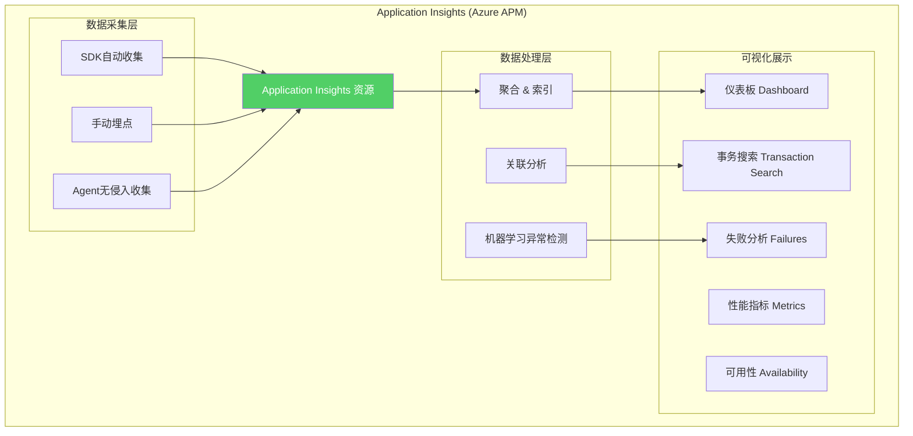
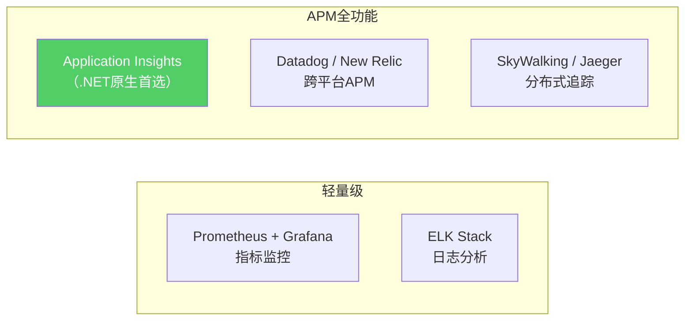
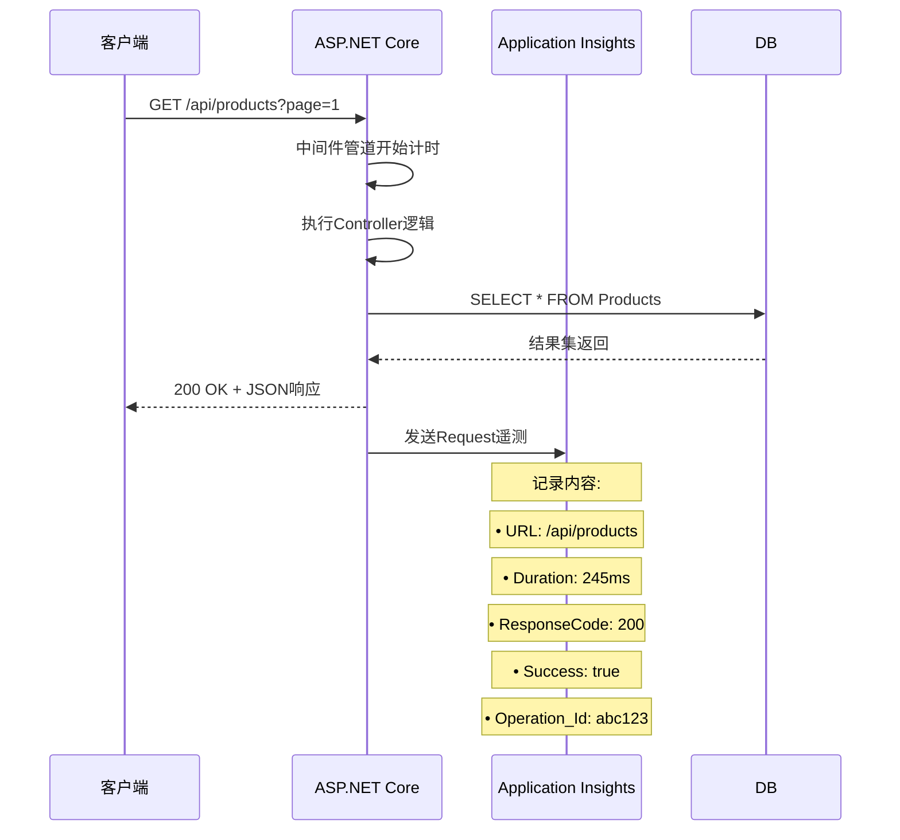
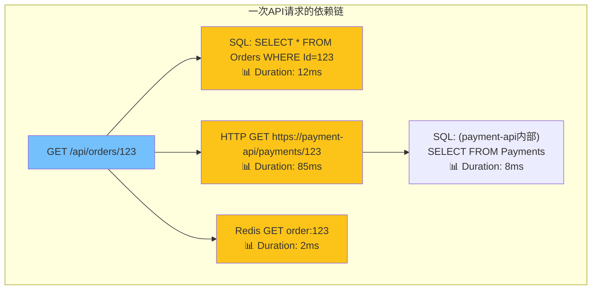
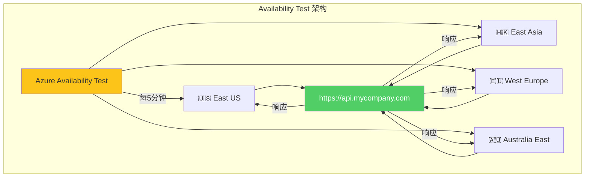
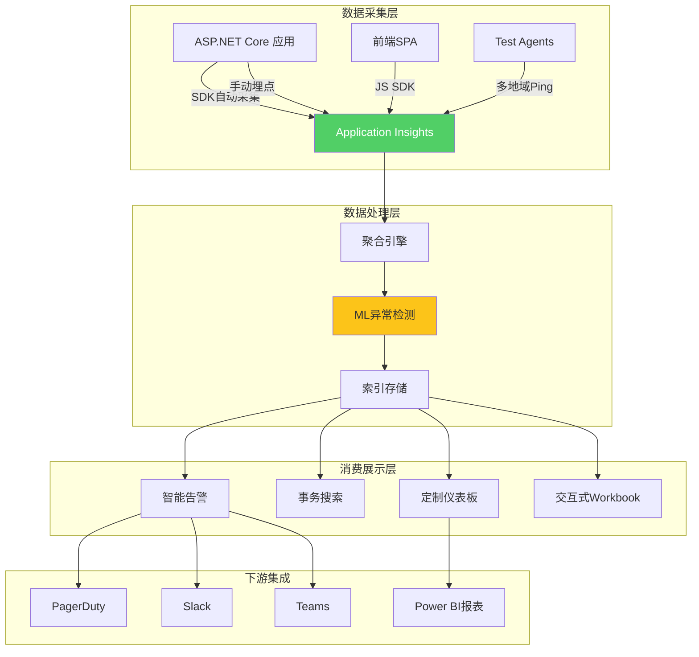

# Application Insights 监控实战指南

> **标签**：#APM #ApplicationInsights #监控 #可观测性
> **阅读时间**：约32分钟 | **难度**：⭐⭐⭐⭐
> **前置知识**：[[06-健康检查与优雅关闭]]、[[05-多环境配置管理]]

---

## 目录

- [一、Application Insights 概述](#一application-insights-概述)
- [二、SDK安装与初始化](#二sdk安装与初始化)
- [三、自动收集的遥测数据](#三自动收集的遥测数据)
- [四、自定义遥测数据](#四自定义遥测数据)
- [五、仪表板Dashboard设计](#五仪表板dashboard设计)
- [六、告警规则配置](#六告警规则配置)
- [七、Availability Tests可用性测试](#七availability-tests可用性测试)
- [八、Kusto查询语言实战](#八kusto查询语言实战)
- [九、完整电商系统AI监控方案](#九完整电商系统ai监控方案)
- [十、性能基线与回归检测](#十性能基线与回归检测)

---

## 一、Application Insights 概述

### 1.1 什么是Application Insights



### 1.2 核心能力一览

| 能力 | 说明 | 价值 |
|------|------|------|
| **请求追踪** | 自动记录每个HTTP请求的响应时间、成功率 | 发现慢接口 |
| **依赖跟踪** | 追踪SQL查询、HTTP调用、gRPC等外部调用 | 定位瓶颈 |
| **异常捕获** | 自动捕获未处理异常及堆栈信息 | 快速定位Bug |
| **性能计数器** | CPU、内存、GC、线程池等运行时指标 | 容量规划 |
| **自定义事件** | 业务事件（注册/下单/支付）追踪 | 业务洞察 |
| **可用性测试** | 多地域Ping测试服务可用性 | SLA保障 |
| **日志关联** | 与Serilog等日志框架集成 | 统一排查 |
| **用户流** | 用户行为路径分析 | 产品优化 |

### 1.3 与其他监控方案对比



| 维度 | App Insights | Prometheus+Grafana | ELK Stack |
|------|-------------|-------------------|-----------|
| **.NET集成度** | ⭐⭐⭐⭐⭐ 原生SDK | ⭐⭐⭐ 需要exporter | ⭐⭐ 需要配置 |
| **开箱即用** | ⭐⭐⭐⭐⭐ 零配置 | ⭐⭐ 需大量配置 | ⭐⭐ 需大量配置 |
| **成本模式** | 按数据量付费 | 开源免费(自建) | 开源免费(自建) |
| **保留期** | 90天(可扩展) | 自定义 | 自定义 |
| **查询语言** | Kusto (强大) | PromQL | Lucene/Elasticsearch |
| **告警** | 内置完善 | AlertManager | Watcher |
| **适合场景** | .NET应用首选 | 基础设施+指标 | 日志集中分析 |

---

## 二、SDK安装与初始化

### 2.1 安装NuGet包

```bash
# 安装Application Insights SDK
dotnet add package Microsoft.ApplicationInsights.AspNetCore

# 可选: 依赖项自动收集（SQL Server, HttpClient等）
dotnet add package Microsoft.ApplicationInsights.DependencyCollector

# 可选: 性能计数器收集
dotnet add package Microsoft.ApplicationInsights.PerfCounterCollector

# 可选: 实时用户监控（浏览器端）
# 在前端项目中使用 @microsoft/applicationinsights-web (npm)
```

### 2.2 Program.cs 初始化配置

```csharp
// Program.cs - Application Insights 完整初始化
using Microsoft.ApplicationInsights.Channel;
using Microsoft.ApplicationInsights.Extensibility;

var builder = WebApplication.CreateBuilder(args);

// ============================================
// 方式1: 使用连接字符串初始化（推荐）
// ============================================
var connectionString = builder.Configuration["APPLICATIONINSIGHTS_CONNECTION_STRING"];
if (!string.IsNullOrEmpty(connectionString))
{
    // 添加Application Insights服务
    builder.Services.AddApplicationInsightsTelemetry(options =>
    {
        options.ConnectionString = connectionString;

        // ===== 核心设置 =====
        options.EnableAdaptiveSampling = true;           // 自适应采样（减少数据量）
        options.EnablePerformanceCountersCollection = true; // 收集性能计数器
        options.RequestCollectionOptions.TrackExceptions = true;  // 追踪请求中的异常

        // ===== 采样率配置（生产环境建议）=====
        // 自适应采样会根据流量自动调整
        options.AdaptiveSamplingSettings.MaxTelemetryItemsPerSecond = 5;  // 每秒最多5个遥测

        // 固定采样率（如果不用自适应采样）
        // options.SamplingPercentage = 20;  // 只发送20%的数据

        // ===== 心脏包配置 =====
        options.HeartbeatInterval = TimeSpan.FromMinutes(15);  // 每15分钟发送心跳

        // ===== 开发环境调试 =====
        if (builder.Environment.IsDevelopment())
        {
            options.DeveloperMode = true;  // 开发模式下立即发送数据
        }
    });

    // 过滤敏感信息的Telemetry Processor
    builder.Services.AddSingleton<ITelemetryProcessor, SensitiveDataFilterProcessor>();

    // 自定义Telemetry Initializer（添加上下文信息）
    builder.Services.AddSingleton<ITelemetryInitializer, CustomTelemetryInitializer>();

    builder.Logging.AddApplicationInsights(
        logLevel => logLevel >= LogLevel.Warning,   // 只记录Warning及以上到AI
        includeFormattedMessage: true);

    _logger.LogInformation("Application Insights 已启用");
}
else
{
    _logger.LogWarning("未配置 APPLICATIONINSIGHTS_CONNECTION_STRING，Application Insights 未启用");
}

// ... 其他服务注册 ...

var app = builderBuild();

// ============================================
// 启用Application Insights中间件
// （自动收集请求/依赖/异常）
// ============================================
app.UseApplicationInsightsRequestTelemetry(new RequestTelemetryOptions
{
    // 排除健康检查端点（避免产生大量无用数据）
    Filter = context =>
    {
        var path = context.Request.Path.Value;
        return !path.StartsWith("/health") && !path.StartsWith("/ping") && !path.StartsWith("/metrics");
    }
});

app.UseApplicationInsightsExceptionTelemetry();

app.Run();
```

### 2.3 TelemetryProcessor - 数据过滤

```csharp
// Telemetry/SensitiveDataFilterProcessor.cs
// 用途: 过滤掉包含敏感信息的遥测数据
using Microsoft.ApplicationInsights.Channel;
using Microsoft.ApplicationInsights.DataContracts;
using Microsoft.ApplicationInsights.Extensibility;

public class SensitiveDataFilterProcessor : ITelemetryProcessor
{
    private readonly ITelemetryProcessor _next;
    private static readonly HashSet<string> SensitiveHeaders = new(StringComparer.OrdinalIgnoreCase)
    {
        "Authorization",
        "Cookie",
        "X-Api-Key",
        "X-Auth-Token"
    };

    private static readonly HashSet<string> SensitiveQueryParams = new(StringComparer.OrdinalIgnoreCase)
    {
        "password", "token", "apikey", "secret", "creditcard", "ssn"
    };

    public SensitiveDataFilterProcessor(ITelemetryProcessor next)
    {
        _next = next;
    }

    public void Process(ITelemetry item)
    {
        // 1. 过滤健康检查和探针请求
        if (item is RequestTelemetry request &&
            IsHealthCheckEndpoint(request.Url?.AbsolutePath))
        {
            return; // 不发送
        }

        // 2. 清理URL中的敏感参数
        if (item is RequestTelemetry req)
        {
            req.Url = SanitizeUrl(req.Url);
        }

        // 3. 清理请求头中的敏感信息
        if (item is RequestTelemetry reqT)
        {
            SanitizeHeaders(reqT);
        }

        _next.Process(item);
    }

    private bool IsHealthCheckEndpoint(string? path)
    {
        if (string.IsNullOrEmpty(path)) return false;
        var healthPaths = new[] { "/health/", "/ping", "/metrics" };
        return healthPaths.Any(p => path.StartsWith(p, StringComparison.OrdinalIgnoreCase));
    }

    private Uri? SanitizeUrl(Uri? url)
    {
        if (url == null) return null;

        var uriBuilder = new UriBuilder(url);
        var query = System.Web.HttpUtility.ParseQueryString(uriBuilder.Query);

        foreach (var key in query.AllKeys ?? Array.Empty<string>())
        {
            if (SensitiveQueryParams.Contains(key))
            {
                query[key] = "[REDACTED]";
            }
        }

        uriBuilder.Query = query.ToString();
        return uriBuilder.Uri;
    }

    private void SanitizeHeaders(RequestTelemetry telemetry)
    {
        // 移除敏感头（在存储前清理）
        // 注意: 这不会影响原始HTTP处理，只影响发送到AI的数据
    }
}
```

### 2.4 TelemetryInitializer - 上下文增强

```csharp
// Telemetry/CustomTelemetryInitializer.cs
// 用途: 为每个遥测项添加统一的上下文信息
using Microsoft.ApplicationInsights.Channel;
using Microsoft.ApplicationInsights.DataContracts;
using Microsoft.ApplicationInsights.Extensibility;

public class CustomTelemetryInitializer : ITelemetryInitializer
{
    private readonly IHttpContextAccessor? _httpContextAccessor;
    private readonly IConfiguration _configuration;

    public CustomTelemetryInitializer(
        IHttpContextAccessor? httpContextAccessor,
        IConfiguration configuration)
    {
        _httpContextAccessor = httpContextAccessor;
        _configuration = configuration;
    }

    public void Initialize(ITelemetry telemetry)
    {
        // 1. 添加云角色名称（区分微服务）
        telemetry.Context.Cloud.RoleName = "MyApi-Backend";
        telemetry.Context.Cloud.RoleInstance = Environment.MachineName;

        // 2. 添加应用版本号
        var version = _configuration["Build:Version"] ?? "unknown";
        telemetry.Context.Component.Version = version;

        // 3. 添加自定义属性（所有遥测类型通用）
        telemetry.Properties["Environment"] = _configuration["ASPNETCORE_ENVIRONMENT"] ?? "Unknown";
        telemetry.Properties["Region"] = _configuration["Region"] ?? "Unknown";

        // 4. 从HTTP Context提取用户信息
        if (_httpContextAccessor?.HttpContext != null)
        {
            var httpContext = _httpContextAccessor.HttpContext;

            // 用户ID（已登录用户）
            var userId = httpContext.User?.FindFirst("sub")?.Value;
            if (!string.IsNullOrEmpty(userId))
            {
                telemetry.Context.User.Id = HashUserId(userId);
                telemetry.Properties["UserId"] = userId;
            }

            // 会话ID
            var sessionId = httpContext.Session?.Id;
            if (!string.IsNullOrEmpty(sessionId))
            {
                telemetry.Context.Session.Id = sessionId;
            }

            // 请求来源
            telemetry.Properties["ClientIP"] = GetClientIp(httpContext);
            telemetry.Properties["UserAgent"] = httpContext.Request.Headers["User-Agent"].ToString();

            // 关联ID（用于分布式追踪）
            var traceId = httpContext.TraceIdentifier;
            if (!string.IsNullOrEmpty(traceId))
            {
                telemetry.Context.Operation.Id = traceId;
            }
        }
    }

    /// <summary>
    /// 对用户ID进行哈希脱敏（GDPR合规）
    /// </summary>
    private string HashUserId(string userId)
    {
        using var sha256 = System.Security.Cryptography.SHA256.Create();
        var hashBytes = sha256.ComputeHash(System.Text.Encoding.UTF8.GetBytes(userId));
        return Convert.ToHexString(hashBytes)[..16];  // 取前16字符
    }

    private string GetClientIp(HttpContext context)
    {
        // 支持反向代理场景
        var forwarded = context.Request.Headers["X-Forwarded-For"].FirstOrDefault();
        if (!string.IsNullOrEmpty(forwarded))
        {
            return forwarded.Split(',').First().Trim();
        }
        return context.Connection.RemoteIpAddress?.ToString() ?? "unknown";
    }
}
```

### 2.5 多环境配置

```json
// appsettings.Development.json
{
  "ApplicationInsights": {
    "ConnectionString": ""
  },
  // 开发环境可以不启用或使用独立的AI资源
}

// appsettings.Production.json
{
  "ApplicationInsights": {
    "ConnectionString": "InstrumentationKey=xxx;IngestionEndpoint=https://xxx.in.applicationinsights.azure.com/"
  }
}

// appsettings.Staging.json
{
  "ApplicationInsights": {
    "ConnectionString": "InstrumentationKey=yyy;IngestionEndpoint=https://yyy.in.applicationinsights.azure.com/"
  }
}
```

---

## 三、自动收集的遥测数据

### 3.1 请求数据 (Request Telemetry)

Application Insights自动记录每个HTTP请求：



**自动收集的字段**：

| 字段 | 说明 | 示例 |
|------|------|------|
| `name` | 请求名称（方法+路由） | `GET /api/products` |
| `url` | 完整URL | `https://api.example.com/api/products?page=1` |
| `duration` | 请求耗时 | `00:00:00.2450000` |
| `responseCode` | HTTP状态码 | `200` |
| `success` | 是否成功（<400为true） | `true` |
| `operation_Id` | 操作ID（关联同一操作的所有遥测） | `abc123def456` |
| `operation_ParentId` | 父操作ID（用于嵌套调用） | `parent123` |

### 3.2 依赖跟踪 (Dependency Telemetry)

自动追踪的外部依赖调用：



**自动支持的依赖类型**：

| 类型 | SDK支持 | 需要额外配置 |
|------|---------|------------|
| **SQL Server** | ✅ 自动 | 引用DependencyCollector包 |
| **MySQL/PostgreSQL** | ✅ 通过EF Core | Entity Framework Core |
| **HttpClient** | ✅ 自动 | 无需配置 |
| **gRPC** | ✅ 自动 | Grpc.Net.Client |
| **Azure Service Bus** | ✅ 自动 | Azure.Messaging.ServiceBus |
| **Redis (StackExchange)** | ⚠️ 部分 | 需要自定义包装 |
| **RabbitMQ** | ❌ 手动 | 需要手动StartOperation/StopOperation |

### 3.3 异常追踪 (Exception Telemetry)

```csharp
// Application Insights自动捕获:
// 1. 未处理的异常（全局异常中间件捕获的）
// 2. 控制器中的异常（通过ExceptionFilter或中间件）
// 3. 依赖调用中的异常

// 示例: 一个未被正确处理的异常会被自动记录
[HttpGet("{id}")]
public async Task<ActionResult<Product>> GetById(int id)
{
    // 如果这里抛出异常且没有被try-catch
    // Application Insights会自动记录:
    // - 异常类型和消息
    // - 完整堆栈跟踪
    // - 发生时的请求上下文
    // - 触发的请求和依赖

    var product = await _productService.GetByIdAsync(id);
    if (product == null) throw new NotFoundException($"Product {id} not found");

    return Ok(product);
}
```

### 3.4 性能计数器 (Performance Counters)

自动收集的.NET运行时指标：

| 计数器类别 | 具体指标 | 说明 |
|-----------|---------|------|
| **Process** | CPU利用率 | 进程CPU占用百分比 |
| **Process** | Private Bytes | 进程私有内存(MB) |
| **.NET CLR Exceptions** | # of Excs Thrown / sec | 每秒抛出异常数 |
| **.NET CLR Memory** | % Time in GC | GC耗时百分比 |
| **.NET CLR Memory** | Gen X Collections | 各代GC次数 |
| **.NET CLR LocksAndThreads** | Current Queue Length | 线程池排队长度 |
| **.NET CLR Interop** | # of CCWs | COM互操作包装器数量 |

---

## 四、自定义遥测数据

### 4.1 TrackEvent - 业务事件追踪

```csharp
// Services/TrackingService.cs
// 用途: 追踪关键业务事件
public class TrackingService : ITrackingService
{
    private readonly TelemetryClient _telemetryClient;

    public TrackingService(TelemetryClient telemetryClient)
    {
        _telemetryClient = telemetryClient;
    }

    /// <summary>
    /// 追踪用户注册事件
    /// </summary>
    public void TrackUserRegistration(string userId, string registrationMethod)
    {
        _telemetryClient.TrackEvent("UserRegistered", properties: new Dictionary<string, string>
        {
            {"UserId", Hash(userId)},
            {"Method", registrationMethod},       // Email/Phone/GitHub/WeChat
            {"Environment", GetEnvironment()}
        }, metrics: new Dictionary<string, double>
        {
            {"RegistrationDayOfWeek", (int)DateTime.UtcNow.DayOfWeek},
            {"RegistrationHour", DateTime.UtcNow.Hour}
        });
    }

    /// <summary>
    /// 追踪下单事件
    /// </summary>
    public void TrackOrderPlaced(Order order)
    {
        _telemetryClient.TrackEvent("OrderPlaced", properties: new Dictionary<string, string>
        {
            {"OrderId", order.Id},
            {"UserId", Hash(order.UserId)},
            {"PaymentMethod", order.PaymentMethod},     // CreditCard/Alipay/WeChatPay
            {"Currency", order.Currency},
            {"HasDiscount", order.DiscountAmount > 0 ? "Yes" : "No"},
            {"ProductCount", order.Items.Count.ToString()}
        }, metrics: new Dictionary<string, double>
        {
            {"TotalAmount", order.TotalAmount},
            {"ItemCount", order.Items.Count},
            {"DiscountAmount", order.DiscountAmount}
        });
    }

    /// <summary>
    /// 追踪支付结果
    /// </summary>
    public void TrackPaymentResult(string orderId, bool success, string paymentProvider, double amount)
    {
        var eventName = success ? "PaymentSuccess" : "PaymentFailed";

        _telemetryClient.TrackEvent(eventName, properties: new Dictionary<string, string>
        {
            {"OrderId", orderId},
            {"PaymentProvider", paymentProvider},
            {"Result", success ? "Success" : "Failed"}
        }, metrics: new Dictionary<string, double>
        {
            {"Amount", amount}
        });

        // 同时记录一个度量值（可用于趋势分析）
        _telemetryClient.TrackMetric("PaymentAmount", amount,
            new Dictionary<string, string> { {"PaymentProvider", paymentProvider} });
    }

    /// <summary>
    /// 追踪关键业务流程（带时间测量）
    /// </summary>
    public async Task<T> TrackOperationAsync<T>(string operationName, Func<Task<T>> func,
        IDictionary<string, string>? properties = null)
    {
        var startTime = DateTime.UtcNow;
        var operation = _telemetryClient.StartOperation<T>(operationName);

        try
        {
            var result = await func();

            operation.Telemetry.Success = true;
            operation.Telemetry.ResponseCode = "200";

            // 添加自定义属性
            if (properties != null)
            {
                foreach (var prop in properties)
                {
                    operation.Telemetry.Properties[prop.Key] = prop.Value;
                }
            }

            return result;
        }
        catch (Exception ex)
        {
            operation.Telemetry.Success = false;
            operation.Telemetry.ResponseCode = "500";
            _telemetryClient.TrackException(ex);

            throw;
        }
        finally
        {
            operation.Telemetry.Duration = DateTime.UtcNow - startTime;
            _telemetryClient.StopOperation(operation);
        }
    }
}
```

### 4.2 TrackMetric - 自定义指标

```csharp
// Services/MetricsService.cs
// 用途: 收集业务相关的数值型指标
public class MetricsService : IMetricsService
{
    private readonly TelemetryClient _telemetryClient;

    public MetricsService(TelemetryClient telemetryClient)
    {
        _telemetryClient = telemetryClient;
    }

    /// <summary>
    /// 记录购物车商品数量分布
    /// </summary>
    public void RecordCartItemCount(int count)
    {
        _telemetryClient.TrackMetric("CartItemCount", count,
            properties: new Dictionary<string, string>
            {
                {"Range", GetRangeLabel(count)}  // 1-3, 4-10, 11-30, 31+
            });
    }

    /// <summary>
    /// 记录订单金额分布
    /// </summary>
    public void RecordOrderAmount(double amountCNY)
    {
        _telemetryClient.TrackMetric("OrderAmountCNY", amountCNY,
            properties: new Dictionary<string, string>
            {
                {"Currency", "CNY"},
                {"Tier", GetPriceTier(amountCNY)}
            });
    }

    /// <summary>
    /// 记录API调用量（按端点分类）
    /// </summary>
    public void RecordApiCall(string endpoint, string method, int responseTimeMs, int statusCode)
    {
        _telemetryClient.TrackMetric("ApiCallDuration", responseTimeMs,
            properties: new Dictionary<string, string>
            {
                {"Endpoint", endpoint},
                {"Method", method},
                {"StatusCodeGroup", statusCode < 400 ? "Success" :
                                   statusCode < 500 ? "ClientError" : "ServerError"}
            });
    }

    /// <summary>
    /// 记录活跃用户数（定时任务调用）
    /// </summary>
    public void RecordActiveUserCount(int dau, int mau)
    {
        _telemetryClient.TrackMetric("DAU", dau);
        _telemetryClient.TrackMetric("MAU", mau);
    }

    private static string GetPriceTier(double amount) => amount switch
    {
        < 50 => "Micro",
        < 200 => "Low",
        < 1000 => "Medium",
        < 5000 => "High",
        _ => "Premium"
    };

    private static string GetRangeLabel(int count) => count switch
    {
        <= 3 => "1-3",
        <= 10 => "4-10",
        <= 30 => "11-30",
        _ => "31+"
    };
}
```

### 4.3 TrackTrace - 日志关联

```csharp
// 将重要日志同时发送到Application Insights
// 这样可以在AI中搜索日志并与请求/异常关联

public class OrderProcessingService : IOrderProcessingService
{
    private readonly TelemetryClient _telemetryClient;
    private readonly ILogger<OrderProcessingService> _logger;

    public async Task ProcessOrderAsync(Order order)
    {
        // 方式1: 使用ILogger直接写入（需要AddApplicationInsights配置了Logging）
        _logger.LogInformation("开始处理订单 {OrderId}", order.Id);

        // 方式2: 显式TrackTrace（更灵活）
        _telemetryClient.TrackTrace($"订单处理开始: {order.Id}",
            SeverityLevel.Information,
            new Dictionary<string, string>
            {
                {"OrderId", order.Id},
                {"UserId", order.UserId},
                {"TotalAmount", order.TotalAmount.ToString("F2")},
                {"Step", "Validation"}
            });

        try
        {
            // 库存检查
            _logger.LogDebug("检查库存...");
            await CheckInventoryAsync(order);

            _telemetryClient.TrackTrace($"订单 {order.Id} 库存检查通过",
                SeverityLevel.Verbose,
                properties: new() { {"Step", "InventoryChecked"} });

            // 创建支付
            _logger.LogInformation("创建支付记录...");
            var paymentResult = await CreatePaymentAsync(order);

            _telemetryClient.TrackTrace(
                $"订单 {order.Id} 支付{paymentResult.Success ? "成功" : "失败"}",
                paymentResult.Success ? SeverityLevel.Information : SeverityLevel.Warning,
                new Dictionary<string, string>
                {
                    {"OrderId", order.Id},
                    {"PaymentId", paymentResult.PaymentId},
                    {"Provider", paymentResult.Provider}
                });
        }
        catch (InsufficientStockException ex)
        {
            // 严重问题用Warning级别
            _telemetryClient.TrackTrace(
                $"订单 {order.Id} 库存不足: {ex.Message}",
                SeverityLevel.Warning,
                properties: new()
                {
                    {"OrderId", order.Id},
                    {"ProductIds", string.Join(",", ex.ProductIds)},
                    {"RequestedQty", ex.RequestedQuantity.ToString()},
                    {"AvailableQty", ex.AvailableQuantity.ToString()}
                });

            throw;
        }
    }
}
```

### 4.4 TrackDependency - 自定义依赖

```csharp
// 对于不被自动追踪的依赖，可以手动包装
public class ExternalServiceWrapper : IExternalServiceWrapper
{
    private readonly TelemetryClient _telemetryClient;
    private readonly HttpClient _httpClient;

    public async Task<TResponse> CallExternalApiAsync<TResponse>(
        string serviceName, HttpMethod method, string url,
        HttpContent? content = null, CancellationToken ct = default)
    {
        using var operation = _telemetryClient.StartOperation<DependencyTelemetry>(serviceName, $"{method} {url}");

        try
        {
            operation.Telemetry.Type = "Http";              // HTTP依赖
            operation.Telemetry.Data = url;                  // 目标URL
            operation.Telemetry.Target = new Uri(url).Host; // 远程主机名

            var request = new HttpRequestMessage(method, url);
            if (content != null) request.Content = content;

            using var cts = CancellationTokenSource.CreateLinkedTokenSource(ct);
            cts.CancelAfter(TimeSpan.FromSeconds(30));

            var response = await _httpClient.SendAsync(request, cts.Token);
            response.EnsureSuccessStatusCode();

            var result = await response.Content.ReadFromJsonAsync<TResponse>(ct);

            operation.Telemetry.Success = true;
            operation.Telemetry.ResultCode = ((int)response.StatusCode).ToString();
            operation.Telemetry.ResponseCode = ((int)response.StatusCode).ToString();

            return result!;
        }
        catch (HttpRequestException ex)
        {
            operation.Telemetry.Success = false;
            operation.Telemetry.ResponseCode = ex.HttpStatusCode?.ToString() ?? "Unknown";
            _telemetryClient.TrackException(ex);

            throw new ExternalServiceException(serviceName, ex);
        }
        catch (TaskCanceledException)
        {
            operation.Telemetry.Success = false;
            operation.Telemetry.ResponseCode = "Timeout";

            throw new TimeoutException($"{serviceName} 请求超时: {url}");
        }
        finally
        {
            _telemetryClient.StopOperation(operation);
        }
    }
}
```

---

## 五、仪表板Dashboard设计

### 5.1 生产级仪表板布局

```markdown
## 电商系统监控仪表板设计方案

### 第一行: 核心概览（最重要的4个数字）
┌─────────────────┬─────────────────┬─────────────────┬─────────────────┐
│   总请求数      │   平均响应时间   │   错误率         │   可用性(SLA)   │
│   125,432/h     │   145ms         │   0.23%         │   99.97%        │
│   ▼ 5% vs昨日   │   ▲ 2ms vs昨日  │   ✓ 达标(<1%)   │   ✓ 达标(>99.9%)│
└─────────────────┴─────────────────┴─────────────────┴─────────────────┘

### 第二行: 请求趋势图（最近24小时）
┌───────────────────────────────────────────────────────────────┐
│  📈 请求数/秒 (按状态码分组)                                  │
│  ═══ 200 OK ── 4xx Client Error ── 5xx Server Error          │
│                                                               │
│  350 │          ╱╲                                            │
│  300 │     ╱╲  ╱  ╲                                          │
│  250 │ ╱╲  ╱  ╲╱    ╲                                         │
│  200 │╱  ╲╱          ╲──╱╲                                   │
│  150 │                   ╲  ╲╲                                │
│  100 │                    ╲  ╲ ╲                               │
│   50 │                     ╲  ╲  ╲                              │
│    0 └────────────────────────────────────→ 时间             │
│      00  04  08  12  16  20  24                               │
└───────────────────────────────────────────────────────────────┘

### 第三行: Top 5 慢接口 + Top 5 错误接口
┌──────────────────────────────┬──────────────────────────────┐
│  🐌 最慢的5个接口 (P95)       │  ❌ 错误最多的5个接口         │
│  ┌─────────────────────────┐│  ┌─────────────────────────┐ │
│  │ POST /api/orders        ││  │ GET /api/products/search │ │
│  │ P95: 2,340ms            ││  │ 错误数: 127 (404)       │ │
│  │ 调用量: 1,234           ││  │ 占比: 45%               │ │
│  ├─────────────────────────┤│  ├─────────────────────────┤ │
│  │ GET /api/reports/sales  ││  │ POST /api/orders        │ │
│  │ P95: 1,890ms            ││  │ 错误数: 43 (500)        │ │
│  ├─────────────────────────┤│  ├─────────────────────────┤ │
│  │ ...                      ││  │ ...                      │ │
│  └─────────────────────────┘│  └─────────────────────────┘ │
└──────────────────────────────┴──────────────────────────────┘

### 第四行: 业务指标 + 基础设施
┌───────────────────────┬───────────────────────┬───────────────────────┐
│  🛒 业务指标           │  💳 支付指标           │  🖥️  基础设施         │
│  下单数: 3,456        │  成功率: 98.2%        │  CPU: 34% (avg)      │
│  GMV: ¥1,234,567      │  平均支付时长: 1.2s   │  内存: 512MB/1GB     │
│  DAU: 12,345          │  支付方式分布:        │  GC Gen2: 8/h        │
│  转化率: 3.21%        │  微信65% 支付宝30%   │  线程池活跃: 12/100  │
└───────────────────────┴───────────────────────┴───────────────────────┘

### 第五行: 最近异常列表
┌──────────────────────────────────────────────────────────────────────┐
│  🚨 最近异常 (按时间倒序)                                           │
│  ┌────┬──────────────────┬──────────┬────────┬────────────────────┐ │
│  │时间│ 异常类型           │ 消息      │ 出现次数│ 最近请求           │ │
│  ├────┼──────────────────┼──────────┼────────┼────────────────────┤ │
│  │14:23│ SqlException      │ Timeout  │ 15     │ GET /api/orders   │ │
│  │14:18│ NullReferenceEx...│ Obj ref  │ 3      │ POST /api/cart    │ │
│  │14:05│ HttpRequestExc... │ 502 Bad  │ 8      │ GET /api/payment  │ │
│  └────┴──────────────────┴──────────┴────────┴────────────────────┘ │
└──────────────────────────────────────────────────────────────────────┘
```

### 5.2 KQL查询构建仪表板

```kusto
// ========== KQL查询示例 ==========
// 这些查询可以直接粘贴到Azure Portal的Logs面板中使用

// 1. 请求概览 - 过去1小时
requests
| where timestamp > ago(1h)
| summarize Count=count(),
             AvgDuration=avg(duration),
             P95Duration=percentile(duration, 95),
             P99Duration=percentile(duration, 99),
             FailedCount=countif(success == false)
      by bin(timestamp, 5m), operation_Name
| render timechart

// 2. 错误率趋势
requests
| where timestamp > ago(24h)
| extend IsError = iif(resultCode >= 400 or success == false, 1, 0)
| summarize TotalRequests = count(),
             Errors = sum(IsError),
             ErrorRate = sum(IsError) * 100.0 / count()
      by bin(timestamp, 1h)
| project timestamp, TotalRequests, Errors, ErrorRate
| render timechart

// 3. Top N 慢接口
requests
| where timestamp > ago(6h) and success == true
| summarize AvgDuration=avg(duration),
             P95=percentile(duration, 95),
             P99=percentile(duration, 99),
             Count=count()
      by name
| top 10 by P95 desc
| project name, Count, round(AvgDuration, 1), round(P95, 1), round(P99, 1)

// 4. 依赖调用耗时分析
dependencies
| where timestamp > ago(1h)
| summarize AvgDuration=avg(duration),
             P95=percentile(duration, 95),
             CallCount=count()
      by type, target, name
| where AvgDuration > 100  // 只看超过100ms的
| sort by AvgDuration desc
| take 20

// 5. 异常统计
exceptions
| where timestamp > ago(24h)
| summarize ExceptionCount=count()
      by type, problemId
| top 10 by ExceptionCount desc
| project type, ExceptionCount, problemId

// 6. 自定义事件 - 下单转化漏斗
customEvents
| where name == "PageViewed" or name == "AddToCart" or name == "CheckoutStarted"
        or name == "PaymentInitiated" or name == "OrderPlaced"
| summarize StepCount = count() by name, bin(timestamp, 1d)
| evaluate funnel(seq_id=timestamp, ...)
| render funnelchart

// 7. 用户留存分析
customEvents
| where name in ("UserLogin", "UserReturn")
| summarize FirstVisit = min(timestamp) by user_Id
| join kind=inner (
    customEvents
    | where name == "UserLogin"
    | summarize LastVisit = max(timestamp) by user_Id
) on user_Id
| extend RetainedDays = datetime_diff('day', FirstVisit, LastVisit)
| summarize Users = count() by RetainedDays
| sort by RetainedDays asc
| render columnchart
```

---

## 六、告警规则配置

### 6.1 关键告警规则清单

```yaml
# ============================================
# Application Insights 告警规则定义
# ============================================

告警规则:

  # ===== 1. 可用性告警（最高优先级）=====
  - 名称: 服务完全不可用
    严重程度: Sev 0 (Critical)
    条件: Availability < 90% (过去5分钟)
    通知: PagerDuty + 电话 + Teams频道
    冷却时间: 5分钟

  - 名称: 可用性下降
    严重程度: Sev 1 (Warning)
    条件: Availability < 99% (过去15分钟)
    通知: Slack + Email
    冷却时间: 15分钟

  # ===== 2. 错误率告警 =====
  - 名称: 错误率飙升
    严重程度: Sev 0 (Critical)
    条件: requests中失败比例 > 10% (过去5分钟)
    通知: PagerDuty + Teams
    冷却时间: 5分钟

  - 名称: 5xx错误增加
    严重程度: Sev 1 (Warning)
    条件: 5xx错误数 > 基线*3 (过去10分钟)
    通知: Slack
    冷却时间: 10分钟

  # ===== 3. 性能退化告警 =====
  - 名称: 响应时间P95超标
    严重程度: Sev 1 (Warning)
    条件: P95响应时间 > 2秒 (持续10分钟)
    通知: Slack + Email
    冷却时间: 15分钟

  - 名称: 响应时间P99严重超标
    严重程度: Sev 0 (Critical)
    条件: P99响应时间 > 5秒 (持续5分钟)
    通知: PagerDuty
    冷却时间: 5分钟

  # ===== 4. 依赖故障告警 =====
  - 名称: 数据库连接超时
    严重程度: Sev 0 (Critical)
    条件: SQL依赖超时/失败 > 5次/分钟
    通知: PagerDuty + DBA团队
    冷却时间: 5分钟

  - 名称: 外部API调用失败
    严重程度: Sev 1 (Warning)
    条件: HTTP依赖失败率 > 5%
    通知: Slack
    冷却时间: 10分钟

  # ===== 5. 业务指标告警 =====
  - 名称: 下单量骤降
    严重程度: Sev 1 (Warning)
    条件: OrderPlaced事件数 < 昨日同期*30%
    通知: Slack + 产品团队
    冷却时间: 30分钟
    时间窗口: 仅工作日9:00-22:00

  - 名称: 支付成功率过低
    严重程度: Sev 0 (Critical)
    条件: PaymentSuccess率 < 95% (过去15分钟)
    通知: PagerDuty + 财务系统
    冷却时间: 5分钟
```

### 6.2 Azure Portal告警配置示例

```powershell
# 使用PowerShell/Azure CLI创建告警规则

# 1. 创建Action Group（通知渠道）
az monitor action-group create \
    --name "CriticalAlerts-PagerDuty" \
    --resource-group rg-monitoring \
    --short-name "PD-Critical" \
    --action pagerduty \
        pagerduty-service-key="$(PAGER_DUTY_KEY)" \
        pagerduty-url="https://events.pagerduty.com/v2/enqueue"

az monitor action-group create \
    --name "TeamSlack" \
    --resource-group rg-monitoring \
    --short-name "Slack" \
    --action webhook \
        service-uri="$(SLACK_WEBHOOK_URL)"

# 2. 创建错误率告警规则
az monitor metrics alert create \
    --name "High-Error-Rate" \
    --resource-group rg-monitoring \
    --scopes $(az resource show -g rg-prod -n myapi-ai --resource-type "microsoft.insights/components" --query id -o tsv) \
    --condition "total requests count where success == 'False' / total requests count * 100 > 10" \
    --window-size 5m \
    --evaluation-frequency 1m \
    --severity 0 \
    --action $(az action-group show -n CriticalAlerts-PagerDuty -g rg-monitoring --query id -o tsv)

# 3. 创建响应时间告警
az monitor metrics alert create \
    --name "High-Latency-P95" \
    --resource-group rg-monitoring \
    --scopes $(az resource show -g rg-prod -n myapi-ai --resource-type "microsoft.insights/components" --query id -o tsv) \
    --condition "average requests duration percentile(95) > 2000" \
    --window-size 10m \
    --evaluation-frequency 1m \
    --severity 1 \
    --action $(az action-group show -n TeamSlack -g rg-monitoring --query id -o tsv)

# 4. 创建可用性测试告警
az monitor metrics alert create \
    --name "Availability-Drop" \
    --resource-group rg-monitoring \
    --scopes $(az resource show -g rg-prod -n myapi-ai --resource-type "microsoft.insights/components" --query id -o tsv) \
    --condition "average availabilityResults/availabilityPercentage < 90" \
    --window-size 5m \
    --severity 0 \
    --action $(az action-group show -n CriticalAlerts-PagerDuty -g rg-monitoring --query id -o tsv)
```

---

## 七、Availability Tests可用性测试

### 7.1 配置多地域可用性测试



### 7.2 创建标准URL Ping测试

```bash
# 使用Azure CLI创建可用性测试
az monitor app insights web-test create \
    --resource-group rg-monitoring \
    --app-insights-resource myapi-ai \
    --name "API-Health-Check" \
    --location "Global" \
    --enabled true \
    --frequency 300 \                          # 每5分钟测试一次
    --timeout 120 \                           # 超时2分钟
    --locations "East US" "East Asia" "West Europe" "Australia East" "Central India" \
    --validation-http-status-code-success "200-299,401" \  # 401也算正常（未认证）
    --url "https://api.mycompany.com/health/live"

# 创建更详细的测试（带验证规则的）
az monitor app insights web-test create \
    --resource-group rg-monitoring \
    --app-insights-resource myapi-ai \
    --name "API-Products-Endpoint" \
    --location "Global" \
    --enabled true \
    --frequency 300 \
    --timeout 60 \
    --locations "East US" "East Asia" "West Europe" \
    --url "https://api.mycompany.com/api/products?page=1&pageSize=10" \
    --validation-content-match "items" \          # 响应体必须包含"items"
    --validation-rule-header "Content-Type" "application/json" \
    --parse-dependent true                         # 解析页面依赖资源
```

### 7.3 多步骤Web测试（高级）

```json
// multi-step-webtest.json - 标准Visual Studio Web Test格式
{
  "$schema": "http://json-schema.org/schemas/2014-11-01/webtest.json",
  "Id": "ecommerce-e2e-test",
  "Name": "ECommerce E2E Flow Test",
  "Description": "完整的电商购买流程端到端测试",
  "Steps": [
    {
      "RequestId": "step-01-homepage",
      "RequestUrl": "https://www.mycompany.com/",
      "Method": "GET",
      "Headers": [
        { "Name": "Accept-Language", "Value": "zh-CN,zh;q=0.9" }
      ],
      "ExpectedHttpStatusCode": 200,
      "ValidationRules": [
        { "Type": "FindText", "PassIfTextFound": true, "FindText": "热门商品" }
      ]
    },
    {
      "RequestId": "step-02-product-list",
      "RequestUrl": "https://www.mycompany.com/products",
      "Method": "GET",
      "DependsOn": "step-01-homepage",
      "ExpectedHttpStatusCode": 200,
      "ValidationRules": [
        { "Type": "FindText", "PassIfTextFound": true, "FindText": "product-card" }
      ]
    },
    {
      "RequestId": "step-03-api-products",
      "RequestUrl": "https://api.mycompany.com/api/products?page=1&pageSize=5",
      "Method": "GET",
      "DependsOn": "step-02-product-list",
      "ExpectedHttpStatusCode": 200,
      "Headers": [
        { "Name": "Accept", "Value": "application/json" }
      ],
      "ValidationRules": [
        { "Type": "FindText", "PassIfTextFound": true, "FindText": "\"items\":" }
      ]
    },
    {
      "RequestId": "step-04-health-check",
      "RequestUrl": "https://api.mycompany.com/health/ready",
      "Method": "GET",
      "DependsOn": "step-03-api-products",
      "ExpectedHttpStatusCode": 200,
      "ValidationRules": [
        { "Type": "FindText", "PassIfTextFound": true, "FindText": "\"status\":\"Healthy\"" }
      ]
    }
  ],
  "WebTestProperties": [
    { "Key": "Environment", "Value": "Production" }
  ]
}
```

### 7.4 可用性测试告警

```bash
# 当任何地域的可用性低于阈值时触发告警
az monitor metrics alert create \
    --name "Availability-Below-SLA" \
    --resource-group rg-monitoring \
    --scopes $(az resource show -g rg-prod -n myapi-ai --resource-type "microsoft.insights/components" --query id -o tsv) \
    --condition "average availabilityResults/availabilityPercentage < 99" \
    --window-size 5m \
    --evaluation-frequency 1m \
    --severity 0 \
    --description "SLA违规! 至少一个地域的可用性低于99%" \
    --action $(az action-group show -n CriticalAlerts-PagerDuty -g rg-monitoring --query id -o tsv)

# 单个测试失败时告警（更快发现）
az monitor metrics alert create \
    --name "WebTest-Failure" \
    --resource-group rg-monitoring \
    --scopes $(az resource show -g rg-prod -n myapi-ai --resource-type "microsoft.insights/components" --query id -o tsv) \
    --condition "total availabilityResults/count where testResult == 'Failed' > 0" \
    --window-size 5m \
    --evaluation-frequency 1m \
    --severity 1 \
    --action $(az action-group show -n TeamSlack -g rg-monitoring --query id -o tsv)
```

---

## 八、Kusto查询语言实战

### 8.1 KQL基础语法速查

```kusto
// ============================================
// Kusto Query Language (KQL) 快速参考
// ============================================

// 基本结构: 表 | where | summarize | render
// 类似于 SQL: SELECT ... FROM ... WHERE ... GROUP BY

// ===== 基本查询结构 =====
requests
| where timestamp > ago(1h)           // 过滤条件（类似WHERE）
| where success == false               // 多条件AND
| summarize count() by resultCode      // 聚合（类似GROUP BY）
| top 10 by count_ desc               // 取Top N
| render piechart                      // 渲染图表

// ===== 常用函数 =====
ago(1h)           // 1小时前的时间戳
bin(timestamp, 5m) // 按5分钟分桶
count()           // 计数
avg(duration)     // 平均值
percentile(col, 95) // 百分位
dcount(user_Id)    // 去重计数
strcat(a, "-", b)   // 字符串拼接
iif(cond, a, b)    // 条件表达式
case(condition1, value1, condition2, value2, ...)  // 多条件分支

// ===== 时间序列分析 =====
requests
| make-series Requests=count() on timestamp from ago(24h) to now() step 1h
| render timechart

// ===== 聚合函数 =====
summarize
    Total=count(),
    AvgDuration=avg(duration),
    P50=percentile(duration, 50),
    P95=percentile(duration, 95),
    P99=percentile(duration, 99),
    Min=min(duration),
    Max=max(duration)
by operation_Name
```

### 8.2 高级查询模板库

```kusto
// ==========================================
// 模板1: 全链路追踪 - 查看一个完整请求的所有依赖
// ==========================================
let requestId = "abc-def-123";  // 替换为实际的operation_ID
requests
| where operation_Id == requestId
| union (
    dependencies
    | where operation_ParentId == requestId or operation_Id == requestId
)
| union (
    exceptions
    | where operation_Id == requestId
)
| project timestamp, itemType = iff(itemType == "request", "REQUEST",
                                 itemType == "dependency", "DEPENDENCY",
                                 "EXCEPTION"),
          name, duration, success, resultCode, message
| order by timestamp asc

// ==========================================
// 模板2: 慢请求分析 - 找出拖慢整体P95的元凶
// ==========================================
requests
| where timestamp > ago(6h)
| where duration > 1000  // 只看超过1秒的请求
| parse-kind=regex name with * "POST " endpoint  // 提取端点
| summarize SlowCount=count(), AvgSlow=avg(duration), P95Slow=percentile(duration, 95)
      by endpoint
| join kind=inner (
    requests
    | where timestamp > ago(6h)
    | parse-kind=regex name with * method " " endpoint
    | summarize TotalCount=count(), AvgAll=avg(duration), P95All=percentile(duration, 95)
      by endpoint
) on endpoint
| project endpoint, TotalCount, SlowCount,
          round(AvgAll, 0) as AvgAll_ms, round(P95All, 0) as P95All_ms,
          round(AvgSlow, 0) as AvgSlow_ms, round(P95Slow, 0) as P95Slow_ms,
          round(SlowCount * 100.0 / TotalCount, 1) as SlowPercent
| where SlowPercent > 5  // 慢请求占比超过5%
| sort by SlowPercent desc

// ==========================================
// 模板3: 异常根因分析 - 异常与依赖的关系
// ==========================================
exceptions
| where timestamp > ago(24h)
| project timestamp, operation_Id, type, message
| join kind=leftouter (
    dependencies
    | where timestamp > ago(24h) and success == false
    | project depOperationId=operation_Id, depTarget=target, depType=type, depName=name, depDuration=duration
) on $left.operation_Id == $right.depOperationId
| extend RootCause = iof(isnotempty(depTarget), depTarget, "Application Code")
| summarize ExceptionCount=count()
      by type, RootCause, depType
| top 20 by ExceptionCount desc
| render treemap

// ==========================================
// 模板4: 用户行为漏斗 - 注册到下单
// ==========================================
let users = toscalar(
    customEvents | where name == "UserRegistered" and timestamp > ago(7d) | dcount(user_Id)
);
customEvents
| where timestamp > ago(7d)
| where name in ("UserRegistered", "ProductViewed", "AddToCart", "CheckoutStarted", "OrderPlaced")
| summarize UserCount = dcount(user_Id) by name, bin(timestamp, 1d)
| evaluate funnel(
    seq_id = timestamp,
    funnel_step_column = case(
        name == "UserRegistered", 1,
        name == "ProductViewed", 2,
        name == "AddToCart", 3,
        name == "CheckoutStarted", 4,
        name == "OrderPlaced", 5,
        0
    )
)
| render funnelchart

// ==========================================
// 模板5: 容量规划 - 流量预测
// ==========================================
requests
| where timestamp > ago(30d)
| make-series Requests=count() on timestamp from ago(30d) to now() step 1d
| extend Trend = linefit(Requests)  // 线性拟合
| extend PredictedNextWeek = Trend * 7  // 预测下周
| project timestamp, Requests, round(Trend, 1) as TrendLine,
          round(PredictedNextWeek, 0) as NextWeekPrediction
| render timechart
```

---

## 九、完整电商系统AI监控方案

### 9.1 整体架构



### 9.2 Program.cs完整集成代码

```csharp
// Program.cs - 电商系统 Application Insights 完整集成
using Microsoft.ApplicationInsights.Channel;
using Microsoft.ApplicationInsights.DataContracts;
using Microsoft.ApplicationInsights.Extensibility;

var builder = WebApplication.CreateBuilder(args);

var connString = builder.Configuration["APPLICATIONINSIGHTS_CONNECTION_STRING"];
if (!string.IsNullOrWhiteSpace(connString))
{
    builder.Services.AddApplicationInsightsTelemetry(options =>
    {
        options.ConnectionString = connString;
        options.EnableAdaptiveSampling = true;
        options.EnablePerformanceCountersCollection = true;
        options.RequestCollectionOptions.TrackExceptions = true;
        options.AdaptiveSamplingSettings.MaxTelemetryItemsPerSecond = 5;
        options.HeartbeatInterval = TimeSpan.FromMinutes(15);

        if (builder.Environment.IsDevelopment())
        {
            options.DeveloperMode = true;
        }
    });

    // 数据过滤器
    builder.Services.AddSingleton<ITelemetryProcessor, HealthCheckFilter>();
    builder.Services.AddSingleton<ITelemetryProcessor, SensitiveDataFilter>();

    // 上下文增强器
    builder.Services.AddSingleton<ITelemetryInitializer, EcommerceTelemetryInitializer>();

    // 日志集成
    builder.Logging.AddApplicationInsights(
        logLevel => logLevel >= LogLevel.Warning,
        includeFormattedMessage: true);

    // 注册业务追踪服务
    builder.Services.AddSingleton<ITrackingService, EcommerceTrackingService>();
    builder.Services.AddSingleton<IMetricsService, EcommerceMetricsService>();
}

// ... 其他服务注册 ...
builder.Services.AddScoped<IOrderService, OrderService>();
builder.Services.AddScoped<IPaymentService, PaymentService>();

var app = builderBuild();

// AI中间件
app.UseApplicationInsightsRequestTelemetry(new RequestTelemetryOptions
{
    Filter = ctx =>
    {
        var path = ctx.Request.Path.Value;
        return !path.StartsWith("/health") && !path.StartsWith("/ping")
            && !path.StartsWith("/metrics") && !path.StartsWith("/.well-known");
    }
});
app.UseApplicationInsightsExceptionTelemetry();

// 业务中间件
app.UseMiddleware<EcommerceContextMiddleware>();  // 注入业务上下文到AI

app.Run();
```

### 9.3 电商专用TelemetryInitializer

```csharp
// Telemetry/EcommerceTelemetryInitializer.cs
public class EcommerceTelemetryInitializer : ITelemetryInitializer
{
    private readonly IHttpContextAccessor? _httpContextAccessor;
    private readonly IConfiguration _config;

    public EcommerceTelemetryInitializer(IHttpContextAccessor? accessor, IConfiguration config)
    {
        _httpContextAccessor = accessor;
        _config = config;
    }

    public void Initialize(ITelemetry telemetry)
    {
        // 云角色
        telemetry.Context.Cloud.RoleName = "ECommerce-API";
        telemetry.Context.Cloud.RoleInstance = Environment.MachineName;

        // 版本和环境
        telemetry.Context.Component.Version = _config["Build:Version"] ?? "dev";
        telemetry.Properties["Environment"] = _config["ASPNETCORE_ENVIRONMENT"] ?? "Unknown";
        telemetry.Properties["DeploymentRegion"] = _config["Region"] ?? "Unknown";

        // 从HttpContext提取电商上下文
        var ctx = _httpContextAccessor?.HttpContext;
        if (ctx == null) return;

        // 用户信息
        var userId = ctx.User?.FindFirst("sub")?.Value;
        if (!string.IsNullOrEmpty(userId))
        {
            telemetry.Context.User.Id = Sha256Hash(userId);
            telemetry.Properties["CustomerId"] = MaskCustomerInfo(userId);
        }

        // 购物车信息（从Header或Session获取）
        var cartId = ctx.Request.Headers["X-Cart-Id"].FirstOrDefault();
        if (!string.IsNullOrEmpty(cartId))
        {
            telemetry.Properties["CartId"] = cartId;
        }

        // 请求来源标识
        var clientVersion = ctx.Request.Headers["X-Client-Version"].FirstOrDefault();
        if (!string.IsNullOrEmpty(clientVersion))
        {
            telemetry.Properties["ClientVersion"] = clientVersion;
        }

        // A/B测试分组
        var experimentId = ctx.Request.Headers["X-Experiment"].FirstOrDefault();
        if (!string.IsNullOrEmpty(experimentId))
        {
            telemetry.Properties["ExperimentId"] = experimentId;
        }
    }

    private static string Sha256Hash(string input)
    {
        using var sha = System.Security.Cryptography.SHA256.Create();
        var bytes = sha.ComputeHash(System.Text.Encoding.UTF8.GetBytes(input));
        return Convert.ToBase64String(bytes)[..16];
    }

    private static string MaskCustomerInfo(string info)
    {
        if (info.Length <= 8) return "***";
        return info[..4] + new string('*', info.Length - 8) + info[^4..];
    }
}
```

---

## 十、性能基线与回归检测

### 10.1 建立性能基线

```kusto
// ==========================================
// 建立性能基线查询
// 基于过去7天的稳定时段数据计算基线值
// ==========================================

// 1. 计算各接口的P95/P99基线
let baseline = requests
| where timestamp > ago(7d)
| // 排除已知的高峰时段（如促销活动期间）
| where format_datetime(timestamp, 'HH') !in ('10', '11', '14', '15', '20', '21')
| where success == true
| parse-kind=regex name with * method " " endpoint
| summarize
    RequestCount = count(),
    BaselineP50 = percentile(duration, 50),
    BaselineP75 = percentile(duration, 75),
    BaselineP95 = percentile(duration, 95),
    BaselineP99 = percentile(duration, 99),
    BaselineAvg = avg(duration)
by endpoint
| where RequestCount > 100  // 至少有足够样本量的接口
| project endpoint, RequestCount,
          round(BaselineP50, 0) as Base_P50,
          round(BaselineP75, 0) as Base_P75,
          round(BaselineP95, 0) as Base_P95,
          round(BaselineP99, 0) as Base_P99;

// 2. 当前性能 vs 基线对比（检测回归）
let current = requests
| where timestamp > ago(1h)
| where success == true
| parse-kind=regex name with * method " " endpoint
| summarize
    CurrentCount = count(),
    CurrentP50 = percentile(duration, 50),
    CurrentP95 = percentile(duration, 95),
    CurrentP99 = percentile(duration, 99)
by endpoint;

baseline
| join kind=inner current on endpoint
| extend
    P95_Change_Percent = round((CurrentP95 - Base_P95) * 100.0 / Base_P95, 1),
    P99_Change_Percent = round((CurrentP99 - Base_P99) * 100.0 / Base_P99, 1),
    P95_Status = iif(CurrentP95 > Base_P95 * 1.5, "🔴 REGRESSION",
                     iif(CurrentP95 > Base_P95 * 1.2, "🟡 WARNING", "✅ NORMAL")),
    P99_Status = iif(CurrentP99 > Base_P99 * 1.5, "🔴 REGRESSION",
                     iif(CurrentP99 > Base_P99 * 1.2, "🟡 WARNING", "✅ NORMAL"))
| project endpoint, CurrentCount,
          Base_P95, CurrentP95, P95_Change_Percent, P95_Status,
          Base_P99, CurrentP99, P99_Change_Percent, P99_Status
| where P95_Status contains "REGRESSION" or P99_Status contains "REGRESSION"
| sort by P95_Change_Percent desc
```

### 10.2 回归检测自动化

```csharp
// Services/RegressionDetectorService.cs
// 用途: 定期执行性能回归检测并通过AI报告
public class RegressionDetectorService : BackgroundService
{
    private readonly TelemetryClient _telemetryClient;
    private readonly ILogger<RegressionDetectorService> _logger;
    private readonly IConfiguration _configuration;

    protected override async Task ExecuteAsync(CancellationToken stoppingToken)
    {
        while (!stoppingToken.IsCancellationRequested)
        {
            try
            {
                await DetectRegressionsAsync(stoppingToken);
            }
            catch (Exception ex)
            {
                _logger.LogError(ex, "性能回归检测出错");
            }

            // 每小时执行一次
            await Task.Delay(TimeSpan.FromHours(1), stoppingToken);
        }
    }

    private async Task DetectRegressionsAsync(CancellationToken ct)
    {
        _logger.LogInformation("开始性能回归检测...");

        // 这里应该调用Application Insights REST API获取数据
        // 或者在应用内部维护滑动窗口的性能统计数据

        // 模拟检测结果
        var regressions = new List<RegressionReport>
        {
            new() { Endpoint = "POST /api/orders", Metric = "P95", BaselineMs = 1200, CurrentMs = 2100, ChangePercent = 75 },
            new() { Endpoint = "GET /api/reports/daily-sales", Metric = "P99", BaselineMs = 3400, CurrentMs = 5200, ChangePercent = 53 }
        };

        foreach (var regression in regressions)
        {
            // 报告回归事件
            _telemetryClient.TrackEvent("PerformanceRegression", properties: new Dictionary<string, string>
            {
                {"Endpoint", regression.Endpoint},
                {"Metric", regression.Metric},
                {"Baseline", $"{regression.BaselineMs}ms"},
                {"Current", $"{regression.CurrentMs}ms"},
                {"Change", $"+{regression.ChangePercent}%"}
            }, metrics: new Dictionary<string, double>
            {
                {"BaselineMs", regression.BaselineMs},
                {"CurrentMs", regression.CurrentMs},
                {"ChangePercent", regression.ChangePercent}
            });

            if (regression.ChangePercent > 50)
            {
                _telemetryClient.TrackTrace(
                    $"⚠️ 性能回归警告: {regression.Endpoint} {regression.Metric} 上升{regression.ChangePercent}%",
                    SeverityLevel.Warning);
            }
        }

        _logger.LogInformation("性能回归检测完成, 发现{Count}个潜在回归", regressions.Count);
    }
}

public record RegressionReport
{
    public string Endpoint { get; init; } = "";
    public string Metric { get; init; } = "";
    public double BaselineMs { get; init; }
    public double CurrentMs { get; init; }
    public double ChangePercent { get; init; }
}
```

---

## 总结

Application Insights是.NET生态中最强大的APM解决方案之一。通过本文学到的知识，你应该能够：

✅ **理解AI核心价值**：从请求追踪到业务洞察的全栈可观测性  
✅ **完成SDK集成**：自动收集 + 手动埋点 + 数据过滤 + 上下文增强  
✅ **掌握四种自定义遥测**：Event/Metric/Trace/Dependency覆盖所有场景  
✅ **设计专业仪表板**：核心指标 + 趋势图 + TopN排名 + 业务指标  
✅ **配置分级告警**：从Critical到Warning的多通道通知策略  
✅ **实施可用性测试**：多地域Ping + 多步骤E2E测试  
✅ **运用Kusto查询**：从基础聚合到高级分析的完整技能树  
✅ **建立基线体系**：性能基线 + 回归检测 + 容量规划  

**Application Insights vs 其他方案选择建议**：

| 场景 | 推荐 | 理由 |
|------|------|------|
| 纯.NET应用 | **Application Insights** | 原生集成，零配置 |
| 微服务(.NET为主) | **App Insights + OpenTelemetry** | 分布式追踪 |
| 混合技术栈 | **Jaeger/SkyWalking + Prometheus** | 语言无关 |
| 成本敏感 | **Prometheus + Grafana** | 开源免费 |
| 合规要求高 | **自建ELK + 自有仪表板** | 数据自主可控 |

**下一步学习**：
- [[08-集中式日志解决方案]] - 日志与AI联动分析
- [[06-健康检查与优雅关闭]] - 健康数据接入AI
- [[05-多环境配置管理]] - 不同环境的AI隔离策略
- [[03-GitHub Actions CI-CD流水线]] - 部署后自动验证

---

> **相关文章**：
> - [[03-性能优化/08-性能监控体系搭建]] - 本地化监控补充
> - [[08-集中式日志解决方案]] - Serilog + AI联合排查
> - [[04-Azure DevOps Pipelines]] - AI数据驱动部署决策
> - [[02-微服务架构/API Gateway]] - 网关层监控
