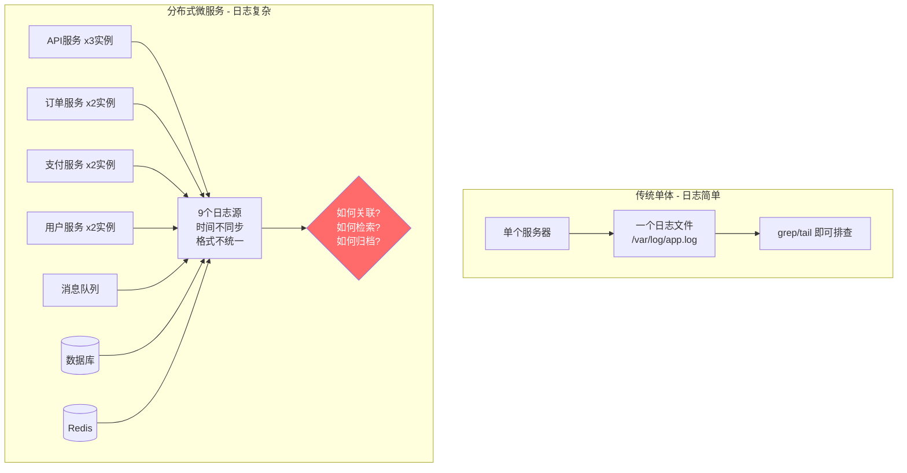
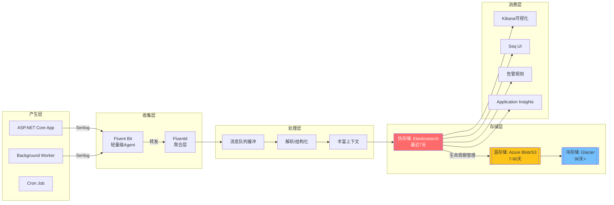
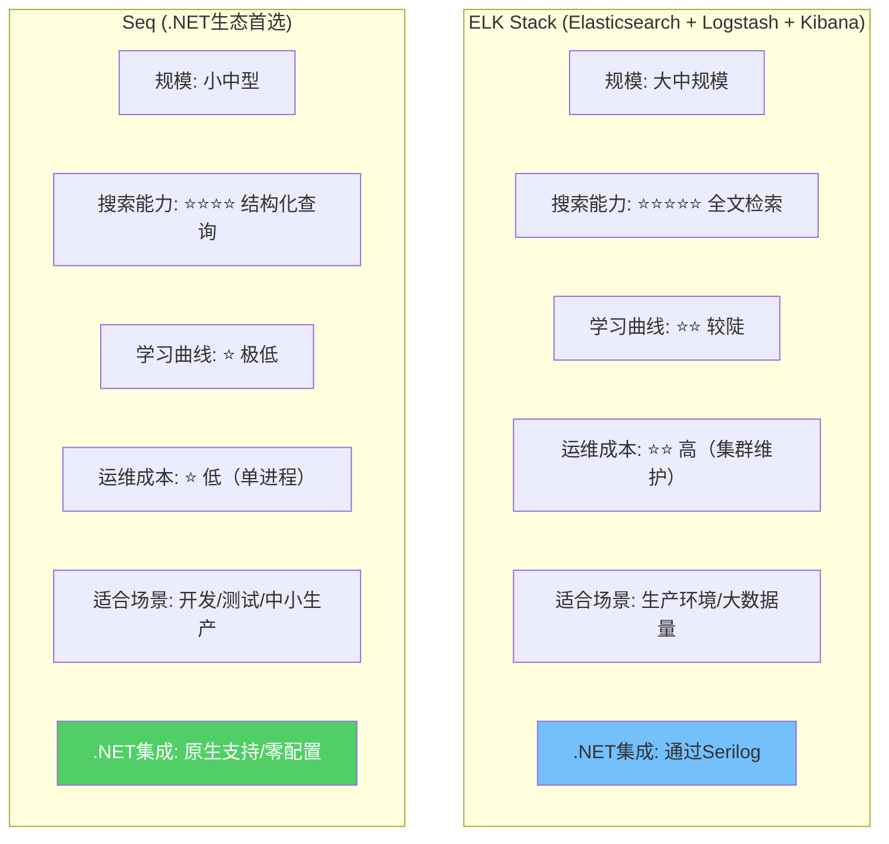
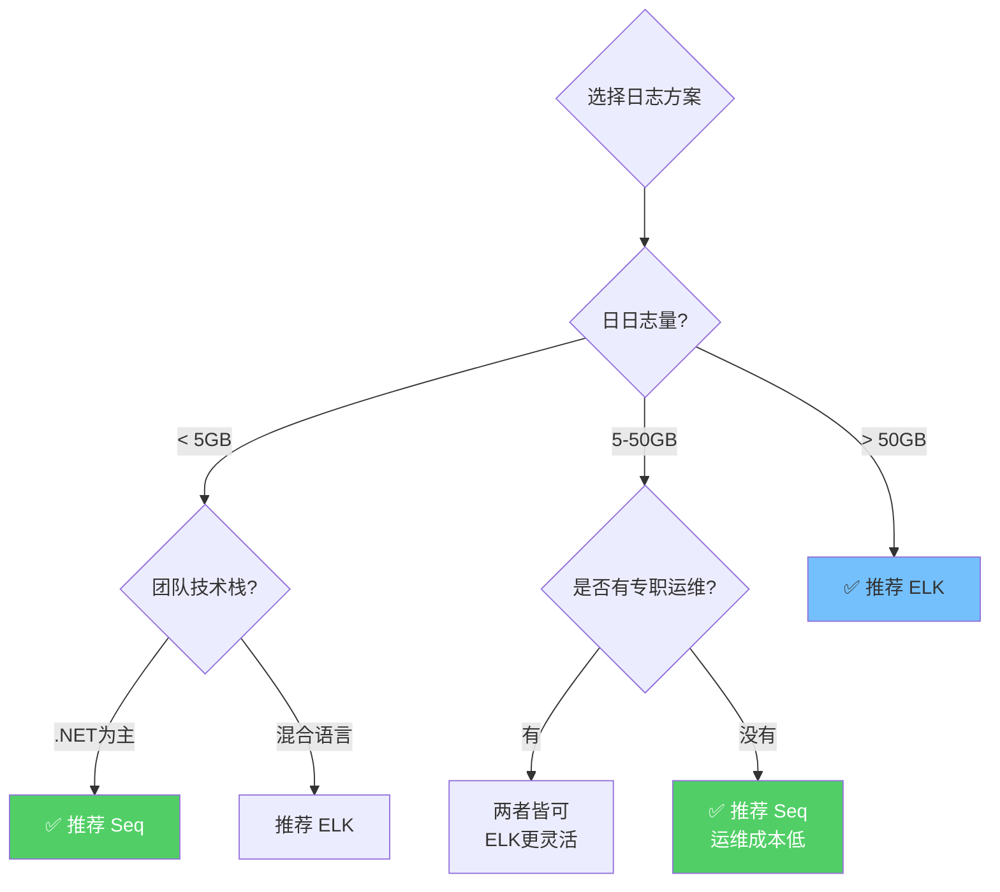
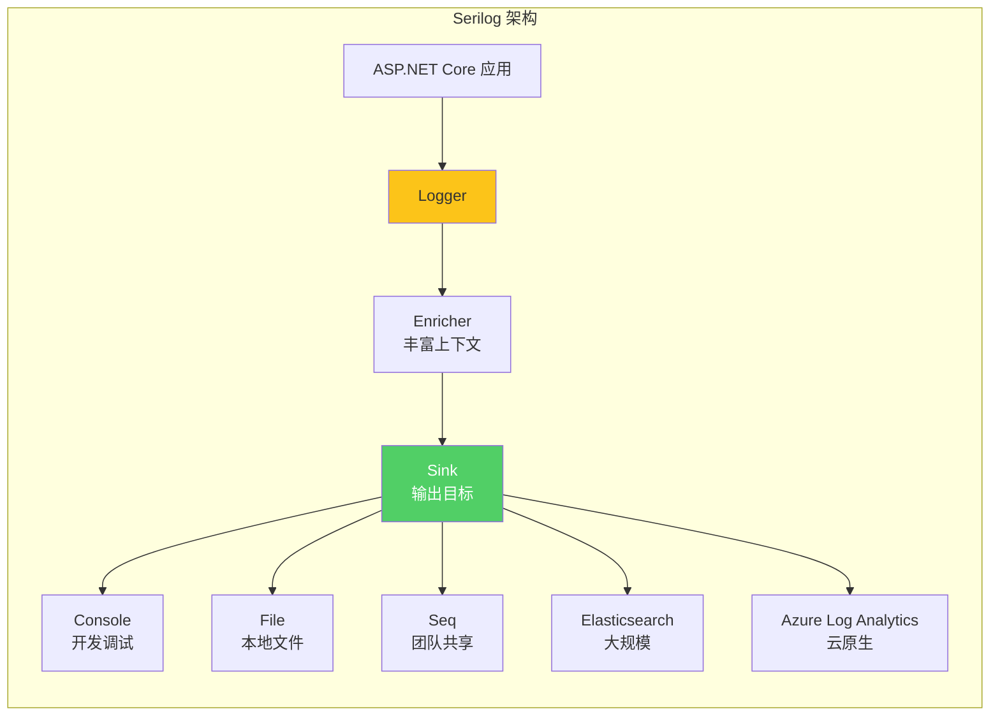
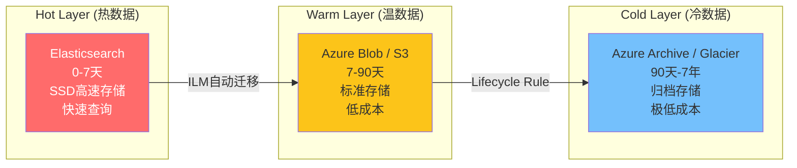

# 集中式日志解决方案实战指南

> **标签**：#日志 #Serilog #ELK #Seq #可观测性
> **阅读时间**：约30分钟 | **难度**：⭐⭐⭐⭐
> **前置知识**：[[07-Application Insights监控]]、[[06-健康检查与优雅关闭]]

---

## 目录

- [一、分布式系统日志挑战](#一分布式系统日志挑战)
- [二、日志方案选型：ELK vs Seq](#二日志方案选型elk-vs-seq)
- [三、Serilog Sink配置大全](#三serilog-sink配置大全)
- [四、结构化日志最佳实践](#四结构化日志最佳实践)
- [五、Serilog动态级别调整](#五serilog动态级别调整)
- [六、分布式追踪关联](#六分布式追踪关联)
- [七、Fluentd/Fluent Bit日志收集器](#七fluentdfluent-bit日志收集器)
- [八、日志保留策略与成本控制](#八日志保留策略与成本控制)
- [九、GDPR合规与PII脱敏](--九gdpr合规与pii脱敏)
- [十、完整ELK日志管道搭建](#十完整elk日志管道搭建)

---

## 一、分布式系统日志挑战

### 1.1 传统单体应用 vs 分布式微服务



### 1.2 日志面临的八大挑战

| 挑战 | 描述 | 影响 |
|------|------|------|
| **多源分散** | 多个服务、多个实例、多种组件 | 排查问题需要登录每台机器 |
| **时间同步** | 各机器时钟不一致 | 无法准确还原事件顺序 |
| **格式混乱** | 不同团队使用不同格式和库 | 统一查询和分析困难 |
| **海量数据** | 日志量随流量线性增长 | 存储和检索压力巨大 |
| **关联困难** | 一个请求跨越多个服务 | 端到端链路难以追踪 |
| **实时性** | 问题发生时需要立即看到日志 | 延迟的日志影响MTTR |
| **安全合规** | 可能包含PII（个人身份信息） | GDPR等法规要求 |
| **成本控制** | 存储和处理费用持续增长 | 不加控制会失控 |

### 1.3 理想日志系统的架构



---

## 二、日志方案选型：ELK vs Seq

### 2.1 方案对比总览



### 2.2 详细功能对比

| 功能维度 | ELK Stack | Seq | 推荐 |
|---------|----------|-----|------|
| **部署复杂度** | 中高（至少3个组件） | 低（单Docker容器） | Seq胜 |
| **资源占用** | 高（ES内存密集） | 低（~500MB） | Seq胜 |
| **全文搜索** | 极强（Lucene引擎） | 支持（SQL-like） | ELK胜 |
| **结构化查询** | KQL/Elasticsearch DSL | C#/LINQ风格 | Seq更易用 |
| **.NET集成** | Serilog.Sinks.Elasticsearch | Serilog.Sinks.Seq（官方） | Seq原生更好 |
| **仪表板** | Kibana强大但复杂 | 内置简洁实用 | 视需求选择 |
| **告警** | Elasticsearch Alerting + ElastAlert | 内置+ webhook | 都可以 |
| **保留策略** | ILM自动管理 | 内置清理策略 | 都支持 |
| **扩展性** | 水平扩展能力强 | 单节点限制 | ELK胜 |
| **成本** | 自建免费/云版贵 | 免费版够用/商业版便宜 | Seq性价比高 |
| **社区支持** | 超大社区 | .NET专注社区 | ELK更大 |

### 2.3 选型决策建议



**我的实际建议**：
- **开发环境**：Seq（本地Docker一键启动）
- **测试/Staging**：Seq或轻量ELK
- **生产环境**：根据规模选择，小规模用Seq，大规模用ELK
- **混合方案**：开发用Seq，生产用ELK，通过Serilog统一配置切换

---

## 三、Serilog Sink配置大全

### 3.1 Serilog核心概念



### 3.2 完整的Serilog配置（多Sink）

```csharp
// Program.cs - Serilog 完整配置
using Serilog;
using Serilog.Events;
using Serilog.Filters;

// ===== 在CreateBuilder之前先配置Serilog =====
Log.Logger = new LoggerConfiguration()
    .MinimumLevel.Override("Microsoft", LogEventLevel.Warning)
    .MinimumLevel.Override("Microsoft.Hosting.Lifetime", LogEventLevel.Information)
    .MinimumLevel.Override("System", LogEventLevel.Warning)
    .MinimumLevel.Override("MyApi", LogEventLevel.Debug)  // 自己的代码Debug级别

    // ===== Enricher - 丰富日志上下文 =====
    .Enrich.FromLogContext()
    .Enrich.WithMachineName()
    .EnrichWith(new RequestIdEnricher())
    .EnrichWith(new UserIdEnricher())
    .Enrich.WithEnvironmentName()
    .WithProperty("Application", "MyApi")

    // ===== WriteTo - 配置输出目标 =====

    // 1. Console (始终启用 - 用于Docker/CI日志查看)
    .WriteTo.Console(
        outputTemplate: "[{Timestamp:HH:mm:ss} {Level:u3}] [{SourceContext}] {Message:lj}{NewLine}{Exception}",
        restrictedToMinimumLevel: GetConsoleMinLevel())

    // 2. File (开发和Staging环境)
    .WriteTo.File(
        path: "logs/log-.txt",
        rollingInterval: RollingInterval.Day,
        retainedFileCountLimit: 7,          // 保留7天
        fileSizeLimitBytes: 52428800,      // 单文件最大50MB
        rollOnFileSizeLimit: true,
        outputTemplate: "{Timestamp:yyyy-MM-dd HH:mm:ss.fff zzz} [{Level:u3}] [{SourceContext}] {Message:lj}{NewLine}{Exception}",
        restrictedToMinimumLevel: LogEventLevel.Information)

    // 3. Seq (推荐用于团队共享)
    .WriteTo.Seq(
        serverUrl: builder.Configuration["Serilog:Seq:ServerUrl"] ?? "http://localhost:5341",
        apiKey: builder.Configuration["Serilog:Seq:ApiKey"],
        restrictedToMinimumLevel: LogEventLevel.Information,
        bufferBaseFilename: "logs/seq-buffer")   // Seq不可用时本地缓冲

    // 4. Elasticsearch (生产环境大规模日志)
    .WriteTo.Elasticsearch(
        new[] { new Uri(builder.Configuration["Serilog:Elasticsearch:Url"] ?? "http://localhost:9200") },
        autoRegisterTemplate: true,
        autoRegisterTemplateVersion: AutoRegisterTemplateVersion.ESv8,
        indexFormat: "myapi-{0:yyyy.MM.dd}",
        typeName: "_doc",
        batchPostingLimit: 50,               // 每50条或以下条件满足时发送
        period: TimeSpan.FromSeconds(5),     // 或每5秒发送一次
        bufferFileSizeLimitBytes: 52428800,  // 缓冲区上限50MB
        bufferFileCountLimit: 5,             // 最多5个缓冲文件
        restrictedToMinimumLevel: LogEventLevel.Information,
        failureCallback: (err) => Console.WriteLine(f"ES写入失败: {err.Message}"))

    // 5. Azure Log Analytics (Azure云原生方案)
    .WriteTo.ApplicationInsights(
        telemetryConverter: new Serilog.Extensions.ApplicationInsights.TelemetryConverterTraits(),
        telemetryClient: null,  // 使用独立的TelemetryClient
        restrictedToMinimumLevel: LogEventLevel.Warning)

    // ===== Filter - 过滤不需要的日志 =====
    .Filter.ByExcluding(Matching.FromSource("Microsoft.AspNetCore.StaticFiles"))
    .Filter.ByExcluding(Matching.FromSource("Microsoft.AspNetCore.Hosting.Diagnostics"))
    .Filter.ByExcluding(e => e.MessageTemplate.Text.Contains("health"))
    .Filter.ByExcluding(e => e.Level == LogEventLevel.Debug &&
                             e.MessageTemplate.Text.Contains("Entity Framework"))

    .CreateLogger();

builder.Host.UseSerilog();

static LogEventLevel GetConsoleMinLevel()
{
    var env = Environment.GetEnvironmentVariable("ASPNETCORE_ENVIRONMENT");
    return env switch
    {
        "Development" => LogEventLevel.Debug,
        "Staging" => LogEventLevel.Information,
        _ => LogEventLevel.Warning
    };
}

var builder = WebApplication.CreateBuilder(args);
// ... 其余代码 ...
```

### 3.3 各Sink详细配置参数

#### Console Sink

```csharp
// 开发环境丰富的控制台输出
.WriteTo.Console(
    theme: Serilog.Sinks.SystemConsole.Themes.AnsiConsoleTheme.Code,
    outputTemplate:
        "[{Timestamp:HH:mm:ss} " +
        "{Level:u3}] " +
        "[{SourceContext}] " +
        "{Message:lj}" +
        "{NewLine}" +
        "{Exception}",
    restrictedToMinimumLevel: LogEventLevel.Debug)
```

#### File Sink（带压缩）

```csharp
// 生产环境的文件输出（可选gzip压缩）
.WriteTo.Async(config => config.File(
    path: "/var/log/myapi/log-.json",
    rollingInterval: RollingInterval.Hour,
    retainedFileCountLimit: 168,           // 保留7天(24*7)
    rollOnFileSizeLimit: true,
    fileSizeLimitBytes: 104857600,         // 100MB滚动
    bufferBaseFilename: "/tmp/myapi-log-buffer",
    hooks: new[] {
        new Serilog.Hooks.PersistedFileHook()  // 进程重启后恢复未发送的日志
    },
    outputTemplate: "{Timestamp:o}|{Level:u3}|{SourceContext}|{Message:lj}|{Exception}",
    formatter: new Serilog.Formatting.Compact.CompactJsonFormatter(),
    restrictedToMinimumLevel: LogEventLevel.Information))
```

#### Seq Sink

```csharp
// Seq - 最适合.NET团队的日志平台
.WriteTo.Seq(
    serverUrl: "https://seq.mycompany.com",
    apiKey: "your-api-key-here",
    controlQueueResponseInterval: TimeSpan.FromSeconds(2),
    batchPostingLimit: 100,
    period: TimeSpan.FromSeconds(2),
    bufferBaseFilename: "C:\\temp\\myapi-seq-buffer",
    eventBodyLimitBytes: 200000,            // 单条日志最大200KB
    compact: true,                           // 使用紧凑格式节省带宽
    restrictedToMinimumLevel: LogEventLevel.Information)
```

#### Elasticsearch Sink

```csharp
// Elasticsearch - 大规模生产日志首选
.WriteTo.Elasticsearch(
    nodeUris: new[]
    {
        "https://es-node1.mycompany.com:9200",
        "https://es-node2.mycompany.com:9200",
        "https://es-node3.mycompany.com:9200"
    },
    connectionGlobalHeaders: new Dictionary<string, string>
    {
        ["Authorization"] = "Basic " + Convert.ToBase64String(
            Encoding.UTF8.GetBytes($"{username}:{password}"))
    },
    indexFormat: "myapi-{0:yyyy.MM.dd}",
    templateName: "myapi-logs-template",
    typeName: "_doc",
    autoRegisterTemplate: true,
    autoRegisterTemplateVersion: AutoRegisterTemplateVersion.ESv8,
    customFormatter: new Serilog.Sinks.Elasticsearch.ElasticsearchJsonFormatter(),
    pipelineName: "myapi-logs-pipeline",       // ES Ingest Pipeline
    failureCallback: e => Console.Error.WriteLine($"ES错误: {e.Message}"),
    emitEventFailure: EmitEventFailureHandler.Throw,
    batchPostingLimit: 100,
    period: TimeSpan.FromSeconds(5),
    queueSizeLimit: 100000,
    bufferBaseFilename: "logs/es-buffer",
    bufferFileSizeLimitBytes: 104857600,
    bufferFileCountLimit: 10,
    restrictedToMinimumLevel: LogEventLevel.Information)
```

---

## 四、结构化日志最佳实践

### 4.1 MessageTemplate vs 字符串拼接

```csharp
// ============================================
// ❌ 错误做法：字符串拼接
// ============================================

// 问题1: 即使日志级别被过滤掉，字符串拼接仍会执行（性能浪费）
_logger.LogInformation($"用户 {user.Name} (ID:{user.Id}) 从 {user.IpAddress} 登录成功");

// 问题2: 结构化丢失，无法按字段搜索
_logger.LogInformation($"订单创建成功: 订单号={order.Id}, 金额={order.Total}, 商品数={order.Items.Count}");

// 问题3: 对象ToString()可能输出无意义信息
_logger.LogInformation($"收到请求: {request}");  // 输出: 收到请求: MyNamespace.CreateOrderRequest


// ============================================
// ✅ 正确做法：MessageTemplate（结构化模板）
// ============================================

// 特点1: 占位符不会被内插为字符串，保持原始属性名
// 特点2: Serilog会解析模板，将属性作为结构化字段存储
// 特点3: 支持在Seq/Kibana中按属性精确过滤和搜索

// 基础用法
_logger.LogInformation("用户 {UserName} (ID:{UserId}) 从 {IpAddress} 登录成功",
    user.Name, user.Id, user.IpAddress);

// 复杂对象使用 @ 解构
_logger.LogInformation("创建订单 {@Order}", order);
// 输出JSON结构化对象，所有属性都可搜索

// 条件日志（避免不必要的字符串构建）
if (_logger.IsEnabled(LogEventLevel.Debug))
{
    _logger.Debug("处理请求详情: {@Request}", request);
}

// 或者使用ForContext优化
var orderLogger = _logger.ForContext("OrderId", order.Id);
orderLogger.LogInformation("开始处理订单");

orderLogger.LogInformation("验证库存 {@Products}", order.Items.Select(i => new { i.ProductId, i.Quantity }));
orderLogger.LogInformation("库存检查通过");
orderLogger.LogInformation("创建支付记录 {PaymentMethod}", order.PaymentMethod);
orderLogger.LogInformation("订单处理完成 {DurationMs}ms", stopwatch.ElapsedMilliseconds);
```

### 4.2 @符号解构对象

```csharp
// @ 符号告诉Serilog将对象序列化为结构化数据
// 而不是调用ToString()

public class Order
{
    public Guid Id { get; set; }
    public string UserId { get; set; } = "";
    public decimal TotalAmount { get; set; }
    public List<OrderItem> Items { get; set; } = new();
    public string PaymentMethod { get; set; } = "";
    public DateTime CreatedAt { get; set; }
    public OrderStatus Status { get; set; }
}

// 使用@解构
_logger.LogInformation("订单创建 {@Order}", new Order
{
    Id = Guid.NewGuid(),
    UserId = "user-12345",
    TotalAmount = 299.00m,
    Items = new() {
        new() { ProductId = "prod-001", Quantity = 2, UnitPrice = 99.50m },
        new() { ProductId = "prod-002", Quantity = 1, UnitPrice = 100.00m }
    },
    PaymentMethod = "WeChatPay",
    CreatedAt = DateTime.UtcNow,
    Status = OrderStatus.Created
});

// 在Seq/Kibana中的显示效果:
// {
//   "MessageTemplate": "订单创建 {@Order}",
//   "Properties": {
//     "Order": {
//       "Id": "550e8400-e29b-41d4-a716-446655440000",
//       "UserId": "user-12345",
//       "TotalAmount": 299.00,
//       "Items": [
//         { "ProductId": "prod-001", "Quantity": 2, "UnitPrice": 99.50 },
//         { "ProductId": "prod-002", "Quantity": 1, "UnitPrice": 100.00 }
//       ],
//       "PaymentMethod": "WeChatPay",
//       "CreatedAt": "2024-01-15T10:30:00Z",
//       "Status": "Created"
//     }
//   }
// }

// 可以直接在UI中查询:
// Order.TotalAmount > 100 AND Order.PaymentMethod == "WeChatPay"
```

### 4.3 自定义Enricher丰富上下文

```csharp
// Enrichers/RequestIdEnricher.cs
using Serilog.Core;
using Serilog.Events;

/// <summary>
/// 将HTTP请求的TraceIdentifier注入到每个日志事件中
/// </summary>
public class RequestIdEnricher : ILogEventEnricher
{
    private readonly IHttpContextAccessor? _accessor;

    public RequestIdEnricher(IHttpContextAccessor? accessor)
    {
        _accessor = accessor;
    }

    public void Enrich(LogEvent logEvent, ILogEventPropertyFactory propertyFactory)
    {
        if (_accessor?.HttpContext == null) return;

        var requestId = _accessor.HttpContext.TraceIdentifier;
        if (!string.IsNullOrEmpty(requestId))
        {
            logEvent.AddOrUpdateProperty(propertyFactory.CreateProperty("RequestId", requestId));
        }

        // 添加请求路径
        var path = _accessor.HttpContext.Request.Path.Value;
        if (!string.IsNullOrEmpty(path))
        {
            logEvent.AddOrUpdateProperty(propertyFactory.CreateProperty("RequestPath", path));
        }

        // 添加请求方法
        var method = _accessor.HttpContext.Request.Method;
        logEvent.AddOrUpdateProperty(propertyFactory.CreateProperty("HttpMethod", method));
    }
}

// Enrichers/UserIdEnricher.cs
public class UserIdEnricher : ILogEventEnricher
{
    private readonly IHttpContextAccessor? _accessor;

    public UserIdEnricher(IHttpContextAccessor? accessor)
    {
        _accessor = accessor;
    }

    public void Enrich(LogEvent logEvent, ILogEventPropertyFactory propertyFactory)
    {
        if (_accessor?.HttpContext?.User == null) return;

        var userId = _accessor.HttpContext.User.FindFirst("sub")?.Value;
        if (!string.IsNullOrEmpty(userId))
        {
            // 注意: 不要记录完整的userId，做脱敏处理
            var maskedId = MaskUserId(userId);
            logEvent.AddOrUpdateProperty(propertyFactory.CreateProperty("UserId", maskedId));
        }

        var roles = _accessor.HttpContext.User.Claims
            .Where(c => c.Type == System.Security.Claims.ClaimTypes.Role)
            .Select(c => c.Value);

        if (roles.Any())
        {
            logEvent.AddOrUpdateProperty(
                propertyFactory.CreateProperty("UserRoles", string.Join(",", roles)));
        }
    }

    private static string MaskUserId(string userId)
    {
        if (string.IsNullOrEmpty(userId) || userId.Length <= 8) return "***";
        return $"{userId[..4]}...{userId[^4..]}";
    }
}

// Enrichers/CorrelationIdEnricher.cs - 分布式追踪关联
public class CorrelationIdEnricher : ILogEventEnricher
{
    private readonly IHttpContextAccessor? _accessor;

    public CorrelationIdEnricher(IHttpContextAccessor? accessor)
    {
        _accessor = accessor;
    }

    public void Enrich(LogEvent logEvent, ILogEventPropertyFactory propertyFactory)
    {
        if (_accessor?.HttpContext == null) return;

        var ctx = _accessor.HttpContext;

        // 从Header获取上游传递的CorrelationId
        var correlationId = ctx.Request.Headers["X-Correlation-ID"].FirstOrDefault()
                         ?? ctx.Request.Headers["X-Request-ID"].FirstOrDefault()
                         ?? ctx.TraceIdentifier;

        logEvent.AddOrUpdateProperty(propertyFactory.CreateProperty("CorrelationId", correlationId));

        // 如果存在父SpanId（来自OpenTelemetry）
        var parentSpanId = ctx.Request.Headers["X-B3-SpanId"].FirstOrDefault();
        if (!string.IsNullOrEmpty(parentSpanId))
        {
            logEvent.AddOrUpdateProperty(propertyFactory.CreateProperty("ParentSpanId", parentSpanId));
        }
    }
}
```

### 4.4 日志分级标准

```markdown
## 日志级别使用规范

### Level - 使用时机 - 示例
| 级别 | 使用场景 | 示例 |
|------|---------|------|
| **Verbose** | 极其详细的调试信息 | 每个方法入参出参、循环迭代值 |
| **Debug** | 开发调试信息 | SQL语句、API调用详情、变量快照 |
| **Information** | 关键业务流程节点 | 用户登录、下单、支付完成 |
| **Warning** | 可恢复的异常情况 | 重试操作、降级服务、使用默认值 |
| **Error** | 操作失败但不致命 | 单个请求失败、外部依赖超时 |
| **Fatal** | 应用无法继续运行 | 数据库连接断开、关键配置缺失 |

### 最佳实践

1. **Information**: 记录业务关键节点（有业务含义的事件）
2. **Debug**: 记录技术细节（帮助开发者定位问题的信息）
3. **Warning**: 记录"不正常但能处理"的情况
4. **Error**: 记录"操作失败"（需要有对应的异常捕获或错误处理）
5. **永远不要**在循环中使用Info及以上级别的日志（用Debug或Verbose）

### 反面模式示例

❌ 错误: `_logger.Info("处理第{i}个商品")` → 循环中用Info
✅ 正确: `_logger.Debug("处理第{Index}个商品 {@Product}", product)` → 循环中用Debug

❌ 错误: `_logger.Error(ex, "出错了")` → 无意义的错误消息
✅ 正确: `_logger.Error(ex, "支付网关调用失败 {PaymentGateway} 订单{OrderId}", gateway, orderId)`
```

---

## 五、Serilog动态级别调整

### 5.1 运行时动态修改日志级别

```csharp
// Services/DynamicLogLevelService.cs
// 用途: 无需重启即可调整日志级别（排查问题时非常有用）
using Microsoft.Extensions.Logging;

public interface IDynamicLogLevelService
{
    bool SwitchLevel(string loggerCategory, string level);
    Dictionary<string, string> GetCurrentLevels();
    Task<bool> SwitchLevelFromConfigAsync();
}

public class DynamicLogLevelService : IDynamicLogLevelService
{
    private readonly ILogger<DynamicLogLevelService> _logger;
    private readonly IConfiguration _configuration;
    private readonly ILoggerProvider[] _providers;
    private static readonly ConcurrentDictionary<string, LogLevel> _overrides = new();
    private static readonly object _lock = new();

    public DynamicLogLevelService(
        IEnumerable<ILoggerProvider> providers,
        IConfiguration configuration,
        ILogger<DynamicLogLevelService> logger)
    {
        _providers = providers.ToArray();
        _configuration = configuration;
        _logger = logger;
    }

    /// <summary>
    /// 动态切换指定分类器的日志级别
    /// </summary>
    /// <param name="category">日志分类，如"MyApi.Services.OrderService"</param>
    /// <param name="level">目标级别: Trace/Debug/Information/Warning/Error/Fatal/None</param>
    /// <returns>是否切换成功</returns>
    public bool SwitchLevel(string category, string level)
    {
        if (!Enum.TryParse<LogLevel>(level, true, out var targetLevel))
        {
            _logger.LogWarning("无效的日志级别: {Level}", level);
            return false;
        }

        lock (_lock)
        {
            _overrides[category] = targetLevel;

            // 尝试设置Serilog的动态级别开关
            foreach (var provider in _providers)
            {
                if (provider is SerilogLoggerProvider serilogProvider)
                {
                    var loggerConfiguration = serilogProvider.Logger?.CloneConfiguration();
                    if (loggerConfiguration != null)
                    {
                        // 这里可以通过Serilog API动态修改级别
                        // 具体实现取决于版本
                    }
                }
            }
        }

        _logger.LogInformation("日志级别已切换: {Category} -> {Level}", category, level);
        return true;
    }

    /// <summary>
    /// 获取当前所有覆盖的级别设置
    /// </summary>
    public Dictionary<string, string> GetCurrentLevels()
    {
        return _overrides.ToDictionary(
            kvp => kvp.Key,
            kvp => kvp.Value.ToString());
    }

    /// <summary>
    /// 从配置文件/Key Vault重新加载级别设置
    /// </summary>
    public async Task<bool> SwitchLevelFromConfigAsync()
    {
        try
        {
            // 从配置读取级别覆盖
            var overridesSection = _configuration.GetSection("Serilog:LevelOverrides");
            if (!overridesSection.Exists()) return false;

            foreach (var child in overridesSection.GetChildren())
            {
                var category = child.Key;
                var level = child.Value;
                SwitchLevel(category, level);
            }

            _logger.LogInformation("从配置重新加载了 {Count} 个日志级别覆盖", _overrides.Count);
            return true;
        }
        catch (Exception ex)
        {
            _logger.LogError(ex, "重新加载日志级别失败");
            return false;
        }
    }
}
```

### 5.2 通过API端点暴露级别控制

```csharp
// Controllers/Admin/LogController.cs
// 注意: 此控制器应该添加认证和授权！
[ApiController]
[Route("api/admin/[controller]")]
public class LogController : ControllerBase
{
    private readonly IDynamicLogLevelService _levelService;
    private readonly ILogger<LogController> _logger;

    public LogController(IDynamicLogLevelService levelService, ILogger<LogController> logger)
    {
        _levelService = levelService;
        _logger = logger;
    }

    /// <summary>
    /// 获取当前的日志级别覆盖设置
    /// GET /api/admin/log/levels
    /// </summary>
    [HttpGet("levels")]
    [ProducesResponseType(typeof(Dictionary<string, string>))]
    public IActionResult GetCurrentLevels()
    {
        var levels = _levelService.GetCurrentLevels();
        _logger.LogInformation("管理员查看了日志级别设置");
        return Ok(levels);
    }

    /// <summary>
    /// 动态修改日志级别
    /// PUT /api/admin/log/levels/{category}
    /// Body: { "level": "Debug" }
    /// </summary>
    [HttpPut("levels/{category}")]
    public async Task<IActionResult> SetLevel(string category, [FromBody] SetLevelRequest request)
    {
        // 记录谁修改了什么（审计日志）
        _logger.LogWarning("管理员 {Admin} 修改了日志级别: {Category} -> {Level}",
            User.Identity?.Name ?? "unknown",
            category,
            request.Level);

        var success = _levelService.SwitchLevel(category, request.Level);

        if (!success)
        {
            return BadRequest(new { error = $"无效的级别: {request.Level}" });
        }

        return Ok(new
        {
            message = $"日志级别已更新: {category} -> {request.Level}",
            currentLevels = _levelService.GetCurrentLevels()
        });
    }

    /// <summary>
    /// 重置所有自定义级别为默认值
    /// DELETE /api/admin/log/levels
    /// </summary>
    [HttpDelete("levels")]
    public IActionResult ResetAllLevels()
    {
        // 清除所有覆盖
        // 实际实现需要DynamicLogLevelSupport提供Reset方法
        _logger.LogWarning("管理员重置了所有日志级别覆盖");
        return Ok(new { message = "所有日志级别已重置为默认值" });
    }
}

public record SetLevelRequest(string Level);
```

### 5.3 Serilog LoggingLevelSwitch

```csharp
// 更底层的Serilog级别切换方式
using Serilog.Core;

public static class GlobalLoggingConfig
{
    // 全局共享的级别开关
    public static LoggingLevelSwitch LevelSwitch { get; } = new(LogEventLevel.Information);

    // 分类级别的精细控制
    public static SwitchRootCategory RootSwitch { get; } = new();

    public static void ConfigureSwitches(LoggerConfiguration config)
    {
        config.MinimumLevel.ControlledBy(LevelSwitch);

        // 初始化一些常用分类的默认级别
        RootSwitch["Default"] = LogEventLevel.Information;
        RootSwitch["Microsoft"] = LogEventLevel.Warning;
        RootSwitch["System"] = LogEventLevel.Warning;
        RootSwitch["MyApi"] = LogEventLevel.Debug;
        RootSwitch["MyApi.Controllers"] = LogEventLevel.Information;
        RootSwitch["MyApi.Services"] = LogEventLevel.Debug;
        RootSwitch["MyApi.Data"] = LogEventLevel.Warning;

        config.MinimumLevel.ControlledBy(RootSwitch);
    }

    /// <summary>
    /// 快速开启Debug模式（排查问题时使用）
    /// </summary>
    public static void EnableDebugMode(string? specificCategory = null)
    {
        if (specificCategory != null)
        {
            RootSwitch[specificCategory] = LogEventLevel.Debug;
        }
        else
        {
            LevelSwitch.MinimumLevel = LogEventLevel.Debug;
        }
    }

    /// <summary>
    /// 恢复正常模式
    /// </summary>
    public static void EnableNormalMode()
    {
        LevelSwitch.MinimumLevel = LogEventLevel.Information;
    }
}
```

---

## 六、分布式追踪关联

### 6.1 TraceId/SpanId传递机制

```mermaid
sequenceDiagram
    participant Client as 客户端浏览器
    participant GW as API Gateway
    participant API as Order Service
    participant DB as SQL Server
    participant MQ as Message Queue
    participant Pay as Payment Service

    Client->>GW: POST /api/orders (X-Request-ID: abc-123)
    Note over GW: TraceId=abc-123, SpanId=gw-001
    GW->>API: 转发请求 (X-Correlation-ID: abc-123)
    Note over API: TraceId=abc-123, SpanId=api-001, Parent=gw-001

    API->>DB: SELECT * FROM Orders
    Note over DB: 同一TraceId, SpanId=db-001, Parent=api-001
    DB-->>API: 结果集

    API->>MQ: 发送 OrderCreated 事件
    Note over MQ: 携带 TraceId=abc-123

    API->>Pay: 调用支付接口 (X-B3-TraceId: abc-123)
    Note over Pay: TraceId=abc-123, SpanId=pay-001, Parent=api-001
    Pay-->>API: 支付结果

    API-->>GW: 订单创建响应
    GW-->>Client: 201 Created (X-Request-ID: abc-123)

    Note over Client,GW,DB,MQ,Pay: 所有日志都包含 TraceId=abc-123<br/>可以在日志系统中一次性检索整个链路!
```

### 6.2 ASP.NET Core中间件实现

```csharp
// Middleware/CorrelationMiddleware.cs
// 用途: 为每个请求生成/传播关联ID
public class CorrelationMiddleware
{
    private readonly RequestDelegate _next;
    private readonly ILogger<CorrelationMiddleware> _logger;

    // Header名称常量
    public const string CorrelationIdHeader = "X-Correlation-ID";
    public const string RequestIdHeader = "X-Request-ID";

    public CorrelationMiddleware(RequestDelegate next, ILogger<CorrelationMiddleware> logger)
    {
        _next = next;
        _logger = logger;
    }

    public async Task InvokeAsync(HttpContext context)
    {
        // 1. 提取或生成CorrelationId
        var correlationId = context.Request.Headers[CorrelationIdHeader].FirstOrDefault()
                           ?? context.Request.Headers[RequestIdHeader].FirstOrDefault()
                           ?? context.TraceIdentifier
                           ?? Guid.NewGuid().ToString("N");

        // 2. 设置到HttpContext（供后续中间件和服务使用）
        context.Items["CorrelationId"] = correlationId;

        // 3. 设置响应头（方便前端和下游服务获取）
        context.Response.Headers[CorrelationIdHeader] = correlationId;

        // 4. 注入到Serilog上下文（此后的所有日志自动包含）
        using (LogContext.PushProperty("CorrelationId", correlationId))
        {
            // 5. 记录请求开始（包含所有关联信息）
            var requestInfo = new
            {
                Method = context.Request.Method,
                Path = context.Request.Path.Value,
                QueryString = context.Request.QueryString.Value,
                ClientIp = GetClientIp(context),
                UserAgent = context.Request.Headers["User-Agent"].FirstOrDefault(),
                CorrelationId = correlationId
            };

            _logger.LogInformation("请求开始 {@RequestInfo}", requestInfo);

            try
            {
                await _next(context);
            }
            finally
            {
                // 6. 记录请求结束
                _logger.LogInformation("请求结束 {StatusCode} {Path} {CorrelationId}",
                    context.Response.StatusCode,
                    context.Request.Path.Value,
                    correlationId);
            }
        }
    }

    private static string GetClientIp(HttpContext context)
    {
        return context.Request.Headers["X-Forwarded-For"].FirstOrDefault()?.Split(',').First().Trim()
               ?? context.Connection.RemoteIpAddress?.ToString()
               ?? "unknown";
    }
}

// 扩展方法 - 方便在任何地方获取CorrelationId
public static class HttpContextExtensions
{
    public static string GetCorrelationId(this HttpContext context)
    {
        return context.Items["CorrelationId"]?.ToString()
               ?? context.TraceIdentifier;
    }
}
```

### 6.3 HttpClient自动传播

```csharp
// Services/CorrelationHttpClientHandler.cs
// 用途: 自动在出站HTTP请求头中附加关联ID
public class CorrelationDelegatingHandler : DelegatingHandler
{
    private readonly IHttpContextAccessor? _contextAccessor;

    public CorrelationDelegatingHandler(IHttpContextAccessor? contextAccessor)
    {
        _contextAccessor = contextAccessor;
    }

    protected override async Task<HttpResponseMessage> SendAsync(
        HttpRequestMessage request, CancellationToken cancellationToken)
    {
        // 从当前HttpContext获取CorrelationId
        var correlationId = _contextAccessor?.HttpContext?.GetCorrelationId()
                            ?? Guid.NewGuid().ToString("N");

        // 添加到出站请求头
        if (!request.Headers.Contains(CorrelationMiddleware.CorrelationIdHeader))
        {
            request.Headers.Add(CorrelationMiddleware.CorrelationIdHeader, correlationId);
        }

        // 同时兼容OpenTelemetry/B3格式
        if (!request.Headers.Contains("X-B3-TraceId"))
        {
            request.Headers.Add("X-B3-TraceId", correlationId);
        }

        return await base.SendAsync(request, cancellationToken);
    }
}

// 注册到DI
// Program.cs:
builder.Services.AddTransient<CorrelationDelegatingHandler>();

builder.Services.AddHttpClient<IPaymentServiceClient>(client =>
{
    client.BaseAddress = new Uri("https://payment-api.mycompany.com/");
})
.AddHttpMessageHandler<CorrelationDelegatingHandler>();  // 自动传播关联ID
```

---

## 七、Fluentd/Fluent Bit日志收集器

### 7.1 Fluent Bit配置（Kubernetes DaemonSet）

```yaml
# k8s/fluentbit-daemonset.yaml
# Fluent Bit: 轻量级日志收集器，以DaemonSet方式运行在每个节点上
---
apiVersion: apps/v1
kind: DaemonSet
metadata:
  name: fluent-bit
  namespace: logging
  labels:
    app.kubernetes.io/name: fluent-bit
spec:
  selector:
    matchLabels:
      app.kubernetes.io/name: fluent-bit
  template:
    metadata:
      labels:
        app.kubernetes.io/name: fluent-bit
      annotations:
        prometheus.io/scrape: "true"
        prometheus.io/port: "2020"
        prometheus.io/path: "/api/v1/metrics/prometheus"
    spec:
      serviceAccountName: fluent-bit
      containers:
      - name: fluent-bit
        image: cr.fluentbit.io/fluent/fluent-bit:2.2.9
        imagePullPolicy: IfNotPresent
        ports:
        - containerPort: 2020
          name: metrics
        volumeMounts:
        - name: varlog
          mountPath: /var/log
          readOnly: true
        - name: varlibdockercontainers
          mountPath: /var/lib/docker/containers
          readOnly: true
        - name: config
          mountPath: /fluent-bit/etc/
          readOnly: true
        resources:
          limits:
            memory: 256Mi
          requests:
            cpu: 100m
            memory: 128Mi
        livenessProbe:
          httpGet:
            path: /api/v1/health
            port: 2020
          initialDelaySeconds: 30
          periodSeconds: 30
        readinessProbe:
          httpGet:
            path: /api/v1/is_ready
            port: 2020
      terminationGracePeriodSeconds: 10
      volumes:
      - name: varlog
        hostPath:
          path: /var/log
      - name: varlibdockercontainers
        hostPath:
          path: /var/lib/docker/containers
      - name: config
        configMap:
          name: fluent-bit-config
---
apiVersion: v1
kind: ConfigMap
metadata:
  name: fluent-bit-config
  namespace: logging
  labels:
    app.kubernetes.io/name: fluent-bit
data:
  fluent-bit.conf: |
    [SERVICE]
        Flush        5
        Daemon       Off
        Log_Level    info
        Parsers_File parsers.conf
        HTTP_Server  On
        Listen       0.0.0.0
        Port         2020

    [INPUT]
        Name              tail
        Tag               kube.*
        Path              /var/log/containers/*.log
        Parser            docker
        DB                /var/log/flb_kube.db
        Mem_Buf_Limit     50MB
        Skip_Long_Lines   On
        Refresh_Intervals 10

    [FILTER]
        Name                kubernetes
        Match               kube.*
        Kube_URL            https://kubernetes.default.svc:443
        Kube_CA_File        /var/run/secrets/kubernetes.io/serviceaccount/ca.crt
        Kube_Token_File     /var/run/secrets/kubernetes.io/serviceaccount
        Merge_Log           On
        Merge_Log_Key       log_processed
        K8S-Logging.Parser  On
        K8S-Logging.Exclude On

    [FILTER]
        Name                modify
        Match               kube.*
        Add                environment ${KUBERNETES_NAMESPACE_NAME}
        Add                pod_name $KUBERNETES_POD_NAME
        Add                container_name $KUBERNETES_CONTAINER_NAME
        Rename              log processed
        Remove_key          stream
        Remove_key          log
        Remove_key          time

    [OUTPUT]
        Name                elasticsearch
        Match               *
        Host                elasticsearch.logging.svc.cluster.local
        Port                9200
        Index               myapi-${date}
        Type                _doc
        Retry_Limit         False
        Replace_Dots        On
        Logstash_Format      On
        Logstash_Prefix     myapi-log
```

### 7.2 Fluentd聚合层配置

```xml
<!-- fluentd.conf - Fluentd聚合层配置 -->
<source>
  @type forward
  port 24224
  bind 0.0.0.0
</source>

<!-- 解析JSON格式的Serilog日志 -->
<filter **>
  @type parser
  key_name log
  reserve_data yes
  format json
</filter>

<!-- 添加元数据 -->
<filter **>
  @type record_transformer
  enable_ruby true
  <record>
    hostname "#{Socket.gethostname}"
    collected_at "${Time.now.utc.iso8601}"
    environment "${ENV['KUBERNETES_NAMESPACE'] || 'unknown'}"
  </record>
</filter>

<!-- PII脱敏 -->
<filter **>
  @type grep
  exclude1 key Password
  exclude2 key CreditCardNumber
  exclude3 key SSN
</filter>

<!-- 输出到Elasticsearch -->
<match **>
  @type elasticsearch
  host elasticsearch.logging.svc.cluster.local
  port 9200
  scheme https
  ssl_verify false
  user elastic
  password changeme
  logstash_format true
  logstash_prefix myapi
  logstash_dateformat %Y.%m.%d
  include_tag_key true
  tag_key @log_name
  flush_interval 5s
  retry_forever true
  <buffer>
    @type file
    path /var/log/fluentd/buffer
    flush_mode interval
    flush_interval 5s
    chunk_limit_size 5M
    total_limit_size 500M
    overflow_action block
    retry_type exponential_backoff
    retry_max_interval 30m
    retry_forever true
  </buffer>
</match>

<!-- 同时输出到stdout（用于调试）-->
<match **>
  @type stdout
  @id stdout_output
  format json
</match>
```

---

## 八、日志保留策略与成本控制

### 8.1 分层存储策略



### 8.2 Elasticsearch Index Lifecycle Management (ILM)

```json
// Kibana Dev Tools 中执行
PUT _ilm/policy/myapi-logs-policy
{
  "policy": {
    "phases": {
      "hot": {
        "min_age": "0ms",
        "actions": {
          "rollover": {
            "max_age": "1d",
            "max_docs": 1000000,
            "max_primary_size": "50gb"
          },
          "set_priority": {
            "priority": 100
          }
        }
      },
      "warm": {
        "min_age": "7d",
        "actions": {
          "shrink": {
            "number_of_shards": 1
          },
          "forcemerge": {
            "max_num_segments": 1
          },
          "set_priority": {
            "priority": 50
          }
        }
      },
      "cold": {
        "min_age": "30d",
        "actions": {
          "freeze": {},
          "set_priority": {
            "priority": 0
          }
        }
      },
      "delete": {
        "min_age": "90d",
        "actions": {
          "delete": {}
        }
      }
    }
  }
}
```

### 8.3 成本优化技巧

```markdown
## 日志成本控制清单

### 采集阶段
- [ ] 过滤健康检查/探针日志（占总量30%+）
- [ ] Debug级别日志不在生产环境采集
- [ ] 敏感字段脱敏后再传输（减小体积）
- [ ] 使用Gzip压缩传输

### 存储阶段
- [ ] Hot层只保留7天（高频查询期）
- [ ] Warm层使用单分片+强制合并
- [ ] Cold层冻结（关闭索引写入）
- [ ] 定期删除超过保留期的数据
- [ ] 使用Curator/ILM自动化管理

### 查询阶段
- [ ] 限制时间范围（避免全量扫描）
- [ ] 使用filtered aliases限制查询范围
- [ ] 避免通配符开头的模糊查询
- [ ] Dashboard设置合理刷新间隔

### 监控告警
- [ ] 监控ES集群磁盘使用率 > 80%
- [ ] 监控索引大小增长趋势
- [ ] 监控Shard数量（避免过多小Shard）
- [ ] 月度日志成本报告
```

---

## 九、GDPR合规与PII脱敏

### 9.1 常见PII字段识别

```csharp
// Enrichers/PiiRedactionEnricher.cs
// 用途: 自动检测并脱敏日志中的敏感信息
using Serilog.Core;
using Serilog.Events;

public class PiiRedactionEnricher : ILogEventEnricher
{
    // PII正则模式
    private static readonly Regex EmailRegex = new(
        @"\b[A-Za-z0-9._%+-]+@[A-Za-z0-9.-]+\.[A-Z|a-z]{2,}\b",
        RegexOptions.Compiled);

    private static readonly Regex PhoneRegex = new(
        @"(?:\+?86)?1[3-9]\d{9}(?:\d{4})?",
        RegexOptions.Compiled);

    private static readonly Regex IdCardRegex = new(
        @"\b\d{17}[\dXx]\b|\b\d{15}\b",
        RegexOptions.Compiled);

    private static readonly Regex CreditCardRegex = new(
        @"\b\d{4}[ -]?\d{4}[ -]?\d{4}[ -]?\d{1,4}\b",
        RegexOptions.Compiled);

    private static readonly Regex IpAddressRegex = new(
        @"\b(?:(?:25[0-5]|2[0-4][0-9]|[01]?[0-9][0-9]?)\.){3}(?:25[0-5]|2[0-4][0-9]|[01]?[0-9][0-9]?)\b",
        RegexOptions.Compiled);

    public void Enrich(LogEvent logEvent, ILogEventPropertyFactory propertyFactory)
    {
        // 只处理MessageTemplate和Properties中的字符串值
        RedactProperty(logEvent, propertyFactory, logEvent.MessageTemplate);

        foreach (var prop in logEvent.Properties.Values)
        {
            if (prop is ScalarValue sv && sv.Value is string str)
            {
                var redacted = RedactString(str);
                if (redacted != str)
                {
                    logEvent.AddOrUpdateProperty(
                        propertyFactory.CreateProperty(prop.Name, redacted));
                }
            }
        }
    }

    private static void RedactProperty(LogEvent logEvent, ILogEventPropertyFactory factory, MessageTemplate mt)
    {
        // MessageTemplate本身是文本，需要在序列化前处理
        // 这通常由Sink端的formatter处理
    }

    private static string RedactString(string input)
    {
        if (string.IsNullOrWhiteSpace(input)) return input;

        var result = input;

        result = CreditCardRegex.Replace(result, m =>
        {
            var value = m.Value.Replace(" ", "").Replace("-", "");
            return value.Length >= 12 ? $"{value[..4]}****{value[^4..]}" : m.Value;
        });

        result = EmailRegex.Replace(result, m =>
        {
            var parts = m.Value.Split('@');
            return $"{parts[0][..2]}***@{parts[1]}";
        });

        result = PhoneRegex.Replace(result, m =>
        {
            var value = m.Value.Replace("-", "").Replace(" ", "");
            return value.Length >= 7 ? $"{value[..3]}****{value[^4..]}" : "***";
        });

        result = IdCardRegex.Replace(result, "***身份证号***");
        result = IpAddressRegex.Replace(result, m =>
        {
            var parts = m.Value.Split('.');
            return $"{parts[0]}.*.*.{parts[3]}";
        });

        return result;
    }
}
```

### 9.2 Serilog内置脱敏

```csharp
// 使用Serilog.Expressions实现声明式脱敏
using Serilog.Expressions;

// 注册表达式过滤
.Filter.ByExcluding(
    "@m contains 'Password' or @m contains 'Secret' or @m contains 'Token'")

// 或者在Enricher中对特定属性脱敏
.Enrich.With(new SafeDataEnricher());

// SafeDataEnricher - 安全的数据丰富器
public class SafeDataEnricher : ILogEventEnricher
{
    private static readonly HashSet<string> SensitiveKeys = new(StringComparer.OrdinalIgnoreCase)
    {
        "Password", "Secret", "Token", "ApiKey", "ConnectionString",
        "CreditCard", "SSN", "IdNumber", "PhoneNumber"
    };

    public void Enrich(LogEvent logEvent, ILogEventPropertyFactory propertyFactory)
    {
        var safeProperties = new Dictionary<string, LogEventProperty>();

        foreach (var prop in logEvent.Properties)
        {
            if (IsSensitiveKey(prop.Key))
            {
                safeProperties[prop.Key] = propertyFactory.CreateProperty("***REDACTED***");
            }
            else if (prop.Value is ScalarValue { Value: string stringValue })
            {
                safeProperties[prop.Key] = propertyFactory.CreateProperty(
                    RedactSensitiveData(stringValue));
            }
            else
            {
                safeProperties[prop.Key] = prop.Value;
            }
        }

        // 替换原有属性
        foreach (var kvp in safeProperties)
        {
            logEvent.AddOrUpdateProperty(kvp.Value);
        }
    }

    private static bool IsSensitiveKey(string key)
    {
        return SensitiveKeys.Any(s => key.Contains(s, StringComparison.OrdinalIgnoreCase));
    }

    private static object RedactSensitiveData(object value)
    {
        // 递归处理嵌套对象...
        return value; // 实际实现需要递归遍历对象图
    }
}
```

---

## 十、完整ELK日志管道搭建

### 10.1 docker-compose.yml（本地开发用）

```yaml
# docker-compose.elk.yml - 本地ELK开发环境
version: '3.8'

services:
  elasticsearch:
    image: docker.elastic.co/elasticsearch/elasticsearch:8.11.0
    container_name: elasticsearch
    environment:
      - discovery.type=single-node
      - xpack.security.enabled=false
      - "ES_JAVA_OPTS=-Xms512m -Xmx512m"
      - cluster.name=myapi-logs
    ports:
      - "9200:9200"
      - "9300:9300"
    volumes:
      - es_data:/usr/share/elasticsearch/data
    networks:
      - elk
    healthcheck:
      test: ["CMD-SHELL", "curl -f http://localhost:9200/_cluster/health || exit 1"]
      interval: 10s
      timeout: 5s
      retries: 5

  kibana:
    image: docker.elastic.co/kibana/kibana:8.11.0
    container_name: kibana
    ports:
      - "5601:5601"
    environment:
      - ELASTICSEARCH_HOSTS=http://elasticsearch:9200
    depends_on:
      elasticsearch:
        condition: service_healthy
    networks:
      - elk

  logstash:
    image: docker.elastic.co/logstash/logstash:8.11.0
    container_name: logstash
    volumes:
      - ./logstash/config:/usr/share/logstash/pipeline:ro
      - ./logstash/pipeline:/usr/share/logstash/pipeline:ro
    ports:
      - "5044:5044"   # Beats输入
      - "9600:9600"   # Monitoring API
    depends_on:
      elasticsearch:
        condition: service_healthy
    networks:
      - elk

  # 可选: 轻量级Web UI查看日志
  dozzle:
    image: amir20/dozzle:latest
    container_name: dozzle
    ports:
      - "9999:8080"
    volumes:
      - /var/run/docker.sock:/var/run/docker.sock:ro
    networks:
      - elk

volumes:
  es_data:

networks:
  elk:
    driver: bridge
```

### 10.2 Logstash Pipeline配置

```ruby
# logstash/pipeline/myapi-logs.conf
# Logstash管道配置 - 处理ASP.NET Core Serilog JSON日志

input {
  beats {
    port => 5044
    codec => json
  }
  # 也支持直接从文件读取（非K8s场景）
  # file {
  #   path => "/var/log/myapi/*.json"
  #   start_position => "beginning"
  #   codec => json
  # }
}

filter {
  # 解析Serilog的时间戳
  date {
    match => [ "Timestamp", "yyyy-MM-ddTHH:mm:ss.FFFFFFFz" ]
    target => "@timestamp"
  }

  # 提取并规范化字段
  mutate {
    rename => { "MessageTemplate" => "message_template" }
    rename => { "Level" => "log_level" }
    rename => { "Exception" => "exception" }
    rename => { "RenderedMessage" => "rendered_message" }
    add_field => { "environment" => "%{[environment]}" }
    add_field => { "application" => "MyApi" }
  }

  # PII脱敏
  ruby {
    code => '
      def redact_pii(event)
        fields_to_check = ["message", "rendered_message", "ConnectionString", "UserEmail", "Phone"]
        fields_to_check.each do |field|
          val = event.get(field).to_s
          # 邮箱脱敏
          val.gsub!(/\b[A-Za-z0-9._%+-]+@[A-Za-z0-9.-]+\.[A-Z|a-z]{2,}\b/) {|m| "#{m[0][0..2]}***@#{m[0].split(\"@\")[1]}"}
          # 手机号脱敏
          val.gsub!(/(?:\+?86)?1[3-9]\d{9}/) {|m| "#{m[0][0..3]}****#{m[0][-4..]}"}
          event.set(field, val) unless val.nil?
        end
      end
      redact_pii(event)
    '
  }

  # 根据日志级别设置Elasticsearch索引后缀
  if [log_level] == "Error" or [log_level] == "Fatal" {
    mutate { add_field => { "alert_level" => "high" } }
  } else if [log_level] == "Warning" {
    mutate { add_field => { "alert_level" => "medium" } }
  }
}

output {
  elasticsearch {
    hosts => ["elasticsearch:9200"]
    index => "myapi-%{+YYYY.MM.dd}"
    codec => json
    manage_template => true
    template_name => "myapi-template"
    template_overwrite => true
  }

  # 开发环境同时输出到stdout便于调试
  if [environment] == "Development" {
    stdout { codec => rubydebug }
  }
}
```

### 10.3 Kibana Index Pattern和Dashboard导入

```json
// 保存为 ndjson 文件，可在Kibana中导入
// 包含: Index Pattern + 3个预置Dashboard

[
  // Index Pattern
  {
    "attributes": {
      "title": "myapi-*",
      "timeFieldName": "@timestamp"
    },
    "type": "index-pattern",
    "id": "myapi-pattern"
  },

  // Dashboard 1: 日志概览
  {
    "attributes": {
      "title": "MyApi - 日志概览",
      "description": "ASP.NET Core 应用日志总览面板",
      "panelsJSON": "[{\"gridData\":{\"x\":0,\"y\":0,\"w\":24,\"h\":8,\"i\":\"panel-1\"},{\"x\":0,\"y\":8,\"w\":12,\"h\":8,\"i\":\"panel-2\"},{\"x\":12,\"y\":8,\"w\":12,\"h\":8,\"i\":\"panel-3\"},{\"x\":0,\"y\":16,\"w\":16,\"h\":8,\"i\":\"panel-4\"},{\"x\":16,\"y\":16,\"w\":8,\"h\":8,\"i\":\"panel-5\"}]}"
    }
  },

  // Dashboard 2: 错误分析
  {
    "attributes": {
      "title": "MyApi - 错误分析",
      "description": "错误日志深度分析面板"
    }
  },

  // Dashboard 3: 性能分析
  {
    "attributes": {
      "title": "MyApi - 性能分析",
      "description": "基于日志的性能指标分析"
    }
  }
]
```

---

## 总结

集中式日志解决方案是生产级可观测性的三大支柱之一（日志、指标、追踪）。通过本文学到的知识，你应该能够：

✅ **理解分布式日志挑战**：多源、关联、实时、合规四大难题  
✅ **做出正确选型**：Seq（.NET首选）vs ELK（大规模）vs 云原生方案  
✅ **掌握Serilog全套配置**：Console/File/Seq/Elasticsearch/AI全覆盖  
✅ **实施结构化日志**：MessageTemplate + @解构 + Enricher最佳实践  
✅ **运行时动态调优**：无需重启即可调整日志级别  
✅ **建立追踪体系**：TraceId/SpanId全链路关联 + HttpClient自动传播  
✅ **部署收集管道**：Fluent Bit/Fluentd + Kubernetes DaemonSet  
✅ **控制成本与风险**：分层存储 + ILM + GDPR脱敏  

**技术选型速查表**：

| 场景 | 推荐方案 | 月成本估算(中等规模) |
|------|---------|-------------------|
| 个人项目/学习 | File + Console | $0 |
| 小团队(<10人) | Seq (Docker) | ~$0-50 |
| 中型产品 | Seq + ES备份 | ~$50-200 |
| 大型企业 | ELK Full Stack | ~$200-2000+ |
| Azure优先 | Log Analytics + AI | 按GB计费 |

**核心原则记忆口诀**：

> **"结构化是基础，关联是灵魂；热温冷分层存，脱敏保合规。"**

**至此，本系列8篇文章全部完成！你已经掌握了从部署到监控的完整云原生技能树。**

---

> **系列文章回顾**：
> - [[01-Azure App Service部署]] - PaaS部署入门
> - [[02-Docker生产环境最佳实践]] - 容器化进阶
> - [[03-GitHub Actions CI-CD流水线]] - 自动化CI/CD
> - [[04-Azure DevOps Pipelines]] - 企业级DevOps
> - [[05-多环境配置管理]] - 多环境配置体系
> - [[06-健康检查与优雅关闭]] - 可靠性保障
> - [[07-Application Insights监控]] - APM监控实战
> - [[08-集中式日志解决方案]] - 日志体系搭建（本文）
