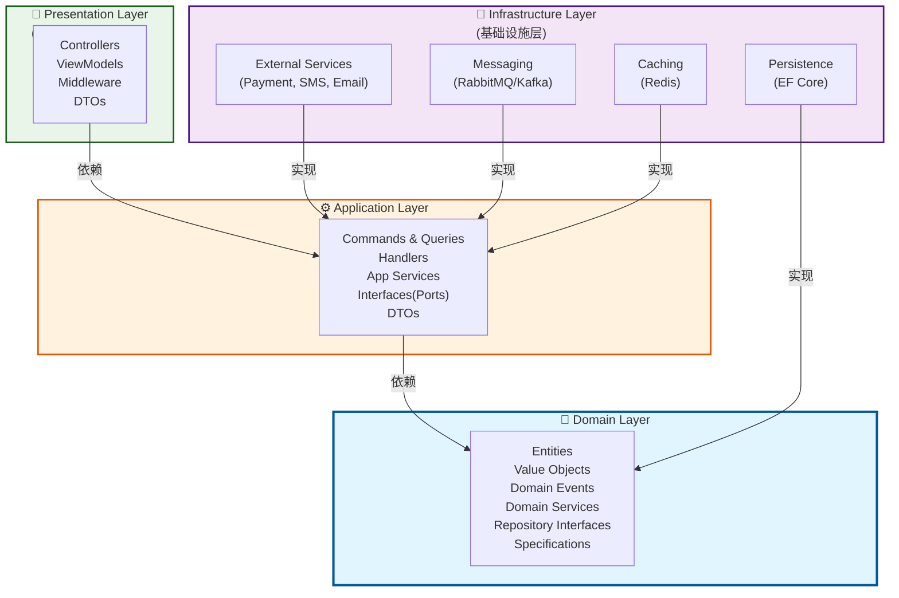
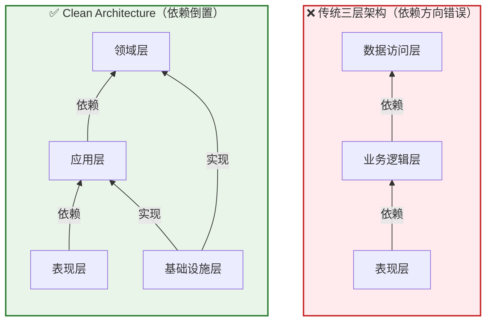

# 分层架构原则：从三层架构到Clean Architecture

> **目标读者**：有一定项目经验的开发者，希望理解为什么需要分层架构以及如何正确实施Clean Architecture
>
> **前置知识**：熟悉ASP.NET Core基础、了解依赖注入、有实际项目开发经验
>
> **相关文章**：
> - [[02-领域驱动设计(DDD)基础]] - DDD是Clean Architecture的理论基础
> - [[03-Clean-Architecture项目组织]] - 如何在项目中具体组织代码结构
> - [[04-SOLID原则实践]] - Clean Architecture的设计原则支撑

---

## 一、为什么需要分层架构？

### 1.1 现实中的痛点

想象一下这个场景：你接手了一个"祖传代码库"，所有的业务逻辑、数据访问、UI逻辑都混在一个Controller里，一个Action方法写了500行代码，里面既有SQL语句拼接，又有业务规则判断，还有HTML生成。当你需要修改一个简单的业务规则时，却发现牵一发而动全身，改了一处bug，冒出来三个新bug。

这不是危言耸听，这是很多项目的真实写照。**分层架构的核心目的就是解决这些问题**：

#### 单一职责（Single Responsibility）

每个层次只关注自己该做的事情：
- **表现层**：只负责接收请求和返回响应
- **业务逻辑层**：只负责处理业务规则
- **数据访问层**：只负责与数据库交互

```csharp
// ❌ 坏的实践：所有职责混在一起
[ApiController]
[Route("api/[controller]")]
public class OrderController : ControllerBase
{
    [HttpPost]
    public async Task<IActionResult> CreateOrder(OrderDto dto)
    {
        // 问题1：在这里做参数验证（应该是表现层的职责）
        if (string.IsNullOrEmpty(dto.CustomerName))
        {
            return BadRequest("客户名称不能为空");
        }

        // 问题2：在这里写业务逻辑（应该是业务层的职责）
        var totalAmount = dto.Items.Sum(x => x.Price * x.Quantity);
        if (totalAmount > 10000)
        {
            // VIP客户打9折
            if (dto.IsVip)
            {
                totalAmount *= 0.9m;
            }
        }

        // 问题3：直接操作数据库（应该是数据访问层的职责）
        using var connection = new SqlConnection("连接字符串");
        await connection.OpenAsync();
        var sql = $"INSERT INTO Orders (...) VALUES (...)";
        await connection.ExecuteAsync(sql, new { ... });

        return Ok(new { OrderId = orderId });
    }
}
```

#### 关注点分离（Separation of Concerns）

不同层次的变更频率不同：
- UI框架可能从MVC换成Blazor（表现层变化）
- 业务规则可能随市场需求调整（业务层变化）
- 数据库可能从SQL Server换成PostgreSQL（数据访问层变化）

如果这些都被耦合在一起，任何一处的修改都可能影响其他部分。

#### 可测试性（Testability）

这是分层架构最重要的收益之一：

```csharp
// ✅ 好的实践：各层独立可测试
// 测试业务逻辑时不需要数据库、不需要HTTP上下文
[TestClass]
public class OrderServiceTests
{
    [TestMethod]
    public void CalculateTotal_WithVipCustomer_ShouldApplyDiscount()
    {
        // Arrange
        var orderService = new OrderService();
        var order = CreateTestOrder(isVip: true, totalAmount: 15000);

        // Act
        var result = orderService.CalculateTotal(order);

        // Assert
        Assert.AreEqual(13500m, result); // 15000 * 0.9
    }

    // 这个测试运行速度极快，不依赖外部资源！
}
```

### 1.2 分层带来的挑战

当然，分层不是银弹，它也带来了新的问题：
- **初期复杂度增加**：小项目可能过度工程化
- **学习曲线**：团队需要理解各层职责边界
- **性能考量**：过多的抽象层可能有微小性能损耗
- **过度设计的诱惑**：容易陷入"为了分层而分层"

**关键原则**：根据项目规模和团队能力选择合适的分层粒度。

---

## 二、经典三层架构及其问题

### 2.1 传统三层架构回顾

大多数开发者接触的第一个分层架构就是经典的三层架构：

```
┌─────────────────────────────────┐
│         表现层 (Presentation)     │  ← Controllers, Views, DTOs
├─────────────────────────────────┤
│       业务逻辑层 (Business)       │  ← Services, Business Rules
├─────────────────────────────────┤
│        数据访问层 (Data Access)   │  ← Repositories, DbContext
└─────────────────────────────────┘
```

#### 各层职责定义

**表现层（Presentation Layer）**
- 接收用户输入和HTTP请求
- 参数验证（格式验证）
- 调用业务逻辑层处理请求
- 格式化响应数据
- 处理异常并返回合适的HTTP状态码

```csharp
// 表现层示例
[ApiController]
[Route("api/orders")]
public class OrdersController : ControllerBase
{
    private readonly IOrderService _orderService;
    private readonly IMapper _mapper;

    public OrdersController(IOrderService orderService, IMapper mapper)
    {
        _orderService = orderService;
        _mapper = mapper;
    }

    [HttpPost]
    public async Task<ActionResult<OrderResponseDto>> CreateOrder(
        [FromBody] CreateOrderRequestDto request)
    {
        // 1. 参数验证（表现层职责）
        if (!ModelState.IsValid)
            return BadRequest(ModelState);

        try
        {
            // 2. 转换DTO到领域对象
            var command = _mapper.Map<CreateOrderCommand>(request);

            // 3. 调用应用服务
            var result = await _orderService.CreateOrderAsync(command);

            // 4. 返回响应
            return CreatedAtAction(
                nameof(GetOrder),
                new { id = result.Id },
                _mapper.Map<OrderResponseDto>(result));
        }
        catch (ValidationException ex)
        {
            return BadRequest(ex.Message);
        }
        catch (NotFoundException ex)
        {
            return NotFound(ex.Message);
        }
    }
}
```

**业务逻辑层（Business Logic Layer）**
- 实现核心业务规则和工作流
- 事务管理
- 业务验证（业务规则验证）
- 协调领域对象完成业务操作

```csharp
// 业务逻辑层示例
public class OrderService : IOrderService
{
    private readonly IOrderRepository _orderRepository;
    private readonly IProductRepository _productRepository;
    private readonly IDomainEventDispatcher _eventDispatcher;
    private readonly IUnitOfWork _unitOfWork;

    public async Task<Order> CreateOrderAsync(CreateOrderCommand command)
    {
        // 1. 业务验证（业务层职责）
        var customer = await _customerRepository.GetByIdAsync(command.CustomerId);
        if (customer == null)
            throw new NotFoundException("客户不存在");

        if (!customer.CanPlaceOrder())
            throw new ValidationException("该客户不允许下单");

        // 2. 创建领域对象
        var order = Order.Create(
            customerId: command.CustomerId,
            items: command.Items.Select(i => new OrderItem(...)).ToList()
        );

        // 3. 应用业务规则
        order.ApplyDiscountPolicy(customer.DiscountPolicy);

        // 4. 持久化
        await _orderRepository.AddAsync(order);
        await _unitOfWork.SaveChangesAsync();

        // 5. 发布领域事件
        await _eventDispatcher.DispatchAsync(order.DomainEvents);

        return order;
    }
}
```

**数据访问层（Data Access Layer）**
- 封装数据库操作细节
- 实现CRUD操作
- 管理数据库连接和事务
- 对象关系映射（ORM配置）

```csharp
// 数据访问层示例
public class EfOrderRepository : IOrderRepository
{
    private readonly AppDbContext _context;

    public EfOrderRepository(AppDbContext context)
    {
        _context = context;
    }

    public async Task<Order?> GetByIdAsync(Guid id)
    {
        return await _context.Orders
            .Include(o => o.Items)
            .Include(o => o.Customer)
            .FirstOrDefaultAsync(o => o.Id == id);
    }

    public async Task AddAsync(Order order)
    {
        await _context.Orders.AddAsync(order);
    }

    public async Task UpdateAsync(Order order)
    {
        _context.Orders.Update(order);
    }

    public async Task DeleteAsync(Order order)
    {
        _context.Orders.Remove(order);
    }
}
```

### 2.2 经典三层架构的问题

虽然三层架构比没有分层好很多，但在实践中暴露出严重问题：

#### 问题1：依赖方向错误

```
❌ 三层架构的实际依赖方向：

表现层 ──→ 业务逻辑层 ──→ 数据访问层
   ↑                          │
   └────────── 依赖方向 ───────┘
```

**核心问题**：内层（业务逻辑）依赖于外层（数据访问）！

这意味着：
- 业务逻辑层无法脱离数据库进行单元测试
- 更换ORM或数据库需要修改业务逻辑代码
- 业务逻辑被技术实现细节污染

```csharp
// 典型的问题代码：业务逻辑层直接引用EF Core
public class OrderService
{
    private readonly AppDbContext _context; // ❌ 直接依赖具体的DbContext！

    public async Task ProcessOrderAsync(Guid orderId)
    {
        var order = await _context.Orders // ❌ 使用LINQ to Entities
            .Include(o => o.Items)
            .FirstOrDefaultAsync(o => o.Id == orderId);

        // 业务逻辑与数据访问耦合
        if (order != null && order.Items.Any())
        {
            order.Status = OrderStatus.Processed;
            await _context.SaveChangesAsync(); // ❌ 直接调用SaveChanges
        }
    }
}
```

#### 问题2：业务逻辑泄露到表现层

```csharp
// 表现层不应该包含这样的业务逻辑
[HttpPost]
public async Task<IActionResult> Checkout(CheckoutDto dto)
{
    var cart = await _cartService.GetCartAsync(dto.CartId);

    // ❌ 这里的折扣计算应该是业务逻辑！
    decimal discount = 0;
    if (cart.TotalAmount > 1000)
    {
        discount = cart.TotalAmount * 0.1m; // 10%折扣
    }
    else if (dto.HasCoupon)
    {
        discount = cart.TotalAmount * 0.05m; // 5%优惠券折扣
    }

    var finalAmount = cart.TotalAmount - discount;

    // ❌ 库存检查也不应该在这里
    foreach (var item in cart.Items)
    {
        var product = await _productService.GetAsync(item.ProductId);
        if (product.Stock < item.Quantity)
        {
            return BadRequest($"商品 {product.Name} 库存不足");
        }
    }

    // ...
}
```

#### 问题3：难以应对复杂业务场景

当业务变得复杂时，简单的三层无法提供足够的结构化支持：
- 跨多个聚合根的业务流程如何编排？
- 领域事件如何触发和处理？
- 复杂的业务规则如何组织和复用？

---

## 三、Clean Architecture洋葱圈模型详解

### 3.1 架构演进历程

Clean Architecture由Robert C. Martin（Uncle Bob）于2012年提出，融合了多种架构模式的精华：

```
架构演进时间线：

2004年  Alistair Cockburn 提出六边形架构（端口适配器）
          ↓
2007-2010  Domain-Driven Design 流行
          ↓
2012年  Robert C. Martin 提出 Clean Architecture
          ↓
至今  成为企业级.NET应用的标准架构模式
```

### 3.2 洋葱圈模型核心概念

Clean Architecture的核心思想可以用一个**同心圆（洋葱圈）**来表示：

```
                    ┌─────────────────────────┐
                    │                         │
                    │    Presentation Layer    │  ← 最外层
                    │   （Web API / MVC / ...） │
                    │                         │
                  ┌─┴───────────────────────┴─┐
                  │                           │
                  │    Application Layer      │  ← 用例编排
                  │  （Commands / Queries /   │
                  │     Application Services） │
                  │                           │
                ┌─┴─────────────────────────┴─┐
                │                             │
                │      Domain Layer           │  ← 核心业务
                │  （Entities / Value Objects │
                │   Domain Services / Events） │
                │                             │
                └─┬─────────────────────────┬─┘
                  │                           │
                  │    Infrastructure Layer   │  ← 技术实现
                  │  （EF Core / External APIs│
                  │    File System / Cache）  │
                  │                           │
                  └───────────────────────────┘

              ⬇️ 依赖方向：外层 → 内层（指向圆心）
```

#### 关键特性

**1. 依赖倒置（Dependency Inversion）**

这是Clean Architecture最核心的原则：

```csharp
// ✅ Clean Architecture的正确做法

// Domain层定义接口（最内层）
namespace Domain.Interfaces
{
    public interface IRepository<T> where T : IEntity
    {
        Task<T?> GetByIdAsync(Guid id);
        Task<IEnumerable<T>> GetAllAsync();
        Task AddAsync(T entity);
        Task UpdateAsync(T entity);
        Task DeleteAsync(T entity);
    }

    public interface IOrderRepository : IRepository<Order>
    {
        Task<IEnumerable<Order>> GetOrdersByCustomerAsync(Guid customerId);
        Task<IEnumerable<Order>> GetPendingOrdersAsync();
    }
}

// Infrastructure层实现接口（外层）
namespace Infrastructure.Persistence.Repositories
{
    public class EfOrderRepository : IOrderRepository
    {
        private readonly AppDbContext _context;

        public EfOrderRepository(AppDbContext context)
        {
            _context = context;
        }

        public async Task<Order?> GetByIdAsync(Guid id)
        {
            return await _context.Orders
                .Include(o => o.Items)
                .FirstOrDefaultAsync(o => o.Id == id);
        }

        // ... 其他实现
    }
}

// Application层使用接口（中间层）
namespace Application.Services
{
    public class OrderService : IOrderService
    {
        private readonly IOrderRepository _orderRepository; // ✅ 依赖接口，不是实现

        public OrderService(IOrderRepository orderRepository)
        {
            _orderRepository = orderRepository;
        }

        public async Task<Order> Handle(CreateOrderCommand command)
        {
            // 业务逻辑完全不知道底层用什么数据库
            var order = Order.Create(command.CustomerId, command.Items);
            await _orderRepository.AddAsync(order);
            return order;
        }
    }
}
```

**2. 内层不包含外层的任何引用**

```
✅ 合法的依赖：
- Application → Domain（用例编排依赖领域模型）
- Presentation → Application（控制器依赖应用服务）
- Infrastructure → Domain（仓储实现依赖实体）
- Infrastructure → Application（基础设施实现应用层接口）

❌ 非法的依赖：
- Domain → Infrastructure（领域实体不能引用EF Core）
- Domain → Presentation（领域对象不能引用Controller）
- Application → Presentation（应用服务不能引用HttpContext）
```

### 3.3 四层详细解析

#### 第1层：Domain层（领域层）—— 架构的核心

**位置**：洋葱的最中心，最稳定的一层

**包含内容**：
- **实体（Entities）**：具有唯一标识的对象
- **值对象（Value Objects）**：无标识、不可变的对象
- **领域事件（Domain Events）**：领域中发生的重要事件
- **领域服务（Domain Services）**：不属于任何实体的业务逻辑
- **仓储接口（Repository Interfaces）**：定义数据访问契约
- **规约（Specifications）**：可组合的业务规则

**严格规则**：
- ✅ 只能引用.NET基础类库
- ✅ 不能引用任何外部框架
- ✅ 不能依赖Infrastructure层
- ✅ 不能依赖Presentation层
- ✅ 可以被所有其他层依赖

```csharp
// Domain层代码示例：纯粹的C#，没有任何框架依赖
namespace Domain.Entities
{
    // 领域实体
    public class Order : Entity, IAggregateRoot
    {
        public Guid CustomerId { get; private set; }
        public OrderStatus Status { get; private set; }
        private readonly List<OrderItem> _items = new();
        public IReadOnlyCollection<OrderItem> Items => _items.AsReadOnly();
        public decimal TotalAmount => _items.Sum(i => i.TotalPrice);

        // 私有构造函数，强制通过工厂方法创建
        private Order() { } // EF Core需要

        // 工厂方法：封装创建逻辑和不变量验证
        public static Order Create(Guid customerId, List<OrderItemData> itemsData)
        {
            // 验证业务规则
            if (itemsData == null || !itemsData.Any())
                throw new DomainException("订单至少需要一个商品");

            var order = new Order
            {
                Id = Guid.NewGuid(),
                CustomerId = customerId,
                Status = OrderStatus.Created,
                CreatedAt = DateTime.UtcNow
            };

            foreach (var itemData in itemsData)
            {
                order.AddItem(itemData);
            }

            // 发布领域事件
            order.AddDomainEvent(new OrderCreatedEvent(order.Id));

            return order;
        }

        public void AddItem(OrderItemData itemData)
        {
            if (_items.Count >= 100)
                throw new DomainException("单个订单不能超过100个商品");

            var item = OrderItem.Create(
                this.Id,
                itemData.ProductId,
                itemData.UnitPrice,
                itemData.Quantity
            );

            _items.Add(item);
        }

        public void Confirm()
        {
            if (Status != OrderStatus.Created)
                throw new InvalidOperationException("只能确认已创建的订单");

            Status = OrderStatus.Confirmed;
            AddDomainEvent(new OrderConfirmedEvent(Id));
        }

        public void Cancel(string reason)
        {
            if (Status == OrderStatus.Shipped || Status == OrderStatus.Delivered)
                throw new InvalidOperationException("已发货或已送达的订单不能取消");

            Status = OrderStatus.Cancelled;
            CancellationReason = reason;
            AddDomainEvent(new OrderCancelledEvent(Id, reason));
        }
    }
}

namespace.Domain.ValueObjects
{
    // 值对象：不可变、无标识、通过值比较相等性
    public readonly record struct Money(decimal Amount, string Currency)
    {
        public static Money Zero => new(0, "CNY");

        public Money Add(Money other)
        {
            if (Currency != other.Currency)
                throw new InvalidOperationException("不能添加不同货币的金额");
            return new(Amount + other.Amount, Currency);
        }

        public Money Multiply(decimal factor) => new(Amount * factor, Currency);
    }
}

namespace.Domain.Events
{
    // 领域事件：记录领域中发生的重要事情
    public record OrderCreatedEvent(Guid OrderId) : IDomainEvent;
    public record OrderConfirmedEvent(Guid OrderId) : IDomainEvent;
    public record OrderCancelledEvent(Guid OrderId, string Reason) : IDomainEvent;
}
```

#### 第2层：Application层（应用层）—— 用例编排

**位置**：Domain之外的第二层

**包含内容**：
- **DTOs（Data Transfer Objects）**：数据传输对象
- **Commands/Queries**：CQRS命令和查询对象
- **Command Handlers/Query Handlers**：命令查询处理器
- **Application Services**：应用服务（编排用例）
- **Interfaces（Ports）**：定义需要的接口（供Infrastructure实现）
- **Mappers**：对象映射配置

**职责**：
- 编排业务用例（Use Cases）
- 协调领域对象完成业务流程
- 事务管理
- 权限验证（应用级）
- 调用外部服务

```csharp
// Application层代码示例
namespace.Application.Commands
{
    // 命令对象：表达用户的意图
    public record CreateOrderCommand(
        Guid CustomerId,
        List<CreateOrderItemDto> Items
    ) : IRequest<Guid>;

    public record CreateOrderItemDto(
        Guid ProductId,
        int Quantity,
        string? Remark = null
    );
}

namespace.Application.Handlers
{
    // 命令处理器：协调领域对象完成用例
    public class CreateOrderCommandHandler : IRequestHandler<CreateOrderCommand, Guid>
    {
        private readonly IOrderRepository _orderRepository;
        private readonly ICustomerRepository _customerRepository;
        private readonly IProductRepository _productRepository;
        private readonly IUnitOfWork _unitOfWork;
        private readonly IMediator _mediator;

        public CreateOrderCommandHandler(
            IOrderRepository orderRepository,
            ICustomerRepository customerRepository,
            IProductRepository productRepository,
            IUnitOfWork unitOfWork,
            IMediator mediator)
        {
            _orderRepository = orderRepository;
            _customerRepository = customerRepository;
            _productRepository = productRepository;
            _unitOfWork = unitOfWork;
            _mediator = mediator;
        }

        public async Task<Guid> Handle(CreateOrderCommand request, CancellationToken cancellationToken)
        {
            // 1. 验证前置条件
            var customer = await _customerRepository.GetByIdAsync(request.CustomerId);
            if (customer == null)
                throw new NotFoundException($"客户 {request.CustomerId} 不存在");

            if (!customer.IsActive)
                throw new ValidationException("客户账户已被禁用");

            // 2. 准备订单项数据
            var itemsData = new List<OrderItemData>();
            foreach (var item in request.Items)
            {
                var product = await _productRepository.GetByIdAsync(item.ProductId);
                if (product == null)
                    throw new NotFoundException($"商品 {item.ProductId} 不存在");

                if (!product.IsAvailable)
                    throw new ValidationException($"商品 {product.Name} 已下架");

                if (product.Stock < item.Quantity)
                    throw new ValidationException($"商品 {product.Name} 库存不足，剩余 {product.Stock}");

                itemsData.Add(new OrderItemData(
                    product.Id,
                    product.Price,
                    item.Quantity,
                    item.Remark
                ));
            }

            // 3. 创建订单（委托给领域对象的工厂方法）
            var order = Order.Create(request.CustomerId, itemsData);

            // 4. 持久化
            await _orderRepository.AddAsync(order);
            await _unitOfWork.SaveChangesAsync(cancellationToken);

            // 5. 发布集成事件（跨限界上下文）
            await _mediator.Publish(new OrderCreatedIntegrationEvent(order.Id), cancellationToken);

            return order.Id;
        }
    }
}
```

#### 第3层：Infrastructure层（基础设施层）—— 技术实现

**位置**：洋葱的外部，但不是最外层

**包含内容**：
- **Persistence（持久化）**：EF Core DbContext、Migration、Repository实现
- **External Services（外部服务）**：第三方API客户端（支付、短信、邮件等）
- **Messaging（消息队列）**：RabbitMQ/Kafka集成
- **Caching（缓存）**：Redis/MemoryCache实现
- **Identity（身份认证）**：JWT、Identity Server集成
- **File Storage（文件存储）**：本地文件系统、云存储（OSS/S3）

**特点**：
- 实现Application层和Domain层定义的接口
- 包含所有技术细节
- 是最容易替换的一层（更换数据库、更换消息队列等）

```csharp
// Infrastructure层代码示例
namespace.Infrastructure.Persistence
{
    // EF Core DbContext
    public class AppDbContext : DbContext
    {
        private readonly IMediator _mediator;

        public AppDbContext(DbContextOptions<AppDbContext> options, IMediator mediator)
            : base(options)
        {
            _mediator = mediator;
        }

        public DbSet<Order> Orders { get; set; }
        public DbSet<Customer> Customers { get; set; }
        public DbSet<Product> Products { get; set; }

        protected override void OnModelCreating(ModelBuilder modelBuilder)
        {
            modelBuilder.ApplyConfigurationsFromAssembly(typeof(AppDbContext).Assembly);

            // 配置领域事件自动分发
        }

        public override async Task<int> SaveChangesAsync(CancellationToken cancellationToken = default)
        {
            // 自动分发领域事件
            var domainEntities = ChangeTracker
                .Entries<Entity>()
                .Where(e => e.Entity.DomainEvents != null && e.Entity.DomainEvents.Any());

            var domainEvents = domainEntities
                .SelectMany(e => e.Entity.DomainEvents)
                .ToList();

            foreach (var entity in domainEntities)
                entity.Entity.ClearDomainEvents();

            var result = await base.SaveChangesAsync(cancellationToken);

            // 发布领域事件
            foreach (var domainEvent in domainEvents)
            {
                await _mediator.Publish(domainEvent, cancellationToken);
            }

            return result;
        }
    }
}

namespace.Infrastructure.ExternalServices.Payment
{
    // 外部支付服务实现
    public class StripePaymentService : IPaymentService
    {
        private readonly StripeClient _stripeClient;
        private readonly ILogger<StripePaymentService> _logger;

        public async Task<PaymentResult> ProcessPaymentAsync(PaymentRequest request)
        {
            try
            {
                var options = new PaymentIntentCreateOptions
                {
                    Amount = (long)(request.Amount * 100), // Stripe单位是分
                    Currency = request.Currency,
                    CustomerId = request.CustomerId,
                    Metadata = new Dictionary<string, string>
                    {
                        ["OrderId"] = request.OrderId.ToString()
                    }
                };

                var service = new PaymentIntentService(_stripeClient);
                var paymentIntent = await service.CreateAsync(options);

                return new PaymentResult
                {
                    Success = true,
                    TransactionId = paymentIntent.Id,
                    ClientSecret = paymentIntent.ClientSecret
                };
            }
            catch (StripeException ex)
            {
                _logger.LogError(ex, "支付失败: {OrderId}", request.OrderId);
                return new PaymentResult
                {
                    Success = false,
                    ErrorMessage = ex.Message
                };
            }
        }
    }
}
```

#### 第4层：Presentation层（表现层）—— 用户接口

**位置**：洋葱的最外层

**包含内容**：
- **Controllers**：API端点
- **ViewModels**：视图模型（API专用）
- **Middlewares**：中间件（异常处理、日志、认证等）
- **Filters/Attributes**：过滤器
- **DTOs**：请求/响应DTO
- **Program.cs / Startup.cs**：应用启动配置

**职责**：
- HTTP请求/响应处理
- 参数验证（格式级别）
- 认证授权
- 异常转换为HTTP响应
- API版本控制

```csharp
// Presentation层代码示例
namespace.Presentation.Controllers
{
    [ApiController]
    [ApiVersion("1.0")]
    [Route("api/v{version:apiVersion}/[controller]")]
    public class OrdersController : ControllerBase
    {
        private readonly IMediator _mediator;
        private readonly IMapper _mapper;

        public OrdersController(IMediator mediator, IMapper mapper)
        {
            _mediator = mediator;
            _mapper = mapper;
        }

        /// <summary>
        /// 创建订单
        /// </summary>
        [HttpPost]
        [ProducesResponseType(typeof(OrderResponseDto), StatusCodes.Status201Created)]
        [ProducesResponseType(typeof(ApiErrorResponse), StatusCodes.Status400BadRequest)]
        public async Task<IActionResult> CreateOrder(
            [FromBody] CreateOrderApiRequest request,
            CancellationToken cancellationToken)
        {
            // 1. 参数验证（ModelState验证由[ApiController]自动处理）

            // 2. 转换为命令对象
            var command = _mapper.Map<CreateOrderCommand>(request);

            // 3. 发送命令到MediatR
            var orderId = await _mediator.Send(command, cancellationToken);

            // 4. 返回201 Created响应
            return CreatedAtAction(
                actionName: nameof(GetOrder),
                routeValues: new { id = orderId },
                value: new { OrderId = orderId });
        }

        /// <summary>
        /// 获取订单详情
        /// </summary>
        [HttpGet("{id:guid}")]
        [ProducesResponseType(typeof(OrderDetailResponseDto), StatusCodes.Status200OK)]
        [ProducesResponseType(typeof(ApiErrorResponse), StatusCodes.Status404NotFound)]
        public async Task<IActionResult> GetOrder(Guid id, CancellationToken cancellationToken)
        {
            var query = new GetOrderByIdQuery(id);
            var order = await _mediator.Send(query, cancellationToken);

            if (order == null)
                return NotFound(new ApiErrorResponse("订单不存在"));

            var response = _mapper.Map<OrderDetailResponseDto>(order);
            return Ok(response);
        }
    }
}

namespace.Presentation.Middleware
{
    // 全局异常处理中间件
    public class ExceptionHandlingMiddleware
    {
        private readonly RequestDelegate _next;
        private readonly ILogger<ExceptionHandlingMiddleware> _logger;

        public async Task InvokeAsync(HttpContext context)
        {
            try
            {
                await _next(context);
            }
            catch (ValidationException ex)
            {
                _logger.LogWarning(ex, "验证错误");
                await HandleExceptionAsync(context, StatusCodes.Status400BadRequest, ex.Message);
            }
            catch (NotFoundException ex)
            {
                _logger.LogInformation(ex, "资源未找到");
                await HandleExceptionAsync(context, StatusCodes.Status404NotFound, ex.Message);
            }
            catch (Exception ex)
            {
                _logger.LogError(ex, "未处理的异常");
                await HandleExceptionAsync(context,
                    StatusCodes.Status500InternalServerError,
                    "服务器内部错误，请稍后重试");
            }
        }

        private static async Task HandleExceptionAsync(HttpContext context, int statusCode, string message)
        {
            context.Response.StatusCode = statusCode;
            context.Response.ContentType = "application/json";

            var response = new ApiErrorResponse(message);
            await context.Response.WriteAsync(JsonSerializer.Serialize(response));
        }
    }
}
```

---

## 四、依赖倒置原则深度解析

### 4.1 DIP的本质

依赖倒置原则（Dependency Inversion Principle, DIP）是Clean Architecture的基石：

```
传统依赖方向（错误）：
高层模块 ──→ 低层模块
   ↑
   依赖具体实现

Clean Architecture依赖方向（正确）：
高层模块 ←── 抽象接口 ←── 低层模块
   ↑                              ↑
   依赖抽象                      实现抽象
```

**DIP的两条规则**：
1. 高层模块不应依赖于低层模块，两者都应依赖于抽象
2. 抽象不应依赖于细节，细节应依赖于抽象

### 4.2 在ASP.NET Core中实践DIP

```csharp
// Program.cs - DI容器注册
var builder = WebApplication.CreateBuilder(args);

// 注册Domain层的服务（接口定义在Domain，实现在Infrastructure）
builder.Services.AddScoped<IOrderRepository, EfOrderRepository>();
builder.Services.AddScoped<ICustomerRepository, EfCustomerRepository>();
builder.Services.AddScoped<IPaymentService, StripePaymentService>();

// 注册Application层的服务
builder.Services.AddMediatR(cfg =>
{
    cfg.RegisterServicesFromAssemblyContaining<CreateOrderCommand>());
});
builder.Services.AddScoped<IUnitOfWork, UnitOfWork>();
builder.Services.AddAutoMapper(typeof(MappingProfile));

// 注册Infrastructure服务
builder.Services.AddSingleton<IMessageBus, RabbitMqMessageBus>();
builder.Services.AddScoped<ICacheService, RedisCacheService>();

var app = builder.Build();

// 配置中间件管道
app.UseMiddleware<ExceptionHandlingMiddleware>();
app.UseAuthentication();
app.UseAuthorization();

app.MapControllers();

app.Run();
```

### 4.3 依赖注入容器的作用

DI容器是实现DIP的关键工具：

```csharp
// 没有DI容器的时代（手动创建依赖）
public class OrderController : ControllerBase
{
    private readonly IOrderService _orderService;

    public OrderController()
    {
        // ❌ 手动创建依赖，违反DIP
        var dbContext = new AppDbContext("connectionString");
        var repository = new EfOrderRepository(dbContext);
        var paymentService = new StripePaymentService("api_key");
        _orderService = new OrderService(repository, paymentService);
    }
}

// 使用DI容器后（推荐方式）
public class OrderController : ControllerBase
{
    private readonly IOrderService _orderService;

    // ✅ 通过构造函数注入，依赖由容器自动提供
    public OrderController(IOrderService orderService)
    {
        _orderService = orderService;
    }
}
```

---

## 五、各层职责与规则总结

### 5.1 层次规则矩阵

| 规则 | Domain | Application | Infrastructure | Presentation |
|------|--------|-------------|----------------|--------------|
| **可以引用** | 仅BCL | Domain | Domain, Application | 所有外层 |
| **不能引用** | 所有外层 | Infrastructure, Presentation | Presentation | 无限制 |
| **可以使用** | 纯C# | MediatR, AutoMapper | EF Core, HttpClient | ASP.NET Core |
| **测试依赖** | 无需Mock | Mock接口 | 集成测试 | 集成测试 |
| **变更频率** | 极低 | 中 | 较高 | 可能高 |
| **可替换性** | 不可替换 | 较难替换 | 易替换 | 易替换 |

### 5.2 什么能做什么不能做

#### Domain层能做的：
- ✅ 定义实体、值对象、枚举
- ✅ 实现业务规则和不变量验证
- ✅ 定义领域事件
- ✅ 定义仓储接口和其他接口
- ✅ 实现领域服务（纯业务逻辑）

#### Domain层不能做的：
- ❌ 引用EF Core或其他ORM
- ❌ 引用ASP.NET Core任何组件
- ❌ 进行文件I/O操作
- ❌ 进行网络调用
- ❌ 访问数据库
- ❌ 记录日志（除非是非常基础的日志抽象）

#### Application层能做的：
- ✅ 编排业务用例
- ✅ 使用Domain层的类型
- ✅ 定义和使用DTO
- ✅ 协调多个聚合根的操作
- ✅ 管理事务边界

#### Application层不能做的：
- ❌ 包含业务规则（应放在Domain层）
- ❌ 直接访问数据库
- ❌ 包含HTTP相关的代码
- ❌ 实现Infrastructure层的接口

#### Infrastructure层能做的：
- ✅ 实现Domain和Application层定义的接口
- ✅ 配置EF Core映射
- ✅ 与外部系统集成
- ✅ 实现缓存策略

#### Infrastructure层不能做的：
- ❌ 包含业务逻辑
- ❌ 定义新的领域概念
- ❌ 被Domain层依赖

#### Presentation层能做的：
- ✅ 处理HTTP请求/响应
- ✅ 参数验证（格式级别）
- ✅ 认证授权
- ✅ 返回适当的HTTP状态码

#### Presentation层不能做的：
- ❌ 包含业务逻辑
- ❌ 直接访问数据库
- ❌ 绕过Application层直接调用Domain层

---

## 六、与DDD分层的关系

### 6.1 Clean Architecture vs DDD分层

Clean Architecture和DDD（Domain-Driven Design）经常一起使用，它们的关系如下：

```
Clean Architecture四层 vs DDD分层对应关系：

Clean Architecture          DDD分层
─────────────────          ─────────
Domain Layer      ↔        Domain Layer（实体、值对象、领域服务）
Application Layer ↔        Application Layer（应用服务、用例）
Infrastructure     ↔        Infrastructure（技术实现）
Presentation       ↔        Interface（接口层/用户界面）
```

### 6.2 DDD战略设计在CA中的体现

| DDD概念 | 在Clean Architecture中的位置 |
|---------|---------------------------|
| 限界上下文（Bounded Context） | 通常是一个完整的解决方案或模块 |
| 聚合根（Aggregate Root） | Domain层的实体 |
| 领域事件（Domain Event） | Domain层的事件 |
| 领域服务（Domain Service） | Domain层的服务 |
| 应用服务（Application Service） | Application层的服务 |
| 仓储（Repository） | 接口在Domain，实现在Infrastructure |
| 工厂（Factory） | Domain层的工厂方法 |

---

## 七、Mermaid架构图

### 7.1 Clean Architecture依赖方向图



### 7.2 项目包结构示意

```mermaid
graph LR
    subgraph Solution["解决方案 MySolution.sln"]
        subgraph Src["src/"]
            subgraph DomainProj["MyProject.Domain"]
                Direction LR
                D_Entities["Entities/"]
                D_ValueObjects["ValueObjects/"]
                D_Events["Events/"]
                D_Services["Services/"]
                D_Interfaces["Interfaces/"]
                D_Specifications["Specifications/"]
            end

            subgraph AppProj["MyProject.Application"]
                Direction LR
                A_Commands["Commands/"]
                A_Queries["Queries/"]
                A_Handlers["Handlers/"]
                A_Services["Services/"]
                A_Interfaces["Interfaces/"]
                A_DTOs["DTOs/"]
                A_Mappers["Mappers/"]
            end

            subgraph InfraProj["MyProject.Infrastructure"]
                Direction LR
                I_Persistence["Persistence/"]
                I_External["ExternalServices/"]
                I_Messaging["Messaging/"]
                I_Caching["Caching/"]
            end

            subgraph PresProj["MyProject.Presentation"]
                Direction LR
                P_Controllers["Controllers/"]
                P_ViewModels["ViewModels/"]
                P_Middleware["Middleware/"]
                P_Filters["Filters/"]
            end
        end

        subgraph Tests["tests/"]
            T_UnitTests["Unit.Tests"]
            T_IntegrationTests["Integration.Tests"]
            T_API_tests["API.Tests"]
        end
    end

    AppProj -->|"引用"| DomainProj
    InfraProj -->|"引用"| DomainProj
    InfraProj -->|"引用"| AppProj
    PresProj -->|"引用"| AppProj
    T_UnitTests -->|"引用"| DomainProj
    T_UnitTests -->|"引用"| AppProj
    T_IntegrationTests -->|"引用"| InfraProj
    T_API_tests -->|"引用"| PresProj

    style DomainProj fill:#e1f5fe,stroke:#01579b,stroke-width:2px
    style AppProj fill:#fff3e0,stroke:#e65100,stroke-width:2px
    style InfraProj fill:#f3e5f5,stroke:#4a148c,stroke-width:2px
    style PresProj fill:#e8f5e8,stroke:#1b5e20,stroke-width:2px
```

### 7.3 依赖流向对比图



---

## 八、从三层架构迁移到Clean Architecture

### 8.1 迁移步骤详解

如果你的项目目前使用的是传统三层架构，以下是逐步迁移到Clean Architecture的建议路径：

#### 步骤1：评估和规划（1-2天）

```markdown
## 迁移评估清单

### 当前状态分析
- [ ] 列出所有现有的项目/程序集
- [ ] 识别当前的业务逻辑分布位置
- [ ] 找出循环依赖（使用工具如 ReSharper 或 NDepend）
- [ ] 评估测试覆盖率
- [ ] 识别关键技术依赖（EF Core版本、第三方库等）

### 目标状态定义
- [ ] 确定新的项目结构
- [ ] 制定命名规范
- [ ] 定义各层职责边界
- [ ] 选择技术栈（MediatR、AutoMapper等）
```

#### 步骤2：创建Domain层项目（3-5天）

**这是迁移的第一步，也是最关键的一步**

```bash
# 1. 创建新的类库项目
dotnet new classlib -n MyProject.Domain

# 2. 添加基础类型
mkdir Entities
mkdir ValueObjects
mkdir Events
mkdir Interfaces
mkdir Enums
```

**迁移顺序建议**：

```csharp
// 1️⃣ 先迁移枚举和简单类型（零风险）
namespace.Domain.Enums
{
    public enum OrderStatus
    {
        Created = 1,
        Confirmed = 2,
        Paid = 3,
        Shipped = 4,
        Delivered = 5,
        Cancelled = -1
    }

    public enum PaymentMethod
    {
        Alipay = 1,
        WeChat = 2,
        CreditCard = 3,
        BankTransfer = 4
    }
}

// 2️⃣ 迁移值对象（确保不可变性）
namespace.Domain.ValueObjects
{
    public readonly record struct Address(
        string Province,
        string City,
        string District,
        string Street,
        string ZipCode
    )
    {
        public static Address Create(string province, string city, string district, string street, string zipCode)
        {
            if (string.IsNullOrWhiteSpace(province))
                throw new ArgumentException("省份不能为空", nameof(province));

            // 其他验证...

            return new Address(province, city, district, street, zipCode);
        }
    }
}

// 3️⃣ 迁移实体（提取业务逻辑到实体内部）
namespace.Domain.Entities
{
    public class Order : Entity
    {
        // 从原来的Service中提取行为到这里
        public void CalculateTotal() { /* ... */ }
        public void ApplyDiscount(decimal percentage) { /* ... */ }
        public bool CanCancel() { /* ... */ }
    }
}

// 4️⃣ 定义仓储接口
namespace.Domain.Interfaces
{
    public interface IOrderRepository : IRepository<Order>
    {
        Task<IEnumerable<Order>> GetPendingOrdersAsync();
        Task<IEnumerable<Order>> GetByDateRangeAsync(DateTime start, DateTime end);
    }
}
```

#### 步骤3：提取Application层（5-7天）

```bash
# 创建Application层项目
dotnet new classlib -n MyProject.Application

# 添加对Domain层的引用
dotnet add reference ../MyProject.Domain/MyProject.Domain.csproj

# 安装必要的NuGet包
dotnet add package MediatR
dotnet add package AutoMapper.Extensions.Microsoft.DependencyInjection
dotnet add package FluentValidation.DependencyInjectionExtensions
```

**重构Service为Command Handler**：

```csharp
// ❌ 原来的三层架构Service
public class OrderService : IOrderService
{
    private readonly AppDbContext _context; // 直接依赖EF Core

    public async Task CreateOrderAsync(CreateOrderDto dto)
    {
        // 大量业务逻辑混在这里...
    }
}

// ✅ 重构后的Clean Architecture结构

// Command定义
public record CreateOrderCommand(...) : IRequest<Guid>;

// Command Handler
public class CreateOrderCommandHandler : IRequestHandler<CreateOrderCommand, Guid>
{
    private readonly IOrderRepository _orderRepository; // 依赖接口
    // ...

    public async Task<Guid> Handle(CreateOrderCommand request, CancellationToken ct)
    {
        // 只包含用例编排，不包含业务规则
    }
}
```

#### 步骤4：重构Infrastructure层（3-5天）

```bash
# 重命名或创建新的Infrastructure项目
dotnet new classlib -n MyProject.Infrastructure

# 添加引用
dotnet add reference ../MyProject.Domain/MyProject.Domain.csproj
dotnet add reference ../MyProject.Application/MyProject.Application.csproj

# 安装EF Core
dotnet add package Microsoft.EntityFrameworkCore.SqlServer
dotnet add package Microsoft.EntityFrameworkCore.Design
```

**将Repository实现移到Infrastructure**：

```csharp
namespace Infrastructure.Persistence.Repositories
{
    public class EfOrderRepository : IOrderRepository
    {
        private readonly AppDbContext _context;

        public EfOrderRepository(AppDbContext context)
        {
            _context = context;
        }

        // 实现所有接口方法
    }
}
```

#### 步骤5：调整Presentation层（2-3天）

```csharp
// Controller瘦身：只保留HTTP处理逻辑
[ApiController]
[Route("api/orders")]
public class OrdersController : ControllerBase
{
    private readonly IMediator _mediator;

    public OrdersController(IMediator mediator)
    {
        _mediator = mediator;
    }

    [HttpPost]
    public async Task<IActionResult> Create([FromBody] CreateOrderApiRequest request)
    {
        var command = new CreateOrderCommand(/* ... */);
        var result = await _mediator.Send(command);
        return CreatedAtAction(nameof(Get), new { id = result }, null);
    }
}
```

#### 步骤6：配置DI容器（1天）

```csharp
// Program.cs
var builder = WebApplication.CreateBuilder(args);

// Infrastructure层注册
builder.Services.AddInfrastructure(builder.Configuration);

// Application层注册
builder.Services.AddApplication();

// Presentation层配置
builder.Services.AddControllers();
builder.Services.AddEndpointsApiExplorer();
builder.Services.AddSwaggerGen();

var app = builder.Build();

app.UseInfrastructure(); // 中间件注册
app.MapControllers();
app.Run();
```

### 8.2 渐进式迁移策略

**不要试图一次性完成迁移！** 推荐采用渐进式方法：

```
阶段1（第1周）：建立新结构
├── 创建Domain项目，迁移枚举和值对象
├── 定义仓储接口
└── 新功能使用新结构，旧功能保持不变

阶段2（第2-3周）：迁移核心模块
├── 选择一个相对独立的模块进行完整迁移
├── 验证迁移效果
└── 总结经验教训

阶段3（第4-6周）：全面迁移
├── 按优先级逐个迁移其他模块
├── 保持每个阶段都可编译运行
└── 补充单元测试和集成测试

阶段4（持续优化）：完善和改进
├── 添加缺失的领域事件
├── 优化查询性能
└── 完善文档
```

---

## 九、常见错误与反模式

### 9.1 错误1：循环依赖

```
❌ 循环依赖示例：

Domain ← Application
  ↑         │
  └─────────┘
```

**症状**：
- 编译错误："Circular dependency detected"
- 运行时依赖注入失败
- NuGet包还原冲突

**原因**：
- Application层的DTO引用了Domain层的实体
- Domain层的基类引用了Application层的接口
- Infrastructure层的工具类被Domain层使用

**解决方案**：

```csharp
// ❌ 错误：Application层DTO继承Domain实体
namespace.Application.DTOs
{
    public class OrderDto : Order // ❌ 不要这样！
    {
        public string CustomerName { get; set; } // 额外的展示字段
    }
}

// ✅ 正确：DTO是独立的类，通过Mapper转换
namespace.Application.DTOs
{
    public class OrderDto
    {
        public Guid Id { get; set; }
        public string OrderNumber { get; set; }
        public decimal TotalAmount { get; set; }
        public string CustomerName { get; set; }
        // ...
    }
}
```

### 9.2 错误2：跨越多层

```
❌ 跨越多层示例：

Presentation → Domain（跳过Application）
```

**症状**：
- Controller直接调用Repository
- Controller直接实例化Entity并调用其方法
- 缺少事务管理和权限控制

**错误代码**：

```csharp
// ❌ 错误：Controller直接使用Repository
[ApiController]
[Route("api/products")]
public class ProductsController : ControllerBase
{
    private readonly IProductRepository _repository; // ❌ 不应该在这里注入

    [HttpGet("{id}")]
    public async Task<IActionResult> GetProduct(int id)
    {
        var product = await _repository.GetByIdAsync(id); // ❌ 跳过Application层
        return Ok(product);
    }
}
```

**正确做法**：

```csharp
// ✅ 正确：Controller → Application Service → Repository
[ApiController]
[Route("api/products")]
public class ProductsController : ControllerBase
{
    private readonly IMediator _mediator;

    [HttpGet("{id}")]
    public async Task<IActionResult> GetProduct(int id)
    {
        var query = new GetProductByIdQuery(id); // Query对象在Application层
        var result = await _mediator.Send(query); // 通过MediatR发送
        return Ok(result);
    }
}
```

### 9.3 错误3：领域层引用基础设施

```
❌ 致命错误：Domain层引用Infrastructure

Domain → Infrastructure（绝对不允许！）
```

**症状**：
- Domain项目引用了EF Core包
- Entity类使用了`[Table]`、`[Column]`等特性
- 领域服务中包含了DbContext的使用

**错误代码**：

```csharp
// ❌ 错误：Domain实体使用EF Core特性
using Microsoft.EntityFrameworkCore; // ❌ Domain层不应该引用这个！

namespace.Domain.Entities
{
    [Table("Orders")] // ❌ 这是Infrastructure的关注点
    public class Order
    {
        [Key]
        [DatabaseGenerated(DatabaseGeneratedOption.Identity)]
        public Guid Id { get; set; } // ❌ 不应该在这里配置

        [ForeignKey("CustomerId")]
        public virtual Customer Customer { get; set; } // ❌ 导航属性配置
    }
}
```

**正确做法**：

```csharp
// ✅ 正确：Domain实体是纯净的POCO
namespace.Domain.Entities
{
    public class Order : Entity, IAggregateRoot
    {
        public Guid Id { get; set; }
        public Guid CustomerId { get; private set; }

        // 导航属性可以是虚拟的，但不加EF特性
        // EF Core配置应该在Infrastructure层的EntityTypeConfiguration中
    }
}

// Infrastructure层的EF Core配置
namespace.Infrastructure.Data.Configurations
{
    internal class OrderConfiguration : IEntityTypeConfiguration<Order>
    {
        public void Configure(EntityTypeBuilder<Order> builder)
        {
            builder.ToTable("Orders");
            builder.HasKey(o => o.Id);
            builder.Property(o => o.Id).ValueGeneratedNever();
            // ...
        }
    }
}
```

### 9.4 错误4：贫血模型

```
❌ 贫血模型：只有getter/setter，没有行为
```

**症状**：
- Entity只有属性，没有方法
- 所有业务逻辑都在Service中
- Entity只是数据的容器（Data Container）

**错误代码**：

```csharp
// ❌ 错误：贫血模型
public class Order
{
    public Guid Id { get; set; }
    public decimal TotalAmount { get; set; }
    public OrderStatus Status { get; set; }
    // 只有数据，没有行为！
}

// 业务逻辑散落在Service中
public class OrderService
{
    public void CancelOrder(Order order)
    {
        if (order.Status == OrderStatus.Shipped)
            throw new Exception("不能取消"); // 业务规则在Service里

        order.Status = OrderStatus.Cancelled;
    }
}
```

**正确做法**：

```csharp
// ✅ 正确：富领域模型（Rich Domain Model）
public class Order : Entity, IAggregateRoot
{
    public Guid Id { get; private set; }
    public decimal TotalAmount { get; private set; }
    public OrderStatus Status { get; private set; }

    // 行为封装在实体内部
    public void Cancel(string reason)
    {
        ValidateCanCancel(); // 内部验证
        Status = OrderStatus.Cancelled;
        CancellationReason = reason;
        AddDomainEvent(new OrderCancelledEvent(Id, reason));
    }

    private void ValidateCanCancel()
    {
        if (Status == OrderStatus.Shipped || Status == OrderStatus.Delivered)
            throw new DomainException("已发货或已送达的订单不能取消");
    }
}
```

### 9.5 错误5：God Object（上帝对象）

```
❌ God Object：一个类承担过多职责
```

**症状**：
- 一个Service类有几千行代码
- 一个Controller处理所有相关的API
- 一个Entity包含几十个属性和方法

**解决方法**：遵循单一职责原则，适当拆分

```csharp
// ❌ 错误：God Service
public class OrderService
{
    // 50+ 方法，涵盖订单的全生命周期
    public async Task CreateOrderAsync(...) { }
    public async Task PayOrderAsync(...) { }
    public async Task ShipOrderAsync(...) { }
    public async Task DeliverOrderAsync(...) { }
    public async Task CancelOrderAsync(...) { }
    public async Task ReturnOrderAsync(...) { }
    public async Task RefundOrderAsync(...) { }
    public async Task CalculateDiscountAsync(...) { }
    public async Task ApplyCouponAsync(...) { }
    // ... 还有很多
}

// ✅ 正确：按职责拆分
// 命令处理器各自独立
public class CreateOrderHandler : IRequestHandler<CreateOrderCommand, Guid> { }
public class PayOrderHandler : IRequestHandler<PayOrderCommand, PaymentResult> { }
public class ShipOrderHandler : IRequestHandler<ShipOrderCommand> { }
public class CancelOrderHandler : IRequestHandler<CancelOrderCommand> { }

// 或者按领域拆分应用服务
public interface IOrderCreationService { }
public interface IOrderPaymentService { }
public interface IOrderFulfillmentService { }
```

---

## 十、总结与最佳实践

### 10.1 Clean Architecture核心理念总结

```
┌─────────────────────────────────────────────────────┐
│              Clean Architecture 核心                 │
├─────────────────────────────────────────────────────┤
│                                                     │
│  1. 依赖倒置：内层不依赖外层，依赖指向中心             │
│                                                     │
│  2. 关注点分离：每层只关注自己的职责                   │
│                                                     │
│  3. 稳定性：越靠近中心越稳定，越不容易变化              │
│                                                     │
│  4. 可测试性：内层可以独立于外层进行单元测试             │
│                                                     │
│  5. 独立于框架：核心业务逻辑不绑定任何特定框架           │
│                                                     │
│  6. 独立于UI：可以在Web、桌面、移动端、API之间切换       │
│                                                     │
│  7. 独立于数据库：可以轻松更换数据库或ORM               │
│                                                     │
│  8. 独立于外部 agency：业务逻辑不关心外部API            │
│                                                     │
└─────────────────────────────────────────────────────┘
```

### 10.2 实施Checklist

在开始实施Clean Architecture前，请确认：

- [ ] 团队成员理解分层架构的基本理念
- [ ] 有明确的编码规范和命名约定
- [ ] 选择合适的技术栈（MediatR、AutoMapper、FluentValidation等）
- [ ] 建立代码审查机制，确保依赖规则不被破坏
- [ ] 准备好自动化测试策略
- [ ] 有渐进式迁移计划，而不是一次性重写

### 10.3 何时使用Clean Architecture？

**适合使用的场景**：
- ✅ 中大型企业级应用（预期生命周期超过2年）
- ✅ 业务逻辑复杂，需要长期维护
- ✅ 团队规模较大（5人以上）
- ✅ 需要高测试覆盖率
- ✅ 可能需要更换UI框架或数据库
- ✅ 采用领域驱动设计（DDD）

**可能过度工程的场景**：
- ⚠️ 小型原型或MVP（快速验证想法）
- ⚠️ CRUD为主的简单应用
- ⚠️ 个人项目或短期项目
- ⚠️ 团队缺乏架构经验
- ⚠️ 时间压力极大，需要快速交付

**对于小型项目，可以考虑简化版的Clean Architecture**：
- 合并Application和Domain为一个项目
- 简化CQRS，不强制分离Command和Query
- 减少抽象层级

### 10.4 学习路径建议

```
初学者路径：
1. 理解依赖倒置原则（DIP）
2. 学习基本的分层架构
3. 在小项目中练习
4. 逐步引入DDD概念
5. 学习使用MediatR和AutoMapper
6. 完整实施Clean Architecture

进阶路径：
1. 深入学习DDD战术模式
2. 掌握领域事件和事件驱动架构
3. 学习微服务架构
4. 研究CQRS和Event Sourcing
5. 探索Reactive Architecture
```

---

## 参考资源

### 必读书籍
1. **《Clean Architecture》** - Robert C. Martin（Bob大叔）
2. **《领域驱动设计：软件核心复杂性应对之道》** - Eric Evans
3. **《实现领域驱动设计》** - Vaughn Vernon
4. **《架构整洁之道》** - Robert C. Martin

### 推荐开源项目
- [CleanArchitecture](https://github.com/jasontaylordev/CleanArchitecture) - Jason Taylor的经典模板
- [NETCleanArchitecture](https://github.com/ardalis/CleanArchitecture) - Steve Smith的实现
- [eShopOnContainers](https://github.com/dotnet-architecture/eShopOnContainers) - 微软官方示例

### 在线资源
- [Microsoft Docs - .NET微服务架构](https://docs.microsoft.com/en-us/dotnet/architecture/microservices/)
- [DevIQ - SOLID Principles](https://deviq.com/principles/)
- [Pluralsight - Clean Architecture课程](https://www.pluralsight.com/)

---

> **下一篇**：[[02-领域驱动设计(DDD)基础]] - 深入了解DDD的核心概念，它是Clean Architecture的理论基础
>
> **上一篇**：返回 [[00-高手篇目录]]

---

**关键词**：Clean Architecture、整洁架构、洋葱圈架构、分层架构、依赖倒置、DDD、SOLID、领域驱动设计、ASP.NET Core、企业级架构
