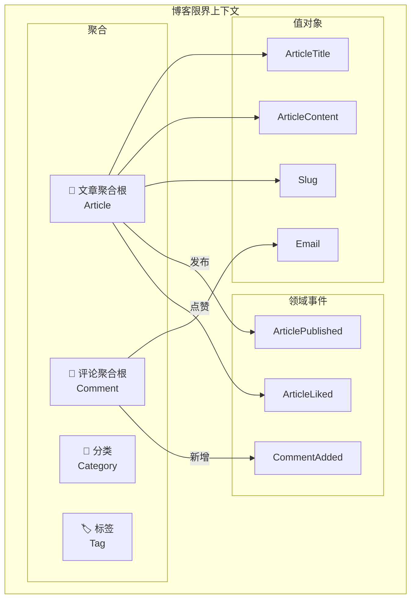
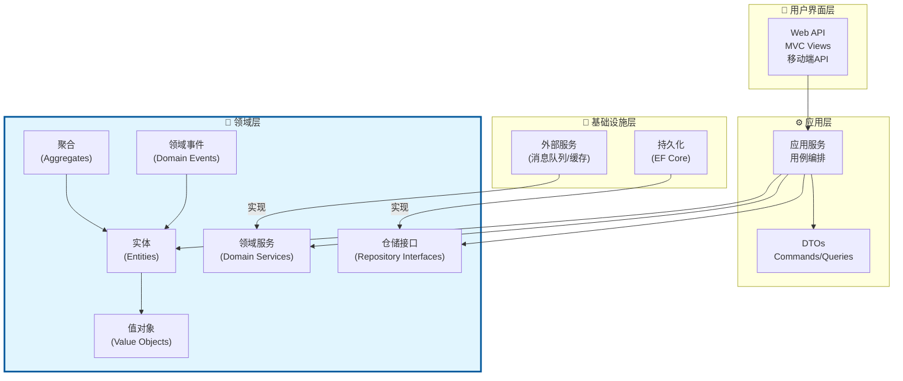
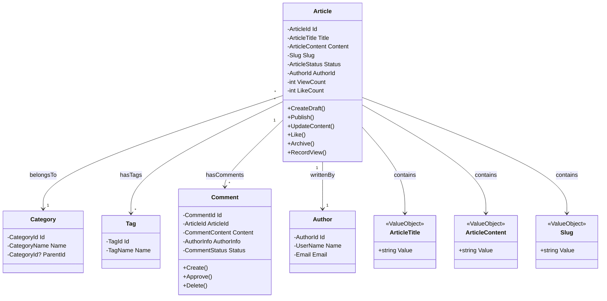
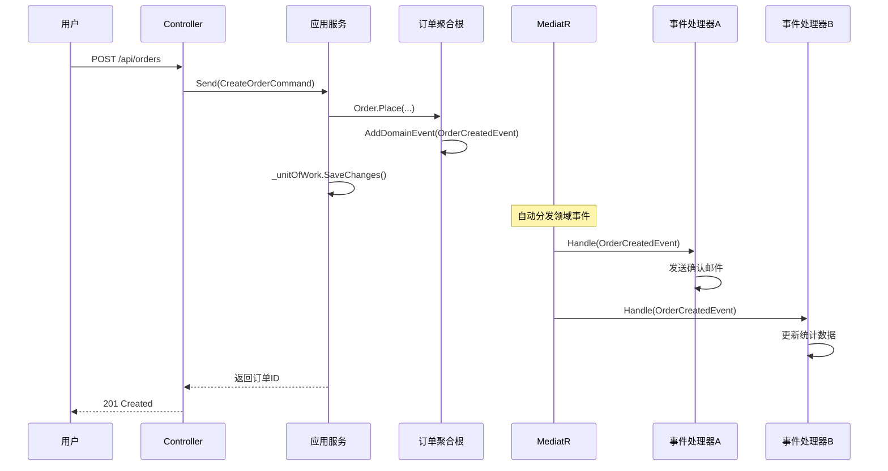

# 领域驱动设计（DDD）基础：以领域为中心的软件设计

> **目标读者**：有一定项目经验的开发者，希望学习如何通过DDD构建可维护、可演进的复杂业务系统
>
> **前置知识**：熟悉面向对象编程基础、了解基本的设计模式、有实际项目开发经验
>
> **相关文章**：
> - [[01-分层架构原则]] - DDD与Clean Architecture的关系
> - [[03-Clean-Architecture项目组织]] - 如何在项目中组织DDD代码
> - [[04-SOLID原则实践]] - DDD实现中的设计原则

---

## 一、DDD核心理念

### 1.1 什么是领域驱动设计？

**领域驱动设计（Domain-Driven Design，简称DDD）** 是一种软件设计方法论，由Eric Evans在其2003年的同名著作中正式提出。它的核心思想是：

```
┌─────────────────────────────────────────────────────┐
│           DDD 的核心哲学                             │
├─────────────────────────────────────────────────────┤
│                                                     │
│  "复杂度不在技术，而在业务领域本身"                     │
│                                                     │
│  软件设计的焦点应该是：                               │
│  • 精准地表达业务领域知识                              │
│  • 让代码成为业务的"活文档"                            │
│  • 通过模型驱动设计和开发决策                          │
│  • 让领域专家和开发者使用相同的语言交流                  │
│                                                     │
└─────────────────────────────────────────────────────┘
```

#### 传统方式 vs DDD方式

```csharp
// ❌ 传统方式：以数据库为中心
// 开发者思维："我需要创建哪些表？表之间什么关系？"

public class OrderDto
{
    public int OrderId { get; set; }        // 对应数据库主键
    public int CustomerId { get; set; }     // 外键
    public string CustomerName { get; set; } // 冗余字段，为了查询方便
    public decimal TotalAmount { get; set; }
    public string Status { get; set; }      // 字符串存储状态
    public DateTime CreateTime { get; set; }
    public DateTime? PayTime { get; set; }
}

// ✅ DDD方式：以领域为中心
// 开发者思维："订单在业务上是什么？它有哪些行为和规则？"

namespace Domain.Entities
{
    /// <summary>
    /// 订单聚合根：代表客户的一次购买行为
    /// </summary>
    public class Order : AggregateRoot<OrderId>
    {
        private readonly List<OrderItem> _items = new();

        public OrderNumber OrderNumber { get; private set; }
        public CustomerId CustomerId { get; private set; }
        public OrderStatus Status { get; private set; }
        public Money TotalAmount { get; private set; }
        public DateTime CreatedAt { get; private set; }
        public DateTime? PaidAt { get; private set; }

        // 行为而非数据
        public void Confirm() { /* 业务规则 */ }
        public void Ship(TrackingNumber trackingNo) { /* 业务规则 */ }
        public void Complete() { /* 业务规则 */ }
        public Money CalculateDiscount(CustomerLevel level) { /* 业务规则 */ }
    }
}
```

### 1.2 为什么需要DDD？

#### 软件开发的根本挑战

软件开发面临的最大挑战不是技术问题，而是**业务复杂性**：

| 挑战类型 | 示例 | 影响 |
|---------|------|------|
| **业务规则复杂** | 电商系统的促销规则、金融系统的风控规则 | 逻辑散落各处，难以维护 |
| **领域概念模糊** | 不同部门对"客户"、"订单"理解不同 | 沟通成本高，需求频繁变更 |
| **边界不清晰** | 功能模块职责重叠 | 修改一处影响多处 |
| **变化频繁** | 市场竞争导致业务策略经常调整 | 代码难以适应变化 |

#### DDD如何解决这些问题？

```
问题 → DDD解决方案

1. 业务规则复杂
   ↓ 使用领域模型精确表达业务规则
   → 规则集中在领域对象内部，易于理解和修改

2. 领域概念模糊
   ↓ 建立通用语言（Ubiquitous Language）
   → 所有 Stakeholder 使用统一术语

3. 边界不清晰
   ↓ 划分限界上下文（Bounded Context）
   → 每个上下文有明确的职责范围

4. 变化频繁
   ↓ 分离稳定的核心域和变化的支撑域
   → 核心域保持稳定，支撑域灵活调整
```

### 1.3 DDD的战略设计与战术设计

DDD分为两个层次：

```
┌─────────────────────────────────────────────────────┐
│                   DDD 全景图                         │
├─────────────────────────────────────────────────────┤
│                                                     │
│  ┌─────────────────────────────────────────────┐   │
│  │          战略设计（Strategic Design）         │   │
│  │  关注：系统整体结构、团队协作、上下文划分       │   │
│  │  工具：限界上下文、上下文映射、核心域识别      │   │
│  │  参与者：架构师、技术负责人、领域专家           │   │
│  ├─────────────────────────────────────────────┤   │
│  │          战术设计（Tactical Design）          │   │
│  │  关注：具体的代码结构和设计模式                │   │
│  │  工具：实体、值对象、聚合、领域事件等          │   │
│  │  参与者：所有开发人员                         │   │
│  └─────────────────────────────────────────────┘   │
│                                                     │
│  战略设计指导战术设计的选择                           │
│  战术设计支撑战略设计的落地                           │
│                                                     │
└─────────────────────────────────────────────────────┘
```

---

## 二、通用语言（Ubiquitous Language）

### 2.1 什么是通用语言？

**通用语言（Ubiquitous Language）** 是DDD中最重要但也最容易被忽视的概念。它指的是：

> **在项目的所有参与者（包括领域专家、产品经理、开发人员、测试人员等）之间共享的、一致的、精准的语言**

这个语言不仅仅是术语表，更是**团队的思维方式和工作方式**。

### 2.2 没有通用语言的后果

想象这个场景：

```
场景：电商系统的"订单状态"讨论

🗣️ 产品经理：
   "用户下单后，订单变成'已确认'状态"

💻 开发人员A（心想）：
   "OK，OrderStatus = Confirmed"

📊 数据库设计师（心想）：
   "status字段设为'confirmed'字符串"

🧪 测试人员（心想）：
   "测试用例：验证下单后状态变为'已确认'"

⚠️ 三周后...

🗣️ 产品经理：
   "不对，用户下单后应该先进入'待支付'状态，
    支付成功后才变成'已确认'！"

😱 所有人：
   "啊？！我们之前理解的都不一样！"
```

**没有通用语言导致的问题**：
- 需求理解偏差
- 大量返工
- 代码与业务脱节
- 文档与实际不符
- 团队沟通效率低下

### 2.3 建立通用语言的实践

#### 实践1：创建领域术语表

```markdown
# 项目领域术语表 - 订单管理模块

## 核心概念

### 订单（Order）
- **定义**：客户确认购买商品后生成的交易记录
- **生命周期**：创建 → 待支付 → 已支付 → 已发货 → 已签收 / 已取消
- **唯一标识**：订单号（OrderNumber），格式：YYYYMMDD + 8位随机数
- **不变量**：
  - 订单至少包含一个商品项
  - 订单总金额 = Σ(商品单价 × 数量)
  - 已发货的订单不能取消

### 订单项（OrderItem）
- **定义**：订单中的一个商品条目
- **包含信息**：商品ID、商品名称（快照）、单价（下单时价格）、数量
- **注意**：订单项记录的是下单时的商品信息，后续商品价格变更不影响已有订单

### 聚合根（Aggregate Root）
- *技术术语，非业务术语，不需要对业务人员解释*

## 动词/行为

### 下单（Place Order）
- **触发条件**：客户将商品加入购物车并确认购买
- **前置条件**：客户已登录、购物车不为空、所有商品有库存
- **结果**：创建新订单，库存预占，生成待支付记录

### 支付（Pay）
- **触发条件**：客户完成付款操作
- **支持方式**：支付宝、微信支付、银行卡
- **结果**：订单状态变更为"已支付"，释放预占库存为实际扣减

### 取消订单（Cancel Order）
- **业务规则**：
  - 未支付订单：随时可取消
  - 已支付未发货：可申请退款后取消
  - 已发货：不能取消，只能申请售后
```

#### 实践2：让代码成为活的文档

```csharp
// ✅ 好的实践：代码直接反映通用语言
// 当你读到这段代码时，就像在读业务文档

namespace Domain.Entities
{
    /// <summary>
    /// 订单：客户确认购买商品后生成的交易记录
    /// </summary>
    /// <remarks>
    /// 生命周期：创建 → 待支付 → 已支付 → 已发货 → 已签收 / 已取消
    /// 不变量：
    /// - 订单至少包含一个商品项
    /// - 已发货的订单不能取消
    /// </remarks>
    public class Order : AggregateRoot<OrderId>, IAggregateRoot
    {
        public OrderNumber OrderNumber { get; private set; }
        public OrderStatus Status { get; private set; }
        private readonly List<OrderItem> _items = new();
        public IReadOnlyCollection<OrderItem> Items => _items.AsReadOnly();

        /// <summary>
        /// 创建订单：将客户的购买意图转化为正式的交易记录
        /// </summary>
        /// <exception cref="DomainException">
        /// 当违反以下业务规则时抛出：
        /// - 订单必须至少包含一个商品项
        /// - 所有商品必须有效且可购买
        /// </exception>
        public static Order Place(
            CustomerId customerId,
            List<CartItem> cartItems,
            IProductAvailabilityChecker availabilityChecker)
        {
            // 验证：购物车不能为空
            if (cartItems == null || !cartItems.Any())
            {
                throw new DomainException("订单必须至少包含一个商品项");
            }

            var order = new Order
            {
                Id = OrderId.New(),
                OrderNumber = OrderNumber.Generate(),
                CustomerId = customerId,
                Status = OrderStatus.PendingPayment, // 创建后进入待支付状态
                CreatedAt = DateTime.UtcNow
            };

            // 将购物车商品转换为订单项
            foreach (var cartItem in cartItems)
            {
                var orderItem = OrderItem.CreateFromCartItem(cartItem);
                order._items.Add(orderItem);
            }

            // 发布领域事件
            order.AddDomainEvent(new OrderPlacedDomainEvent(
                order.Id,
                order.CustomerId,
                order.TotalAmount
            ));

            return order;
        }

        /// <summary>
        /// 支付订单：完成款项支付
        /// </summary>
        public void Pay(PaymentId paymentId, Money amount, DateTime paidAt)
        {
            EnsureCanPay(); // 内部验证状态

            if (amount != TotalAmount)
            {
                throw new DomainException($"支付金额{amount}与订单金额{TotalAmount}不匹配");
            }

            Status = OrderStatus.Paid;
            PaidAt = paidAt;
            PaymentId = paymentId;

            AddDomainEvent(new OrderPaidDomainEvent(Id, paymentId, amount));
        }

        /// <summary>
        /// 发货：将商品交付给物流公司
        /// </summary>
        public void Ship(TrackingNumber trackingNumber)
        {
            EnsureCanShip(); // 只有已支付的订单才能发货

            Status = OrderStatus.Shipped;
            TrackingNumber = trackingNumber;
            ShippedAt = DateTime.UtcNow;

            AddDomainEvent(new OrderShippedDomainEvent(Id, trackingNumber));
        }

        /// <summary>
        /// 取消订单：根据当前状态执行不同的取消逻辑
        /// </summary>
        public void Cancel(string reason)
        {
            switch (Status)
            {
                case OrderStatus.PendingPayment:
                    // 未支付订单可直接取消
                    Status = OrderStatus.Cancelled;
                    break;

                case OrderStatus.Paid:
                    // 已支付订单需要走退款流程
                    Status = OrderStatus.Refunding;
                    AddDomainEvent(new RefundRequestedDomainEvent(Id, TotalAmount, reason));
                    break;

                case OrderStatus.Shipped:
                    // 已发货订单不能取消
                    throw new DomainException(
                        "已发货的订单不能取消，请申请售后服务");

                default:
                    throw new InvalidOperationException($"当前状态{Status}不支持取消操作");
            }

            CancellationReason = reason;
            CancelledAt = DateTime.UtcNow;
            AddDomainEvent(new OrderCancelledDomainEvent(Id, reason));
        }

        // 私有辅助方法：封装状态验证
        private void EnsureCanPay()
        {
            if (Status != OrderStatus.PendingPayment)
                throw new DomainException($"只有待支付的订单可以支付，当前状态：{Status}");
        }

        private void EnsureCanShip()
        {
            if (Status != OrderStatus.Paid)
                throw new DomainException($"只有已支付的订单可以发货，当前状态：{Status}");
        }

        /// <summary>
        /// 计算总金额：所有订单项金额之和
        /// </summary>
        public Money TotalAmount => _items.Sum(i => i.Subtotal);
    }
}
```

#### 实践3：持续的语言精炼

通用语言不是一次性的活动，而是一个**持续的过程**：

```
语言精炼循环：

1. 发现歧义
   ↓ （在会议、代码审查、测试中发现）
2. 讨论
   ↓ （与领域专家、团队成员讨论）
3. 定义/修正
   ↓ （更新术语表）
4. 应用到代码
   ↓ （重构代码以反映新的理解）
5. 验证
   ↓ （确保所有地方都使用了正确的术语）
6. 回到步骤1（持续改进）
```

---

## 三、领域建模基础

### 3.1 实体（Entity）

#### 定义

**实体（Entity）** 是具有**唯一标识（Identity）**的对象。即使两个实体的所有属性都相同，如果它们的标识不同，它们就是不同的实体。

```
实体 vs 普通对象的区别：

普通对象：通过属性判断相等性
  张三（年龄25，北京）== 张三（年龄25，北京）✅ 相同

实体：通过标识判断相等性
  订单 #10001（金额100元）≠ 订单 #10002（金额100元）
  即使金额相同，但订单号不同，就是不同的订单 ❌ 不同
```

#### C#实现示例

```csharp
namespace.Domain.Entities
{
    /// <summary>
    /// 实体基类：提供唯一标识和相等性比较
    /// </summary>
    /// <typeparam name="TId">标识符类型</typeparam>
    public abstract class Entity<TId> : IEquatable<Entity<TId>>
        where TId : notnull
    {
        public TId Id { get; protected set; }

        protected Entity(TId id)
        {
            Id = id;
        }

        // EF Core需要无参构造函数
        protected Entity() { }

        // 通过标识判断相等性，而不是通过属性
        public bool Equals(Entity<TId>? other)
        {
            return other is not null && Id.Equals(other.Id);
        }

        public override bool Equals(object? obj)
        {
            return Equals(obj as Entity<TId>);
        }

        public override int GetHashCode() => Id.GetHashCode();

        public static bool operator ==(Entity<TId>? left, Entity<TId>? right)
        {
            return Equals(left, right);
        }

        public static bool operator !=(Entity<TId>? left, Entity<TId>? right)
        {
            return !Equals(left, right);
        }
    }

    /// <summary>
    /// 聚合根基类：增加领域事件支持
    /// </summary>
    public abstract class AggregateRoot<TId> : Entity<TId>, IAggregateRoot
        where TId : notnull
    {
        private readonly List<IDomainEvent> _domainEvents = new();
        public IReadOnlyCollection<IDomainEvent> DomainEvents => _domainEvents.AsReadOnly();

        protected void AddDomainEvent(IDomainEvent domainEvent)
        {
            _domainEvents.Add(domainEvent);
        }

        public void ClearDomainEvents()
        {
            _domainEvents.Clear();
        }
    }

    /// <summary>
    /// 客户实体：具有唯一标识的业务对象
    /// </summary>
    public class Customer : AggregateRoot<CustomerId>
    {
        public string Name { get; private set; }
        public Email Email { get; private set; }
        public Phone Phone { get; private set; }
        public CustomerStatus Status { get; private set; }
        public DateTime CreatedAt { get; private set; }
        private readonly List<Address> _addresses = new();

        public IReadOnlyCollection<Address> Addresses => _addresses.AsReadOnly();

        private Customer() { } // EF Core

        private Customer(CustomerId id, string name, Email email, Phone phone)
        {
            Id = id;
            Name = name;
            Email = email;
            Phone = phone;
            Status = CustomerStatus.Active;
            CreatedAt = DateTime.UtcNow;
        }

        /// <summary>
        /// 工厂方法：创建新客户
        /// </summary>
        public static Customer Register(string name, string email, string phone)
        {
            // 验证业务规则
            if (string.IsNullOrWhiteSpace(name))
                throw new DomainException("客户名称不能为空");

            var customer = new Customer(
                CustomerId.New(),
                name,
                Email.From(email),
                Phone.From(phone)
            );

            customer.AddDomainEvent(new CustomerRegisteredEvent(customer.Id));

            return customer;
        }

        public void UpdateProfile(string name, Phone phone)
        {
            Name = name;
            Phone = phone;
            AddDomainEvent(new CustomerProfileUpdatedEvent(Id));
        }

        public void Deactivate()
        {
            if (Status == CustomerStatus.Inactive)
                throw new DomainException("客户已经是禁用状态");

            Status = CustomerStatus.Inactive;
            AddDomainEvent(new CustomerDeactivatedEvent(Id));
        }
    }

    /// <summary>
    /// 强类型ID：避免原始偏执（Primitive Obsession）
    /// </summary>
    public sealed record CustomerId(Guid Value)
    {
        public static CustomerId New() => new(Guid.NewGuid());

        public override string ToString() => $"Customer-{Value}";
    }

    public sealed record OrderId(Guid Value)
    {
        public static OrderId New() => new(Guid.NewGuid());
    }
}
```

#### 实体的关键特征

| 特征 | 说明 |
|------|------|
| **唯一标识** | 通过ID区分不同实例，而非属性值 |
| **可变性** | 属性可以随时间改变，但ID不变 |
| **生命周期** | 有明确的创建、修改、删除过程 |
| **行为丰富** | 封装业务逻辑和行为方法 |

### 3.2 值对象（Value Object）

#### 定义

**值对象（Value Object）** 是**没有唯一标识**的对象，通过**所有属性的值**来判断相等性。值对象应该是**不可变的（Immutable）**。

```
值对象的特点：

✅ 不可变性：一旦创建就不能修改
✅ 通过值判断相等性：所有属性相同则相等
✅ 可以替换：可以用一个新的值对象替换旧的
✅ 无副作用：修改值对象不会影响其他引用

常见例子：
- Money（金额）：100 CNY == 100 CNY ✅
- Address（地址）：相同的地址就是同一个地址 ✅
- DateRange（日期范围）：2024-01-01~2024-01-31 就是那个范围 ✅
- Color（颜色）：RGB(255,0,0) 就是红色 ✅
```

#### C#实现示例

```csharp
namespace.Domain.ValueObjects
{
    /// <summary>
    /// 金额值对象：表示货币金额
    /// 不可变、线程安全、自验证
    /// </summary>
    public readonly record struct Money(decimal Amount, string Currency)
    {
        public static readonly Money Zero = new(0, "CNY");

        /// <summary>
        /// 创建金额：自动标准化处理
        /// </summary>
        public static Money Create(decimal amount, string currency = "CNY")
        {
            if (amount < 0)
                throw new DomainException("金额不能为负数");

            if (string.IsNullOrWhiteSpace(currency))
                throw new DomainException("货币单位不能为空");

            // 四舍五入到2位小数
            var roundedAmount = Math.Round(amount, 2);

            return new Money(roundedAmount, currency.ToUpperInvariant());
        }

        /// <summary>
        /// 加法运算：只能相同货币相加
        /// </summary>
        public Money Add(Money other)
        {
            EnsureSameCurrency(other);
            return new Money(Amount + other.Amount, Currency);
        }

        /// <summary>
        /// 减法运算
        /// </summary>
        public Money Subtract(Money other)
        {
            EnsureSameCurrency(other);
            if (Amount < other.Amount)
                throw new DomainException("减法结果不能为负数");
            return new Money(Amount - other.Amount, Currency);
        }

        /// <summary>
        /// 乘法运算：用于计算折扣等
        /// </summary>
        public Money Multiply(decimal factor)
        {
            if (factor < 0)
                throw new DomainException("乘数不能为负数");
            return new Money(Amount * factor, Currency);
        }

        /// <summary>
        /// 百分比计算：返回折扣后的金额
        /// </summary>
        public Money ApplyPercentage(decimal percentage)
        {
            if (percentage is < 0 or > 100)
                throw new DomainException("百分比必须在0-100之间");

            var discountAmount = Amount * percentage / 100m;
            return new Money(Amount - discountAmount, Currency);
        }

        private void EnsureSameCurrency(Money other)
        {
            if (Currency != other.Currency)
                throw new DomainException(
                    $"不能对不同货币进行运算：{Currency} vs {other.Currency}");
        }

        public override string ToString() => $"{Amount:N2} {Currency}";
    }

    /// <summary>
    /// 地址值对象
    /// </summary>
    public readonly record struct Address(
        string Province,
        string City,
        string District,
        string Street,
        string ZipCode
    )
    {
        public static Address Create(
            string province,
            string city,
            string district,
            string street,
            string zipCode)
        {
            // 自验证：确保创建时数据有效
            if (string.IsNullOrWhiteSpace(province))
                throw new ArgumentException("省份不能为空", nameof(province));

            if (string.IsNullOrWhiteSpace(city))
                throw new ArgumentException("城市不能为空", nameof(city));

            if (string.IsNullOrWhiteSpace(zipCode) || !IsValidZipCode(zipCode))
                throw new ArgumentException("邮编格式无效", nameof(zipCode));

            return new Address(
                province.Trim(),
                city.Trim(),
                district?.Trim() ?? "",
                street?.Trim() ?? "",
                zipCode.Trim()
            );
        }

        private static bool IsValidZipCode(string zipCode)
        {
            return Regex.IsMatch(zipCode, @"^\d{6}$");
        }

        public string FullAddress =>
            $"{Province}{City}{District}{Street}";
    }

    /// <summary>
    /// 邮箱值对象
    /// </summary>
    public readonly record struct Email(string Value)
    {
        private static readonly Regex EmailRegex =
            new(@"^[^@\s]+@[^@\s]+\.[^@\s]+$", RegexOptions.Compiled);

        public static Email From(string value)
        {
            if (string.IsNullOrWhiteSpace(value))
                throw new ArgumentException("邮箱不能为空", nameof(value));

            if (!EmailRegex.IsMatch(value))
                throw new ArgumentException("邮箱格式无效", nameof(value));

            return new Email(value.ToLowerInvariant().Trim());
        }

        public override string ToString() => Value;
    }

    /// <summary>
    /// 手机号值对象
    /// </summary>
    public readonly record struct Phone(string Value)
    {
        public static Phone From(string value)
        {
            if (string.IsNullOrWhiteSpace(value))
                throw new ArgumentException("手机号不能为空", nameof(value));

            // 中国大陆手机号验证
            if (!Regex.IsMatch(value, @"^1[3-9]\d{9}$"))
                throw new ArgumentException("手机号格式无效", nameof(value));

            return new Phone(value);
        }

        public override string ToString() => Value;
    }

    /// <summary>
    /// 百分比值对象
    /// </summary>
    public readonly record struct Percentage(decimal Value)
    {
        public static Percentage FromDecimal(decimal value)
        {
            if (value is < 0 or > 100)
                throw new ArgumentOutOfRangeException(nameof(value),
                    "百分比值必须在0-100之间");

            return new Percentage(Math.Round(value, 2));
        }

        public static Percentage Zero => new(0);
        public static Percentage OneHundred => new(100);

        /// <summary>
        /// 应用到金额上
        /// </summary>
        public Money ApplyTo(Money money) => money.ApplyPercentage(Value);

        public override string ToString() => $"{Value}%";
    }
}
```

#### 实体 vs 值对象对比

| 特征 | 实体（Entity） | 值对象（Value Object） |
|------|---------------|---------------------|
| **标识** | 有唯一ID | 无标识，通过值判断相等 |
| **可变性** | 可变 | 不可变 |
| **相等性** | ID相同则相等 | 所有属性相同则相等 |
| **生命周期** | 有明确的生命周期 | 可以随时创建和销毁 |
| **替代性** | 不能被替换（同一ID） | 可以整体替换 |
| **例子** | 客户、订单、产品 | 金额、地址、日期范围 |
| **C#实现** | `class` | `record struct` 或 `readonly record` |

### 3.3 聚合根（Aggregate Root）

#### 什么是聚合？

**聚合（Aggregate）** 是一组相关的领域对象，把它们当作一个**整体单元**来对待：

```
聚合的结构：

┌─────────────────────────────────────┐
│         订单聚合（Order）             │
│                                     │
│  🎯 聚合根：Order                    │
│  ├── OrderId: Guid                  │
│  ├── Status: OrderStatus            │
│  ├── TotalAmount: Money             │
│  │                                  │
│  ├── 实体（子实体）                   │
│  │   └── OrderItem[]                │
│  │       ├── ProductId              │
│  │       ├── UnitPrice: Money       │
│  │       └── Quantity: int          │
│  │                                  │
│  └── 值对象                          │
│      └── ShippingAddress: Address   │
│                                     │
│  外部引用：只通过OrderId引用整个聚合   │
└─────────────────────────────────────┘
```

#### 聚合根的关键规则

```csharp
namespace.Domain.Entities
{
    /// <summary>
    /// 订单聚合根：作为聚合的唯一入口点
    /// </summary>
    public class Order : AggregateRoot<OrderId>, IAggregateRoot
    {
        // 私有集合：外部不能直接操作
        private readonly List<OrderItem> _items = new();

        // 只读访问：通过聚合根提供的方法间接访问
        public IReadOnlyCollection<OrderItem> Items => _items.AsReadOnly();

        public OrderStatus Status { get; private set; }
        public ShippingAddress? ShippingAddress { get; private set; }

        /// <summary>
        /// 添加订单项：必须通过聚合根，保证一致性
        /// </summary>
        public void AddItem(OrderItemData itemData)
        {
            // 规则1：检查是否超过最大商品数量
            if (_items.Count >= 50)
            {
                throw new DomainException("单个订单最多包含50个商品");
            }

            // 规则2：检查是否重复添加同一商品
            if (_items.Any(i => i.ProductId == itemData.ProductId))
            {
                throw new DomainException("不能重复添加同一商品，请修改数量");
            }

            // 规则3：创建订单项并添加
            var item = OrderItem.Create(this.Id, itemData);
            _items.Add(item);

            // 发布事件
            AddDomainEvent(new OrderItemAddedEvent(Id, item.ProductId));
        }

        /// <summary>
        /// 修改订单项数量：同样通过聚合根
        /// </summary>
        public void UpdateItemQuantity(ProductId productId, int newQuantity)
        {
            var item = _items.FirstOrDefault(i => i.ProductId == productId)
                ?? throw new DomainException("订单项不存在");

            if (newQuantity <= 0)
                throw new DomainException("数量必须大于0");

            if (newQuantity > 99)
                throw new DomainException("单个商品数量不能超过99");

            item.UpdateQuantity(newQuantity); // 委托给子实体，但由聚合根控制
        }

        /// <summary>
        /// 设置收货地址
        /// </summary>
        public void SetShippingAddress(Address address)
        {
            if (Status != OrderStatus.Created && Status != OrderStatus.PendingPayment)
                throw new DomainException("只能在订单创建或待支付状态下设置收货地址");

            ShippingAddress = address;
        }

        /// <summary>
        /// 计算订单总金额：聚合根负责协调
        /// </summary>
        public Money CalculateTotal()
        {
            if (!_items.Any())
                throw new InvalidOperationException("订单没有任何商品项");

            return _items.Aggregate(
                Money.Zero,
                (total, item) => total.Add(item.Subtotal)
            );
        }
    }
}
```

#### 聚合设计原则

| 原则 | 说明 | 违反示例 |
|------|------|---------|
| **一致性边界** | 聚合内数据强一致，聚合间最终一致 | 在事务中跨聚合修改 |
| **小聚合** | 聚合应尽量小，包含较少的实体 | 一个聚合包含整个领域模型 |
| **唯一入口** | 外部只能通过聚合根引用聚合内部 | 直接持有对子实体的引用 |
| **最终一致引用** | 聚合间通过ID引用，而非对象引用 | 订单聚合直接引用客户聚合对象 |
| **乐观并发** | 使用版本号处理并发冲突 | 不做并发控制 |

---

## 四、领域服务 vs 应用服务

### 4.1 领域服务（Domain Service）

#### 定义

当某些业务逻辑**不属于任何实体或值对象**时，就需要将其放在**领域服务**中：

```csharp
namespace.Domain.Services
{
    /// <summary>
    /// 领域服务：汇率转换服务
    /// 这个逻辑不属于任何实体，所以放在领域服务中
    /// </summary>
    public interface ICurrencyConversionService
    {
        Money Convert(Money fromMoney, string toCurrency);
    }

    /// <summary>
    /// 领域服务：定价服务
    /// 复杂的定价规则可能涉及多个实体
    /// </summary>
    public interface IPricingService
    {
        /// <summary>
        /// 计算订单最终价格（考虑折扣、优惠券、会员等级等）
        /// </summary>
        Money CalculateFinalPrice(Order order, Customer customer);
    }

    /// <summary>
    /// 领域服务实现示例
    /// </summary>
    public class PricingService : IPricingService
    {
        private readonly IDiscountRuleRepository _discountRules;
        private readonly ICouponRepository _coupons;

        public PricingService(
            IDiscountRuleRepository discountRules,
            ICouponRepository coupons)
        {
            _discountRules = discountRules;
            _coupons = coupons;
        }

        public Money CalculateFinalPrice(Order order, Customer customer)
        {
            var originalTotal = order.TotalAmount;
            var currentTotal = originalTotal;

            // 1. 应用会员等级折扣
            var memberDiscount = GetMemberDiscount(customer.Level);
            currentTotal = currentTotal.ApplyPercentage(memberDiscount);

            // 2. 应用满减规则
            var fullReductionDiscount = await GetFullReductionDiscount(currentTotal);
            currentTotal = currentTotal.Subtract(fullReductionDiscount);

            // 3. 应用优惠券
            if (order.CouponCode != null)
            {
                var couponDiscount = await ApplyCoupon(order.CouponCode, currentTotal);
                currentTotal = currentTotal.Subtract(couponDiscount);
            }

            // 4. 确保最终价格不低于最低价
            var minimumPrice = originalTotal.Multiply(0.01m); // 至少原价的1%
            if (currentTotal.Amount < minimumPrice.Amount)
            {
                currentTotal = minimumPrice;
            }

            return currentTotal;
        }

        private Percentage GetMemberDiscount(CustomerLevel level) => level switch
        {
            CustomerLevel.Normal => Percentage.FromDecimal(0),      // 普通会员无折扣
            CustomerLevel.Silver => Percentage.FromDecimal(3),     // 银卡会员3%优惠
            CustomerLevel.Gold => Percentage.FromDecimal(5),       // 金卡会员5%优惠
            CustomerLevel.Diamond => Percentage.FromDecimal(8),    // 钻石会员8%优惠
            _ => Percentage.Zero
        };
    }
}
```

#### 领域服务的特征

- ✅ 表达领域的某个**概念/能力**
- ✅ **无状态**（Stateless）或只有短暂的上下文状态
- ✅ 属于**Domain层**
- ✅ 接口定义在Domain层，实现在Infrastructure层（如果需要外部依赖）

### 4.2 应用服务（Application Service）

#### 定义

**应用服务**是**用例编排器（Use Case Orchestrator）**，它协调领域对象完成一个完整的业务用例：

```csharp
namespace.Application.Services
{
    /// <summary>
    /// 订单应用服务：编排下单用例
    /// </summary>
    public class OrderAppService : IOrderAppService
    {
        private readonly IOrderRepository _orderRepository;
        private readonly ICustomerRepository _customerRepository;
        private readonly IProductRepository _productRepository;
        private readonly IInventoryService _inventoryService;
        private readonly IPricingService _pricingService; // 领域服务
        private readonly IUnitOfWork _unitOfWork;
        private readonly IMediator _mediator;

        public async Task<OrderDto> PlaceOrderAsync(PlaceOrderCommand command)
        {
            // ========== 用例编排开始 ==========

            // 步骤1：获取并验证客户
            var customer = await _customerRepository.GetByIdAsync(command.CustomerId)
                ?? throw new NotFoundException("客户不存在");

            if (!customer.CanPlaceOrder())
                throw new BusinessRuleException("该客户暂时无法下单");

            // 步骤2：验证商品可用性和库存
            foreach (var itemCommand in command.Items)
            {
                var product = await _productRepository.GetByIdAsync(itemCommand.ProductId)
                    ?? throw new NotFoundException($"商品 {itemCommand.ProductId} 不存在");

                if (!product.IsOnSale)
                    throw new BusinessRuleException($"商品 {product.Name} 已下架");

                var availableStock = await _inventoryService.GetAvailableStockAsync(itemCommand.ProductId);
                if (availableStock < itemCommand.Quantity)
                    throw new InsufficientStockException(product.Name, availableStock, itemCommand.Quantity);
            }

            // 步骤3：创建订单（委托给聚合根工厂方法）
            var orderItems = command.Items.Select(item => new OrderItemData(/* ... */)).ToList();
            var order = Order.Place(command.CustomerId, orderItems);

            // 步骤4：调用领域服务计算价格
            var finalPrice = _pricingService.CalculateFinalPrice(order, customer);
            order.ApplyPricing(finalPrice);

            // 步骤5：锁定库存（通过领域服务或应用服务协调）
            foreach (var item in order.Items)
            {
                await _inventoryService.ReserveAsync(item.ProductId, item.Quantity, order.Id);
            }

            // 步骤6：持久化
            await _orderRepository.AddAsync(order);
            await _unitOfWork.SaveChangesAsync();

            // 步骤7：发布集成事件（通知其他限界上下文）
            await _mediator.Publish(new OrderPlacedIntegrationEvent(
                order.Id,
                order.CustomerId,
                order.TotalAmount,
                order.Items.Select(i => new OrderItemDto(...)).ToList()
            ));

            // ========== 用例编排结束 ==========

            return _mapper.Map<OrderDto>(order);
        }
    }
}
```

### 4.3 两者的区别总结

| 维度 | 领域服务（Domain Service） | 应用服务（Application Service） |
|------|--------------------------|-------------------------------|
| **所在层次** | Domain层 | Application层 |
| **职责** | 实现不属于任何实体的业务逻辑 | 编排业务用例，协调多个对象 |
| **状态** | 通常无状态 | 可能有事务状态 |
| **粒度** | 细粒度的业务操作 | 完整的业务用例 |
| **依赖** | 可能依赖仓储接口 | 依赖仓储实现、领域服务、外部服务等 |
| **事务** | 不管理事务 | 管理事务边界 |
| **示例** | 汇率转换、定价算法、密码加密 | 下单流程、注册流程、审批流程 |
| **可替换性** | 较难替换（核心业务） | 相对容易替换（编排方式可能变化） |

---

## 五、领域事件（Domain Event）

### 5.1 什么是领域事件？

**领域事件**是领域中发生的、值得关注的事情。它表达的是**过去发生的事实**：

```
领域事件的命名规范：
- 使用过去式：OrderCreated, PaymentCompleted, InventoryReserved
- 表达已经发生的事实：不是"将要创建"，而是"已创建"
- 包含必要的上下文信息：让订阅者能够做出反应
```

### 5.2 领域事件实现

```csharp
namespace.Domain.Events
{
    /// <summary>
    /// 领域事件接口标记
    /// </summary>
    public interface IDomainEvent
    {
        DateTime OccurredOn { get; }
        Guid EventId { get; }
    }

    /// <summary>
    /// 领域事件基类
    /// </summary>
    public abstract record BaseDomainEvent : IDomainEvent
    {
        public Guid EventId { get; } = Guid.NewGuid();
        public DateTime OccurredOn { get; } = DateTime.UtcNow;
    }

    /// <summary>
    /// 订单已创建领域事件
    /// </summary>
    public record OrderCreatedDomainEvent(
        Guid OrderId,
        Guid CustomerId,
        Money TotalAmount,
        int ItemCount
    ) : BaseDomainEvent;

    /// <summary>
    /// 订单已支付领域事件
    /// </summary>
    public record OrderPaidDomainEvent(
        Guid OrderId,
        Guid PaymentId,
        Money PaidAmount,
        DateTime PaidAt
    ) : BaseDomainEvent;

    /// <summary>
    /// 订单已发货领域事件
    /// </summary>
    public record OrderShippedDomainEvent(
        Guid OrderId,
        TrackingNumber TrackingNumber,
        string LogisticsCompany
    ) : BaseDomainEvent;

    /// <summary>
    /// 库存不足领域事件
    /// </summary>
    public record StockInsufficientDomainEvent(
        Guid ProductId,
        int RequestedQuantity,
        int AvailableQuantity
    ) : BaseDomainEvent;

    /// <summary>
    /// 客户等级升级领域事件
    /// </summary>
    public record CustomerLevelUpgradedDomainEvent(
        Guid CustomerId,
        CustomerLevel OldLevel,
        CustomerLevel NewLevel
    ) : BaseDomainEvent;
}
```

### 5.3 在聚合根中使用领域事件

```csharp
namespace.Domain.Entities
{
    public class Order : AggregateRoot<OrderId>
    {
        public void Pay(PaymentId paymentId, Money amount, DateTime paidAt)
        {
            ValidateCanPay();

            Status = OrderStatus.Paid;
            PaidAt = paidAt;
            PaymentId = paymentId;

            // 发布领域事件：通知"订单已支付"这一事实
            AddDomainEvent(new OrderPaidDomainEvent(
                OrderId: Id,
                PaymentId: paymentId,
                PaidAmount: amount,
                PaidAt: paidAt
            ));
        }

        public void Cancel(string reason)
        {
            ValidateCanCancel();

            var previousStatus = Status;
            Status = OrderStatus.Cancelled;
            CancellationReason = reason;

            // 根据原状态发布不同的取消事件
            if (previousStatus == OrderStatus.Paid)
            {
                // 已支付订单取消需要退款
                AddDomainEvent(new OrderRefundRequiredDomainEvent(
                    OrderId: Id,
                    RefundAmount: TotalAmount,
                    Reason: reason
                ));
            }

            AddDomainEvent(new OrderCancelledDomainEvent(
                OrderId: Id,
                PreviousStatus: previousStatus,
                Reason: reason
            ));
        }
    }
}
```

### 5.4 领域事件的处理

```csharp
namespace.Application.EventHandlers
{
    /// <summary>
    /// 订单创建后的领域事件处理器
    /// 注意：这是进程内的同步/异步处理
    /// </summary>
    public class OrderCreatedDomainEventHandler
        : INotificationHandler<OrderCreatedDomainEvent>
    {
        private readonly ILogger<OrderCreatedDomainEventHandler> _logger;
        private readonly INotificationService _notificationService;

        public OrderCreatedDomainEventHandler(
            ILogger<OrderCreatedDomainEventHandler> logger,
            INotificationService notificationService)
        {
            _logger = logger;
            _notificationService = notificationService;
        }

        public async Task Handle(
            OrderCreatedDomainEvent notification,
            CancellationToken cancellationToken)
        {
            _logger.LogInformation(
                "订单已创建: {OrderId}, 客户: {CustomerId}, 金额: {Amount}",
                notification.OrderId,
                notification.CustomerId,
                notification.TotalAmount
            );

            // 发送订单创建通知给客户
            await _notificationService.SendOrderCreatedNotificationAsync(
                notification.CustomerId,
                notification.OrderId,
                notification.TotalAmount
            );
        }
    }

    /// <summary>
    /// 订单支付后的领域事件处理器：触发库存扣减
    /// </summary>
    public class OrderPaidDomainEventHandler
        : INotificationHandler<OrderPaidDomainEvent>
    {
        private readonly IInventoryService _inventoryService;
        private readonly IOrderRepository _orderRepository;

        public async Task Handle(
            OrderPaidDomainEvent notification,
            CancellationToken cancellationToken)
        {
            // 获取订单详情
            var order = await _orderRepository.GetByIdAsync(notification.OrderId);
            if (order == null) return;

            // 扣减库存（从预占转为实际扣减）
            foreach (var item in order.Items)
            {
                await _inventoryService.ConfirmReservationAsync(
                    item.ProductId,
                    item.Quantity,
                    notification.OrderId
                );
            }
        }
    }
}
```

### 5.5 集成事件 vs 领域事件

```
┌─────────────────────────────────────────────────────────────┐
│                    事件类型对比                               │
├──────────────────┬──────────────────┬───────────────────────┤
│                  │  领域事件         │  集成事件              │
├──────────────────┼──────────────────┼───────────────────────┤
│ 范围             │  单一限界上下文内  │  跨限界上下文          │
│ 传输机制         │  进程内（MediatR）│  消息队列（RabbitMQ）  │
│ 持久化           │  不需要           │  需要（Outbox模式）     │
│ 可靠性           │  内存级           │  持久化，支持重试       │
│ 示例             │  OrderPaid       │  OrderPlacedIntegration│
│ 命名             │  XxxDomainEvent   │  XxxIntegrationEvent   │
└──────────────────┴──────────────────┴───────────────────────┘
```

---

## 六、限界上下文（Bounded Context）

### 6.1 什么是限界上下文？

**限界上下文（Bounded Context）** 是DDD战略设计中最重要的概念之一。它定义了一个**特定的边界**，在这个边界内，某个领域模型是有明确定义的：

```
电商系统的限界上下文划分示例：

┌─────────────────────────────────────────────────────────────┐
│                      电商系统                                │
├─────────────┬─────────────┬─────────────┬───────────────────┤
│  商品目录    │  订单管理    │  库存管理    │  用户/身份认证      │
│  上下文     │  上下文     │  上下文     │  上下文            │
├─────────────┼─────────────┼─────────────┼───────────────────┤
│ • 商品信息   │ • 订单      │ • 库存      │ • 用户账号          │
│ • 分类      │ • 订单项    │ • 入库/出库  │ • 登录/注册         │
│ • 价格      │ • 支付      │ • 盘点      │ • 权限管理          │
│ • 搜索      │ • 发货      │ • 预警      │ • 个人中心          │
├─────────────┼─────────────┼─────────────┼───────────────────┤
│ 同一个"商品" │ 同一个"订单"│ 同一个"库存"│                    │
│ 但含义不同   │ 但关注点不同│ 但维度不同  │                    │
└─────────────┴─────────────┴─────────────┴───────────────────┘
```

### 6.2 上下文映射（Context Mapping）

不同的限界上下文之间需要协作，常见的协作关系包括：

```
上下文映射关系类型：

1. 合作关系（Partnership）
   ┌──────────┐     ┌──────────┐
   │ 订单上下文 │ ←→ │ 支付上下文 │
   └──────────┘     └──────────┘
   两个上下文互相依赖，需要协同开发

2. 共享内核（Shared Kernel）
   ┌──────────┐     ┌──────────┐
   │ 订单上下文 │ ──→ │ 物流上下文 │
   └──────────┘  共享  └──────────┘
   共享一些代码或模型（谨慎使用）

3. 顾客-供应商（Customer-Supplier）
   ┌──────────┐     ┌──────────┐
   │ 订单上下文 │ ←── │ 用户上下文 │
   │ (顾客)    │     │ (供应商)  │
   └──────────┘     └──────────┘
   上游满足下游的需求

4. 遵奉者（Conformist）
   ┌──────────┐     ┌──────────┐
   │ 报表上下文 │ ←── │ 订单上下文 │
   │ (遵奉者)  │     │ (上游)   │
   └──────────┘     └──────────┘
   完全采用上游的模型

5. 防腐层（Anti-Corruption Layer）
   ┌──────────┐  ACL  ┌──────────┐
   │ 订单上下文 │ ←---→ │ 外部系统  │
   └──────────┘       └──────────┘
   保护自己的模型不被外部污染

6. 分离方式（Separate Ways）
   ┌──────────┐       ┌──────────┐
   │ 旧系统A   │       │ 新系统B   │
   └──────────┘       └──────────┘
   各自独立，最小化集成
```

---

## 七、实战案例：博客系统的领域模型设计

### 7.1 需求分析

让我们为一个简单的博客系统设计领域模型：

```
功能需求：
1. 作者可以创建、编辑、删除文章
2. 文章有标题、内容、分类、标签、状态（草稿/已发布/归档）
3. 支持评论功能（游客和注册用户都可以评论）
4. 文章可以被点赞
5. 支持文章版本历史
6. 作者可以管理自己的文章（批量操作）
```

### 7.2 领域模型设计



### 7.3 核心代码实现

```csharp
namespace.Blog.Domain.Entities
{
    /// <summary>
    /// 文章聚合根：博客系统的核心实体
    /// </summary>
    public class Article : AggregateRoot<ArticleId>, IAggregateRoot
    {
        private readonly List<CommentId> _commentIds = new();
        private readonly List<TagId> _tagIds = new();

        // 值对象
        public ArticleTitle Title { get; private set; }
        public ArticleContent Content { get; private set; }
        public Slug Slug { get; private set; }
        public CategoryId CategoryId { get; private set; }

        // 属性
        public ArticleStatus Status { get; private set; }
        public AuthorId AuthorId { get; private set; }
        public int ViewCount { get; private set; }
        public int LikeCount { get; private set; }
        public DateTime PublishedAt { get; private set; }
        public DateTime? LastModifiedAt { get; private set; }

        public IReadOnlyCollection<CommentId> CommentIds => _commentIds.AsReadOnly();
        public IReadOnlyCollection<TagId> TagIds => _tagIds.AsReadOnly();

        private Article() { }

        /// <summary>
        /// 创建草稿文章
        /// </summary>
        public static Article CreateDraft(
            AuthorId authorId,
            ArticleTitle title,
            ArticleContent content,
            Slug slug,
            CategoryId categoryId,
            IEnumerable<TagId> tags)
        {
            var article = new Article
            {
                Id = ArticleId.New(),
                AuthorId = authorId,
                Title = title,
                Content = content,
                Slug = slug,
                CategoryId = categoryId,
                Status = ArticleStatus.Draft,
                ViewCount = 0,
                LikeCount = 0,
                CreatedAt = DateTime.UtcNow
            };

            article._tagIds.AddRange(tags);

            article.AddDomainEvent(new ArticleDraftCreatedEvent(article.Id, authorId));

            return article;
        }

        /// <summary>
        /// 发布文章
        /// </summary>
        public void Publish()
        {
            if (Status == ArticleStatus.Published)
                throw new DomainException("文章已经发布过了");

            if (string.IsNullOrWhiteSpace(Content.Value))
                throw new DomainException("不能发布空内容的文章");

            Status = ArticleStatus.Published;
            PublishedAt = DateTime.UtcNow;
            LastModifiedAt = DateTime.UtcNow;

            AddDomainEvent(new ArticlePublishedEvent(
                Id,
                Title.Value,
                Slug.Value,
                AuthorId,
                PublishedAt
            ));
        }

        /// <summary>
        /// 更新文章内容
        /// </summary>
        public void UpdateContent(ArticleTitle newTitle, ArticleContent newContent)
        {
            if (Status == ArticleStatus.Archived)
                throw new DomainException("归档的文章不能编辑");

            Title = newTitle;
            Content = newContent;
            LastModifiedAt = DateTime.UtcNow;

            AddDomainEvent(new ArticleUpdatedEvent(Id, LastModifiedAt.Value));
        }

        /// <summary>
        /// 点赞
        /// </summary>
        public void Like()
        {
            if (Status != ArticleStatus.Published)
                throw new DomainException("只能点赞已发布的文章");

            LikeCount++;
            AddDomainEvent(new ArticleLikedEvent(Id, LikeCount));
        }

        /// <summary>
        /// 归档文章
        /// </summary>
        public void Archive()
        {
            if (Status == ArticleStatus.Archived)
                throw new DomainException("文章已经归档");

            Status = ArticleStatus.Archived;
            AddDomainEvent(new ArticleArchivedEvent(Id));
        }

        /// <summary>
        /// 增加浏览次数
        /// </summary>
        public void RecordView()
        {
            ViewCount++;
        }
    }

    /// <summary>
    /// 评论聚合根
    /// </summary>
    public class Comment : AggregateRoot<CommentId>, IAggregateRoot
    {
        public ArticleId ArticleId { get; private set; }
        public CommentContent Content { get; private set; }
        public AuthorInfo AuthorInfo { get; private set; }
        public CommentStatus Status { get; private set; }
        public DateTime CreatedAt { get; private set; }
        public int LikeCount { get; private set; }

        private Comment() { }

        /// <summary>
        /// 创建评论
        /// </summary>
        public static Comment Create(
            ArticleId articleId,
            CommentContent content,
            AuthorInfo authorInfo)
        {
            if (string.IsNullOrWhiteSpace(content.Value))
                throw new DomainException("评论内容不能为空");

            if (content.Value.Length > 1000)
                throw new DomainException("评论内容不能超过1000个字符");

            var comment = new Comment
            {
                Id = CommentId.New(),
                ArticleId = articleId,
                Content = content,
                AuthorInfo = authorInfo,
                Status = CommentStatus.Pending, // 需要审核
                CreatedAt = DateTime.UtcNow,
                LikeCount = 0
            };

            comment.AddDomainEvent(new CommentAddedEvent(
                comment.Id,
                comment.ArticleId,
                comment.AuthorInfo.Name
            ));

            return comment;
        }

        /// <summary>
        /// 审核通过
        /// </summary>
        public void Approve()
        {
            if (Status != CommentStatus.Pending)
                throw new DomainException("只能审核待处理的评论");

            Status = CommentStatus.Approved;
            AddDomainEvent(new CommentApprovedEvent(Id, ArticleId));
        }

        /// <summary>
        /// 删除评论（软删除）
        /// </summary>
        public void Delete()
        {
            Status = CommentStatus.Deleted;
            AddDomainEvent(new CommentDeletedEvent(Id, ArticleId));
        }
    }
}

namespace.Blog.Domain.ValueObjects
{
    /// <summary>
    /// 文章标题值对象
    /// </summary>
    public readonly record struct ArticleTitle(string Value)
    {
        public static ArticleTitle From(string value)
        {
            if (string.IsNullOrWhiteSpace(value))
                throw new ArgumentException("标题不能为空", nameof(value));

            if (value.Length > 200)
                throw new ArgumentException("标题长度不能超过200字符", nameof(value));

            return new ArticleTitle(value.Trim());
        }
    }

    /// <summary>
    /// 文章内容值对象
    /// </summary>
    public readonly record struct ArticleContent(string Value)
    {
        public static ArticleContent From(string value)
        {
            if (value is { Length: > 50000 })
                throw new ArgumentException("文章内容不能超过50000字", nameof(value));

            return new ArticleContent(value);
        }
    }

    /// <summary>
    /// URL别名（Slug）值对象
    /// </summary>
    public readonly record struct Slug(string Value)
    {
        private static readonly Regex ValidSlugRegex =
            new(@"^[a-z0-9]+(?:-[a-z0-9]+)*$", RegexOptions.Compiled);

        public static Slug From(string value)
        {
            if (string.IsNullOrWhiteSpace(value))
                throw new ArgumentException("Slug不能为空", nameof(value));

            var normalized = value.ToLowerInvariant().Trim();

            if (!ValidSlugRegex.IsMatch(normalized))
                throw new ArgumentException(
                    "Slug只能包含小写字母、数字和连字符",
                    nameof(value));

            return new Slug(normalized);
        }
    }

    /// <summary>
    /// 评论者信息值对象
    /// </summary>
    public readonly record struct AuthorInfo(
        string Name,
        Email? Email = null,
        string? Website = null
    )
    {
        public static AuthorInfo ForRegisteredUser(UserName name, Email email)
        {
            return new AuthorInfo(name.Value, email);
        }

        public static AuthorInfo ForGuest(string name, string? email = null, string? website = null)
        {
            if (string.IsNullOrWhiteSpace(name))
                throw new ArgumentException("访客名称不能为空");

            return new AuthorInfo(
                name.Trim(),
                string.IsNullOrEmpty(email) ? null : Email.From(email),
                website
            );
        }
    }
}
```

---

## 八、DDD适用场景判断

### 8.1 什么时候应该使用DDD？

```
✅ 适合使用DDD的场景：

1. 业务逻辑复杂
   - 大量的业务规则和约束
   - 规则会频繁变化
   - 需要领域专家深度参与

2. 长期演进的项目
   - 预期生命周期超过2-3年
   - 会不断添加新功能
   - 需要保持代码的可维护性

3. 团队规模较大
   - 多人/多团队协作
   - 需要统一的建模语言
   - 需要清晰的模块边界

4. 核心业务系统
   - 金融、医疗、电商等领域
   - 业务错误代价高
   - 需要高质量的设计

具体例子：
• 电商平台的订单管理系统
• 金融系统的风控引擎
• 医院的预约挂号系统
• ERP的企业资源规划模块
```

### 8.2 什么时候不该用DDD？（过度工程警告）

```
❌ 不适合使用DDD的场景：

1. CRUD为主的简单应用
   - 简单的信息管理系统
   - 后台管理工具
   - 内部使用的简单工具

2. 原型/MVP阶段
   - 需要快速验证想法
   - 需求还不明确
   - 可能会被废弃

3. 小型个人项目
   - 一两个人开发
   - 主要是技术探索
   - 维护周期短

4. 团队缺乏经验
   - 没有人熟悉DDD
   - 没有时间学习曲线
   - 项目时间紧迫

5. 技术优先的项目
   - 性能优化为主
   - 算法密集型
   - 基础设施类项目

过度工程的信号：
⚠️ 你花更多时间在设计模式上而不是业务功能上
⚠️ 团队成员普遍觉得架构太复杂
⚠️ 简单的功能需要很多文件才能实现
⚠️ 代码审查主要是在争论架构而非逻辑
```

### 8.3 渐进式DDD adoption

```
推荐路径：不要一次性全面引入DDD！

阶段1：建立通用语言
├── 与产品/业务人员一起梳理术语
├── 创建和维护术语表
└── 确保代码命名与业务术语一致

阶段2：识别核心域
├── 分析哪些业务是最核心、最复杂的
├── 先在这些区域尝试DDD
└── 其他区域保持简单设计

阶段3：引入战术模式
├── 从实体和值对象开始
├── 逐步引入聚合和领域事件
└── 不要一开始就追求完美

阶段4：战略设计
├── 当系统足够复杂时再考虑限界上下文
├── 引入上下文映射
└── 建立防腐层

阶段5：持续改进
├── 定期回顾和重构领域模型
├── 根据反馈调整设计
└── 分享经验和教训
```

---

## 九、Mermaid架构图

### 9.1 DDD分层架构图



### 9.2 领域模型关系图（博客系统示例）



### 9.3 领域事件流转图



---

## 十、总结与最佳实践

### 10.1 DDD核心要点回顾

```
┌─────────────────────────────────────────────────────┐
│              DDD 核心要点速查                          │
├─────────────────────────────────────────────────────┤
│                                                     │
│  📖 通用语言                                         │
│  · 所有Stakeholder使用统一的语言                       │
│  · 代码是活的文档                                      │
│  · 持续精炼和改进                                      │
│                                                     │
│  🏗️ 领域模型                                         │
│  · 实体：有ID，通过标识区分                            │
│  · 值对象：无ID，通过值判断相等，不可变                 │
│  · 聚合：一致性边界，通过聚合根访问                     │
│  · 聚合根：聚合的唯一入口                              │
│                                                     │
│  ⚙️ 服务                                             │
│  · 领域服务：不属于实体的业务逻辑                       │
│  · 应用服务：用例编排，协调领域对象                     │
│                                                     │
│  📢 事件                                             │
│  · 领域事件：表达过去发生的事实                        │
│  · 用于解耦聚合之间的交互                              │
│                                                     │
│  🗺️ 战略设计                                          │
│  · 限界上下文：模型的边界                              │
│  · 上下文映射：上下文间的关系                          │
│                                                     │
└─────────────────────────────────────────────────────┘
```

### 10.2 实施Checklist

在项目中引入DDD前，请确认：

- [ ] **业务复杂度评估**：确实存在值得建模的复杂业务逻辑
- [ ] **团队能力准备**：核心成员理解DDD的基本概念
- [ ] **时间资源充足**：有足够的学习和迭代时间
- [ ] **领域专家参与**：能够获得业务专家的支持
- [ ] **渐进式计划**：不是一次性重写，而是逐步引入
- [ ] **度量标准**：知道如何衡量DDD引入的效果

### 10.3 常见陷阱与建议

| 陷阱 | 建议 |
|------|------|
| 过度建模 | 从简单的CRUD开始，只在真正复杂的地方使用DDD模式 |
| 忽视通用语言 | 每次开会都要纠正术语的使用 |
| 聚合过大 | 保持聚合小，遵循"小聚合"原则 |
| 混淆领域服务和应用服务 | 问自己：这个逻辑属于领域概念还是用例流程？ |
| 滥用领域事件 | 不是每个状态变化都需要事件，只关注重要的业务事件 |
| 过早优化 | 先让代码工作起来，再考虑是否需要更复杂的模式 |

---

## 参考资源

### 必读书籍
1. **《领域驱动设计：软件核心复杂性应对之道》** - Eric Evans（DDD圣经）
2. **《实现领域驱动设计》** - Vaughn Vernon（更实用的指南）
3. **《领域驱动设计精粹》** - Vaughn Vernon（简明版）
4. **《探索领域驱动设计》** - Scott Millett & Nick Tune（现代视角）

### 推荐在线资源
- [DDD Community](https://www.dddcommunity.org/) - DDD官方社区
- [InfoQ DDD Topic](https://www.infoq.com/domain-driven-design/)
- [Microsoft Docs - DDD](https://docs.microsoft.com/en-us/dotnet/architecture/microservices/microservice-ddd-cqrs-patterns/)

### 推荐开源项目
- [eShopOnContainers](https://github.com/dotnet-architecture/eShopOnContainers) - 微软DDD示例
- [CleanArchitecture with DDD](https://github.com/ardalis/CleanArchitecture) - Steve Smith的实现
- [Sample .NET Core DDD](https://github.com/kgrzybek/sample-dotnet-core-ddd) - 完整的DDD示例

---

> **下一篇**：[[03-Clean-Architecture项目组织]] - 学习如何在项目中组织DDD和Clean Architecture的代码结构
>
> **上一篇**：[[01-分层架构原则]] - 理解Clean Architecture的分层原则

---

**关键词**：DDD、领域驱动设计、实体、值对象、聚合根、领域服务、应用服务、领域事件、限界上下文、通用语言、战术设计、战略设计、Clean Architecture、ASP.NET Core
