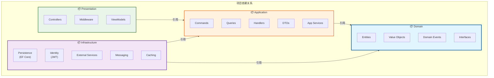
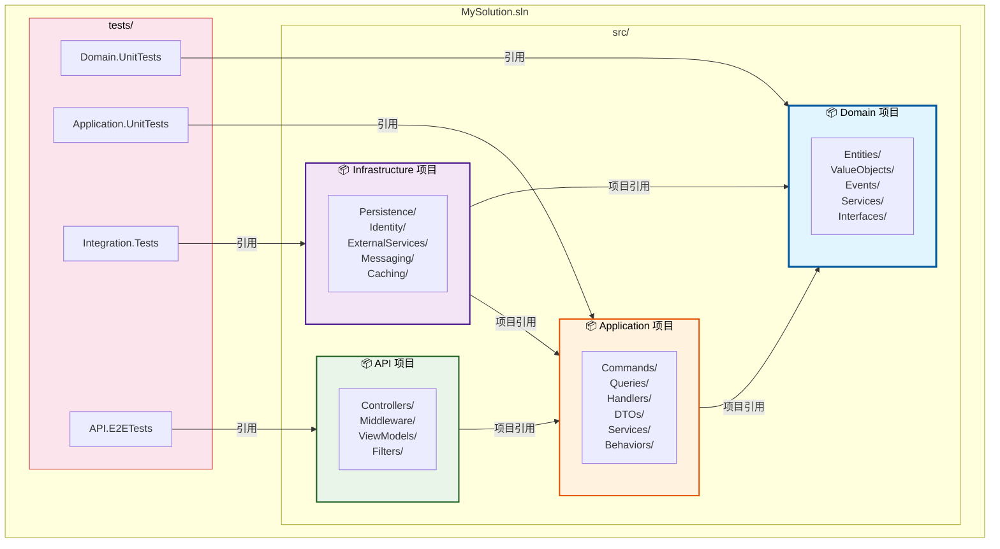
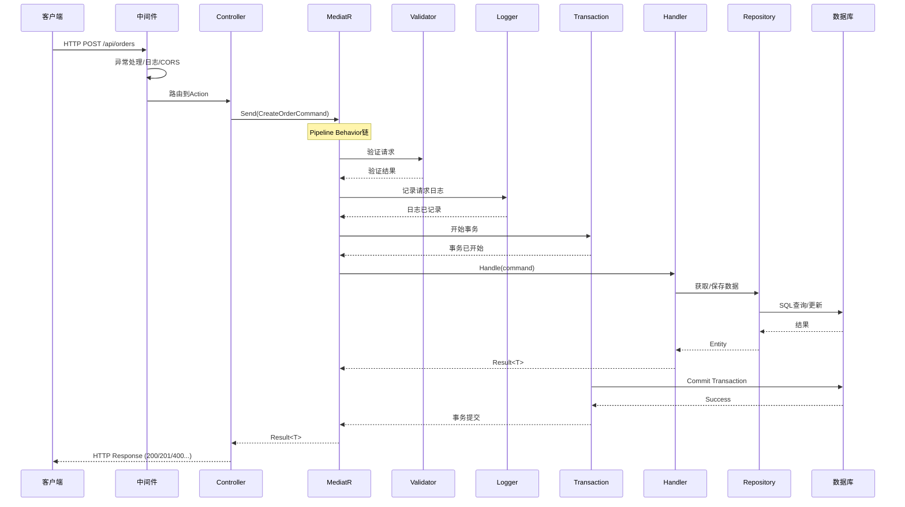
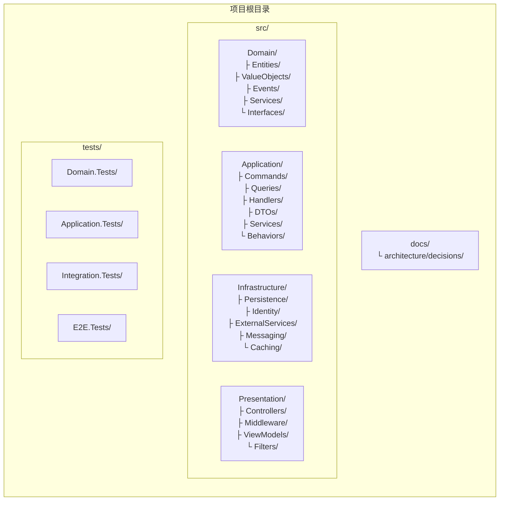

# Clean Architecture项目组织：企业级.NET项目结构最佳实践

> **目标读者**：希望了解如何在实际项目中组织Clean Architecture代码结构的开发者
>
> **前置知识**：熟悉[[01-分层架构原则]]、了解[[02-领域驱动设计(DDD)基础]]的基本概念
>
> **相关文章**：
> - [[01-分层架构原则]] - 理解分层架构的原则和理念
> - [[02-领域驱动设计(DDD)基础]] - DDD的核心概念
> - [[04-SOLID原则实践]] - 代码设计原则

---

## 一、标准解决方案结构概览

### 1.1 为什么需要多项目结构？

在开始之前，让我们先理解为什么Clean Architecture推荐使用**多项目（Multi-Project）**方案，而不是单项目：

```
单项目 vs 多项目对比：

┌─────────────────────────────────────────────────────┐
│ 单项目（Single Project）                             │
├─────────────────────────────────────────────────────┤
│                                                     │
│  ✅ 优点：                                           │
│  · 开发简单，文件都在一个地方                         │
│  · 编译速度快                                        │
│  · 适合小型项目和原型                                 │
│                                                     │
│  ❌ 缺点：                                           │
│  · 无法在编译期强制依赖规则                           │
│  · 容易出现循环依赖                                   │
│  · Domain层可能意外引用Infrastructure                │
│  · 测试时难以隔离                                     │
│                                                     │
└─────────────────────────────────────────────────────┘

┌─────────────────────────────────────────────────────┐
│ 多项目（Multi-Project）                              │
├─────────────────────────────────────────────────────┤
│                                                     │
│  ✅ 优点：                                           │
│  · 编译期强制依赖方向（物理隔离）                      │
│  · 清晰的职责边界                                    │
│  · 可以独立测试各层                                   │
│  · 支持团队并行开发不同层                              │
│  · 符合Clean Architecture原则                        │
│                                                     │
│  ❌ 缺点：                                           │
│  · 项目数量多，初学者可能困惑                          │
│  · 编译时间稍长                                      │
│  · 需要管理更多的NuGet依赖                            │
│                                                     │
└─────────────────────────────────────────────────────┘
```

### 1.2 标准四层项目结构

```
MySolution/
├── src/                                  # 源代码目录
│   ├── MyCompany.MyProject.Domain/       # 领域层
│   ├── MyCompany.MyProject.Application/  # 应用层
│   ├── MyCompany.MyProject.Infrastructure/ # 基础设施层
│   └── MyCompany.MyProject.Presentation/  # 表现层（Web API）
│
├── tests/                                # 测试目录
│   ├── MyCompany.MyProject.Domain.Tests/     # 领域层单元测试
│   ├── MyCompany.MyProject.Application.Tests/ # 应用层单元测试
│   ├── MyCompany.MyProject.Infrastructure.Tests/ # 基础设施集成测试
│   └── MyCompany.MyProject.API.Tests/         # API集成测试
│
├── docs/                                  # 文档目录
│   └── architecture/
│       └── decisions/                     # ADR（架构决策记录）
│
├── scripts/                               # 脚本目录
│   ├── deploy.ps1
│   └── database-migration.ps1
│
├── .github/                               # CI/CD配置
│   └── workflows/
│
├── docker/
│   ├── Dockerfile
│   └── docker-compose.yml
│
├── MySolution.sln                         # 解决方案文件
├── README.md
├── .editorconfig                          # 编辑器配置
└── .gitignore
```

---

## 二、Domain层详细结构

### 2.1 项目定义与依赖

```xml
<!-- MyCompany.MyProject.Domain.csproj -->
<Project Sdk="Microsoft.NET.Sdk">

  <PropertyGroup>
    <TargetFramework>net8.0</TargetFramework>
    <ImplicitUsings>enable</ImplicitUsings>
    <Nullable>enable</Nullable>
    <RootNamespace>MyCompany.MyProject.Domain</RootNamespace>
  </PropertyGroup>

  <!-- ⚠️ Domain层只引用最基础的包 -->
  <ItemGroup>
    <!-- 强类型ID支持 -->
    <PackageReference Include="TypedId.Core" Version="1.0.0" />
  </ItemGroup>

</Project>
```

**关键点**：
- ✅ 不引用任何ORM框架
- ✅ 不引用ASP.NET Core
- ✅ 只引用.NET基础类库和少量工具库
- ✅ 这是整个系统中最稳定的一层

### 2.2 目录结构与代码组织

```
Domain/
├── Common/                        # 公共基础类型
│   ├── Entity.cs                  # 实体基类
│   ├── AggregateRoot.cs           # 聚合根基类
│   ├── IEntity.cs                 # 实体接口
│   ├── IAggregateRoot.cs          # 聚合根接口
│   └── DomainException.cs         # 领域异常基类
│
├── Enums/                         # 枚举定义
│   ├── OrderStatus.cs
│   ├── PaymentMethod.cs
│   └── CustomerLevel.cs
│
├── Entities/                      # 实体定义
│   ├── Customer.cs                # 客户实体
│   ├── Order.cs                   # 订单聚合根
│   ├── OrderItem.cs               # 订单项实体
│   └── Product.cs                 # 产品实体
│
├── ValueObjects/                  # 值对象定义
│   ├── Money.cs
│   ├── Address.cs
│   ├── Email.cs
│   ├── Phone.cs
│   ├── OrderNumber.cs
│   └── Percentage.cs
│
├── Events/                        # 领域事件
│   ├── IDomainEvent.cs            # 领域事件接口
│   ├── BaseDomainEvent.cs         # 领域事件基类
│   ├── OrderCreatedEvent.cs
│   ├── OrderPaidEvent.cs
│   ├── OrderShippedEvent.cs
│   └── CustomerRegisteredEvent.cs
│
├── Services/                      # 领域服务接口
│   ├── IPricingService.cs         # 定价服务接口
│   └── ICurrencyConverter.cs      # 汇率转换服务接口
│
├── RepositoryInterfaces/          # 仓储接口定义
│   ├── IRepository.cs             # 泛型仓储接口
│   ├── IOrderRepository.cs        # 订单仓储接口
│   ├── ICustomerRepository.cs     # 客户仓储接口
│   ├── IProductRepository.cs      # 产品仓储接口
│   └── IReadOnlyRepository.cs     # 只读仓储接口
│
└── Specifications/                # 规约模式（可选）
    ├── ISpecification.cs          # 规约接口
    ├── Specification.cs           # 规约基类
    ├── OrderSpecifications.cs     # 订单相关规约
    └── CustomerSpecifications.cs  # 客户相关规约
```

### 2.3 核心代码示例

```csharp
// ============================================
// Common/Entity.cs - 实体基类
// ============================================
namespace Domain.Common;

/// <summary>
/// 实体基类：提供唯一标识和相等性比较
/// </summary>
public abstract class Entity<TId> : IEquatable<Entity<TId>> where TId : notnull
{
    public TId Id { get; protected set; }

    protected Entity(TId id) => Id = id;
    protected Entity() { } // EF Core需要

    public bool Equals(Entity<TId>? other) => other is not null && Id.Equals(other.Id);
    public override bool Equals(object? obj) => Equals(obj as Entity<TId>);
    public override int GetHashCode() => Id.GetHashCode();

    public static bool operator ==(Entity<TId>? left, Entity<TId>? right) => Equals(left, right);
    public static bool operator !=(Entity<TId>? left, Entity<TId>? right) => !Equals(left, right);
}

// ============================================
// Common/AggregateRoot.cs - 聚合根基类
// ============================================
namespace Domain.Common;

/// <summary>
/// 聚合根基类：增加领域事件支持
/// </summary>
public abstract class AggregateRoot<TId> : Entity<TId>, IAggregateRoot where TId : notnull
{
    private readonly List<IDomainEvent> _domainEvents = new();
    public IReadOnlyCollection<IDomainEvent> DomainEvents => _domainEvents.AsReadOnly();

    protected void AddDomainEvent(IDomainEvent domainEvent)
    {
        _domainEvents.Add(domainEvent);
    }

    public void ClearDomainEvents()
    {
        _domainEvents.Clear();
    }
}

// ============================================
// RepositoryInterfaces/IRepository.cs - 仓储接口
// ============================================
namespace Domain.RepositoryInterfaces;

/// <summary>
/// 泛型仓储接口：定义基本CRUD操作
/// 注意：这个接口定义在Domain层，实现在Infrastructure层
/// </summary>
public interface IRepository<TEntity, TId> where TEntity : Entity<TId>
{
    /// <summary>
    /// 根据ID获取实体
    /// </summary>
    Task<TEntity?> GetByIdAsync(TId id, CancellationToken cancellationToken = default);

    /// <summary>
    /// 获取所有实体（慎用，大数据量时考虑分页）
    /// </summary>
    Task<IReadOnlyList<TEntity>> GetAllAsync(CancellationToken cancellationToken = default);

    /// <summary>
    /// 添加新实体
    /// </summary>
    Task AddAsync(TEntity entity, CancellationToken cancellationToken = default);

    /// <summary>
    /// 更新实体
    /// </summary>
    void Update(TEntity entity);

    /// <summary>
    /// 删除实体
    /// </summary>
    void Delete(TEntity entity);

    /// <summary>
    /// 检查实体是否存在
    /// </summary>
    Task<bool> ExistsAsync(TId id, CancellationToken cancellationToken = default);
}

/// <summary>
/// 只读仓储接口：用于查询操作
/// </summary>
public interface IReadOnlyRepository<TEntity, TId> where TEntity : Entity<TId>
{
    Task<TEntity?> GetByIdAsync(TId id, CancellationToken ct = default);
    Task<IReadOnlyList<TEntity>> GetAllAsync(CancellationToken ct = default);
    Task<bool> ExistsAsync(TId id, CancellationToken ct = default);
}

// ============================================
// RepositoryInterfaces/IOrderRepository.cs - 具体仓储接口
// ============================================
namespace Domain.RepositoryInterfaces;

/// <summary>
/// 订单仓储接口：扩展订单特定的查询方法
/// </summary>
public interface IOrderRepository : IRepository<Order, OrderId>
{
    /// <summary>
    /// 获取客户的订单列表
    /// </summary>
    Task<IReadOnlyList<Order>> GetByCustomerIdAsync(
        CustomerId customerId,
        int page,
        int pageSize,
        CancellationToken cancellationToken = default);

    /// <summary>
    /// 获取待处理的订单
    /// </summary>
    Task<IReadOnlyList<Order>> GetPendingOrdersAsync(
        int limit,
        CancellationToken cancellationToken = default);

    /// <summary>
    /// 根据订单号查找
    /// </summary>
    Task<Order?> GetByOrderNumberAsync(
        OrderNumber orderNumber,
        CancellationToken cancellationToken = default);

    /// <summary>
    /// 检查订单号是否已存在
    /// </summary>
    Task<bool> IsOrderNumberExistsAsync(
        OrderNumber orderNumber,
        CancellationToken cancellationToken = default);
}
```

---

## 三、Application层详细结构

### 3.1 项目定义与依赖

```xml
<!-- MyCompany.MyProject.Application.csproj -->
<Project Sdk="Microsoft.NET.Sdk">

  <PropertyGroup>
    <TargetFramework>net8.0</TargetFramework>
    <ImplicitUsings>enable</ImplicitUsings>
    <Nullable>enable</Nullable>
    <RootNamespace>MyCompany.MyProject.Application</RootNamespace>
  </PropertyGroup>

  <!-- 引用Domain层 -->
  <ItemGroup>
    <ProjectReference Include="..\MyCompany.MyProject.Domain\MyCompany.MyProject.Domain.csproj" />
  </ItemGroup>

  <!-- Application层的NuGet包 -->
  <ItemGroup>
    <!-- MediatR：进程内消息总线 -->
    <PackageReference Include="MediatR" Version="12.2.0" />
    <PackageReference Include="MediatR.Contracts" Version="2.0.1" />

    <!-- FluentValidation：请求验证 -->
    <PackageReference Include="FluentValidation" Version="11.9.0" />
    <PackageReference Include="FluentValidation.DependencyInjectionExtensions" Version="11.9.0" />

    <!-- AutoMapper：对象映射 -->
    <PackageReference Include="AutoMapper" Version="12.0.1" />
    <PackageReference Include="AutoMapper.Extensions.Microsoft.DependencyInjection" Version="12.0.1" />

    <!-- Result模式：统一返回结果 -->
    <PackageReference Include="Ardalis.Result" Version="7.0.0" />

    <!-- CQRS工具 -->
    <PackageReference Include="Cqrs" Version="5.1.0" />
  </ItemGroup>

</Project>
```

**关键点**：
- ✅ 引用Domain层
- ❌ 不引用Infrastructure层
- ❌ 不引用Presentation层
- 可以使用MediatR、AutoMapper等应用层框架

### 3.2 目录结构与代码组织

```
Application/
├── Common/                        # 应用层公共类型
│   ├── Interfaces/                # 应用服务接口
│   │   ├── IOrderAppService.cs
│   │   ├── IProductAppService.cs
│   │   └── INotificationService.cs
│   ├── Behaviors/                 # MediatR行为管道
│   │   ├── ValidationBehavior.cs  # 自动验证行为
│   │   ├── LoggingBehavior.cs     # 日志记录行为
│   │   ├── TransactionBehavior.cs # 事务管理行为
│   │   └── CacheBehavior.cs       # 缓存行为
│   ├── Mappings/                  # AutoMapper配置
│   │   └── MappingProfile.cs
│   └── Exceptions/                # 自定义异常
│       ├── NotFoundException.cs
│       ├── ValidationException.cs
│       └── BusinessRuleException.cs
│
├── Commands/                      # CQRS命令（写操作）
│   ├── Orders/                    # 订单相关命令
│   │   ├── CreateOrder/
│   │   │   ├── CreateOrderCommand.cs
│   │   │   ├── CreateOrderCommandValidator.cs
│   │   │   └── CreateOrderCommandHandler.cs
│   │   ├── UpdateOrder/
│   │   ├── CancelOrder/
│   │   ├── PayOrder/
│   │   └── ShipOrder/
│   ├── Products/                  # 产品相关命令
│   └── Customers/                 # 客户相关命令
│
├── Queries/                       # CQRS查询（读操作）
│   ├── Orders/
│   │   ├── GetOrderById/
│   │   │   ├── GetOrderByIdQuery.cs
│   │   │   └── GetOrderByIdQueryHandler.cs
│   │   ├── GetOrdersPaged/
│   │   ├── GetOrdersByCustomer/
│   │   └── GetOrderStatistics/
│   ├── Products/
│   └── Customers/
│
├── DTOs/                          # 数据传输对象
│   ├── Requests/                  # 请求DTO
│   │   ├── CreateOrderRequestDto.cs
│   │   ├── UpdateOrderRequestDto.cs
│   │   └── CancelOrderRequestDto.cs
│   ├── Responses/                 # 响应DTO
│   │   ├── OrderResponseDto.cs
│   │   ├── OrderDetailResponseDto.cs
│   │   ├── PagedResponseDto.cs
│   │   └── OrderStatisticsResponseDto.cs
│   └── Mappers/                   # DTO到领域的映射扩展
│       └── OrderMapperExtensions.cs
│
├── Services/                      # 应用服务实现
│   ├── OrderAppService.cs
│   ├── ProductAppService.cs
│   └── NotificationService.cs
│
└── EventHandlers/                 # 领域事件处理器
    ├── OrderCreatedEventHandler.cs
    ├── OrderPaidEventHandler.cs
    └── InventoryNotificationHandler.cs
```

### 3.3 核心代码示例

```csharp
// ============================================
// Commands/Orders/CreateOrder/CreateOrderCommand.cs
// ============================================
namespace Application.Commands.Orders.CreateOrder;

/// <summary>
/// 创建订单命令：表达用户的意图
/// </summary>
public record CreateOrderCommand : IRequest<Result<Guid>>
{
    public Guid CustomerId { get; init; }
    public AddressDto ShippingAddress { get; init; }
    public List<CreateOrderItemDto> Items { get; init; } = new();
    public string? CouponCode { get; init; }
    public string? Remark { get; init; }
}

public record CreateOrderItemDto
{
    public Guid ProductId { get; init; }
    public int Quantity { get; init; }
    public string? Remark { get; init; }
}

public record AddressDto
{
    public string Province { get; init; }
    public string City { get; init; }
    public string District { get; init; }
    public string Street { get; init; }
    public string ZipCode { get; init; }
}

// ============================================
// Commands/Orders/CreateOrder/CreateOrderCommandValidator.cs
// ============================================
namespace Application.Commands.Orders.CreateOrder;

/// <summary>
/// 创建订单命令的验证器
/// 使用FluentValidation进行声明式验证
/// </summary>
public class CreateOrderCommandValidator : AbstractValidator<CreateOrderCommand>
{
    public CreateOrderCommandValidator()
    {
        // 客户ID验证
        RuleFor(x => x.CustomerId)
            .NotEmpty()
            .WithMessage("客户ID不能为空");

        // 收货地址验证
        RuleFor(x => x.ShippingAddress)
            .NotEmpty()
            .WithMessage("收货地址不能为空")
            .ChildRule(address =>
            {
                address.RuleFor(a => a.Province)
                    .NotEmpty().WithMessage("省份不能为空");
                address.RuleFor(a => a.City)
                    .NotEmpty().WithMessage("城市不能为空");
                address.RuleFor(a => a.Street)
                    .NotEmpty().WithMessage("街道地址不能为空");
                address.RuleFor(a => a.ZipCode)
                    .Matches(@"^\d{6}$").WithMessage("邮编格式不正确");
            });

        // 商品列表验证
        RuleFor(x => x.Items)
            .NotEmpty()
            .WithMessage("订单至少包含一个商品")
            .Must(items => items.Count <= 50)
            .WithMessage("单个订单最多包含50个商品");

        RuleForEach(x => x.Items)
            .ChildRule(item =>
            {
                item.RuleFor(i => i.ProductId)
                    .NotEmpty().WithMessage("商品ID不能为空");
                item.RuleFor(i => i.Quantity)
                    .GreaterThan(0).WithMessage("商品数量必须大于0")
                    .LessThanOrEqualTo(99).WithMessage("单个商品数量不能超过99");
            });

        // 备注长度限制
        RuleFor(x => x.Remark)
            .MaximumLength(500)
            .WithMessage("备注不能超过500个字符");
    }
}

// ============================================
// Commands/Orders/CreateOrder/CreateOrderCommandHandler.cs
// ============================================
namespace Application.Commands.Orders.CreateOrder;

/// <summary>
/// 创建订单命令处理器：编排下单用例
/// 这是Application层的核心：协调领域对象完成业务流程
/// </summary>
public class CreateOrderCommandHandler : IRequestHandler<CreateOrderCommand, Result<Guid>>
{
    private readonly IOrderRepository _orderRepository;
    private readonly ICustomerRepository _customerRepository;
    private readonly IProductRepository _productRepository;
    private readonly IInventoryService _inventoryService; // 领域服务接口
    private readonly IPricingService _pricingService;      // 领域服务接口
    private readonly ICouponRepository _couponRepository;
    private readonly IUnitOfWork _unitOfWork;
    private readonly IMediator _mediator;
    private readonly ILogger<CreateOrderCommandHandler> _logger;
    private readonly IMapper _mapper;

    public CreateOrderCommandHandler(
        IOrderRepository orderRepository,
        ICustomerRepository customerRepository,
        IProductRepository productRepository,
        IInventoryService inventoryService,
        IPricingService pricingService,
        ICouponRepository couponRepository,
        IUnitOfWork unitOfWork,
        IMediator mediator,
        ILogger<CreateOrderCommandHandler> logger,
        IMapper mapper)
    {
        _orderRepository = orderRepository;
        _customerRepository = customerRepository;
        _productRepository = productRepository;
        _inventoryService = inventoryService;
        _pricingService = pricingService;
        _couponRepository = couponRepository;
        _unitOfWork = unitOfWork;
        _mediator = mediator;
        _logger = logger;
        _mapper = mapper;
    }

    public async Task<Result<Guid>> Handle(
        CreateOrderCommand request,
        CancellationToken cancellationToken)
    {
        try
        {
            // ========== 步骤1：验证客户 ==========
            var customer = await _customerRepository.GetByIdAsync(
                request.CustomerId, cancellationToken);

            if (customer is null)
            {
                return Result.NotFound($"客户 {request.CustomerId} 不存在");
            }

            if (!customer.IsActive)
            {
                return Result.Error($"客户账户已被禁用");
            }

            // ========== 步骤2：准备订单项数据 ==========
            var orderItemsData = new List<OrderItemData>();

            foreach (var itemRequest in request.Items)
            {
                // 获取产品信息
                var product = await _productRepository.GetByIdAsync(
                    itemRequest.ProductId, cancellationToken);

                if (product is null)
                {
                    return Result.NotFound($"商品 {itemRequest.ProductId} 不存在");
                }

                if (!product.IsOnSale)
                {
                    return Result.Error($"商品 [{product.Name}] 已下架");
                }

                // 检查库存
                var availableStock = await _inventoryService.GetAvailableStockAsync(
                    itemRequest.ProductId, cancellationToken);

                if (availableStock < itemRequest.Quantity)
                {
                    return Result.Error(
                        $"商品 [{product.Name}] 库存不足，剩余: {availableStock}");
                }

                orderItemsData.Add(new OrderItemData(
                    product.Id,
                    product.Name,
                    product.Price,
                    itemRequest.Quantity,
                    itemRequest.Remark
                ));
            }

            // ========== 步骤3：创建订单（委托给聚合根） ==========
            var shippingAddress = Address.Create(
                request.ShippingAddress.Province,
                request.ShippingAddress.City,
                request.ShippingAddress.District,
                request.ShippingAddress.Street,
                request.ShippingAddress.ZipCode
            );

            var order = Order.Place(
                customerId: request.CustomerId,
                items: orderItemsData,
                shippingAddress: shippingAddress
            );

            // ========== 步骤4：应用定价策略 ==========
            var finalPrice = await _pricingService.CalculateFinalPriceAsync(order, customer);
            order.ApplyFinalPrice(finalPrice);

            // ========== 步骤5：应用优惠券（如果有） ==========
            if (!string.IsNullOrWhiteSpace(request.CouponCode))
            {
                var couponResult = await ApplyCouponIfValid(order, request.CouponCode, cancellationToken);
                if (couponResult.IsError)
                {
                    return couponResult;
                }
            }

            // ========== 步骤6：锁定库存 ==========
            foreach (var item in order.Items)
            {
                await _inventoryService.ReserveAsync(
                    item.ProductId,
                    item.Quantity,
                    order.Id,
                    cancellationToken
                );
            }

            // ========== 步骤7：持久化 ==========
            await _orderRepository.AddAsync(order, cancellationToken);
            await _unitOfWork.SaveChangesAsync(cancellationToken);

            // ========== 步骤8：发布集成事件 ==========
            await _mediator.Publish(new OrderPlacedIntegrationEvent(
                OrderId: order.Id,
                CustomerId: order.CustomerId,
                TotalAmount: order.TotalAmount,
                ItemCount: order.Items.Count
            ), cancellationToken);

            _logger.LogInformation(
                "订单创建成功: {OrderId}, 客户: {CustomerId}, 金额: {Amount}",
                order.Id,
                order.CustomerId,
                order.TotalAmount
            );

            return Result.Success(order.Id.Value);
        }
        catch (DomainException ex)
        {
            _logger.LogWarning(ex, "创建订单失败: {Message}", ex.Message);
            return Result.Error(ex.Message);
        }
        catch (Exception ex)
        {
            _logger.LogError(ex, "创建订单时发生未预期错误");
            return Result.CriticalError("系统繁忙，请稍后重试");
        }
    }

    private async Task<Result> ApplyCouponIfValid(
        Order order,
        string couponCode,
        CancellationToken cancellationToken)
    {
        var coupon = await _couponRepository.GetByCodeAsync(couponCode, cancellationToken);

        if (coupon is null)
        {
            return Result.Error("优惠券不存在或已失效");
        }

        if (!coupon.IsValid())
        {
            return Result.Error("优惠券不可用");
        }

        if (order.TotalAmount.Amount < coupon.MinOrderAmount)
        {
            return.Result.Error($"使用该优惠券最低消费金额为 {coupon.MinOrderAmount}");
        }

        var discount = coupon.CalculateDiscount(order.TotalAmount);
        order.ApplyCouponDiscount(discount, coupon.Code);

        return Result.Success();
    }
}

// ============================================
// Queries/Orders/GetOrderById/GetOrderByIdQuery.cs
// ============================================
namespace Application.Queries.Orders.GetOrderById;

/// <summary>
/// 根据ID查询订单详情
/// </summary>
public record GetOrderByIdQuery(Guid OrderId) : IRequest<Result<OrderDetailResponseDto>>;

/// <summary>
/// 订单查询处理器
/// </summary>
public class GetOrderByIdQueryHandler : IRequestHandler<GetOrderByIdQuery, Result<OrderDetailResponseDto>>
{
    private readonly IOrderRepository _orderRepository;
    private readonly IMapper _mapper;

    public GetOrderByIdQueryHandler(IOrderRepository orderRepository, IMapper mapper)
    {
        _orderRepository = orderRepository;
        _mapper = mapper;
    }

    public async Task<Result<OrderDetailResponseDto>> Handle(
        GetOrderByIdQuery query,
        CancellationToken cancellationToken)
    {
        var order = await _orderRepository.GetByIdAsync(
            OrderId: new(query.OrderId),
            cancellationToken: cancellationToken
        );

        if (order is null)
        {
            return Result.NotFound("订单不存在");
        }

        var response = _mapper.Map<OrderDetailResponseDto>(order);
        return Result.Success(response);
    }
}

// ============================================
// DTOs/Responses/OrderDetailResponseDto.cs
// ============================================
namespace Application.DTOs.Responses;

/// <summary>
/// 订单详情响应DTO
/// 注意：这是给表现层用的，不应该暴露领域对象的内部细节
/// </summary>
public record OrderDetailResponseDto
{
    public Guid Id { get; init; }
    public string OrderNumber { get; init; }
    public DateTime CreatedAt { get; init; }
    public string Status { get; init; }
    public decimal TotalAmount { get; init; }
    public string Currency { get; init; }
    public CustomerSummaryDto Customer { get; init; }
    public List<OrderItemResponseDto> Items { get; init; }
    public ShippingAddressDto ShippingAddress { get; init; }
    public TimelineDto Timeline { get; init; }
}

public record CustomerSummaryDto
{
    public Guid Id { get; init; }
    public string Name { get; init; }
    public string Level { get; init; }
}

public record OrderItemResponseDto
{
    public Guid ProductId { get; init; }
    public string ProductName { get; init; }
    public decimal UnitPrice { get; init; }
    public int Quantity { get; init; }
    public decimal Subtotal { get; init; }
}

// ============================================
// Common/Behaviors/ValidationBehavior.cs
// ============================================
namespace Application.Common.Behaviors;

/// <summary>
/// MediatR验证管道行为：自动执行FluentValidation验证
/// 在命令处理前自动运行验证器
/// </summary>
public class ValidationBehavior<TRequest, TResponse> :
    IPipelineBehavior<TRequest, TResponse>
    where TRequest : IRequest<TResponse>
{
    private readonly IEnumerable<IValidator<TRequest>> _validators;

    public ValidationBehavior(IEnumerable<IValidator<TRequest>> validators)
    {
        _validators = validators;
    }

    public async Task<TResponse> Handle(
        TRequest request,
        RequestHandlerDelegate<TResponse> next,
        CancellationToken cancellationToken)
    {
        if (_validators.Any())
        {
            var context = new ValidationContext<TRequest>(request);

            // 并行执行所有验证器
            var validationResults = await Task.WhenAll(
                _validators.Select(v => v.ValidateAsync(context, cancellationToken))
            );

            var failures = validationResults
                .SelectMany(r => r.Errors)
                .Where(f => f != null)
                .ToList();

            if (failures.Any())
            {
                // 返回验证错误结果
                var errors = failures
                    .GroupBy(e => e.PropertyName)
                    .ToDictionary(
                        g => g.Key,
                        g => g.Select(e => e.ErrorMessage).ToArray()
                    );

                // 使用动态方式返回失败结果
                var responseType = typeof(TResponse);
                if (responseType.IsGenericType &&
                    responseType.GetGenericTypeDefinition() == typeof(Result<>))
                {
                    var resultType = responseType.GenericTypeArguments[0];
                    var invalidMethod = typeof(Result)
                        .GetMethod(nameof(Result.Invalid))
                        ?.MakeGenericMethod(resultType);

                    return (TResponse)(invalidMethod?.Invoke(null, new object[] { errors }) 
                        ?? throw new InvalidOperationException());
                }
            }
        }

        return await next();
    }
}
```

---

## 四、Infrastructure层详细结构

### 4.1 项目定义与依赖

```xml
<!-- MyCompany.MyProject.Infrastructure.csproj -->
<Project Sdk="Microsoft.NET.Sdk">

  <PropertyGroup>
    <TargetFramework>net8.0</TargetFramework>
    <ImplicitUsings>enable</ImplicitUsings>
    <Nullable>enable</Nullable>
    <RootNamespace>MyCompany.MyProject.Infrastructure</RootNamespace>
  </PropertyGroup>

  <!-- 引用Domain和Application层 -->
  <ItemGroup>
    <ProjectReference Include="..\MyCompany.MyProject.Domain\MyCompany.MyProject.Domain.csproj" />
    <ProjectReference Include="..\MyCompany.MyProject.Application\MyCompany.MyProject.Application.csproj" />
  </ItemGroup>

  <!-- Infrastructure层的NuGet包 -->
  <ItemGroup>
    <!-- EF Core -->
    <PackageReference Include="Microsoft.EntityFrameworkCore" Version="8.0.0" />
    <PackageReference Include="Microsoft.EntityFrameworkCore.SqlServer" Version="8.0.0" />
    <PackageReference Include="Microsoft.EntityFrameworkCore.Design" Version="8.0.0">
      <PrivateAssets>all</PrivateAssets>
      <IncludeAssets>runtime; build; native; contentfiles; analyzers; buildtransitive</IncludeAssets>
    </PackageReference>

    <!-- 身份认证 -->
    <PackageReference Include="Microsoft.AspNetCore.Authentication.JwtBearer" Version="8.0.0" />

    <!-- 缓存 -->
    <PackageReference Include="StackExchange.Redis" Version="2.7.10" />
    <PackageReference Include="Microsoft.Extensions.Caching.StackExchangeRedis" Version="8.0.0" />

    <!-- 消息队列 -->
    <PackageReference Include="MassTransit.RabbitMQ" Version="8.2.0" />

    <!-- 外部服务客户端 -->
    <PackageReference Include="Stripe.net" Version="43.0.0" />  <!-- 支付 -->
    <PackageReference Include="SendGrid" Version="9.28.1" />    <!-- 邮件 -->

    <!-- 日志 -->
    <PackageReference Include="Serilog.AspNetCore" Version="8.0.0" />

    <!-- 配置 -->
    <PackageReference Include="Microsoft.Extensions.Options.ConfigurationExtensions" Version="8.0.0" />
  </ItemGroup>

</Project>
```

### 4.2 目录结构与代码组织

```
Infrastructure/
├── Persistence/                    # 持久化（EF Core）
│   ├── AppDbContext.cs            # 数据库上下文
│   ├── Configurations/             # EF Core实体配置
│   │   ├── OrderConfiguration.cs
│   │   ├── CustomerConfiguration.cs
│   │   ├── ProductConfiguration.cs
│   │   └── OrderItemConfiguration.cs
│   ├── Repositories/              # 仓储实现
│   │   ├── RepositoryBase.cs      # 仓储基类
│   │   ├── EfOrderRepository.cs
│   │   ├── EfCustomerRepository.cs
│   │   ├── EfProductRepository.cs
│   │   └── EfCouponRepository.cs
│   ├── Migrations/                # 数据库迁移
│   │   ├── 20240101000000_InitialCreate.cs
│   │   └── AppDbContextModelSnapshot.cs
│   └── Extensions/                # 扩展方法
│       ├── ServiceCollectionExtensions.cs
│       └── MigrationExtensions.cs
│
├── Identity/                       # 身份认证
│   ├── JwtTokenGenerator.cs       # JWT令牌生成
│   ├── JwtTokenValidator.cs       # JWT令牌验证
│   ├── PasswordHasher.cs          # 密码哈希
│   └── Services/
│       ├── IdentityService.cs
│       └── CurrentUserService.cs
│
├── ExternalServices/              # 外部服务集成
│   ├── Payment/                   # 支付服务
│   │   ├── StripePaymentService.cs
│   │   ├── AlipayService.cs
│   │   └── WeChatPayService.cs
│   ├── Messaging/                 # 消息通知
│   │   ├── SendGridEmailService.cs
│   │   ├── AliyunSmsService.cs
│   │   └── Templates/
│   │       ├── OrderCreatedEmailTemplate.cs
│   │       └── OtpSmsTemplate.cs
│   └── Storage/                   # 文件存储
│       ├── LocalFileStorage.cs
│       ├── AliyunOssService.cs
│       └── AzureBlobStorage.cs
│
├── Messaging/                     # 消息队列
│   ├── MassTransitConfig.cs
│   ├── Consumers/                 # 消息消费者
│   │   ├── OrderPlacedConsumer.cs
│   │   └── PaymentCompletedConsumer.cs
│   ├── Publishers/                # 消息发布者
│   │   ├── IntegrationEventPublisher.cs
│   └── Events/                     # 集成事件定义
│       ├── IIntegrationEvent.cs
│       ├── OrderPlacedIntegrationEvent.cs
│       └── IntegrationEventLog.cs
│
├── Caching/                       # 缓存
│   ├── RedisCacheService.cs
│   ├── CacheKeys.cs
│   └── Interfaces/
│       └── ICacheService.cs
│
├── Logging/                       # 日志
│   ├── SerilogConfiguration.cs
│   └── Enrichers/
│       ├── UserEnricher.cs
│       └── CorrelationIdEnricher.cs
│
└── Configuration/                 # 配置选项
    ├── DatabaseSettings.cs
    ├── JwtSettings.cs
    ├── StripeSettings.cs
    ├── RedisSettings.cs
    └── EmailSettings.cs
```

### 4.3 核心代码示例

```csharp
// ============================================
// Persistence/AppDbContext.cs
// ============================================
namespace Infrastructure.Persistence;

/// <summary>
/// EF Core数据库上下文
/// 负责配置数据库连接、实体映射、领域事件分发
/// </summary>
public class AppDbContext : DbContext
{
    private readonly IMediator _mediator;
    private readonly ILogger<AppDbContext> _logger;

    public AppDbContext(
        DbContextOptions<AppDbContext> options,
        IMediator mediator,
        ILogger<AppDbContext> logger) : base(options)
    {
        _mediator = mediator;
        _logger = logger;
    }

    // DbSets
    public DbSet<Customer> Customers => Set<Customer>();
    public DbSet<Order> Orders => Set<Order>();
    public DbSet<Product> Products => Set<Product>();
    public DbSet<Coupon> Coupons => Set<Coupon>();

    protected override void OnModelCreating(ModelBuilder modelBuilder)
    {
        // 从程序集加载所有IEntityTypeConfiguration
        modelBuilder.ApplyConfigurationsFromAssembly(typeof(AppDbContext).Assembly);

        // 全局配置
        // 1. 所有Guid主键默认值
        foreach (var entityType in modelBuilder.Model.GetEntityTypes())
        {
            if (entityType.FindPrimaryKey()?.Properties.Count == 1)
            {
                var property = entityType.FindPrimaryKey().Properties[0];
                if (property.ClrType == typeof(Guid) || property.ClrType == typeof(Guid?))
                {
                    property.SetValueGenerationStrategy(ValueGenerated.OnAdd);
                }
            }
        }

        // 2. 全局软删除过滤器（如果需要）
        // modelBuilder.Entity<ISoftDelete>().HasQueryFilter(e => e.IsDeleted == false);

        base.OnModelCreating(modelBuilder);
    }

    /// <summary>
    /// 重写SaveChanges以自动分发领域事件
    /// </summary>
    public override async Task<int> SaveChangesAsync(CancellationToken cancellationToken = default)
    {
        // 1. 更新审计字段
        UpdateAuditFields();

        // 2. 收集待发布的领域事件
        var domainEntities = ChangeTracker
            .Entries<Entity<Guid>>() // 或你的实体基类
            .Where(e =>
                e.Entity is AggregateRoot<Guid> aggregateRoot &&
                aggregateRoot.DomainEvents != null &&
                aggregateRoot.DomainEvents.Any());

        var domainEvents = domainEntities
            .SelectMany(e => ((AggregateRoot<Guid>)e.Entity).DomainEvents)
            .ToList();

        // 3. 清除实体中的领域事件（避免重复发布）
        foreach (var entity in domainEntities)
        {
            ((AggregateRoot<Guid>)entity.Entity).ClearDomainEvents();
        }

        // 4. 保存更改到数据库
        var result = await base.SaveChangesAsync(cancellationToken);

        // 5. 发布领域事件（数据库保存成功后才发布）
        if (domainEvents.Any())
        {
            _logger.LogDebug("正在发布 {Count} 个领域事件", domainEvents.Count);

            foreach (var domainEvent in domainEvents)
            {
                await _mediator.Publish(domainEvent, cancellationToken);
            }
        }

        return result;
    }

    private void UpdateAuditFields()
    {
        var now = DateTime.UtcNow;
        var entries = ChangeTracker.Entries<BaseAuditableEntity>();

        foreach (var entry in entries)
        {
            switch (entry.State)
            {
                case EntityState.Added:
                    entry.Entity.CreatedAt = now;
                    entry.Entity.LastModifiedAt = now;
                    break;

                case EntityState.Modified:
                    entry.Entity.LastModifiedAt = now;
                    break;
            }
        }
    }
}

// ============================================
// Persistence/Repositories/EfOrderRepository.cs
// ============================================
namespace Infrastructure.Persistence.Repositories;

/// <summary>
/// 订单仓储的EF Core实现
/// 实现Domain层定义的IOrderRepository接口
/// </summary>
public class EfOrderRepository : IOrderRepository
{
    private readonly AppDbContext _context;
    private readonly ILogger<EfOrderRepository> _logger;

    public EfOrderRepository(AppDbContext context, ILogger<EfOrderRepository> logger)
    {
        _context = context;
        _logger = logger;
    }

    public async Task<Order?> GetByIdAsync(OrderId id, CancellationToken cancellationToken = default)
    {
        return await _context.Orders
            .Include(o => o.Items)
            .FirstOrDefaultAsync(o => o.Id == id, cancellationToken);
    }

    public async Task<IReadOnlyList<Order>> GetAllAsync(CancellationToken cancellationToken = default)
    {
        return await _context.Orders
            .AsNoTracking()
            .ToListAsync(cancellationToken);
    }

    public async Task AddAsync(Order entity, CancellationToken cancellationToken = default)
    {
        await _context.Orders.AddAsync(entity, cancellationToken);
    }

    public void Update(Order entity)
    {
        _context.Orders.Update(entity);
    }

    public void Delete(Order entity)
    {
        _context.Orders.Remove(entity);
    }

    public async Task<bool> ExistsAsync(OrderId id, CancellationToken cancellationToken = default)
    {
        return await _context.Orders.AnyAsync(o => o.Id == id, cancellationToken);
    }

    // 订单特有的查询方法
    public async Task<(IReadOnlyList<Order> Items, int TotalCount)> GetByCustomerIdAsync(
        CustomerId customerId,
        int page,
        int pageSize,
        CancellationToken cancellationToken = default)
    {
        var query = _context.Orders
            .Where(o => o.CustomerId == customerId)
            .Include(o => o.Items)
            .OrderByDescending(o => o.CreatedAt);

        var totalCount = await query.CountAsync(cancellationToken);

        var items = await query
            .Skip((page - 1) * pageSize)
            .Take(pageSize)
            .ToListAsync(cancellationToken);

        return (items, totalCount);
    }

    public async Task<IReadOnlyList<Order>> GetPendingOrdersAsync(
        int limit,
        CancellationToken cancellationToken = default)
    {
        return await _context.Orders
            .Where(o => o.Status == OrderStatus.PendingPayment ||
                        o.Status == OrderStatus.Paid)
            .OrderBy(o => o.CreatedAt)
            .Take(limit)
            .ToListAsync(cancellationToken);
    }

    public async Task<Order?> GetByOrderNumberAsync(
        OrderNumber orderNumber,
        CancellationToken cancellationToken = default)
    {
        return await _context.Orders
            .Include(o => o.Items)
            .FirstOrDefaultAsync(o => o.OrderNumber == orderNumber, cancellationToken);
    }

    public async Task<bool> IsOrderNumberExistsAsync(
        OrderNumber orderNumber,
        CancellationToken cancellationToken = default)
    {
        return await _context.Orders
            .AnyAsync(o => o.OrderNumber == orderNumber, cancellationToken);
    }
}

// ============================================
// Persistence/Configurations/OrderConfiguration.cs
// ============================================
namespace Infrastructure.Persistence.Configurations;

/// <summary>
/// 订单实体的EF Core配置
/// 将领域对象映射到数据库表
/// </summary>
internal class OrderConfiguration : IEntityTypeConfiguration<Order>
{
    public void Configure(EntityTypeBuilder<Order> builder)
    {
        builder.ToTable("Orders", schema: "sales");

        // 主键配置
        builder.HasKey(o => o.Id);
        builder.Property(o => o.Id.Value)
            .HasDefaultValueSql("NEWSEQUENTIALID()")
            .HasColumnName("OrderId");

        // 属性配置
        builder.Property(o => o.OrderNumber.Value)
            .IsRequired()
            .HasMaxLength(20)
            .HasColumnName("OrderNumber");

        builder.Property(o => o.Status)
            .IsRequired()
            .HasConversion<string>() // 枚举转字符串存储
            .HasMaxLength(20)
            .HasColumnName("Status");

        builder.Property(o => o.TotalAmount.Amount)
            .HasPrecision(18, 2)
            .HasColumnName("TotalAmount");

        builder.Property(o => o.TotalAmount.Currency)
            .HasMaxLength(10)
            .HasDefaultValue("CNY")
            .HasColumnName("Currency");

        builder.Property(o => o.CreatedAt)
            .IsRequired()
            .HasDefaultValueSql("GETUTCDATE()")
            .HasColumnName("CreatedAt");

        // 索引配置
        builder.HasIndex(o => o.OrderNumber)
            .IsUnique()
            .HasDatabaseName("IX_Orders_OrderNumber");

        builder.HasIndex(o => o.CustomerId)
            .HasDatabaseName("IX_Orders_CustomerId");

        builder.HasIndex(o => new { o.CustomerId, o.Status, o.CreatedAt })
            .HasDatabaseName("IX_Orders_Customer_Status_CreatedAt");

        // 关系配置
        builder.HasOne<Customer>()
            .WithMany()
            .HasForeignKey(o => o.CustomerId)
            .OnDelete(DeleteBehavior.Restrict); // 不能级联删除

        builder.OwnsOne(o => o.ShippingAddress, sa =>
        {
            sa.Property(s => s.Province).HasColumnName("ShippingProvince");
            sa.Property(s => s.City).HasColumnName("ShippingCity");
            sa.Property(s => s.District).HasColumnName("ShippingDistrict");
            sa.Property(s => s.Street).HasColumnName("ShippingStreet");
            sa.Property(s => s.ZipCode).HasColumnName("ShippingZipCode");
        });

        // 忽略不持久化的属性
        builder.Ignore(o => o.DomainEvents);
    }
}

// ============================================
// Identity/JwtTokenGenerator.cs
// ============================================
namespace Infrastructure.Identity;

/// <summary>
/// JWT令牌生成服务
/// 实现Application层定义的IJwtTokenGenerator接口
/// </summary>
public class JwtTokenGenerator : IJwtTokenGenerator
{
    private readonly JwtSettings _jwtSettings;
    private readonly IDateTimeProvider _dateTimeProvider;

    public JwtTokenGenerator(
        IOptions<JwtSettings> jwtOptions,
        IDateTimeProvider dateTimeProvider)
    {
        _jwtSettings = jwtOptions.Value;
        _dateTimeProvider = dateTimeProvider;
    }

    public string GenerateToken(User user, IList<string> roles)
    {
        var signingCredentials = new SigningCredentials(
            new SymmetricSecurityKey(Encoding.UTF8.GetBytes(_jwtSettings.Secret)),
            SecurityAlgorithms.HmacSha256
        );

        var claims = new[]
        {
            new Claim(JwtRegisteredClaimNames.Sub, user.Id.ToString()),
            new Claim(JwtRegisteredClaimNames.GivenName, user.FirstName),
            new Claim(JwtRegisteredClaimNames.FamilyName, user.LastName),
            new Claim(JwtRegisteredClaimNames.Jti, Guid.NewGuid().ToString()),
            new Claim(ClaimTypes.Role, string.Join(",", roles))
        };

        var securityToken = new JwtSecurityToken(
            issuer: _jwtSettings.Issuer,
            audience: _jwtSettings.Audience,
            claims: claims,
            expires: _dateTimeProvider.UtcNow.AddMinutes(_jwtSettings.ExpiryMinutes),
            signingCredentials: signingCredentials
        );

        return new JwtSecurityTokenHandler().WriteToken(securityToken);
    }
}

// ============================================
// ExternalServices/Payment/StripePaymentService.cs
// ============================================
namespace Infrastructure.ExternalServices.Payment;

/// <summary>
/// Stripe支付服务实现
/// 实现Application层定义的IPaymentService接口
/// </summary>
public class StripePaymentService : IPaymentService
{
    private readonly StripeClient _stripeClient;
    private readonly ILogger<StripePaymentService> _logger;
    private readonly StripeSettings _settings;

    public StripePaymentService(
        IOptions<StripeSettings> settings,
        ILogger<StripePaymentService> logger)
    {
        _settings = settings.Value;
        _stripeClient = new StripeClient(_settings.SecretKey);
        _logger = logger;
    }

    public async Task<PaymentResult> ProcessPaymentAsync(PaymentRequest request, CancellationToken ct)
    {
        try
        {
            var options = new PaymentIntentCreateOptions
            {
                Amount = (long)(request.Amount * 100), // Stripe单位是分
                Currency = request.Currency.ToLowerInvariant(),
                Metadata = new Dictionary<string, string>
                {
                    ["OrderId"] = request.OrderId.ToString(),
                    ["CustomerId"] = request.CustomerId.ToString()
                },
                Description = $"订单支付 - {request.OrderId}"
            };

            var service = new PaymentIntentService(_stripeClient);
            var paymentIntent = await service.CreateAsync(options, cancellationToken: ct);

            _logger.LogInformation(
                "Stripe支付意图创建成功: {PaymentIntentId}, 金额: {Amount}",
                paymentIntent.Id,
                request.Amount
            );

            return PaymentResult.Success(
                transactionId: paymentIntent.Id,
                clientSecret: paymentIntent.ClientSecret
            );
        }
        catch (StripeException ex)
        {
            _logger.LogError(ex, "Stripe支付失败: {ErrorMessage}", ex.Message);

            return ex.StripeError?.Code switch
            {
                "card_declined" => PaymentResult.CardDeclined(ex.Message),
                "insufficient_funds" => PaymentResult.InsufficientFunds(),
                _ => PaymentResult.Failure(ex.Message)
            };
        }
    }

    public async Task<RefundResult> RefundAsync(string transactionId, decimal amount, CancellationToken ct)
    {
        try
        {
            var refundOptions = new RefundCreateOptions
            {
                PaymentIntent = transactionId,
                Amount = (long)(amount * 100)
            };

            var refundService = new RefundService(_stripeClient);
            var refund = await refundService.CreateAsync(refundOptions, cancellationToken: ct);

            return RefundResult.Success(refund.Id);
        }
        catch (StripeException ex)
        {
            _logger.LogError(ex, "退款失败: {TransactionId}", transactionId);
            return RefundResult.Failure(ex.Message);
        }
    }
}

// ============================================
// Caching/RedisCacheService.cs
// ============================================
namespace Infrastructure.Caching;

/// <summary>
/// Redis缓存服务实现
/// </summary>
public class RedisCacheService : ICacheService
{
    private readonly IDatabase _database;
    private readonly ILogger<RedisCacheService> _logger;
    private readonly CacheSettings _settings;

    public RedisCacheService(
        IConnectionMultiplexer redis,
        IOptions<CacheSettings> options,
        ILogger<RedisCacheService> logger)
    {
        _database = redis.GetDatabase();
        _settings = options.Value;
        _logger = logger;
    }

    public async Task<T?> GetAsync<T>(string key, CancellationToken ct = default)
    {
        try
        {
            var value = await _database.StringGetAsync(key);
            if (value.IsNullOrEmpty)
                return default;

            return JsonSerializer.Deserialize<T>(value!);
        }
        catch (Exception ex)
        {
            _logger.LogError(ex, "从Redis获取缓存失败: {Key}", key);
            return default;
        }
    }

    public async Task SetAsync<T>(string key, T value, TimeSpan? expiry = null, CancellationToken ct = default)
    {
        try
        {
            var serializedValue = JsonSerializer.Serialize(value);
            await _database.StringSetAsync(key, serializedValue, expiry ?? TimeSpan.FromMinutes(_settings.DefaultExpiryMinutes));
        }
        catch (Exception ex)
        {
            _logger.LogError(ex, "设置Redis缓存失败: {Key}", key);
        }
    }

    public async Task RemoveAsync(string key, CancellationToken ct = default)
    {
        await _database.KeyDeleteAsync(key);
    }

    public async Task<bool> ExistsAsync(string key, CancellationToken ct = default)
    {
        return await _database.KeyExistsAsync(key);
    }
}
```

---

## 五、Presentation层详细结构

### 5.1 项目定义与依赖

```xml
<!-- MyCompany.MyProject.Presentation / MyCompany.MyProject.API.csproj -->
<Project Sdk="Microsoft.NET.Sdk.Web">

  <PropertyGroup>
    <TargetFramework>net8.0</TargetFramework>
    <ImplicitUsings>enable</ImplicitUsings>
    <Nullable>enable</Nullable>
    <RootNamespace>MyCompany.MyProject.Presentation</RootNamespace>
  </PropertyGroup>

  <!-- 引用Application层（注意：不直接引用Domain或Infrastructure） -->
  <ItemGroup>
    <ProjectReference Include="..\MyCompany.MyProject.Application\MyCompany.MyProject.Application.csproj" />
  </ItemGroup>

  <!-- Presentation层的NuGet包 -->
  <ItemGroup>
    <!-- Swagger/OpenAPI -->
    <PackageReference Include="Swashbuckle.AspNetCore" Version="6.5.0" />

    <!-- API版本控制 -->
    <PackageReference Include="AspNetCore.Versioning.Api" Version="5.1.0" />
    <PackageReference Include="AspNetCore.Versioning.ApiExplorer" Version="5.1.0" />

    <!-- Rate Limiting -->
    <PackageReference Include="AspNetCoreRateLimit" Version="5.0.0" />

    <!-- Helmet安全头 -->
    <PackageReference Include="NetEscapades.AspNetCore.SecurityHeaders" Version="0.21.0" />
  </ItemGroup>

</Project>
```

**关键点**：
- ✅ 是Web SDK项目（不是类库）
- ✅ 引用Application层
- ❌ 不直接引用Domain层（通过Application间接访问）
- ❌ 不直接引用Infrastructure层（DI容器负责注入）

### 5.2 目录结构与代码组织

```
Presentation (API Project)/
├── Controllers/                   # API控制器
│   ├── OrdersController.cs       # 订单控制器
│   ├── ProductsController.cs     # 产品控制器
│   ├── CustomersController.cs    # 客户控制器
│   └── HealthCheckController.cs  # 健康检查
│
├── ViewModels/                   # 视图模型（API专用DTO）
│   ├── Requests/                 # 请求模型
│   │   ├── CreateOrderApiRequest.cs
│   │   ├── UpdateOrderApiRequest.cs
│   │   └── PagedQueryParameters.cs
│   └── Responses/                # 响应模型
│       ├── ApiResponse.cs        # 统一响应包装
│       ├── ApiErrorResponse.cs   # 错误响应
│       └── PagedApiResponse.cs   # 分页响应
│
├── Middleware/                    # 中间件
│   ├── ExceptionHandlingMiddleware.cs  # 全局异常处理
│   ├── RequestLoggingMiddleware.cs     # 请求日志
│   └── CorrelationIdMiddleware.cs     # 关联ID
│
├── Filters/                      # 过滤器/特性
│   ├── ApiKeyAuthAttribute.cs    # API Key认证
│   ├── RateLimitAttribute.cs     # 限流特性
│   └── ValidateModelAttribute.cs # 模型验证
│
├── Extensions/                   # 扩展方法
│   ├── ServiceCollectionExtensions.cs  # DI注册扩展
│   ├── ApplicationBuilderExtensions.cs # 应用构建扩展
│   └── ConfigureSwaggerExtension.cs    # Swagger配置
│
├── Configuration/                # 配置
│   ├── ApiSettings.cs
│   └── CorsSettings.cs
│
├── Program.cs                     # 应用入口点
├── appsettings.json              # 开发环境配置
├── appsettings.Development.json   # 开发专用配置
├── appsettings.Production.json    # 生产环境配置
└── Properties/
    └── launchSettings.json        # 启动配置
```

### 5.3 核心代码示例

```csharp
// ============================================
// Controllers/OrdersController.cs
// ============================================
namespace Presentation.Controllers;

/// <summary>
/// 订单管理API
/// 职责：接收HTTP请求、参数验证、调用应用层、返回HTTP响应
/// </summary>
[ApiController]
[ApiVersion("1.0")]
[Route("api/v{version:apiVersion}/orders")]
[Produces("application/json")]
public class OrdersController : ControllerBase
{
    private readonly IMediator _mediator;
    private readonly IMapper _mapper;
    private readonly ILogger<OrdersController> _logger;

    public OrdersController(
        IMediator mediator,
        IMapper mapper,
        ILogger<OrdersController> logger)
    {
        _mediator = mediator;
        _mapper = mapper;
        _logger = logger;
    }

    /// <summary>
    /// 创建订单
    /// </summary>
    /// <param name="request">创建订单请求</param>
    /// <param name="cancellationToken">取消令牌</param>
    /// <returns>创建的订单ID</returns>
    [HttpPost]
    [ProducesResponseType(typeof(ApiResponse<Guid>), StatusCodes.Status201Created)]
    [ProducesResponseType(typeof(ApiErrorResponse), StatusCodes.Status400BadRequest)]
    [ProducesResponseType(typeof(ApiErrorResponse), StatusCodes.Status401Unauthorized)]
    public async Task<IActionResult> CreateOrder(
        [FromBody] CreateOrderApiRequest request,
        CancellationToken cancellationToken)
    {
        _logger.LogInformation("收到创建订单请求: 客户={CustomerId}, 商品数={ItemCount}",
            request.CustomerId, request.Items?.Count ?? 0);

        // 转换API请求到命令对象
        var command = _mapper.Map<CreateOrderCommand>(request);

        // 通过MediatR发送命令
        var result = await _mediator.Send(command, cancellationToken);

        // 根据结果返回适当的HTTP响应
        return result.Match(
            onSuccess: orderId => CreatedAtAction(
                actionName: nameof(GetOrderById),
                routeValues: new { id = orderId },
                value: new ApiResponse<Guid>(orderId, "订单创建成功")),
            onError: errorResults => BadRequest(new ApiErrorResponse(errorResults)),
            onNotFound: message => NotFound(new ApiErrorResponse(message)),
            onCriticalError: message => StatusCode(StatusCodes.Status500InternalServerError,
                new ApiErrorResponse(message))
        );
    }

    /// <summary>
    /// 获取订单详情
    /// </summary>
    /// <param name="id">订单ID</param>
    [HttpGet("{id:guid}")]
    [ProducesResponseType(typeof(ApiResponse<OrderDetailViewModel>), StatusCodes.Status200OK)]
    [ProducesResponseType(typeof(ApiErrorResponse), StatusCodes.Status404NotFound)]
    public async Task<IActionResult> GetOrderById(Guid id, CancellationToken cancellationToken)
    {
        var query = new GetOrderByIdQuery(id);
        var result = await _mediator.Send(query, cancellationToken);

        return result.Match(
            onSuccess: order => Ok(new ApiResponse<OrderDetailViewModel>(order)),
            onNotFound: message => NotFound(new ApiErrorResponse(message)),
            onError: errorResults => BadRequest(new ApiErrorResponse(errorResults)),
            onCriticalError: message => StatusCode(500, new ApiErrorResponse(message))
        );
    }

    /// <summary>
    /// 分页获取订单列表
    /// </summary>
    [HttpGet]
    [ProducesResponseType(typeof(PagedApiResponse<OrderSummaryViewModel>), StatusCodes.Status200OK)]
    public async Task<IActionResult> GetOrdersPaged(
        [FromQuery] PagedQueryParameters parameters,
        CancellationToken cancellationToken)
    {
        var query = new GetOrdersPagedQuery(parameters.Page, parameters.PageSize);
        var result = await _mediator.Send(query, cancellationToken);

        return result.Match(
            onSuccess: pagedResult => Ok(new PagedApiResponse<OrderSummaryViewModel>(
                pagedResult.Items,
                pagedResult.TotalCount,
                parameters.Page,
                parameters.PageSize
            )),
            onError: errorResults => BadRequest(new ApiErrorResponse(errorResults))
        );
    }

    /// <summary>
    /// 取消订单
    /// </summary>
    [HttpPatch("{id:guid}/cancel")]
    [ProducesResponseType(typeof(ApiResponse), StatusCodes.Status200OK)]
    [ProducesResponseType(typeof(ApiErrorResponse), StatusCodes.Status400BadRequest)]
    public async Task<IActionResult> CancelOrder(
        Guid id,
        [FromBody] CancelOrderApiRequest request,
        CancellationToken cancellationToken)
    {
        var command = new CancelOrderCommand(id, request.Reason);
        var result = await _mediator.Send(command, cancellationToken);

        return result.Match(
            onSuccess: () => Ok(new ApiResponse(message: "订单取消成功")),
            onError: errorResults => BadRequest(new ApiErrorResponse(errorResults)),
            onNotFound: message => NotFound(new ApiErrorResponse(message))
        );
    }
}

// ============================================
// Middleware/ExceptionHandlingMiddleware.cs
// ============================================
namespace Presentation.Middleware;

/// <summary>
/// 全局异常处理中间件
/// 统一捕获和处理所有未处理异常
/// </summary>
public class ExceptionHandlingMiddleware
{
    private readonly RequestDelegate _next;
    private readonly ILogger<ExceptionHandlingMiddleware> _logger;
    private readonly IHostEnvironment _environment;

    public ExceptionHandlingMiddleware(
        RequestDelegate next,
        ILogger<ExceptionHandlingMiddleware> logger,
        IHostEnvironment environment)
    {
        _next = next;
        _logger = logger;
        _environment = environment;
    }

    public async Task InvokeAsync(HttpContext context)
    {
        try
        {
            await _next(context);
        }
        catch (ValidationException ex)
        {
            _logger.LogWarning(ex, "验证异常: {Message}", ex.Message);
            await HandleValidationExceptionAsync(context, ex);
        }
        catch (NotFoundException ex)
        {
            _logger.LogInformation(ex, "资源未找到: {Message}", ex.Message);
            await HandleNotFoundExceptionAsync(context, ex);
        }
        catch (BusinessRuleException ex)
        {
            _logger.LogWarning(ex, "业务规则违反: {Message}", ex.Message);
            await HandleBusinessRuleExceptionAsync(context, ex);
        }
        catch (UnauthorizedAccessException ex)
        {
            _logger.LogWarning(ex, "未授权访问");
            await HandleUnauthorizedAccessExceptionAsync(context);
        }
        catch (Exception ex)
        {
            _logger.LogError(ex, "未处理的异常: {Path}", context.Request.Path);
            await HandleUnhandledExceptionAsync(context, ex);
        }
    }

    private static async Task HandleValidationExceptionAsync(HttpContext context, ValidationException ex)
    {
        context.Response.StatusCode = StatusCodes.Status400BadRequest;
        context.Response.ContentType = "application/json";

        var response = new ApiErrorResponse(
            statusCode: StatusCodes.Status400BadRequest,
            type: "validation_error",
            title: "请求验证失败",
            errors: new Dictionary<string, string[]>
            {
                { "general", new[] { ex.Message } }
            }
        );

        await context.Response.WriteAsync(JsonSerializer.Serialize(response));
    }

    private static async Task HandleNotFoundExceptionAsync(HttpContext context, NotFoundException ex)
    {
        context.Response.StatusCode = StatusCodes.Status404NotFound;
        context.Response.ContentType = "application/json";

        var response = new ApiErrorResponse(
            statusCode: StatusCodes.Status404NotFound,
            type: "not_found",
            title: "资源未找到",
            detail: ex.Message
        );

        await context.Response.WriteAsync(JsonSerializer.Serialize(response));
    }

    private async Task HandleBusinessRuleExceptionAsync(HttpContext context, BusinessRuleException ex)
    {
        context.Response.StatusCode = StatusCodes.Status400BadRequest;
        context.Response.ContentType = "application/json";

        var response = new ApiErrorResponse(
            statusCode: StatusCodes.Status400BadRequest,
            type: "business_rule_violation",
            title: "业务规则违反",
            detail: ex.Message
        );

        await context.Response.WriteAsync(JsonSerializer.Serialize(response));
    }

    private async Task HandleUnauthorizedAccessExceptionAsync(HttpContext context)
    {
        context.Response.StatusCode = StatusCodes.Status401Unauthorized;
        context.Response.ContentType = "application/json";

        var response = new ApiErrorResponse(
            statusCode: StatusCodes.Status401Unauthorized,
            type: "unauthorized",
            title: "未授权访问"
        );

        await context.Response.WriteAsync(JsonSerializer.Serialize(response));
    }

    private async Task HandleUnhandledExceptionAsync(HttpContext context, Exception ex)
    {
        context.Response.StatusCode = StatusCodes.Status500InternalServerError;
        context.Response.ContentType = "application/json";

        var response = _environment.IsDevelopment()
            ? new ApiErrorResponse(
                statusCode: StatusCodes.Status500InternalServerError,
                type: "server_error",
                title: "服务器内部错误",
                detail: ex.Message,
                stackTrace: ex.StackTrace
            )
            : new ApiErrorResponse(
                statusCode: StatusCodes.Status500InternalServerError,
                type: "server_error",
                title: "服务器内部错误",
                detail: "请稍后重试，如果问题持续请联系技术支持"
            );

        await context.Response.WriteAsync(JsonSerializer.Serialize(response));
    }
}

// ============================================
// Program.cs - 应用入口
// ============================================
var builder = WebApplication.CreateBuilder(args);

// ====== 注册服务 ======

// 1. 基础服务
builder.Services.AddControllers();
builder.Services.AddEndpointsApiExplorer();

// 2. Infrastructure层的服务注册
builder.Services.AddInfrastructure(builder.Configuration);

// 3. Application层的服务注册
builder.Services.AddApplication();

// 4. Presentation层的配置
builder.Services.AddPresentation(builder.Configuration);

var app = builder.Build();

// ====== 配置中间件管道 ======

// 1. 异常处理（放在最前面）
app.UseMiddleware<ExceptionHandlingMiddleware>();

// 2. 开发环境特殊中间件
if (app.Environment.IsDevelopment())
{
    app.UseDeveloperExceptionPage();
    app.UseSwagger();
    app.UseSwaggerUI(c =>
    {
        c.SwaggerEndpoint("/swagger/v1/swagger.json", "My API V1");
    });
}

// 3. HTTPS重定向
app.UseHttpsRedirection();

// 4. 路由和认证授权
app.UseRouting();
app.UseAuthentication();
app.UseAuthorization();

// 5. 请求日志
app.UseMiddleware<RequestLoggingMiddleware>();

// 6. 映射端点
app.MapControllers();

// 健康检查端点
app.MapHealthChecks("/health");

app.Run();

// ============================================
// Extensions/ServiceCollectionExtensions.cs
// ============================================
namespace Presentation.Extensions;

/// <summary>
/// Presentation层DI注册扩展
/// </summary>
public static class ServiceCollectionExtensions
{
    public static IServiceCollection AddPresentation(this IServiceCollection services, IConfiguration configuration)
    {
        // API版本控制
        services.AddApiVersioning(options =>
        {
            options.DefaultApiVersion = new ApiVersion(1, 0);
            options.AssumeDefaultVersionWhenUnspecified = true;
            options.ReportApiVersions = true;
        }).AddApiExplorer(options =>
        {
            options.GroupNameFormat = "'v'VVV";
            options.SubstituteApiVersionInUrl = true;
        });

        // CORS配置
        services.AddCors(options =>
        {
            options.AddDefaultPolicy(policy =>
            {
                policy.WithOrigins(configuration["Cors:AllowedOrigins"]?.Split(",") ?? Array.Empty<string>())
                      .AllowAnyHeader()
                      .AllowAnyMethod()
                      .AllowCredentials();
            });
        });

        // API行为配置
        services.Configure<ApiBehaviorOptions>(options =>
        {
            options.InvalidModelStateResponseFactory = context =>
            {
                var errors = context.ModelState
                    .Where(e => e.Value.Errors.Count > 0)
                    .ToDictionary(
                        kvp => kvp.Key,
                        kvp => kvp.Value.Errors.Select(e => e.ErrorMessage).ToArray()
                    );

                var response = new ApiErrorResponse(
                    statusCode: StatusCodes.Status400BadRequest,
                    type: "model_validation_error",
                    title: "请求数据验证失败",
                    errors: errors
                );

                return new BadRequestObjectResult(response);
            };
        });

        // Swagger（仅开发环境）
        if (configuration.GetValue<bool>("EnableSwagger"))
        {
            services.AddSwaggerGen(options =>
            {
                options.SwaggerDoc("v1", new OpenApiInfo
                {
                    Title = "My API",
                    Version = "v1",
                    Description = "基于Clean Architecture的企业级API"
                });

                // JWT认证支持
                options.AddSecurityDefinition("Bearer", new OpenApiSecurityScheme
                {
                    Name = "Authorization",
                    Type = SecuritySchemeType.Http,
                    Scheme = "bearer",
                    BearerFormat = "JWT",
                    In = ParameterLocation.Header,
                    Description = "请输入JWT Token"
                });

                options.AddSecurityRequirement(new OpenApiSecurityRequirement
                {
                    {
                        new OpenApiSecurityScheme
                        {
                            Reference = new OpenApiReference
                            {
                                Type = ReferenceType.SecurityScheme,
                                Id = "Bearer"
                            }
                        },
                        Array.Empty<string>()
                    }
                });
            });
        }

        return services;
    }
}
```

---

## 六、项目引用规则与依赖关系

### 6.1 严格的单向依赖图

```
依赖规则（绝对不能违反！）：

Presentation ──→ Application ──→ Domain ←── Infrastructure
     ↑                                    ↑
     └────────────────────────────────────┘
                    （都依赖Domain）

✅ 合法的依赖：
· Presentation → Application（Controller调用AppService/Mediator）
· Presentation → Application.DTOs（使用DTO）
· Application → Domain（使用实体、值对象、仓储接口）
· Application → Domain.Events（发布/处理领域事件）
· Infrastructure → Domain（实现仓储接口、使用实体）
· Infrastructure → Application（实现应用层接口）

❌ 非法依赖（会导致编译错误）：
· Domain → Application（领域层不能依赖应用层！）
· Domain → Infrastructure（领域层不能依赖基础设施！）
· Presentation → Domain（表现层应该通过Application访问Domain）
· Presentation → Infrastructure（表现层不能直接用EF Core等）
· Application → Infrastructure（应用层应该通过接口抽象）
```

### 6.2 各项目csproj依赖关系详解



### 6.3 解决方案文件(.sln)结构

```
#
# Microsoft Visual Studio Solution File
#

Microsoft Visual Studio Solution File, Format Version 12.00
# Visual Studio Version 17
VisualStudioVersion = 17.8.34309.116
MinimumVisualStudioVersion = 10.0.40219.1

Project("{2150E333-8FDC-42A3-9474-1A3956D46DE8}") = "src", "src", "{A1B2C3D4-E5F6-7890-ABCD-EF1234567890}"
EndProject

Project("{2150E333-8FDC-42A3-9474-1A3956D46DE8}") = "tests", "tests", "{B2C3D4E5-F6A7-8901-BCDE-F12345678901}"
EndProject

Project("{FAE04EC0-301F-11D3-BF4B-00C04FB79337}") = "MyCompany.MyProject.Domain", "src\MyCompany.MyProject.Domain\MyCompany.MyProject.Domain.csproj", "{11111111-2222-3333-4444-555555555555}"
EndProject

Project("{FAE04EC0-301F-11D3-BF4B-00C04FB79337}") = "MyCompany.MyProject.Application", "src\MyCompany.MyProject.Application\MyCompany.MyProject.Application.csproj", "{66666666-7777-8888-9999-000000000000}"
EndProject

Project("{FAE04EC0-301F-11D3-BF4B-00C04FB79337}") = "MyCompany.MyProject.Infrastructure", "src\MyCompany.MyProject.Infrastructure\MyCompany.MyProject.Infrastructure.csproj", "{AAAAAAAA-BBBB-CCCC-DDDD-EEEEEEEEEEEE}"
EndProject

Project("{FAE04EC0-301F-11D3-BF4B-00C04FB79337}") = "MyCompany.MyProject.API", "src\MyCompany.MyProject.Presentation\MyCompany.MyProject.API.csproj", "{11112222-3333-4444-5555-666677778888}"
EndProject

Project("{FAE04EC0-301F-11D3-BF4B-00C04FB79337}") = "MyCompany.MyProject.Domain.Tests", "tests\MyCompany.MyProject.Domain.Tests\MyCompany.MyProject.Domain.Tests.csproj", "{AAAABBBB-CCCC-DDDD-EEEE-FFF FFFFFFFFFFFF}"
EndProject

Project("{FAE04EC0-301F-11D3-BF4B-00C04FB79337}") = "MyCompany.MyProject.Application.Tests", "tests\MyCompany.MyProject.Application.Tests\MyCompany.MyProject.Application.Tests.csproj", "{22223333-4444-5555-6666-777788889999}"
EndProject

Project("{FAE04EC0-301F-11D3-BF4B-00C04FB79337}") = "MyCompany.MyProject.Integration.Tests", "tests\MyCompany.MyProject.Integration.Tests\MyCompany.MyProject.Integration.Tests.csproj", "{33334444-5555-6666-7777-888899990000}"
EndProject

Global
	GlobalSection(SolutionConfigurationPlatforms) = preSolution
		Debug|Any CPU = Debug|Any CPU
		Release|Any CPU = Release|Any CPU
	EndGlobalSection
	GlobalSection(ProjectConfigurationPlatforms) = postSolution
		{11111111-2222-3333-4444-555555555555}.Debug|Any CPU.ActiveCfg = Debug|Any CPU
		{11111111-2222-3333-4444-555555555555}.Debug|Any CPU.Build.0 = Debug|Any CPU
		... (其他项目配置)
	EndGlobalSection
EndGlobal
```

---

## 七、CQRS在项目结构中的体现

### 7.1 什么是CQRS？

**CQRS（Command Query Responsibility Segregation）** 即命令查询职责分离：

```
传统CRUD vs CQRS对比：

┌─────────────────────────────────────────────────────┐
│ 传统 CRUD                                            │
├─────────────────────────────────────────────────────┤
│                                                     │
│  一个模型同时服务于读和写：                           │
│                                                     │
│  OrderService                                       │
│  ├── GetOrder(id)          ← 读操作                 │
│  ├── GetOrders(page)       ← 读操作                 │
│  ├── CreateOrder(dto)      ← 写操作                 │
│  ├── UpdateOrder(dto)      ← 写操作                 │
│  └── DeleteOrder(id)       ← 写操作                 │
│                                                     │
│  问题：读写需求不同，但被强制耦合在一起               │
│                                                     │
└─────────────────────────────────────────────────────┘

┌─────────────────────────────────────────────────────┐
│ CQRS                                                │
├─────────────────────────────────────────────────────┤
│                                                     │
│  分离命令（写）和查询（读）：                          │
│                                                     │
│  Commands（命令）                                    │
│  ├── CreateOrderCommand     → 改变状态               │
│  ├── UpdateOrderCommand     → 改变状态               │
│  └── CancelOrderCommand     → 改变状态               │
│                                                     │
│  Queries（查询）                                      │
│  ├── GetOrderByIdQuery      → 返回数据               │
│  ├── GetOrdersPagedQuery    → 返回数据               │
│  └── GetOrderStatsQuery     → 返回数据               │
│                                                     │
│  优势：可以独立优化读写路径                            │
│                                                     │
└─────────────────────────────────────────────────────┘
```

### 7.2 在Application层中组织CQRS

```csharp
// ============================================
// Command示例：改变系统状态的操作
// ============================================

// 命令定义
public record CreateOrderCommand(...) : IRequest<Result<Guid>>;
public record UpdateOrderCommand(...) : IRequest<Result>;
public record CancelOrderCommand(...) : IRequest<Result>;
public record PayOrderCommand(...) : IRequest<PaymentResult>;

// 命令处理器
public class CreateOrderCommandHandler : IRequestHandler<CreateOrderCommand, Result<Guid>>
{
    // 包含业务逻辑编排、事务管理、事件发布
    public async Task<Result<Guid>> Handle(CreateOrderCommand command, CancellationToken ct)
    {
        // ... 编排用例
    }
}

// ============================================
// Query示例：只读取数据的操作
// ============================================

// 查询定义
public record GetOrderByIdQuery(Guid OrderId) : IRequest<Result<OrderDetailDto>>;
public record GetOrdersPagedQuery(int Page, int PageSize) : IRequest<Result<PagedResult<OrderSummaryDto>>>;
public record GetOrderStatsQuery(DateTime From, DateTime To) : IRequest<Result<OrderStatsDto>>;

// 查询处理器
public class GetOrderByIdQueryHandler : IRequestHandler<GetOrderByIdQuery, Result<OrderDetailDto>>
{
    // 通常只做查询，不修改状态
    public async Task<Result<OrderDetailDto>> Handle(GetOrderByIdQuery query, CancellationToken ct)
    {
        var order = await _repository.GetByIdAsync(query.OrderId, ct);
        return order is not null
            ? Result.Success(_mapper.Map<OrderDetailDto>(order))
            : Result.NotFound("订单不存在");
    }
}
```

### 7.3 CQRS的优势与权衡

| 方面 | 说明 |
|------|------|
| **关注点分离** | 写操作和读操作的逻辑完全分开 |
| **独立优化** | 读可以用缓存、写可以用强一致性 |
| **可扩展性** | 读写可以独立扩展（如读写分离） |
| **清晰性** | 一眼就能看出每个操作是读还是写 |
| **复杂度增加** | 小项目中可能过度工程 |
| **代码量增加** | 同样的功能需要更多文件 |

---

## 八、MediatR作为进程内消息总线

### 8.1 为什么使用MediatR？

```
没有MediatR的问题：

Controller → 直接依赖具体的服务类
    ↓
难以替换实现
难以添加横切关注点（日志、验证、缓存等）
Controller变得臃肿（注入很多服务）

使用MediatR的好处：

Controller → MediatR.Send(Command/Query)
    ↓
松耦合：Controller不知道谁处理请求
可扩展：容易添加Pipeline Behavior
可测试：Mock IMediator即可
解耦：发送者和处理器完全解耦
```

### 8.2 MediatR核心概念

```
MediatR的消息类型：

1. IRequest<T> / IRequest
   → 需要返回值的请求（单个响应）
   示例：GetOrderByIdQuery → OrderDto

2. INotification
   → 不需要返回值的广播消息
   示例：OrderCreatedEvent（多个处理器都可以监听）

3. Pipeline Behavior
   → 类似中间件的请求处理管道
   示例：验证 → 日志 → 事务 → 处理器 → 缓存
```

### 8.3 Pipeline Behavior实战

```csharp
// ============================================
// Common/Behaviors/TransactionBehavior.cs
// ============================================
namespace Application.Common.Behaviors;

/// <summary>
/// 事务管理管道行为
/// 自动为命令操作包裹事务
/// </summary>
public class TransactionBehavior<TRequest, TResponse> :
    IPipelineBehavior<TRequest, TResponse>
    where TRequest : notnull
{
    private readonly IUnitOfWork _unitOfWork;
    private readonly ILogger<TransactionBehavior<TRequest, TResponse>> _logger;

    public TransactionBehavior(IUnitOfWork unitOfWork, ILogger<TransactionBehavior<TRequest, TResponse>> logger)
    {
        _unitOfWork = unitOfWork;
        _logger = logger;
    }

    public async Task<TResponse> Handle(
        TRequest request,
        RequestHandlerDelegate<TResponse> next,
        CancellationToken cancellationToken)
    {
        // 判断是否是命令（写操作）还是查询（读操作）
        var isCommand = request is ICommand;

        if (isCommand)
        {
            _logger.LogInformation("开始事务: {RequestName}", typeof(TRequest).Name);

            var strategy = await _unitOfWork.CreateStrategyAsync(cancellationToken);

            try
            {
                // 开始事务
                await strategy.ExecuteAsync(async () =>
                {
                    var response = await next(cancellationToken);
                    return response;
                }, cancellationToken);

                _logger.LogInformation("事务提交成功: {RequestName}", typeof(TRequest).Name);
            }
            catch (Exception)
            {
                _logger.LogError("事务回滚: {RequestName}", typeof(TRequest).Name);
                throw;
            }
        }

        // 查询不需要事务
        return await next(cancellationToken);
    }
}

// 标记接口：用于区分命令和查询
public interface ICommand { }
public interface IQuery { }

// 所有Command实现ICommand
public record CreateOrderCommand(...) : IRequest<Result<Guid>>, ICommand { }
public record UpdateOrderCommand(...) : IRequest<Result>, ICommand { }

// 所有Query实现IQuery
public record GetOrderByIdQuery(Guid OrderId) : IRequest<Result<OrderDetailDto>>, IQuery { }
```

### 8.4 MediatR注册和使用

```csharp
// ============================================
// Application层的DI注册
// ============================================
namespace Application;

public static class DependencyInjection
{
    public static IServiceCollection AddApplication(this IServiceCollection services)
    {
        // MediatR注册：自动扫描程序集中的所有Handler
        services.AddMediatR(cfg =>
        {
            cfg.RegisterServicesFromAssembly(Assembly.GetExecutingAssembly());
        });

        // Pipeline Behaviors注册（按顺序执行）
        services.AddTransient(typeof(IPipelineBehavior<,>), typeof(ValidationBehavior<,>));
        services.AddTransient(typeof(IPipelineBehavior<,>), typeof(LoggingBehavior<,>));
        services.AddTransient(typeof(IPipelineBehavior<,>), typeof(TransactionBehavior<,>));

        // AutoMapper
        services.AddAutoMapper(Assembly.GetExecutingAssembly());

        // FluentValidation
        services.AddValidatorsFromAssembly(Assembly.GetExecutingAssembly());

        return services;
    }
}
```

---

## 九、AutoMapper对象映射

### 9.1 为什么需要对象映射？

```
为什么要进行对象映射？

Domain Entity          Application DTO          API ViewModel
┌──────────────┐      ┌──────────────┐      ┌──────────────┐
│ Order        │      │ OrderDto     │      │ OrderVM      │
│ - Id: Guid   │  →   │ - Id: Guid   │  →   │ - Id: string │
│ - Status     │      │ - Status     │      │ - StatusText │
│ - Items[]    │      │ - Items[]    │      │ - Items[]    │
│ - CustomerId │      │ - Customer   │      │ - Links[]    │
└──────────────┘      └──────────────┘      └──────────────┘
   业务完整数据           内部传输格式         API展示格式

每一层数据格式不同，需要转换
```

### 9.2 AutoMapper配置

```csharp
// ============================================
// Common/Mappings/MappingProfile.cs
// ============================================
namespace Application.Common.Mappings;

public class MappingProfile : Profile
{
    public MappingProfile()
    {
        // Order → OrderDetailResponseDto
        CreateMap<Order, OrderDetailResponseDto>()
            .ForMember(dest => dest.Id,
                opt => opt.MapFrom(src => src.Id.Value))
            .ForMember(dest => dest.OrderNumber,
                opt => opt.MapFrom(src => src.OrderNumber.Value))
            .ForMember(dest => dest.Status,
                opt => opt.MapFrom(src => src.Status.ToString()))
            .ForMember(dest => dest.TotalAmount,
                opt => opt.MapFrom(src => src.TotalAmount.Amount))
            .ForMember(dest => dest.Currency,
                opt => opt.MapFrom(src => src.TotalAmount.Currency))
            .ForMember(dest => dest.Customer,
                opt => opt.MapFrom(src => src.Customer))
            .ForMember(dest => dest.Items,
                opt => opt.MapFrom(src => src.Items));

        // OrderItem → OrderItemResponseDto
        CreateMap<OrderItem, OrderItemResponseDto>()
            .ForMember(dest => dest.ProductId,
                opt => opt.MapFrom(src => src.ProductId.Value))
            .ForMember(dest => dest.Subtotal,
                opt => opt.MapFrom(src => src.Subtotal.Amount));

        // Customer → CustomerSummaryDto
        CreateMap<Customer, CustomerSummaryDto>()
            .ForMember(dest => dest.Id,
                opt => opt.MapFrom(src => src.Id.Value));

        // API Request → Command
        CreateMap<CreateOrderApiRequest, CreateOrderCommand>()
            .ForMember(dest => dest.ShippingAddress,
                opt => opt.MapFrom(src => src.ShippingAddress));

        CreateMap<AddressDto, Address>()
            .ConstructUsing(src =>
                Address.Create(src.Province, src.City, src.District, src.Street, src.ZipCode));

        // 枚举映射
        CreateMap<OrderStatus, string>()
            .ConvertUsing(src => src.ToString());

        // 值对象映射
        CreateMap<Money, decimal>()
            .ConvertUsing(src => src.Amount);
    }
}
```

---

## 十、Mermaid架构图

### 10.1 完整项目依赖关系图



### 10.2 请求处理流程图



### 10.3 文件夹结构全景图



---

## 十一、总结与最佳实践

### 11.1 项目组织核心理念

```
┌─────────────────────────────────────────────────────┐
│         Clean Architecture 项目组织要点               │
├─────────────────────────────────────────────────────┤
│                                                     │
│  1. 物理隔离                                         │
│     · 使用多项目强制依赖规则                          │
│     · 编译期防止循环依赖                              │
│                                                     │
│  2. 单一职责                                         │
│     · 每个项目有清晰的职责边界                        │
│     · 不要让项目承担过多责任                          │
│                                                     │
│  3. 依赖倒置                                         │
│     · 内层定义接口，外层实现                          │
│     · 通过DI容器组装依赖                              │
│                                                     │
│  4. 关注点分离                                        │
│     · Command/Query分离（CQRS）                      │
│     · 读写操作明确区分                                │
│                                                     │
│  5. 可测试性                                          │
│     · 每一层都可以独立测试                            │
│     · Mock外部依赖                                   │
│                                                     │
└─────────────────────────────────────────────────────┘
```

### 11.2 新建项目的快速启动清单

```
□ 创建解决方案和四个核心项目
□ 配置正确的项目引用关系
□ 设置Domain层基础类型（Entity、AggregateRoot等）
□ 配置MediatR和AutoMapper
□ 创建第一个完整的用例（如CRUD）
□ 编写对应的单元测试
□ 配置Swagger用于调试
□ 设置CI/CD流水线
```

### 11.3 常见问题与解决方案

| 问题 | 原因 | 解决方案 |
|------|------|---------|
| 循环依赖编译错误 | 错误的项目引用 | 检查依赖图，移除非法引用 |
| DI注册找不到服务 | 忘记注册或程序集扫描错误 | 检查AddApplication/AddInfrastructure方法 |
| AutoMapper映射失败 | Profile配置错误或缺少构造函数 | 添加ConstructUsing或自定义解析器 |
| MediatR Handler没被执行 | Handler没有注册或命名空间问题 | 确保Handler在扫描的程序集中 |
| 事务没有回滚 | Transaction Behavior配置错误 | 检查ICommand标记接口 |

---

## 参考资源

### 推荐项目模板
- [Jason Taylor's Clean Architecture](https://github.com/jasontaylordev/CleanArchitecture) - 最流行的.NET Clean Architecture模板
- [Steve Smith's Clean Architecture](https://github.com/ardalis/CleanArchitecture) - 注重简洁的实现
- [Microsoft eShopOnContainers](https://github.com/dotnet-architecture/eShopOnContainers) - 微软官方微服务+CA示例

### 工具推荐
- **ReSharper/Rider** - 代码分析和重构
- **NDepend** - 依赖分析和代码质量
- **Architecture Diagrams** - VS Code插件，可视化项目结构

---

> **下一篇**：[[04-SOLID原则实践]] - 学习如何在代码层面遵循SOLID原则
>
> **上一篇**：[[02-领域驱动设计(DDD)基础]] - DDD的核心概念

---

**关键词**：Clean Architecture、项目组织、多层架构、CQRS、MediatR、AutoMapper、依赖注入、项目结构、.NET 8、企业级架构、ASP.NET Core
