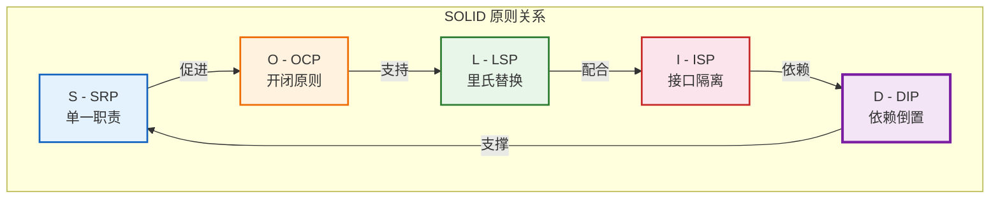
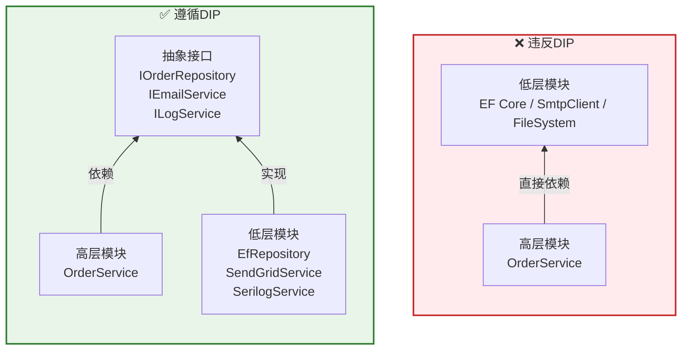
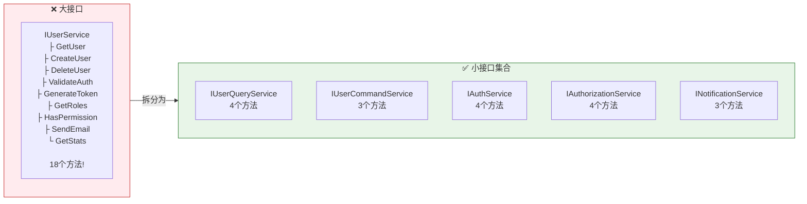

# SOLID原则实践：ASP.NET Core中的面向对象设计

> **目标读者**：希望编写高质量、可维护、可扩展代码的.NET开发者
>
> **前置知识**：熟悉C#基础语法、了解面向对象编程基本概念、有ASP.NET Core开发经验
>
> **相关文章**：
> - [[01-分层架构原则]] - SOLID是Clean Architecture的理论基础
> - [[02-领域驱动设计(DDD)基础]] - DDD中大量使用SOLID原则
> - [[03-Clean-Architecture项目组织]] - 在项目结构中应用SOLID

---

## 一、SOLID原则概述

### 1.1 什么是SOLID？

**SOLID** 是五个面向对象设计原则的首字母缩写，由Robert C. Martin（Uncle Bob）等人总结提出。这些原则帮助开发者编写出更易理解、更灵活、更易维护的代码：

```
┌─────────────────────────────────────────────────────┐
│                   SOLID 原则                         │
├─────────────────────────────────────────────────────┤
│                                                     │
│  S ─ Single Responsibility Principle (SRP)          │
│      单一职责原则                                    │
│                                                     │
│  O ─ Open/Closed Principle (OCP)                    │
│      开闭原则                                        │
│                                                     │
│  L ─ Liskov Substitution Principle (LSP)            │
│      里氏替换原则                                     │
│                                                     │
│  I ─ Interface Segregation Principle (ISP)          │
│      接口隔离原则                                     │
│                                                     │
│  D ─ Dependency Inversion Principle (DIP)           │
│      依赖倒置原则                                     │
│                                                     │
└─────────────────────────────────────────────────────┘

核心目标：
✅ 减少代码耦合
✅ 提高代码复用性
✅ 增强可测试性
✅ 使代码更容易理解和修改
```

### 1.2 为什么SOLID在ASP.NET Core中如此重要？

```
不遵循SOLID的后果：

代码腐化过程：

第1个月：功能正常，代码看起来还行
    ↓
第3个月：新需求来了，"先快速实现吧"
    ↓
第6个月：修改一个bug导致三个新bug
    ↓
第12个月：没人敢动这段代码，只能在外层打补丁
    ↓
第18个月：团队决定重写（但重写后可能重复同样的错误）

遵循SOLID的好处：

• 每个类职责清晰 → 容易找到要修改的地方
• 对扩展开放 → 新功能通过添加代码实现，而非修改现有代码
• 正确使用继承 → 多态行为符合预期
• 接口精简 → 使用者只依赖真正需要的方法
• 依赖抽象 → 可以轻松替换实现、便于单元测试
```

---

## 二、S - 单一职责原则（Single Responsibility Principle, SRP）

### 2.1 原则定义

> **一个类应该只有一个引起它变化的原因。**

换句话说：**一个类只做一件事，并把它做好。**

### 2.2 违反SRP的典型例子

```csharp
// ============================================
// ❌ 坏的实践：God Controller / God Service
// 这个类承担了太多职责！
// ============================================
namespace BadExamples.SRP;

[ApiController]
[Route("api/users")]
public class UserController : ControllerBase
{
    private readonly AppDbContext _context;
    private readonly ILogger<UserController> _logger;
    private readonly IEmailService _emailService;

    // 职责1：处理HTTP请求
    [HttpGet("{id}")]
    public async Task<IActionResult> GetUser(int id)
    {
        var user = await _context.Users.FindAsync(id);
        if (user == null) return NotFound();
        return Ok(user);
    }

    // 职责2：业务逻辑验证
    [HttpPost]
    public async Task<IActionResult> CreateUser(CreateUserDto dto)
    {
        // 验证逻辑混在这里
        if (string.IsNullOrEmpty(dto.Email))
            return BadRequest("Email不能为空");

        if (!IsValidEmail(dto.Email)) // 验证方法也在这个类里
            return BadRequest("邮箱格式无效");

        if (await IsDuplicateEmail(dto.Email)) // 数据库查询也直接做
            return BadRequest("邮箱已被注册");

        // 密码加密
        dto.Password = HashPassword(dto.Password); // 安全逻辑也在这！

        var user = new User { Email = dto.Email, PasswordHash = dto.Password };
        await _context.Users.AddAsync(user);
        await _context.SaveChangesAsync();

        // 发送邮件
        await SendWelcomeEmail(user.Email); // 邮件发送也在这！

        return CreatedAtAction(nameof(GetUser), new { id = user.Id }, user);
    }

    // 职责3：数据访问
    private async Task<bool> IsDuplicateEmail(string email)
    {
        return await _context.Users.AnyAsync(u => u.Email == email);
    }

    // 职责4：安全相关
    private string HashPassword(string password)
    {
        using var sha256 = SHA256.Create();
        var bytes = sha256.ComputeHash(Encoding.UTF8.GetBytes(password));
        return Convert.ToBase64String(bytes);
    }

    // 职责5：邮件发送
    private async Task SendWelcomeEmail(string email)
    {
        await _emailService.SendAsync(email, "欢迎注册", "感谢您注册我们的服务");
    }

    // 职责6：验证工具方法
    private bool IsValidEmail(string email)
    {
        try
        {
            var addr = new MailAddress(email);
            return addr.Address == email;
        }
        catch { return false; }
    }
}
```

**问题分析**：
- 一个Controller承担了至少 **6个不同的职责**
- 任何一处的变更都需要修改这个文件
- 无法独立测试每个职责
- 新团队成员难以理解这个类的完整行为

### 2.3 遵循SRP的重构方案

```csharp
// ============================================
// ✅ 好的实践：职责分离
// ============================================

// ---- 职责1：表现层 - 只负责HTTP请求/响应 ----
namespace GoodExamples.SRP.Presentation;

[ApiController]
[Route("api/users")]
public class UsersController : ControllerBase
{
    private readonly IMediator _mediator;
    private readonly IMapper _mapper;

    public UsersController(IMediator mediator, IMapper mapper)
    {
        _mediator = mediator;
        _mapper = mapper;
    }

    /// <summary>
    /// 获取用户信息
    /// </summary>
    [HttpGet("{id:guid}")]
    [ProducesResponseType(typeof(UserResponseDto), StatusCodes.Status200OK)]
    [ProducesResponseType(StatusCodes.Status404NotFound)]
    public async Task<IActionResult> GetUser(Guid id, CancellationToken ct)
    {
        var query = new GetUserByIdQuery(id);
        var result = await _mediator.Send(query, ct);

        return result.Match(
            onSuccess: user => Ok(_mapper.Map<UserResponseDto>(user)),
            onNotFound: () => NotFound(new { message = "用户不存在" })
        );
    }

    /// <summary>
    /// 创建用户
    /// </summary>
    [HttpPost]
    [ProducesResponseType(typeof(UserResponseDto), StatusCodes.Status201Created)]
    [ProducesResponseType(typeof(ValidationErrorResponse), StatusCodes.Status400BadRequest)]
    public async Task<IActionResult> CreateUser(
        [FromBody] CreateUserApiRequest request,
        CancellationToken ct)
    {
        var command = _mapper.Map<CreateUserCommand>(request);
        var result = await _mediator.Send(command, ct);

        return result.Match(
            onSuccess: user => CreatedAtAction(
                nameof(GetUser),
                new { id = user.Id },
                _mapper.Map<UserResponseDto>(user)
            ),
            onError: errors => BadRequest(new ValidationErrorResponse(errors))
        );
    }
}

// ---- 职责2：应用层 - 用例编排 ----
namespace GoodExamples.SRP.Application.Commands.Users.CreateUser;

/// <summary>
/// 创建用户命令处理器
/// 只负责编排创建用户的流程，不包含具体业务规则
/// </summary>
public class CreateUserCommandHandler : IRequestHandler<CreateUserCommand, Result<User>>
{
    private readonly IUserRepository _userRepository;
    private readonly IPasswordHasher _passwordHasher;       // 职责3：独立的密码哈希服务
    private readonly IEmailService _emailService;             // 职责5：独立的邮件服务
    private readonly IUnitOfWork _unitOfWork;
    private readonly IMediator _mediator;
    private readonly ILogger<CreateUserCommandHandler> _logger;

    public CreateUserCommandHandler(
        IUserRepository userRepository,
        IPasswordHasher passwordHasher,
        IEmailService emailService,
        IUnitOfWork unitOfWork,
        IMediator mediator,
        ILogger<CreateUserCommandHandler> logger)
    {
        _userRepository = userRepository;
        _passwordHasher = passwordHasher;
        _emailService = emailService;
        _unitOfWork = unitOfWork;
        _mediator = mediator;
        _logger = logger;
    }

    public async Task<Result<User>> Handle(
        CreateUserCommand request,
        CancellationToken cancellationToken)
    {
        // 委托给各专业服务处理
        // 1. 检查邮箱唯一性（委托给仓储）
        if (await _userRepository.ExistsByEmailAsync(request.Email, cancellationToken))
        {
            return Result.Error("该邮箱已被注册");
        }

        // 2. 哈希密码（委托给专门的密码服务）
        var passwordHash = _passwordHasher.HashPassword(request.Password);

        // 3. 创建用户实体（委托给领域对象的工厂方法）
        var user = User.Register(
            email: request.Email,
            passwordHash: passwordHash,
            name: request.Name
        );

        // 4. 持久化
        await _userRepository.AddAsync(user, cancellationToken);
        await _unitOfWork.SaveChangesAsync(cancellationToken);

        // 5. 发送欢迎邮件（异步，不阻塞响应）
        _ = Task.Run(async () =>
        {
            try
            {
                await _emailService.SendWelcomeEmailAsync(user.Email, user.Name);
            }
            catch (Exception ex)
            {
                _logger.LogError(ex, "发送欢迎邮件失败: {Email}", user.Email);
            }
        }, cancellationToken);

        // 6. 发布事件
        await _mediator.Publish(new UserCreatedDomainEvent(user.Id), cancellationToken);

        _logger.LogInformation("用户创建成功: {UserId}, Email: {Email}", user.Id, user.Email);

        return Result.Success(user);
    }
}

// ---- 职责3：基础设施层 - 密码哈希 ----
namespace GoodExamples.SRP.Infrastructure.Security;

/// <summary>
/// 密码哈希服务：专门负责密码的安全处理
/// </summary>
public class PasswordHasher : IPasswordHasher
{
    private const int SaltSize = 16; // 128位
    private const int KeySize = 32;  // 256位
    private const int Iterations = 10000;

    public string HashPassword(string password)
    {
        using var algorithm = new Rfc2898DeriveBytes(
            password,
            SaltSize,
            Iterations,
            HashAlgorithmName.SHA256);

        var key = algorithm.GetBytes(KeySize);
        var salt = algorithm.Salt;

        return $"{Convert.ToBase64String(salt)}.{Convert.ToBase64String(key)}";
    }

    public bool VerifyPassword(string hashedPassword, string providedPassword)
    {
        var parts = hashedPassword.Split('.');
        if (parts.Length != 2) return false;

        var salt = Convert.FromBase64String(parts[0]);
        var key = Convert.FromBase64String(parts[1]);

        using var algorithm = new Rfc2898DeriveBytes(
            providedPassword,
            salt,
            Iterations,
            HashAlgorithmName.SHA256);

        var newKey = algorithm.GetBytes(KeySize);

        return CryptographicOperations.FixedTimeEquals(key, newKey);
    }
}

// ---- 职责4：领域层 - 邮箱验证 ----
namespace GoodExamples.SRP.Domain.ValueObjects;

/// <summary>
/// 邮箱值对象：自验证，封装邮箱相关的所有规则
/// </summary>
public readonly record struct Email(string Value)
{
    private static readonly Regex EmailRegex =
        new(@"^[^@\s]+@[^@\s]+\.[^@\s]+$", RegexOptions.Compiled);

    public static Email From(string value)
    {
        if (string.IsNullOrWhiteSpace(value))
            throw new ArgumentException("邮箱不能为空", nameof(value));

        value = value.Trim().ToLowerInvariant();

        if (!EmailRegex.IsMatch(value))
            throw new ArgumentException("邮箱格式无效", nameof(value));

        if (value.Length > 254)
            throw new ArgumentException("邮箱长度不能超过254字符", nameof(value));

        return new Email(value);
    }

    public static implicit operator string(Email email) => email.Value;
}

// ---- 职责5：基础设施层 - 邮件服务接口与实现 ----
namespace GoodExamples.SRP.Infrastructure.Messaging;

public interface IEmailService
{
    Task SendWelcomeEmailAsync(string email, string name);
    Task SendPasswordResetEmailAsync(string email, string resetToken);
    Task SendOrderConfirmationEmailAsync(string email, OrderSummary order);
}

public class SendGridEmailService : IEmailService
{
    private readonly ISendGridClient _client;
    private readonly ILogger<SendGridEmailService> _logger;

    public async Task SendWelcomeEmailAsync(string email, string name)
    {
        var msg = MailHelper.CreateSingleEmail(
            from: new EmailAddress("noreply@example.com", "MyApp"),
            to: new EmailAddress(email, name),
            subject: "欢迎加入我们",
            plainTextContent: $"亲爱的{name}，欢迎注册...",
            htmlContent: GenerateWelcomeHtml(name)
        );

        await _client.SendEmailAsync(msg);
        _logger.LogInformation("欢迎邮件已发送: {Email}", email);
    }

    // ... 其他方法实现
}
```

### 2.4 SRP判断标准

```
如何判断一个类是否违反了SRP？

问自己以下问题：

1. 如果我要改变X功能，需要修改这个类吗？
   → 如果答案是"是"，且还有其他原因也需要修改这个类，
     那么可能违反了SRP。

2. 我能用一句话描述这个类的职责吗？
   → 如果不能用简洁的一句话描述，或者需要用"和"、"以及"
     连接多个职责，那么可能违反了SRP。

3. 这个类是否有明显不相关的方法组？
   → 如果方法可以分成几组，每组关注不同的事情，
     那么应该拆分。

4. 测试这个类时是否需要Mock很多不同的东西？
   → 如果测试一个类需要Mock很多不相关的依赖，
     说明这个类做了太多事情。
```

---

## 三、O - 开闭原则（Open/Closed Principle, OCP）

### 3.1 原则定义

> **软件实体（类、模块、函数等）应该对扩展开放，对修改关闭。**

换句话说：**添加新功能时，应该通过添加新代码来实现，而不是修改已有代码。**

### 3.2 违反OCP的典型例子

```csharp
// ============================================
// ❌ 坏的实践：每次新增类型都要修改现有代码
// ============================================

namespace BadExamples.OCP;

/// <summary>
/// 折扣计算器：每增加一种新的折扣规则就要修改这个类
/// </summary>
public class DiscountCalculator
{
    public decimal CalculateDiscount(Order order, Customer customer)
    {
        decimal discount = 0;

        // 规则1：VIP客户固定折扣
        if (customer.Type == CustomerType.VIP)
        {
            discount = order.TotalAmount * 0.15m;
        }
        // 规则2：大额订单折扣
        else if (order.TotalAmount >= 10000)
        {
            discount = order.TotalAmount * 0.10m;
        }
        // 规则3：首次购买折扣
        else if (customer.IsFirstPurchase)
        {
            discount = order.TotalAmount * 0.05m;
        }
        // 规则4：节日促销折扣（新增的！）
        else if (IsHolidayPromotion())
        {
            discount = order.TotalAmount * 0.08m;
        }
        // 规则5：会员等级折扣（又新增的！）
        else if (customer.Level == CustomerLevel.Gold)
        {
            discount = order.TotalAmount * 0.12m;
        }
        // ... 未来还会继续增加

        return discount;
    }

    private bool IsHolidayPromotion()
    {
        var now = DateTime.Now;
        return now.Month == 11 && now.Day >= 11 && now.Day <= 11; // 双11
    }
}

/// <summary>
/// 订单报告生成器：每增加一种格式都要修改
/// </summary>
public class ReportGenerator
{
    public string GenerateReport(OrderReport report, string format)
    {
        switch (format.ToLower())
        {
            case "json":
                return JsonSerializer.Serialize(report);
            case "xml":
                // XML序列化逻辑
                var xmlSerializer = new XmlSerializer(typeof(OrderReport));
                using var writer = new StringWriter();
                xmlSerializer.Serialize(writer, report);
                return writer.ToString();
            case "csv":
                // CSV生成逻辑
                var csv = new StringBuilder();
                csv.AppendLine("OrderId,Total,Date");
                foreach (var item in report.Items)
                {
                    csv.AppendLine($"{item.OrderId},{item.Total},{item.Date}");
                }
                return csv.ToString();
            case "excel": // 新增！
                // Excel生成逻辑...
                break;
            case "pdf": // 又新增！
                // PDF生成逻辑...
                break;
            default:
                throw new NotSupportedException($"不支持的格式: {format}");
        }
    }
}
```

**问题分析**：
- 每次新增折扣规则或报表格式都需要**修改已有代码**
- 修改已有代码有引入bug的风险
- 类会变得越来越长，越来越难维护
- 不符合开闭原则的核心思想

### 3.3 遵循OCP的重构方案

```csharp
// ============================================
// ✅ 好的实践：使用策略模式 + 依赖注入实现对扩展开放
// ============================================

namespace GoodExamples.OCP.Discount;

// ---- 第一步：定义策略接口 ----

/// <summary>
/// 折扣策略接口：定义折扣计算的契约
/// </summary>
public interface IDiscountStrategy
{
    /// <summary>
    /// 判断此策略是否适用于当前订单
    /// </summary>
    bool IsApplicable(Order order, Customer customer);

    /// <summary>
    /// 计算折扣金额
    /// </summary>
    Money CalculateDiscount(Order order, Customer customer);
}

// ---- 第二步：实现各种具体的折扣策略 ----

/// <summary>
/// VIP客户折扣策略
/// </summary>
public class VipCustomerDiscountStrategy : IDiscountStrategy
{
    private readonly decimal _discountPercentage;
    private readonly ILogger<VipCustomerDiscountStrategy> _logger;

    public VipCustomerDiscountStrategy(decimal discountPercentage, ILogger<VipCustomerDiscountStrategy> logger)
    {
        _discountPercentage = discountPercentage;
        _logger = logger;
    }

    public bool IsApplicable(Order order, Customer customer)
    {
        return customer.Type == CustomerType.VIP;
    }

    public Money CalculateDiscount(Order order, Customer customer)
    {
        var discount = order.TotalAmount.ApplyPercentage(_discountPercentage);
        _logger.LogDebug("VIP客户折扣: 订单{OrderId}, 折扣{Discount}",
            order.Id, discount);
        return discount;
    }
}

/// <summary>
/// 大额订单折扣策略
/// </summary>
public class LargeOrderDiscountStrategy : IDiscountStrategy
{
    private readonly Money _threshold;
    private readonly decimal _discountPercentage;

    public LargeOrderDiscountStrategy(Money threshold, decimal discountPercentage)
    {
        _threshold = threshold;
        _discountPercentage = discountPercentage;
    }

    public bool IsApplicable(Order order, Customer customer)
    {
        return order.TotalAmount.Amount >= _threshold.Amount;
    }

    public Money CalculateDiscount(Order order, Customer customer)
    {
        return order.TotalAmount.ApplyPercentage(_discountPercentage);
    }
}

/// <summary>
/// 首次购买折扣策略
/// </summary>
public class FirstPurchaseDiscountStrategy : IDiscountStrategy
{
    public bool IsApplicable(Order order, Customer customer)
    {
        return customer.IsFirstPurchase;
    }

    public Money CalculateDiscount(Order order, Customer customer)
    {
        return order.TotalAmount.ApplyPercentage(5); // 5%折扣
    }
}

/// <summary>
/// 节日促销折扣策略（新增策略无需修改任何已有代码！）
/// </summary>
public class HolidayPromotionDiscountStrategy : IDiscountStrategy
{
    private readonly IHolidayCalendar _holidayCalendar;
    private readonly decimal _discountPercentage;

    public HolidayPromotionDiscountStrategy(IHolidayCalendar holidayCalendar, decimal discountPercentage)
    {
        _holidayCalendar = holidayCalendar;
        _discountPercentage = discountPercentage;
    }

    public bool IsApplicable(Order order, Customer customer)
    {
        return _holidayCalendar.IsCurrentlyInPromotion();
    }

    public Money CalculateDiscount(Order order, Customer customer)
    {
        return order.TotalAmount.ApplyPercentage(_discountPercentage);
    }
}

/// <summary>
/// 会员等级折扣策略（又一个新策略，同样不需要修改已有代码！）
/// </summary>
public class MemberLevelDiscountStrategy : IDiscountStrategy
{
    private readonly IReadOnlyDictionary<CustomerLevel, decimal> _levelDiscounts;

    public MemberLevelDiscountStrategy(IReadOnlyDictionary<CustomerLevel, decimal> levelDiscounts)
    {
        _levelDiscounts = levelDiscounts;
    }

    public bool IsApplicable(Order order, Customer customer)
    {
        return _levelDiscounts.ContainsKey(customer.Level);
    }

    public Money CalculateDiscount(Order order, Customer customer)
    {
        if (_levelDiscounts.TryGetValue(customer.Level, out var percentage))
        {
            return order.TotalAmount.ApplyPercentage(percentage);
        }
        return Money.Zero;
    }
}

// ---- 第三步：使用组合模式管理策略 ----

/// <summary>
/// 折扣计算器：组合多个策略，自动选择适用的
/// 核心逻辑稳定不变，新策略通过DI注册即可生效
/// </summary>
public class DiscountCalculator
{
    private readonly IEnumerable<IDiscountStrategy> _strategies;
    private readonly ILogger<DiscountCalculator> _logger;

    /// <summary>
    /// 通过构造函数注入所有已注册的折扣策略
    /// 新增策略只需注册到DI容器，这里自动获取
    /// </summary>
    public DiscountCalculator(IEnumerable<IDiscountStrategy> strategies, ILogger<DiscountCalculator> logger)
    {
        _strategies = strategies.OrderBy(s => s.Priority); // 可选：按优先级排序
        _logger = logger;
    }

    /// <summary>
    /// 计算最优折扣（取最大的那个）
    /// </summary>
    public Money CalculateBestDiscount(Order order, Customer customer)
    {
        var applicableStrategies = _strategies
            .Where(s => s.IsApplicable(order, customer))
            .ToList();

        if (!applicableStrategies.Any())
        {
            _logger.LogDebug("没有适用的折扣策略");
            return Money.Zero;
        }

        // 可以选择：取最大折扣 / 累加所有折扣 / 取第一个匹配的策略
        var bestDiscount = applicableStrategies
            .Select(s => s.CalculateDiscount(order, customer))
            .Max();

        _logger.LogInformation(
            "计算完成最佳折扣: {Discount}, 适用策略数: {Count}",
            bestDiscount,
            applicableStrategies.Count
        );

        return bestDiscount;
    }
}

// ---- 第四步：DI容器注册策略 ----

// Program.cs 或 Infrastructure 的 DI 注册
public static class ServiceCollectionExtensions
{
    public static IServiceCollection AddDiscountStrategies(this IServiceCollection services)
    {
        // 注册所有折扣策略（新增策略只需添加一行注册代码）
        services.AddScoped<IDiscountStrategy, VipCustomerDiscountStrategy>();
        services.AddScoped<IDiscountStrategy, LargeOrderDiscountStrategy>();
        services.AddScoped<IDiscountStrategy, FirstPurchaseDiscountStrategy>();
        services.AddScoped<IDiscountStrategy, HolidayPromotionDiscountStrategy>();
        services.AddScoped<IDiscountStrategy, MemberLevelDiscountStrategy>();

        // 注册折扣计算器
        services.AddScoped<DiscountCalculator>();

        return services;
    }
}

// ---- 另一个OCP示例：报告生成器使用装饰器模式 ----

namespace GoodExamples.OCP.Reporting;

/// <summary>
/// 报告生成器接口
/// </summary>
public interface IReportGenerator
{
    Task<byte[]> GenerateAsync(OrderReport report, CancellationToken ct);
}

/// <summary>
/// JSON报告生成器
/// </summary>
public class JsonReportGenerator : IReportGenerator
{
    public async Task<byte[]> GenerateAsync(OrderReport report, CancellationToken ct)
    {
        var json = JsonSerializer.Serialize(report, new JsonSerializerOptions { WriteIndented = true });
        return Encoding.UTF8.GetBytes(json);
    }
}

/// <summary>
/// CSV报告生成器
/// </summary>
public class CsvReportGenerator : IReportGenerator
{
    public async Task<byte[]> GenerateAsync(OrderReport report, CancellationToken ct)
    {
        var csv = new StringBuilder();
        csv.AppendLine("OrderId,CustomerName,Total,Status,Date");

        foreach (var item in report.Items)
        {
            csv.AppendLine($"{item.OrderId},{item.CustomerName},{item.Total:N2},{item.Status},{item.Date:yyyy-MM-dd}");
        }

        return Encoding.UTF8.GetBytes(csv.ToString());
    }
}

/// <summary>
/// Excel报告生成器（新增格式，不影响已有代码！）
/// </summary>
public class ExcelReportGenerator : IReportGenerator
{
    private readonly IExcelEngine _excelEngine;

    public ExcelReportGenerator(IExcelEngine excelEngine)
    {
        _excelEngine = excelEngine;
    }

    public async Task<byte[]> GenerateAsync(OrderReport report, CancellationToken ct)
    {
        using var package = _excelEngine.CreatePackage();

        var worksheet = package.Workbook.Worksheets.Add("订单报表");

        // 设置表头
        worksheet.Cells[1, 1].Value = "订单号";
        worksheet.Cells[1, 2].Value = "客户名称";
        worksheet.Cells[1, 3].Value = "金额";
        // ...

        // 填充数据
        for (int i = 0; i < report.Items.Count; i++)
        {
            var row = i + 2;
            worksheet.Cells[row, 1].Value = report.Items[i].OrderId;
            worksheet.Cells[row, 2].Value = report.Items[i].CustomerName;
            worksheet.Cells[row, 3].Value = report.Items[i].Total;
        }

        return await package.GetAsByteArrayAsync(ct);
    }
}

/// <summary>
/// 报告工厂：根据格式选择对应的生成器
/// </summary>
public class ReportFactory
{
    private readonly IServiceProvider _serviceProvider;
    private readonly Dictionary<string, Type> _generatorTypes;

    public ReportFactory(IServiceProvider serviceProvider)
    {
        _serviceProvider = serviceProvider;
        // 注册表：可以在配置文件或数据库中定义
        _generatorTypes = new Dictionary<string, Type>(StringComparer.OrdinalIgnoreCase)
        {
            ["json"] = typeof(JsonReportGenerator),
            ["csv"] = typeof(CsvReportGenerator),
            ["xlsx"] = typeof(ExcelReportGenerator),
            // 新增格式只需在此添加一行映射
        };
    }

    public IReportGenerator Create(string format)
    {
        if (!_generatorTypes.TryGetValue(format, out var generatorType))
        {
            throw new NotSupportedException($"不支持的报表格式: {format}. 支持的格式: {string.Join(", ", _generatorTypes.Keys)}");
        }

        return (IReportGenerator)_serviceProvider.GetRequiredService(generatorType);
    }
}
```

### 3.4 OCP常用实现模式

| 模式 | 适用场景 | 示例 |
|------|---------|------|
| **策略模式** | 算法/规则需要灵活切换 | 折扣计算、支付方式选择 |
| **模板方法模式** | 有固定的流程骨架，步骤可变 | 导出报表的通用流程 |
| **装饰器模式** | 动态添加额外功能 | 日志装饰器、缓存装饰器 |
| **观察者模式** | 事件驱动、通知机制 | 订单状态变化通知 |
| **工厂模式** | 对象创建需要根据条件选择 | 报告格式选择 |

---

## 四、L - 里氏替换原则（Liskov Substitution Principle, LSP）

### 4.1 原则定义

> **子类对象必须能够在程序中替换其父类对象，而不影响程序的正确性。**

换句话说：**继承时要确保子类可以完美替代父类出现的地方。**

### 4.2 违反LSP的典型例子

```csharp
// ============================================
// ❌ 坏的实践：子类破坏了父类的约定
// ============================================

namespace BadExamples.LSP;

/// <summary>
/// 基类：矩形
/// </summary>
public class Rectangle
{
    public virtual double Width { get; set; }
    public virtual double Height { get; set; }

    public double Area => Width * Height;
}

/// <summary>
/// 子类：正方形（继承自矩形）
/// 问题：正方形要求宽高相等，这破坏了矩形的语义
/// </summary>
public class Square : Rectangle
{
    // 强制宽高相等
    public override double Width
    {
        get => base.Width;
        set
        {
            base.Width = value;
            base.Height = value; // 设置宽度时也设置高度
        }
    }

    public override double Height
    {
        get => base.Height;
        set
        {
            base.Height = value;
            base.Width = value; // 设置高度时也设置宽度
        }
    }
}

/// <summary>
/// 使用场景的问题
/// </summary>
public class RectangleUser
{
    /// <summary>
    /// 这个方法期望Rectangle的行为：可以独立设置宽和高
    /// 但如果传入Square，会产生意外结果
    /// </summary>
    public void Resize(Rectangle rectangle)
    {
        rectangle.Width = 5;
        rectangle.Height = 10;
        // 期望 Area = 50
        // 但如果是Square实例，Area = 100（因为Width被强制改为10）
        Console.WriteLine($"预期面积: 50, 实际面积: {rectangle.Area}");
    }
}

// 另一个常见的LSP违反例子
public class Bird
{
    public virtual void Fly()
    {
        Console.WriteLine("我在飞翔");
    }
}

public class Ostrich : Bird // 鸵鸟不会飞！
{
    public override void Fly()
    {
        throw new NotSupportedException("鸵鸟不会飞！");
    }
}

// 使用时必须知道具体类型才能避免异常
public void MakeBirdFly(Bird bird)
{
    if (bird is Ostrich)
    {
        Console.WriteLine("这是一只鸵鸟，不能让它飞");
        return;
    }
    bird.Fly(); // 必须做类型检查，违反多态的目的
}
```

### 4.3 遵循LSP的重构方案

```csharp
// ============================================
// ✅ 好的实践：正确使用继承和组合
// ============================================

namespace GoodExamples.LSP;

// ---- 方案1：重新设计继承关系 ----

/// <summary>
/// 更好的设计：提取公共接口
/// </summary>
public interface IShape
{
    double Area { get; }
}

public class Rectangle : IShape
{
    public double Width { get; }
    public double Height { get; }

    public Rectangle(double width, double height)
    {
        Width = width;
        Height = height;
    }

    public double Area => Width * Height;
}

public class Square : IShape
{
    public double SideLength { get; }

    public Square(double sideLength)
    {
        SideLength = sideLength;
    }

    public double Area => SideLength * SideLength;
}

// ---- 方案2：鸟类问题的正确建模 ----

/// <summary>
/// 基类：只包含所有鸟类共有的行为
/// </summary>
public abstract class Bird
{
    public abstract void Move();
}

/// <summary>
/// 会飞的鸟
/// </summary>
public class FlyingBird : Bird
{
    public override void Move() => Fly();

    public virtual void Fly()
    {
        Console.WriteLine("拍动翅膀，翱翔天际");
    }
}

/// <summary>
/// 不会飞的鸟
/// </summary>
public class NonFlyingBird : Bird
{
    public override void Move() => WalkOrRun();

    protected virtual void WalkOrRun()
    {
        Console.WriteLine("用脚走路或奔跑");
    }
}

/// <summary>
/// 鹰：会飞的鸟
/// </summary>
public class Eagle : FlyingBird
{
    public override void Fly()
    {
        Console.WriteLine("鹰击长空，俯冲而下");
    }
}

/// <summary>
/// 鸵鸟：不会飞的鸟
/// </summary>
public class Ostrich : NonFlyingBird
{
    protected override void WalkOrRun()
    {
        Console.WriteLine("鸵鸟以70公里/小时的速度奔跑");
    }
}

/// <summary>
/// 企鹅：特殊的不会飞的鸟（会游泳）
/// </summary>
public class Penguin : NonFlyingBird
{
    protected override void WalkOrRun()
    {
        Console.WriteLine("企鹅摇摆着走路，也能游泳");
    }

    public void Swim()
    {
        Console.WriteLine("企鹅在水中优雅地游动");
    }
}

// 使用时不需要类型检查
public class BirdHandler
{
    public void HandleBird(Bird bird)
    {
        // 所有鸟都能Move，不需要知道具体类型
        bird.Move();
    }
}

// ---- ASP.NET Core中的实际例子 ----

/// <summary>
/// 基础仓储接口：定义基本的CRUD操作
/// </summary>
public interface IRepository<T, TId> where T : class
{
    Task<T?> GetByIdAsync(TId id, CancellationToken ct);
    Task<IReadOnlyList<T>> GetAllAsync(CancellationToken ct);
    Task AddAsync(T entity, CancellationToken ct);
    void Update(T entity);
    void Delete(T entity);
}

/// <summary>
/// 只读仓储接口：用于只需要查询的场景
/// 注意：这是IRepository的子集，不是子类型的特殊化
/// </summary>
public interface IReadOnlyRepository<T, TId> where T : class
{
    Task<T?> GetByIdAsync(TId id, CancellationToken ct);
    Task<IReadOnlyList<T>> GetAllAsync(CancellationToken ct);
}

/// <summary>
/// 具体仓储实现：同时实现两个接口
/// </summary>
public class EfRepository<T, TId> : IRepository<T, TId>, IReadOnlyRepository<T, TId>
    where T : class
{
    private readonly DbContext _context;
    private readonly DbSet<T> _dbSet;

    public EfRepository(DbContext context)
    {
        _context = context;
        _dbSet = context.Set<T>();
    }

    public async Task<T?> GetByIdAsync(TId id, CancellationToken ct)
    {
        return await _dbSet.FindAsync(new object[] { id }, ct);
    }

    public async Task<IReadOnlyList<T>> GetAllAsync(CancellationToken ct)
    {
        return await _dbSet.AsNoTracking().ToListAsync(ct);
    }

    public async Task AddAsync(T entity, CancellationToken ct)
    {
        await _dbSet.AddAsync(entity, ct);
    }

    public void Update(T entity)
    {
        _dbSet.Update(entity);
    }

    public void Delete(T entity)
    {
        _dbSet.Remove(entity);
    }
}
```

### 4.4 LSP检查清单

```
LSP检查清单：

□ 子类是否实现了父类的所有公开方法？
  → 如果某些方法抛出NotSupportedException，说明继承关系有问题

□ 子类的前置条件是否比父类更严格？
  → 不应该！子类不应该拒绝父类能接受的输入

□ 子类的后置条件是否比父类更弱？
  → 不应该！子类应该至少保证父类承诺的结果

□ 子类是否保持了父类的不变量？
  → 所有父类的不变量在子类中也必须成立

□ 是否需要在使用处进行类型检查（is/as）？
  → 如果需要，说明多态被破坏了

□ 能否在不修改客户端代码的情况下用子类替换父类？
  → 这是最终的测试标准
```

---

## 五、I - 接口隔离原则（Interface Segregation Principle, ISP）

### 5.1 原则定义

> **客户端不应该被迫依赖它不使用的方法。接口应该小而专注。**

换句话说：**与其提供一个臃肿的大接口，不如提供多个小而专一的接口。**

### 5.2 违反ISP的典型例子

```csharp
// ============================================
// ❌ 坏的实践：臃肿的接口，强迫使用者实现不需要的方法
// ============================================

namespace BadExamples.ISP;

/// <summary>
/// 超级大的用户服务接口：包含了所有可能的方法
/// </summary>
public interface IUserService
{
    // 用户基本信息操作
    Task<User> GetUserByIdAsync(int id);
    Task<User> GetUserByEmailAsync(string email);
    Task CreateUserAsync(CreateUserDto dto);
    Task UpdateUserAsync(UpdateUserDto dto);
    Task DeleteUserAsync(int id);

    // 认证相关
    Task<bool> ValidateCredentialsAsync(string email, string password);
    Task<string> GenerateTokenAsync(User user);
    Task<bool> ValidateTokenAsync(string token);

    // 权限相关
    Task<List<Role>> GetRolesAsync(int userId);
    Task<bool> HasPermissionAsync(int userId, string permission);
    Task AssignRoleAsync(int userId, int roleId);
    Task RemoveRoleAsync(int userId, int roleId);

    // 通知相关
    Task SendWelcomeEmailAsync(int userId);
    Task SendPasswordResetEmailAsync(int userId);
    Task SendNotificationAsync(int userId, string message);

    // 统计相关
    Task<UserStatistics> GetStatisticsAsync(int userId);
    Task<int> GetLoginCountAsync(int userId, DateTime from, DateTime to);
    Task UpdateLastLoginTimeAsync(int userId);
}

/// <summary>
/// 实现：即使只需要部分功能，也要实现所有方法
/// </summary>
public class UserService : IUserService
{
    // 必须实现所有18个方法，即使有些根本用不到！

    public async Task<User> GetUserByIdAsync(int id) { /* 实现 */ }
    public async Task<User> GetUserByEmailAsync(string email) { /* 实现 */ }
    public async Task CreateUserAsync(CreateUserDto dto) { /* 实现 */ }
    public async Task UpdateUserAsync(UpdateUserDto dto) { /* 实现 */ }
    public async Task DeleteUserAsync(int id) { /* 实现 */ }
    public async Task<bool> ValidateCredentialsAsync(string email, string password) { /* 实现 */ }
    public async Task<string> GenerateTokenAsync(User user) { /* 实现 */ }
    public async Task<bool> ValidateTokenAsync(string token) { /* 实现 */ }
    public async Task<List<Role>> GetRolesAsync(int userId) { /* 实现 */ }
    public async Task<bool> HasPermissionAsync(int userId, string permission) { /* 实现 */ }
    public async Task AssignRoleAsync(int userId, int roleId) { /* 实现 */ }
    public async Task RemoveRoleAsync(int userId, int roleId) { /* 实现 */ }
    public async Task SendWelcomeEmailAsync(int userId) { /* 实现 */ }
    public async Task SendPasswordResetEmailAsync(int userId) { /* 实现 */ }
    public async Task SendNotificationAsync(int userId, string message) { /* 实现 */ }
    public async Task<UserStatistics> GetStatisticsAsync(int userId) { /* 实现 */ }
    public async Task<int> GetLoginCountAsync(int userId, DateTime from, DateTime to) { /* 实现 */ }
    public async Task UpdateLastLoginTimeAsync(int userId) { /* 实现 */ }
}

// 使用者：AdminController只需要用户CRUD，却依赖了整个大接口
public class AdminController : ControllerBase
{
    private readonly IUserService _userService; // 被迫依赖18个方法

    public AdminController(IUserService userService)
    {
        _userService = userService;
    }

    [HttpGet("{id}")]
    public async Task<IActionResult> GetUser(int id)
    {
        var user = await _userService.GetUserByIdAsync(id);
        return Ok(user);
    }
    // 只用了1个方法，却被绑定了17个不需要的方法
}
```

### 5.3 遵循ISP的重构方案

```csharp
// ============================================
// ✅ 好的实践：将大接口拆分为多个小接口
// ============================================

namespace GoodExamples.ISP;

// ---- 拆分后的接口集合 ----

/// <summary>
/// 接口1：用户查询（只读操作）
/// </summary>
public interface IUserQueryService
{
    Task<User?> GetByIdAsync(Guid id, CancellationToken ct);
    Task<User?> GetByEmailAsync(string email, CancellationToken ct);
    Task<PagedResult<User>> GetPagedAsync(PagedQuery query, CancellationToken ct);
    Task<bool> ExistsByEmailAsync(string email, CancellationToken ct);
}

/// <summary>
/// 接口2：用户写操作（创建、更新、删除）
/// </summary>
public interface IUserCommandService
{
    Task<Result<Guid>> CreateAsync(CreateUserCommand command, CancellationToken ct);
    Task<Result> UpdateAsync(UpdateUserCommand command, CancellationToken ct);
    Task<Result> DeleteAsync(Guid id, CancellationToken ct);
}

/// <summary>
/// 接口3：认证相关
/// </summary>
public interface IAuthenticationService
{
    Task<AuthResult> ValidateCredentialsAsync(LoginRequest request, CancellationToken ct);
    Task<string> GenerateJwtTokenAsync(User user);
    Task<bool> ValidateTokenAsync(string token);
    Task<string> RefreshTokenAsync(string refreshToken);
}

/// <summary>
/// 接口4：授权/权限
/// </summary>
public interface IAuthorizationService
{
    Task<IReadOnlyList<Role>> GetRolesAsync(Guid userId, CancellationToken ct);
    Task<bool> HasPermissionAsync(Guid userId, string permission, CancellationToken ct);
    Task<Result> AssignRoleAsync(AssignRoleCommand command, CancellationToken ct);
    Task<Result> RemoveRoleAsync(RemoveRoleCommand command, CancellationToken ct);
}

/// <summary>
/// 接口5：用户通知
/// </summary>
public interface IUserNotificationService
{
    Task SendWelcomeEmailAsync(Guid userId, CancellationToken ct);
    Task SendPasswordResetEmailAsync(Guid userId, CancellationToken ct);
    Task SendNotificationAsync(Guid userId, NotificationMessage message, CancellationToken ct);
}

/// <summary>
/// 接口6：用户统计
/// </summary>
public interface IUserStatisticsService
{
    Task<UserStatistics> GetStatisticsAsync(Guid userId, CancellationToken ct);
    Task<int> GetLoginCountAsync(Guid userId, DateRange range, CancellationToken ct);
    Task RecordLoginAsync(Guid userId, CancellationToken ct);
}

// ---- 使用者按需注入需要的接口 ----

/// <summary>
/// Admin控制器：只需要查询和写操作
/// </summary>
[ApiController]
[Route("api/admin/users")]
public class AdminUsersController : ControllerBase
{
    private readonly IUserQueryService _queryService;    // 只注入需要的
    private readonly IUserCommandService _commandService;  // 只注入需要的

    public AdminUsersController(
        IUserQueryService queryService,
        IUserCommandService commandService)
    {
        _queryService = queryService;
        _commandService = commandService;
    }

    [HttpGet("{id}")]
    public async Task<IActionResult> GetUser(Guid id, CancellationToken ct)
    {
        var user = await _queryService.GetByIdAsync(id, ct);
        return user is not null ? Ok(user) : NotFound();
    }

    [HttpPost]
    public async Task<IActionResult> CreateUser(
        [FromBody] CreateUserApiRequest request,
        CancellationToken ct)
    {
        var command = new CreateUserCommand(/* ... */);
        var result = await _commandService.CreateAsync(command, ct);
        return result.Match(
            onSuccess: id => CreatedAtAction(nameof(GetUser), new { id }, null),
            onError: errors => BadRequest(errors)
        );
    }
}

/// <summary>
/// Auth控制器：只需要认证服务
/// </summary>
[ApiController]
[Route("api/auth")]
public class AuthController : ControllerBase
{
    private readonly IAuthenticationService _authService; // 只需要认证

    public AuthController(IAuthenticationService authService)
    {
        _authService = authService;
    }

    [HttpPost("login")]
    public async Task<IActionResult> Login([FromBody] LoginRequest request, CancellationToken ct)
    {
        var result = await _authService.ValidateCredentialsAsync(request, ct);
        return result.Match(
            onSuccess: authResult => Ok(new { Token = authResult.Token }),
            onInvalid: () => Unauthorized(new { message = "用户名或密码错误" })
        );
    }
}

/// <summary>
/// 仓储接口的ISP实践
/// </summary>

/// <summary>
/// 只读仓储：用于查询场景
/// </summary>
public interface IReadOnlyRepository<TEntity, TId> where TEntity : class
{
    Task<TEntity?> GetByIdAsync(TId id, CancellationToken ct = default);
    Task<IReadOnlyList<TEntity>> ListAsync(ISpecification<TEntity>? spec = null, CancellationToken ct = default);
    Task<bool> ExistsAsync(TId id, CancellationToken ct = default);
    Task<long> CountAsync(ISpecification<TEntity>? spec = null, CancellationToken ct = default);
}

/// <summary>
/// 写仓储：用于写操作场景
/// </summary>
public interface IRepository<TEntity, TId> : IReadOnlyRepository<TEntity, TId> where TEntity : class
{
    Task AddAsync(TEntity entity, CancellationToken ct = default);
    void Update(TEntity entity);
    void Delete(TEntity entity);
}

/// <summary>
/// 特定实体的查询接口：扩展特定查询能力
/// </summary>
public interface IOrderReadRepository : IReadOnlyRepository<Order, OrderId>
{
    Task<(IReadOnlyList<Order> Items, int TotalCount)> GetByCustomerPagedAsync(
        CustomerId customerId, int page, int pageSize, CancellationToken ct);
    Task<IReadOnlyList<Order>> GetPendingOrdersAsync(int limit, CancellationToken ct);
    Task<Order?> GetByOrderNumberAsync(OrderNumber number, CancellationToken ct);
}

/// <summary>
/// 使用者根据需要选择接口粒度
/// </summary>
public class OrderReportService
{
    private readonly IOrderReadRepository _orderReadRepo; // 只读就够了

    public OrderReportService(IOrderReadRepository orderReadRepo)
    {
        _orderReadRepo = orderReadRepo;
    }

    public async Task<OrderReport> GenerateMonthlyReport(int year, int month)
    {
        // 只使用查询方法，不依赖写操作
        var orders = await _orderReadRepo.ListAsync(/* ... */);
        // 生成报表...
    }
}
```

### 5.4 ISP的最佳实践建议

```
ISP实施指南：

1. 接口大小
   · 理想情况下：3-5个方法
   · 最大不超过：7±2个方法（人类短期记忆限制）

2. 接口命名
   · 反映接口的用途：IUserService vs IUserQueryService
   · 使用动词+名词：ISender, IValidator, IFormatter

3. 接口隔离维度
   · 按职责分离：读写分离、查询命令分离
   · 按使用者分组：Admin用的、Public用的
   · 按变更频率分离：稳定的接口 vs 易变的接口

4. 组合优于继承
   · 客户端可以通过组合多个小接口获得所需功能
   · 避免为了获得几个方法而实现整个大接口
```

---

## 六、D - 依赖倒置原则（Dependency Inversion Principle, DIP）

### 6.1 原则定义

DIP包含两条重要规则：

1. **高层模块不应依赖于低层模块，两者都应依赖于抽象**
2. **抽象不应依赖于细节，细节应依赖于抽象**

### 6.2 违反DIP的典型例子

```csharp
// ============================================
// ❌ 坏的实践：高层模块直接依赖低层模块的具体实现
// ============================================

namespace BadExamples.DIP;

/// <summary>
/// 高层模块：订单服务
/// 直接依赖具体的数据库实现和外部服务
/// </summary>
public class OrderService
{
    // 直接依赖EF Core DbContext（具体实现）
    private readonly AppDbContext _dbContext;

    // 直接依赖具体的SMTP客户端（具体实现）
    private readonly SmtpClient _smtpClient;

    // 直接依赖具体的文件系统操作（具体实现）
    private readonly string _logFilePath = @"C:\Logs\orders.log";

    public OrderService(AppDbContext dbContext, SmtpClient smtpClient)
    {
        _dbContext = dbContext;
        _smtpClient = smtpClient;
    }

    public async Task ProcessOrderAsync(OrderDto orderDto)
    {
        // 问题1：直接使用EF Core
        var order = new Order
        {
            CustomerId = orderDto.CustomerId,
            TotalAmount = orderDto.TotalAmount,
            Status = "Created"
        };
        await _dbContext.Orders.AddAsync(order);
        await _dbContext.SaveChangesAsync();

        // 问题2：直接使用SMTP
        var mailMessage = new MailMessage(
            "orders@company.com",
            orderDto.CustomerEmail,
            "订单确认",
            $"您的订单 {order.Id} 已创建"
        );
        _smtpClient.Send(mailMessage);

        // 问题3：直接操作文件系统
        await File.AppendAllTextAsync(_logFilePath,
            $"{DateTime.UtcNow}: Order {order.Id} processed\n");
    }
}

/// <summary>
/// 问题：
/// 1. 无法脱离数据库进行单元测试
/// 2. 更换ORM需要修改OrderService
/// 3. 更换邮件服务商需要修改OrderService
/// 4. 无法模拟日志记录来验证
/// 5. 高层模块被底层技术绑定
/// </summary>
```

### 6.3 遵循DIP的重构方案

```csharp
// ============================================
// ✅ 好的实践：依赖倒置，高层模块依赖抽象
// ============================================

namespace GoodExamples.DIP;

// ---- 第一步：定义抽象（接口）----

namespace Domain.Interfaces;

/// <summary>
/// 仓储接口：定义数据访问的抽象
/// 定义在Domain层（最内层）
/// </summary>
public interface IOrderRepository
{
    Task<Order?> GetByIdAsync(OrderId id, CancellationToken ct);
    Task AddAsync(Order order, CancellationToken ct);
    Task UpdateAsync(Order order);
    Task<IReadOnlyList<Order>> GetPendingOrdersAsync(CancellationToken ct);
}

/// <summary>
/// 邮件服务接口：定义邮件发送的抽象
/// </summary>
public interface IEmailService
{
    Task SendOrderConfirmationAsync(string toEmail, string orderNumber, CancellationToken ct);
    Task SendPasswordResetAsync(string toEmail, string resetToken, CancellationToken ct);
}

/// <summary>
/// 日志服务接口：定义日志记录的抽象
/// </summary>
public interface ILogService
{
    Task LogInformationAsync(string message, params object[] args);
    Task LogErrorAsync(Exception exception, string message, params object[] args);
}

// ---- 第二步：高层模块依赖抽象 ----

namespace Application.Services;

/// <summary>
/// 高层模块：订单服务
/// 只依赖接口（抽象），不知道也不关心具体实现
/// </summary>
public class OrderApplicationService : IOrderApplicationService
{
    // 通过构造函数注入抽象接口
    private readonly IOrderRepository _orderRepository;  // 不知道用什么数据库
    private readonly IEmailService _emailService;         // 不知道用什么邮件服务
    private readonly ILogService _logService;             // 不知道日志写到哪
    private readonly IPricingService _pricingService;     // 定价策略也是抽象
    private readonly IUnitOfWork _unitOfWork;
    private readonly IMediator _mediator;

    public OrderApplicationService(
        IOrderRepository orderRepository,
        IEmailService emailService,
        ILogService logService,
        IPricingService pricingService,
        IUnitOfWork unitOfWork,
        IMediator mediator)
    {
        _orderRepository = orderRepository;
        _emailService = emailService;
        _logService = logService;
        _pricingService = pricingService;
        _unitOfWork = unitOfWork;
        _mediator = mediator;
    }

    public async Task<Result<OrderId>> ProcessOrderAsync(
        CreateOrderCommand command,
        CancellationToken ct)
    {
        try
        {
            // 业务逻辑完全不涉及技术细节
            await _logService.LogInformationAsync("开始处理订单: {CustomerId}", command.CustomerId);

            // 创建订单（领域操作）
            var order = Order.Place(command.CustomerId, command.Items);

            // 应用定价（委托给定价服务）
            var finalPrice = await _pricingService.CalculatePriceAsync(order, ct);
            order.ApplyFinalPrice(finalPrice);

            // 持久化（委托给仓储）
            await _orderRepository.AddAsync(order, ct);
            await _unitOfWork.SaveChangesAsync(ct);

            // 发送确认邮件（委托给邮件服务）
            await _emailService.SendOrderConfirmationAsync(
                command.CustomerEmail,
                order.OrderNumber.Value,
                ct
            );

            // 发布事件
            await _mediator.Publish(new OrderProcessedEvent(order.Id), ct);

            await _logService.LogInformationAsync(
                "订单处理完成: {OrderId}, 金额: {Amount}",
                order.Id,
                order.TotalAmount
            );

            return Result.Success(order.Id);
        }
        catch (Exception ex)
        {
            await _logService.LogErrorAsync(ex, "处理订单失败");
            return Result.Error("订单处理失败，请稍后重试");
        }
    }
}

// ---- 第三步：低层模块实现抽象 ----

namespace.Infrastructure.Persistence;

/// <summary>
/// 低层模块：EF Core实现的仓储
/// 实现Domain层定义的接口
/// </summary>
public class EfOrderRepository : IOrderRepository
{
    private readonly AppDbContext _context;
    private readonly ILogger<EfOrderRepository> _logger;

    public EfOrderRepository(AppDbContext context, ILogger<EfOrderRepository> logger)
    {
        _context = context;
        _logger = logger;
    }

    public async Task<Order?> GetByIdAsync(OrderId id, CancellationToken ct)
    {
        return await _context.Orders
            .Include(o => o.Items)
            .FirstOrDefaultAsync(o => o.Id == id, ct);
    }

    public async Task AddAsync(Order order, CancellationToken ct)
    {
        await _context.Orders.AddAsync(order, ct);
        _logger.LogDebug("添加订单到上下文: {OrderId}", order.Id);
    }

    // ... 其他实现
}

namespace.Infrastructure.Messaging;

/// <summary>
/// 低层模块：SendGrid实现的邮件服务
/// </summary>
public class SendGridEmailService : IEmailService
{
    private readonly ISendGridClient _client;
    private readonly ILogger<SendGridEmailService> _logger;

    public SendGridEmailService(ISendGridClient client, ILogger<SendGridEmailService> logger)
    {
        _client = client;
        _logger = logger;
    }

    public async Task SendOrderConfirmationAsync(
        string toEmail,
        string orderNumber,
        CancellationToken ct)
    {
        var msg = MailHelper.CreateSingleEmail(
            from: new EmailAddress("orders@mycompany.com", "订单系统"),
            to: new EmailAddress(toEmail),
            subject: $"订单确认 - {orderNumber}",
            plainTextContent: $"您的订单 {orderNumber} 已成功创建。",
            htmlContent: $"<h1>订单确认</h1><p>您的订单 <strong>{orderNumber}</strong> 已成功创建。</p>"
        );

        await _client.SendEmailAsync(msg, ct);
        _logger.LogInformation("订单确认邮件已发送: {ToEmail}, Order: {OrderNumber}", toEmail, orderNumber);
    }

    // ...
}

namespace.Infrastructure.Logging;

/// <summary>
/// 低层模块：Serilog实现的日志服务
/// </summary>
public class SerilogLogService : ILogService
{
    private readonly ILogger<SerilogLogService> _logger;

    public SerilogLogService(ILogger<SerilogLogService> logger)
    {
        _logger = logger;
    }

    public Task LogInformationAsync(string message, params object[] args)
    {
        _logger.LogInformation(message, args);
        return Task.CompletedTask;
    }

    public Task LogErrorAsync(Exception exception, string message, params object[] args)
    {
        _logger.LogError(exception, message, args);
        return Task.CompletedTask;
    }
}

// ---- 第四步：DI容器组装依赖 ----

// Program.cs
public class Program
{
    public static void Main(string[] args)
    {
        var builder = WebApplication.CreateBuilder(args);

        // 注册Infrastructure层的实现（低层模块）
        builder.Services.AddInfrastructure(builder.Configuration);

        // 注册Application层的服务（高层模块）
        builder.Services.AddApplication();

        var app = builder.Build();
        app.Run();
    }
}

// Infrastructure/DI注册
public static class DependencyInjection
{
    public static IServiceCollection AddInfrastructure(
        this IServiceCollection services,
        IConfiguration configuration)
    {
        // 数据库
        services.AddDbContext<AppDbContext>(options =>
            options.UseSqlServer(configuration.GetConnectionString("DefaultConnection")));

        // 仓储实现
        services.AddScoped<IOrderRepository, EfOrderRepository>();
        services.AddScoped<ICustomerRepository, EfCustomerRepository>();

        // 邮件服务实现
        services.AddScoped<IEmailService, SendGridEmailService>();

        // 日志服务实现
        services.AddScoped<ILogService, SerilogLogService>();

        // 外部服务
        services.AddScoped<IPaymentService, StripePaymentService>();
        services.AddScoped<ISMSService, AliyunSmsService>();

        return services;
    }
}

// Application/DI注册
public static class DependencyInjection
{
    public static IServiceCollection AddApplication(this IServiceCollection services)
    {
        // MediatR
        services.AddMediatR(cfg =>
        {
            cfg.RegisterServicesFromAssembly(Assembly.GetExecutingAssembly());
        });

        // AutoMapper
        services.AddAutoMapper(Assembly.GetExecutingAssembly());

        // FluentValidation
        services.AddValidatorsFromAssembly(Assembly.GetExecutingAssembly());

        // Application Services
        services.AddScoped<IOrderApplicationService, OrderApplicationService>();

        // Pipeline Behaviors
        services.AddTransient(typeof(IPipelineBehavior<,>), typeof(ValidationBehavior<,>));
        services.AddTransient(typeof(IPipelineBehavior<,>), typeof(LoggingBehavior<,>));

        return services;
    }
}
```

### 6.4 DIP与依赖注入的关系

```
DIP与DI的关系：

DIP（Dependency Inversion Principle）= 设计原则
    ↓ 指导
DI（Dependency Injection）= 实现手段

DIP告诉我们"要依赖抽象"
DI帮助我们"如何注入这些抽象"

DI容器的角色：
┌──────────────┐
│  DI Container │ ← 自动组装依赖关系图
│  (生命周期管理) │
│  (解析依赖链)  │
└──────┬───────┘
       │ 提供
       ▼
┌──────────────────────────────────────────┐
│  高层模块 (OrderService)                  │
│  ├── 需要 IOrderRepository               │
│  ├── 需要 IEmailService                  │
│  └── 需要 ILogService                    │
└──────────────────────────────────────────┘
       ▲ 注入
       │
┌──────────────────────────────────────────┐
│  低层模块 (Implementations)              │
│  ├── EfOrderRepository implements ...    │
│  ├── SendGridEmailService implements ..  │
│  └── SerilogLogService implements ...    │
└──────────────────────────────────────────┘
```

---

## 七、SOLID原则之间的权衡与冲突

### 7.1 原则之间的关系

```
SOLID原则不是孤立的，它们相互关联：

SRP（单一职责）
    ↓ 促进
OCP（开闭原则）← 小的类更容易扩展而不修改
    ↓ 支持
LSP（里氏替换）← 正确的继承支持多态
    ↓ 配合
ISP（接口隔离）← 小接口更容易正确实现
    ↓ 依赖
DIP（依赖倒置）← 依赖抽象使以上所有原则成为可能

DIP是基石：没有DIP，其他原则很难真正落地
```

### 7.2 常见冲突及解决

#### 冲突1：SRP vs DIP

```
场景：为了遵循DIP引入了很多接口，但这似乎违反了SRP（一个类要管很多接口）

解决：
· 接口的定义不算"职责"，它是契约
· SRP针对的是实现类，不是接口数量
· 使用Facade模式对外提供简化的入口
```

#### 冲突2：OCP vs KISS（Keep It Simple, Stupid）

```
场景：为了遵循OCP设计了复杂的策略模式，但简单if-else就能工作

解决：
· YAGNI（You Aren't Gonna Need It）：不要过度设计
· 先用简单方案，当确实需要频繁变化时再重构
· OCP是对变化的响应，不是预防
```

#### 冲突3：ISP vs 接口数量爆炸

```
场景：拆分出了太多小接口，难以管理和理解

解决：
· 合理的粒度：3-5个方法的接口通常是合适的
· 使用默认接口方法减少接口数量
· 相关的小接口可以组织在同一命名空间
```

### 7.3 实际项目的权衡矩阵

| 场景 | 推荐做法 | 原因 |
|------|---------|------|
| 小型内部工具 | 适度简化SOLID | 快速交付优先 |
| 核心业务模块 | 严格遵循SOLID | 变化频率高，质量要求高 |
| MVP/原型阶段 | 重点保证SRP和DIP | 其他原则后续迭代 |
| 长期维护的系统 | 全面应用SOLID | 维护成本高，值得投入 |
| 性能敏感路径 | 可能牺牲部分抽象 | 性能优先 |

---

## 八、综合案例：重构用户管理模块

### 8.1 重构前的代码

```csharp
// ============================================
// ❌ 重构前：违反多个SOLID原则的用户管理
// ============================================

namespace BeforeRefactoring;

[ApiController]
[Route("api/users")]
public class UsersController : ControllerBase
{
    private readonly ApplicationDbContext _db;

    public UsersController(ApplicationDbContext db)
    {
        _db = db;
    }

    [HttpGet]
    public async Task<IActionResult> GetAll()
    {
        // 问题：直接返回Entity（安全性、灵活性差）
        return Ok(await _db.Users.ToListAsync());
    }

    [HttpGet("{id}")]
    public async Task<IActionResult> Get(int id)
    {
        var user = await _db.Users.FindAsync(id);
        if (user == null) return NotFound();
        return Ok(user);
    }

    [HttpPost]
    public async Task<IActionResult> Create([FromBody] CreateUserModel model)
    {
        // SRP违反：验证、业务逻辑、持久化全在一起
        if (string.IsNullOrWhiteSpace(model.Email))
            return BadRequest("Email required");

        if (await _db.Users.AnyAsync(u => u.Email == model.Email))
            return BadRequest("Email exists");

        // 安全问题：明文存储密码
        var user = new User
        {
            Email = model.Email,
            Password = model.Password, // ❌
            Name = model.Name,
            CreatedAt = DateTime.Now
        };

        _db.Users.Add(user);
        await _db.SaveChangesAsync();

        return CreatedAtAction(nameof(Get), new { id = user.Id }, user);
    }

    [HttpPut("{id}")]
    public async Task<IActionResult> Update(int id, [FromBody] UpdateUserModel model)
    {
        var user = await _db.Users.FindAsync(id);
        if (user == null) return NotFound();

        user.Email = model.Email;
        user.Name = model.Name;
        if (!string.IsNullOrWhiteSpace(model.Password))
            user.Password = model.Password; // ❌ 同样的问题

        await _db.SaveChangesAsync();
        return NoContent();
    }

    [HttpDelete("{id}")]
    public async Task<IActionResult> Delete(int id)
    {
        var user = await _db.Users.FindAsync(id);
        if (user == null) return NotFound();

        _db.Users.Remove(user);
        await _db.SaveChangesAsync();
        return NoContent();
    }
}
```

**问题清单**：
- ❌ SRP：Controller做了太多事
- ❌ OCP：无法灵活扩展验证规则
- ❌ ISP：没有合理的接口隔离
- ❌ DIP：直接依赖DbContext
- ❌ 安全隐患：密码明文
- ❌ 返回Entity而不是DTO

### 8.2 重构后的代码

```csharp
// ============================================
// ✅ 重构后：遵循SOLID原则的用户管理
// ============================================

// ---- Domain层：值对象和实体 ----

namespace AfterRefactoring.Domain.ValueObjects;

/// <summary>
/// 邮箱值对象：自验证
/// （SRP：封装邮箱的所有规则）
/// </summary>
public readonly record struct Email(string Value)
{
    private static readonly Regex Pattern =
        new(@"^[^@\s]+@[^@\s]+\.[^@\s]+$", RegexOptions.Compiled);

    public static Email From(string value)
    {
        if (string.IsNullOrWhiteSpace(value))
            throw new DomainException("邮箱不能为空");

        value = value.Trim().ToLowerInvariant();

        if (!Pattern.IsMatch(value))
            throw new DomainException("邮箱格式无效");

        if (value.Length > 254)
            throw new DomainException("邮箱长度超限");

        return new Email(value);
    }
}

namespace AfterRefactoring.Domain.Entities;

/// <summary>
/// 用户实体：封装业务规则
/// （SRP：用户相关的所有行为都在这里）
/// </summary>
public class User : Entity<UserId>, IAggregateRoot
{
    public Email Email { get; private set; }
    public UserName Name { get; private set; }
    public PasswordHash PasswordHash { get; private set; }
    public UserStatus Status { get; private set; }
    public DateTime CreatedAt { get; private set; }
    public DateTime? LastModifiedAt { get; private set; }

    private User() { } // EF Core

    private User(UserId id, Email email, UserName name, PasswordHash hash)
    {
        Id = id;
        Email = email;
        Name = name;
        PasswordHash = hash;
        Status = UserStatus.Active;
        CreatedAt = DateTime.UtcNow;
    }

    /// <summary>
    /// 工厂方法：注册新用户
    /// </summary>
    public static User Register(Email email, UserName name, PasswordHash passwordHash)
    {
        var user = new User(
            UserId.New(),
            email,
            name,
            passwordHash
        );

        user.AddDomainEvent(new UserRegisteredEvent(user.Id));

        return user;
    }

    /// <summary>
    /// 更新个人信息
    /// </summary>
    public void UpdateProfile(UserName newName)
    {
        Name = newName;
        LastModifiedAt = DateTime.UtcNow;
        AddDomainEvent(new UserProfileUpdatedEvent(Id));
    }

    /// <summary>
    /// 更改密码
    /// </summary>
    public void ChangePassword(PasswordHash newPasswordHash, PasswordHash currentPasswordHash)
    {
        if (!PasswordHash.Equals(currentPasswordHash))
            throw new DomainException("当前密码不正确");

        PasswordHash = newPasswordHash;
        LastModifiedAt = DateTime.UtcNow;
        AddDomainEvent(new UserPasswordChangedEvent(Id));
    }

    /// <summary>
    /// 停用账户
    /// </summary>
    public void Deactivate(string reason)
    {
        if (Status == UserStatus.Inactive)
            throw new DomainException("账户已经是停用状态");

        Status = UserStatus.Inactive;
        LastModifiedAt = DateTime.UtcNow;
        AddDomainEvent(new UserDeactivatedEvent(Id, reason));
    }
}

// ---- Application层：CQRS ----

namespace AfterRefactoring.Application.Commands.Users.Register;

/// <summary>
/// 注册用户命令
/// </summary>
public record RegisterUserCommand(
    string Email,
    string Password,
    string Name
) : IRequest<Result<UserDto>>;

/// <summary>
/// 命令验证器
/// （OCP：验证规则可以独立扩展）
/// </summary>
public class RegisterUserCommandValidator : AbstractValidator<RegisterUserCommand>
{
    public RegisterUserCommandValidator()
    {
        RuleFor(x => x.Email)
            .NotEmpty().WithMessage("邮箱不能为空")
            .EmailAddress().WithMessage("邮箱格式无效");

        RuleFor(x => x.Password)
            .NotEmpty().WithMessage("密码不能为空")
            .MinimumLength(8).WithMessage("密码至少8个字符")
            .Matches(@"^(?=.*[a-z])(?=.*[A-Z])(?=.*\d)").WithMessage("密码需包含大小写字母和数字");

        RuleFor(x => x.Name)
            .NotEmpty().WithMessage("姓名不能为空")
            .MaximumLength(50).WithMessage("姓名不能超过50个字符");
    }
}

/// <summary>
/// 命令处理器
/// （SRP：只负责编排注册流程）
/// （DIP：依赖接口，不依赖实现）
/// </summary>
public class RegisterUserCommandHandler : IRequestHandler<RegisterUserCommand, Result<UserDto>>
{
    private readonly IUserRepository _userRepository;      // DIP
    private readonly IPasswordHasher _passwordHasher;      // DIP
    private readonly IUnitOfWork _unitOfWork;               // DIP
    private readonly IMediator _mediator;                   // DIP
    private readonly ILogger<RegisterUserCommandHandler> _logger;

    public RegisterUserCommandHandler(
        IUserRepository userRepository,
        IPasswordHasher passwordHasher,
        IUnitOfWork unitOfWork,
        IMediator mediator,
        ILogger<RegisterUserCommandHandler> logger)
    {
        _userRepository = userRepository;
        _passwordHasher = passwordHasher;
        _unitOfWork = unitOfWork;
        _mediator = mediator;
        _logger = logger;
    }

    public async Task<Result<UserDto>> Handle(
        RegisterUserCommand request,
        CancellationToken ct)
    {
        try
        {
            // 1. 检查邮箱唯一性
            var email = Email.From(request.Email);
            if (await _userRepository.ExistsByEmailAsync(email, ct))
            {
                return Result.Error("该邮箱已被注册");
            }

            // 2. 哈希密码
            var passwordHash = _passwordHasher.HashPassword(request.Password);

            // 3. 创建用户（委托给领域对象）
            var userName = UserName.From(request.Name);
            var user = User.Register(email, userName, passwordHash);

            // 4. 持久化
            await _userRepository.AddAsync(user, ct);
            await _unitOfWork.SaveChangesAsync(ct);

            // 5. 发布事件
            await _mediator.Publish(new UserRegisteredEvent(user.Id), ct);

            _logger.LogInformation("用户注册成功: {UserId}, Email: {Email}", user.Id, user.Email);

            // 6. 返回DTO（不暴露Entity）
            return Result.Success(new UserDto
            {
                Id = user.Id.Value,
                Email = user.Email.Value,
                Name = user.Name.Value,
                CreatedAt = user.CreatedAt
            });
        }
        catch (DomainException ex)
        {
            _logger.LogWarning(ex, "用户注册失败: {Message}", ex.Message);
            return Result.Error(ex.Message);
        }
    }
}

// ---- Presentation层：瘦Controller ----

namespace AfterRefactoring.Presentation.Controllers;

/// <summary>
/// 用户API控制器
/// （SRP：只负责HTTP协议处理）
/// （ISP：只注入IMediator）
/// </summary>
[ApiController]
[Route("api/users")]
[Produces("application/json")]
public class UsersController : ControllerBase
{
    private readonly IMediator _mediator;
    private readonly IMapper _mapper;

    public UsersController(IMediator mediator, IMapper mapper)
    {
        _mediator = mediator;
        _mapper = mapper;
    }

    /// <summary>
    /// 注册用户
    /// </summary>
    [HttpPost("register")]
    [ProducesResponseType(typeof(ApiResponse<UserDto>), StatusCodes.Status201Created)]
    [ProducesResponseType(typeof(ApiErrorResponse), StatusCodes.Status400BadRequest)]
    public async Task<IActionResult> Register(
        [FromBody] RegisterUserApiRequest request,
        CancellationToken ct)
    {
        var command = _mapper.Map<RegisterUserCommand>(request);
        var result = await _mediator.Send(command, ct);

        return result.Match(
            onSuccess: userDto => StatusCode(
                StatusCodes.Status201Created,
                new ApiResponse<UserDto>(userDto, "注册成功")),
            onError: errors => BadRequest(new ApiErrorResponse(errors))
        );
    }

    /// <summary>
    /// 获取用户信息
    /// </summary>
    [HttpGet("{id:guid}")]
    [ProducesResponseType(typeof(ApiResponse<UserDto>), StatusCodes.Status200OK)]
    [ProducesResponseType(StatusCodes.Status404NotFound)]
    public async Task<IActionResult> GetUser(Guid id, CancellationToken ct)
    {
        var query = new GetUserByIdQuery(id);
        var result = await _mediator.Send(query, ct);

        return result.Match(
            onSuccess: userDto => Ok(new ApiResponse<UserDto>(userDto)),
            onNotFound: () => NotFound(new ApiErrorResponse("用户不存在"))
        );
    }
}

// ---- Infrastructure层：具体实现 ----

namespace AfterRefactoring.Infrastructure.Security;

/// <summary>
/// 密码哈希服务实现
/// （DIP：实现IPasswordHasher接口）
/// </summary>
public class BcryptPasswordHasher : IPasswordHasher
{
    public PasswordHash HashPassword(string password)
    {
        var hash = BCrypt.Net.BCrypt.HashPassword(password, workFactor: 12);
        return PasswordHash.From(hash);
    }

    public bool VerifyPassword(PasswordHash hash, string password)
    {
        return BCrypt.Net.BCrypt.Verify(password, hash.Value);
    }
}
```

### 8.3 重构前后对比

| 维度 | 重构前 | 重构后 |
|------|--------|--------|
| **SRP** | Controller承担所有职责 | 各层职责清晰分离 |
| **OCP** | 修改需改动多处 | 扩展通过添加新代码 |
| **LSP** | N/A | 正确的继承体系 |
| **ISP** | 无接口隔离 | 精细的接口设计 |
| **DIP** | 直接依赖DbContext | 全部依赖抽象接口 |
| **可测试性** | 难以单元测试 | Mock接口即可测试 |
| **安全性** | 密码明文 | Bcrypt哈希 |
| **可维护性** | 修改风险高 | 影响范围可控 |
| **代码行数** | ~150行（单个文件） | ~400行（多个文件，职责清晰） |

---

## 九、Mermaid架构图

### 9.1 SOLID原则关系图



### 9.2 DIP依赖方向对比



### 9.3 ISP接口拆分示意



---

## 十、总结与行动指南

### 10.1 SOLID速查卡

```
╔══════════════════════════════════════════════════════╗
║                 SOLID 速查卡                          ║
╠══════════════════════════════════════════════════════╣
║                                                      ║
║  S - Single Responsibility Principle                 ║
║     → 一个类只有一个改变的理由                        ║
║     → 问自己：能否用一句话描述这个类？                ║
║                                                      ║
║  O - Open/Closed Principle                           ║
║     → 对扩展开放，对修改关闭                          ║
║     → 使用策略模式、模板方法模式                      ║
║                                                      ║
║  L - Liskov Substitution Principle                   ║
║     → 子类必须能完美替换父类                          ║
║     → 不要在子类方法中抛出异常                       ║
║                                                      ║
║  I - Interface Segregation Principle                 ║
║     → 接口要小而专注                                  ║
║     → 3-5个方法是理想的大小                           ║
║                                                      ║
║  D - Dependency Inversion Principle                  ║
║     → 依赖抽象，不依赖具体                            ║
║     → 使用DI容器管理依赖                              ║
║                                                      ║
╚══════════════════════════════════════════════════════╝
```

### 10.2 代码审查Checklist

在代码审查时，用这些问题检查SOLID合规性：

```
SOLID Code Review Checklist:

□ SRP
  - [ ] 这个类是否可以用一句话描述其职责？
  - [ ] 是否有不相关的方法混在这个类中？
  - [ ] 修改一个功能是否需要改动多个地方？

□ OCP
  - [ ] 添加新功能是否需要修改已有代码？
  - [ ] 是否使用了策略/模板方法等模式支持扩展？
  - [ ] 条件逻辑是否可以通过多态消除？

□ LSP
  - [ ] 子类是否完全实现了父类的契约？
  - [ ] 是否有任何方法抛出NotSupportedException？
  - [ ] 使用处是否需要类型检查（is/as）？

□ ISP
  - [ ] 接口是否过大（超过7个方法）？
  - [ ] 使用者是否被迫依赖不需要的方法？
  - [ ] 接口能否按职责进一步拆分？

□ DIP
  - [ ] 是否直接依赖了具体的实现类？
  - [ ] 构造函数是否接收接口/抽象类？
  - [ ] 能否在不修改源码的情况下替换实现？
```

### 10.3 学习和实践路线

```
SOLID学习路径：

初级（1-2周）
├── 理解每个原则的定义和目的
├── 能够识别明显的违规案例
└── 在小项目中尝试应用

中级（1-2个月）
├── 理解原则之间的关系和权衡
├── 掌握常用的设计模式（策略、工厂、装饰器）
├── 能够重构现有代码使其符合SOLID
└── 在Code Review中应用SOLID检查

高级（持续）
├── 能够根据场景灵活调整原则的应用强度
├── 结合Clean Architecture和DDD综合运用
├── 能够指导团队成员遵循SOLID
└── 形成自己的设计风格和最佳实践
```

---

## 参考资源

### 必读书籍
1. **《敏捷软件开发：原则、模式与实践》** - Robert C. Martin（SOLID的起源）
2. **《代码整洁之道》** - Robert C. Martin
3. **《重构：改善既有代码的设计》** - Martin Fowler
4. **《Head First Design Patterns》** - Eric Freeman（适合初学者）

### 在线资源
- [SOLID Principles - DevIQ](https://deviq.com/principles/)
- [C# SOLID Principles - Microsoft Docs](https://docs.microsoft.com/en-us/dotnet/architecture/modern-web-apps-azure/common-web-application-architectures)
- [Refactoring Guru - Design Patterns](https://refactoring.guru/design-patterns)

### 推荐工具
- **ReSharper/Rider** - 代码分析和重构建议
- **NDepend** - 依赖分析和代码度量
- **SonarQube** - 代码质量和SOLID合规检测

---

> **下一篇**：[[05-架构决策记录(ADR)]] - 学习如何记录和管理重要的架构决策
>
> **上一篇**：[[03-Clean-Architecture项目组织]] - 项目结构组织

---

**关键词**：SOLID、单一职责原则、SRP、开闭原则、OCP、里氏替换原则、LSP、接口隔离原则、ISP、依赖倒置原则、DIP、设计原则、ASP.NET Core、Clean Architecture、代码质量、重构、设计模式
