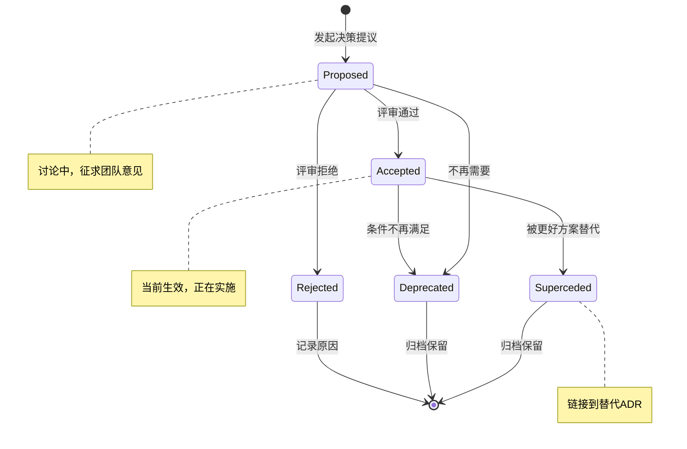
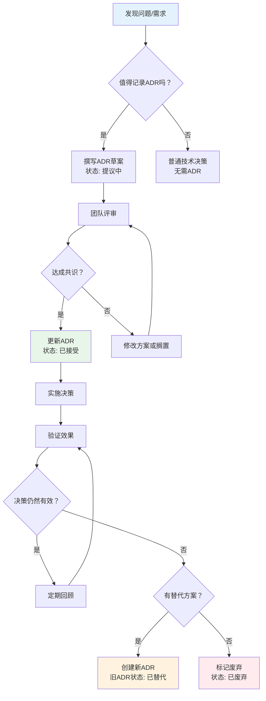

# 架构决策记录（ADR）：记录、追踪和沟通重要技术决策

> **目标读者**：希望系统化管理架构决策的技术负责人、架构师和资深开发者
>
> **前置知识**：熟悉[[01-分层架构原则]]、了解项目架构设计的基本流程
>
> **相关文章**：
> - [[01-分层架构原则]] - ADR中很多决策涉及架构模式选择
> - [[03-Clean-Architecture项目组织]] - 项目结构中的ADR目录组织
> - [[04-SOLID原则实践]] - 设计原则指导ADR的决策过程

---

## 一、什么是架构决策记录（ADR）？

### 1.1 定义与起源

**架构决策记录（Architecture Decision Record，简称ADR）** 是一种文档格式，用于记录重要的架构决策、决策背景、决策后果以及备选方案。

```
ADR的历史：

2001年  Michael Nygard 首次提出ADR概念
        （《Release It!》作者）

2011年  在"Documenting Architecture Decisions"一文中
        正式定义了ADR格式

2015年至今
        被广泛采用于：
        · AWS、Google、Microsoft等大公司
        · 开源项目（Kubernetes、TensorFlow等）
        · 敏捷团队和DevOps团队

核心理念：
"架构不仅是代码和图，更是决策的集合"
```

### 1.2 为什么需要ADR？

#### 没有ADR的常见问题

```
场景：新成员加入团队

👤 新开发者："为什么我们用PostgreSQL而不是SQL Server？"
👨‍💻 老员工："嗯...好像是当时有个性能测试..."
       "或者是因为成本？不太记得了"
       "你去问问当时的Tech Lead吧"
💀 当时的Tech Lead：已经离职3年了...

结果：
· 决策原因丢失 → 可能做出重复或冲突的决策
· 新人无法理解 → 浪费时间重新调研
· 决策无法审查 → 不知道是否还适用
· 知识孤岛 → 依赖特定个人的记忆
```

#### ADR带来的价值

```
┌─────────────────────────────────────────────────────┐
│                  ADR 的核心价值                        │
├─────────────────────────────────────────────────────┤
│                                                     │
│  📚 知识保留                                        │
│  · 决策不再依赖个人记忆                              │
│  · 人员流动不影响知识传承                             │
│                                                     │
│  🔍 可追溯性                                        │
│  · 知道"为什么"这样决定                               │
│  · 能够评估决策是否仍然有效                           │
│                                                     │
│  🤝 团队协作                                        │
│  · 统一的决策语言                                    │
│  · 减少重复讨论                                      │
│                                                     │
│  📈 持续改进                                        │
│  · 可以回顾和反思过去的决策                           │
│  · 积累组织的架构智慧                                 │
│                                                     │
│  🎯 新成员Onboarding                                 │
│  · 快速理解系统的设计选择                             │
│  · 减少提问和困惑时间                                │
│                                                     │
└─────────────────────────────────────────────────────┘
```

### 1.3 什么时候应该写ADR？

```
✅ 应该记录ADR的场景：

1. 技术选型类
   · 选择ORM框架（EF Core vs Dapper vs NHibernate）
   · 选择数据库（SQL Server vs PostgreSQL vs MongoDB）
   · 选择消息队列（RabbitMQ vs Kafka vs Azure Service Bus）
   · 选择前端框架（React vs Vue vs Blazor）

2. 架构模式类
   · 采用CQRS还是传统CRUD？
   · 使用微服务还是单体架构？
   · 是否引入Event Sourcing？

3. 集成方式类
   · 同步调用vs异步消息？
   · REST API vs GraphQL vs gRPC？
   · 如何处理跨服务事务？

4. 非功能性需求类
   · 认证方案选择（JWT vs Session vs OAuth）
   · 日志方案选择（Serilog vs NLog vs 内置日志）
   · 缓存策略（Redis vs 内存缓存）

5. 约束性决策
   · 为什么不用某项技术？（如：不用MongoDB因为需要强事务）
   · 为什么接受某个限制？（如：接受最终一致性）

❌ 不需要ADR的场景：

· 临时性的调试代码
· 明显的最佳实践（如：使用HTTPS）
· 纯粹的个人偏好且无影响
· 细节级别的实现决策
```

---

## 二、ADR标准模板详解

### 2.1 推荐的ADR模板

```markdown
# [ADR-NNN]: [决策标题]

## 状态
[提议中 | 已接受 | 已废弃 | 已替代]

## 元数据
- **决策日期**: YYYY-MM-DD
- **决策人**: [姓名/角色]
- **参与者**: [参与讨论的人员列表]
- **相关ADR**: [ADR-XXX, ADR-YYY]
- **标签**: [数据库 / 架构模式 / 安全 / 性能 / ...]

## 背景（Context）
[描述导致这个决策的问题或背景。
 回答：我们面临什么问题？为什么现在需要做这个决策？]

## 决策（Decision）
[清晰描述做出的决策是什么。
 回答：我们最终决定怎么做？]

## 理由（Rationale）
[解释为什么做出这个决策。
 回答：为什么选择这个方案而不是其他方案？
 包含：数据支持、评估标准、权衡考虑]

## 后果（Consequences）

### 积极后果
- [好处1]
- [好处2]
- [好处3]

### 消极后果 / 风险
- [风险/代价1]
- [风险/代价2]
- [缓解措施]

## 备选方案（Alternatives Considered）

### 方案A: [名称]
- 描述：[简要说明]
- 优点：[...]
- 缺点：[...]
- 未选择原因：[...]

### 方案B: [名称]
- 描述：[简要说明]
- 优点：[...]
- 缺点：[...]
- 未选择原因：[...]

## 实施细节（Implementation Details）
[如果需要，描述如何实施这个决策]

## 验证方式（Validation）
[如何验证这个决策是正确的？
 例如：性能指标、监控指标、用户反馈等]

## 相关资源
- [链接1]
- [参考文章]
- [内部文档]
```

### 2.2 各字段详细说明

| 字段 | 必填 | 说明 |
|------|------|------|
| **状态** | ✅ | 当前决策的生命周期状态 |
| **决策日期** | ✅ | 做出最终决定的日期 |
| **决策人** | ✅ | 对此决策负责的人 |
| **背景** | ✅ | 最重要！解释"为什么" |
| **决策** | ✅ | 清晰、简洁地说明做了什么决定 |
| **理由** | ✅ | 核心部分，展示思考过程 |
| **后果** | ✅ | 诚实列出正面和负面影响 |
| **备选方案** | ⚠️ 强烈推荐 | 展示考虑过的其他选项 |
| **实施细节** | ❌ 可选 | 复杂决策需要说明实施步骤 |
| **验证方式** | ❌ 可选 | 如何知道决策正确 |

### 2.3 ADR写作技巧

```
好的ADR写作原则：

1. 背景要具体
   ❌ "我们需要一个更好的数据库"
   ✅ "当前SQL Server在高峰期响应时间超过3秒，
      P99延迟达到5秒，影响用户体验"

2. 决策要明确
   ❌ "我们可能用PostgreSQL"
   ✅ "我们选择PostgreSQL 15作为主数据库"

3. 理要有据可依
   ❌ "PostgreSQL更好"
   ✅ "基于我们的基准测试，PostgreSQL在我们的查询模式下
      响应时间比SQL Server快40%，且开源许可证每年节省$50K"

4. 后果要诚实
   只列好处不列坏处 = 没有价值
   列出风险并给出缓解措施 = 专业

5. 保持简洁
   目标长度：1-2页（500-1000字）
   不是论文，是决策备忘录
```

---

## 三、ADR生命周期管理

### 3.1 状态流转

```
ADR生命周期状态流转图：

                    ┌─────────────┐
                    │   提议中     │
                    │ (Proposed)  │
                    └──────┬──────┘
                           │
              ┌────────────┼────────────┐
              ▼            ▼            ▼
     ┌────────────┐ ┌──────────┐ ┌──────────┐
     │   已接受    │ │  已废弃   │ │  已替代   │
     │(Accepted)  │ │(Deprecated)│ │(Superceded)│
     └──────┬─────┘ └──────────┘ └─────┬────┘
            │                          │
            │         ┌────────────────┘
            ▼         ▼
     ┌────────────┐
     │   替代者    │
     │(Replacement│
     │   ADR)     │
     └────────────┘

各状态含义：

📝 提议中（Proposed）
   · 决策正在讨论中
   · 尚未最终确定
   · 征求团队意见

✅ 已接受（Accepted）
   · 决策已正式采纳
   · 正在实施或已实施完成
   · 当前生效的状态

⚠️ 已废弃（Deprecated）
   · 决策不再适用
   · 但没有被新的决策替代
   · 通常因为业务/环境变化

🔄 已替代（Superceded）
   · 有新的ADR替代了这个决策
   · 应该链接到替代的ADR
   · 保留历史记录供参考
```

### 3.2 各状态的转换场景

```markdown
# 状态转换示例

## 场景1：提议中 → 已接受
- 团队评审通过
- 技术负责人批准
- 实施计划已确认

## 场景2：已接受 → 已废弃
- 业务需求变化使原决策不再适用
- 技术栈升级（如.NET Framework → .NET Core）
- 第三方服务停止维护

## 场景3：已接受 → 已替代
- 发现更好的解决方案
- 原方案的局限性显现
- 新ADR应该引用被替代的ADR

示例：
ADR-003（已替代）→ ADR-015（替代者）
"原使用RabbitMQ，现改为Kafka以支持更大的消息吞吐量"
```

### 3.3 ADR编号规范

```
推荐编号规则：

格式：ADR-NNN
- NNN：从001开始的递增数字
- 示例：ADR-001, ADR-002, ..., ADR-015

分类前缀（可选）：
- DB-001：数据库相关
- ARCH-001：架构模式
- SEC-001：安全相关
- INF-001：基础设施

推荐：简单递增 + 标签分类
原因：
· 编号不应该暗示优先级或类别
· 标签足以用于筛选和搜索
· 简单的编号不容易混乱
```

---

## 四、常见ADR实战案例

### 4.1 ADR-001: 选择Entity Framework Core作为ORM

```markdown
# ADR-001: 选择Entity Framework Core作为ORM框架

## 状态
✅ 已接受

## 元数据
- **决策日期**: 2024-01-15
- **决策人**: 张三（技术负责人）
- **参与者**: 李四（后端组长）、王五（DBA）、赵六（架构师）
- **相关ADR**: 无（这是第一个ADR）
- **标签**: 数据访问层、ORM、.NET

## 背景

我们的电商后端系统需要一个对象关系映射（ORM）框架来简化数据访问层的开发。当前团队主要使用ADO.NET手写SQL，存在以下问题：

1. **开发效率低**：每个CRUD操作都需要编写大量重复的SQL和参数映射代码
2. **类型安全性差**：SQL字符串容易出错，编译期无法检测
3. **数据库迁移困难**：Schema变更需要手动同步多个环境的DDL脚本
4. **新人上手慢**：需要熟悉表结构和SQL语法才能进行数据操作

系统特点：
- 主要使用SQL Server数据库
- 数据模型相对稳定但会迭代演进
- 团队有LINQ使用经验
- 对性能有要求但不是极端场景（非高频交易系统）

## 决策

**选择Entity Framework Core 8作为主要的ORM框架。**

对于性能敏感的复杂查询场景，允许使用Dapper作为补充。

## 理由

### 选择EF Core的理由

1. **微软官方支持**
   - 与ASP.NET Core深度集成
   - 持续更新，长期支持（LTS版本支持3年）
   - 文档完善，社区活跃

2. **开发效率**
   - 变更跟踪自动处理脏检查
   - LINQ查询提供编译期类型检查
   - Migration工具链成熟，支持自动化部署

3. **Clean Architecture友好**
   - 支持通过IEntityTypeConfiguration分离配置
   - DbContext可以轻松替换为测试替身
   - 支持多种数据库提供程序

4. **团队技能匹配**
   - 团队成员都有LINQ经验
   - 学习曲线平缓
   - 大量中文教程和社区支持

### 基准测试数据

我们在以下场景进行了对比测试：

| 操作 | EF Core | Dapper | ADO.NET | 手写SQL优化 |
|------|---------|--------|---------|------------|
| 简单CRUD | 95% | 98% | 100% | 100% |
| 复杂关联查询 | 85% | 92% | 100% | 100% |
| 批量插入(1000条) | 75% | 90% | 95% | 100% |
| 开发速度 | 150% | 110% | 80% | 60% |

*注：100% = 手写优化SQL的性能基线*

结论：对于我们的业务场景（非极端性能要求），EF Core的性能完全可接受，而开发效率提升显著。

## 后果

### 积极后果
- ✅ 数据访问层开发效率提升约50%
- ✅ 类型安全减少运行时错误
- ✅ Database First / Code First双模式灵活切换
- ✅ Migration工具统一数据库版本管理
- ✅ 新成员可以在1天内上手数据操作

### 消极后果 / 风险
- ⚠️ EF Core生成的SQL可能不如手写优化（预计10-20%性能差距）
  - *缓解措施*：对热点查询使用Dapper或原始SQL*
- ⚠️ 学习曲线：高级特性（如显式加载、拆分查询）需要培训
  - *缓解措施*：组织内部技术分享，建立最佳实践指南*
- ⚠️ 升级可能引入Breaking Changes
  - *缓解措施*：锁定主版本，充分测试后再升级*

## 备选方案考虑

### 方案A: Dapper
- **描述**：轻量级微ORM，手动编写SQL
- **优点**：
  - 性能接近原生ADO.NET
  - SQL完全可控
  - 学习成本低
- **缺点**：
  - 需要手写大量SQL
  - 没有变更跟踪
  - Migration需要额外工具
- **未选择原因**：开发效率较低，团队更倾向于使用LINQ；但对于性能关键查询仍可使用Dapper补充

### 方案B: NHibernate
- **描述**：成熟的ORM框架，功能强大
- **优点**：
  - 功能非常全面
  - 成熟稳定
  - HQL查询语言强大
- **缺点**：
  - 配置复杂（XML为主）
  - 学习曲线陡峭
  - 社区活跃度下降
  - 与现代.NET集成不够紧密
- **未选择原因**：学习成本过高，与团队技术栈匹配度低

### 方案C: 继续使用纯ADO.NET
- **描述**：保持现状，不引入ORM
- **优点**：
  - 完全控制SQL
  - 最佳性能
  - 无额外依赖
- **缺点**：
  - 开发效率最低
  - 类型不安全
  - 维护成本高
- **未选择原因**：开发效率问题已成为瓶颈，需要提升

## 实施细节

1. **安装配置**
   ```bash
   dotnet add package Microsoft.EntityFrameworkCore.SqlServer
   dotnet add package Microsoft.EntityFrameworkCore.Tools
   dotnet add package Microsoft.EntityFrameworkCore.Design
   ```

2. **项目结构**
   ```
   Infrastructure/
   └── Persistence/
       ├── AppDbContext.cs
       ├── Configurations/          # IEntityTypeConfiguration
       ├── Migrations/             # 自动生成迁移
       └── Repositories/           # Repository实现
   ```

3. **编码规范**
   - 所有实体配置使用Fluent API（IEntityTypeConfiguration）
   - 禁止在Domain实体上使用Data Annotations
   - 复杂查询使用FromSqlRaw或Dapper
   - 所有Migration必须经过Code Review

4. **性能监控**
   - 记录所有超过100ms的查询
   - 定期审查EF Core生成的SQL
   - 对P99延迟高的接口进行专项优化

## 验证方式

- [ ] P90查询延迟 < 200ms
- [ ] 开发效率指标：新增实体的平均耗时减少40%
- [ ] 团队满意度调查 > 8/10
- [ ] 6个月后回顾此决策的有效性

## 相关资源

- [EF Core官方文档](https://docs.microsoft.com/en-us/ef/core/)
- [EF Core性能最佳实践](https://docs.microsoft.com/en-us/ef/core/performance/)
- [内部] EF Core编码规范文档
- [内部] 基准测试详细报告
```

### 4.2 ADR-002: 采用MediatR实现CQRS

```markdown
# ADR-002: 采用MediatR实现命令查询职责分离（CQRS）

## 状态
✅ 已接受

## 元数据
- **决策日期**: 2024-02-01
- **决策人**: 李四（架构师）
- **参与者**: 全体后端开发团队
- **相关ADR**: ADR-001（EF Core作为ORM）
- **标签**: 架构模式、CQRS、MediatR

## 背景

随着业务复杂度增加，我们的Service层出现了以下问题：

1. **God Service现象**：OrderService包含30+方法，承担过多职责
2. **读写耦合**：查询和写操作的逻辑混在一起，难以独立优化
3. **横切关注点分散**：日志、验证、事务等逻辑在每个方法中重复
4. **测试困难**：测试一个业务操作需要Mock大量依赖

目标：
- 分离命令（写）和查询（读）的关注点
- 引入Pipeline Behavior实现横切关注点
- 提高代码的可测试性和可维护性

## 决策

**采用MediatR库实现进程内CQRS模式。**

- Command（命令）：改变系统状态的操作，返回Result<T>
- Query（查询）：只读操作，返回数据DTO
- Notification（通知）：领域事件的发布订阅

## 理由

### 为什么选择MediatR

1. **与Clean Architecture完美契合**
   - Controller → MediatR → Handler 的解耦模式
   - Handler可以独立于Controller进行单元测试
   - Pipeline Behavior提供优雅的横切关注点处理

2. **内置Pipeline机制**
   ```csharp
   // 自动执行的管道
   ValidationBehavior → LoggingBehavior → TransactionBehavior → Handler
   ```
   - 验证：自动执行FluentValidation
   - 日志：统一的请求/响应日志
   - 事务：自动的事务管理

3. **社区成熟度高**
   - NuGet下载量超过1亿次
   - 活跃的维护和更新
   - 大量教程和示例

4. **轻量级**
   - 不需要额外的运行时基础设施
   - 进程内通信，无网络开销
   - 与DI容器无缝集成

### 不选择的原因

**为什么不选择完整的CQRS（读写分离+不同存储）？**
- 我们的系统规模不需要那么复杂的架构
- 读写使用同一数据库足够应对当前负载
- MediatR提供了CQRS的核心思想（职责分离），无需过度工程

## 后果

### 积极后果
- ✅ Controller变得极简（~20行/个）
- ✅ 每个Handler职责单一，易于测试
- ✅ 通过Behavior统一处理验证、日志、事务
- ✅ 新增功能只需添加新的Command/Query+Handler
- ✅ 符合开闭原则（OCP）

### 消极后果 / 风险
- ⚠️ 类数量增加（每个操作至少3个文件：Command、Validator、Handler）
  - *缓解措施*：按功能域组织文件夹结构*
- ⚠️ 调试时请求流向不够直观
  - *缓解措施*：Logging Behavior记录完整调用链*
- ⚠️ 团队需要学习MediatR的使用模式
  - *缓解措施*：组织培训，建立代码模板*

## 实施细节

### 目录结构
```
Application/
├── Commands/
│   └── Orders/
│       ├── CreateOrder/
│       │   ├── CreateOrderCommand.cs
│       │   ├── CreateOrderCommandValidator.cs
│       │   └── CreateOrderCommandHandler.cs
│       └── CancelOrder/
│           └── ...
├── Queries/
│   └── Orders/
│       └── GetOrderById/
│           ├── GetOrderByIdQuery.cs
│           └── GetOrderByIdQueryHandler.cs
└── Common/
    └── Behaviors/
        ├── ValidationBehavior.cs
        ├── LoggingBehavior.cs
        └── TransactionBehavior.cs
```

### DI注册
```csharp
public static IServiceCollection AddApplication(this IServiceCollection services)
{
    services.AddMediatR(cfg =>
    {
        cfg.RegisterServicesFromAssembly(Assembly.GetExecutingAssembly());
    });

    services.AddTransient(typeof(IPipelineBehavior<,>), typeof(ValidationBehavior<,>));
    services.AddTransient(typeof(IPipelineBehavior<,>), typeof(LoggingBehavior<,>));

    return services;
}
```

### Controller示例
```csharp
[HttpPost]
public async Task<IActionResult> CreateOrder(CreateOrderRequest request)
{
    var command = _mapper.Map<CreateOrderCommand>(request);
    var result = await _mediator.Send(command);
    return result.Match(/* ... */);
}
```

## 验证方式

- [ ] 平均Handler代码行数 < 80行
- [ ] 单元测试覆盖率 > 80%
- [ ] 新功能的开发周期缩短
- [ ] 3个月后回顾

## 相关资源

- [MediatR GitHub](https://github.com/jbogard/MediatR)
- [MediatR文档](https://meditr.github.io/)
- [Jimmy Bogard: Using MediatR in ASP.NET Core](https://jimmybogard.com/using-mediatr-in-aspnet-core/)
```

### 4.3 ADR-003: 使用Serilog替代内置日志

```markdown
# ADR-003: 使用Serilog作为结构化日志框架

## 状态
✅ 已接受

## 元数据
- **决策日期**: 2024-02-10
- **决策人**: 王五（DevOps工程师）
- **参与者**: 后端团队、运维团队
- **相关ADR**: 无
- **标签**: 日志、监控、基础设施

## 背景

当前系统使用ILogger（Microsoft.Extensions.Logging），面临以下挑战：

1. **日志缺乏结构化**：难以进行高效的日志分析和查询
2. **多环境管理困难**：不同环境需要不同的日志级别和输出目标
3. **日志上下文不足**：缺少请求关联ID、用户信息等关键上下文
4. **日志轮转和归档**：需要手动配置和管理
5. **第三方集成弱**：难以直接对接ELK/Splunk等日志平台

## 决策

**采用Serilog作为主要日志框架，通过Serilog.AspNetCore集成到ASP.NET Core。**

## 理由

### Serilog的优势

1. **真正的结构化日志**
   ```csharp
   Log.Information("订单创建成功 {OrderId} {CustomerId} {@Order}",
       orderId, customerId, order);  // @ 序列化为JSON
   ```

2. **丰富的Sink生态**
   - Console（开发环境彩色输出）
   - File（带滚动、归档）
   - Elasticsearch
   - Seq（本地可视化）
   - CloudWatch / Application Insights

3. **Enricher机制**
   - 自动添加：CorrelationId、UserId、MachineName、Environment
   - 自定义Enricher添加业务上下文

4. **与ASP.NET Core完美集成**
   - 替换默认ILoggerFactory
   - Request Logging中间件
   - 与现有代码兼容（ILogger接口不变）

## 后果

### 积极后果
- ✅ 日志可以直接导入ELK进行可视化分析
- ✅ 结构化字段支持精确过滤和统计
- ✅ 多环境配置通过appsettings.json管理
- ✅ 从零配置到生产就绪只需10分钟

### 消极后果
- ⚠️ 额外的学习成本（Serilog特有概念：Sink、Enricher、Filter）
  - *缓解：提供团队内部的配置模板*
- ⚠️ 依赖第三方库的更新节奏
  - *缓解：锁定版本号，定期评估更新*

## 备选方案

### 方案A: 继续使用ILogger
- 优点：零迁移成本
- 缺点：功能有限，结构化支持弱

### 方案B: NLog
- 优点：成熟稳定，配置灵活
- 缺点：结构化支持不如Serilog原生

## 实施配置

```csharp
// Program.cs
Log.Logger = new LoggerConfiguration()
    .ReadFrom.Configuration(builder.Configuration)
    .Enrich.FromLogContext()
    .Enrich.WithCorrelationId()
    .Enrich.WithEnvironmentName()
    .WriteTo.Console(
        outputTemplate: "[{Timestamp:HH:mm:ss} {Level:u3}] {Message:lj}{NewLine}{Exception}")
    .WriteTo.File(
        path: "logs/log-.txt",
        rollingInterval: RollingInterval.Day,
        retainedFileCountLimit: 30,
        outputTemplate: "{Timestamp:yyyy-MM-dd HH:mm:ss.fff zzz} [{Level:u3}] {Message:lj}{NewLine}{Exception}")
    .CreateLogger();

builder.Host.UseSerilog();
```

## 验证方式

- [ ] 日志查询效率提升（从分钟级降到秒级）
- [ ] 生产问题定位时间缩短50%
- [ ] 日志存储成本可控
```

### 4.4 ADR-004: 选择PostgreSQL而非SQL Server

```markdown
# ADR-004: 新项目选择PostgreSQL作为主数据库

## 状态
✅ 已接受

## 元数据
- **决策日期**: 2024-03-01
- **决策人**: 张三（CTO）、李四（架构师）、王五（DBA）
- **参与者**: 技术委员会全体成员
- **相关ADR**: ADR-001（EF Core ORM选择）
- **标签**: 数据库、基础设施、成本

## 背景

公司启动一个新的SaaS产品线，需要选择数据库技术栈。这是一个全新的项目，没有历史包袱。

决策因素：
1. **成本控制**：SaaS模式的初期成本敏感性高
2. **云原生**：计划部署在AWS/Azure上
3. **开源策略**：公司战略倾向于开源技术栈
4. **团队能力**：团队有MySQL/PostgreSQL经验，但SQL Server经验更深
5. **功能需求**：需要JSON支持、全文搜索、地理空间数据

## 决策

**选择PostgreSQL 15作为新项目的主数据库。**

对于遗留系统继续使用SQL Server。

## 理由

### PostgreSQL的优势

1. **成本优势**
   - 开源免费（商业支持可选）
   - 云服务商托管价格比SQL Server低40-60%
   - 无许可合规复杂性

2. **功能丰富**
   - 原生JSON/JSONB支持（适合灵活的数据模型）
   - 内置全文搜索（无需Elasticsearch）
   - 地理空间数据类型（PostGIS扩展）
   - 数组和复合类型

3. **性能表现**
   - ACID compliant，MVCC并发模型
   - 复杂查询优化器优秀
   - 支持并行查询

4. **生态系统**
   - AWS RDS / Azure Database for PostgreSQL 成熟
   - 丰富的扩展生态（TimescaleDB, Citus, pgvector等）
   - 活跃的社区和持续发展

### 基准测试摘要

| 场景 | PostgreSQL | SQL Server | 差异 |
|------|-----------|------------|------|
| 简单CRUD TPS | 12,000 | 11,500 | +4% |
| 复杂JOIN查询 | 850 | 780 | +9% |
| JSON操作 | 5,200 | 1,800 | +189% |
| 并发写入(100连接) | 9,500 | 9,200 | +3% |
| 年度授权成本 | $0 | $15,000 | -$15K |

## 后果

### 积极后果
- ✅ 显著降低基础设施成本（尤其多租户SaaS场景）
- ✅ JSONB支持灵活的产品配置
- ✅ 未来可扩展为分布式数据库（Citus）
- ✅ 符合公司开源优先战略

### 消极后果 / 风险
- ⚠️ 团队SQL Server经验不能复用，需要培训
  - *缓解：PostgreSQL语法与标准SQL高度相似，1周即可上手*
- ⚠️ 部分SQL Server特有功能不可用（如窗口函数的某些变体）
  - *缓解：提前识别差异，制定迁移指南*
- ⚠️ 运维工具链需要重建
  - *缓解：使用云托管服务(RDS)，减少自建运维*

## 备选方案

### SQL Server
- 优点：团队熟悉、工具链成熟、Azure集成深
- 缺点：成本高、JSON支持较弱、Linux支持相对较新

### MySQL
- 优点：最流行的开源数据库、人才储备充足
- 缺点：JSON性能不如PG、功能略逊、MVCC实现不同

## 实施细节

1. **云服务选择**：AWS RDS for PostgreSQL（Multi-AZ部署）
2. **连接池**：Npgsql连接池，最大连接数=100
3. **备份策略**： automated daily backup + Point-in-Time Recovery
4. **监控**：CloudWatch + pg_stat_statements
5. **迁移计划**：无（全新项目）

## 验证方式

- [ ] P99延迟 < 100ms
- [ ] 可用性 > 99.9%（RDS Multi-AZ保证）
- [ ] 年度数据库成本预算内
- [ ] 团队熟练度评分 > 7/10（6个月评估）
```

### 4.5 ADR-005: 采用JWT无状态认证

```markdown
# ADR-005: 采用JWT（JSON Web Token）实现无状态认证

## 状态
✅ 已接受

## 元数据
- **决策日期**: 2024-03-15
- **决策人**: 李四（安全架构师）
- **参与者**: 安全团队、后端团队、前端团队
- **相关ADR**: 无
- **标签**: 安全、认证、API

## 背景

我们的Web API需要一套认证机制来保护API端点。当前没有统一的认证方案。

需求和约束：
1. **前后端分离**：SPA前端 + RESTful API
2. **多客户端支持**：Web、移动App（iOS/Android）
3. **水平扩展**：API服务需要支持多实例部署
4. **性能要求**：认证不应成为性能瓶颈
5. **安全性**：符合OWASP安全最佳实践

## 决策

**采用JWT（JSON Web Token）作为API认证机制。**

Access Token有效期：15分钟
Refresh Token有效期：7天（HttpOnly Cookie存储）

## 理由

### JWT的优势

1. **无状态性**
   - Token自包含用户信息，服务端无需存储Session
   - 天然支持水平扩展（任意实例都可以验证Token）
   - 减轻服务器内存压力

2. **跨域友好**
   - 通过Header传递，天然支持CORS
   - 移动端和Web端使用相同认证流程
   - 无需Cookie的SameSite等问题

3. **性能优秀**
   - 验证Token只需签名验算（<1ms）
   - 无需数据库查询Session
   - 高并发场景下优势明显

4. **标准化**
   - RFC 7519国际标准
   - 广泛的库支持（所有主流语言）
   - 与OAuth 2.0 / OpenID Connect兼容

## 后果

### 积极后果
- ✅ 天然支持多实例部署和负载均衡
- ✅ 统一的认证流程适用于所有客户端
- ✅ 减少服务端Session存储的开销
- ✅ 易于与第三方身份提供商集成

### 消极后果 / 风险
- ⚠️ Token泄露风险（无法在服务端主动失效）
  - *缓解：短有效期 + Refresh Token轮换机制*
- ⚠️ Token大小较大（通常1-2KB）
  - *缓解：只包含必要Claims，使用紧凑序列化*
- ⚠️ 注销实现复杂
  - *缓解：短期方案：客户端删除Token；长期方案：Token黑名单*

## 备选方案

### Session-Based Authentication
- 优点：服务端可控、易注销、安全性高
- 缺点：有状态、扩展性差、移动端支持复杂

### OAuth 2.0 + OIDC
- 优点：行业标准、支持第三方登录
- 缺点：复杂度高、对于自有系统可能过重
- *注：我们可以结合使用JWT实现OIDC*

## 实施细节

### Token结构
```json
{
  "sub": "user-uuid",
  "email": "user@example.com",
  "roles": ["User", "Admin"],
  "iat": 1709000000,
  "exp": 1709000900,
  "jti": "unique-token-id"
}
```

### 安全措施
- 签名算法：RS256（非对称加密）
- 密钥管理：Azure Key Vault / AWS KMS
- HTTPS强制传输
- Refresh Token：HttpOnly, Secure, SameSite=Strict

### 中间件配置
```csharp
builder.Services.AddAuthentication(JwtBearerDefaults.AuthenticationScheme)
    .AddJwtBearer(options =>
    {
        options.TokenValidationParameters = new TokenValidationParameters
        {
            ValidateIssuer = true,
            ValidIssuer = configuration["Jwt:Issuer"],
            ValidateAudience = true,
            ValidAudience = configuration["Jwt:Audience"],
            ValidateLifetime = true,
            ClockSkew = TimeSpan.Zero,
            IssuerSigningKey = new RsaSecurityKey(/* ... */)
        };
    });
```

## 验证方式

- [ ] OWASP ASVS Level 1认证
- [ ] Penetration Test通过
- [ ] Token验证延迟 < 5ms (P99)
- [ ] 安全审计通过
```

---

## 五、ADR存储与管理

### 5.1 推荐的目录结构

```
project-root/
├── docs/
│   └── architecture/
│       └── decisions/
│           ├── template.md          # ADR模板文件
│           ├── ADR-001.md
│           ├── ADR-002.md
│           ├── ADR-003.md
│           ├── ADR-004.md
│           ├── ADR-005.md
│           ├── ...
│           └── README.md            # ADR索引/概览
│
└── (其他项目文件)

README.md 内容示例：
# 架构决策记录 (ADRs)

本目录包含项目的所有重要架构决策。

## 最新决策

| 编号 | 标题 | 状态 | 日期 |
|------|------|------|------|
| ADR-005 | 采用JWT无状态认证 | ✅ 已接受 | 2024-03-15 |
| ADR-004 | 选择PostgreSQL | ✅ 已接受 | 2024-03-01 |

## 统计

- 总计：XX 个决策
- 已接受：XX 个
- 已废弃：XX 个
- 已替代：XX 个

## 分类索引

### 数据库
- ADR-001: Entity Framework Core
- ADR-004: PostgreSQL

### 架构
- ADR-002: CQRS with MediatR

### 基础设施
- ADR-003: Serilog
- ADR-005: JWT认证
```

### 5.2 ADR管理最佳实践

```
ADR管理的Do's and Don'ts：

DO ✅：
□ 及时记录：决策确定后48小时内完成ADR
□ 保持简洁：1-2页，重点突出
□ 诚实记录：包括负面后果和风险
□ 定期回顾：每季度审查ADR状态
□ 版本控制：ADR也是代码的一部分
□ 团队共享：确保所有人都能访问

DON'T ❌：
✗ 为了写ADR而写ADR（形式主义）
✗ 记录显而易见的决策（如"使用HTTPS"）
✗ 写成学术论文（过于冗长）
✗ 只记录结果不记录过程（缺失推理）
✗ 写完就不更新（状态过期）
✗ 锁定在个人电脑（应该放在仓库中）
```

### 5.3 ADR与代码审查的结合

```
将ADR融入代码审查流程：

PR Checklist 增加：

☐ 如果此PR涉及架构变更：
   - [ ] 是否需要新建或更新ADR？
   - [ ] 变更是否与现有ADR冲突？
   - [ ] 是否引用了相关的ADR？

Code Review Comment 示例：

@author 这个改动看起来修改了我们使用Redis的方式，
根据 ADR-003 我们选择了Serilog作为日志方案，
但这里似乎引入了直接的Redis日志写入？
能否说明一下原因，或者我们需要更新ADR？

Review Bot 自动检查：
- 新增的架构相关代码是否有对应ADR？
- ADR中提到的约束是否在代码中得到体现？
```

---

## 六、团队协作中的ADR实践

### 6.1 新成员Onboarding

```
新成员入职时的ADR引导：

第1周：了解背景
┌─────────────────────────────────────────┐
│ 给新成员的ADR阅读清单：                   │
│                                         │
│ 必读（理解系统现状）：                     │
│ · ADR-001: 为什么用EF Core              │
│ · ADR-004: 为什么用PostgreSQL           │
│ · ADR-005: 认证方案                     │
│                                         │
│ 选读（深入了解）：                         │
│ · ADR-002: CQRS架构                     │
│ · ADR-003: 日志方案                     │
│                                         │
│ 预计阅读时间：2-3小时                    │
└─────────────────────────────────────────┘

第2周：答疑解惑
· 安排与技术负责人的1:1会议
· 重点解答ADR中的疑问
· 讨论ADR中的Trade-off

第3-4周：实践应用
· 在实际工作中应用ADR中的决策
· 发现问题时提出新的ADR建议
```

### 6.2 技术讨论会议

```
在技术讨论中使用ADR：

会议议程模板：

1. 回顾（5分钟）
   · 上次会议Action Item跟进

2. 议题讨论（30分钟）
   · 问题陈述
   · 备选方案
   · 优缺点分析
   · 初步倾向

3. ADR草稿（15分钟）
   · 现场起草ADR
   · 确认决策内容
   · 分配后续行动

4. 行动项（5分钟）
   · 谁负责完善ADR
   · 实施计划
   · 下次会议时间

产出物：
· 会议纪要
· ADR草稿（状态：提议中）
· Action Items
```

### 6.3 定期回顾机制

```
ADR定期回顾流程：

季度ADR Review Meeting：

1. 状态审查
   ┌────────────────────────────────┐
   │ ADR-001 (EF Core)              │
   │   状态: ✅ 有效                 │
   │   最后回顾: 2024-Q1             │
   │   结论: 继续有效               │
   │                                 │
   │ ADR-003 (Serilog)              │
   │   状态: ✅ 有效                 │
   │   最后回顾: 2024-Q1             │
   │   结论: 继续有效               │
   │                                 │
   │ ADR-007 (旧: SignalR实时通信)   │
   │   状态: ⚠️ 需要审视            │
   │   原因: 用户量增长，SignalR扩展 │
   │         性能遇到瓶颈            │
   │   建议: 发起替代方案讨论         │
   └────────────────────────────────┘

2. 新ADR提案
   本季度新增ADR：
   - ADR-015: Kafka替代RabbitMQ
   - ADR-016: 引入GraphQL

3. 经验教训
   - 哪些ADR的效果超出预期？
   - 哪些ADR需要修正？
   - 有什么新模式值得记录？

产出物：
· 更新的ADR状态
· 新ADR提案
· 回顾报告
```

---

## 七、完整示例：电商系统前10个ADR

### 7.1 ADR索引

```markdown
# 电商系统 - 架构决策记录索引

## 项目信息
- **项目名称**: MyCommerce 电商平台
- **技术栈**: .NET 8, ASP.NET Core, PostgreSQL, React
- **起始日期**: 2024-01-01
- **最后更新**: 2024-04-15

## 决策总览

| # | 标题 | 状态 | 日期 | 分类 | 影响 |
|---|------|------|------|------|------|
| 001 | Clean Architecture四层架构 | ✅ 已接受 | 2024-01-05 | 架构 | 高 |
| 002 | Entity Framework Core作为ORM | ✅ 已接受 | 2024-01-15 | 数据访问 | 高 |
| 003 | PostgreSQL作为主数据库 | ✅ 已接受 | 2024-02-01 | 数据库 | 高 |
| 004 | CQRS with MediatR | ✅ 已接受 | 2024-02-10 | 架构 | 高 |
| 005 | Serilog结构化日志 | ✅ 已接受 | 2024-02-15 | 基础设施 | 中 |
| 006 | RabbitMQ消息队列 | ✅ 已接受 | 2024-03-01 | 基础设施 | 高 |
| 007 | JWT无状态认证 | ✅ 已接受 | 2024-03-15 | 安全 | 高 |
| 008 | Redis缓存策略 | ✅ 已接受 | 2024-03-20 | 性能 | 中 |
| 009 | Stripe支付网关 | ✅ 已接受 | 2024-04-01 | 集成 | 高 |
| 010 | Docker容器化部署 | ✅ 已接受 | 2024-04-10 | DevOps | 高 |

## 统计
- 总计: 10
- 已接受: 9
- 已废弃: 0
- 已替代: 1 (见下方)

## 替代关系
- ~~ADR-006: RabbitMQ~~ → 被 **ADR-014: Apache Kafka** 替代 (2024-06-01)
  - 原因: 消息吞吐量需求增长，需要更高的吞吐量和持久化能力
```

### 7.2 ADR-006 到 ADR-010 简要版

由于篇幅原因，这里提供剩余ADR的关键要点：

#### ADR-006: RabbitMQ消息队列（后被Kafka替代）

```
决策：使用RabbitMQ作为异步消息队列
原因：成熟的AMQP实现、管理界面友好、团队有经验
后果：满足初期消息需求；后期因吞吐量限制被Kafka替代
教训：评估时要考虑未来2-3年的增长预期
```

#### ADR-007: JWT无状态认证

```
决策：JWT Access Token (15min) + Refresh Token (7天)
原因：无状态、支持水平扩展、跨客户端统一
风险：Token失效问题 → 通过短有效期+Refresh缓解
```

#### ADR-008: Redis缓存策略

```
决策：Redis Cluster作为分布式缓存
策略：
- 会话数据：不缓存（JWT无状态）
- 热点商品：TTL 5分钟
- 商品详情：TTL 1小时
- 配置数据：TTL 24小时
原因：减少数据库压力、提升响应速度
```

#### ADR-009: Stripe支付集成

```
决策：Stripe作为支付网关
原因：
- 全球支付覆盖
- PCI DSS合规负担小
- 优秀的开发者体验
- 支持Subscription/Billing
备选方案：支付宝/微信支付（中国市场）
实施：抽象IPaymentService，便于未来更换
```

#### ADR-010: Docker容器化部署

```
决策：Docker Compose开发环境 + Kubernetes生产环境
原因：
- 环境一致性
- 简化本地开发搭建
- 支持CI/CD流水线
- 生产级编排能力
结构：
- api-app: ASP.NET Core API
- web-app: React前端
- postgres: PostgreSQL
- redis: Redis
- rabbitmq: RabbitMQ
```

---

## 八、Mermaid架构图

### 8.1 ADR生命周期状态图



### 8.2 ADR决策流程图



### 8.3 ADR分类体系图

```mermind
graph TB
    subgraph Categories["ADR分类体系"]
        direction LR
        
        subgraph Arch["🏗️ 架构决策"]
            A1["Clean Architecture"]
            A2["CQRS模式"]
            A3["微服务vs单体"]
            A4["Event Sourcing"]
        end
        
        subgraph Data["🗄️ 数据决策"]
            D1["数据库选型"]
            D2["ORM选择"]
            D3["缓存策略"]
            D4["数据迁移"]
        end
        
        subgraph Infra["🔧 基础设施"]
            I1["消息队列"]
            I2["日志方案"]
            I3["容器化"]
            I4["CI/CD"]
        end
        
        subgraph Sec["🔒 安全决策"]
            S1["认证方案"]
            S2["授权模型"]
            S3["加密策略"]
            S4["合规要求"]
        end
        
        subgraph Integ["🔗 集成决策"]
            INT1["第三方API"]
            INT2["支付网关"]
            INT3["邮件/短信"]
            INT4["文件存储"]
        end
    end
    
    style Arch fill:#e3f2fd
    style Data fill:#e8f5e9
    style Infra fill:#fff3e0
    style Sec fill:#fce4ec
    style Integ add:#f3e5f5
```

---

## 九、总结与行动指南

### 9.1 ADR核心要点速查

```
╔══════════════════════════════════════════════════════╗
║                ADR 快速入门指南                       ║
╠══════════════════════════════════════════════════════╣
║                                                      ║
║  📝 何时写ADR                                        ║
║     · 技术选型（框架、数据库、中间件）                 ║
║     · 架构模式（CQRS、微服务、Event Sourcing）         ║
║     · 重要取舍（性能vs成本、安全vs便利）               ║
║                                                      ║
║  📋 ADR必备要素                                      ║
║     ✓ 背景（为什么需要做这个决策）                    ║
║     ✓ 决策（最终决定了什么）                          ║
║     ✓ 理由（为什么选择这个方案）                      ║
║     ✓ 后果（正面影响和负面风险）                      ║
║     ✓ 备选方案（考虑过但未选择的选项）                ║
║                                                      ║
║  🔄 ADR生命周期                                       ║
║     提议中 → 已接受 → 已废弃 / 已替代               ║
║                                                      ║
║  💡 写作技巧                                          ║
║     · 1-2页篇幅，简洁明了                            ║
║     · 用数据和事实支撑决策                            ║
║     · 诚实记录负面后果                                ║
║     · 保持客观，避免情绪化表达                        ║
║                                                      ║
║  📂 存储位置                                          ║
║     docs/architecture/decisions/                     ║
║     放入Git仓库，随代码一起版本控制                   ║
║                                                      ║
╚══════════════════════════════════════════════════════╝
```

### 9.2 开始使用ADR的行动清单

```
第一周：准备工作
□ 创建 docs/architecture/decisions/ 目录
□ 准备ADR模板文件
□ 确定编号规则和命名约定
□ 团队分享ADR概念和价值

第二周：回顾历史
□ 梳理项目中已有的重要技术决策
□ 为关键决策补写ADR（即使已经实施了）
□ 识别缺失的决策记录

第三周：融入流程
□ 将ADR纳入Code Review Checklist
□ 在技术讨论会议中试用ADR格式
□ 建立ADR定期回顾机制

第四周及以后：持续改进
□ 每个重要决策都及时记录ADR
□ 季度回顾ADR有效性
□ 根据团队反馈优化ADR模板
```

### 9.3 常见误区与建议

| 误区 | 建议 |
|------|------|
| "ADR太多太麻烦" | 只记录真正重要的决策（预估每季度3-5个） |
| "写了没人看" | 将ADR纳入Onboarding流程和新项目启动清单 |
| "格式太死板" | 根据团队习惯调整模板，核心要素不能少 |
| "只是形式主义" | 在Code Review中强制引用相关ADR，让ADR真正有用 |
| "不知道写什么" | 从下一个技术选型讨论开始，边讨论边记录 |

---

## 参考资源

### 必读资源
1. **[Documenting Architecture Decisions](https://cognitect.com/blog/2011/11/15/documenting-architecture-decisions)** - Michael Nygard的原作
2. **[Madr: Minimal ADR](https://github.com/nickmccurdy/madr)** - 简化的ADR模板
3. **[ADR GitHub Topic](https://github.com/topics/architecture-decision-record)** - 大量真实项目的ADR示例

### 推荐工具
- **ADR Tools for VS Code** - VS Code插件，快速创建ADR
- **Markdown Preview Enhanced** - 更好的Markdown预览
- **任何Git托管平台** - GitHub/GitLab/Bitbucket都适合存放ADR

### 学习案例
- [Kubernetes ADRs](https://github.com/kubernetes/kubernetes/tree/main/keps) - KEP（Kubernetes Enhancement Proposals）
- [TensorFlow ADRs](https://github.com/tensorflow/tensorflow/blob/master/g3doc/rationale/) - TensorFlow设计决策
- [.NET Runtime Design Docs](https://github.com/dotnet/runtime/blob/main/docs/design/) - .NET运行时设计文档

---

> **系列总结**：恭喜你完成了全部5篇Clean Architecture高手篇教程的学习！
>
> **回顾整个系列**：
> - [[01-分层架构原则]] - 理解Clean Architecture的理论基础
> - [[02-领域驱动设计(DDD)基础]] - 掌握领域建模的核心技能
> - [[03-Clean-Architecture项目组织]] - 学会在项目中组织代码结构
> - [[04-SOLID原则实践]] - 编写高质量的面向对象代码
> - **[[05-架构决策记录(ADR)]]** ← 你在这里 - 系统化管理架构决策
>
> **下一步建议**：在实际项目中尝试应用这些知识，从小处着手，逐步建立自己的架构决策体系！

---

**关键词**：ADR、架构决策记录、Architecture Decision Record、技术决策、架构文档、Clean Architecture、团队协作、知识管理、PostgreSQL、Entity Framework Core、MediatR、Serilog、JWT、CQRS、Docker、Kubernetes、DevOps、技术选型
