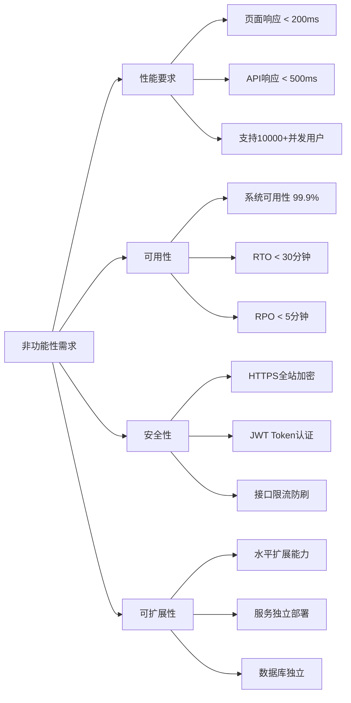
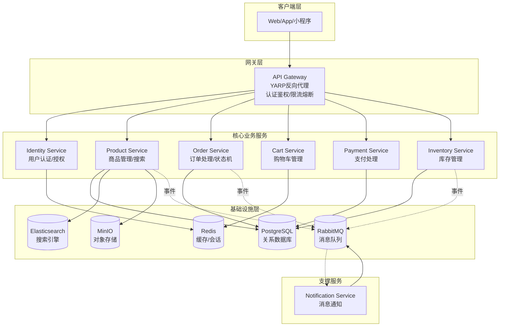
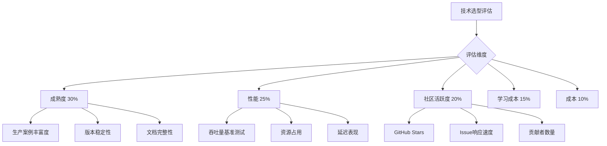
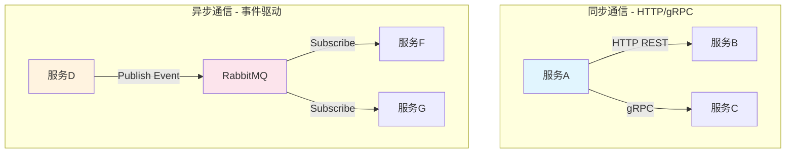
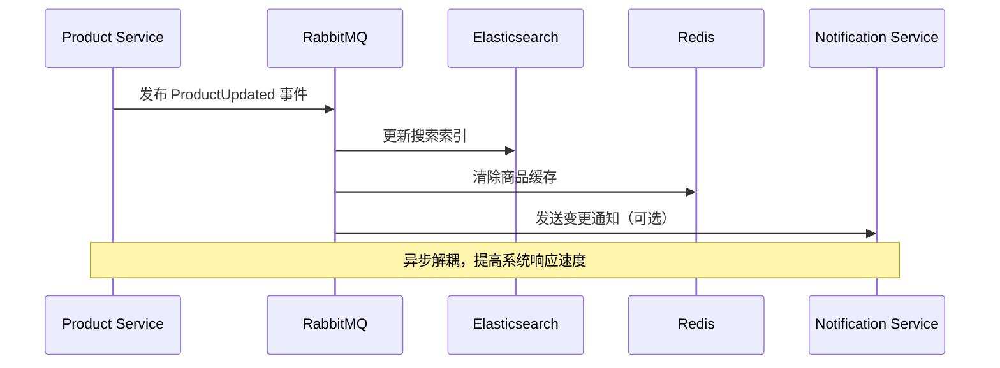
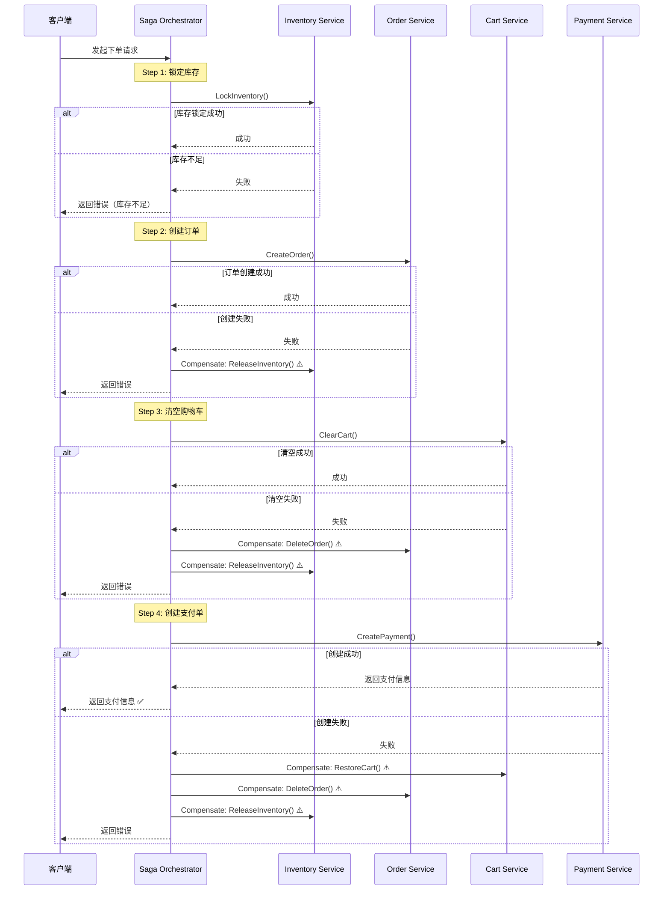
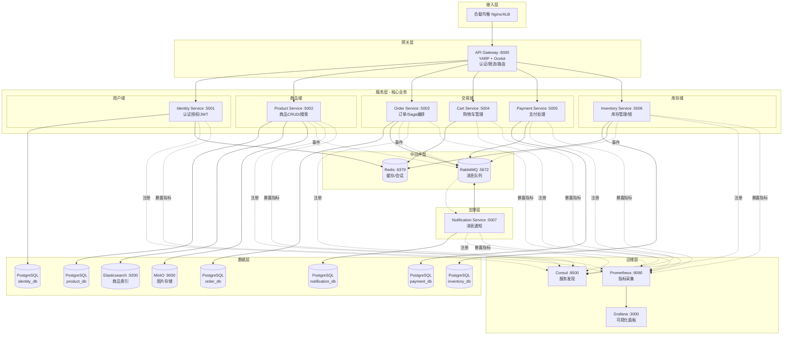
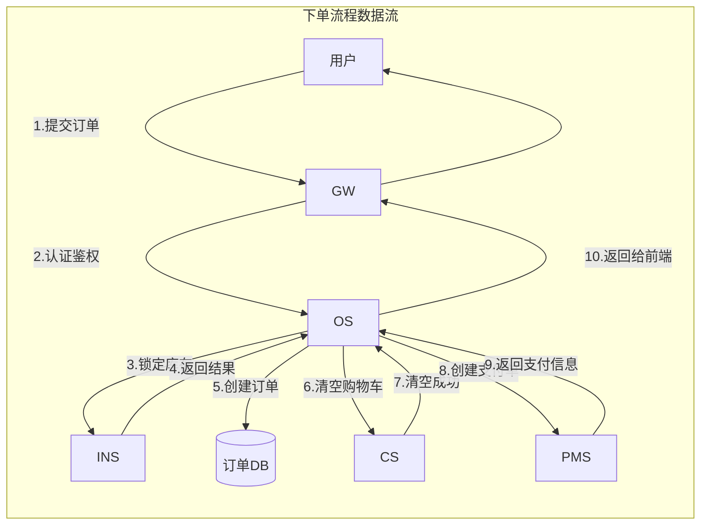
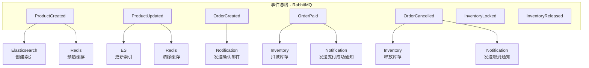
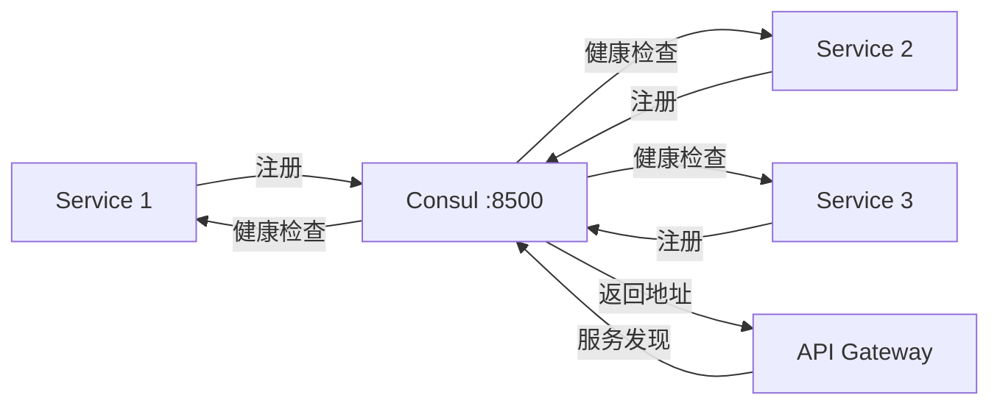

# CloudMall电商系统 - 系统架构与技术选型

> **本篇导读**：本文是CloudMall微服务电商商城实战系列的第一篇，将全面介绍系统需求、微服务拆分方案、技术栈选型、服务间通信策略以及整体架构设计。通过本文，你将掌握如何从零设计一个生产级微服务电商平台的技术蓝图。

## 目录

- [1. 项目背景与需求概述](#1-项目背景与需求概述)
- [2. 微服务拆分方案](#2-微服务拆分方案)
  - [2.1 API Gateway（统一网关）](#21-api-gateway统一网关)
  - [2.2 Identity Service（用户认证服务）](#22-identity-service用户认证服务)
  - [2.3 Product Service（商品服务）](#23-product-service商品服务)
  - [2.4 Order Service（订单服务）](#24-order-service订单服务)
  - [2.5 Cart Service（购物车服务）](#25-cart-service购物车服务)
  - [2.6 Payment Service（支付服务）](#26-payment-service支付服务)
  - [2.7 Inventory Service（库存服务）](#27-inventory-service库存服务)
  - [2.8 Notification Service（通知服务）](#28-notification-service通知服务)
- [3. 技术栈选型详解](#3-技术栈选型详解)
- [4. 服务间通信方案](#4-服务间通信方案)
- [5. 数据管理策略](#5-数据管理策略)
- [6. 整体架构图](#6-整体架构图)
- [7. 基础设施层设计](#7-基础设施层设计)
- [8. 项目目录结构](#8-项目目录结构)
- [9. 技术风险与应对措施](#9-技术风险与应对措施)
- [10. 总结与后续规划](#10-总结与后续规划)

---

## 1. 项目背景与需求概述

### 1.1 CloudMall平台简介

**CloudMall** 是一个面向消费者的B2C电商平台，旨在为用户提供流畅的在线购物体验。平台采用现代化的微服务架构，具备高可用性、可扩展性和可维护性。

### 1.2 核心业务需求

#### 用户端功能
| 功能模块 | 描述 | 优先级 |
|---------|------|--------|
| 用户注册/登录 | 支持手机号、邮箱、第三方OAuth登录 | P0 |
| 商品浏览 | 分类浏览、搜索、商品详情、推荐 | P0 |
| 购物车管理 | 添加/删除/修改数量、选中结算 | P0 |
| 下单支付 | 创建订单、多渠道支付、订单跟踪 | P0 |
| 个人中心 | 订单列表、收货地址、收藏夹 | P1 |
| 售后服务 | 退款、退货、换货申请 | P1 |

#### 管理端功能
| 功能模块 | 描述 | 优先级 |
|---------|------|--------|
| 商品管理 | 商品CRUD、上下架、分类管理 | P0 |
| 订单管理 | 订单查询、发货、售后处理 | P0 |
| 用户管理 | 用户信息查看、权限管理 | P1 |
| 数据统计 | 销售报表、用户分析、库存预警 | P1 |
| 系统配置 | 支付渠道配置、通知模板 | P2 |

### 1.3 非功能性需求



---

## 2. 微服务拆分方案

### 2.1 微服务划分原则

在拆分CloudMall的微服务时，我们遵循以下核心原则：

1. **单一职责原则（SRP）**：每个服务只负责一个业务领域
2. **高内聚低耦合**：服务内部紧密关联，服务间依赖最小化
3. **业务边界清晰**：按照DDD（领域驱动设计）的限界上下文划分
4. **独立部署能力**：每个服务可以独立开发、测试、部署
5. **数据独立性**：每个服务拥有独立的数据库

### 2.2 八大核心服务架构



### 2.3 各服务职责详解

#### 2.3.1 API Gateway（统一网关）

**服务标识**：`cloudmall.apigateway`

**核心职责**：
- 统一入口：所有外部请求的唯一入口点
- 路由转发：基于路径/Header将请求转发到后端服务
- 认证鉴权：JWT Token验证、权限校验
- 限流熔断：防止流量洪峰冲垮后端服务
- 负载均衡：后端服务多实例间的请求分发
- 日志审计：记录所有请求日志用于追踪

**技术选择**：**YARP (Yet Another Reverse Proxy)**
- 微软官方开源的反向代理库
- 与ASP.NET Core深度集成
- 性能优秀，支持HTTP/2和gRPC
- 配置灵活，支持动态路由更新

**端口**：`8000`

#### 2.3.2 Identity Service（用户认证服务）

**服务标识**：`cloudmall.identity`

**核心职责**：
- 用户注册：手机号/邮箱注册，验证码校验
- 身份认证：多种登录方式（密码/OAuth2/验证码）
- Token管理：JWT Access Token + Refresh Token双Token机制
- 权限控制：RBAC角色权限模型
- 第三方登录：微信、GitHub等OAuth2集成
- 安全防护：登录限流、密码强度校验、防暴力破解

**技术选择**：
- **框架**：ASP.NET Core Web API + Identity Server / Duende
- **数据库**：PostgreSQL（用户表、角色表、权限表）
- **缓存**：Redis（Token黑名单、登录状态）
- **消息队列**：RabbitMQ（注册邮件、登录通知）

**端口**：`5001`

#### 2.3.3 Product Service（商品服务）

**服务标识**：`cloudmall.product`

**核心职责**：
- 商品CRUD：商品的增删改查操作
- SKU/SPU管理：规格变体、价格体系
- 分类管理：树形结构的商品分类
- 品牌标签：品牌管理和标签体系
- 图片管理：商品图片上传和展示
- 商品搜索：全文检索、筛选排序
- 推荐算法：热门推荐、相关推荐

**技术选择**：
- **框架**：ASP.NET Core Web API + Clean Architecture
- **数据库**：PostgreSQL（主数据库）
- **搜索引擎**：Elasticsearch（商品索引）
- **对象存储**：MinIO（图片存储）
- **缓存**：Redis（热门商品缓存）

**端口**：`5002`

#### 2.3.4 Order Service（订单服务）

**服务标识**：`cloudmall.order`

**核心职责**：
- 订单创建：下单流程编排（Saga协调者）
- 状态机管理：订单生命周期状态转换
- 订单查询：订单列表、详情、搜索
- 订单取消：超时自动取消、用户主动取消
- 发货签收：物流信息更新
- 售后处理：退货、换货、退款申请
- 审计日志：完整的操作轨迹记录

**技术选择**：
- **框架**：ASP.NET Core Web API + MediatR
- **数据库**：PostgreSQL（订单表、明细表）
- **消息队列**：RabbitMQ（订单事件发布）
- **分布式事务**：Saga模式实现

**端口**：`5003`

#### 2.3.5 Cart Service（购物车服务）

**服务标识**：`cloudmall.cart`

**核心职责**：
- 购物车管理：添加/删除/修改商品数量
- 会话管理：游客购物车 vs 登录用户购物车
- 合并逻辑：登录时将游客购物车合并到用户购物车
- 选中状态：结算时的商品选中管理
- 过期清理：长期未操作的购物车自动清理
- 库存联动：实时校验商品库存

**技术选择**：
- **框架**：ASP.NET Core Web API
- **存储**：Redis Hash（高性能读写）
- **数据库**：PostgreSQL（持久化备份）
- **缓存**：本地内存缓存（分类信息）

**端口**：`5004`

#### 2.3.6 Payment Service（支付服务）

**服务标识**：`cloudmall.payment`

**核心职责**：
- 支付单创建：生成唯一的支付单号
- 多渠道对接：支付宝、微信支付、银联、模拟支付
- 回调处理：异步回调验签、状态更新
- 退款处理：全额退款、部分退款
- 对账功能：日终对账、差异处理
- 安全保障：金额加密、防篡改、HTTPS强制

**技术选择**：
- **框架**：ASP.NET Core Web API
- **数据库**：PostgreSQL（支付记录表）
- **消息队列**：RabbitMQ（支付事件）
- **加密**：RSA/AES混合加密

**端口**：`5005`

#### 2.3.7 Inventory Service（库存服务）

**服务标识**：`cloudmall.inventory`

**核心职责**：
- 库存查询：实时可用库存查询
- 库存锁定：下单时预占库存（防超卖）
- 库存释放：订单取消时释放锁定库存
- 库存扣减：支付成功后正式扣减库存
- 库存补货：入库操作、批量导入
- 预警告警：低于安全库存阈值自动告警
- 并发控制：高并发场景下的库存一致性保证

**技术选择**：
- **框架**：ASP.NET Core Web API
- **数据库**：PostgreSQL（库存表、锁记录表）
- **缓存**：Redis（库存热点数据）
- **并发控制**：乐观锁 + Redis原子操作

**端口**：`5006`

#### 2.3.8 Notification Service（通知服务）

**服务标识**：`cloudmall.notification`

**核心职责**：
- 邮件通知：注册确认、订单状态变更、营销邮件
- 短信通知：验证码、订单提醒、物流通知
- 站内信：系统公告、活动推送
- 模板管理：通知模板的增删改查
- 发送记录：发送历史、送达状态
- 频率限制：防止骚扰用户

**技术选择**：
- **框架**：ASP.NET Core Worker Service（后台服务）
- **消息队列**：RabbitMQ（消费业务事件）
- **邮件服务**：MailKit / SendGrid
- **短信服务**：阿里云SMS / Twilio
- **数据库**：PostgreSQL（发送记录表）

**端口**：`5007`

---

## 3. 技术栈选型详解

### 3.1 技术选型总览

| 技术维度 | 选型方案 | 选择理由 |
|---------|---------|---------|
| **开发框架** | ASP.NET Core 8.0 LTS | 高性能、跨平台、微软官方长期支持 |
| **ORM框架** | Entity Framework Core | 成熟稳定、LINQ支持、迁移工具完善 |
| **关系数据库** | PostgreSQL 16 | 开源免费、功能强大、JSON支持好 |
| **NoSQL缓存** | Redis 7.x | 高性能、丰富的数据结构、持久化支持 |
| **消息队列** | RabbitMQ 3.12 | 成熟稳定、AMQP协议、管理界面友好 |
| **搜索引擎** | Elasticsearch 8.x | 全文检索能力强、分布式、生态丰富 |
| **对象存储** | MinIO | S3兼容、自托管、适合私有化部署 |
| **API网关** | YARP | 微软官方、与.NET深度集成、性能优异 |
| **服务发现** | Consul | 服务注册发现、健康检查、KV存储 |
| **容器化** | Docker + Docker Compose | 标准化部署、环境一致性 |
| **监控** | Prometheus + Grafana | 云原生监控标准、可视化强大 |
| **日志** | Serilog + ELK | 结构化日志、集中收集分析 |

### 3.2 各服务技术栈详情

#### 3.2.1 共享技术基础

所有服务共享以下技术基础：

```csharp
// 共享的NuGet包版本
// Microsoft.AspNetCore.App 8.0.x
// Microsoft.EntityFrameworkCore.Core 8.0.x
// Microsoft.Extensions.Hosting 8.0.x
// Serilog.AspNetCore 8.0.x
// MassTransit.RabbitMQ 8.2.x
// Polly 8.4.x // 弹性库
// FluentValidation 11.9.x // 参数校验
// Mapster 7.4.x // 对象映射
```

#### 3.2.2 服务专属依赖

| 服务 | 特殊依赖 | 用途说明 |
|-----|---------|---------|
| API Gateway | Yarp.ReverseProxy | 反向代理和路由 |
| Identity | Duende.IdentityServer | OAuth2/OpenID Connect |
| Product | Nest.Elasticsearch | ES客户端SDK |
| Order | MassTransit | Saga编排器 |
| Cart | StackExchange.Redis | Redis客户端 |
| Payment | BouncyCastle | 加密解密 |
| Inventory | Dapper | 高性能SQL执行 |
| Notification | MailKit | 邮件发送 |

### 3.3 技术选型决策矩阵

我们使用加权评分法进行技术选型决策：



---

## 4. 服务间通信方案

### 4.1 通信模式选择

CloudMall采用**同步+异步混合**的通信模式：



### 4.2 同步通信规范

#### HTTP REST调用场景

适用于需要**即时返回结果**的场景：

| 调用方 | 被调用方 | 场景 | 协议 |
|-------|---------|------|------|
| Order Service | Inventory Service | 锁定库存 | HTTP POST |
| Order Service | Cart Service | 清空购物车 | HTTP DELETE |
| Cart Service | Product Service | 校验商品存在性 | HTTP GET |
| Order Service | Payment Service | 创建支付单 | HTTP POST |
| API Gateway | Identity Service | Token验证 | HTTP GET |

#### gRPC调用场景

适用于**内部高频、低延迟**的服务间调用：

| 调用方 | 被调用方 | 场景 |
|-------|---------|------|
| Order Service | Inventory Service | 批量库存查询 |
| Product Service | Inventory Service | 商品库存实时获取 |

### 4.3 异步通信规范

#### 事件驱动场景

适用于**最终一致性**要求的场景：



#### CloudMall事件清单

| 事件名称 | 发布者 | 消费者 | 业务含义 |
|---------|-------|-------|---------|
| `ProductCreated` | Product Service | ES, Redis, NS | 新商品上架 |
| `ProductUpdated` | Product Service | ES, Redis | 商品信息更新 |
| `ProductDeleted` | Product Service | ES, Redis | 商品下架删除 |
| `OrderCreated` | Order Service | Inventory, Payment, NS | 新订单产生 |
| `OrderPaid` | Order Service | Inventory, NS | 订单支付完成 |
| `OrderCancelled` | Order Service | Inventory, Cart, NS | 订单取消 |
| `OrderShipped` | Order Service | NS | 订单发货 |
| `InventoryLocked` | Inventory Service | Order, NS | 库存锁定成功 |
| `InventoryReleased` | Inventory Service | Order, NS | 库存释放 |
| `UserRegistered` | Identity Service | NS | 用户注册成功 |
| `UserLoggedIn` | Identity Service | NS | 用户登录通知 |

### 4.4 通信可靠性保障

```csharp
/// <summary>
/// HTTP调用重试策略配置
/// 使用Polly弹性库实现
/// </summary>
public static class HttpRetryPolicy
{
    public static IAsyncPolicy<HttpResponseMessage> GetRetryPolicy()
    {
        // 重试策略：指数退避
        var retryPolicy = Policy<HttpResponseMessage>
            .Handle<HttpRequestException>()
            .OrResult(r => !r.IsSuccessStatusCode)
            .WaitAndRetryAsync(
                retryCount: 3,
                sleepDurationProvider: retryAttempt =>
                    TimeSpan.FromSeconds(Math.Pow(2, retryAttempt)),
                onRetry: (outcome, timespan, retryCount, context) =>
                {
                    Console.WriteLine($"重试 {retryCount} 次，" +
                        $"等待 {timespan.TotalSeconds} 秒");
                });

        // 熔断策略：连续失败5次后熔断30秒
        var circuitBreaker = Policy<HttpResponseMessage>
            .Handle<HttpRequestException>()
            .CircuitBreakerAsync(
                exceptionsAllowedBeforeBreaking: 5,
                durationOfBreak: TimeSpan.FromSeconds(30),
                onBreak: (ex, breakDelay) =>
                {
                    Console.WriteLine($"熔断触发！断路 {breakDelay.TotalSeconds} 秒");
                },
                onReset: () => Console.WriteLine("熔断恢复"));

        // 组合策略：先重试再熔断
        return Policy.WrapAsync(retryPolicy, circuitBreaker);
    }
}
```

---

## 5. 数据管理策略

### 5.1 数据库-per-service原则

每个微服务拥有**独立的数据库实例**，确保数据隔离：

```mermaid
graph TB
    subgraph "Identity Service"
        ID_DB[(identity_db)]
        ID_DB --> ID_Users[users 表]
        ID_DB --> ID_Roles[roles 表]
        ID_DB --> ID_Permissions[permissions 表]
        ID_DB --> ID_UserRoles[user_roles 表]
    end

    subgraph "Product Service"
        PD_DB[(product_db)]
        PD_DB --> PD_Products[products 表]
        PD_DB --> PD_Categories[categories 表]
        PD_DB --> PD_Brands[brands 表]
        PD_DB --> PD_ProductImages[product_images 表]
    end

    subgraph "Order Service"
        OD_DB[(order_db)]
        OD_DB --> OD_Orders[orders 表]
        OD_DB --> OD_OrderItems[order_items 表]
        OD_DB --> OD_OrderAddresses[order_addresses 表]
        OD_DB --> OD_OrderLogs[order_logs 表]
    end

    subgraph "Cart Service"
        CT_REDIS[(Redis<br/>cart:{userId})]
    end

    subgraph "Payment Service"
        PM_DB[(payment_db)]
        PM_DB --> PM_Payments[payments 表]
        PM_DB --> PM_PaymentRecords[payment_records 表]
    end

    subgraph "Inventory Service"
        IV_DB[(inventory_db)]
        IV_DB --> IV_Inventories[inventories 表]
        IV_DB --> IV_InventoryLocks[inventory_locks 表]
        IV_DB --> IV_InventoryLogs[inventory_logs 表]
    end

    subgraph "Notification Service"
        NT_DB[(notification_db)]
        NT_DB --> NT_Notifications[notifications 表]
        NT_DB --> NT_Templates[templates 表]
    end
```

### 5.2 分布式事务策略：Saga模式

由于每个服务拥有独立数据库，跨服务的操作无法使用传统ACID事务。CloudMall采用**Saga模式**实现分布式事务：

#### Saga模式对比

| 特性 | 编排式(Choreography) | 协调式(Orchestration) |
|-----|---------------------|----------------------|
| 复杂度 | 低（无中心协调器） | 中（需要Saga Orchestrator） |
| 耦合度 | 低（服务间松耦合） | 中（依赖协调器） |
| 可观测性 | 差（流程分散在各服务） | 好（集中管理状态） |
| 适用场景 | 流程简单、步骤少 | 流程复杂、步骤多 |
| CloudMall选择 | 辅助使用 | **主要使用** |

#### Saga补偿事务示例



### 5.3 数据一致性级别

| 操作类型 | 一致性级别 | 实现方式 |
|---------|-----------|---------|
| 单服务内写操作 | 强一致 | 本地ACID事务 |
| 跨服务读操作 | 最终一致 | 异步事件同步 |
| 跨服务写操作（关键） | 最终一致 + 补偿 | Saga模式 |
| 缓存读写 | 最终一致 | Cache-Aside模式 |
| 搜索索引 | 最终一致 | 事件驱动同步 |

---

## 6. 整体架构图

### 6.1 系统拓扑全景图



### 6.2 数据流向图



### 6.3 事件流图



---

## 7. 基础设施层设计

### 7.1 容器化方案

#### Docker Compose 编排

CloudMall使用Docker Compose进行开发和测试环境的容器编排：

```yaml
# docker-compose.yml 核心结构概览
version: '3.8'

services:
  # 基础设施服务
  postgresql:
    image: postgres:16-alpine
    # ... 配置

  redis:
    image: redis:7-alpine
    # ... 配置

  rabbitmq:
    image: rabbitmq:3.12-management-alpine
    # ... 配置

  elasticsearch:
    image: docker.elastic.co/elasticsearch/elasticsearch:8.11.0
    # ... 配置

  minio:
    image: minio/minio:latest
    # ... 配置

  # 应用服务
  apigateway:
    build: ./src/ApiGateway
    ports:
      - "8000:80"
    depends_on:
      - identity-service
      # ...

  identity-service:
    build: ./src/Services/Identity
    ports:
      - "5001:80"
    # ...
```

> **完整Docker Compose配置详见第10篇《Docker Compose一键部署》**

### 7.2 服务发现与配置中心

#### Consul服务发现



**Consul配置要点**：
- 每个服务启动时向Consul注册自己的地址和端口
- Consu