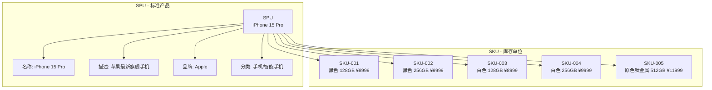
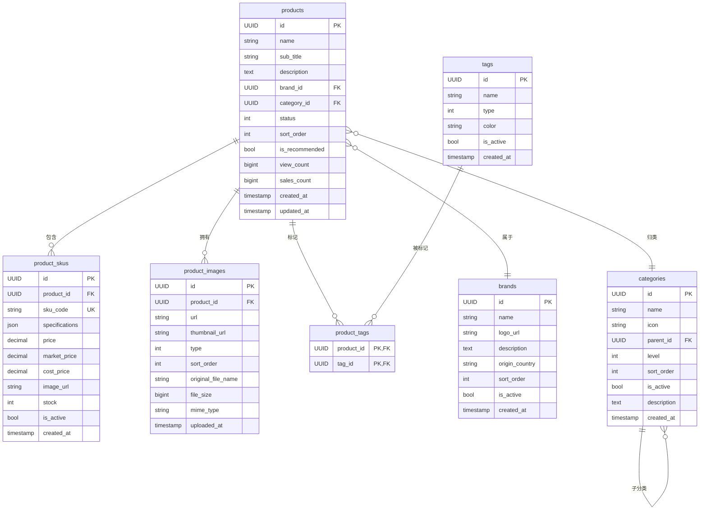
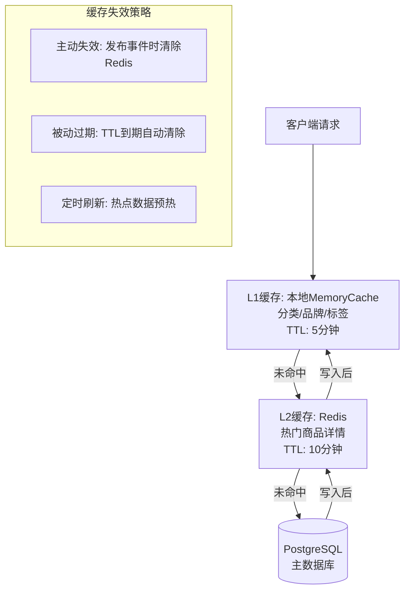

# CloudMall电商系统 - 商品服务(Product Service)

> **本篇导读**：本文深入讲解CloudMall商品服务的完整实现，包括领域模型设计、数据库表结构、核心功能代码、RESTful API设计、缓存策略以及事件发布机制。通过本文，你将掌握如何构建一个功能完善、性能优异的商品管理系统。

## 目录

- [1. 商品领域模型设计](#1-商品领域模型设计)
  - [1.1 Product实体（SKU/SPU概念）](#11-product实体skuspu概念)
  - [1.2 Category分类（树形结构）](#12-category分类树形结构)
  - [1.3 Brand品牌与Tag标签](#13-brand品牌与tag标签)
  - [1.4 ProductImage图片管理](#14-productimage图片管理)
- [2. 数据库设计与EF Core映射](#2-数据库设计与ef-core映射)
- [3. 核心功能实现](#3-核心功能实现)
  - [3.1 商品CRUD操作](#31-商品crud操作)
  - [3.2 图片上传（MinIO集成）](#32-图片上传minio集成)
  - [3.3 商品搜索（Elasticsearch集成）](#33-商品搜索elasticsearch集成)
  - [3.4 分类管理（树形CTE查询）](#34-分类管理树形cte查询)
  - [3.5 商品上下架与库存联动](#35-商品上下架与库存联动)
- [4. RESTful API设计](#4-restful-api设计)
- [5. 缓存策略](#5-缓存策略)
- [6. 事件发布机制](#6-事件发布机制)
- [7. 完整代码实现](#7-完整代码实现)
- [8. 测试要点](#8-测试要点)

---

## 1. 商品领域模型设计

### 1.1 Product实体（SKU/SPU概念）

在电商系统中，商品模型采用**SPU（Standard Product Unit，标准产品单位）+ SKU（Stock Keeping Unit，库存量单位）**的设计模式：



#### 领域模型定义

```csharp
using System;
using System.Collections.Generic;

namespace CloudMall.Product.Domain.Entities
{
    /// <summary>
    /// SPU - 标准产品单位
    /// 代表一个抽象的商品概念，不包含具体规格和价格
    /// </summary>
    public class Product
    {
        public Guid Id { get; set; }

        /// <summary>
        /// 商品名称
        /// </summary>
        public string Name { get; set; }

        /// <summary>
        /// 商品副标题/卖点描述
        /// </summary>
        public string SubTitle { get; set; }

        /// <summary>
        /// 商品详细描述（富文本HTML）
        /// </summary>
        public string Description { get; set; }

        /// <summary>
        /// 品牌ID
        /// </summary>
        public Guid BrandId { get; set; }

        /// <summary>
        /// 分类ID（叶子分类）
        /// </summary>
        public Guid CategoryId { get; set; }

        /// <summary>
        /// 商品状态：0-下架 1-上架 2-待审核
        /// </summary>
        public ProductStatus Status { get; set; } = ProductStatus.Draft;

        /// <summary>
        /// 排序权重（值越大越靠前）
        /// </summary>
        public int SortOrder { get; set; } = 0;

        /// <summary>
        /// 是否为推荐商品
        /// </summary>
        public bool IsRecommended { get; set; } = false;

        /// <summary>
        /// 浏览次数
        /// </summary>
        public long ViewCount { get; set; } = 0;

        /// <summary>
        /// 销售数量
        /// </summary>
        public long SalesCount { get; set; } = 0;

        /// <summary>
        /// 创建时间
        /// </summary>
        public DateTime CreatedAt { get; set; } = DateTime.UtcNow;

        /// <summary>
        /// 更新时间
        /// </summary>
        public DateTime UpdatedAt { get; set; } = DateTime.UtcNow;

        // 导航属性
        public Brand Brand { get; set; }
        public Category Category { get; set; }
        public ICollection<ProductSku> Skus { get; set; } = new List<ProductSku>();
        public ICollection<ProductImage> Images { get; set; } = new List<ProductImage>();
        public ICollection<ProductTag> Tags { get; set; } = new List<ProductTag>();
    }

    /// <summary>
    /// SKU - 库存量单位
    /// 代表具体可售卖的商品实例，包含价格、规格、库存等信息
    /// </summary>
    public class ProductSku
    {
        public Guid Id { get; set; }

        /// <summary>
        /// 所属SPU ID
        /// </summary>
        public Guid ProductId { get; set; }

        /// <summary>
        /// SKU编码（唯一）
        /// </summary>
        public string SkuCode { get; set; }

        /// <summary>
        /// 规格属性JSON
        /// 例如: {"颜色":"黑色","存储":"128GB"}
        /// </summary>
        public string Specifications { get; set; }

        /// <summary>
        /// 销售价格
        /// </summary>
        public decimal Price { get; set; }

        /// <summary>
        /// 市场价（划线价）
        /// </summary>
        public decimal MarketPrice { get; set; }

        /// <summary>
        /// 成本价（内部使用）
        /// </summary>
        public decimal CostPrice { get; set; }

        /// <summary>
        /// SKU图片URL
        /// </summary>
        public string ImageUrl { get; set; }

        /// <summary>
        /// 库存数量（冗余字段，以Inventory Service为准）
        /// </summary>
        public int Stock { get; set; }

        /// <summary>
        /// SKU状态：0-禁用 1-启用
        /// </summary>
        public bool IsActive { get; set; } = true;

        /// <summary>
        /// 创建时间
        /// </summary>
        public DateTime CreatedAt { get; set; } = DateTime.UtcNow;

        // 导航属性
        public Product Product { get; set; }
    }

    /// <summary>
    /// 商品状态枚举
    /// </summary>
    public enum ProductStatus
    {
        Draft = 0,      // 草稿
        OnSale = 1,     // 上架
        OffSale = 2,    // 下架
        Auditing = 3    // 待审核
    }
}
```

### 1.2 Category分类（树形结构）

商品分类采用**邻接表模式**实现多级树形结构：

```csharp
namespace CloudMall.Product.Domain.Entities
{
    /// <summary>
    /// 商品分类 - 支持无限层级树形结构
    /// 使用邻接表（Adjacency List）模式
    /// </summary>
    public class Category
    {
        public Guid Id { get; set; }

        /// <summary>
        /// 分类名称
        /// </summary>
        public string Name { get; set; }

        /// <summary>
        /// 分类图标
        /// </summary>
        public string Icon { get; set; }

        /// <summary>
        /// 父级分类ID（顶级分类为null）
        /// </summary>
        public Guid? ParentId { get; set; }

        /// <summary>
        /// 层级深度（从0开始）
        /// </summary>
        public int Level { get; set; } = 0;

        /// <summary>
        /// 排序序号
        /// </summary>
        public int SortOrder { get; set; } = 0;

        /// <summary>
        /// 分类状态：0-禁用 1-启用
        /// </summary>
        public bool IsActive { get; set; } = true;

        /// <summary>
        /// 分类描述
        /// </summary>
        public string Description { get; set; }

        /// <summary>
        /// 创建时间
        /// </summary>
        public DateTime CreatedAt { get; set; } = DateTime.UtcNow;

        // 导航属性
        public Category Parent { get; set; }
        public ICollection<Category> Children { get; set; } = new List<Category>();
        public ICollection<Product> Products { get; set; } = new List<Product>();
    }
}
```

#### 分类树形结构示例

```
├── 电子产品 (Level 0)
│   ├── 手机 (Level 1)
│   │   ├── 智能手机 (Level 2)
│   │   │   ├── iPhone系列
│   │   │   ├── 华为手机
│   │   │   └── 小米手机
│   │   └── 功能手机
│   ├── 电脑 (Level 1)
│   │   ├── 笔记本电脑
│   │   └── 台式机
│   └── 平板电脑
├── 服装鞋帽
│   ├── 男装
│   ├── 女装
│   └── 童装
└── 食品饮料
```

### 1.3 Brand品牌与Tag标签

```csharp
namespace CloudMall.Product.Domain.Entities
{
    /// <summary>
    /// 品牌信息
    /// </summary>
    public class Brand
    {
        public Guid Id { get; set; }
        public string Name { get; set; }
        public string LogoUrl { get; set; }
        public string Description { get; set; }
        public string OriginCountry { get; set; }  // 原产地
        public int SortOrder { get; set; } = 0;
        public bool IsActive { get; set; } = true;
        public DateTime CreatedAt { get; set; } = DateTime.UtcNow;

        public ICollection<Product> Products { get; set; } = new List<Product>();
    }

    /// <summary>
    /// 商品标签
    /// </summary>
    public class Tag
    {
        public Guid Id { get; set; }
        public string Name { get; set; }           // 标签名称
        public TagType Type { get; set; }          // 标签类型
        public string Color { get; set; }          // 显示颜色
        public bool IsActive { get; set; } = true;
        public DateTime CreatedAt { get; set; } = DateTime.UtcNow;

        public ICollection<ProductTag> ProductTags { get; set; } = new List<ProductTag>();
    }

    /// <summary>
    /// 商品标签关联表（多对多中间表）
    /// </summary>
    public class ProductTag
    {
        public Guid ProductId { get; set; }
        public Guid TagId { get; set; }

        public Product Product { get; set; }
        public Tag Tag { get; set; }
    }

    /// <summary>
    /// 标签类型枚举
    /// </summary>
    public enum TagType
    {
        Normal = 0,      // 普通标签
        Hot = 1,         // 热门标签
        New = 2,         // 新品标签
        Recommend = 3,   // 推荐标签
        Discount = 4     // 折扣标签
    }
}
```

### 1.4 ProductImage图片管理

```csharp
namespace CloudMall.Product.Domain.Entities
{
    /// <summary>
    /// 商品图片
    /// 支持主图、详情图、规格图等多种类型
    /// </summary>
    public class ProductImage
    {
        public Guid Id { get; set; }

        /// <summary>
        /// 所属商品ID
        /// </summary>
        public Guid ProductId { get; set; }

        /// <summary>
        /// 图片URL（MinIO/OSS路径）
        /// </summary>
        public string Url { get; set; }

        /// <summary>
        /// 缩略图URL
        /// </summary>
        public string ThumbnailUrl { get; set; }

        /// <summary>
        /// 图片类型：0-主图 1-详情图 2-规格图
        /// </summary>
        public ImageType Type { get; set; } = ImageType.Main;

        /// <summary>
        /// 排序序号
        /// </summary>
        public int SortOrder { get; set; } = 0;

        /// <summary>
        /// 原始文件名
        /// </summary>
        public string OriginalFileName { get; set; }

        /// <summary>
        /// 文件大小（字节）
        /// </summary>
        public long FileSize { get; set; }

        /// <summary>
        /// MIME类型
        /// </summary>
        public string MimeType { get; set; }

        /// <summary>
        /// 上传时间
        /// </summary>
        public DateTime UploadedAt { get; set; } = DateTime.UtcNow;

        public Product Product { get; set; }
    }

    /// <summary>
    /// 图片类型枚举
    /// </summary>
    public enum ImageType
    {
        Main = 0,       // 主图（列表展示用）
        Detail = 1,     // 详情图（详情页展示）
        Gallery = 2,    // 图廊图
        Specification = 3 // 规格图（对应SKU）
    }
}
```

---

## 2. 数据库设计与EF Core映射

### 2.1 ER关系图



### 2.2 EF Core DbContext配置

```csharp
using Microsoft.EntityFrameworkCore;
using CloudMall.Product.Domain.Entities;

namespace CloudMall.Product.Infrastructure.Data
{
    /// <summary>
    /// 商品服务数据库上下文
    /// 每个微服务独立数据库，遵循Database-per-Service原则
    /// </summary>
    public class ProductDbContext : DbContext
    {
        public ProductDbContext(DbContextOptions<ProductDbContext> options)
            : base(options)
        {
        }

        // DbSets
        public DbSet<Product> Products { get; set; }
        public DbSet<ProductSku> ProductSkus { get; set; }
        public DbSet<Category> Categories { get; set; }
        public DbSet<Brand> Brands { get; set; }
        public DbSet<Tag> Tags { get; set; }
        public DbSet<ProductImage> ProductImages { get; set; }
        public DbSet<ProductTag> ProductTags { get; set; }

        protected override void OnModelCreating(ModelBuilder modelBuilder)
        {
            base.OnModelCreating(modelBuilder);

            // 配置Product实体
            ConfigureProduct(modelBuilder);
            // 配置ProductSku实体
            ConfigureProductSku(modelBuilder);
            // 配置Category实体
            ConfigureCategory(modelBuilder);
            // 配置Brand实体
            ConfigureBrand(modelBuilder);
            // 配置Tag实体
            ConfigureTag(modelBuilder);
            // 配置ProductImage实体
            ConfigureProductImage(modelBuilder);
            // 配置ProductTag多对多关系
            ConfigureProductTag(modelBuilder);

            // 全局查询过滤器：只查询未软删除的数据
            // 可根据需要启用软删除功能
        }

        private static void ConfigureProduct(ModelBuilder modelBuilder)
        {
            modelBuilder.Entity<Product>(entity =>
            {
                entity.ToTable("products");

                entity.HasKey(e => e.Id);

                entity.Property(e => e.Name)
                    .IsRequired()
                    .HasMaxLength(200);

                entity.Property(e => e.SubTitle)
                    .HasMaxLength(500);

                entity.Property(e => e.Description)
                    .HasColumnType("text");

                entity.Property(e => e.Status)
                    .HasConversion<int>();

                entity.HasOne(e => e.Brand)
                    .WithMany(b => b.Products)
                    .HasForeignKey(e => e.BrandId)
                    .OnDelete(DeleteBehavior.Restrict);

                entity.HasOne(e => e.Category)
                    .WithMany(c => c.Products)
                    .HasForeignKey(e => e.CategoryId)
                    .OnDelete(DeleteBehavior.Restrict);

                // 复合索引：按状态+排序+创建时间查询
                entity.HasIndex(e => new { e.Status, e.SortOrder, e.CreatedAt })
                    .HasName("idx_product_status_sort");

                // 名称索引（用于搜索）
                entity.HasIndex(e => e.Name)
                    .HasMethod("gin")  // PostgreSQL全文检索
                    .HasName("idx_product_name_search");
            });
        }

        private static void ConfigureProductSku(ModelBuilder modelBuilder)
        {
            modelBuilder.Entity<ProductSku>(entity =>
            {
                entity.ToTable("product_skus");

                entity.HasKey(e => e.Id);

                entity.Property(e => e.SkuCode)
                    .IsRequired()
                    .HasMaxLength(50);

                // SKU编码唯一索引
                entity.HasIndex(e => e.SkuCode)
                    .IsUnique()
                    .HasName("uk_sku_code");

                entity.Property(e => e.Specifications)
                    .HasColumnType("jsonb");  // PostgreSQL JSON支持

                entity.Property(e => e.Price)
                    .HasPrecision(18, 2);

                entity.Property(e => e.MarketPrice)
                    .HasPrecision(18, 2);

                entity.HasOne(e => e.Product)
                    .WithMany(p => p.Skus)
                    .HasForeignKey(e => e.ProductId)
                    .OnDelete(DeleteBehavior.Cascade);
            });
        }

        private static void ConfigureCategory(ModelBuilder modelBuilder)
        {
            modelBuilder.Entity<Category>(entity =>
            {
                entity.ToTable("categories");

                entity.HasKey(e => e.Id);

                entity.Property(e => e.Name)
                    .IsRequired()
                    .HasMaxLength(100);

                // 自引用外键：父子分类关系
                entity.HasOne(e => e.Parent)
                    .WithMany(c => c.Children)
                    .HasForeignKey(e => e.ParentId)
                    .OnDelete(DeleteBehavior.Restrict);

                // 索引：快速查找子分类
                entity.HasIndex(e => e.ParentId)
                    .HasName("idx_category_parent");
            });
        }

        private static void ConfigureBrand(ModelBuilder modelBuilder)
        {
            modelBuilder.Entity<Brand>(entity =>
            {
                entity.ToTable("brands");

                entity.HasKey(e => e.Id);

                entity.Property(e => e.Name)
                    .IsRequired()
                    .HasMaxLength(100);

                // 品牌名称唯一索引
                entity.HasIndex(e => e.Name)
                    .IsUnique()
                    .HasName("uk_brand_name");
            });
        }

        private static void ConfigureTag(ModelBuilder modelBuilder)
        {
            modelBuilder.Entity<Tag>(entity =>
            {
                entity.ToTable("tags");

                entity.HasKey(e => e.Id);

                entity.Property(e => e.Name)
                    .IsRequired()
                    .HasMaxLength(50);

                entity.Property(e => e.Type)
                    .HasConversion<int>();

                entity.HasIndex(e => e.Name)
                    .IsUnique()
                    .HasName("uk_tag_name");
            });
        }

        private static void ConfigureProductImage(ModelBuilder modelBuilder)
        {
            modelBuilder.Entity<ProductImage>(entity =>
            {
                entity.ToTable("product_images");

                entity.HasKey(e => e.Id);

                entity.Property(e => e.Url)
                    .IsRequired()
                    .HasMaxLength(500);

                entity.Property(e => e.Type)
                    .HasConversion<int>();

                entity.HasOne(e => e.Product)
                    .WithMany(p => p.Images)
                    .HasForeignKey(e => e.ProductId)
                    .OnDelete(DeleteBehavior.Cascade);

                // 按类型+排序索引
                entity.HasIndex(e => new { e.ProductId, e.Type, e.SortOrder })
                    .HasName("idx_image_type_sort");
            });
        }

        private static void ConfigureProductTag(ModelBuilder modelBuilder)
        {
            modelBuilder.Entity<ProductTag>(entity =>
            {
                entity.ToTable("product_tags");

                // 复合主键
                entity.HasKey(e => new { e.ProductId, e.TagId });

                entity.HasOne(e => e.Product)
                    .WithMany(p => p.Tags)
                    .HasForeignKey(e => e.ProductId)
                    .OnDelete(DeleteBehavior.Cascade);

                entity.HasOne(e => e.Tag)
                    .WithMany(t => t.ProductTags)
                    .HasForeignKey(e => e.TagId)
                    .OnDelete(DeleteBehavior.Cascade);
            });
        }
    }
}
```

### 2.3 数据库迁移脚本示例

```sql
-- 创建商品相关表的SQL脚本（PostgreSQL）

-- 1. 品牌表
CREATE TABLE brands (
    id UUID PRIMARY KEY DEFAULT gen_random_uuid(),
    name VARCHAR(100) NOT NULL,
    logo_url VARCHAR(500),
    description TEXT,
    origin_country VARCHAR(50),
    sort_order INT DEFAULT 0,
    is_active BOOLEAN DEFAULT TRUE,
    created_at TIMESTAMP WITH TIME ZONE DEFAULT NOW()
);

CREATE UNIQUE INDEX uk_brand_name ON brands(name);

-- 2. 分类表（自引用树形结构）
CREATE TABLE categories (
    id UUID PRIMARY KEY DEFAULT gen_random_uuid(),
    name VARCHAR(100) NOT NULL,
    icon VARCHAR(200),
    parent_id UUID REFERENCES categories(id),
    level INT DEFAULT 0,
    sort_order INT DEFAULT 0,
    is_active BOOLEAN DEFAULT TRUE,
    description TEXT,
    created_at TIMESTAMP WITH TIME ZONE DEFAULT NOW()
);

CREATE INDEX idx_category_parent ON categories(parent_id);

-- 3. 商品SPU表
CREATE TABLE products (
    id UUID PRIMARY KEY DEFAULT gen_random_uuid(),
    name VARCHAR(200) NOT NULL,
    sub_title VARCHAR(500),
    description TEXT,
    brand_id UUID REFERENCES brands(id),
    category_id UUID REFERENCES categories(id),
    status INT DEFAULT 0,
    sort_order INT DEFAULT 0,
    is_recommended BOOLEAN DEFAULT FALSE,
    view_count BIGINT DEFAULT 0,
    sales_count BIGINT DEFAULT 0,
    created_at TIMESTAMP WITH TIME ZONE DEFAULT NOW(),
    updated_at TIMESTAMP WITH TIME ZONE DEFAULT NOW()
);

CREATE INDEX idx_product_status_sort ON products(status, sort_order, created_at DESC);

-- 4. SKU表
CREATE TABLE product_skus (
    id UUID PRIMARY KEY DEFAULT gen_random_uuid(),
    product_id UUID NOT NULL REFERENCES products(id) ON DELETE CASCADE,
    sku_code VARCHAR(50) NOT NULL,
    specifications JSONB,
    price DECIMAL(18,2) NOT NULL,
    market_price DECIMAL(18,2),
    cost_price DECIMAL(18,2),
    image_url VARCHAR(500),
    stock INT DEFAULT 0,
    is_active BOOLEAN DEFAULT TRUE,
    created_at TIMESTAMP WITH TIME ZONE DEFAULT NOW()
);

CREATE UNIQUE INDEX uk_sku_code ON product_skus(sku_code);
CREATE INDEX idx_sku_product ON product_skus(product_id);

-- 5. 标签表
CREATE TABLE tags (
    id UUID PRIMARY KEY DEFAULT gen_random_uuid(),
    name VARCHAR(50) NOT NULL,
    type INT DEFAULT 0,
    color VARCHAR(20),
    is_active BOOLEAN DEFAULT TRUE,
    created_at TIMESTAMP WITH TIME ZONE DEFAULT NOW()
);

CREATE UNIQUE INDEX uk_tag_name ON tags(name);

-- 6. 商品标签关联表
CREATE TABLE product_tags (
    product_id UUID REFERENCES products(id) ON DELETE CASCADE,
    tag_id UUID REFERENCES tags(id) ON DELETE CASCADE,
    PRIMARY KEY (product_id, tag_id)
);

-- 7. 商品图片表
CREATE TABLE product_images (
    id UUID PRIMARY KEY DEFAULT gen_random_uuid(),
    product_id UUID NOT NULL REFERENCES products(id) ON DELETE CASCADE,
    url VARCHAR(500) NOT NULL,
    thumbnail_url VARCHAR(500),
    type INT DEFAULT 0,
    sort_order INT DEFAULT 0,
    original_file_name VARCHAR(200),
    file_size BIGINT,
    mime_type VARCHAR(100),
    uploaded_at TIMESTAMP WITH TIME ZONE DEFAULT NOW()
);

CREATE INDEX idx_image_type_sort ON product_images(product_id, type, sort_order);
```

---

## 3. 核心功能实现

### 3.1 商品CRUD操作

#### 3.1.1 DTO定义

```csharp
using System;
using System.Collections.Generic;
using System.ComponentModel.DataAnnotations;

namespace CloudMall.Service.Product.DTOs
{
    #region 商品DTO

    /// <summary>
    /// 创建商品请求DTO
    /// </summary>
    public class CreateProductRequestDto
    {
        [Required(ErrorMessage = "商品名称不能为空")]
        [MaxLength(200, ErrorMessage = "商品名称最长200字符")]
        public string Name { get; set; }

        [MaxLength(500)]
        public string SubTitle { get; set; }

        public string Description { get; set; }

        [Required(ErrorMessage = "请选择品牌")]
        public Guid BrandId { get; set; }

        [Required(ErrorMessage = "请选择分类")]
        public Guid CategoryId { get; set; }

        public int SortOrder { get; set; } = 0;
        public bool IsRecommended { get; set; } = false;

        /// <summary>
        /// SKU列表
        /// </summary>
        [Required(ErrorMessage = "至少需要一个SKU")]
        [MinLength(1, ErrorMessage = "至少需要一个SKU")]
        public List<CreateSkuRequestDto> Skus { get; set; }

        /// <summary>
        /// 标签ID列表
        /// </summary>
        public List<Guid> TagIds { get; set; } = new();

        /// <summary>
        /// 图片URL列表
        /// </summary>
        public List<string> ImageUrls { get; set; } = new();
    }

    /// <summary>
    /// 更新商品请求DTO
    /// </summary>
    public class UpdateProductRequestDto
    {
        [Required]
        [MaxLength(200)]
        public string Name { get; set; }

        [MaxLength(500)]
        public string SubTitle { get; set; }

        public string Description { get; set; }

        [Required]
        public Guid BrandId { get; set; }

        [Required]
        public Guid CategoryId { get; set; }

        public int SortOrder { get; set; }
        public bool IsRecommended { get; set; }

        public List<UpdateSkuRequestDto> Skus { get; set; }
        public List<Guid> TagIds { get; set; }
        public List<ImageUpdateDto> Images { get; set; }
    }

    /// <summary>
    /// 商品响应DTO
    /// </summary>
    public class ProductResponseDto
    {
        public Guid Id { get; set; }
        public string Name { get; set; }
        public string SubTitle { get; set; }
        public string Description { get; set; }
        public Guid BrandId { get; set; }
        public string BrandName { get; set; }
        public Guid CategoryId { get; set; }
        public string CategoryName { get; set; }
        public int Status { get; set; }
        public string StatusText { get; set; }
        public int SortOrder { get; set; }
        public bool IsRecommended { get; set; }
        public long ViewCount { get; set; }
        public long SalesCount { get; set; }
        public DateTime CreatedAt { get; set; }
        public DateTime UpdatedAt { get; set; }
        public List<SkuResponseDto> Skus { get; set; }
        public List<TagResponseDto> Tags { get; set; }
        public List<ImageResponseDto> Images { get; set; }
    }

    #endregion

    #region SKU DTO

    /// <summary>
    /// 创建SKU请求DTO
    /// </summary>
    public class CreateSkuRequestDto
    {
        [Required(ErrorMessage = "SKU编码不能为空")]
        [MaxLength(50)]
        public string SkuCode { get; set; }

        /// <summary>
        /// 规格属性，例如: {"颜色":"黑色","内存":"128GB"}
        /// </summary>
        public Dictionary<string, string> Specifications { get; set; }

        [Range(0.01, 999999, ErrorMessage = "价格必须在0.01-999999之间")]
        public decimal Price { get; set; }

        public decimal MarketPrice { get; set; }
        public decimal CostPrice { get; set; }
        public string ImageUrl { get; set; }
        public int Stock { get; set; } = 0;
        public bool IsActive { get; set; } = true;
    }

    /// <summary>
    /// 更新SKU请求DTO
    /// </summary>
    public class UpdateSkuRequestDto
    {
        public Guid Id { get; set; }
        public string SkuCode { get; set; }
        public Dictionary<string, string> Specifications { get; set; }
        public decimal Price { get; set; }
        public decimal MarketPrice { get; set; }
        public decimal CostPrice { get; set; }
        public string ImageUrl { get; set; }
        public int Stock { get; set; }
        public bool IsActive { get; set; }
    }

    /// <summary>
    /// SKU响应DTO
    /// </summary>
    public class SkuResponseDto
    {
        public Guid Id { get; set; }
        public string SkuCode { get; set; }
        public Dictionary<string, string> Specifications { get; set; }
        public decimal Price { get; set; }
        public decimal MarketPrice { get; set; }
        public decimal CostPrice { get; set; }
        public string ImageUrl { get; set; }
        public int Stock { get; set; }
        public bool IsActive { get; set; }
        public DateTime CreatedAt { get; set; }
    }

    #endregion

    #region 其他DTO

    /// <summary>
    /// 分页请求基类
    /// </summary>
    public class PagedRequestDto
    {
        public int PageNumber { get; set; } = 1;
        public int PageSize { get; set; } = 20;

        /// <summary>
        /// 最大页面大小限制
        /// </summary>
        public const int MaxPageSize = 100;
    }

    /// <summary>
    /// 商品分页查询请求
    /// </summary>
    public class ProductQueryRequestDto : PagedRequestDto
    {
        public string Keyword { get; set; }          // 搜索关键词
        public Guid? CategoryId { get; set; }        // 分类筛选
        public Guid? BrandId { get; set; }           // 品牌筛选
        public int? Status { get; set; }             // 状态筛选
        public decimal? MinPrice { get; set; }       // 最低价格
        public decimal? MaxPrice { get; set; }       // 最高价格
        public bool? IsRecommended { get; set; }     // 是否推荐
        public string SortBy { get; set; } = "createdAt"; // 排序字段
        public bool SortDescending { get; set; } = true;  // 降序
    }

    /// <summary>
    /// 分页响应基类
    /// </summary>
    public class PagedResponseDto<T>
    {
        public List<T> Items { get; set; }
        public int PageNumber { get; set; }
        public int PageSize { get; set; }
        public int TotalCount { get; set; }
        public int TotalPages { get; set; }
        public bool HasPreviousPage => PageNumber > 1;
        public bool HasNextPage => PageNumber < TotalPages;
    }

    /// <summary>
    /// 标签响应DTO
    /// </summary>
    public class TagResponseDto
    {
        public Guid Id { get; set; }
        public string Name { get; set; }
        public int Type { get; set; }
        public string Color { get; set; }
    }

    /// <summary>
    /// 图片响应DTO
    /// </summary>
    public class ImageResponseDto
    {
        public Guid Id { get; set; }
        public string Url { get; set; }
        public string ThumbnailUrl { get; set; }
        public int Type { get; set; }
        public int SortOrder { get; set; }
    }

    /// <summary>
    /// 图片更新DTO
    /// </summary>
    public class ImageUpdateDto
    {
        public Guid Id { get; set; }
        public string Url { get; set; }
        public int Type { get; set; }
        public int SortOrder { get; set; }
    }

    #endregion
}
```

#### 3.1.2 Repository层实现

```csharp
using System;
using System.Linq;
using System.Threading.Tasks;
using Microsoft.EntityFrameworkCore;
using CloudMall.Product.Domain.Entities;
using CloudMall.Service.Product.DTOs;
using CloudMall.Product.Infrastructure.Data;

namespace CloudMall.Product.Infrastructure.Repositories
{
    /// <summary>
    /// 商品仓储接口
    /// 定义数据访问契约
    /// </summary>
    public interface IProductRepository
    {
        Task<PagedResponseDto<Product>> GetPagedAsync(ProductQueryRequestDto query);
        Task<Product> GetByIdAsync(Guid id);
        Task<Product> GetDetailByIdAsync(Guid id);  // 包含关联数据
        Task<bool> ExistsAsync(Guid id);
        Task AddAsync(Product product);
        Task UpdateAsync(Product product);
        Task DeleteAsync(Guid id);
        Task IncrementViewCountAsync(Guid id);
        Task<List<Product>> GetRecommendedAsync(int count);
        Task<List<Product>> GetByIdsAsync(IEnumerable<Guid> ids);
    }

    /// <summary>
    /// 商品仓储实现
    /// 使用EF Core进行数据持久化操作
    /// </summary>
    public class ProductRepository : IProductRepository
    {
        private readonly ProductDbContext _context;

        public ProductRepository(ProductDbContext context)
        {
            _context = context;
        }

        /// <summary>
        /// 分页查询商品列表
        /// 支持关键词搜索、分类/品牌/价格筛选、排序
        /// </summary>
        public async Task<PagedResponseDto<Product>> GetPagedAsync(
            ProductQueryRequestDto query)
        {
            // 构建基础查询
            IQueryable<Product> queryable = _context.Products
                .Include(p => p.Brand)
                .Include(p => p.Category)
                .AsNoTracking();  // 只读查询，不跟踪实体

            // 关键词搜索（名称模糊匹配）
            if (!string.IsNullOrWhiteSpace(query.Keyword))
            {
                queryable = queryable.Where(p =>
                    p.Name.Contains(query.Keyword) ||
                    (p.SubTitle != null && p.SubTitle.Contains(query.Keyword)));
            }

            // 分类筛选（包含子分类下的商品）
            if (query.CategoryId.HasValue)
            {
                var categoryIds = await GetCategoryAndChildrenIdsAsync(
                    query.CategoryId.Value);
                queryable = queryable.Where(p =>
                    categoryIds.Contains(p.CategoryId));
            }

            // 品牌筛选
            if (query.BrandId.HasValue)
            {
                queryable = queryable.Where(p => p.BrandId == query.BrandId.Value);
            }

            // 状态筛选
            if (query.Status.HasValue)
            {
                queryable = queryable.Where(p => (int)p.Status == query.Status.Value);
            }

            // 价格区间筛选
            if (query.MinPrice.HasValue)
            {
                queryable = queryable.Where(p =>
                    p.Skus.Any(s => s.Price >= query.MinPrice.Value));
            }
            if (query.MaxPrice.HasValue)
            {
                queryable = queryable.Where(p =>
                    p.Skus.Any(s => s.Price <= query.MaxPrice.Value));
            }

            // 推荐筛选
            if (query.IsRecommended.HasValue)
            {
                queryable = queryable.Where(p =>
                    p.IsRecommended == query.IsRecommended.Value);
            }

            // 排序
            queryable = query.SortBy?.ToLower() switch
            {
                "price" => query.SortDescending
                    ? queryable.OrderByDescending(p => p.Skus.Min(s => s.Price))
                    : queryable.OrderBy(p => p.Suks.Min(s => s.Price)),
                "sales" => query.SortDescending
                    ? queryable.OrderByDescending(p => p.SalesCount)
                    : queryable.OrderBy(p => p.SalesCount),
                "viewcount" => query.SortDescending
                    ? queryable.OrderByDescending(p => p.ViewCount)
                    : queryable.OrderBy(p => p.ViewCount),
                "sortorder" => query.SortDescending
                    ? queryable.OrderByDescending(p => p.SortOrder)
                    : queryable.OrderBy(p => p.SortOrder),
                _ => query.SortDescending
                    ? queryable.OrderByDescending(p => p.CreatedAt)
                    : queryable.OrderBy(p => p.CreatedAt)
            };

            // 计算总数
            var totalCount = await queryable.CountAsync();

            // 分页
            var pageSize = Math.Min(query.PageSize, PagedRequestDto.MaxPageSize);
            var items = await queryable
                .Skip((query.PageNumber - 1) * pageSize)
                .Take(pageSize)
                .ToListAsync();

            return new PagedResponseDto<Product>
            {
                Items = items,
                PageNumber = query.PageNumber,
                PageSize = pageSize,
                TotalCount = totalCount,
                TotalPages = (int)Math.Ceiling((double)totalCount / pageSize)
            };
        }

        /// <summary>
        /// 根据ID获取商品（基本信息）
        /// </summary>
        public async Task<Product> GetByIdAsync(Guid id)
        {
            return await _context.Products
                .AsNoTracking()
                .FirstOrDefaultAsync(p => p.Id == id);
        }

        /// <summary>
        /// 根据ID获取商品详情（包含所有关联数据）
        /// </summary>
        public async Task<Product> GetDetailByIdAsync(Guid id)
        {
            return await _context.Products
                .Include(p => p.Brand)
                .Include(p => p.Category)
                .Include(p => p.Skus)
                .Include(p => p.Images)
                .Include(p => p.Tags)
                    .ThenInclude(pt => pt.Tag)
                .FirstOrDefaultAsync(p => p.Id == id);
        }

        /// <summary>
        /// 检查商品是否存在
        /// </summary>
        public async Task<bool> ExistsAsync(Guid id)
        {
            return await _context.Products.AnyAsync(p => p.Id == id);
        }

        /// <summary>
        /// 添加新商品
        /// </summary>
        public async Task AddAsync(Product product)
        {
            await _context.Products.AddAsync(product);
            await _context.SaveChangesAsync();
        }

        /// <summary>
        /// 更新商品
        /// </summary>
        public async Task UpdateAsync(Product product)
        {
            _context.Products.Update(product);
            await _context.SaveChangesAsync();
        }

        /// <summary>
        /// 删除商品（软删除或硬删除）
        /// </summary>
        public async Task DeleteAsync(Guid id)
        {
            var product = await _context.Products.FindAsync(id);
            if (product != null)
            {
                _context.Products.Remove(product);
                await _context.SaveChangesAsync();
            }
        }

        /// <summary>
        /// 增加浏览次数（原子操作）
        /// </summary>
        public async Task IncrementViewCountAsync(Guid id)
        {
            await _context.Database.ExecuteSqlRawAsync(
                "UPDATE products SET view_count = view_count + 1 WHERE id = {0}", id);
        }

        /// <summary>
        /// 获取推荐商品
        /// </summary>
        public async Task<List<Product>> GetRecommendedAsync(int count)
        {
            return await _context.Products
                .Include(p => p.Skus)
                .Where(p => p.IsRecommended && p.Status == ProductStatus.OnSale)
                .OrderByDescending(p => p.SortOrder)
                    .ThenByDescending(p => p.CreatedAt)
                .Take(count)
                .AsNoTracking()
                .ToListAsync();
        }

        /// <summary>
        /// 批量获取商品（用于购物车展示等场景）
        /// </summary>
        public async Task<List<Product>> GetByIdsAsync(IEnumerable<Guid> ids)
        {
            return await _context.Products
                .Include(p => p.Skus)
                .Include(p => p.Images.Where(i => i.Type == ImageType.Main))
                .Where(p => ids.Contains(p.Id))
                .AsNoTracking()
                .ToListAsync();
        }

        /// <summary>
        /// 获取分类及其所有子分类ID
        /// 用于查询某分类下所有商品（包括子分类）
        /// </summary>
        private async Task<List<Guid>> GetCategoryAndChildrenIdsAsync(Guid categoryId)
        {
            // 使用递归CTE查询所有子分类
            var sql = @"
                WITH RECURSIVE category_tree AS (
                    SELECT id FROM categories WHERE id = {0}
                    UNION ALL
                    SELECT c.id FROM categories c
                    INNER JOIN category_tree ct ON c.parent_id = ct.id
                )
                SELECT id FROM category_tree";

            return await _context.Categories
                .FromSqlRaw(sql, categoryId)
                .Select(c => c.Id)
                .ToListAsync();
        }
    }
}
```

#### 3.1.3 Service层实现

```csharp
using System;
using System.Collections.Generic;
using System.Linq;
using System.Text.Json;
using System.Threading.Tasks;
using Microsoft.Extensions.Logging;
using CloudMall.Product.Domain.Entities;
using CloudMall.Service.Product.DTOs;
using CloudMall.Product.Infrastructure.Repositories;
using Mapster;

namespace CloudMall.Service.Product.Services
{
    /// <summary>
    /// 商品服务接口
    /// </summary>
    public interface IProductService
    {
        Task<ProductResponseDto> CreateAsync(CreateProductRequestDto dto);
        Task<ProductResponseDto> UpdateAsync(Guid id, UpdateProductRequestDto dto);
        Task<ProductResponseDto> GetByIdAsync(Guid id);
        Task DeleteAsync(Guid id);
        Task<PagedResponseDto<ProductResponseDto>> GetPagedAsync(
            ProductQueryRequestDto query);
        Task UpdateStatusAsync(Guid id, ProductStatus status);
        Task<List<ProductResponseDto>> GetRecommendedAsync(int count);
        Task<PagedResponseDto<ProductResponseDto>> SearchAsync(
            string keyword, int page = 1, int size = 20);
    }

    /// <summary>
    /// 商品服务实现
    /// 包含完整的业务逻辑处理
    /// </summary>
    public class ProductService : IProductService
    {
        private readonly IProductRepository _repository;
        private readonly IBrandRepository _brandRepository;
        private readonly ICategoryRepository _categoryRepository;
        private readonly ITagRepository _tagRepository;
        private readonly IEventBus _eventBus;  // 事件总线
        private readonly ILogger<ProductService> _logger;

        public ProductService(
            IProductRepository repository,
            IBrandRepository brandRepository,
            ICategoryRepository categoryRepository,
            ITagRepository tagRepository,
            IEventBus eventBus,
            ILogger<ProductService> logger)
        {
            _repository = repository;
            _brandRepository = brandRepository;
            _categoryRepository = categoryRepository;
            _tagRepository = tagRepository;
            _eventBus = eventBus;
            _logger = logger;
        }

        /// <summary>
        /// 创建商品
        /// 业务规则：
        /// 1. 校验品牌和分类是否存在
        /// 2. 校验SKU编码唯一性
        /// 3. 设置默认状态为草稿
        /// 4. 发布商品创建事件
        /// </summary>
        public async Task<ProductResponseDto> CreateAsync(
            CreateProductRequestDto dto)
        {
            _logger.LogInformation("开始创建商品: {Name}", dto.Name);

            // 1. 校验品牌存在
            var brand = await _brandRepository.GetByIdAsync(dto.BrandId);
            if (brand == null)
            {
                throw new BusinessException($"品牌不存在: {dto.BrandId}");
            }

            // 2. 校验分类存在且为叶子节点
            var category = await _categoryRepository.GetByIdAsync(dto.CategoryId);
            if (category == null)
            {
                throw new BusinessException($"分类不存在: {dto.CategoryId}");
            }
            if (await _categoryRepository.HasChildrenAsync(dto.CategoryId))
            {
                throw new BusinessException("只能选择叶子分类");
            }

            // 3. 校验SKU编码唯一性
            foreach (var sku in dto.Skus)
            {
                if (await _repository.SkuCodeExistsAsync(sku.SkuCode))
                {
                    throw new BusinessException(
                        $"SKU编码已存在: {sku.SkuCode}");
                }
            }

            // 4. 构建商品实体
            var product = new Product
            {
                Id = Guid.NewGuid(),
                Name = dto.Name,
                SubTitle = dto.SubTitle,
                Description = dto.Description,
                BrandId = dto.BrandId,
                CategoryId = dto.CategoryId,
                SortOrder = dto.SortOrder,
                IsRecommended = dto.IsRecommended,
                Status = ProductStatus.Draft,  // 默认草稿状态
                CreatedAt = DateTime.UtcNow,
                UpdatedAt = DateTime.UtcNow
            };

            // 5. 添加SKU
            product.Skus = dto.Skus.Select(s => new ProductSku
            {
                Id = Guid.NewGuid(),
                ProductId = product.Id,
                SkuCode = s.SkuCode,
                Specifications = JsonSerializer.Serialize(s.Specifications),
                Price = s.Price,
                MarketPrice = s.MarketPrice,
                CostPrice = s.CostPrice,
                ImageUrl = s.ImageUrl,
                Stock = s.Stock,
                IsActive = s.IsActive,
                CreatedAt = DateTime.UtcNow
            }).ToList();

            // 6. 添加标签关联
            if (dto.TagIds?.Any() == true)
            {
                var validTags = await _tagRepository
                    .GetByIdsAsync(dto.TagIds);
                product.Tags = validTags.Select(t => new ProductTag
                {
                    ProductId = product.Id,
                    TagId = t.Id
                }).ToList();
            }

            // 7. 添加图片
            if (dto.ImageUrls?.Any() == true)
            {
                product.Images = dto.ImageUrls.Select((url, index) =>
                    new ProductImage
                    {
                        Id = Guid.NewGuid(),
                        ProductId = product.Id,
                        Url = url,
                        Type = index == 0 ? ImageType.Main : ImageType.Detail,
                        SortOrder = index,
                        UploadedAt = DateTime.UtcNow
                    }).ToList();
            }

            // 8. 保存到数据库
            await _repository.AddAsync(product);

            _logger.LogInformation("商品创建成功: {ProductId}, 名称: {Name}",
                product.Id, product.Name);

            // 9. 发布商品创建事件（异步，不阻塞响应）
            try
            {
                await _eventBus.PublishAsync(new ProductCreatedEvent
                {
                    ProductId = product.Id,
                    Name = product.Name,
                    CategoryId = product.CategoryId,
                    BrandId = product.BrandId,
                    CreatedAt = product.CreatedAt
                });
            }
            catch (Exception ex)
            {
                _logger.LogWarning(ex, "发布商品创建事件失败，不影响主流程");
            }

            // 10. 返回响应
            return await GetByIdAsync(product.Id);
        }

        /// <summary>
        /// 更新商品
        /// </summary>
        public async Task<ProductResponseDto> UpdateAsync(
            Guid id, UpdateProductRequestDto dto)
        {
            _logger.LogInformation("开始更新商品: {ProductId}", id);

            // 1. 获取现有商品
            var existingProduct = await _repository.GetDetailByIdAsync(id);
            if (existingProduct == null)
            {
                throw new NotFoundException($"商品不存在: {id}");
            }

            // 2. 更新基本信息
            existingProduct.Name = dto.Name;
            existingProduct.SubTitle = dto.SubTitle;
            existingProduct.Description = dto.Description;
            existingProduct.BrandId = dto.BrandId;
            existingProduct.CategoryId = dto.CategoryId;
            existingProduct.SortOrder = dto.SortOrder;
            existingProduct.IsRecommended = dto.IsRecommended;
            existingProduct.UpdatedAt = DateTime.UtcNow;

            // 3. 更新SKU（简化处理：先删后加）
            if (dto.Skus?.Any() == true)
            {
                existingProduct.Skus.Clear();
                foreach (var skuDto in dto.Skus)
                {
                    existingProduct.Skus.Add(new ProductSku
                    {
                        Id = skuDto.Id != Guid.Empty ? skuDto.Id : Guid.NewGuid(),
                        ProductId = id,
                        SkuCode = skuDto.SkuCode,
                        Specifications = JsonSerializer.Serialize(
                            skuDto.Specifications),
                        Price = skuDto.Price,
                        MarketPrice = skuDto.MarketPrice,
                        CostPrice = skuDto.CostPrice,
                        ImageUrl = skuDto.ImageUrl,
                        Stock = skuDto.Stock,
                        IsActive = skuDto.IsActive,
                        CreatedAt = DateTime.UtcNow
                    });
                }
            }

            // 4. 更新标签
            if (dto.TagIds != null)
            {
                existingProduct.Tags.Clear();
                var tags = await _tagRepository.GetByIdsAsync(dto.TagIds);
                existingProduct.Tags = tags.Select(t => new ProductTag
                {
                    ProductId = id,
                    TagId = t.Id
                }).ToList();
            }

            // 5. 更新图片
            if (dto.Images?.Any() == true)
            {
                existingProduct.Images.Clear();
                foreach (var img in dto.Images)
                {
                    existingProduct.Images.Add(new ProductImage
                    {
                        Id = img.Id,
                        ProductId = id,
                        Url = img.Url,
                        Type = img.Type,
                        SortOrder = img.SortOrder,
                        UploadedAt = DateTime.UtcNow
                    });
                }
            }

            // 6. 保存更改
            await _repository.UpdateAsync(existingProduct);

            _logger.LogInformation("商品更新成功: {ProductId}", id);

            // 7. 发布商品更新事件
            try
            {
                await _eventBus.PublishAsync(new ProductUpdatedEvent
                {
                    ProductId = id,
                    Name = existingProduct.Name,
                    UpdatedAt = DateTime.UtcNow
                });
            }
            catch (Exception ex)
            {
                _logger.LogWarning(ex, "发布商品更新事件失败");
            }

            return await GetByIdAsync(id);
        }

        /// <summary>
        /// 获取商品详情
        /// 增加浏览计数
        /// </summary>
        public async Task<ProductResponseDto> GetByIdAsync(Guid id)
        {
            var product = await _repository.GetDetailByIdAsync(id);
            if (product == null)
            {
                throw new NotFoundException($"商品不存在: {id}");
            }

            // 异步增加浏览次数（不阻塞响应）
            _ = Task.Run(() => _repository.IncrementViewCountAsync(id));

            return product.Adapt<ProductResponseDto>();
        }

        /// <summary>
        /// 删除商品
        /// 发布删除事件
        /// </summary>
        public async Task DeleteAsync(Guid id)
        {
            var product = await _repository.GetByIdAsync(id);
            if (product == null)
            {
                throw new NotFoundException($"商品不存在: {id}");
            }

            await _repository.DeleteAsync(id);

            _logger.LogInformation("商品已删除: {ProductId}", id);

            // 发布商品删除事件
            try
            {
                await _eventBus.PublishAsync(new ProductDeletedEvent
                {
                    ProductId = id,
                    DeletedAt = DateTime.UtcNow
                });
            }
            catch (Exception ex)
            {
                _logger.LogWarning(ex, "发布商品删除事件失败");
            }
        }

        /// <summary>
        /// 分页查询商品列表
        /// </summary>
        public async Task<PagedResponseDto<ProductResponseDto>> GetPagedAsync(
            ProductQueryRequestDto query)
        {
            var result = await _repository.GetPagedAsync(query);

            return new PagedResponseDto<ProductResponseDto>
            {
                Items = result.Items.Adapt<List<ProductResponseDto>>(),
                PageNumber = result.PageNumber,
                PageSize = result.PageSize,
                TotalCount = result.TotalCount,
                TotalPages = result.TotalPages
            };
        }

        /// <summary>
        /// 更新商品状态（上架/下架）
        /// </summary>
        public async Task UpdateStatusAsync(Guid id, ProductStatus status)
        {
            var product = await _repository.GetByIdAsync(id);
            if (product == null)
            {
                throw new NotFoundException($"商品不存在: {id}");
            }

            var oldStatus = product.Status;
            product.Status = status;
            product.UpdatedAt = DateTime.UtcNow;

            await _repository.UpdateAsync(product);

            _logger.LogInformation(
                "商品状态变更: {ProductId}, {OldStatus} -> {NewStatus}",
                id, oldStatus, status);

            // 发布状态变更事件
            if (status == ProductStatus.OnSale ||
                status == ProductStatus.OffSale)
            {
                await _eventBus.PublishAsync(new ProductStatusChangedEvent
                {
                    ProductId = id,
                    OldStatus = oldStatus,
                    NewStatus = status,
                    ChangedAt = DateTime.UtcNow
                });
            }
        }

        /// <summary>
        /// 获取推荐商品
        /// </summary>
        public async Task<List<ProductResponseDto>> GetRecommendedAsync(int count)
        {
            var products = await _repository.GetRecommendedAsync(count);
            return products.Adapt<List<ProductResponseDto>>();
        }

        /// <summary>
        /// 商品搜索（委托给Elasticsearch）
        /// </summary>
        public async Task<PagedResponseDto<ProductResponseDto>> SearchAsync(
            string keyword, int page = 1, int size = 20)
        {
            // 如果配置了Elasticsearch，使用ES搜索
            // 否则回退到数据库Like查询
            // 完整实现见3.3节
            throw new NotImplementedException();
        }
    }
}
```

---

## 4. RESTful API设计

### 4.1 API端点总览

| 方法 | 路径 | 描述 | 认证 |
|-----|------|------|------|
| **POST** | `/api/products` | 创建商品 | Admin |
| **GET** | `/api/products` | 分页查询商品列表 | Public |
| **GET** | `/api/products/{id}` | 获取商品详情 | Public |
| **PUT** | `/api/products/{id}` | 更新商品 | Admin |
| **DELETE** | `/api/products/{id}` | 删除商品 | Admin |
| **PATCH** | `/api/products/{id}/status` | 更新商品状态 | Admin |
| **GET** | `/api/products/recommended` | 获取推荐商品 | Public |
| **GET** | `/api/products/search` | 搜索商品 | Public |
| **POST** | `/api/products/{id}/images` | 上传商品图片 | Admin |
| **DELETE** | `/api/products/{id}/images/{imageId}` | 删除商品图片 | Admin |
| **GET** | `/api/categories` | 获取分类树 | Public |
| **POST** | `/api/categories` | 创建分类 | Admin |
| **PUT** | `/api/categories/{id}` | 更新分类 | Admin |
| **DELETE** | `/api/categories/{id}` | 删除分类 | Admin |
| **GET** | `/api/brands` | 获取品牌列表 | Public |
| **POST** | `/api/brands` | 创建品牌 | Admin |
| **PUT** | `/api/brands/{id}` | 更新品牌 | Admin |
| **DELETE** | `/api/brands/{id}` | 删除品牌 | Admin |
| **GET** | `/api/tags` | 获取所有标签 | Public |
| **POST** | `/api/tags` | 创建标签 | Admin |

### 4.2 ProductController完整实现

```csharp
using System;
using System.Collections.Generic;
using System.Threading.Tasks;
using Microsoft.AspNetCore.Authorization;
using Microsoft.AspNetCore.Http;
using Microsoft.AspNetCore.Mvc;
using CloudMall.Service.Product.DTOs;
using CloudMall.Service.Product.Services;
using CloudMall.Product.Domain.Enums;

namespace CloudMall.Service.Product.Controllers
{
    /// <summary>
    /// 商品管理控制器
    /// 提供商品的增删改查API
    /// </summary>
    [ApiController]
    [Route("api/[controller]")]
    [Produces("application/json")]
    public class ProductsController : ControllerBase
    {
        private readonly IProductService _productService;
        private readonly ICategoryService _categoryService;
        private readonly IBrandService _brandService;
        private readonly ITagService _tagService;
        private readonly IFileUploadService _fileUploadService;
        private readonly ILogger<ProductsController> _logger;

        public ProductsController(
            IProductService productService,
            ICategoryService categoryService,
            IBrandService brandService,
            ITagService tagService,
            IFileUploadService fileUploadService,
            ILogger<ProductsController> logger)
        {
            _productService = productService;
            _categoryService = categoryService;
            _brandService = brandService;
            _tagService = tagService;
            _fileUploadService = fileUploadService;
            _logger = logger;
        }

        #region 商品CRUD

        /// <summary>
        /// 创建商品
        /// POST /api/products
        /// </summary>
        [HttpPost]
        [Authorize(Roles = "Admin")]
        [ProducesResponseType(StatusCodes.Status201Created)]
        [ProducesResponseType(StatusCodes.Status400BadRequest)]
        public async Task<ActionResult<ProductResponseDto>> CreateProduct(
            [FromBody] CreateProductRequestDto request)
        {
            if (!ModelState.IsValid)
            {
                return BadRequest(ModelState);
            }

            try
            {
                var result = await _productService.CreateAsync(request);
                return CreatedAtAction(
                    nameof(GetProductById),
                    new { id = result.Id },
                    result);
            }
            catch (BusinessException ex)
            {
                return BadRequest(new { error = ex.Message });
            }
        }

        /// <summary>
        /// 分页查询商品列表
        /// GET /api/products?page=1&size=20&keyword=xxx&categoryId=xxx
        /// </summary>
        [HttpGet]
        [AllowAnonymous]  // 公开接口，无需认证
        [ProducesResponseType(StatusCodes.Status200OK)]
        public async Task<ActionResult<PagedResponseDto<ProductResponseDto>>> GetProducts(
            [FromQuery] ProductQueryRequestDto query)
        {
            var result = await _productService.GetPagedAsync(query);
            return Ok(result);
        }

        /// <summary>
        /// 获取商品详情
        /// GET /api/products/{id}
        /// </summary>
        [HttpGet("{id:guid}")]
        [AllowAnonymous]
        [ProducesResponseType(StatusCodes.Status200OK)]
        [ProducesResponseType(StatusCodes.Status404NotFound)]
        public async Task<ActionResult<ProductResponseDto>> GetProductById(
            Guid id)
        {
            try
            {
                var product = await _productService.GetByIdAsync(id);
                return Ok(product);
            }
            catch (NotFoundException)
            {
                return NotFound(new { error = $"商品不存在: {id}" });
            }
        }

        /// <summary>
        /// 更新商品
        /// PUT /api/products/{id}
        /// </summary>
        [HttpPut("{id:guid}")]
        [Authorize(Roles = "Admin")]
        [ProducesResponseType(StatusCodes.Status200OK)]
        [ProducesResponseType(StatusCodes.Status404NotFound)]
        public async Task<ActionResult<ProductResponseDto>> UpdateProduct(
            Guid id,
            [FromBody] UpdateProductRequestDto request)
        {
            if (!ModelState.IsValid)
            {
                return BadRequest(ModelState);
            }

            try
            {
                var result = await _productService.UpdateAsync(id, request);
                return Ok(result);
            }
            catch (NotFoundException)
            {
                return NotFound(new { error = $"商品不存在: {id}" });
            }
            catch (BusinessException ex)
            {
                return BadRequest(new { error = ex.Message });
            }
        }

        /// <summary>
        /// 删除商品
        /// DELETE /api/products/{id}
        /// </summary>
        [HttpDelete("{id:guid}")]
        [Authorize(Roles = "Admin")]
        [ProducesResponseType(StatusCodes.Status204NoContent)]
        [ProducesResponseType(StatusCodes.Status404NotFound)]
        public async Task<IActionResult> DeleteProduct(Guid id)
        {
            try
            {
                await _productService.DeleteAsync(id);
                return NoContent();
            }
            catch (NotFoundException)
            {
                return NotFound(new { error = $"商品不存在: {id}" });
            }
        }

        /// <summary>
        /// 更新商品状态（上架/下架）
        /// PATCH /api/products/{id}/status?status=1
        /// </summary>
        [HttpPatch("{id:guid}/status")]
        [Authorize(Roles = "Admin")]
        [ProducesResponseType(StatusCodes.Status200OK)]
        [ProducesResponseType(StatusCodes.Status404NotFound)]
        public async Task<IActionResult> UpdateProductStatus(
            Guid id,
            [FromQuery] ProductStatus status)
        {
            try
            {
                await _productService.UpdateStatusAsync(id, status);
                return Ok(new { message = $"状态已更新为: {status}" });
            }
            catch (NotFoundException)
            {
                return NotFound(new { error = $"商品不存在: {id}" });
            }
        }

        #endregion

        #region 推荐与搜索

        /// <summary>
        /// 获取推荐商品
        /// GET /api/products/recommended?count=10
        /// </summary>
        [HttpGet("recommended")]
        [AllowAnonymous]
        [ProducesResponseType(StatusCodes.Status200OK)]
        public async Task<ActionResult<List<ProductResponseDto>>> GetRecommended(
            [FromQuery] int count = 10)
        {
            var products = await _productService.GetRecommendedAsync(count);
            return Ok(products);
        }

        /// <summary>
        /// 搜索商品
        /// GET /api/products/search?keyword=xxx&page=1&size=20
        /// </summary>
        [HttpGet("search")]
        [AllowAnonymous]
        [ProducesResponseType(StatusCodes.Status200OK)]
        public async Task<ActionResult<PagedResponseDto<ProductResponseDto>>> SearchProducts(
            [FromQuery] string keyword,
            [FromQuery] int page = 1,
            [FromQuery] int size = 20)
        {
            if (string.IsNullOrWhiteSpace(keyword))
            {
                return BadRequest(new { error = "搜索关键词不能为空" });
            }

            var result = await _productService.SearchAsync(keyword, page, size);
            return Ok(result);
        }

        #endregion

        #region 图片上传

        /// <summary>
        /// 上传商品图片
        /// POST /api/products/{id}/images
        /// Content-Type: multipart/form-data
        /// </summary>
        [HttpPost("{id:guid}/images")]
        [Authorize(Roles = "Admin")]
        [ProducesResponseType(StatusCodes.Status200OK)]
        [ProducesResponseType(StatusCodes.Status400BadRequest)]
        public async Task<ActionResult<ImageResponseDto>> UploadImage(
            Guid id,
            IFormFile file)
        {
            if (file == null || file.Length == 0)
            {
                return BadRequest(new { error = "请选择要上传的文件" });
            }

            // 校验文件类型
            var allowedTypes = new[] { "image/jpeg", "image/png", "image/gif",
                                        "image/webp" };
            if (!allowedTypes.Contains(file.ContentType.ToLower()))
            {
                return BadRequest(new { error = "仅支持JPG/PNG/GIF/WebP格式" });
            }

            // 校验文件大小（最大5MB）
            if (file.Length > 5 * 1024 * 1024)
            {
                return BadRequest(new { error = "文件大小不能超过5MB" });
            }

            try
            {
                // 上传到MinIO
                var uploadResult = await _fileUploadService.UploadAsync(
                    file,
                    $"products/{id}/{Guid.NewGuid()}{Path.GetExtension(file.FileName)}");

                // 保存图片记录到数据库
                var imageDto = await _productService.AddImageAsync(id,
                    new CreateImageDto
                    {
                        Url = uploadResult.Url,
                        ThumbnailUrl = uploadResult.ThumbnailUrl,
                        OriginalFileName = file.FileName,
                        FileSize = file.Length,
                        MimeType = file.ContentType
                    });

                return Ok(imageDto);
            }
            catch (Exception ex)
            {
                _logger.LogError(ex, "上传图片失败");
                return StatusCode(StatusCodes.Status500InternalServerError,
                    new { error = "图片上传失败，请重试" });
            }
        }

        /// <summary>
        /// 删除商品图片
        /// DELETE /api/products/{id}/images/{imageId}
        /// </summary>
        [HttpDelete("{id:guid}/images/{imageId:guid}")]
        [Authorize(Roles = "Admin")]
        [ProducesResponseType(StatusCodes.Status204NoContent)]
        public async Task<IActionResult> DeleteImage(
            Guid id,
            Guid imageId)
        {
            await _productService.RemoveImageAsync(id, imageId);
            return NoContent();
        }

        #endregion

        #region 分类管理

        /// <summary>
        /// 获取分类树形结构
        /// GET /api/categories
        /// </summary>
        [HttpGet("~/api/categories")]
        [AllowAnonymous]
        public async Task<ActionResult<List<CategoryTreeDto>>> GetCategories()
        {
            var categories = await _categoryService.GetTreeAsync();
            return Ok(categories);
        }

        /// <summary>
        /// 创建分类
        /// POST /api/categories
        /// </summary>
        [HttpPost("~/api/categories")]
        [Authorize(Roles = "Admin")]
        public async Task<ActionResult<CategoryResponseDto>> CreateCategory(
            [FromBody] CreateCategoryRequestDto request)
        {
            var result = await _categoryService.CreateAsync(request);
            return CreatedAtAction(nameof(GetCategories), null, result);
        }

        #endregion

        #region 品牌管理

        /// <summary>
        /// 获取品牌列表
        /// GET /api/brands
        /// </summary>
        [HttpGet("~/api/brands")]
        [AllowAnonymous]
        public async Task<ActionResult<List<BrandResponseDto>>> GetBrands()
        {
            var brands = await _brandService.GetAllAsync();
            return Ok(brands);
        }

        #endregion

        #region 标签管理

        /// <summary>
        /// 获取所有标签
        /// GET /api/tags
        /// </summary>
        [HttpGet("~/api/tags")]
        [AllowAnonymous]
        public async Task<ActionResult<List<TagResponseDto>>> GetTags()
        {
            var tags = await _tagService.GetAllAsync();
            return Ok(tags);
        }

        #endregion
    }
}
```

---

## 5. 缓存策略

### 5.1 多级缓存架构



### 5.2 Redis缓存实现

```csharp
using System;
using System.Text.Json;
using System.Threading.Tasks;
using Microsoft.Extensions.Caching.Distributed;
using Microsoft.Extensions.Logging;

namespace CloudMall.Service.Product.Infrastructure.Caching
{
    /// <summary>
    /// 商品缓存服务
    /// 使用Redis作为分布式缓存
    /// </summary>
    public class ProductCacheService
    {
        private readonly IDistributedCache _cache;
        private readonly ILogger<ProductCacheService> _logger;

        // 缓存Key前缀
        private const string PRODUCT_DETAIL_PREFIX = "product:detail:";
        private const string PRODUCT_LIST_PREFIX = "product:list:";
        private const string CATEGORY_TREE_PREFIX = "category:tree:";
        private const string BRAND_LIST_PREFIX = "brand:list:";

        // 缓存过期时间
        private static readonly TimeSpan ProductDetailTTL =
            TimeSpan.FromMinutes(10);
        private static readonly TimeSpan ProductListTTL =
            TimeSpan.FromMinutes(5);
        private static readonly TimeSpan StaticDataTTL =
            TimeSpan.FromMinutes(30);

        public ProductCacheService(
            IDistributedCache cache,
            ILogger<ProductCacheService> logger)
        {
            _cache = cache;
            _logger = logger;
        }

        /// <summary>
        /// 获取商品详情（带缓存）
        /// </summary>
        public async Task<T> GetOrSetAsync<T>(
            string key,
            Func<Task<T>> factory,
            TimeSpan? ttl = null)
        {
            var cacheKey = key;

            // 1. 尝试从缓存获取
            var cachedData = await _cache.GetStringAsync(cacheKey);
            if (!string.IsNullOrEmpty(cachedData))
            {
                _logger.LogDebug("缓存命中: {Key}", cacheKey);
                return JsonSerializer.Deserialize<T>(cachedData);
            }

            // 2. 缓存未命中，从数据源获取
            _logger.LogDebug("缓存未命中: {Key}", cacheKey);
            var data = await factory();

            // 3. 写入缓存
            if (data != null)
            {
                var serialized = JsonSerializer.Serialize(data);
                await _cache.SetStringAsync(
                    cacheKey,
                    serialized,
                    new DistributedCacheEntryOptions
                    {
                        AbsoluteExpirationRelativeToNow =
                            ttl ?? ProductDetailTTL
                    });
            }

            return data;
        }

        /// <summary>
        /// 清除商品详情缓存
        /// </summary>
        public async Task RemoveProductDetailAsync(Guid productId)
        {
            await _cache.RemoveAsync($"{PRODUCT_DETAIL_PREFIX}{productId}");
            _logger.LogInformation("已清除商品缓存: {ProductId}", productId);
        }

        /// <summary>
        /// 清除商品列表缓存（模糊匹配）
        /// 注意：Redis不支持直接模糊删除，需要维护Key列表
        /// </summary>
        public async Task RemoveProductListCacheAsync(string pattern)
        {
            // 方案1: 维护一个缓存Key集合
            // 方案2: 使用版本号使旧缓存自然失效
            // 这里使用版本号方案
            var versionKey = "product:list:version";
            var currentVersion = await _cache.GetStringAsync(versionKey);
            var newVersion = Guid.NewGuid().ToString();
            await _cache.SetStringAsync(versionKey, newVersion,
                new DistributedCacheEntryOptions
                {
                    AbsoluteExpirationRelativeToNow = TimeSpan.FromHours(1)
                });

            _logger.LogInformation("商品列表缓存版本已更新");
        }

        /// <summary>
        /// 预热热门商品缓存
        /// 在应用启动或定时任务中调用
        /// </summary>
        public async Task WarmUpCacheAsync(
            IEnumerable<Guid> hotProductIds)
        {
            _logger.LogInformation("开始预热热门商品缓存...");

            foreach (var productId in hotProductIds)
            {
                try
                {
                    // 触发缓存加载（实际由业务层完成）
                    // 这里只是标记需要预热
                    var cacheKey = $"{PRODUCT_DETAIL_PREFIX}{productId}";
                    // ...
                }
                catch (Exception ex)
                {
                    _logger.LogWarning(ex,
                        "预热商品缓存失败: {ProductId}", productId);
                }
            }

            _logger.LogInformation("热门商品缓存预热完成");
        }
    }
}
```

### 5.3 本地缓存配置（分类/品牌/标签）

```csharp
// Program.cs 中注册本地内存缓存
builder.Services.AddMemoryCache(options =>
{
    options.SizeLimit = 1024; // 最大缓存条目数
    options.ExpirationScanFrequency = TimeSpan.FromMinutes(5);
});

// 使用本地缓存的示例
public class CategoryCacheService
{
    private readonly IMemoryCache _memoryCache;
    private readonly ICategoryRepository _repository;

    public CategoryCacheService(
        IMemoryCache memoryCache,
        ICategoryRepository repository)
    {
        _memoryCache = memoryCache;
        _repository = repository;
    }

    public async Task<List<CategoryTreeDto>> GetCategoryTreeAsync()
    {
        return await _memoryCache.GetOrCreateAsync(
            CATEGORY_TREE_KEY,
            async entry =>
            {
                entry.AbsoluteExpirationRelativeToNow =
                    TimeSpan.FromMinutes(30);
                entry.Size = 1;

                _logger.LogInformation("重新加载分类树到本地缓存");
                return await _repository.GetTreeAsync();
            });
    }
}
```

---

## 6. 事件发布机制

### 6.1 领域事件定义

```csharp
using System;

namespace CloudMall.Service.Product.Events
{
    /// <summary>
    /// 商品创建事件
    /// 当新商品创建成功后发布
    /// 消费者：Elasticsearch（创建索引）、Redis（预热缓存）、Notification（可选）
    /// </summary>
    public record ProductCreatedEvent
    {
        public Guid ProductId { get; init; }
        public string Name { get; init; }
        public Guid CategoryId { get; init; }
        public Guid BrandId { get; init; }
        public DateTime CreatedAt { get; init; }
    }

    /// <summary>
    /// 商品更新事件
    /// 当商品信息变更后发布
    /// 消费者：Elasticsearch（更新索引）、Redis（清除缓存）
    /// </summary>
    public record ProductUpdatedEvent
    {
        public Guid ProductId { get; init; }
        public string Name { get; init; }
        public DateTime UpdatedAt { get; init; }
    }

    /// <summary>
    /// 商品删除事件
    /// 当商品被删除后发布
    /// 消费者：Elasticsearch（删除索引）、Redis（清除缓存）
    /// </summary>
    public record ProductDeletedEvent
    {
        public Guid ProductId { get; init; }
        public DateTime DeletedAt { get; init; }
    }

    /// <summary>
    /// 商品状态变更事件
    /// 用于同步搜索引擎和清理缓存
    /// </summary>
    public record ProductStatusChangedEvent
    {
        public Guid ProductId { get; init; }
        public ProductStatus OldStatus { get; init; }
        public ProductStatus NewStatus { get; init; }
        public DateTime ChangedAt { get; init; }
    }
}
```

### 6.2 EventBus接口与实现

```csharp
using System.Threading.Tasks;
using MassTransit;

namespace CloudMall.Service.Product.Infrastructure.Messaging
{
    /// <summary>
    /// 事件总线接口
    /// 封装MassTransit，提供简洁的事件发布API
    /// </summary>
    public interface IEventBus
    {
        /// <summary>
        /// 发布事件（异步，不等待确认）
        /// </summary>
        Task PublishAsync<T>(T @event) where T : class;
    }

    /// <summary>
    /// 基于RabbitMQ + MassTransit的事件总线实现
    /// </summary>
    public class RabbitMqEventBus : IEventBus
    {
        private readonly IBus _bus;
        private readonly ILogger<RabbitMqEventBus> _logger;

        public RabbitMqEventBus(IBus bus, ILogger<RabbitMqEventBus> logger)
        {
            _bus = bus;
            _logger = logger;
        }

        public async Task PublishAsync<T>(T @event) where T : class
        {
            try
            {
                await _bus.Publish(@event);
                _logger.LogDebug(
                    "事件发布成功: {EventType}, EventId: {EventId}",
                    typeof(T).Name,
                    @event.GetType().GetProperty("ProductId")?.GetValue(@event));
            }
            catch (Exception ex)
            {
                _logger.LogError(ex,
                    "事件发布失败: {EventType}", typeof(T).Name);
                throw;  // 允许调用者决定是否忽略此错误
            }
        }
    }
}
```

### 6.3 MassTransit配置

```csharp
// Program.cs
using MassTransit;

// 注册MassTransit和RabbitMQ
builder.Services.AddMassTransit(x =>
{
    // 注册当前服务的消费者（如果有）
    x.AddConsumers(typeof(Program).Assembly);

    // 配置RabbitMQ
    x.UsingRabbitMq((context, cfg) =>
    {
        cfg.Host(builder.Configuration["RabbitMQ:Host"], "/", h =>
        {
            h.Username(builder.Configuration["RabbitMQ:Username"]);
            h.Password(builder.Configuration["RabbitMQ:Password"]);
        });

        // 配置消息序列化为JSON
        cfg.Message<T>(m => m.SetEntityName(
            KebabCaseEndpointNameFormatter.Instance
                .SanitizeName(typeof(T).Name)));

        // 配置发布确认
        cfg.UsePublishConfirmations();

        // 配置重试策略
        cfg.UseMessageRetry(r => r.Interval(3, TimeSpan.FromSeconds(1)));

        // 配置端点
        cfg.ConfigureEndpoints(context);
    });
});
```

---

## 7. 完整代码实现

### 7.1 项目依赖配置

```xml
<!-- CloudMall.Service.Product.csproj -->
<Project Sdk="Microsoft.NET.Sdk.Web">

  <PropertyGroup>
    <TargetFramework>net8.0</TargetFramework>
    <Nullable>enable</Nullable>
    <ImplicitUsings>enable</ImplicitUsings>
  </PropertyGroup>

  <ItemGroup>
    <!-- EF Core PostgreSQL -->
    <PackageReference Include="Npgsql.EntityFrameworkCore.PostgreSQL"
                       Version="8.0.0" />

    <!-- 对象映射 -->
    <PackageReference Include="Mapster" Version="7.4.0" />

    <!-- 参数校验 -->
    <PackageReference Include="FluentValidation.AspNetCore"
                       Version="11.3.0" />

    <!-- 消息队列 -->
    <PackageReference Include="MassTransit.RabbitMQ"
                       Version="8.2.0" />

    <!-- Swagger -->
    <PackageReference Include="Swashbuckle.AspNetCore"
                       Version="6.5.0" />

    <!-- 日志 -->
    <PackageReference Include="Serilog.AspNetCore"
                       Version="8.0.0" />

    <!-- MinIO SDK -->
    <PackageReference Include="Minio" Version="5.0.0" />
  </ItemGroup>

</Project>
```

### 7.2 appsettings.json配置

```json
{
  "Logging": {
    "LogLevel": {
      "Default": "Information",
      "Microsoft.AspNetCore": "Warning",
      "CloudMall": "Debug"
    }
  },
  "ConnectionStrings": {
    "DefaultConnection":
      "Host=localhost;Port=5432;Database=product_db;Username=postgres;Password=postgres123"
  },
  "RabbitMQ": {
    "Host": "localhost",
    "Username": "guest",
    "Password": "guest",
    "VirtualHost": "/"
  },
  "Redis": {
    "ConnectionString": "localhost:6379",
    "InstanceName": "cloudmall:product:"
  },
  "MinIO": {
    "Endpoint": "localhost:9000",
    "AccessKey": "minioadmin",
    "SecretKey": "minioadmin",
    "BucketName": "cloudmall-products"
  },
  "Elasticsearch": {
    "Urls": "http://localhost:9200",
    "IndexName": "products",
    "Enabled": false
  },
  "CacheSettings": {
    "ProductDetailTTLMinutes": 10,
    "ProductListTTLMinutes": 5,
    "StaticDataTTLMinutes": 30
  },
  "AllowedHosts": "*",
  "Kestrel": {
    "Endpoints": {
      "Http": {
        "Url": "http://0.0.0.0:5002"
      }
    }
  }
}
```

### 7.3 Program.cs入口文件

```csharp
using System;
using CloudMall.Product.Infrastructure.Data;
using CloudMall.Service.Product.Infrastructure.Caching;
using CloudMall.Service.Product.Infrastructure.Messaging;
using HealthChecks.UI.Client;
using MassTransit;
using Microsoft.EntityFrameworkCore;
using Microsoft.OpenApi.Models;
using Serilog;

var builder = WebApplication.CreateBuilder(args);

// ===== 1. 配置Serilog日志 =====
Log.Logger = new LoggerConfiguration()
    .ReadFrom.Configuration(builder.Configuration)
    .Enrich.FromLogContext()
    .WriteTo.Console()
    .WriteTo.File("logs/product-service-.log",
        rollingInterval: RollingInterval.Day)
    .CreateLogger();
builder.Host.UseSerilog();

// ===== 2. 注册数据库上下文 =====
builder.Services.AddDbContext<ProductDbContext>(options =>
{
    options.UseNpgsql(
        builder.Configuration.GetConnectionString("DefaultConnection"));
    options.EnableSensitiveDataLogging(
        builder.Environment.IsDevelopment());
});

// ===== 3. 注册仓储和服务 =====
builder.Services.AddScoped<IProductRepository, ProductRepository>();
builder.Services.AddScoped<IBrandRepository, BrandRepository>();
builder.Services.AddScoped<ICategoryRepository, CategoryRepository>();
builder.Services.AddScoped<ITagRepository, TagRepository>();

builder.Services.AddScoped<IProductService, ProductService>();
builder.Services.AddScoped<IBrandService, BrandService>();
builder.Services.AddScoped<ICategoryService, CategoryService>();
builder.Services.AddScoped<ITagService, TagService>();

// ===== 4. 注册分布式缓存(Redis) =====
builder.Services.AddStackExchangeRedisCache(options =>
{
    options.Configuration =
        builder.Configuration["Redis:ConnectionString"];
    options.InstanceName = builder.Configuration["Redis:InstanceName"];
});

// ===== 5. 注册本地内存缓存 =====
builder.Services.AddMemoryCache();

// ===== 6. 注册缓存服务 =====
builder.Services.AddSingleton<ProductCacheService>();

// ===== 7. 注册事件总线(MassTransit + RabbitMQ) =====
builder.Services.AddMassTransit(x =>
{
    x.AddConsumers(typeof(Program).Assembly);

    x.UsingRabbitMq((context, cfg) =>
    {
        cfg.Host(builder.Configuration["RabbitMQ:Host"], "/", h =>
        {
            h.Username(builder.Configuration["RabbitMQ:Username"]);
            h.Password(builder.Configuration["RabbitMQ:Password"]);
        });

        cfg.ConfigureEndpoints(context);
    });
});

builder.Services.AddTransient<IEventBus, RabbitMqEventBus>();

// ===== 8. 注册对象映射(Mapster) =====
TypeAdapterConfig.GlobalSettings.Default.PreserveReference(true);
builder.Services.AddSingleton(TypeAdapterConfig.GlobalSettings);

// ===== 9. 注册文件上传服务 =====
builder.Services.AddScoped<IFileUploadService, MinioFileUploadService>();

// ===== 10. 注册健康检查 =====
builder.Services.AddHealthChecks()
    .AddNpgSql(
        builder.Configuration.GetConnectionString("DefaultConnection"),
        name: "postgresql",
        tags: new[] { "db" })
    .AddRedis(
        builder.Configuration["Redis:ConnectionString"],
        name: "redis",
        tags: new[] { "cache" })
    .AddRabbitMQ(
        $"amqp://{builder.Configuration["RabbitMQ:Username"]}:" +
        $"{builder.Configuration["RabbitMQ:Password"]}" +
        $"@{builder.Configuration["RabbitMQ:Host"]}/",
        name: "rabbitmq",
        tags: new[] { "mq" });

// ===== 11. 配置CORS =====
builder.Services.AddCors(options =>
{
    options.AddPolicy("AllowAll", policy =>
    {
        policy.AllowAnyOrigin()
              .AllowAnyMethod()
              .AllowAnyHeader();
    });
});

// ===== 12. 配置认证鉴权 =====
builder.Services.AddAuthentication(JwtBearerDefaults.AuthenticationScheme)
    .AddJwtBearer(options =>
    {
        options.Authority =
            builder.Configuration["IdentityServer:Authority"];
        options.Audience = "cloudmall-product";
        options.RequireHttpsMetadata =
            !builder.Environment.IsDevelopment();
    });

builder.Services.AddAuthorization(options =>
{
    options.AddPolicy("AdminOnly", policy =>
        policy.RequireRole("Admin"));
});

// ===== 13. 配置Swagger/OpenAPI =====
builder.Services.AddEndpointsApiExplorer();
builder.Services.AddSwaggerGen(c =>
{
    c.SwaggerDoc("v1", new OpenApiInfo
    {
        Title = "CloudMall Product Service API",
        Version = "v1",
        Description = "商品管理服务API文档"
    });

    // JWT认证配置
    c.AddSecurityDefinition("Bearer", new OpenApiSecurityScheme
    {
        Description = "JWT Authorization header. Example: \"Bearer {token}\"",
        Name = "Authorization",
        In = ParameterLocation.Header,
        Type = SecuritySchemeType.ApiKey,
        Scheme = "Bearer"
    });

    c.AddSecurityRequirement(new OpenApiSecurityRequirement
    {
        {
            new OpenApiSecurityScheme
            {
                Reference = new OpenApiReference
                {
                    Type = ReferenceType.SecurityScheme,
                    Id = "Bearer"
                }
            },
            Array.Empty<string>()
        }
    });

    // XML注释
    var xmlFile = $"{System.Reflection.Assembly.GetExecutingAssembly()
        .GetName().Name}.xml";
    var xmlPath = Path.Combine(AppContext.BaseDirectory, xmlFile);
    if (File.Exists(xmlPath))
    {
        c.IncludeXmlComments(xmlPath);
    }
});

// ===== 14. 配置API行为 =====
builder.Services.AddControllers(options =>
{
    options.Filters(typeof(ValidateModelAttribute));
})
.ConfigureApiBehaviorOptions(options =>
{
    options.InvalidModelStateResponseFactory = context =>
    {
        var errors = context.ModelState
            .Where(e => e.Value.Errors.Count > 0)
            .Select(e => new
            {
                Field = e.Key,
                Errors = e.Value.Errors
                    .Select(er => er.ErrorMessage).ToArray()
            })
            .ToArray();

        return new BadRequestObjectResult(new
        {
            success = false,
            errors
        });
    };
});

// ===== 构建应用 =====
var app = builder.Build();

// ===== 15. 中间件管道 =====
if (app.Environment.IsDevelopment())
{
    app.UseDeveloperExceptionPage();
}

app.UseSwagger();
app.UseSwaggerUI(c =>
{
    c.SwaggerEndpoint("/swagger/v1/swagger.json",
        "Product Service API V1");
    c.RoutePrefix = "swagger";
});

app.UseCors("AllowAll");

app.UseAuthentication();
app.UseAuthorization();

app.MapControllers();

// 健康检查端点
app.MapHealthChecks("/health", new HealthCheckOptions
{
    ResponseWriter = UIResponseWriter.WriteHealthCheckUIResponse
});

app.MapHealthChecks("/health/ready", new HealthCheckOptions
{
    Predicate = check => check.Tags.Contains("ready")
});

app.Run();
```

---

## 8. 测试要点

### 8.1 单元测试要点

```csharp
// ProductServiceTests.cs - 核心测试用例

public class ProductServiceTests
{
    private readonly Mock<IProductRepository> _mockRepo;
    private readonly Mock<IBrandRepository> _mockBrandRepo;
    private readonly Mock<ICategoryRepository> _mockCategoryRepo;
    private readonly Mock<ITagRepository> _mockTagRepo;
    private readonly Mock<IEventBus> _mockEventBus;
    private readonly IProductService _service;

    public ProductServiceTests()
    {
        _mockRepo = new Mock<IProductRepository>();
        _mockBrandRepo = new Mock<IBrandRepository>();
        _mockCategoryRepo = new Mock<ICategoryRepository>();
        _mockTagRepo = new Mock<ITagRepository>();
        _mockEventBus = new Mock<IEventBus>();

        _service = new ProductService(
            _mockRepo.Object,
            _mockBrandRepo.Object,
            _mockCategoryRepo.Object,
            _mockTagRepo.Object,
            _mockEventBus.Object,
            Mock.Of<ILogger<ProductService>>());
    }

    [Fact]
    public async Task CreateProduct_WithValidData_ShouldReturnProduct()
    {
        // Arrange
        var request = new CreateProductRequestDto
        {
            Name = "Test Product",
            BrandId = Guid.NewGuid(),
            CategoryId = Guid.NewGuid(),
            Skus = new List<CreateSkuRequestDto>
            {
                new() { SkuCode = "SKU-001", Price = 99.99m }
            }
        };

        _mockBrandRepo.Setup(r => r.GetByIdAsync(request.BrandId))
            .ReturnsAsync(new Brand { Id = request.BrandId, Name = "Test Brand" });
        _mockCategoryRepo.Setup(r => r.GetByIdAsync(request.CategoryId))
            .ReturnsAsync(new Category { Id = request.CategoryId });
        _mockCategoryRepo.Setup(r => r.HasChildrenAsync(request.CategoryId))
            .ReturnsAsync(false);
        _mockRepo.Setup(r => r.SkuCodeExistsAsync(It.IsAny<string>()))
            .ReturnsAsync(false);
        _mockRepo.Setup(r => r.AddAsync(It.IsAny<Product>()))
            .Returns(Task.CompletedTask);
        _mockRepo.Setup(r => r.GetDetailByIdAsync(It.IsAny<Guid>()))
            .ReturnsAsync((Guid id) => new Product { Id = id, Name = request.Name });

        // Act
        var result = await _service.CreateAsync(request);

        // Assert
        Assert.NotNull(result);
        Assert.Equal(request.Name, result.Name);
        _mockEventBus.Verify(bus => bus.PublishAsync(
            It.IsAny<ProductCreatedEvent>()), Times.Once);
    }

    [Fact]
    public async Task CreateProduct_WithDuplicateSkuCode_ShouldThrowException()
    {
        // Arrange
        var request = new CreateProductRequestDto
        {
            Name = "Test Product",
            BrandId = Guid.NewGuid(),
            CategoryId = Guid.NewGuid(),
            Skus = new List<CreateSkuRequestDto>
            {
                new() { SkuCode = "DUPLICATE-SKU", Price = 99.99m }
            }
        };

        _mockRepo.Setup(r => r.SkuCodeExistsAsync("DUPLICATE-SKU"))
            .ReturnsAsync(true);

        // Act & Assert
        await Assert.ThrowsAsync<BusinessException>(
            () => _service.CreateAsync(request));
    }

    [Fact]
    public async Task GetProductById_WhenNotExist_ShouldThrowNotFoundException()
    {
        // Arrange
        var productId = Guid.NewGuid();
        _mockRepo.Setup(r => r.GetDetailByIdAsync(productId))
            .ReturnsAsync((Product)null);

        // Act & Assert
        await Assert.ThrowsAsync<NotFoundException>(
            () => _service.GetByIdAsync(productId));
    }

    [Fact]
    public async Task UpdateProductStatus_ShouldPublishEvent()
    {
        // Arrange
        var productId = Guid.NewGuid();
        var product = new Product
        {
            Id = productId,
            Name = "Test",
            Status = ProductStatus.Draft
        };

        _mockRepo.Setup(r => r.GetByIdAsync(productId))
            .ReturnsAsync(product);
        _mockRepo.Setup(r => r.UpdateAsync(It.IsAny<Product>()))
            .Returns(Task.CompletedTask);

        // Act
        await _service.UpdateStatusAsync(productId, ProductStatus.OnSale);

        // Assert
        _mockEventBus.Verify(bus => bus.PublishAsync(
            It.IsAny<ProductStatusChangedEvent>()), Times.Once);
    }
}
```

### 8.2 集成测试要点

```csharp
// ProductIntegrationTests.cs - 集成测试示例

[Collection("Database Collection")]
public class ProductIntegrationTests : IClassFixture<TestWebApplicationFactory<Program>>
{
    private readonly HttpClient _client;
    private readonly ProductDbContext _dbContext;

    public ProductIntegrationTests(TestWebApplicationFactory<Program> factory)
    {
        _client = factory.CreateClient();
        _dbContext = factory.DbContext;
    }

    [Fact]
    public async Task PostProduct_ReturnsCreated()
    {
        // Arrange
        var request = new CreateProductRequestDto
        {
            Name = "Integration Test Product",
            BrandId = Guid.NewGuid(),  // 需要先插入测试数据
            CategoryId = Guid.NewGuid(),
            Skus = new List<CreateSkuRequestDto>
            {
                new() { SkuCode = "INT-SKU-001", Price = 199.99m }
            }
        };

        var content = new StringContent(
            JsonSerializer.Serialize(request),
            Encoding.UTF8,
            "application/json");

        // Act
        var response = await _client.PostAsync("/api/products", content);

        // Assert
        response.StatusCode.Should().Be(HttpStatusCode.Created);
        var result = await response.Content.ReadFromJsonAsync<ProductResponseDto>();
        result.Should().NotBeNull();
        result.Name.Should().Be(request.Name);
    }

    [Fact]
    public async Task GetProducts_ReturnsPagedResult()
    {
        // Act
        var response = await _client.GetAsync(
            "/api/products?page=1&size=10");

        // Assert
        response.StatusCode.Should().Be(HttpStatusCode.OK);
        var result = await response.Content
            .ReadFromJsonAsync<PagedResponseDto<ProductResponseDto>>();
        result.Should().NotBeNull();
        result.Items.Should().NotBeNull();
    }
}
```

### 8.3 性能测试要点

| 测试场景 | 目标指标 | 测试方法 |
|---------|---------|---------|
| 商品列表分页查询 | P99 < 200ms | JMeter压测100并发 |
| 商品详情查询（命中缓存） | P99 < 50ms | Locust模拟用户访问 |
| 商品创建 | P99 < 500ms | 单线程顺序创建 |
| 搜索接口 | P99 < 300ms | ES基准测试工具 |
| 并发库存扣减 | 无超卖 | JMeter 500并发下单 |

---

## 总结

本文详细讲解了CloudMall商品服务的完整实现，涵盖了：

1. **领域模型设计**：SPU/SKU分离的商品模型、树形分类结构、品牌标签体系
2. **数据库设计**：PostgreSQL ER图、EF Core配置、迁移脚本
3. **核心功能**：CRUD、图片上传、搜索、分类管理、状态联动
4. **API设计**：15+个RESTful端点、统一响应格式、错误处理
5. **缓存策略**：多级缓存架构、Redis分布式缓存、本地内存缓存
6. **事件驱动**：领域事件定义、MassTransit集成、异步解耦

**下一篇预告**：[03-用户服务与认证(Identity Service)](./03-用户服务与认证(Identity%20Service).md) - 深入讲解用户认证、JWT Token管理、OAuth2第三方登录等安全相关的核心服务。

---

> **双向链接**：
> - [[../02-架构篇/01-微服务架构概述]] - 微服务架构基础知识
> - [[../02-架构篇/04-Clean Architecture详解]] - Clean Architecture分层架构
> - [[../03-进阶篇/05-Entity Framework Core高级用法]] - EF Core ORM框架
> - [[03-订单服务(Order Service)](./03-订单服务(Order%20Service).md)] - 下一篇文章
