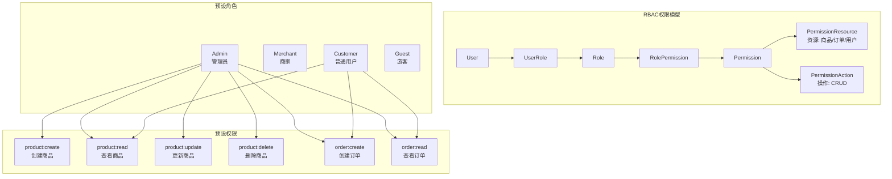
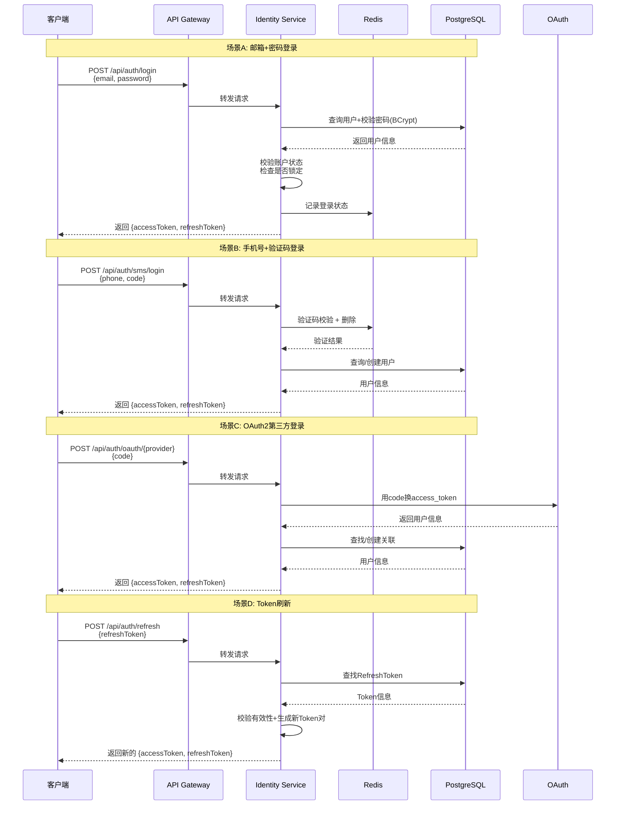
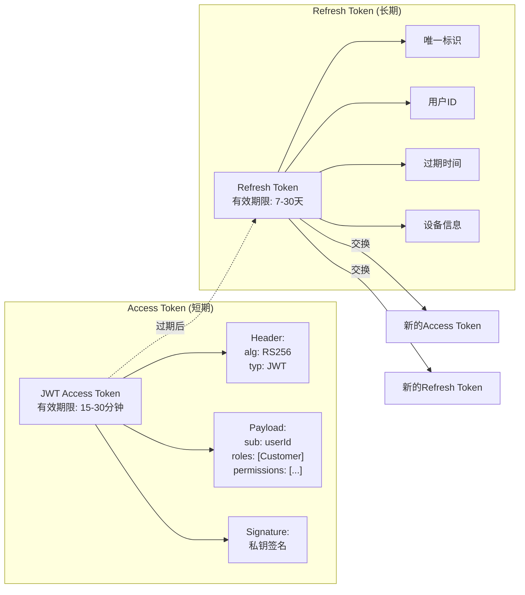
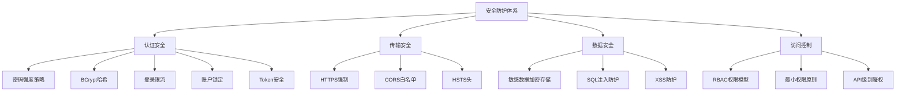

# CloudMall电商系统 - 用户服务与认证(Identity Service)

> **本篇导读**：本文深入讲解CloudMall用户认证服务的完整实现，包括用户领域模型、多种登录方式（手机验证码/邮箱密码/OAuth2第三方）、JWT双Token机制、RBAC权限模型以及安全防护措施。通过本文，你将掌握如何构建一个安全可靠的用户身份管理系统。

## 目录

- [1. 用户领域模型设计](#1-用户领域模型设计)
  - [1.1 User实体设计](#11-user实体设计)
  - [1.2 Role与Permission权限模型](#12-role与permission权限模型)
  - [1.3 UserProfile扩展信息](#13-userprofile扩展信息)
  - [1.4 UserAddress收货地址](#14-useraddress收货地址)
- [2. 认证方案详解](#2-认证方案详解)
  - [2.1 手机号+验证码登录](#21-手机号验证码登录)
  - [2.2 邮箱+密码登录](#22-邮箱密码登录)
  - [2.3 OAuth2第三方登录（微信/GitHub）](#23-oauth2第三方登录微信github)
  - [2.4 JWT Token + Refresh Token双Token机制](#24-jwt-token--refresh-token双token机制)
- [3. 接口设计与实现](#3-接口设计与实现)
- [4. 安全措施](#4-安全措施)
- [5. 完整代码实现](#5-完整代码实现)
- [6. 测试要点](#6-测试要点)

---

## 1. 用户领域模型设计

### 1.1 User实体设计

```csharp
using System;
using System.Collections.Generic;

namespace CloudMall.Identity.Domain.Entities
{
    /// <summary>
    /// 用户实体
    /// 支持多种登录方式：手机号、邮箱、第三方OAuth
    /// </summary>
    public class User
    {
        public Guid Id { get; set; }

        /// <summary>
        /// 手机号（唯一，可用于登录）
        /// </summary>
        public string PhoneNumber { get; set; }

        /// <summary>
        /// 邮箱地址（唯一，可用于登录）
        /// </summary>
        public string Email { get; set; }

        /// <summary>
        /// 密码哈希值（BCrypt加密）
        /// 注意：使用手机验证码登录时可以为空
        /// </summary>
        public string PasswordHash { get; set; }

        /// <summary>
        /// 用户昵称
        /// </summary>
        public string Nickname { get; set; }

        /// <summary>
        /// 头像URL
        /// </summary>
        public string AvatarUrl { get; set; }

        /// <summary>
        /// 性别：0-未知 1-男 2-女
        /// </summary>
        public GenderType Gender { get; set; } = GenderType.Unknown;

        /// <summary>
        /// 生日
        /// </summary>
        public DateTime? Birthday { get; set; }

        /// <summary>
        /// 用户状态：0-正常 1-禁用 2-待验证
        /// </summary>
        public UserStatus Status { get; set; } = UserStatus.Active;

        /// <summary>
        /// 账户状态变更原因（禁用时填写）
        /// </summary>
        public string StatusReason { get; set; }

        /// <summary>
        /// 最后登录时间
        /// </summary>
        public DateTime? LastLoginAt { get; set; }

        /// <summary>
        /// 最后登录IP
        /// </summary>
        public string LastLoginIp { get; set; }

        /// <summary>
        /// 登录失败次数（用于防暴力破解）
        /// </summary>
        public int FailedLoginCount { get; set; } = 0;

        /// <summary>
        /// 账户锁定截止时间（连续失败超过阈值后锁定）
        /// </summary>
        public DateTime? LockoutEnd { get; set; }

        /// <summary>
        /// 创建时间
        /// </summary>
        public DateTime CreatedAt { get; set; } = DateTime.UtcNow;

        /// <summary>
        /// 更新时间
        /// </summary>
        public DateTime UpdatedAt { get; set; } = DateTime.UtcNow;

        // 导航属性
        public UserProfile Profile { get; set; }
        public ICollection<UserRole> UserRoles { get; set; }
            = new List<UserRole>();
        public ICollection<UserLogin> UserLogins { get; set; }
            = new List<UserLogin>();  // 第三方登录绑定
        public ICollection<UserAddress> Addresses { get; set; }
            = new List<UserAddress>();
        public ICollection<RefreshToken> RefreshTokens { get; set; }
            = new List<RefreshToken>();
    }

    /// <summary>
    /// 性别枚举
    /// </summary>
    public enum GenderType
    {
        Unknown = 0,
        Male = 1,
        Female = 2
    }

    /// <summary>
    /// 用户状态枚举
    /// </summary>
    public enum UserStatus
    {
        Active = 0,      // 正常
        Disabled = 1,    // 禁用
        PendingVerify = 2 // 待验证（如邮箱未确认）
    }
}
```

### 1.2 Role与Permission权限模型

CloudMall采用**RBAC（基于角色的访问控制）**模型：



#### 权限实体定义

```csharp
namespace CloudMall.Identity.Domain.Entities
{
    /// <summary>
    /// 角色
    /// </summary>
    public class Role
    {
        public Guid Id { get; set; }

        /// <summary>
        /// 角色名称（唯一）
        /// </summary>
        public string Name { get; set; }  // Admin, Customer, Merchant

        /// <summary>
        /// 角色显示名称
        /// </summary>
        public string DisplayName { get; set; }

        /// <summary>
        /// 角色描述
        /// </summary>
        public string Description { get; set; }

        /// <summary>
        /// 是否为系统内置角色（不可删除）
        /// </summary>
        public bool IsSystem { get; set; } = false;

        /// <summary>
        /// 排序序号
        /// </summary>
        public int SortOrder { get; set; } = 0;

        /// <summary>
        /// 是否启用
        /// </summary>
        public bool IsActive { get; set; } = true;

        public DateTime CreatedAt { get; set; } = DateTime.UtcNow;

        // 导航属性
        public ICollection<UserRole> UserRoles { get; set; }
            = new List<UserRole>();
        public ICollection<RolePermission> RolePermissions { get; set; }
            = new List<RolePermission>();
    }

    /// <summary>
    /// 权限
    /// 格式：resource:action (如 product:read, order:create)
    /// </summary>
    public class Permission
    {
        public Guid Id { get; set; }

        /// <summary>
        /// 权限编码（唯一）
        /// 例如: product:create, order:read, user:manage
        /// </summary>
        public string Code { get; set; }

        /// <summary>
        /// 权限名称
        /// </summary>
        public string Name { get; set; }

        /// <summary>
        /// 权限描述
        /// </summary>
        public string Description { get; set; }

        /// <summary>
        /// 所属模块
        /// </summary>
        public string Module { get; set; }  // Product, Order, User, System

        /// <summary>
        /// 是否为系统内置权限
        /// </summary>
        public bool IsSystem { get; set; } = false;

        public DateTime CreatedAt { get; set; } = DateTime.UtcNow;

        // 导航属性
        public ICollection<RolePermission> RolePermissions { get; set; }
            = new List<RolePermission>();
    }

    /// <summary>
    /// 用户-角色关联表（多对多中间表）
    /// </summary>
    public class UserRole
    {
        public Guid UserId { get; set; }
        public Guid RoleId { get; set; }
        public DateTime AssignedAt { get; set; } = DateTime.UtcNow;
        public Guid? AssignedBy { get; set; }  // 分配人ID

        public User User { get; set; }
        public Role Role { get; set; }
    }

    /// <summary>
    /// 角色-权限关联表（多对多中间表）
    /// </summary>
    public class RolePermission
    {
        public Guid RoleId { get; set; }
        public Guid PermissionId { get; set; }
        public DateTime GrantedAt { get; set; } = DateTime.UtcNow;

        public Role Role { get; set; }
        public Permission Permission { get; set; }
    }
}
```

### 1.3 UserProfile扩展信息

```csharp
namespace CloudMall.Identity.Domain.Entities
{
    /// <summary>
    /// 用户资料扩展表
    /// 将不常用的字段分离到单独的表，避免主表过于臃肿
    /// </summary>
    public class UserProfile
    {
        public Guid Id { get; set; }

        /// <summary>
        /// 关联用户ID（一对一关系）
        /// </summary>
        public Guid UserId { get; set; }

        /// <summary>
        /// 真实姓名
        /// </summary>
        public string RealName { get; set; }

        /// <summary>
        /// 身份证号
        /// </summary>
        public string IdCardNumber { get; set; }

        /// <summary>
        /// 个人签名
        /// </summary>
        public string Bio { get; set; }

        /// <summary>
        /// 所在地区（省/市/区）
        /// </summary>
        public string Region { get; set; }

        /// <summary>
        /// 详细地址
        /// </summary>
        public string Address { get; set; }

        /// <summary>
        /// 个人网站
        /// </summary>
        public string Website { get; set; }

        /// <summary>
        /// 微信号
        /// </summary>
        public string WechatId { get; set; }

        /// <summary>
        /// 是否已实名认证
        /// </summary>
        public bool IsVerified { get; set; } = false;

        /// <summary>
        /// 认证时间
        /// </summary>
        public DateTime? VerifiedAt { get; set; }

        public DateTime UpdatedAt { get; set; } = DateTime.UtcNow;

        public User User { get; set; }
    }
}
```

### 1.4 UserAddress收货地址

```csharp
namespace CloudMall.Identity.Domain.Entities
{
    /// <summary>
    /// 用户收货地址
    /// 支持多地址管理，可设置默认地址
    /// </summary>
    public class UserAddress
    {
        public Guid Id { get; set; }

        /// <summary>
        /// 所属用户ID
        /// </summary>
        public Guid UserId { get; set; }

        /// <summary>
        /// 收货人姓名
        /// </summary>
        public string ReceiverName { get; set; }

        /// <summary>
        /// 收货人电话
        /// </summary>
        public string ReceiverPhone { get; set; }

        /// <summary>
        /// 省份
        /// </summary>
        public string Province { get; set; }

        /// <summary>
        /// 城市
        /// </summary>
        public string City { get; set; }

        /// <summary>
        /// 区/县
        /// </summary>
        public string District { get; set; }

        /// <summary>
        /// 详细地址（街道/门牌号）
        /// </summary>
        public string DetailAddress { get; set; }

        /// <summary>
        /// 邮政编码
        /// </summary>
        public string PostalCode { get; set; }

        /// <summary>
        /// 地址标签（家/公司/学校等）
        /// </summary>
        public string Label { get; set; }

        /// <summary>
        /// 是否为默认地址
        /// </summary>
        public bool IsDefault { get; set; } = false;

        /// <summary>
        /// 创建时间
        /// </summary>
        public DateTime CreatedAt { get; set; } = DateTime.UtcNow;

        public User User { get; set; }
    }

    /// <summary>
    /// 第三方登录记录
    /// 用于存储用户的第三方账号绑定信息
    /// </summary>
    public class UserLogin
    {
        public Guid Id { get; set; }
        public Guid UserId { get; set; }

        /// <summary>
        /// 登录提供者（WeChat, GitHub, Google等）
        /// </summary>
        public string LoginProvider { get; set; }

        /// <summary>
        /// 提供方用户唯一标识（OpenID/UserID）
        /// </summary>
        public string ProviderKey { get; set; }

        /// <summary>
        /// 提供方显示名称
        /// </summary>
        public string ProviderDisplayName { get; set; }

        /// <summary>
        /// 绑定时间
        /// </summary>
        public DateTime BoundAt { get; set; } = DateTime.UtcNow;

        public User User { get; set; }
    }

    /// <summary>
    /// 刷新令牌
    /// 用于JWT Access Token过期后换取新Token
    /// </summary>
    public class RefreshToken
    {
        public Guid Id { get; set; }
        public Guid UserId { get; set; }

        /// <summary>
        /// Token值（加密存储）
        /// </summary>
        public string Token { get; set; }

        /// <summary>
        /// JWT ID（关联的Access Token的JTI）
        /// </summary>
        public string JwtId { get; set; }

        /// <summary>
        /// 创建时间
        /// </summary>
        public DateTime CreatedAt { get; set; } = DateTime.UtcNow;

        /// <summary>
        /// 过期时间（通常7-30天）
        /// </summary>
        public DateTime ExpiresAt { get; set; }

        /// <summary>
        /// 设备/客户端标识
        /// </summary>
        public string DeviceInfo { get; set; }

        /// <summary>
        /// IP地址
        /// </summary>
        public string IpAddress { get; set; }

        /// <summary>
        /// 是否已使用（一次性Token）
        /// </summary>
        public bool IsUsed { get; set; } = false;

        /// <summary>
        /// 是否已撤销
        /// </summary>
        public bool IsRevoked { get; set; } = false;

        /// <summary>
        /// 撤销时间
        /// </summary>
        public DateTime? RevokedAt { get; set; }

        public User User { get; set; }
    }
}
```

---

## 2. 认证方案详解

### 2.1 整体认证架构



### 2.2 手机号+验证码登录

#### 验证码发送流程

```csharp
/// <summary>
/// 短信验证码服务接口
/// </summary>
public interface ISmsService
{
    /// <summary>
    /// 发送验证码短信
    /// </summary>
    Task SendVerificationCodeAsync(string phoneNumber);

    /// <summary>
    /// 验证验证码
    /// </summary>
    Task<bool> VerifyCodeAsync(string phoneNumber, string code);
}

/// <summary>
/// 短信验证码服务实现
/// 使用Redis存储验证码，支持频率限制和有效期控制
/// </summary>
public class SmsService : ISmsService
{
    private readonly IDistributedCache _cache;
    private readonly ISmsProvider _smsProvider;
    private readonly ILogger<SmsService> _logger;
    private const string SMS_CODE_PREFIX = "sms:code:";
    private const int CODE_EXPIRE_MINUTES = 5;      // 验证码有效期5分钟
    private const int SEND_INTERVAL_SECONDS = 60;   // 发送间隔60秒
    private const int DAILY_LIMIT = 10;             // 每日发送上限10条

    public SmsService(
        IDistributedCache cache,
        ISmsProvider smsProvider,
        ILogger<SmsService> logger)
    {
        _cache = cache;
        _smsProvider = smsProvider;
        _logger = logger;
    }

    public async Task SendVerificationCodeAsync(string phoneNumber)
    {
        // 1. 校验手机号格式
        if (!IsValidPhoneNumber(phoneNumber))
        {
            throw new BusinessException("手机号格式不正确");
        }

        var rateLimitKey = $"sms:rate:{phoneNumber}";
        var dailyCountKey = $"sms:daily:{phoneNumber}:{DateTime.Now:yyyyMMdd}";

        // 2. 检查发送频率限制
        var lastSendTime = await _cache.GetStringAsync(rateLimitKey);
        if (lastSendTime != null)
        {
            var elapsed = DateTime.UtcNow -
                DateTimeOffset.FromUnixTimeSeconds(long.Parse(lastSendTime))
                    .UtcDateTime;
            if (elapsed.TotalSeconds < SEND_INTERVAL_SECONDS)
            {
                throw new BusinessException(
                    $"操作过于频繁，请{SEND_INTERVAL_SECONDS - (int)elapsed.TotalSeconds}秒后重试");
            }
        }

        // 3. 检查每日发送限制
        var dailyCountStr = await _cache.GetStringAsync(dailyCountKey);
        if (int.TryParse(dailyCountStr, out var dailyCount) && dailyCount >= DAILY_LIMIT)
        {
            throw new BusinessException("今日发送次数已达上限");
        }

        // 4. 生成6位随机验证码
        var code = GenerateRandomCode(6);

        // 5. 存储到Redis（带过期时间）
        await _cache.SetStringAsync(
            $"{SMS_CODE_PREFIX}{phoneNumber}",
            code,
            new DistributedCacheEntryOptions
            {
                AbsoluteExpirationRelativeToNow =
                    TimeSpan.FromMinutes(CODE_EXPIRE_MINUTES)
            });

        // 6. 更新频率限制计数器
        await _cache.SetStringAsync(
            rateLimitKey,
            ((long)DateTimeOffset.UtcNow.ToUnixTimeSeconds()).ToString(),
            new DistributedCacheEntryOptions
            {
                AbsoluteExpirationRelativeToNow =
                    TimeSpan.FromSeconds(SEND_INTERVAL_SECONDS)
            });

        // 7. 更新每日计数
        await _cache.SetStringAsync(
            dailyCountKey,
            (dailyCount + 1).ToString(),
            new DistributedCacheEntryOptions
            {
                AbsoluteExpirationRelativeToNow =
                    TimeSpan.FromDays(1)  // 当天有效
            });

        // 8. 调用短信服务商发送
        try
        {
            await _smsProvider.SendAsync(phoneNumber,
                $"【CloudMall】您的验证码是{code}，" +
                $"{CODE_EXPIRE_MINUTES}分钟内有效。如非本人操作，请忽略。");

            _logger.LogInformation(
                "验证码已发送至: {Phone}", MaskPhone(phoneNumber));
        }
        catch (Exception ex)
        {
            _logger.LogError(ex, "发送短信失败: {Phone}", phoneNumber);
            throw new BusinessException("短信发送失败，请稍后重试");
        }
    }

    public async Task<bool> VerifyCodeAsync(string phoneNumber, string code)
    {
        if (string.IsNullOrWhiteSpace(code) || code.Length != 6)
        {
            return false;
        }

        var storedCode = await _cache.GetStringAsync(
            $"{SMS_CODE_PREFIX}{phoneNumber}");

        if (storedCode == null)
        {
            return false;  // 已过期或不存在
        }

        // 验证成功后立即删除（一次性使用）
        if (storedCode.Equals(code, StringComparison.OrdinalIgnoreCase))
        {
            await _cache.RemoveAsync($"{SMS_CODE_PREFIX}{phoneNumber}");
            return true;
        }

        return false;
    }

    private static string GenerateRandomCode(int length)
    {
        var random = new Random();
        var chars = "0123456789";
        return new string(Enumerable.Range(0, length)
            .Select(_ => chars[random.Next(chars.Length)]).ToArray());
    }

    private static bool IsValidPhoneNumber(string phone)
    {
        return Regex.IsMatch(phone, @"^1[3-9]\d{9}$");
    }

    private static string MaskPhone(string phone)
    {
        if (phone.Length >= 7)
        {
            return phone.Substring(0, 3) + "****" +
                phone.Substring(phone.Length - 4);
        }
        return phone;
    }
}
```

### 2.3 JWT Token + Refresh Token双Token机制

#### Token结构设计



#### JWT Helper完整实现

```csharp
using System;
using System.Collections.Generic;
using System.IdentityModel.Tokens.Jwt;
using System.Security.Claims;
using System.Security.Cryptography;
using System.Text;
using Microsoft.IdentityModel.Tokens;
using CloudMall.Identity.Domain.Entities;

namespace CloudMall.Identity.Infrastructure.Security
{
    /// <summary>
    /// JWT Token帮助类
    /// 负责Token的生成、验证、解析
    /// </summary>
    public class JwtHelper
    {
        private readonly JwtSettings _settings;
        private readonly SecurityKey _signingKey;
        private readonly SigningCredentials _credentials;

        public JwtHelper(JwtSettings settings)
        {
            _settings = settings;

            // 使用RSA密钥（生产环境推荐）
            var rsa = RSA.Create();
            rsa.ImportRSAPrivateKey(
                Convert.FromBase64String(settings.PrivateKey),
                out _);
            _signingKey = new RsaSecurityKey(rsa);
            _credentials = new SigningCredentials(_signingKey,
                SecurityAlgorithms.RsaSha256);
        }

        /// <summary>
        /// 生成Token对（AccessToken + RefreshToken）
        /// </summary>
        public TokenPairDto GenerateTokenPair(User user, IEnumerable<string> roles,
            IEnumerable<string> permissions)
        {
            var jwtId = Guid.NewGuid().ToString();

            // 1. 生成Access Token
            var accessToken = GenerateAccessToken(user, roles, permissions, jwtId);

            // 2. 生成Refresh Token
            var refreshToken = GenerateRefreshToken(user.Id, jwtId);

            return new TokenPairDto
            {
                AccessToken = accessToken,
                RefreshToken = refreshToken.Token,
                ExpiresIn = _settings.AccessTokenExpirationMinutes * 60,
                RefreshExpiresIn = _settings.RefreshTokenExpirationDays * 86400
            };
        }

        /// <summary>
        /// 生成Access Token
        /// </summary>
        private string GenerateAccessToken(User user, IEnumerable<string> roles,
            IEnumerable<string> permissions, string jwtId)
        {
            var claims = new List<Claim>
            {
                new(JwtRegisteredClaimNames.Sub, user.Id.ToString()),
                new(JwtRegisteredClaimNames.Jti, jwtId),
                new(JwtRegisteredClaimNames.Iat,
                    DateTimeOffset.UtcNow.ToUnixTimeSeconds().ToString(),
                    ClaimValueTypes.Integer64),
                new(ClaimTypes.NameIdentifier, user.Id.ToString()),
                new(ClaimTypes.Name, user.Nickname ?? user.Email ?? user.PhoneNumber),
                new("phone", user.PhoneNumber ?? ""),
                new("email", user.Email ?? "")
            };

            // 添加角色声明
            foreach (var role in roles)
            {
                claims.Add(new Claim(ClaimTypes.Role, role));
            }

            // 添加权限声明（用于细粒度授权）
            foreach (var permission in permissions)
            {
                claims.Add(new Claim("permission", permission));
            }

            var tokenDescriptor = new SecurityTokenDescriptor
            {
                Subject = new ClaimsIdentity(claims),
                Issuer = _settings.Issuer,
                Audience = _settings.Audience,
                IssuedAt = DateTime.UtcNow,
                Expires = DateTime.UtcNow.AddMinutes(
                    _settings.AccessTokenExpirationMinutes),
                SigningCredentials = _credentials
            };

            var tokenHandler = new JwtSecurityTokenHandler();
            var token = tokenHandler.CreateToken(tokenDescriptor);
            return tokenHandler.WriteToken(token);
        }

        /// <summary>
        /// 生成Refresh Token
        /// </summary>
        private RefreshToken GenerateRefreshToken(Guid userId, string jwtId)
        {
            var randomNumber = new byte[64];
            using var rng = RandomNumberGenerator.Create();
            rng.GetBytes(randomNumber);

            return new RefreshToken
            {
                Id = Guid.NewGuid(),
                UserId = userId,
                Token = Convert.ToBase64String(randomNumber),
                JwtId = jwtId,
                CreatedAt = DateTime.UtcNow,
                ExpiresAt = DateTime.UtcNow.AddDays(
                    _settings.RefreshTokenExpirationDays)
            };
        }

        /// <summary>
        /// 从Token中提取ClaimsPrincipal
        /// </summary>
        public ClaimsPrincipal ValidateToken(string token)
        {
            var tokenHandler = new JwtSecurityTokenHandler();

            try
            {
                var principal = tokenHandler.ValidateToken(token,
                    new TokenValidationParameters
                    {
                        ValidateIssuerSigningKey = true,
                        IssuerSigningKey = _signingKey,
                        ValidateIssuer = true,
                        ValidIssuer = _settings.Issuer,
                        ValidateAudience = true,
                        ValidAudience = _settings.Audience,
                        ValidateLifetime = true,
                        ClockSkew = TimeSpan.Zero  // 不允许时钟偏差
                    }, out _);

                return principal;
            }
            catch (Exception)
            {
                return null;
            }
        }

        /// <summary>
        /// 从Token中提取用户ID
        /// </summary>
        public Guid? ExtractUserId(string token)
        {
            var principal = ValidateToken(token);
            var userIdClaim = principal?.FindFirst(JwtRegisteredClaimNames.Sub);
            return Guid.TryParse(userIdClaim?.Value, out var userId) ? userId : null;
        }
    }

    /// <summary>
    /// JWT配置选项
    /// </summary>
    public class JwtSettings
    {
        public string Issuer { get; set; } = "cloudmall-auth";
        public string Audience { get; set; } = "cloudmall-api";
        public string PrivateKey { get; set; }  // RSA私钥（Base64）
        public string PublicKey { get; set; }   // RSA公钥（Base64）
        public int AccessTokenExpirationMinutes { get; set; } = 30;
        public int RefreshTokenExpirationDays { get; set; } = 7;
    }

    /// <summary>
    /// Token响应DTO
    /// </summary>
    public class TokenPairDto
    {
        public string AccessToken { get; set; }
        public string RefreshToken { get; set; }
        public int ExpiresIn { get; set; }       // Access Token过期秒数
        public int RefreshExpiresIn { get; set; } // Refresh Token过期秒数
        public TokenType TokenType { get; set; } = TokenType.Bearer;
    }

    public enum TokenType
    {
        Bearer
    }
}
```

### 2.4 OAuth2第三方登录

```csharp
/// <summary>
/// OAuth2服务接口
/// 支持微信、GitHub等多种第三方登录
/// </summary>
public interface IOAuthService
{
    /// <summary>
    /// 获取授权URL（前端跳转用）
    /// </summary>
    string GetAuthorizationUrl(string provider, string state);

    /// <summary>
    /// 用授权码换取用户信息
    /// </summary>
    Task<OAuthUserInfo> ExchangeCodeForUserAsync(
        string provider, string code);
}

/// <summary>
/// GitHub OAuth2实现示例
/// </summary>
public class GitHubOAuthService : IOAuthService
{
    private readonly HttpClient _httpClient;
    private readonly OAuthOptions _options;
    private readonly ILogger<GitHubOAuthService> _logger;

    public GitHubOAuthService(HttpClient httpClient,
        IOptions<OAuthOptions> options,
        ILogger<GitHubOAuthService> logger)
    {
        _httpClient = httpClient;
        _options = options.Value.GitHub;
        _logger = logger;
    }

    public string GetAuthorizationUrl(string provider, string state)
    {
        if (provider.ToLower() != "github")
            throw new ArgumentException("不支持的provider");

        var parameters = new Dictionary<string, string>
        {
            ["client_id"] = _options.ClientId,
            ["redirect_uri"] = _options.RedirectUri,
            ["scope"] = "read:user,user:email",
            ["state"] = state
        };

        return QueryHelpers.AddQueryString(
            "https://github.com/login/oauth/authorize", parameters);
    }

    public async Task<OAuthUserInfo> ExchangeCodeForUserAsync(
        string provider, string code)
    {
        // Step 1: 用code换取access_token
        var tokenResponse = await _httpClient.PostAsJsonAsync(
            "https://github.com/login/oauth/access_token",
            new
            {
                client_id = _options.ClientId,
                client_secret = _options.ClientSecret,
                code = code,
                redirect_uri = _options.RedirectUri
            });

        var tokenContent = await tokenResponse.Content.ReadAsStringAsync();
        var tokenData = QueryString.Parse(tokenContent);

        if (!tokenData.ContainsKey("access_token"))
        {
            throw new BusinessException("获取GitHub access_token失败");
        }

        var accessToken = tokenData["access_token"];

        // Step 2: 用access_token获取用户信息
        _httpClient.DefaultRequestHeaders.Authorization =
            new AuthenticationHeaderValue("Bearer", accessToken);
        _httpClient.DefaultRequestHeaders.UserAgent.ParseAdd("CloudMall");

        var userResponse = await _httpClient.GetAsync(
            "https://api.github.com/user");

        if (!userResponse.IsSuccessStatusCode)
        {
            throw new BusinessException("获取GitHub用户信息失败");
        }

        var userData = await userResponse.Content
            .ReadFromJsonAsync<GithubUserData>();

        // Step 3: 获取邮箱（可能需要额外请求）
        string email = userData.Email;
        if (string.IsNullOrEmpty(email))
        {
            var emailResponse = await _httpClient.GetAsync(
                "https://api.github.com/user/emails");
            if (emailResponse.IsSuccessStatusCode)
            {
                var emails = await emailResponse.Content
                    .ReadFromJsonAsync<List<GithubEmailData>>();
                email = emails?.FirstOrDefault(e => e.Primary)?.Email;
            }
        }

        return new OAuthUserInfo
        {
            Provider = "GitHub",
            ProviderUserId = userData.Id.ToString(),
            ProviderDisplayName = userData.Login,
            Email = email,
            AvatarUrl = userData.AvatarUrl,
            Name = userData.Name ?? userData.Login
        };
    }
}

// DTOs
public record OAuthUserInfo
{
    public string Provider { get; init; }
    public string ProviderUserId { get; init; }
    public string ProviderDisplayName { get; init; }
    public string Email { get; init; }
    public string AvatarUrl { get; init; }
    public string Name { get; init; }
}

internal record GithubUserData(int Id, string Login, string Name,
    string Email, string AvatarUrl);
internal record GithubEmailData(string Email, bool Primary, bool Verified);
```

---

## 3. 接口设计与实现

### 3.1 API端点总览

| 方法 | 路径 | 描述 | 认证 |
|-----|------|------|------|
| **POST** | `/api/auth/register` | 用户注册 | Public |
| **POST** | `/api/auth/login/password` | 邮箱密码登录 | Public |
| **POST** | `/api/auth/login/sms` | 手机验证码登录 | Public |
| **GET** | `/api/auth/oauth/{provider}` | 获取OAuth授权URL | Public |
| **POST** | `/api/auth/oauth/{provider}/callback` | OAuth回调处理 | Public |
| **POST** | `/api/auth/refresh` | 刷新Token | Public |
| **POST** | `/auth/logout` | 登出（撤销Token） | Auth |
| **GET** | `/api/auth/me` | 获取当前用户信息 | Auth |
| **PUT** | `/api/auth/me` | 更新个人信息 | Auth |
| **PUT** | `/api/auth/me/password` | 修改密码 | Auth |
| **POST** | `/api/auth/sms/send` | 发送验证码 | Public |
| **CRUD** | `/api/users/addresses` | 地址管理 | Auth |

### 3.2 AuthController完整实现

```csharp
using System;
using System.Threading.Tasks;
using Microsoft.AspNetCore.Authorization;
using Microsoft.AspNetCore.Http;
using Microsoft.AspNetCore.Mvc;
using CloudMall.Service.Identity.DTOs;
using CloudMall.Service.Identity.Services;
using CloudMall.Identity.Infrastructure.Security;

namespace CloudMall.Service.Identity.Controllers
{
    /// <summary>
    /// 认证控制器
    /// 提供注册、登录、Token刷新等认证相关API
    /// </summary>
    [ApiController]
    [Route("api/[controller]")]
    [Produces("application/json")]
    public class AuthController : ControllerBase
    {
        private readonly IAuthService _authService;
        private readonly IUserService _userService;
        private readonly ISmsService _smsService;
        private readonly IOAuthService _oauthService;
        private readonly ILogger<AuthController> _logger;

        public AuthController(
            IAuthService authService,
            IUserService userService,
            ISmsService smsService,
            IOAuthService oauthService,
            ILogger<AuthController> logger)
        {
            _authService = authService;
            _userService = userService;
            _smsService = smsService;
            _oauthService = oauthService;
            _logger = logger;
        }

        #region 注册

        /// <summary>
        /// 用户注册
        /// POST /api/auth/register
        /// </summary>
        [HttpPost("register")]
        [AllowAnonymous]
        [ProducesResponseType(typeof(AuthResponseDto), StatusCodes.Status200OK)]
        [ProducesResponseType(StatusCodes.Status400BadRequest)]
        public async Task<ActionResult<AuthResponseDto>> Register(
            [FromBody] RegisterRequestDto request)
        {
            if (!ModelState.IsValid)
                return BadRequest(ModelState);

            try
            {
                var result = await _authService.RegisterAsync(request);
                return Ok(result);
            }
            catch (BusinessException ex)
            {
                return BadRequest(new { error = ex.Message });
            }
        }

        #endregion

        #region 登录

        /// <summary>
        /// 邮箱+密码登录
        /// POST /api/auth/login/password
        /// </summary>
        [HttpPost("login/password")]
        [AllowAnonymous]
        [ProducesResponseType(typeof(AuthResponseDto), StatusCodes.Status200OK)]
        [ProducesResponseType(StatusCodes.Status401Unauthorized)]
        public async Task<ActionResult<AuthResponseDto>> LoginWithPassword(
            [FromBody] PasswordLoginRequestDto request)
        {
            try
            {
                var result = await _authService.LoginWithPasswordAsync(
                    request.Email,
                    request.Password,
                    HttpContext.Connection.RemoteIpAddress?.ToString());

                return Ok(result);
            }
            catch (UnauthorizedException ex)
            {
                return Unauthorized(new { error = ex.Message });
            }
            catch (AccountLockedException ex)
            {
                return Unauthorized(new
                {
                    error = ex.Message,
                    lockoutEnd = ex.LockoutEnd
                });
            }
        }

        /// <summary>
        /// 手机号+验证码登录
        /// POST /api/auth/login/sms
        /// </summary>
        [HttpPost("login/sms")]
        [AllowAnonymous]
        [ProducesResponseType(typeof(AuthResponseDto), StatusCodes.Status200OK)]
        [ProducesResponseType(StatusCodes.Status400BadRequest)]
        public async Task<ActionResult<AuthResponseDto>> LoginWithSms(
            [FromBody] SmsLoginRequestDto request)
        {
            try
            {
                var result = await _authService.LoginWithSmsAsync(
                    request.PhoneNumber,
                    request.VerificationCode,
                    HttpContext.Connection.RemoteIpAddress?.ToString());

                return Ok(result);
            }
            catch (BusinessException ex)
            {
                return BadRequest(new { error = ex.Message });
            }
        }

        #endregion

        #region OAuth2

        /// <summary>
        /// 获取OAuth授权URL
        /// GET /api/auth/oauth/{provider}
        /// </summary>
        [HttpGet("oauth/{provider}")]
        [AllowAnonymous]
        public IActionResult GetOAuthUrl(string provider, [FromQuery] string state)
        {
            try
            {
                var url = _oauthService.GetAuthorizationUrl(provider, state);
                return Ok(new { authorizationUrl = url });
            }
            catch (ArgumentException)
            {
                return BadRequest(new { error = $"不支持的登录方式: {provider}" });
            }
        }

        /// <summary>
        /// OAuth2回调处理
        /// POST /api/auth/oauth/{provider}/callback
        /// </summary>
        [HttpPost("oauth/{provider}/callback")]
        [AllowAnonymous]
        [ProducesResponseType(typeof(AuthResponseDto), StatusCodes.Status200OK)]
        public async Task<ActionResult<AuthResponseDto>> OAuthCallback(
            string provider,
            [FromBody] OAuthCallbackRequestDto request)
        {
            try
            {
                var oauthUser = await _oauthService
                    .ExchangeCodeForUserAsync(provider, request.Code);

                var result = await _authService.LoginWithOAuthAsync(oauthUser);
                return Ok(result);
            }
            catch (BusinessException ex)
            {
                return BadRequest(new { error = ex.Message });
            }
        }

        #endregion

        #region Token刷新

        /// <summary>
        /// 刷新Access Token
        /// POST /api/auth/refresh
        /// </summary>
        [HttpPost("refresh")]
        [AllowAnonymous]
        [ProducesResponseType(typeof(TokenPairDto), StatusCodes.Status200OK)]
        [ProducesResponseType(StatusCodes.Status401Unauthorized)]
        public async Task<ActionResult<TokenPairDto>> RefreshToken(
            [FromBody] RefreshTokenRequestDto request)
        {
            try
            {
                var result = await _authService.RefreshTokenAsync(
                    request.RefreshToken,
                    HttpContext.Connection.RemoteIpAddress?.ToString());

                return Ok(result);
            }
            catch (UnauthorizedException)
            {
                return Unauthorized(new { error = "Refresh Token无效或已过期" });
            }
        }

        #endregion

        #region 验证码

        /// <summary>
        /// 发送短信验证码
        /// POST /api/auth/sms/send
        /// </summary>
        [HttpPost("sms/send")]
        [AllowAnonymous]
        [ProducesResponseType(StatusCodes.Status200OK)]
        [ProducesResponseType(StatusCodes.Status429TooManyRequests)]
        public async Task<IActionResult> SendSmsCode(
            [FromBody] SendSmsCodeRequestDto request)
        {
            try
            {
                await _smsService.SendVerificationCodeAsync(request.PhoneNumber);
                return Ok(new { message = "验证码已发送" });
            }
            catch (BusinessException ex)
            {
                if (ex.Message.Contains("频繁") || ex.Message.Contains("上限"))
                {
                    return StatusCode(StatusCodes.Status429TooManyRequests,
                        new { error = ex.Message });
                }
                return BadRequest(new { error = ex.Message });
            }
        }

        #endregion

        #region 当前用户信息

        /// <summary>
        /// 获取当前登录用户信息
        /// GET /api/auth/me
        /// </summary>
        [HttpGet("me")]
        [Authorize]
        [ProducesResponseType(typeof(UserInfoDto), StatusCodes.Status200OK)]
        public async Task<ActionResult<UserInfoDto>> GetCurrentUser()
        {
            var userId = GetCurrentUserId();
            var user = await _userService.GetUserByIdAsync(userId);
            return Ok(user);
        }

        /// <summary>
        /// 更新当前用户信息
        /// PUT /api/auth/me
        /// </summary>
        [HttpPut("me")]
        [Authorize]
        [ProducesResponseType(typeof(UserInfoDto), StatusCodes.Status200OK)]
        public async Task<ActionResult<UserInfoDto>> UpdateCurrentUser(
            [FromBody] UpdateUserRequestDto request)
        {
            var userId = GetCurrentUserId();
            var user = await _userService.UpdateProfileAsync(userId, request);
            return Ok(user);
        }

        /// <summary>
        /// 修改密码
        /// PUT /api/auth/me/password
        /// </summary>
        [HttpPut("me/password")]
        [Authorize]
        [ProducesResponseType(StatusCodes.Status200OK)]
        [ProducesResponseType(StatusCodes.Status400BadRequest)]
        public async Task<IActionResult> ChangePassword(
            [FromBody] ChangePasswordRequestDto request)
        {
            var userId = GetCurrentUserId();
            await _userService.ChangePasswordAsync(userId,
                request.OldPassword, request.NewPassword);
            return Ok(new { message = "密码修改成功" });
        }

        #endregion

        #region 辅助方法

        private Guid GetCurrentUserId()
        {
            var userIdClaim = User.FindFirst(JwtRegisteredClaimNames.Sub)?.Value;
            if (!Guid.TryParse(userIdClaim, out var userId))
                throw new UnauthorizedException("无效的Token");
            return userId;
        }

        #endregion
    }
}
```

### 3.3 AuthService核心业务逻辑

```csharp
using System;
using System.Linq;
using System.Threading.Tasks;
using Microsoft.Extensions.Logging;
using CloudMall.Identity.Domain.Entities;
using CloudMall.Service.Identity.DTOs;
using CloudMall.Identity.Infrastructure.Repositories;
using CloudMall.Identity.Infrastructure.Security;

namespace CloudMall.Service.Identity.Services
{
    /// <summary>
    /// 认证服务核心实现
    /// 处理所有认证相关的业务逻辑
    /// </summary>
    public class AuthService : IAuthService
    {
        private readonly IUserRepository _userRepository;
        private readonly IRefreshTokenRepository _refreshTokenRepo;
        private readonly IUserRoleRepository _userRoleRepo;
        private readonly IPermissionRepository _permissionRepo;
        private readonly IEventBus _eventBus;
        private readonly JwtHelper _jwtHelper;
        private readonly ISmsService _smsService;
        private readonly IPasswordHasher _passwordHasher;
        private readonly ILogger<AuthService> _logger;

        // 安全配置
        private const int MaxFailedAttempts = 5;           // 最大失败次数
        private static readonly TimeSpan LockoutDuration = TimeSpan.FromMinutes(30); // 锁定时长

        public AuthService(
            IUserRepository userRepository,
            IRefreshTokenRepository refreshTokenRepo,
            IUserRoleRepository userRoleRepo,
            IPermissionRepository permissionRepo,
            IEventBus eventBus,
            JwtHelper jwtHelper,
            ISmsService smsService,
            IPasswordHasher passwordHasher,
            ILogger<AuthService> logger)
        {
            _userRepository = userRepository;
            _refreshTokenRepo = refreshTokenRepo;
            _userRoleRepo = userRoleRepo;
            _permissionRepo = permissionRepo;
            _eventBus = eventBus;
            _jwtHelper = jwtHelper;
            _smsService = smsService;
            _passwordHasher = passwordHasher;
            _logger = logger;
        }

        /// <summary>
        /// 用户注册
        /// </summary>
        public async Task<AuthResponseDto> RegisterAsync(RegisterRequestDto dto)
        {
            _logger.LogInformation("开始用户注册: {EmailOrPhone}",
                dto.Email ?? dto.PhoneNumber);

            // 1. 检查邮箱/手机号是否已注册
            if (!string.IsNullOrEmpty(dto.Email))
            {
                var existingByEmail = await _userRepository
                    .FindByEmailAsync(dto.Email);
                if (existingByEmail != null)
                    throw new BusinessException("该邮箱已被注册");
            }

            if (!string.IsNullOrEmpty(dto.PhoneNumber))
            {
                var existingByPhone = await _userRepository
                    .FindByPhoneNumberAsync(dto.PhoneNumber);
                if (existingByPhone != null)
                    throw new BusinessException("该手机号已被注册");
            }

            // 2. 如果需要验证码，先验证
            if (!string.IsNullOrEmpty(dto.PhoneNumber) &&
                !string.IsNullOrEmpty(dto.VerificationCode))
            {
                var isValid = await _smsService.VerifyCodeAsync(
                    dto.PhoneNumber, dto.VerificationCode);
                if (!isValid)
                    throw new BusinessException("验证码错误或已过期");
            }

            // 3. 创建用户实体
            var user = new User
            {
                Id = Guid.NewGuid(),
                Email = dto.Email?.ToLowerInvariant().Trim(),
                PhoneNumber = dto.PhoneNumber?.Trim(),
                PasswordHash = !string.IsNullOrEmpty(dto.Password)
                    ? _passwordHasher.HashPassword(dto.Password) : null,
                Nickname = dto.Nickname ??
                    GenerateNickname(dto.Email ?? dto.PhoneNumber),
                Status = UserStatus.Active,
                CreatedAt = DateTime.UtcNow,
                UpdatedAt = DateTime.UtcNow
            };

            // 4. 保存用户
            await _userRepository.AddAsync(user);

            // 5. 分配默认角色（普通用户）
            var customerRole = await _userRoleRepo
                .GetRoleByNameAsync("Customer");
            if (customerRole != null)
            {
                await _userRoleRepo.AssignRoleAsync(user.Id, customerRole.Id);
            }

            _logger.LogInformation("用户注册成功: {UserId}, {Email}",
                user.Id, user.Email);

            // 6. 发布用户注册事件
            await PublishUserEventAsync("UserRegistered", user.Id);

            // 7. 生成Token并返回
            return await GenerateAuthResponseAsync(user);
        }

        /// <summary>
        /// 邮箱+密码登录
        /// 包含账户锁定和暴力破解防护
        /// </summary>
        public async Task<AuthResponseDto> LoginWithPasswordAsync(
            string email, string password, string ipAddress)
        {
            _logger.LogInformation("密码登录尝试: {Email}", email);

            // 1. 查找用户
            var user = await _userRepository.FindByEmailAsync(email);
            if (user == null)
            {
                // 即使不存在也不透露具体原因（防止用户枚举）
                throw new UnauthorizedException("邮箱或密码错误");
            }

            // 2. 检查账户状态
            CheckAccountStatus(user);

            // 3. 验证密码
            if (!_passwordHasher.VerifyPassword(password, user.PasswordHash))
            {
                await HandleFailedLoginAsync(user, ipAddress);
                throw new UnauthorizedException("邮箱或密码错误");
            }

            // 4. 登录成功，重置失败计数
            await ResetFailedLoginCountAsync(user);

            // 5. 更新最后登录信息
            await UpdateLastLoginAsync(user, ipAddress);

            _logger.LogInformation("密码登录成功: {UserId}, {Email}",
                user.Id, user.Email);

            // 6. 发布登录事件
            await PublishUserEventAsync("UserLoggedIn", user.Id);

            // 7. 生成Token
            return await GenerateAuthResponseAsync(user);
        }

        /// <summary>
        /// 手机号+验证码登录
        /// </summary>
        public async Task<AuthResponseDto> LoginWithSmsAsync(
            string phoneNumber, string code, string ipAddress)
        {
            _logger.LogInformation("短信登录尝试: {Phone}",
                MaskPhone(phoneNumber));

            // 1. 验证验证码
            var isValid = await _smsService.VerifyCodeAsync(phoneNumber, code);
            if (!isValid)
                throw new BusinessException("验证码错误或已过期");

            // 2. 查找或创建用户
            var user = await _userRepository
                .FindByPhoneNumberAsync(phoneNumber);

            if (user == null)
            {
                // 自动创建用户（手机号登录通常允许自动注册）
                user = new User
                {
                    Id = Guid.NewGuid(),
                    PhoneNumber = phoneNumber,
                    Nickname = $"用户{phoneNumber.Substring(7)}",
                    Status = UserStatus.Active,
                    CreatedAt = DateTime.UtcNow,
                    UpdatedAt = DateTime.UtcNow
                };
                await _userRepository.AddAsync(user);

                // 分配默认角色
                var customerRole = await _userRoleRepo
                    .GetRoleByNameAsync("Customer");
                if (customerRole != null)
                {
                    await _userRoleRepo.AssignRoleAsync(
                        user.Id, customerRole.Id);
                }

                _logger.LogInformation("新用户自动注册: {UserId}", user.Id);
            }
            else
            {
                CheckAccountStatus(user);
            }

            // 3. 更新最后登录信息
            await UpdateLastLoginAsync(user, ipAddress);

            // 4. 发布事件并返回Token
            await PublishUserEventAsync("UserLoggedIn", user.Id);
            return await GenerateAuthResponseAsync(user);
        }

        /// <summary>
        /// OAuth2第三方登录
        /// </summary>
        public async Task<AuthResponseDto> LoginWithOAuthAsync(
            OAuthUserInfo oauthUser)
        {
            _logger.LogInformation("OAuth登录: {Provider}/{ProviderUserId}",
                oauthUser.Provider, oauthUser.ProviderUserId);

            // 1. 查找已有的第三方绑定
            var existingLogin = await _userRepository
                .FindByProviderAsync(oauthUser.Provider,
                    oauthUser.ProviderUserId);

            User user;

            if (existingLogin != null)
            {
                // 已有绑定，直接登录
                user = await _userRepository.GetByIdAsync(existingLogin.UserId);
                CheckAccountStatus(user);
            }
            else
            {
                // 没有绑定，检查是否有同邮箱用户
                user = !string.IsNullOrEmpty(oauthUser.Email)
                    ? await _userRepository.FindByEmailAsync(oauthUser.Email)
                    : null;

                if (user == null)
                {
                    // 创建新用户
                    user = new User
                    {
                        Id = Guid.NewGuid(),
                        Email = oauthUser.Email?.ToLowerInvariant(),
                        Nickname = oauthUser.Name,
                        AvatarUrl = oauthUser.AvatarUrl,
                        Status = UserStatus.Active,
                        CreatedAt = DateTime.UtcNow,
                        UpdatedAt = DateTime.UtcNow
                    };
                    await _userRepository.AddAsync(user);

                    // 分配默认角色
                    var customerRole = await _userRoleRepo
                        .GetRoleByNameAsync("Customer");
                    if (customerRole != null)
                    {
                        await _userRoleRepo.AssignRoleAsync(
                            user.Id, customerRole.Id);
                    }
                }

                // 绑定第三方账号
                await _userRepository.AddUserLoginAsync(new UserLogin
                {
                    Id = Guid.NewGuid(),
                    UserId = user.Id,
                    LoginProvider = oauthUser.Provider,
                    ProviderKey = oauthUser.ProviderUserId,
                    ProviderDisplayName = oauthUser.ProviderDisplayName,
                    BoundAt = DateTime.UtcNow
                });
            }

            // 更新登录信息
            await UpdateLastLoginAsync(user, null);

            // 发布事件
            await PublishUserEventAsync("UserLoggedIn", user.Id);

            return await GenerateAuthResponseAsync(user);
        }

        /// <summary>
        /// 刷新Token
        /// </summary>
        public async Task<TokenPairDto> RefreshTokenAsync(
            string refreshToken, string ipAddress)
        {
            // 1. 查找RefreshToken
            var storedToken = await _refreshTokenRepo
                .FindByTokenAsync(refreshToken);

            if (storedToken == null)
                throw new UnauthorizedException("Refresh Token无效");

            // 2. 检查Token状态
            if (storedToken.IsRevoked)
                throw new UnauthorizedException("Token已被撤销");

            if (storedToken.IsUsed)
                throw new UnauthorizedException("Token已被使用（可能有安全风险）");

            if (storedToken.ExpiresAt < DateTime.UtcNow)
                throw new UnauthorizedException("Token已过期");

            // 3. 标记旧Token为已使用（防止重放攻击）
            storedToken.IsUsed = true;
            await _refreshTokenRepo.UpdateAsync(storedToken);

            // 4. 撤销该用户的所有其他RefreshToken（可选安全措施）
            await _refreshTokenRepo.RevokeAllUserTokensExceptAsync(
                storedToken.UserId, storedToken.Id);

            // 5. 获取用户信息
            var user = await _userRepository.GetByIdAsync(storedToken.UserId);
            if (user == null || user.Status != UserStatus.Active)
                throw new UnauthorizedException("用户不存在或已禁用");

            // 6. 生成新的Token对
            var roles = await _userRoleRepo.GetUserRolesAsync(user.Id);
            var permissions = await _permissionRepo
                .GetUserPermissionsAsync(user.Id);

            var tokenPair = _jwtHelper.GenerateTokenPair(
                user, roles, permissions);

            // 7. 保存新的RefreshToken
            var newRefreshToken = _jwtHelper.GenerateRefreshToken(
                user.Id, "");  // JwtId在GenerateTokenPair内部生成
            newRefreshToken.DeviceInfo = storedToken.DeviceInfo;
            newRefreshToken.IpAddress = ipAddress;
            await _refreshTokenRepo.AddAsync(newRefreshToken);

            // 8. 更新返回的RefreshToken值
            tokenPair.RefreshToken = newRefreshToken.Token;

            _logger.LogInformation("Token刷新成功: {UserId}", user.Id);

            return tokenPair;
        }

        #region 私有辅助方法

        /// <summary>
        /// 检查账户状态
        /// </summary>
        private void CheckAccountStatus(User user)
        {
            switch (user.Status)
            {
                case UserStatus.Disabled:
                    throw new AccountLockedException(
                        "账户已被禁用",
                        user.LockoutEnd);
                case UserStatus.PendingVerify:
                    throw new BusinessException("请先完成邮箱验证");
                case UserStatus.Active when user.LockoutEnd.HasValue &&
                    user.LockoutEnd > DateTime.UtcNow:
                    throw new AccountLockedException(
                        $"账户已锁定，请在{user.LockoutEnd.Value:yyyy-MM-dd HH:mm}后重试",
                        user.LockoutEnd.Value);
            }
        }

        /// <summary>
        /// 处理登录失败
        /// </summary>
        private async Task HandleFailedLoginAsync(User user, string ipAddress)
        {
            user.FailedLoginCount++;

            if (user.FailedLoginCount >= MaxFailedAttempts)
            {
                user.LockoutEnd = DateTime.UtcNow.Add(LockoutDuration);
                user.StatusReason = $"连续{MaxFailedAttempts}次登录失败";

                _logger.LogWarning(
                    "账户已锁定: {UserId}, 原因: 连续登录失败", user.Id);
            }

            user.UpdatedAt = DateTime.UtcNow;
            await _userRepository.UpdateAsync(user);
        }

        /// <summary>
        /// 重置失败登录计数
        /// </summary>
        private async Task ResetFailedLoginCountAsync(User user)
        {
            if (user.FailedLoginCount > 0 || user.LockoutEnd.HasValue)
            {
                user.FailedLoginCount = 0;
                user.LockoutEnd = null;
                user.UpdatedAt = DateTime.UtcNow;
                await _userRepository.UpdateAsync(user);
            }
        }

        /// <summary>
        /// 更新最后登录信息
        /// </summary>
        private async Task UpdateLastLoginAsync(User user, string ipAddress)
        {
            user.LastLoginAt = DateTime.UtcNow;
            user.LastLoginIp = ipAddress;
            user.UpdatedAt = DateTime.UtcNow;
            await _userRepository.UpdateAsync(user);
        }

        /// <summary>
        /// 生成认证响应（包含Token和用户信息）
        /// </summary>
        private async Task<AuthResponseDto> GenerateAuthResponseAsync(User user)
        {
            var roles = await _userRoleRepo.GetUserRolesAsync(user.Id);
            var permissions = await _permissionRepo
                .GetUserPermissionsAsync(user.Id);

            var tokenPair = _jwtHelper.GenerateTokenPair(
                user, roles, permissions);

            // 保存RefreshToken到数据库
            var refreshTokenEntity = _jwtHelper.GenerateRefreshToken(
                user.Id, "");
            refreshTokenEntity.Token = tokenPair.RefreshToken;
            await _refreshTokenRepo.AddAsync(refreshTokenEntity);

            return new AuthResponseDto
            {
                AccessToken = tokenPair.AccessToken,
                RefreshToken = tokenPair.RefreshToken,
                ExpiresIn = tokenPair.ExpiresIn,
                User = new UserInfoDto
                {
                    Id = user.Id,
                    Email = user.Email,
                    PhoneNumber = user.PhoneNumber,
                    Nickname = user.Nickname,
                    AvatarUrl = user.AvatarUrl,
                    Roles = roles,
                    Permissions = permissions
                }
            };
        }

        /// <summary>
        /// 发布用户事件
        /// </summary>
        private async Task PublishUserEventAsync(
            string eventType, Guid userId)
        {
            try
            {
                await _eventBus.PublishAsync(new UserDomainEvent
                {
                    EventType = eventType,
                    UserId = userId,
                    OccurredAt = DateTime.UtcNow
                });
            }
            catch (Exception ex)
            {
                _logger.LogWarning(ex, "发布用户事件失败: {EventType}", eventType);
            }
        }

        private static string GenerateNickname(string identifier)
        {
            return $"用户{identifier.Substring(Math.Max(0,
                identifier.Length - 4))}";
        }

        private static string MaskPhone(string phone)
        {
            return phone.Length > 7
                ? phone[..3] + "****" + phone[^4..]
                : phone;
        }

        #endregion
    }
}
```

---

## 4. 安全措施

### 4.1 安全防护矩阵



### 4.2 密码强度策略

```csharp
/// <summary>
/// 密码强度验证器
/// </summary>
public class PasswordValidator
{
    /// <summary>
    /// 最小长度
    /// </summary>
    public const int MinLength = 8;

    /// <summary>
    /// 最大长度
    /// </summary>
    public const int MaxLength = 128;

    /// <summary>
    /// 验证密码强度
    /// </summary>
    public static ValidationResult Validate(string password)
    {
        var errors = new List<string>();

        if (string.IsNullOrWhiteSpace(password))
            return ValidationResult.Fail("密码不能为空");

        if (password.Length < MinLength)
            errors.Add($"密码长度不能少于{MinLength}个字符");

        if (password.Length > MaxLength)
            errors.Add($"密码长度不能超过{MaxLength}个字符");

        // 至少包含一个大写字母
        if (!password.Any(char.IsUpper))
            errors.Add("密码至少包含一个大写字母");

        // 至少包含一个小写字母
        if (!password.Any(char.IsLower))
            errors.Add("密码至少包含一个小写字母");

        // 至少包含一个数字
        if (!password.Any(char.IsDigit))
            errors.Add("密码至少包含一个数字");

        // 至少包含一个特殊字符
        if (!password.Any(c => "!@#$%^&*()_+-=[]{}|;:,.<>?".Contains(c)))
            errors.Add("密码至少包含一个特殊字符");

        // 检查常见弱密码
        if (IsCommonPassword(password))
            errors.Add("该密码太常见，请使用更复杂的密码");

        return errors.Count == 0
            ? ValidationResult.Success()
            : ValidationResult.Fail(errors);
    }

    /// <summary>
    /// 检查是否为常见弱密码
    /// </summary>
    private static bool IsCommonPassword(string password)
    {
        var commonPasswords = new[]
        {
            "123456", "password", "12345678", "qwerty",
            "123456789", "letmein", "1234", "abc123",
            "111111", "monkey", "dragon", "master",
            "666666", "888888", "admin123"
        };

        var lower = password.ToLowerInvariant();
        return commonPasswords.Any(p => p == lower ||
            lower.Contains(p));
    }
}

/// <summary>
/// BCrypt密码哈希工具
/// </summary>
public class PasswordHasher : IPasswordHasher
{
    // 工作因子（越高越安全但越慢，推荐10-12）
    private const int WorkFactor = 11;

    /// <summary>
    /// 哈希密码
    /// </summary>
    public string HashPassword(string password)
    {
        return BCrypt.Net.BCrypt.HashPassword(password, WorkFactor);
    }

    /// <summary>
    /// 验证密码
    /// </summary>
    public bool VerifyPassword(string password, string hash)
    {
        if (string.IsNullOrEmpty(hash))
            return false;

        return BCrypt.Net.BCrypt.Verify(password, hash);
    }
}
```

### 4.3 登录限流实现

```csharp
/// <summary>
    /// 登录限流中间件
    /// 使用滑动窗口算法防止暴力破解
    /// </summary>
    public class RateLimitMiddleware
    {
        private readonly RequestDelegate _next;
        private readonly IDistributedCache _cache;
        private readonly ILogger<RateLimitMiddleware> _logger;

        // 限流配置
        private const int MaxAttemptsPerMinute = 10;     // 每分钟最大尝试次数
        private const int MaxAttemptsPerHour = 30;       // 每小时最大尝试次数
        private const int MaxAttemptsPerDay = 100;       // 每日最大尝试次数

        public RateLimitMiddleware(
            RequestDelegate next,
            IDistributedCache cache,
            ILogger<RateLimitMiddleware> logger)
        {
            _next = next;
            _cache = cache;
            _logger = logger;
        }

        public async Task InvokeAsync(HttpContext context)
        {
            // 只对登录接口进行限流
            if (IsLoginEndpoint(context.Request.Path))
            {
                var clientIp = GetClientIp(context);
                var key = $"ratelimit:login:{clientIp}";

                // 检查各时间窗口的限制
                if (await IsRateLimited(key, MaxAttemptsPerMinute, TimeSpan.FromMinutes(1)) ||
                    await IsRateLimited(key, MaxAttemptsPerHour, TimeSpan.FromHours(1)) ||
                    await IsRateLimited(key, MaxAttemptsPerDay, TimeSpan.FromDays(1)))
                {
                    _logger.LogWarning("登录限流触发: IP={Ip}", clientIp);

                    context.Response.StatusCode = StatusCodes.Status429TooManyRequests;
                    await context.Response.WriteAsJsonAsync(new
                    {
                        error = "操作过于频繁，请稍后再试",
                        retryAfter = 60
                    });
                    context.Response.Headers["Retry-After"] = "60";
                    return;
                }
            }

            await _next(context);
        }

        private async Task<bool> IsRateLimited(
            string key, int maxAttempts, TimeSpan window)
        {
            var windowKey = $"{key}:{window.TotalSeconds}";

            var currentCount = await _cache.GetStringAsync(windowKey);
            var count = string.IsNullOrEmpty(currentCount) ? 0 :
                int.Parse(currentCount);

            if (count >= maxAttempts)
                return true;

            // 递增计数
            await _cache.SetStringAsync(
                windowKey,
                (count + 1).ToString(),
                new DistributedCacheEntryOptions
                {
                    AbsoluteExpirationRelativeToNow = window
                });

            return false;
        }

        private static bool IsLoginEndpoint(PathString path)
        {
            return path.StartsWithSegments("/api/auth/login") ||
                   path.StartsWithSegments("/api/auth/sms");
        }

        private static string GetClientIp(HttpContext context)
        {
            return context.Request.Headers["X-Forwarded-For"].FirstOrDefault() ??
                   context.Request.Headers["X-Real-IP"].FirstOrDefault() ??
                   context.Connection.RemoteIpAddress?.ToString() ??
                   "unknown";
        }
    }
```

---

## 5. 完整代码实现

### 5.1 数据库ER图

```mermaid
erDiagram
    users ||--o| user_profiles : "拥有"
    users ||--o{ user_roles : "具有"
    users ||--o{ user_logins : "绑定"
    users ||--o{ user_addresses : "拥有"
    users ||--o{ refresh_tokens : "持有"

    roles ||--o{ user_roles : "分配给"
    roles ||--o{ role_permissions : "授予"

    permissions ||--o{ role_permissions : "被授予"

    users {
        UUID id PK
        varchar phone_number UK
        varchar email UK
        varchar password_hash
        varchar nickname
        varchar avatar_url
        int gender
        date birthday
        int status
        varchar status_reason
        timestamp last_login_at
        varchar last_login_ip
        int failed_login_count
        timestamp lockout_end
        timestamp created_at
        timestamp updated_at
    }

    user_profiles {
        UUID id PK
        UUID user_id FK UK
        varchar real_name
        varchar id_card_number
        text bio
        varchar region
        varchar address
        varchar website
        varchar wechat_id
        boolean is_verified
        timestamp verified_at
        timestamp updated_at
    }

    roles {
        UUID id PK
        varchar name UK
        varchar display_name
        text description
        boolean is_system
        int sort_order
        boolean is_active
        timestamp created_at
    }

    permissions {
        UUID id PK
        varchar code UK
        varchar name
        text description
        varchar module
        boolean is_system
        timestamp created_at
    }

    user_roles {
        UUID user_id PK,FK
        UUID role_id PK,FK
        timestamp assigned_at
        UUID assigned_by
    }

    role_permissions {
        UUID role_id PK,FK
        UUID permission_id PK,FK
        timestamp granted_at
    }

    refresh_tokens {
        UUID id PK
        UUID user_id FK
        varchar token UK
        varchar jwt_id
        timestamp created_at
        timestamp expires_at
        varchar device_info
        varchar ip_address
        boolean is_used
        boolean is_revoked
        timestamp revoked_at
    }
```

### 5.2 Program.cs核心配置

```csharp
// Identity Service Program.cs 核心配置
var builder = WebApplication.CreateBuilder(args);

// ===== 配置 =====
builder.Configuration.AddJsonFile("appsettings.json", optional: false);
builder.Configuration.AddJsonFile($"appsettings.{builder.Environment.Json}.json",
    optional: true);
builder.Configuration.AddEnvironmentVariables();

// ===== 日志(Serilog) =====
Log.Logger = new LoggerConfiguration()
    .ReadFrom.Configuration(builder.Configuration)
    .Enrich.FromLogContext()
    .WriteTo.Console(outputTemplate:
        "[{Timestamp:HH:mm:ss} {Level:u3}] {Message:lj}{NewLine}{Exception}")
    .CreateLogger();
builder.Host.UseSerilog();

// ===== 数据库(PostgreSQL) =====
builder.Services.AddDbContext<IdentityDbContext>(options =>
{
    options.UseNpgsql(builder.Configuration.GetConnectionString("DefaultConnection"));
});

// ===== Redis缓存 =====
builder.Services.AddStackExchangeRedisCache(options =>
{
    options.Configuration = builder.Configuration["Redis:ConnectionString"];
    options.InstanceName = "cloudmall:identity:";
});

// ===== 身份认证(JWT) =====
var jwtSettings = builder.Configuration.GetSection("Jwt").Get<JwtSettings>();

builder.Services.AddAuthentication(options =>
{
    options.DefaultAuthenticateScheme = JwtBearerDefaults.AuthenticationScheme;
    options.DefaultChallengeScheme = JwtBearerDefaults.AuthenticationScheme;
})
.AddJwtBearer(options =>
{
    options.TokenValidationParameters = new TokenValidationParameters
    {
        ValidateIssuerSigningKey = true,
        IssuerSigningKey = new RsaSecurityKey(RSA.Create()),
        ValidateIssuer = true,
        ValidIssuer = jwtSettings.Issuer,
        ValidateAudience = true,
        ValidAudience = jwtSettings.Audience,
        ValidateLifetime = true,
        ClockSkew = TimeSpan.Zero
    };
});

// ===== 授权(RBAC) =====
builder.Services.AddAuthorizationBuilder()
    .AddPolicy("AdminOnly", policy => policy.RequireRole("Admin"))
    .AddPolicy("RequireProductRead",
        policy => policy.RequireClaim("permission", "product:read"));

// ===== 服务注册 =====
builder.Services.AddScoped<IUserService, UserService>();
builder.Services.AddScoped<IAuthService, AuthService>();
builder.Services.AddScoped<ISmsService, SmsService>();
builder.Services.AddScoped<IPasswordHasher, PasswordHasher>();
builder.Services.AddSingleton<JwtHelper>(new JwtHelper(jwtSettings));

// ===== CORS =====
builder.Services.AddCors(options =>
{
    options.AddPolicy("AllowFrontend", policy =>
    {
        policy.WithOrigins(builder.Configuration["AllowedOrigins"]?.Split(",")
            ?? Array.Empty<string>())
              .AllowAnyHeader()
              .AllowAnyMethod()
              .AllowCredentials();
    });
});

// ===== Swagger =====
builder.Services.AddEndpointsApiExplorer();
builder.Services.AddSwaggerGen(c =>
{
    c.SwaggerDoc("v1", new OpenApiInfo
    {
        Title = "CloudMall Identity Service API",
        Version = "v1",
        Description = "用户认证与授权服务"
    });
    c.AddSecurityDefinition("Bearer", new OpenApiSecurityScheme
    {
        Description = "JWT Authorization header",
        Name = "Authorization",
        In = ParameterLocation.Header,
        Type = SecuritySchemeType.ApiKey
    });
});

// ===== 限流中间件 =====
// builder.Services.AddTransient<RateLimitMiddleware>();

var app = builder.Build();

// ===== 中间件管道 =====
if (app.Environment.IsDevelopment())
{
    app.UseDeveloperExceptionPage();
}

app.UseSwagger();
app.UseSwaggerUI();

// app.UseMiddleware<RateLimitMiddleware>();  // 全局限流
app.UseCors("AllowFrontend");
app.UseAuthentication();
app.UseAuthorization();
app.MapControllers();

// 健康检查
app.MapHealthChecks("/health");

app.Run();
```

---

## 6. 测试要点

### 6.1 单元测试场景

| 测试场景 | 输入 | 预期输出 | 优先级 |
|---------|------|---------|--------|
| 正常注册 | 有效邮箱+强密码 | 返回Token对 | P0 |
| 重复邮箱注册 | 已存在的邮箱 | 抛出异常 | P0 |
| 弱密码注册 | "123456" | 返回密码规则错误 | P0 |
| 正常密码登录 | 正确凭证 | 返回Token对 | P0 |
| 错误密码登录 | 错误密码 | 返回401 | P0 |
| 连续失败锁定 | 连续5次错误 | 账户锁定30分钟 | P0 |
| 验证码登录 | 正确的手机号+验证码 | 返回Token对 | P0 |
| 过期验证码登录 | 过期的验证码 | 返回验证码失效 | P0 |
| Token刷新 | 有效的RefreshToken | 返回新Token对 | P0 |
| 无效Token刷新 | 无效/过期的RefreshToken | 返回401 | P0 |
| OAuth登录 | 有效的GitHub code | 返回Token对 | P1 |
| 修改密码 | 旧密码+新密码 | 修改成功 | P1 |
| 错误旧密码修改 | 错误的旧密码 | 返回400 | P1 |

### 6.2 安全测试清单

- [ ] SQL注入测试：所有输入字段
- [ ] XSS攻击测试：昵称、地址等字段
- [ ] CSRF保护验证
- [ ] Token安全性：
  - [ ] Access Token过期后无法使用
  - [ ] Refresh Token只能使用一次
  - [ ] Token篡改检测
- [ ] 暴力破解防护：
  - [ ] 密码错误次数限制
  - [ ] IP限流生效
  - [ ] 账户锁定功能正常
- [ ] 会话管理：
  - [ ] 登出后Token失效
  - [ ] 多设备登录管理
  - [ ] 并发会话限制

---

## 总结

本文详细讲解了CloudMall用户认证服务的完整实现：

1. **领域模型**：User、Role、Permission、UserProfile、Address等实体设计
2. **多种登录方式**：手机验证码、邮箱密码、OAuth2第三方登录
3. **JWT双Token机制**：Access Token（短期）+ Refresh Token（长期）
4. **RBAC权限模型**：角色-权限-资源的层级授权体系
5. **安全防护**：BCrypt密码哈希、登录限流、账户锁定、HTTPS强制

**下一篇预告**：[04-订单服务(Order Service)](./04-订单服务(Order%20Service).md) - 深入讲解订单状态机、Saga分布式事务编排、下单全流程实现。

---

> **双向链接**：
> - [[../03-进阶篇/08-JWT认证与授权]] - JWT认证基础知识
> - [[../02-架构篇/06-微服务安全最佳实践]] - 微服务安全实践
> - [[02-系统架构与技术选型](./01-系统架构与技术选型.md)] - 项目总览
> - [[04-订单服务(Order Service)](./04-订单服务(Order%20Service).md)] - 下一篇文章
