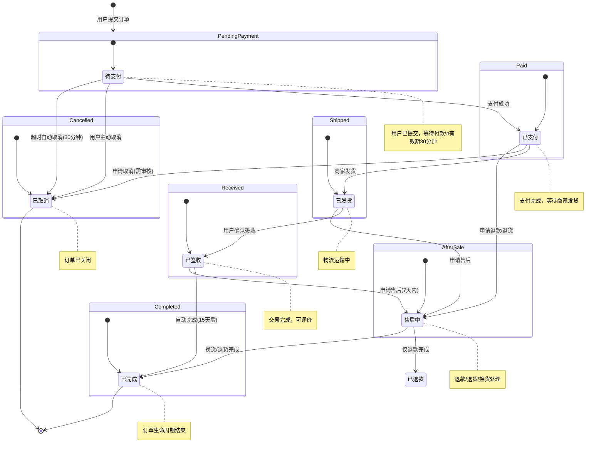
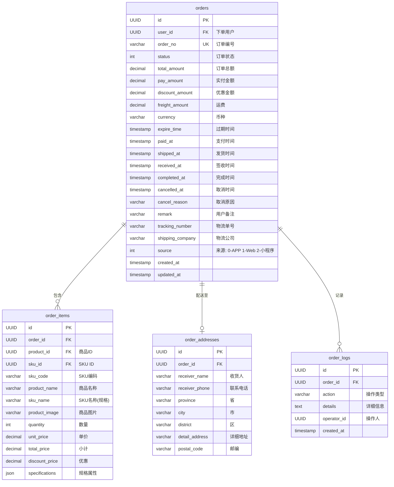
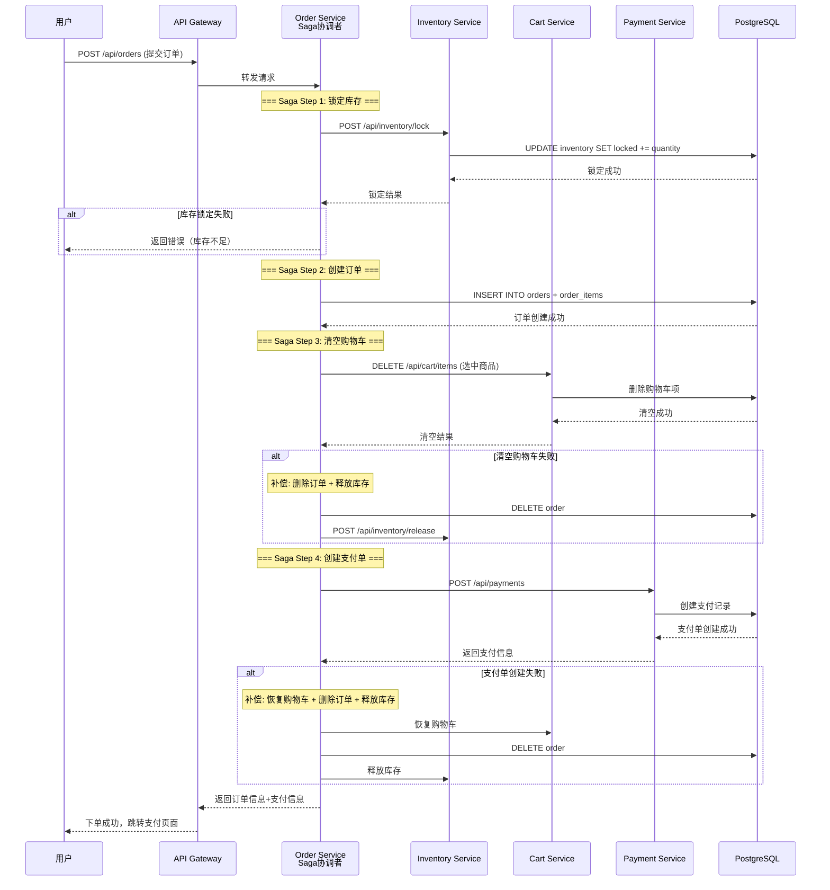

# CloudMall电商系统 - 订单服务(Order Service)

> **本篇导读**：本文深入讲解CloudMall订单服务的完整实现，包括订单状态机设计、下单全流程、Saga分布式事务编排、订单取消/退款/售后处理等核心业务逻辑。这是整个电商系统最复杂的业务服务，也是微服务架构中分布式事务的典型应用场景。

## 目录

- [1. 订单状态机设计](#1-订单状态机设计)
  - [1.1 状态定义与转换规则](#11-状态定义与转换规则)
  - [1.2 状态转换图（Mermaid）](#12-状态转换图mermaid)
  - [1.3 状态机实现](#13-状态机实现)
- [2. 订单数据模型](#2-订单数据模型)
- [3. 核心业务逻辑](#3-核心业务逻辑)
  - [3.1 下单全流程](#31-下单全流程)
  - [3.2 订单取消流程](#32-订单取消流程)
  - [3.3 发货/签收/售后](#33-发货签收售后)
- [4. Saga分布式事务编排](#4-saga分布式事务编排)
- [5. 完整代码实现](#5-完整代码实现)
- [6. 测试要点](#6-测试要点)

---

## 1. 订单状态机设计

### 1.1 状态定义与转换规则

CloudMall订单采用**有限状态机(FSM)**管理订单生命周期：



### 1.2 状态枚举与业务规则

```csharp
using System;

namespace CloudMall.Order.Domain.Enums
{
    /// <summary>
    /// 订单状态枚举
    /// </summary>
    public enum OrderStatus
    {
        /// <summary>待支付</summary>
        PendingPayment = 0,

        /// <summary>已支付</summary>
        Paid = 10,

        /// <summary>已发货</summary>
        Shipped = 20,

        /// <summary>已签收</summary>
        Received = 30,

        /// <summary>已完成</summary>
        Completed = 40,

        /// <summary>已取消</summary>
        Cancelled = 90,

        /// <summary>售后中</summary>
        AfterSale = 80,

        /// <summary>已退款</summary>
        Refunded = 91
    }

    /// <summary>
    /// 订单状态转换规则配置
    /// 定义每个状态可以转换到的目标状态集合
    /// </summary>
    public static class OrderStatusTransitions
    {
        private static readonly Dictionary<OrderStatus, HashSet<OrderStatus>>
            _validTransitions = new()
        {
            // 待支付状态可以转换为：
            { OrderStatus.PendingPayment, new()
                { OrderStatus.Paid, OrderStatus.Cancelled } },

            // 已支付状态可以转换为：
            { OrderStatus.Paid, new()
                { OrderStatus.Shipped, OrderStatus.Cancelled,
                  OrderStatus.AfterSale } },

            // 已发货状态可以转换为：
            { OrderStatus.Shipped, new()
                { OrderStatus.Received, OrderStatus.AfterSale } },

            // 已签收状态可以转换为：
            { OrderStatus.Received, new()
                { OrderStatus.Completed, OrderStatus.AfterSale } },

            // 售后中状态可以转换为：
            { OrderStatus.AfterSale, new()
                { OrderStatus.Refunded, OrderStatus.Completed } }
        };

        /// <summary>
        /// 验证状态转换是否合法
        /// </summary>
        public static bool CanTransition(
            OrderStatus from, OrderStatus to)
        {
            if (_validTransitions.TryGetValue(from, out var validTargets))
            {
                return validTargets.Contains(to);
            }
            return false;
        }

        /// <summary>
        /// 获取状态的所有合法目标状态
        /// </summary>
        public static IEnumerable<OrderStatus> GetValidTransitions(
            OrderStatus from)
        {
            return _validTransitions.TryGetValue(from, out var targets)
                ? targets : Enumerable.Empty<OrderStatus>();
        }

        /// <summary>
        /// 获取状态的显示名称
        /// </summary>
        public static string GetDisplayName(OrderStatus status)
        {
            return status switch
            {
                OrderStatus.PendingPayment => "待支付",
                OrderStatus.Paid => "已支付",
                OrderStatus.Shipped => "已发货",
                OrderStatus.Received => "已签收",
                OrderStatus.Completed => "已完成",
                OrderStatus.Cancelled => "已取消",
                OrderStatus.AfterSale => "售后中",
                OrderStatus.Refunded => "已退款",
                _ => "未知"
            };
        }
    }
}
```

### 1.3 状态机实现

```csharp
using System;
using System.Threading.Tasks;
using CloudMall.Order.Domain.Enums;
using CloudMall.Order.Domain.Events;
using Microsoft.Extensions.Logging;

namespace CloudMall.Order.Domain.Services
{
    /// <summary>
    /// 订单状态机
    /// 负责管理订单状态的生命周期和转换
    /// </summary>
    public class OrderStateMachine
    {
        private readonly ILogger<OrderStateMachine> _logger;
        private readonly IEventBus _eventBus;

        public OrderStateMachine(
            ILogger<OrderStateMachine> logger,
            IEventBus eventBus)
        {
            _logger = logger;
            _eventBus = eventBus;
        }

        /// <summary>
        /// 执行状态转换
        /// </summary>
        /// <param name="order">订单实体</param>
        /// <param name="targetStatus">目标状态</param>
        /// <param name="reason">变更原因</param>
        /// <param name="operatorId">操作人ID（系统操作为null）</param>
        /// <returns>是否转换成功</returns>
        public async Task<bool> TransitionAsync(
            Order order,
            OrderStatus targetStatus,
            string reason = null,
            Guid? operatorId = null)
        {
            var previousStatus = order.Status;

            // 1. 验证状态转换合法性
            if (!OrderStatusTransitions.CanTransition(previousStatus, targetStatus))
            {
                _logger.LogWarning(
                    "非法的状态转换尝试: OrderId={OrderId}, " +
                    "{From} -> {To}",
                    order.Id, previousStatus, targetStatus);

                throw new InvalidOperationException(
                    $"不允许从'{OrderStatusTransitions.GetDisplayName(previousStatus)}'" +
                    $"转换为'{OrderStatusTransitions.GetDisplayName(targetStatus)}'");
            }

            // 2. 执行状态转换前的业务校验
            await ValidateTransitionAsync(order, targetStatus);

            // 3. 更新状态
            order.Status = targetStatus;
            order.UpdatedAt = DateTime.UtcNow;

            // 4. 根据目标状态设置特定字段
            switch (targetStatus)
            {
                case OrderStatus.Paid:
                    order.PaidAt = DateTime.UtcNow;
                    break;
                case OrderStatus.Shipped:
                    order.ShippedAt = DateTime.UtcNow;
                    break;
                case OrderStatus.Received:
                    order.ReceivedAt = DateTime.UtcNow;
                    break;
                case OrderStatus.Completed:
                    order.CompletedAt = DateTime.UtcNow;
                    break;
                case OrderStatus.Cancelled:
                    order.CancelledAt = DateTime.UtcNow;
                    order.CancelReason = reason;
                    break;
            }

            // 5. 记录操作日志
            AddOrderLog(order, previousStatus, targetStatus, reason, operatorId);

            _logger.LogInformation(
                "订单状态变更: OrderId={OrderId}, {From} -> {To}, Reason={Reason}",
                order.Id,
                OrderStatusTransitions.GetDisplayName(previousStatus),
                OrderStatusTransitions.GetDisplayName(targetStatus),
                reason ?? "系统操作");

            // 6. 发布领域事件（异步）
            try
            {
                await PublishStatusChangedEventAsync(order, previousStatus);
            }
            catch (Exception ex)
            {
                _logger.LogWarning(ex,
                    "发布订单状态变更事件失败: OrderId={OrderId}", order.Id);
            }

            return true;
        }

        /// <summary>
        /// 状态转换前的业务校验
        /// </summary>
        private async Task ValidateTransitionAsync(
            Order order, OrderStatus targetStatus)
        {
            return targetStatus switch
            {
                // 支付前检查订单是否过期
                OrderStatus.Paid when order.IsExpired() =>
                    throw new InvalidOperationException("订单已过期，无法支付"),

                // 取消前检查是否允许取消
                OrderStatus.Cancelled when !order.CanCancel() =>
                    throw new InvalidOperationException("当前状态不允许取消"),

                // 发货前检查是否已支付
                OrderStatus.Shipped when order.Status != OrderStatus.Paid =>
                    throw new InvalidOperationException("只有已支付的订单才能发货"),

                // 签收前检查是否已发货
                OrderStatus.Received when order.Status != OrderStatus.Shipped =>
                    throw new InvalidOperationException("只有已发货的订单才能签收"),

                _ => Task.CompletedTask
            };
        }

        /// <summary>
        /// 添加订单操作日志
        /// </summary>
        private static void AddOrderLog(
            Order order,
            OrderStatus fromStatus,
            OrderStatus toStatus,
            string reason,
            Guid? operatorId)
        {
            order.Logs.Add(new OrderLog
            {
                Id = Guid.NewGuid(),
                OrderId = order.Id,
                Action = $"状态变更: " +
                    $"{OrderStatusTransitions.GetDisplayName(fromStatus)} -> " +
                    $"{OrderStatusTransitions.GetDisplayName(toStatus)}",
                Details = reason,
                OperatorId = operatorId,
                CreatedAt = DateTime.UtcNow
            });
        }

        /// <summary>
        /// 发布状态变更事件
        /// </summary>
        private async Task PublishStatusChangedEventAsync(
            Order order, OrderStatus previousStatus)
        {
            var @event = order.Status switch
            {
                OrderStatus.Paid => (object)new OrderPaidEvent
                {
                    OrderId = order.Id,
                    UserId = order.UserId,
                    TotalAmount = order.TotalAmount,
                    PaidAt = order.PaidAt.Value
                },
                OrderStatus.Cancelled => new OrderCancelledEvent
                {
                    OrderId = order.Id,
                    UserId = order.UserId,
                    Reason = order.CancelReason,
                    CancelledAt = order.CancelledAt.Value
                },
                OrderStatus.Shipped => new OrderShippedEvent
                {
                    OrderId = order.Id,
                    TrackingNumber = order.TrackingNumber,
                    ShippingCompany = order.ShippingCompany
                },
                _ => null
            };

            if (@event != null)
            {
                await _eventBus.PublishAsync(@event);
            }
        }
    }
}
```

---

## 2. 订单数据模型



#### 实体类定义

```csharp
using System;
using System.Collections.Generic;
using CloudMall.Order.Domain.Enums;

namespace CloudMall.Order.Domain.Entities
{
    /// <summary>
    /// 订单主表
    /// </summary>
    public class Order
    {
        public Guid Id { get; set; }

        /// <summary>
        /// 下单用户ID
        /// </summary>
        public Guid UserId { get; set; }

        /// <summary>
        /// 订单编号（唯一，格式：yyyyMMddHHmmss + 随机数）
        /// </summary>
        public string OrderNo { get; set; }

        /// <summary>
        /// 订单状态
        /// </summary>
        public OrderStatus Status { get; set; } = OrderStatus.PendingPayment;

        /// <summary>
        /// 订单总金额（商品总额 + 运费 - 优惠）
        /// </summary>
        public decimal TotalAmount { get; set; }

        /// <summary>
        /// 实付金额
        /// </summary>
        public decimal PayAmount { get; set; }

        /// <summary>
        /// 优惠金额
        /// </summary>
        public decimal DiscountAmount { get; set; } = 0;

        /// <summary>
        /// 运费
        /// </summary>
        public decimal FreightAmount { get; set; } = 0;

        /// <summary>
        /// 币种（默认CNY）
        /// </summary>
        public string Currency { get; set; } = "CNY";

        /// <summary>
        /// 订单过期时间（超时未支付自动取消）
        /// </summary>
        public DateTime? ExpireTime { get; set; }

        /// <summary>
        /// 支付时间
        /// </summary>
        public DateTime? PaidAt { get; set; }

        /// <summary>
        /// 发货时间
        /// </summary>
        public DateTime? ShippedAt { get; set; }

        /// <summary>
        /// 签收时间
        /// </summary>
        public DateTime? ReceivedAt { get; set; }

        /// <summary>
        /// 完成时间
        /// </summary>
        public DateTime? CompletedAt { get; set; }

        /// <summary>
        /// 取消时间
        /// </summary>
        public DateTime? CancelledAt { get; set; }

        /// <summary>
        /// 取消原因
        /// </summary>
        public string CancelReason { get; set; }

        /// <summary>
        /// 用户备注
        /// </summary>
        public string Remark { get; set; }

        /// <summary>
        /// 物流单号
        /// </summary>
        public string TrackingNumber { get; set; }

        /// <summary>
        /// 物流公司
        /// </summary>
        public string ShippingCompany { get; set; }

        /// <summary>
        /// 订单来源：0-APP 1-Web 2-小程序
        /// </summary>
        public OrderSource Source { get; set; }

        /// <summary>
        /// 创建时间
        /// </summary>
        public DateTime CreatedAt { get; set; } = DateTime.UtcNow;

        /// <summary>
        /// 更新时间
        /// </summary>
        public DateTime UpdatedAt { get; set; } = DateTime.UtcNow;

        // 导航属性
        public ICollection<OrderItem> Items { get; set; } = new List<OrderItem>();
        public OrderAddress Address { get; set; }
        public ICollection<OrderLog> Logs { get; set; } = new List<OrderLog>();

        #region 业务方法

        /// <summary>
        /// 判断订单是否已过期（待支付状态下有效）
        /// </summary>
        public bool IsExpired()
        {
            return Status == OrderStatus.PendingPayment &&
                   ExpireTime.HasValue &&
                   DateTime.UtcNow > ExpireTime.Value;
        }

        /// <summary>
        /// 判断订单是否可以取消
        /// </summary>
        public bool CanCancel()
        {
            return Status == OrderStatus.PendingPayment ||
                   Status == OrderStatus.Paid;
        }

        /// <summary>
        /// 判断订单是否可以申请售后
        /// </summary>
        public bool CanApplyAfterSale()
        {
            if (Status == OrderStatus.Paid || Status == OrderStatus.Shipped)
                return true;

            // 已签收7天内可申请售后
            if (Status == OrderStatus.Received && ReceivedAt.HasValue)
            {
                return (DateTime.UtcNow - ReceivedAt.Value).TotalDays <= 7;
            }

            return false;
        }

        /// <summary>
        /// 计算订单金额
        /// </summary>
        public void CalculateAmount(decimal freight = 0)
        {
            decimal itemsTotal = Items.Sum(i => i.TotalPrice);
            TotalAmount = itemsTotal + freight - DiscountAmount;
            FreightAmount = freight;
            PayAmount = TotalAmount;
        }

        #endregion
    }

    /// <summary>
    /// 订单明细项
    /// </summary>
    public class OrderItem
    {
        public Guid Id { get; set; }
        public Guid OrderId { get; set; }

        /// <summary>
        /// 商品ID（冗余存储，用于展示）
        /// </summary>
        public Guid ProductId { get; set; }

        /// <summary>
        /// SKU ID
        /// </summary>
        public Guid SkuId { get; set; }

        /// <summary>
        /// SKU编码
        /// </summary>
        public string SkuCode { get; set; }

        /// <summary>
        /// 商品名称（快照，防止商品改名后历史订单异常）
        /// </summary>
        public string ProductName { get; set; }

        /// <summary>
        /// SKU名称（如"黑色 128GB"）
        /// </summary>
        public string SkuName { get; set; }

        /// <summary>
        /// 商品图片URL（快照）
        /// </summary>
        public string ProductImage { get; set; }

        /// <summary>
        /// 购买数量
        /// </summary>
        public int Quantity { get; set; }

        /// <summary>
        /// 单价（下单时价格快照）
        /// </summary>
        public decimal UnitPrice { get; set; }

        /// <summary>
        /// 小计金额
        /// </summary>
        public decimal TotalPrice { get; set; }

        /// <summary>
        /// 该商品优惠金额
        /// </summary>
        public decimal DiscountPrice { get; set; } = 0;

        /// <summary>
        /// 规格属性JSON（快照）
        /// </summary>
        public string Specifications { get; set; }

        public Order Order { get; set; }
    }

    /// <summary>
    /// 订单收货地址（快照）
    /// </summary>
    public class OrderAddress
    {
        public Guid Id { get; set; }
        public Guid OrderId { get; set; }

        public string ReceiverName { get; set; }
        public string ReceiverPhone { get; set; }
        public string Province { get; set; }
        public string City { get; set; }
        public string District { get; set; }
        public string DetailAddress { get; set; }
        public string PostalCode { get; set; }

        public Order Order { get; set; }
    }

    /// <summary>
    /// 订单操作日志
    /// 用于审计追踪完整的订单生命周期
    /// </summary>
    public class OrderLog
    {
        public Guid Id { get; set; }
        public Guid OrderId { get; set; }

        /// <summary>
        /// 操作类型（状态变更/备注修改/地址修改等）
        /// </summary>
        public string Action { get; set; }

        /// <summary>
        /// 操作详情
        /// </summary>
        public string Details { get; set; }

        /// <summary>
        /// 操作人ID（系统操作为null）
        /// </summary>
        public Guid? OperatorId { get; set; }

        public DateTime CreatedAt { get; set; } = DateTime.UtcNow;
    }

    /// <summary>
    /// 订单来源枚举
    /// </summary>
    public enum OrderSource
    {
        App = 0,
        Web = 1,
        MiniProgram = 2
    }
}
```

---

## 3. 核心业务逻辑

### 3.1 下单全流程



#### OrderService下单实现

```csharp
using System;
using System.Collections.Generic;
using System.Linq;
using System.Threading.Tasks;
using Microsoft.Extensions.Logging;
using CloudMall.Order.Domain.Entities;
using CloudMall.Order.Domain.Enums;
using CloudMall.Service.Order.DTOs;
using CloudMall.Order.Infrastructure.Repositories;
using CloudMall.Order.Domain.Services;
using CloudMall.Order.Infrastructure.ExternalClients;

namespace CloudMall.Service.Order.Services
{
    /// <summary>
    /// 订单服务核心实现
    /// 包含下单、取消、状态管理等所有业务逻辑
    /// </summary>
    public class OrderService : IOrderService
    {
        private readonly IOrderRepository _orderRepo;
        private readonly IInventoryClient _inventoryClient;
        private readonly ICartClient _cartClient;
        private readonly IPaymentClient _paymentClient;
        private readonly IProductClient _productClient;
        private readonly OrderStateMachine _stateMachine;
        private readonly IEventBus _eventBus;
        private readonly ILogger<OrderService> _logger;

        // 配置常量
        private const int ORDER_EXPIRE_MINUTES = 30;

        public OrderService(
            IOrderRepository orderRepo,
            IInventoryClient inventoryClient,
            ICartClient cartClient,
            IPaymentClient paymentClient,
            IProductClient productClient,
            OrderStateMachine stateMachine,
            IEventBus eventBus,
            ILogger<OrderService> logger)
        {
            _orderRepo = orderRepo;
            _inventoryClient = inventoryClient;
            _cartClient = cartClient;
            _paymentClient = paymentClient;
            _productClient = productClient;
            _stateMachine = stateMachine;
            _eventBus = eventBus;
            _logger = logger;
        }

        /// <summary>
        /// 创建订单（Saga编排模式）
        /// 这是整个电商系统最核心的业务流程
        /// </summary>
        public async Task<CreateOrderResponseDto> CreateOrderAsync(
            Guid userId, CreateOrderRequestDto request)
        {
            _logger.LogInformation("开始创建订单: UserId={UserId}", userId);

            // ===== 前置校验 =====
            // 1. 校验收货地址
            if (request.AddressId == Guid.Empty)
                throw new BusinessException("请选择收货地址");

            // 2. 校验订单项不为空
            if (request.Items?.Any() != true)
                throw new BusinessException("订单不能为空");

            // ===== 开始Saga事务 =====
            var sagaContext = new SagaContext
            {
                SagaId = Guid.NewGuid(),
                UserId = userId,
                StartedAt = DateTime.UtcNow
            };

            try
            {
                // ---- Step 1: 锁定库存 ----
                _logger.LogDebug("[Saga:{SagaId}] Step 1: 开始锁定库存",
                    sagaContext.SagaId);

                var lockItems = request.Items.Select(item =>
                    new InventoryLockItemDto
                    {
                        ProductId = item.ProductId,
                        SkuId = item.SkuId,
                        Quantity = item.Quantity
                    }).ToList();

                var lockResult = await _inventoryClient.LockInventoryAsync(
                    new LockInventoryRequestDto
                    {
                        OrderId = sagaContext.SagaId,  // 用SagaId作为临时订单标识
                        Items = lockItems,
                        ExpiresInMinutes = ORDER_EXPIRE_MINUTES
                    });

                if (!lockResult.Success)
                {
                    _logger.LogWarning("[Saga:{SagaId}] 库存锁定失败: {Reason}",
                        sagaContext.SagaId, lockResult.ErrorMessage);
                    throw new BusinessException(
                        lockResult.ErrorMessage ?? "库存不足");
                }

                sagaContext.InventoryLocked = true;
                sagaContext.LockedInventoryItems = lockItems;
                _logger.LogDebug("[Saga:{SagaId}] 库存锁定成功",
                    sagaContext.SagaId);

                // ---- Step 2: 获取商品信息并构建订单 ----
                _logger.LogDebug("[Saga:{SagaId}] Step 2: 构建订单数据",
                    sagaContext.SagaId);

                var productIds = request.Items.Select(i => i.ProductId).ToList();
                var products = await _productClient
                    .GetProductsByIdsAsync(productIds);

                if (products == null || !products.Any())
                    throw new BusinessException("商品信息获取失败");

                // 构建订单实体
                var order = BuildOrderEntity(userId, request, products);
                order.ExpireTime = DateTime.UtcNow
                    .AddMinutes(ORDER_EXPIRE_MINUTES);

                // ---- Step 3: 保存订单到数据库 ----
                _logger.LogDebug("[Saga:{SagaId}] Step 3: 保存订单",
                    sagaContext.SagaId);

                await _orderRepo.AddAsync(order);
                sagaContext.OrderCreated = true;
                sagaContext.OrderId = order.Id;

                _logger.LogInformation(
                    "[Saga:{SagaId}] 订单创建成功: OrderNo={OrderNo}",
                    sagaContext.SagaId, order.OrderNo);

                // ---- Step 4: 清空购物车 ----
                _logger.LogDebug("[Saga:{SagaId}] Step 4: 清空购物车",
                    sagaContext.SagaId);

                var cartItemIds = request.Items
                    .Where(i => i.CartItemId.HasValue && i.CartItemId.Value != Guid.Empty)
                    .Select(i => i.CartItemId.Value)
                    .ToList();

                if (cartItemIds.Any())
                {
                    await _cartClient.ClearCartItemsAsync(
                        userId, cartItemIds);
                    sagaContext.CartCleared = true;
                }

                // ---- Step 5: 创建支付单 ----
                _logger.LogDebug("[Saga:{SagaId}] Step 5: 创建支付单",
                    sagaContext.SagaId);

                var paymentResult = await _paymentClient.CreatePaymentAsync(
                    new CreatePaymentRequestDto
                    {
                        OrderId = order.Id,
                        OrderNo = order.OrderNo,
                        Amount = order.PayAmount,
                        Subject = $"CloudMall订单-{order.OrderNo}",
                        UserId = userId,
                        PaymentChannel = request.PaymentChannel ?? "alipay"
                    });

                if (!paymentResult.Success)
                {
                    // 支付单创建失败，触发补偿
                    throw new SagaCompensationException(
                        "支付单创建失败", paymentResult.ErrorMessage);
                }

                sagaContext.PaymentCreated = true;

                // ===== Saga成功完成 =====
                _logger.LogInformation(
                    "[Saga:{SagaId}] 订单创建Saga执行成功! OrderId={OrderId}",
                    sagaContext.SagaId, order.Id);

                // 发布订单创建事件
                await _eventBus.PublishAsync(new OrderCreatedEvent
                {
                    OrderId = order.Id,
                    OrderNo = order.OrderNo,
                    UserId = userId,
                    TotalAmount = order.TotalAmount,
                    ItemCount = order.Items.Count,
                    CreatedAt = order.CreatedAt
                });

                // 返回响应
                return new CreateOrderResponseDto
                {
                    OrderId = order.Id,
                    OrderNo = order.OrderNo,
                    TotalAmount = order.TotalAmount,
                    Status = order.Status,
                    ExpireTime = order.ExpireTime.Value,
                    PaymentInfo = paymentResult.Data
                };
            }
            catch (SagaCompensationException ex)
            {
                // Saga步骤失败，执行补偿事务
                _logger.LogError(ex,
                    "[Saga:{SagaId}] Saga执行失败，开始补偿",
                    sagaContext.SagaId);

                await ExecuteCompensationAsync(sagaContext, ex.Message);

                throw new BusinessException(ex.Message ??
                    "订单创建失败，请重试");
            }
            catch (Exception ex)
            {
                _logger.LogError(ex,
                    "[Saga:{SagaId}] Saga发生未知错误", sagaContext.SagaId);

                await ExecuteCompensationAsync(sagaContext, "系统内部错误");
                throw new BusinessException("订单创建失败，请稍后重试");
            }
        }

        /// <summary>
        /// 构建订单实体
        /// </summary>
        private Order BuildOrderEntity(
            Guid userId,
            CreateOrderRequestDto request,
            List<ProductBriefDto> products)
        {
            var order = new Order
            {
                Id = Guid.NewGuid(),
                UserId = userId,
                OrderNo = GenerateOrderNo(),
                Status = OrderStatus.PendingPayment,
                Source = request.Source,
                Remark = request.Remark,
                CreatedAt = DateTime.UtcNow,
                UpdatedAt = DateTime.UtcNow
            };

            // 构建订单明细
            foreach (var item in request.Items)
            {
                var product = products.FirstOrDefault(p =>
                    p.Id == item.ProductId);
                if (product == null) continue;

                var sku = product.Skus?.FirstOrDefault(s =>
                    s.Id == item.SkuId);
                if (sku == null) continue;

                order.Items.Add(new OrderItem
                {
                    Id = Guid.NewGuid(),
                    OrderId = order.Id,
                    ProductId = item.ProductId,
                    SkuId = item.SkuId,
                    SkuCode = sku.SkuCode,
                    ProductName = product.Name,
                    SkuName = sku.SpecificationsDisplay ?? sku.SkuCode,
                    ProductImage = product.MainImageUrl,
                    Quantity = item.Quantity,
                    UnitPrice = sku.Price,
                    TotalPrice = sku.Price * item.Quantity,
                    Specifications = sku.SpecificationsJson
                });
            }

            // 构建收货地址
            order.Address = new OrderAddress
            {
                Id = Guid.NewGuid(),
                OrderId = order.Id,
                ReceiverName = request.ReceiverName,
                ReceiverPhone = request.ReceiverPhone,
                Province = request.Province,
                City = request.City,
                District = request.District,
                DetailAddress = request.DetailAddress,
                PostalCode = request.PostalCode
            };

            // 计算金额
            order.CalculateAmount(request.FreightAmount);

            return order;
        }

        /// <summary>
        /// 生成订单号
        /// 格式：年月日时分秒 + 6位随机数
        /// 示例：20260417223045837291
        /// </summary>
        private static string GenerateOrderNo()
        {
            var timestamp = DateTime.Now.ToString("yyyyMMddHHmmss");
            var random = Random.Shared.Next(100000, 999999);
            return $"{timestamp}{random}";
        }

        /// <summary>
        /// Saga补偿事务执行
        /// 按照相反顺序撤销已完成的步骤
        /// </summary>
        private async Task ExecuteCompensationAsync(
            SagaContext context, string errorMessage)
        {
            _logger.LogWarning(
                "[Saga:{SagaId}] 开始执行补偿事务", context.SagaId);

            var compensationErrors = new List<string>();

            // 补偿顺序：与执行顺序相反

            // 5. 如果支付单已创建 → 关闭支付单
            if (context.PaymentCreated)
            {
                try
                {
                    await _paymentClient.ClosePaymentAsync(context.OrderId);
                    _logger.LogDebug("[Saga:{SagaId}] 补偿: 支付单已关闭",
                        context.SagaId);
                }
                catch (Exception ex)
                {
                    compensationErrors.Add($"关闭支付单失败: {ex.Message}");
                    _logger.LogError(ex,
                        "[Saga:{SagaId}] 补偿失败: 关闭支付单", context.SagaId);
                }
            }

            // 4. 如果购物车已清空 → 恢复购物车
            if (context.CartCleared)
            {
                try
                {
                    // TODO: 实现购物车恢复逻辑
                    _logger.LogDebug("[Saga:{SagaId}] 补偿: 购物车已恢复",
                        context.SagaId);
                }
                catch (Exception ex)
                {
                    compensationErrors.Add($"恢复购物车失败: {ex.Message}");
                }
            }

            // 3. 如果订单已创建 → 删除订单
            if (context.OrderCreated && context.OrderId.HasValue)
            {
                try
                {
                    await _orderRepo.DeleteAsync(context.OrderId.Value);
                    _logger.LogDebug("[Saga:{SagaId}] 补偿: 订单已删除",
                        context.SagaId);
                }
                catch (Exception ex)
                {
                    compensationErrors.Add($"删除订单失败: {ex.Message}");
                    _logger.LogError(ex,
                        "[Saga:{SagaId}] 补偿失败: 删除订单", context.SagaId);
                }
            }

            // 1. 如果库存已锁定 → 释放库存
            if (context.InventoryLocked)
            {
                try
                {
                    await _inventoryClient.ReleaseInventoryAsync(
                        new ReleaseInventoryRequestDto
                        {
                            OrderId = context.SagaId,
                            Items = context.LockedInventoryItems
                        });
                    _logger.LogDebug("[Saga:{SagaId}] 补偿: 库存已释放",
                        context.SagaId);
                }
                catch (Exception ex)
                {
                    compensationErrors.Add($"释放库存失败: {ex.Message}");
                    _logger.LogError(ex,
                        "[Saga:{SagaId}] 补偿失败: 释放库存", context.SagaId);
                }
            }

            if (compensationErrors.Any())
            {
                _logger.LogError(
                    "[Saga:{SagaId}] 补偿事务部分失败: {Errors}",
                    context.SagaId,
                    string.Join("; ", compensationErrors));

                // 发送告警通知给运维人员
                await _eventBus.PublishAsync(new SagaCompensationFailedEvent
                {
                    SagaId = context.SagaId,
                    OriginalError = errorMessage,
                    CompensationErrors = compensationErrors,
                    OccurredAt = DateTime.UtcNow
                });
            }
            else
            {
                _logger.LogInformation(
                    "[Saga:{SagaId}] 补偿事务全部成功", context.SagaId);
            }
        }

        // ... 其他方法见后续章节
    }

    /// <summary>
    /// Saga上下文
    /// 跟踪Saga执行过程中的状态
    /// </summary>
    internal class SagaContext
    {
        public Guid SagaId { get; set; }
        public Guid UserId { get; set; }
        public DateTime StartedAt { get; set; }
        public Guid? OrderId { get; set; }

        // 各步骤完成标记
        public bool InventoryLocked { get; set; }
        public bool OrderCreated { get; set; }
        public bool CartCleared { get; set; }
        public bool PaymentCreated { get; set; }

        // 中间数据
        public List<InventoryLockItemDto> LockedInventoryItems { get; set; }
    }
}
```

### 3.2 订单取消流程

```csharp
/// <summary>
/// 取消订单
/// 支持用户主动取消和系统自动取消（超时）
/// </summary>
public async Task CancelOrderAsync(Guid orderId, Guid userId,
    string reason = null, bool isSystem = false)
{
    _logger.LogInformation("取消订单: OrderId={OrderId}, UserId={UserId}, " +
        "Reason={Reason}, IsSystem={IsSystem}",
        orderId, userId, reason, isSystem);

    // 1. 获取订单
    var order = await _orderRepo.GetByIdWithItemsAsync(orderId);
    if (order == null)
        throw new NotFoundException($"订单不存在: {orderId}");

    // 2. 权限校验（非系统操作需要验证所有权）
    if (!isSystem && order.UserId != userId)
        throw new ForbiddenException("无权操作此订单");

    // 3. 检查是否可取消
    if (!order.CanCancel())
        throw new BusinessException(
            $"当前订单状态({OrderStatusTransitions.GetDisplayName(order.Status)})" +
            "不允许取消");

    // 4. 执行状态转换
    await _stateMachine.TransitionAsync(order,
        OrderStatus.Cancelled,
        reason ?? (isSystem ? "超时未支付自动取消" : "用户主动取消"),
        isSystem ? null : userId);

    // 5. 释放锁定的库存（异步）
    try
    {
        var releaseItems = order.Items.Select(item =>
            new InventoryLockItemDto
            {
                ProductId = item.ProductId,
                SkuId = item.SkuId,
                Quantity = item.Quantity
            }).ToList();

        await _inventoryClient.ReleaseInventoryAsync(
            new ReleaseInventoryRequestDto
            {
                OrderId = orderId,
                Items = releaseItems
            });

        _logger.LogInformation("订单取消时库存已释放: OrderId={OrderId}", orderId);
    }
    catch (Exception ex)
    {
        _logger.LogError(ex,
            "订单取消但库存释放失败: OrderId={OrderId}，需手动处理",
            orderId);
        // 不影响主流程，后续通过人工或定时任务补偿
    }

    // 6. 如果已支付则发起退款
    if (order.PaidAt.HasValue && order.PayAmount > 0)
    {
        try
        {
            await _paymentClient.RefundAsync(new RefundRequestDto
            {
                OrderId = orderId,
                Amount = order.PayAmount,
                Reason = reason ?? "订单取消退款",
                RefundType = RefundType.Full
            });

            // 更新为已退款状态
            await _stateMachine.TransitionAsync(order,
                OrderStatus.Refunded, "订单取消已退款");
        }
        catch (Exception ex)
        {
            _logger.LogError(ex,
                "订单取消退款失败: OrderId={OrderId}，需人工处理",
                orderId);
        }
    }

    // 7. 保存更改
    await _orderRepo.UpdateAsync(order);

    _logger.LogInformation("订单取消成功: OrderId={OrderId}", orderId);
}

/// <summary>
/// 超时订单自动取消（后台任务调用）
/// 定期扫描过期的待支付订单并自动取消
/// </summary>
public async Task<int> CancelExpiredOrdersAsync(int batchSize = 100)
{
    _logger.LogInformation("开始扫描过期订单...");

    // 查找所有过期且未被处理的待支付订单
    var expiredOrders = await _orderRepo
        .GetExpiredPendingOrdersAsync(batchSize);

    int cancelledCount = 0;

    foreach (var order in expiredOrders)
    {
        try
        {
            await CancelOrderAsync(order.Id, Guid.Empty,
                $"订单超时自动取消（超过{ORDER_EXPIRE_MINUTES}分钟未支付）",
                isSystem: true);
            cancelledCount++;
        }
        catch (Exception ex)
        {
            _logger.LogError(ex,
                "自动取消过期订单失败: OrderId={OrderId}", order.Id);
        }
    }

    if (cancelledCount > 0)
    {
        _logger.LogInformation("本次共取消{Count}个过期订单", cancelledCount);
    }

    return cancelledCount;
}
```

### 3.3 发货/签收/售后

```csharp
/// <summary>
/// 订单发货（商家操作）
/// </summary>
public async Task ShipOrderAsync(Guid orderId, ShipOrderRequestDto request)
{
    var order = await _orderRepo.GetByIdAsync(orderId);
    if (order == null)
        throw new NotFoundException($"订单不存在: {orderId}");

    if (order.Status != OrderStatus.Paid)
        throw new BusinessException("只有已支付的订单才能发货");

    if (string.IsNullOrWhiteSpace(request.TrackingNumber))
        throw new BusinessException("物流单号不能为空");

    if (string.IsNullOrWhiteSpace(request.ShippingCompany))
        throw new BusinessException("物流公司不能为空");

    order.TrackingNumber = request.TrackingNumber;
    order.ShippingCompany = request.ShippingCompany;

    await _stateMachine.TransitionAsync(order, OrderStatus.Shipped,
        $"发货: {request.ShippingCompany} - {request.TrackingNumber}");

    await _orderRepo.UpdateAsync(order);
}

/// <summary>
/// 确认签收（用户操作）
/// </summary>
public async Task ConfirmReceiptAsync(Guid orderId, Guid userId)
{
    var order = await _orderRepo.GetByIdAsync(orderId);
    if (order == null)
        throw new NotFoundException($"订单不存在: {orderId}");

    if (order.UserId != userId)
        throw new ForbiddenException("无权操作此订单");

    if (order.Status != OrderStatus.Shipped)
        throw new BusinessException("只有已发货的订单才能确认签收");

    await _stateMachine.TransitionAsync(order, OrderStatus.Received,
        "用户确认签收");

    await _orderRepo.UpdateAsync(order);
}

/// <summary>
/// 申请售后（用户操作）
/// </summary>
public async Task ApplyAfterSaleAsync(Guid orderId, Guid userId,
    AfterSaleRequestDto request)
{
    var order = await _orderRepo.GetByIdWithItemsAsync(orderId);
    if (order == null)
        throw new NotFoundException($"订单不存在: {orderId}");

    if (order.UserId != userId)
        throw new ForbiddenException("无权操作此订单");

    if (!order.CanApplyAfterSale())
        throw new BusinessException("当前订单状态不支持申请售后");

    // 创建售后记录
    var afterSale = new AfterSaleRecord
    {
        Id = Guid.NewGuid(),
        OrderId = orderId,
        Type = request.Type,           // 退款/退货/换货
        Reason = request.Reason,
        Description = request.Description,
        Images = request.Images,       // 凭证图片
        RefundAmount = request.RefundAmount,
        Status = AfterSaleStatus.Pending,
        CreatedAt = DateTime.UtcNow
    };

    // 转换为售后中状态
    await _stateMachine.TransitionAsync(order, OrderStatus.AfterSale,
        $"申请售后: {request.Type}");

    await _orderRepo.UpdateAsync(order);

    _logger.LogInformation("售后申请已提交: OrderId={OrderId}, Type={Type}",
        orderId, request.Type);
}
```

---

## 4. Saga分布式事务编排

### 4.1 Saga状态持久化

```csharp
/// <summary>
/// Saga状态持久化仓储
/// 将Saga执行过程保存到数据库，支持故障恢复
/// </summary>
public interface ISagaStateRepository
{
    Task<SagaState> CreateAsync(SagaState state);
    Task<SagaState> GetByIdAsync(Guid sagaId);
    Task UpdateStepStatusAsync(Guid sagaId, string stepName,
        SagaStepStatus status, string errorMessage = null);
    Task<List<SagaState>> GetPendingCompensationAsync();
    Task MarkCompletedAsync(Guid sagaId);
}

/// <summary>
/// Saga状态实体
/// </summary>
public class SagaState
{
    public Guid Id { get; set; }              // Saga实例ID
    public string SagaType { get; set; }      // Saga类型（CreateOrder）
    public Guid UserId { get; set; }          // 触发用户
    public Guid? OrderId { get; set; }        // 关联订单ID
    public SagaStatus Status { get; set; }    // 整体状态
    public string CurrentStep { get; set; }   // 当前步骤
    public string Payload { get; set; }       // 请求数据（JSON）
    public string Result { get; set; }        // 结果数据（JSON）
    public string ErrorMessages { get; set; } // 错误信息
    public DateTime StartedAt { get; set; }
    public DateTime? CompletedAt { get; set; }
    public DateTime CreatedAt { get; set; }

    // 步骤状态
    public ICollection<SagaStepState> Steps { get; set; }
}

public class SagaStepState
{
    public Guid Id { get; set; }
    public Guid SagaId { get; set; }
    public string StepName { get; set; }      // LockInventory/CreateOrder等
    public SagaStepStatus Status { get; set; } // Pending/Started/Completed/Failed/Compensating/Compensated
    public DateTime? StartedAt { get; set; }
    public DateTime? CompletedAt { get; set; }
    public string RequestData { get; set; }   // 请求数据
    public string ResponseData { get; set; }  // 响应数据
    public string ErrorMessage { get; set; }
    public int RetryCount { get; set; }       // 重试次数
}

public enum SagaStatus
{
    Started,
    Completed,
    Failed,
    Compensating,
    CompensationFailed
}

public enum SagaStepStatus
{
    Pending,
    Started,
    Completed,
    Failed,
    Compensating,
    Compensated
}
```

### 4.2 SagaOrchestrator完整实现

```csharp
/// <summary>
/// Saga编排器
/// 中央协调器模式，统一指挥各步骤的执行与补偿
/// </summary>
public class SagaOrchestrator
{
    private readonly ISagaStateRepository _sagaStateRepo;
    private readonly IServiceScopeFactory _scopeFactory;
    private readonly ILogger<SagaOrchestrator> _logger;

    // 步骤定义
    private readonly List<SagaStepDefinition> _steps = new()
    {
        new() { Name = "LockInventory", Execute = ExecuteLockInventoryAsync,
               Compensate = CompensateLockInventoryAsync },
        new() { Name = "CreateOrder", Execute = ExecuteCreateOrderAsync,
               Compensate = CompensateCreateOrderAsync },
        new() { Name = "ClearCart", Execute = ExecuteClearCartAsync,
               Compensate = CompensateClearCartAsync },
        new() { Name = "CreatePayment", Execute = ExecuteCreatePaymentAsync,
               Compensate = CompensateCreatePaymentAsync }
    };

    public SagaOrchestrator(
        ISagaStateRepository sagaStateRepo,
        IServiceScopeFactory scopeFactory,
        ILogger<SagaOrchestrator> logger)
    {
        _sagaStateRepo = sagaStateStateRepo;
        _scopeFactory = scopeFactory;
        _logger = logger;
    }

    /// <summary>
    /// 启动Saga流程
    /// </summary>
    public async Task<SagaResult> StartAsync<T>(T request) where T : ISagaRequest
    {
        var sagaId = Guid.NewGuid();

        // 1. 创建Saga状态记录
        var sagaState = new SagaState
        {
            Id = sagaId,
            SagaType = typeof(T).Name,
            UserId = request.UserId,
            Status = SagaStatus.Started,
            CurrentStep = _steps[0].Name,
            Payload = JsonSerializer.Serialize(request),
            StartedAt = DateTime.UtcNow,
            CreatedAt = DateTime.UtcNow,
            Steps = _steps.Select((s, i) => new SagaStepState
            {
                Id = Guid.NewGuid(),
                SagaId = sagaId,
                StepName = s.Name,
                Status = SagaStepStatus.Pending,
                SortOrder = i
            }).ToList()
        };

        await _sagaStateRepo.CreateAsync(sagaState);

        _logger.LogInformation("[Saga:{SagaId}] 流程启动: Type={Type}",
            sagaId, sagaState.SagaType);

        // 2. 按序执行各步骤
        var completedSteps = new List<string>();

        try
        {
            for (int i = 0; i < _steps.Count; i++)
            {
                var step = _steps[i];
                sagaState.CurrentStep = step.Name;

                // 更新步骤状态为 Started
                await _sagaStateRepo.UpdateStepStatusAsync(
                    sagaId, step.Name, SagaStepStatus.Started);

                _logger.LogDebug("[Saga:{SagaId}] 执行步骤 {Step}/{Total}: {StepName}",
                    sagaId, i + 1, _steps.Count, step.Name);

                // 执行步骤
                var stepResult = await step.Execute(sagaState, request);

                // 更新步骤状态为 Completed
                await _sagaStateRepo.UpdateStepStatusAsync(
                    sagaId, step.Name, SagaStepStatus.Completed);

                completedSteps.Add(step.Name);
            }

            // 所有步骤成功完成
            sagaState.Status = SagaStatus.Completed;
            sagaState.CompletedAt = DateTime.UtcNow;
            await _sagaStateRepo.MarkCompletedAsync(sagaId);

            _logger.LogInformation("[Saga:{SagaId}] 流程执行成功!",
                sagaId);

            return new SagaResult { Success = true, SagaId = sagaId };
        }
        catch (Exception ex)
        {
            _logger.LogError(ex,
                "[Saga:{SagaId}] 步骤 {Step} 失败，开始补偿",
                sagaId, sagaState.CurrentStep);

            // 执行补偿事务
            var compensationResult = await CompensateAsync(
                sagaId, completedSteps, ex.Message);

            sagaState.Status = compensationResult.AllCompensated
                ? SagaStatus.Failed
                : SagaStatus.CompensationFailed;
            sagaState.ErrorMessages = ex.Message;
            sagaState.CompletedAt = DateTime.UtcNow;
            await _sagaStateRepo.UpdateAsync(sagaState);

            return new SagaResult
            {
                Success = false,
                SagaId = sagaId,
                Error = ex.Message,
                CompensationSucceeded = compensationResult.AllCompensated
            };
        }
    }

    /// <summary>
    /// 补偿事务执行
    /// 按逆序执行已完成步骤的补偿操作
    /// </summary>
    private async Task<CompensationResult> CompensateAsync(
        Guid sagaId,
        List<string> completedSteps,
        string originalError)
    {
        _logger.LogWarning("[Saga:{SagaId}] 开始补偿，已完成步骤: {Steps}",
            sagaId, string.Join(", ", completedSteps));

        var errors = new List<string>();

        // 按逆序补偿
        for (int i = completedSteps.Count - 1; i >= 0; i--)
        {
            var stepName = completedSteps[i];
            var stepDef = _steps.First(s => s.Name == stepName);

            _logger.LogDebug("[Saga:{SagaId}] 补偿步骤: {Step}",
                sagaId, stepName);

            try
            {
                await _sagaStateRepo.UpdateStepStatusAsync(
                    sagaId, stepName, SagaStepStatus.Compensating);

                await stepDef.Compensate(sagaId);

                await _sagaStateRepo.UpdateStepStatusAsync(
                    sagaId, stepName, SagaStepStatus.Compensated);

                _logger.LogDebug("[Saga:{SagaId}] 补偿成功: {Step}",
                    sagaId, stepName);
            }
            catch (Exception compEx)
            {
                errors.Add($"{stepName}: {compEx.Message}");
                _logger.LogError(compEx,
                    "[Saga:{SagaId}] 补偿失败: {Step}, 错误: {Error}",
                    sagaId, stepName, compEx.Message);

                // 继续尝试补偿其他步骤（不中断）
            }
        }

        return new CompensationResult
        {
            AllCompensated = errors.Count == 0,
            Errors = errors
        };
    }

    // 各步骤的具体实现...

    private async Task<object> ExecuteLockInventoryAsync(
        SagaState state, ISagaRequest request)
    {
        using var scope = _scopeFactory.CreateScope();
        var inventoryClient = scope.ServiceProvider
            .GetRequiredService<IInventoryClient>();
        var createOrderReq = (CreateOrderSagaRequest)request;

        return await inventoryClient.LockInventoryAsync(...);
    }

    private async Task CompensateLockInventoryAsync(Guid sagaId)
    {
        using var scope = _scopeFactory.CreateScope();
        var inventoryClient = scope.ServiceProvider
            .GetRequiredService<IInventoryClient>();
        await inventoryClient.ReleaseInventoryAsync(...);
    }

    // ... 其他步骤实现类似
}
```

---

## 5. 完整代码实现

### 5.1 OrderController API控制器

```csharp
using System;
using System.Threading.Tasks;
using Microsoft.AspNetCore.Authorization;
using Microsoft.AspNetCore.Mvc;
using CloudMall.Service.Order.DTOs;
using CloudMall.Service.Order.Services;

namespace CloudMall.Service.Order.Controllers
{
    [ApiController]
    [Route("api/[controller]")]
    [Produces("application/json")]
    public class OrdersController : ControllerBase
    {
        private readonly IOrderService _orderService;

        public OrdersController(IOrderService orderService)
        {
            _orderService = orderService;
        }

        /// <summary>
        /// 创建订单
        /// POST /api/orders
        /// </summary>
        [HttpPost]
        [Authorize]
        [ProducesResponseType(typeof(CreateOrderResponseDto), 201)]
        public async Task<ActionResult<CreateOrderResponseDto>> CreateOrder(
            [FromBody] CreateOrderRequestDto request)
        {
            var userId = GetCurrentUserId();
            var result = await _orderService.CreateOrderAsync(userId, request);
            return StatusCode(201, result);
        }

        /// <summary>
        /// 获取订单列表
        /// GET /api/orders?page=1&size=20&status=0
        /// </summary>
        [HttpGet]
        [Authorize]
        public async Task<ActionResult<PagedResponseDto<OrderListDto>>> GetOrders(
            [FromQuery] OrderQueryDto query)
        {
            var userId = GetCurrentUserId();
            query.UserId = userId;  // 只能查看自己的订单
            var result = await _orderService.GetPagedAsync(query);
            return Ok(result);
        }

        /// <summary>
        /// 获取订单详情
        /// GET /api/orders/{id}
        /// </summary>
        [HttpGet("{id:guid}")]
        [Authorize]
        public async Task<ActionResult<OrderDetailDto>> GetOrderDetail(Guid id)
        {
            var userId = GetCurrentUserId();
            var order = await _orderService.GetByIdAsync(id, userId);
            if (order == null)
                return NotFound(new { error = "订单不存在" });
            return Ok(order);
        }

        /// <summary>
        /// 取消订单
        /// POST /api/orders/{id}/cancel
        /// </summary>
        [HttpPost("{id:guid}/cancel")]
        [Authorize]
        public async Task<IActionResult> CancelOrder(
            Guid id, [FromBody] CancelOrderDto dto)
        {
            var userId = GetCurrentUserId();
            await _orderService.CancelOrderAsync(id, userId, dto?.Reason);
            return Ok(new { message = "订单已取消" });
        }

        /// <summary>
        /// 确认签收
        /// POST /api/orders/{id}/confirm-receipt
        /// </summary>
        [HttpPost("{id:guid}/confirm-receipt")]
        [Authorize]
        public async Task<IActionResult> ConfirmReceipt(Guid id)
        {
            var userId = GetCurrentUserId();
            await _orderService.ConfirmReceiptAsync(id, userId);
            return Ok(new { message = "签收成功" });
        }

        /// <summary>
        /// 申请售后
        /// POST /api/orders/{id}/after-sale
        /// </summary>
        [HttpPost("{id:guid}/after-sale")]
        [Authorize]
        public async Task<IActionResult> ApplyAfterSale(
            Guid id, [FromBody] AfterSaleRequestDto dto)
        {
            var userId = GetCurrentUserId();
            await _orderService.ApplyAfterSaleAsync(id, userId, dto);
            return Ok(new { message = "售后申请已提交" });
        }

        private Guid GetCurrentUserId()
        {
            var claim = User.FindFirst("sub")?.Value;
            if (!Guid.TryParse(claim, out var userId))
                throw new UnauthorizedException("无效的用户凭证");
            return userId;
        }
    }
}
```

### 5.2 DTO定义

```csharp
// 创建订单请求
public class CreateOrderRequestDto
{
    [Required]
    public List<CreateOrderItemDto> Items { get; set; }

    [Required]
    public Guid AddressId { get; set; }

    public string Remark { get; set; }
    public decimal FreightAmount { get; set; }
    public string PaymentChannel { get; set; } = "alipay";
    public OrderSource Source { get; set; } = OrderSource.Web;

    // 收货地址信息（如果不用AddressId）
    public string ReceiverName { get; set; }
    public string ReceiverPhone { get; set; }
    public string Province { get; set; }
    public string City { get; set; }
    public string District { get; set; }
    public string DetailAddress { get; set; }
    public string PostalCode { get; set; }
}

public class CreateOrderItemDto
{
    [Required]
    public Guid ProductId { get; set; }
    [Required]
    public Guid SkuId { get; set; }
    [Range(1, 999)]
    public int Quantity { get; set; }
    public Guid? CartItemId { get; set; }  // 来自购物车的项ID
}

// 创建订单响应
public class CreateOrderResponseDto
{
    public Guid OrderId { get; set; }
    public string OrderNo { get; set; }
    public decimal TotalAmount { get; set; }
    public OrderStatus Status { get; set; }
    public DateTime ExpireTime { get; set; }
    public PaymentInfoDto PaymentInfo { get; set; }
}

// 订单列表项
public class OrderListDto
{
    public Guid Id { get; set; }
    public string OrderNo { get; set; }
    public OrderStatus Status { get; set; }
    public string StatusText { get; set; }
    public decimal TotalAmount { get; set; }
    public int ItemCount { get; set; }
    public string MainProductImage { get; set; }
    public DateTime CreatedAt { get; set; }
    public DateTime? ExpireTime { get; set; }
}

// 订单详情
public class OrderDetailDto
{
    public Guid Id { get; set; }
    public string OrderNo { get; set; }
    public OrderStatus Status { get; set; }
    public string StatusText { get; set; }
    public decimal TotalAmount { get; set; }
    public decimal PayAmount { get; set; }
    public decimal FreightAmount { get; set; }
    public decimal DiscountAmount { get; set; }
    public AddressDto Address { get; set; }
    public List<OrderItemDto> Items { get; set; }
    public List<OrderLogDto> Logs { get; set; }
    public DateTime CreatedAt { get; set; }
    public DateTime? ExpireTime { get; set; }
    public DateTime? PaidAt { get; set; }
    public string TrackingNumber { get; set; }
    public string ShippingCompany { get; set; }
    public bool CanCancel { get; set; }
    public bool CanApplyAfterSale { get; set; }
}
```

---

## 6. 测试要点

### 6.1 单元测试重点

| 测试场景 | 输入 | 预期输出 | 优先级 |
|---------|------|---------|--------|
| 正常下单 | 有效商品+充足库存 | 订单创建成功 | P0 |
| 库存不足下单 | 超出库存数量 | 返回库存不足错误 | P0 |
| 订单状态机转换 | 合法转换 | 状态更新成功 | P0 |
| 非法状态转换 | 不允许的转换 | 抛出InvalidOperationException | P0 |
| 用户主动取消 | 待支付订单 | 订单取消+库存释放 | P0 |
| 超时自动取消 | 过期30分钟的订单 | 自动取消 | P0 |
| 已支付订单取消 | 已支付订单 | 订单取消+退款 | P1 |
| Saga补偿 | Step3失败 | Step1/2已补偿 | P0 |
| 并发下单 | 同一商品同时下单 | 无超卖 | P0 |

### 6.2 集成测试场景

```csharp
// Saga下单集成测试示例
[Fact]
public async Task CreateOrder_WithValidData_CompletesSagaSuccessfully()
{
    // Arrange: Mock外部服务返回成功
    _mockInventoryClient.Setup(x => x.LockInventoryAsync(It.IsAny<>()))
        .ReturnsAsync(new InventoryLockResult { Success = true });
    _mockCartClient.Setup(x => x.ClearCartItemsAsync(It.IsAny<>()))
        .Returns(Task.CompletedTask);
    _mockPaymentClient.Setup(x => x.CreatePaymentAsync(It.IsAny<>()))
        .ReturnsAsync(new PaymentCreateResult { Success = true, Data = new() });

    // Act
    var result = await _service.CreateOrderAsync(_userId, _validRequest);

    // Assert
    Assert.NotNull(result);
    Assert.Equal(OrderStatus.PendingPayment, result.Status);
    Assert.NotNull(result.PaymentInfo);
    _mockInventoryClient.Verify(x => x.LockInventoryAsync(It.IsAny<>()), Times.Once);
    _mockPaymentClient.Verify(x => x.CreatePaymentAsync(It.IsAny<>()), Times.Once);
}

[Fact]
public async Task CreateOrder_WhenPaymentFails_CompensatesPreviousSteps()
{
    // Arrange: 支付服务返回失败
    _mockInventoryClient.Setup(x => x.LockInventoryAsync(It.IsAny<>()))
        .ReturnsAsync(new InventoryLockResult { Success = true });
    _mockPaymentClient.Setup(x => x.CreatePaymentAsync(It.IsAny<>()))
        .ReturnsAsync(new PaymentCreateResult
        {
            Success = false,
            ErrorMessage = "支付渠道不可用"
        });

    // Act & Assert
    await Assert.ThrowsAsync<BusinessException>(
        () => _service.CreateOrderAsync(_userId, _validRequest));

    // 验证补偿操作被调用
    _mockInventoryClient.Verify(x => x.ReleaseInventoryAsync(It.IsAny<>()), Times.Once);
}
```

---

## 总结

本文详细讲解了CloudMall订单服务的完整实现，涵盖了电商系统中最复杂的业务逻辑：

1. **订单状态机**：7种状态、合法转换规则、状态机引擎实现
2. **下单全流程**：5步Saga编排（锁定库存→创建订单→清空购物车→创建支付单→返回结果）
3. **订单取消**：主动取消/超时自动取消+库存释放+退款处理
4. **Saga分布式事务**：中央协调器模式、状态持久化、补偿事务机制
5. **售后服务**：退款/退货/换货申请流程

**下一篇预告**：[05-购物车服务(Cart Service)](./05-购物车服务(Cart%20Service).md) - 深入讲解购物车的Redis存储方案、游客购物车合并、并发控制等。

---

> **双向链接**：
> - [[../03-进阶篇/07-设计模式实战]] - 设计模式在订单服务中的应用
> - [[02-系统架构与技术选型](./01-系统架构与技术选型.md)] - 项目整体架构
> - [[09-Saga分布式事务实战](./09-Saga分布式事务实战.md)] - Saga模式深度解析
> - [[05-购物车服务(Cart Service)](./05-购物车服务(Cart%20Service).md)] - 下一篇文章
