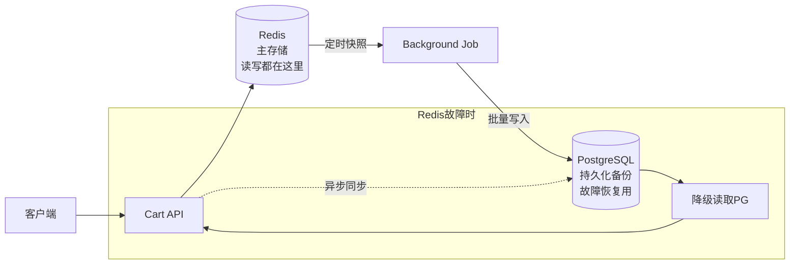
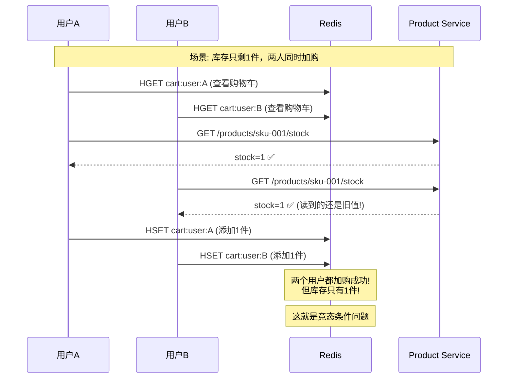

# CloudMall电商系统 - 购物车服务(Cart Service)

> **本篇导读**：本文深入讲解CloudMall购物车服务的完整实现，包括购物车数据模型设计、Redis Hash存储方案、游客与登录用户购物车合并、并发控制策略以及过期清理机制。购物车是电商系统中高频访问的服务，对性能和一致性要求极高。

## 目录

- [1. 购物车数据模型](#1-购物车数据模型)
  - [1.1 CartItem商品项设计](#11-cartitem商品项设计)
  - [1.2 游客购物车 vs 登录用户购物车](#12-游客购物车-vs-登录用户购物车)
- [2. 存储方案选择](#2-存储方案选择)
  - [2.1 Redis Hash方案详解](#21-redis-hash方案详解)
  - [2.2 PostgreSQL持久化方案](#22-postgresql持久化方案)
  - [2.3 混合存储架构](#23-混合存储架构)
- [3. 核心功能实现](#3-核心功能实现)
  - [3.1 添加商品到购物车](#31-添加商品到购物车)
  - [3.2 修改商品数量](#32-修改商品数量)
  - [3.3 删除商品/清空购物车](#33-删除商品清空购物车)
  - [3.4 选中/全选/反选](#34-选中全选反选)
  - [3.5 游客购物车合并](#35-游客购物车合并)
- [4. 并发控制方案](#4-并发控制方案)
- [5. 过期清理机制](#5-过期清理机制)
- [6. 完整代码实现](#6-完整代码实现)
- [7. 测试要点](#7-测试要点)

---

## 1. 购物车数据模型

### 1.1 CartItem商品项设计

```csharp
using System;

namespace CloudMall.Cart.Domain.Entities
{
    /// <summary>
    /// 购物车商品项
    /// </summary>
    public class CartItem
    {
        /// <summary>
        /// 商品ID
        /// </summary>
        public Guid ProductId { get; set; }

        /// <summary>
        /// SKU ID（具体规格）
        /// </summary>
        public Guid SkuId { get; set; }

        /// <summary>
        /// SKU编码
        /// </summary>
        public string SkuCode { get; set; }

        /// <summary>
        /// 商品名称（快照）
        /// </summary>
        public string ProductName { get; set; }

        /// <summary>
        /// SKU规格名称（如"黑色 128GB"）
        /// </summary>
        public string SkuName { get; set; }

        /// <summary>
        /// 商品图片URL（快照）
        /// </summary>
        public string ProductImage { get; set; }

        /// <summary>
        /// 购买数量
        /// </summary>
        public int Quantity { get; set; }

        /// <summary>
        /// 单价（快照，下单时以实际价格为准）
        /// </summary>
        public decimal UnitPrice { get; set; }

        /// <summary>
        /// 是否选中（用于结算）
        /// </summary>
        public bool IsSelected { get; set; } = true;

        /// <summary>
        /// 加入购物车时间
        /// </summary>
        public DateTime AddedAt { get; set; } = DateTime.UtcNow;

        /// <summary>
        /// 最后更新时间
        /// </summary>
        public DateTime UpdatedAt { get; set; } = DateTime.UtcNow;

        /// <summary>
        /// 库存状态：0-有货 1-缺货 2-下架
        /// </summary>
        public int StockStatus { get; set; } = 0;
    }
}
```

### 1.2 游客购物车 vs 登录用户购物车

```mermaid
graph TB
    subgraph "游客模式"
        G[游客浏览器] --> GC[Guest Cart<br/>Key: cart:guest:{sessionId}]
        GC --> RD[(Redis)]
    end

    subgraph "登录模式"
        U[已登录用户] --> UC[User Cart<br/>Key: cart:user:{userId}]
        UC --> RD
    end

    G -->|点击登录| L[Login]
    L -->|携带SessionId| M[Merge Service]
    M --> GC
    M --> UC
    M -->|合并完成| RD

    note1["合并规则:<br/>1. 以用户购物车为准<br/>2. 游客独有的商品追加<br/>3. 同一SKU数量相加<br/>4. 合并后删除游客购物车"]
```

---

## 2. 存储方案选择

### 2.1 Redis Hash方案详解

**为什么选择Redis作为主存储？**

| 对比维度 | PostgreSQL | Redis |
|---------|-----------|-------|
| 读写性能 | ~10ms (磁盘IO) | ~0.1ms (内存) |
| 数据结构 | 关系表 | Hash/List |
| 并发能力 | 行锁开销大 | 原子操作 |
| 持久性 | 强一致 | 可配置(RDB/AOF) |
| 适用场景 | 订单等核心数据 | 购物车/会话等临时数据 |

#### Redis Key设计规范

```
# 用户购物车
cart:user:{userId}
  → Hash {
      "{skuId}": "{JSON序列化的CartItem}",
      ...
    }

# 游客购物车
cart:guest:{sessionId}
  → Hash {
      "{skuId}": "{JSON序列化的CartItem}",
      ...
    }

# 购物车计数（用于快速判断是否为空）
cart:count:{userId} → Integer

# 购物车版本号（用于乐观锁）
cart:version:{userId} → Integer
```

### 2.2 Redis数据结构示例

```bash
# 用户 550e8400-e29b-41d4-a716-446655440000 的购物车
HGETALL cart:user:550e8400-e29b-41d4-a716-446655440000

# 返回结果：
# 1) "a1b2c3d4-sku-id-001"
# 2) "{\"ProductId\":\"...\",\"SkuId\":\"a1b2c3d4\",\"SkuCode\":\"SKU-001\",\"ProductName\":\"iPhone 15 Pro\",\"SkuName\":\"黑色 128GB\",\"ProductImage\":\"https://...\",\"Quantity\":2,\"UnitPrice\":8999.00,\"IsSelected\":true,\"AddedAt\":\"2026-04-17T10:30:00Z\"}"
# 3) "e5f6g7h8-sku-id-002"
# 4) "{\"ProductId\":\"...\",\"SkuId\":\"e5f6g7h8\",...}"

# 购物车商品数量
GET cart:count:550e8400-e29b-41d4-a716-446655440000
# 返回: "2"
```

### 2.3 混合存储架构



---

## 3. 核心功能实现

### 3.1 Redis购物车服务核心代码

```csharp
using System;
using System.Collections.Generic;
using System.Linq;
using System.Text.Json;
using System.Threading.Tasks;
using Microsoft.Extensions.Logging;
using StackExchange.Redis;
using CloudMall.Service.Cart.DTOs;

namespace CloudMall.Cart.Infrastructure.Redis
{
    /// <summary>
    /// Redis购物车仓储实现
    /// 使用Hash结构存储购物车数据
    /// </summary>
    public class RedisCartRepository : ICartRepository
    {
        private readonly IDatabase _redis;
        private readonly ILogger<RedisCartRepository> _logger;

        // Key前缀
        private const string USER_CART_PREFIX = "cart:user:";
        private const string GUEST_CART_PREFIX = "cart:guest:";
        private const string COUNT_PREFIX = "cart:count:";
        private const string VERSION_PREFIX = "cart:version:";

        // 配置
        private const int MAX_CART_ITEMS = 100;         // 最大商品数
        private const int MAX_ITEM_QUANTITY = 999;       // 单品最大数量
        private const int CART_EXPIRE_DAYS_GUEST = 30;   // 游客购物车过期天数
        private const int CART_EXPIRE_DAYS_USER = 365;   // 用户购物车过期天数

        public RedisCartRepository(
            IConnectionMultiplexer redis,
            ILogger<RedisCartRepository> logger)
        {
            _redis = redis.GetDatabase();
            _logger = logger;
        }

        #region 获取购物车

        /// <summary>
        /// 获取用户的完整购物车
        /// </summary>
        public async Task<List<CartItem>> GetCartAsync(string cartKey)
        {
            var hashEntries = await _redis.HashGetAllAsync(cartKey);

            if (hashEntries.Length == 0)
                return new List<CartItem>();

            var items = new List<CartItem>(hashEntries.Length);

            foreach (var entry in hashEntries)
            {
                try
                {
                    var item = JsonSerializer.Deserialize<CartItem>(
                        entry.Value);
                    if (item != null)
                    {
                        items.Add(item);
                    }
                }
                catch (JsonException ex)
                {
                    _logger.LogWarning(ex,
                        "解析购物车项失败: Key={CartKey}, Field={Field}",
                        cartKey, entry.Name);
                }
            }

            // 按加入时间倒序排列
            return items.OrderByDescending(i => i.AddedAt).ToList();
        }

        #endregion

        #region 添加商品

        /// <summary>
        /// 添加商品到购物车
        /// 业务规则：
        /// 1. 如果商品已存在，则增加数量（合并）
        /// 2. 如果商品不存在，则新增一项
        /// 3. 校验最大商品数和单品最大数量限制
        /// </summary>
        public async Task<CartItem> AddItemAsync(
            string cartKey,
            AddToCartRequestDto request,
            Func<Guid, Guid, Task<ProductSkuInfoDto>> productLookup)
        {
            // 1. 校验并获取商品信息
            var productInfo = await productLookup(
                request.ProductId, request.SkuId);

            if (productInfo == null)
                throw new BusinessException("商品不存在或已下架");

            // 2. 检查库存
            if (request.Quantity > productInfo.Stock)
                throw new BusinessException($"库存不足，当前库存: {productInfo.Stock}");

            // 3. 检查购物车商品数量上限
            var currentCount = await GetItemCountAsync(cartKey);
            var existingItem = await GetItemBySkuIdAsync(
                cartKey, request.SkuId.ToString());

            if (existingItem == null && currentCount >= MAX_CART_ITEMS)
            {
                throw new BusinessException(
                    $"购物车最多添加{MAX_CART_ITEMS}种商品");
            }

            // 4. 构建或更新购物车项
            CartItem cartItem;

            if (existingItem != null)
            {
                // 已存在：合并数量
                var newQuantity = existingItem.Quantity + request.Quantity;
                if (newQuantity > MAX_ITEM_QUANTITY)
                    newQuantity = MAX_ITEM_QUANTITY;

                existingItem.Quantity = newQuantity;
                existingItem.UnitPrice = productInfo.Price;  // 更新最新价格
                existingItem.UpdatedAt = DateTime.UtcNow;
                existingItem.StockStatus = 0;

                cartItem = existingItem;

                // 更新Redis中的该项
                await _redis.HashSetAsync(cartKey,
                    request.SkuId.ToString(),
                    JsonSerializer.Serialize(cartItem));
            }
            else
            {
                // 不存在：新增
                cartItem = new CartItem
                {
                    ProductId = request.ProductId,
                    SkuId = request.SkuId,
                    SkuCode = productInfo.SkuCode,
                    ProductName = productInfo.ProductName,
                    SkuName = productInfo.SkuName,
                    ProductImage = productInfo.ImageUrl,
                    Quantity = Math.Min(request.Quantity, MAX_ITEM_QUANTITY),
                    UnitPrice = productInfo.Price,
                    IsSelected = true,
                    AddedAt = DateTime.UtcNow,
                    UpdatedAt = DateTime.UtcNow,
                    StockStatus = 0
                };

                // 使用事务保证原子性
                var tran = _redis.CreateTransaction();
                tran.HashSetAsync(cartKey,
                    request.SkuId.ToString(),
                    JsonSerializer.Serialize(cartItem));

                tran.StringIncrementAsync(
                    GetCountKey(cartKey));  // 计数+1

                await tran.ExecuteAsync();
            }

            // 5. 设置过期时间
            await SetExpirationAsync(cartKey);

            _logger.LogInformation(
                "购物车添加商品成功: CartKey={CartKey}, SkuId={SkuId}, Qty={Qty}",
                cartKey, request.SkuId, cartItem.Quantity);

            return cartItem;
        }

        #endregion

        #region 修改数量

        /// <summary>
        /// 修改购物车中商品的数量
        /// </summary>
        public async Task<CartItem> UpdateQuantityAsync(
            string cartKey,
            Guid skuId,
            int quantity,
            int? maxStock = null)
        {
            if (quantity <= 0)
                throw new BusinessException("数量必须大于0");

            if (quantity > MAX_ITEM_QUANTITY)
                quantity = MAX_ITEM_QUANTITY;

            // 库存校验
            if (maxStock.HasValue && quantity > maxStock.Value)
                throw new BusinessException($"库存不足，最多可购买{maxStock.Value}件");

            var item = await GetItemBySkuIdAsync(cartKey, skuId.ToString());
            if (item == null)
                throw new NotFoundException("购物车中不存在该商品");

            item.Quantity = quantity;
            item.UpdatedAt = DateTime.UtcNow;

            await _redis.HashSetAsync(cartKey,
                skuId.ToString(),
                JsonSerializer.Serialize(item));

            return item;
        }

        #endregion

        #region 删除商品

        /// <summary>
        /// 删除购物车中的单个商品
        /// </summary>
        public async Task RemoveItemAsync(string cartKey, Guid skuId)
        {
            var tran = _redis.CreateTransaction();

            tran.HashDeleteAsync(cartKey, skuId.ToString());
            tran.StringDecrementAsync(GetCountKey(cartKey));

            await tran.ExecuteAsync();

            _logger.LogDebug(
                "购物车删除商品: CartKey={CartKey}, SkuId={SkuId}",
                cartKey, skuId);
        }

        /// <summary>
        /// 清空整个购物车
        /// </summary>
        public async Task ClearCartAsync(string cartKey)
        {
            await _redis.KeyDeleteAsync(cartKey);
            await _redis.KeyDeleteAsync(GetCountKey(cartKey));
            await _redis.KeyDeleteAsync(GetVersionKey(cartKey));

            _logger.LogInformation("购物车已清空: CartKey={CartKey}", cartKey);
        }

        #endregion

        #region 选中管理

        /// <summary>
        /// 切换单个商品的选中状态
        /// </summary>
        public async Task<bool> ToggleSelectAsync(
            string cartKey, Guid skuId, bool isSelected)
        {
            var item = await GetItemBySkuIdAsync(cartKey, skuId.ToString());
            if (item == null)
                throw new NotFoundException("商品不存在于购物车中");

            item.IsSelected = isSelected;
            item.UpdatedAt = DateTime.UtcNow;

            await _redis.HashSetAsync(cartKey,
                skuId.ToString(),
                JsonSerializer.Serialize(item));

            return isSelected;
        }

        /// <summary>
        /// 全选/取消全选
        /// </summary>
        public async Task<int> SelectAllAsync(string cartKey, bool isSelected)
        {
            var items = await GetCartAsync(cartKey);
            var tran = _redis.CreateTransaction();

            foreach (var item in items)
            {
                item.IsSelected = isSelected;
                item.UpdatedAt = DateTime.UtcNow;

                tran.HashSetAsync(cartKey,
                    item.SkuId.ToString(),
                    JsonSerializer.Serialize(item));
            }

            await tran.ExecuteAsync();
            return items.Count;
        }

        /// <summary>
        /// 获取选中的商品（用于结算）
        /// </summary>
        public async Task<List<CartItem>> GetSelectedItemsAsync(string cartKey)
        {
            var allItems = await GetCartAsync(cartKey);
            return allItems.Where(i => i.IsSelected).ToList();
        }

        #endregion

        #region 购物车合并

        /// <summary>
        /// 将游客购物车合并到用户购物车
        /// 合并规则：
        /// 1. 遍历游客购物车的每一项
        /// 2. 如果用户购物车已有相同SKU，数量累加
        /// 3. 如果没有，直接添加到用户购物车
        /// 4. 合并完成后删除游客购物车
        /// </summary>
        public async Task<int> MergeCartsAsync(
            string guestCartKey,
            string userCartKey)
        {
            var guestItems = await GetCartAsync(guestCartKey);
            if (!guestItems.Any())
                return 0;

            _logger.LogInformation(
                "开始合并购物车: GuestCart={Guest}, UserCart={User}, ItemCount={Count}",
                guestCartKey, userCartKey, guestItems.Count);

            int mergedCount = 0;

            foreach (var guestItem in guestItems)
            {
                var existingItem = await GetItemBySkuIdAsync(
                    userCartKey, guestItem.SkuId.ToString());

                if (existingItem != null)
                {
                    // 相同SKU：数量合并
                    var newQty = existingItem.Quantity + guestItem.Quantity;
                    if (newQty > MAX_ITEM_QUANTITY)
                        newQty = MAX_ITEM_QUANTITY;

                    existingItem.Quantity = newQty;
                    existingItem.UpdatedAt = DateTime.UtcNow;

                    await _redis.HashSetAsync(userCartKey,
                        guestItem.SkuId.ToString(),
                        JsonSerializer.Serialize(existingItem));
                }
                else
                {
                    // 新商品：直接迁移
                    guestItem.AddedAt = DateTime.UtcNow;
                    guestItem.UpdatedAt = DateTime.UtcNow;

                    await _redis.HashSetAsync(userCartKey,
                        guestItem.SkuId.ToString(),
                        JsonSerializer.Serialize(guestItem));

                    await _redis.StringIncrementAsync(
                        GetCountKey(userCartKey));
                }

                mergedCount++;
            }

            // 删除游客购物车
            await ClearCartAsync(guestCartKey);

            // 设置用户购物车过期时间
            await SetExpirationAsync(userCartKey);

            _logger.LogInformation(
                "购物车合并完成: 共合并{MergedCount}件商品", mergedCount);

            return mergedCount;
        }

        #endregion

        #region 辅助方法

        private async Task<CartItem> GetItemBySkuIdAsync(
            string cartKey, string skuId)
        {
            var value = await _redis.HashGetAsync(cartKey, skuId);
            if (value.IsNullOrEmpty)
                return null;

            return JsonSerializer.Deserialize<CartItem>(value);
        }

        private async Task<int> GetItemCountAsync(string cartKey)
        {
            var count = await _redis.StringGetAsync(GetCountKey(cartKey));
            return count.IsNullOrEmpty ? 0 : (int)count;
        }

        private static string GetCountKey(string cartKey) =>
            COUNT_PREFIX + cartKey.Replace("cart:", "");

        private static string GetVersionKey(string cartKey) =>
            VERSION_PREFIX + cartKey.Replace("cart:", "");

        private async Task SetExpirationAsync(string cartKey)
        {
            var isUserCart = cartKey.StartsWith(USER_CART_PREFIX);
            var expireDays = isUserCart
                ? CART_EXPIRE_DAYS_USER
                : CART_EXPIRE_DAYS_GUEST;

            await _redis.KeyExpireAsync(cartKey,
                TimeSpan.FromDays(expireDays));
        }

        #endregion
    }
}
```

### 3.2 CartService业务层

```csharp
/// <summary>
/// 购物车服务
/// 协调Redis操作、商品校验、库存检查等
/// </summary>
public class CartService : ICartService
{
    private readonly ICartRepository _cartRepo;
    private readonly IProductClient _productClient;
    private readonly IInventoryClient _inventoryClient;
    private readonly IDistributedCache _cache;
    private readonly ILogger<CartService> _logger;

    public CartService(
        ICartRepository cartRepo,
        IProductClient productClient,
        IInventoryClient inventoryClient,
        IDistributedCache cache,
        ILogger<CartService> logger)
    {
        _cartRepo = cartRepo;
        _productClient = productClient;
        _inventoryClient = inventoryClient;
        _cache = cache;
        _logger = logger;
    }

    /// <summary>
    /// 添加商品到购物车
    /// </summary>
    public async Task<CartItemDto> AddToCartAsync(
        string cartKey,
        AddToCartRequestDto request)
    {
        // 通过委托传入商品查询逻辑
        var item = await _cartRepo.AddItemAsync(
            cartKey,
            request,
            async (productId, skuId) =>
            {
                // 调用商品服务获取SKU信息
                var skuInfo = await _productClient.GetSkuInfoAsync(productId, skuId);

                if (skuInfo == null) return null;

                // 实时校验库存
                var stockInfo = await _inventoryClient
                    .GetStockAsync(skuId);

                return new ProductSkuInfoDto
                {
                    SkuId = skuInfo.Id,
                    SkuCode = skuInfo.SkuCode,
                    ProductName = skuInfo.ProductName,
                    SkuName = skuInfo.SpecificationsDisplay,
                    ImageUrl = skuInfo.ImageUrl ?? skuInfo.ProductImage,
                    Price = skuInfo.Price,
                    Stock = stockInfo?.AvailableStock ?? 0
                };
            });

        return MapToDto(item);
    }

    /// <summary>
    /// 获取购物车（含实时库存校验）
    /// </summary>
    public async Task<CartResponseDto> GetCartAsync(string cartKey)
    {
        var items = await _cartRepo.GetCartAsync(cartKey);

        if (!items.Any())
        {
            return new CartResponseDto
            {
                Items = new List<CartItemDto>(),
                TotalCount = 0,
                SelectedCount = 0,
                TotalAmount = 0,
                SelectedAmount = 0
            };
        }

        // 批量获取最新价格和库存
        var skuIds = items.Select(i => i.SkuId).ToList();
        var stockMap = await _inventoryClient.BatchGetStockAsync(skuIds);
        var priceMap = await _productClient.BatchGetPriceAsync(skuIds);

        // 更新购物车项的实时数据
        foreach (var item in items)
        {
            if (stockMap.TryGetValue(item.SkuId, out var stock))
            {
                item.StockStatus = stock.AvailableStock <= 0 ? 1 : 0;

                // 如果库存不足，自动取消选中
                if (stock.AvailableStock <= 0 && item.IsSelected)
                {
                    item.IsSelected = false;
                    await _cartRepo.ToggleSelectAsync(
                        cartKey, item.SkuId, false);
                }
            }

            if (priceMap.TryGetValue(item.SkuId, out var price))
            {
                item.UnitPrice = price;
            }
        }

        // 构建响应
        var itemDtos = items.Select(MapToDto).ToList();

        return new CartResponseDto
        {
            Items = itemDtos,
            TotalCount = items.Count,
            SelectedCount = items.Count(i => i.IsSelected),
            TotalAmount = items.Sum(i => i.UnitPrice * i.Quantity),
            SelectedAmount = items.Where(i => i.IsSelected)
                .Sum(i => i.UnitPrice * i.Quantity)
        };
    }

    /// <summary>
    /// 获取结算信息（仅选中商品）
    /// </summary>
    public async Task<CheckoutSummaryDto> GetCheckoutSummaryAsync(
        string cartKey)
    {
        var selectedItems = await _cartRepo
            .GetSelectedItemsAsync(cartKey);

        if (!selectedItems.Any())
            throw new BusinessException("请先选择要结算的商品");

        // 最终校验库存和价格
        var validationResults = await ValidateItemsForCheckout(selectedItems);

        var invalidItems = validationResults
            .Where(r => !r.IsValid).ToList();

        if (invalidItems.Any())
        {
            // 返回校验失败的商品信息，让前端处理
            return new CheckoutSummaryDto
            {
                IsValid = false,
                InvalidItems = invalidItems.Select(r =>
                    new InvalidItemDto
                    {
                        SkuId = r.SkuId,
                        ProductName = r.ProductName,
                        Reason = r.Reason
                    }).ToList()
            };
        }

        return new CheckoutSummaryDto
        {
            IsValid = true,
            Items = selectedItems.Select(MapToDto).ToList(),
            TotalAmount = selectedItems.Sum(i => i.UnitPrice * i.Quantity),
            ItemCount = selectedItems.Sum(i => i.Quantity),
            FreightAmount = CalculateFreight(selectedItems)  // 运费计算
        };
    }

    // ... 其他方法实现
}
```

### 3.3 CartController控制器

```csharp
[ApiController]
[Route("api/[controller]")]
public class CartsController : ControllerBase
{
    private readonly ICartService _cartService;

    public CartsController(ICartService cartService)
    {
        _cartService = cartService;
    }

    /// <summary>
    /// 获取购物车
    /// GET /api/carts
    /// Header: X-Cart-Key 或 Authorization(登录用户)
    /// </summary>
    [HttpGet]
    [AllowAnonymous]  // 支持游客和登录用户
    public async Task<ActionResult<CartResponseDto>> GetCart()
    {
        var cartKey = ResolveCartKey();
        var result = await _cartService.GetCartAsync(cartKey);
        return Ok(result);
    }

    /// <summary>
    /// 添加商品到购物车
    /// POST /api/carts/items
    /// </summary>
    [HttpPost("items")]
    [AllowAnonymous]
    public async Task<ActionResult<CartItemDto>> AddItem(
        [FromBody] AddToCartRequestDto request)
    {
        var cartKey = ResolveCartKey();
        var result = await _cartService.AddToCartAsync(cartKey, request);
        return Ok(result);
    }

    /// <summary>
    /// 修改商品数量
    /// PUT /api/carts/items/{skuId}/quantity
    /// </summary>
    [HttpPut("items/{skuId:guid}/quantity")]
    [AllowAnonymous]
    public async Task<ActionResult<CartItemDto>> UpdateQuantity(
        Guid skuId, [FromBody] UpdateQuantityDto dto)
    {
        var cartKey = ResolveCartKey();
        var result = await _cartService.UpdateQuantityAsync(
            cartKey, skuId, dto.Quantity);
        return Ok(result);
    }

    /// <summary>
    /// 删除购物车商品
    /// DELETE /api/carts/items/{skuId}
    /// </summary>
    [HttpDelete("items/{skuId:guid}")]
    [AllowAnonymous]
    public async Task<IActionResult> RemoveItem(Guid skuId)
    {
        var cartKey = ResolveCartKey();
        await _cartService.RemoveItemAsync(cartKey, skuId);
        return NoContent();
    }

    /// <summary>
    /// 清空购物车
    /// DELETE /api/carts
    /// </summary>
    [HttpDelete]
    [Authorize]
    public async Task<IActionResult> ClearCart()
    {
        var cartKey = ResolveCartKey();
        await _cartService.ClearCartAsync(cartKey);
        return NoContent();
    }

    /// <summary>
    /// 切换选中状态
    /// PATCH /api/carts/items/{skuId}/select
    /// </summary>
    [HttpPatch("items/{skuId:guid}/select")]
    [AllowAnonymous]
    public async Task<IActionResult> ToggleSelect(
        Guid skuId, [FromBody] ToggleSelectDto dto)
    {
        var cartKey = ResolveCartKey();
        await _cartService.ToggleSelectAsync(cartKey, skuId, dto.IsSelected);
        return Ok();
    }

    /// <summary>
    /// 全选/取消全选
    /// PATCH /api/carts/select-all
    /// </summary>
    [HttpPatch("select-all")]
    [AllowAnonymous]
    public async Task<ActionResult<int>> SelectAll([FromBody] SelectAllDto dto)
    {
        var cartKey = ResolveCartKey();
        var count = await _cartService.SelectAllAsync(cartKey, dto.IsSelected);
        return Ok(count);
    }

    /// <summary>
    /// 获取结算摘要
    /// GET /api/carts/checkout-summary
    /// </summary>
    [HttpGet("checkout-summary")]
    [Authorize]
    public async Task<ActionResult<CheckoutSummaryDto>> GetCheckoutSummary()
    {
        var userId = GetCurrentUserId();
        var result = await _cartService.GetCheckoutSummaryAsync(
            $"cart:user:{userId}");
        return Ok(result);
    }

    /// <summary>
    /// 解析购物车Key
    /// 优先使用用户ID，其次使用Session/Cookie中的GuestId
    /// </summary>
    private string ResolveCartKey()
    {
        // 已登录用户
        var userIdClaim = User.FindFirst("sub")?.Value;
        if (Guid.TryParse(userIdClaim, out var userId))
        {
            return $"cart:user:{userId}";
        }

        // 游客：从Header或Cookie获取
        var guestId = Request.Headers["X-Guest-Id"].FirstOrDefault()
                   ?? Request.Cookies["guest_id"];

        if (string.IsNullOrEmpty(guestId))
        {
            // 生成新的游客ID
            guestId = Guid.NewGuid().ToString();
            Response.Cookies.Append("guest_id", guestId,
                new CookieOptions
                {
                    HttpOnly = true,
                    SameSite = SameSiteMode.Lax,
                    MaxAge = TimeSpan.FromDays(30)
                });
        }

        return $"cart:guest:{guestId}";
    }
}
```

---

## 4. 并发控制方案

### 4.1 竞态问题分析



### 4.2 解决方案对比

| 方案 | 实现复杂度 | 性能 | 一致性保证 | 适用场景 |
|-----|----------|------|-----------|---------|
| **Redis WATCH/MULTI** | 低 | 高 | 弱（乐观锁） | 中低并发 |
| **Redis Lua脚本** | 中 | 最高 | 强（原子操作） | **推荐** |
| **分布式锁(Redlock)** | 高 | 中 | 强 | 写多场景 |

### 4.3 推荐方案：Lua脚本原子操作

```csharp
/// <summary>
/// 使用Lua脚本实现原子性的加购操作
/// 保证在检查库存和写入购物车之间不会被其他请求打断
/// </summary>
public class AtomicCartOperations
{
    private readonly IDatabase _redis;

    // Lua脚本：原子性加购（带库存检查）
    private const string ADD_WITH_STOCK_CHECK_SCRIPT = @"
        local cartKey = KEYS[1]
        local countKey = KEYS[2]
        local skuId = ARGV[1]
        local itemJson = ARGV[2]
        local maxItems = tonumber(ARGV[3])
        local maxQty = tonumber(ARGV[4])

        -- 检查购物车商品数量上限
        local currentCount = redis.call('HLEN', cartKey)
        local exists = redis.call('HEXISTS', cartKey, skuId)

        if exists == 0 and currentCount >= maxItems then
            return cjson.encode({error='购物车已满'})
        end

        -- 解析新旧数量
        local newItem = cjson.decode(itemJson)
        local newQty = newItem.Quantity

        if exists == 1 then
            local oldItemJson = redis.call('HGET', cartKey, skuId)
            local oldItem = cjson.decode(oldItemJson)
            newQty = oldItem.Quantity + newItem.Quantity
        end

        if newQty > maxQty then
            newQty = maxQty
        end

        newItem.Quantity = newQty
        redis.call('HSET', cartKey, skuId, cjson.encode(newItem))

        if exists == 0 then
            redis.call('INCR', countKey)
        end

        return cjson.encode({success=true, quantity=newQty})
    ";

    public AtomicCartOperations(IConnectionMultiplexer redis)
    {
        _redis = redis.GetDatabase();
    }

    /// <summary>
    /// 原子性添加商品到购物车
    /// </summary>
    public async Task<AtomicAddResult> AddItemAtomicAsync(
        string cartKey,
        string skuId,
        string itemJson,
        int maxItems = 100,
        int maxQuantity = 999)
    {
        var script = new LuaScript(ADD_WITH_STOCK_CHECK_SCRIPT);

        var result = await _redis.ScriptEvaluateAsync(
            script,
            new RedisKey[] { cartKey, $"cart:count:{cartKey.Replace("cart:", "")}" },
            new RedisValue[] { skuId, itemJson, maxItems, maxQuantity });

        var json = result.ToString();
        return JsonSerializer.Deserialize<AtomicAddResult>(json);
    }
}

public record AtomicAddResult
{
    public bool Success { get; init; }
    public string Error { get; init; }
    public int Quantity { get; init; }
}
```

---

## 5. 过期清理机制

### 5.1 定时任务清理

```csharp
/// <summary>
/// 购物车过期清理后台服务
/// 定期扫描并清理长期未操作的购物车
/// </summary>
public class CartCleanupHostedService : BackgroundService
{
    private readonly ICartRepository _cartRepo;
    private readonly ILogger<CartCleanupHostedService> _logger;

    // 配置
    private const int CLEANUP_INTERVAL_HOURS = 6;     // 清理间隔
    private const int GUEST_EXPIRE_DAYS = 30;          // 游客购物车过期天数
    private const int USER_INACTIVE_DAYS = 180;       // 用户未操作过期天数

    public CartCleanupHostedService(
        ICartRepository cartRepo,
        ILogger<CartCleanupHostedService> logger)
    {
        _cartRepo = cartRepo;
        _logger = logger;
    }

    protected override async Task ExecuteAsync(
        CancellationToken stoppingToken)
    {
        _logger.LogInformation("购物车清理服务启动");

        while (!stoppingToken.IsCancellationRequested)
        {
            try
            {
                await Task.Delay(
                    TimeSpan.FromHours(CLEANUP_INTERVAL_HOURS),
                    stoppingToken);

                _logger.LogInformation("开始执行购物车清理...");

                var cleaned = await _cartRepo.CleanupExpiredCartsAsync(
                    GUEST_EXPIRE_DAYS,
                    USER_INACTIVE_DAYS);

                _logger.LogInformation(
                    "购物车清理完成: 清理了{Count}个过期购物车", cleaned);
            }
            catch (OperationCanceledException)
            {
                break;
            }
            catch (Exception ex)
            {
                _logger.LogError(ex, "购物车清理过程出错");
            }
        }

        _logger.LogInformation("购物车清理服务停止");
    }
}
```

---

## 6. 完整代码实现

### 6.1 Program.cs关键配置

```csharp
var builder = WebApplication.CreateBuilder(args);

// Redis连接
builder.Services.AddSingleton<IConnectionMultiplexer>(sp =>
{
    var config = ConfigurationOptions.Parse(
        builder.Configuration["Redis:ConnectionString"]);
    config.AbortOnConnectFail = false;
    return ConnectionMultiplexer.Connect(config);
});

// 注册仓储和服务
builder.Services.AddScoped<ICartRepository, RedisCartRepository>();
builder.Services.AddScoped<ICartService, CartService>();

// 注册外部服务客户端（HTTP调用其他微服务）
builder.Services.AddScoped<IProductClient, ProductHttpClient>();
builder.Services.AddScoped<IInventoryClient, InventoryHttpClient>();

// 注册后台服务
builder.Services.AddHostedService<CartCleanupHostedService>();

var app = builder.Build();
app.MapControllers();
app.Run();
```

### 6.2 appsettings.json

```json
{
  "Redis": {
    "ConnectionString": "localhost:6379"
  },
  "CartSettings": {
    "MaxItems": 100,
    "MaxItemQuantity": 999,
    "GuestExpireDays": 30,
    "UserExpireDays": 365,
    "CleanupIntervalHours": 6
  },
  "Services": {
    "ProductService": "http://product-service:5002",
    "InventoryService": "http://inventory-service:5006"
  },
  "Kestrel": {
    "Endpoints": {
      "Http": { "Url": "http://0.0.0.0:5004" }
    }
  }
}
```

---

## 7. 测试要点

### 7.1 核心测试场景

| 场景 | 输入 | 预期输出 | 优先级 |
|-----|------|---------|--------|
| 添加新商品 | 有效SKU+数量 | 购物车+1件 | P0 |
| 重复添加同一SKU | 相同SKU | 数量累加 | P0 |
| 超过最大数量 | quantity=1000 | 自动截断为999 | P0 |
| 购物车满后再加 | 已有100种商品 | 报错提示 | P0 |
| 删除商品 | 有效SKU | 购物车-1件 | P0 |
| 清空购物车 | 有N件商品 | 购物车为空 | P0 |
| 选中/反选 | toggle操作 | 状态切换 | P0 |
| 全选/全不选 | select-all操作 | 所有项状态变更 | P0 |
| 游客购物车合并 | 登录操作 | 合并到用户购物车 | P0 |
| 并发加购 | 同时添加同一商品 | 无数据不一致 | P0 |
| 库存不足加购 | stock=0的商品 | 提示库存不足 | P0 |
| 获取结算摘要 | 选中3件商品 | 返回金额明细 | P0 |

### 7.2 性能基准

| 操作 | 目标响应时间(P99) | 并发支持 |
|-----|------------------|---------|
| 获取购物车 | < 20ms | 5000 QPS |
| 添加商品 | < 30ms | 3000 QPS |
| 修改数量 | < 15ms | 3000 QPS |
| 删除商品 | < 10ms | 3000 QPS |
| 购物车合并 | < 100ms | 500 QPS |

---

## 总结

本文详细讲解了CloudMall购物车服务的完整实现：

1. **数据模型**：CartItem实体设计，包含商品快照、选中状态、库存状态
2. **存储方案**：Redis Hash为主存储，PostgreSQL为持久化备份
3. **核心功能**：增删改查、选中管理、购物车合并
4. **并发控制**：Lua脚本原子操作解决竞态条件
5. **过期清理**：后台定时任务自动清理长期未使用的购物车

购物车是电商系统中**读写比最高**的服务之一，合理选择Redis作为主存储可以显著提升用户体验。

**下一篇预告**：[06-支付服务(Payment Service)](./06-支付服务(Payment%20Service).md) - 深入讲解多渠道支付集成、回调处理、退款流程。

---

> **双向链接**：
> - [[../03-进阶篇/09-Redis实战指南]] - Redis基础知识
> - [[04-订单服务(Order Service)](./04-订单服务(Order%20Service).md)] - 上游服务：下单流程
> - [[01-系统架构与技术选型](./01-系统架构与技术选型.md)] - 项目总览
> - [[06-支付服务(Payment Service)](./06-支付服务(Payment%20Service).md)] - 下一篇文章
