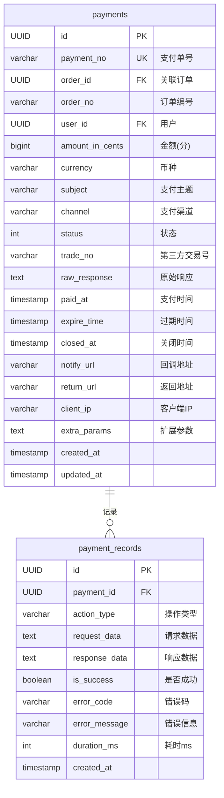
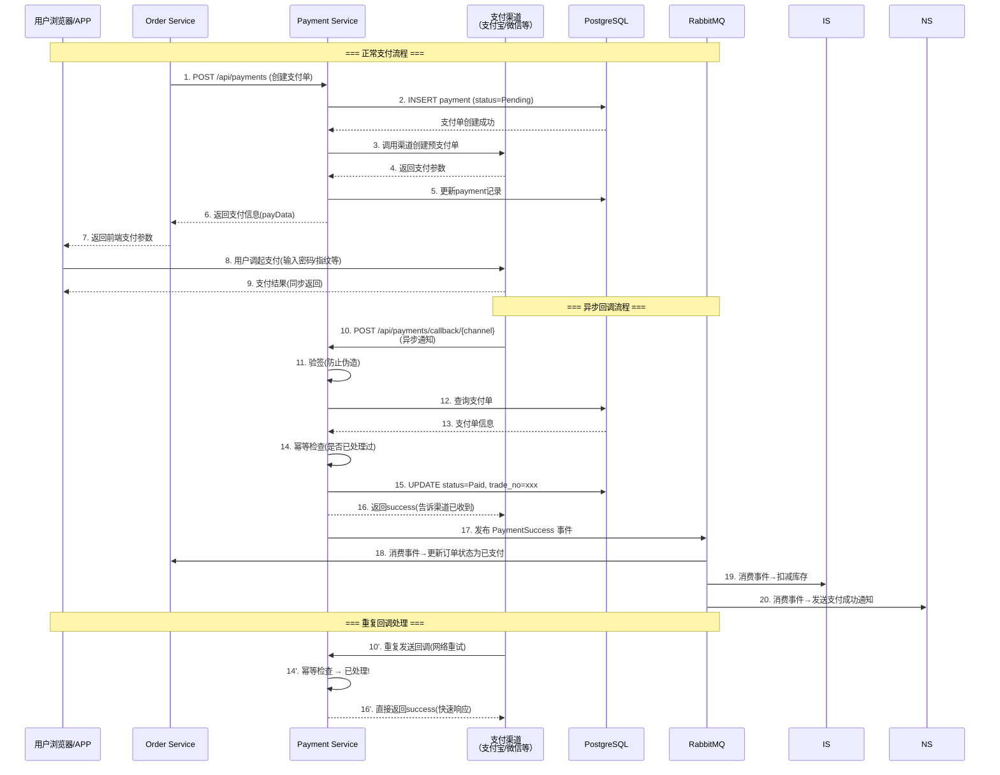
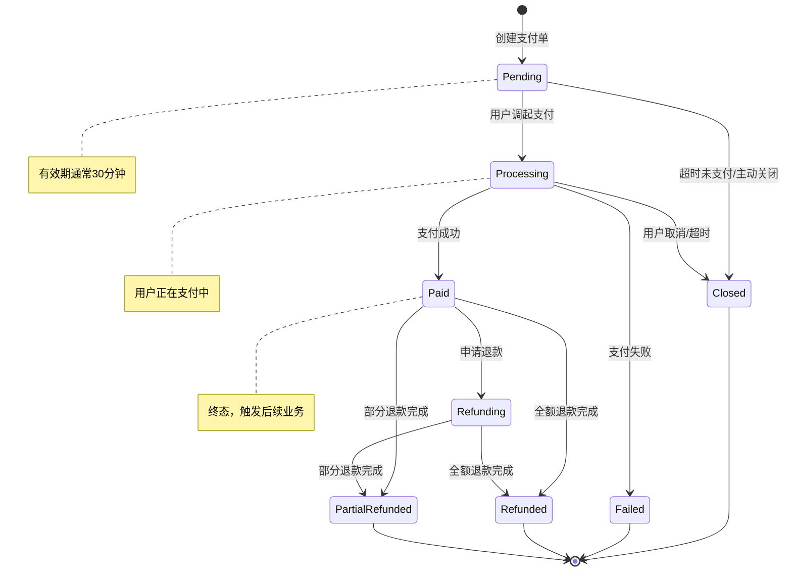

# CloudMall电商系统 - 支付服务(Payment Service)

> **本篇导读**：本文深入讲解CloudMall支付服务的完整实现，包括多渠道支付对接（支付宝/微信支付/银联/模拟支付）、支付流程设计、异步回调处理与验签、幂等性保证、退款流程以及安全防护措施。支付是电商系统的资金核心，对安全性和可靠性要求极高。

## 目录

- [1. 支付领域模型](#1-支付领域模型)
  - [1.1 Payment订单实体](#11-payment订单实体)
  - [1.2 PaymentRecord支付记录](#12-paymentrecord支付记录)
- [2. 支付渠道支持](#2-支付渠道支持)
  - [2.1 模拟支付（开发测试）](#21-模拟支付开发测试)
  - [2.2 支付宝集成思路](#22-支付宝集成思路)
  - [2.3 微信支付集成思路](#23-微信支付集成思路)
- [3. 支付流程设计](#3-支付流程设计)
  - [3.1 支付时序图](#31-支付时序图)
  - [3.2 回调验签机制](#32-回调验签机制)
  - [3.3 幂等性保证](#33-幂等性保证)
- [4. 支付状态机](#4-支付状态机)
- [5. 退款流程](#5-退款流程)
- [6. 安全考虑](#6-安全考虑)
- [7. 完整代码实现](#7-完整代码实现)
- [8. 测试要点](#8-测试要点)

---

## 1. 支付领域模型

### 1.1 Payment订单实体

```csharp
using System;
using CloudMall.Payment.Domain.Enums;

namespace CloudMall.Payment.Domain.Entities
{
    /// <summary>
    /// 支付单
    /// 每个订单创建时对应一个唯一的支付单
    /// </summary>
    public class Payment
    {
        public Guid Id { get; set; }

        /// <summary>
        /// 支付单号（唯一）
        /// 格式：PAY + 时间戳 + 随机数
        /// </summary>
        public string PaymentNo { get; set; }

        /// <summary>
        /// 关联的订单ID
        /// </summary>
        public Guid OrderId { get; set; }

        /// <summary>
        /// 关联的订单编号
        /// </summary>
        public string OrderNo { get; set; }

        /// <summary>
        /// 用户ID
        /// </summary>
        public Guid UserId { get; set; }

        /// <summary>
        /// 支付金额（单位：分，避免浮点精度问题）
        /// </summary>
        public long AmountInCents { get; set; }

        /// <summary>
        /// 支付金额（元，用于显示）
        /// </summary>
        public decimal Amount => AmountInCents / 100m;

        /// <summary>
        /// 币种（默认CNY）
        /// </summary>
        public string Currency { get; set; } = "CNY";

        /// <summary>
        /// 支付主题/商品描述
        /// </summary>
        public string Subject { get; set; }

        /// <summary>
        /// 支付渠道：alipay/wechat/unionpay/mock
        /// </summary>
        public string Channel { get; set; }

        /// <summary>
        /// 支付状态
        /// </summary>
        public PaymentStatus Status { get; set; }
            = PaymentStatus.Pending;

        /// <summary>
        /// 第三方交易号（支付成功后由渠道返回）
        /// </summary>
        public string TradeNo { get; set; }

        /// <summary>
        /// 第三方返回的原始数据（JSON）
        /// </summary>
        public string RawResponse { get; set; }

        /// <summary>
        /// 支付成功时间
        /// </summary>
        public DateTime? PaidAt { get; set; }

        /// <summary>
        /// 过期时间（未支付自动关闭）
        /// </summary>
        public DateTime? ExpireTime { get; set; }

        /// <summary>
        /// 关闭时间
        /// </summary>
        public DateTime? ClosedAt { get; set; }

        /// <summary>
        /// 通知URL（回调地址）
        /// </summary>
        public string NotifyUrl { get; set; }

        /// <summary>
        /// 返回URL（前端跳转地址）
        /// </summary>
        public string ReturnUrl { get; set; }

        /// <summary>
        /// 客户端IP
        /// </summary>
        public string ClientIp { get; set; }

        /// <summary>
        /// 扩展参数（JSON）
        /// </summary>
        public string ExtraParams { get; set; }

        /// <summary>
        /// 创建时间
        /// </summary>
        public DateTime CreatedAt { get; set; } = DateTime.UtcNow;

        /// <summary>
        /// 更新时间
        /// </summary>
        public DateTime UpdatedAt { get; set; } = DateTime.UtcNow;

        // 导航属性
        public ICollection<PaymentRecord> Records { get; set; }
            = new List<PaymentRecord>();
    }

    /// <summary>
    /// 支付状态枚举
    /// </summary>
    public enum PaymentStatus
    {
        Pending = 0,       // 待支付
        Processing = 5,   // 支付中（用户已调起支付）
        Paid = 10,        // 已支付
        Refunding = 20,   // 退款中
        Refunded = 30,    // 已退款
        PartialRefunded = 31, // 部分退款
        Closed = 90,      // 已关闭
        Failed = 91       // 支付失败
    }
}
```

### 1.2 PaymentRecord支付记录

```csharp
namespace CloudMall.Payment.Domain.Entities
{
    /// <summary>
    /// 支付记录
    /// 记录每次支付操作的详细日志，用于审计和对账
    /// </summary>
    public class PaymentRecord
    {
        public Guid Id { get; set; }
        public Guid PaymentId { get; set; }

        /// <summary>
        /// 操作类型：Create/Pay/Callback/Refund/Close/Query
        /// </summary>
        public string ActionType { get; set; }

        /// <summary>
        /// 请求数据（脱敏后）
        /// </summary>
        public string RequestData { get; set; }

        /// <summary>
        /// 响应数据
        /// </summary>
        public string ResponseData { get; set; }

        /// <summary>
        /// 是否成功
        /// </summary>
        public bool IsSuccess { get; set; }

        /// <summary>
        /// 错误码
        /// </summary>
        public string ErrorCode { get; set; }

        /// <summary>
        /// 错误信息
        /// </summary>
        public string ErrorMessage { get; set; }

        /// <summary>
        /// 耗时（毫秒）
        /// </summary>
        public int DurationMs { get; set; }

        /// <summary>
        /// 创建时间
        /// </summary>
        public DateTime CreatedAt { get; set; } = DateTime.UtcNow;
    }
}
```

### 1.3 ER关系图



---

## 2. 支付渠道支持

### 2.1 渠道抽象接口

```csharp
using System.Threading.Tasks;
using CloudMall.Service.Payment.DTOs;

namespace CloudMall.Payment.Infrastructure.Channels
{
    /// <summary>
    /// 支付渠道提供者接口
    /// 所有支付渠道（支付宝/微信/模拟等）都需要实现此接口
    /// </summary>
    public interface IPaymentProvider
    {
        /// <summary>
        /// 渠道标识
        /// </summary>
        string ChannelId { get; }

        /// <summary>
        /// 渠道名称
        /// </summary>
        string ChannelName { get; }

        /// <summary>
        /// 创建支付单（获取支付参数给前端调起支付）
        /// </summary>
        Task<PaymentCreateResult> CreatePaymentAsync(Payment payment);

        /// <summary>
        /// 查询支付状态（主动查询第三方）
        /// </summary>
        Task<PaymentQueryResult> QueryPaymentAsync(string paymentNo);

        /// <summary>
        /// 关闭支付单
        /// </summary>
        Task<PaymentCloseResult> ClosePaymentAsync(string paymentNo);

        /// <summary>
        /// 发起退款
        /// </summary>
        Task<PaymentRefundResult> RefundAsync(RefundRequest request);

        /// <summary>
        /// 处理异步回调通知
        /// </summary>
        Task<PaymentCallbackResult> HandleCallbackAsync(
            IDictionary<string, string> parameters);
    }

    #region DTOs

    public class PaymentCreateResult
    {
        public bool Success { get; set; }
        public string ErrorMessage { get; set; }

        /// <summary>
        /// 前端需要的支付参数（根据渠道不同格式不同）
        /// 支付宝: 返回表单HTML或APP支付参数
        /// 微信: 返回JSAPI参数或Native二维码
        /// </summary>
        public object PayData { get; set; }

        /// <summary>
        /// 二维码内容（扫码支付用）
        /// </summary>
        public string QrCodeContent { get; set; }
    }

    public class PaymentQueryResult
    {
        public bool Success { get; set; }
        public PaymentStatus Status { get; set; }
        public string TradeNo { get; set; }
        public long AmountInCents { get; set; }
        public DateTime? PaidAt { get; set; }
    }

    public class PaymentCloseResult
    {
        public bool Success { get; set; }
        public string ErrorMessage { get; set; }
    }

    public class PaymentRefundResult
    {
        public bool Success { get; set; }
        public string RefundNo { get; set; }
        public string TradeNo { get; set; }
        public string ErrorMessage { get; set; }
    }

    public class PaymentCallbackResult
    {
        public bool IsValid { get; set; }           // 签名验证是否通过
        public string PaymentNo { get; set; }       // 商户支付单号
        public string TradeNo { get; set; }         // 第三方交易号
        public PaymentStatus TradeStatus { get; set; }
        public long AmountInCents { get; set; }
        public DateTime? PaidAt { get; set; }
        public Dictionary<string, string> RawData { get; set; }
    }

    public class RefundRequest
    {
        public string PaymentNo { get; set; }
        public string RefundNo { get; set; }
        public long RefundAmountInCents { get; set; }
        public string Reason { get; set; }
        public RefundType RefundType { get; set; }
    }

    public enum RefundType
    {
        Full,       // 全额退款
        Partial     // 部分退款
    }

    #endregion
}
```

### 2.2 模拟支付Provider（开发测试用）

```csharp
using System;
using System.Collections.Generic;
using System.Linq;
using System.Threading.Tasks;
using Microsoft.Extensions.Logging;
using CloudMall.Payment.Domain.Entities;
using CloudMall.Payment.Infrastructure.Channels;

namespace CloudMall.Payment.Infrastructure.Channels.Providers
{
    /// <summary>
    /// 模拟支付提供者
    /// 用于开发和测试环境，不产生真实资金流转
    /// 生产环境必须替换为真实的支付渠道
    /// </summary>
    public class MockPaymentProvider : IPaymentProvider
    {
        private readonly ILogger<MockPaymentProvider> _logger;
        private readonly IDistributedCache _cache;
        private const string CALLBACK_CACHE_PREFIX = "mock:callback:";

        public string ChannelId => "mock";
        public string ChannelName => "模拟支付";

        public MockPaymentProvider(
            ILogger<MockPaymentProvider> logger,
            IDistributedCache cache)
        {
            _logger = logger;
            _cache = cache;
        }

        /// <summary>
        /// 创建模拟支付单
        /// 直接返回一个"支付成功"的模拟链接
        /// </summary>
        public async Task<PaymentCreateResult> CreatePaymentAsync(
            Payment payment)
        {
            _logger.LogInformation(
                "[Mock] 创建支付单: PaymentNo={PaymentNo}, Amount={Amount}分",
                payment.PaymentNo, payment.AmountInCents);

            // 生成一个模拟支付的回调URL
            // 开发者访问此URL即可模拟支付成功回调
            var mockCallbackUrl =
                $"/api/payments/mock/callback/{payment.PaymentNo}";

            return new PaymentCreateResult
            {
                Success = true,
                PayData = new
                {
                    redirectUrl = mockCallbackUrl,
                    message = "模拟支付环境 - 访问redirectUrl完成支付",
                    amount = payment.Amount,
                    paymentNo = payment.PaymentNo
                },
                QrCodeContent = mockCallbackUrl
            };
        }

        /// <summary>
        /// 查询支付状态
        /// </summary>
        public async Task<PaymentQueryResult> QueryPaymentAsync(string paymentNo)
        {
            // 从缓存中查询模拟支付结果
            var cached = await _cache.GetStringAsync(
                $"{CALLBACK_CACHE_PREFIX}{paymentNo}");

            if (string.IsNullOrEmpty(cached))
            {
                return new PaymentQueryResult
                {
                    Success = true,
                    Status = PaymentStatus.Pending
                };
            }

            var result = System.Text.Json.JsonSerializer
                .Deserialize<MockPaymentData>(cached);

            return new PaymentQueryResult
            {
                Success = true,
                Status = result?.IsPaid == true
                    ? PaymentStatus.Paid : PaymentStatus.Pending,
                TradeNo = $"MOCK_TRADE_{DateTime.Now:yyyyMMddHHmmss}",
                AmountInCents = result?.Amount ?? 0,
                PaidAt = result?.PaidAt
            };
        }

        /// <summary>
        /// 关闭支付单
        /// </summary>
        public Task<PaymentCloseResult> ClosePaymentAsync(string paymentNo)
        {
            _logger.LogInformation("[Mock] 关闭支付单: {PaymentNo}", paymentNo);
            return Task.FromResult(new PaymentCloseResult { Success = true });
        }

        /// <summary>
        /// 模拟退款
        /// </summary>
        public Task<PaymentRefundResult> RefundAsync(RefundRequest request)
        {
            _logger.LogInformation(
                "[Mock] 退款: PaymentNo={PaymentNo}, Amount={Amount}分",
                request.PaymentNo, request.RefundAmountInCents);

            return Task.FromResult(new PaymentRefundResult
            {
                Success = true,
                RefundNo = request.RefundNo,
                TradeNo = $"MOCK_REFUND_{DateTime.Now:yyyyMMddHHmmss}"
            });
        }

        /// <summary>
        /// 处理模拟回调
        /// </summary>
        public async Task<PaymentCallbackResult> HandleCallbackAsync(
            IDictionary<string, string> parameters)
        {
            var paymentNo = parameters.GetValueOrDefault("payment_no");

            _logger.LogInformation(
                "[Mock] 收到支付回调: PaymentNo={PaymentNo}", paymentNo);

            // 缓存支付结果
            var data = new MockPaymentData
            {
                IsPaid = true,
                Amount = long.Parse(parameters.GetValueOrDefault(
                    "total_amount", "0")),
                PaidAt = DateTime.UtcNow,
                TradeNo = $"MOCK_{Guid.NewGuid():N}"
            };

            await _cache.SetStringAsync(
                $"{CALLBACK_CACHE_PREFIX}{paymentNo}",
                System.Text.Json.JsonSerializer.Serialize(data),
                new DistributedCacheEntryOptions
                {
                    AbsoluteExpirationRelativeToNow = TimeSpan.FromDays(7)
                });

            return new PaymentCallbackResult
            {
                IsValid = true,
                PaymentNo = paymentNo,
                TradeNo = data.TradeNo,
                TradeStatus = PaymentStatus.Paid,
                AmountInCents = data.Amount,
                PaidAt = data.PaidAt,
                RawData = new Dictionary<string, string>(parameters)
            };
        }
    }

    internal class MockPaymentData
    {
        public bool IsPaid { get; set; }
        public long Amount { get; set; }
        public DateTime? PaidAt { get; set; }
        public string TradeNo { get; set; }
    }
}
```

---

## 3. 支付流程设计

### 3.1 支付时序图



### 3.2 回调验签机制

```csharp
/// <summary>
/// 支付回调验签服务
/// 防止伪造回调通知和参数篡改
/// </summary>
public class CallbackVerificationService
{
    private readonly ILogger<CallbackVerificationService> _logger;
    private readonly Dictionary<string, IChannelVerifier> _verifiers;

    public CallbackVerificationService(
        ILogger<CallbackVerificationService> logger,
        IEnumerable<IChannelVerifier> verifiers)
    {
        _logger = logger;
        _verifiers = verifiers.ToDictionary(v => v.ChannelId);
    }

    /// <summary>
    /// 验证回调签名
    /// </summary>
    public VerificationResult Verify(
        string channel,
        IDictionary<string, string> parameters)
    {
        if (!_verifiers.TryGetValue(channel, out var verifier))
        {
            _logger.LogError("未知的支付渠道: {Channel}", channel);
            return VerificationResult.Failed("未知的支付渠道");
        }

        try
        {
            var isValid = verifier.VerifySignature(parameters);

            if (!isValid)
            {
                _logger.LogWarning(
                    "支付回调签名验证失败! Channel={Channel}, Params={@Params}",
                    channel, MaskSensitiveData(parameters));
                return VerificationResult.Failed("签名验证失败");
            }

            _logger.LogDebug("支付回调签名验证通过: Channel={Channel}", channel);
            return VerificationResult.Success();
        }
        catch (Exception ex)
        {
            _logger.LogError(ex,
                "支付回调验签过程异常: Channel={Channel}", channel);
            return VerificationResult.Failed($"验签异常: {ex.Message}");
        }
    }

    /// <summary>
    /// 脱敏处理敏感数据
    /// </summary>
    private static Dictionary<string, string> MaskSensitiveData(
        IDictionary<string, string> data)
    {
        var sensitiveKeys = new[] { "sign", "key", "token", "password" };
        return data.ToDictionary(
            k => k,
            v => sensitiveKeys.Any(s =>
                k.Contains(s, StringComparison.OrdinalIgnoreCase))
                ? "***" : v);
    }
}

public record VerificationResult(bool IsValid, string Error = null)
{
    public static VerificationResult Success() =>
        new(true);
    public static VerificationResult Failed(string error) =>
        new(false, error);
}
```

### 3.3 幂等性保证

```csharp
/// <summary>
/// 支付回调处理器
/// 核心要求：幂等性！同一笔回调多次处理结果一致
/// </summary>
public class PaymentCallbackHandler
{
    private readonly IPaymentRepository _paymentRepo;
    private readonly IEventBus _eventBus;
    private readonly ILogger<PaymentCallbackHandler> _logger;

    public PaymentCallbackHandler(
        IPaymentRepository paymentRepo,
        IEventBus eventBus,
        ILogger<PaymentCallbackHandler> logger)
    {
        _paymentRepo = paymentRepo;
        _eventBus = eventBus;
        _logger = logger;
    }

    /// <summary>
    /// 处理支付回调（保证幂等）
    /// </summary>
    public async Task<CallbackHandleResult> HandleAsync(
        PaymentCallbackResult callback)
    {
        // 1. 查找支付单
        var payment = await _paymentRepo.GetByPaymentNoAsync(
            callback.PaymentNo);

        if (payment == null)
        {
            _logger.LogWarning(
                "回调中的支付单不存在: PaymentNo={PaymentNo}",
                callback.PaymentNo);
            return CallbackHandleResult.NotFound();
        }

        // 2. 幂等检查：如果已经是终态，直接返回成功
        if (IsTerminalState(payment.Status))
        {
            if (callback.TradeStatus == PaymentStatus.Paid &&
                payment.Status == PaymentStatus.Paid)
            {
                // 已支付且trade_no一致 → 真正的重复回调
                _logger.LogInformation(
                    "重复回调，已处理: PaymentNo={PaymentNo}, TradeNo={TradeNo}",
                    callback.PaymentNo, callback.TradeNo);
                return CallbackHandleResult.Duplicate();
            }

            // 状态不一致 → 记录告警
            _logger.LogWarning(
                "回调状态与本地不一致! PaymentNo={PaymentNo}, " +
                "Local={Local}, Callback={Callback}",
                callback.PaymentNo, payment.Status, callback.TradeStatus);

            return CallbackHandleResult.StateMismatch(
                payment.Status, callback.TradeStatus);
        }

        // 3. 校验金额一致性（防篡改）
        if (callback.AmountInCents != payment.AmountInCents)
        {
            _logger.LogError(
                "回调金额不一致! PaymentNo={PaymentNo}, " +
                "Expected={Expected}, Actual={Actual}",
                callback.PaymentNo,
                payment.AmountInCents,
                callback.AmountInCents);

            // 金额不一致是严重安全问题！
            throw new SecurityException("支付金额校验失败");
        }

        // 4. 更新支付单状态
        payment.Status = PaymentStatus.Paid;
        payment.TradeNo = callback.TradeNo;
        payment.PaidAt = callback.PaidAt ?? DateTime.UtcNow;
        payment.RawResponse = System.Text.Json.JsonSerializer
            .Serialize(callback.RawData);
        payment.UpdatedAt = DateTime.UtcNow;

        await _paymentRepo.UpdateAsync(payment);

        // 5. 记录操作日志
        await _paymentRepo.AddRecordAsync(new PaymentRecord
        {
            PaymentId = payment.Id,
            ActionType = "Callback",
            ResponseData = System.Text.Json.JsonSerializer.Serialize(callback),
            IsSuccess = true,
            CreatedAt = DateTime.UtcNow
        });

        // 6. 发布支付成功事件（异步解耦）
        try
        {
            await _eventBus.PublishAsync(new PaymentCompletedEvent
            {
                PaymentId = payment.Id,
                PaymentNo = payment.PaymentNo,
                OrderId = payment.OrderId,
                OrderNo = payment.OrderNo,
                UserId = payment.UserId,
                AmountInCents = payment.AmountInCents,
                Channel = payment.Channel,
                TradeNo = callback.TradeNo,
                PaidAt = payment.PaidAt.Value
            });

            _logger.LogInformation(
                "支付成功处理完成: PaymentNo={PaymentNo}, OrderNo={OrderNo}, " +
                "TradeNo={TradeNo}, Amount={Amount}分",
                payment.PaymentNo, payment.OrderNo,
                callback.TradeNo, payment.AmountInCents);
        }
        catch (Exception ex)
        {
            _logger.LogError(ex,
                "发布支付成功事件失败: PaymentNo={PaymentNo}",
                payment.PaymentNo);
            // 事件发布失败不影响主流程
        }

        return CallbackHandleResult.Success();
    }

    /// <summary>
    /// 判断是否为终态（不可再变更的状态）
    /// </summary>
    private static bool IsTerminalState(PaymentStatus status) =>
        status is PaymentStatus.Paid
            or PaymentStatus.Closed
            or PaymentStatus.Failed
            or PaymentStatus.Refunded
            or PaymentStatus.PartialRefunded;
}
```

---

## 4. 支付状态机



---

## 5. 退款流程

```csharp
/// <summary>
/// 退款服务
/// </summary>
public class RefundService : IRefundService
{
    private readonly IPaymentRepository _paymentRepo;
    private readonly IPaymentProviderFactory _providerFactory;
    private readonly IEventBus _eventBus;
    private readonly ILogger<RefundService> _logger;

    public RefundService(
        IPaymentRepository paymentRepo,
        IPaymentProviderFactory providerFactory,
        IEventBus eventBus,
        ILogger<RefundService> logger)
    {
        _paymentRepo = paymentRepo;
        _providerFactory = providerFactory;
        _eventBus = eventBus;
        _logger = logger;
    }

    /// <summary>
    /// 发起退款
    /// </summary>
    public async Task<RefundResultDto> RefundAsync(RefundDto request)
    {
        // 1. 查找原支付单
        var payment = await _paymentRepo.GetByIdAsync(request.PaymentId);
        if (payment == null)
            throw new NotFoundException("支付单不存在");

        // 2. 校验可退款条件
        if (payment.Status != PaymentStatus.Paid)
            throw new BusinessException("只有已支付的订单才能退款");

        // 3. 校验退款金额
        var refundableAmount = payment.AmountInCents -
            await _paymentRepo.GetTotalRefundedAmountAsync(payment.Id);

        if (request.RefundAmount > refundableAmount)
            throw new BusinessException(
                $"退款金额超过可退余额，最多可退{refundableAmount / 100m}元");

        // 4. 生成退款单号
        var refundNo = GenerateRefundNo();

        // 5. 调用支付渠道退款
        var provider = _providerFactory.GetProvider(payment.Channel);
        var refundResult = await provider.RefundAsync(new RefundRequest
        {
            PaymentNo = payment.PaymentNo,
            RefundNo = refundNo,
            RefundAmountInCents = request.RefundAmount,
            Reason = request.Reason,
            RefundType = request.RefundAmount >= refundableAmount
                ? RefundType.Full : RefundType.Partial
        });

        if (!refundResult.Success)
        {
            _logger.LogError(
                "退款请求失败: PaymentNo={PaymentNo}, Error={Error}",
                payment.PaymentNo, refundResult.ErrorMessage);
            throw new BusinessException(
                $"退款失败: {refundResult.ErrorMessage}");
        }

        // 6. 更新支付单状态
        var totalRefunded = await _paymentRepo
            .GetTotalRefundedAmountAsync(payment.Id) + request.RefundAmount;

        payment.Status = totalRefunded >= payment.AmountInCents
            ? PaymentStatus.Refunded
            : PaymentStatus.PartialRefunded;
        payment.UpdatedAt = DateTime.UtcNow;
        await _paymentRepo.UpdateAsync(payment);

        // 7. 记录退款记录
        await _paymentRepo.AddRecordAsync(new PaymentRecord
        {
            PaymentId = payment.Id,
            ActionType = "Refund",
            RequestData = System.Text.Json.JsonSerializer.Serialize(request),
            ResponseData = System.Text.Json.JsonSerializer.Serialize(refundResult),
            IsSuccess = true,
            CreatedAt = DateTime.UtcNow
        });

        // 8. 发布退款事件
        await _eventBus.PublishAsync(new PaymentRefundedEvent
        {
            PaymentId = payment.Id,
            OrderId = payment.OrderId,
            RefundNo = refundNo,
            RefundAmount = request.RefundAmount,
            RefundType = totalRefunded >= payment.AmountInCents
                ? "FULL" : "PARTIAL",
            RefundedAt = DateTime.UtcNow
        });

        _logger.LogInformation(
            "退款成功: PaymentNo={PaymentNo}, RefundNo={RefundNo}, " +
            "Amount={Amount}分",
            payment.PaymentNo, refundNo, request.RefundAmount);

        return new RefundResultDto
        {
            RefundNo = refundNo,
            RefundAmount = request.RefundAmount / 100m,
            Status = payment.Status
        };
    }

    private static string GenerateRefundNo()
    {
        return $"RF{DateTime.Now:yyyyMMddHHmmss}" +
               $"{Random.Shared.Next(1000, 9999)}";
    }
}
```

---

## 6. 安全考虑

| 安全措施 | 实现方式 | 说明 |
|---------|---------|------|
| **HTTPS强制** | Nginx/API Gateway配置 | 回调URL强制HTTPS |
| **回调验签** | RSA/MD5签名验证 | 防止伪造回调 |
| **金额校验** | 回调金额与本地对比 | 防止金额篡改 |
| **IP白名单** | 支付渠道回调IP限制 | 只接受官方IP |
| **幂等处理** | 状态机+去重 | 防止重复到账 |
| **敏感数据加密** | AES加密存储 | 卡号/密码等 |
| **日志脱敏** | 正则过滤 | 不打印完整卡号 |
| **限流保护** | 令牌桶算法 | 防止刷单攻击 |

---

## 7. 完整代码实现

### 7.1 PaymentController

```csharp
[ApiController]
[Route("api/[controller]")]
public class PaymentsController : ControllerBase
{
    private readonly IPaymentService _paymentService;
    private readonly IRefundService _refundService;
    private readonly IPaymentProviderFactory _providerFactory;

    public PaymentsController(
        IPaymentService paymentService,
        IRefundService refundService,
        IPaymentProviderFactory providerFactory)
    {
        _paymentService = paymentService;
        _refundService = refundService;
        _providerFactory = providerFactory;
    }

    /// <summary>
    /// 创建支付单
    /// POST /api/payments
    /// </summary>
    [HttpPost]
    [Authorize]
    public async Task<ActionResult<PaymentCreateResponseDto>> CreatePayment(
        [FromBody] CreatePaymentRequestDto request)
    {
        var userId = GetCurrentUserId();
        var result = await _paymentService.CreatePaymentAsync(userId, request);
        return Ok(result);
    }

    /// <summary>
    /// 查询支付状态
    /// GET /api/payments/{paymentNo}/status
    /// </summary>
    [HttpGet("{paymentNo}/status")]
    [Authorize]
    public async Task<ActionResult<PaymentStatusDto>> QueryStatus(
        string paymentNo)
    {
        var result = await _paymentService.QueryStatusAsync(paymentNo);
        return Ok(result);
    }

    /// <summary>
    /// 支付回调（各渠道统一入口）
    /// POST /api/payments/callback/{channel}
    /// 由支付渠道服务器调用，不需要认证
    /// </summary>
    [HttpPost("callback/{channel}")]
    [AllowAnonymous]
    public async Task<IActionResult> HandleCallback(
        string channel,
        [FromForm] IFormCollection form)
    {
        _logger.LogInformation(
            "收到支付回调: Channel={Channel}", channel);

        try
        {
            // 1. 将表单数据转为字典
            var parameters = form.ToDictionary(
                k => k.Key,
                v => v.Value.ToString());

            // 2. 验签
            var verification = _callbackVerification.Verify(channel, parameters);
            if (!verification.IsValid)
            {
                _logger.LogWarning("回调验签失败: Channel={Channel}", channel);
                return Content("FAIL", "text/plain");
            }

            // 3. 解析回调数据
            var provider = _providerFactory.GetProvider(channel);
            var callbackResult = await provider.HandleCallbackAsync(parameters);

            if (!callbackResult.IsValid)
            {
                return Content("FAIL", "text/plain");
            }

            // 4. 处理回调（含幂等检查）
            var handleResult = await _callbackHandler.HandleAsync(callbackResult);

            // 5. 返回结果（各渠道格式可能不同）
            return GetChannelResponse(channel, handleResult);
        }
        catch (Exception ex)
        {
            _logger.LogError(ex, "处理支付回调异常: Channel={Channel}", channel);
            return Content("FAIL", "text/plain");
        }
    }

    /// <summary>
    /// 模拟支付回调（仅测试环境使用）
    /// GET /api/payments/mock/callback/{paymentNo}
    /// </summary>
    [HttpGet("mock/callback/{paymentNo}")]
    [AllowAnonymous]
    [ApiExplorerSettings(GroupName = "Mock")]
    public async Task<IActionResult> MockCallback(string paymentNo)
    {
        if (!Environment.IsDevelopment())
            return NotFound();

        var parameters = new Dictionary<string, string>
        {
            ["payment_no"] = paymentNo,
            ["total_amount"] = "10000",
            ["trade_status"] = "TRADE_SUCCESS"
        };

        var mockProvider = _providerFactory.GetProvider("mock") as MockPaymentProvider;
        var callbackResult = await mockProvider.HandleCallbackAsync(parameters);
        var handleResult = await _callbackHandler.HandleAsync(callbackResult);

        return Content($@"
            <!DOCTYPE html>
            <html><head><title>模拟支付结果</title></head>
            <body style='text-align:center;padding:50px;font-family:sans-serif'>
                <h1>模拟支付{(handleResult.IsSuccess ? "成功" : "失败")}</h1>
                <p>支付单号: {paymentNo}</p>
                <p><a href='/'>返回首页</a></p>
            </body></html>", "text/html");
    }

    /// <summary>
    /// 发起退款
    /// POST /api/payments/refund
    /// </summary>
    [HttpPost("refund")]
    [Authorize(Roles = "Admin,Customer")]
    public async Task<ActionResult<RefundResultDto>> Refund(
        [FromBody] RefundDto request)
    {
        var result = await _refundService.RefundAsync(request);
        return Ok(result);
    }

    private static IActionResult GetChannelResponse(
        string channel, CallbackHandleResult result)
    {
        // 不同渠道需要返回不同的成功/失败格式
        return channel.ToLower() switch
        {
            "alipay" => Content(result.IsSuccess ? "success" : "fail",
                "text/plain"),
            "wechat" => Content(
                $"<xml><return_code><![CDATA[{(result.IsSuccess ? "SUCCESS" : "FAIL")}]]></return_code></xml>",
                "application/xml"),
            _ => Content(result.IsSuccess ? "SUCCESS" : "FAIL",
                "text/plain")
        };
    }
}
```

### 7.2 Program.cs关键配置

```csharp
var builder = WebApplication.CreateBuilder(args);

// 注册数据库
builder.Services.AddDbContext<PaymentDbContext>(options =>
    options.UseNpgsql(builder.Configuration.GetConnectionString("DefaultConnection")));

// 注册支付渠道提供者（策略模式）
builder.Services.AddScoped<IPaymentProvider, MockPaymentProvider>();
// builder.Services.AddScoped<AlipayPaymentProvider>();
// builder.Services.AddScoped<WeChatPaymentProvider>();

// 注册工厂
builder.Services.AddSingleton<IPaymentProviderFactory, PaymentProviderFactory>();

// 注册服务
builder.Services.AddScoped<IPaymentService, PaymentService>();
builder.Services.AddScoped<IRefundService, RefundService>();

// 注册验签服务
builder.Services.AddScoped<CallbackVerificationService>();
builder.Services.AddScoped<PaymentCallbackHandler>();

// Swagger
builder.Services.AddSwaggerGen(c =>
{
    c.SwaggerDoc("v1", new OpenApiInfo
    {
        Title = "CloudMall Payment Service API",
        Version = "v1"
    });
});

var app = builder.Build();
app.UseSwagger();
app.MapControllers();
app.Run();
```

---

## 8. 测试要点

### 8.1 测试场景矩阵

| 场景 | 输入 | 预期输出 | 优先级 |
|-----|------|---------|--------|
| 创建支付单 | 有效订单+金额 | 返回支付参数 | P0 |
| 模拟支付回调 | 访问mock URL | 支付状态变为Paid | P0 |
| 重复回调 | 相同参数调用2次 | 第2次幂等返回 | P0 |
| 签名篡改 | 修改sign参数 | 验签失败拒绝 | P0 |
| 金额篡改 | 修改amount参数 | 金额校验失败 | P0 |
| 全额退款 | 已支付订单 | 状态变Refunded | P0 |
| 部分退款 | 退款部分金额 | 状态变PartialRefunded | P1 |
| 超时关闭 | 30分钟未支付 | 状态变Closed | P1 |
| 不存在的支付单 | 随机PaymentNo | 返回404 | P0 |

### 8.2 安全测试清单

- [ ] 回调签名伪造测试
- [ ] 回调参数篡改测试（金额/订单号）
- [ ] 重放攻击测试（相同回调多次发送）
- [ ] 回调URL越权访问测试
- [ ] 并发回调竞态条件测试
- [ ] 退款金额超额测试

---

## 总结

本文详细讲解了CloudMall支付服务的完整实现：

1. **领域模型**：Payment支付单 + PaymentRecord操作记录
2. **多渠道支持**：策略模式抽象接口，Mock/支付宝/微信可插拔
3. **支付流程**：创建→调起→回调→验签→更新→发布事件
4. **幂等保证**：状态机终态判断 + 去重处理
5. **安全防护**：HTTPS + 验签 + 金额校验 + IP白名单 + 日志脱敏
6. **退款流程**：全额/部分退款 + 状态管理 + 事件通知

**下一篇预告**：[07-库存服务(Inventory Service)](./07-库存服务(Inventory%20Service).md) - 深入讲解高并发下的库存锁定、释放、扣减以及三种并发控制方案。

---

> **双向链接**：
> - [[04-订单服务(Order Service)](./04-订单服务(Order%20Service).md)] - 上游服务：下单创建支付单
> - [[../03-进阶篇/10-分布式系统设计]] - 分布式系统基础知识
> - [[01-系统架构与技术选型](./01-系统架构与技术选型.md)] - 项目总览
> - [[07-库存服务(Inventory Service)](./07-库存服务(Inventory%20Service).md)] - 下一篇文章
